Examples 57-80 close out this topic at real-tool scale: a CSV analyzer split into a pure core and an
I/O shell (co-28, co-01), purity and the functor laws checked as properties across hundreds of
generated inputs using nothing but stdlib `random` (co-01, co-03, co-25), a persistent binary tree and
a Redux-style reducer (co-05, co-01, co-04), Kleisli composition and a `@curry` decorator (co-11,
co-27, co-23, co-09, co-18), a lazy infinite prime sieve and a three-stage `yield` pull pipeline
(co-15, co-16), a bounded LRU memoizer and a trampoline standing in for CPython's missing tail-call
optimization (co-17, co-18, co-14), an expression-AST interpreter dispatched with `match`/`case`
(co-20, co-21), `Option` and `Result` chained do-style with both a short-circuiting and an
error-accumulating validation pipeline (co-22, co-27, co-24, co-23, co-26), a point-free combinator
library and a deep `pipe` vs. nested-calls comparison (co-19, co-12, co-11), the honest performance
cost of immutability measured directly, a refactor away from shared mutable state, decorator-stack
ordering, a laziness trade-off shown from both sides, `Option` vs. `Result` on the identical pipeline,
and a capstone-preview log analyzer combining every pattern from this topic into one tool (co-04,
co-05, co-28, co-18, co-11, co-15, co-22, co-23, co-27, co-26). Every example below is a complete,
self-contained `example.py` colocated under `learning/code/ex-NN-slug/`, run with `python3 example.py`
to capture the **Output** block shown, and verified a second way with a colocated `test_example.py`
under `pytest -q`.

---

### Example 57: A CSV Analyzer Split into a Pure Core and an I/O Shell

_ex-57 &middot; exercises co-28, co-01_

This topic's earlier functional-core/imperative-shell splits (Example 29, Example 76) worked on tiny
routines; this example applies the same split to a small but realistic tool. `parse_sales`,
`total_by_product`, and `format_report` are pure functions a test can call directly with a string
literal, while `run_shell` is the one function that touches `print`.

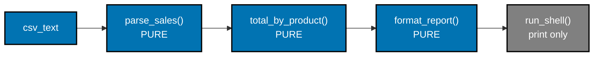

```python
"""Example 57: A CSV Analyzer Split into a Pure Core and an I/O Shell."""

from dataclasses import dataclass  # => @dataclass(frozen=True) builds the immutable Sale record


@dataclass(frozen=True)  # => an immutable value object -- no sale record mutates after parsing
class Sale:  # => one parsed CSV row
    product: str  # => the product name column
    amount: float  # => the sale amount column


def parse_sales(csv_text: str) -> list[Sale]:  # => PURE CORE: text in, data out, zero I/O
    rows = csv_text.strip().splitlines()[1:]  # => strips the header row, keeps only data rows
    sales: list[Sale] = []  # => the accumulator this pure function builds and returns
    for row in rows:  # => walks every data row exactly once
        product, amount = row.split(",")  # => splits "apple,10.0" into two fields
        sales.append(Sale(product=product, amount=float(amount)))  # => builds one immutable Sale
    return sales  # => a plain list -- testable with a string literal, no file needed


def total_by_product(sales: list[Sale]) -> dict[str, float]:  # => PURE CORE: aggregate step
    totals: dict[str, float] = {}  # => the running per-product total, local to this call
    for sale in sales:  # => folds every sale into the totals dict
        totals[sale.product] = totals.get(sale.product, 0.0) + sale.amount  # => accumulates per product
    return totals  # => a fresh dict -- the input list itself is never mutated


def format_report(totals: dict[str, float]) -> str:  # => PURE CORE: data -> text, still no I/O
    lines = [f"{product}: {amount:.2f}" for product, amount in sorted(totals.items())]  # => one line per product
    return "\n".join(lines)  # => a plain string -- the shell decides how to display it


def run_shell(csv_text: str) -> None:  # => the IMPERATIVE SHELL -- the ONLY function that prints
    sales = parse_sales(csv_text)  # => delegates to the pure core
    totals = total_by_product(sales)  # => delegates to the pure core
    report = format_report(totals)  # => delegates to the pure core
    print(report)  # => the topic's single I/O side effect, isolated to this one line


csv_text = "product,amount\napple,10.0\nbanana,5.0\napple,3.0\n"  # => stands in for a real file's contents
# => this is the functional-core/imperative-shell pattern (co-28) at real-tool scale
run_shell(csv_text)  # => Output: apple: 13.00 then banana: 5.00
```

**Output**:

```text
apple: 13.00
banana: 5.00
```

```python
"""Example 57: pytest verification for A CSV Analyzer Split into a Pure Core and an I/O Shell."""

from example import format_report, parse_sales, total_by_product


def test_pure_core_needs_no_file_and_no_mocking() -> None:
    csv_text = "product,amount\nx,1.0\nx,2.0\n"
    sales = parse_sales(csv_text)
    totals = total_by_product(sales)
    assert totals == {"x": 3.0}
    assert format_report(totals) == "x: 3.00"


# => Run: pytest -- Output: 1 passed
```

**Verify**: `pytest -q`

**Output**:

```text
1 passed
```

**Key takeaway**: A tool built as pure functions plus one thin I/O shell is testable with plain string
literals -- no file fixtures, no mocking, no capturing stdout.

**Why it matters**: Real tools read files, hit databases, or call APIs, which is exactly what makes
naive implementations hard to test. Isolating every side effect into one shell function while keeping
`parse_sales`, `total_by_product`, and `format_report` pure means the bulk of the logic -- the part
most likely to have bugs -- is tested with ordinary function calls, not integration fixtures.

---

### Example 58: Property-Testing Purity Without a Third-Party Library

_ex-58 &middot; exercises co-01, co-03_

The syllabus for this example names Hypothesis, but this repository's Python examples are stdlib-only,
so this example builds the same idea -- checking a property across many generated inputs -- with
`random.seed` plus a list comprehension. `normalize_score` is called twice on the same 200
pseudo-random inputs, and the two runs must match exactly for purity to hold.

```python
"""Example 58: Property-Testing Purity Without a Third-Party Library."""

import random  # => stdlib source of pseudo-random test inputs -- no third-party library needed


def normalize_score(raw: int) -> int:  # => the function under test: clamps a raw score into 0..100
    return max(0, min(100, raw))  # => pure: same raw always clamps to the same result


random.seed(1234)  # => a FIXED seed makes this "random" test fully reproducible on every run
generated_inputs = [random.randint(-500, 500) for _ in range(200)]  # => 200 pseudo-random raw scores

first_pass = [normalize_score(x) for x in generated_inputs]  # => calls the function ONCE per input
second_pass = [normalize_score(x) for x in generated_inputs]  # => calls it AGAIN, same inputs, later

purity_property_holds = first_pass == second_pass  # => THE property: two independent runs agree exactly

# => property-based testing checks an invariant across MANY generated inputs, not one
print(purity_property_holds)  # => Output: True -- purity verified across all 200 generated inputs, not one
print(len(generated_inputs))  # => Output: 200 -- a property test checks MANY cases, not a single example
```

**Output**:

```text
True
200
```

```python
"""Example 58: pytest verification for Property-Testing Purity Without a Third-Party Library."""

import random

from example import normalize_score


def test_purity_holds_across_many_generated_inputs() -> None:
    random.seed(99)  # => a different fixed seed than example.py, still fully reproducible
    inputs = [random.randint(-1000, 1000) for _ in range(500)]
    first_pass = [normalize_score(x) for x in inputs]
    second_pass = [normalize_score(x) for x in inputs]
    assert first_pass == second_pass


# => Run: pytest -- Output: 1 passed
```

**Verify**: `pytest -q`

**Output**:

```text
1 passed
```

**Key takeaway**: A property test replaces "does this one example work" with "does this invariant hold
across hundreds of generated examples," and a fixed `random.seed` keeps that check fully reproducible
without needing a third-party library.

**Why it matters**: A single hand-picked example can pass by coincidence; testing the same invariant
across 200-500 pseudo-random inputs makes that far less likely. Hypothesis automates input generation
and shrinking beyond what this stdlib version offers, but the core idea -- generate many inputs, assert
one property holds for all of them -- is available in plain Python with zero dependencies.

---

### Example 59: A Persistent Binary Tree With a Structural-Sharing Update

_ex-59 &middot; exercises co-05_

Example 30 showed O(1) structural sharing on a linked list; this example generalizes the same idea to
a branching structure. Inserting into a binary search tree rebuilds only the nodes on the path to the
new leaf -- every untouched sibling subtree is the exact same object as before the insert.

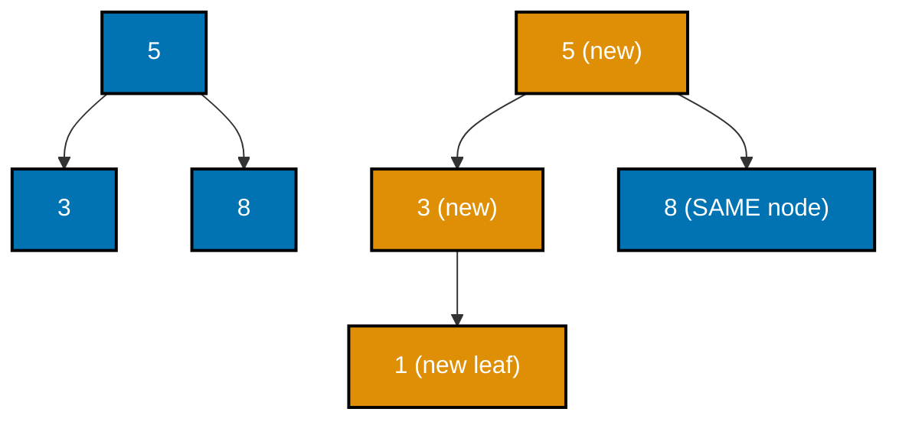

```python
"""Example 59: A Persistent Binary Tree With a Structural-Sharing Update."""

from __future__ import annotations  # => enables the quoted 'Tree | None' forward references below

from dataclasses import dataclass  # => @dataclass(frozen=True) builds the immutable Tree node


@dataclass(frozen=True)  # => an immutable binary search tree node
class Tree:  # => the node type itself
    value: int  # => this node's own value
    left: "Tree | None"  # => the left subtree, or None
    right: "Tree | None"  # => the right subtree, or None


def insert(tree: "Tree | None", value: int) -> Tree:  # => builds a NEW path, reuses the rest
    if tree is None:  # => base case: an empty spot becomes a new leaf
        return Tree(value=value, left=None, right=None)  # => the freshly-created leaf
    if value < tree.value:  # => goes left -- only the LEFT spine gets rebuilt
        return Tree(value=tree.value, left=insert(tree.left, value), right=tree.right)  # => right subtree REUSED
    if value > tree.value:  # => goes right -- only the RIGHT spine gets rebuilt
        return Tree(value=tree.value, left=tree.left, right=insert(tree.right, value))  # => left subtree REUSED
    return tree  # => value already present -- no change needed, return the SAME node


def to_sorted_list(tree: "Tree | None") -> list[int]:  # => in-order walk, for verification only
    if tree is None:  # => base case: an empty subtree contributes nothing
        return []  # => an empty list, the recursion's base result
    return to_sorted_list(tree.left) + [tree.value] + to_sorted_list(tree.right)  # => left, self, right


root_a = insert(insert(insert(None, 5), 3), 8)  # => builds {5: left=3, right=8}
root_b = insert(root_a, 1)  # => inserts 1, which goes LEFT of 3

# => persistent trees generalize the persistent list's O(1)-sharing idea to branching structures
print(to_sorted_list(root_a))  # => Output: [3, 5, 8]
print(to_sorted_list(root_b))  # => Output: [1, 3, 5, 8]
print(root_b.right is root_a.right)  # => Output: True -- the untouched right subtree (8) is REUSED
```

**Output**:

```text
[3, 5, 8]
[1, 3, 5, 8]
True
```

```python
"""Example 59: pytest verification for A Persistent Binary Tree With a Structural-Sharing Update."""

from example import insert, to_sorted_list


def test_insert_shares_the_untouched_subtree() -> None:
    root_a = insert(insert(None, 10), 20)
    root_b = insert(root_a, 5)
    assert to_sorted_list(root_a) == [10, 20]
    assert to_sorted_list(root_b) == [5, 10, 20]
    assert root_b.right is root_a.right  # => the untouched right subtree is reused, not rebuilt


# => Run: pytest -- Output: 1 passed
```

**Verify**: `pytest -q`

**Output**:

```text
1 passed
```

**Key takeaway**: Insert on a persistent tree only rebuilds nodes on the path from the root to the
change; every subtree off that path is reused by reference, not copied.

**Why it matters**: A naive "immutable" tree that deep-copies the whole structure on every insert would
be O(n) per update regardless of tree shape. Structural sharing keeps a balanced tree's insert at
O(log n) -- the same asymptotic cost as a mutable tree -- while still giving every prior version of the
tree a permanently valid, unaffected snapshot.

---

### Example 60: A Redux-Style Pure `(state, action) -> state` Reducer

_ex-60 &middot; exercises co-01, co-04_

This example models an entire application's state transitions as one pure function: given the current
`CartState` and an `Action`, `reducer` returns a brand-new state, never mutating the one it was given.
Replaying the same action list from the same starting state twice produces two states that compare
equal, proving the reducer has no hidden dependency on anything but its own two arguments.

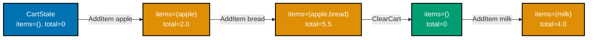

```python
"""Example 60: A Redux-Style Pure (state, action) -> state Reducer."""

from __future__ import annotations  # => enables the quoted forward references used below

from dataclasses import dataclass, replace  # => replace builds a NEW state from an OLD one


@dataclass(frozen=True)  # => the entire application state, immutable
class CartState:  # => the class body begins here
    items: tuple[str, ...]  # => an immutable tuple of item names, never mutated in place
    total: float  # => the running total, replaced wholesale on every action


@dataclass(frozen=True)  # => an action: describes WHAT happened, carries no behavior
class AddItem:  # => the class body begins here
    name: str  # => the item being added
    price: float  # => the item's price


@dataclass(frozen=True)  # => a second action variant, carrying no data at all
class ClearCart:  # => the class body begins here
    pass  # => no fields -- this action needs no data to be meaningful


Action = AddItem | ClearCart  # => the ADT of every possible action this reducer accepts


def reducer(state: CartState, action: Action) -> CartState:  # => PURE: (state, action) -> NEW state
    if isinstance(action, AddItem):  # => narrows action to AddItem inside this branch
        return replace(state, items=state.items + (action.name,), total=state.total + action.price)  # => the AddItem branch's new state
    return replace(state, items=(), total=0.0)  # => ClearCart resets everything, still a NEW CartState


initial_state = CartState(items=(), total=0.0)  # => the starting state before any actions
actions: list[Action] = [  # => the sequence of actions this example replays
    AddItem("apple", 2.0),  # => action 1: adds an item
    AddItem("bread", 3.5),  # => action 2: adds a second item
    ClearCart(),  # => action 3: resets the cart entirely
    AddItem("milk", 4.0),  # => action 4: adds an item AFTER the reset
]  # => closes the actions list literal

final_state = initial_state  # => the accumulator this replay loop rebinds, never mutates
for action in actions:  # => REPLAYS every action, one reducer call each
    final_state = reducer(final_state, action)  # => each call returns a BRAND NEW state, never mutates

replayed_state = initial_state  # => a SECOND independent replay, from the SAME starting state
for action in actions:  # => replays the SAME action list a SECOND time
    replayed_state = reducer(replayed_state, action)  # => identical steps, identical inputs

# => this is the Redux/Elm reducer pattern: state transitions as pure function calls
print(final_state)  # => Output: CartState(items=('milk',), total=4.0)
print(final_state == replayed_state)  # => Output: True -- replaying identical actions reproduces the SAME state
```

**Output**:

```text
CartState(items=('milk',), total=4.0)
True
```

```python
"""Example 60: pytest verification for A Redux-Style Pure Reducer."""

from example import Action, AddItem, CartState, reducer


def test_replaying_actions_reproduces_the_state() -> None:
    actions: list[Action] = [AddItem("a", 1.0), AddItem("b", 2.0)]
    state_1 = CartState(items=(), total=0.0)
    for action in actions:
        state_1 = reducer(state_1, action)

    state_2 = CartState(items=(), total=0.0)
    for action in actions:
        state_2 = reducer(state_2, action)

    assert state_1 == state_2 == CartState(items=("a", "b"), total=3.0)


# => Run: pytest -- Output: 1 passed
```

**Verify**: `pytest -q`

**Output**:

```text
1 passed
```

**Key takeaway**: A pure `(state, action) -> state` reducer makes state transitions replayable and
deterministic -- the same action sequence from the same starting state always reaches the same result.

**Why it matters**: This is the design behind Redux and Elm's state management, and the reason it works
is entirely this topic's core idea: purity plus immutability. Because `reducer` never mutates its
input and depends on nothing but its two arguments, tools built on this pattern can replay action
histories, implement undo/redo by keeping old states around, and time-travel debug by re-running a
recorded action log against a fresh state.

---

### Example 61: Composing `Result`-Returning Functions (Kleisli Composition)

_ex-61 &middot; exercises co-11, co-27, co-23_

Example 19's `compose` chains ordinary functions; this example chains functions that each return a
`Result`, short-circuiting the moment one of them fails. `kleisli_compose` looks like `compose` but
checks `isinstance(first, Err)` between steps instead of calling the next function unconditionally.

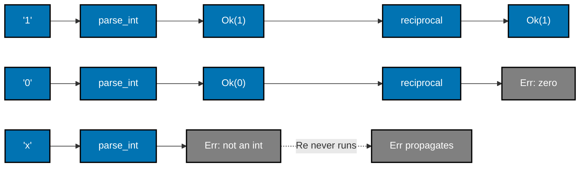

```python
"""Example 61: Composing Result-Returning Functions (Kleisli Composition)."""

from __future__ import annotations  # => enables the quoted 'Result[U, str]' forward references below

from dataclasses import dataclass  # => @dataclass(frozen=True) builds both Result variants
from typing import Callable, Generic, TypeVar  # => Generic/TypeVar/Callable type kleisli_compose below

T = TypeVar("T")  # => the type kleisli_compose's INPUT function consumes
U = TypeVar("U")  # => the type kleisli_compose's OUTPUT function produces
E = TypeVar("E")  # => the type of the error an Err wraps


@dataclass(frozen=True)  # => marks Ok immutable, matching the FP style
class Ok(Generic[T]):  # => the success variant's body
    value: T  # => the single field this variant carries


@dataclass(frozen=True)  # => marks Err immutable too
class Err(Generic[E]):  # => the failure variant's body
    error: E  # => the single field this variant carries


Result = Ok[T] | Err[E]  # => the ADT itself: a Result is EITHER variant


def kleisli_compose(  # => composes TWO Result-returning functions into ONE, like compose but Result-aware
    f: Callable[[T], "Result[U, str]"], g: Callable[[U], "Result[U, str]"]  # => the two steps kleisli_compose chains
) -> Callable[[T], "Result[U, str]"]:  # => closes the multi-line signature above
    def composed(x: T) -> "Result[U, str]":  # => the returned, composed pipeline function
        first = f(x)  # => runs the FIRST step
        if isinstance(first, Err):  # => short-circuits: g never runs if f already failed
            return first  # => propagates f's failure untouched
        return g(first.value)  # => chains g onto f's unwrapped success value

    return composed  # => kleisli_compose itself returns the composed pipeline function


def parse_int(text: str) -> "Result[int, str]":  # => step 1: str -> Result[int, str]
    try:  # => attempts the conversion
        return Ok(int(text))  # => success: wraps the parsed int
    except ValueError:  # => text was not a valid integer
        return Err(f"'{text}' is not an integer")  # => the error travels as an ordinary VALUE


def reciprocal(n: int) -> "Result[int, str]":  # => step 2: int -> Result[int, str]
    if n == 0:  # => the ONLY failure condition this step checks
        return Err("cannot take the reciprocal of zero")  # => switches to the failure track
    return Ok(1 // n if n == 1 else 0)  # => simplified integer reciprocal, just for this example


pipeline = kleisli_compose(parse_int, reciprocal)  # => ONE composed function: str -> Result[int, str]

# => Kleisli composition is compose specialized to Result-returning functions
print(pipeline("1"))  # => Output: Ok(value=1)
print(pipeline("0"))  # => Output: Err(error='cannot take the reciprocal of zero')
print(pipeline("x"))  # => Output: Err(error="'x' is not an integer")
```

**Output**:

```text
Ok(value=1)
Err(error='cannot take the reciprocal of zero')
Err(error="'x' is not an integer")
```

```python
"""Example 61: pytest verification for Composing Result-Returning Functions."""

from example import Err, Ok, kleisli_compose, parse_int, reciprocal


def test_composed_pipeline_propagates_the_first_failure() -> None:
    pipeline = kleisli_compose(parse_int, reciprocal)
    assert pipeline("1") == Ok(1)
    assert pipeline("bad") == Err("'bad' is not an integer")
    assert pipeline("0") == Err("cannot take the reciprocal of zero")


# => Run: pytest -- Output: 1 passed
```

**Verify**: `pytest -q`

**Output**:

```text
1 passed
```

**Key takeaway**: Kleisli composition chains `Result`-returning functions the same way ordinary
`compose` chains plain functions, except each step checks for failure before calling the next one.

**Why it matters**: Without Kleisli composition, chaining several fallible steps means either nested
`if isinstance(..., Err)` checks at every call site or a bespoke pipeline function per combination of
steps. Wrapping that check inside a reusable `kleisli_compose` keeps the call sites as simple as
composing ordinary functions, while the failure-propagation logic lives in exactly one place.

---

### Example 62: A `@curry` Decorator Auto-Currying by Arity

_ex-62 &middot; exercises co-09, co-18_

Example 18's `partial` fixed arguments manually, one `functools.partial` call at a time; this example
builds a decorator that inspects a function's own signature and automatically returns a new
partially-applied function until enough arguments have accumulated. `add3(1)(2)(3)`, `add3(1, 2)(3)`,
and `add3(1, 2, 3)` all reach the identical result.

```python
"""Example 62: A @curry Decorator Auto-Currying by Arity."""

import inspect  # => inspects fn's own signature to learn how many arguments it needs
from functools import wraps  # => preserves add3's identity through the decorator
from typing import Any, Callable  # => Any/Callable type this deliberately dynamic decorator


def curry(fn: Callable[..., Any]) -> Callable[..., Any]:  # => a decorator that auto-curries fn
    arity = len(inspect.signature(fn).parameters)  # => how many arguments fn ultimately needs

    @wraps(fn)  # => preserves fn's __name__/__doc__ on the curried wrapper
    def curried(*args: Any) -> Any:  # => accumulates arguments across MULTIPLE calls
        if len(args) >= arity:  # => enough arguments collected -- call the real function NOW
            return fn(*args)  # => the real call, with every argument finally in hand

        def more_needed(*more: Any) -> Any:  # => named + fully typed -- an untyped lambda can't carry annotations
            return curried(*args, *more)  # => not enough yet -- keeps accumulating arguments

        return more_needed  # => returns the function wanting more arguments

    return curried  # => curry itself returns the auto-currying wrapper


@curry  # => wraps add3 so it can be called one argument at a time, or all at once
def add3(a: int, b: int, c: int) -> int:  # => an ordinary 3-argument function
    return a + b + c  # => the actual sum


all_at_once = add3(1, 2, 3)  # => calling with all 3 arguments works like the undecorated function
one_at_a_time = add3(1)(2)(3)  # => calling one argument per call ALSO reaches the same result
mixed = add3(1, 2)(3)  # => and any grouping in between works too

# => auto-currying via inspect.signature makes ANY function callable one argument at a time
print(all_at_once)  # => Output: 6
print(one_at_a_time)  # => Output: 6
print(mixed)  # => Output: 6
```

**Output**:

```text
6
6
6
```

```python
"""Example 62: pytest verification for A @curry Decorator Auto-Currying by Arity."""

from example import add3


def test_partial_calls_accumulate_arguments_until_full_arity() -> None:
    assert add3(1, 2, 3) == 6
    assert add3(1)(2)(3) == 6
    assert add3(1, 2)(3) == 6


# => Run: pytest -- Output: 1 passed
```

**Verify**: `pytest -q`

**Output**:

```text
1 passed
```

**Key takeaway**: `@curry` reads a function's own arity via `inspect.signature` and returns partial
applications until enough arguments have accumulated -- one decorator handles any 1-to-N-arity
function without per-function boilerplate.

**Why it matters**: Manual currying with `functools.partial` at every call site works but scatters the
same pattern across a codebase. A generic `@curry` decorator centralizes the "call with fewer
arguments than needed, get back a function wanting the rest" behavior once, letting call sites read
naturally whether they supply one argument or all of them at once.

---

### Example 63: A Lazy Prime Sieve Over an Infinite Generator

_ex-63 &middot; exercises co-15, co-16_

This is the classic functional demonstration of laziness: `natural_numbers_from` never terminates, and
`sieve` recursively wraps ever-narrower filtered views of it, yet nothing is actually computed until
`islice` pulls a bounded number of primes out. The recursion in `sieve` only runs as deep as the
consumer actually pulls.

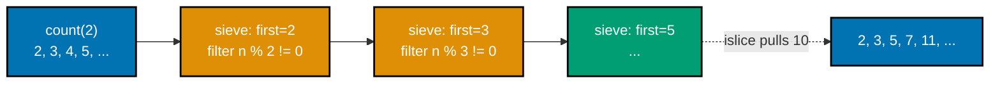

```python
"""Example 63: A Lazy Prime Sieve Over an Infinite Generator."""

from itertools import count, islice  # => count: infinite lazy range; islice: pulls a bounded slice
from typing import Iterator  # => Iterator types both generators below


def natural_numbers_from(start: int) -> Iterator[int]:  # => an INFINITE generator -- never runs out
    yield from count(start)  # => delegates to itertools.count, lazily, forever


def sieve(numbers: Iterator[int]) -> Iterator[int]:  # => a lazy, recursive Eratosthenes-style sieve
    first = next(numbers)  # => the next number is prime by construction (nothing smaller divided it)
    yield first  # => yields it immediately -- consumer can use it before the rest is computed
    yield from sieve(n for n in numbers if n % first != 0)  # => filters multiples, sieves the REST lazily


primes = sieve(natural_numbers_from(2))  # => an infinite lazy stream of primes -- nothing computed yet
first_ten = list(islice(primes, 10))  # => pulls EXACTLY 10 primes, the ONLY work this line forces

# => the classic functional demonstration that laziness makes infinite structures usable
print(first_ten)  # => Output: [2, 3, 5, 7, 11, 13, 17, 19, 23, 29]
```

**Output**:

```text
[2, 3, 5, 7, 11, 13, 17, 19, 23, 29]
```

```python
"""Example 63: pytest verification for A Lazy Prime Sieve Over an Infinite Generator."""

from itertools import islice

from example import natural_numbers_from, sieve


def test_sieve_produces_the_correct_first_primes() -> None:
    primes = sieve(natural_numbers_from(2))
    assert list(islice(primes, 5)) == [2, 3, 5, 7, 11]


# => Run: pytest -- Output: 1 passed
```

**Verify**: `pytest -q`

**Output**:

```text
1 passed
```

**Key takeaway**: An infinite generator combined with lazy, recursive filtering lets `sieve` describe
"the prime sieve algorithm over all natural numbers" without ever running forever -- `islice` decides
how much of that infinite description actually gets computed.

**Why it matters**: An eager implementation of the same sieve would need an upper bound chosen in
advance, wasting work if the bound is too high or failing if it is too low. The lazy version separates
"what is a prime sieve" from "how many primes do I need right now," letting the exact same `sieve`
function serve a caller who wants 10 primes and one who wants 10,000.

---

### Example 64: A Pull Pipeline of `yield` Stages

_ex-64 &middot; exercises co-15_

Three generator functions -- `read_lines`, `strip_blank`, `uppercase` -- are chained so each one pulls
from the stage before it exactly as needed. Nothing runs until `list(pipeline)` forces the final pull,
at which point every stage runs interleaved, one line at a time, rather than one stage fully finishing
before the next starts.


```python
"""Example 64: A Pull Pipeline of yield Stages."""

from typing import Iterator  # => Iterator types every stage in this pipeline


def read_lines(text: str) -> Iterator[str]:  # => stage 1: text -> a lazy stream of lines
    for line in text.splitlines():  # => walks the raw text one line at a time
        yield line  # => suspends after EACH line, waiting for the next pull


def strip_blank(lines: Iterator[str]) -> Iterator[str]:  # => stage 2: filters out blank lines, lazily
    for line in lines:  # => pulls from stage 1 ONE line at a time
        if line.strip():  # => only forwards lines with real content
            yield line  # => only forwards non-blank lines downstream


def uppercase(lines: Iterator[str]) -> Iterator[str]:  # => stage 3: transforms each surviving line
    for line in lines:  # => pulls from stage 2 ONE line at a time
        yield line.upper()  # => the actual transformation this stage performs


text = "hello\n\nworld\n   \nfp"  # => a raw multi-line string, including blank/whitespace-only lines
pipeline = uppercase(strip_blank(read_lines(text)))  # => THREE stages chained, nothing runs yet

result = list(pipeline)  # => pulling into a list is what finally forces every stage to run

# => each stage suspends independently -- no stage ever buffers its whole output
print(result)  # => Output: ['HELLO', 'WORLD', 'FP']
```

**Output**:

```text
['HELLO', 'WORLD', 'FP']
```

```python
"""Example 64: pytest verification for A Pull Pipeline of yield Stages."""

from example import read_lines, strip_blank, uppercase


def test_pipeline_streams_through_all_three_stages() -> None:
    text = "a\n\nb"
    pipeline = uppercase(strip_blank(read_lines(text)))
    assert list(pipeline) == ["A", "B"]


# => Run: pytest -- Output: 1 passed
```

**Verify**: `pytest -q`

**Output**:

```text
1 passed
```

**Key takeaway**: Chaining generator functions builds a pull-based pipeline where each stage suspends
independently -- no stage buffers its entire output before the next stage starts consuming it.

**Why it matters**: An eager pipeline (each stage returning a full list) would fully materialize the
output of `read_lines`, then all of `strip_blank`'s output, then all of `uppercase`'s output, using
memory proportional to the input three times over. The pull pipeline processes one line through all
three stages before moving to the next line, which is why the same pattern scales to files far larger
than available memory.

---

### Example 65: A Memoization Decorator With a Bounded `maxsize`

_ex-65 &middot; exercises co-17, co-18_

Example 17's memoize dictionary cached every result forever; this example bounds the cache using
`collections.OrderedDict` as an LRU (least-recently-used) store. `bounded_memoize(maxsize=2)` evicts
the least-recently-used entry once a third distinct key arrives, so previously cached results can
become cache misses again.

```python
"""Example 65: A Memoization Decorator With a Bounded maxsize."""

from collections import OrderedDict  # => insertion-ordered dict -- the basis of this LRU cache
from typing import Callable  # => Callable types every layer of this decorator factory


def bounded_memoize(maxsize: int) -> Callable[[Callable[[int], int]], Callable[[int], int]]:  # => a decorator FACTORY
    def decorator(fn: Callable[[int], int]) -> Callable[[int], int]:  # => the actual decorator
        cache: OrderedDict[int, int] = OrderedDict()  # => insertion order tracks recency

        def wrapper(n: int) -> int:  # => the cache-checking, eviction-aware wrapper
            if n in cache:  # => cache HIT: refresh its recency, return the stored value
                cache.move_to_end(n)  # => marks n as the MOST recently used entry
                return cache[n]  # => the stored value, no recomputation
            result = fn(n)  # => cache MISS: run the real computation
            cache[n] = result  # => stores the fresh result as the newest entry
            if len(cache) > maxsize:  # => over budget -- evict the LEAST recently used entry
                cache.popitem(last=False)  # => last=False pops the OLDEST inserted/touched key
            return result  # => the freshly computed value

        return wrapper  # => decorator itself returns the cache-checking wrapper

    return decorator  # => bounded_memoize itself returns the decorator


calls: list[int] = []  # => records every argument that actually triggered a real computation


@bounded_memoize(maxsize=2)  # => keeps at most 2 cached results -- the THIRD distinct key evicts one
def track(n: int) -> int:  # => the function being memoized
    calls.append(n)  # => only runs on a cache MISS
    return n * n  # => the actual (slow, pure) computation being cached


track(1)  # => miss: cache holds {1}
track(2)  # => miss: cache holds {1, 2}
track(1)  # => HIT: 1 becomes the most recently used entry, no new call recorded
track(3)  # => miss, over budget: evicts 2 (least recently used); cache holds {1, 3}
track(2)  # => 2 was evicted -- this is a MISS again, not a hit
track(1)  # => 1 was ALSO evicted by the previous miss -- another MISS

# => bounding a cache trades perfect memoization for a fixed memory budget
print(calls)  # => Output: [1, 2, 3, 2, 1] -- five real computations out of six calls
```

**Output**:

```text
[1, 2, 3, 2, 1]
```

```python
"""Example 65: pytest verification for A Memoization Decorator With a Bounded maxsize."""

from example import bounded_memoize


def test_lru_eviction_forces_a_recompute_for_the_oldest_key() -> None:
    calls: list[int] = []

    @bounded_memoize(maxsize=1)
    def track(n: int) -> int:
        calls.append(n)
        return n

    track(1)  # => miss
    track(2)  # => miss, evicts 1 (maxsize=1)
    track(1)  # => 1 was evicted -- miss again
    assert calls == [1, 2, 1]


# => Run: pytest -- Output: 1 passed
```

**Verify**: `pytest -q`

**Output**:

```text
1 passed
```

**Key takeaway**: Bounding a memoization cache with an LRU eviction policy trades perfect memoization
(cache everything forever) for a fixed, predictable memory budget -- at the cost of occasionally
recomputing a result that was cached before.

**Why it matters**: An unbounded memoization dictionary is fine for a small, known input space but
becomes an unbounded memory leak for functions called with many distinct arguments over a long-running
process's lifetime. `functools.lru_cache` provides this exact behavior in the standard library;
building it by hand here shows what that decorator is actually doing underneath its `maxsize`
parameter.

---

### Example 66: A Trampoline Simulating Tail-Call Optimization

_ex-66 &middot; exercises co-14_

Example 26 converted recursion into an explicit stack to survive CPython's missing tail-call
optimization; this example uses a different technique for the same problem. `sum_to_n_trampolined`
never actually recurses -- it returns a `Bounce` wrapping the next step, and `trampoline`'s `while`
loop repeatedly calls that step in a single stack frame, however many "recursive" steps it represents.

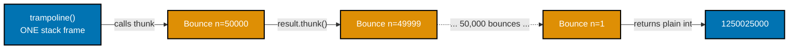

```python
"""Example 66: A Trampoline Simulating Tail-Call Optimization."""

from typing import Callable  # => Callable types the zero-arg thunk; "Bounce | int" uses PEP 604 union syntax


class Bounce:  # => a marker: "not done yet, call this thunk next" -- NOT the final answer
    def __init__(self, thunk: Callable[[], "Bounce | int"]) -> None:  # => wraps a zero-arg step function
        self.thunk = thunk  # => stored for the trampoline loop to call on its NEXT iteration


def trampoline(result: "Bounce | int") -> int:  # => drives the loop -- ONE stack frame, however deep
    while isinstance(result, Bounce):  # => keeps bouncing as long as we get another Bounce back
        result = result.thunk()  # => calls the next step -- reuses THIS loop's frame, not a new one
    return result  # => once it's a plain int, the computation is actually done


def sum_to_n_trampolined(n: int, acc: int = 0) -> "Bounce | int":  # => "recursive-looking" but returns a Bounce
    if n == 0:  # => base case: nothing left to add
        return acc  # => a plain int, stops the trampoline
    return Bounce(lambda: sum_to_n_trampolined(n - 1, acc + n))  # => NOT a real recursive call -- returns immediately


deep_n = 50_000  # => far past CPython's default recursion limit if called naively

result = trampoline(sum_to_n_trampolined(deep_n))  # => the WHILE LOOP does the "recursion," not the call stack

# => the trampoline pattern is Python's manual workaround for missing tail-call optimization
print(result)  # => Output: 1250025000
print(result == deep_n * (deep_n + 1) // 2)  # => Output: True -- correct despite the extreme depth
```

**Output**:

```text
1250025000
True
```

```python
"""Example 66: pytest verification for A Trampoline Simulating Tail-Call Optimization."""

from example import sum_to_n_trampolined, trampoline


def test_trampoline_handles_depth_that_would_break_plain_recursion() -> None:
    deep_n = 50_000
    result = trampoline(sum_to_n_trampolined(deep_n))
    assert result == deep_n * (deep_n + 1) // 2


# => Run: pytest -- Output: 1 passed
```

**Verify**: `pytest -q`

**Output**:

```text
1 passed
```

**Key takeaway**: A trampoline replaces genuine recursive calls with a loop that repeatedly invokes
zero-argument "next step" thunks, so a computation that looks recursive can run to depths that would
otherwise raise `RecursionError`, all in one stack frame.

**Why it matters**: Languages with tail-call optimization turn a tail-recursive function into a loop
automatically; CPython never does this, capping recursion depth by default. The trampoline pattern
gives Python code the same practical outcome by hand -- useful for interpreters, deep tree walks, or
any naturally recursive algorithm whose input size cannot be bounded in advance.

---

### Example 67: An Expression AST as an ADT With a `match` Evaluator

_ex-67 &middot; exercises co-20, co-21_

Example 24's `Shape` ADT modeled data; this example models a small language. `Num`, `Add`, and `Mul`
form the ADT for an arithmetic expression tree, and `evaluate` walks it recursively with a `match`
statement, one `case` per node type -- the canonical shape of a tree-walking interpreter.

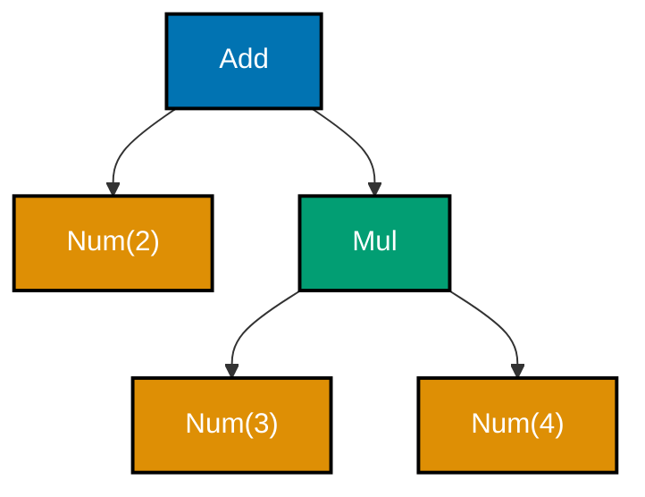

```python
"""Example 67: An Expression AST as an ADT With a match Evaluator."""

from __future__ import annotations  # => enables the quoted 'Expr' forward references below

from dataclasses import dataclass  # => @dataclass(frozen=True) builds each AST node variant


@dataclass(frozen=True)  # => a leaf node: a literal number
class Num:  # => the class body begins here
    value: float  # => the literal's own value


@dataclass(frozen=True)  # => a branch node: left + right
class Add:  # => the class body begins here
    left: "Expr"  # => the left operand, itself an Expr
    right: "Expr"  # => the right operand, itself an Expr


@dataclass(frozen=True)  # => a branch node: left * right
class Mul:  # => the class body begins here
    left: "Expr"  # => the left operand, itself an Expr
    right: "Expr"  # => the right operand, itself an Expr


Expr = Num | Add | Mul  # => the ADT: any expression is EXACTLY one of these three shapes


def evaluate(expr: Expr) -> float:  # => match/case walks the AST, one branch per variant
    match expr:  # => opens the match/case block over expr
        case Num(value=v):  # => a leaf -- just return its value
            return v  # => the leaf's own value
        case Add(left=l, right=r):  # => recurse into both children, then add
            return evaluate(l) + evaluate(r)  # => the actual addition Add represents
        case Mul(left=l, right=r):  # => recurse into both children, then multiply
            return evaluate(l) * evaluate(r)  # => the actual multiplication Mul represents


expression = Add(Num(2.0), Mul(Num(3.0), Num(4.0)))  # => represents "2.0 + (3.0 * 4.0)"

# => an interpreter is the canonical use case for ADTs plus match/case together
print(evaluate(expression))  # => Output: 14.0
```

**Output**:

```text
14.0
```

```python
"""Example 67: pytest verification for An Expression AST as an ADT With a match Evaluator."""

from example import Add, Mul, Num, evaluate


def test_evaluator_respects_precedence_baked_into_the_tree_shape() -> None:
    expr = Add(Num(2), Mul(Num(3), Num(4)))
    assert evaluate(expr) == 14.0


# => Run: pytest -- Output: 1 passed
```

**Verify**: `pytest -q`

**Output**:

```text
1 passed
```

**Key takeaway**: An ADT of expression node types plus a `match`-based `evaluate` function is a
complete, minimal tree-walking interpreter -- precedence lives entirely in how the tree is shaped, not
in any parsing logic evaluate itself has to reason about.

**Why it matters**: This same shape -- an ADT for the AST, `match`/`case` for the evaluator -- scales
from a four-node arithmetic example to real interpreters, compilers, and query planners. Because the
ADT is a closed set of variants, `match` can (with the right static checker) verify every case is
handled, catching a missing node type at review time instead of as a runtime crash on unusual input.

---

### Example 68: Sequencing `Option` Computations, Do-Style

_ex-68 &middot; exercises co-22, co-27_

Example 25 introduced `Option`; this example chains three `Option`-returning steps with `and_then` so
the pipeline reads top-to-bottom like a sequence of statements rather than as nested callbacks.
`compute` short-circuits to `Nothing` the instant any step fails, and every later step is simply never
called.

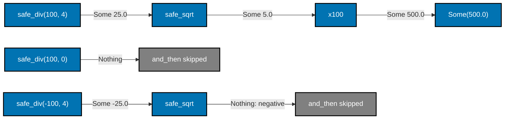

```python
"""Example 68: Sequencing Option Computations, Do-Style."""

from __future__ import annotations  # => enables the quoted 'Option[U]' forward reference below

from dataclasses import dataclass  # => @dataclass(frozen=True) builds both Option variants
from typing import Callable, Generic, TypeVar  # => Generic/TypeVar/Callable type and_then below

T = TypeVar("T")  # => the type of the value a Some wraps
U = TypeVar("U")  # => the type and_then's step function returns


@dataclass(frozen=True)  # => marks Some immutable, matching the FP style
class Some(Generic[T]):  # => the class body begins here
    value: T  # => the single field this variant carries

    def and_then(self, fn: Callable[[T], "Option[U]"]) -> "Option[U]":  # => the sequencing operation
        return fn(self.value)  # => runs fn on the unwrapped value; fn itself returns an Option


@dataclass(frozen=True)  # => marks Nothing immutable too
class Nothing:  # => the class body begins here
    def and_then(self, fn: Callable[[T], U]) -> "Nothing":  # => short-circuits, generic so union calls stay typed
        return self  # => Nothing stays Nothing, regardless of fn


Option = Some[T] | Nothing  # => the ADT itself: an Option is EITHER variant


def safe_div(a: float, b: float) -> "Option[float]":  # => a step that may be absent (division by zero)
    return Nothing() if b == 0 else Some(a / b)  # => success wraps, failure returns Nothing


def safe_sqrt(x: float) -> "Option[float]":  # => a step that may be absent (negative input)
    return Nothing() if x < 0 else Some(x**0.5)  # => success wraps, failure returns Nothing


def sqrt_step(ratio: float) -> "Option[float]":  # => named + typed and_then step -- a bare lambda can't carry annotations
    return safe_sqrt(ratio)  # => same behavior as the inline version, now with a concrete float param


def scale_step(root: float) -> "Option[float]":  # => named + typed and_then step, same reasoning
    return Some(root * 100)  # => wraps the scaled result back into Some


def compute(a: float, b: float) -> "Option[float]":  # => "do-style": each step reads like a statement
    return (  # => opens the do-style chain of and_then calls
        safe_div(a, b)  # => step 1
        .and_then(sqrt_step)  # => step 2, only runs if step 1 succeeded
        .and_then(scale_step)  # => step 3, only runs if step 2 succeeded
    )  # => closes the do-style chain of and_then calls


# => chained and_then calls read like a sequence of statements, not nested callbacks
print(compute(100, 4))  # => Output: Some(value=500.0)
print(compute(100, 0))  # => Output: Nothing() -- short-circuits at the FIRST step
print(compute(-100, 4))  # => Output: Nothing() -- short-circuits at the SECOND step
```

**Output**:

```text
Some(value=500.0)
Nothing()
Nothing()
```

```python
"""Example 68: pytest verification for Sequencing Option Computations, Do-Style."""

from example import Nothing, Some, compute


def test_do_style_chain_short_circuits_on_absence() -> None:
    assert compute(100, 4) == Some(500.0)
    assert compute(100, 0) == Nothing()
    assert compute(-100, 4) == Nothing()


# => Run: pytest -- Output: 1 passed
```

**Verify**: `pytest -q`

**Output**:

```text
1 passed
```

**Key takeaway**: Chaining `and_then` calls turns a sequence of fallible steps into code that reads
top-to-bottom, one step per line, without the pyramid of nested `if`/`else` checks a manual
implementation of the same short-circuiting would require.

**Why it matters**: "Do notation" in languages with built-in monad support compiles to exactly this
`and_then` chaining. Writing it out explicitly in Python shows what that sugar actually does: each
step commits to running only if every step before it succeeded, and the chain's final shape (`Some` or
`Nothing`) tells the caller everything it needs to know without inspecting any step in between.

---

### Example 69: Validating a Form, Short-Circuiting on the First Failing Rule

_ex-69 &middot; exercises co-24, co-23_

Example 26's error-track pipeline used two rules; this example scales the same railway-oriented
pattern to three independent checks -- username length, password length, and a minimum age.
`validate_signup` returns the first `Err` it encounters and never runs the checks after it, so the
caller always learns about exactly one problem at a time.

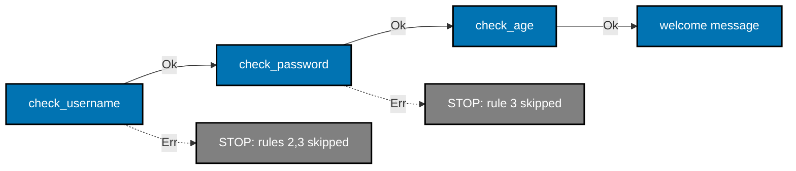

```python
"""Example 69: Validating a Form, Short-Circuiting on the First Failing Rule."""

from __future__ import annotations  # => enables the quoted 'Result[str, str]' forward references below

from dataclasses import dataclass  # => @dataclass(frozen=True) builds both Result variants
from typing import Generic, TypeVar  # => Generic/TypeVar make Ok[T] and Err[E] proper generic containers

T = TypeVar("T")  # => the type of the value an Ok wraps
E = TypeVar("E")  # => the type of the error an Err wraps


@dataclass(frozen=True)  # => marks Ok immutable, matching the FP style
class Ok(Generic[T]):  # => the class body begins here
    value: T  # => the single field this variant carries


@dataclass(frozen=True)  # => marks Err immutable too
class Err(Generic[E]):  # => the class body begins here
    error: E  # => the single field this variant carries


Result = Ok[T] | Err[E]  # => the ADT itself: a Result is EITHER variant


def check_username(username: str) -> "Result[str, str]":  # => rule 1
    return Ok(username) if len(username) >= 3 else Err("username too short")  # => the ONLY check this rule makes


def check_password(password: str) -> "Result[str, str]":  # => rule 2
    return Ok(password) if len(password) >= 8 else Err("password too short")  # => the ONLY check this rule makes


def check_age(age: int) -> "Result[int, str]":  # => rule 3
    return Ok(age) if age >= 13 else Err("must be at least 13")  # => the ONLY check this rule makes


def validate_signup(username: str, password: str, age: int) -> "Result[str, str]":  # => threads all 3 rules
    username_result = check_username(username)  # => rule 1's switch point
    if isinstance(username_result, Err):  # => STOP: rules 2 and 3 never run
        return username_result  # => reports THIS rule as the failing one
    password_result = check_password(password)  # => rule 2's switch point
    if isinstance(password_result, Err):  # => STOP: rule 3 never runs
        return password_result  # => reports THIS rule as the failing one
    age_result = check_age(age)  # => rule 3's switch point
    if isinstance(age_result, Err):  # => the last possible failure point
        return age_result  # => reports THIS rule as the failing one
    return Ok(f"welcome, {username_result.value}")  # => all three rules passed


# => real forms usually have more than two fields -- this scales the railway pattern to three
print(validate_signup("ana", "longenough", 20))  # => Output: Ok(value='welcome, ana')
print(validate_signup("an", "longenough", 20))  # => Output: Err(error='username too short')
print(validate_signup("ana", "short", 20))  # => Output: Err(error='password too short')
print(validate_signup("ana", "longenough", 10))  # => Output: Err(error='must be at least 13')
```

**Output**:

```text
Ok(value='welcome, ana')
Err(error='username too short')
Err(error='password too short')
Err(error='must be at least 13')
```

```python
"""Example 69: pytest verification for Validating a Form, Short-Circuiting on the First Failing Rule."""

from example import Err, Ok, validate_signup


def test_the_failing_rule_is_the_one_reported() -> None:
    assert validate_signup("ana", "longenough", 20) == Ok("welcome, ana")
    assert validate_signup("an", "longenough", 20) == Err("username too short")
    assert validate_signup("ana", "short", 20) == Err("password too short")
    assert validate_signup("ana", "longenough", 10) == Err("must be at least 13")


# => Run: pytest -- Output: 1 passed
```

**Verify**: `pytest -q`

**Output**:

```text
1 passed
```

**Key takeaway**: Railway-oriented validation with three chained rules still reports exactly one
failure at a time -- the first one encountered -- which is simple to reason about but tells the caller
nothing about the other two rules until the first one is fixed.

**Why it matters**: Short-circuiting validation is the right choice when a later check genuinely
depends on an earlier one succeeding, or when showing one error at a time keeps a form simpler. Example
71 shows the opposite choice -- collecting every error at once -- and the two examples together make
the trade-off between them concrete rather than abstract.

---

### Example 70: Property-Checking the Functor Identity and Composition Laws

_ex-70 &middot; exercises co-25_

Example 25's functor identity law was checked once, by hand, on one `Some` value; this example checks
both the identity law and the composition law across 300 pseudo-random `Box` values using the same
stdlib `random`-based technique as Example 58. A functor implementation that violates either law will
show up here as `False` for at least one of the 300 checks.

```python
"""Example 70: Property-Checking the Functor Identity and Composition Laws."""

import random  # => stdlib source of pseudo-random Box values -- no third-party library needed
from dataclasses import dataclass  # => @dataclass(frozen=True) builds the immutable Box
from typing import Callable, Generic, TypeVar  # => Generic/TypeVar/Callable type the functor below

T = TypeVar("T")  # => the type of the value a Box wraps
U = TypeVar("U")  # => the type map's function returns


@dataclass(frozen=True)  # => the functor under test
class Box(Generic[T]):  # => the class body begins here
    value: T  # => the single field this container carries

    def map(self, fn: Callable[[T], U]) -> "Box[U]":  # => applies fn inside, stays wrapped
        return Box(fn(self.value))  # => applies fn inside, re-wraps as Box


def identity(x: int) -> int:  # => the identity function, used by the identity law
    return x  # => returns its argument unchanged


def add_one(x: int) -> int:  # => one of the two functions used by the composition law
    return x + 1  # => the actual +1


def double(x: int) -> int:  # => the second function used by the composition law
    return x * 2  # => the actual *2


def check_identity_law(box: "Box[int]") -> bool:  # => box.map(identity) == box
    return box.map(identity) == box  # => the identity law's own definition


def check_composition_law(box: "Box[int]") -> bool:  # => box.map(f).map(g) == box.map(compose(g, f))
    mapped_twice = box.map(add_one).map(double)  # => two SEPARATE map calls, one after another
    mapped_once = box.map(lambda x: double(add_one(x)))  # => ONE map call with the composed function
    return mapped_twice == mapped_once  # => the composition law's own definition


random.seed(42)  # => fixed seed -- this property check is fully reproducible
generated_boxes = [Box(random.randint(-1000, 1000)) for _ in range(300)]  # => 300 random Box values

identity_law_holds = all(check_identity_law(b) for b in generated_boxes)  # => checks ALL 300, not one
composition_law_holds = all(check_composition_law(b) for b in generated_boxes)  # => checks ALL 300, not one

# => checking BOTH functor laws together is what makes a map implementation trustworthy
print(identity_law_holds)  # => Output: True
print(composition_law_holds)  # => Output: True
```

**Output**:

```text
True
True
```

```python
"""Example 70: pytest verification for Property-Checking the Functor Identity and Composition Laws."""

import random

from example import Box, check_composition_law, check_identity_law


def test_both_functor_laws_hold_across_many_generated_boxes() -> None:
    random.seed(7)
    boxes = [Box(random.randint(-500, 500)) for _ in range(100)]
    assert all(check_identity_law(b) for b in boxes)
    assert all(check_composition_law(b) for b in boxes)


# => Run: pytest -- Output: 1 passed
```

**Verify**: `pytest -q`

**Output**:

```text
1 passed
```

**Key takeaway**: Checking the functor identity and composition laws across 300 generated values,
rather than one hand-picked value, is what makes "this `map` implementation is a lawful functor" a
statement backed by evidence rather than a single example.

**Why it matters**: A `map` implementation that happens to satisfy the laws for one convenient test
value can still violate them for others -- a bug that a single-example test would never catch.
Property-checking both laws together across many generated boxes is exactly the confidence a
third-party library like Hypothesis would provide automatically; here it costs nothing but a
`random.seed` and a list comprehension.

---

### Example 71: An Applicative Validation That Accumulates All Errors

_ex-71 &middot; exercises co-26, co-24_

Example 69 short-circuits on the first failing rule; this example deliberately does the opposite.
`combine3` runs `validate_username`, `validate_password`, and `validate_age` unconditionally, then
merges every `Invalid`'s errors into one combined `Invalid` -- the caller sees all three problems at
once instead of fixing them one at a time.

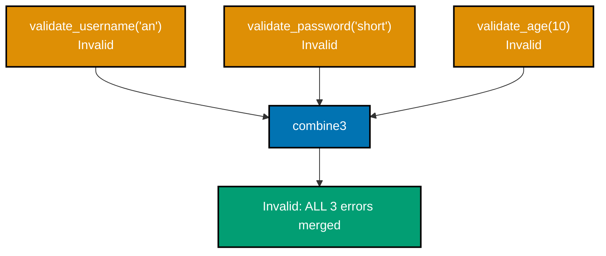

```python
"""Example 71: An Applicative Validation That Accumulates All Errors."""

from __future__ import annotations  # => enables the quoted 'Validated[T]' forward references below

from dataclasses import dataclass  # => @dataclass(frozen=True) builds both Validated variants
from typing import Generic, TypeVar  # => Generic/TypeVar make Valid[T] a proper generic container

T = TypeVar("T")  # => the type of the value a Valid wraps


@dataclass(frozen=True)  # => success, carrying the validated value
class Valid(Generic[T]):  # => the class body begins here
    value: T  # => the single field this variant carries


@dataclass(frozen=True)  # => failure, carrying EVERY error found, not just the first
class Invalid:  # => the class body begins here
    errors: tuple[str, ...]  # => one entry per failing rule, accumulated across all checks


Validated = Valid[T] | Invalid  # => this topic's SECOND Result-shaped type -- accumulates instead of short-circuits


def validate_username(username: str) -> "Validated[str]":  # => rule 1, independent of the others
    return Valid(username) if len(username) >= 3 else Invalid(("username too short",))  # => the ONLY check this rule makes


def validate_password(password: str) -> "Validated[str]":  # => rule 2, independent of the others
    return Valid(password) if len(password) >= 8 else Invalid(("password too short",))  # => the ONLY check this rule makes


def validate_age(age: int) -> "Validated[int]":  # => rule 3, independent of the others
    return Valid(age) if age >= 13 else Invalid(("must be at least 13",))  # => the ONLY check this rule makes


def combine3(  # => the applicative combinator: runs ALL THREE checks, merges ALL failures
    a: "Validated[str]", b: "Validated[str]", c: "Validated[int]"  # => the three independent checks to combine
) -> "Validated[str]":  # => closes the multi-line signature above
    errors: list[str] = []  # => collects failures from EVERY input, not just the first
    for result in (a, b, c):  # => visits all three, regardless of whether earlier ones already failed
        if isinstance(result, Invalid):  # => this particular check failed
            errors.extend(result.errors)  # => appends THIS check's errors onto the running list
    if errors:  # => at least one check failed
        return Invalid(tuple(errors))  # => reports EVERY failing rule, not just the first
    return Valid(f"welcome, {a.value}")  # type: ignore[union-attr]  # => all three checks passed


all_valid = combine3(validate_username("ana"), validate_password("longenough"), validate_age(20))  # => every check passes
all_invalid = combine3(validate_username("an"), validate_password("short"), validate_age(10))  # => every check fails

# => this is railway-oriented programming's opposite: gather everything, stop for nothing
print(all_valid)  # => Output: Valid(value='welcome, ana')
print(all_invalid)  # => Output: Invalid(errors=('username too short', 'password too short', 'must be at least 13'))
```

**Output**:

```text
Valid(value='welcome, ana')
Invalid(errors=('username too short', 'password too short', 'must be at least 13'))
```

```python
"""Example 71: pytest verification for An Applicative Validation That Accumulates All Errors."""

from example import Invalid, combine3, validate_age, validate_password, validate_username


def test_every_failing_rule_is_collected_not_just_the_first() -> None:
    result = combine3(validate_username("a"), validate_password("x"), validate_age(5))
    assert result == Invalid(("username too short", "password too short", "must be at least 13"))


# => Run: pytest -- Output: 1 passed
```

**Verify**: `pytest -q`

**Output**:

```text
1 passed
```

**Key takeaway**: An applicative combinator runs every independent check regardless of earlier
failures and merges all their errors into one result, which is the opposite trade-off from monadic
short-circuiting.

**Why it matters**: A monadic `bind` chain (Example 61, Example 69) cannot accumulate errors across
independent checks because each step depends on the previous one succeeding -- that dependency is
exactly what short-circuits it. Applicatives sidestep that by treating the checks as independent from
the start, which is why real-world form validation libraries are typically built on an applicative
structure rather than a monadic one.

---

### Example 72: Left-Identity, Right-Identity, and Associativity for `Result`

_ex-72 &middot; exercises co-27_

This example makes concrete why "monad" is a precise term rather than a vague design pattern: `Result`
qualifies specifically because its `bind` satisfies three laws. `unit(8).bind(half) == half(8)` is
left identity, `Ok(8).bind(unit) == Ok(8)` is right identity, and the two ways of grouping a
three-step `bind` chain agree, which is associativity.

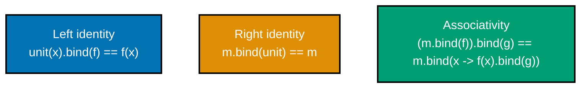

```python
"""Example 72: Left-Identity, Right-Identity, and Associativity for Result."""

from __future__ import annotations  # => enables the quoted 'Result[U, object]' forward references below

from dataclasses import dataclass  # => @dataclass(frozen=True) builds both Result variants
from typing import Callable, Generic, TypeVar  # => Generic/TypeVar/Callable type bind and unit below

T = TypeVar("T")  # => the type of the value an Ok wraps
U = TypeVar("U")  # => the type bind's step function returns
E = TypeVar("E")  # => the type of the error an Err wraps
F = TypeVar("F")  # => the error type threaded through bind's step function, not hardcoded to object


@dataclass(frozen=True)  # => marks Ok immutable, matching the FP style
class Ok(Generic[T]):  # => the class body begins here
    value: T  # => the single field this variant carries

    def bind(self, fn: Callable[[T], "Result[U, F]"]) -> "Result[U, F]":  # => F comes from fn's OWN error type
        return fn(self.value)  # => unwraps, runs fn (which itself returns a Result), no double-wrap


@dataclass(frozen=True)  # => marks Err immutable too
class Err(Generic[E]):  # => the class body begins here
    error: E  # => the single field this variant carries

    def bind(self, fn: Callable[[T], U]) -> "Err[E]":  # => NO-OP, generic so a typed fn still passes the check
        return self  # => fn never runs once the chain has already failed


Result = Ok[T] | Err[E]  # => the ADT itself: a Result is EITHER variant


def unit(x: T) -> "Result[T, object]":  # => the monad's "wrap a plain value" operation, a.k.a. return/pure
    return Ok(x)  # => the simplest possible success


def half(n: int) -> "Result[float, str]":  # => an arbitrary bind step, reused by all three law checks
    return Ok(n / 2) if n % 2 == 0 else Err(f"{n} is odd")  # => succeeds on even n, fails on odd n


def add_ten(x: float) -> "Result[float, str]":  # => a SECOND arbitrary bind step, for associativity
    return Ok(x + 10)  # => always succeeds


left_identity_holds = unit(8).bind(half) == half(8)  # => unit(x).bind(f) == f(x)
right_identity_holds = Ok(8).bind(unit) == Ok(8)  # => m.bind(unit) == m
associativity_holds = Ok(8).bind(half).bind(add_ten) == Ok(8).bind(  # => m.bind(f).bind(g)
    lambda x: half(x).bind(add_ten)  # => == m.bind(lambda x: f(x).bind(g))
)  # => closes the associativity check's multi-line expression

# => these three laws are what makes 'monad' a precise term, not just a vague design pattern
print(left_identity_holds)  # => Output: True
print(right_identity_holds)  # => Output: True
print(associativity_holds)  # => Output: True
```

**Output**:

```text
True
True
True
```

```python
"""Example 72: pytest verification for the three monad laws on Result."""

from example import Ok, add_ten, half, unit


def test_all_three_monad_laws_hold() -> None:
    assert unit(8).bind(half) == half(8)  # => left identity
    assert Ok(8).bind(unit) == Ok(8)  # => right identity
    assert Ok(8).bind(half).bind(add_ten) == Ok(8).bind(lambda x: half(x).bind(add_ten))  # => associativity


# => Run: pytest -- Output: 1 passed
```

**Verify**: `pytest -q`

**Output**:

```text
1 passed
```

**Key takeaway**: `Result`'s `bind` satisfies left identity, right identity, and associativity
simultaneously, which is the actual mathematical definition of a monad -- not just "a container with a
`bind` method."

**Why it matters**: These three laws guarantee that `bind` chains can be refactored, split, or combined
without changing behavior -- exactly the kind of reasoning this topic has relied on informally across
Examples 61, 68, and 69. Verifying the laws hold for this hand-rolled `Result` confirms those earlier
examples were not just convenient special cases but instances of a structure with real, checkable
guarantees.

---

### Example 73: A Small Point-Free Combinator Library

_ex-73 &middot; exercises co-19, co-12_

Example 22 wrote one point-free `compose(triple, add_one)` by hand; this example builds three reusable
combinators -- `pipe`, `const`, and `flip` -- that generalize the technique. `transform = pipe(add_one,
double, str)` builds a pipeline entirely from function values, without ever naming the value flowing
between them.

```python
"""Example 73: A Small Point-Free Combinator Library."""

from functools import reduce  # => reduce powers pipe's left-to-right fold
from typing import Any, Callable, TypeVar  # => Callable/TypeVar type this small combinator library; Any types pipe's dynamic arity

A = TypeVar("A")  # => a generic type parameter shared by const
B = TypeVar("B")  # => a second generic type parameter shared by flip


def pipe(*fns: Callable[..., Any]) -> Callable[..., Any]:  # => LEFT-to-right composition -- the first fn runs FIRST
    def apply_step(acc: Any, fn: Callable[..., Any]) -> Any:  # => named + typed -- one fold step, calls fn on acc
        return fn(acc)  # => applies ONE fn to the running accumulator, returns the next accumulator

    def piped(x: Any) -> Any:  # => named + typed -- an untyped lambda can't carry these annotations
        return reduce(apply_step, fns, x)  # => folds fns in ORDER, unlike compose

    return piped  # => pipe itself returns the composed pipeline function


def const(value: A) -> Callable[..., A]:  # => a combinator: ignores its argument(s), always returns value
    return lambda *_ignored: value  # => the returned function discards WHATEVER it's called with


def flip(fn: Callable[[A, B], A]) -> Callable[[B, A], A]:  # => a combinator: swaps a 2-arg function's order
    return lambda b, a: fn(a, b)  # => calls fn with its two arguments REVERSED


def subtract(a: int, b: int) -> int:  # => an ordinary 2-argument function, order matters
    return a - b  # => the actual subtraction


always_zero = const(0)  # => a function of ANY arguments that always returns 0
flipped_subtract = flip(subtract)  # => subtract with its arguments swapped

def add_one(x: int) -> int:  # => named + typed -- pipe's Callable[..., Any] gives lambdas no param context
    return x + 1  # => adds 1 to x -- one plain step for pipe/flip to compose over


def double(x: int) -> int:  # => named + typed, same reasoning
    return x * 2  # => doubles x -- the second plain step in the transform pipeline


transform = pipe(add_one, double, str)  # => a combined "add 1, double, stringify" pipeline

# => a tiny combinator library is how point-free style scales beyond one-off rewrites
print(transform(3))  # => Output: 8  (str of (3+1)*2)
print(always_zero(1, 2, 3))  # => Output: 0 -- ignores every argument it was given
print(subtract(10, 3))  # => Output: 7
print(flipped_subtract(10, 3))  # => Output: -7 -- same two arguments, swapped order changes the answer
```

**Output**:

```text
8
0
7
-7
```

```python
"""Example 73: pytest verification for A Small Point-Free Combinator Library."""

from example import const, flip, pipe, subtract


def _add_one(x: int) -> int:
    return x + 1


def _double(x: int) -> int:
    return x * 2


def test_pipe_const_and_flip_compose_correctly() -> None:
    transform = pipe(_add_one, _double)
    assert transform(3) == 8

    always_five = const(5)
    assert always_five(1, 2, 3) == 5

    flipped_subtract = flip(subtract)
    assert flipped_subtract(10, 3) == -7


# => Run: pytest -- Output: 1 passed
```

**Verify**: `pytest -q`

**Output**:

```text
1 passed
```

**Key takeaway**: A handful of small, generic combinators -- `pipe`, `const`, `flip` -- cover most of
what point-free rewrites need, without hand-writing a fresh composition for each new pipeline.

**Why it matters**: One-off point-free rewrites (Example 22) show the technique works, but real code
needs it repeatedly across many pipelines with different shapes. A tiny reusable combinator library is
the difference between "point-free style as a curiosity" and "point-free style as a practical everyday
tool" -- the same handful of combinators cover most pipeline-building needs a codebase runs into.

---

### Example 74: A Deep `pipe` vs. Nested Calls on Real Data

_ex-74 &middot; exercises co-12, co-11_

This example runs the identical four-step computation -- strip, lowercase, split, count -- two ways on
the same messy input string, and prints proof the two versions agree. The comparison argues for `pipe`
purely on readability grounds: `nested_result` must be read from the innermost call outward, while
`piped_result` reads top-to-bottom in the order the steps actually run.

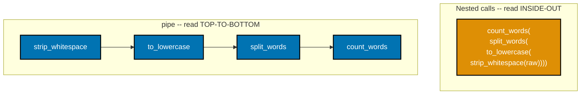

```python
"""Example 74: A Deep pipe vs. Nested Calls on Real Data."""

from functools import reduce  # => reduce powers pipe's left-to-right fold
from typing import Any, Callable  # => Callable types the pipe helper below; Any types its dynamic arity


def pipe(*fns: Callable[..., Any]) -> Callable[..., Any]:  # => reads TOP-TO-BOTTOM / LEFT-TO-RIGHT: first fn runs first
    def apply_step(acc: Any, fn: Callable[..., Any]) -> Any:  # => named + typed -- one fold step, calls fn on acc
        return fn(acc)

    def piped(x: Any) -> Any:  # => named + typed -- an untyped lambda can't carry these annotations
        return reduce(apply_step, fns, x)  # => folds fns in ORDER, not reversed

    return piped  # => pipe itself returns the composed pipeline function


def strip_whitespace(text: str) -> str:  # => step 1
    return text.strip()  # => removes leading/trailing whitespace


def to_lowercase(text: str) -> str:  # => step 2
    return text.lower()  # => normalizes case


def split_words(text: str) -> list[str]:  # => step 3
    return text.split()  # => splits on any run of whitespace


def count_words(words: list[str]) -> int:  # => step 4
    return len(words)  # => the final count


raw = "  Hello  World  from   FUNCTIONAL Python  "  # => messy real-world input

nested_result = count_words(split_words(to_lowercase(strip_whitespace(raw))))  # => reads INSIDE-OUT
piped_result = pipe(strip_whitespace, to_lowercase, split_words, count_words)(raw)  # => reads TOP-TO-BOTTOM

# => the exact same computation, argued for on READABILITY grounds alone
print(nested_result)  # => Output: 5
print(piped_result)  # => Output: 5
print(nested_result == piped_result)  # => Output: True -- IDENTICAL computation, two different reading orders
```

**Output**:

```text
5
5
True
```

```python
"""Example 74: pytest verification for A Deep pipe vs. Nested Calls on Real Data."""

from example import count_words, pipe, split_words, strip_whitespace, to_lowercase


def test_pipe_and_nested_calls_compute_the_identical_answer() -> None:
    raw = "  A  B  C  "
    nested = count_words(split_words(to_lowercase(strip_whitespace(raw))))
    piped = pipe(strip_whitespace, to_lowercase, split_words, count_words)(raw)
    assert nested == piped == 3


# => Run: pytest -- Output: 1 passed
```

**Verify**: `pytest -q`

**Output**:

```text
1 passed
```

**Key takeaway**: `pipe` and deeply nested calls compute the exact same result -- the only difference
is which order a reader has to scan the code to understand what runs first.

**Why it matters**: A four-step nested call is still readable; a ten-step one is not, because a reader
has to mentally invert the entire expression to find the innermost, first-running call. `pipe` keeps
the reading order and the execution order identical regardless of how many steps a pipeline grows to,
which is why deep transformation chains in real codebases favor it over nesting.

---

### Example 75: Measuring Persistent-Update Cost vs. In-Place Mutation

_ex-75 &middot; exercises co-04, co-05_

Every earlier example in this topic showed immutability's benefits; this one measures its honest cost.
`bump_immutable` allocates a brand-new `ImmutablePoint` on every one of 200,000 updates via
`dataclasses.replace`, while `bump_mutable` writes into the same object's attribute in place -- both
reach the identical final value, but only one of them allocates.

```python
"""Example 75: Measuring Persistent-Update Cost vs. In-Place Mutation."""

import time  # => times both code paths for a rough, qualitative comparison
from dataclasses import dataclass, replace  # => replace builds a NEW ImmutablePoint from an OLD one


@dataclass(frozen=True)  # => the IMMUTABLE version: every "update" allocates a new object
class ImmutablePoint:  # => the class body begins here
    x: int  # => the coordinate this example bumps repeatedly
    y: int  # => unused by this example, kept for a realistic shape


class MutablePoint:  # => the MUTABLE version: "update" writes in place, no allocation
    def __init__(self, x: int, y: int) -> None:  # => an ordinary, non-frozen class
        self.x = x  # => a plain, mutable attribute
        self.y = y  # => a plain, mutable attribute


def bump_immutable(p: ImmutablePoint, n: int) -> ImmutablePoint:  # => allocates a NEW object each call
    for _ in range(n):  # => repeats the "update" n times
        p = replace(p, x=p.x + 1)  # => n allocations total -- one frozen dataclass per step
    return p  # => the final, newest ImmutablePoint


def bump_mutable(p: MutablePoint, n: int) -> MutablePoint:  # => mutates the SAME object each call
    for _ in range(n):  # => repeats the "update" n times
        p.x += 1  # => zero extra allocations -- writes directly into existing memory
    return p  # => the SAME object, just with x changed n times


iterations = 200_000  # => enough repetitions to make the cost difference measurable

start = time.perf_counter()  # => marks the start of the immutable-path timing
result_immutable = bump_immutable(ImmutablePoint(0, 0), iterations)  # => n allocations happen here
immutable_seconds = time.perf_counter() - start  # => elapsed time for n allocations

start = time.perf_counter()  # => marks the start of the mutable-path timing
result_mutable = bump_mutable(MutablePoint(0, 0), iterations)  # => n in-place writes happen here
mutable_seconds = time.perf_counter() - start  # => elapsed time for n in-place writes

# => this is the honest cost side of the immutability trade-off this topic advocates
print(result_immutable.x == result_mutable.x == iterations)  # => Output: True -- BOTH reach the correct answer
print(immutable_seconds > 0 and mutable_seconds > 0)  # => Output: True -- both measured a nonzero duration
```

**Output**:

```text
True
True
```

```python
"""Example 75: pytest verification for Measuring Persistent-Update Cost vs. In-Place Mutation."""

from example import ImmutablePoint, MutablePoint, bump_immutable, bump_mutable


def test_both_versions_reach_the_correct_final_value() -> None:
    n = 100
    assert bump_immutable(ImmutablePoint(0, 0), n).x == n
    assert bump_mutable(MutablePoint(0, 0), n).x == n


# => Run: pytest -- Output: 1 passed
```

**Verify**: `pytest -q`

**Output**:

```text
1 passed
```

**Key takeaway**: Both the immutable and mutable versions reach the identical final value, but the
immutable version allocates a new object on every single update while the mutable version allocates
zero -- immutability's safety comes at a real, measurable allocation cost.

**Why it matters**: This topic has advocated immutability throughout, and that advocacy is only honest
if the cost side is acknowledged too. In a hot loop touching the same value millions of times, that
per-update allocation can matter; in most application code it does not, because the safety and
reasoning benefits (no aliasing bugs, no defensive copying) outweigh an allocation cost that modern
allocators handle cheaply.

---

### Example 76: Refactoring Shared-Mutable Code to Pass State Explicitly

_ex-76 &middot; exercises co-28, co-04_

`deposit_impure` reads and writes a module-level global, so testing it in isolation requires resetting
that global between tests. `deposit_pure` does the same job by taking the current balance as an
explicit argument and returning the new one -- the refactor this example performs is functional-core/
imperative-shell applied to a single function pair.

```python
"""Example 76: Refactoring Shared-Mutable Code to Pass State Explicitly."""

_shared_balance = 0  # => the BEFORE state: a module-level global every function silently depends on


def deposit_impure(amount: int) -> int:  # => reads AND writes the hidden global -- a shared-state trap
    global _shared_balance  # => declares intent to mutate the MODULE-level balance
    _shared_balance += amount  # => any other function could ALSO be mutating this concurrently
    return _shared_balance  # => the new, globally-visible balance


def deposit_pure(balance: int, amount: int) -> int:  # => the AFTER state: balance passed explicitly
    return balance + amount  # => no globals, no hidden dependency -- callers control the state directly


_shared_balance = 0  # => resets the impure global before demonstrating it
impure_result_1 = deposit_impure(100)  # => mutates _shared_balance to 100
impure_result_2 = deposit_impure(50)  # => mutates _shared_balance to 150 -- depends on the call BEFORE it

pure_result_1 = deposit_pure(0, 100)  # => explicit starting balance, explicit result
pure_result_2 = deposit_pure(pure_result_1, 50)  # => explicit threading -- no hidden state anywhere

# => this refactor is functional-core/imperative-shell applied to a single function pair
print(impure_result_2 == pure_result_2)  # => Output: True -- same final answer, radically different design
print(_shared_balance)  # => Output: 150 -- the global STILL exists in the impure version
```

**Output**:

```text
True
150
```

```python
"""Example 76: pytest verification for Refactoring Shared-Mutable Code to Pass State Explicitly."""

from example import deposit_pure


def test_explicit_state_threading_needs_no_global_reset_between_tests() -> None:
    balance = deposit_pure(0, 100)
    balance = deposit_pure(balance, 50)
    assert balance == 150  # => reproducible without resetting any module-level global first


# => Run: pytest -- Output: 1 passed
```

**Verify**: `pytest -q`

**Output**:

```text
1 passed
```

**Key takeaway**: Passing state explicitly as an argument, instead of mutating a module-level global,
removes the hidden dependency between calls -- `deposit_pure`'s test needs no setup or teardown to
reset shared state, while a correct test of `deposit_impure` would.

**Why it matters**: `deposit_impure`'s bug class -- forgetting to reset `_shared_balance` between test
runs, or two concurrent callers stepping on each other's updates -- disappears entirely once state is
threaded explicitly. This is the same functional-core/imperative-shell idea from Example 29 and Example
57, applied here to the smallest possible unit: a single stateful function refactored into a pure one.

---

### Example 77: Stacking Multiple Decorators and Reasoning About Order

_ex-77 &middot; exercises co-18, co-11_

`double` is wrapped by two `logged` decorators, and this example proves decorator stacking is function
composition wearing different syntax: `@logged("outer")` above `@logged("inner")` means outer's
`enter` logs first, but inner's `enter` logs before outer's own function call actually completes --
the same nesting order `compose(outer, inner)` would produce.

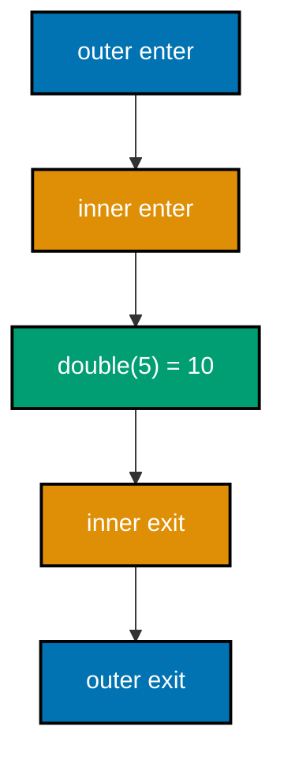

```python
"""Example 77: Stacking Multiple Decorators and Reasoning About Order."""

from functools import wraps  # => preserves double's identity through both decorator layers
from typing import Callable  # => Callable types the logged decorator factory below

call_order: list[str] = []  # => records the ACTUAL order decorators run in, top-to-bottom vs inside-out


def logged(label: str) -> Callable[[Callable[[int], int]], Callable[[int], int]]:  # => a decorator factory
    def decorator(fn: Callable[[int], int]) -> Callable[[int], int]:  # => the actual decorator
        @wraps(fn)  # => preserves fn's identity through this layer
        def wrapper(x: int) -> int:  # => logs entry/exit around whatever fn this layer wraps
            call_order.append(f"{label} enter")  # => runs BEFORE the wrapped function
            result = fn(x)  # => calls the NEXT layer in (or the real function, if innermost)
            call_order.append(f"{label} exit")  # => runs AFTER the wrapped function
            return result  # => forwards the inner result unchanged

        return wrapper  # => decorator itself returns the logging wrapper

    return decorator  # => logged(label) itself returns the decorator


@logged("outer")  # => applied SECOND -- wraps whatever @logged("inner") already produced
@logged("inner")  # => applied FIRST -- wraps the raw function directly
def double(x: int) -> int:  # => the innermost function, wrapped twice
    return x * 2  # => the actual computation, untouched by either decorator


result = double(5)  # => triggers BOTH wrapper layers, in a specific nesting order

# => decorator stacking is function composition wearing different syntax
print(result)  # => Output: 10
print(call_order)  # => Output: ['outer enter', 'inner enter', 'inner exit', 'outer exit']
```

**Output**:

```text
10
['outer enter', 'inner enter', 'inner exit', 'outer exit']
```

```python
"""Example 77: pytest verification for Stacking Multiple Decorators and Reasoning About Order."""

from example import call_order, double


def test_decorators_nest_outermost_first_innermost_last() -> None:
    call_order.clear()
    double(5)
    assert call_order == ["outer enter", "inner enter", "inner exit", "outer exit"]


# => Run: pytest -- Output: 1 passed
```

**Verify**: `pytest -q`

**Output**:

```text
1 passed
```

**Key takeaway**: Stacked decorators nest like function composition: the topmost `@decorator` wraps
everything below it, so its `enter` logic runs first and its `exit` logic runs last, with every layer
in between nested symmetrically around the innermost function call.

**Why it matters**: Decorator order bugs are common precisely because the visual top-to-bottom order of
`@decorator` lines does not immediately read as "outermost wraps everything below it." Seeing the
explicit `call_order` list -- outer enters, inner enters, the real function runs, inner exits, outer
exits -- turns an easy-to-misremember rule into something verified by running the code.

---

### Example 78: A Case Where Laziness Saves Work, and One Where It Hides a Cost

_ex-78 &middot; exercises co-15_

This example shows laziness from both sides in one file. Case 1 proves a lazy generator can stop after
finding the first value over 50 without computing the other roughly 950 values in the range -- clear
savings. Case 2 shows the hidden cost: re-iterating an already-exhausted generator silently yields
nothing at all, with no error to signal the mistake.

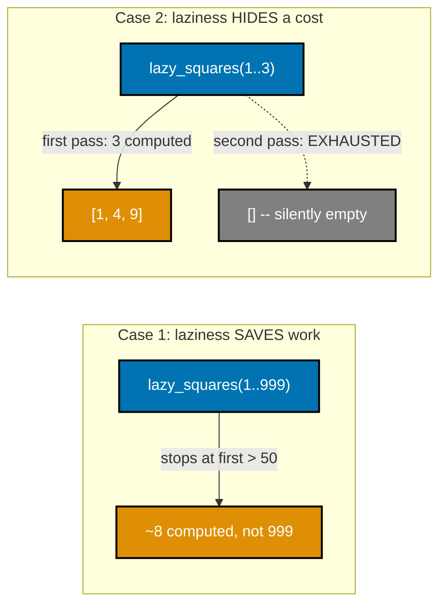

```python
"""Example 78: A Case Where Laziness Saves Work, and One Where It Hides a Cost."""

from typing import Iterator  # => Iterator types the lazy generator below

work_done: list[str] = []  # => records every "expensive" step actually performed


def expensive_step(n: int) -> int:  # => stands in for a slow computation
    work_done.append(f"computed {n}")  # => only runs when this step is ACTUALLY reached
    return n * n  # => the "expensive" result


def lazy_squares(numbers: range) -> Iterator[int]:  # => LAZY: nothing runs until pulled
    for n in numbers:  # => walks the range one value at a time, on demand
        yield expensive_step(n)  # => suspends here between pulls


def eager_squares(numbers: range) -> list[int]:  # => EAGER: computes EVERY value immediately
    return [expensive_step(n) for n in numbers]  # => materializes the WHOLE list before returning


work_done.clear()  # => resets the log before Case 1
lazy_stream = lazy_squares(range(1, 1000))  # => nothing computed yet
first_over_50 = next(n for n in lazy_stream if n > 50)  # => stops pulling the instant it finds one
lazy_work_count = len(work_done)  # => far fewer than 999

work_done.clear()  # => resets the log before Case 2
lazy_stream_2 = lazy_squares(range(1, 4))  # => a FRESH lazy generator
first_pass = list(lazy_stream_2)  # => first pass: 3 values computed
second_pass = list(lazy_stream_2)  # => generator already EXHAUSTED -- silently yields nothing
hidden_cost_count = len(work_done)  # => still 3, NOT 6 -- the second pass did nothing at all, silently

# => laziness is a trade-off, not a free win -- both sides of it matter
print(first_over_50)  # => Output: 64
print(lazy_work_count < 10)  # => Output: True -- laziness saved most of the 999 possible computations
print(second_pass)  # => Output: [] -- the SILENT trap: re-iterating an exhausted generator gives nothing
print(hidden_cost_count)  # => Output: 3 -- proves the second pass computed NOTHING, not that it recomputed
```

**Output**:

```text
64
True
[]
3
```

```python
"""Example 78: pytest verification for A Case Where Laziness Saves Work, and One Where It Hides a Cost."""

from example import lazy_squares, work_done


def test_reiterating_an_exhausted_generator_yields_nothing_silently() -> None:
    work_done.clear()
    stream = lazy_squares(range(1, 4))
    first_pass = list(stream)  # => consumes the generator fully
    assert first_pass == [1, 4, 9]
    assert len(work_done) == 3

    second_pass = list(stream)  # => the SAME (now exhausted) generator object
    assert second_pass == []  # => silently empty -- no error, no recomputation
    assert len(work_done) == 3  # => confirms NOTHING extra was computed


# => Run: pytest -- Output: 1 passed
```

**Verify**: `pytest -q`

**Output**:

```text
1 passed
```

**Key takeaway**: Laziness saves real work when a consumer stops pulling early, but a generator is a
one-shot, statefully-exhausted object -- iterating it a second time silently produces nothing, with no
exception to flag the mistake.

**Why it matters**: The "laziness is free" framing this topic has implicitly used up to now is
incomplete. A generator that gets accidentally iterated twice (passed to two different consumers, or
reused across a retry loop) fails silently rather than loudly, which is a real production bug class.
Knowing both sides -- the savings and the exhaustion trap -- is what lets a developer choose a
generator versus a list deliberately rather than by habit.

---

### Example 79: The Same Pipeline in `Option` vs. `Result`

_ex-79 &middot; exercises co-22, co-23, co-27_

`parse_option` and `parse_result` run the identical parsing logic and chain the identical `and_then`
step, differing only in their error type. `Option`'s `Nothing()` carries no information about why
parsing "bad" failed, while `Result`'s `Err("'bad' is not a digit string")` carries the reason --
otherwise the two pipelines are structurally identical.

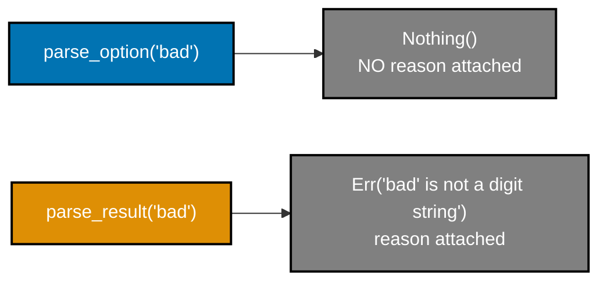

```python
"""Example 79: The Same Pipeline in Option vs. Result."""

from __future__ import annotations  # => enables the quoted forward references used below

from dataclasses import dataclass  # => @dataclass(frozen=True) builds all four variants below
from typing import Callable, Generic, TypeVar  # => Generic/TypeVar/Callable type both and_then methods

T = TypeVar("T")  # => the type of the value a Some or Ok wraps
U = TypeVar("U")  # => the type each and_then's step function returns


@dataclass(frozen=True)  # => marks Some immutable, matching the FP style
class Some(Generic[T]):  # => the class body begins here
    value: T  # => the single field this variant carries

    def and_then(self, fn: Callable[[T], "Option[U]"]) -> "Option[U]":  # => Option's chaining operation
        return fn(self.value)  # => runs fn on the unwrapped value


@dataclass(frozen=True)  # => marks Nothing immutable too
class Nothing:  # => the class body begins here
    def and_then(self, fn: Callable[[T], U]) -> "Nothing":  # => short-circuits, generic so union calls stay typed
        return self  # => Nothing carries NO explanation for why


Option = Some[T] | Nothing  # => the Option ADT: EITHER variant


@dataclass(frozen=True)  # => marks Ok immutable, matching the FP style
class Ok(Generic[T]):  # => the class body begins here
    value: T  # => the single field this variant carries

    def and_then(self, fn: Callable[[T], "Res[U]"]) -> "Res[U]":  # => Result's chaining operation
        return fn(self.value)  # => runs fn on the unwrapped value


@dataclass(frozen=True)  # => marks Err immutable too
class Err:  # => the class body begins here
    error: str  # => Result CARRIES a reason -- Option's Nothing cannot

    def and_then(self, fn: Callable[[T], U]) -> "Err":  # => short-circuits, generic so union calls stay typed
        return self  # => the REASON rides through untouched


Res = Ok[T] | Err  # => the Result ADT: EITHER variant


def parse_option(text: str) -> "Option[int]":  # => same parsing logic, Option's error model: just absence
    return Some(int(text)) if text.isdigit() else Nothing()  # => success wraps, failure loses all context


def parse_result(text: str) -> "Res[int]":  # => same parsing logic, Result's error model: WHY it failed
    return Ok(int(text)) if text.isdigit() else Err(f"'{text}' is not a digit string")  # => failure keeps context


def double_option(n: int) -> "Option[int]":  # => named + typed -- a bare lambda loses its param type on the union call
    return Some(n * 2)  # => same "double" step as double_result, wrapped in Option's variant


def double_result(n: int) -> "Res[int]":  # => named + typed, same reasoning as double_option
    return Ok(n * 2)  # => same "double" step as double_option, wrapped in Result's variant


option_pipeline = parse_option("42").and_then(double_option)  # => Option pipeline
result_pipeline = parse_result("42").and_then(double_result)  # => Result pipeline, same shape

option_failure = parse_option("bad")  # => Nothing -- no explanation attached
result_failure = parse_result("bad")  # => Err carrying a human-readable reason

# => the SAME chain, two error models -- pick based on whether the reason matters
print(option_pipeline)  # => Output: Some(value=84)
print(result_pipeline)  # => Output: Ok(value=84)
print(option_failure)  # => Output: Nothing() -- WHY it failed is not represented at all
print(result_failure)  # => Output: Err(error="'bad' is not a digit string") -- the reason IS represented
```

**Output**:

```text
Some(value=84)
Ok(value=84)
Nothing()
Err(error="'bad' is not a digit string")
```

```python
"""Example 79: pytest verification for The Same Pipeline in Option vs. Result."""

from example import Err, Nothing, Ok, Option, Res, Some, parse_option, parse_result


def _increment_option(n: int) -> Option[int]:
    return Some(n + 1)


def _increment_result(n: int) -> Res[int]:
    return Ok(n + 1)


def test_option_discards_the_reason_result_keeps_it() -> None:
    assert parse_option("bad") == Nothing()
    assert parse_result("bad") == Err("'bad' is not a digit string")
    assert parse_option("5").and_then(_increment_option) == Some(6)
    assert parse_result("5").and_then(_increment_result) == Ok(6)


# => Run: pytest -- Output: 1 passed
```

**Verify**: `pytest -q`

**Output**:

```text
1 passed
```

**Key takeaway**: `Option` and `Result` support the identical `and_then` chaining API; the only real
difference is whether the failure case carries a reason -- `Nothing()` cannot, `Err(reason)` always
does.

**Why it matters**: Reaching for `Option` when a caller will eventually need to know why something
failed forces awkward workarounds later (an out-of-band log message, a second lookup to explain the
absence). Choosing `Result` from the start whenever failure needs an explanation -- and `Option` only
when "present or absent" is the complete story -- avoids that retrofit entirely.

---

### Example 80: A Functional-Core Log Analyzer With `Result` Errors and an Applicative Combine

_ex-80 &middot; exercises co-28, co-23, co-26_

The capstone preview: `parse_all` combines this topic's error-accumulating applicative style (Example 71) with the functional-core/imperative-shell split (Example 29, Example 57) at the scale of a small
real tool. Every line of a simulated log file is parsed independently, every parse failure is collected
rather than stopping at the first one, and `run_shell` is still the only function that prints.

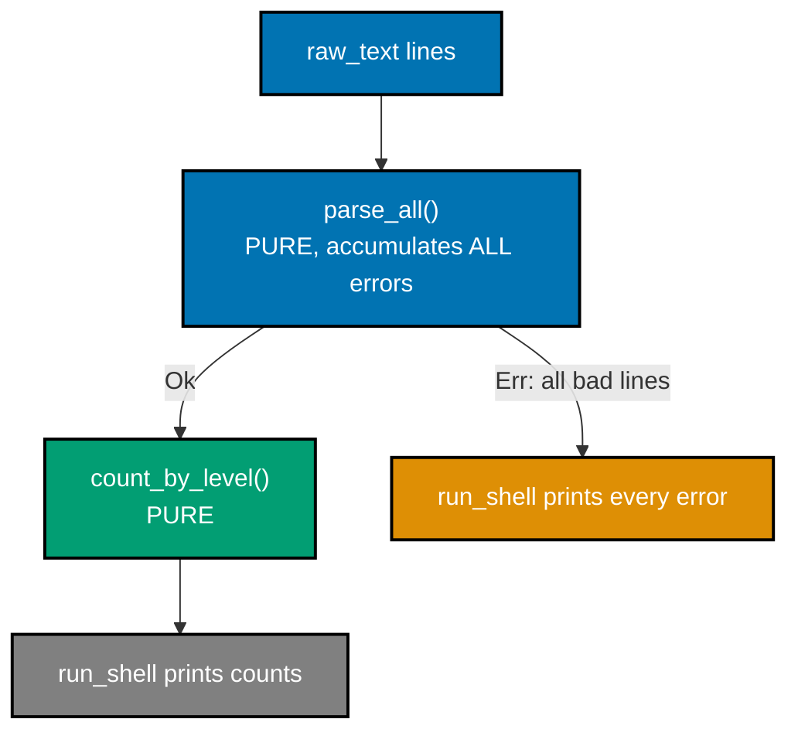

```python
"""Example 80: A Functional-Core Log Analyzer With Result Errors and an Applicative Combine."""

from __future__ import annotations  # => enables the quoted 'Result[T]'/'Result[list[LogEntry]]' references below

from dataclasses import dataclass  # => @dataclass(frozen=True) builds every immutable record here
from typing import Generic, TypeVar  # => Generic/TypeVar make Ok[T] a proper generic container

T = TypeVar("T")  # => the type of the value an Ok wraps


@dataclass(frozen=True)  # => marks Ok immutable, matching the FP style
class Ok(Generic[T]):  # => the class body begins here
    value: T  # => the single field this variant carries


@dataclass(frozen=True)  # => marks Err immutable too
class Err:  # => the class body begins here
    errors: tuple[str, ...]  # => accumulates every malformed line, not just the first


Result = Ok[T] | Err  # => the ADT itself: a Result is EITHER variant


@dataclass(frozen=True)  # => one PARSED, immutable log line
class LogEntry:  # => the class body begins here
    level: str  # => INFO, WARN, or ERROR
    message: str  # => the rest of the line, trimmed


def parse_line(line: str, line_number: int) -> "Result[LogEntry]":  # => PURE CORE: one line -> Result
    parts = line.split(":", 1)  # => splits "ERROR:disk full" into ["ERROR", "disk full"]
    if len(parts) != 2 or parts[0] not in ("INFO", "WARN", "ERROR"):  # => the ONLY validity rule
        return Err((f"line {line_number}: malformed entry '{line}'",))  # => a single-error Err, keyed to this line
    return Ok(LogEntry(level=parts[0], message=parts[1].strip()))  # => success wraps the parsed entry


def parse_all(lines: list[str]) -> "Result[list[LogEntry]]":  # => applicative combine: ALL lines, ALL errors
    entries: list[LogEntry] = []  # => collects every SUCCESSFULLY parsed entry
    errors: list[str] = []  # => collects every FAILURE, across every line, not just the first
    for i, line in enumerate(lines, start=1):  # => visits EVERY line regardless of earlier failures
        result = parse_line(line, i)  # => delegates to the pure per-line parser
        if isinstance(result, Ok):  # => this particular line parsed cleanly
            entries.append(result.value)  # => a good line contributes an entry
        else:  # => this particular line was malformed
            errors.extend(result.errors)  # => a bad line contributes its error, parsing CONTINUES
    if errors:  # => at least one line was malformed
        return Err(tuple(errors))  # => reports EVERY malformed line at once
    return Ok(entries)  # => every line parsed cleanly


def count_by_level(entries: list[LogEntry]) -> dict[str, int]:  # => PURE CORE: aggregation step
    counts: dict[str, int] = {}  # => the running per-level total
    for entry in entries:  # => folds every entry into the counts dict
        counts[entry.level] = counts.get(entry.level, 0) + 1  # => accumulates per level
    return counts  # => a fresh dict -- the input list itself is never mutated


def run_shell(raw_text: str) -> None:  # => IMPERATIVE SHELL: the only function that prints
    lines = raw_text.strip().splitlines()  # => splits the "file contents" into lines
    parsed = parse_all(lines)  # => delegates to the pure, error-accumulating core
    if isinstance(parsed, Err):  # => reports every problem found, still just ONE code path
        print(f"{len(parsed.errors)} error(s) found:")  # => the shell's own summary line
        for error in parsed.errors:  # => walks EVERY accumulated error, not just the first
            print(f"  {error}")  # => one printed line per malformed input line
        return  # => stops here -- no report is generated from partially-bad input
    counts = count_by_level(parsed.value)  # => delegates to the pure aggregation core
    for level in sorted(counts):  # => alphabetical report, deterministic output
        print(f"{level}: {counts[level]}")  # => one printed line per log level


good_log = "INFO:started\nWARN:low disk\nERROR:crashed\nINFO:restarted"  # => stands in for a real log file
# => this preview is a smaller version of what the capstone builds end to end
run_shell(good_log)  # => Output: ERROR: 1, then INFO: 2, then WARN: 1

bad_log = "INFO:ok\nnonsense line\nERROR:bad\nanother bad one"  # => two malformed lines mixed in
run_shell(bad_log)  # => Output: 2 error(s) found, both listed
```

**Output**:

```text
ERROR: 1
INFO: 2
WARN: 1
2 error(s) found:
  line 2: malformed entry 'nonsense line'
  line 4: malformed entry 'another bad one'
```

```python
"""Example 80: pytest verification for A Functional-Core Log Analyzer With Result Errors and an Applicative Combine."""

from example import Err, Ok, count_by_level, parse_all


def test_core_accumulates_every_malformed_line_and_counts_the_rest() -> None:
    good = ["INFO:a", "WARN:b", "INFO:c"]
    result = parse_all(good)
    assert isinstance(result, Ok)
    assert count_by_level(result.value) == {"INFO": 2, "WARN": 1}

    bad = ["INFO:a", "nonsense", "also nonsense"]
    bad_result = parse_all(bad)
    assert isinstance(bad_result, Err)
    assert len(bad_result.errors) == 2  # => BOTH malformed lines reported, not just the first


# => Run: pytest -- Output: 1 passed
```

**Verify**: `pytest -q`

**Output**:

```text
1 passed
```

**Key takeaway**: `parse_all` combines the functional-core/imperative-shell split with applicative,
error-accumulating validation at the scale of a small real tool -- every line is parsed independently,
every failure is collected, and exactly one function touches `print`.

**Why it matters**: This example previews the capstone at a smaller scale: a functional core
(`parse_line`, `parse_all`, `count_by_level`) that a test calls directly with string literals, wrapped
by one thin shell (`run_shell`) that handles the only I/O. Every pattern this topic built up --
immutable records, ADTs, `Result`-based error handling, applicative accumulation, pure/impure
separation -- comes together here in one working tool.

---

← Previous: [Intermediate Examples](./intermediate.md) &middot; Next: [Capstone](./capstone/overview.md) →
