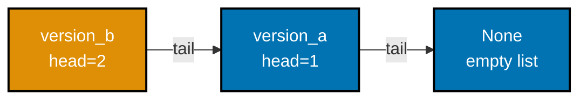
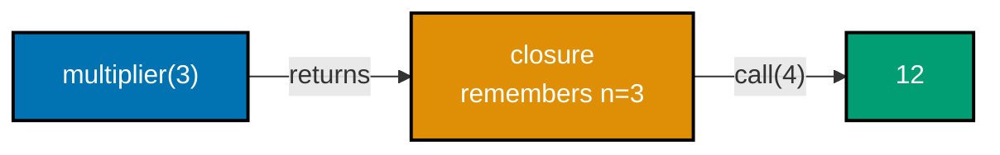
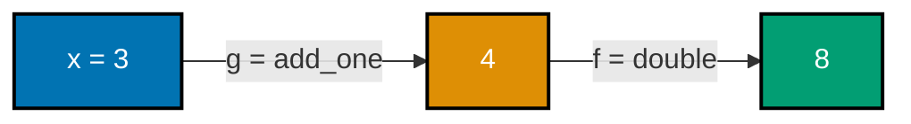
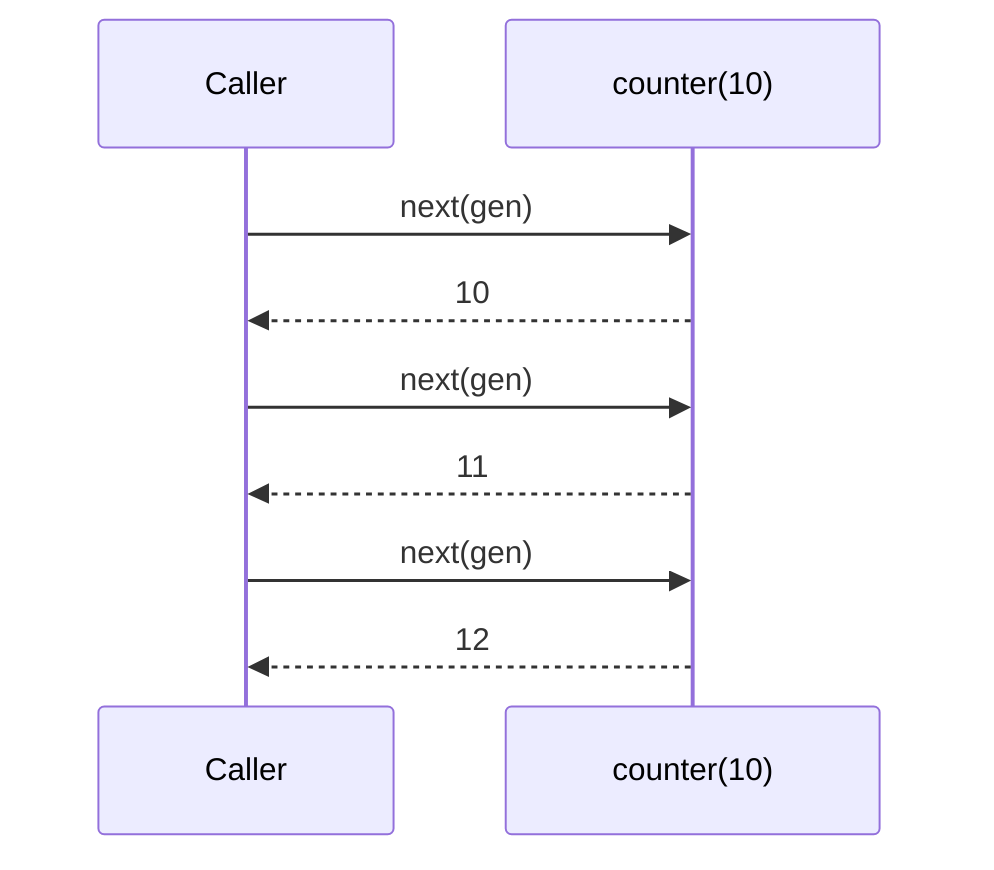
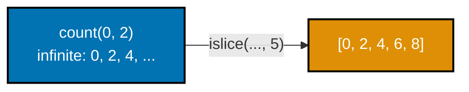
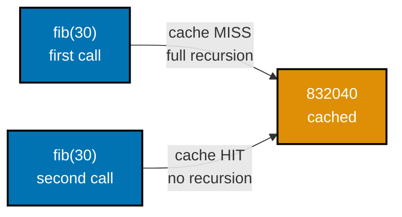
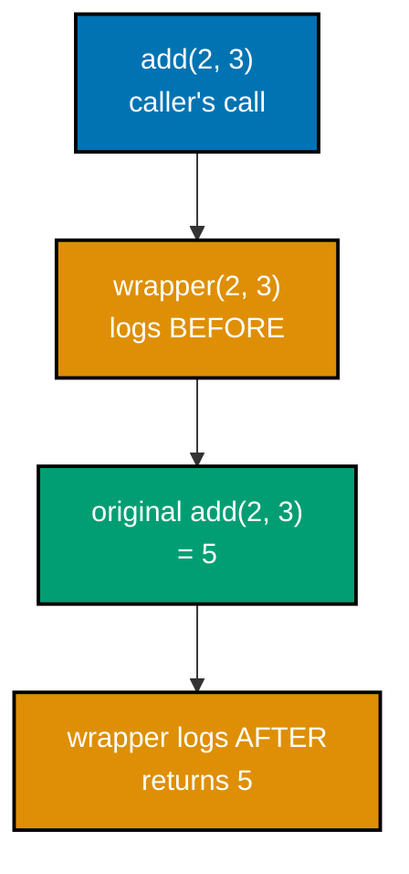
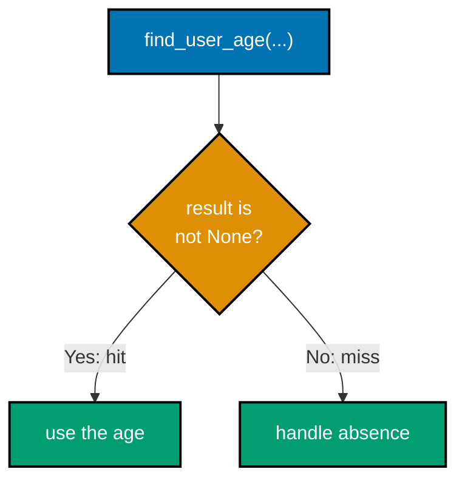

Examples 1-28 build the vocabulary every later example assumes: telling a pure function from an
impure one and naming exactly what a side effect is (co-01, co-02, co-03), the immutable data types
Python ships with -- `tuple`, `frozen` dataclasses, and `dataclasses.replace` -- plus a first taste of
structural sharing on a persistent cons-list (co-04, co-05), functions as ordinary first-class values
stored, passed, and returned (co-06 through co-09), `functools.partial` and hand-written `compose`/
`pipe` helpers (co-10, co-11, co-12), the `map`/`filter`/`reduce` trio (co-13), generators and a first
look at `itertools` (co-15, co-16), `functools.lru_cache` memoization and a logging decorator
(co-17, co-18), recursion under CPython's missing tail-call optimization (co-14), and guarding a
`None`-returning lookup as this topic's first brush with "absence as a value" (co-22). Every example
below is a complete, self-contained `example.py` colocated under `learning/code/ex-NN-slug/`, run with
`python3 example.py` to capture the **Output** block shown, and verified a second way with a colocated
`test_example.py` under `pytest -q`.

---

### Example 1: Pure vs. Impure -- Same Result Every Time

_ex-01 &middot; exercises co-01, co-02_

A pure function's result depends only on its arguments; an impure twin with the identical signature can
answer differently on the second call because it also reads or writes state the caller never sees. This
example places `add_pure` beside `add_impure`, an otherwise-identical function that mutates a
module-level counter, and confirms only the pure one gives the same result twice.

```python
"""Example 1: Pure vs. Impure -- Same Result Every Time."""

counter_total = 0  # => module-level global state -- the impure twin's playground


def add_pure(a: int, b: int) -> int:  # => pure: output depends ONLY on a and b
    return a + b  # => no write to anything outside this function -- no side effect


def add_impure(a: int, b: int) -> int:  # => same signature, very different behavior
    global counter_total  # => declares intent to MUTATE module-level state
    counter_total += a + b  # => side effect: writes state outside this function's scope
    # => the return value now depends on how many times this ran BEFORE, not just a, b
    return counter_total


first_pure = add_pure(2, 3)  # => first_pure is 5
second_pure = add_pure(2, 3)  # => second_pure is 5 -- SAME args, SAME result
print(first_pure == second_pure)  # => True: repeat calls with identical args always agree
# => Output: True

first_impure = add_impure(2, 3)  # => first_impure is 5 (counter_total was 0 before this)
second_impure = add_impure(2, 3)  # => second_impure is 10 -- SAME args, DIFFERENT result!
print(first_impure == second_impure)  # => False: hidden global state changed the answer
# => Output: False
```

**Output**:

```text
True
False
```

```python
"""Example 1: pytest verification for Pure vs. Impure -- Same Result Every Time."""

from example import add_impure, add_pure  # => imports both functions under test


def test_pure_add_is_repeatable() -> None:
    first = add_pure(2, 3)  # => first call
    second = add_pure(2, 3)  # => identical args, called again
    assert first == second == 5  # => pure function: always the same result


def test_impure_add_is_not_repeatable() -> None:
    first = add_impure(10, 10)  # => mutates the module-level counter as a side effect
    second = add_impure(10, 10)  # => SAME args, but counter_total has already grown
    assert first != second  # => impure function: repeat calls disagree


# => Run: pytest -- Output: 2 passed
```

**Verify**: `pytest -q`

**Output**:

```text
2 passed
```

**Key takeaway**: A pure function's output is a function of its arguments alone; an impure twin with an
identical signature can silently disagree with itself the moment hidden state changes underneath it.

**Why it matters**: Bugs that "only happen sometimes" are usually a pure-looking call secretly reading
or writing state outside its own arguments and return value. Recognizing the pure/impure boundary at a
glance is the single skill every later concept in this topic -- immutability, referential transparency,
the functional-core/imperative-shell split -- builds directly on top of.

---

### Example 2: Referential Transparency by Substitution

_ex-02 &middot; exercises co-03_

A call is referentially transparent when it can be replaced by its own return value anywhere in the
program without changing what the program computes. This example builds the same result two ways --
once by calling `add(2, 3)` inside a larger expression, once by substituting its value `5` directly --
and confirms both give the identical answer.

```python
"""Example 2: Referential Transparency by Substitution."""


def add(a: int, b: int) -> int:  # => a pure function -- referentially transparent
    return a + b  # => always returns the same value for the same a, b


def price_with_call() -> int:  # => uses the CALL add(2, 3) inside a larger expression
    return add(2, 3) * 10  # => add(2, 3) is evaluated, then multiplied by 10


def price_with_value() -> int:  # => the call REPLACED by its own return value, 5
    return 5 * 10  # => substituting add(2, 3) -> 5 changes nothing about the result


call_result = price_with_call()  # => call_result is 50
value_result = price_with_value()  # => value_result is 50 -- IDENTICAL to call_result
print(call_result == value_result)  # => True: the call was safely replaceable by its value
# => Output: True
```

**Output**:

```text
True
```

```python
"""Example 2: pytest verification for Referential Transparency by Substitution."""

from example import price_with_call, price_with_value


def test_call_and_value_agree() -> None:
    # => substituting add(2, 3) with its value 5 changes nothing about the result
    assert price_with_call() == price_with_value() == 50


# => Run: pytest -- Output: 1 passed
```

**Verify**: `pytest -q`

**Output**:

```text
1 passed
```

**Key takeaway**: If a call can always be swapped for its return value without changing the program's
behavior, it is referentially transparent -- and pure functions are exactly the ones with this property.

**Why it matters**: Referential transparency is what makes equational reasoning possible: simplifying an
expression by substituting a call for its value, the same way algebra simplifies `2 + 3` to `5`.
Compilers rely on the identical property for constant folding and memoization, and so does every human
reader trying to predict what a function call does without tracing hidden side effects first.

---

### Example 3: Classify Pure vs. Impure Functions

_ex-03 &middot; exercises co-02_

Naming exactly where the purity boundary sits is a design decision, not an accident -- a function that
prints, one that mutates its argument, and one that only computes and returns are three different
contracts wearing the same syntax. This example defines all three and a tiny classifier, and confirms
only the side-effect-free one is flagged pure.

```python
"""Example 3: Classify Pure vs. Impure Functions."""

log: list[str] = []  # => module-level list -- a target for one function's side effect


def loud_double(x: int) -> int:  # => impure: prints, an observable side effect
    print(f"doubling {x}")  # => I/O is a side effect -- output visible OUTSIDE the return value
    return x * 2  # => the return value itself is fine; the PRINT above is the side effect


def mutate_double(items: list[int]) -> None:  # => impure: mutates the CALLER's own list
    items.append(items[-1] * 2)  # => appends in place -- the caller's list object changes
    # => returns None on purpose: the "result" is the mutation itself, not a return value


def pure_double(x: int) -> int:  # => pure: only reads x, only returns a new value
    return x * 2  # => no print, no mutation of any argument, no global touched


def is_pure(fn_name: str) -> bool:  # => a tiny classifier keyed by name for this example
    return fn_name == "pure_double"  # => only pure_double is flagged pure by this check


nums = [1, 2]  # => a list the impure mutate_double will mutate below
mutate_double(nums)  # => side effect: nums is mutated to [1, 2, 4]
classifications = {  # => a dict recording each function's purity classification
    "loud_double": is_pure("loud_double"),  # => False -- prints, so it is impure
    "mutate_double": is_pure("mutate_double"),  # => False -- mutates its argument
    "pure_double": is_pure("pure_double"),  # => True -- the only one flagged pure
}  # => three functions, three independent purity verdicts
print(classifications["pure_double"])  # => Output: True
print(  # => reads both remaining classifications out of the same dict
    classifications["loud_double"], classifications["mutate_double"]
)
# => Output: False False
```

**Output**:

```text
True
False False
```

```python
"""Example 3: pytest verification for Classify Pure vs. Impure Functions."""

from example import is_pure, mutate_double, pure_double


def test_only_pure_double_is_flagged_pure() -> None:
    assert is_pure("pure_double") is True  # => the only function with zero side effects
    assert is_pure("loud_double") is False  # => prints -- a side effect
    assert is_pure("mutate_double") is False  # => mutates its argument -- a side effect


def test_mutate_double_changes_caller_list() -> None:
    items = [1, 2]
    mutate_double(items)  # => appends items[-1] * 2 in place
    assert items == [1, 2, 4]  # => the CALLER's own list object was mutated
    assert pure_double(3) == 6  # => pure_double never touches items at all


# => Run: pytest -- Output: 2 passed
```

**Verify**: `pytest -q`

**Output**:

```text
2 passed
```

**Key takeaway**: Printing, mutating an argument, and touching a global are all side effects, even
though every one of these functions has an ordinary-looking signature -- purity has to be verified by
reading the body, not guessed from the call site.

**Why it matters**: Codebases where nothing declares its own purity leave every function's contract
implicit, so any call might secretly mutate state a reviewer never sees. Explicitly classifying
functions this way is the first concrete step toward the functional-core/imperative-shell split this
whole topic builds toward.

---

### Example 4: Tuple Immutability vs. List Mutability

_ex-04 &middot; exercises co-04_

Python ships two sequence types with opposite mutability contracts: `list` allows item assignment,
`tuple` does not. This example mutates a list in place, then attempts the identical operation on a
tuple and catches the `TypeError` that immutability guarantees.

```python
"""Example 4: Tuple Immutability vs. List Mutability."""

mutable_list: list[int] = [1, 2, 3]  # => a list -- mutable, in-place assignment is legal
mutable_list[0] = 99  # => legal: lists allow item assignment
print(mutable_list)  # => Output: [99, 2, 3]

immutable_tuple: tuple[int, int, int] = (1, 2, 3)  # => a tuple -- immutable, fixed after creation
try:  # => opens a block that expects the next line to raise
    immutable_tuple[0] = 99  # type: ignore[index]  # => attempts item assignment on a tuple
    raised = False  # => unreachable if TypeError fires, kept for completeness
except TypeError as exc:  # => tuples have no __setitem__ -- this is EXPECTED, not a bug
    raised = True  # => confirms the immutability guarantee was actually enforced
    print(f"raised: {type(exc).__name__}")  # => Output: raised: TypeError

print(raised)  # => Output: True
print(immutable_tuple)  # => Output: (1, 2, 3) -- unchanged, the assignment never happened
```

**Output**:

```text
[99, 2, 3]
raised: TypeError
True
(1, 2, 3)
```

```python
"""Example 4: pytest verification for Tuple Immutability vs. List Mutability."""


def test_list_allows_item_assignment() -> None:
    items = [1, 2, 3]
    items[0] = 99  # => legal for a list
    assert items == [99, 2, 3]


def test_tuple_rejects_item_assignment() -> None:
    values = (1, 2, 3)
    try:
        values[0] = 99  # type: ignore[index]  # => tuples have no __setitem__
        raised = False
    except TypeError:
        raised = True
    assert raised is True  # => confirms immutability is actually enforced
    assert values == (1, 2, 3)  # => unchanged


# => Run: pytest -- Output: 2 passed
```

**Verify**: `pytest -q`

**Output**:

```text
2 passed
```

**Key takeaway**: A `tuple` is a `list` with item assignment removed -- reach for it whenever a
sequence's contents should never change after construction.

**Why it matters**: Choosing `tuple` over `list` for fixed data is a free, zero-cost guarantee: any code
path that tries to mutate it fails loudly with `TypeError` instead of silently corrupting shared state.
That loud failure is exactly the safety property every later immutability example in this topic --
frozen dataclasses, persistent structures -- builds on.

---

### Example 5: A Frozen Dataclass Rejects Mutation

_ex-05 &middot; exercises co-04_

`@dataclass(frozen=True)` generates `__init__`, `__repr__`, and `__eq__` the same way a plain dataclass
does, but also blocks every attribute assignment after construction. This example builds a `Point`,
prints it, then confirms a later assignment raises `FrozenInstanceError` instead of silently succeeding.

```python
"""Example 5: A Frozen Dataclass Rejects Mutation."""

from dataclasses import FrozenInstanceError, dataclass  # => frozen=True raises this on assignment


@dataclass(frozen=True)  # => generates __init__/__repr__/__eq__ AND blocks attribute assignment
class Point:  # => an immutable value object -- once built, it cannot change
    x: int  # => a regular field, just frozen at the class level
    y: int  # => a second field -- @dataclass generates __init__(self, x, y) from both


p = Point(1, 2)  # => __init__ is allowed to set fields ONCE, during construction
print(p)  # => Output: Point(x=1, y=2)

try:  # => opens a block that expects the assignment below to raise
    p.x = 99  # type: ignore[misc]  # => any LATER assignment is rejected, not just during init
    raised = False  # => unreachable if FrozenInstanceError fires first, kept for completeness
except FrozenInstanceError:  # => the frozen dataclass's own guard fired
    raised = True  # => confirms mutation was actually blocked, not silently ignored
print(raised)  # => Output: True
print(p)  # => Output: Point(x=1, y=2) -- still the original values
```

**Output**:

```text
Point(x=1, y=2)
True
Point(x=1, y=2)
```

```python
"""Example 5: pytest verification for A Frozen Dataclass Rejects Mutation."""

from dataclasses import FrozenInstanceError

from example import Point


def test_frozen_dataclass_rejects_assignment() -> None:
    p = Point(1, 2)
    try:
        p.x = 99  # type: ignore[misc]  # => frozen dataclasses block ALL later assignment
        raised = False
    except FrozenInstanceError:
        raised = True
    assert raised is True
    assert p == Point(1, 2)  # => unchanged -- the assignment never took effect


# => Run: pytest -- Output: 1 passed
```

**Verify**: `pytest -q`

**Output**:

```text
1 passed
```

**Key takeaway**: `frozen=True` upgrades a dataclass from "boilerplate-free record" to "boilerplate-free
immutable value object" -- construction is the only moment its fields can ever be set.

**Why it matters**: Immutable value objects are safe to hand to any other function, thread, or part of
the codebase without defensive copying, because nothing downstream can corrupt what you still hold a
reference to. `frozen=True` gets this guarantee for the cost of one keyword argument, no hand-written
`__setattr__` override required.

---

### Example 6: dataclasses.replace Produces a New Record

_ex-06 &middot; exercises co-04, co-05_

Since a frozen dataclass cannot be mutated, "updating" one means building a new instance instead --
`dataclasses.replace` does exactly that, copying every field except the ones explicitly overridden.
This example moves a `Point`'s `x` field and confirms the original is completely untouched.

```python
"""Example 6: dataclasses.replace Produces a New Record."""

from dataclasses import dataclass, replace  # => replace: a shallow copy with fields overridden


@dataclass(frozen=True)  # => frozen so "updating" MUST go through replace, not assignment
class Point:  # => the value object replace() will copy-with-overrides below
    x: int  # => first field -- the one this example overrides via replace
    y: int  # => second field -- left untouched, copied straight through by replace


original = Point(1, 2)  # => the record we will "update" without mutating
moved = replace(original, x=99)  # => builds a NEW Point: x overridden, y copied unchanged
# => original itself is never touched by replace -- it only READS original's fields

print(original)  # => Output: Point(x=1, y=2) -- untouched
print(moved)  # => Output: Point(x=99, y=2) -- a distinct object with the new x
print(original == moved)  # => Output: False -- two different values now
print(original is moved)  # => Output: False -- two different objects, not aliases
```

**Output**:

```text
Point(x=1, y=2)
Point(x=99, y=2)
False
False
```

```python
"""Example 6: pytest verification for dataclasses.replace Produces a New Record."""

from dataclasses import replace

from example import Point


def test_replace_leaves_original_untouched() -> None:
    original = Point(1, 2)
    moved = replace(original, x=99)  # => a NEW record, y copied unchanged
    assert original == Point(1, 2)  # => original never mutated
    assert moved == Point(99, 2)  # => new record has the overridden field
    assert original is not moved  # => two distinct objects


# => Run: pytest -- Output: 1 passed
```

**Verify**: `pytest -q`

**Output**:

```text
1 passed
```

**Key takeaway**: `dataclasses.replace(obj, field=new_value)` is the idiomatic "update" for a frozen
dataclass -- a shallow copy with named fields overridden, never a mutation of `obj` itself.

**Why it matters**: This topic uses `dataclasses.replace`, not the newer `copy.replace` (Python 3.13+),
specifically to stay compatible with Python 3.10 -- a concrete example of choosing the stdlib API with
the widest supported floor rather than the newest one. The pattern itself is the same shape every later
persistent-update example in this topic reuses at larger scale.

---

### Example 7: A Persistent Cons-List Prepend

_ex-07 &middot; exercises co-05_

A persistent data structure keeps every old version reachable after an "update," because the update
never mutates anything -- it builds a new version that shares whatever structure did not change with the
old one. This example prepends onto a cons-list built from frozen dataclass nodes and confirms the
older version is still completely intact.



```python
"""Example 7: A Persistent Cons-List Prepend."""

from __future__ import annotations  # => lets ConsList reference itself in its own field type

from dataclasses import dataclass  # => @dataclass generates __init__/__repr__/__eq__ for the node


@dataclass(frozen=True)  # => frozen: once linked, a node's head/tail never change
class ConsList:  # => the classic persistent linked list: a head value plus a tail list
    head: int  # => this node's own value
    tail: "ConsList | None"  # => None marks the empty tail -- the end of the list


def prepend(value: int, lst: "ConsList | None") -> ConsList:  # => builds a NEW node
    return ConsList(head=value, tail=lst)  # => tail is the OLD list, reused, never copied


def to_list(lst: "ConsList | None") -> list[int]:  # => walks nodes into a plain list, for printing
    result: list[int] = []  # => the plain list this walk accumulates into
    while lst is not None:  # => walking SHARED structure -- no mutation happens here
        result.append(lst.head)  # => reads this node's value
        lst = lst.tail  # => advances to the next shared node, never rewriting it
    return result  # => a fresh plain list -- the ConsList nodes themselves stay untouched


empty: ConsList | None = None  # => the empty list -- the shared base every version points to
version_a = prepend(1, empty)  # => version_a is [1]
version_b = prepend(2, version_a)  # => version_b is [2, 1] -- REUSES version_a as its tail

print(to_list(version_a))  # => Output: [1]
print(to_list(version_b))  # => Output: [2, 1]
print(version_b.tail is version_a)  # => Output: True -- structural sharing, not a copy
```

**Output**:

```text
[1]
[2, 1]
True
```

```python
"""Example 7: pytest verification for A Persistent Cons-List Prepend."""

from example import ConsList, prepend, to_list


def test_prepend_shares_the_old_tail() -> None:
    version_a: ConsList | None = prepend(1, None)  # => [1]
    version_b = prepend(2, version_a)  # => [2, 1], reusing version_a as tail

    assert to_list(version_a) == [1]  # => version_a unaffected by building version_b
    assert to_list(version_b) == [2, 1]
    assert version_b.tail is version_a  # => structural sharing, not a copy


# => Run: pytest -- Output: 1 passed
```

**Verify**: `pytest -q`

**Output**:

```text
1 passed
```

**Key takeaway**: Prepending onto a persistent linked list is `O(1)` and never touches the existing
nodes -- the new head simply points at the unchanged old list as its tail.

**Why it matters**: Structural sharing is what makes immutability affordable at scale: without it, every
"update" to a large structure would require a full deep copy. A cons-list prepend is the simplest
possible demonstration of the same sharing principle that makes persistent trees, immutable state
reducers, and functional data structures in general practical rather than wasteful.

---

### Example 8: A Function Assigned to a Variable

_ex-08 &middot; exercises co-06_

Functions in Python are ordinary values -- assigning one to a new name copies no code, it just gives the
same underlying function object a second name. This example assigns `shout` to `greeter` and confirms
calling through either name produces identical behavior.

```python
"""Example 8: A Function Assigned to a Variable."""


def shout(text: str) -> str:  # => an ordinary function, defined once
    return text.upper() + "!"  # => uppercases and appends an exclamation mark


greeter = shout  # => assigns the FUNCTION OBJECT itself to a new name -- no call, no ()
# => greeter and shout now both refer to the SAME underlying function object

direct_result = shout("hello")  # => calling through the original name
aliased_result = greeter("hello")  # => calling through the alias -- identical behavior

print(direct_result)  # => Output: HELLO!
print(aliased_result)  # => Output: HELLO!
print(direct_result == aliased_result)  # => Output: True -- same function, same result
print(greeter is shout)  # => Output: True -- greeter is not a copy, it IS shout
```

**Output**:

```text
HELLO!
HELLO!
True
True
```

```python
"""Example 8: pytest verification for A Function Assigned to a Variable."""

from example import shout


def test_alias_behaves_identically() -> None:
    greeter = shout  # => same function object, new name
    assert greeter is shout  # => not a copy
    assert greeter("hi") == shout("hi") == "HI!"


# => Run: pytest -- Output: 1 passed
```

**Verify**: `pytest -q`

**Output**:

```text
1 passed
```

**Key takeaway**: `greeter = shout` binds a second name to the same function object -- `greeter is shout`
is `True`, not merely `greeter == shout`.

**Why it matters**: Treating functions as ordinary values -- assignable, storable, passable -- is the
foundation every other concept in this section builds on. Without first-class functions, higher-order
functions, closures, currying, composition, and decorators would all be inexpressible: every one of
those later ideas is, underneath, just another way of storing, combining, or transforming a function
value. Languages that lack this property (early Java, for instance) had to bolt on interfaces and
anonymous classes just to approximate what Python gets for free from day one.

---

### Example 9: Functions Stored in a List

_ex-09 &middot; exercises co-06_

Because functions are ordinary values, a `list` can hold several of them exactly like it holds
integers or strings. This example stores three unrelated functions in a list and calls each one with
the same input.

```python
"""Example 9: Functions Stored in a List."""


def double(x: int) -> int:  # => three ordinary, unrelated single-purpose functions
    return x * 2  # => doubles its argument


def square(x: int) -> int:
    return x * x  # => squares its argument


def negate(x: int) -> int:
    return -x  # => flips the sign of its argument


operations = [double, square, negate]  # => a list of FUNCTION OBJECTS, not their results
# => nothing has been called yet -- the list just holds three callables

results = [op(5) for op in operations]  # => calls each stored function with the same input
# => results is [10, 25, -5]: double(5), square(5), negate(5) in that order

print(results)  # => Output: [10, 25, -5]
print(all(callable(op) for op in operations))  # => Output: True -- every element is callable
```

**Output**:

```text
[10, 25, -5]
True
```

```python
"""Example 9: pytest verification for Functions Stored in a List."""

from example import double, negate, square


def test_stored_functions_are_called_correctly() -> None:
    operations = [double, square, negate]
    results = [op(5) for op in operations]
    assert results == [10, 25, -5]


# => Run: pytest -- Output: 1 passed
```

**Verify**: `pytest -q`

**Output**:

```text
1 passed
```

**Key takeaway**: A list of functions is a list of callables like any other -- building `operations`
does not call anything; the comprehension `op(5)` is the only place any of the three ever run.

**Why it matters**: Storing behavior in an ordinary collection is the building block behind dispatch
tables, pipeline stages, and plugin-style registries -- adding a new operation is as simple as appending
one more function to the list, with zero changes to the code that iterates over it.

---

### Example 10: A Higher-Order apply Function

_ex-10 &middot; exercises co-07_

A higher-order function takes another function as an argument, returns one, or both -- `apply(fn, x)`
is the smallest possible example, forwarding `x` to whichever function it was handed. This example
calls `apply` with two entirely different functions and confirms it forwards correctly to both.

```python
"""Example 10: A Higher-Order apply Function."""

from typing import Callable  # => the type of "a function taking int, returning int"


def apply(fn: Callable[[int], int], x: int) -> int:  # => HOF: takes a FUNCTION as an argument
    return fn(x)  # => apply never needs to know what fn actually does


def increment(n: int) -> int:  # => one candidate to pass into apply
    return n + 1  # => adds exactly one


def triple(n: int) -> int:  # => a second, unrelated candidate to pass into apply
    return n * 3  # => multiplies by three


result_increment = apply(increment, 10)  # => apply calls increment(10) internally
result_triple = apply(triple, 10)  # => same apply, DIFFERENT function passed in

print(result_increment)  # => Output: 11
print(result_triple)  # => Output: 30
print(apply(increment, 10) == increment(10))  # => Output: True -- apply just forwards the call
```

**Output**:

```text
11
30
True
```

```python
"""Example 10: pytest verification for A Higher-Order apply Function."""

from example import apply, increment, triple


def test_apply_forwards_to_whichever_function_is_passed() -> None:
    assert apply(increment, 10) == 11
    assert apply(triple, 10) == 30
    assert apply(increment, 10) == increment(10)  # => apply changes nothing about the call


# => Run: pytest -- Output: 1 passed
```

**Verify**: `pytest -q`

**Output**:

```text
1 passed
```

**Key takeaway**: `apply` never inspects what `fn` does -- it only forwards the call -- which is exactly
what makes it reusable across any function matching its signature.

**Why it matters**: This is the smallest possible higher-order function, and the same shape underlies
`map`/`filter`/`reduce` (co-13), decorators (co-18), and every callback-based API in the standard
library. Recognizing "a function taking a function" as an ordinary, unremarkable pattern is a
prerequisite for everything that follows in this topic.

---

### Example 11: A Function Returning a Closure

_ex-11 &middot; exercises co-07, co-08_

A higher-order function can also return a function -- and when the returned function references a
variable from its enclosing scope, that variable is captured in a closure, remembered even after the
outer function has returned. This example builds `multiplier(n)`, confirming each call produces an
independent closure remembering its own `n`.



```python
"""Example 11: A Function Returning a Closure."""

from typing import Callable  # => the return type of multiplier -- "a function int -> int"


def multiplier(n: int) -> Callable[[int], int]:  # => HOF: RETURNS a function, doesn't just take one
    def multiply_by_n(x: int) -> int:  # => a closure -- captures n from the enclosing scope
        return x * n  # => n is remembered even after multiplier() has already returned

    return multiply_by_n  # => the inner function itself is the return value


times_three = multiplier(3)  # => times_three is now a function that always multiplies by 3
times_five = multiplier(5)  # => a SEPARATE closure, capturing a different n (5)

print(times_three(4))  # => Output: 12  (4 * 3, using the captured n=3)
print(times_five(4))  # => Output: 20  (4 * 5, using the captured n=5)
print(multiplier(3)(4) == 12)  # => Output: True -- calling the returned function immediately
```

**Output**:

```text
12
20
True
```

```python
"""Example 11: pytest verification for A Function Returning a Closure."""

from example import multiplier


def test_returned_closures_remember_their_own_n() -> None:
    times_three = multiplier(3)
    times_five = multiplier(5)
    assert times_three(4) == 12
    assert times_five(4) == 20
    assert multiplier(3)(4) == 12  # => calling the returned function immediately


# => Run: pytest -- Output: 1 passed
```

**Verify**: `pytest -q`

**Output**:

```text
1 passed
```

**Key takeaway**: Each call to `multiplier(n)` produces an independent closure -- `times_three` and
`times_five` remember two different `n` values simultaneously, with no shared state between them.

**Why it matters**: Returning a closure is how a function "bakes in" configuration once and hands back a
specialized version, rather than threading a parameter through every future call site. This is the
direct ancestor of `functools.partial` (co-10) and every parameterized decorator (co-18) that follows
later in this topic.

---

### Example 12: A Closure Capturing a Threshold

_ex-12 &middot; exercises co-08_

Closures are useful for more than multiplication -- any value baked in at closure-creation time changes
the closure's behavior on every future call. This example builds two validators with different captured
thresholds and confirms they disagree on the identical input.

```python
"""Example 12: A Closure Capturing a Threshold."""

from typing import Callable  # => the return type of make_validator -- "a function int -> bool"


def make_validator(threshold: int) -> Callable[[int], bool]:  # => bakes threshold into a closure
    def is_above_threshold(value: int) -> bool:  # => captures threshold, no parameter for it
        return value > threshold  # => reads the ENCLOSING threshold, not a fresh argument

    return is_above_threshold  # => this closure, not a plain value, is what gets returned


passes_ten = make_validator(10)  # => remembers threshold=10 forever
passes_hundred = make_validator(100)  # => a DIFFERENT closure, remembers threshold=100

print(passes_ten(15))  # => Output: True   (15 > 10)
print(passes_hundred(15))  # => Output: False  (15 is NOT > 100)
print(passes_ten(15) != passes_hundred(15))  # => Output: True -- same input, different config
```

**Output**:

```text
True
False
True
```

```python
"""Example 12: pytest verification for A Closure Capturing a Threshold."""

from example import make_validator


def test_closures_vary_with_their_captured_threshold() -> None:
    passes_ten = make_validator(10)
    passes_hundred = make_validator(100)
    assert passes_ten(15) is True
    assert passes_hundred(15) is False


# => Run: pytest -- Output: 1 passed
```

**Verify**: `pytest -q`

**Output**:

```text
1 passed
```

**Key takeaway**: The captured `threshold` lives inside the closure, not in a parameter the caller
supplies each time -- two closures built from the same factory can disagree forever on the same input.

**Why it matters**: Baking configuration into a closure at creation time avoids re-passing the same
argument on every call, which is exactly the shape validators, comparators, and event handlers take in
production code. It is also the same mechanism, in miniature, that a parameterized decorator like
`@retry(3)` (Example 42) relies on later in this topic.

---

### Example 13: map() Uppercases Every Word

_ex-13 &middot; exercises co-13_

`map(fn, iterable)` lazily applies `fn` to every element, producing an iterator rather than a list --
nothing runs until the iterator is consumed. This example maps `str.upper` over a list of words and
confirms every element was transformed, none dropped.

```python
"""Example 13: map() Uppercases Every Word."""

words = ["functional", "programming", "in", "python"]  # => the source sequence

uppercased = map(str.upper, words)  # => LAZY: map builds an iterator, nothing runs yet
# => str.upper is an unbound method -- map calls it as str.upper(word) for each word

uppercased_list = list(uppercased)  # => forces evaluation -- NOW every word is uppercased
print(uppercased_list)  # => Output: ['FUNCTIONAL', 'PROGRAMMING', 'IN', 'PYTHON']
print(len(uppercased_list) == len(words))  # => Output: True -- map is 1:1, never drops elements
print(all(w.isupper() for w in uppercased_list))  # => Output: True -- every word transformed
```

**Output**:

```text
['FUNCTIONAL', 'PROGRAMMING', 'IN', 'PYTHON']
True
True
```

```python
"""Example 13: pytest verification for map() Uppercases Every Word."""


def test_map_uppercases_every_element() -> None:
    words = ["a", "bee", "sea"]
    result = list(map(str.upper, words))
    assert result == ["A", "BEE", "SEA"]
    assert len(result) == len(words)  # => map never drops elements


# => Run: pytest -- Output: 1 passed
```

**Verify**: `pytest -q`

**Output**:

```text
1 passed
```

**Key takeaway**: `map` is always 1:1 -- the output has exactly as many elements as the input, each one
transformed, none dropped and none added.

**Why it matters**: `map` replaces a hand-written accumulation loop (`for w in words: result.append(...)`)
with a single declarative expression, and being lazy means a `map` over a huge or infinite source never
materializes more than the caller actually consumes -- the same laziness this topic revisits with
generators and `itertools` later.

---

### Example 14: filter() Keeps Only Evens

_ex-14 &middot; exercises co-13_

`filter(predicate, iterable)` keeps only the elements the predicate accepts, lazily -- the complement of
`map`'s "transform every element." This example filters a list down to its even numbers and confirms
exactly half survive.

```python
"""Example 14: filter() Keeps Only Evens."""


def is_even(n: int) -> bool:  # => the predicate filter will apply to each element
    return n % 2 == 0  # => True keeps the element, False drops it


nums = [1, 2, 3, 4, 5, 6, 7, 8]  # => the source sequence

evens = filter(is_even, nums)  # => LAZY: builds an iterator, no filtering has happened yet
evens_list = list(evens)  # => forces evaluation -- runs is_even on every element

print(evens_list)  # => Output: [2, 4, 6, 8]
print(len(evens_list))  # => Output: 4 -- exactly half of the original 8 elements
print(all(n % 2 == 0 for n in evens_list))  # => Output: True -- odds were dropped, not zeroed
```

**Output**:

```text
[2, 4, 6, 8]
4
True
```

```python
"""Example 14: pytest verification for filter() Keeps Only Evens."""

from example import is_even


def test_filter_keeps_only_predicate_matches() -> None:
    nums = [1, 2, 3, 4, 5, 6]
    result = list(filter(is_even, nums))
    assert result == [2, 4, 6]


# => Run: pytest -- Output: 1 passed
```

**Verify**: `pytest -q`

**Output**:

```text
1 passed
```

**Key takeaway**: `filter` shrinks a sequence; it never transforms the surviving elements -- combine it
with `map` (Example 16) when both shrinking and transforming are needed.

**Why it matters**: `filter` states "keep only elements matching this predicate" directly, without a
mutable accumulator variable exposed to the caller -- recognizing a hand-written "loop, if-check,
append" pattern as secretly a `filter` is one of the most immediately useful skills in this topic.

---

### Example 15: reduce() Sums a List

_ex-15 &middot; exercises co-13_

`functools.reduce(fn, iterable, seed)` folds a whole sequence down to a single accumulated value, one
element at a time, with no explicit accumulator variable in the caller's own code. This example folds a
list of integers into their sum and confirms it matches the built-in `sum`.

```python
"""Example 15: reduce() Sums a List."""

from functools import reduce  # => reduce lives in functools, not the builtins


def add(a: int, b: int) -> int:  # => the "how to combine two values" step reduce repeats
    return a + b  # => the two-argument combiner reduce calls at every step


nums = [1, 2, 3, 4, 5]  # => the source sequence

total = reduce(add, nums, 0)  # => folds nums into ONE value, starting from the seed 0
# => reduce computes add(add(add(add(add(0,1),2),3),4),5) -- one running accumulator, no loop written

print(total)  # => Output: 15
print(total == sum(nums))  # => Output: True -- reduce(add, ..., 0) IS how sum() works internally
```

**Output**:

```text
15
True
```

```python
"""Example 15: pytest verification for reduce() Sums a List."""

from functools import reduce

from example import add


def test_reduce_sums_the_sequence() -> None:
    nums = [1, 2, 3, 4, 5]
    assert reduce(add, nums, 0) == 15 == sum(nums)


# => Run: pytest -- Output: 1 passed
```

**Verify**: `pytest -q`

**Output**:

```text
1 passed
```

**Key takeaway**: `reduce(fn, iterable, seed)` states "combine every element into one value using fn,
starting from seed" as a single expression -- no explicit running-total variable in the caller.

**Why it matters**: `map`, `filter`, and `reduce` together cover the overwhelming majority of "loop over
a collection and do something" code, without a single mutable accumulator variable exposed to the
caller. `reduce` specifically is the general case that `sum`, `max`, and `any`/`all` are all specialized
shortcuts for -- once a developer can build an arbitrary reduction by hand, reaching for the stdlib
shortcut where one exists becomes a readability choice, not a capability gap. Example 37 later chains
all three into one data-summary pipeline.

---

### Example 16: A Comprehension Matching map() and filter()

_ex-16 &middot; exercises co-13_

A list comprehension with a condition expresses `map` plus `filter` together in one expression -- the
`if` clause is the filter step, the leading expression is the map step. This example builds the same
squared-evens list two ways and confirms they are identical.

```python
"""Example 16: A Comprehension Matching map() and filter()."""

nums = [1, 2, 3, 4, 5, 6, 7, 8, 9, 10]  # => the shared source sequence for both approaches

via_map_filter = list(  # => map(square, filter(is_even, nums)), spelled out with a lambda
    map(lambda n: n * n, filter(lambda n: n % 2 == 0, nums))  # => two nested lazy iterators
)  # => filter runs first (keeps evens), THEN map squares what survived

via_comprehension = [n * n for n in nums if n % 2 == 0]  # => same two steps, ONE expression
# => "if n % 2 == 0" is the filter step; "n * n" is the map step -- read left to right

print(via_map_filter)  # => Output: [4, 16, 36, 64, 100]
print(via_comprehension)  # => Output: [4, 16, 36, 64, 100]
print(via_map_filter == via_comprehension)  # => Output: True -- two spellings, identical result
```

**Output**:

```text
[4, 16, 36, 64, 100]
[4, 16, 36, 64, 100]
True
```

```python
"""Example 16: pytest verification for A Comprehension Matching map() and filter()."""


def test_comprehension_matches_map_filter() -> None:
    nums = list(range(1, 11))
    via_map_filter = list(map(lambda n: n * n, filter(lambda n: n % 2 == 0, nums)))
    via_comprehension = [n * n for n in nums if n % 2 == 0]
    assert via_map_filter == via_comprehension


# => Run: pytest -- Output: 1 passed
```

**Verify**: `pytest -q`

**Output**:

```text
1 passed
```

**Key takeaway**: A comprehension's `if` clause is a `filter`; its leading expression is a `map` -- the
two spellings compute identically, and Python code usually favors the comprehension for readability.

**Why it matters**: Recognizing that a comprehension and a `map`/`filter` chain are the same computation
means reaching for whichever reads more clearly in context, rather than treating them as competing
paradigms. Both remain fully declarative -- neither exposes a mutable loop variable to the caller.

---

### Example 17: Hand-Curry a Two-Argument Function

_ex-17 &middot; exercises co-09_

Currying turns an `n`-argument function into a chain of one-argument functions, each application
peeling off exactly one argument. This example hand-curries a 2-argument `add` into `add_curried(a)(b)`
and confirms it matches the uncurried call.

```python
"""Example 17: Hand-Curry a Two-Argument Function."""

from typing import Callable  # => the return type of add_curried -- "a function int -> int"


def add(a: int, b: int) -> int:  # => the ordinary, uncurried, 2-argument function
    return a + b  # => both arguments supplied in a SINGLE call


def add_curried(a: int) -> Callable[[int], int]:  # => takes ONE argument, returns a function
    def inner(b: int) -> int:  # => the function waiting for the SECOND argument
        return a + b  # => a is captured from the enclosing scope, b arrives here

    return inner  # => add_curried(a) is itself a usable, partially-applied function


uncurried_result = add(2, 3)  # => the ordinary call -- both arguments at once
curried_result = add_curried(2)(3)  # => two separate calls: add_curried(2) THEN (3)

print(uncurried_result)  # => Output: 5
print(curried_result)  # => Output: 5
print(uncurried_result == curried_result)  # => Output: True -- same computation, different shape

add_two = add_curried(2)  # => a reusable, specialized function: "add 2 to whatever comes next"
print(add_two(10))  # => Output: 12
```

**Output**:

```text
5
5
True
12
```

```python
"""Example 17: pytest verification for Hand-Curry a Two-Argument Function."""

from example import add, add_curried


def test_curried_call_matches_uncurried_call() -> None:
    assert add_curried(2)(3) == add(2, 3) == 5


def test_partially_applied_curry_is_reusable() -> None:
    add_two = add_curried(2)
    assert add_two(10) == 12
    assert add_two(20) == 22


# => Run: pytest -- Output: 2 passed
```

**Verify**: `pytest -q`

**Output**:

```text
2 passed
```

**Key takeaway**: `add_curried(2)` is itself a usable, reusable function -- currying lets each partial
application produce a new, smaller function rather than requiring every argument at once.

**Why it matters**: Currying and partial application (co-10, Example 18) are closely related but
distinct: currying is always one argument at a time by construction, while `functools.partial` can fix
any number of arguments in a single call. Example 62 later automates this hand-written pattern with a
`@curry` decorator.

---

### Example 18: functools.partial Fixes an Argument

_ex-18 &middot; exercises co-10_

`functools.partial(fn, *args)` fixes some arguments right now and returns a smaller function waiting
for the rest -- the stdlib's built-in answer to "I want this function, but with an argument already
decided." This example fixes `power`'s base and confirms the result matches calling `power` directly.

```python
"""Example 18: functools.partial Fixes an Argument."""

from functools import partial  # => stdlib's built-in way to pre-fill arguments


def power(base: int, exponent: int) -> int:  # => the general 2-argument function
    return base**exponent  # => base to the exponent power


square_of = partial(power, 2)  # => fixes base=2, returns a 1-argument function of exponent
# => no lambda, no hand-written closure -- functools builds the wrapper for us

print(square_of(3))  # => Output: 8  (power(2, 3) == 2**3)
print(square_of(10))  # => Output: 1024  (power(2, 10) == 2**10)
print(power(2, 10) == square_of(10))  # => Output: True -- partial just pre-supplies base
```

**Output**:

```text
8
1024
True
```

```python
"""Example 18: pytest verification for functools.partial Fixes an Argument."""

from functools import partial

from example import power


def test_partial_fixes_the_first_argument() -> None:
    square_of = partial(power, 2)
    assert square_of(10) == power(2, 10) == 1024


# => Run: pytest -- Output: 1 passed
```

**Verify**: `pytest -q`

**Output**:

```text
1 passed
```

**Key takeaway**: `functools.partial(fn, arg)` is more discoverable and less error-prone than a
hand-written wrapping lambda for the identical purpose -- reach for it whenever a function needs "the
same fn, with an argument already decided."

**Why it matters**: `partial` composes cleanly with `functools.reduce` (Example 33 chains several
`partial` calls into a pipeline) and with decorator pipelines elsewhere in this topic, and it is the
stdlib-blessed alternative every code reviewer will recognize instantly over an equivalent
hand-written closure. Reaching for `partial` instead of writing `lambda n: pow(2, n)` by hand also
signals intent directly -- "this is a fixed-argument specialization of an existing function" -- rather
than making a reader reverse-engineer that same fact from an ad hoc closure body.

---

### Example 19: A compose(f, g) Helper

_ex-19 &middot; exercises co-11_

Composition builds a new function `f ∘ g` out of two existing ones, so calling the composed function on
`x` runs `g(x)` first and feeds its result into `f`. This example hand-writes `compose` and confirms it
computes exactly `f(g(x))`.



```python
"""Example 19: A compose(f, g) Helper."""

from typing import Callable  # => the type of every function this example composes


def compose(  # => a HOF: takes two functions, RETURNS a new function
    f: Callable[[int], int], g: Callable[[int], int]  # => the two functions being combined
) -> Callable[[int], int]:  # => the return type -- itself a function int -> int
    def composed(x: int) -> int:  # => the returned function -- runs g FIRST, then f
        return f(g(x))  # => g(x) computed first; its result feeds into f

    return composed  # => composed itself, not a value, is compose's return value


def add_one(x: int) -> int:  # => one of the two small functions being composed together
    return x + 1  # => adds exactly one


def double(x: int) -> int:  # => the other small function being composed together
    return x * 2  # => doubles its argument


add_then_double = compose(double, add_one)  # => reads right-to-left: double(add_one(x))
result = add_then_double(3)  # => add_one(3) is 4, then double(4) is 8

print(result)  # => Output: 8
print(add_then_double(3) == double(add_one(3)))  # => Output: True -- compose just names f(g(x))
```

**Output**:

```text
8
True
```

```python
"""Example 19: pytest verification for A compose(f, g) Helper."""

from example import add_one, compose, double


def test_compose_runs_g_then_f() -> None:
    add_then_double = compose(double, add_one)
    assert add_then_double(3) == double(add_one(3)) == 8


# => Run: pytest -- Output: 1 passed
```

**Verify**: `pytest -q`

**Output**:

```text
1 passed
```

**Key takeaway**: `compose(f, g)` names the shape "run `g` first, feed its result into `f`" as a single
reusable function, instead of writing `f(g(x))` fresh at every call site.

**Why it matters**: Composition is how small, single-purpose functions become a pipeline without being
fused into one large function body -- each piece stays independently readable and independently
testable. A codebase built from composed small functions can also be tested at each stage in isolation,
rather than only end to end, which makes it far easier to pinpoint exactly which step introduced a
regression. Example 34 later generalizes this to `compose(*fns)` over an arbitrary list of functions.

---

### Example 20: A Left-to-Right pipe Helper

_ex-20 &middot; exercises co-12, co-11_

Where `compose` reads right-to-left (`f(g(x))`), a `pipe` utility reads left-to-right in the order
values actually flow -- `pipe(x, f, g)` means "start with `x`, apply `f`, then apply `g`." This example
confirms `pipe` and the equivalent nested call compute the identical result.

```python
"""Example 20: A Left-to-Right pipe Helper."""

from functools import reduce  # => reduce folds *fns into x one step at a time
from typing import Callable  # => the type of each step function pipe accepts


def pipe(x: int, *fns: Callable[[int], int]) -> int:  # => *fns: any number of step functions
    return reduce(lambda acc, fn: fn(acc), fns, x)  # => applies each fn IN ORDER, left to right


def add_one(x: int) -> int:  # => the first step in the pipeline below
    return x + 1  # => adds exactly one


def double(x: int) -> int:  # => the second step in the pipeline below
    return x * 2  # => doubles its argument


piped_result = pipe(3, add_one, double)  # => reads top-to-bottom: start at 3, add_one, THEN double
nested_result = double(add_one(3))  # => the equivalent nested call -- reads inside-out instead

print(piped_result)  # => Output: 8
print(nested_result)  # => Output: 8
print(piped_result == nested_result)  # => Output: True -- pipe and nesting compute the same thing
```

**Output**:

```text
8
8
True
```

```python
"""Example 20: pytest verification for A Left-to-Right pipe Helper."""

from example import add_one, double, pipe


def test_pipe_matches_nested_calls() -> None:
    assert pipe(3, add_one, double) == double(add_one(3)) == 8


# => Run: pytest -- Output: 1 passed
```

**Verify**: `pytest -q`

**Output**:

```text
1 passed
```

**Key takeaway**: `pipe` and nested calls compute the identical thing; the only difference is reading
direction -- `pipe` reads in execution order, nested calls read inside-out.

**Why it matters**: For a chain of more than two or three steps, reading left-to-right in execution
order is measurably easier to follow than unwinding nested parentheses. Example 74 later contrasts a
much deeper `pipe` chain against the equivalent nesting on real data, where this readability gap
becomes concrete.

---

### Example 21: A Generator Yields on Demand

_ex-21 &middot; exercises co-15_

A generator function runs no code at all when called -- it returns a generator object, and the body
only advances up to the next `yield` each time `next()` is called. This example builds an infinite
counter and confirms only the values actually pulled are ever computed.



```python
"""Example 21: A Generator Yields on Demand."""

from typing import Iterator  # => the return type of a generator function


def counter(start: int) -> Iterator[int]:  # => a generator FUNCTION -- calling it runs NO code yet
    n = start  # => the running value, remembered ACROSS yields
    while True:  # => an INFINITE loop -- safe only because yield pauses execution each time
        yield n  # => pauses here, handing n back to the caller, resuming on the NEXT next()
        n += 1  # => only runs AFTER the caller pulls again


pulled: list[int] = []  # => tracks exactly which values were actually computed
gen = counter(10)  # => creates the generator OBJECT -- the while loop has not run at all yet

pulled.append(next(gen))  # => resumes the generator until the first yield -- pulled: [10]
pulled.append(next(gen))  # => resumes again from where it paused -- pulled: [10, 11]
pulled.append(next(gen))  # => a third pull -- pulled: [10, 11, 12]

print(pulled)  # => Output: [10, 11, 12]
print(len(pulled))  # => Output: 3 -- only 3 values ever computed, despite counter() being infinite
```

**Output**:

```text
[10, 11, 12]
3
```

```python
"""Example 21: pytest verification for A Generator Yields on Demand."""

from example import counter


def test_only_pulled_values_are_computed() -> None:
    gen = counter(10)
    pulled = [next(gen), next(gen), next(gen)]
    assert pulled == [10, 11, 12]


# => Run: pytest -- Output: 1 passed
```

**Verify**: `pytest -q`

**Output**:

```text
1 passed
```

**Key takeaway**: Calling a generator function builds a paused generator object; the body only advances
between `yield` points, one `next()` call at a time -- an infinite `while True` loop is safe precisely
because of this pause.

**Why it matters**: Laziness lets a pipeline operate over a sequence of unknown or infinite size without
ever materializing it in memory -- the caller only pays for values it actually pulls. Every later
generator and `itertools` example in this topic (Examples 22-24, 38, 63-64) builds directly on this
pull-based execution model.

---

### Example 22: Generator Expression vs. List

_ex-22 &middot; exercises co-15_

A list comprehension computes and stores every element immediately; a generator expression with
identical syntax computes nothing until pulled. This example measures the memory footprint of both over
one million elements and confirms the generator's footprint stays essentially flat.

```python
"""Example 22: Generator Expression vs. List."""

import sys  # => sys.getsizeof measures the actual object footprint, in bytes

n = 1_000_000  # => a large N -- big enough to make the memory difference obvious

eager_list = [i * i for i in range(n)]  # => EAGER: every single square computed and stored NOW
lazy_generator = (i * i for i in range(n))  # => LAZY: builds a generator object, computes NOTHING yet
# => same source expression, two entirely different memory strategies

list_bytes = sys.getsizeof(eager_list)  # => size of N already-materialized integers' container
generator_bytes = sys.getsizeof(lazy_generator)  # => size of the generator machinery only

print(list_bytes > generator_bytes)  # => Output: True -- the list is dramatically larger
print(generator_bytes < 300)  # => Output: True -- a generator's footprint stays tiny regardless of n
print(next(lazy_generator))  # => Output: 0 -- the FIRST square is only computed on this pull
```

**Output**:

```text
True
True
0
```

```python
"""Example 22: pytest verification for Generator Expression vs. List."""

import sys


def test_generator_footprint_stays_small() -> None:
    n = 1_000_000
    eager_list = [i * i for i in range(n)]
    lazy_generator = (i * i for i in range(n))
    assert sys.getsizeof(eager_list) > sys.getsizeof(lazy_generator)
    assert sys.getsizeof(lazy_generator) < 300


# => Run: pytest -- Output: 1 passed
```

**Verify**: `pytest -q`

**Output**:

```text
1 passed
```

**Key takeaway**: The list comprehension and generator expression compute the identical values; only
the moment and location of computation differ -- upfront and in memory versus on-demand and streamed.

**Why it matters**: Swapping `[...]` for `(...)` is a one-character change with a dramatic memory
consequence for large or infinite sequences. Choosing eagerly when every value is needed anyway, and
lazily when only a prefix or a filtered subset is needed, is a concrete, measurable design decision --
not a stylistic preference.

---

### Example 23: islice Over an Infinite count()

_ex-23 &middot; exercises co-16, co-15_

`itertools.islice` takes a slice of any iterable, including an infinite one, without ever trying to
exhaust it. This example takes the first five values from an infinite generator of even numbers and
confirms the underlying source resumes right where `islice` stopped.



```python
"""Example 23: islice Over an Infinite count()."""

from itertools import count, islice  # => count(): an infinite counter; islice: a lazy slice

infinite_evens = (n for n in count(0, 2))  # => LAZY, infinite: 0, 2, 4, 6, ... forever
first_five = list(islice(infinite_evens, 5))  # => islice pulls exactly 5 values, then STOPS
# => the underlying infinite generator is NEVER exhausted -- islice just stops pulling

print(first_five)  # => Output: [0, 2, 4, 6, 8]
print(len(first_five))  # => Output: 5 -- islice never tries to exhaust the infinite source
next_value = next(infinite_evens)  # => the underlying generator resumes right where islice left it
print(next_value)  # => Output: 10 -- confirms islice consumed exactly the first 5, no more
```

**Output**:

```text
[0, 2, 4, 6, 8]
5
10
```

```python
"""Example 23: pytest verification for islice Over an Infinite count()."""

from itertools import count, islice


def test_islice_takes_exactly_n_from_an_infinite_source() -> None:
    infinite_evens = (n for n in count(0, 2))
    first_five = list(islice(infinite_evens, 5))
    assert first_five == [0, 2, 4, 6, 8]
    assert next(infinite_evens) == 10  # => confirms the source resumes right where islice stopped


# => Run: pytest -- Output: 1 passed
```

**Verify**: `pytest -q`

**Output**:

```text
1 passed
```

**Key takeaway**: `islice(iterable, n)` pulls exactly `n` values and stops -- it never tries to exhaust
its source, which is what makes it safe to use directly on an infinite generator.

**Why it matters**: `itertools.islice` is the idiomatic way to bound an otherwise-unbounded stream
without wrapping it in manual counting logic. Hand-writing the equivalent bound with an index-tracking
loop is a common place off-by-one bugs creep in; `islice` centralizes that bookkeeping in a single,
well-tested stdlib call. Example 63's lazy prime sieve later composes `islice` with several other
`itertools` building blocks to stay entirely lazy end to end.

---

### Example 24: chain and groupby Over Data

_ex-24 &middot; exercises co-16_

`itertools.chain` concatenates several iterables into one flat sequence; `itertools.groupby` groups
only _consecutive_ equal keys, which means its input must already be sorted by that key. This example
combines two lists, sorts, and groups them by first letter.

```python
"""Example 24: chain and groupby Over Data."""

from itertools import chain, groupby  # => chain: concatenate iterables; groupby: group consecutive keys

morning = ["apple", "apricot", "banana"]  # => two separately-sourced lists to combine
evening = ["blueberry", "cherry", "avocado"]  # => notice: NOT globally sorted by first letter

combined = list(chain(morning, evening))  # => one flat sequence, morning's items THEN evening's
print(combined)  # => shows the raw, unsorted concatenation before grouping
# => Output: ['apple', 'apricot', 'banana', 'blueberry', 'cherry', 'avocado']

grouped = {  # => groupby only groups CONSECUTIVE equal keys -- input must be pre-sorted by key
    letter: list(items)  # => materialize each lazy group before it is invalidated
    for letter, items in groupby(  # => sorted() first, so equal first-letters become consecutive
        sorted(combined), key=lambda w: w[0]  # => the grouping key: each word's first letter
    )  # => groupby itself is lazy -- list(items) above is what forces each group
}  # => a plain dict, one entry per distinct first letter seen
print(grouped["a"])  # => Output: ['apple', 'apricot', 'avocado']
print(grouped["b"])  # => Output: ['banana', 'blueberry']
```

**Output**:

```text
['apple', 'apricot', 'banana', 'blueberry', 'cherry', 'avocado']
['apple', 'apricot', 'avocado']
['banana', 'blueberry']
```

```python
"""Example 24: pytest verification for chain and groupby Over Data."""

from itertools import chain, groupby


def test_chain_then_groupby() -> None:
    morning = ["apple", "apricot", "banana"]
    evening = ["blueberry", "cherry", "avocado"]
    combined = list(chain(morning, evening))
    grouped = {k: list(v) for k, v in groupby(sorted(combined), key=lambda w: w[0])}
    assert grouped["a"] == ["apple", "apricot", "avocado"]
    assert grouped["b"] == ["banana", "blueberry"]


# => Run: pytest -- Output: 1 passed
```

**Verify**: `pytest -q`

**Output**:

```text
1 passed
```

**Key takeaway**: `groupby` groups only _consecutive_ matching keys -- forgetting to `sorted()` the
input first is the single most common `groupby` mistake, silently producing more, smaller groups than
expected.

**Why it matters**: `chain` and `groupby` are two of `itertools`'s most-used composable building blocks
-- reaching for them instead of a hand-rolled concatenation loop or grouping dict keeps the code both
shorter and lazy end to end, right up until the point something forces materialization.

---

### Example 25: @lru_cache on a Recursive fib

_ex-25 &middot; exercises co-17_

`functools.lru_cache` memoizes a pure function's results keyed by its arguments -- a repeated call with
the same argument is served from the cache instead of recomputed. This example decorates a naive
recursive Fibonacci and confirms `cache_info()` shows a hit on the second identical call.



```python
"""Example 25: @lru_cache on a Recursive fib."""

from functools import lru_cache  # => decorator-based memoization, keyed by call arguments


@lru_cache(maxsize=None)  # => unbounded cache -- every unique n is computed at most once
def fib(n: int) -> int:  # => the classic exponential-without-caching recursive definition
    if n < 2:  # => base case: fib(0) = 0, fib(1) = 1
        return n  # => no further recursion needed below n=2
    return fib(n - 1) + fib(n - 2)  # => WITHOUT caching this branches exponentially


result = fib(30)  # => triggers a burst of recursive calls, each cached the FIRST time it runs
info_after_first = fib.cache_info()  # => snapshot: hits so far, misses so far

fib(30)  # => calling AGAIN with the same n=30 -- served entirely from cache, no recursion
info_after_second = fib.cache_info()  # => hits increased, misses did NOT

print(result)  # => Output: 832040
print(info_after_second.hits > info_after_first.hits)  # => Output: True -- repeat call hit the cache
print(info_after_second.misses == info_after_first.misses)  # => Output: True -- no NEW work happened
```

**Output**:

```text
832040
True
True
```

```python
"""Example 25: pytest verification for @lru_cache on a Recursive fib."""

from example import fib


def test_repeat_call_hits_the_cache() -> None:
    fib.cache_clear()  # => start from a known, empty cache
    fib(20)  # => first call: populates the cache
    before = fib.cache_info()
    fib(20)  # => identical call: should be served from cache
    after = fib.cache_info()
    assert after.hits > before.hits
    assert after.misses == before.misses


# => Run: pytest -- Output: 1 passed
```

**Verify**: `pytest -q`

**Output**:

```text
1 passed
```

**Key takeaway**: Memoization is safe here only because `fib` is pure -- caching an impure function's
results would silently return stale side effects along with a stale value.

**Why it matters**: An unmemoized recursive `fib` is exponential; `@lru_cache` makes it linear, because
every unique argument is computed exactly once and reused on every later call. This one-line decorator
turns a textbook recursion exercise into a production-viable function, and the same trick generalizes to
any pure function whose argument space is small enough to cache -- parsing a fixed config value, looking
up a derived constant, or memoizing an expensive but deterministic computation inside a hot loop.

---

### Example 26: A Logging Decorator Wraps a Function

_ex-26 &middot; exercises co-18_

A decorator is a higher-order function that takes a function and returns a wrapped replacement --
`@log_calls` on `def add(): ...` is exactly `add = log_calls(add)`, spelled with `@` syntax. This
example wraps `add` with logging and confirms the wrapped result is unchanged.



```python
"""Example 26: A Logging Decorator Wraps a Function."""

from typing import Callable  # => the type shape both the wrapped and wrapper functions share

calls: list[str] = []  # => records what the decorator observed, for verification below


def log_calls(fn: Callable[[int, int], int]) -> Callable[[int, int], int]:  # => decorator: fn -> wrapped fn
    def wrapper(a: int, b: int) -> int:  # => runs INSTEAD of fn when the decorated name is called
        calls.append(f"calling {fn.__name__}({a}, {b})")  # => logs BEFORE the real call
        result = fn(a, b)  # => delegates to the original, undecorated function
        calls.append(f"{fn.__name__} returned {result}")  # => logs AFTER, using the real result
        return result  # => the wrapper's return value is EXACTLY the original's return value

    return wrapper  # => this function object replaces add everywhere add() is called


@log_calls  # => equivalent to: add = log_calls(add)
def add(a: int, b: int) -> int:  # => the plain function BEFORE decoration wraps it
    return a + b  # => the ordinary, undecorated computation


wrapped_result = add(2, 3)  # => actually calls wrapper(2, 3), which logs then delegates
print(wrapped_result)  # => Output: 5 -- the wrapped result is unchanged from the plain call
print(calls)  # => Output: ['calling add(2, 3)', 'add returned 5']
```

**Output**:

```text
5
['calling add(2, 3)', 'add returned 5']
```

```python
"""Example 26: pytest verification for A Logging Decorator Wraps a Function."""

from example import add


def test_decorator_preserves_the_result() -> None:
    assert add(2, 3) == 5  # => the wrapped call still returns the correct value


# => Run: pytest -- Output: 1 passed
```

**Verify**: `pytest -q`

**Output**:

```text
1 passed
```

**Key takeaway**: `@log_calls` on `def add(): ...` is exactly `add = log_calls(add)` -- the `@` syntax
is sugar over a plain function-to-function transformation, nothing more.

**Why it matters**: Decorators attach cross-cutting behavior -- logging, timing, retrying, caching --
without touching the decorated function's own body, which keeps that behavior reusable across any
function it is applied to instead of copy-pasted into each one. Example 43 later shows the one detail
this example glosses over: without `functools.wraps`, the wrapped function's `__name__` and metadata
are lost, which breaks introspection tools and confuses debuggers reading a stack trace.

---

### Example 27: A Recursive Factorial (No TCO)

_ex-27 &middot; exercises co-14_

Recursion is the functional idiom for what a loop does imperatively -- but CPython, by explicit design
choice, performs no tail-call optimization, so every recursive call grows the call stack by one frame.
This example computes a modest recursive factorial and confirms it stays comfortably under the default
recursion ceiling.

```python
"""Example 27: A Recursive Factorial (No TCO)."""

import sys  # => sys.getrecursionlimit -- CPython's hard, load-bearing recursion ceiling


def factorial(n: int) -> int:  # => the textbook recursive definition -- one call per n
    if n <= 1:  # => base case stops the recursion
        return 1  # => factorial(0) and factorial(1) both bottom out here
    return n * factorial(n - 1)  # => NOT a tail call reduced away -- CPython keeps every frame


result = factorial(10)  # => 10 nested calls deep -- trivially within the default limit
print(result)  # => Output: 3628800

limit = sys.getrecursionlimit()  # => the default ceiling (commonly 1000) -- CPython has NO TCO
# => a self-tail-call in Python is NOT collapsed into a loop by the interpreter, unlike Scheme
print(limit > 100)  # => Output: True -- 10 frames of factorial(10) fit comfortably under this
print(10 < limit)  # => Output: True -- confirms this call never approaches the ceiling
```

**Output**:

```text
3628800
True
True
```

```python
"""Example 27: pytest verification for A Recursive Factorial (No TCO)."""

from example import factorial


def test_factorial_matches_the_known_value() -> None:
    assert factorial(10) == 3628800
    assert factorial(0) == 1  # => base case


# => Run: pytest -- Output: 1 passed
```

**Verify**: `pytest -q`

**Output**:

```text
1 passed
```

**Key takeaway**: Every recursive call in CPython grows the call stack by one frame -- there is no
tail-call optimization collapsing `n * factorial(n - 1)` into a loop, unlike Scheme or other functional
languages that guarantee it.

**Why it matters**: Recursion is often the most natural way to express a divide-and-conquer or
tree-shaped computation, but Python's missing TCO is a real, load-bearing limit. Example 44 converts a
deep recursion into an explicit stack, and Example 66 builds a trampoline -- the two standard workarounds
this constraint demands.

---

### Example 28: Guarding a None-Returning Function

_ex-28 &middot; exercises co-22_

`dict.get` returns `None` on a missing key instead of raising, making "not found" an ordinary value the
caller must check before trusting. This example looks up a hit and a miss and confirms both are handled
explicitly by the same guard pattern.



```python
"""Example 28: Guarding a None-Returning Function."""


def find_user_age(users: dict[str, int], name: str) -> int | None:  # => None means "not found"
    return users.get(name)  # => dict.get returns None on a missing key -- no exception raised


directory = {"ana": 30, "budi": 25}  # => the lookup table this example queries

found_age = find_user_age(directory, "ana")  # => a hit -- found_age is 30
if found_age is not None:  # => the guard: caller MUST check before trusting the value
    print(f"ana is {found_age}")  # => Output: ana is 30
else:  # => the miss branch -- never taken for this particular lookup
    print("ana not found")  # => unreachable here -- ana IS in the directory

missing_age = find_user_age(directory, "citra")  # => a miss -- missing_age is None
if missing_age is not None:  # => same guard pattern, this time it takes the OTHER branch
    print(f"citra is {missing_age}")  # => unreachable here -- citra is NOT in the directory
else:  # => the miss branch -- taken this time, since citra is not in directory
    print("citra not found")  # => Output: citra not found
```

**Output**:

```text
ana is 30
citra not found
```

```python
"""Example 28: pytest verification for Guarding a None-Returning Function."""

from example import find_user_age


def test_hit_and_miss_are_both_handled() -> None:
    directory = {"ana": 30}
    assert find_user_age(directory, "ana") == 30
    assert find_user_age(directory, "citra") is None


# => Run: pytest -- Output: 1 passed
```

**Verify**: `pytest -q`

**Output**:

```text
1 passed
```

**Key takeaway**: `int | None` states in the return type itself that absence is possible -- the `is not
None` guard is the caller honoring that contract, not defensive boilerplate.

**Why it matters**: A caller that forgets the `None` check crashes later with an unhelpful
"`NoneType` has no attribute" error, far from where the `None` actually originated. Example 48 replaces
this pattern with a hand-rolled `Option` type that forces the caller to unwrap explicitly, turning a
possible runtime crash into a type-level obligation.

---

← Previous: [Overview](./overview.md) &middot; Next: [Intermediate Examples](./intermediate.md) →
