Examples 29-56 move from vocabulary to machinery: extracting a pure core from a mutating routine as
this topic's first hands-on functional-core/imperative-shell split (co-28, co-01), a persistent linked
list proving O(1) sharing with a cached length field (co-05), `MappingProxyType` as a read-only
boundary (co-04), a closure and a pure fold carrying the same count two different ways (co-08),
`functools.partial` pipelines feeding into an N-ary `compose` and a point-free rewrite (co-09 through
co-11, co-19), the full `map`/`filter`/`reduce` trio plus a lazy generator pipeline pulled by `next`
(co-13, co-15), `itertools.accumulate`/`pairwise`/`tee` (co-16), a hand-rolled memoization dict and a
parameterized `@retry(3)` decorator with `functools.wraps` (co-17, co-18), converting recursion past
CPython's missing tail-call optimization into an explicit stack (co-14), a `Shape` sum-type ADT
dispatched with `match`/`case` and guards (co-20, co-21), and this topic's first hand-rolled `Option`
and `Result` types with `map`, `and_then`, a railway-oriented validation pipeline, the functor identity
law, one `fmap` over two containers, applicative `map2`, and monadic `bind` chaining (co-22 through
co-27). Every example below is a complete, self-contained `example.py` colocated under
`learning/code/ex-NN-slug/`, run with `python3 example.py` to capture the **Output** block shown, and
verified a second way with a colocated `test_example.py` under `pytest -q`.

---

### Example 29: Extract a Pure Core from a Mutating Routine

_ex-29 &middot; exercises co-01, co-28_

A routine that mixes computation with I/O is hard to test because verifying its answer also means
intercepting its side effects. This example splits `process_orders_impure` into a pure
`sum_orders_pure` core plus a pure `make_log_lines` helper, and confirms both give the identical
answer the original mutating routine produced.

```python
"""Example 29: Extract a Pure Core from a Mutating Routine."""

report_log: list[str] = []  # => the ORIGINAL routine's hidden side effect target


def process_orders_impure(orders: list[int]) -> int:  # => mixes computation AND I/O together
    total = 0  # => the running sum, mutated below
    for amount in orders:  # => a loop mutating both total and the module-level log
        total += amount  # => mutates total AND appends below -- two side effects per iteration
        report_log.append(f"processed {amount}")  # => side effect buried inside the loop
    return total  # => the caller cannot test this without also inspecting report_log


def sum_orders_pure(orders: list[int]) -> int:  # => the EXTRACTED core -- no I/O, no logging
    return sum(orders)  # => a pure fold, trivially testable with no mocking


def make_log_lines(orders: list[int]) -> list[str]:  # => the logging, extracted as its OWN pure function
    return [f"processed {amount}" for amount in orders]  # => still pure: builds and returns, doesn't print


orders = [10, 20, 30]  # => shared input for both the impure routine and the pure core

impure_total = process_orders_impure(orders)  # => also mutates report_log as a side effect
pure_total = sum_orders_pure(orders)  # => computes the SAME total with zero side effects

# => this is the co-28 functional-core/imperative-shell split in miniature
print(impure_total == pure_total)  # => Output: True -- same answer, radically different testability
print(make_log_lines(orders) == report_log)  # => Output: True -- logging extracted without losing it
```

**Output**:

```text
True
True
```

```python
"""Example 29: pytest verification for Extract a Pure Core from a Mutating Routine."""

from example import make_log_lines, sum_orders_pure


def test_pure_core_needs_no_mocking() -> None:
    orders = [1, 2, 3]
    assert sum_orders_pure(orders) == 6  # => tested with plain arguments, no I/O to intercept


def test_log_lines_extracted_as_pure_function() -> None:
    orders = [5, 15]
    assert make_log_lines(orders) == ["processed 5", "processed 15"]


# => Run: pytest -- Output: 2 passed
```

**Verify**: `pytest -q`

**Output**:

```text
2 passed
```

**Key takeaway**: Extracting the pure computation from its side effects turns "test this by mocking a
log" into "test this with plain arguments and a plain return value."

**Why it matters**: Most production bugs hide at the seam between computation and I/O, because that
seam is exactly where hidden state sneaks in. The functional-core/imperative-shell pattern (co-28)
makes that seam explicit: push every side effect to the thin outer shell, keep the core a pure function
of its arguments. This example is the smallest possible version of the pattern this topic's capstone
(Example 80) applies at the scale of an entire log analyzer -- a functional core wrapped by a shell
that reads files and prints results.

---

### Example 30: O(1) Sharing on a Persistent Linked List

_ex-30 &middot; exercises co-05_

Example 7 already showed a persistent cons-list shares structure instead of copying it; this example
makes the O(1) cost of that sharing concrete by caching each node's own length so prepending never
walks the list to compute it. `plist_prepend` reads `lst.length` -- a single field access -- rather
than traversing to count nodes.

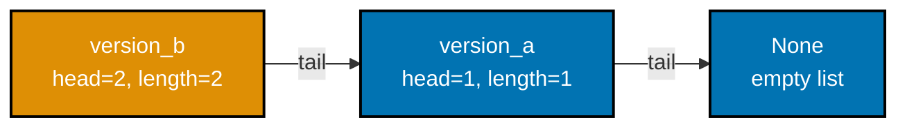

```python
"""Example 30: O(1) Sharing on a Persistent Linked List."""

from __future__ import annotations  # => enables the quoted 'PList | None' forward reference below

from dataclasses import dataclass  # => @dataclass(frozen=True) builds the immutable PList node


@dataclass(frozen=True)  # => a persistent list node caching its own length -- O(1) to read
class PList:  # => the node type itself -- see the decorator above for immutability
    head: int  # => this node's own value
    tail: "PList | None"  # => the shared, untouched rest of the list
    length: int  # => cached at construction time -- never recomputed by walking


def plist_prepend(value: int, lst: "PList | None") -> PList:  # => O(1): no walk over lst needed
    previous_length = lst.length if lst is not None else 0  # => O(1) read of a cached field
    return PList(head=value, tail=lst, length=previous_length + 1)  # => reuses lst AS-IS


empty: PList | None = None  # => the shared empty base every version points back to
version_a = plist_prepend(1, empty)  # => version_a.length is 1
version_b = plist_prepend(2, version_a)  # => version_b.length is 2, REUSING version_a untouched

# => structural sharing means version_b costs O(1) extra memory, not O(n)
print(version_a.length)  # => Output: 1
print(version_b.length)  # => Output: 2
print(version_b.tail is version_a)  # => Output: True -- structural sharing, not a copy
print(version_a.head)  # => Output: 1 -- version_a itself was never touched by building version_b
```

**Output**:

```text
1
2
True
1
```

```python
"""Example 30: pytest verification for O(1) Sharing on a Persistent Linked List."""

from example import PList, plist_prepend


def test_prepend_is_o1_and_shares_the_tail() -> None:
    version_a: PList | None = plist_prepend(1, None)
    version_b = plist_prepend(2, version_a)  # => O(1): only reads version_a.length, never walks it

    assert version_b.length == 2
    assert version_a.length == 1  # => unaffected by building version_b
    assert version_b.tail is version_a  # => structural sharing, not a copy


# => Run: pytest -- Output: 1 passed
```

**Verify**: `pytest -q`

**Output**:

```text
1 passed
```

**Key takeaway**: Persistent data structures are efficient specifically because operations like
prepend touch a constant number of nodes, not the whole structure -- caching derived data like length
is one common way to keep it that way.

**Why it matters**: Without cached length, discovering "how long is this list" after each prepend
would require an O(n) walk, silently turning what looks like an O(1) operation into something
quadratic across a chain of updates. Real persistent structures (Clojure's vectors, the structural
sharing behind many immutable collection libraries) apply the same trick more broadly: reuse untouched
substructure, cache anything a caller is likely to ask for immediately.

---

### Example 31: A Read-Only View via MappingProxyType

_ex-31 &middot; exercises co-04_

`types.MappingProxyType` wraps an existing dict in a view that raises `TypeError` on any write while
reads pass straight through -- a cheap way to hand out "read-only" configuration without copying it.
This example confirms the view blocks a write attempt and also confirms it is a LIVE view, not a
snapshot: mutating the underlying dict is still visible through it.

```python
"""Example 31: A Read-Only View via MappingProxyType."""

from types import MappingProxyType  # => a read-only VIEW over an existing dict, not a copy

config = {"retries": 3, "timeout": 5}  # => the underlying mutable dict this example protects
readonly_config = MappingProxyType(config)  # => wraps config -- reads pass through, writes are blocked
# => this is the co-04 "immutability at the boundary" pattern -- share config without risking mutation

print(readonly_config["retries"])  # => Output: 3 -- reads work exactly like a normal dict

try:  # => opens a block that expects the write below to raise
    readonly_config["retries"] = 99  # type: ignore[index]  # => attempts a write through the view
    raised = False  # => unreachable if TypeError fires
except TypeError:  # => MappingProxyType has no __setitem__
    raised = True  # => confirms the view actually blocked the write

print(raised)  # => Output: True
config["retries"] = 10  # => the UNDERLYING dict itself is still mutable directly
print(readonly_config["retries"])  # => Output: 10 -- the view reflects the underlying dict LIVE
```

**Output**:

```text
3
True
10
```

```python
"""Example 31: pytest verification for A Read-Only View via MappingProxyType."""

from types import MappingProxyType


def test_view_blocks_writes_but_reflects_the_underlying_dict() -> None:
    config = {"retries": 3}
    readonly_config = MappingProxyType(config)
    try:
        readonly_config["retries"] = 99  # type: ignore[index]
        raised = False
    except TypeError:
        raised = True
    assert raised is True

    config["retries"] = 10  # => mutate the underlying dict directly
    assert readonly_config["retries"] == 10  # => the view is LIVE, not a snapshot


# => Run: pytest -- Output: 1 passed
```

**Verify**: `pytest -q`

**Output**:

```text
1 passed
```

**Key takeaway**: MappingProxyType is not immutability in the frozen-dataclass sense -- it is a
read-only boundary around data that is still mutable from the "owning" side.

**Why it matters**: Handing a plain dict to a function you don't control means trusting it not to
mutate your config; handing a MappingProxyType means a runtime `TypeError` enforces that trust instead
of a code review comment. It is the cheapest tool in this topic's immutability toolbox -- no copy, no
dataclass, just a wrapper -- and it is the right choice whenever the underlying dict keeps changing but
callers should only ever read it.

---

### Example 32: Stateful Closure Counter vs. Pure Fold

_ex-32 &middot; exercises co-08, co-01_

A closure over a `nonlocal` variable is one of the most common ways Python code carries mutable state
between calls. This example builds a `make_counter` closure that increments a hidden `count` alongside
a `count_pure` function that reaches the identical final number via `functools.reduce` with zero
mutable state anywhere.

```python
"""Example 32: Stateful Closure Counter vs. Pure Fold."""

from functools import reduce  # => reduce is used by the pure fold below
from typing import Callable  # => Callable types the closure returned by make_counter


def make_counter() -> Callable[[], int]:  # => returns a closure holding MUTABLE state
    count = 0  # => lives INSIDE the closure -- state lives here, nowhere else

    def increment() -> int:  # => the returned closure itself
        nonlocal count  # => declares intent to mutate the ENCLOSING count, not a local copy
        count += 1  # => side effect: mutates state captured by the closure
        return count  # => returns the count AFTER incrementing

    return increment  # => make_counter itself returns the closure, not a value


def count_pure(n: int) -> int:  # => a pure fold: no closure, no mutation, no hidden state
    return reduce(lambda acc, _: acc + 1, range(n), 0)  # => the SAME total, computed with zero state


counter = make_counter()  # => a fresh closure with its own private count
stateful_result = [counter(), counter(), counter()]  # => each call MUTATES the shared closure state
pure_result = count_pure(3)  # => a single expression, no calls needed, no state anywhere

# => co-08 closures vs co-01 purity: same answer, two different state models
print(stateful_result)  # => Output: [1, 2, 3]
print(pure_result)  # => Output: 3
print(stateful_result[-1] == pure_result)  # => Output: True -- same final count, different state model
```

**Output**:

```text
[1, 2, 3]
3
True
```

```python
"""Example 32: pytest verification for Stateful Closure Counter vs. Pure Fold."""

from example import count_pure, make_counter


def test_closure_state_and_pure_fold_agree_on_the_final_count() -> None:
    counter = make_counter()
    for _ in range(3):
        counter()
    assert counter() == 4  # => state lives IN the closure, mutated across calls
    assert count_pure(4) == 4  # => the SAME count, computed with zero mutable state


# => Run: pytest -- Output: 1 passed
```

**Verify**: `pytest -q`

**Output**:

```text
1 passed
```

**Key takeaway**: A closure and a pure fold can compute the same answer, but only the fold's history is
fully visible from its arguments -- the closure's answer depends on how many times it happens to have
already been called.

**Why it matters**: Closures over mutable state are genuinely useful, but every closure that carries
state is a small piece of code whose behavior depends on call order -- the same class of bug purity
eliminates. Recognizing "this is a stateful closure" the instant you see `nonlocal` is what lets you
reach for the pure alternative when call-order independence actually matters, and keep the closure when
it doesn't.

---

### Example 33: A Pipeline of partial Calls

_ex-33 &middot; exercises co-10, co-09_

`functools.partial` fixes some of a function's arguments ahead of time, returning a new function that
only needs the rest -- Python's practical stand-in for true currying. This example builds `double` and
`add_ten` from two-argument functions and chains them into a pipeline that matches hand-written
arithmetic exactly.

```python
"""Example 33: A Pipeline of partial Calls."""

from functools import partial  # => partial is the currying mechanism used below


def scale(factor: int, x: int) -> int:  # => a 2-argument function -- factor fixed, x supplied later
    return factor * x  # => the actual multiplication scale performs


def offset(amount: int, x: int) -> int:  # => a second 2-argument function, same shape
    return amount + x  # => the actual addition offset performs


double = partial(scale, 2)  # => fixes factor=2 -- a reusable "double" function
add_ten = partial(offset, 10)  # => fixes amount=10 -- a reusable "add ten" function

pipeline_result = add_ten(double(5))  # => double(5) is 10, then add_ten(10) is 20
manual_result = 10 + (2 * 5)  # => the equivalent hand-written arithmetic, for comparison

# => partial is Python's practical stand-in for true currying (co-10)
print(pipeline_result)  # => Output: 20
print(pipeline_result == manual_result)  # => Output: True -- partials compose like ordinary functions
print(double(100))  # => Output: 200 -- double is REUSABLE across any input, not just 5
```

**Output**:

```text
20
True
200
```

```python
"""Example 33: pytest verification for A Pipeline of partial Calls."""

from functools import partial

from example import offset, scale


def test_chained_partials_compose_like_ordinary_functions() -> None:
    double = partial(scale, 2)
    add_ten = partial(offset, 10)
    assert add_ten(double(5)) == 20
    assert double(100) == 200  # => double is reusable across any input


# => Run: pytest -- Output: 1 passed
```

**Verify**: `pytest -q`

**Output**:

```text
1 passed
```

**Key takeaway**: `partial(fn, arg)` is not calling `fn` -- it is building a new, reusable function
with `arg` permanently supplied, ready to be called (or passed around, or composed) later.

**Why it matters**: Currying in the strict sense -- every function takes exactly one argument and
returns another function -- isn't idiomatic Python, but the practical benefit (fixing some arguments
now, supplying the rest later) is available via `partial` without changing how any function is defined.
This is the mechanism Example 34's `compose` and Example 35's point-free rewrite both build directly on
top of.

---

### Example 34: `compose(*fns)` Folds a List of Functions

_ex-34 &middot; exercises co-11_

A two-argument `compose` only chains two functions; this example generalizes it to `compose(*fns)`,
folding an arbitrary-length tuple of functions into one pipeline function with `functools.reduce`,
applying the rightmost function first to match ordinary mathematical composition notation.

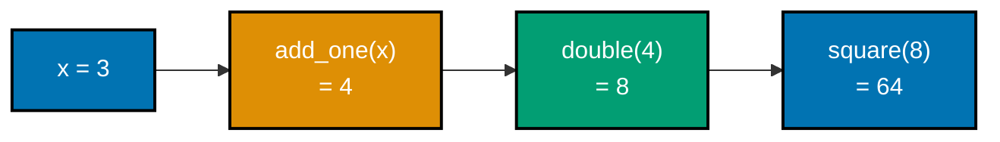

```python
"""Example 34: compose(*fns) Folds a List of Functions."""

from functools import reduce  # => reduce folds the chain of functions inside compose
from typing import Callable  # => Callable types every function compose accepts


def compose(*fns: Callable[[int], int]) -> Callable[[int], int]:  # => any NUMBER of functions
    def composed(x: int) -> int:  # => the returned pipeline function
        return reduce(lambda acc, fn: fn(acc), reversed(fns), x)  # => rightmost fn runs FIRST
        # => reversed(fns) makes compose(f, g, h)(x) mean f(g(h(x))), matching math notation

    return composed  # => compose itself returns the pipeline function, not a value


def add_one(x: int) -> int:  # => the innermost step in the pipeline below
    return x + 1  # => the actual +1 add_one performs


def double(x: int) -> int:  # => the middle step in the pipeline below
    return x * 2  # => the actual *2 double performs


def square(x: int) -> int:  # => the outermost step in the pipeline below
    return x * x  # => the actual squaring square performs


pipeline = compose(square, double, add_one)  # => reads right-to-left: square(double(add_one(x)))
result = pipeline(3)  # => add_one(3)=4, double(4)=8, square(8)=64

print(result)  # => Output: 64
print(result == square(double(add_one(3))))  # => Output: True -- compose(*fns) matches nested calls
```

**Output**:

```text
64
True
```

```python
"""Example 34: pytest verification for compose(*fns) Folds a List of Functions."""

from example import add_one, compose, double, square


def test_compose_star_matches_nested_application_order() -> None:
    pipeline = compose(square, double, add_one)
    assert pipeline(3) == square(double(add_one(3))) == 64


# => Run: pytest -- Output: 1 passed
```

**Verify**: `pytest -q`

**Output**:

```text
1 passed
```

**Key takeaway**: `compose(*fns)(x)` reads right-to-left -- the LAST function in the argument list runs
FIRST -- which matches how `f(g(h(x)))` is read in mathematics, not how a left-to-right pipeline reads.

**Why it matters**: A three-step hand-written pipeline and a five-step one look identical in complexity
when read left-to-right, but nesting gets genuinely hard to read past three or four steps.
`compose(*fns)` keeps that nesting's exact evaluation order while making the pipeline's SHAPE -- a flat
list of steps -- visible at a glance, which is why Example 35 reuses it to demonstrate point-free
style.

---

### Example 35: Rewriting a Lambda Pipeline Point-Free

_ex-35 &middot; exercises co-19_

Point-free (or "tacit") style defines a function without ever naming the argument it operates on. This
example rewrites `lambda x: multiply(2, add(3, x))` as
`compose(partial(multiply, 2), partial(add, 3))`, confirming both forms compute the identical answer
for the same input.

```python
"""Example 35: Rewriting a Lambda Pipeline Point-Free."""

from functools import partial, reduce  # => partial curries add/multiply; reduce powers compose
from typing import Callable  # => Callable types the pipeline function returned by compose


def compose(*fns: Callable[[int], int]) -> Callable[[int], int]:  # => folds fns right-to-left
    def composed(x: int) -> int:  # => the returned pipeline function
        return reduce(lambda acc, fn: fn(acc), reversed(fns), x)  # => rightmost fn runs FIRST, matching math notation

    return composed  # => compose itself returns the pipeline function


def add(n: int, x: int) -> int:  # => a 2-argument helper, curried via partial below
    return n + x  # => the actual addition add performs


def multiply(n: int, x: int) -> int:  # => a second 2-argument helper, same shape
    return n * x  # => the actual multiplication multiply performs


with_named_arg: Callable[[int], int] = lambda x: multiply(2, add(3, x))  # => POINTED: names x explicitly
point_free = compose(partial(multiply, 2), partial(add, 3))  # => POINT-FREE: x never named

# => point-free style trades explicit naming for compact composition (co-19)
print(with_named_arg(5))  # => Output: 16  ((5 + 3) * 2)
print(point_free(5))  # => Output: 16 -- identical result, x never appears in point_free's own definition
print(with_named_arg(5) == point_free(5))  # => Output: True -- two styles, one computation
```

**Output**:

```text
16
16
True
```

```python
"""Example 35: pytest verification for Rewriting a Lambda Pipeline Point-Free."""

from functools import partial
from typing import Callable

from example import add, compose, multiply


def test_point_free_matches_the_named_argument_version() -> None:
    with_named_arg: Callable[[int], int] = lambda x: multiply(2, add(3, x))
    point_free = compose(partial(multiply, 2), partial(add, 3))
    assert point_free(5) == with_named_arg(5) == 16


# => Run: pytest -- Output: 1 passed
```

**Verify**: `pytest -q`

**Output**:

```text
1 passed
```

**Key takeaway**: Point-free style isn't about being clever -- it's `compose` and `partial` working
together so the pipeline's SHAPE is visible without an explicit argument name threading through every
step.

**Why it matters**: Point-free code can become a genuine readability trap once composed deeply, but
used sparingly -- two or three steps, like this example -- it removes a layer of naming noise a reader
has to track. Knowing how to write it, and when NOT to reach for it, are both part of using functional
style deliberately rather than performatively.

---

### Example 36: Building a Histogram with reduce

_ex-36 &middot; exercises co-13_

`functools.reduce` is the general-purpose fold every other aggregation function specializes. This
example builds a word-frequency histogram by folding a list of words into one dict, one word at a
time, with `add_to_histogram` as the combining step.

```python
"""Example 36: Building a Histogram with reduce."""

from functools import reduce  # => reduce folds words into the histogram below


def add_to_histogram(  # => the "how to fold one more element in" step
    histogram: dict[str, int], word: str  # => the accumulator and the next element, reduce's own calling convention
) -> dict[str, int]:  # => closes the multi-line signature above
    histogram[word] = histogram.get(word, 0) + 1  # => increments, defaulting missing keys to 0
    return histogram  # => reduce expects the combiner to return the NEW accumulator


words = ["a", "b", "a", "c", "b", "a"]  # => the source sequence being counted

histogram = reduce(add_to_histogram, words, {})  # => folds words into ONE dict, seeded empty

# => reduce is the general-purpose fold every other aggregation specializes
print(histogram)  # => Output: {'a': 3, 'b': 2, 'c': 1}
print(histogram["a"])  # => Output: 3 -- 'a' appeared three times
print(sum(histogram.values()) == len(words))  # => Output: True -- every word counted exactly once
```

**Output**:

```text
{'a': 3, 'b': 2, 'c': 1}
3
True
```

```python
"""Example 36: pytest verification for Building a Histogram with reduce."""

from functools import reduce

from example import add_to_histogram


def test_reduce_builds_a_correct_histogram() -> None:
    words = ["x", "y", "x"]
    histogram = reduce(add_to_histogram, words, {})
    assert histogram == {"x": 2, "y": 1}


# => Run: pytest -- Output: 1 passed
```

**Verify**: `pytest -q`

**Output**:

```text
1 passed
```

**Key takeaway**: reduce's combining function always has the same shape --
`(accumulator, next_element) -> new_accumulator` -- whether the accumulator ends up being a number, a
list, or, as here, a dict.

**Why it matters**: `sum()`, `any()`, `all()`, and even list comprehensions can all be expressed as a
`reduce` with a specific combining function; seeing `reduce` build something as structurally different
as a histogram makes clear it isn't "the numeric-total function," it's the fold every other aggregation
is a special case of. That generality is also `reduce`'s biggest readability cost -- a specialized name
(like the histogram-specific helper this example writes) usually communicates intent better than a bare
`reduce` call.

---

### Example 37: Chaining map, filter, and reduce

_ex-37 &middot; exercises co-13, co-11_

This example chains all three of Python's core higher-order sequence functions in one pipeline -- `map`
doubles every order, `filter` keeps only the large ones, `reduce` folds the survivors into a single
total -- and confirms the three-stage pipeline matches an equivalent single comprehension.

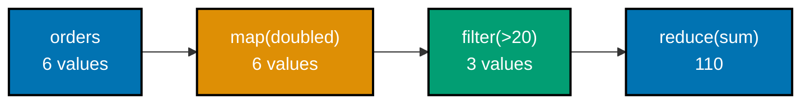

```python
"""Example 37: Chaining map, filter, and reduce."""

from functools import reduce  # => reduce folds the filtered stream into one total

orders = [12, 7, 25, 3, 18, 9]  # => raw order amounts, some too small to matter

doubled = map(lambda amount: amount * 2, orders)  # => LAZY: doubles every order (e.g. a 2x promo)
significant = filter(lambda amount: amount > 20, doubled)  # => LAZY: keeps only large-enough orders
total = reduce(lambda acc, amount: acc + amount, significant, 0)  # => folds survivors into one sum
# => each stage is lazy until reduce finally pulls every value through the whole pipeline

manual_total = sum(a * 2 for a in orders if a * 2 > 20)  # => the equivalent single comprehension

print(total)  # => Output: 110
print(total == manual_total)  # => Output: True -- three separate stages, one verified answer
```

**Output**:

```text
110
True
```

```python
"""Example 37: pytest verification for Chaining map, filter, and reduce."""

from functools import reduce


def test_pipeline_matches_the_equivalent_comprehension() -> None:
    orders = [12, 7, 25, 3, 18, 9]
    doubled = map(lambda amount: amount * 2, orders)
    significant = filter(lambda amount: amount > 20, doubled)
    total = reduce(lambda acc, amount: acc + amount, significant, 0)
    assert total == sum(a * 2 for a in orders if a * 2 > 20) == 110


# => Run: pytest -- Output: 1 passed
```

**Verify**: `pytest -q`

**Output**:

```text
1 passed
```

**Key takeaway**: `map`/`filter`/`reduce` compose exactly like any other functions -- each stage's
output is simply the next stage's input, with no special glue code required between them.

**Why it matters**: This three-stage shape -- transform, then select, then aggregate -- appears
constantly in real data-processing code, whether it's built from `map`/`filter`/`reduce`, a
comprehension, or a database query. Recognizing the SAME three-stage shape underneath very different
syntax is what makes it possible to translate between them, and to reach for whichever one is clearest
in a given codebase's idioms.

---

### Example 38: A Lazy map/filter Pipeline Pulled by next

_ex-38 &middot; exercises co-15, co-13_

`map` and `filter` in Python 3 are lazy -- wrapping a generator in `map`/`filter` builds a pipeline
that computes nothing until something pulls a value out of it. This example instruments a generator to
log every value it produces and confirms only a handful of the 999 possible source values were ever
touched to satisfy three `next()` calls.

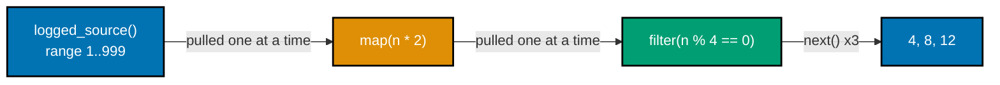

```python
"""Example 38: A Lazy map/filter Pipeline Pulled by next."""

from typing import Iterator  # => Iterator types the lazy generator below

pulled_from_source: list[int] = []  # => tracks exactly which SOURCE values were ever touched


def logged_source() -> Iterator[int]:  # => a generator that records every value it produces
    for n in range(1, 1000):  # => a LARGE range -- but nothing runs until pulled
        pulled_from_source.append(n)  # => only executes when this generator is actually advanced
        yield n  # => suspends here until the consumer pulls the NEXT value


doubled = map(lambda n: n * 2, logged_source())  # => LAZY: wraps the source, still nothing runs
evens_only = filter(lambda n: n % 4 == 0, doubled)  # => LAZY: a second lazy stage on top of the first

first_three = [next(evens_only), next(evens_only), next(evens_only)]  # => pulls JUST enough

# => laziness (co-15) means the pipeline computes ONLY what the caller demands
print(first_three)  # => Output: [4, 8, 12]
print(len(pulled_from_source) < 10)  # => Output: True -- far fewer than 999 source values were touched
```

**Output**:

```text
[4, 8, 12]
True
```

```python
"""Example 38: pytest verification for A Lazy map/filter Pipeline Pulled by next."""

from typing import Iterator


def test_pipeline_pulls_only_as_many_source_values_as_needed() -> None:
    pulled: list[int] = []

    def source() -> Iterator[int]:
        for n in range(1, 1000):
            pulled.append(n)
            yield n

    doubled = map(lambda n: n * 2, source())
    evens_only = filter(lambda n: n % 4 == 0, doubled)
    result = [next(evens_only), next(evens_only)]
    assert result == [4, 8]
    assert len(pulled) < 10  # => the pipeline never touched most of the 999-element range


# => Run: pytest -- Output: 1 passed
```

**Verify**: `pytest -q`

**Output**:

```text
1 passed
```

**Key takeaway**: A lazy pipeline's cost is proportional to how much a caller actually consumes, not to
how large the source range COULD be -- the 999-element range in this example never gets close to fully
evaluated.

**Why it matters**: Building a map/filter pipeline over an unbounded (or merely very large) source is
only safe because of laziness -- an eager equivalent would try to materialize the entire
doubled-and-filtered list before returning anything. This is the same property Example 68's infinite
prime sieve in the Advanced tier depends on: a pipeline over a genuinely infinite source only works
because nothing runs until pulled.

---

### Example 39: Running Totals via accumulate

_ex-39 &middot; exercises co-16_

`itertools.accumulate` generalizes reduce to keep every intermediate result instead of just the final
one -- a running total (the default `+`) or, with a custom binary operator like `max`, a running
maximum. This example builds both a running balance and a running maximum from the same list of
deposits.

```python
"""Example 39: Running Totals via accumulate."""

from itertools import accumulate  # => a lazy iterator of running totals (or any binary op)

deposits = [100, 50, -30, 200]  # => a sequence of account movements

running_balance = list(accumulate(deposits))  # => default op is +: each step is the sum SO FAR
running_max = list(accumulate(deposits, max))  # => a custom op: running maximum instead of sum
# => accumulate is itertools' generalized fold-that-keeps-every-intermediate-result

print(running_balance)  # => Output: [100, 150, 120, 320]
print(running_max)  # => Output: [100, 100, 100, 200]
print(running_balance[-1] == sum(deposits))  # => Output: True -- the LAST running total is the full sum
```

**Output**:

```text
[100, 150, 120, 320]
[100, 100, 100, 200]
True
```

```python
"""Example 39: pytest verification for Running Totals via accumulate."""

from itertools import accumulate


def test_accumulate_produces_prefix_sums() -> None:
    deposits = [10, 20, 30]
    assert list(accumulate(deposits)) == [10, 30, 60]
    assert list(accumulate(deposits, max)) == [10, 20, 30]


# => Run: pytest -- Output: 1 passed
```

**Verify**: `pytest -q`

**Output**:

```text
1 passed
```

**Key takeaway**: `accumulate(xs)` and `reduce(op, xs)` compute the same FINAL value; `accumulate`
additionally hands back every step along the way, which `reduce` discards.

**Why it matters**: "What was the running total after each transaction" is a genuinely different
question from "what is the final total," and `accumulate` answers the first one without a manual loop
that manages its own accumulator variable. This is `itertools`' general pattern -- take a fold-shaped
operation, keep it lazy, and expose the intermediate structure a plain `reduce` throws away.

---

### Example 40: Adjacent Pairs via pairwise and tee

_ex-40 &middot; exercises co-16_

`itertools.pairwise` yields every pair of consecutive elements -- useful for computing deltas between
adjacent readings -- while `itertools.tee` splits one iterator into several independent ones that can
each be advanced separately. This example computes deltas with `pairwise` and confirms `tee`'s two
streams start from the identical first value without interfering with each other.

```python
"""Example 40: Adjacent Pairs via pairwise and tee."""

from itertools import pairwise, tee  # => pairwise: consecutive pairs; tee: split one iterator in two

readings = [10, 12, 9, 15, 15]  # => a sequence of sensor readings

deltas = [b - a for a, b in pairwise(readings)]  # => consecutive differences, one per adjacent pair
# => pairwise([10, 12, 9, 15, 15]) yields (10,12), (12,9), (9,15), (15,15) -- 4 pairs from 5 readings

original_stream, backup_stream = tee(iter(readings))  # => splits ONE iterator into two INDEPENDENT ones
first_from_original = next(original_stream)  # => advances original_stream only
first_from_backup = next(backup_stream)  # => backup_stream is UNAFFECTED by the pull above

print(deltas)  # => Output: [2, -3, 6, 0]
print(first_from_original == first_from_backup)  # => Output: True -- both streams start from readings[0]
```

**Output**:

```text
[2, -3, 6, 0]
True
```

```python
"""Example 40: pytest verification for Adjacent Pairs via pairwise and tee."""

from itertools import pairwise, tee


def test_pairwise_and_tee() -> None:
    readings = [1, 2, 4]
    assert list(pairwise(readings)) == [(1, 2), (2, 4)]

    stream_a, stream_b = tee(iter(readings))
    assert next(stream_a) == next(stream_b) == 1  # => independent streams, same starting point


# => Run: pytest -- Output: 1 passed
```

**Verify**: `pytest -q`

**Output**:

```text
1 passed
```

**Key takeaway**: `pairwise` turns "process element i and element i+1 together" into a single iteration
with no manual index bookkeeping; `tee` turns "I need to iterate this sequence twice" into two
independent iterators instead of a list you'd have to materialize first.

**Why it matters**: Both functions solve a specific, common annoyance with plain iterators --
`pairwise` avoids off-by-one index errors in adjacent-element comparisons, and `tee` avoids either
materializing a whole iterator into a list (defeating its laziness) or re-running whatever produced it.
Knowing they exist in the stdlib means reaching for them instead of hand-rolling equivalent,
easier-to-get-wrong loop logic.

---

### Example 41: A Hand-Rolled Memoization Dict

_ex-41 &middot; exercises co-17_

Memoization caches a function's previous results keyed by its arguments, safe to do only because the
wrapped function is pure -- the same arguments always produce the same answer. This example hand-rolls
the cache dict itself (rather than reaching for `functools.lru_cache`) to make the mechanism visible: a
cache miss computes and stores, a cache hit returns the stored value without recomputing.

```python
"""Example 41: A Hand-Rolled Memoization Dict."""

from typing import Callable  # => Callable types the function memoize wraps

call_count = 0  # => tracks how many times the EXPENSIVE function body actually ran


def expensive(n: int) -> int:  # => stands in for a slow, pure computation
    global call_count  # => declares intent to mutate the MODULE-level counter
    call_count += 1  # => only increments when the body actually executes
    return n * n  # => the actual (slow, pure) computation being cached


def memoize(fn: Callable[[int], int]) -> Callable[[int], int]:  # => a hand-rolled cache, no lru_cache
    cache: dict[int, int] = {}  # => the memo table, one entry per unique argument

    def wrapper(n: int) -> int:  # => the returned, cache-checking function
        if n not in cache:  # => cache MISS: compute once and store
            cache[n] = fn(n)  # => computes ONCE and stores under key n
        return cache[n]  # => cache HIT or freshly-stored value, either way no recomputation

    return wrapper  # => memoize itself returns the wrapping function


memoized_expensive = memoize(expensive)  # => wraps expensive with the hand-rolled cache

first = memoized_expensive(5)  # => cache miss -- call_count becomes 1
second = memoized_expensive(5)  # => cache HIT -- call_count stays 1
third = memoized_expensive(6)  # => a NEW argument -- cache miss, call_count becomes 2

# => memoization trades memory for time, valid ONLY because expensive is pure
print(first, second, third)  # => Output: 25 25 36
print(call_count)  # => Output: 2 -- expensive body ran exactly twice, for the two unique arguments
```

**Output**:

```text
25 25 36
2
```

```python
"""Example 41: pytest verification for A Hand-Rolled Memoization Dict."""

from example import memoize


def test_second_call_is_served_from_cache() -> None:
    calls: list[int] = []

    def track(n: int) -> int:
        calls.append(n)
        return n * n

    memoized = memoize(track)
    assert memoized(4) == 16
    assert memoized(4) == 16
    assert calls == [4]  # => the second call never re-ran the underlying function


# => Run: pytest -- Output: 1 passed
```

**Verify**: `pytest -q`

**Output**:

```text
1 passed
```

**Key takeaway**: Memoization is purity's most direct practical payoff -- it is UNSAFE to cache the
result of an impure function, because a cached answer would silently ignore whatever hidden state has
changed since the cache was filled.

**Why it matters**: `functools.lru_cache` (used earlier in this topic's recursion examples) is the
production-ready version of exactly this pattern -- a dict keyed by arguments, checked before falling
through to the real computation. Building the manual version once makes clear WHY the decorator is safe
to apply: only to functions whose purity guarantees a cached answer never goes stale.

---

### Example 42: A Parameterized @retry(3) Decorator

_ex-42 &middot; exercises co-18_

A decorator factory is a function that itself returns a decorator -- `retry(3)` returns the actual
decorator, which then wraps `flaky`. This example's `flaky` function fails on its first two calls and
succeeds on the third, and the retry loop logs every attempt before returning the eventual success.

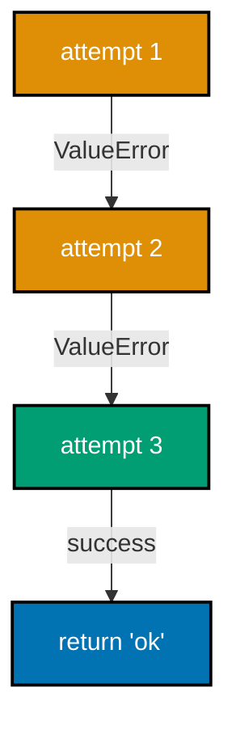

```python
"""Example 42: A Parameterized @retry(3) Decorator."""

from typing import Callable  # => Callable types every layer of this decorator factory

attempt_log: list[int] = []  # => records which attempt number ran, for verification below


def retry(times: int) -> Callable[[Callable[[], str]], Callable[[], str]]:  # => a decorator FACTORY
    def decorator(fn: Callable[[], str]) -> Callable[[], str]:  # => the ACTUAL decorator, closes over times
        def wrapper() -> str:  # => the actual retry loop lives here
            last_error: Exception | None = None  # => remembers the most recent failure, if any
            for attempt in range(1, times + 1):  # => tries up to `times` times, closed over from retry()
                attempt_log.append(attempt)  # => logs every attempt, successful or not
                try:  # => attempts ONE call to the wrapped function
                    return fn()  # => success: return immediately, no further attempts
                except ValueError as exc:  # => a failed attempt -- remember it and try again
                    last_error = exc  # => remembers the failure so it can be re-raised later
            raise last_error  # type: ignore[misc]  # => every attempt failed -- re-raise the last error

        return wrapper  # => decorator itself returns the retry-wrapped function

    return decorator  # => retry(times) itself returns the decorator


calls_before_success = 0  # => simulates a flaky operation succeeding on its 3rd attempt


@retry(3)  # => equivalent to: flaky = retry(3)(flaky) -- retry(3) runs FIRST, returns a decorator
def flaky() -> str:  # => the function actually being retried
    global calls_before_success  # => declares intent to mutate the MODULE-level counter
    calls_before_success += 1  # => tracks how many times this call has been attempted
    if calls_before_success < 3:  # => fails on attempts 1 and 2
        raise ValueError("not yet")  # => simulates a transient failure on early attempts
    return "ok"  # => succeeds on attempt 3


result = flaky()  # => retries internally until success, or until times is exhausted

# => a decorator factory is a function that RETURNS a decorator, one extra layer
print(result)  # => Output: ok
print(attempt_log)  # => Output: [1, 2, 3] -- three attempts were logged before success
```

**Output**:

```text
ok
[1, 2, 3]
```

```python
"""Example 42: pytest verification for A Parameterized @retry(3) Decorator."""

from example import retry


def test_retry_stops_as_soon_as_the_wrapped_call_succeeds() -> None:
    attempts: list[int] = []

    @retry(5)
    def sometimes_fails() -> str:
        attempts.append(len(attempts) + 1)
        if len(attempts) < 2:
            raise ValueError("not yet")
        return "ok"

    assert sometimes_fails() == "ok"
    assert attempts == [1, 2]  # => stopped retrying the moment it succeeded


# => Run: pytest -- Output: 1 passed
```

**Verify**: `pytest -q`

**Output**:

```text
1 passed
```

**Key takeaway**: `@retry(3)` involves TWO calls before the wrapped function ever runs: `retry(3)`
returns a decorator, and THAT decorator is applied to `flaky` -- one extra layer of indirection
compared to a plain `@decorator`.

**Why it matters**: Retrying transient failures (a flaky network call, a database lock) is common
enough to warrant a reusable decorator, and parameterizing it (how many times, what exception types) is
what makes ONE decorator implementation useful across many call sites instead of hand-writing a retry
loop at each one. The decorator-factory shape here -- a function returning a function returning a
function -- is the same shape Example 75's decorator-stack composition example builds on in the
Advanced tier.

---

### Example 43: `functools.wraps` Preserves `__name__`

_ex-43 &middot; exercises co-18_

A decorator that returns a plain inner `wrapper` function silently replaces the original function's
`__name__`, `__doc__`, and other metadata with the wrapper's own -- `functools.wraps` fixes this by
copying that metadata across. This example builds a naive decorator and a careful one side by side and
confirms only the careful one preserves the decorated function's identity.

```python
"""Example 43: functools.wraps Preserves __name__."""

from functools import wraps  # => wraps is the fix demonstrated in careful_decorator
from typing import Callable  # => Callable types both decorators below


def naive_decorator(fn: Callable[[], str]) -> Callable[[], str]:  # => WITHOUT functools.wraps
    def wrapper() -> str:  # => the naive wrapper -- no metadata copied
        return fn()  # => forwards the call, nothing else

    return wrapper  # => wrapper has its OWN __name__, "wrapper" -- fn's identity is lost


def careful_decorator(fn: Callable[[], str]) -> Callable[[], str]:  # => WITH functools.wraps
    @wraps(fn)  # => copies __name__, __doc__, and more from fn onto wrapper
    def wrapper() -> str:  # => the careful wrapper -- decorated with @wraps below
        return fn()  # => forwards the call, identical behavior to the naive version

    return wrapper  # => wrapper now REPORTS as if it were fn itself


@naive_decorator  # => applies the WITHOUT-wraps decorator
def greet_naive() -> str:  # => the function whose identity gets lost
    """Say hello, naively decorated."""  # => this docstring is LOST from greet_naive.__doc__ after decoration
    return "hello"  # => the actual greeting


@careful_decorator  # => applies the WITH-wraps decorator
def greet_careful() -> str:  # => the function whose identity survives decoration
    """Say hello, carefully decorated."""  # => this docstring IS preserved on greet_careful.__doc__
    return "hello"  # => the actual greeting


# => functools.wraps matters for debugging, introspection, and framework compatibility
print(greet_naive.__name__)  # => Output: wrapper -- identity LOST, unhelpful in tracebacks/introspection
print(greet_careful.__name__)  # => Output: greet_careful -- identity PRESERVED by functools.wraps
print(greet_careful.__doc__)  # => Output: Say hello, carefully decorated.
```

**Output**:

```text
wrapper
greet_careful
Say hello, carefully decorated.
```

```python
"""Example 43: pytest verification for functools.wraps Preserves __name__."""

from example import careful_decorator, naive_decorator


def test_wraps_preserves_name_and_plain_decorator_does_not() -> None:
    @naive_decorator
    def naive() -> str:
        return "x"

    @careful_decorator
    def careful() -> str:
        return "x"

    assert naive.__name__ == "wrapper"  # => identity lost without functools.wraps
    assert careful.__name__ == "careful"  # => identity preserved with functools.wraps


# => Run: pytest -- Output: 1 passed
```

**Verify**: `pytest -q`

**Output**:

```text
1 passed
```

**Key takeaway**: `@wraps(fn)` inside a decorator is not optional polish -- without it, every decorated
function reports as `"wrapper"` in tracebacks, debuggers, and `help()`, actively hiding which function
actually ran.

**Why it matters**: Frameworks (web routers, CLI argument parsers, test runners) frequently introspect
a function's `__name__` or `__doc__` to build behavior around it -- a decorator missing `@wraps` can
silently break that introspection in ways that are hard to trace back to "the decorator ate my
function's identity." This is a small habit with an outsized payoff: every decorator this topic writes
from here forward includes it.

---

### Example 44: Converting Deep Recursion to an Explicit Stack

_ex-44 &middot; exercises co-14_

CPython has no tail-call optimization, so a recursive function's call depth is bounded by
`sys.getrecursionlimit()`. This example deliberately calls a recursive sum past that limit to trigger a
genuine `RecursionError`, then computes the identical total with an explicit list-based stack that
never grows the call stack at all.

```python
"""Example 44: Converting Deep Recursion to an Explicit Stack."""

import sys  # => sys.getrecursionlimit reveals the current recursion ceiling


def sum_to_n_recursive(n: int) -> int:  # => the natural recursive definition -- one frame per call
    if n == 0:  # => base case: nothing left to add
        return 0  # => the base case's value
    return n + sum_to_n_recursive(n - 1)  # => grows the call stack by exactly one frame per call


def sum_to_n_iterative(n: int) -> int:  # => the SAME computation, an explicit stack instead of the call stack
    stack: list[int] = list(range(1, n + 1))  # => an explicit, heap-allocated stack -- NOT the call stack
    total = 0  # => the running total, mutated below
    while stack:  # => pops until the explicit stack is empty -- no Python call frames grow
        total += stack.pop()  # => pops one value at a time -- heap memory, not call-stack frames
    return total  # => the final total after the explicit stack empties


deep_n = sys.getrecursionlimit() + 500  # => deliberately EXCEEDS the recursion ceiling

try:  # => opens a block that expects the recursive call below to raise
    sum_to_n_recursive(deep_n)  # => this call is expected to blow the call stack
    recursive_raised = False  # => unreachable if RecursionError fires as expected
except RecursionError:  # => confirms the exact failure recursion has at this depth
    recursive_raised = True  # => confirms the recursive version genuinely failed here

iterative_result = sum_to_n_iterative(deep_n)  # => the SAME depth, but no call-stack growth at all

# => CPython has NO tail-call optimization -- deep recursion genuinely can crash
print(recursive_raised)  # => Output: True -- the recursive version genuinely fails at this depth
print(iterative_result == deep_n * (deep_n + 1) // 2)  # => Output: True -- the iterative version succeeds
```

**Output**:

```text
True
True
```

```python
"""Example 44: pytest verification for Converting Deep Recursion to an Explicit Stack."""

import sys

from example import sum_to_n_iterative, sum_to_n_recursive


def test_iterative_version_survives_a_depth_that_breaks_recursion() -> None:
    deep_n = sys.getrecursionlimit() + 500
    try:
        sum_to_n_recursive(deep_n)
        recursive_raised = False
    except RecursionError:
        recursive_raised = True
    assert recursive_raised is True

    assert sum_to_n_iterative(deep_n) == deep_n * (deep_n + 1) // 2


# => Run: pytest -- Output: 1 passed
```

**Verify**: `pytest -q`

**Output**:

```text
1 passed
```

**Key takeaway**: "Just make it recursive" is not a free readability win in Python the way it can be in
a language with proper tail calls -- past a few hundred levels, recursion becomes a genuine crash risk,
not just a style preference.

**Why it matters**: Every recursive function this topic writes needs a mental note about how deep its
input could realistically go, because CPython will not turn deep recursion into a loop automatically.
Example 66's trampoline in the Advanced tier is the general-purpose fix for functions that GENUINELY
want to look recursive without paying this cost -- this example is the concrete failure that motivates
building one.

---

### Example 45: A Shape ADT as a Union of Frozen Dataclasses

_ex-45 &middot; exercises co-20_

An algebraic sum type restricts a value to being EXACTLY one of a fixed set of variants. This example
defines `Shape = Circle | Square` from two frozen dataclasses, each carrying only the field its own
variant needs, and computes area with an `isinstance` check that narrows the type inside each branch.

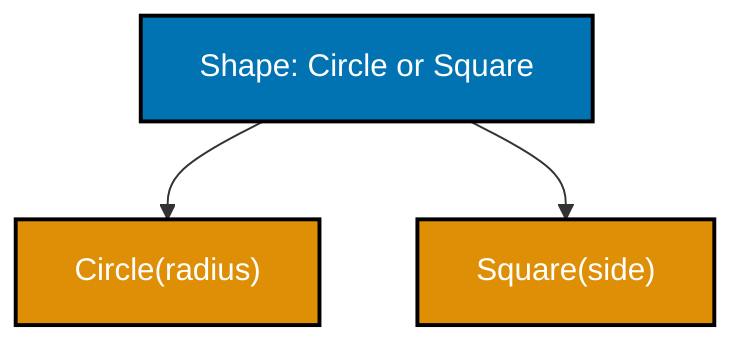

```python
"""Example 45: A Shape ADT as a Union of Frozen Dataclasses."""

from __future__ import annotations  # => enables the quoted forward references used below

from dataclasses import dataclass  # => @dataclass(frozen=True) builds each immutable variant


@dataclass(frozen=True)  # => one VARIANT of the Shape ADT -- only the field a circle needs
class Circle:  # => the Circle variant's body
    radius: float  # => the single field this variant carries


@dataclass(frozen=True)  # => a SECOND variant -- only the field a square needs
class Square:  # => the Square variant's body
    side: float  # => the single field this variant carries


Shape = Circle | Square  # => PEP 604 union syntax (3.10+): a Shape IS EITHER a Circle OR a Square


def area(shape: Shape) -> float:  # => accepts EITHER variant -- illegal combinations don't type-check
    if isinstance(shape, Circle):  # => narrows shape to Circle inside this branch
        return 3.14159 * shape.radius**2  # => the actual circle-area formula
    return shape.side**2  # => shape is narrowed to Square here (the only remaining case)


circle_shape: Shape = Circle(radius=2.0)  # => constructs the Circle variant
square_shape: Shape = Square(side=3.0)  # => constructs the Square variant

# => a sum type restricts callers to EXACTLY the variants the ADT defines
print(round(area(circle_shape), 2))  # => Output: 12.57
print(area(square_shape))  # => Output: 9.0
print(isinstance(circle_shape, Square))  # => Output: False -- a Circle can never ALSO be a Square
```

**Output**:

```text
12.57
9.0
False
```

```python
"""Example 45: pytest verification for A Shape ADT as a Union of Frozen Dataclasses."""

from example import Circle, Square, area


def test_each_variant_computes_its_own_area() -> None:
    assert round(area(Circle(radius=1.0)), 2) == 3.14
    assert area(Square(side=4.0)) == 16.0


# => Run: pytest -- Output: 1 passed
```

**Verify**: `pytest -q`

**Output**:

```text
1 passed
```

**Key takeaway**: `Circle | Square` isn't "any object with a radius or a side" -- it's exactly two
possible shapes, and a type checker can verify a function handling `Shape` covers both.

**Why it matters**: Without a sum type, "a shape is either a circle or a square" usually gets modeled
with an inheritance hierarchy that invites accidentally-shared behavior, or a dict with an optional
radius AND an optional side that allows nonsensical states like both being set, or neither. A sum type
makes the illegal states genuinely unrepresentable: there is no way to construct a `Shape` that is not
one of the two defined variants.

---

### Example 46: match/case Dispatches Over the Shape ADT

_ex-46 &middot; exercises co-21, co-20_

Python's `match`/`case` statement (3.10+) reads like the ADT's own shape rather than a chain of
`isinstance` checks. This example destructures `Circle` and `Square` directly in each case pattern,
binding their fields to local names, with a `case _` catch-all defending against a hypothetical third
variant.

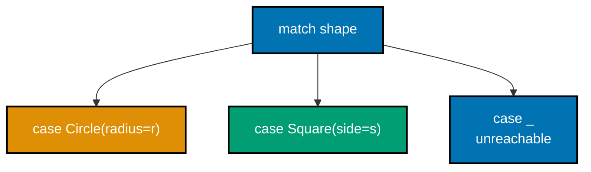

```python
"""Example 46: match/case Dispatches Over the Shape ADT."""

from __future__ import annotations  # => enables the quoted forward references used below

from dataclasses import dataclass  # => @dataclass(frozen=True) builds each immutable variant


@dataclass(frozen=True)  # => marks Circle immutable, matching the FP style
class Circle:  # => the Circle variant's body
    radius: float  # => the single field this variant carries


@dataclass(frozen=True)  # => marks Square immutable, matching the FP style
class Square:  # => the Square variant's body
    side: float  # => the single field this variant carries


Shape = Circle | Square  # => the ADT itself: a Shape is EITHER variant


def describe(shape: Shape) -> str:  # => match/case, the structural-pattern-matching alternative to isinstance
    match shape:  # => picks the FIRST case whose pattern matches shape's shape
        case Circle(radius=r):  # => destructures a Circle, binding its radius to r
            return f"circle with radius {r}"  # => the Circle branch's result
        case Square(side=s):  # => destructures a Square, binding its side to s
            return f"square with side {s}"  # => the Square branch's result
        case _:  # => NOTE: match/case has NO compile-time exhaustiveness check -- a manual safety net
            raise ValueError("unreachable for a Circle | Square")  # => defends against a THIRD variant appearing later


# => match/case reads like the ADT's own shape, not a chain of isinstance checks
print(describe(Circle(radius=2.0)))  # => Output: circle with radius 2.0
print(describe(Square(side=5.0)))  # => Output: square with side 5.0
```

**Output**:

```text
circle with radius 2.0
square with side 5.0
```

```python
"""Example 46: pytest verification for match/case Dispatches Over the Shape ADT."""

from example import Circle, Square, describe


def test_each_branch_fires_for_its_own_variant() -> None:
    assert describe(Circle(radius=1.0)) == "circle with radius 1.0"
    assert describe(Square(side=2.0)) == "square with side 2.0"


# => Run: pytest -- Output: 1 passed
```

**Verify**: `pytest -q`

**Output**:

```text
1 passed
```

**Key takeaway**: match/case has NO compile-time exhaustiveness check in Python -- the `case _` branch
here is a manual safety net, not something the language enforces the way a true sum-type-aware language
would.

**Why it matters**: Reading `case Circle(radius=r):` communicates "this branch handles a Circle, and r
is its radius" in one line, versus an `isinstance` check followed by a separate `shape.radius` access.
The lack of exhaustiveness checking is a genuine gap versus languages built around ADTs from the ground
up -- the defensive `case _` branch is how Python code compensates for that gap by hand.

---

### Example 47: case Clauses With if Guards

_ex-47 &middot; exercises co-21_

A `case` pattern can carry an `if` guard -- a condition checked only after the pattern itself matches
-- letting one case cover a whole family of related values. This example classifies an integer into
four buckets (negative, zero, positive-even, positive-odd) using guards on an `int(value)` capture
pattern.

```python
"""Example 47: case Clauses With if Guards."""


def classify(n: int) -> str:  # => match/case WITH guards -- a pattern PLUS a condition
    match n:  # => opens the match/case block over n
        case int(value) if value < 0:  # => guard: only matches negative ints
            return "negative"  # => the negative branch's result
        case 0:  # => an exact-value pattern, no guard needed
            return "zero"  # => the zero branch's result
        case int(value) if value % 2 == 0:  # => guard: only matches even positive ints
            return "positive even"  # => the positive-even branch's result
        case _:  # => catches everything else -- positive odd ints
            return "positive odd"  # => the positive-odd branch's result


# => guards let one case pattern cover many related conditions
print(classify(-5))  # => Output: negative
print(classify(0))  # => Output: zero
print(classify(4))  # => Output: positive even
print(classify(7))  # => Output: positive odd
```

**Output**:

```text
negative
zero
positive even
positive odd
```

```python
"""Example 47: pytest verification for case Clauses With if Guards."""

from example import classify


def test_guards_select_the_right_branch() -> None:
    assert classify(-1) == "negative"
    assert classify(0) == "zero"
    assert classify(2) == "positive even"
    assert classify(3) == "positive odd"


# => Run: pytest -- Output: 1 passed
```

**Verify**: `pytest -q`

**Output**:

```text
1 passed
```

**Key takeaway**: A guard runs AFTER its case's pattern already matched -- `case int(value) if
value < 0` only evaluates `value < 0` once `value` is confirmed to be an int, not before.

**Why it matters**: Without guards, expressing "negative int" as a pattern alone would require either a
much more elaborate pattern syntax or falling back to a plain if/elif chain inside the case body,
losing match/case's structural-matching benefit entirely. Guards keep the dispatch logic in ONE place
-- the case list -- rather than splitting it between pattern matching and nested conditionals.

---

### Example 48: A Hand-Rolled Some/Nothing With map

_ex-48 &middot; exercises co-22, co-25_

An Option type replaces `None` with a value the reader (and a type checker) can reason about
explicitly. This example hand-rolls `Some`/`Nothing` as frozen dataclasses, each with its own `map`
method, and confirms `map` transforms a present value but is a safe no-op on an absent one.

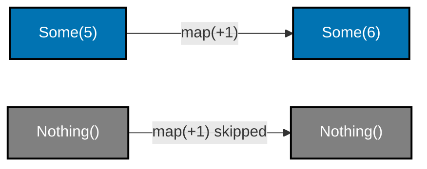

```python
"""Example 48: A Hand-Rolled Some/Nothing With map."""

from __future__ import annotations  # => enables the quoted 'Option[U]' forward reference below

from dataclasses import dataclass  # => @dataclass(frozen=True) builds both Option variants
from typing import Callable, Generic, TypeVar  # => Generic/TypeVar make Some[T] a proper generic container

T = TypeVar("T")  # => the type of the value a Some wraps
U = TypeVar("U")  # => the type map's function returns


@dataclass(frozen=True)  # => marks Some immutable, matching the FP style
class Some(Generic[T]):  # => the "present" variant, carrying exactly one value
    value: T  # => the single field this variant carries

    def map(self, fn: Callable[[T], U]) -> "Option[U]":  # => applies fn INSIDE the wrapper
        return Some(fn(self.value))  # => stays wrapped -- Some in, Some out


@dataclass(frozen=True)  # => marks Nothing immutable too
class Nothing:  # => the "absent" variant, carrying nothing
    def map(self, fn: Callable[[T], U]) -> "Nothing":  # => NO-OP: still generic so it type-checks like Some.map
        return self  # => there is nothing to apply fn to -- Nothing stays Nothing


Option = Some[T] | Nothing  # => PEP 604 union: an Option[T] is either Some[T] or Nothing


present: Option[int] = Some(5)  # => an Option holding a real value
absent: Option[int] = Nothing()  # => an Option holding nothing at all

increment: Callable[[int], int] = lambda x: x + 1  # => explicit annotation pins T/U to int at both call sites
mapped_present = present.map(increment)  # => Some(5).map(+1) -- the function DOES run
mapped_absent = absent.map(increment)  # => Nothing.map(+1) -- the function is SKIPPED entirely

# => Option replaces None with a type the reader (and a type checker) can reason about
print(mapped_present)  # => Output: Some(value=6)
print(mapped_absent)  # => Output: Nothing()
print(mapped_absent == Nothing())  # => Output: True -- map never turns Nothing into Some
```

**Output**:

```text
Some(value=6)
Nothing()
True
```

```python
"""Example 48: pytest verification for A Hand-Rolled Some/Nothing With map."""

from typing import Callable

from example import Nothing, Some


def test_map_runs_on_some_and_is_skipped_on_nothing() -> None:
    increment: Callable[[int], int] = lambda x: x + 1
    assert Some(5).map(increment) == Some(6)
    assert Nothing().map(increment) == Nothing()


# => Run: pytest -- Output: 1 passed
```

**Verify**: `pytest -q`

**Output**:

```text
1 passed
```

**Key takeaway**: `Nothing().map(fn)` never calls `fn` at all -- the absence propagates through the
pipeline automatically, without the caller writing a single `if value is not None` check.

**Why it matters**: Example 28's `int | None` return type already introduced "absence as a value," but
a caller there still has to remember the `is not None` check every single time. Wrapping absence in its
own type with its own `map` method means the ABSENCE-HANDLING LOGIC lives in one place instead of being
repeated at every call site -- this is the functor pattern made structural.

---

### Example 49: Chaining Option-Returning Lookups

_ex-49 &middot; exercises co-22_

Two dict lookups chained together -- find a user's city, then find that city's display name --
normally require a nested `if` for each possible miss. This example's `find` function returns an
Option instead of `None`, and `find_user_then_city` short-circuits on the FIRST miss without ever
attempting the second lookup.

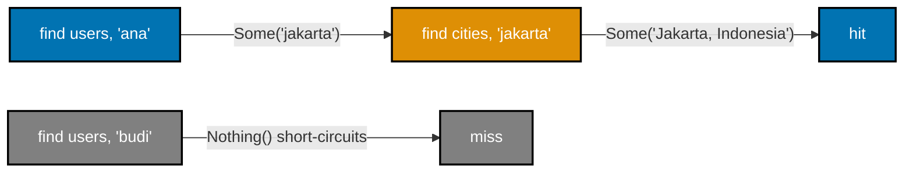

```python
"""Example 49: Chaining Option-Returning Lookups."""

from __future__ import annotations  # => enables the quoted 'Option[T]' forward reference below

from dataclasses import dataclass  # => @dataclass(frozen=True) builds both Option variants
from typing import Generic, TypeVar  # => Generic/TypeVar make Some[T] a proper generic container

T = TypeVar("T")  # => the type of the value a Some wraps


@dataclass(frozen=True)  # => marks Some immutable, matching the FP style
class Some(Generic[T]):  # => the "present" variant, carrying exactly one value
    value: T  # => the single field this variant carries


@dataclass(frozen=True)  # => marks Nothing immutable too
class Nothing:  # => the "absent" variant
    pass  # => carries no data at all


Option = Some[T] | Nothing  # => the ADT itself: an Option is EITHER variant


def find(table: dict[str, T], key: str) -> "Option[T]":  # => an Option-returning lookup, no None
    return Some(table[key]) if key in table else Nothing()  # => success wraps, miss returns Nothing


def find_user_then_city(  # => opens the multi-line signature of the chained lookup
    users: dict[str, str], cities: dict[str, str], username: str  # => the two lookup tables plus the key to chase
) -> "Option[str]":  # => closes the multi-line signature above
    user_result = find(users, username)  # => first Option-returning lookup
    if isinstance(user_result, Nothing):  # => SHORT-CIRCUITS immediately on the first miss
        return Nothing()  # => never even attempts the second lookup
    return find(cities, user_result.value)  # => chains into a SECOND Option-returning lookup


users = {"ana": "jakarta"}  # => maps username -> city key
cities = {"jakarta": "Jakarta, Indonesia"}  # => maps city key -> display name

hit = find_user_then_city(users, cities, "ana")  # => both lookups succeed
miss = find_user_then_city(users, cities, "budi")  # => the FIRST lookup already misses

# => chaining Option lookups avoids nested None-checks entirely
print(hit)  # => Output: Some(value='Jakarta, Indonesia')
print(miss)  # => Output: Nothing()
```

**Output**:

```text
Some(value='Jakarta, Indonesia')
Nothing()
```

```python
"""Example 49: pytest verification for Chaining Option-Returning Lookups."""

from example import Nothing, Some, find_user_then_city


def test_chain_short_circuits_on_the_first_miss() -> None:
    users = {"ana": "jakarta"}
    cities = {"jakarta": "Jakarta, Indonesia"}

    assert find_user_then_city(users, cities, "ana") == Some("Jakarta, Indonesia")
    assert find_user_then_city(users, cities, "budi") == Nothing()


# => Run: pytest -- Output: 1 passed
```

**Verify**: `pytest -q`

**Output**:

```text
1 passed
```

**Key takeaway**: Chaining Option-returning lookups replaces "two nested if-not-None checks" with
"check once, return early" -- the second lookup's code doesn't even need to defend against the first
one having failed.

**Why it matters**: Real lookup chains are rarely just two steps -- a user's account, then their team,
then their team's billing plan -- and nested None-checks for each step get unreadable fast. This
chaining pattern is exactly what Example 51's `and_then` and Example 56's `bind` generalize into a
reusable method, so the SAME short-circuiting logic doesn't have to be hand-written at every chain.

---

### Example 50: A Hand-Rolled Ok/Err Result Type

_ex-50 &middot; exercises co-23_

A Result type makes a function's failure mode part of its RETURN TYPE instead of a hidden exception
path. This example's `divide` returns `Ok(value)` on success or `Err(message)` on division by zero, and
a caller can inspect which one it got with a plain `isinstance` check, no `try`/`except` required.

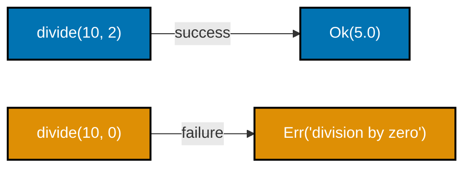

```python
"""Example 50: A Hand-Rolled Ok/Err Result Type."""

from __future__ import annotations  # => enables the quoted 'Result[float, str]' forward reference below

from dataclasses import dataclass  # => @dataclass(frozen=True) builds both Result variants
from typing import Generic, TypeVar  # => Generic/TypeVar make Ok[T] and Err[E] proper generic containers

T = TypeVar("T")  # => the type of the value an Ok wraps
E = TypeVar("E")  # => the type of the error an Err wraps


@dataclass(frozen=True)  # => marks Ok immutable, matching the FP style
class Ok(Generic[T]):  # => the "success" variant, carrying the computed value
    value: T  # => the single field this variant carries


@dataclass(frozen=True)  # => marks Err immutable too
class Err(Generic[E]):  # => the "failure" variant, carrying the ERROR AS A VALUE, not an exception
    error: E  # => the single field this variant carries


Result = Ok[T] | Err[E]  # => PEP 604 union: a Result is either Ok[T] or Err[E]


def divide(a: int, b: int) -> "Result[float, str]":  # => the failure mode is IN the return type
    if b == 0:  # => a caller reading this signature already knows failure is possible
        return Err("division by zero")  # => the error travels as an ordinary VALUE
    return Ok(a / b)  # => success wraps the computed value


success = divide(10, 2)  # => Ok(5.0)
failure = divide(10, 0)  # => Err('division by zero') -- NO exception was raised

# => Result makes failure part of the TYPE, not a hidden exception path
print(success)  # => Output: Ok(value=5.0)
print(failure)  # => Output: Err(error='division by zero')
print(isinstance(failure, Err))  # => Output: True -- the caller can inspect this without a try/except
```

**Output**:

```text
Ok(value=5.0)
Err(error='division by zero')
True
```

```python
"""Example 50: pytest verification for A Hand-Rolled Ok/Err Result Type."""

from example import Err, Ok, divide


def test_result_carries_success_or_failure_as_a_value() -> None:
    assert divide(10, 2) == Ok(5.0)
    assert divide(10, 0) == Err("division by zero")


# => Run: pytest -- Output: 1 passed
```

**Verify**: `pytest -q`

**Output**:

```text
1 passed
```

**Key takeaway**: `Result[T, E]` puts "this can fail, and here is what the failure looks like" directly
in the function's signature -- a caller reading `divide(a, b) -> Result[float, str]` already knows
failure is possible before reading a single line of the implementation.

**Why it matters**: Exceptions are invisible in a function's type signature -- nothing about
`def divide(a, b) -> float` warns a caller that a `ZeroDivisionError` is possible without reading the
implementation. Result makes the failure mode visible and, because Ok/Err are ordinary values,
composable: Example 51's map/and_then chain multiple Result-returning steps together without a single
try/except appearing anywhere in the chain.

---

### Example 51: map and and_then on a Result

_ex-51 &middot; exercises co-23, co-27_

`map` transforms a Result's success value while leaving `Err` untouched; `and_then` chains into ANOTHER
Result-returning step without double-wrapping the outcome. This example chains `parse_positive` (an
`and_then` step) with a `map(lambda n: n * 10)`, and confirms the chain short-circuits the moment
`parse_positive` returns an `Err`.

```python
"""Example 51: map and and_then on a Result."""

from __future__ import annotations  # => enables the quoted 'Result[U, object]' forward references below

from dataclasses import dataclass  # => @dataclass(frozen=True) builds both Result variants
from typing import Callable, Generic, TypeVar  # => Generic/TypeVar/Callable type the map and and_then methods

T = TypeVar("T")  # => the type of the value an Ok wraps
U = TypeVar("U")  # => the type map/and_then transform T into
E = TypeVar("E")  # => the type of the error an Err wraps
F = TypeVar("F")  # => the error type threaded through and_then's step function, not hardcoded to object


@dataclass(frozen=True)  # => marks Ok immutable, matching the FP style
class Ok(Generic[T]):  # => the success variant's body
    value: T  # => the single field this variant carries

    def map(self, fn: Callable[[T], U]) -> "Result[U, object]":  # => transforms the SUCCESS value only
        return Ok(fn(self.value))  # => transforms the value, stays wrapped as Ok

    def and_then(  # => chains into ANOTHER Result-returning step, without double-wrapping
        self, fn: Callable[[T], "Result[U, F]"]  # => F is inferred from fn's own error type, not widened to object
    ) -> "Result[U, F]":  # => the chained Result keeps fn's REAL error type
        return fn(self.value)  # => runs fn on the unwrapped value; fn itself returns a Result


@dataclass(frozen=True)  # => marks Err immutable too
class Err(Generic[E]):  # => the failure variant's body
    error: E  # => the single field this variant carries

    def map(self, fn: Callable[[T], U]) -> "Err[E]":  # => NO-OP: generic so a typed fn still passes the check
        return self  # => the error passes through UNCHANGED -- fn never runs

    def and_then(self, fn: Callable[[T], U]) -> "Err[E]":  # => and_then is ALSO a no-op on Err, generic likewise
        return self  # => short-circuits: fn never runs once the pipeline has already failed


Result = Ok[T] | Err[E]  # => the ADT itself: a Result is EITHER variant


def parse_positive(text: str) -> "Result[int, str]":  # => an and_then STEP: str -> Result[int, str]
    value = int(text)  # => may raise, but this example only feeds it valid ints
    return Ok(value) if value > 0 else Err(f"{value} is not positive")  # => the and_then step itself: may succeed or fail


times_ten: Callable[[int], int] = lambda n: n * 10  # => explicit annotation pins map's generic parameter to int

ok_chain = Ok("5").and_then(parse_positive).map(times_ten)  # => success end to end
err_chain = Ok("-5").and_then(parse_positive).map(times_ten)  # => fails at and_then

# => map transforms success; and_then chains into ANOTHER fallible step
print(ok_chain)  # => Output: Ok(value=50)
print(err_chain)  # => Output: Err(error='-5 is not positive')
```

**Output**:

```text
Ok(value=50)
Err(error='-5 is not positive')
```

```python
"""Example 51: pytest verification for map and and_then on a Result."""

from typing import Callable

from example import Err, Ok, parse_positive


def test_pipeline_stops_at_the_first_err() -> None:
    times_ten: Callable[[int], int] = lambda n: n * 10
    ok_chain = Ok("5").and_then(parse_positive).map(times_ten)
    err_chain = Ok("-5").and_then(parse_positive).map(times_ten)

    assert ok_chain == Ok(50)
    assert err_chain == Err("-5 is not positive")


# => Run: pytest -- Output: 1 passed
```

**Verify**: `pytest -q`

**Output**:

```text
1 passed
```

**Key takeaway**: map's function returns a plain value (rewrapped as Ok automatically); and_then's
function returns ANOTHER Result (not rewrapped, to avoid Result-inside-Result nesting) -- using the
wrong one either double-wraps or fails to unwrap.

**Why it matters**: A validation-then-transform pipeline typically mixes both kinds of steps -- some
that always succeed once they run (a good fit for `map`) and some that can themselves fail (a good fit
for `and_then`). Distinguishing them is what keeps a long Result chain flat instead of accumulating
nested `Ok(Ok(Ok(...)))` wrappers, and it's the exact distinction Example 56 revisits under the name
`bind` -- the same operation, one more common name for it.

---

### Example 52: A Validation Pipeline Threading Result

_ex-52 &middot; exercises co-24, co-23_

Railway-oriented programming models a validation pipeline as two parallel tracks -- success and failure
-- where each step either stays on the success track or switches permanently to failure. This example's
`validate_form` threads `validate_name` then `validate_age`, confirming a failure in the FIRST check
means the second is never even attempted.

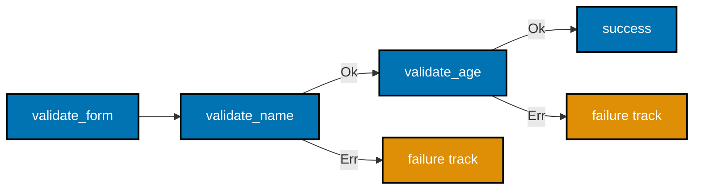

```python
"""Example 52: A Validation Pipeline Threading Result."""

from __future__ import annotations  # => enables the quoted 'Result[int, str]' forward references below

from dataclasses import dataclass  # => @dataclass(frozen=True) builds both Result variants
from typing import Generic, TypeVar  # => Generic/TypeVar make Ok[T] and Err[E] proper generic containers

T = TypeVar("T")  # => the type of the value an Ok wraps
E = TypeVar("E")  # => the type of the error an Err wraps


@dataclass(frozen=True)  # => marks Ok immutable, matching the FP style
class Ok(Generic[T]):  # => the success variant's body
    value: T  # => the single field this variant carries


@dataclass(frozen=True)  # => marks Err immutable too
class Err(Generic[E]):  # => the failure variant's body
    error: E  # => the single field this variant carries


Result = Ok[T] | Err[E]  # => the ADT itself: a Result is EITHER variant


def validate_age(age: int) -> "Result[int, str]":  # => railway step 1: switches to the failure track on error
    if age < 0:  # => the ONLY failure condition this step checks
        return Err("age cannot be negative")  # => switches to the failure track
    return Ok(age)  # => the success track, value unchanged


def validate_name(name: str) -> "Result[str, str]":  # => railway step 2
    if not name:  # => the ONLY failure condition this step checks
        return Err("name cannot be empty")  # => switches to the failure track
    return Ok(name)  # => the success track, value unchanged


def validate_form(name: str, age: int) -> "Result[str, str]":  # => threads BOTH steps in sequence
    name_result = validate_name(name)  # => the FIRST switch point
    if isinstance(name_result, Err):  # => already on the failure track -- age is never checked
        return name_result  # => the original error rides through untouched
    age_result = validate_age(age)  # => the SECOND switch point, only reached if step 1 succeeded
    if isinstance(age_result, Err):  # => the SECOND switch point
        return age_result  # => propagates the second step's failure
    return Ok(f"{name_result.value}, age {age_result.value}")  # => both checks passed


valid = validate_form("Ana", 30)  # => both checks succeed
bad_name = validate_form("", 30)  # => fails at the FIRST check -- age is never even validated
bad_age = validate_form("Ana", -1)  # => passes name, fails at the SECOND check

# => this is the railway-oriented programming pattern: one track, two rails
print(valid)  # => Output: Ok(value='Ana, age 30')
print(bad_name)  # => Output: Err(error='name cannot be empty')
print(bad_age)  # => Output: Err(error='age cannot be negative')
```

**Output**:

```text
Ok(value='Ana, age 30')
Err(error='name cannot be empty')
Err(error='age cannot be negative')
```

```python
"""Example 52: pytest verification for A Validation Pipeline Threading Result."""

from example import Err, Ok, validate_form


def test_one_bad_field_short_circuits_the_rest() -> None:
    assert validate_form("Ana", 30) == Ok("Ana, age 30")
    assert validate_form("", 30) == Err("name cannot be empty")
    assert validate_form("Ana", -1) == Err("age cannot be negative")


# => Run: pytest -- Output: 1 passed
```

**Verify**: `pytest -q`

**Output**:

```text
1 passed
```

**Key takeaway**: Once a railway pipeline switches to the failure track, every later step is skipped
automatically -- the pipeline's shape enforces "stop at the first failure" without a single explicit
early-return check written by hand at each step.

**Why it matters**: A multi-field form validator written with nested if/else quickly turns into a
pyramid of indentation, one level per field; a railway-style pipeline instead reads as a flat sequence
of steps, each returning Result, with the failure-track behavior handled once by `and_then`'s own logic
rather than repeated at every step. This is the shape Example 79's applicative validation in the
Advanced tier deliberately breaks from -- sometimes collecting ALL errors matters more than stopping at
the first one.

---

### Example 53: The Functor Identity Law by Example

_ex-53 &middot; exercises co-25_

A functor's `map` must obey the identity law -- mapping the identity function over a container changes
nothing but produces an equal container back. This example verifies `Box(42).map(identity) == Box(42)`
directly, confirming the law holds for this minimal `Box` functor while noting the result is equal but
not the SAME object.

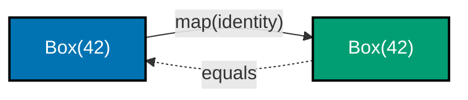

```python
"""Example 53: The Functor Identity Law by Example."""

from __future__ import annotations  # => enables the quoted 'Box[U]' forward reference below

from dataclasses import dataclass  # => @dataclass(frozen=True) builds the immutable Box
from typing import Callable, Generic, TypeVar  # => Generic/TypeVar/Callable type the minimal functor below

T = TypeVar("T")  # => the type of the value a Box wraps
U = TypeVar("U")  # => the type map's function returns


def identity(x: T) -> T:  # => the identity function: returns its argument UNCHANGED
    return x  # => identity's entire body: returns its argument, unchanged


@dataclass(frozen=True)  # => marks Box immutable, matching the FP style
class Box(Generic[T]):  # => a minimal functor: any container with a lawful map
    value: T  # => the single field this container carries

    def map(self, fn: Callable[[T], U]) -> "Box[U]":  # => applies fn inside, stays wrapped
        return Box(fn(self.value))  # => applies fn inside, re-wraps as Box


original = Box(42)  # => the container BEFORE the identity law is applied
mapped_with_identity = original.map(identity)  # => container.map(identity)

# => the functor identity law is a correctness check any lawful map must pass
print(mapped_with_identity == original)  # => Output: True -- the FUNCTOR IDENTITY LAW, verified
print(mapped_with_identity is original)  # => Output: False -- EQUAL, but a distinct object (still immutable)
```

**Output**:

```text
True
False
```

```python
"""Example 53: pytest verification for The Functor Identity Law by Example."""

from example import Box, identity


def test_mapping_identity_changes_nothing_but_the_wrapper() -> None:
    original = Box(7)
    assert original.map(identity) == original  # => the functor identity law


# => Run: pytest -- Output: 1 passed
```

**Verify**: `pytest -q`

**Output**:

```text
1 passed
```

**Key takeaway**: The identity law is a correctness check, not just a curiosity -- a `map`
implementation that fails it (say, one that accidentally transforms the value even when given
identity) is a functor with a bug, whether or not any test happens to catch it.

**Why it matters**: Every functor this topic has built so far -- list's own map, Option's
Some/Nothing, and now this minimal Box -- implicitly relies on this law holding, because code that
chains `.map(f).map(g)` assumes mapping never introduces changes beyond what `f` and `g` themselves
cause. Verifying the law explicitly, even on a toy container, is the same discipline that catches a
broken map implementation before it corrupts every pipeline built on top of it.

---

### Example 54: One fmap Working on list and Option

_ex-54 &middot; exercises co-25_

The functor pattern is "any container with a lawful map," and this example makes that literal -- a
single `fmap` function dispatches on whether its container is a `list`, a `Some`, or a `Nothing`,
applying the SAME transformation logic through three different container shapes.

```python
"""Example 54: One fmap Working on list and Option."""

from __future__ import annotations  # => enables the quoted 'Option[T]' forward references below

from dataclasses import dataclass  # => @dataclass(frozen=True) builds both Option variants
from typing import Callable, Generic, TypeVar  # => Generic/TypeVar/Callable type the shared fmap below

T = TypeVar("T")  # => the type of the value a container wraps
U = TypeVar("U")  # => the type fn transforms T into


@dataclass(frozen=True)  # => marks Some immutable, matching the FP style
class Some(Generic[T]):  # => the present variant's body
    value: T  # => the single field this variant carries


@dataclass(frozen=True)  # => marks Nothing immutable too
class Nothing:  # => the absent variant's body
    pass  # => carries no data at all


Option = Some[T] | Nothing  # => the ADT itself: an Option is EITHER variant


def fmap(fn: Callable[[T], U], container: "list[T] | Some[T] | Nothing") -> object:  # => ONE signature, THREE possible container shapes
    # => ONE function, dispatching on the container's actual shape -- the functor pattern made concrete
    if isinstance(container, list):  # => a list is mappable via a comprehension
        return [fn(item) for item in container]  # => applies fn to every element
    if isinstance(container, Some):  # => an Option is mappable via its own map rule
        return Some(fn(container.value))  # => applies fn to the single wrapped value
    return Nothing()  # => Nothing maps to Nothing, regardless of fn


double: Callable[[int], int] = lambda n: n * 2  # => explicit annotation lets fmap solve T=int from fn, not the lambda body

mapped_list = fmap(double, [1, 2, 3])  # => the list case
mapped_some = fmap(double, Some(5))  # => the Option case, present
mapped_nothing = fmap(double, Nothing())  # => the Option case, absent

print(mapped_list)  # => Output: [2, 4, 6]
print(mapped_some)  # => Output: Some(value=10)
print(mapped_nothing)  # => Output: Nothing()
```

**Output**:

```text
[2, 4, 6]
Some(value=10)
Nothing()
```

```python
"""Example 54: pytest verification for One fmap Working on list and Option."""

from typing import Callable

from example import Nothing, Some, fmap


def test_the_same_fmap_dispatches_on_container_shape() -> None:
    double: Callable[[int], int] = lambda n: n * 2
    assert fmap(double, [1, 2]) == [2, 4]
    assert fmap(double, Some(3)) == Some(6)
    assert fmap(double, Nothing()) == Nothing()


# => Run: pytest -- Output: 1 passed
```

**Verify**: `pytest -q`

**Output**:

```text
1 passed
```

**Key takeaway**: `fmap` treats `list` and `Option` identically from the caller's perspective -- "apply
this function to whatever's inside, however many somethings there are" -- even though their internal
`map` implementations are completely different.

**Why it matters**: Recognizing that lists, Options, Results, and similar wrapper types all share this
"container with map" shape is what makes the functor concept genuinely useful rather than an abstract
label -- it means learning ONE mental model (map preserves structure, transforms contents) that
transfers directly across every container this topic covers, instead of learning each one's
transformation rules from scratch.

---

### Example 55: map2 Combines Two Options

_ex-55 &middot; exercises co-26_

The applicative pattern generalizes `map` to functions that take MORE than one wrapped argument --
`map2` combines two Options with a 2-argument function, succeeding only if BOTH are present and
short-circuiting to `Nothing` the instant either one is absent.

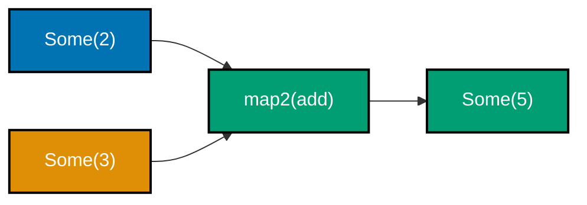

```python
"""Example 55: map2 Combines Two Options."""

from __future__ import annotations  # => enables the quoted 'Option[V]' forward reference below

from dataclasses import dataclass  # => @dataclass(frozen=True) builds both Option variants
from typing import Callable, Generic, TypeVar  # => Generic/TypeVar/Callable type the applicative map2 below

T = TypeVar("T")  # => the type of the first wrapped value
U = TypeVar("U")  # => the type of the second wrapped value
V = TypeVar("V")  # => the type fn returns after combining both


@dataclass(frozen=True)  # => marks Some immutable, matching the FP style
class Some(Generic[T]):  # => the present variant's body
    value: T  # => the single field this variant carries


@dataclass(frozen=True)  # => marks Nothing immutable too
class Nothing:  # => the absent variant's body
    pass  # => carries no data at all


Option = Some[T] | Nothing  # => the ADT itself: an Option is EITHER variant


def map2(  # => the applicative pattern: combine TWO wrapped values with a 2-arg function
    fn: Callable[[T, U], V], opt_a: "Option[T]", opt_b: "Option[U]"  # => the 2-arg combiner plus the two Options it combines
) -> "Option[V]":  # => closes the multi-line signature above
    if isinstance(opt_a, Nothing) or isinstance(opt_b, Nothing):  # => EITHER absent short-circuits
        return Nothing()  # => no partial combination -- both-or-nothing
    return Some(fn(opt_a.value, opt_b.value))  # => both present: unwrap both, apply fn, rewrap


def add(a: int, b: int) -> int:  # => the 2-argument function map2 combines two Options with
    return a + b  # => the actual addition add performs


both_present = map2(add, Some(2), Some(3))  # => both wrapped values ARE present
one_missing = map2(add, Some(2), Nothing())  # => the second value is ABSENT

# => applicative map2 generalizes map to functions of MORE than one argument
print(both_present)  # => Output: Some(value=5)
print(one_missing)  # => Output: Nothing()
```

**Output**:

```text
Some(value=5)
Nothing()
```

```python
"""Example 55: pytest verification for map2 Combines Two Options."""

from example import Nothing, Some, add, map2


def test_map2_combines_when_both_present_and_short_circuits_otherwise() -> None:
    assert map2(add, Some(2), Some(3)) == Some(5)
    assert map2(add, Some(2), Nothing()) == Nothing()
    assert map2(add, Nothing(), Some(3)) == Nothing()


# => Run: pytest -- Output: 1 passed
```

**Verify**: `pytest -q`

**Output**:

```text
1 passed
```

**Key takeaway**: `map2` is both-or-nothing -- there is no partial result when one input is present and
the other is absent, only a clean `Nothing`.

**Why it matters**: A plain `map` can't combine two independently-wrapped values (there's no single
container to call `.map` on), which is exactly the gap the applicative pattern fills. Validating two
independent form fields and combining them into one result only if BOTH pass is the same shape as
`map2` -- Example 79's Advanced-tier applicative validation extends this exact idea to accumulate ALL
failing fields' errors instead of stopping at the first one.

---

### Example 56: bind/flat_map Chaining Result Steps

_ex-56 &middot; exercises co-27_

`bind` (also called `flat_map`, or `and_then` as in Example 51) is the monad's defining operation:
chain a Result-producing step onto another Result, without the caller ever double-wrapping the outcome.
This example chains `half` then `to_positive` on `Ok(8)` (succeeding) and on `Ok(7)` (failing at the
FIRST bind, because 7 is odd).

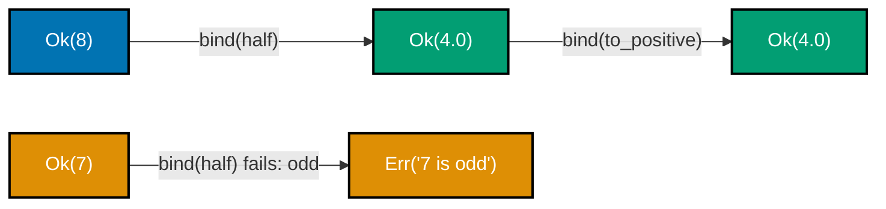

```python
"""Example 56: bind/flat_map Chaining Result Steps."""

from __future__ import annotations  # => enables the quoted 'Result[U, object]' forward references below

from dataclasses import dataclass  # => @dataclass(frozen=True) builds both Result variants
from typing import Callable, Generic, TypeVar  # => Generic/TypeVar/Callable type the bind chain below

T = TypeVar("T")  # => the type of the value an Ok wraps
U = TypeVar("U")  # => the type bind's step function returns
E = TypeVar("E")  # => the type of the error an Err wraps
F = TypeVar("F")  # => the error type threaded through bind's step function, not hardcoded to object


@dataclass(frozen=True)  # => marks Ok immutable, matching the FP style
class Ok(Generic[T]):  # => the success variant's body
    value: T  # => the single field this variant carries

    def bind(self, fn: Callable[[T], "Result[U, F]"]) -> "Result[U, F]":  # => F comes from fn's OWN error type
        # => bind/and_then/flat_map -- three names for the SAME monadic chaining operation
        return fn(self.value)  # => unwraps, runs fn (which itself returns a Result), no double-wrap


@dataclass(frozen=True)  # => marks Err immutable too
class Err(Generic[E]):  # => the failure variant's body
    error: E  # => the single field this variant carries

    def bind(self, fn: Callable[[T], U]) -> "Err[E]":  # => NO-OP, generic so a typed fn still passes the check
        return self  # => fn never runs once the chain has already failed


Result = Ok[T] | Err[E]  # => the ADT itself: a Result is EITHER variant


def half(n: int) -> "Result[float, str]":  # => a bind STEP: fails if n is odd
    if n % 2 != 0:  # => the ONLY failure condition this step checks
        return Err(f"{n} is odd")  # => switches to the failure track
    return Ok(n / 2)  # => the success track: n halved


def to_positive(x: float) -> "Result[float, str]":  # => a second bind STEP: fails if not positive
    return Ok(x) if x > 0 else Err(f"{x} is not positive")  # => the second bind step: may succeed or fail


chained_success = Ok(8).bind(half).bind(to_positive)  # => 8 -> 4.0 -> still positive
chained_failure = Ok(7).bind(half).bind(to_positive)  # => 7 is odd -- fails at the FIRST bind

print(chained_success)  # => Output: Ok(value=4.0)
print(chained_failure)  # => Output: Err(error='7 is odd')
```

**Output**:

```text
Ok(value=4.0)
Err(error='7 is odd')
```

```python
"""Example 56: pytest verification for bind/flat_map Chaining Result Steps."""

from example import Err, Ok, half, to_positive


def test_bind_chains_and_short_circuits_on_the_first_error() -> None:
    assert Ok(8).bind(half).bind(to_positive) == Ok(4.0)
    assert Ok(7).bind(half).bind(to_positive) == Err("7 is odd")


# => Run: pytest -- Output: 1 passed
```

**Verify**: `pytest -q`

**Output**:

```text
1 passed
```

**Key takeaway**: `bind`, `and_then`, and `flat_map` are three names for the identical operation --
"run this next Result-producing step on my current success value, and let the SAME short-circuiting
apply if either one fails."

**Why it matters**: The vocabulary difference (`bind` vs. `and_then` vs. `flat_map`) trips up readers
moving between languages more than the concept itself does -- Haskell and Scala favor `bind` or the
`>>=` operator, JavaScript Promises use `then`, Rust's `Result` uses `and_then`. Recognizing they are
the SAME chaining operation under different names is what lets this topic's monad-law example
(Example 78 in the Advanced tier) verify the same three laws regardless of which name a particular
codebase happens to use.

---

← Previous: [Beginner Examples](./beginner.md) &middot; Next: [Advanced Examples](./advanced.md) →
