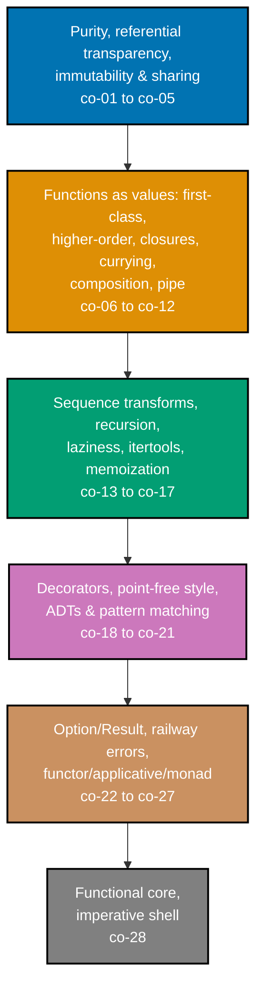

## Prerequisites

- **Prior topics**: [4 · Just Enough Python](../../just-enough-python/learning/overview.md) covers the
  functions, closures, comprehensions, and generators this topic builds on directly; [7 · Data
  Structures & Algorithms Essentials](../../data-structures-and-algorithms-essentials/learning/overview.md)
  supplies the sequences and trees the transformation pipelines below operate over. This topic
  deliberately contrasts against [8 · Object-Oriented Programming Essentials](../../object-oriented-programming-essentials/learning/overview.md) --
  bundling state and behavior together is the opposite move from keeping functions pure and data
  immutable. Topic 22, Programming Paradigms, already introduced the functional lens through contrast
  and explicitly deferred the deep dive to this topic -- reading it first is a natural on-ramp but not
  required.
- **Tools & environment**: a macOS/Linux terminal; **Python 3.13.12**; `pytest` (9.1.1) installed for
  running every example's locking test. Every `example.py` in this topic is fully type-annotated
  (PEP 484): parameters, return types, and non-obvious local variables all carry explicit type hints.
  Only the standard library is required -- `functools`, `itertools`, `dataclasses`, and `types` ship
  with Python, so nothing here needs `pip install`.
- **Assumed knowledge**: writing Python functions, closures, comprehensions, and generators
  comfortably; the idea of a side effect; basic familiarity with `tuple`/`list`/`dict`.

## Why this exists -- the big idea

**The problem before the solution**: shared mutable state is the root of the hardest bugs to
reproduce -- action at a distance, a value that changed somewhere you didn't expect, a codebase you're
afraid to touch because nothing about it is local. **Keep this if you forget everything else**: push
side effects to the edges and keep a pure core -- code that only maps inputs to outputs is code you
can test without mocks, reason about without tracing the whole call graph, and run twice (or in
parallel) without fear.

**Cross-cutting big ideas**: `taming-state` is the central move this whole topic makes -- quarantine
state and effects instead of abolishing them. `determinism-vs-emergence` names what purity buys:
deterministic, replayable behavior instead of an unpredictable one. `abstraction-and-its-cost` is the
honest counterweight -- immutability allocates, and the algebraic patterns (`Result`, functors,
monads) buy composability at the price of a learning tax and, sometimes, real indirection.

**Where this comes from**: functional programming traces to Church's lambda calculus (1930s) -- a
model of computation as pure function application that predates stored-program machines entirely. It
stayed mostly academic (Lisp 1958, ML, Haskell 1990) until multicore hardware and distributed systems
made shared mutable state the industry's dominant source of pain, and referential transparency --
the property FP had all along -- became the practical answer to concurrency and testability bugs.
That is why "reduce shared mutable state" now shows up inside mainstream object-oriented languages too
(immutable records, `map`/`filter`, `Optional`): the lesson was never purity-as-religion, it was that
_controlling where state and effects live_ is the leverage.

**Scope note**: this topic teaches functional programming as an everyday, practical discipline in
Python -- purity, immutability, higher-order functions, composition, and the algebraic
error-handling patterns (`Option`/`Result`) -- plus a gentle, code-first first exposure to
functors/applicatives/monads as patterns you can recognize and use, not as a rigorous,
law-checking treatment. The deeper, law-checking side of that material lives in a later topic, Type
Systems, further along in this journey -- nothing here requires reading that first.

## How verification works in this topic

Every one of this topic's 80 worked examples is a complete, self-contained `example.py` colocated
under `learning/code/ex-NN-slug/`, runnable in isolation with `python3 example.py` -- its expected
output is shown two ways: inline, as a `# => Output: ...` comment directly beneath the `print()` call
that produces it, and as a captured, verbatim `python3 example.py` run in this page's **Output**
block. Every example also ships a colocated `test_example.py`, verified with `pytest -q` and shown
the same way. Nothing on the following pages is a description of what Python "should" do -- every
claim is independently run against Python 3.13.12, and every code/test pair is fully type-annotated
by hand.

## Concepts

Every worked example in this topic's follow-up pages cites the `co-NN` concept it exercises -- this
section is the 1:1 reference those citations point back to. Read it in the order presented: purity
and immutability first (the vocabulary everything else depends on), then functions as values, then
the sequence-transform and laziness toolkit, then decorators and algebraic data types, then the
`Option`/`Result` error-as-value patterns and their functor/applicative/monad shape, and finally the
functional-core/imperative-shell split that ties the whole topic together.

### co-01: Pure Functions

A pure function's output depends only on its inputs, and it produces no observable side effect --
no mutating an argument, no writing to a global, no printing, no touching a file or the network. Call
it twice with the same arguments and you get the same result, every time, with nothing else in the
program changed by the call.

**Why it matters**: a pure function is trivially safe to call twice, safe to call from multiple
threads at once, and easy to test with nothing but its arguments and its return value -- no database,
no mock, no setup. Every other concept in this topic that "buys reasoning" (immutability, referential
transparency, the functional core in co-28) ultimately routes back through this one property.

**Verify it**: Example 1 contrasts a pure `add(a, b)` against an impure twin mutating a global, and
confirms the pure one gives the same result on repeat calls; Example 29 extracts a pure core from a
mutating routine and tests it with zero I/O; Example 32 contrasts a stateful closure counter against a
pure fold computing the identical count; Example 57's functional-core/imperative-shell CSV analyzer
pure-tests its core; Example 58 property-tests purity itself across 200 generated inputs; Example 60
verifies that replaying a pure `(state, action) -> state` reducer reproduces the same final state.

### co-02: Side Effects and the Purity Boundary

A **side effect** is anything a function does besides computing and returning a value -- printing,
mutating an argument the caller can see, writing a file, incrementing a counter outside the function's
own scope. Naming exactly where that boundary sits -- which functions are pure and which are not -- is
a design decision, not an accident.

**Why it matters**: code that never names its purity boundary lets side effects creep in anywhere,
which is precisely what makes large imperative codebases hard to test: every function might secretly
touch global state, so nothing can be verified in isolation. Drawing the boundary explicitly is the
first step toward the functional-core/imperative-shell split this whole topic builds toward (co-28).

**Verify it**: Example 1's impure twin mutates a global counter as its side effect; Example 3
classifies three functions -- one that prints, one that mutates an argument, one that is pure -- and
confirms only the pure one is flagged pure.

### co-03: Referential Transparency

A call is **referentially transparent** if it can be replaced by its own return value anywhere in the
program without changing what the program does. `add(2, 3)` can always be replaced by `5`; a call that
also logs, or that depends on a mutable global, cannot be substituted this freely.

**Why it matters**: referential transparency is what makes equational reasoning possible -- you can
simplify an expression by substituting a call for its value the same way you simplify algebra, without
having to trace side effects to check the substitution is safe. Compilers and optimizers exploit the
identical property (constant folding, memoization) for the same underlying reason.

**Verify it**: Example 2 replaces a call with its literal value inside a larger expression and confirms
the program's output is unchanged; Example 58's property test asserts a function is pure and idempotent
across generated inputs, which is referential transparency checked mechanically rather than by hand.

### co-04: Immutability

Immutable data cannot be mutated after construction -- Python's `tuple` and `frozenset` are built-in
immutable containers; `@dataclass(frozen=True)` makes a custom record immutable and raises
`FrozenInstanceError` on an attempted attribute set; `types.MappingProxyType` wraps an existing `dict`
in a read-only view. `dataclasses.replace` (a shallow copy with named fields overridden) is how you
"update" a frozen record without mutating it -- this topic uses `dataclasses.replace`, not the newer
`copy.replace` (Python 3.13+), to stay compatible with Python 3.10.

**Why it matters**: an object nobody can mutate is an object that is always safe to hand to another
function, another thread, or another part of the codebase -- there is no way for that code to corrupt
what you still hold a reference to. Every later paradigm-level guarantee in this topic (persistent data
in co-05, safe sharing across the functional-core boundary in co-28) ultimately rests on this one
property being true.

**Verify it**: Example 4 attempts to mutate a `tuple` and catches the resulting `TypeError`; Example 5
shows `@dataclass(frozen=True)` rejecting an attribute set with `FrozenInstanceError`; Example 6 uses
`dataclasses.replace` to produce a new record and confirms the original is untouched; Example 31 wraps
a `dict` in `types.MappingProxyType` and confirms writes through the view raise; Example 60's reducer
never mutates its state argument; Example 75 measures the concrete allocation cost of immutable updates
against in-place mutation; Example 76 refactors shared-mutable code so no globals remain.

### co-05: Persistent Data and Structural Sharing

A **persistent** data structure keeps every old version reachable after an "update" -- because the
update never mutates anything, it just builds a new version that shares whatever structure didn't
change with the old one. A cons-list `prepend` is the simplest case: the new head points at the
existing tail, so the old list is still completely intact and usable.

**Why it matters**: structural sharing is what makes immutability affordable -- without it, every
"update" would have to deep-copy the entire structure, which is both slow and memory-hungry at scale.
Sharing the unchanged parts means an immutable update can be as cheap as `O(1)` (prepend) or `O(log n)`
(a balanced tree), not `O(n)`.

**Verify it**: Example 6's `dataclasses.replace` demonstrates the shallow-copy half of this idea;
Example 7 prepends onto a persistent cons-list and confirms the old version is still intact after the
update; Example 30 confirms `O(1)` sharing on a persistent linked-list prepend; Example 59 updates a
persistent binary tree and confirms the old root is untouched; Example 75 measures the performance
trade-off of persistent updates against in-place mutation, numerically.

### co-06: First-Class Functions

Functions in Python are ordinary values -- you can assign one to a variable, store several in a list
or dict, pass one as an argument, and return one from another function, all without any special
syntax. `double = lambda x: x * 2` puts a function in a variable exactly the way `n = 5` puts an int
in one.

**Why it matters**: once functions are values, behavior itself becomes something you can pass around,
store, and compose -- which is the seed every other concept in this section (co-07 through co-12)
grows from. Without first-class functions, none of higher-order functions, closures, currying,
composition, or decorators would be expressible at all.

**Verify it**: Example 8 assigns a function to a variable and calls through it, confirming the same
result as calling it directly; Example 9 stores several functions in a list and calls each one in
turn, confirming every one is invoked with the right output.

### co-07: Higher-Order Functions

A **higher-order function** takes another function as an argument, returns one, or both. `apply(fn,
x)` returning `fn(x)` is the smallest possible example -- it works identically whether `fn` doubles,
squares, or does something else entirely, because `apply` never needs to know what `fn` actually does.

**Why it matters**: higher-order functions let you factor "the shape of the computation" apart from
"what specifically happens at each step" -- the same `apply_all` helper works for any function you
hand it. This is the mechanism underneath decorators (co-18), `map`/`filter`/`reduce` (co-13), and
every composition/pipe utility in this topic.

**Verify it**: Example 10's `apply(fn, x)` returns `fn(x)` and is verified against two different
functions; Example 11's `multiplier(n)` returns a closure, and `multiplier(3)(4) == 12` confirms a
function is being both returned and called correctly.

### co-08: Closures for Configuration

A **closure** is a function that captures a variable from its enclosing scope and keeps using that
captured value even after the enclosing function has returned. `multiplier(3)` returns a function that
remembers `3` forever -- calling `multiplier(3)(4)` multiplies by the captured `3`, not by some value
passed in fresh each time.

**Why it matters**: closures let you "bake in" configuration once and get back a specialized function
that behaves according to that configuration on every future call, without threading a parameter
through every call site by hand. This is the direct ancestor of `functools.partial` (co-10) and every
parameterized decorator (co-18) in this topic.

**Verify it**: Example 11's `multiplier(n)` closes over `n`; Example 12's closure captures a threshold
and its behavior is shown to vary with the captured value; Example 32 contrasts a stateful closure
counter (state lives in the closure) against a pure fold computing the identical total (state lives
nowhere), naming exactly where each one's state actually lives.

### co-09: Currying

**Currying** turns an `n`-argument function into a chain of one-argument functions -- a 2-argument
`add(a, b)` becomes `add(a)(b)`, where `add(a)` returns a new one-argument function that remembers
`a` and waits for `b`. Each application peels off exactly one argument.

**Why it matters**: a curried function lets you fix arguments one at a time and get back a smaller,
reusable function at every intermediate step -- `add(5)` alone is a perfectly usable "add five to
this" function, no wrapper needed. This is closely related to but distinct from partial application
(co-10): currying is always one argument at a time by construction, while `functools.partial` can fix
any number of arguments at once.

**Verify it**: Example 17 hand-curries a 2-argument function into `f(a)(b)` and confirms the result
matches the uncurried call; Example 33 builds a pipeline out of `functools.partial` calls composed
together; Example 62's `@curry` decorator auto-curries by counting a function's arity and verifies
partial calls accumulate arguments correctly.

### co-10: Partial Application

**Partial application** fixes some of a function's arguments right now and returns a smaller function
waiting for the rest. `functools.partial(pow, 2)` fixes the base at `2` and returns a one-argument
function computing `2**n` -- no lambda, no manual closure, the standard library does it directly.

**Why it matters**: `functools.partial` is the stdlib's built-in answer to "I want this function, but
with some arguments already decided" -- it is more discoverable and more efficient than hand-writing a
wrapping lambda for the same purpose, and it composes cleanly with `functools.reduce` and decorator
pipelines elsewhere in this topic.

**Verify it**: Example 18's `functools.partial(pow, 2)` is verified to compute `2**n`; Example 33
chains several `partial` calls into a composed transform and verifies the result.

### co-11: Function Composition

**Composition** builds a new function `f ∘ g` out of two existing ones, so that calling the composed
function on `x` runs `g(x)` first and feeds its result into `f`. A hand-written `compose(f, g)` helper
computes exactly `f(g(x))`, and `compose(*fns)` generalizes this to a whole list of functions folded
together.

**Why it matters**: composition is how small, single-purpose functions become a larger pipeline
without ever being fused into one big function body -- each piece stays independently readable and
independently testable, and the pipeline itself is just data (a sequence of functions) that can be
built, inspected, and reused. This is the backbone every `pipe` utility (co-12) and every
`Result`-returning Kleisli composition (co-27) in this topic builds on.

**Verify it**: Example 19's `compose(f, g)` is verified to compute `f(g(x))`; Example 20's `pipe(x, f,
g)` is verified to equal the nested calls, read left-to-right instead of inside-out; Example 34's
`compose(*fns)` folds a whole list of functions and the application order is verified; Example 37 chains
map/filter/reduce with composition for a data summary; Example 61 composes `Result`-returning functions
(a Kleisli composition) and verifies error propagation through the chain; Example 74 contrasts a deep
`pipe` against the equivalent nested calls on real data, noting the readability difference; Example 77's
decorator stack composition makes the order-dependent behavior of stacked decorators explicit.

### co-12: Pipe Utilities

A **pipe** utility reads a computation left-to-right in the order it actually executes -- `pipe(x, f,
g)` means "start with `x`, apply `f`, then apply `g`" -- instead of the inside-out reading order of
nested calls (`g(f(x))` reads right-to-left relative to execution order).

**Why it matters**: `pipe` and `compose` compute the identical thing but read in opposite directions;
for a chain of more than two or three steps, reading left-to-right in execution order is measurably
easier to follow than unwinding nested parentheses from the inside out. This is purely a readability
trade, not a difference in what gets computed.

**Verify it**: Example 20's `pipe(x, f, g)` is verified equal to the nested-call equivalent; Example 73
builds a small point-free combinator library including a `pipe`-style combinator, verified against a
composed transform; Example 74 directly contrasts a deep `pipe` chain against nested calls on real
data and notes where the readability actually diverges.

### co-13: Map, Filter, Reduce

The three core sequence transforms replace hand-written accumulation loops: `map` applies a function to
every element, `filter` keeps only the elements a predicate accepts, and `reduce` (from `functools`)
folds a sequence down to a single accumulated value. A list comprehension can express `map` + `filter`
together, and often reads more clearly than the equivalent stdlib-function chain.

**Why it matters**: these three functions cover the overwhelming majority of "loop over a collection
and do something" code without a single explicit mutable accumulator variable exposed to the caller --
`reduce(add, nums, 0)` states "sum these numbers" as one expression instead of a loop with an
initialized-then-mutated running total. Recognizing when a loop is secretly a `map`, a `filter`, or a
`reduce` is one of the most immediately useful skills this topic teaches.

**Verify it**: Example 13's `map(str.upper, words)` uppercases every word; Example 14's `filter(is_even,
nums)` keeps only evens; Example 15's `reduce(add, nums, 0)` computes the total; Example 16 confirms a
comprehension produces an identical list to the equivalent `map`+`filter`; Example 36 builds a `dict`
histogram with `reduce`; Example 37 chains all three for a data summary; Example 38 pulls a lazy
`map`/`filter` generator pipeline with `next`, confirming laziness end to end.

### co-14: Recursion and Python's Missing TCO

Recursion expresses repetition as a function calling itself with a smaller version of the problem, the
functional idiom for what a loop does imperatively. CPython, by explicit design choice (Guido van
Rossum's own stated stance), performs **no tail-call optimization** -- a deeply recursive call still
grows the call stack one frame per call and eventually raises `RecursionError`, unlike languages that
optimize a self-tail-call into a loop automatically.

**Why it matters**: recursion is often the most natural way to express a divide-and-conquer or
tree-shaped computation, but in Python it comes with a real, load-bearing limit that other functional
languages don't share -- know that limit exists before reaching for deep recursion in production code,
and know the two standard workarounds (an explicit stack, or a trampoline) for when recursion depth
would otherwise be unbounded.

**Verify it**: Example 27 computes a recursive factorial and notes explicitly that CPython has no TCO;
Example 44 converts a deep recursion into an explicit stack and verifies the same result on an input
that would otherwise raise `RecursionError`; Example 66 builds a trampoline that simulates TCO and
verifies a deep recursion completes without ever raising `RecursionError`.

### co-15: Lazy Evaluation and Generators

**Lazy evaluation** computes a value only when it is actually needed, instead of eagerly computing
everything up front. Python's generators (functions using `yield`) are the concrete mechanism: a
generator expression builds no list at all -- each value is produced on demand, one `next()` call at a
time, which is what makes an infinite sequence (like `itertools.count()`) usable in the first place.

**Why it matters**: laziness lets you write a pipeline over a sequence of unknown or infinite size
without ever materializing that sequence in memory -- you only pay for the values you actually pull.
The cost is that laziness can also hide real work: a lazy pipeline recomputed on every pull, instead of
once, can be slower overall than the eager version it was meant to optimize.

**Verify it**: Example 21's generator yields on demand, and only pulled values are shown to be
computed; Example 22 contrasts a generator expression against a list built from the same data,
confirming the generator doesn't materialize eagerly; Example 23 uses `itertools.islice` over an
infinite `count()` to take the first N values; Example 38's `map`/`filter` generator pipeline is pulled
by `next`, confirming laziness end to end; Example 63 builds a lazy, infinite prime sieve and verifies
the first N primes; Example 64 pulls a coroutine-style `yield` pipeline for a streaming result; Example
78 contrasts a case where laziness saves real work against a case where it quietly hides cost.

### co-16: The itertools Toolkit

`itertools` is the standard library's composable, lazy building-block toolkit for iteration: `islice`
takes a slice of any iterable (including an infinite one) without materializing it, `chain` concatenates
iterables, `accumulate` produces running totals, `groupby` groups consecutive equal keys, `tee` splits
one iterator into several independent ones, and `pairwise` yields consecutive element pairs. Every one
of these functions is itself lazy -- none of them build an intermediate list.

**Why it matters**: `itertools` is where "write your own generator by hand" stops being necessary for
most common iteration patterns -- reaching for `accumulate` instead of a hand-rolled running-total loop,
or `groupby` instead of a hand-rolled grouping dict, is both less code and composes cleanly with the
rest of this topic's lazy-pipeline style.

**Verify it**: Example 23 uses `islice` over an infinite `count()`; Example 24 chains `chain` and
`groupby` over data and verifies the grouped output; Example 39 verifies prefix sums via `accumulate`;
Example 40 verifies adjacent pairs via `pairwise` and independent streams via `tee`; Example 63's lazy
prime sieve composes several `itertools` building blocks together.

### co-17: Memoization

**Memoization** caches a pure function's results keyed by its arguments, so a repeated call with the
same arguments returns the cached result instead of recomputing it. `functools.lru_cache` is the
stdlib's decorator-based implementation; a hand-rolled `dict` cache is the same idea made explicit,
useful when `lru_cache`'s exact eviction policy doesn't fit.

**Why it matters**: memoization is only safe to apply because the function being cached is pure
(co-01) -- caching an impure function's results would silently return stale side effects along with a
stale value. A recursive `fib` without memoization is exponential; with `@lru_cache`, it becomes
linear, because every unique argument is computed exactly once.

**Verify it**: Example 25 puts `@lru_cache` on a recursive `fib` and confirms `cache_info()` shows
cache hits on repeated calls; Example 41 hand-rolls a memo `dict` for an expensive function and confirms
the second call is served from the cache; Example 65 builds a memoize decorator with a bounded
`maxsize` and confirms the oldest entry is evicted once the bound is exceeded.

### co-18: Decorators as Higher-Order Functions

A **decorator** is a higher-order function that takes a function and returns a wrapped replacement --
`@log_calls` on `def greet(): ...` is exactly `greet = log_calls(greet)`, spelled with `@` syntax
instead of a manual reassignment. Decorators can take their own arguments (`@retry(3)`), and
`functools.wraps` preserves the wrapped function's `__name__` and other metadata so introspection still
sees the original function's identity.

**Why it matters**: decorators let you attach cross-cutting behavior (logging, caching, retrying,
timing) to a function without touching that function's own body at all -- the wrapped behavior is
composable and reusable across any function, and stacking several decorators applies them in a
well-defined, ordered sequence.

**Verify it**: Example 26 wraps a function with a logging decorator and confirms the wrapped result is
unchanged; Example 42's parameterized `@retry(3)` decorator has its retry count verified; Example 43
confirms `functools.wraps` preserves `__name__` through the wrapper; Example 62's `@curry` decorator
auto-curries by arity; Example 65's bounded memoize decorator is itself a decorator; Example 77 stacks
multiple decorators and verifies the order-dependent behavior that results.

### co-19: Point-Free Style

**Point-free style** expresses a transformation by composing functions together without ever naming the
argument the data flows through -- a pipeline built entirely from `compose`/`pipe` calls has no `lambda
x: ...` anywhere, because the "point" (the argument) is never explicitly written.

**Why it matters**: point-free style pushes composition to its logical extreme -- when it reads well,
it emphasizes the shape of the transformation (which functions, in which order) over the mechanics of
threading a named variable through each step. Taken too far, though, it can obscure what's actually
happening; this topic treats it as one more tool, not a stylistic mandate.

**Verify it**: Example 35 rewrites a lambda-based pipeline in point-free style and confirms identical
output; Example 73 builds a small point-free combinator library and verifies a composed transform built
entirely from it.

### co-20: Algebraic Data Types in Python

An **algebraic data type** (ADT) models a "one of several shapes" value as a union of frozen
dataclasses -- `Circle | Square` (PEP 604 union syntax, Python 3.10+) says a `Shape` is either a
`Circle` or a `Square`, each carrying only the fields relevant to that variant, instead of one class
with optional fields for every possible shape.

**Why it matters**: an ADT makes illegal states unrepresentable at the type level -- there is no way to
construct a `Circle` with a `side_length` field, because that field doesn't exist on `Circle` at all.
This is a stronger guarantee than a single class with nullable fields, where nothing stops a `Circle`
instance from also carrying a stray `side_length` value that means nothing.

**Verify it**: Example 45 models a shape as a union of frozen dataclasses (`Circle | Square`) and
verifies each variant; Example 46 pattern-matches over the ADT with `match`/`case`; Example 67 models an
expression AST as an ADT with a `match`-based evaluator, verified against an arithmetic result.

### co-21: Structural Pattern Matching

Python's `match`/`case` (PEP 634, Python 3.10+) destructures a value against a series of patterns,
picking the first branch whose shape matches -- particularly natural for dispatching over an ADT's
variants (co-20). `case` clauses can carry `if` guards for conditions the pattern shape alone can't
express.

**Why it matters**: `match`/`case` reads as "what shape is this value, and what do I do for each shape"
directly, instead of an `isinstance` chain or a dict-based dispatch table. The one fact to hold onto:
Python's `match`/`case` has **no compile-time exhaustiveness checking** -- an unmatched value simply
falls through with no error unless you add an explicit wildcard `case _` and raise there yourself. The
rigorous, exhaustiveness-checked treatment of this idea lives in the type-systems topic referenced
above.

**Verify it**: Example 23 dispatches on a command tag with `match`/`case`; Example 46 matches over the
`Circle | Square` ADT and confirms every branch fires, with an explicit note on the lack of
exhaustiveness checking; Example 47 adds `if` guards to `case` clauses and confirms the guard selects
the right branch; Example 52 dispatches over an ADT with `match`/`case`; Example 67's expression
evaluator dispatches on AST node shape with `match`/`case`.

### co-22: The Option/Maybe Type

An **Option** (also called `Maybe`) makes "this value might be absent" a value in its own right,
instead of overloading `None` (or an exception) to mean absence. This topic hand-rolls `Some`/`Nothing`
as frozen dataclasses mirroring Rust's `Option` -- stdlib-only, no third-party functional-programming
library required.

**Why it matters**: a function that returns `Optional[int]` still lets a caller forget the `None` check
and crash later with a "`NoneType` has no attribute" error, far from where the `None` actually
originated. An `Option`-returning function forces the caller to unwrap the result explicitly (or `map`
through it), turning a possible runtime crash into a type-level obligation the caller cannot silently
skip.

**Verify it**: Example 28 guards a `None`-returning function's result at the call site; Example 48
builds a hand-rolled `Some`/`Nothing` with `map`, and confirms `map` is skipped on `Nothing`; Example 49
chains `Option`-returning lookups and confirms the chain short-circuits on the first miss; Example 68
sequences several `Option` computations readably and confirms short-circuit on absence; Example 79
compares the same pipeline built on `Option` against the same pipeline built on `Result`.

### co-23: The Result/Either Type

A **Result** (also called `Either`) carries success-or-failure as a value -- this topic hand-rolls
`Ok`/`Err` as frozen dataclasses mirroring Rust's `Result`, stdlib-only. Unlike an exception, a
`Result` shows up in the function's own return type, so a caller can see at the call site that failure
is possible without reading the function's implementation.

**Why it matters**: exceptions are invisible in a function's signature -- nothing in `def parse(s: str)
-> int` tells you it can raise -- while `def parse(s: str) -> Result[int, str]` states the failure mode
directly in the type callers see. This makes failure an ordinary value you can `map` over, compose, and
inspect, instead of a special control-flow mechanism that unwinds the stack.

**Verify it**: Example 50 carries an error as a value through a hand-rolled `Ok`/`Err`; Example 51
chains `map`/`and_then` on a `Result` and confirms the pipeline stops at the first `Err`; Example 52
threads `Result` through a validation pipeline and confirms one bad field short-circuits the rest;
Example 61 composes `Result`-returning functions and verifies error propagation through the
composition; Example 69 validates a form with `Result`, reporting the specific failing rule; Example 79
compares the identical pipeline built on `Result` against the same pipeline built on `Option`.

### co-24: Railway-Oriented Error Handling

**Railway-oriented programming** threads a `Result` through a pipeline of steps where each step can
switch the computation from the "success track" to the "failure track" -- once on the failure track,
every remaining step is skipped and the original error rides through to the end untouched, the way a
train switches tracks and stays on the new one.

**Why it matters**: this pattern replaces a pyramid of nested `if err != nil` checks (or a scattered set
of `try`/`except` blocks) with a single linear chain that reads top-to-bottom -- the short-circuiting
behavior is handled once, by the `Result` type's own `and_then`/`map` machinery, instead of being
re-implemented by hand at every step.

**Verify it**: Example 52's validation pipeline threads `Result` through several checks, and one bad
field is confirmed to short-circuit the rest; Example 69 validates a form the same way and reports
exactly which rule failed; Example 71 builds an _applicative_ variant that accumulates every error
instead of stopping at the first one, making the trade-off between short-circuiting and
error-accumulation explicit.

### co-25: Functor Intuition

A **functor**, in this topic's practical sense, is anything "mappable" -- a container type with a
`map` method that applies a function to the value(s) inside without ever unwrapping the container
itself. `Some(5).map(lambda x: x + 1)` returns `Some(6)`, still wrapped; `Nothing.map(f)` returns
`Nothing` untouched, because there is nothing inside to apply `f` to.

**Why it matters**: `map` on `Option`/`Result` is the exact same idea as `map` on a `list` -- "apply
this function to whatever's inside, however many things that is (zero, one, or many)" -- which is why
recognizing the functor pattern lets you transfer intuition about list `map` directly onto `Option`,
`Result`, and any other wrapped-value type you build. The identity law (`container.map(identity) ==
container`) is the concrete, checkable statement of "mapping changes nothing but the wrapped value."

**Verify it**: Example 48's `Some`/`Nothing` `map` implementation is the first hands-on functor;
Example 53 shows `container.map(identity) == container` by example, the functor identity law made
concrete; Example 54 applies one `fmap` function to both a `list` and an `Option` and confirms both are
mapped correctly; Example 70 property-tests the functor identity and composition laws and confirms both
hold.

### co-26: Applicative Intuition

An **applicative** combines several independently-wrapped values with a multi-argument function --
`map2(add, Some(2), Some(3))` unwraps both `Option`s and calls `add(2, 3)`, wrapping the result back up
as `Some(5)`; if either input is `Nothing`, the whole combination short-circuits to `Nothing`.

**Why it matters**: `map`/functor (co-25) only handles a function of one wrapped argument; applicative
is the natural next step for combining _several_ independently-wrapped values at once, without nesting
one `map` inside another by hand. The applicative-vs-railway (co-24) contrast is concrete and useful:
an applicative combination can be built to accumulate every error instead of stopping at the first one,
which a strictly sequential railway chain cannot do without extra machinery.

**Verify it**: Example 55's `map2` combines two `Option`s with a 2-argument function, verified to
combine when both are present and to short-circuit when either is absent; Example 71 builds an
applicative that accumulates every validation error instead of stopping at the first; Example 80's
capstone-preview log analyzer combines partial aggregates with an applicative pattern.

### co-27: Monad Intuition

A **monad**, in this topic's practical sense, chains functions that each return an already-wrapped
value -- `bind` (also called `and_then` or `flat_map`) takes a wrapped value and a function returning
another wrapped value, and flattens the result instead of producing a wrapped-wrapped value.
`Ok(5).and_then(lambda x: Ok(x + 1))` returns `Ok(6)`, not `Ok(Ok(6))`.

**Why it matters**: `map` (co-25) can't chain functions that themselves return a wrapped value without
producing a nested wrapper; `bind`/`and_then` is exactly the extra piece that makes chaining such
functions work cleanly. This is the mechanism underneath every `Result`-pipeline in this topic (co-23,
co-24) and every `Option`-chaining example (co-22) -- naming it as "the monad pattern" mostly matters
for recognizing the same shape when you meet it in another library or language.

**Verify it**: Example 51's `and_then` on `Result` chains steps and stops at the first `Err`; Example 56
chains `bind`/`flat_map` across several `Result`-returning steps, verifying the monadic sequencing;
Example 61 composes `Result`-returning functions in a Kleisli composition; Example 68 sequences
`Option` computations do-notation-style; Example 72 shows left-identity, right-identity, and
associativity by example for `Result`, the three monad laws made concrete; Example 79 compares the
identical monadic pipeline built on `Option` against the same pipeline built on `Result`.

### co-28: Functional Core, Imperative Shell

A **functional core, imperative shell** design splits a program into a pure transformation core (parse,
transform, aggregate -- no I/O anywhere) surrounded by a thin imperative shell that holds every effect
(reading a file, writing output, talking to a network). The core is tested directly, with no mocking,
because it has nothing to mock; the shell is tested (if at all) end to end, because it's where the real
world actually happens.

**Why it matters**: this is the topic's answer to "how do you get the benefits of purity in a program
that unavoidably has to do I/O somewhere" -- you don't eliminate the I/O, you quarantine it at the
edges and keep everything else pure. This is the same move underneath co-02's purity boundary, made
into a concrete architectural pattern, and it is the pattern this topic's own capstone builds end to
end.

**Verify it**: Example 29 extracts a pure core from a mutating routine and tests it with zero I/O;
Example 57 splits a CSV analyzer into a pure core and an I/O shell, with the core pure-tested and the
shell holding all I/O; Example 76 refactors shared-mutable code to pass state explicitly, confirming no
globals remain; Example 80's capstone-preview log analyzer combines a functional core, `Result`-based
error handling, and an applicative combine into one end-to-end report.

## Tensions & trade-offs -- when NOT to reach for this

- **Purity vs. the machine**: immutability allocates, and a tight numeric loop or a huge in-place
  buffer is a place an imperative core is honestly faster -- insisting on purity there is dogma, not
  engineering (Example 75).
- **Monad-all-the-things**: the algebraic patterns (`Result`/`Option`, functors, monads) buy
  composability and charge indirection plus a learning tax; a `Result` chain three layers deep can read
  _worse_ than an early `raise` -- reach for them where error-as-value genuinely simplifies, not
  everywhere (Example 79).
- **When NOT to use it**: a fundamentally stateful, mutation-heavy domain -- a game loop, a physics
  simulation, a device driver -- fights this paradigm head-on. The move is functional-core /
  imperative-shell to _quarantine_ the state (co-28), not a crusade to abolish it.

## Examples by Level

### Beginner (Examples 1–28)

- [Example 1: Pure vs. Impure -- Same Result Every Time](/en/c/learn/fundamentally-strong/software-engineer/functional-programming/learning/beginner#example-1-pure-vs-impure----same-result-every-time)
- [Example 2: Referential Transparency by Substitution](/en/c/learn/fundamentally-strong/software-engineer/functional-programming/learning/beginner#example-2-referential-transparency-by-substitution)
- [Example 3: Classify Pure vs. Impure Functions](/en/c/learn/fundamentally-strong/software-engineer/functional-programming/learning/beginner#example-3-classify-pure-vs-impure-functions)
- [Example 4: Tuple Immutability vs. List Mutability](/en/c/learn/fundamentally-strong/software-engineer/functional-programming/learning/beginner#example-4-tuple-immutability-vs-list-mutability)
- [Example 5: A Frozen Dataclass Rejects Mutation](/en/c/learn/fundamentally-strong/software-engineer/functional-programming/learning/beginner#example-5-a-frozen-dataclass-rejects-mutation)
- [Example 6: dataclasses.replace Produces a New Record](/en/c/learn/fundamentally-strong/software-engineer/functional-programming/learning/beginner#example-6-dataclassesreplace-produces-a-new-record)
- [Example 7: A Persistent Cons-List Prepend](/en/c/learn/fundamentally-strong/software-engineer/functional-programming/learning/beginner#example-7-a-persistent-cons-list-prepend)
- [Example 8: A Function Assigned to a Variable](/en/c/learn/fundamentally-strong/software-engineer/functional-programming/learning/beginner#example-8-a-function-assigned-to-a-variable)
- [Example 9: Functions Stored in a List](/en/c/learn/fundamentally-strong/software-engineer/functional-programming/learning/beginner#example-9-functions-stored-in-a-list)
- [Example 10: A Higher-Order apply Function](/en/c/learn/fundamentally-strong/software-engineer/functional-programming/learning/beginner#example-10-a-higher-order-apply-function)
- [Example 11: A Function Returning a Closure](/en/c/learn/fundamentally-strong/software-engineer/functional-programming/learning/beginner#example-11-a-function-returning-a-closure)
- [Example 12: A Closure Capturing a Threshold](/en/c/learn/fundamentally-strong/software-engineer/functional-programming/learning/beginner#example-12-a-closure-capturing-a-threshold)
- [Example 13: map() Uppercases Every Word](/en/c/learn/fundamentally-strong/software-engineer/functional-programming/learning/beginner#example-13-map-uppercases-every-word)
- [Example 14: filter() Keeps Only Evens](/en/c/learn/fundamentally-strong/software-engineer/functional-programming/learning/beginner#example-14-filter-keeps-only-evens)
- [Example 15: reduce() Sums a List](/en/c/learn/fundamentally-strong/software-engineer/functional-programming/learning/beginner#example-15-reduce-sums-a-list)
- [Example 16: A Comprehension Matching map() and filter()](/en/c/learn/fundamentally-strong/software-engineer/functional-programming/learning/beginner#example-16-a-comprehension-matching-map-and-filter)
- [Example 17: Hand-Curry a Two-Argument Function](/en/c/learn/fundamentally-strong/software-engineer/functional-programming/learning/beginner#example-17-hand-curry-a-two-argument-function)
- [Example 18: functools.partial Fixes an Argument](/en/c/learn/fundamentally-strong/software-engineer/functional-programming/learning/beginner#example-18-functoolspartial-fixes-an-argument)
- [Example 19: A compose(f, g) Helper](/en/c/learn/fundamentally-strong/software-engineer/functional-programming/learning/beginner#example-19-a-composef-g-helper)
- [Example 20: A Left-to-Right pipe Helper](/en/c/learn/fundamentally-strong/software-engineer/functional-programming/learning/beginner#example-20-a-left-to-right-pipe-helper)
- [Example 21: A Generator Yields on Demand](/en/c/learn/fundamentally-strong/software-engineer/functional-programming/learning/beginner#example-21-a-generator-yields-on-demand)
- [Example 22: Generator Expression vs. List](/en/c/learn/fundamentally-strong/software-engineer/functional-programming/learning/beginner#example-22-generator-expression-vs-list)
- [Example 23: islice Over an Infinite count()](/en/c/learn/fundamentally-strong/software-engineer/functional-programming/learning/beginner#example-23-islice-over-an-infinite-count)
- [Example 24: chain and groupby Over Data](/en/c/learn/fundamentally-strong/software-engineer/functional-programming/learning/beginner#example-24-chain-and-groupby-over-data)
- [Example 25: @lru_cache on a Recursive fib](/en/c/learn/fundamentally-strong/software-engineer/functional-programming/learning/beginner#example-25-lru_cache-on-a-recursive-fib)
- [Example 26: A Logging Decorator Wraps a Function](/en/c/learn/fundamentally-strong/software-engineer/functional-programming/learning/beginner#example-26-a-logging-decorator-wraps-a-function)
- [Example 27: A Recursive Factorial (No TCO)](/en/c/learn/fundamentally-strong/software-engineer/functional-programming/learning/beginner#example-27-a-recursive-factorial-no-tco)
- [Example 28: Guarding a None-Returning Function](/en/c/learn/fundamentally-strong/software-engineer/functional-programming/learning/beginner#example-28-guarding-a-none-returning-function)

### Intermediate (Examples 29–56)

- [Example 29: Extract a Pure Core from a Mutating Routine](/en/c/learn/fundamentally-strong/software-engineer/functional-programming/learning/intermediate#example-29-extract-a-pure-core-from-a-mutating-routine)
- [Example 30: O(1) Sharing on a Persistent Linked List](/en/c/learn/fundamentally-strong/software-engineer/functional-programming/learning/intermediate#example-30-o1-sharing-on-a-persistent-linked-list)
- [Example 31: A Read-Only View via MappingProxyType](/en/c/learn/fundamentally-strong/software-engineer/functional-programming/learning/intermediate#example-31-a-read-only-view-via-mappingproxytype)
- [Example 32: Stateful Closure Counter vs. Pure Fold](/en/c/learn/fundamentally-strong/software-engineer/functional-programming/learning/intermediate#example-32-stateful-closure-counter-vs-pure-fold)
- [Example 33: A Pipeline of partial Calls](/en/c/learn/fundamentally-strong/software-engineer/functional-programming/learning/intermediate#example-33-a-pipeline-of-partial-calls)
- [Example 34: `compose(*fns)` Folds a List of Functions](/en/c/learn/fundamentally-strong/software-engineer/functional-programming/learning/intermediate#example-34-composefns-folds-a-list-of-functions)
- [Example 35: Rewriting a Lambda Pipeline Point-Free](/en/c/learn/fundamentally-strong/software-engineer/functional-programming/learning/intermediate#example-35-rewriting-a-lambda-pipeline-point-free)
- [Example 36: Building a Histogram with reduce](/en/c/learn/fundamentally-strong/software-engineer/functional-programming/learning/intermediate#example-36-building-a-histogram-with-reduce)
- [Example 37: Chaining map, filter, and reduce](/en/c/learn/fundamentally-strong/software-engineer/functional-programming/learning/intermediate#example-37-chaining-map-filter-and-reduce)
- [Example 38: A Lazy map/filter Pipeline Pulled by next](/en/c/learn/fundamentally-strong/software-engineer/functional-programming/learning/intermediate#example-38-a-lazy-mapfilter-pipeline-pulled-by-next)
- [Example 39: Running Totals via accumulate](/en/c/learn/fundamentally-strong/software-engineer/functional-programming/learning/intermediate#example-39-running-totals-via-accumulate)
- [Example 40: Adjacent Pairs via pairwise and tee](/en/c/learn/fundamentally-strong/software-engineer/functional-programming/learning/intermediate#example-40-adjacent-pairs-via-pairwise-and-tee)
- [Example 41: A Hand-Rolled Memoization Dict](/en/c/learn/fundamentally-strong/software-engineer/functional-programming/learning/intermediate#example-41-a-hand-rolled-memoization-dict)
- [Example 42: A Parameterized @retry(3) Decorator](/en/c/learn/fundamentally-strong/software-engineer/functional-programming/learning/intermediate#example-42-a-parameterized-retry3-decorator)
- [Example 43: `functools.wraps` Preserves `__name__`](/en/c/learn/fundamentally-strong/software-engineer/functional-programming/learning/intermediate#example-43-functoolswraps-preserves-__name__)
- [Example 44: Converting Deep Recursion to an Explicit Stack](/en/c/learn/fundamentally-strong/software-engineer/functional-programming/learning/intermediate#example-44-converting-deep-recursion-to-an-explicit-stack)
- [Example 45: A Shape ADT as a Union of Frozen Dataclasses](/en/c/learn/fundamentally-strong/software-engineer/functional-programming/learning/intermediate#example-45-a-shape-adt-as-a-union-of-frozen-dataclasses)
- [Example 46: match/case Dispatches Over the Shape ADT](/en/c/learn/fundamentally-strong/software-engineer/functional-programming/learning/intermediate#example-46-matchcase-dispatches-over-the-shape-adt)
- [Example 47: case Clauses With if Guards](/en/c/learn/fundamentally-strong/software-engineer/functional-programming/learning/intermediate#example-47-case-clauses-with-if-guards)
- [Example 48: A Hand-Rolled Some/Nothing With map](/en/c/learn/fundamentally-strong/software-engineer/functional-programming/learning/intermediate#example-48-a-hand-rolled-somenothing-with-map)
- [Example 49: Chaining Option-Returning Lookups](/en/c/learn/fundamentally-strong/software-engineer/functional-programming/learning/intermediate#example-49-chaining-option-returning-lookups)
- [Example 50: A Hand-Rolled Ok/Err Result Type](/en/c/learn/fundamentally-strong/software-engineer/functional-programming/learning/intermediate#example-50-a-hand-rolled-okerr-result-type)
- [Example 51: map and and_then on a Result](/en/c/learn/fundamentally-strong/software-engineer/functional-programming/learning/intermediate#example-51-map-and-and_then-on-a-result)
- [Example 52: A Validation Pipeline Threading Result](/en/c/learn/fundamentally-strong/software-engineer/functional-programming/learning/intermediate#example-52-a-validation-pipeline-threading-result)
- [Example 53: The Functor Identity Law by Example](/en/c/learn/fundamentally-strong/software-engineer/functional-programming/learning/intermediate#example-53-the-functor-identity-law-by-example)
- [Example 54: One fmap Working on list and Option](/en/c/learn/fundamentally-strong/software-engineer/functional-programming/learning/intermediate#example-54-one-fmap-working-on-list-and-option)
- [Example 55: map2 Combines Two Options](/en/c/learn/fundamentally-strong/software-engineer/functional-programming/learning/intermediate#example-55-map2-combines-two-options)
- [Example 56: bind/flat_map Chaining Result Steps](/en/c/learn/fundamentally-strong/software-engineer/functional-programming/learning/intermediate#example-56-bindflat_map-chaining-result-steps)

### Advanced (Examples 57–80)

- [Example 57: A CSV Analyzer Split into a Pure Core and an I/O Shell](/en/c/learn/fundamentally-strong/software-engineer/functional-programming/learning/advanced#example-57-a-csv-analyzer-split-into-a-pure-core-and-an-io-shell)
- [Example 58: Property-Testing Purity Without a Third-Party Library](/en/c/learn/fundamentally-strong/software-engineer/functional-programming/learning/advanced#example-58-property-testing-purity-without-a-third-party-library)
- [Example 59: A Persistent Binary Tree With a Structural-Sharing Update](/en/c/learn/fundamentally-strong/software-engineer/functional-programming/learning/advanced#example-59-a-persistent-binary-tree-with-a-structural-sharing-update)
- [Example 60: A Redux-Style Pure `(state, action) -> state` Reducer](/en/c/learn/fundamentally-strong/software-engineer/functional-programming/learning/advanced#example-60-a-redux-style-pure-state-action---state-reducer)
- [Example 61: Composing `Result`-Returning Functions (Kleisli Composition)](/en/c/learn/fundamentally-strong/software-engineer/functional-programming/learning/advanced#example-61-composing-result-returning-functions-kleisli-composition)
- [Example 62: A `@curry` Decorator Auto-Currying by Arity](/en/c/learn/fundamentally-strong/software-engineer/functional-programming/learning/advanced#example-62-a-curry-decorator-auto-currying-by-arity)
- [Example 63: A Lazy Prime Sieve Over an Infinite Generator](/en/c/learn/fundamentally-strong/software-engineer/functional-programming/learning/advanced#example-63-a-lazy-prime-sieve-over-an-infinite-generator)
- [Example 64: A Pull Pipeline of `yield` Stages](/en/c/learn/fundamentally-strong/software-engineer/functional-programming/learning/advanced#example-64-a-pull-pipeline-of-yield-stages)
- [Example 65: A Memoization Decorator With a Bounded `maxsize`](/en/c/learn/fundamentally-strong/software-engineer/functional-programming/learning/advanced#example-65-a-memoization-decorator-with-a-bounded-maxsize)
- [Example 66: A Trampoline Simulating Tail-Call Optimization](/en/c/learn/fundamentally-strong/software-engineer/functional-programming/learning/advanced#example-66-a-trampoline-simulating-tail-call-optimization)
- [Example 67: An Expression AST as an ADT With a `match` Evaluator](/en/c/learn/fundamentally-strong/software-engineer/functional-programming/learning/advanced#example-67-an-expression-ast-as-an-adt-with-a-match-evaluator)
- [Example 68: Sequencing `Option` Computations, Do-Style](/en/c/learn/fundamentally-strong/software-engineer/functional-programming/learning/advanced#example-68-sequencing-option-computations-do-style)
- [Example 69: Validating a Form, Short-Circuiting on the First Failing Rule](/en/c/learn/fundamentally-strong/software-engineer/functional-programming/learning/advanced#example-69-validating-a-form-short-circuiting-on-the-first-failing-rule)
- [Example 70: Property-Checking the Functor Identity and Composition Laws](/en/c/learn/fundamentally-strong/software-engineer/functional-programming/learning/advanced#example-70-property-checking-the-functor-identity-and-composition-laws)
- [Example 71: An Applicative Validation That Accumulates All Errors](/en/c/learn/fundamentally-strong/software-engineer/functional-programming/learning/advanced#example-71-an-applicative-validation-that-accumulates-all-errors)
- [Example 72: Left-Identity, Right-Identity, and Associativity for `Result`](/en/c/learn/fundamentally-strong/software-engineer/functional-programming/learning/advanced#example-72-left-identity-right-identity-and-associativity-for-result)
- [Example 73: A Small Point-Free Combinator Library](/en/c/learn/fundamentally-strong/software-engineer/functional-programming/learning/advanced#example-73-a-small-point-free-combinator-library)
- [Example 74: A Deep `pipe` vs. Nested Calls on Real Data](/en/c/learn/fundamentally-strong/software-engineer/functional-programming/learning/advanced#example-74-a-deep-pipe-vs-nested-calls-on-real-data)
- [Example 75: Measuring Persistent-Update Cost vs. In-Place Mutation](/en/c/learn/fundamentally-strong/software-engineer/functional-programming/learning/advanced#example-75-measuring-persistent-update-cost-vs-in-place-mutation)
- [Example 76: Refactoring Shared-Mutable Code to Pass State Explicitly](/en/c/learn/fundamentally-strong/software-engineer/functional-programming/learning/advanced#example-76-refactoring-shared-mutable-code-to-pass-state-explicitly)
- [Example 77: Stacking Multiple Decorators and Reasoning About Order](/en/c/learn/fundamentally-strong/software-engineer/functional-programming/learning/advanced#example-77-stacking-multiple-decorators-and-reasoning-about-order)
- [Example 78: A Case Where Laziness Saves Work, and One Where It Hides a Cost](/en/c/learn/fundamentally-strong/software-engineer/functional-programming/learning/advanced#example-78-a-case-where-laziness-saves-work-and-one-where-it-hides-a-cost)
- [Example 79: The Same Pipeline in `Option` vs. `Result`](/en/c/learn/fundamentally-strong/software-engineer/functional-programming/learning/advanced#example-79-the-same-pipeline-in-option-vs-result)
- [Example 80: A Functional-Core Log Analyzer With `Result` Errors and an Applicative Combine](/en/c/learn/fundamentally-strong/software-engineer/functional-programming/learning/advanced#example-80-a-functional-core-log-analyzer-with-result-errors-and-an-applicative-combine)

---

← Previous: [22 · Programming Paradigms Drilling](../../programming-paradigms/drilling/overview.md) &middot; Next: [Beginner Examples](./beginner.md) →
