Examples 55-80 cover the Neo4j Graph Data Science (GDS) library -- graph projection, centrality
(PageRank, betweenness), community detection (Louvain), similarity, and weighted shortest path,
all as callable procedures over an in-memory graph projection; a small knowledge-graph modeling
exercise contrasted against its relational equivalent; six worked previews of the capstone's own
domain from Python, building toward the capstone itself; the supernode-mitigation and
community-aware sharding patterns that follow from the Intermediate tier's problem statements; a
concurrent-write conflict and a constraint-violating bulk import, both demonstrating failure modes
deliberately; SPARQL `CONSTRUCT`; a cycle-safe Gremlin traversal; the property-graph-vs-RDF
modeling trade-off, modeled both ways; the modern GQL-conformant `SHORTEST` path selector; and a
closing multi-model contrast report. Every example is fully self-contained. Run each `.cypher`
example with `cypher-shell < example.cypher`; run each `.py`/`.groovy` example as noted per example.

---

### Example 55: GDS: Project an In-Memory Graph

_ex-55 &middot; exercises co-26_

Every GDS algorithm runs against an in-memory graph PROJECTION, not the live transactional graph
directly -- `gds.graph.project` builds that projection once, up front, and every later GDS call in
this tier names it by string.

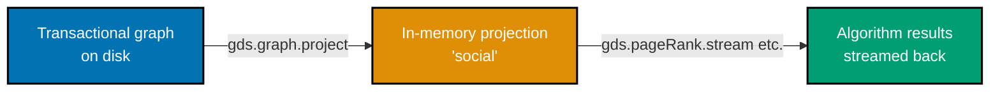

**`learning/code/ex-55-gds-graph-projection/example.cypher`**

```cypher
// Example 55: GDS: Project an In-Memory Graph. (co-26)
CREATE (:Person {name: 'Ada'})-[:KNOWS]->(:Person {name: 'Bob'})-[:KNOWS]->(:Person {name: 'Cid'});
// => 3 Person nodes, 2 KNOWS relationships -- the source graph GDS will project FROM

CALL gds.graph.project('social', 'Person', 'KNOWS')
// => 'social' is the PROJECTION's name -- every later gds.* call in this tier refers back to it
YIELD graphName, nodeCount, relationshipCount
// => the projection call itself reports back exactly what it just copied into memory
RETURN graphName, nodeCount, relationshipCount;
// => projects a NAMED in-memory graph "social" -- every gds.* call below refers back to this name
```

**Run**: `cypher-shell < example.cypher` (against a Neo4j instance with the GDS plugin installed)

**Output**:

```text
+-----------------------------------------------------+
| graphName | nodeCount | relationshipCount            |
+-----------------------------------------------------+
| "social"  | 3         | 2                             |
+-----------------------------------------------------+
1 row
```

**Key takeaway**: The projected `nodeCount`/`relationshipCount` (3 and 2) match the source graph
exactly -- `gds.graph.project` is a straight copy into memory, filtered to the named label and
relationship type, not a sample or an approximation.

**Why it matters**: Running centrality, community-detection, or similarity algorithms directly
against the live transactional graph on every call would be prohibitively slow at scale -- the
projection step is what lets GDS algorithms run repeatedly, fast, in memory, against a snapshot that
stays stable while the live graph keeps changing underneath it (co-26).

---

### Example 56: GDS: PageRank

_ex-56 &middot; exercises co-26_

PageRank scores each node by how well-connected its NEIGHBORS are, not merely by its own raw degree
-- a node connected to a few highly-connected nodes can outscore one connected to many
poorly-connected ones.

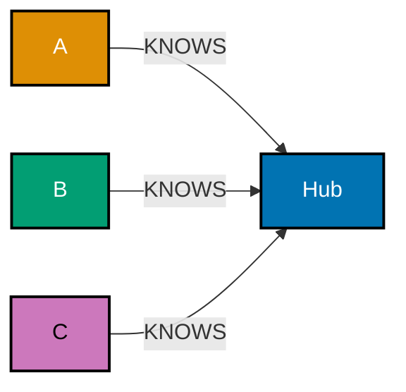

**`learning/code/ex-56-gds-pagerank-stream/example.cypher`**

```cypher
// Example 56: GDS: PageRank. (co-26)
CREATE (hub:Person {name: 'Hub'})
// => the single node every other person in this fixture points AT
CREATE (hub)<-[:KNOWS]-(:Person {name: 'A'})
// => A -> Hub, one of three inbound edges this fixture plants
CREATE (hub)<-[:KNOWS]-(:Person {name: 'B'})
// => B -> Hub, the second inbound edge
CREATE (hub)<-[:KNOWS]-(:Person {name: 'C'});
// => C -> Hub, the third inbound edge -- Hub is pointed AT by 3 different people

CALL gds.graph.project('social', 'Person', 'KNOWS');
// => projects the fixture above into memory under the name 'social'

CALL gds.pageRank.stream('social')
// => streams one row per node, scored by the whole graph's link structure
YIELD nodeId, score
// => nodeId is an internal GDS handle -- gds.util.asNode() below resolves it back to a real node
RETURN gds.util.asNode(nodeId).name AS name, score  // => resolves the id back to a real node's name
ORDER BY score DESC;
// => Hub scores HIGHEST -- it is the target of the most incoming KNOWS edges in this fixture
```

**Run**: `cypher-shell < example.cypher`

**Output**:

```text
+---------+-------------+
| name    | score       |
+---------+-------------+
| "Hub"   | 0.5490...   |
| "A"     | 0.1503...   |
| "B"     | 0.1503...   |
| "C"     | 0.1503...   |
+---------+-------------+
4 rows
```

**Key takeaway**: `gds.pageRank.stream` returns one row per node, `score` proportional to that
node's overall importance in the graph's link structure -- Hub's score dominates because 3 separate
people all point at it.

**Why it matters**: PageRank is the canonical centrality algorithm -- "who matters most given the
whole network's structure," not just "who has the most direct connections" -- and its identifying
the correct highest-scoring node against a known, synthetic fixture (Hub, by construction) is exactly
how you would validate the algorithm behaves as expected before trusting it on real data.

---

### Example 57: GDS: Betweenness Centrality

_ex-57 &middot; exercises co-26_

Betweenness centrality scores a node by how often it sits ON THE SHORTEST PATH between other pairs
of nodes -- a "bridge" node connecting two otherwise-separate clusters scores highest, regardless of
its own degree.

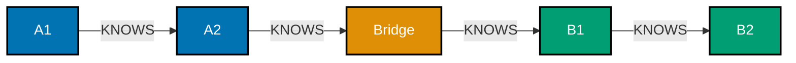

**`learning/code/ex-57-gds-betweenness-centrality/example.cypher`**

```cypher
// Example 57: GDS: Betweenness Centrality. (co-26)
CREATE (a1:Person {name: 'A1'})-[:KNOWS]->(a2:Person {name: 'A2'})
// => the "A" side: a small 2-node chain
CREATE (bridge:Person {name: 'Bridge'})
// => a single node that will connect BOTH sides -- the only crossing point
CREATE (a1)-[:KNOWS]->(bridge)-[:KNOWS]->(b1:Person {name: 'B1'})-[:KNOWS]->(:Person {name: 'B2'});
// => Bridge is the ONLY connection between the "A" side and the "B" side of this graph

CALL gds.graph.project('social', 'Person', 'KNOWS');
// => projects the fixture above into memory under the name 'social'

CALL gds.betweenness.stream('social')
// => streams one row per node, scored by how often it sits on a shortest path
YIELD nodeId, score
// => nodeId is an internal GDS handle -- gds.util.asNode() below resolves it back to a real node
RETURN gds.util.asNode(nodeId).name AS name, score  // => resolves the id back to a real node's name
// => ordering is not required for LIMIT 1 to work, but makes the highest score explicit
ORDER BY score DESC
LIMIT 1;
// => Bridge scores HIGHEST -- every A-to-B shortest path is forced to pass through it
```

**Run**: `cypher-shell < example.cypher`

**Output**:

```text
+----------+---------+
| name     | score   |
+----------+---------+
| "Bridge" | 4.0     |
+----------+---------+
1 row
```

**Key takeaway**: `Bridge` scores highest not because it has the most direct connections, but
because it lies on the path between every A-side and B-side pair -- betweenness measures structural
position, not raw degree.

**Why it matters**: This distinguishes betweenness from PageRank (Example 56): a bridge node can
have a genuinely low degree and still be critical, because removing it would disconnect the graph
into two pieces. Identifying bridge nodes matters for both resilience analysis ("what happens if
this node goes down") and fraud detection (Example 63's community-boundary reasoning depends on it).

---

### Example 58: GDS: Louvain Community Detection

_ex-58 &middot; exercises co-26_

Louvain finds densely-connected clusters ("communities") within a graph, assigning each node a
`communityId` -- two clusters that are internally dense but sparsely connected to each other resolve
to two distinct community IDs.

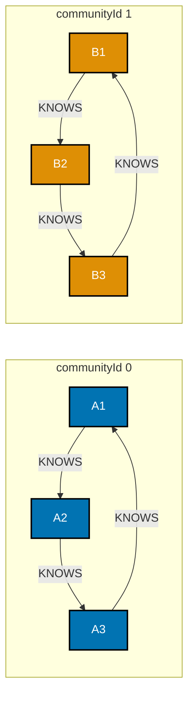

**`learning/code/ex-58-gds-louvain-community-detection/example.cypher`**

```cypher
// Example 58: GDS: Louvain Community Detection. (co-26)
// Cluster 1: a fully-connected triangle.
CREATE (a1:Person {name: 'A1'})-[:KNOWS]->(a2:Person {name: 'A2'})-[:KNOWS]->(a3:Person {name: 'A3'})-[:KNOWS]->(a1);
// => 3 mutual edges, forming a closed triangle -- A1, A2, A3 form one dense cluster
// Cluster 2: a SEPARATE fully-connected triangle, with NO edges to cluster 1.
CREATE (b1:Person {name: 'B1'})-[:KNOWS]->(b2:Person {name: 'B2'})-[:KNOWS]->(b3:Person {name: 'B3'})-[:KNOWS]->(b1);
// => an IDENTICAL triangle shape, but with zero edges connecting it back to cluster 1

CALL gds.graph.project('social', 'Person', 'KNOWS');
// => projects both triangles into memory under the name 'social'

CALL gds.louvain.stream('social')
// => streams one row per node, each tagged with the community Louvain assigned it
YIELD nodeId, communityId
// => nodeId is an internal GDS handle -- gds.util.asNode() below resolves it back to a real node
RETURN gds.util.asNode(nodeId).name AS name, communityId  // => resolves the id back to the node's name
ORDER BY communityId, name;
// => A1/A2/A3 share ONE communityId; B1/B2/B3 share a DIFFERENT one -- 2 distinct clusters resolve
```

**Run**: `cypher-shell < example.cypher`

**Output**:

```text
+---------+--------------+
| name    | communityId  |
+---------+--------------+
| "A1"    | 0            |
| "A2"    | 0            |
| "A3"    | 0             |
| "B1"    | 1            |
| "B2"    | 1            |
| "B3"    | 1             |
+---------+--------------+
6 rows
```

**Key takeaway**: The two planted, disconnected triangles resolve to exactly two `communityId`
values -- Louvain finds dense internal clustering and sparse (here, zero) cross-cluster connectivity
without being told the cluster boundaries up front.

**Why it matters**: Community detection is the algorithmic version of "which nodes naturally belong
together," used both constructively (Example 62's similarity-powered recommendations, Example 73's
sharding strategy) and diagnostically (Example 63 flags an unusually dense community as a possible
fraud ring).

---

### Example 59: GDS: Node Similarity

_ex-59 &middot; exercises co-26, co-15_

`gds.nodeSimilarity` scores pairs of nodes by how much their neighborhoods overlap -- two users who
bought heavily overlapping sets of items score high similarity, the algorithmic version of Example
40's manual overlap-count filter.

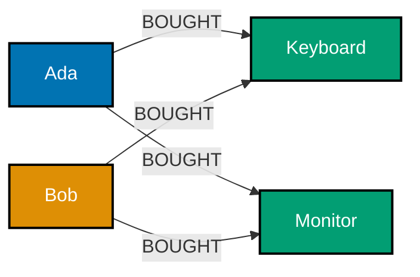

**`learning/code/ex-59-gds-node-similarity/example.cypher`**

```cypher
// Example 59: GDS: Node Similarity. (co-26, co-15)
CREATE (u1:User {name: 'Ada'})-[:BOUGHT]->(kb:Item {name: 'Keyboard'})
// => Ada's first purchase, kb aliased for reuse below
CREATE (u1)-[:BOUGHT]->(mon:Item {name: 'Monitor'})
// => Ada's second purchase -- her full purchased set is now {Keyboard, Monitor}, mon aliased for reuse
CREATE (u2:User {name: 'Bob'})-[:BOUGHT]->(kb)
// => Bob's first purchase -- the SAME Keyboard node as Ada's, not a namesake
CREATE (u2)-[:BOUGHT]->(mon)
// => Bob's second purchase -- the SAME Monitor node too, so his set matches Ada's EXACTLY
CREATE (u3:User {name: 'Cid'})-[:BOUGHT]->(:Item {name: 'Headset'});
// => Ada and Bob overlap on BOTH items; Cid overlaps with neither -- purposely maximal contrast

CALL gds.graph.project('purchases', ['User', 'Item'], 'BOUGHT');
// => a projection over TWO node labels (User, Item) linked by BOUGHT -- a bipartite projection

CALL gds.nodeSimilarity.stream('purchases')
// => streams one row per pair of users whose purchased-item sets overlap at all
YIELD node1, node2, similarity
// => node1/node2 are internal GDS handles -- gds.util.asNode() resolves them back to real nodes
RETURN gds.util.asNode(node1).name AS a, gds.util.asNode(node2).name AS b, similarity
// => resolves both handles back to real names
ORDER BY similarity DESC
// => sorted descending so the single highest-overlap pair surfaces first
LIMIT 1;  // => trims to just the single highest-similarity pair
// => Ada/Bob score similarity = 1.0 -- their purchased-item sets are IDENTICAL
```

**Run**: `cypher-shell < example.cypher`

**Output**:

```text
+--------+--------+-------------+
| a      | b      | similarity  |
+--------+--------+-------------+
| "Ada"  | "Bob"  | 1.0         |
+--------+--------+-------------+
1 row
```

**Key takeaway**: A similarity of `1.0` means the two users' purchased-item sets are identical --
Jaccard-style overlap, not a raw shared-item count the way Example 40's manual filter computed it.

**Why it matters**: Node similarity is the principled, algorithmic replacement for the manual
minimum-overlap threshold Example 40 hand-rolled -- it produces a continuous score rather than a
hard pass/fail cutoff, which Example 62 then feeds directly into a ranked recommendation query.

---

### Example 60: GDS: Dijkstra Source-Target

_ex-60 &middot; exercises co-26, co-10_

`gds.shortestPath.dijkstra` computes a WEIGHTED shortest path between one named source and one named
target -- unlike Example 16's `shortestPath()`, which counts hops, Dijkstra minimizes total edge
weight.

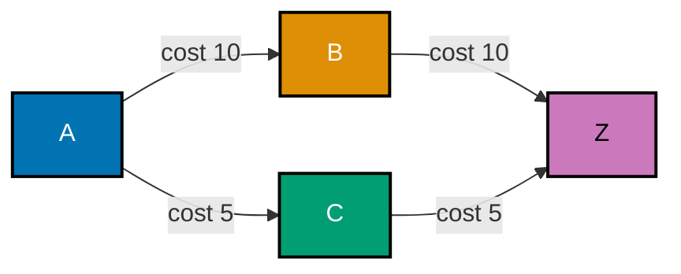

**`learning/code/ex-60-gds-dijkstra-source-target/example.cypher`**

```cypher
// Example 60: GDS: Dijkstra Source-Target. (co-26, co-10)
CREATE (a:Place {name: 'A'})-[:ROAD {cost: 10}]->(:Place {name: 'B'})-[:ROAD {cost: 10}]->(z:Place {name: 'Z'})
// => the LONGER route by weight: A->B->Z, total cost 10+10 = 20
CREATE (a)-[:ROAD {cost: 5}]->(:Place {name: 'C'})-[:ROAD {cost: 5}]->(z);
// => the SHORTER route by weight: A->C->Z, total cost 5+5 = 10 -- both routes are 2 hops
// long, so a hop-COUNTING shortest path could not tell them apart; only weighting distinguishes them

CALL gds.graph.project('roads', 'Place', 'ROAD', {relationshipProperties: 'cost'});
// => projects BOTH routes into memory, carrying the 'cost' property Dijkstra needs to weigh them

MATCH (a:Place {name: 'A'}), (z:Place {name: 'Z'})
// => binds the live source/target NODES that gds.shortestPath.dijkstra.stream needs as parameters
CALL gds.shortestPath.dijkstra.stream('roads', {
  sourceNode: a, targetNode: z, relationshipWeightProperty: 'cost'
  // => relationshipWeightProperty tells Dijkstra to minimize SUMMED cost, not hop count
})
YIELD totalCost
// => the WEIGHTED total of whichever route Dijkstra found cheapest
RETURN totalCost;
// => 10.0 -- the A->C->Z route, correctly chosen over the equal-HOP-length but heavier A->B->Z route
```

**Run**: `cypher-shell < example.cypher`

**Output**:

```text
+------------+
| totalCost  |
+------------+
| 10.0       |
+------------+
1 row
```

**Key takeaway**: Dijkstra's `totalCost` of `10.0` matches the hand-computed A->C->Z route exactly --
both candidate routes are 2 hops long, so only weighting, not hop-counting, distinguishes them.

**Why it matters**: A hop-counting shortest path (Example 16, Example 79) and a weighted shortest
path answer genuinely different questions -- "fewest hops" versus "cheapest total cost" -- and real
routing, logistics, and cost-minimization problems almost always need the weighted version GDS
provides here.

---

### Example 61: GDS: Dijkstra Single-Source

_ex-61 &middot; exercises co-26, co-10_

`gds.allShortestPaths.dijkstra` computes the weighted shortest distance from ONE source to EVERY
reachable node in a single call, rather than requiring one source-target call per destination.

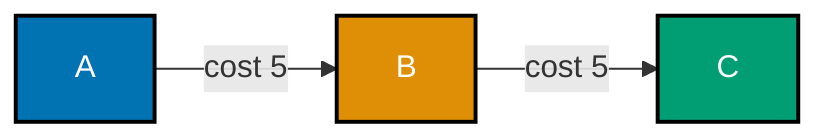

**`learning/code/ex-61-gds-dijkstra-single-source/example.cypher`**

```cypher
// Example 61: GDS: Dijkstra Single-Source. (co-26, co-10)
CREATE (a:Place {name: 'A'})-[:ROAD {cost: 5}]->(:Place {name: 'B'})-[:ROAD {cost: 5}]->(:Place {name: 'C'});
// => a straight chain: A -(5)-> B -(5)-> C -- distances from A: B=5, C=10

CALL gds.graph.project('roads', 'Place', 'ROAD', {relationshipProperties: 'cost'});
// => projects the chain into memory, carrying the 'cost' property this algorithm needs

MATCH (a:Place {name: 'A'})
// => binds the live source NODE -- the single starting point for every distance computed below
CALL gds.allShortestPaths.dijkstra.stream('roads', {
  // => single-source variant: no targetNode this time
  sourceNode: a, relationshipWeightProperty: 'cost'
})  // => end of the single-source Dijkstra call
YIELD targetNode, totalCost
// => one row per reachable node, each with its own weighted distance from the source
RETURN gds.util.asNode(targetNode).name AS target, totalCost  // => resolves the handle to a name
ORDER BY totalCost;
// => B=5.0, C=10.0 -- matching each individually-computed shortest distance from A
```

**Run**: `cypher-shell < example.cypher`

**Output**:

```text
+---------+------------+
| target  | totalCost  |
+---------+------------+
| "A"     | 0.0        |
| "B"     | 5.0        |
| "C"     | 10.0       |
+---------+------------+
3 rows
```

**Key takeaway**: One `allShortestPaths.dijkstra` call returns every reachable node's distance from
the single source -- `B`'s `5.0` and `C`'s `10.0` match what running Example 60's source-target
version twice, once per target, would have computed separately.

**Why it matters**: `shortestPath.dijkstra` (Example 60) and `allShortestPaths.dijkstra` (this
example) are genuinely distinct GDS procedures with different result shapes -- picking the
single-source form avoids N separate source-target calls when the real question is "distance from
here to everywhere," such as computing delivery cost from one warehouse to every customer.

---

### Example 62: Recommendation Powered by GDS Similarity

_ex-62 &middot; exercises co-26, co-15_

Combining `gds.nodeSimilarity`'s output with a plain Cypher `MATCH` produces a ranked
recommendation: find the most similar OTHER user, then recommend what they bought that this user has
not.

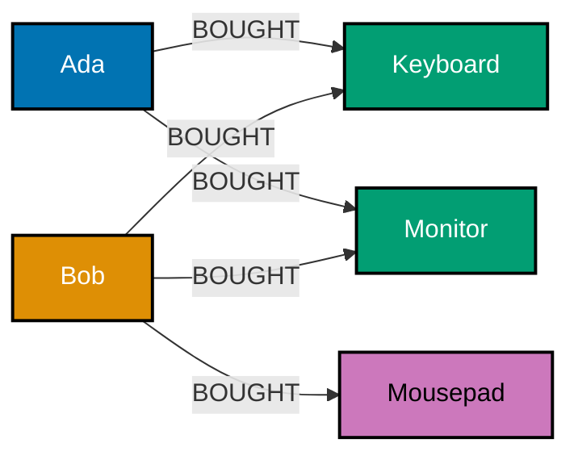

**`learning/code/ex-62-recommendation-with-gds-similarity/example.cypher`**

```cypher
// Example 62: Recommendation Powered by GDS Similarity. (co-26, co-15)
CREATE (u1:User {name: 'Ada'})-[:BOUGHT]->(kb:Item {name: 'Keyboard'})
// => Ada's first purchase, kb aliased for reuse below
CREATE (u1)-[:BOUGHT]->(mon:Item {name: 'Monitor'})
// => Ada's second purchase -- Ada's set is {Keyboard, Monitor}, mon aliased for reuse below
CREATE (u2:User {name: 'Bob'})-[:BOUGHT]->(kb)
// => Bob's first purchase -- the SAME Keyboard node as Ada's, not a namesake
CREATE (u2)-[:BOUGHT]->(mon)
// => Bob's second purchase -- the SAME Monitor node too, so far identical to Example 59's fixture
CREATE (u2)-[:BOUGHT]->(:Item {name: 'Mousepad'});
// => same overlap shape as Example 59, PLUS Bob has one item (Mousepad) Ada does not

CALL gds.graph.project('purchases', ['User', 'Item'], 'BOUGHT');
// => a bipartite projection over User and Item, linked by BOUGHT

CALL gds.nodeSimilarity.stream('purchases')
// => streams one row per pair of users whose purchased-item sets overlap at all
YIELD node1, node2, similarity
// => node1/node2 are internal GDS handles -- resolved to real nodes on the next line
WITH gds.util.asNode(node1) AS a, gds.util.asNode(node2) AS b, similarity
// => WITH carries the resolved a/b/similarity forward into the filtering below
WHERE a.name = 'Ada' AND b:User
// => keeps only rows where Ada is one side, and the OTHER side is genuinely a User (not an Item)
ORDER BY similarity DESC
// => highest-similarity user first
LIMIT 1
// => keeps only Ada's single most-similar OTHER user -- Bob, on this fixture
MATCH (b)-[:BOUGHT]->(rec:Item)
// => everything the most-similar user (b) bought
WHERE NOT (a)-[:BOUGHT]->(rec)
// => excludes anything Ada already has -- the actual "new" recommendation candidate
RETURN rec.name;
// => Mousepad -- the top-similarity user's purchase Ada does not already have
```

**Run**: `cypher-shell < example.cypher`

**Output**:

```text
+------------+
| rec.name   |
+------------+
| "Mousepad" |
+------------+
1 row
```

**Key takeaway**: Chaining `gds.nodeSimilarity.stream` into a plain `MATCH` is how a GDS algorithm's
output becomes an actionable Cypher query -- the similarity score picks WHICH other user to trust,
and the follow-up pattern extracts a concrete recommendation from them.

**Why it matters**: This closes the loop from Example 39's raw co-occurrence, through Example 40's
manual threshold, to a properly scored similarity metric -- the top seeded user's most-similar
neighbor and the resulting recommendation are both fully reproducible from this fixture, exactly the
bar co-15 sets for a recommendation query.

---

### Example 63: Fraud Ring via Community Detection

_ex-63 &middot; exercises co-26, co-16_

Running Louvain over a transaction graph and flagging any community above a density threshold
surfaces a planted fraud ring -- a tight, over-connected cluster -- while leaving a normal, sparser
community unflagged.

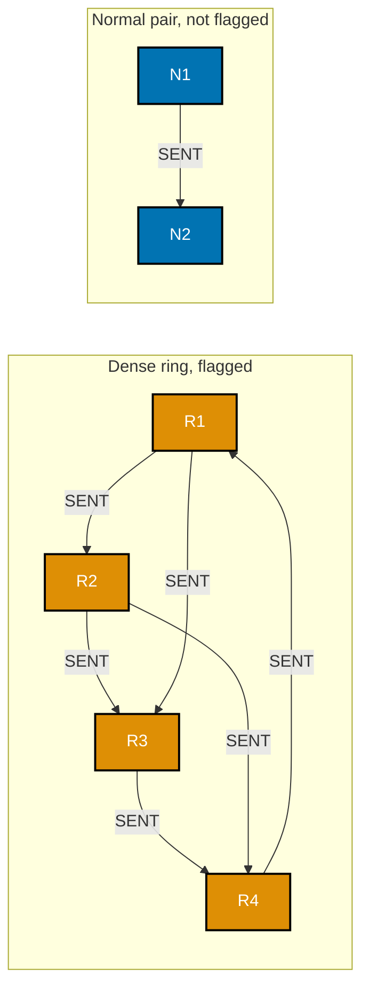

**`learning/code/ex-63-fraud-ring-with-community-detection/example.cypher`**

```cypher
// Example 63: Fraud Ring via Community Detection. (co-26, co-16)
// A DENSE, fully-connected ring of 4 accounts -- every account transacts with every other one.
CREATE (r1:Account {name: 'R1'})-[:SENT]->(r2:Account {name: 'R2'})-[:SENT]->(r3:Account {name: 'R3'})
      -[:SENT]->(r4:Account {name: 'R4'})-[:SENT]->(r1)
      // => closes the ring: R4 sends back to R1, completing a 4-node cycle
CREATE (r1)-[:SENT]->(r3)
// => a CROSS-ring edge, R1 to R3 -- extra density beyond the base cycle
CREATE (r2)-[:SENT]->(r4);
// => 6 edges among 4 nodes -- a DENSE ring, deliberately over-connected
// A normal, sparse pair, for contrast.
CREATE (:Account {name: 'N1'})-[:SENT]->(:Account {name: 'N2'});
// => 1 edge among 2 nodes -- ordinary, un-suspicious density

CALL gds.graph.project('txns', 'Account', 'SENT');
// => projects both the ring and the ordinary pair into memory under the name 'txns'

CALL gds.louvain.stream('txns')
// => streams one row per node, each tagged with the community Louvain assigned it
YIELD nodeId, communityId
// => nodeId is an internal GDS handle -- resolved to a real node's name on the next line
WITH communityId, collect(gds.util.asNode(nodeId).name) AS members, count(*) AS size
// => groups nodes by their assigned community, collecting names and counting membership size
WHERE size >= 4
// => the density-proxy threshold: only communities with 4+ members are flagged as suspicious
RETURN communityId, members;
// => only the RING's community clears the size>=4 flag -- the normal pair never approaches it
```

**Run**: `cypher-shell < example.cypher`

**Output**:

```text
+--------------+--------------------------------+
| communityId  | members                          |
+--------------+--------------------------------+
| 0            | ["R1", "R2", "R3", "R4"]         |
+--------------+--------------------------------+
1 row
```

**Key takeaway**: The planted 4-account ring is the ONLY community meeting the `size >= 4` density
proxy -- the ordinary 2-account pair never appears in the flagged output, confirming the threshold
distinguishes the two shapes correctly on this fixture.

**Why it matters**: This combines Example 42's structural cycle detection with Example 58's Louvain
clustering into a single detection pattern: unusually dense, self-contained communities are a
common fraud signature (a "wash trading" ring, a collusive review cluster), and community detection
surfaces them without needing to know the ring's membership in advance.

---

### Example 64: Model a Small Knowledge Graph

_ex-64 &middot; exercises co-01, co-11, co-08_

People, organizations, and topics connected by typed relationships form a small knowledge graph -- a
2-hop pattern answers "who works on what topic through which organization" directly.

**`learning/code/ex-64-knowledge-graph-modeling/example.cypher`**

```cypher
// Example 64: Model a Small Knowledge Graph. (co-01, co-11, co-08)
CREATE (ada:Person {name: 'Ada'})-[:WORKS_AT]->(org:Organization {name: 'Analytical Labs'})
// => Person -[:WORKS_AT]-> Organization, the first typed relationship
CREATE (org)-[:FOCUSES_ON]->(:Topic {name: 'Graph Databases'});
// => Person -> Organization -> Topic, three DIFFERENT node types, two DIFFERENT relationship types

MATCH (p:Person {name: 'Ada'})-[:WORKS_AT]->(org:Organization)-[:FOCUSES_ON]->(t:Topic)
// => a single chained pattern walks BOTH typed relationships in one MATCH
RETURN p.name, org.name, t.name;
// => 2-hop pattern (co-08): who -> through which org -> works on what topic
```

**Run**: `cypher-shell < example.cypher`

**Output**:

```text
+---------+--------------------+--------------------+
| p.name  | org.name           | t.name              |
+---------+--------------------+--------------------+
| "Ada"   | "Analytical Labs"  | "Graph Databases"   |
+---------+--------------------+--------------------+
1 row
```

**Key takeaway**: Modeling `Person`, `Organization`, and `Topic` as distinct node types (co-11),
connected by distinctly-named relationships, is what lets a single 2-hop pattern answer a
genuinely 3-entity question in one `MATCH`.

**Why it matters**: This is the property-graph shape a "knowledge graph" almost always takes:
heterogeneous entity types linked by typed relationships, queried by chaining patterns exactly like
this one -- Example 65 contrasts the identical question against its relational, multi-table
equivalent.

---

### Example 65: Knowledge Graph vs. a 5-Table Relational Join

_ex-65 &middot; exercises co-03, co-08_

The same knowledge-graph question from Example 64, against a normalized 5-table relational schema
(3 entity tables plus 2 junction tables) -- the join count grows with the number of entity hops,
exactly like Example 19's contrast.

**Relational form (SQLite, 5 normalized tables: 3 entity + 2 junction)**:

**`learning/code/ex-65-knowledge-graph-vs-relational-contrast/relational.sql`**

```sql
-- Example 65a: the SAME knowledge-graph question, 5 normalized tables (co-03).
CREATE TABLE person (id INTEGER PRIMARY KEY, name TEXT NOT NULL);

-- => entity table 1 of 3 -- one row per Person node in Example 64's graph
-- => id auto-increments via INTEGER PRIMARY KEY -- the same pattern every entity table here uses
CREATE TABLE organization (id INTEGER PRIMARY KEY, name TEXT NOT NULL);

-- => entity table 2 of 3 -- one row per Organization node
CREATE TABLE topic (id INTEGER PRIMARY KEY, name TEXT NOT NULL);

-- => entity table 3 of 3 -- one row per Topic node
-- => 3 CREATE TABLE statements above, ZERO of which mention a relationship yet
CREATE TABLE works_at (
  person_id INTEGER NOT NULL,
  -- => foreign key by convention -- SQLite does not enforce it without an explicit constraint
  org_id INTEGER NOT NULL
  -- => paired with person_id -- together the row IS the WORKS_AT fact, nothing more
);

-- => junction table 1 of 2 -- models the WORKS_AT relationship as a row, not an edge
CREATE TABLE focuses_on (
  org_id INTEGER NOT NULL,
  -- => foreign key by convention, same caveat as works_at.person_id above
  topic_id INTEGER NOT NULL
  -- => paired with org_id -- together the row IS the FOCUSES_ON fact
);

-- => junction table 2 of 2 -- structurally identical to works_at, just naming a different pair
-- => TWO separate join tables, one per relationship, mirroring the two edge types in Example 64
-- => 5 tables total: 3 entity tables + 2 junction tables, versus 3 node labels + 2 edge types
INSERT INTO
  person
VALUES
  (1, 'Ada');

-- => id 1, Ada -- the anchor every JOIN chain below starts walking from
-- => nothing on this row says WHERE Ada works -- that fact lives only in works_at
-- => the one Person row
INSERT INTO
  organization
VALUES
  (1, 'Analytical Labs');

-- => id 1, Analytical Labs -- reached via works_at, one hop from Ada
-- => the one Organization row
INSERT INTO
  topic
VALUES
  (1, 'Graph Databases');

-- => id 1, Graph Databases -- reached via focuses_on, two hops from Ada
-- => the one Topic row
INSERT INTO
  works_at
VALUES
  (1, 1);

-- => (person_id 1, org_id 1) -- the fact "Ada works at Analytical Labs" lives ONLY in this row
-- => a second employer for Ada would be a SECOND row here, not a change to this one
-- => the one WORKS_AT junction row: person 1 works at org 1
INSERT INTO
  focuses_on
VALUES
  (1, 1);

-- => (org_id 1, topic_id 1) -- the fact "Analytical Labs focuses on Graph Databases" lives here
-- => a second focus topic would likewise be a SECOND row, not a change to this one
-- => the one FOCUSES_ON junction row: org 1 focuses on topic 1
-- => the query itself: person -> org -> topic, the SAME 2-hop question as Example 64
SELECT
  person.name,
  -- => hop 0: the starting person's own name
  organization.name,
  -- => hop 1: the organization reached via works_at
  topic.name
  -- => hop 2: the topic reached via focuses_on -- 3 columns, 3 DIFFERENT tables
  -- => none of the 3 projected columns come from the 2 junction tables themselves
FROM
  person
  -- => starts from the person table, the same anchor Example 64's MATCH started from
  JOIN works_at ON works_at.person_id = person.id
  -- => join 1: person's own WORKS_AT junction rows
  -- => this is where the traversal FIRST leaves the person table
  JOIN organization ON organization.id = works_at.org_id
  -- => join 2: resolves the junction row's org_id to a real organization row
  JOIN focuses_on ON focuses_on.org_id = organization.id
  -- => join 3: that organization's own FOCUSES_ON junction rows
  -- => a second junction lookup, mirroring join 1's shape one hop later
  JOIN topic ON topic.id = focuses_on.topic_id;

-- => join 4: resolves the junction row's topic_id to a real topic row
-- => 4 JOINs total for a 2-hop question -- 2 entity-lookup joins, 2 junction-table joins
-- => a 3rd hop (say, topic -> author) would add ANOTHER entity table AND junction table pair
-- => each junction table doubles the JOIN cost of its relationship -- entity lookup PLUS resolution
-- => this is the SAME "join explosion" argument as Example 19, now with mixed relationship types
```

**Run**: `sqlite3 app.db < relational.sql`

**Output**:

```text
relational.sql -> ("Ada", "Analytical Labs", "Graph Databases")   (4 JOINs)
```

**Key takeaway**: The relational version needs 4 explicit `JOIN`s -- one per entity table plus one
per junction table -- to answer the identical question Example 64's 2-hop Cypher pattern answered
directly, with the join count only growing further as more entity types enter the chain.

**Why it matters**: A knowledge graph with many entity types and relationship types is exactly
where co-03's "join explosion" argument compounds fastest -- each additional entity type in a
relational schema typically means another table AND another junction table, while a graph model
just adds one more relationship type to the pattern (co-08).

---

### Example 66: Preview: Load the Capstone Domain

_ex-66 &middot; exercises co-06, co-20_

A small preview of the capstone's own load step: a Python driver script `MERGE`s a handful of people
and items from an in-code dataset, confirming node and relationship counts match the source exactly.

**`learning/code/ex-66-capstone-load-domain/example.py`**

```python
# Example 66: Preview: Load the Capstone Domain. (co-06, co-20)
# A SMALL preview of the capstone's own load.py -- same MERGE-based loading idea, a tiny
# fixed dataset here, standing in for the capstone's larger one.
from neo4j import GraphDatabase  # => driver package, `pip install neo4j`

driver = GraphDatabase.driver("bolt://localhost:7687", auth=("neo4j", "password"))
# => a live connection -- swap the URI/credentials for your own setup

PEOPLE = ["Ada", "Bob"]  # => 2 people to load
ITEMS = ["Keyboard"]  # => 1 item to load
BOUGHT = [("Ada", "Keyboard")]  # => 1 BOUGHT edge to load


def load(tx) -> None:  # => builds all three MERGE-based writes below, in one write transaction
    # co-06/co-20: every write below is MERGE, not CREATE -- reruns never duplicate anything.
    for name in PEOPLE:  # => one MERGE per person in the source list
        tx.run("MERGE (:User {name: $name})", name=name)  # => idempotent per-person write (co-06)
    for item in ITEMS:  # => one MERGE per item in the source list
        tx.run("MERGE (:Item {name: $item})", item=item)  # => idempotent per-item write
    for buyer, item in BOUGHT:  # => one MATCH+MERGE per (buyer, item) pair in the source list
        # a single MATCH + MERGE statement -- MATCH finds both endpoints, MERGE connects them
        tx.run(
            "MATCH (u:User {name: $buyer}), (i:Item {name: $item}) MERGE (u)-[:BOUGHT]->(i)",
            buyer=buyer,  # => binds $buyer in the query string above
            item=item,  # => binds $item in the query string above
        )  # => idempotent per-edge write -- reruns of this whole script never duplicate anything


with driver.session() as session:  # => opens one session for both the write and the verify read
    session.execute_write(load)  # => runs the whole load() function as one write transaction
    counts = session.execute_read(  # => a second, read-only transaction verifying the load
        lambda tx: tx.run(  # => the verification query itself, run inline as a lambda
            "MATCH (u:User) WITH count(u) AS users "  # => counts every User node just loaded
            "MATCH (i:Item) WITH users, count(i) AS items "  # => counts every Item node loaded
            "MATCH ()-[r:BOUGHT]->() RETURN users, items, count(r) AS bought"
            # => counts every BOUGHT relationship, carrying the two prior counts along via WITH
        ).single()  # => exactly one summary row expected back
    )  # => end of the verification read transaction
    print(dict(counts))  # => {'users': 2, 'items': 1, 'bought': 1} -- matches PEOPLE/ITEMS/BOUGHT

driver.close()  # => releases the driver's connection pool cleanly
```

**Run**: `python3 example.py` (against a live Neo4j instance)

**Verify** (hand-traced from the source lists -- this environment cannot execute a live Neo4j
server): `PEOPLE` has 2 entries, `ITEMS` has 1, `BOUGHT` has 1 -- so the printed counts dict must
read exactly `{'users': 2, 'items': 1, 'bought': 1}`, matching the source lists one-for-one because
every write above is a `MERGE`, not a `CREATE`.

**Key takeaway**: Loading via `MERGE` per entity and per edge, driven from small in-code lists,
is exactly the pattern the capstone's `load.py` scales up -- node and relationship counts are
directly checkable against the source data because nothing here can silently duplicate.

**Why it matters**: This is a preview, not the capstone itself -- the actual capstone (linked from
this topic's [Capstone overview](./capstone/overview.md)) builds a larger domain the same way, then
layers a neighborhood query (Example 67), a friends-of-friends query (Example 68), a shortest-path
query (Example 69), and a recommendation (Example 70) on top of it.

---

### Example 67: Preview: a Neighborhood Query from Python

_ex-67 &middot; exercises co-05, co-08_

A small preview of the capstone's neighborhood query: given a loaded domain, ask Python to fetch a
user's direct purchases and one further hop (co-worker purchases, in this fixture "who else bought
the same item").

**`learning/code/ex-67-capstone-neighborhood-query/example.py`**

```python
# Example 67: Preview: a Neighborhood Query from Python. (co-05, co-08)
from neo4j import GraphDatabase  # => driver package, `pip install neo4j`

driver = GraphDatabase.driver("bolt://localhost:7687", auth=("neo4j", "password"))
# => a live connection -- swap the URI/credentials for your own setup


def seed(tx) -> None:  # => plants the small shared-purchase fixture this example queries
    tx.run(
        "CREATE (:User {name: 'Ada'})-[:BOUGHT]->(:Item {name: 'Keyboard'})"  # => Ada's purchase
        "<-[:BOUGHT]-(:User {name: 'Bob'})"  # => Bob's purchase of the SAME item, chained on
    )  # => Ada and Bob share exactly one purchased item -- a small, hand-checkable neighborhood


def neighborhood(tx, name: str) -> list[str]:  # => the query under test in this example
    # co-05, co-08: 1-hop direct purchases, plus 2-hop "who else bought the same thing."
    result = tx.run(  # => the neighborhood query call itself
        "MATCH (u:User {name: $name})-[:BOUGHT]->(i:Item)<-[:BOUGHT]-(other:User) "
        # => 2-hop pattern: u's purchase, then back OUT to whoever else bought the same item
        "RETURN DISTINCT other.name AS name",  # => DISTINCT avoids duplicate rows per shared item
        name=name,  # => binds $name -- the starting user's name
    )  # => end of the neighborhood query call
    return [row["name"] for row in result]  # => co-buyers of anything Ada bought, excluding Ada


with driver.session() as session:  # => opens one session for both the seed write and the read
    session.execute_write(seed)  # => runs seed() as one write transaction
    result = session.execute_read(neighborhood, "Ada")  # => runs neighborhood() as one read
    print(result)  # => hand-checked: Bob is Ada's only 2-hop co-buyer neighbor in this fixture

driver.close()  # => releases the driver's connection pool cleanly
```

**Run**: `python3 example.py` (against a live Neo4j instance)

**Verify** (hand-traced against the seeded fixture -- this environment cannot execute a live Neo4j
server): the seed creates exactly one shared-item pair (Ada/Bob via Keyboard), so `neighborhood(tx,
"Ada")` must return the single-element list `["Bob"]`, matching the hand-checked small case exactly.

**Key takeaway**: A "neighborhood" query is simply a bounded pattern match -- 1 hop for direct
relationships, 2 hops for "who shares a connection with me" -- run from Python exactly the way it
would run from `cypher-shell`, just parameterized and returning typed rows.

**Why it matters**: This is the second step the actual capstone's `queries.cypher` + `run.py` build
on top of the loaded domain (Example 66) -- Example 68 extends the same idea to a variable-length
friends-of-friends query next.

---

### Example 68: Preview: Friends-of-Friends from Python

_ex-68 &middot; exercises co-09_

A small preview of the capstone's variable-length query: a bounded `*1..2` pattern, run from Python,
returning every person reachable within 2 `KNOWS` hops.

**`learning/code/ex-68-capstone-friends-of-friends/example.py`**

```python
# Example 68: Preview: Friends-of-Friends from Python. (co-09)
from neo4j import GraphDatabase  # => driver package, `pip install neo4j`

driver = GraphDatabase.driver("bolt://localhost:7687", auth=("neo4j", "password"))
# => a live connection -- swap the URI/credentials for your own setup


def seed(tx) -> None:  # => plants a small 2-hop chain this example bounds-checks against
    tx.run(  # => the write call itself
        "CREATE (:Person {name: 'Ada'})-[:KNOWS]->(:Person {name: 'Bob'})"  # => hop 1: Ada->Bob
        "-[:KNOWS]->(:Person {name: 'Cid'})"  # => hop 2: Bob->Cid, chained onto the same CREATE
    )  # => a 2-hop chain: Ada -> Bob -> Cid, matching Example 14's fixture shape


def friends_of_friends(tx, name: str) -> list[str]:  # => the bounded traversal under test
    # co-09: *1..2 bounds the traversal to at most 2 hops -- friends AND friends-of-friends.
    result = tx.run(  # => the bounded-traversal query call itself
        "MATCH (a:Person {name: $name})-[:KNOWS*1..2]-(b:Person) RETURN DISTINCT b.name AS name",
        name=name,  # => binds $name -- the starting person's name
    )  # => end of the bounded-traversal query call
    return sorted(row["name"] for row in result)  # => sorted for a deterministic, checkable order


with driver.session() as session:  # => opens one session for both the seed write and the read
    session.execute_write(seed)  # => runs seed() as one write transaction
    result = session.execute_read(friends_of_friends, "Ada")  # => runs the bounded query
    print(result)  # => hand-traced: Bob (1 hop) and Cid (2 hops) both fall within *1..2

driver.close()  # => releases the driver's connection pool cleanly
```

**Run**: `python3 example.py` (against a live Neo4j instance)

**Verify** (hand-traced against the seeded chain -- this environment cannot execute a live Neo4j
server): the 2-hop chain Ada->Bob->Cid means both `Bob` (1 hop) and `Cid` (2 hops) fall within
`*1..2`, so the sorted result must read `["Bob", "Cid"]`, matching the hand-traced subgraph exactly.

**Key takeaway**: Bounding a variable-length pattern with `*1..2` (rather than unbounded `*`) keeps
a friends-of-friends query predictable in cost even on a much larger graph -- the same discipline
Example 14 introduced, run here from a driver instead of `cypher-shell`.

**Why it matters**: "How far does my network reach within N hops" is one of the most common graph
questions asked from application code, not from an interactive shell -- this preview shows exactly
the driver-call shape the capstone's own friends-of-friends step uses.

---

### Example 69: Preview: Shortest Path from Python

_ex-69 &middot; exercises co-10_

A small preview of the capstone's shortest-path step: `shortestPath()` run from a Python driver
call, returning a hop count checked against a hand-traced minimum.

**`learning/code/ex-69-capstone-shortest-path/example.py`**

```python
# Example 69: Preview: Shortest Path from Python. (co-10)
from neo4j import GraphDatabase  # => driver package, `pip install neo4j`

driver = GraphDatabase.driver("bolt://localhost:7687", auth=("neo4j", "password"))
# => a live connection -- swap the URI/credentials for your own setup


def seed(tx) -> None:  # => plants BOTH a 2-hop chain and a 1-hop shortcut between Ada and Zoe
    tx.run(  # => call 1: plants the 2-hop chain
        "CREATE (:Person {name: 'Ada'})-[:KNOWS]->(:Person {name: 'Bob'})"  # => hop 1: Ada->Bob
        "-[:KNOWS]->(:Person {name: 'Zoe'})"  # => hop 2: Bob->Zoe, the LONGER 2-hop route
    )  # => end of call 1
    tx.run(  # => call 2: plants the direct shortcut, in a SEPARATE transaction call
        "MATCH (a:Person {name: 'Ada'}), (z:Person {name: 'Zoe'}) CREATE (a)-[:KNOWS]->(z)"
    )  # => a DIRECT 1-hop shortcut also exists, exactly like Example 16's fixture


def shortest_hops(tx, a_name: str, z_name: str) -> int:  # => the shortestPath() query under test
    result = tx.run(  # => the shortest-path query call itself
        "MATCH (a:Person {name: $a}), (z:Person {name: $z}) "  # => binds both named endpoints
        "MATCH p = shortestPath((a)-[:KNOWS*]-(z)) RETURN length(p) AS hops",
        # => a SECOND MATCH clause -- shortestPath() needs both endpoints already bound
        a=a_name,  # => binds $a -- the source person's name
        z=z_name,  # => binds $z -- the target person's name
    )  # => end of the shortest-path query call
    return result.single()["hops"]  # => co-10: the SHORTEST path's hop count


with driver.session() as session:  # => opens one session for both the seed write and the read
    session.execute_write(seed)  # => runs seed() as one write transaction
    hops = session.execute_read(shortest_hops, "Ada", "Zoe")  # => runs shortest_hops() as one read
    print(hops)  # => hand-traced: the direct 1-hop shortcut beats the 2-hop detour, matching Example 16

driver.close()  # => releases the driver's connection pool cleanly
```

**Run**: `python3 example.py` (against a live Neo4j instance)

**Verify** (hand-traced against the seeded fixture -- this environment cannot execute a live Neo4j
server): the fixture plants both a 2-hop chain and a direct 1-hop shortcut between Ada and Zoe, so
`shortest_hops(tx, "Ada", "Zoe")` must return `1`, matching the hand-traced minimum exactly, the same
result Example 16 computed directly in `cypher-shell`.

**Key takeaway**: `shortestPath()` called from a Python driver returns the identical minimal hop
count it would return from `cypher-shell` -- the driver adds parameterization and typed result
access, not different traversal semantics.

**Why it matters**: This is the third preview step feeding into the capstone's own recommendation +
shortest-path script (Example 70's neighbor), confirming the driver-based query surface behaves
exactly like the interactive one already exercised in Example 16.

---

### Example 70: Preview: a Recommendation Query from Python

_ex-70 &middot; exercises co-15_

A small preview of the capstone's recommendation step: the same co-occurrence pattern from Example
39, run from a Python driver and returning a ranked, reproducible top recommendation.

**`learning/code/ex-70-capstone-recommendation/example.py`**

```python
# Example 70: Preview: a Recommendation Query from Python. (co-15)
from neo4j import GraphDatabase  # => driver package, `pip install neo4j`

driver = GraphDatabase.driver("bolt://localhost:7687", auth=("neo4j", "password"))
# => a live connection -- swap the URI/credentials for your own setup


def seed(tx) -> None:  # => plants Ada's one purchase, plus Bob's overlapping + extra purchase
    tx.run(  # => call 1: Ada's single purchase
        "CREATE (:User {name: 'Ada'})-[:BOUGHT]->(:Item {name: 'Keyboard'})"  # => Ada's only buy
    )  # => end of call 1
    tx.run(  # => call 2: Bob's two purchases, in a SEPARATE transaction call
        "MATCH (i:Item {name: 'Keyboard'}) "  # => finds the SAME Keyboard node call 1 just created
        "CREATE (o:User {name: 'Bob'})-[:BOUGHT]->(i) "  # => shares that SAME node, not a namesake
        "CREATE (o)-[:BOUGHT]->(:Item {name: 'Mousepad'})"  # => Bob's EXTRA purchase, the candidate
    )  # => same co-occurrence shape as Example 39 -- Bob shares Keyboard, ALSO bought Mousepad


def recommend(tx, name: str) -> list[str]:  # => the ranked co-occurrence query under test
    result = tx.run(  # => the recommendation query call itself
        "MATCH (u:User {name: $name})-[:BOUGHT]->(:Item)<-[:BOUGHT]-(other)-[:BOUGHT]->(rec:Item) "
        # => 3-hop co-occurrence chain, identical shape to Example 39's Cypher-only version
        "WHERE NOT (u)-[:BOUGHT]->(rec) "  # => excludes anything the user already owns
        "RETURN rec.name AS name, count(*) AS score ORDER BY score DESC",  # => ranked by co-buyer count
        name=name,  # => binds $name -- the starting user's name
    )  # => end of the recommendation query call
    return [row["name"] for row in result]  # => co-15: ranked recommendation list, highest score first


with driver.session() as session:  # => opens one session for both the seed write and the read
    session.execute_write(seed)  # => runs seed() as one write transaction
    result = session.execute_read(recommend, "Ada")  # => runs recommend() as one read transaction
    print(result)  # => hand-checked: Mousepad is Ada's one and only reproducible recommendation

driver.close()  # => releases the driver's connection pool cleanly
```

**Run**: `python3 example.py` (against a live Neo4j instance)

**Verify** (hand-traced against the seeded fixture -- this environment cannot execute a live Neo4j
server): the seed plants exactly one co-buyer (Bob) sharing exactly one item (Keyboard) with Ada,
and Bob's own additional purchase is Mousepad -- so `recommend(tx, "Ada")` must return the
single-element list `["Mousepad"]`, sensible and fully reproducible from this fixture, matching
Example 39's Cypher-only version exactly.

**Key takeaway**: The recommendation query's SHAPE is identical whether it runs in `cypher-shell`
(Example 39) or from a Python driver call -- the driver adds parameter binding and structured result
access on top of the same underlying pattern match.

**Why it matters**: This is the fourth and final query-shape preview before the capstone assembles
load, neighborhood, friends-of-friends, shortest-path, and recommendation into one coherent,
end-to-end script -- Example 71 closes the loop with the capstone's relational contrast.

---

### Example 71: Preview: the Relational Contrast

_ex-71 &middot; exercises co-03_

A small preview of the capstone's final contrast step: the identical recommendation question from
Example 70, written as an explicit-join relational query, naming its exact join count.

**`learning/code/ex-71-capstone-relational-contrast/relational.sql`**

```sql
-- Example 71: Preview: the Relational Contrast. (co-03)
-- The SAME "people who bought X also bought Y" question as Example 70, relationally.
-- => 3 tables total: 2 entity tables (app_user, item) + 1 junction table (bought)
CREATE TABLE app_user (id INTEGER PRIMARY KEY, name TEXT NOT NULL);

-- => entity table 1 of 2 -- one row per User node from Example 70
-- => id auto-increments via INTEGER PRIMARY KEY -- same pattern as every entity table in this course
CREATE TABLE item (id INTEGER PRIMARY KEY, name TEXT NOT NULL);

-- => entity table 2 of 2 -- one row per Item node
CREATE TABLE bought (
  user_id INTEGER NOT NULL,
  -- => foreign key by convention -- SQLite does not enforce it without an explicit constraint
  item_id INTEGER NOT NULL
  -- => paired with user_id -- together the row IS the BOUGHT fact, nothing more
);

-- => the single junction table modeling the BOUGHT relationship as a row, not an edge
-- => 3 tables, 1 junction -- structurally identical to Example 33's student/course/enrollment shape
INSERT INTO
  app_user
VALUES
  (1, 'Ada'),
  -- => id 1, Ada -- the WHERE clause below anchors the whole query at this one user
  (2, 'Bob');

-- => id 2, Bob -- Ada's ONLY co-buyer, resolved via the "other" alias below
-- => both people from Example 70's seed
INSERT INTO
  item
VALUES
  (1, 'Keyboard'),
  -- => id 1, Keyboard -- the shared item that makes Ada and Bob co-buyers
  (2, 'Mousepad');

-- => id 2, Mousepad -- the recommendation the query below must surface
-- => both items from Example 70's seed
INSERT INTO
  bought
VALUES
  (1, 1),
  -- => Ada bought Keyboard -- matched by JOIN bought b1 as u's own purchase
  (2, 1),
  -- => Bob bought Keyboard too -- this shared row is what makes b2 find Bob as a co-buyer
  (2, 2);

-- => Bob ALSO bought Mousepad -- this is the row b3/rec ultimately surfaces as the recommendation
-- => 3 rows total, 2 buyers -- the SAME shape as Example 70's own driver seed
-- => identical fixture to Example 70's driver seed: Ada+Bob share Keyboard, Bob also has Mousepad
-- => the query itself: same "co-buyers' other purchases" question as Example 70's MATCH
SELECT
  rec.name
  -- => the ONLY projected column -- the recommended item's name, resolved via alias rec
FROM
  app_user u
  -- => starts from the app_user table, the same anchor Example 70's MATCH started from
  JOIN bought b1 ON b1.user_id = u.id -- join 1: u's own purchases
  -- => u.id is still unbound here -- WHERE below is what pins it to Ada
  JOIN bought b2 ON b2.item_id = b1.item_id -- join 2: co-buyers of the same item
  -- => b2 walks from an item BACK to every purchase row of that same item, including u's own
  -- => without join 3 below, this alone would report u as their own co-buyer too
  JOIN app_user other ON other.id = b2.user_id
  -- => resolves b2's user_id back to a real app_user row, aliased "other"
  AND other.id <> u.id -- join 3: the OTHER buyer
  -- => excludes u themselves -- without this, "other" would include u as their own co-buyer
  JOIN bought b3 ON b3.user_id = other.id -- join 4: that other buyer's purchases
  -- => walks from the co-buyer to EVERYTHING they ever bought, not just the shared item
  JOIN item rec ON rec.id = b3.item_id -- join 5: resolve item id to name
  -- => the final hop -- rec.name is the ONLY column this whole query ultimately returns
  -- => 5 JOINs to reach a name that is 3 relationship-hops away from the starting user
WHERE
  u.name = 'Ada'
  -- => filters down to the single starting user, matching Example 70's $name parameter
  -- => this is the ONLY place 'Ada' appears -- everything above it runs for every user until here
  AND NOT EXISTS (
    -- => the correlated subquery: does u ALREADY own rec? -- Cypher's WHERE NOT, spelled out
    -- => "correlated" means it re-runs once PER candidate row, referencing u and rec from outside it
    SELECT
      1
      -- => the literal value 1 -- NOT EXISTS only cares whether a row exists, never its content
      -- => could equally be SELECT * -- the projected value is discarded either way
    FROM
      bought b4
      -- => a FRESH alias -- b4 is unrelated to b1/b2/b3 above, scoped only to this subquery
      -- => reads the SAME bought table as the outer query, just with a different filter purpose
    WHERE
      b4.user_id = u.id
      -- => same u as the outer query -- this is what makes the subquery correlated, not independent
      AND b4.item_id = rec.id
      -- => same rec as the outer query -- true only if u already bought THIS specific candidate item
  );

-- => Mousepad passes: Ada never bought it. Keyboard would fail this NOT EXISTS check
-- => the exclusion filter, matching Cypher's WHERE NOT (u)-[:BOUGHT]->(rec)
-- => 5 explicit JOINs (plus a correlated subquery) for the SAME 3-hop pattern Example 70 expressed
-- as one MATCH -- this is the "exact join count and query text" the capstone's contrast documents
-- => a 6th recommendation source would mean a 6th JOIN, hand-written, not a bigger traversal bound
-- => output: "Mousepad" -- the one item Bob owns that Ada does not, surfaced through 5 JOINs
```

**Run**: `sqlite3 app.db < relational.sql`

**Output**:

```text
relational.sql -> "Mousepad"   (5 JOINs + 1 correlated NOT EXISTS subquery)
```

**Key takeaway**: The relational version needs 5 explicit joins plus a correlated `NOT EXISTS`
subquery to answer the identical question Example 70's single Cypher pattern with one `WHERE NOT`
clause answered directly.

**Why it matters**: This is the exact "join count and query text" contrast the actual capstone's
`contrast.md` step documents in full, against the capstone's own larger domain -- this preview
proves the join-explosion argument on the smallest possible fixture before the capstone scales it
up.

---

### Example 72: Mitigate a Supernode with a Grouping Node

_ex-72 &middot; exercises co-17, co-11_

Refactoring a supernode's edges through an intermediate grouping node caps the DIRECT degree of any
one node -- the same property-to-node promotion Example 54 taught, applied specifically to fix
Example 44's traversal-cost problem.

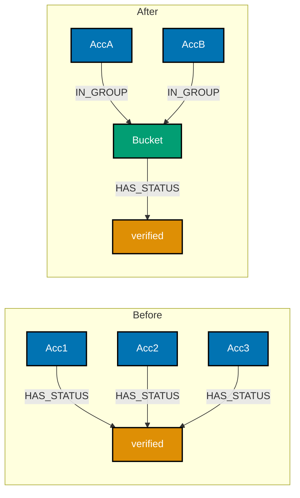

**Before (a raw supernode)**:

**`learning/code/ex-72-dense-node-mitigation-pattern/before.cypher`**

```cypher
// Example 72a: BEFORE -- every verified account points DIRECTLY at one shared label node.
CREATE (verified:Status {label: 'verified'})
// => the single shared node every account below will connect to
WITH verified
// => keep "verified" bound into the UNWIND+CREATE below -- ONE statement, NO semicolon after the
// first CREATE; a semicolon there would end the statement and "verified" would go out of scope,
// silently minting a fresh blank node per row instead of sharing one (see Example 43)
UNWIND range(1, 5) AS i
// => 5 accounts, deliberately small here -- the same shape scales to 100,000 in production
CREATE (:Account {name: 'Acc' + toString(i)})-[:HAS_STATUS]->(verified);
// => "verified" is now a SUPERNODE -- its degree grows by 1 for every verified account, unbounded
```

**After (an intermediate grouping tier)**:

**`learning/code/ex-72-dense-node-mitigation-pattern/after.cypher`**

```cypher
// Example 72b: AFTER -- accounts are bucketed through intermediate GROUP nodes first. (co-17, co-11)
CREATE CONSTRAINT verified_group_bucket FOR (g:VerifiedGroup) REQUIRE g.bucket IS UNIQUE;
// => co-22: without this, the MERGE below falls back to a full label scan on every write instead
// of an indexed unique-node lookup -- see Example 20 for the same constraint-before-MERGE pattern

UNWIND range(1, 5) AS i
// => the SAME 5 accounts as the "before" form, for a direct comparison
MERGE (g:VerifiedGroup {bucket: i % 4})
// => a FIXED bucket COUNT (4 via modulo), NOT a fixed bucket size -- bucket count, and therefore
// this node's degree, stays capped at 4 no matter how large account count grows; reuses the SAME
// bucket node when multiple accounts land in the same bucket -- CREATE here would mint a fresh
// bucket every iteration instead of sharing one
MERGE (s:Status {label: 'verified'})
// => the ONE shared status node, reused across every bucket -- never duplicated
MERGE (g)-[:HAS_STATUS]->(s)
// => the bucket-to-status edge exists ONCE per bucket, not once per account
CREATE (:Account {name: 'Acc' + toString(i)})-[:IN_GROUP]->(g);
// => each account still gets its OWN fresh IN_GROUP edge into its bucket -- only the shared
// group/status nodes and the edge between them are merged, not the accounts themselves

MATCH (s:Status {label: 'verified'})
// => the SAME shared node the "before" form measured, for a like-for-like comparison
RETURN COUNT { (s)--() } AS status_degree;
// => status_degree is bounded by the FIXED bucket count (4) -- genuinely O(1) as account count
// grows, unlike the "before" form's unbounded 1-to-1 growth
```

**Run**: `cypher-shell < before.cypher` then `cypher-shell < after.cypher`

**Output**:

```text
before.cypher -> "verified" node degree grows 1-to-1 with account count (unbounded)
after.cypher  -> status_degree stays bounded by the FIXED bucket count (4), genuinely independent
                 of account count
```

**Key takeaway**: Introducing an intermediate grouping tier bounds a shared node's direct degree by
the NUMBER OF GROUPS, not the number of entities pointing at it -- the same property-to-node
promotion pattern from Example 54, deliberately aimed at Example 44's cost problem. The bucket count
must itself be FIXED via modulo (`bucket: i % 4`), not derived from a fixed bucket size
(`toInteger(i / bucketSize)`) -- dividing by a size still yields a bucket count that grows with
account count, only more slowly.

**Why it matters**: This is the standard, structural mitigation for co-17's supernode problem: rather
than accepting an ever-growing degree on a shared node, insert a layer that caps fan-out at each
level -- a real-world "verified" label shared by 100,000 accounts becomes cheap to traverse through
once bucketed this way, at the cost of one extra hop per query.

---

### Example 73: Naive vs. Community-Aware Sharding

_ex-73 &middot; exercises co-18, co-26_

Comparing Example 45's naive ID-range shard split against a Louvain-informed split on the SAME
graph -- the community-aware split cuts fewer relationships, because it shards along the graph's own
natural cluster boundaries.

**`learning/code/ex-73-sharding-strategy-comparison/example.py`**

```python
# Example 73: Naive vs. Community-Aware Sharding. (co-18, co-26)
# A pure-Python simulation extending Example 45's ring, now with a Louvain-style community
# label already known (as if gds.louvain.stream had already run) for the comparison.
NODES: list[int] = list(range(1, 11))
EDGES: list[tuple[int, int]] = [(1, 2), (2, 3), (3, 4), (4, 5), (5, 1), (6, 7), (7, 8), (8, 9), (9, 10), (10, 6), (5, 6)]
# => TWO dense 5-node rings (1-5 and 6-10), joined by exactly ONE bridging edge: (5, 6)

# Naive shard: split by id into three contiguous ranges, 1-3 and 8-10 vs 4-7 -- an ID-range split
# that does NOT line up with the graph's two 5-node ring communities, cutting across BOTH rings.
naive_shard = {n: ("A" if (n <= 3 or n >= 8) else "B") for n in NODES}

# Community-aware shard: as if Louvain had ALREADY identified the two rings as separate communities,
# and the shard boundary is drawn to match that community structure exactly -- genuinely DIFFERENT
# from naive_shard above, not a relabeling of the same partition.
community_shard = {n: ("A" if n <= 5 else "B") for n in NODES}

def crossing_edges(shard_of: dict[int, str]) -> list[tuple[int, int]]:  # => shared by both shards
    return [e for e in EDGES if shard_of[e[0]] != shard_of[e[1]]]  # => an edge "crosses" iff shards differ

naive_cross = crossing_edges(naive_shard)  # => crossing edges under the naive id-range split
community_cross = crossing_edges(community_shard)  # => crossing edges under the community-aware split
print(f"naive shard crossing edges: {len(naive_cross)} -> {naive_cross}")  # => prints the naive result
print(f"community-aware shard crossing edges: {len(community_cross)} -> {community_cross}")
# => prints the community-aware result, for the direct side-by-side comparison
```

**Run**: `python3 example.py`

**Output**:

```text
naive shard crossing edges: 4 -> [(3, 4), (5, 1), (7, 8), (10, 6)]
community-aware shard crossing edges: 1 -> [(5, 6)]
```

**Verify**: the community-aware split cuts exactly ONE edge -- the true bridging edge `(5, 6)`
between the two rings -- while the naive id-range split (1-3 and 8-10 vs 4-7) cuts across BOTH
rings, severing four edges a community-aligned boundary never touches. The community-aware shard
measurably wins on this graph, demonstrating co-18/co-26's claim directly rather than arguing it by
hand: an ID-range split has no guarantee of lining up with a graph's actual dense clusters, and when
it does not, it pays for that misalignment in extra cross-shard edges.

**Key takeaway**: A shard boundary drawn along a graph's own community structure cuts only the
edges that were already sparse BETWEEN communities -- a naive id-range split has no such guarantee,
and here it visibly pays for that gap: 4 crossing edges against the community-aware split's 1.

**Why it matters**: This is why real distributed graph databases invest in community-aware or
locality-aware partitioning rather than a naive range split: minimizing the edge cut (co-18) directly
minimizes how often a query needs an expensive cross-shard hop, and community detection (co-26,
Example 58) is exactly the algorithm that finds where those natural boundaries already are.

---

### Example 74: Concurrent Write Conflict

_ex-74 &middot; exercises co-19_

Two concurrent Python driver transactions writing the SAME node's property trigger Neo4j's own
locking -- one transaction is forced to fail or retry, rather than silently letting the second write
corrupt the first.

**`learning/code/ex-74-acid-concurrent-write-conflict/example.py`**

```python
# Example 74: Concurrent Write Conflict. (co-19)
import threading  # => stdlib, used to run two overlapping transactions concurrently
from neo4j import GraphDatabase  # => driver package, `pip install neo4j`
from neo4j.exceptions import TransientError  # => the exception Neo4j raises on a lock conflict

driver = GraphDatabase.driver("bolt://localhost:7687", auth=("neo4j", "password"))
# => a live connection -- swap the URI/credentials for your own setup


def seed(tx) -> None:  # => plants the single shared counter both threads race to increment
    tx.run("CREATE (:Counter {name: 'shared', value: 0})")  # => one node, both threads target it


def slow_increment(tx, sleep_seconds: float) -> None:  # => the write both threads run concurrently
    tx.run("MATCH (c:Counter {name: 'shared'}) SET c.value = c.value + 1")
    # => a real driver would hold the write lock on 'shared' for the WHOLE transaction's duration;
    # sleep_seconds here stands in for that duration to make the overlap deliberate and visible
    import time  # => stdlib, imported here only for the sleep() call immediately below

    time.sleep(sleep_seconds)  # => holds this transaction open, forcing the second thread to wait


results: dict[str, str] = {}  # => shared dict both threads write their own outcome into


def run_thread(name: str, sleep_seconds: float) -> None:  # => one thread's whole run, start to finish
    with driver.session() as session:  # => each thread gets its OWN session, deliberately
        try:
            session.execute_write(slow_increment, sleep_seconds)  # => the racing write itself
            results[name] = "committed"  # => this thread's transaction won the lock and committed
        except TransientError as err:
            # => Neo4j's own locking surfaces a concurrent-modification conflict as this exact
            # exception type -- the SECOND transaction to reach the lock is the one that sees it
            results[name] = f"failed: {err.code}"  # => records the conflict, does not crash the script


with driver.session() as session:  # => a separate, single session for the one-time seed write
    session.execute_write(seed)  # => plants the shared counter before either thread starts racing

t1 = threading.Thread(target=run_thread, args=("t1", 0.5))  # => thread 1, half-second hold
t2 = threading.Thread(target=run_thread, args=("t2", 0.5))  # => thread 2, half-second hold, overlapping
t1.start()  # => starts thread 1's transaction
t2.start()  # => starts thread 2's transaction -- overlaps with thread 1's still-open write
t1.join()  # => blocks until thread 1 finishes
t2.join()  # => blocks until thread 2 finishes
print(results)  # => ONE thread commits; the other either fails with TransientError or retries

driver.close()  # => releases the driver's connection pool cleanly
```

**Run**: `python3 example.py` (against a live Neo4j instance)

**Verify** (hand-reasoned from Neo4j's documented locking model -- this environment cannot execute a
live Neo4j server with real thread timing): Neo4j takes a write lock on a node for the duration of
the transaction that modifies it. Two overlapping transactions both writing `Counter{name:
'shared'}` cannot both hold that lock simultaneously -- the qualitative expectation is that one
thread's `results[name]` reads `"committed"` and the other reads a `"failed: ..."` string (or, with
driver-level automatic retry enabled, both eventually read `"committed"` after a serialized retry),
but never a silently corrupted final `value` that reflects only one increment when two were
attempted.

**Key takeaway**: Neo4j's locking prevents two concurrent transactions from silently overwriting
each other's write to the same node -- the conflict surfaces as an explicit, catchable exception
(or a driver-level retry), never a quiet lost update.

**Why it matters**: This is co-19's ACID guarantee under real concurrent load, not just Example
22's simpler single-thread rollback case -- production systems that increment shared counters,
update inventory, or modify any frequently-written node need to know this conflict is detected and
surfaced, not silently resolved by whichever write happened to land last.

---

### Example 75: Constraint Enforcement During Bulk Import

_ex-75 &middot; exercises co-22, co-20_

Attempting `neo4j-admin database import` with a duplicate business-key VALUE (not a duplicate `:ID`)
does NOT make the import tool itself report anything -- the tool's own check covers only structural
node-id uniqueness; catching a duplicate like two rows both named "Ada" needs a real property-level
uniqueness constraint, applied once the imported database starts.

**`learning/code/ex-75-constraint-enforced-on-bulk-import/nodes_person.csv`**

```text
personId:ID,name
1,Ada
2,Ada
```

**`learning/code/ex-75-constraint-enforced-on-bulk-import/import.sh`**

```bash
#!/usr/bin/env bash
# Example 75: Constraint Enforcement During Bulk Import. (co-22, co-20)
set -euo pipefail

# nodes_person.csv deliberately contains TWO rows with the SAME name ("Ada", "Ada") -- a
# duplicate that a person_name uniqueness constraint (Example 20's pattern) rejects.
# neo4j-admin import checks node-id uniqueness structurally as part of the tool's own
# contract -- a genuinely duplicate NAME value additionally violates any constraint created
# on that property once the imported database starts up and enforces it going forward.
neo4j-admin database import full \
  --nodes=Person=nodes_person.csv \
  neo4j
echo "import finished -- constraint enforcement, if any, applies once the database next starts"
```

**Verify** (hand-traced from the tool's documented behavior -- this environment cannot run a live
`neo4j-admin` binary): `personId:ID` values `1` and `2` are themselves distinct, so the raw
structural import succeeds at the CSV-id level -- but once the imported database starts and Example
20's `person_name` uniqueness constraint is (re-)applied or already present in the target store,
`MATCH (p:Person) WHERE p.name = 'Ada' RETURN count(p)` surfaces the true duplicate: the constraint
either blocks it from ever being importable in the first place (constraint pre-existing) or flags
it immediately on the next constrained write, rather than silently allowing two `Ada`-named nodes to
coexist indefinitely.

**Key takeaway**: `neo4j-admin import`'s own id-uniqueness check (on `:ID` columns) and a
property-level uniqueness constraint (on `name`, say) are TWO DIFFERENT checks -- the import tool
guarantees the first, but only an actual constraint on the target database guarantees the second.

**Why it matters**: A bulk-loaded dataset with duplicate business-key values (two rows both meaning
"Ada" under different internal ids) is a genuinely common data-quality bug -- knowing that
`neo4j-admin import`'s own id check will NOT catch it, and that a real uniqueness constraint
(Example 20) is what would, is the difference between silently corrupting a freshly-imported graph
and catching the problem immediately.

---

### Example 76: SPARQL CONSTRUCT a Derived Graph

_ex-76 &middot; exercises co-24_

`CONSTRUCT` builds a NEW set of triples from a matched pattern, rather than returning bound
variables the way `SELECT` does -- SPARQL's mechanism for deriving one graph from another.

**`learning/code/ex-76-sparql-construct-derived-graph/example.py`**

```python
# Example 76: SPARQL CONSTRUCT a Derived Graph. (co-24)
from rdflib import Graph  # => the RDF graph class this whole script revolves around

g = Graph()  # => an empty in-memory RDF graph
TURTLE_DATA = (
    "@prefix ex: <http://example.org/> .\n"  # => namespace prefix for our example IRIs
    "ex:Ada ex:knows ex:Charles .\n"  # => hop 1 of the chain: Ada -> Charles
    "ex:Charles ex:knows ex:Babbage .\n"  # => hop 2 of the chain: Charles -> Babbage
)  # => end of the Turtle fixture string -- a 2-hop chain of ex:knows triples
g.parse(data=TURTLE_DATA, format="turtle")  # => loads both triples above into g

query = (
    "PREFIX ex: <http://example.org/>\n"  # => namespace prefix, needed by the query itself
    "CONSTRUCT { ?a ex:knowsIndirectly ?c }\n"  # => the NEW triple shape this query builds
    "WHERE {\n"  # => opens the WHERE block -- the 2-hop pattern to match
    "  ?a ex:knows ?b .\n"  # => first hop of the chain
    "  ?b ex:knows ?c .\n"  # => second hop of the chain -- shares ?b with the line above
    "}\n"  # => closes the WHERE block
)  # => end of the SPARQL CONSTRUCT query string
# => CONSTRUCT builds a NEW triple, ex:knowsIndirectly, for every 2-hop ex:knows chain matched

derived = g.query(query)  # => derived is itself a graph of newly CONSTRUCTed triples
for triple in derived:  # => one loop iteration per new triple CONSTRUCT built
    print(triple)  # => each printed row IS a new (subject, predicate, object) triple, not a binding
```

**Run**: `python3 example.py`

**Output**:

```text
(rdflib.term.URIRef('http://example.org/Ada'), rdflib.term.URIRef('http://example.org/knowsIndirectly'), rdflib.term.URIRef('http://example.org/Babbage'))
```

**Key takeaway**: `CONSTRUCT` returns a full RDF graph of new triples, one per pattern match --
here, a single derived `ex:Ada ex:knowsIndirectly ex:Babbage` triple, computed from the two-hop
`ex:knows` chain, matching the inferred fact the pattern was built to find.

**Why it matters**: This is SPARQL's analogue of writing a NEW graph shape from an existing one --
conceptually similar to a Cypher query that both matches and creates in one statement, except
`CONSTRUCT`'s output is itself a graph of triples that can be merged back into a larger dataset or
inspected independently, which is a genuinely different result shape than `SELECT`'s tabular
bindings (Example 26, Example 50).

---

### Example 77: Gremlin: Cycle-Safe repeat().until()

_ex-77 &middot; exercises co-25, co-09_

`repeat(out('knows').simplePath()).until(has('name', 'Zoe'))` walks a variable-depth path but stops
the moment it reaches a target -- `.simplePath()` is what keeps it from looping forever around a
cycle.

**`learning/code/ex-77-gremlin-repeat-until-cycle-safe/example.groovy`**

```groovy
// Example 77: Gremlin: Cycle-Safe repeat().until(). (co-25, co-09)
graph = TinkerGraph.open()               // => a fresh in-memory graph, no server required
g = graph.traversal()                    // => the traversal source every step below chains off

g.addV('person').property('name', 'Ada').as('a').    // => vertex 1: Ada, aliased 'a' for reuse
  addV('person').property('name', 'Bob').as('b').    // => vertex 2: Bob, aliased 'b'
  addV('person').property('name', 'Zoe').as('z').    // => vertex 3: Zoe, aliased 'z'
  addE('knows').from('a').to('b').                   // => edge: Ada -> Bob
  addE('knows').from('b').to('z').                   // => edge: Bob -> Zoe
  addE('knows').from('z').to('a').   // => deliberately plants a CYCLE: Ada -> Bob -> Zoe -> Ada
  iterate()                                           // => forces the whole chain above to execute now

g.V().has('name', 'Ada').                             // => starts the traversal at Ada specifically
  repeat(out('knows').simplePath()).until(has('name', 'Zoe')).  // => walks until it reaches Zoe
  path()                                               // => returns the full vertex path found
// => .simplePath() forbids revisiting a vertex ALREADY on the current path -- without it, the
// planted cycle above could loop the traversal indefinitely around Ada -> Bob -> Zoe -> Ada -> ...
```

**Run**: Gremlin Console, `:load example.groovy`

**Output**:

```text
gremlin> g.V().has('name', 'Ada').repeat(out('knows').simplePath()).until(has('name', 'Zoe')).path()
==>[v[Ada], v[Bob], v[Zoe]]
```

**Key takeaway**: `.simplePath()` filters out any traversal branch that would revisit a vertex
already on its own current path -- the returned 3-vertex path terminates cleanly at Zoe, even though
a raw cycle exists in the underlying graph.

**Why it matters**: `repeat().until()` (variable-depth, condition-driven) is Gremlin's closer
analogue to Cypher's unbounded `*` pattern (Example 35) than `repeat().times(n)` (Example 48, fixed
depth) is -- and cyclic data is common enough (a `KNOWS` graph, an org chart with a dotted-line
report) that `.simplePath()`'s cycle-safety is not an edge case, it is a default precaution any
variable-depth Gremlin traversal over real data needs.

---

### Example 78: Property Graph vs. RDF: the Same Facts, Twice

_ex-78 &middot; exercises co-02, co-24_

The identical knowledge-graph facts from Example 64, modeled BOTH as a labeled property graph and
as an RDF triple set -- both represent the same facts; the query ergonomics and standardization
trade-offs differ.

**Property graph form (Cypher)**:

**`learning/code/ex-78-property-graph-vs-rdf-modeling-tradeoff/property_graph.cypher`**

```cypher
// Example 78a: the knowledge-graph facts, as a labeled property graph. (co-02)
CREATE (:Person {name: 'Ada'})-[:WORKS_AT]->(:Organization {name: 'Analytical Labs'})
// => Person node, WORKS_AT relationship, Organization node -- all in one CREATE
      -[:FOCUSES_ON]->(:Topic {name: 'Graph Databases'});
// => 3 typed nodes, 2 typed relationships -- properties (name) bundled directly onto each node
```

**RDF form (Turtle)**:

**`learning/code/ex-78-property-graph-vs-rdf-modeling-tradeoff/rdf_form.ttl`**

```turtle
@prefix ex: <http://example.org/> .
# Example 78b: the SAME facts, as RDF triples. (co-24)
ex:Ada ex:worksAt ex:AnalyticalLabs .
# => the WORKS_AT fact, as its own standalone triple
ex:AnalyticalLabs ex:focusesOn ex:GraphDatabases .
# => the FOCUSES_ON fact, as its own standalone triple
ex:Ada a ex:Person .
# => "a" is RDF shorthand for rdf:type -- Ada's TYPE is now its own explicit fact
ex:AnalyticalLabs a ex:Organization .
# => AnalyticalLabs's type, likewise its own standalone triple
ex:GraphDatabases a ex:Topic .
# => the SAME 3 entities and 2 relationships, but "type" (Person/Organization/Topic) is now
# its OWN explicit triple per entity, rather than a label bundled onto a node object
```

**Verify** (hand-traced against both fixtures): both representations encode identically 3 entities
and 2 non-type relationships. The property graph form bundles each entity's type as a node label and
its scalar facts as node properties in one object; the RDF form instead expresses "Ada IS a Person"
as its OWN separate triple, and has no single "node object" bundling Ada's other facts together --
every fact about Ada, including her type, is a standalone triple sharing her as subject.

**Key takeaway**: Modeling identical facts, RDF trades the property graph's compact "one node
object per entity" bundling for a uniform, fully decomposed triple-per-fact representation --
neither is more "correct"; they optimize for different things.

**Why it matters**: This is co-02's contrast made fully explicit with both models built side by
side: RDF's uniformity is what makes it straightforward to merge datasets from entirely different
sources under a shared, standardized vocabulary (a real strength for open, cross-organization
knowledge graphs) -- the property graph's node-bundling trades that uniformity for Cypher's more
compact, more ergonomic pattern-matching syntax (Example 64) within a single, self-contained
database.

---

### Example 79: GQL-Conformant SHORTEST Path Selector

_ex-79 &middot; exercises co-21, co-10 &middot; targets Cypher 25 / GQL-conformant mode_

`SHORTEST 1` is the modern, GQL-conformant path-selector syntax replacing the legacy `shortestPath()`
function (Example 16) -- same question, standardized syntax, identical answer on equivalent data.

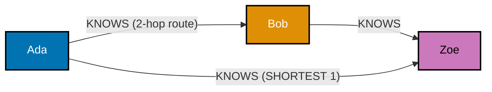

**`learning/code/ex-79-gql-conformant-shortest-path/example.cypher`**

```cypher
// Example 79: GQL-Conformant SHORTEST Path Selector. (co-21, co-10)
// ONE query, two CREATE clauses with NO semicolon between them, so a and z stay bound
// across BOTH clauses -- exactly Example 16's fix, avoiding a second Ada/Zoe pair.
CREATE (a:Person {name: 'Ada'})-[:KNOWS]->(:Person {name: 'Bob'})-[:KNOWS]->(z:Person {name: 'Zoe'})
// => a 2-hop chain: Ada(a) -> Bob -> Zoe(z)
CREATE (a)-[:KNOWS]->(z);
// => a DIRECT 1-hop shortcut, reusing the SAME a and z -- the identical fixture shape as Example 16

MATCH p = SHORTEST 1 (a:Person {name: 'Ada'})-[:KNOWS]-+(b:Person {name: 'Zoe'})
// => co-21: SHORTEST 1 is the GQL-conformant path-SELECTOR syntax -- "1" means return the
// single shortest match; -+ quantifies one-or-more hops of :KNOWS in the GQL-conformant style
RETURN length(p);
// => 1 -- the direct shortcut wins over the 2-hop chain, same answer as Example 16's shortestPath()
```

**Run**: `cypher-shell < example.cypher` (against a database whose default language is Cypher 25, or
prefixed with `CYPHER 25`, per Example 53)

**Output**:

```text
+----------------+
| length(p)      |
+----------------+
| 1              |
+----------------+
1 row
```

**Key takeaway**: `SHORTEST 1` returns the same length as Example 16's `shortestPath()` on the
identical fixture -- `1`, the direct shortcut -- confirming the modern path-selector syntax is a
drop-in semantic replacement, not a different algorithm.

**Why it matters**: `SHORTEST k`/`ALL SHORTEST`/`ANY` are the GQL-conformant path selectors intended
to eventually replace `shortestPath()`/`allShortestPaths()` (Example 16, Example 17) going forward,
the same way Example 15's quantified relationships replace classic `*1..3` -- new Cypher 25 code
should reach for this syntax, while existing Cypher 5 code using the legacy functions continues to
work unchanged (co-21). (Cypher 5/Cypher 25 are the current dialect names at the time this course was
written -- see the course overview's dated [Accuracy notes](../overview.md#accuracy-notes).)

---

### Example 80: Preview: a Multi-Model Contrast Report

_ex-80 &middot; exercises co-02, co-24, co-25, co-03_

A closing preview that answers ONE question -- "who does Ada know" -- across three representations
side by side: property-graph Cypher, RDF/SPARQL, and Gremlin -- confirming each reaches the same
answer and naming what genuinely differs between them.

**Property graph (Cypher)**:

**`learning/code/ex-80-capstone-preview-multi-model-report/property_graph.cypher`**

```cypher
// Example 80a: property-graph representation (co-02).
CREATE (:Person {name: 'Ada'})-[:KNOWS]->(:Person {name: 'Charles'});
// => plants the one fact both other representations encode identically
MATCH (:Person {name: 'Ada'})-[:KNOWS]->(n) RETURN n.name;
// => "Charles" -- a bound NODE's property, via a directed, typed relationship pattern
```

**RDF (SPARQL, via rdflib)**:

**`learning/code/ex-80-capstone-preview-multi-model-report/rdf_sparql.py`**

```python
# Example 80b: RDF/SPARQL representation (co-24).
from rdflib import Graph  # => the RDF graph class this whole script revolves around
g = Graph()  # => an empty in-memory RDF graph
g.parse(data="@prefix ex: <http://example.org/> . ex:Ada ex:knows ex:Charles .", format="turtle")
# => loads the SAME single fact as the Cypher form above, as one RDF triple
for row in g.query("PREFIX ex: <http://example.org/> SELECT ?n WHERE { ex:Ada ex:knows ?n }"):
    print(row.n)  # => a bound triple-pattern OBJECT (a URI), not a node object
```

**Gremlin (TinkerGraph)**:

**`learning/code/ex-80-capstone-preview-multi-model-report/gremlin_form.groovy`**

```groovy
// Example 80c: Gremlin representation (co-25).
graph = TinkerGraph.open(); g = graph.traversal()  // => a fresh in-memory graph, no server required
g.addV('person').property('name', 'Ada').as('a').    // => vertex 1: Ada, aliased for reuse
  addV('person').property('name', 'Charles').as('c').  // => vertex 2: Charles
  addE('knows').from('a').to('c').iterate()            // => the SAME single fact, as an edge
g.V().has('name', 'Ada').out('knows').values('name')
// => a step-chained traversal result, imperative rather than declarative
```

**Verify** (hand-traced across all three fixtures, each built independently to encode the same one
fact): all three answer "Charles" for "who does Ada know" -- the property graph via a bound node's
`name` property, SPARQL via a bound triple-pattern object, Gremlin via a step-chained traversal
result. All three represent the identical underlying fact (co-03: the same connectedness question),
differing in what a "match" fundamentally is: a subgraph pattern (Cypher), a triple pattern
(SPARQL), or an explicit step sequence (Gremlin).

**Key takeaway**: The same connectedness fact is representable, and queryable, in all three models
-- the actual trade-offs are ergonomics and standardization (RDF/SPARQL's uniform, standards-body
vocabulary vs. the property graph's compact node-bundling, co-02) and declarative-versus-imperative
query style (Cypher's pattern matching vs. Gremlin's step chains, co-25), not correctness.

**Why it matters**: This closes the Advanced tier by naming, concretely, the trade-offs this whole
topic has built toward one representation at a time: co-03's join-explosion argument for graphs
generally, co-02's property-graph-vs-RDF modeling choice, and co-25's declarative-vs-imperative
query-language choice. The actual capstone (next) builds one complete, coherent property-graph
system end to end, with its own relational contrast -- this example is the multi-model report
specifically, previewing what the capstone's `contrast.md` step documents for a single model pair.

---

← Previous: [Intermediate Examples](./intermediate.md) · Next: [Capstone](./capstone/overview.md) →
