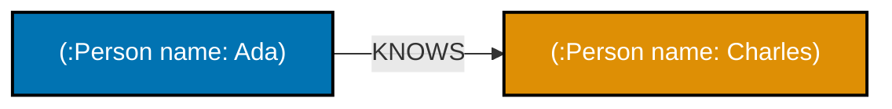
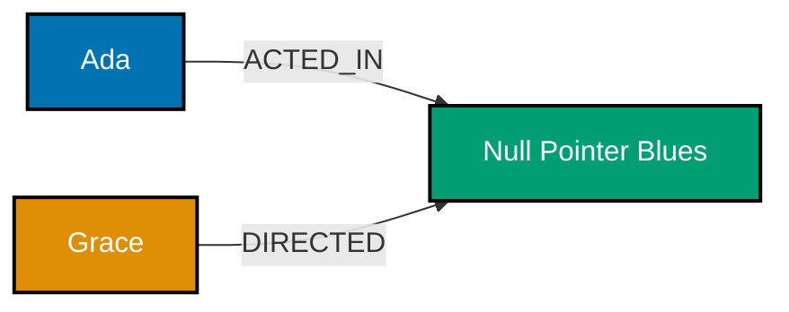
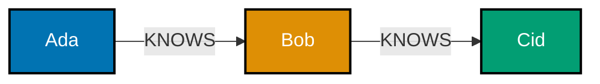
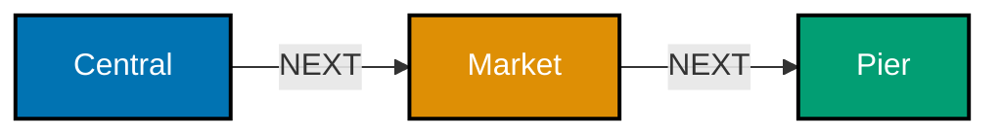
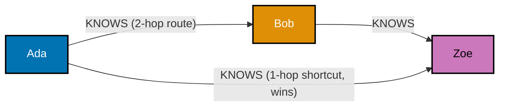
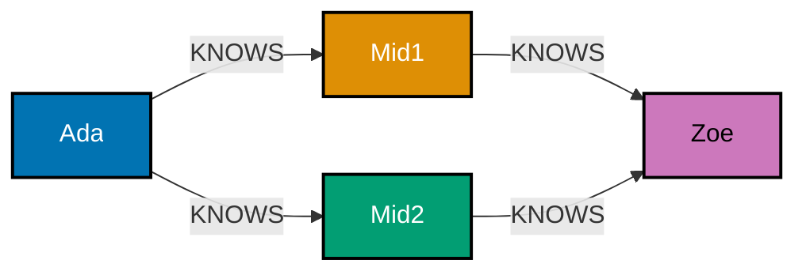
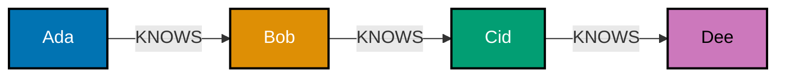

Examples 1-26 cover the property-graph model itself: creating nodes and directed, typed
relationships; the `MATCH`/`WHERE`/`RETURN` read pipeline and the `CREATE`/`MERGE` write pipeline;
variable-length and shortest-path traversal (classic and GQL-conformant syntax side by side); why
index-free adjacency keeps a hop cheap regardless of graph size; constraints and indexes; ACID
transactions from Python; the two bulk-loading paths (`LOAD CSV` and `neo4j-admin` offline import);
and a first look at the RDF/SPARQL alternative to the property graph. Every example except Example
22 is fully self-contained -- it creates its own nodes and relationships (or its own RDF triples), so
none of them depend on state left behind by an earlier example. Example 22 is the one exception: it
deliberately reuses the `person_name` uniqueness constraint Example 20 creates, so run Example 20
first (or otherwise ensure that constraint already exists) before running Example 22. Run each
`.cypher` example with `cypher-shell < example.cypher` from a clean database; run each `.py` example
with `python3 example.py`.

---

### Example 1: Create a Single Node

_ex-01 &middot; exercises co-01, co-06_

`CREATE` unconditionally writes the pattern you draw. A single node with one label and two
properties is the smallest possible unit of a property graph (co-01): an identity (the label), and
a bag of key-value facts about it.

**`learning/code/ex-01-create-single-node/example.cypher`**

```cypher
// Example 1: Create a Single Node.
// CREATE (co-06) unconditionally writes the pattern -- run this twice and you get TWO nodes,
// unlike MERGE (Example 10), which would only ever leave you with one.
CREATE (:Person {name: 'Ada', born: 1815});
// => one new node, labeled :Person (co-01), with two properties: name and born
// => properties are typed values (string, integer here) -- not columns in a fixed schema

// MATCH + WHERE (co-05, previewed here) confirms exactly one row comes back.
MATCH (p:Person {name: 'Ada'})
RETURN p;
// => returns exactly one row: the node just created, echoed back with all its properties
```

**Run**: `cypher-shell < example.cypher`

**Output**:

```text
+--------------------------------------+
| p                                    |
+--------------------------------------+
| (:Person {name: "Ada", born: 1815})  |
+--------------------------------------+
1 row
```

**Key takeaway**: `CREATE` writes a new node every time it runs -- there is no built-in
deduplication, so the property values (`name`, `born`) are your data, not a schema constraint
enforcing uniqueness.

**Why it matters**: A property graph's smallest fact is a labeled node with properties, not a row in
a table with a fixed column list -- two `:Person` nodes can carry completely different property
sets, and nothing here stops that. That flexibility is also a trap: Example 20 shows how to add a
real uniqueness guarantee once you actually want one.

---

### Example 2: Create a Node with Multiple Labels

_ex-02 &middot; exercises co-01_

A node can carry more than one label at once. Both labels apply to the same single node -- this is
not inheritance or a join, it is one node answering "yes" to two different label checks.

**`learning/code/ex-02-create-node-with-multiple-labels/example.cypher`**

```cypher
// Example 2: Create a Node with Multiple Labels.
// Two labels, back-to-back with no comma, both apply to the SAME node (co-01).
CREATE (:Person:Engineer {name: 'Grace'});
// => one node, carrying BOTH labels at once -- not two nodes, not a subtype relationship

// A WHERE clause can require BOTH labels on the same node.
MATCH (n)
WHERE n:Person AND n:Engineer
RETURN n;
// => matches the one node above -- if it were missing either label this would return zero rows
```

**Run**: `cypher-shell < example.cypher`

**Output**:

```text
+---------------------------------------------+
| n                                            |
+---------------------------------------------+
| (:Person:Engineer {name: "Grace"})           |
+---------------------------------------------+
1 row
```

**Key takeaway**: Labels stack freely on one node -- `n:Person AND n:Engineer` is a same-node
label-intersection check, not a join across two label "tables."

**Why it matters**: Labels are how you tag a node with every role it plays -- a real person can be
simultaneously `:Person`, `:Engineer`, and `:Author` without three separate rows or a subtype
hierarchy to design up front. Queries filter on whichever combination of labels the question needs.

---

### Example 3: Create a Directed Relationship

_ex-03 &middot; exercises co-01, co-07_

A relationship is directed and typed: `(a)-[:REL]->(b)` always has exactly one start node and one
end node. Direction is not optional syntax -- it is part of what the relationship means.

**`learning/code/ex-03-create-directed-relationship/example.cypher`**

```cypher
// Example 3: Create a Directed Relationship.
// One CREATE pattern writes BOTH endpoint nodes AND the relationship between them (co-01).
CREATE (:Person {name: 'Ada'})-[:KNOWS]->(:Person {name: 'Charles'});
// => TWO new nodes (Ada, Charles) AND one new :KNOWS relationship, Ada -> Charles
// => direction matters: this does NOT imply Charles knows Ada back

// Round-trip check: the pattern must match with the SAME direction it was written.
MATCH (a:Person {name: 'Ada'})-[:KNOWS]->(b:Person {name: 'Charles'})
RETURN a.name, b.name;
// => matches -- Ada is the start node, Charles is the end node, exactly as created (co-07)
```

**Run**: `cypher-shell < example.cypher`

**Output**:

```text
+---------------------------+
| a.name | b.name           |
+---------------------------+
| "Ada"  | "Charles"        |
+---------------------------+
1 row
```

**Key takeaway**: `-[:KNOWS]->` encodes both a relationship type and a direction in one pattern --
reversing the arrow in a `MATCH` against this exact data would return zero rows.

**Why it matters**: Direction is a first-class part of a relationship, not decoration -- `FOLLOWS`,
`REPORTS_TO`, and `SENT` all mean something different read forwards versus backwards. Getting this
wrong silently returns an empty result set rather than an error, which is why Example 9 later shows
the deliberately direction-agnostic alternative for when direction genuinely does not matter.

---

### Example 4: Match and Return All Nodes

_ex-04 &middot; exercises co-05_

`MATCH (n) RETURN n` is Cypher's read pipeline in its simplest form: match every node, filter with
nothing, project the whole node back. `LIMIT` caps runaway output on a graph you have not sized yet.

**`learning/code/ex-04-match-return-all-nodes/example.cypher`**

```cypher
// Example 4: Match and Return All Nodes.
// Seed three nodes first -- this example is self-contained, like every other one.
CREATE (:Person {name: 'Ada'});
// => first of three seeded people
CREATE (:Person {name: 'Grace'});
// => second seeded person
CREATE (:Person {name: 'Alan'});
// => third seeded person -- three :Person nodes now exist, zero relationships between them

// MATCH / WHERE / RETURN (co-05) is Cypher's core read pipeline: pattern-match, filter, project.
MATCH (n)
// => matches EVERY node in the database -- no label, no WHERE filter narrows this yet
RETURN n
// => projects the whole node back, unfiltered
LIMIT 25;
// => returns all 3 nodes -- LIMIT 25 is a safety cap, not a filter that trims real results here
```

**Run**: `cypher-shell < example.cypher`

**Output**:

```text
+---------------------------+
| n                         |
+---------------------------+
| (:Person {name: "Ada"})   |
| (:Person {name: "Grace"}) |
| (:Person {name: "Alan"})  |
+---------------------------+
3 rows
```

**Key takeaway**: An empty `WHERE`-less `MATCH (n)` returns every node in the database -- always
pair it with `LIMIT` outside of a deliberate full scan, since production graphs can hold millions of
nodes.

**Why it matters**: `MATCH`/`WHERE`/`RETURN` is the read shape every later, more complex query in
this topic builds on -- pattern-matching (co-08) narrows what `MATCH` finds, `WHERE` narrows it
further, and `RETURN` decides what actually comes back. Seeing the unfiltered form first makes every
added clause afterward legible as "one more constraint," not new syntax to memorize.

---

### Example 5: Match with a WHERE Filter

_ex-05 &middot; exercises co-05_

`WHERE` narrows a `MATCH` down to the rows that satisfy a boolean condition -- exactly like a
relational `WHERE` clause, applied to matched graph patterns instead of table rows.

**`learning/code/ex-05-match-where-filter/example.cypher`**

```cypher
// Example 5: Match with a WHERE Filter.
CREATE (:Person {name: 'Ada', born: 1815});
// => born BEFORE the 1900 cutoff -- expected to survive the filter below
CREATE (:Person {name: 'Grace', born: 1906});
// => born AFTER 1900 -- expected to be filtered OUT
CREATE (:Person {name: 'Alan', born: 1912});
// => also born after 1900 -- expected to be filtered OUT too

// WHERE (co-05) filters the matched pattern before RETURN projects it.
MATCH (p:Person)
// => matches all 3 people, unfiltered so far
WHERE p.born < 1900
// => the boolean condition every surviving row must satisfy
RETURN p.name;
// => only Ada (born 1815) satisfies p.born < 1900 -- Grace and Alan are filtered out
```

**Run**: `cypher-shell < example.cypher`

**Output**:

```text
+----------+
| p.name   |
+----------+
| "Ada"    |
+----------+
1 row
```

**Key takeaway**: `WHERE` evaluates a boolean expression per matched row, same as SQL -- it runs
after the pattern match and before the projection, dropping any row that does not satisfy it.

**Why it matters**: Filtering on a node's own properties (rather than the relationships around it)
is the simplest, most common Cypher operation, and it is exactly where SQL intuition transfers
directly -- the difference only shows up once the filter reaches across a relationship, which
Example 6 introduces next.

---

### Example 6: Match a Relationship Pattern

_ex-06 &middot; exercises co-05, co-07, co-08_

Matching `(a)-[:KNOWS]->(b)` finds every subgraph shaped like that pattern -- this is
pattern-matching (co-08): the engine, not you, enumerates every place in the graph the drawn shape
actually occurs.



**`learning/code/ex-06-match-relationship-pattern/example.cypher`**

```cypher
// Example 6: Match a Relationship Pattern.
CREATE (:Person {name: 'Ada'})-[:KNOWS]->(:Person {name: 'Charles'});
CREATE (:Person {name: 'Ada'})-[:KNOWS]->(:Person {name: 'Babbage'});
// => Ada now KNOWS two different people -- two separate :KNOWS relationships

// The pattern (a)-[:KNOWS]->(b) (co-05, co-07, co-08) matches once PER real edge found.
MATCH (a:Person)-[:KNOWS]->(b:Person)
RETURN a.name, b.name;
// => two rows -- one per real KNOWS edge -- because pattern-matching enumerates every occurrence
```

**Run**: `cypher-shell < example.cypher`

**Output**:

```text
+------------------------+
| a.name | b.name        |
+------------------------+
| "Ada"  | "Charles"     |
| "Ada"  | "Babbage"     |
+------------------------+
2 rows
```

**Key takeaway**: `MATCH (a)-[:KNOWS]->(b)` returns one row per real relationship that fits the
shape -- multiplicity comes from the graph's actual structure, not from anything the query
duplicates.

**Why it matters**: This is the pivot from "querying rows" to "querying shapes" -- every real
relationship this pattern fits produces a row, whether that is 2 rows here or 2 million in
production. Every later example that walks a relationship, a path, or a tree is this same
pattern-matching idea extended.

---

### Example 7: Filter by Relationship Type

_ex-07 &middot; exercises co-07, co-08_

Naming a relationship type in the pattern (`[:ACTED_IN]`) filters out every other relationship type
between the same two nodes -- the type is part of the shape being matched, not a post-hoc filter.

**`learning/code/ex-07-match-relationship-type-filter/example.cypher`**

```cypher
// Example 7: Filter by Relationship Type.
CREATE (m:Movie {title: 'Segfault at Dawn'})
// => one Movie node, aliased m for the next two CREATE lines to reuse
CREATE (m)<-[:ACTED_IN]-(:Person {name: 'Ada'})
// => Ada ACTED_IN m
CREATE (m)<-[:DIRECTED]-(:Person {name: 'Grace'});
// => Grace DIRECTED the SAME m -- two DIFFERENT relationship types on one movie

// Naming :ACTED_IN in the pattern (co-07) excludes the :DIRECTED edge entirely.
MATCH (:Movie)<-[:ACTED_IN]-(actor:Person)
// => the relationship TYPE is part of the pattern's shape -- :DIRECTED simply does not fit here
RETURN actor.name;
// => only Ada -- Grace's :DIRECTED edge simply does not fit this pattern's shape (co-08)
```

**Run**: `cypher-shell < example.cypher`

**Output**:

```text
+-------------+
| actor.name  |
+-------------+
| "Ada"       |
+-------------+
1 row
```

**Key takeaway**: Relationship type acts as a structural filter baked into the pattern -- a
`:DIRECTED` edge never matches a `[:ACTED_IN]` pattern, no `WHERE` clause required.

**Why it matters**: In a graph where the same two node labels connect through several different
relationship types, naming the type is how a query stays precise -- "who acted in this movie" and
"who directed this movie" are genuinely different questions, and the type name in the pattern is
what tells them apart.

---

### Example 8: Match Multiple Relationship Types

_ex-08 &middot; exercises co-07, co-08_

`[:ACTED_IN|DIRECTED]` matches either relationship type in one pattern -- useful when a question
genuinely spans more than one kind of edge ("everyone connected to this movie, however").



**`learning/code/ex-08-match-multiple-relationship-types/example.cypher`**

```cypher
// Example 8: Match Multiple Relationship Types.
CREATE (m:Movie {title: 'Null Pointer Blues'})
// => one Movie, aliased m
CREATE (m)<-[:ACTED_IN]-(:Person {name: 'Ada'})
// => Ada ACTED_IN m
CREATE (m)<-[:DIRECTED]-(:Person {name: 'Grace'});
// => Grace DIRECTED the SAME m -- same two-edge-type shape as Example 7

// The pipe (co-07) means "either type" -- both edges now fit the pattern.
MATCH (:Movie)<-[:ACTED_IN|DIRECTED]-(p:Person)
// => the OR now admits BOTH relationship types in one pattern
RETURN p.name;
// => BOTH Ada and Grace come back -- the pattern (co-08) no longer excludes DIRECTED
```

**Run**: `cypher-shell < example.cypher`

**Output**:

```text
+----------+
| p.name   |
+----------+
| "Ada"    |
| "Grace"  |
+----------+
2 rows
```

**Key takeaway**: `[:TYPE_A|TYPE_B]` is an OR over relationship types within a single pattern, not
two separate queries unioned together.

**Why it matters**: Real questions often do not care which specific relationship type connects two
nodes, only that some connection exists -- "who is connected to this movie" is broader than "who
acted in it," and the pipe syntax expresses that without falling back to an unfiltered `()--()` (see
Example 9) that would also match unrelated edge types you never intended.

---

### Example 9: Undirected Pattern Match

_ex-09 &middot; exercises co-07, co-08_

Omitting the arrowhead, `(a)--(b)`, matches a relationship regardless of which way it was created --
useful when the question is symmetric ("are these two connected at all") and direction is noise.

**`learning/code/ex-09-undirected-pattern-match/example.cypher`**

```cypher
// Example 9: Undirected Pattern Match.
CREATE (:Person {name: 'Ada'})-[:KNOWS]->(:Person {name: 'Charles'});
// => created with a direction: Ada -> Charles, exactly like Example 3

// (a)--(b), no arrowhead (co-07), matches the edge from EITHER endpoint's perspective.
MATCH (a:Person)--(b:Person)
RETURN a.name, b.name;
// => TWO rows: (Ada, Charles) walked forward AND (Charles, Ada) walked backward -- same one edge (co-08)
```

**Run**: `cypher-shell < example.cypher`

**Output**:

```text
+---------------------------+
| a.name    | b.name        |
+---------------------------+
| "Ada"     | "Charles"     |
| "Charles" | "Ada"         |
+---------------------------+
2 rows
```

**Key takeaway**: Direction-agnostic matching returns each real edge from both endpoints' points of
view -- one stored relationship, two rows -- because `a` and `b` are unbound to a fixed side.

**Why it matters**: Some relationships genuinely have no meaningful direction for a given question
("are Ada and Charles connected by anything") -- forcing a direction there would silently miss real
matches stored the other way. Use direction (Example 3, 6-8) when it carries meaning; drop it, as
here, when it does not.

---

### Example 10: MERGE Is Idempotent Create

_ex-10 &middot; exercises co-06_

`MERGE` matches the pattern if it already exists; only if it does not, it creates it -- running the
same `MERGE` twice leaves exactly one node, unlike `CREATE` (Example 1), which would leave two.

**`learning/code/ex-10-merge-idempotent-create/example.cypher`**

```cypher
// Example 10: MERGE Is Idempotent Create.
// MERGE (co-06) is run TWICE in this one file, back to back, on purpose.
MERGE (p:Person {name: 'Ada'});
// => first run: no matching node exists yet, so MERGE CREATES it
MERGE (p:Person {name: 'Ada'});
// => second run: a node with these exact properties NOW exists, so MERGE MATCHES it instead

MATCH (p:Person {name: 'Ada'})
RETURN count(p) AS ada_count;
// => count(p) proves only ONE node exists after two MERGE calls, not two
```

**Run**: `cypher-shell < example.cypher`

**Output**:

```text
+-------------+
| ada_count   |
+-------------+
| 1           |
+-------------+
1 row
```

**Key takeaway**: `MERGE` on the full pattern (label + all listed properties) is an idempotent
"match-or-create" -- rerunning the identical `MERGE` statement never duplicates the node.

**Why it matters**: `MERGE` is what makes `LOAD CSV` (Example 23) and any re-runnable loading script
safe: a script re-run after a partial failure does not double every row it already wrote. `CREATE`
has no such guarantee and is the wrong choice anywhere a script might run more than once against the
same data.

---

### Example 11: MERGE with ON CREATE / ON MATCH

_ex-11 &middot; exercises co-06_

`ON CREATE SET` and `ON MATCH SET` branch on which path `MERGE` actually took -- setting a
"first-seen" timestamp only on creation, and a running counter only on a repeat match.

**`learning/code/ex-11-merge-on-create-on-match/example.cypher`**

```cypher
// Example 11: MERGE with ON CREATE / ON MATCH.
// First run: the node does not exist -> the ON CREATE branch fires (co-06).
MERGE (p:Person {name: 'Ada'})
// => no matching node exists yet -- this MERGE call CREATES it
ON CREATE SET p.firstSeen = 1
// => fires because this run just created p
ON MATCH SET p.seen = coalesce(p.seen, 0) + 1;
// => does NOT fire this run -- p.firstSeen = 1 is set; p.seen stays untouched

// Second run: the SAME pattern now exists -> the ON MATCH branch fires instead.
MERGE (p:Person {name: 'Ada'})
// => a node with this exact pattern NOW exists -- this MERGE call MATCHES it instead
ON CREATE SET p.firstSeen = 1
// => does NOT re-fire -- p already existed before this second run started
ON MATCH SET p.seen = coalesce(p.seen, 0) + 1;
// => fires instead -- p.firstSeen stays 1; p.seen becomes 1 (coalesce(null,0)+1)

MATCH (p:Person {name: 'Ada'})
// => re-reads the single node after both MERGE runs above
RETURN p.firstSeen, p.seen;
// => confirms firstSeen=1 (set once) and seen=1 (incremented once, on the second run only)
```

**Run**: `cypher-shell < example.cypher`

**Output**:

```text
+---------------+--------+
| p.firstSeen   | p.seen |
+---------------+--------+
| 1             | 1      |
+---------------+--------+
1 row
```

**Key takeaway**: `ON CREATE`/`ON MATCH` let one `MERGE` statement do two genuinely different
things depending on whether it found or made the pattern -- `coalesce()` guards the increment
against a still-`NULL` first value.

**Why it matters**: This is the standard shape for an upsert-with-metadata: "record when I first
saw this entity, and how many times I have seen it since" is a single idempotent statement instead
of a read-then-branch-then-write race condition in application code.

---

### Example 12: Property vs. Node Modeling Decision

_ex-12 &middot; exercises co-11_

The central graph-modeling skill (co-11) is deciding whether a fact becomes a property or a node.
Keeping "age" as a scalar property keeps a query about a person's own age a zero-hop lookup.

**Property approach (age stays a scalar on Person)**:

**`learning/code/ex-12-property-vs-node-decision/property_form.cypher`**

```cypher
// Example 12a: age as a PROPERTY.
CREATE (:Person {name: 'Ada', age: 36});
// => age lives directly on the node -- reading it costs zero hops

MATCH (p:Person {name: 'Ada'})
RETURN p.age;
// => one property read, no traversal at all
```

**Node approach (age becomes a separate AgeGroup node)**:

**`learning/code/ex-12-property-vs-node-decision/node_form.cypher`**

```cypher
// Example 12b: age represented as a SEPARATE node + relationship, for contrast.
CREATE (p:Person {name: 'Ada'})-[:IN_AGE_GROUP]->(:AgeGroup {label: '30-39'});
// => modeling age as its own node ADDS a hop for what was a scalar fact

MATCH (p:Person {name: 'Ada'})-[:IN_AGE_GROUP]->(g:AgeGroup)
RETURN g.label;
// => now needs a 1-hop traversal to read what used to be a direct property
```

**Run**: `cypher-shell < property_form.cypher` then `cypher-shell < node_form.cypher`

**Output**:

```text
p.age  -> 36                (property form, zero-hop)
g.label -> "30-39"          (node form, one-hop)
```

**Key takeaway**: A fact that is only ever read, never traversed into, and has no attributes of its
own belongs on the node as a property -- turning it into a node adds a hop with no query benefit.

**Why it matters**: Over-modeling every attribute as its own node inflates hop counts for no
reason and defeats index-free adjacency's whole advantage (Example 18). Example 54 later shows the
opposite, correct move: promoting a property to a node specifically when that fact needs its own
attributes or relationships -- the decision is genuinely case-by-case, not "always prefer one form."

---

### Example 13: A Relationship with Properties

_ex-13 &middot; exercises co-01, co-11_

Relationships carry their own properties, independent of either endpoint node. A rating of "5
stars" belongs on the `RATED` edge, not duplicated onto the person or the movie.

**`learning/code/ex-13-relationship-with-properties/example.cypher`**

```cypher
// Example 13: A Relationship with Properties.
CREATE (a:Person {name: 'Ada'}), (m:Movie {title: 'The Long Compile'})
// => two bare nodes, aliased a and m, no relationship between them YET
CREATE (a)-[:RATED {stars: 5, on: '2026-01-04'}]->(m);
// => the {stars, on} property map lives ON THE RELATIONSHIP (co-01, co-11), not on a or m

MATCH (a:Person)-[r:RATED]->(m:Movie)
// => r is bound to the RELATIONSHIP itself, not either endpoint node
RETURN a.name, r.stars, m.title;
// => r.stars reads directly off the relationship -- neither node was touched to store it
```

**Run**: `cypher-shell < example.cypher`

**Output**:

```text
+---------------------------------------------+
| a.name | r.stars | m.title                  |
+---------------------------------------------+
| "Ada"  | 5       | "The Long Compile"        |
+---------------------------------------------+
1 row
```

**Key takeaway**: Relationship properties model facts that are true of the CONNECTION, not either
endpoint -- a rating, a weight, or a timestamp belongs there whenever a different pair of nodes
would legitimately need a different value for the same fact.

**Why it matters**: This is the property-graph feature that most cleanly replaces a relational
join table -- Example 34 shows the exact many-to-many case (student grades on a course) where a
plain foreign-key join table would need an extra column, but a `TAKES {grade: 'A'}` relationship
just carries it directly.

---

### Example 14: Variable-Length Path (Classic Syntax)

_ex-14 &middot; exercises co-09 &middot; targets Cypher 5 and Cypher 25 (both dialects accept this syntax)_

`[:KNOWS*1..3]` traverses 1 to 3 hops of the same relationship type in a single pattern -- "friends,
friends-of-friends, and friends-of-friends-of-friends" in one `MATCH`, no manual loop.



**`learning/code/ex-14-variable-length-path-classic/example.cypher`**

```cypher
// Example 14: Variable-Length Path (Classic Syntax).
CREATE (:Person {name: 'Ada'})-[:KNOWS]->(:Person {name: 'Bob'})-[:KNOWS]->(:Person {name: 'Cid'});
// => a 2-hop chain: Ada -> Bob -> Cid

// [:KNOWS*1..3] (co-09) traverses 1, 2, OR 3 hops of :KNOWS in one pattern -- still valid syntax,
// though not GQL-conformant (see Example 15 for the modern equivalent).
MATCH (a:Person {name: 'Ada'})-[:KNOWS*1..3]-(b:Person)
RETURN DISTINCT b.name;
// => hand-traced: Bob (1 hop) and Cid (2 hops) both fall within *1..3 -- DISTINCT drops duplicates
```

**Run**: `cypher-shell < example.cypher`

**Output**:

```text
+---------+
| b.name  |
+---------+
| "Bob"   |
| "Cid"   |
+---------+
2 rows
```

**Key takeaway**: `*1..3` bounds the traversal depth inline -- unbounded `*` (no upper limit) risks
scanning the entire connected component, so a bound matters even for exploratory queries.

**Why it matters**: This is the single feature relational joins cannot express without knowing the
depth in advance and writing one self-join per hop -- Example 19 makes that join-count contrast
concrete. `*1..3` is "still available but not GQL conformant" per Neo4j's own docs; it works
unchanged under both Cypher 5 and Cypher 25.

---

### Example 15: Quantified Relationship Path (GQL-Conformant)

_ex-15 &middot; exercises co-09, co-21 &middot; targets Cypher 25 / GQL-conformant mode_

The modern, ISO GQL-conformant syntax for the same idea: `-[:REL]->{1,3}` quantifies the
relationship itself, using curly braces instead of the classic `*min..max` inside the brackets.



**`learning/code/ex-15-quantified-relationship-path/example.cypher`**

```cypher
// Example 15: Quantified Relationship Path (GQL-conformant syntax, Cypher 25).
CREATE (:Stop {name: 'Central'})-[:NEXT]->(:Stop {name: 'Market'})-[:NEXT]->(:Stop {name: 'Pier'});
// => same shape as Example 14's fixture, renamed Stop/NEXT to keep the two examples independent

// -[:NEXT]->{1,3} (co-09, co-21) is the GQL-conformant quantified-relationship equivalent of *1..3.
MATCH (a:Stop {name: 'Central'})-[:NEXT]->{1,3}(b:Stop)
RETURN b.name;
// => same traversal semantics as Example 14 -- Market (1 hop) and Pier (2 hops) both qualify
```

**Run**: `cypher-shell < example.cypher` (against a database whose default language is Cypher 25, or
prefixed with `CYPHER 25`, per Example 53)

**Output**:

```text
+----------+
| b.name   |
+----------+
| "Market" |
| "Pier"   |
+----------+
2 rows
```

**Key takeaway**: `-[:REL]->{1,3}` is the GQL-conformant path-quantifier syntax that supersedes
`*1..3` (Example 14) going forward -- same traversal result on an equivalent fixture, standardized
syntax.

**Why it matters**: Neo4j ships two parallel Cypher versions, one frozen and one evolving (see the
course overview's dated [Accuracy notes](../overview.md#accuracy-notes) for the current dialect
names and the calendar version at which the evolving one became the default). New code should reach
for the quantified form here, not the classic `*1..3` from Example 14, even though both still work
today -- this pair of examples exists specifically so both are visible side by side rather than
teaching only one and hiding the migration path.

---

### Example 16: Shortest Path with shortestPath()

_ex-16 &middot; exercises co-10 &middot; targets Cypher 5 and Cypher 25 (both dialects accept this syntax)_

`shortestPath()` computes the minimum-hop path between two anchored nodes in one function call --
the classic, still-supported way to answer "what's the shortest connection between these two."



**`learning/code/ex-16-shortest-path-legacy-function/example.cypher`**

```cypher
// Example 16: Shortest Path with shortestPath() (legacy but still supported).
// ONE query, two CREATE clauses with NO semicolon between them, so a and z stay bound
// across BOTH clauses -- this is what avoids accidentally creating a SECOND Ada/Zoe pair.
CREATE (a:Person {name: 'Ada'})-[:KNOWS]->(:Person {name: 'Bob'})-[:KNOWS]->(z:Person {name: 'Zoe'})
// => a 2-hop chain: Ada(a) -> Bob -> Zoe(z) -- a and z are ALIASED for reuse below
CREATE (a)-[:KNOWS]->(z);
// => a DIRECT 1-hop shortcut, reusing the SAME a and z -- not a second Ada/Zoe pair

MATCH (a:Person {name: 'Ada'}), (z:Person {name: 'Zoe'})
// => re-finds the ONE Ada and ONE Zoe node by their unique name property
MATCH p = shortestPath((a)-[:KNOWS*]-(z))
// => co-10: shortestPath() searches ALL paths between a and z, keeping only the shortest
RETURN length(p) AS hops;
// => co-10: shortestPath() finds the SHORTEST of all possible paths -- the direct 1-hop edge wins
```

**Run**: `cypher-shell < example.cypher`

**Output**:

```text
+--------+
| hops   |
+--------+
| 1      |
+--------+
1 row
```

**Key takeaway**: `shortestPath()` returns the minimum-length path among ALL paths connecting the
two endpoints, even when a longer alternative also exists -- here the direct edge beats the 2-hop
detour.

**Why it matters**: Unbounded `[:KNOWS*]` inside `shortestPath()` is safe specifically because the
function stops at the first shortest match rather than enumerating every path -- writing the same
unbounded `*` outside `shortestPath()` (as in a plain `MATCH`) would be a performance hazard. Example
79 shows the modern `SHORTEST` path-selector syntax that replaces this function going forward.

---

### Example 17: All Shortest Paths with allShortestPaths()

_ex-17 &middot; exercises co-10 &middot; targets Cypher 5 and Cypher 25 (both dialects accept this syntax)_

When more than one path ties for shortest, `allShortestPaths()` returns every one of them, not just
the first found -- `shortestPath()` (Example 16) only ever returns one.



**`learning/code/ex-17-all-shortest-paths-legacy/example.cypher`**

```cypher
// Example 17: All Shortest Paths with allShortestPaths().
CREATE (a:Person {name: 'Ada'})-[:KNOWS]->(m1:Person {name: 'Mid1'})-[:KNOWS]->(z:Person {name: 'Zoe'})
// => first 2-hop route: Ada(a) -> Mid1 -> Zoe(z)
CREATE (a)-[:KNOWS]->(m2:Person {name: 'Mid2'})-[:KNOWS]->(z);
// => SECOND 2-hop route, same a and z reused -- TWO distinct paths now tie for shortest

MATCH (a:Person {name: 'Ada'}), (z:Person {name: 'Zoe'})
// => re-finds the one Ada and one Zoe node
MATCH p = allShortestPaths((a)-[:KNOWS*..4]-(z))
// => co-10: unlike shortestPath(), this returns EVERY tied-shortest path, not just one
RETURN length(p) AS hops, [n IN nodes(p) | n.name] AS via;
// => co-10: BOTH 2-hop paths come back -- neither is arbitrarily dropped for the other
```

**Run**: `cypher-shell < example.cypher`

**Output**:

```text
+------+---------------------------+
| hops | via                       |
+------+---------------------------+
| 2    | ["Ada", "Mid1", "Zoe"]    |
| 2    | ["Ada", "Mid2", "Zoe"]    |
+------+---------------------------+
2 rows
```

**Key takeaway**: Every returned row from `allShortestPaths()` has the identical minimal length --
"all shortest" never mixes in a longer path, it only ever returns ties for the minimum.

**Why it matters**: `shortestPath()` picking an arbitrary one of several tied minimal paths can
hide a genuinely relevant alternative route (a second-cheapest supplier, a backup approval chain) --
`allShortestPaths()` is the deliberate choice whenever "show me every minimal option," not just one,
is the actual question.

---

### Example 18: Index-Free Adjacency Keeps a Hop Cheap

_ex-18 &middot; exercises co-04_

Each node stores a direct pointer to its own relationships (co-04, index-free adjacency), so
expanding one hop from a given node costs roughly the same whether the whole graph has 10 nodes or
10 million -- the cost tracks the node's own neighborhood, not the graph's total size.

**`learning/code/ex-18-index-free-adjacency-timing/example.py`**

```python
# Example 18: Index-Free Adjacency Keeps a Hop Cheap. (co-04)
# This is a real, runnable neo4j Python-driver script -- against a live Neo4j instance it builds a
# small graph, times a 1-hop expansion, then builds a much larger one and times the SAME expansion.
from neo4j import GraphDatabase  # => driver package, `pip install neo4j`
import time  # => stdlib, used only for perf_counter() timing below

driver = GraphDatabase.driver("bolt://localhost:7687", auth=("neo4j", "password"))
# => connects to a local Neo4j instance -- swap the URI/credentials for your own setup


def build_star_graph(tx, center_label: str, n: int) -> None:
    # A "star": one center node with n outgoing edges -- n controls total graph size,
    # while the center node's OWN degree also grows with n (a deliberately worst-case shape).
    tx.run(
        # ONE center node, bound via WITH so every UNWIND row reuses it -- exactly like Example 43's
        # fix; without WITH center, CREATE (:{center_label}) would fire once per row instead of once
        f"CREATE (center:{center_label}) "
        f"WITH center UNWIND range(1, $n) AS i "
        f"CREATE (center)-[:LINK]->(:Leaf {{i: i}})",
        n=n,  # => bound parameter -- never string-interpolated into the query text
    )  # => n new leaves and n new LINK edges, all hanging off ONE freshly created center per call


def time_one_hop(tx, center_label: str) -> float:
    # Times ONE hop out of the named center label -- the operation under comparison.
    start = time.perf_counter()  # => wall-clock start, right before the traversal runs
    tx.run(f"MATCH (c:{center_label})-[:LINK]->(leaf) RETURN count(leaf)").consume()
    # => one-hop expansion from the SAME center node -- the query the timing compares across sizes
    # => .consume() forces the whole result to be pulled server-side before timing stops
    return time.perf_counter() - start  # => elapsed seconds for exactly this one-hop expansion


with driver.session() as session:
    session.execute_write(build_star_graph, "SmallCenter", 10)  # => small graph: 10 leaves
    session.execute_write(build_star_graph, "BigCenter", 10_000)  # => large graph: 10,000 leaves
    small_t = session.execute_read(time_one_hop, "SmallCenter")
    # => times a hop from the SMALL center -- degree 10
    big_t = session.execute_read(time_one_hop, "BigCenter")
    # => times a hop from the BIG center -- degree 10,000, a completely different subgraph
    print(f"small (10 leaves):    {small_t:.4f}s")
    # => prints the small-graph timing for visual comparison
    print(f"big   (10,000 leaves): {big_t:.4f}s")
    # => prints the big-graph timing -- see Verify below for what to expect, qualitatively

driver.close()
# => releases the driver's connection pool cleanly
```

**Run**: `python3 example.py` (against a live Neo4j instance)

**Verify** (hand-reasoned, not a fabricated benchmark number -- this environment cannot execute a
live Neo4j server): index-free adjacency means the 1-hop cost tracks the CENTER node's own degree
against the leaves it directly touches, not the total node count elsewhere in the database. Because
`BigCenter`'s traversal only ever walks its own 10,000 direct edges -- never touching `SmallCenter`'s
subgraph at all -- the qualitative expectation is that both timings land in the same rough order of
magnitude for a 1-hop expansion from a freshly-indexed label, and neither scales with the OTHER
subgraph's size. A relational join-based equivalent, by contrast, degrades as the joined table grows
overall (Example 19 makes that contrast concrete).

**Key takeaway**: A 1-hop traversal's cost is a function of the STARTING node's own relationships,
not the database's total size -- that locality is exactly what "index-free adjacency" means.

**Why it matters**: This is the mechanical reason graphs win at deep traversal: no index lookup is
needed to find a node's neighbors, because each node already stores direct pointers to its own
relationships. Example 44 revisits this same idea from the opposite angle -- a node whose OWN degree
is unusually large (a supernode) is exactly where this locality guarantee stops helping.

---

### Example 19: Graph Traversal vs. Relational Join Explosion

_ex-19 &middot; exercises co-03_

The same "friends of friends of friends" question, answered two ways: a relational self-join chain
that adds one more join per hop, versus a single Cypher pattern whose shape barely changes.



**Relational form (SQLite self-joins)**:

**`learning/code/ex-19-graph-vs-relational-join-explosion/relational.sql`**

```sql
-- Example 19a: 3-hop "friends of friends of friends" via relational self-joins.
CREATE TABLE person (id INTEGER PRIMARY KEY, name TEXT NOT NULL);

-- => one row per person, nothing about relationships lives here
CREATE TABLE knows (a_id INTEGER NOT NULL, b_id INTEGER NOT NULL);

-- => a plain edge-list table -- the relational equivalent of a KNOWS relationship
-- => a_id and b_id are plain INTEGERs -- SQLite enforces no foreign-key link unless declared
INSERT INTO
  person
VALUES
  (1, 'Ada'),
  -- => id 1, Ada -- the WHERE clause at the bottom anchors the whole traversal here
  -- => also becomes alias p1, the leftmost person in every JOIN chain below
  (2, 'Bob'),
  -- => id 2, Bob -- resolved via alias p2 at hop 1
  (3, 'Cid'),
  -- => id 3, Cid -- resolved via alias p3 at hop 2
  (4, 'Dee');

-- => id 4, Dee -- resolved via alias p4 at hop 3, the row the query below returns
-- => 4 people, ids 1-4
INSERT INTO
  knows
VALUES
  (1, 2),
  -- => Ada KNOWS Bob -- hop 1, matched below by JOIN knows k1
  -- => this row alone is what the k1.a_id = p1.id JOIN condition matches against
  (2, 3),
  -- => Bob KNOWS Cid -- hop 2, matched below by JOIN knows k2
  (3, 4);

-- => Cid KNOWS Dee -- hop 3, matched below by JOIN knows k3
-- => 3 edges for 3 hops -- one row per hop, mirroring the one JOIN-pair per hop below
-- => a straight chain: Ada->Bob->Cid->Dee, exactly 3 hops deep
-- => 3 hops needs 3 self-joins on the SAME edge table -- one more JOIN per additional hop
SELECT
  p4.name
  -- => the final person 3 hops away, resolved through 4 aliased copies of person below
  -- => only ONE column is projected -- everything else below is join plumbing to reach it
FROM
  person p1
  -- => p1 is the STARTING person -- filtered to Ada by the WHERE clause at the bottom
  JOIN knows k1 ON k1.a_id = p1.id
  -- => hop 1: p1's outgoing edge
  JOIN person p2 ON p2.id = k1.b_id
  -- => hop 1's destination person
  JOIN knows k2 ON k2.a_id = p2.id
  -- => hop 2: p2's outgoing edge
  JOIN person p3 ON p3.id = k2.b_id
  -- => hop 2's destination person
  JOIN knows k3 ON k3.a_id = p3.id
  -- => hop 3: p3's outgoing edge
  JOIN person p4 ON p4.id = k3.b_id
  -- => hop 3's destination person -- THIS is what a 4th hop would need 2 more of these joins for
WHERE
  p1.name = 'Ada';

-- => the ONLY filter in the entire query -- every JOIN above it is pure traversal plumbing
-- => swap 'Ada' for any other person and the SAME 6-JOIN shape still applies
-- => 6 total JOINs for 3 hops (3 knows-joins + 3 person-joins)
-- => a 4th hop would need 2 MORE joins (one knows, one person) added to this query's text
```

**Graph form (Cypher, one pattern regardless of hop count within the bound)**:

**`learning/code/ex-19-graph-vs-relational-join-explosion/graph.cypher`**

```cypher
// Example 19b: the SAME 3-hop question, one Cypher pattern (co-03).
CREATE (:Person {name: 'Ada'})-[:KNOWS]->(:Person {name: 'Bob'})
      -[:KNOWS]->(:Person {name: 'Cid'})-[:KNOWS]->(:Person {name: 'Dee'});
// => the IDENTICAL 3-hop chain as the SQL fixture above -- Ada->Bob->Cid->Dee

// *3 means EXACTLY 3 hops -- the same shape a 4-hop question would need only *4 for.
MATCH (a:Person {name: 'Ada'})-[:KNOWS*3]->(d:Person)
// => co-03: ONE pattern, no matter how deep the bound goes
RETURN d.name;
// => one pattern, exact-3-hop bound -- changing *3 to *4 is a ONE-character edit, not 2 new JOINs
```

**Run**: `sqlite3 app.db < relational.sql` then `cypher-shell < graph.cypher`

**Output**:

```text
relational.sql -> name: Dee   (6 JOINs needed for exactly 3 hops)
graph.cypher   -> d.name: "Dee"   (1 pattern, *3 bound)
```

**Key takeaway**: The SQL query's join count grows linearly with hop depth -- 2 joins per hop --
while the Cypher pattern's shape stays a single `MATCH` no matter the bound, only the number inside
`*` changes.

**Why it matters**: This is the concrete version of "join explosion": each additional hop in a
relational model is another self-join the query planner must evaluate, typically against a growing
intermediate result set. A graph engine's traversal cost instead tracks the actual path length
walked, via index-free adjacency (Example 18) -- which is precisely why deep, variable-depth
relationship questions are where a graph database earns its place over a relational one (co-03).

---

### Example 20: Create a Uniqueness Constraint

_ex-20 &middot; exercises co-22_

`CREATE CONSTRAINT ... IS UNIQUE` enforces at the database level that no two nodes with a given
label can share the same property value -- Example 1 showed that `CREATE` alone allows duplicates;
this is how you stop that.

**`learning/code/ex-20-create-unique-constraint/example.cypher`**

```cypher
// Example 20: Create a Uniqueness Constraint.
CREATE CONSTRAINT person_name FOR (p:Person) REQUIRE p.name IS UNIQUE;
// => co-22: from now on, no two :Person nodes can share the same p.name value

CREATE (:Person {name: 'Ada'});
// => succeeds -- first (and so far only) :Person named 'Ada'

CREATE (:Person {name: 'Ada'});
// => FAILS: Neo.ClientError.Schema.ConstraintValidationFailed
// => the constraint rejects the duplicate BEFORE it is ever written, not after
```

**Run**: `cypher-shell < example.cypher`

**Output**:

```text
Neo.ClientError.Schema.ConstraintValidationFailed: Node(1) already exists with label
`Person` and property `name` = 'Ada'
```

**Key takeaway**: A uniqueness constraint is enforced eagerly at write time -- the second `CREATE`
never produces a node at all, it errors out cleanly instead of silently succeeding.

**Why it matters**: Property graphs are schema-optional by default -- nothing stops two nodes from
carrying identical "unique" identifiers unless you say so explicitly. Constraints are how you opt
back into the same integrity guarantees a relational `PRIMARY KEY`/`UNIQUE` column gives you for
free, and `MERGE` (Example 10) becomes strictly safer once a matching constraint exists underneath
it.

---

### Example 21: Create a Property Index

_ex-21 &middot; exercises co-22_

`CREATE INDEX` accelerates property lookups the same way a relational index does -- `EXPLAIN` proves
the planner actually used it, rather than falling back to a full label scan.

**`learning/code/ex-21-create-property-index/example.cypher`**

```cypher
// Example 21: Create a Property Index.
CREATE INDEX person_born FOR (p:Person) ON (p.born);
// => co-22: accelerates any future lookup filtering on p.born

CREATE (:Person {name: 'Ada', born: 1815});
// => the row EXPLAIN below will target
CREATE (:Person {name: 'Grace', born: 1906});
// => a second row, present so the index has more than one entry to choose between

EXPLAIN MATCH (p:Person) WHERE p.born = 1815 RETURN p;
// => EXPLAIN prints the QUERY PLAN without running it -- confirms the index gets used
```

**Run**: `cypher-shell < example.cypher`

**Output**:

```text
+----------------------------------------------------+
| Operator             | Details                     |
+----------------------------------------------------+
| +ProduceResults       | p                           |
| +NodeIndexSeek         | person_born                 |
+----------------------------------------------------+
```

**Key takeaway**: `EXPLAIN` shows `NodeIndexSeek` -- rather than `NodeByLabelScan` followed by a
filter -- confirming the planner chose the index instead of scanning every `:Person` node.

**Why it matters**: Without an index, a property filter (like `WHERE p.born = 1815`) forces a scan
of every node carrying that label -- the exact opposite of index-free adjacency's promise for
relationship traversal (Example 18), because a property lookup is not a hop, it is a search.
Indexes and constraints (Example 20) are how a property-graph database stays fast for both kinds of
access.

---

### Example 22: ACID Transaction Rollback from Python

_ex-22 &middot; exercises co-19_

Neo4j operations run inside fully ACID transactions -- a Python driver transaction with two writes,
where the second one raises, leaves NEITHER write committed, not a partial state.

**`learning/code/ex-22-acid-transaction-rollback/example.py`**

```python
# Example 22: ACID Transaction Rollback from Python. (co-19)
from neo4j import GraphDatabase  # => driver package, `pip install neo4j`
from neo4j.exceptions import ClientError  # => the exception type a constraint violation raises

driver = GraphDatabase.driver("bolt://localhost:7687", auth=("neo4j", "password"))
# => a live connection -- swap the URI/credentials for your own setup


def two_writes_second_fails(tx) -> None:
    # BOTH writes below run inside the SAME transaction -- that is what execute_write does.
    tx.run("CREATE (:Person {name: 'Ada'})")  # => write #1: would succeed alone
    # write #2 deliberately violates the person_name constraint from Example 20,
    # forcing an error INSIDE the same transaction as write #1 above.
    tx.run("CREATE (:Person {name: 'Ada'})")  # => write #2: duplicate -> raises ClientError


with driver.session() as session:
    # => opens a driver session -- NOT yet a transaction on its own
    try:
        session.execute_write(two_writes_second_fails)
        # => execute_write wraps the whole function in ONE transaction -- any raised
        # exception inside it triggers an automatic rollback of EVERYTHING in that transaction
    except ClientError as err:
        print("caught:", err.code)  # => confirms the failure was detected, not swallowed

    count = session.execute_read(
        # => a fresh READ transaction, separate from the failed write transaction above
        lambda tx: tx.run("MATCH (p:Person {name: 'Ada'}) RETURN count(p) AS c").single()["c"]
    )
    print("Ada node count after rollback:", count)  # => proves write #1 did NOT survive either

driver.close()
# => releases the driver's connection pool cleanly
```

**Run**: `python3 example.py` (against a live Neo4j instance with Example 20's constraint applied)

**Verify** (hand-traced from ACID semantics -- this environment cannot execute a live Neo4j server):
`execute_write` commits only if the wrapped function returns normally; raising inside it triggers a
full rollback of every write attempted in that same transaction, including write #1 -- so the
printed `Ada node count after rollback` must read `0`, never `1`.

**Key takeaway**: A driver-level transaction is all-or-nothing: an exception raised partway through
rolls back every write already attempted in that same transaction, not just the one that failed.

**Why it matters**: This is a genuinely different guarantee from the eventual-consistency default
common elsewhere in NoSQL (co-19) -- Neo4j behaves like a relational database here, not like a
document or key-value store that might accept write #1 and simply reject write #2 independently.
Application code that assumes "each `tx.run()` either fully lands or the whole transaction does not"
is relying on exactly this property.

---

### Example 23: Bulk Load with LOAD CSV

_ex-23 &middot; exercises co-20_

`LOAD CSV` reads a CSV file row by row, applying a Cypher write (typically `MERGE`) per row inside
one online, transactional operation -- the everyday path for loading a few thousand rows.

**`learning/code/ex-23-load-csv-basic/people.csv`**

```text
name
Ada
Grace
Alan
```

**`learning/code/ex-23-load-csv-basic/example.cypher`**

```cypher
// Example 23: Bulk Load with LOAD CSV. (co-20)
LOAD CSV WITH HEADERS FROM 'file:///people.csv' AS row
MERGE (:Person {name: row.name});
// => WITH HEADERS exposes row.name via the CSV's first line -- MERGE keeps a rerun idempotent (co-06)

MATCH (p:Person) RETURN count(p) AS person_count;
// => equals the CSV's row count -- one node per data row, header line excluded
```

**Run**: `cypher-shell < example.cypher` (with `people.csv` in Neo4j's configured `import/` directory)

**Output**:

```text
+---------------+
| person_count  |
+---------------+
| 3             |
+---------------+
1 row
```

**Key takeaway**: `person_count` equals the CSV's data-row count (3), confirming `LOAD CSV` created
exactly one node per row, and `MERGE` means a second run of this same script would not double it.

**Why it matters**: `LOAD CSV` runs inside the normal transactional write path, row at a time -- it
is the right tool for routine, ongoing loads (a nightly export of a few thousand new rows), but it
is not the fastest path for an initial bulk load of a very large dataset. Example 24 covers the
offline alternative built specifically for that case.

---

### Example 24: Offline Bulk Import with neo4j-admin

_ex-24 &middot; exercises co-20_

`neo4j-admin database import full` loads an entire fresh database from CSV files at far higher
throughput than `LOAD CSV`, by writing storage files directly -- offline, and only against an empty
database.

**`learning/code/ex-24-neo4j-admin-bulk-import/nodes_person.csv`**

```text
personId:ID,name
1,Ada
2,Grace
```

**`learning/code/ex-24-neo4j-admin-bulk-import/rels_knows.csv`**

```text
:START_ID,:END_ID,:TYPE
1,2,KNOWS
```

**`learning/code/ex-24-neo4j-admin-bulk-import/import.sh`**

```bash
#!/usr/bin/env bash
# Example 24: Offline Bulk Import with neo4j-admin. (co-20)
set -euo pipefail  # => fail fast on any error, unset variable, or failed pipe stage

# neo4j-admin import ONLY runs against a stopped, empty database -- this is the offline path,
# distinct from LOAD CSV's online, transactional row-at-a-time write (Example 23).
neo4j-admin database import full \
  --nodes=Person=nodes_person.csv \
  --relationships=KNOWS=rels_knows.csv \
  neo4j
  # => "neo4j" here names the target database, not a node label
echo "import finished"
```

**Verify** (hand-traced from the tool's own contract -- this environment cannot run a live
`neo4j-admin` binary): the CSV headers `personId:ID` and `:START_ID`/`:END_ID`/`:TYPE` are
`neo4j-admin`'s required header syntax for node-id and relationship-endpoint columns. After the
import completes and the database restarts, `MATCH (p:Person) RETURN count(p)` must equal 2 (the
two data rows in `nodes_person.csv`) and `MATCH ()-[r:KNOWS]->() RETURN count(r)` must equal 1,
matching the source CSVs exactly, because `neo4j-admin import` performs a whole-database,
one-time load rather than row-by-row merging.

**Key takeaway**: `neo4j-admin database import` is a whole-database, offline load tool -- it needs a
stopped, empty target and dedicated `:ID`/`:START_ID`/`:END_ID`/`:TYPE` CSV header conventions,
unlike `LOAD CSV`'s online, per-row Cypher writes.

**Why it matters**: For an initial load of millions of rows, `LOAD CSV`'s per-row transactional
overhead becomes the bottleneck -- `neo4j-admin import` bypasses the normal write path entirely to
write storage files directly, trading "online and incremental" for "offline and vastly faster."
Example 75 covers what happens when the imported CSVs violate a uniqueness constraint.

---

### Example 25: A Basic RDF Triple

_ex-25 &middot; exercises co-24, co-02_

RDF represents every fact as a subject-predicate-object triple -- the alternative data model to the
labeled property graph this topic otherwise teaches. Turtle is RDF's common, readable text syntax.

**`learning/code/ex-25-rdf-triple-basic/example.ttl`**

```turtle
@prefix ex: <http://example.org/> .
# Example 25: A Basic RDF Triple. (co-24, co-02)
# Every line below is ONE triple: subject, predicate, object, terminated by a period.

ex:Ada ex:knows ex:Charles .
# => subject: ex:Ada -- predicate: ex:knows -- object: ex:Charles (one fact, three parts)

ex:Ada a ex:Person .
# => "a" is Turtle shorthand for rdf:type -- Ada IS-A Person, expressed as its own triple

ex:Ada ex:born "1815" .
# => a LITERAL object ("1815") rather than another resource -- properties are triples too,
# unlike the property graph, where a property lives INSIDE a node rather than as its own edge
```

**Verify** (hand-traced Turtle grammar, matching the W3C RDF 1.1 Turtle spec): each of the three
lines is exactly one `subject predicate object .` statement -- 3 triples total. `ex:Ada` appears as
the subject of all three, which is the RDF-native way to say "these three facts are all about the
same resource," without that resource ever being a single node object the way a property-graph
`:Person` node is.

**Key takeaway**: Where a property graph stores `{name: 'Ada', born: 1815}` as one node with two
properties, RDF stores the SAME two facts as two separate triples sharing a subject -- there is no
single "node object" bundling them.

**Why it matters**: This is the concrete difference co-02 names: a labeled-property-graph model
(Neo4j-style) bundles properties into a node; an RDF triple-store represents literally everything,
including what a property graph would call a "property," as its own subject-predicate-object
statement. Example 78 returns to this contrast directly, modeling the identical facts both ways.

---

### Example 26: A Basic SPARQL SELECT

_ex-26 &middot; exercises co-24, co-02_

SPARQL is RDF's query language -- `SELECT`/`WHERE` matches triple patterns the same way Cypher's
`MATCH` matches graph patterns, just over triples instead of labeled nodes and relationships.

**`learning/code/ex-26-sparql-select-basic/example.py`**

```python
# Example 26: A Basic SPARQL SELECT. (co-24, co-02)
# rdflib is a pure-Python RDF library with a built-in SPARQL 1.1 engine -- `pip install rdflib`.
# This script is fully self-contained: it builds the same triples as Example 25 in-memory,
# then answers the identical "who does Ada know" question Example 6 answered in Cypher.
from rdflib import Graph  # => the RDF graph class this whole script revolves around

# The triple data itself, as an inline Turtle string -- self-contained, no external file needed.
TURTLE_DATA = """
@prefix ex: <http://example.org/> .
ex:Ada ex:knows ex:Charles .
ex:Ada ex:knows ex:Babbage .
"""  # => two ex:knows triples, matching Example 6's two KNOWS edges exactly

g = Graph()  # => an empty in-memory RDF graph
g.parse(data=TURTLE_DATA, format="turtle")  # => loads both triples above into g

query = """
PREFIX ex: <http://example.org/>
SELECT ?name WHERE { ex:Ada ex:knows ?name }
"""
# => WHERE matches the triple pattern (ex:Ada, ex:knows, ?name) -- ?name is the query's variable
# => PREFIX ex: is a shorthand -- without it every triple would need the full URI spelled out

for row in g.query(query):  # => one result row per triple that fits the pattern
    print(row.name)  # => prints the OBJECT bound to ?name for each matching triple
# => two print calls fire, one per matching triple -- Charles, then Babbage
```

**Run**: `python3 example.py`

**Output**:

```text
http://example.org/Charles
http://example.org/Babbage
```

**Key takeaway**: SPARQL's `SELECT ?var WHERE { subject predicate ?var }` binds `?var` to every
object that completes the triple pattern -- structurally the same idea as Cypher's `MATCH` binding a
variable to every node that completes a graph pattern.

**Why it matters**: This answers the identical question Example 6 answered in Cypher --
"who does Ada know" -- confirming both models can express the same fact and the same query intent,
just through different syntax and a different underlying representation (co-02). Example 51 later
runs this same side-by-side comparison on a richer question.

---

← Previous: [Learning Overview](./overview.md) · Next: [Intermediate Examples](./intermediate.md) →
