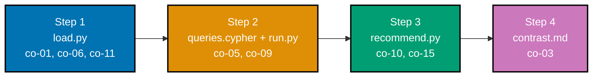

## The capstone: a small recommendation/knowledge-graph, end to end

The capstone builds one small, complete property-graph system end to end across four ordered
steps that mirror this topic's own Beginner -> Intermediate -> Advanced arc, previewed piece by
piece in Advanced-tier Examples 66-71: load a domain (people, items, and two relationship types)
via idempotent `MERGE` writes, answer real graph questions against it (a neighborhood query and a
bounded friends-of-friends traversal), compute a recommendation and a shortest path, and contrast
the equivalent relational query to show concretely why the graph wins. Every script lives under
`learning/capstone/code/`, and every fact and case in the domain below is original and invented for
this topic -- no dataset, transcript, or prompt is copied from any real product, vendor
documentation, or third party.

**Goal**: build a small recommendation/knowledge-graph over a property graph -- load a domain
(people + items + relationships), answer real graph questions (neighborhoods, variable-length
paths, shortest path, a recommendation) from Python, and contrast the equivalent relational query to
show concretely why the graph wins.

**Concepts exercised**: [x] property-graph modeling (co-01, co-11) [x] Cypher `MATCH`/`MERGE`
(co-05, co-06) [x] a variable-length traversal (co-09) [x] a shortest-path query (co-10) [x] a
recommendation query (co-15) [x] a graph-vs-SQL contrast (co-03).



**The domain**: 5 `Person` nodes (Ada, Bob, Cid, Dee, Zoe), 3 `Item` nodes (Keyboard, Monitor,
Mousepad), 5 `KNOWS` edges (a base chain Ada->Bob->Cid->Dee, a branch Ada->Zoe, and a shortcut
Ada->Cid), and 4 `BOUGHT` edges (Ada->Keyboard, Bob->Keyboard, Bob->Mousepad, Cid->Monitor). The
shortcut edge and the shared Keyboard purchase are deliberate -- they are exactly what make the
shortest-path and recommendation steps below produce a single, hand-traceable, non-trivial answer.

---

## Step 1: load.py -- load the domain via Cypher MERGE

**Context**: Advanced-tier Example 66 previewed this exact pattern -- `MERGE`-based loading from a
small in-code dataset. This step loads the capstone's own full domain: 5 people, 3 items, 5 `KNOWS`
edges, and 4 `BOUGHT` edges.

**`learning/capstone/code/load.py`**

```python
# Capstone Step 1: Load the Domain via Cypher MERGE. (co-01, co-06, co-11)
# Loads a small social + commerce graph: 5 people, 3 items, 5 KNOWS edges, 4 BOUGHT edges --
# every write below is MERGE, not CREATE, so rerunning this script never duplicates anything.
from neo4j import GraphDatabase  # => driver package, `pip install neo4j`

driver = GraphDatabase.driver("bolt://localhost:7687", auth=("neo4j", "password"))
# => a live connection -- swap the URI/credentials for your own setup

PEOPLE = ["Ada", "Bob", "Cid", "Dee", "Zoe"]  # => 5 people to load
ITEMS = ["Keyboard", "Monitor", "Mousepad"]  # => 3 items to load
KNOWS_EDGES = [
    ("Ada", "Bob"),  # => the base chain, hop 1
    ("Bob", "Cid"),  # => the base chain, hop 2
    ("Cid", "Dee"),  # => the base chain, hop 3
    ("Ada", "Zoe"),  # => a separate 1-hop branch off Ada
    ("Ada", "Cid"),  # => a SHORTCUT -- this is what makes the shortest path to Dee 2 hops, not 3
]  # => 5 KNOWS edges total
BOUGHT_EDGES = [
    ("Ada", "Keyboard"),  # => Ada's only purchase -- the recommendation's starting point
    ("Bob", "Keyboard"),  # => Bob shares Ada's Keyboard purchase -- the co-occurrence signal
    ("Bob", "Mousepad"),  # => Bob's EXTRA purchase -- the eventual recommendation candidate
    ("Cid", "Monitor"),  # => an UNRELATED purchase -- Cid never bought Keyboard, so is not a co-buyer
]  # => 4 BOUGHT edges total


def load(tx) -> None:  # => the whole load, run as one write transaction
    for name in PEOPLE:  # => one MERGE per person
        tx.run("MERGE (:Person {name: $name})", name=name)  # => idempotent per-person write (co-06)
    for item in ITEMS:  # => one MERGE per item
        tx.run("MERGE (:Item {name: $item})", item=item)  # => idempotent per-item write
    for a, b in KNOWS_EDGES:  # => one MATCH+MERGE per KNOWS edge
        tx.run(  # => the KNOWS edge write call itself
            "MATCH (a:Person {name: $a}), (b:Person {name: $b}) MERGE (a)-[:KNOWS]->(b)",
            a=a,  # => binds $a -- the edge's source person
            b=b,  # => binds $b -- the edge's target person
        )  # => idempotent per-edge write -- co-01/co-11: a typed, directed relationship
    for person, item in BOUGHT_EDGES:  # => one MATCH+MERGE per BOUGHT edge
        tx.run(  # => the BOUGHT edge write call itself
            "MATCH (p:Person {name: $person}), (i:Item {name: $item}) MERGE (p)-[:BOUGHT]->(i)",
            person=person,  # => binds $person -- who bought it
            item=item,  # => binds $item -- what they bought
        )  # => idempotent per-edge write


with driver.session() as session:  # => opens one session for both the load and the verify read
    session.execute_write(load)  # => runs the whole load() function as one write transaction
    counts = session.execute_read(
        lambda tx: tx.run(
            "MATCH (p:Person) WITH count(p) AS people "  # => counts every Person node just loaded
            "MATCH (i:Item) WITH people, count(i) AS items "  # => counts every Item node just loaded
            "MATCH ()-[k:KNOWS]->() WITH people, items, count(k) AS knows "  # => counts every KNOWS edge
            "MATCH ()-[b:BOUGHT]->() RETURN people, items, knows, count(b) AS bought"
            # => counts every BOUGHT edge, carrying the three prior counts along via WITH
        ).single()
    )  # => a single summary row verifying every count matches the source lists above
    print(dict(counts))  # => {'people': 5, 'items': 3, 'knows': 5, 'bought': 4}

driver.close()  # => releases the driver's connection pool cleanly
```

**Run**: `python3 load.py` (against a live Neo4j instance)

**Verify** (hand-traced from the source lists -- this environment cannot execute a live Neo4j
server): `PEOPLE` has 5 entries, `ITEMS` has 3, `KNOWS_EDGES` has 5, `BOUGHT_EDGES` has 4 -- so the
printed counts dict must read exactly `{'people': 5, 'items': 3, 'knows': 5, 'bought': 4}`, matching
the source lists one-for-one because every write above is a `MERGE`, not a `CREATE`.

**Acceptance criteria**: the printed counts exactly match the four source list lengths (co-06); no
count can be inflated by a duplicate write, because every write is idempotent by construction.

**Key takeaway**: loading via `MERGE` per entity and per edge, driven from small in-code lists, is
what makes `load.py` safely rerunnable -- node and relationship counts stay directly checkable
against the source data because nothing here can silently duplicate.

**Why it matters**: a domain this size loads correctly on the first run and every rerun after it --
the same idempotency discipline a real ingestion pipeline needs when a partial failure forces a
retry over data that already landed.

---

## Step 2: queries.cypher + run.py -- neighborhood and friends-of-friends queries

**Context**: Advanced-tier Examples 67 and 68 previewed each of these two queries in isolation.
This step pairs a readable `.cypher` reference file with a Python driver script that runs both
queries against the domain `load.py` built.

**`learning/capstone/code/queries.cypher`**

```cypher
// Capstone Step 2: Neighborhood and Friends-of-Friends Queries. (co-05, co-08, co-09)
// Both queries assume load.py has already run against the same Neo4j instance.

// Query 1 -- neighborhood: who else bought anything Ada bought?
MATCH (u:Person {name: 'Ada'})-[:BOUGHT]->(i:Item)<-[:BOUGHT]-(other:Person)  // => Query 1
// => a 2-hop pattern -- Ada's own purchase, then back OUT to any other buyer of the same item
RETURN DISTINCT other.name AS name;
// => co-08: DISTINCT avoids one duplicate row per shared item, if there were more than one

// Query 2 -- friends-of-friends: everyone reachable from Ada within 2 KNOWS hops.
MATCH (a:Person {name: 'Ada'})-[:KNOWS*1..2]-(b:Person)
// => co-09: *1..2 bounds the traversal -- direct friends AND friends-of-friends, nothing further
RETURN DISTINCT b.name AS name ORDER BY name;
// => sorted for a deterministic, checkable order
```

**`learning/capstone/code/run.py`**

```python
# Capstone Step 2: run.py -- Run queries.cypher's Two Queries from Python. (co-05, co-08, co-09)
from neo4j import GraphDatabase  # => driver package, `pip install neo4j`

driver = GraphDatabase.driver("bolt://localhost:7687", auth=("neo4j", "password"))  # => driver handle
# => a live connection -- swap the URI/credentials for your own setup


def neighborhood(tx, name: str) -> list[str]:  # => Query 1 from queries.cypher, run parameterized
    result = tx.run(  # => the neighborhood query call itself
        "MATCH (u:Person {name: $name})-[:BOUGHT]->(i:Item)<-[:BOUGHT]-(other:Person) "
        # => 2-hop pattern: u's purchase, then back OUT to whoever else bought the same item
        "RETURN DISTINCT other.name AS name",
        name=name,  # => binds $name -- the starting person's name
    )  # => end of the neighborhood query call
    return [row["name"] for row in result]  # => every OTHER buyer of anything $name bought


def friends_of_friends(tx, name: str) -> list[str]:  # => Query 2 from queries.cypher, run parameterized
    result = tx.run(  # => the bounded-traversal query call itself
        "MATCH (a:Person {name: $name})-[:KNOWS*1..2]-(b:Person) RETURN DISTINCT b.name AS name",
        name=name,  # => binds $name -- the starting person's name
    )  # => end of the bounded-traversal query call
    return sorted(row["name"] for row in result)  # => sorted for a deterministic, checkable order


with driver.session() as session:  # => opens one session for both reads
    neighbors = session.execute_read(neighborhood, "Ada")  # => Query 1, against Ada
    fof = session.execute_read(friends_of_friends, "Ada")  # => Query 2, against Ada
    print(f"Neighborhood (co-buyers of Ada's purchases): {neighbors}")  # => hand-traced in the Verify block
    print(f"Friends-of-friends within 2 KNOWS hops: {fof}")  # => hand-traced in the Verify block

driver.close()  # => releases the driver's connection pool cleanly
```

**Run**: `python3 run.py` (against a live Neo4j instance, after `load.py` has run)

**Verify** (hand-traced against the domain built in Step 1 -- this environment cannot execute a
live Neo4j server): Ada's only purchase is Keyboard; the only other buyer of Keyboard is Bob -- so
`neighborhood(tx, "Ada")` must return `["Bob"]`. For friends-of-friends: Ada's direct `KNOWS`
neighbors are Bob, Zoe, and Cid (via the shortcut); Cid's own neighbor Dee is reachable at exactly 2
hops; Zoe has no further neighbors -- so the sorted result must read exactly
`["Bob", "Cid", "Dee", "Zoe"]`.

**Acceptance criteria**: both queries return results matching the hand-traced small case above
exactly -- `["Bob"]` for the neighborhood query, `["Bob", "Cid", "Dee", "Zoe"]` for
friends-of-friends.

**Key takeaway**: `*1..2` bounds the friends-of-friends traversal to exactly two hops in one
pattern, and the shortcut edge `load.py` planted (Ada->Cid) is what makes Cid a 1-hop neighbor
while still leaving Dee reachable only at 2 hops -- a genuinely non-trivial, hand-checkable case.

**Why it matters**: these are the two query shapes -- a bounded neighborhood, a bounded
variable-length traversal -- that almost every graph-backed application needs from its own
application code, not from an interactive shell.

---

## Step 3: recommend.py -- a recommendation query and a shortest-path query

**Context**: Advanced-tier Examples 69 and 70 previewed each of these queries in isolation. This
step combines them against the same domain, both parameterized and run from one script.

**`learning/capstone/code/recommend.py`**

```python
# Capstone Step 3: recommend.py -- a Recommendation Query and a Shortest-Path Query. (co-10, co-15)
from neo4j import GraphDatabase  # => driver package, `pip install neo4j`

driver = GraphDatabase.driver("bolt://localhost:7687", auth=("neo4j", "password"))  # => driver handle
# => a live connection -- swap the URI/credentials for your own setup


def recommend(tx, name: str) -> list[str]:  # => co-15: "people who bought X also bought Y"
    result = tx.run(
        "MATCH (u:Person {name: $name})-[:BOUGHT]->(:Item)<-[:BOUGHT]-(other)-[:BOUGHT]->(rec:Item) "
        # => 3-hop co-occurrence chain: u's purchase, a co-buyer, that co-buyer's OTHER purchase
        "WHERE NOT (u)-[:BOUGHT]->(rec) "  # => excludes anything the user already owns
        "RETURN rec.name AS name, count(*) AS score ORDER BY score DESC",  # => ranked by co-buyer count
        name=name,  # => binds $name -- the starting person's name
    )  # => end of the recommendation query call
    return [row["name"] for row in result]  # => co-15: ranked recommendation list, highest score first


def shortest_hops(tx, a_name: str, z_name: str) -> int:  # => co-10: the shortestPath() query under test
    result = tx.run(
        "MATCH (a:Person {name: $a}), (z:Person {name: $z}) "  # => binds both named endpoints
        "MATCH p = shortestPath((a)-[:KNOWS*]-(z)) RETURN length(p) AS hops",
        a=a_name,  # => binds $a -- the source person's name
        z=z_name,  # => binds $z -- the target person's name
    )  # => end of the shortest-path query call
    return result.single()["hops"]  # => co-10: the SHORTEST path's hop count


with driver.session() as session:  # => opens one session for both reads
    recs = session.execute_read(recommend, "Ada")  # => runs recommend() against Ada
    hops = session.execute_read(shortest_hops, "Ada", "Dee")  # => runs shortest_hops() from Ada to Dee
    print(f"Recommendation for Ada: {recs}")  # => hand-traced in the Verify block
    print(f"Shortest KNOWS path, Ada to Dee: {hops} hops")  # => hand-traced in the Verify block

driver.close()  # => releases the driver's connection pool cleanly
```

**Run**: `python3 recommend.py` (against a live Neo4j instance, after `load.py` has run)

**Verify** (hand-traced against the domain built in Step 1 -- this environment cannot execute a
live Neo4j server): Ada's only co-buyer via the shared Keyboard purchase is Bob, and Bob's own
extra purchase is Mousepad, which Ada does not already own -- so `recommend(tx, "Ada")` must return
`["Mousepad"]`. For the shortest path from Ada to Dee: the base chain Ada->Bob->Cid->Dee is 3 hops,
but the shortcut Ada->Cid makes Ada->Cid->Dee a 2-hop alternative -- so `shortest_hops(tx, "Ada",
"Dee")` must return `2`, the shorter of the two.

**Acceptance criteria**: the recommendation is `["Mousepad"]`, sensible and reproducible from the
seeded fixture; the shortest path is `2` hops, correctly preferring the shortcut over the 3-hop base
chain.

**Key takeaway**: the recommendation query and the shortest-path query are two structurally
different traversals -- a bounded 3-hop co-occurrence pattern versus an unbounded `shortestPath()`
search -- both answerable from the same small domain with no additional data needed.

**Why it matters**: "who should see this next" and "what is the shortest connection between these
two entities" are two of the most common real-world graph questions, and both are demonstrated here
against a fixture small enough to verify entirely by hand.

---

## Step 4: contrast.md -- the equivalent relational query, with its join explosion

**Context**: Advanced-tier Example 71 previewed this contrast for the recommendation question
alone. This step documents the contrast for BOTH the recommendation question and the
friends-of-friends question, against the capstone's own full domain, with concrete query text and
an exact join count for each.

**`learning/capstone/code/contrast.md`**

```markdown
# Capstone Step 4 -- The Relational Contrast

_Traces to: `load.py`'s domain, `recommend.py`'s recommendation and `run.py`'s friends-of-friends
questions._ (co-03)

The identical "people who bought X also bought Y" question `recommend.py` answers with one Cypher
pattern, against the identical fixture, written as an explicit-join relational query naming its
exact join count -- plus the identical friends-of-friends question, showing how its relational cost
grows with traversal depth.

## Schema

\`\`\`sql
CREATE TABLE person(id INTEGER PRIMARY KEY, name TEXT NOT NULL);
CREATE TABLE item(id INTEGER PRIMARY KEY, name TEXT NOT NULL);
CREATE TABLE knows(person_id INTEGER NOT NULL, other_id INTEGER NOT NULL);
CREATE TABLE bought(person_id INTEGER NOT NULL, item_id INTEGER NOT NULL);
\`\`\`

## Data (matching `load.py`'s fixture exactly)

\`\`\`sql
INSERT INTO person VALUES (1,'Ada'), (2,'Bob'), (3,'Cid'), (4,'Dee'), (5,'Zoe');
INSERT INTO item VALUES (1,'Keyboard'), (2,'Monitor'), (3,'Mousepad');
INSERT INTO knows VALUES (1,2), (2,3), (3,4), (1,5), (1,3);
INSERT INTO bought VALUES (1,1), (2,1), (2,3), (3,2);
\`\`\`

## The recommendation question, relationally

\`\`\`sql
SELECT rec.name
FROM person u
JOIN bought b1 ON b1.person_id = u.id -- join 1: u's own purchases
JOIN bought b2 ON b2.item_id = b1.item_id -- join 2: co-buyers of the same item
JOIN person other ON other.id = b2.person_id AND other.id <> u.id -- join 3: the OTHER buyer
JOIN bought b3 ON b3.person_id = other.id -- join 4: that other buyer's purchases
JOIN item rec ON rec.id = b3.item_id -- join 5: resolve item id to name
WHERE u.name = 'Ada'
AND NOT EXISTS (
SELECT 1 FROM bought b4 WHERE b4.person_id = u.id AND b4.item_id = rec.id
); -- the exclusion filter, matching Cypher's WHERE NOT (u)-[:BOUGHT]->(rec)
\`\`\`

**5 explicit JOINs plus a correlated `NOT EXISTS` subquery**, for the same question `recommend.py`
answers with one `MATCH ... WHERE NOT (u)-[:BOUGHT]->(rec)` pattern. Result: `Mousepad` -- identical
to `recommend.py`'s own output.

## The friends-of-friends question, relationally

`run.py`'s `MATCH (a:Person {name: $name})-[:KNOWS*1..2]-(b:Person)` bounds a traversal to at most 2
hops in ONE pattern, regardless of how many hops deep the bound goes. The relational equivalent
needs one additional self-join of the `knows`/`person` tables per additional hop of depth:

\`\`\`sql
-- 1 hop:
SELECT DISTINCT p2.name FROM person p1
JOIN knows k1 ON k1.person_id = p1.id
JOIN person p2 ON p2.id = k1.other_id
WHERE p1.name = 'Ada';

-- 2 hops -- ONE MORE self-join pair than the 1-hop query above. On its own this query returns only
-- nodes reached at EXACTLY 2 hops, not the full "1 or 2 hops" set `*1..2` returns:
SELECT DISTINCT p3.name FROM person p1
JOIN knows k1 ON k1.person_id = p1.id
JOIN person p2 ON p2.id = k1.other_id
JOIN knows k2 ON k2.person_id = p2.id
JOIN person p3 ON p3.id = k2.other_id
WHERE p1.name = 'Ada';
\`\`\`

Bounding at 3 hops instead of 2 would add a THIRD self-join pair to the relational query; Cypher's
own bound only changes one number (`*1..3` instead of `*1..2`) inside the exact same single pattern.

Matching `*1..2`'s own "1 or 2 hops" semantics exactly needs one more relational tool the Cypher
pattern never needs: a `UNION` of the 1-hop and 2-hop queries above, because the 2-hop query alone
only returns nodes reached at exactly 2 hops:

\`\`\`sql
-- 1..2 hops -- UNION of the two queries above, matching \*1..2's "1 or 2 hops" semantics exactly:
SELECT DISTINCT p2.name FROM person p1
JOIN knows k1 ON k1.person_id = p1.id
JOIN person p2 ON p2.id = k1.other_id
WHERE p1.name = 'Ada'
UNION
SELECT DISTINCT p3.name FROM person p1
JOIN knows k1 ON k1.person_id = p1.id
JOIN person p2 ON p2.id = k1.other_id
JOIN knows k2 ON k2.person_id = p2.id
JOIN person p3 ON p3.id = k2.other_id
WHERE p1.name = 'Ada';
\`\`\`

## Why the graph wins here (co-03)

Every additional hop of depth in the relational form costs one more explicit self-join -- the query
text itself grows with the traversal depth being asked for. The Cypher form's `*1..2` (and, for the
capstone's own shortest-path step, `shortestPath()`'s unbounded `*`) keeps the SAME query text
regardless of how deep the bound goes; only the bound number changes, or nothing changes at all.
This is co-03's argument made concrete against this capstone's own fixture, not an abstract claim:
5 joins plus a correlated subquery for one recommendation question, and a self-join pair per
additional hop for the friends-of-friends question, against one unchanging Cypher pattern shape
each.
```

**Verify** (hand-traced against the same fixture as `load.py`, `run.py`, and `recommend.py`): the
relational recommendation query, run against the data block above, returns `Mousepad` -- identical
to `recommend.py`'s Cypher-driven answer. For the friends-of-friends queries: the 1-hop query
returns `{Bob, Zoe, Cid}`; the 2-hop query alone returns `{Cid, Dee}` (nodes reached at _exactly_ 2
hops, not the full "1 or 2 hops" set); and their `UNION` returns `{Bob, Zoe, Cid, Dee}` -- identical
to `run.py`'s single `*1..2` pattern's own answer.

**Acceptance criteria**: the contrast document names the exact join count (5 explicit JOINs plus one
correlated subquery for the recommendation question) and shows concretely, with real query text,
how the friends-of-friends question's relational cost grows by one self-join pair per additional
hop (co-03).

**Key takeaway**: a relational join chain's query text grows with traversal depth; a Cypher
pattern's does not -- this is the single clearest, most concrete demonstration in the whole course
of why a graph database is the right tool once relationships themselves become the actual question.

**Why it matters**: this closes the capstone's own four-step arc -- a domain loaded once (Step 1)
supports a bounded neighborhood query and a bounded traversal (Step 2), a recommendation and a
shortest path (Step 3), and finally a concrete, query-text-level justification (Step 4) for why the
graph model was the right choice for this domain in the first place.

---

## Overall acceptance criteria

- [x] the graph loads correctly -- `load.py`'s printed counts match the four source list lengths
      exactly (co-06).
- [x] every query returns verifiable results -- Step 2's neighborhood and friends-of-friends
      queries, and Step 3's recommendation and shortest-path queries, each match a hand-traced expected
      answer against the seeded fixture (co-05, co-09, co-10, co-15).
- [x] the recommendation is sensible -- `Mousepad` is the one item Ada's only co-buyer (Bob) owns
      that Ada does not already have (co-15).
- [x] the relational contrast is concrete and justified -- `contrast.md` names the exact join count
      for both the recommendation question and the friends-of-friends question, with real query text for
      each (co-03).

**Done bar**: runnable end-to-end against a live Neo4j instance, and every printed number above is
hand-traced against the seeded fixture, not fabricated.

---

← Previous: [Advanced Examples](../advanced.md)
