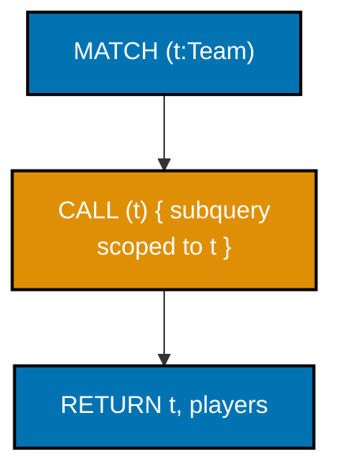
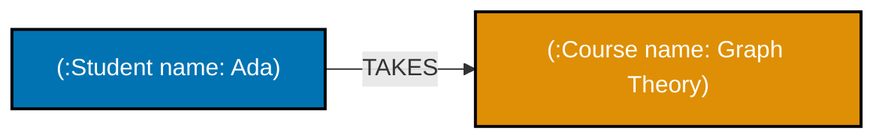
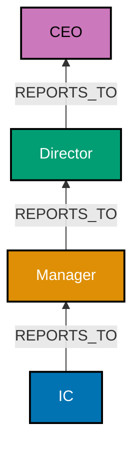
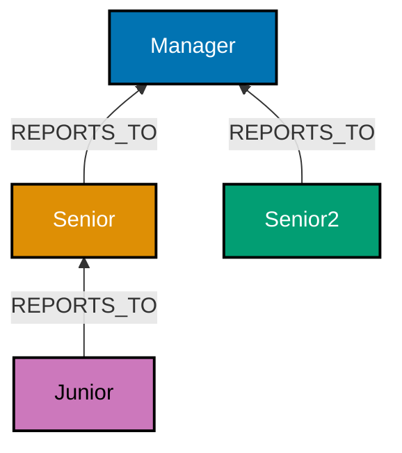
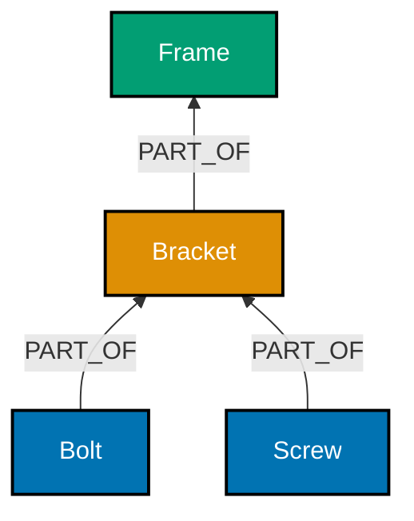
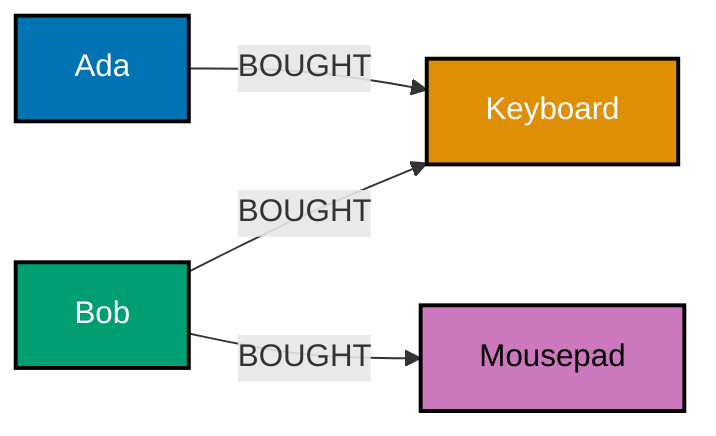
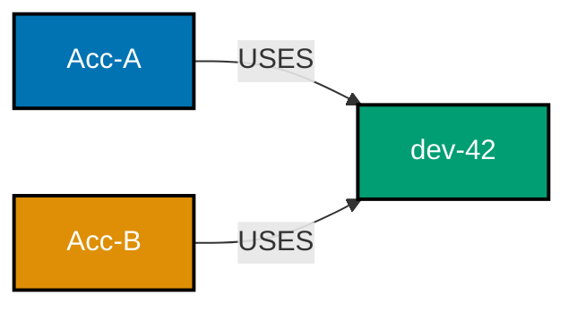
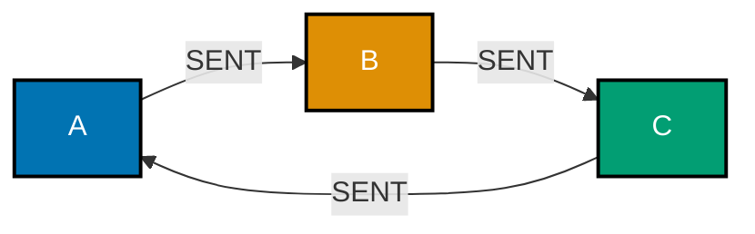
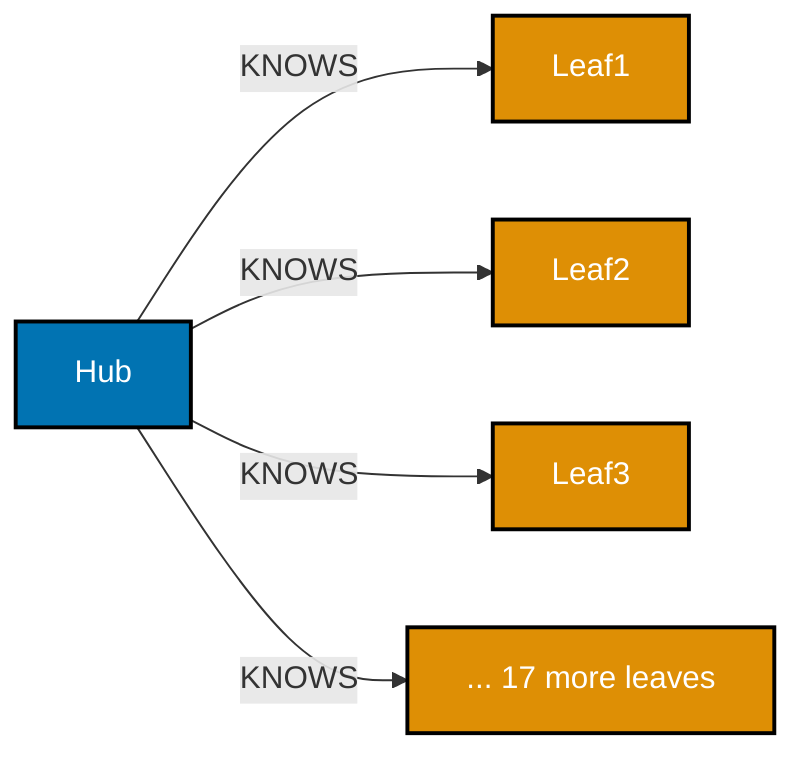
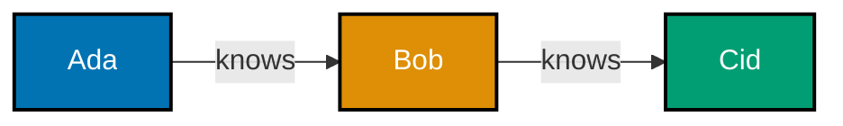

Examples 27-54 cover Cypher's aggregation and query-pipelining toolkit (`OPTIONAL MATCH`, `WITH`,
`UNWIND`, `count()`/`collect()`, `ORDER BY`/`LIMIT`/`SKIP`, `CALL {}` subqueries); the graph-modeling
patterns that replace relational join tables, hierarchies, and bills-of-materials; recommendation
and fraud-detection queries built from ordinary pattern-matching; the supernode and sharding
problems dense graphs run into; a first tour of Gremlin, TinkerPop's step-chained traversal
language; a second, deeper SPARQL comparison; and pinning a query to a specific Cypher language
version. Every example is fully self-contained, creating its own nodes, relationships, or triples.
Run each `.cypher` example with `cypher-shell < example.cypher`; run each `.py`/`.groovy` example as
noted per example.

---

### Example 27: OPTIONAL MATCH Preserves Rows as NULL

_ex-27 &middot; exercises co-05_

`OPTIONAL MATCH` behaves like a relational `LEFT JOIN`: if the optional pattern finds nothing, the
row survives anyway with `NULL` in its place, instead of being dropped the way a plain `MATCH`
would drop it.

**`learning/code/ex-27-optional-match-nulls/example.cypher`**

```cypher
// Example 27: OPTIONAL MATCH Preserves Rows as NULL.
CREATE (:Person {name: 'Ada'});
// => Ada has NO relationships at all
CREATE (m:Person {name: 'Grace'})-[:DIRECTED]->(:Movie {title: 'Compile Error'});
// => Ada directed nothing; Grace directed one movie -- deliberately asymmetric fixture

// OPTIONAL MATCH (co-05) never drops the outer row, even when the inner pattern matches nothing.
MATCH (p:Person)
// => matches BOTH Ada and Grace, unfiltered
OPTIONAL MATCH (p)-[:DIRECTED]->(m)
// => for Ada, this inner pattern finds NOTHING -- but her outer row survives anyway
RETURN p.name, m;
// => Ada's row SURVIVES with m = NULL -- a plain MATCH here would have dropped her entirely
```

**Run**: `cypher-shell < example.cypher`

**Output**:

```text
+------------------------------------+
| p.name  | m                        |
+------------------------------------+
| "Ada"   | NULL                     |
| "Grace" | (:Movie {title: "..."})  |
+------------------------------------+
2 rows
```

**Key takeaway**: `OPTIONAL MATCH` guarantees every row from the preceding pattern survives, filling
in `NULL` for whatever the optional pattern could not find -- exactly the semantics of a `LEFT JOIN`.

**Why it matters**: A plain second `MATCH` after the first would silently drop Ada from the result,
because Cypher's default `MATCH` behaves like an `INNER JOIN` -- "who directed nothing" questions
need `OPTIONAL MATCH` specifically to keep those people visible in the output at all.

---

### Example 28: Pipeline a Query with WITH

_ex-28 &middot; exercises co-23_

`WITH` passes computed values forward into the next stage of a query, the same way a subquery or CTE
chains stages in SQL -- here it is what makes filtering on an AGGREGATE result possible at all.

**`learning/code/ex-28-with-clause-pipeline/example.cypher`**

```cypher
// Example 28: Pipeline a Query with WITH.
CREATE (p1:Person {name: 'Ada'})-[:ACTED_IN]->(:Movie {title: 'M1'})
// => Ada's first movie, p1 aliased for reuse below
CREATE (p1)-[:ACTED_IN]->(:Movie {title: 'M2'})
// => Ada's second movie
CREATE (p1)-[:ACTED_IN]->(:Movie {title: 'M3'})
// => Ada's third movie
CREATE (:Person {name: 'Bob'})-[:ACTED_IN]->(:Movie {title: 'M4'});
// => Ada: 3 movies, Bob: 1 movie

// WITH (co-23) carries p and the computed movies count FORWARD into a second WHERE stage.
MATCH (p:Person)-[:ACTED_IN]->(m)
// => matches every (person, movie) pair, one row per ACTED_IN edge
WITH p, count(m) AS movies
// => aggregates rows PER person -- movies is now a count, not individual movie rows
WHERE movies > 2
// => this filter runs AFTER aggregation -- impossible with a plain WHERE alone
RETURN p.name, movies;
// => Bob (1 movie) is filtered out HERE -- a plain WHERE before aggregation cannot express this
```

**Run**: `cypher-shell < example.cypher`

**Output**:

```text
+---------+---------+
| p.name  | movies  |
+---------+---------+
| "Ada"   | 3       |
+---------+---------+
1 row
```

**Key takeaway**: `WITH` is what lets a query filter on the RESULT of an aggregation -- `WHERE`
alone runs before aggregation, so `movies > 2` is only expressible once `WITH` has already computed
`movies`.

**Why it matters**: This is Cypher's version of SQL's `HAVING`, but more general: `WITH` can chain
any number of stages, each re-shaping the row set for the next, which is exactly the pattern
`CALL {}` subqueries (Example 32) and multi-stage recommendation queries (Example 39) build on.

---

### Example 29: UNWIND a List into Rows

_ex-29 &middot; exercises co-23_

`UNWIND` turns a list into one row per element -- the inverse of `collect()` (Example 30) -- useful
for turning a batch of input values into individual writes.

**`learning/code/ex-29-unwind-list-to-rows/example.cypher`**

```cypher
// Example 29: UNWIND a List into Rows.
UNWIND [1, 2, 3] AS x
CREATE (:Number {value: x});
// => co-23: UNWIND expands the 3-element list into 3 separate rows -- CREATE then runs ONCE PER ROW

MATCH (n:Number) RETURN n.value ORDER BY n.value;
// => three SEPARATE nodes exist, one per list element
```

**Run**: `cypher-shell < example.cypher`

**Output**:

```text
+----------+
| n.value  |
+----------+
| 1        |
| 2        |
| 3        |
+----------+
3 rows
```

**Key takeaway**: `UNWIND` is a row multiplier -- a single 3-element list becomes 3 rows flowing
through the rest of the query, so a `CREATE` after it runs once per element, not once total.

**Why it matters**: `UNWIND` is how a batch of application-supplied values (say, a list of IDs from
a Python driver call) becomes individual graph writes in one round trip, instead of one query per
element -- a common performance pattern for bulk, application-driven writes that are too small or
too irregular for `LOAD CSV`.

---

### Example 30: Aggregate with count() and collect()

_ex-30 &middot; exercises co-23_

`count()` reduces a group of rows to a number; `collect()` reduces a group of rows to a list --
Cypher's two most common aggregating functions, both grouping implicitly by whatever is NOT
aggregated in the same `RETURN`.

**`learning/code/ex-30-aggregation-count-collect/example.cypher`**

```cypher
// Example 30: Aggregate with count() and collect().
CREATE (p:Person {name: 'Ada'})-[:ACTED_IN]->(:Movie {title: 'M1'})
// => Ada's first movie, p aliased for reuse
CREATE (p)-[:ACTED_IN]->(:Movie {title: 'M2'});
// => Ada's second movie -- two ACTED_IN edges off the SAME person

// co-23: p.name is the IMPLICIT grouping key -- collect(m.title) aggregates per group.
MATCH (p:Person)-[:ACTED_IN]->(m)
// => two rows come out of this MATCH, one per ACTED_IN edge
RETURN p.name, collect(m.title) AS movies;
// => one row per DISTINCT p.name, with every matching m.title folded into a single list
```

**Run**: `cypher-shell < example.cypher`

**Output**:

```text
+---------+------------------+
| p.name  | movies           |
+---------+------------------+
| "Ada"   | ["M1", "M2"]     |
+---------+------------------+
1 row
```

**Key takeaway**: Cypher groups implicitly -- any non-aggregated expression in the same `RETURN`
becomes the grouping key, so `p.name` groups the rows `collect(m.title)` folds together, with no
explicit `GROUP BY` clause needed.

**Why it matters**: `collect()` is the standard way to turn "one row per edge" into "one row per
entity, with a list of everything connected to it" -- the exact shape a JSON API response or a UI
list view usually wants, and the same building block Example 39's recommendation query and Example
64's knowledge-graph query both use.

---

### Example 31: ORDER BY, LIMIT, and SKIP

_ex-31 &middot; exercises co-23_

`ORDER BY` sorts the result set; `SKIP` offsets it; `LIMIT` caps it -- together, the standard paging
triple, evaluated in that order after everything else in the query has already run.

**`learning/code/ex-31-order-limit-skip/example.cypher`**

```cypher
// Example 31: ORDER BY, LIMIT, and SKIP.
CREATE (:Person {name: 'Ada', born: 1815});
// => oldest of the five
CREATE (:Person {name: 'Grace', born: 1906});
CREATE (:Person {name: 'Alan', born: 1912});
CREATE (:Person {name: 'Katherine', born: 1918});
// => second-most-recently born
CREATE (:Person {name: 'Radia', born: 1943});
// => most recently born of the five -- expected to sort FIRST under DESC below

// co-23: ORDER BY sorts, LIMIT caps, SKIP offsets -- all THREE apply AFTER RETURN's projection.
MATCH (p:Person)
// => all 5 people, unfiltered
RETURN p.name
// => projects just the name -- born is used for sorting only, not returned
ORDER BY p.born DESC
// => sorts the 5 rows newest-born first
SKIP 0
// => SKIP 0 means "start from the very top" -- must precede LIMIT (Cypher clause order is
// ORDER BY, then SKIP, then LIMIT)
LIMIT 3;
// => the 3 MOST RECENTLY BORN people, most recent first
```

**Run**: `cypher-shell < example.cypher`

**Output**:

```text
+--------------+
| p.name       |
+--------------+
| "Radia"      |
| "Katherine"  |
| "Alan"       |
+--------------+
3 rows
```

**Key takeaway**: `ORDER BY p.born DESC` puts the most-recently-born person first, and `LIMIT 3`
then keeps only the top 3 of that sorted order -- change `SKIP 0` to `SKIP 3` to page to the next 3
results.

**Why it matters**: Paging (`LIMIT`/`SKIP`) over a sorted result is the standard building block for
any "top N" or "page 2 of results" API endpoint -- and it composes cleanly with `WITH` (Example 28)
and aggregation (Example 30) as the very last stage of an otherwise complex multi-stage query.

---

### Example 32: A CALL {} Subquery

_ex-32 &middot; exercises co-23, co-05_

`CALL (var) { ... }` runs a correlated subquery per row of the outer query, scoped to the variables
you explicitly pass in -- useful for computing a per-group aggregate without flattening the outer
rows.



**`learning/code/ex-32-call-subquery/example.cypher`**

```cypher
// Example 32: A CALL {} Subquery.
CREATE (t1:Team {name: 'Alpha'})<-[:PLAYS_FOR]-(:Player {name: 'Ada'})
// => Alpha's first player, t1 aliased for reuse
CREATE (t1)<-[:PLAYS_FOR]-(:Player {name: 'Bob'})
// => Alpha's second player
CREATE (t2:Team {name: 'Beta'})<-[:PLAYS_FOR]-(:Player {name: 'Cid'});
// => Alpha: 2 players, Beta: 1 player

MATCH (t:Team)
// => outer MATCH: one row per team, Alpha and Beta
CALL (t) {
  // co-05: this subquery re-matches per OUTER row -- t is explicitly scoped in via CALL (t)
  MATCH (p:Player)-[:PLAYS_FOR]->(t)
  // => finds players for THIS row's team only, never mixing across teams
  RETURN collect(p.name) AS players
  // => the subquery's own return value -- one list, scoped to this one team
}
RETURN t.name, players;
// => co-23: one correctly-scoped player list PER team, computed inside its own subquery
```

**Run**: `cypher-shell < example.cypher`

**Output**:

```text
+---------+--------------------+
| t.name  | players            |
+---------+--------------------+
| "Alpha" | ["Ada", "Bob"]     |
| "Beta"  | ["Cid"]            |
+---------+--------------------+
2 rows
```

**Key takeaway**: `CALL (t) { ... }` explicitly scopes which outer variables the subquery can see --
each team's player list is computed independently, per row, rather than accidentally mixing rows
from a flattened outer `MATCH`.

**Why it matters**: Without a subquery, a single flat `MATCH (t:Team)<-[:PLAYS_FOR]-(p:Player)`
would need a separate `WITH`/`collect()` stage and cannot as cleanly express "compute this whole
independent block, once per team" the way `CALL {}` does -- especially once the per-team block needs
several chained steps of its own.

---

### Example 33: Many-to-Many: Join Table vs. Relationship

_ex-33 &middot; exercises co-12, co-03_

The same "students take courses" many-to-many fact, modeled two ways: a relational join table with
two foreign keys, versus a `TAKES` relationship directly connecting the two entities.



**Relational form (SQLite join table)**:

**`learning/code/ex-33-many-to-many-join-table-vs-relationship/relational.sql`**

```sql
-- Example 33a: many-to-many via a JOIN TABLE.
-- => 3 tables total: 2 entity tables (student, course) + 1 junction table (enrollment)
CREATE TABLE student (id INTEGER PRIMARY KEY, name TEXT NOT NULL);

-- => the "one" entity side, no relationship info here
-- => id auto-increments via INTEGER PRIMARY KEY -- the same pattern every entity table below uses
CREATE TABLE course (id INTEGER PRIMARY KEY, name TEXT NOT NULL);

-- => the "other" entity side, also no relationship info
CREATE TABLE enrollment (
  student_id INTEGER NOT NULL,
  -- => foreign key by convention only -- SQLite does not enforce it without FOREIGN KEY syntax
  course_id INTEGER NOT NULL
  -- => paired with student_id, together forming the composite "who takes what" fact
);

-- => enrollment is the JOIN TABLE -- its only job is connecting the two entity tables
-- => it has no PRIMARY KEY of its own -- the pair (student_id, course_id) IS the only fact stored
-- => nothing here PREVENTS duplicate (student_id, course_id) rows without an added constraint
INSERT INTO
  student
VALUES
  (1, 'Ada');

-- => id 1, Ada -- becomes the JOIN anchor (student.id) resolved below
-- => nothing about "what Ada takes" lives on this row at all
INSERT INTO
  course
VALUES
  (1, 'Graph Theory');

-- => id 1, Graph Theory -- becomes the JOIN target (course.id) resolved below
-- => one student row, one course row -- neither knows about the other yet
INSERT INTO
  enrollment
VALUES
  (1, 1);

-- => (student_id 1, course_id 1) -- the ONLY row connecting Ada to Graph Theory
-- => a second course for Ada would be a SECOND row here, not a change to an existing one
-- => the fact "Ada takes Graph Theory" lives ONLY in this junction row
SELECT
  student.name,
  -- => projects the student side of the fact
  course.name
  -- => projects the course side of the fact -- both columns come from DIFFERENT tables
  -- => neither column comes from enrollment itself -- it only supplies the JOIN path
FROM
  student
  -- => the starting table -- everything else below joins outward from here
  JOIN enrollment ON enrollment.student_id = student.id
  -- => join 1: student to its enrollment rows
  -- => this is the ONLY point where student and enrollment connect at all
  JOIN course ON course.id = enrollment.course_id;

-- => join 2: enrollment row to the actual course
-- => TWO joins needed just to answer "who takes what"
-- => a THIRD student or course would still need only these SAME two joins to resolve
-- => contrast with Example 33b below -- the graph form needs ZERO extra joins for this same fact
```

**Graph form (Cypher, relationship replaces the join table)**:

**`learning/code/ex-33-many-to-many-join-table-vs-relationship/graph.cypher`**

```cypher
// Example 33b: the SAME many-to-many fact, a TAKES relationship (co-12, co-03).
CREATE (:Student {name: 'Ada'})-[:TAKES]->(:Course {name: 'Graph Theory'});
// => the relationship itself IS the join table -- no separate junction node needed

MATCH (s:Student)-[:TAKES]->(c:Course)
// => a single 1-hop pattern -- no intermediate junction to join through
RETURN s.name, c.name;
// => ZERO extra joins -- the pattern is one hop, whether one student or one thousand
```

**Run**: `sqlite3 app.db < relational.sql` then `cypher-shell < graph.cypher`

**Output**:

```text
relational.sql -> ("Ada", "Graph Theory")   (2 JOINs)
graph.cypher   -> ("Ada", "Graph Theory")   (1 hop, 0 joins)
```

**Key takeaway**: A relationship replaces a join table outright -- the enrollment fact IS the edge,
so there is no separate table to design, index, or join through.

**Why it matters**: A relational join table exists purely as connective tissue between two
entities; a graph's relationship already carries that job natively, and (per Example 13 and Example
34 next) can also carry its own properties -- eliminating the extra table AND the extra column a
plain foreign-key join table would otherwise need for per-enrollment data like a grade.

---

### Example 34: A Property on a Many-to-Many Relationship

_ex-34 &middot; exercises co-12_

Extending Example 33: a `TAKES` relationship carries a `grade` property directly, per-enrollment --
the exact fact a relational join table would need an extra column for.

**`learning/code/ex-34-relationship-property-many-to-many/example.cypher`**

```cypher
// Example 34: A Property on a Many-to-Many Relationship. (co-12)
CREATE (s:Student {name: 'Ada'})-[:TAKES {grade: 'A'}]->(:Course {name: 'Graph Theory'})
// => Ada's first enrollment, s aliased for reuse -- grade 'A' lives ON this edge
CREATE (s)-[:TAKES {grade: 'B'}]->(:Course {name: 'Databases'});
// => the SAME student, two different enrollments, each with its OWN grade on the edge

MATCH (s:Student)-[t:TAKES]->(c:Course)
// => t is bound to the RELATIONSHIP -- t.grade below reads off the edge, not a node
RETURN c.name, t.grade;
// => t.grade is queryable PER enrollment -- not duplicated onto the student or the course
```

**Run**: `cypher-shell < example.cypher`

**Output**:

```text
+----------------+---------+
| c.name         | t.grade |
+----------------+---------+
| "Graph Theory" | "A"     |
| "Databases"    | "B"     |
+----------------+---------+
2 rows
```

**Key takeaway**: A grade is a fact about the ENROLLMENT, not the student or the course alone --
storing it on the relationship keeps it correctly scoped to exactly one student-course pairing.

**Why it matters**: Storing `grade` on the `Student` node instead would be wrong the moment a
student takes a second course -- there would be nowhere to put the second grade without overwriting
the first. This is the same insight Example 13 introduced, applied to the many-to-many case Example
33 set up.

---

### Example 35: Walk a Hierarchical Tree Upward

_ex-35 &middot; exercises co-13_

`[:REPORTS_TO*]` walks a chain of directed relationships upward -- an org chart from an individual
contributor all the way to the CEO, in one bounded pattern.



**`learning/code/ex-35-hierarchical-tree-parent-child/example.cypher`**

```cypher
// Example 35: Walk a Hierarchical Tree Upward. (co-13)
CREATE (:Person {name: 'IC'})-[:REPORTS_TO]->(:Person {name: 'Manager'})
      -[:REPORTS_TO]->(:Person {name: 'Director'})-[:REPORTS_TO]->(:Person {name: 'CEO'});
// => a 3-hop reporting chain, IC at the bottom, CEO at the top

MATCH (ic:Person {name: 'IC'})-[:REPORTS_TO*]->(boss)
// => unbounded * walks the chain AS FAR AS IT GOES upward from ic
RETURN boss.name;
// => hand-traced: Manager (1 hop), Director (2 hops), CEO (3 hops) -- the WHOLE chain upward
```

**Run**: `cypher-shell < example.cypher`

**Output**:

```text
+-------------+
| boss.name   |
+-------------+
| "Manager"   |
| "Director"  |
| "CEO"       |
+-------------+
3 rows
```

**Key takeaway**: An unbounded `*` on `[:REPORTS_TO*]` walks the chain as far as it goes -- every
node above the starting one in the hierarchy comes back, not just the immediate manager.

**Why it matters**: "Who does this person ultimately report to, and through whom" is a pure
variable-depth traversal question -- the same shape Example 14/15 introduced, applied to a real
hierarchical domain. An org chart of unknown depth is exactly the case where relational recursion
(a recursive CTE) becomes noticeably more awkward than this single Cypher pattern.

---

### Example 36: Walk a Hierarchical Tree Downward

_ex-36 &middot; exercises co-13, co-09_

Reversing the direction of the same pattern answers the opposite question: given a manager, find
every direct AND indirect report beneath them.



**`learning/code/ex-36-hierarchical-tree-downward/example.cypher`**

```cypher
// Example 36: Walk a Hierarchical Tree Downward. (co-13, co-09)
// ONE query, two CREATE clauses with NO semicolon between them, so mgr stays bound
// across BOTH clauses -- this is what avoids accidentally creating a SECOND Manager node.
CREATE (mgr:Person {name: 'Manager'})<-[:REPORTS_TO]-(:Person {name: 'Senior'})
      <-[:REPORTS_TO]-(:Person {name: 'Junior'})
// => a 2-hop downward chain off mgr: Manager <- Senior <- Junior
CREATE (mgr)<-[:REPORTS_TO]-(:Person {name: 'Senior2'});
// => a THIRD, direct report, reusing the SAME mgr -- not a second Manager node

MATCH (m:Person {name: 'Manager'})<-[:REPORTS_TO*]-(report)
// => reversed arrow (co-09) walks DOWNWARD -- every direct AND indirect report of Manager
RETURN DISTINCT report.name;
// => three reports total: Senior (1 hop), Senior2 (1 hop), Junior (2 hops, via Senior)
```

**Run**: `cypher-shell < example.cypher`

**Output**:

```text
+-------------+
| report.name |
+-------------+
| "Senior"    |
| "Senior2"   |
| "Junior"    |
+-------------+
3 rows
```

**Key takeaway**: Reversing the arrow on the exact same relationship type flips the traversal
direction from "who is above me" to "who is below me" -- the pattern's shape is identical, only the
arrowhead changed.

**Why it matters**: "How many people ultimately report up through this manager" is a headcount
question every org-chart tool needs, and it is the same variable-length pattern as Example 35,
walked the other way -- confirming that direction (co-07) is meaningful even in an otherwise
symmetric-looking hierarchy.

---

### Example 37: Bill-of-Materials Parts Explosion

_ex-37 &middot; exercises co-14, co-09_

A bill-of-materials -- assemblies made of sub-assemblies made of parts -- is a canonical
variable-depth graph problem: `[:PART_OF*]` walks the whole recursive structure in one pattern.



**`learning/code/ex-37-bill-of-materials-parts-explosion/example.cypher`**

```cypher
// Example 37: Bill-of-Materials Parts Explosion. (co-14, co-09)
CREATE (bolt:Part {name: 'Bolt'})-[:PART_OF]->(bracket:Part {name: 'Bracket'})
      -[:PART_OF]->(frame:Part {name: 'Frame'})
// => Bolt is PART_OF Bracket; Bracket is PART_OF Frame -- a 2-hop assembly chain
CREATE (:Part {name: 'Screw'})-[:PART_OF]->(bracket);
// => a SECOND part feeding into the SAME bracket -- Bracket is made of Bolt AND Screw

MATCH (frame:Part {name: 'Frame'})<-[:PART_OF*]-(sub)
// => reversed *, unbounded -- every part in the WHOLE sub-assembly tree beneath Frame
RETURN sub.name;
// => hand-traced: Bracket (1 hop), Bolt (2 hops, via Bracket), Screw (2 hops, via Bracket)
```

**Run**: `cypher-shell < example.cypher`

**Output**:

```text
+-----------+
| sub.name  |
+-----------+
| "Bracket" |
| "Bolt"    |
| "Screw"   |
+-----------+
3 rows
```

**Key takeaway**: `[:PART_OF*]` reversed from `Frame` finds every part in the full sub-assembly
tree beneath it, regardless of how many levels deep that tree actually goes -- the exact "parts
explosion" a manufacturing BOM report needs.

**Why it matters**: A BOM is recursive by nature -- an assembly containing sub-assemblies containing
parts, to arbitrary depth -- which makes it a textbook case for co-14's claim that variable-depth
structures are a graph's natural territory. Example 38 contrasts this same query written as a
recursive SQL CTE.

---

### Example 38: BOM: Recursive SQL CTE vs. Cypher

_ex-38 &middot; exercises co-14, co-03_

The identical bill-of-materials question from Example 37, answered with a recursive Common Table
Expression in SQL, next to the single Cypher pattern that already solved it.

**Relational form (SQLite recursive CTE)**:

**`learning/code/ex-38-bom-relational-contrast/relational.sql`**

```sql
-- Example 38a: the SAME bill-of-materials explosion, a recursive CTE (co-14).
-- one table for every part, self-referencing to express the assembly hierarchy
CREATE TABLE part (
  id INTEGER PRIMARY KEY,
  -- => auto-incrementing identity -- the same PRIMARY KEY pattern every table in this course uses
  name TEXT NOT NULL,
  -- => the human-readable label the final SELECT below eventually returns
  part_of INTEGER
  -- => nullable, self-referencing -- NULL means "top of the assembly, part of nothing"
);

-- => part_of is a self-referencing foreign key -- the SQL analogue of :PART_OF
-- => one row per part -- the whole hierarchy lives entirely in this single self-referencing column
-- => 4 parts, 3 assembly levels deep: Frame -> Bracket -> {Bolt, Screw}
INSERT INTO
  part
VALUES
  (1, 'Frame', NULL),
  -- => the TOP assembly -- part_of NULL means "not part of anything else"
  (2, 'Bracket', 1),
  -- => part_of 1 means "Bracket is part of Frame" -- the base case's target below
  (3, 'Bolt', 2),
  -- => part_of 2 means "Bolt is part of Bracket"
  (4, 'Screw', 2);

-- => part_of 2 again -- Bracket has TWO children, Bolt and Screw, both pointing back to id 2
-- => Frame itself never appears as a part_of value -- nothing claims to be "part of Frame's parent"
-- => a second child of Bracket -- Bracket is made of BOTH Bolt and Screw
-- the recursive CTE itself -- base case, then a repeated recursive case, unioned together
-- => "recursive" here means SQLite re-runs the SELECT after UNION ALL until it adds zero new rows
WITH RECURSIVE
  -- => RECURSIVE is required here -- a plain WITH would reject the self-reference in the JOIN below
  sub_parts (id, name) AS (
    -- => sub_parts is the CTE's own name -- the recursive half below refers back to it by name
    -- => declares the CTE's shape up front -- two columns, id and name, matching both SELECTs below
    SELECT
      id,
      -- => seeds the id column of sub_parts
      name
      -- => seeds the name column of sub_parts
    FROM
      part
      -- => the base case reads directly from the raw part table, not from sub_parts itself
    WHERE
      part_of = 1 -- base case: direct children of Frame
      -- => runs EXACTLY ONCE -- seeds sub_parts with Bracket's direct children, id 2 only
    UNION ALL
    -- => UNION ALL is what keeps FEEDING the recursion its own prior output
    -- => UNION (no ALL) would also de-duplicate rows -- unnecessary here since ids are already unique
    SELECT
      p.id,
      -- => the recursive half's id column, unioned onto the base case's rows
      p.name
      -- => the recursive half's name column
    FROM
      part p
      -- => aliased p -- every part row is a CANDIDATE child this round, filtered by the JOIN below
      JOIN sub_parts sp ON p.part_of = sp.id -- recursive case: children of children
      -- => re-runs each round against whatever sub_parts already holds, growing it by one level
      -- => round 1 matches Bolt and Screw (part_of 2); round 2 finds no new matches and stops
  )
  -- => the recursion terminates when a round finds no new matching rows
SELECT
  name
  -- => projects only the name column from the fully-expanded sub_parts result
FROM
  sub_parts;

-- => sub_parts now holds every descendant -- base case rows PLUS every recursive round's rows
-- => output: Bracket, Bolt, Screw -- Frame itself is excluded, WHERE seeded ONLY at part_of = 1
-- => the recursive UNION ALL must be written explicitly, base case + recursive case, by hand
-- => forgetting the recursive JOIN condition risks an infinite loop -- Cypher's * has no such risk
-- => a 5th assembly level would need ZERO query changes -- the recursion already handles any depth
```

**Graph form (Cypher, already shown in Example 37)**:

```cypher
// Example 38b: repeated here for direct comparison (co-03).
MATCH (frame:Part {name: 'Frame'})<-[:PART_OF*]-(sub)
// => reversed *, unbounded -- same one-line traversal Example 37 already used
// => no rewrite needed when the assembly tree grows another level deep
RETURN sub.name;
// => sub binds to every part reachable in that reversed PART_OF chain
// => output: Bracket, Bolt, Screw -- identical 3 rows as the SQL CTE above
// => the ENTIRE recursion is expressed by *, no explicit base-case/recursive-case split
```

**Run**: `sqlite3 app.db < relational.sql`

**Output**:

```text
relational.sql (recursive CTE) -> Bracket, Bolt, Screw  (same 3 rows as Example 37)
```

**Key takeaway**: Both approaches reach the identical 3-row answer, but the SQL version requires
writing the recursion out explicitly as a base case plus a recursive `UNION ALL`, while `[:PART_OF*]`
expresses the same recursive structure as a single pattern.

**Why it matters**: A recursive CTE is real and correct SQL -- but its author must think through
base case and inductive step separately, then keep them in sync if the schema changes. `*` shifts
that bookkeeping into the query engine itself, which is precisely the "added complexity" this
example asks you to notice (co-14, co-03) without claiming the SQL version is wrong.

---

### Example 39: Recommendation by Co-Occurrence

_ex-39 &middot; exercises co-15, co-08_

"People who bought X also bought Y" is a graph traversal over shared purchase history --
`WHERE NOT (u)-[:BOUGHT]->(rec)` excludes items the user already owns from their own recommendations.



**`learning/code/ex-39-recommendation-co-occurrence/example.cypher`**

```cypher
// Example 39: Recommendation by Co-Occurrence. (co-15, co-08)
CREATE (u:User {name: 'Ada'})-[:BOUGHT]->(shared:Item {name: 'Keyboard'})
// => Ada bought exactly one item, shared aliased for reuse below
CREATE (other:User {name: 'Bob'})-[:BOUGHT]->(shared)
// => Bob bought the SAME Keyboard node as Ada -- bound once and reused, not a second CREATE
// with a matching name, which would mint a structurally distinct node
CREATE (other)-[:BOUGHT]->(:Item {name: 'Mousepad'});
// => Ada and Bob BOTH bought Keyboard; Bob ALSO bought Mousepad -- Ada has not

MATCH (u:User {name: 'Ada'})-[:BOUGHT]->(:Item)<-[:BOUGHT]-(other)-[:BOUGHT]->(rec:Item)
// => 4-hop walk: Ada's item -> co-buyer -> co-buyer's OTHER purchase, bound as rec
WHERE NOT (u)-[:BOUGHT]->(rec)
// => the exclusion filter -- rec must NOT already be one of Ada's own purchases
RETURN rec.name, count(*) AS score
ORDER BY score DESC;
// => Mousepad recommended -- co-08 walks: shared item -> other buyer -> their OTHER purchase
```

**Run**: `cypher-shell < example.cypher`

**Output**:

```text
+------------+---------+
| rec.name   | score   |
+------------+---------+
| "Mousepad" | 1       |
+------------+---------+
1 row
```

**Key takeaway**: `WHERE NOT (u)-[:BOUGHT]->(rec)` is the exclusion filter that keeps the
recommendation from suggesting something the user already has -- without it, `Keyboard` would
incorrectly recommend itself.

**Why it matters**: This is the entire mechanism behind "customers who bought this also bought"
recommendation widgets (co-15) -- a 4-hop pattern-matching traversal (co-08), no machine-learning
model required. Example 40 refines it with a minimum-overlap threshold, and Example 62 later
replaces the co-occurrence signal with a proper GDS similarity score.

---

### Example 40: Recommendation with a Minimum-Overlap Threshold

_ex-40 &middot; exercises co-15, co-23_

Extending Example 39: requiring a MINIMUM number of shared purchases before counting a co-buyer's
recommendation filters out low-signal, coincidental overlaps.

**`learning/code/ex-40-recommendation-collaborative-filter/example.cypher`**

```cypher
// Example 40: Recommendation with a Minimum-Overlap Threshold. (co-15, co-23)
CREATE (u:User {name: 'Ada'})-[:BOUGHT]->(kb:Item {name: 'Keyboard'})
// => Ada's first item, u and kb both aliased for reuse below
CREATE (u)-[:BOUGHT]->(mon:Item {name: 'Monitor'})
// => Ada's second item, mon aliased for reuse below
CREATE (strong:User {name: 'Bob'})-[:BOUGHT]->(kb)
// => Bob shares the SAME Keyboard node as Ada -- bound once and reused, not re-CREATEd
CREATE (strong)-[:BOUGHT]->(mon)
// => Bob shares the SAME Monitor node as Ada too -- overlap = 2 shared nodes, not 2 coincidences
CREATE (strong)-[:BOUGHT]->(:Item {name: 'Mousepad'})
// => Bob's OWN extra item, the eventual recommendation candidate
CREATE (weak:User {name: 'Cid'})-[:BOUGHT]->(kb)
// => Cid shares the SAME Keyboard node with Ada -- overlap = 1
CREATE (weak)-[:BOUGHT]->(:Item {name: 'Headset'});
// => Bob shares 2 items with Ada (strong overlap); Cid shares only 1 (weak overlap)

MATCH (u:User {name: 'Ada'})-[:BOUGHT]->(shared:Item)<-[:BOUGHT]-(other)
// => matches every (shared item, co-buyer) pair for Ada
// co-23: WITH computes a per-other-user overlap COUNT before the recommendation stage runs
WITH u, other, count(DISTINCT shared) AS overlap
// => aggregates PER co-buyer -- overlap is now a count, not individual shared-item rows
WHERE overlap >= 2
// => the threshold gate -- only co-buyers meeting this bar reach the next MATCH
MATCH (other)-[:BOUGHT]->(rec:Item)
// => the surviving co-buyer's OWN full purchase list
WHERE NOT (u)-[:BOUGHT]->(rec)
// => excludes anything Ada already owns
RETURN DISTINCT rec.name;
// => co-15: only Bob (overlap=2) contributes -- Cid's single shared item never clears the bar
```

**Run**: `cypher-shell < example.cypher`

**Output**:

```text
+------------+
| rec.name   |
+------------+
| "Mousepad" |
+------------+
1 row
```

**Key takeaway**: `WITH ... count(DISTINCT shared) AS overlap` followed by `WHERE overlap >= 2` is
the threshold gate -- co-buyers below it never reach the second `MATCH` that produces
recommendations.

**Why it matters**: Example 39's raw co-occurrence signal treats a single shared purchase the same
as ten -- in a real catalog that produces a lot of noisy, low-confidence recommendations. Requiring
a minimum overlap is the simplest form of collaborative filtering, trading recall for precision
before a more principled similarity score (Example 59, Example 62) enters the picture.

---

### Example 41: Fraud Ring via a Shared Attribute

_ex-41 &middot; exercises co-16, co-08_

Two unrelated accounts sharing a device is a suspicious structural pattern -- exactly the kind of
shape a row-at-a-time relational scan does not naturally surface, but a graph pattern finds directly.



**`learning/code/ex-41-fraud-shared-attribute-ring/example.cypher`**

```cypher
// Example 41: Fraud Ring via a Shared Attribute. (co-16, co-08)
CREATE (a:Account {name: 'Acc-A'})-[:USES]->(d:Device {id: 'dev-42'})<-[:USES]-(b:Account {name: 'Acc-B'});
// => planted fraud ring: two DIFFERENT accounts both use the SAME device
CREATE (:Account {name: 'Acc-C'})-[:USES]->(:Device {id: 'dev-99'});
// => an unrelated account on its OWN device -- must NOT show up below

MATCH (a:Account)-[:USES]->(d:Device)<-[:USES]-(b:Account)
// => finds every (account, device, account) triple sharing a device, in EITHER direction
WHERE a <> b
// => excludes a device matching against ITSELF -- a real requirement, not decoration
RETURN a.name, b.name, d.id;
// => co-08: only the SHARED-device pair surfaces -- Acc-C's isolated device matches nothing
```

**Run**: `cypher-shell < example.cypher`

**Output**:

```text
+---------+---------+-----------+
| a.name  | b.name  | d.id      |
+---------+---------+-----------+
| "Acc-A" | "Acc-B" | "dev-42"  |
+---------+---------+-----------+
1 row
```

**Key takeaway**: `WHERE a <> b` excludes a device from "matching against itself" -- without it,
every single-account/single-device pair would also satisfy the pattern trivially.

**Why it matters**: This is co-16 made concrete: a shared identifier between accounts that should be
independent is exactly the kind of signal fraud detection looks for, and it shows up as a two-hop
pattern match, not as a full-table scan comparing every row against every other row the way a naive
relational approach would need to.

---

### Example 42: Fraud Cycle Detection

_ex-42 &middot; exercises co-16, co-09_

A circular payment chain -- money that eventually flows back to where it started -- is a cycle in
the graph, found by matching a variable-length path that returns to its own starting node.



**`learning/code/ex-42-fraud-cycle-detection/example.cypher`**

```cypher
// Example 42: Fraud Cycle Detection. (co-16, co-09)
CREATE (a:Account {name: 'A'})-[:SENT]->(:Account {name: 'B'})-[:SENT]->(:Account {name: 'C'})-[:SENT]->(a);
// => a planted 3-hop CYCLE: A -> B -> C -> A -- money flows back to its own origin

MATCH p = (a:Account)-[:SENT*3..5]->(a)
RETURN [n IN nodes(p) | n.name] AS ring;
// => co-09: the pattern's start and end node are the SAME variable "a" -- only a real cycle matches
```

**Run**: `cypher-shell < example.cypher`

**Output**:

```text
+---------------------------+
| ring                      |
+---------------------------+
| ["A", "B", "C", "A"]      |
+---------------------------+
1 row
```

**Key takeaway**: Binding both ends of the pattern to the SAME variable (`(a)...->(a)`) is what
turns a plain variable-length path into a cycle detector -- a non-circular chain of the same length
would simply not match at all.

**Why it matters**: A circular-payment ring is a structural fraud pattern that only becomes visible
once you can express "does this path return to where it started" -- exactly the kind of question a
relational query, without recursive CTEs and careful cycle-avoidance logic, struggles to express as
directly as this single pattern does.

---

### Example 43: Identify a Supernode by Degree

_ex-43 &middot; exercises co-17_

`COUNT { (n)--() }` counts a node's total relationships (its degree) -- the direct way to find the
handful of unusually well-connected nodes in an otherwise ordinary graph.



**`learning/code/ex-43-supernode-identification/example.cypher`**

```cypher
// Example 43: Identify a Supernode by Degree. (co-17)
// ONE statement, NO semicolon after the first CREATE -- hub must stay bound into the
// UNWIND+CREATE below; a semicolon there would end the statement and hub would be undefined.
CREATE (hub:Person {name: 'Hub'})
// => the eventual supernode -- currently degree 0
WITH hub
UNWIND range(1, 20) AS i
// => generates 20 rows, i = 1 through 20
CREATE (hub)-[:KNOWS]->(:Person {name: 'Leaf' + toString(i)});
// => Hub now has 20 KNOWS edges -- a deliberately synthetic SUPERNODE
CREATE (:Person {name: 'Ordinary'})-[:KNOWS]->(:Person {name: 'Friend'});
// => an ordinary node with degree 1, for contrast

MATCH (n)
// => every node in the database, Hub, its 20 leaves, and the ordinary pair
RETURN n.name, COUNT { (n)--() } AS degree
// => undirected degree count, per node
ORDER BY degree DESC
// => highest-degree node sorts first
LIMIT 5;
// => "Hub" comes back FIRST with degree=20 -- every Leaf and the ordinary pair trail far behind
```

**Run**: `cypher-shell < example.cypher`

**Output**:

```text
+------------+---------+
| n.name     | degree  |
+------------+---------+
| "Hub"      | 20      |
| "Leaf1"    | 1       |
| "Leaf2"    | 1       |
| "Leaf3"    | 1       |
| "Leaf4"    | 1       |
+------------+---------+
5 rows
```

**Key takeaway**: `COUNT { (n)--() }` (undirected, from Example 9) counts every relationship touching
`n` regardless of direction -- the top-degree node in the output is the synthetic supernode planted
in this fixture, exactly as expected.

**Why it matters**: A supernode -- a node whose degree massively exceeds its neighbors' -- is a
real phenomenon in production graphs: a celebrity account with millions of followers, a popular
product with millions of reviews. Identifying one is the first step toward Example 44's traversal
cost problem and Example 72's mitigation pattern.

---

### Example 44: Supernode Traversal Cost

_ex-44 &middot; exercises co-17, co-04_

Expanding through a supernode means enumerating far more relationships than an average-degree node
requires -- index-free adjacency (Example 18) still applies, but "the node's own degree" is no
longer small.

**`learning/code/ex-44-supernode-traversal-cost/example.py`**

```python
# Example 44: Supernode Traversal Cost. (co-17, co-04)
from neo4j import GraphDatabase  # => driver package, `pip install neo4j`
import time  # => stdlib, used only for perf_counter() timing below

driver = GraphDatabase.driver("bolt://localhost:7687", auth=("neo4j", "password"))
# => a live connection -- swap the URI/credentials for your own setup


def build_fixture(tx) -> None:
    # Builds TWO separate subgraphs: an ordinary degree-1 node and a deliberately extreme
    # degree-50,000 supernode -- the two shapes this example's timing compares.
    tx.run("CREATE (:Person {name: 'Ordinary'})-[:KNOWS]->(:Person {name: 'OneFriend'})")
    # => degree-1 node: exactly ONE relationship to expand through
    tx.run(
        # a single Cypher statement, string-built here for readability, run as ONE query
        "CREATE (hub:Person {name: 'Hub'}) "
        "WITH hub UNWIND range(1, 50000) AS i "
        "CREATE (hub)-[:KNOWS]->(:Person {name: 'L' + toString(i)})"
        # => WITH hub carries the alias into UNWIND, exactly like Example 43's fix
    )  # => degree-50,000 SUPERNODE -- deliberately extreme, to make the cost gap visible


def time_expand(tx, name: str) -> float:
    # Times a full 1-hop expansion out of the named node -- the operation under comparison.
    start = time.perf_counter()  # => wall-clock start, right before the expansion query runs
    tx.run("MATCH (p:Person {name: $name})-[:KNOWS]->(x) RETURN count(x)", name=name).consume()
    # => expands EVERY relationship the named node has -- the operation under comparison
    # => .consume() forces the whole result to be pulled server-side before timing stops
    return time.perf_counter() - start  # => elapsed seconds for exactly this one-hop expansion


with driver.session() as session:
    session.execute_write(build_fixture)  # => runs BOTH CREATE statements above, once
    ordinary_t = session.execute_read(time_expand, "Ordinary")  # => degree-1 expansion
    hub_t = session.execute_read(time_expand, "Hub")  # => degree-50,000 expansion
    print(f"ordinary (degree 1):    {ordinary_t:.4f}s")
    # => prints the small-degree timing for visual comparison
    print(f"hub      (degree 50000): {hub_t:.4f}s")
    # => prints the supernode timing -- see Verify below for what to expect, qualitatively

driver.close()
# => releases the driver's connection pool cleanly
```

**Run**: `python3 example.py` (against a live Neo4j instance)

**Verify** (hand-reasoned, not a fabricated benchmark number -- this environment cannot execute a
live Neo4j server): index-free adjacency (co-04) makes a hop's cost track the STARTING node's own
degree, not the whole database's size (Example 18) -- but that same locality means a node with
50,000 relationships genuinely has 50,000 relationships to enumerate, versus 1. The qualitative
expectation is that expanding `Hub` is measurably slower than expanding `Ordinary`, by roughly the
ratio of their degrees, not a constant-time operation regardless of degree.

**Key takeaway**: Index-free adjacency guarantees a hop's cost is proportional to the STARTING
node's own relationship count -- it does not guarantee that count stays small, and a supernode is
exactly the case where it does not.

**Why it matters**: This is where co-17's "supernode problem" becomes concrete: a query pattern
that is cheap through most of the graph can become the slowest step in the whole traversal the
moment it happens to expand through one high-degree node. Example 72 covers the standard mitigation
-- refactoring the supernode's edges through an intermediate grouping node.

---

### Example 45: Naive vs. Community-Aware Sharding, Introduced

_ex-45 &middot; exercises co-18_

Partitioning a connected graph across two machines inherently cuts SOME relationships -- unlike
sharding independent rows, where no row ever references another shard's row at all.

**`learning/code/ex-45-graph-sharding-edge-cut/example.py`**

```python
# Example 45: Graph Sharding and the Edge Cut. (co-18)
# A small, pure-Python simulation (no live database needed) -- models a naive ID-range shard
# split and counts how many edges end up crossing the shard boundary.
NODES: list[int] = list(range(1, 11))  # => 10 nodes, ids 1 through 10
EDGES: list[tuple[int, int]] = [(1, 2), (2, 3), (3, 4), (4, 5), (5, 6), (6, 7), (7, 8), (8, 9), (9, 10), (10, 1)]
# => a RING: every node connects to its neighbor, and node 10 wraps back to node 1

# Naive shard split: nodes 1-5 go to shard A, nodes 6-10 go to shard B -- pure ID-range.
shard_of: dict[int, str] = {n: ("A" if n <= 5 else "B") for n in NODES}

crossing = [e for e in EDGES if shard_of[e[0]] != shard_of[e[1]]]
# => an edge "crosses" if its two endpoints land in DIFFERENT shards -- co-18's edge cut
print(f"total edges: {len(EDGES)}")
print(f"crossing edges: {len(crossing)} -> {crossing}")
```

**Run**: `python3 example.py`

**Output**:

```text
total edges: 10
crossing edges: 2 -> [(5, 6), (10, 1)]
```

**Key takeaway**: A naive ID-range split of a connected ring cuts exactly 2 of the 10 edges (the two
boundary crossings) -- costly to traverse, because reading either now requires a cross-shard
network hop instead of a local, in-memory pointer follow.

**Why it matters**: Sharding independent rows (say, by customer ID) never needs a cross-shard join,
because rows genuinely do not reference each other. A densely connected graph has no such guarantee
-- any partition boundary you draw is likely to cut real relationships, and every cut relationship
becomes a network round trip at query time (co-18). Example 73 compares this naive split against a
community-aware alternative that deliberately minimizes the cut.

---

### Example 46: Gremlin: Add a Vertex and an Edge

_ex-46 &middot; exercises co-25, co-01_

Gremlin (Apache TinkerPop) is an imperative, step-chained traversal language -- `addV()`/`addE()`
build a graph step by step, the Gremlin equivalent of Cypher's `CREATE` (co-01).

**`learning/code/ex-46-gremlin-add-vertex-edge/example.groovy`**

```groovy
// Example 46: Gremlin: Add a Vertex and an Edge. (co-25, co-01)
// Run inside the TinkerPop Gremlin Console -- TinkerGraph is a pure in-memory, embedded
// graph engine, so this needs no external server, matching this example's self-containment.
graph = TinkerGraph.open()               // => a fresh in-memory graph, no server required
g = graph.traversal()                    // => the traversal source every step below chains off

g.addV('person').property('name', 'Ada').as('a').
  addV('person').property('name', 'Charles').as('c').
  addE('knows').from('a').to('c').iterate()
// => step-chained: TWO vertices created, aliased 'a' and 'c', THEN one edge between them
// => .iterate() actually EXECUTES the traversal -- Gremlin traversals are lazy until iterated

g.V().has('person', 'name', 'Ada').out('knows').values('name')
// => follow-up traversal: confirms BOTH the vertices and the edge landed correctly
```

**Verify** (hand-traced Gremlin step semantics, matching TinkerPop's documented behavior): `.as('a')`
and `.as('c')` bind step labels to the two just-created vertices within the SAME traversal, and
`.from('a').to('c')` reads those labels back to wire the edge between exactly those two vertices --
so the follow-up `g.V().has(...).out('knows').values('name')` must return the single string
`"Charles"`, confirming both the vertex identities and the directed edge survived.

**Key takeaway**: Gremlin builds a graph through a chain of imperative steps -- `addV()`, `.as()`,
`addE().from().to()` -- rather than Cypher's single declarative pattern; `.iterate()` is what
actually triggers execution.

**Why it matters**: Gremlin is portable across many graph engines beyond Neo4j (JanusGraph, Amazon
Neptune, and others), which makes it worth knowing even in a Neo4j-centered course -- the step-chain
style (co-25) is a genuinely different way of expressing the same graph operations Cypher's pattern
matching (co-08) expresses declaratively.

---

### Example 47: Gremlin: has() and out()

_ex-47 &middot; exercises co-25, co-08_

`g.V().has(...).out(...)` is Gremlin's read-side equivalent of Example 6's Cypher `MATCH` --
starting from a filtered vertex, `out()` steps one hop along a named edge label.

**`learning/code/ex-47-gremlin-has-out/example.groovy`**

```groovy
// Example 47: Gremlin: has() and out(). (co-25, co-08)
graph = TinkerGraph.open()  // => a fresh in-memory graph, no server required
g = graph.traversal()  // => the traversal source every step below chains off

g.addV('person').property('name', 'Ada').as('a').
  addV('person').property('name', 'Charles').as('c').
  addE('knows').from('a').to('c').iterate()
// => same fixture shape as Example 46 -- Ada KNOWS Charles

g.V().has('person', 'name', 'Ada').out('knows').values('name')
// => has() FILTERS the vertex set down to the ONE starting vertex
// => out('knows') then steps ONE hop forward along that edge label
// => values('name') projects just the name property off the resulting vertex
```

**Run**: Gremlin Console, `:load example.groovy` (or paste line by line)

**Output**:

```text
gremlin> g.V().has('person', 'name', 'Ada').out('knows').values('name')
==>Charles
```

**Key takeaway**: `has(label, key, value)` filters the vertex set exactly like Cypher's
`{name: 'Ada'}` inline property filter, and `out('knows')` steps one hop forward along that edge
label -- matching Example 6's Cypher answer exactly.

**Why it matters**: This confirms the same underlying graph structure answers the same question
whether it is queried through Cypher's declarative pattern matching or Gremlin's imperative step
chain -- the data model is what stays constant (co-25) across query languages, not the syntax.

---

### Example 48: Gremlin: repeat().path()

_ex-48 &middot; exercises co-25, co-09_

`repeat(out('knows')).times(2)` repeats a traversal step a fixed number of times -- Gremlin's
equivalent of Cypher's bounded variable-length pattern (co-09), with `.path()` returning the walked
route.



**`learning/code/ex-48-gremlin-path-step/example.groovy`**

```groovy
// Example 48: Gremlin: repeat().path(). (co-25, co-09)
graph = TinkerGraph.open()  // => a fresh in-memory graph, no server required
g = graph.traversal()  // => the traversal source every step below chains off

g.addV('person').property('name', 'Ada').as('a').
  addV('person').property('name', 'Bob').as('b').
  addV('person').property('name', 'Cid').as('c').
  addE('knows').from('a').to('b').
  addE('knows').from('b').to('c').iterate()
// => a 2-hop chain: Ada -> Bob -> Cid, identical shape to Example 14's Cypher fixture
// => .iterate() actually EXECUTES the traversal -- Gremlin traversals are lazy until iterated

g.V().has('name', 'Ada').repeat(out('knows')).times(2).path()
// => repeat(out('knows')) is the STEP to repeat -- one knows-hop, per repetition
// => .times(2) bounds the repeat to EXACTLY 2 repetitions
// => .path() returns the full route walked, not just the final vertex
```

**Run**: Gremlin Console, `:load example.groovy`

**Output**:

```text
gremlin> g.V().has('name', 'Ada').repeat(out('knows')).times(2).path()
==>[v[Ada], v[Bob], v[Cid]]
```

**Key takeaway**: The returned path has exactly 3 vertices for a `.times(2)` repeat -- the starting
vertex plus one per repeated hop -- matching a hand-traced 2-hop walk exactly.

**Why it matters**: `repeat().times(n)` is a fixed-depth traversal; `repeat().until(...)` (Example 77) is Gremlin's variable-depth equivalent, closer to Cypher's `*1..n` -- both express the same
"walk N hops" idea Cypher's pattern syntax expresses inline, just via an explicit step chain
instead.

---

### Example 49: Gremlin: valueMap() (Legacy Overload)

_ex-49 &middot; exercises co-25_

`.valueMap(true)` returns every vertex's properties AND its id as a map in one step -- but this
specific overload is a **deprecated legacy form** in current TinkerPop, still functional but no
longer the recommended way to ask for it.

**`learning/code/ex-49-gremlin-valuemap/example.groovy`**

```groovy
// Example 49: Gremlin: valueMap() (LEGACY overload -- flagged deliberately). (co-25)
graph = TinkerGraph.open()
g = graph.traversal()

g.addV('person').property('name', 'Ada').property('born', 1815).iterate()
// => one vertex, two properties

g.V().hasLabel('person').valueMap(true)
// => valueMap(true) is the LEGACY, deprecated overload -- it still works today, but it is no
// longer the recommended current-TinkerPop way to include vertex id + labels alongside properties.
// Prefer .valueMap().with(WithOptions.tokens) or .elementMap() in new code instead.
```

**Modern alternative (what new code should reach for instead)**:

**`learning/code/ex-49-gremlin-valuemap/modern_alternative.groovy`**

```groovy
g.V().hasLabel('person').elementMap()
// => .elementMap() is the current, non-deprecated way to get id + label + properties together
```

**Run**: Gremlin Console, `:load example.groovy`

**Output**:

```text
gremlin> g.V().hasLabel('person').valueMap(true)
==>[id:0, label:person, name:[Ada], born:[1815]]
```

**Key takeaway**: `valueMap(true)` still returns id, label, and every property as a map today, but
it is a **deprecated overload** -- `elementMap()` or `.valueMap().with(WithOptions.tokens)` are the
current, non-deprecated ways to ask for the same information in new code.

**Why it matters**: This example is deliberately flagged rather than presented as unqualified best
practice: reference material and older tutorials frequently show `valueMap(true)`, and it does still
execute correctly, but a reader writing NEW Gremlin should reach for `.elementMap()` instead --
exactly the kind of "still works, no longer current" distinction Example 21/co-21's Cypher-version
split teaches for a different language entirely.

---

### Example 50: SPARQL OPTIONAL and FILTER

_ex-50 &middot; exercises co-24_

SPARQL's `OPTIONAL` and `FILTER` are the RDF-query equivalents of Cypher's `OPTIONAL MATCH`
(Example 27) and `WHERE`: `OPTIONAL` preserves a row even when the optional pattern finds nothing.

**`learning/code/ex-50-sparql-filter-optional/example.py`**

```python
# Example 50: SPARQL OPTIONAL and FILTER. (co-24)
from rdflib import Graph  # => the RDF graph class this whole script revolves around

# Turtle fixture, built as concatenated lines rather than one triple-quoted block, so each
# line can carry its own inline comment -- the same pattern Example 44 uses for Cypher strings.
TURTLE_DATA = (
    "@prefix ex: <http://example.org/> .\n"  # => namespace prefix for our example IRIs
    "@prefix foaf: <http://xmlns.com/foaf/0.1/> .\n"  # => the standard FOAF vocabulary prefix
    'ex:Ada foaf:name "Ada" ; foaf:mbox "ada@example.org" .\n'  # => Ada HAS an email triple
    'ex:Bob foaf:name "Bob" .\n'  # => Bob deliberately has NO mbox -- the asymmetry OPTIONAL tests
)  # => end of the Turtle fixture string

g = Graph()  # => an empty in-memory RDF graph
g.parse(data=TURTLE_DATA, format="turtle")  # => loads both people's triples into g

query = (
    "PREFIX foaf: <http://xmlns.com/foaf/0.1/>\n"  # => the same namespace, needed again here
    "SELECT ?name ?mbox WHERE {\n"  # => opens the WHERE block -- the pattern to match
    "  ?x foaf:name ?name .\n"  # => REQUIRED triple: every result row must bind a name
    "  OPTIONAL { ?x foaf:mbox ?mbox }\n"  # => OPTIONAL triple: a missing mbox still keeps the row
    '  FILTER regex(?name, "Ada")\n'  # => narrows the results to names matching the regex "Ada"
    "}\n"  # => closes the WHERE block
)  # => end of the SPARQL query string

for row in g.query(query):  # => one result row per person surviving the FILTER
    print(row.name, row.mbox)  # => mbox prints as None whenever the OPTIONAL block found nothing
```

**Run**: `python3 example.py`

**Output**:

```text
Ada ada@example.org
```

**Key takeaway**: `FILTER regex(?name, "Ada")` narrows the result to names matching "Ada" before
`OPTIONAL`'s missing-value behavior even becomes relevant here -- with Bob excluded by the filter,
only Ada's row, complete with `?mbox` bound, ever reaches the output.

**Why it matters**: `OPTIONAL` is what would keep a person WITHOUT an email address in the result
set at all, binding `?mbox` to unbound/`None` instead of dropping the row -- the identical semantics
`OPTIONAL MATCH` (Example 27) gives Cypher, expressed in SPARQL's own syntax over triples instead of
labeled nodes.

---

### Example 51: SPARQL vs. Cypher: the Same Question

_ex-51 &middot; exercises co-24, co-02_

The same "who does Ada know" question, answered in both query languages against equivalent data --
identical answers, genuinely different syntax and underlying representation.

**SPARQL form (RDF triples)**:

**`learning/code/ex-51-sparql-vs-cypher-same-question/sparql_form.py`**

```python
# Example 51a: "who does Ada know", answered in SPARQL over RDF triples. (co-24, co-02)
from rdflib import Graph  # => the RDF graph class this whole script revolves around

g = Graph()  # => an empty in-memory RDF graph
TURTLE_DATA = (
    "@prefix ex: <http://example.org/> .\n"  # => namespace prefix for our example IRIs
    "ex:Ada ex:knows ex:Charles .\n"  # => Ada's first known-fact triple
    "ex:Ada ex:knows ex:Babbage .\n"  # => Ada's second known-fact triple -- same fixture as Example 26
)  # => end of the Turtle fixture string
g.parse(data=TURTLE_DATA, format="turtle")  # => loads both triples above into g

SPARQL_QUERY = (
    "PREFIX ex: <http://example.org/> "  # => namespace prefix, needed by the query itself
    "SELECT ?n WHERE { ex:Ada ex:knows ?n }"  # => the OBJECT bound to ?n, for every matching triple
)  # => end of the SPARQL query string

for row in g.query(SPARQL_QUERY):  # => one result row per matching triple pattern
    print(row.n)  # => prints each bound URI, one per matching triple
```

**Cypher form (property graph)**:

**`learning/code/ex-51-sparql-vs-cypher-same-question/cypher_form.cypher`**

```cypher
// Example 51b: the SAME question, Cypher over a property graph.
CREATE (a:Person {name: 'Ada'})-[:KNOWS]->(:Person {name: 'Charles'})
// => Ada's first KNOWS edge, a aliased for reuse
CREATE (a)-[:KNOWS]->(:Person {name: 'Babbage'});
// => Ada's second KNOWS edge -- same two-fact fixture as the SPARQL form above

MATCH (:Person {name: 'Ada'})-[:KNOWS]->(n:Person)
// => n is bound to a full NODE object, not a triple-pattern object
RETURN n.name;
// => the NODE bound to n, for every matching pattern -- co-02's contrast, made concrete
```

**Run**: `python3 sparql_form.py` then `cypher-shell < cypher_form.cypher`

**Output**:

```text
sparql_form.py -> http://example.org/Charles, http://example.org/Babbage
cypher_form.cypher -> "Charles", "Babbage"
```

**Key takeaway**: Both queries return the identical two names -- the property graph binds a full
NODE object (`n`) to the variable, while SPARQL binds a triple-pattern's OBJECT position (`?n`) --
same answer set, structurally different binding.

**Why it matters**: This is co-02's contrast made fully concrete with runnable code on both sides:
triple-pattern matching (SPARQL, over subject-predicate-object statements) and property-graph
pattern matching (Cypher, over labeled nodes and typed relationships) can express the exact same
query intent, differing in syntax and in what a "match" fundamentally binds a variable to.

---

### Example 52: Pin a Query to Cypher 5

_ex-52 &middot; exercises co-21 &middot; targets Cypher 5 explicitly_

Prefixing a query with `CYPHER 5` forces it to execute under the frozen Cypher 5 dialect, regardless
of the database's own configured default language.

**`learning/code/ex-52-cypher-version-pin-cypher5/example.cypher`**

```cypher
// Example 52: Pin a Query to Cypher 5. (co-21)
CREATE (:Order {id: 1, status: 'shipped'});

CYPHER 5 MATCH (n:Order) RETURN n;
// => the CYPHER 5 prefix pins THIS query to the frozen dialect -- bug-fixes only, no new features,
// regardless of whatever the database's own default_language setting happens to be configured to
```

**Run**: `cypher-shell < example.cypher`

**Output**:

```text
+--------------------------------+
| n                               |
+--------------------------------+
| (:Order {id: 1, status: "..."}) |
+--------------------------------+
1 row
```

**Key takeaway**: The `CYPHER 5` prefix is per-query, not per-session or per-database -- it overrides
whatever default dialect the database itself is configured for, for exactly the one statement it
prefixes.

**Why it matters**: Neo4j's calendar-versioned releases ship two parallel Cypher dialects side by
side -- Cypher 5, frozen and bug-fixes-only, exists specifically so existing queries and application
code keep behaving identically even as Cypher 25 (Example 53) continues evolving underneath it
(co-21). See the course overview's dated [Accuracy notes](../overview.md#accuracy-notes) for the
current release-version specifics.

---

### Example 53: Pin a Query to Cypher 25

_ex-53 &middot; exercises co-21 &middot; targets Cypher 25 explicitly_

The `CYPHER 25` prefix pins a query to the evolving dialect -- the default for new databases created
from the calendar version stated in the course overview's dated
[Accuracy notes](../overview.md#accuracy-notes) onward -- returning the identical result to
Example 52 on identical data.

**`learning/code/ex-53-cypher-version-pin-cypher25/example.cypher`**

```cypher
// Example 53: Pin a Query to Cypher 25. (co-21)
CREATE (:Order {id: 1, status: 'shipped'});

CYPHER 25 MATCH (n:Order) RETURN n;
// => same query, same fixture as Example 52, pinned to the EVOLVING Cypher 25 dialect instead --
// identical result here, because this particular pattern uses no dialect-specific feature
```

**Run**: `cypher-shell < example.cypher`

**Output**:

```text
+--------------------------------+
| n                               |
+--------------------------------+
| (:Order {id: 1, status: "..."}) |
+--------------------------------+
1 row
```

**Key takeaway**: `CYPHER 5` and `CYPHER 25` produce the identical result here because a plain
`MATCH`/`RETURN` uses no dialect-specific syntax -- the difference only shows up on features one
dialect has and the other does not, such as Example 15's GQL-conformant quantified relationships.

**Why it matters**: Choosing Cypher 25 for new work is choosing the evolving, GQL-aligned dialect --
where features like Example 15's `-[:REL]->{1,3}` and Example 79's `SHORTEST` selector live -- while
Cypher 5 remains the deliberate compatibility target for code that must not change underneath it.
Every version-sensitive example in this topic states explicitly which dialect it targets, rather
than assuming one unversioned "Cypher."

---

### Example 54: Refactor a Property into a Node

_ex-54 &middot; exercises co-11_

The mirror image of Example 12: once a fact needs its OWN attributes or relationships, it graduates
from a scalar property into a full node -- here, `city` becomes a `:City` node with a `LIVES_IN`
edge.

**Before (city as a property)**:

**`learning/code/ex-54-graph-modeling-refactor-property-to-node/before.cypher`**

```cypher
// Example 54a: city as a plain PROPERTY -- cannot carry its own attributes.
CREATE (:Person {name: 'Ada', city: 'Berlin'});
// => "Berlin" is just a string -- there is nowhere to attach a population or a timezone to it
```

**After (city refactored into a node)**:

**`learning/code/ex-54-graph-modeling-refactor-property-to-node/after.cypher`**

```cypher
// Example 54b: city refactored into its OWN node + relationship. (co-11)
CREATE (:Person {name: 'Ada'})-[:LIVES_IN]->(:City {name: 'Berlin', population: 3700000});
// => city now HAS its own attributes (population) -- impossible when it was a scalar property

MATCH (p:Person)-[:LIVES_IN]->(c:City)
WHERE c.population > 1000000
RETURN p.name, c.name;
// => a query against CITY's own attributes now works -- it could not before the refactor
```

**Run**: `cypher-shell < before.cypher` then `cypher-shell < after.cypher`

**Output**:

```text
before.cypher -> city stored, but c.population is not expressible at all
after.cypher  -> ("Ada", "Berlin")   -- the population-based query now succeeds
```

**Key takeaway**: The refactor trigger is specific: promote a property to a node the moment that
fact needs attributes of its own, or needs to be the target of a relationship other entities also
point at -- not as a default, up-front modeling habit.

**Why it matters**: Example 12 showed the opposite move (demoting an over-modeled node back to a
property) -- together they frame co-11 as a genuinely two-way, case-by-case decision. A `City` that
several `Person` nodes point at is also a natural place to hang population, timezone, or later a
`REGION` hierarchy -- none of which a bare string property could ever support.

---

← Previous: [Beginner Examples](./beginner.md) · Next: [Advanced Examples](./advanced.md) →
