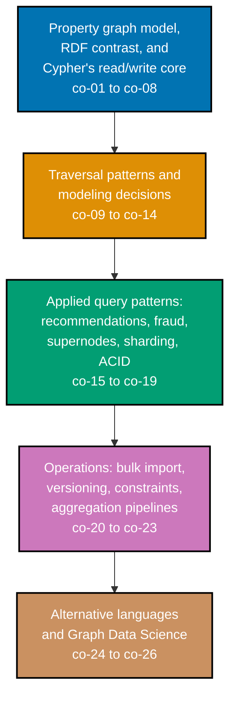

## Prerequisites

- **Prior topics**: [10 · SQL Essentials](../../sql-essentials/learning/overview.md) -- every
  relational-vs-graph contrast example in this topic (Examples 19, 33, 38, 65, 71) assumes the
  relational join syntax that course teaches is already familiar; `nosql-databases` --
  `[Unverified]` not yet present in the AyoKoding course library on disk, so no link is given here
  -- its absence does not block this topic, since every example here is self-contained against a
  seeded Neo4j fixture rather than assuming a wider NoSQL survey has already been read;
  [4 · Just Enough Python](../../just-enough-python/learning/overview.md) -- every Python driver
  example across all three tiers (Examples 22, 44, 66-70, 74) assumes basic Python syntax and
  function definitions are already familiar. Example 73 is Python but not driver-based -- a pure
  simulation with no Neo4j connection -- so it is excluded from this list, like Example 45.
- **Tools & environment**: a macOS/Linux terminal; a local **Neo4j** instance (Docker works fine;
  check the edition license -- Community Edition is GPLv3, Enterprise Edition is AGPLv3) with the
  **Graph Data Science (GDS)** plugin installed for the Advanced tier's Examples 55-63 and 73; the
  `cypher-shell` command-line tool; **Python 3.x** with a pinned, CVE-clean `neo4j` driver package
  for every `.py` example; **`rdflib`** (`pip install rdflib`) for every SPARQL example -- a
  pure-Python, in-memory RDF engine, no external triple-store needed; and the **Apache TinkerPop
  Gremlin Console** with `TinkerGraph.open()` for every `.groovy` example -- an in-memory graph
  engine, no external Gremlin server needed.
- **Assumed knowledge**: relational joins, well enough to feel the contrast when a graph pattern
  replaces a multi-table join chain; basic Python driver use; the general idea that entities can
  have relationships to other entities.

## Why this exists -- the big idea

Model connections as first-class data whenever the relationships between entities are the actual
question being asked. Every one of this topic's 80 worked examples is a small, complete
illustration of one piece of that discipline -- from creating a single node and its first typed
relationship, through variable-length traversal and shortest-path queries, to running centrality and
community-detection algorithms over an in-memory graph projection, and finally contrasting the same
question answered as a property graph, an RDF triple set, and a Gremlin traversal side by side.

**Cross-cutting big ideas, taught here and carried through every tier**:
`consistency-latency-throughput` -- deep-traversal performance is the specific win a graph database
is built around; `coupling-vs-cohesion` -- the domain this topic models genuinely _is_ connectedness
itself.

## How this topic's examples are organized

- **Beginner** (Examples 1-26) -- the property-graph fundamentals: creating nodes, labels, and
  directed, typed relationships; the `MATCH`/`WHERE`/`RETURN` read pipeline; `MERGE`'s
  idempotency; the choice between a property and a separate node; the classic variable-length
  path syntax alongside its modern quantified-relationship equivalent; the legacy
  `shortestPath()`/`allShortestPaths()` functions; index-free adjacency's flat-cost traversal
  signature, measured directly; the graph-vs-relational join-explosion contrast; uniqueness
  constraints and property indexes; an ACID transaction rollback from Python; both bulk-loading
  paths (`LOAD CSV` and `neo4j-admin`); and RDF triples with a first SPARQL `SELECT`.
- **Intermediate** (Examples 27-54) -- `OPTIONAL MATCH`, the full `WITH`/`UNWIND`/`CALL {}`
  aggregation pipeline, many-to-many and hierarchical-tree modeling, a bill-of-materials traversal
  contrasted against a recursive SQL CTE, recommendation and fraud-detection query patterns,
  identifying and timing a supernode's traversal cost, an introduction to sharding a connected
  graph, Gremlin's `addV`/`addE`/`has`/`out`/`repeat` traversal steps, more SPARQL (`OPTIONAL` and
  `FILTER`, plus a direct SPARQL-vs-Cypher contrast), and pinning a query to Cypher 5 or Cypher 25
  explicitly.
- **Advanced** (Examples 55-80) -- the Neo4j Graph Data Science library: projecting an in-memory
  graph, PageRank, betweenness centrality, Louvain community detection, node similarity, and both
  forms of weighted Dijkstra shortest path; knowledge-graph modeling contrasted against a
  5-table relational join; six worked previews of the capstone's own domain from Python (load,
  neighborhood, friends-of-friends, shortest path, recommendation, relational contrast); the
  standard supernode-mitigation and community-aware sharding patterns; a concurrent-write conflict
  and a constraint-violating bulk import, both demonstrating a real failure mode deliberately;
  SPARQL `CONSTRUCT`; a cycle-safe Gremlin traversal; the property-graph-vs-RDF trade-off modeled
  both ways; the modern GQL-conformant `SHORTEST` path selector; and a closing multi-model contrast
  report.
- **[Capstone](./capstone/overview.md)** -- a small recommendation/knowledge-graph domain (people +
  items + relationships) loaded from Python, queried for neighborhoods, a variable-length
  friends-of-friends pattern, a shortest path, and a recommendation, then contrasted against the
  equivalent relational query to show concretely why the graph wins.

Every example is a complete, self-contained, originally-authored, runnable file colocated under
`learning/code/`. Cypher examples run with `cypher-shell < example.cypher`; Python examples run with
`python3 example.py`; SPARQL examples are pure-Python scripts using `rdflib`; Gremlin examples run in
the TinkerPop Gremlin Console against an in-memory `TinkerGraph`. Every worked example's `Verify` or
`Output` block is hand-traced against its own seeded fixture data -- no example depends on a live
database being reachable from this page, and the two timing-sensitive examples (18, 44) describe
their qualitative outcome rather than fabricating a precise millisecond figure.

## Concepts

Every worked example in this topic's follow-up pages cites the `co-NN` concept it exercises -- this
section is the 1:1 reference those citations point back to.

### co-01 · Property-Graph Model

A property graph is built from nodes, relationships, labels, and key/value properties as
first-class citizens.

**Why it matters**: every later concept in this topic -- traversal, modeling decisions, algorithms
-- assumes this vocabulary; without it, "node," "relationship," and "property" have no fixed
meaning to build on.

**Verify it**: Example 1 creates a single node; Example 3 creates a first typed relationship;
Example 13 attaches a property to a relationship, not a node; Example 46 builds the identical shape
in Gremlin; Example 64 composes the full model into a small knowledge graph.

### co-02 · Labeled-Property-Graph vs. RDF

The labeled-property-graph model (Neo4j-style) differs from an RDF triple-store, which represents
every fact as a subject-predicate-object triple.

**Why it matters**: choosing between the two models is a real, consequential decision -- RDF's
uniform triples make cross-source merging easy, while the property graph's node-bundling is more
ergonomic for a single, self-contained database.

**Verify it**: Example 25 writes a first RDF triple; Example 26 answers the same question in SPARQL
that Example 6 answered in Cypher; Example 51 runs both side by side against equivalent data;
Example 78 models the identical facts both ways and names the trade-off explicitly; Example 80
closes the topic with all three representations compared.

### co-03 · When Graph Beats Relational

Deeply connected, relationship-heavy, variable-depth queries are where a graph traversal beats a
relational join chain.

**Why it matters**: a graph database is not a universal replacement for a relational store -- this
concept names exactly the shape of question where switching pays off.

**Verify it**: Example 19 runs the same 3-hop question as SQL self-joins versus one Cypher pattern;
Example 33 and Example 38 repeat the contrast for many-to-many and bill-of-materials modeling;
Example 65 repeats it for a standalone knowledge-graph fixture, and Example 71 repeats it for the
capstone's own recommendation domain; Example 80 names the same trade-off across all three query
languages.

### co-04 · Index-Free Adjacency

Each node stores a direct pointer to its adjacent relationships, so a hop's cost stays proportional
to the local neighborhood rather than the whole graph.

**Why it matters**: this is the structural reason a graph traversal does not slow down as the total
database grows -- and the same reason a supernode's own degree, not the database size, is what
determines a hop's cost through it.

**Verify it**: Example 18 measures a 1-hop traversal's cost staying flat as total graph size grows;
Example 44 shows the same guarantee does not protect against one node's own very high degree.

### co-05 · Cypher Read Clauses

`MATCH`/`WHERE`/`RETURN` form Cypher's core read pipeline: pattern-match, filter, project.

**Why it matters**: this three-clause shape is the pipeline every later read query in this topic
extends, whether with `OPTIONAL MATCH`, `WITH`, or a `CALL {}` subquery.

**Verify it**: Example 4 returns every node; Example 5 adds a `WHERE` filter; Example 6 adds a
relationship pattern; Example 27 extends the pipeline with `OPTIONAL MATCH`; Example 32 nests it
inside a `CALL {}` subquery; Example 67 runs the identical pipeline from a Python driver call.

### co-06 · Cypher Write Clauses

`CREATE` unconditionally writes a pattern; `MERGE` matches-or-creates it idempotently, with
`ON CREATE`/`ON MATCH` branches.

**Why it matters**: choosing `CREATE` when the data might already exist silently produces
duplicates -- `MERGE`'s idempotency is what makes a script safely rerunnable.

**Verify it**: Example 1 uses `CREATE` for a fresh node; Example 10 runs the same `MERGE` twice and
shows only one node results; Example 11 branches on `ON CREATE`/`ON MATCH`; Example 66 loads an
entire small domain via `MERGE` from Python, rerun-safe by construction.

### co-07 · Relationship Direction and Type

A Cypher relationship pattern is directed and typed (`()-[:REL]->()`), and both direction and type
narrow a match.

**Why it matters**: an undirected or untyped pattern matches strictly more than intended -- being
explicit about both is what keeps a query's result set exactly the shape the query author expects.

**Verify it**: Example 3 creates a directed relationship; Example 6 matches it back by both
direction and type; Example 7 filters by one specific relationship type; Example 8 matches multiple
types at once; Example 9 contrasts an undirected match against the directed default.

### co-08 · Pattern Matching

A Cypher query is a declarative graph shape: the engine finds every subgraph matching the drawn
pattern.

**Why it matters**: this declarative model is what lets a 2-hop or 3-hop question stay a single,
readable pattern rather than a sequence of imperative joins.

**Verify it**: Example 6 matches a 1-hop pattern; Example 32 scopes a pattern inside a subquery;
Example 39 and Example 41 match multi-hop recommendation and fraud patterns; Example 47 runs the
Gremlin equivalent; Example 64 and Example 65 chain a 2-hop pattern across three entity types;
Example 67 runs the same pattern from Python.

### co-09 · Variable-Length and Quantified Paths

The classic `[:REL*1..3]` syntax (still valid, not GQL-conformant) and the modern quantified
relationship/path-pattern syntax (`-[:REL]->{1,3}`, GQL-conformant) both traverse a variable number
of hops in one pattern.

**Why it matters**: bounding a variable-length pattern (rather than leaving it unbounded) is what
keeps a friends-of-friends-style query predictable in cost even on a much larger graph.

**Verify it**: Example 14 uses the classic `*1..3` syntax; Example 15 answers the identical question
with the modern quantified-relationship syntax; Example 36 walks a hierarchy downward with a
reversed variable-length pattern; Example 37 traverses a bill-of-materials; Example 42 detects a
cycle with a bounded pattern; Example 48 and Example 68 and Example 77 run the equivalent traversal
in Gremlin and from Python.

### co-10 · Shortest-Path Queries

The legacy `shortestPath()`/`allShortestPaths()` functions and the modern GQL-conformant
`SHORTEST k`/`ALL SHORTEST`/`ANY` path selectors compute minimum-hop or minimum-weight paths.

**Why it matters**: a hop-counting shortest path and a weighted shortest path answer genuinely
different questions -- "fewest hops" versus "cheapest total cost" -- and knowing which one a query
actually computes matters for real routing and cost-minimization problems.

**Verify it**: Example 16 computes a hop-counting shortest path with `shortestPath()`; Example 17
computes every minimal path with `allShortestPaths()`; Example 60 and Example 61 compute a WEIGHTED
shortest path with GDS Dijkstra; Example 69 runs the hop-counting version from Python; Example 79
answers the identical question with the modern `SHORTEST` selector.

### co-11 · Graph Modeling: Nodes vs. Properties vs. Relationships

Deciding whether a fact becomes a node, a property, or a relationship is the central graph-modeling
skill.

**Why it matters**: this decision determines what a later query can traverse to directly -- a fact
buried in a property cannot be queried the way a fact promoted to its own node can.

**Verify it**: Example 12 chooses a property over a separate node and keeps a query one hop; Example
13 attaches a property to a relationship, not a node; Example 54 refactors a property into a node
once it needs its own attributes; Example 64 applies the decision across a full small knowledge
graph; Example 72 uses the identical promotion pattern to mitigate a supernode.

### co-12 · Many-to-Many Modeling

A relationship, which can itself carry properties, replaces a join table for many-to-many facts.

**Why it matters**: a relationship's own properties (a grade, a rating, a date) attach directly to
the fact they describe, with no separate junction-table row to keep in sync.

**Verify it**: Example 33 contrasts a SQL join table against a Cypher relationship for the same
many-to-many fact; Example 34 attaches a property directly to that relationship.

### co-13 · Hierarchical-Tree Modeling

Parent/child hierarchies are modeled as directed relationships walked recursively.

**Why it matters**: the same directed relationship type, walked in one direction or the other,
answers both "who is above me" and "who reports to me" without a second schema.

**Verify it**: Example 35 walks an org chart upward from an individual contributor to the CEO;
Example 36 walks the same chart downward to find every direct and indirect report.

### co-14 · Bill-of-Materials Modeling

A recursive part-of graph (assemblies containing sub-assemblies) is a canonical variable-depth
graph problem.

**Why it matters**: a bill of materials is exactly the kind of unbounded-depth structure a
relational recursive CTE can express but a graph pattern expresses more directly.

**Verify it**: Example 37 traverses every sub-part of a top assembly; Example 38 contrasts the same
query as a recursive SQL CTE.

### co-15 · Recommendation Queries

"People who did X also did Y" recommendations are graph traversals over shared connections.

**Why it matters**: a recommendation is fundamentally a 2-hop-and-back pattern -- through what a
user bought, out to who else bought it, out to what else they bought -- expressible as one query.

**Verify it**: Example 39 computes a co-occurrence recommendation directly; Example 40 adds a
minimum-overlap threshold; Example 59 and Example 62 replace the manual threshold with GDS node
similarity; Example 70 runs the same query from Python.

### co-16 · Fraud-Pattern Detection

Suspicious structures (shared identifiers, payment rings, dense clusters) surface as graph patterns
that row-at-a-time relational scans miss.

**Why it matters**: a fraud ring is defined by its connectivity shape, not by any single row's
value -- exactly the kind of pattern a graph traversal surfaces directly.

**Verify it**: Example 41 detects a shared-device ring; Example 42 detects a circular-payment cycle;
Example 63 detects an over-dense community with Louvain, combining structural cycle detection with
community detection.

### co-17 · Supernodes and the Dense-Node Problem

A node with a disproportionate relationship count slows traversal through it and needs deliberate
handling.

**Why it matters**: a query pattern that is cheap through most of the graph can become the slowest
step in the whole traversal the moment it expands through one supernode.

**Verify it**: Example 43 identifies the highest-degree node in a fixture; Example 44 measures the
traversal-cost gap directly; Example 72 mitigates it with an intermediate grouping node.

### co-18 · Graph-Sharding Challenges

Partitioning a densely connected graph across machines inherently cuts relationships, unlike
sharding independent rows.

**Why it matters**: every cut relationship becomes a network round trip at query time -- minimizing
the cut is a real, measurable cost, unlike relational sharding by an independent key.

**Verify it**: Example 45 introduces the edge-cut cost with a naive ID-range split; Example 73
compares that naive split against a community-aware alternative on the same graph.

### co-19 · ACID Transactions in Graph Databases

Neo4j operations run inside fully ACID transactions, unlike the eventual-consistency norm common
elsewhere in NoSQL.

**Why it matters**: a graph database's ACID guarantee means a failed multi-step write rolls back
completely, and a concurrent conflicting write is caught rather than silently corrupting data.

**Verify it**: Example 22 forces an error mid-transaction and confirms the first write rolls back;
Example 74 runs two genuinely concurrent transactions writing the same property and confirms one is
forced to fail or retry.

### co-20 · Bulk Import and Loading

`LOAD CSV` (online, transactional, row-at-a-time) and `neo4j-admin database import` (offline,
high-throughput, whole-database) are the two data-loading paths.

**Why it matters**: choosing the wrong path for a dataset's size trades correctness guarantees for
throughput, or throughput for correctness guarantees, in the wrong direction.

**Verify it**: Example 23 loads via `LOAD CSV`; Example 24 loads the same shape offline via
`neo4j-admin`; Example 66 loads a domain the online way from Python; Example 75 shows the offline
path's own constraint-checking gap.

### co-21 · Neo4j Versioning and Editions

Neo4j's calendar versioning ships two parallel Cypher language dialects, one frozen and one
evolving, selectable per query -- see the course overview's dated
[Accuracy notes](../overview.md#accuracy-notes) for the current dialect names and the calendar
version at which the evolving one became the default.

**Why it matters**: an example written for one dialect's syntax may not run unchanged under the
other -- knowing which dialect a query targets avoids a confusing runtime surprise.

**Verify it**: Example 15 targets Cypher 25's quantified-relationship syntax specifically; Example
52 pins a query to Cypher 5 explicitly; Example 53 pins the identical query to Cypher 25; Example 79
targets Cypher 25's `SHORTEST` selector specifically.

### co-22 · Constraints and Indexes

`CREATE CONSTRAINT`/`CREATE INDEX` enforce uniqueness and accelerate property lookups in an
otherwise schema-optional store.

**Why it matters**: without an explicit constraint, nothing stops a duplicate "unique" value from
being written -- the schema-optional default is opt-in safety, not automatic safety.

**Verify it**: Example 20 creates a uniqueness constraint and confirms a duplicate is rejected;
Example 21 creates a property index and confirms it appears in a query plan; Example 75 shows the
gap between a bulk-import tool's own id check and a real property-level constraint.

### co-23 · Aggregation and Pipelining

`WITH`, `UNWIND`, `CALL {}` subqueries, `ORDER BY`/`LIMIT`/`SKIP`, and aggregating functions chain
query stages and shape results.

**Why it matters**: these clauses are what turn a single pattern match into a multi-stage
computation -- filtering on an aggregate, expanding a list into rows, or scoping a subquery per
outer row.

**Verify it**: Example 28 filters on a `WITH`-computed aggregate; Example 29 expands a list with
`UNWIND`; Example 30 aggregates with `count()`/`collect()`; Example 31 orders, limits, and skips
results; Example 32 scopes a `CALL {}` subquery per row; Example 40 chains a `WITH` filter into a
recommendation threshold.

### co-24 · RDF Triples and SPARQL

RDF models facts as subject-predicate-object triples, queried with SPARQL's
`SELECT`/`WHERE`/`FILTER`/`OPTIONAL`/`PREFIX`.

**Why it matters**: RDF's uniform triple representation is what makes merging datasets from
different sources under a shared, standardized vocabulary straightforward in a way a property
graph's node-bundling is not.

**Verify it**: Example 25 writes a first RDF triple; Example 26 runs a first SPARQL `SELECT`;
Example 50 adds `OPTIONAL` and `FILTER`; Example 51 contrasts SPARQL against Cypher directly;
Example 76 builds a derived graph with `CONSTRUCT`; Example 78 and Example 80 model the same facts
in RDF alongside the property graph and Gremlin forms.

### co-25 · Gremlin Traversal Language

Gremlin (Apache TinkerPop) is an imperative, step-chained traversal language (`g.V().has().out()`)
portable across many graph engines.

**Why it matters**: Gremlin's step-chained, imperative style is a genuinely different way of
expressing the same traversal Cypher expresses declaratively -- portable across TinkerPop-compatible
engines beyond Neo4j alone.

**Verify it**: Example 46 adds a vertex and an edge; Example 47 runs `has()`/`out()`; Example 48
walks a fixed-depth path with `repeat().times()`; Example 49 reads every vertex's properties,
flagging a deprecated overload along the way; Example 77 walks a cycle-safe variable-depth path with
`repeat().until()`; Example 80 runs the identical one-fact question in Gremlin alongside Cypher and
SPARQL.

### co-26 · Graph Data Science Procedures

Centrality (PageRank, betweenness) and community detection (Louvain) run as callable GDS library
procedures over an in-memory graph projection.

**Why it matters**: running these algorithms against the live transactional graph on every call
would be prohibitively slow -- projecting into memory first is what makes repeated, fast algorithm
calls practical at scale.

**Verify it**: Example 55 projects an in-memory graph; Example 56 and Example 57 run PageRank and
betweenness centrality; Example 58 runs Louvain community detection; Example 59 runs node
similarity; Example 60 and Example 61 run both forms of weighted Dijkstra; Example 62 and Example 63
apply similarity and community detection to a recommendation and a fraud-ring detector; Example 73
applies community detection to a sharding decision.

## Examples by Level

### Beginner (Examples 1–26)

- [Example 1: Create a Single Node](/en/learn/courses/graph-databases/learning/beginner#example-1-create-a-single-node)
- [Example 2: Create a Node with Multiple Labels](/en/learn/courses/graph-databases/learning/beginner#example-2-create-a-node-with-multiple-labels)
- [Example 3: Create a Directed Relationship](/en/learn/courses/graph-databases/learning/beginner#example-3-create-a-directed-relationship)
- [Example 4: Match and Return All Nodes](/en/learn/courses/graph-databases/learning/beginner#example-4-match-and-return-all-nodes)
- [Example 5: Match with a WHERE Filter](/en/learn/courses/graph-databases/learning/beginner#example-5-match-with-a-where-filter)
- [Example 6: Match a Relationship Pattern](/en/learn/courses/graph-databases/learning/beginner#example-6-match-a-relationship-pattern)
- [Example 7: Filter by Relationship Type](/en/learn/courses/graph-databases/learning/beginner#example-7-filter-by-relationship-type)
- [Example 8: Match Multiple Relationship Types](/en/learn/courses/graph-databases/learning/beginner#example-8-match-multiple-relationship-types)
- [Example 9: Undirected Pattern Match](/en/learn/courses/graph-databases/learning/beginner#example-9-undirected-pattern-match)
- [Example 10: MERGE Is Idempotent Create](/en/learn/courses/graph-databases/learning/beginner#example-10-merge-is-idempotent-create)
- [Example 11: MERGE with ON CREATE / ON MATCH](/en/learn/courses/graph-databases/learning/beginner#example-11-merge-with-on-create--on-match)
- [Example 12: Property vs. Node Modeling Decision](/en/learn/courses/graph-databases/learning/beginner#example-12-property-vs-node-modeling-decision)
- [Example 13: A Relationship with Properties](/en/learn/courses/graph-databases/learning/beginner#example-13-a-relationship-with-properties)
- [Example 14: Variable-Length Path (Classic Syntax)](/en/learn/courses/graph-databases/learning/beginner#example-14-variable-length-path-classic-syntax)
- [Example 15: Quantified Relationship Path (GQL-Conformant)](/en/learn/courses/graph-databases/learning/beginner#example-15-quantified-relationship-path-gql-conformant)
- [Example 16: Shortest Path with shortestPath()](/en/learn/courses/graph-databases/learning/beginner#example-16-shortest-path-with-shortestpath)
- [Example 17: All Shortest Paths with allShortestPaths()](/en/learn/courses/graph-databases/learning/beginner#example-17-all-shortest-paths-with-allshortestpaths)
- [Example 18: Index-Free Adjacency Keeps a Hop Cheap](/en/learn/courses/graph-databases/learning/beginner#example-18-index-free-adjacency-keeps-a-hop-cheap)
- [Example 19: Graph Traversal vs. Relational Join Explosion](/en/learn/courses/graph-databases/learning/beginner#example-19-graph-traversal-vs-relational-join-explosion)
- [Example 20: Create a Uniqueness Constraint](/en/learn/courses/graph-databases/learning/beginner#example-20-create-a-uniqueness-constraint)
- [Example 21: Create a Property Index](/en/learn/courses/graph-databases/learning/beginner#example-21-create-a-property-index)
- [Example 22: ACID Transaction Rollback from Python](/en/learn/courses/graph-databases/learning/beginner#example-22-acid-transaction-rollback-from-python)
- [Example 23: Bulk Load with LOAD CSV](/en/learn/courses/graph-databases/learning/beginner#example-23-bulk-load-with-load-csv)
- [Example 24: Offline Bulk Import with neo4j-admin](/en/learn/courses/graph-databases/learning/beginner#example-24-offline-bulk-import-with-neo4j-admin)
- [Example 25: A Basic RDF Triple](/en/learn/courses/graph-databases/learning/beginner#example-25-a-basic-rdf-triple)
- [Example 26: A Basic SPARQL SELECT](/en/learn/courses/graph-databases/learning/beginner#example-26-a-basic-sparql-select)

### Intermediate (Examples 27–54)

- [Example 27: OPTIONAL MATCH Preserves Rows as NULL](/en/learn/courses/graph-databases/learning/intermediate#example-27-optional-match-preserves-rows-as-null)
- [Example 28: Pipeline a Query with WITH](/en/learn/courses/graph-databases/learning/intermediate#example-28-pipeline-a-query-with-with)
- [Example 29: UNWIND a List into Rows](/en/learn/courses/graph-databases/learning/intermediate#example-29-unwind-a-list-into-rows)
- [Example 30: Aggregate with count() and collect()](/en/learn/courses/graph-databases/learning/intermediate#example-30-aggregate-with-count-and-collect)
- [Example 31: ORDER BY, LIMIT, and SKIP](/en/learn/courses/graph-databases/learning/intermediate#example-31-order-by-limit-and-skip)
- [Example 32: A CALL {} Subquery](/en/learn/courses/graph-databases/learning/intermediate#example-32-a-call--subquery)
- [Example 33: Many-to-Many: Join Table vs. Relationship](/en/learn/courses/graph-databases/learning/intermediate#example-33-many-to-many-join-table-vs-relationship)
- [Example 34: A Property on a Many-to-Many Relationship](/en/learn/courses/graph-databases/learning/intermediate#example-34-a-property-on-a-many-to-many-relationship)
- [Example 35: Walk a Hierarchical Tree Upward](/en/learn/courses/graph-databases/learning/intermediate#example-35-walk-a-hierarchical-tree-upward)
- [Example 36: Walk a Hierarchical Tree Downward](/en/learn/courses/graph-databases/learning/intermediate#example-36-walk-a-hierarchical-tree-downward)
- [Example 37: Bill-of-Materials Parts Explosion](/en/learn/courses/graph-databases/learning/intermediate#example-37-bill-of-materials-parts-explosion)
- [Example 38: BOM: Recursive SQL CTE vs. Cypher](/en/learn/courses/graph-databases/learning/intermediate#example-38-bom-recursive-sql-cte-vs-cypher)
- [Example 39: Recommendation by Co-Occurrence](/en/learn/courses/graph-databases/learning/intermediate#example-39-recommendation-by-co-occurrence)
- [Example 40: Recommendation with a Minimum-Overlap Threshold](/en/learn/courses/graph-databases/learning/intermediate#example-40-recommendation-with-a-minimum-overlap-threshold)
- [Example 41: Fraud Ring via a Shared Attribute](/en/learn/courses/graph-databases/learning/intermediate#example-41-fraud-ring-via-a-shared-attribute)
- [Example 42: Fraud Cycle Detection](/en/learn/courses/graph-databases/learning/intermediate#example-42-fraud-cycle-detection)
- [Example 43: Identify a Supernode by Degree](/en/learn/courses/graph-databases/learning/intermediate#example-43-identify-a-supernode-by-degree)
- [Example 44: Supernode Traversal Cost](/en/learn/courses/graph-databases/learning/intermediate#example-44-supernode-traversal-cost)
- [Example 45: Naive vs. Community-Aware Sharding, Introduced](/en/learn/courses/graph-databases/learning/intermediate#example-45-naive-vs-community-aware-sharding-introduced)
- [Example 46: Gremlin: Add a Vertex and an Edge](/en/learn/courses/graph-databases/learning/intermediate#example-46-gremlin-add-a-vertex-and-an-edge)
- [Example 47: Gremlin: has() and out()](/en/learn/courses/graph-databases/learning/intermediate#example-47-gremlin-has-and-out)
- [Example 48: Gremlin: repeat().path()](/en/learn/courses/graph-databases/learning/intermediate#example-48-gremlin-repeatpath)
- [Example 49: Gremlin: valueMap() (Legacy Overload)](/en/learn/courses/graph-databases/learning/intermediate#example-49-gremlin-valuemap-legacy-overload)
- [Example 50: SPARQL OPTIONAL and FILTER](/en/learn/courses/graph-databases/learning/intermediate#example-50-sparql-optional-and-filter)
- [Example 51: SPARQL vs. Cypher: the Same Question](/en/learn/courses/graph-databases/learning/intermediate#example-51-sparql-vs-cypher-the-same-question)
- [Example 52: Pin a Query to Cypher 5](/en/learn/courses/graph-databases/learning/intermediate#example-52-pin-a-query-to-cypher-5)
- [Example 53: Pin a Query to Cypher 25](/en/learn/courses/graph-databases/learning/intermediate#example-53-pin-a-query-to-cypher-25)
- [Example 54: Refactor a Property into a Node](/en/learn/courses/graph-databases/learning/intermediate#example-54-refactor-a-property-into-a-node)

### Advanced (Examples 55–80)

- [Example 55: GDS: Project an In-Memory Graph](/en/learn/courses/graph-databases/learning/advanced#example-55-gds-project-an-in-memory-graph)
- [Example 56: GDS: PageRank](/en/learn/courses/graph-databases/learning/advanced#example-56-gds-pagerank)
- [Example 57: GDS: Betweenness Centrality](/en/learn/courses/graph-databases/learning/advanced#example-57-gds-betweenness-centrality)
- [Example 58: GDS: Louvain Community Detection](/en/learn/courses/graph-databases/learning/advanced#example-58-gds-louvain-community-detection)
- [Example 59: GDS: Node Similarity](/en/learn/courses/graph-databases/learning/advanced#example-59-gds-node-similarity)
- [Example 60: GDS: Dijkstra Source-Target](/en/learn/courses/graph-databases/learning/advanced#example-60-gds-dijkstra-source-target)
- [Example 61: GDS: Dijkstra Single-Source](/en/learn/courses/graph-databases/learning/advanced#example-61-gds-dijkstra-single-source)
- [Example 62: Recommendation Powered by GDS Similarity](/en/learn/courses/graph-databases/learning/advanced#example-62-recommendation-powered-by-gds-similarity)
- [Example 63: Fraud Ring via Community Detection](/en/learn/courses/graph-databases/learning/advanced#example-63-fraud-ring-via-community-detection)
- [Example 64: Model a Small Knowledge Graph](/en/learn/courses/graph-databases/learning/advanced#example-64-model-a-small-knowledge-graph)
- [Example 65: Knowledge Graph vs. a 5-Table Relational Join](/en/learn/courses/graph-databases/learning/advanced#example-65-knowledge-graph-vs-a-5-table-relational-join)
- [Example 66: Preview: Load the Capstone Domain](/en/learn/courses/graph-databases/learning/advanced#example-66-preview-load-the-capstone-domain)
- [Example 67: Preview: a Neighborhood Query from Python](/en/learn/courses/graph-databases/learning/advanced#example-67-preview-a-neighborhood-query-from-python)
- [Example 68: Preview: Friends-of-Friends from Python](/en/learn/courses/graph-databases/learning/advanced#example-68-preview-friends-of-friends-from-python)
- [Example 69: Preview: Shortest Path from Python](/en/learn/courses/graph-databases/learning/advanced#example-69-preview-shortest-path-from-python)
- [Example 70: Preview: a Recommendation Query from Python](/en/learn/courses/graph-databases/learning/advanced#example-70-preview-a-recommendation-query-from-python)
- [Example 71: Preview: the Relational Contrast](/en/learn/courses/graph-databases/learning/advanced#example-71-preview-the-relational-contrast)
- [Example 72: Mitigate a Supernode with a Grouping Node](/en/learn/courses/graph-databases/learning/advanced#example-72-mitigate-a-supernode-with-a-grouping-node)
- [Example 73: Naive vs. Community-Aware Sharding](/en/learn/courses/graph-databases/learning/advanced#example-73-naive-vs-community-aware-sharding)
- [Example 74: Concurrent Write Conflict](/en/learn/courses/graph-databases/learning/advanced#example-74-concurrent-write-conflict)
- [Example 75: Constraint Enforcement During Bulk Import](/en/learn/courses/graph-databases/learning/advanced#example-75-constraint-enforcement-during-bulk-import)
- [Example 76: SPARQL CONSTRUCT a Derived Graph](/en/learn/courses/graph-databases/learning/advanced#example-76-sparql-construct-a-derived-graph)
- [Example 77: Gremlin: Cycle-Safe repeat().until()](/en/learn/courses/graph-databases/learning/advanced#example-77-gremlin-cycle-safe-repeatuntil)
- [Example 78: Property Graph vs. RDF: the Same Facts, Twice](/en/learn/courses/graph-databases/learning/advanced#example-78-property-graph-vs-rdf-the-same-facts-twice)
- [Example 79: GQL-Conformant SHORTEST Path Selector](/en/learn/courses/graph-databases/learning/advanced#example-79-gql-conformant-shortest-path-selector)
- [Example 80: Preview: a Multi-Model Contrast Report](/en/learn/courses/graph-databases/learning/advanced#example-80-preview-a-multi-model-contrast-report)

---

← Previous: [Overview](../overview.md) · Next: [Beginner Examples](./beginner.md) →
