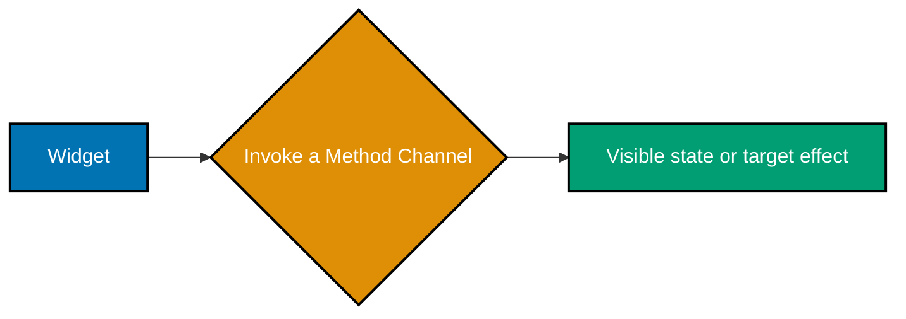
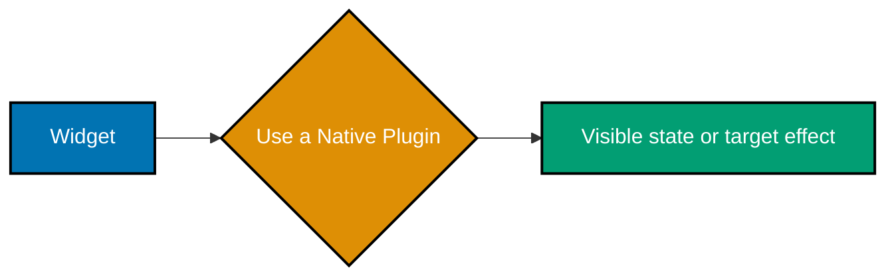
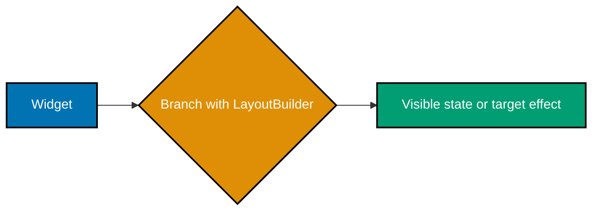
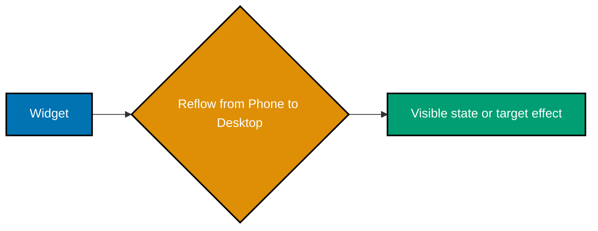
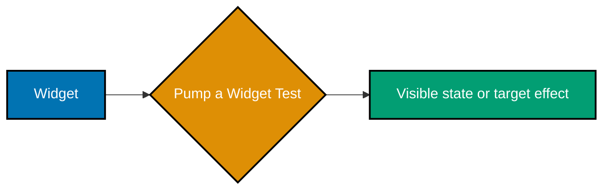
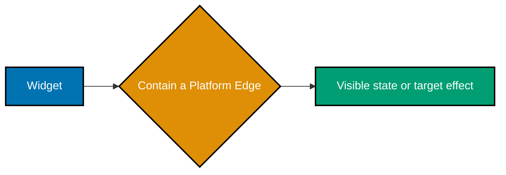
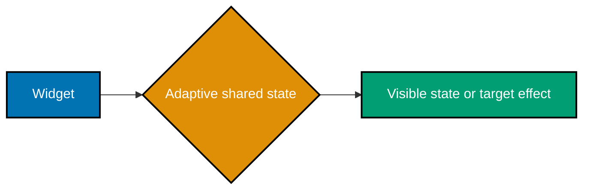
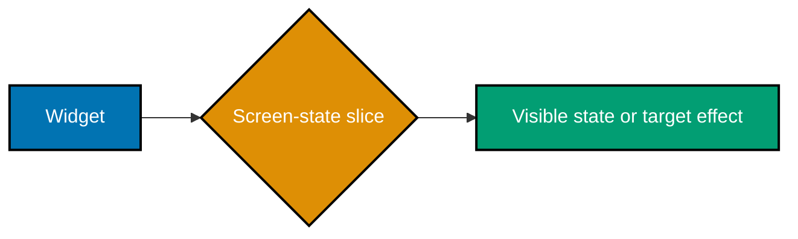
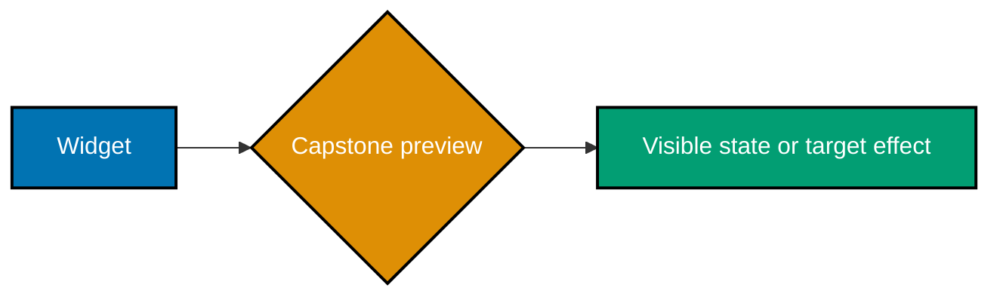

Examples 55–78 make target seams, adaptive form factors, and test claims explicit. These examples deliberately compare a shared Dart surface with target-specific build or native work rather than claiming that the abstraction removes it.

### Example 55: Invoke a Method Channel

_ex-55 · exercises co-25_

Create a named `MethodChannel` and invoke its `hint` method from Dart. The call crosses into the platform implementation associated with the same channel name.



```dart
const nativeHint = MethodChannel('focus_shelf/native_hint');
Future<String> readHint() async => await nativeHint.invokeMethod<String>('hint') ?? 'No native hint returned';
// => MethodChannel crosses from Dart into a named platform implementation.
```

**Key takeaway**: A method channel is an explicit Dart-to-native contract identified by a stable channel and method name.

**Why It Matters**: A narrow channel keeps platform-specific work at the edge and prevents native behavior from leaking through unrelated UI code.

### Example 56: Handle a Native Method Channel Call

_ex-56 · exercises co-25_

Register a method-call handler that accepts only the documented `clearCachedHint` request and rejects unsupported calls. Treat this handler as the other side of a versioned platform contract.

```dart
const channel = MethodChannel('focus_shelf/native_hint');
void registerDartHandler() { channel.setMethodCallHandler((call) async { if (call.method == 'clearCachedHint') return null; throw MissingPluginException('Unsupported call'); }); }
// => A method handler names the supported channel contract.
```

**Key takeaway**: Channel handlers should recognize specific methods and make unsupported operations fail visibly.

**Why It Matters**: Explicit contracts stop a platform seam from becoming a catch-all escape hatch with ambiguous behavior.

### Example 57: Use a Native Plugin

_ex-57 · exercises co-26_

Use `url_launcher` to request opening a help URI, and check the returned result before continuing. The plugin packages target implementations behind a Dart-facing API.



```dart
import 'package:url_launcher/url_launcher.dart';
Future<void> openHelp() async { final url=Uri.parse('https://example.com/help'); if (!await launchUrl(url)) throw StateError('Could not open help'); }
// => A plugin packages native capability behind a Dart API.
```

**Key takeaway**: A plugin can provide a maintained platform capability, but the app still owns availability and error behavior.

**Why It Matters**: Choosing a plugin for a concrete native need avoids custom platform code while keeping its dependency boundary reviewable.

### Example 58: Handle a Platform Fallback

_ex-58 · exercises co-25, co-30_

Catch both a missing channel implementation and a platform exception around the native hint call. Return user-visible fallback text for each failure instead of allowing the route to throw.

```dart
Future<String> safeHint() async { try { return await nativeHint.invokeMethod<String>('hint') ?? 'No native hint returned'; } on MissingPluginException { return 'Native hint unavailable on this target'; } on PlatformException catch (error) { return 'Native hint failed: ' + error.code; } }
// => Unsupported targets get visible fallback behaviour.
```

**Key takeaway**: Every optional native capability needs a defined behavior on unsupported and failed targets.

**Why It Matters**: A visible fallback preserves a usable shared app surface even when a platform integration is absent.

### Example 59: Build an Android Artifact

_ex-59 · exercises co-27_

Run `flutter build apk` to package the project for Android after the required Android tooling and signing choices are in place. The artifact is evidence for that one configured target.


```bash
# => Each command packages the same Dart and Flutter source for a target.
flutter build apk # => Produces an Android application package.
flutter build macos # => Produces a macOS desktop application when the runner is enabled.
# => Choose only targets installed on the host; packaging never makes platform setup disappear.
```

**Key takeaway**: An APK build compiles shared Flutter code together with Android-specific runner and packaging configuration.

**Why It Matters**: A successful Android build verifies a real distribution boundary that widget tests alone cannot cover.

### Example 60: Build a Desktop Artifact

_ex-60 · exercises co-27_

Run the desktop build command for an enabled runner, such as `flutter build macos`. Verify it on a host that supports that target rather than assuming mobile output proves desktop readiness.

```bash
# => Each command packages the same Dart and Flutter source for a target.
flutter build apk # => Produces an Android application package.
flutter build macos # => Produces a macOS desktop application when the runner is enabled.
# => Choose only targets installed on the host; packaging never makes platform setup disappear.
```

**Key takeaway**: Desktop artifacts use the shared Dart layer but retain target-specific runners, toolchains, and packaging.

**Why It Matters**: Testing the desktop build catches target setup and binary issues that cannot appear in an Android-only workflow.

### Example 61: Build One Codebase for Two Targets

_ex-61 · exercises co-27_

Build the same project for two installed targets and compare the artifacts as separate deliverables. Shared source reduces duplication, but each build still exercises its own runner and toolchain.

```bash
# => Each command packages the same Dart and Flutter source for a target.
flutter build apk # => Produces an Android application package.
flutter build macos # => Produces a macOS desktop application when the runner is enabled.
# => Choose only targets installed on the host; packaging never makes platform setup disappear.
```

**Key takeaway**: Flutter shares application code across targets without eliminating their individual build requirements.

**Why It Matters**: Treating each artifact as independent evidence prevents a passing target from making unsupported portability claims.

### Example 62: Branch with LayoutBuilder

_ex-62 · exercises co-28_

Use `LayoutBuilder` to branch the widget tree from the actual maximum width supplied by its parent. Select a narrow or wide arrangement based on that local constraint.



```dart
LayoutBuilder(builder: (_, constraints) {
  final wide = constraints.maxWidth >= 720;
  return wide ? const WideShelf() : const NarrowShelf();
});
// => Branch on parent constraints, not a device name.
```

**Key takeaway**: `LayoutBuilder` adapts a subtree to the room its parent offers, not to a guessed device category.

**Why It Matters**: Local constraints make reusable widgets adapt correctly when they appear in panels, split views, or other non-full-screen parents.

### Example 63: Choose a MediaQuery Breakpoint

_ex-63 · exercises co-28_

Read the available screen width through `MediaQuery` when the decision truly depends on the overall window. Name the breakpoint and test just above and below it.

```dart
final wide = MediaQuery.sizeOf(context).width >= 720;
return Text(wide ? 'Desktop controls' : 'Compact controls');
// => MediaQuery supplies a viewport-level breakpoint.
```

**Key takeaway**: `MediaQuery` describes window-level characteristics, while `LayoutBuilder` describes parent-local constraints.

**Why It Matters**: A documented breakpoint gives designers and tests a stable, observable rule for when the overall screen changes form.

### Example 64: Reflow from Phone to Desktop

_ex-64 · exercises co-28_

Render the same content as a single narrow column or a wider horizontal arrangement based on available width. Keep the state and data model unchanged across the two layouts.



```dart
LayoutBuilder(builder: (_, constraints) => constraints.maxWidth < 720 ? const ListOnlyShelf() : const Row(children: [SizedBox(width: 320, child: ArticleList()), Expanded(child: ArticleDetailPane())]));
// => One content model reflows from phone stack to desktop columns.
```

**Key takeaway**: Responsive design changes composition and space allocation while preserving the same user task and data.

**Why It Matters**: Reflowing rather than merely enlarging a phone layout makes large screens useful without duplicating the underlying feature.

### Example 65: Build Responsive Master Detail

_ex-65 · exercises co-28_

On wide space, render the article list and selected detail side by side; on narrow space, navigate from the list to detail. Both arrangements read the same selected article state.

```dart
Row(children: [SizedBox(width: 320, child: ArticleList(onSelected: select)), const VerticalDivider(width: 1), Expanded(child: selected == null ? const Text('Select an article') : ArticleDetail(article: selected!))]);
// => Master and detail share the selected article on wide screens.
```

**Key takeaway**: Master-detail is a responsive navigation pattern that changes presentation without changing the content model.

**Why It Matters**: One source of selection state keeps phone navigation and desktop split views behaviorally consistent.

### Example 66: Pump a Widget Test

_ex-66 · exercises co-29_

Call `pumpWidget` with a minimal app wrapper, then use finders to assert that the expected UI appears. The pump creates a controlled widget tree in the test environment.



```dart
import 'package:flutter_test/flutter_test.dart';
testWidgets('shows saved count', (tester) async { await tester.pumpWidget(const MaterialApp(home: SavedCount(count: 2))); expect(find.text('2 saved'), findsOneWidget); });
// => pumpWidget renders a widget tree under WidgetTester.
```

**Key takeaway**: Widget tests render Flutter widgets in memory and assert observable UI without a full device run.

**Why It Matters**: A focused widget test verifies the screen contract quickly and gives failures a small, reproducible scope.

### Example 67: Tap in a Widget Test

_ex-67 · exercises co-29_

Find the button, send a tester tap, and `pump` the next frame before asserting its new label or state. This mirrors a user gesture and the resulting rebuild.

```dart
testWidgets('tapping Save changes its label', (tester) async { await tester.pumpWidget(const MaterialApp(home: SaveButton())); await tester.tap(find.text('Save')); await tester.pump(); expect(find.text('Saved'), findsOneWidget); });
// => WidgetTester drives a user event and observes the result.
```

**Key takeaway**: Widget tests pair a simulated gesture with a frame pump to observe the UI transition it causes.

**Why It Matters**: Interaction-level assertions protect user-visible behavior instead of only checking a widget's initial structure.

### Example 68: Test Pure Model Logic

_ex-68 · exercises co-29_

Construct the model directly, call its transition method, and assert the returned or stored value. No widget pump is needed because the behavior is pure Dart logic.

```dart
test('saving toggles an article id', () { final shelf=ShelfModel(); final article=ShelfModel.articles.first; shelf.toggleSaved(article); expect(shelf.isSaved(article), isTrue); });
// => Pure model tests need no widget binding.
```

**Key takeaway**: Unit tests isolate deterministic model behavior from rendering, navigation, and platform dependencies.

**Why It Matters**: Fast model tests make state invariants cheap to protect and clarify the business rule beneath a UI interaction.

### Example 69: Drive an Integration Test

_ex-69 · exercises co-29_

Launch the app in an integration test, perform a complete user flow, and assert the screen after navigation or persistence work. Run it on a real or emulated target when target integration matters.


```dart
import 'package:integration_test/integration_test.dart';
void main() { IntegrationTestWidgetsFlutterBinding.ensureInitialized(); testWidgets('save flow works in a built app', (tester) async { await tester.tap(find.text('Save')); expect(find.text('Saved'), findsOneWidget); }); }
// => An integration test executes an installed app flow.
```

**Key takeaway**: Integration tests verify that multiple Flutter layers cooperate in a running application.

**Why It Matters**: End-to-end flows expose wiring defects that isolated unit and widget tests intentionally cannot observe.

### Example 70: Run the Flutter Test Suite

_ex-70 · exercises co-29, co-01_

Run `flutter test` before sharing the change so every unit and widget test validates the same source revision. Investigate any failure as evidence that the behavior contract changed.

```bash
# => Runs widget and unit tests in the current Flutter package.
flutter test # => Uses Flutter's test environment rather than dart test.
flutter test test/widget_test.dart # => Narrows the feedback loop to one test file.
# => A passing run reports every selected test as successful.
```

**Key takeaway**: The complete Flutter test suite is the repeatable baseline for model and widget behavior.

**Why It Matters**: A green suite makes manual device checks more trustworthy by ruling out known deterministic regressions first.

### Example 71: Compare Native Fidelity

_ex-71 · exercises co-30_

Compare Flutter's shared widget behavior with a target-specific plugin or native implementation where fidelity matters. Name the exact interaction, appearance, or API that requires the platform edge.


```dart
class PlatformDecision {
  const PlatformDecision({required this.sharedUi, required this.nativeEscapeHatch});
  final bool sharedUi;
  final String nativeEscapeHatch;
}
const decision = PlatformDecision(
  sharedUi: true,
  nativeEscapeHatch: 'Use a plugin or MethodChannel at OS edges',
);
// => Shared pixels reduce duplicate UI, while native edges remain deliberate.
```

**Key takeaway**: Shared Flutter UI is often sufficient; native code is justified by a concrete platform capability or fidelity requirement.

**Why It Matters**: Making the trade-off explicit avoids paying native complexity merely because a platform-specific option exists.

### Example 72: Inspect Binary Size

_ex-72 · exercises co-30_

Use the build tooling's size analysis output to inspect the artifact and identify significant contributors. Compare reports after adding a dependency or asset-heavy feature.

```dart
// flutter build apk --analyze-size
// flutter build macos
// => Inspect every target separately; shared Dart does not mean equal binary size.
```

**Key takeaway**: Binary size is a target-specific product constraint that should be measured from produced artifacts.

**Why It Matters**: Size inspection gives dependency decisions evidence, especially for users who download over constrained networks or storage.

### Example 73: Contain a Platform Edge

_ex-73 · exercises co-30, co-25_

Put the method-channel call behind a small app-owned gateway that returns a Dart value or fallback. Widgets depend on that gateway rather than on channel details.



```dart
class NativeHintGateway { const NativeHintGateway(this.channel); final MethodChannel channel; Future<String> read() async { try { return await channel.invokeMethod<String>('hint') ?? 'No hint'; } on MissingPluginException { return 'Native hint unavailable on this target'; } } }
// => A gateway contains the platform edge outside widgets.
```

**Key takeaway**: A platform gateway confines native contracts, exceptions, and target differences to one replaceable boundary.

**Why It Matters**: Containment makes platform behavior testable with a fake and prevents unsupported-target handling from spreading through the UI.

### Example 74: Combine Provider and Navigation

_ex-74 · exercises co-16, co-19_

Provide the shelf model above navigation, push a detail route, and invoke the same model action from that route. Return to the list and confirm the shared state is still visible.

```dart
context.read<ShelfModel>().select(article);
Navigator.of(context).push(MaterialPageRoute<void>(builder: (_) => ArticleDetail(article: article)));
// => Provider owns shared selection while Navigator owns the route stack.
```

**Key takeaway**: State that crosses routes belongs above the navigator, while routes remain responsible for screen transitions.

**Why It Matters**: Separating state lifetime from route lifetime prevents a detail screen from accidentally owning data the list also needs.

### Example 75: Combine Adaptive Layout and State

_ex-75 · exercises co-28, co-16_

Read the same provider state in narrow and wide layouts, changing only the arrangement of list and detail widgets. Resize the test viewport to prove that a selected item survives the reflow.



```dart
LayoutBuilder(builder: (context, constraints) { final shelf=context.watch<ShelfModel>(); return constraints.maxWidth >= 720 ? MasterDetail(selected: shelf.selected) : ArticleList(selected: shelf.selected); });
// => Adaptive layout and provider state compose without sharing ownership.
```

**Key takeaway**: Responsive layout should adapt presentation while state ownership and feature semantics remain stable.

**Why It Matters**: Stable state across reflow means users do not lose their work when a window changes size or orientation.

### Example 76: Cache a Network List Offline

_ex-76 · exercises co-23, co-24_

After a successful repository fetch, persist deterministic article data through the local storage boundary and load it when offline. Make the cache freshness and fallback policy explicit.

```dart
Future<void> cacheTitles(List<Article> articles) async => (await SharedPreferences.getInstance()).setStringList('cached-titles', [for (final article in articles) article.title]);
// => Cache deterministic display data after a successful network response.
```

**Key takeaway**: Offline caching is a repository concern that combines remote data with a deliberate local fallback.

**Why It Matters**: A defined cache path keeps a transient network failure from turning previously available content into an empty application.

### Example 77: Wire a Screen, Widget, and State Slice

_ex-77 · exercises co-03, co-04, co-16_

Build an `ArticleRow` that receives one article, watches its saved state, and delegates toggling to the shelf model. The row is a thin composition of rendering, state read, and user interaction.



```dart
class ArticleRow extends StatelessWidget { const ArticleRow({required this.article, super.key}); final Article article; @override Widget build(BuildContext context) => ListTile(title: Text(article.title), trailing: Icon(context.watch<ShelfModel>().isSaved(article) ? Icons.star : Icons.star_border), onTap: () => context.read<ShelfModel>().toggleSaved(article)); }
// => One row wires state, rendering, and an interaction.
```

**Key takeaway**: A screen slice should pass domain data in, render it clearly, and send user intent to its designated state owner.

**Why It Matters**: This focused wiring makes it clear whether a defect belongs in presentation, interaction handling, or the shared model.

### Example 78: Preview the Multiplatform Capstone

_ex-78 · exercises co-06, co-16, co-19, co-28, co-25, co-27_

Use the capstone composition root to place `ShelfModel` above the Material app, then connect its screens, responsive layout, navigation, and contained platform gateway. Treat the snippet as the entry point for the complete course artifact, not a standalone feature.



```dart
ChangeNotifierProvider(create: (_) => ShelfModel(), child: const MaterialApp(home: ShelfScreen()));
// => The capstone composes provider state, adaptive layout, routes, and a platform gateway.
```

**Key takeaway**: The capstone demonstrates one shared Flutter surface with explicit state, layout, navigation, testing, and platform seams.

**Why It Matters**: Composing the pieces in one small app proves their boundaries work together without claiming that target-specific obligations disappear.
