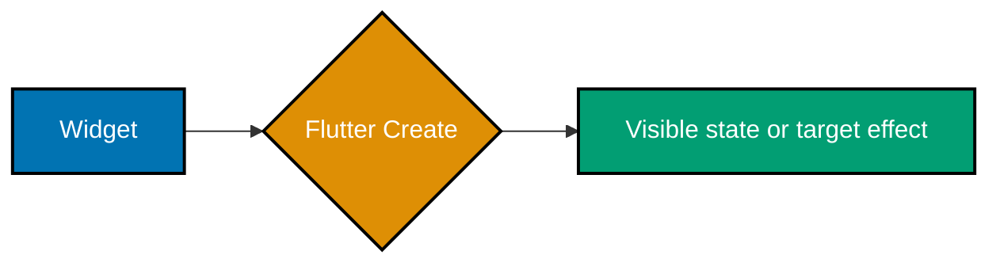
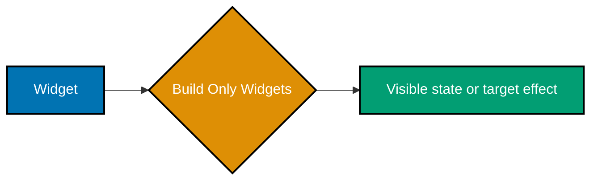
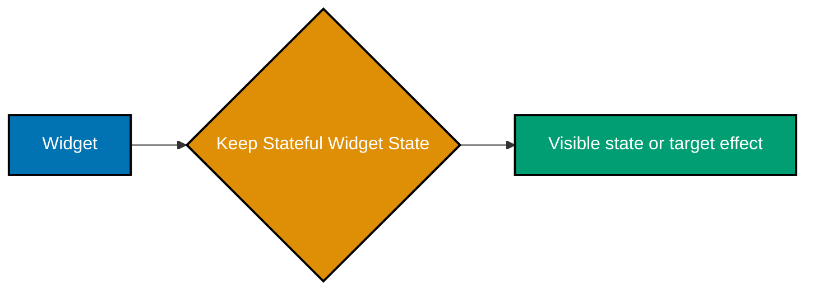
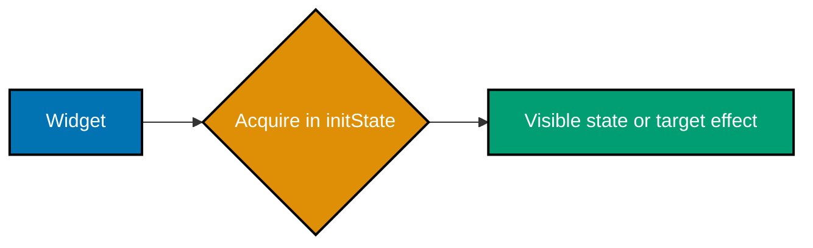
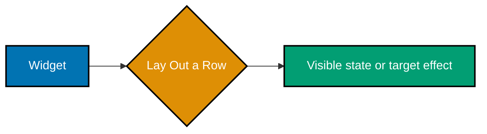
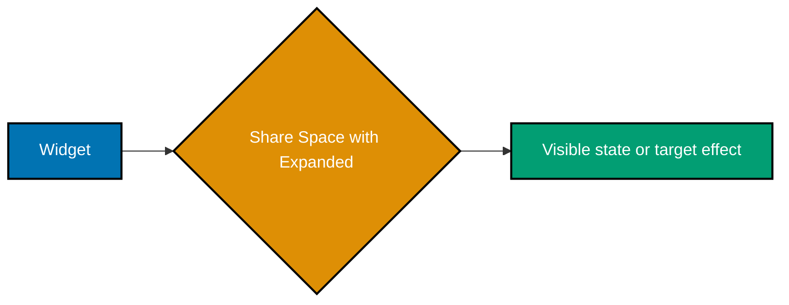
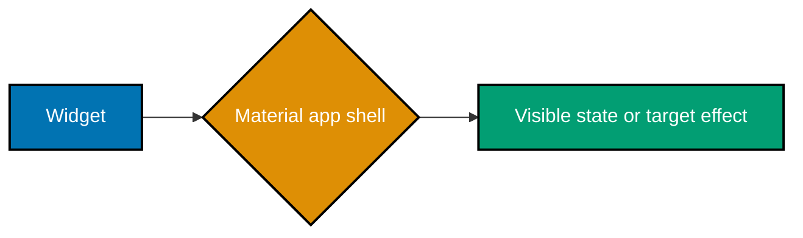
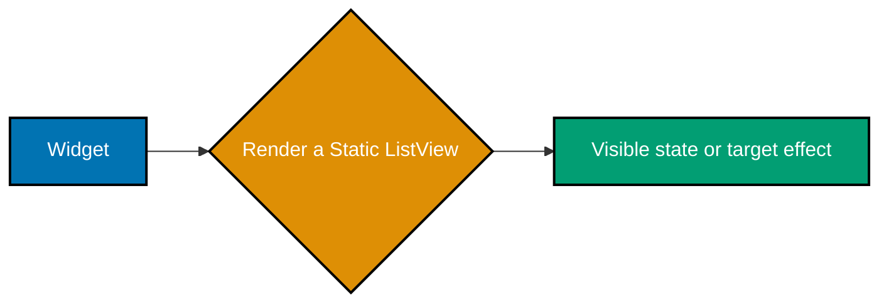

Examples 1–26 use Flutter's built-in widgets and local state. Create a standard Flutter project first; each runnable app block is intentionally small so you can change one decision and observe the result.

### Example 1: Flutter Create

_ex-01 · exercises co-01_

Start with `flutter create focus_shelf` to generate the Dart package, platform runners, and starter test structure. Enter the new directory before running the generated app.



```bash
# => Creates a Flutter project with platform runners and a test target.
flutter create focus_shelf # => Writes a runnable project named focus_shelf.
cd focus_shelf # => Makes project commands use this package.
flutter run # => Selects an available target and launches the app.
```

**Key takeaway**: `flutter create` establishes the project and target runners that every later Flutter command uses.

**Why It Matters**: A generated project keeps application code, tests, and platform configuration in the expected locations, so the team can add features without inventing its own layout first.

### Example 2: Flutter Run

_ex-02 · exercises co-01_

Use `flutter run` from an existing project to compile for a selected attached target. Save a source edit, then use hot reload or hot restart to compare preserved and reset state.

```bash
# => Runs the existing project on an attached emulator, simulator, or desktop runner.
flutter run # => Compiles and launches the selected target.
r # => Requests hot reload after a saved source edit.
R # => Requests hot restart when state must reset.
```

**Key takeaway**: Hot reload applies code changes while retaining state; hot restart rebuilds the app from its entry point.

**Why It Matters**: Knowing which iteration command preserves state prevents misleading manual checks when a change depends on initialization or disposal.

### Example 3: Run Flutter Test

_ex-03 · exercises co-01_

Run `flutter test` at the package root to execute the whole unit and widget test suite. Pass a test path when you are refining one behavior and need a tighter feedback loop.

```bash
# => Runs widget and unit tests in the current Flutter package.
flutter test # => Uses Flutter's test environment rather than dart test.
flutter test test/widget_test.dart # => Narrows the feedback loop to one test file.
# => A passing run reports every selected test as successful.
```

**Key takeaway**: `flutter test` exercises Flutter-aware tests, while a file path narrows the run to the behavior under change.

**Why It Matters**: Fast, repeatable test runs catch regressions in widgets and pure Dart logic before a device check can mask them.

### Example 4: Build Only Widgets

_ex-04 · exercises co-02_

Compose the screen from widget values: a `Text` widget becomes the `Center` child without imperative drawing code. Change the text or wrapper to see how the widget tree controls the result.



```dart
const header = Text('Focus Shelf');
const screen = Center(child: header);
// => A screen is composed entirely from widgets.
```

**Key takeaway**: Flutter UI is described as a tree of widgets, from small content widgets to layout parents.

**Why It Matters**: A declarative widget tree makes layout ownership visible and lets Flutter determine the updates needed after inputs change.

### Example 5: Render a Stateless Widget

_ex-05 · exercises co-03_

Define `Greeting` with a required `name` and return a `Text` from `build`. Construct it with a different name to see that immutable configuration alone determines its output.

```dart
class Greeting extends StatelessWidget {
  const Greeting({required this.name, super.key}); final String name;
  @override Widget build(BuildContext context) => Text('Hello, $name');
} // => Immutable configuration completely determines this render.
```

**Key takeaway**: Use `StatelessWidget` when a widget can render entirely from constructor inputs and inherited context.

**Why It Matters**: Immutable widgets are simple to reuse and test because their visual result has no hidden mutable owner.

### Example 6: Read Configuration in Build

_ex-06 · exercises co-03, co-05_

Read configuration available from `BuildContext` inside `build`, where Flutter can provide the current inherited values. Rebuild the widget under a changed configuration to obtain the new value.

```dart
@override Widget build(BuildContext context) {
  final color = Theme.of(context).colorScheme.primary;
  return Text('Theme-aware', style: TextStyle(color: color));
} // => BuildContext locates inherited configuration.
```

**Key takeaway**: Context-dependent configuration belongs in `build`, not in a widget constructor or long-lived field.

**Why It Matters**: Reading inherited inputs at build time keeps a widget synchronized with theme, locale, media, and other values supplied by ancestors.

### Example 7: Compose Reusable Widgets

_ex-07 · exercises co-06_

Extract a repeated visual idea into a small widget with explicit inputs, then compose it into a screen. Change one child or parameter without duplicating the surrounding layout.

```dart
class ArticleCard extends StatelessWidget {
  const ArticleCard({required this.title, super.key}); final String title;
  @override Widget build(BuildContext context) => Card(child: Padding(padding: const EdgeInsets.all(12), child: Text(title)));
} // => A small widget composes into a screen.
```

**Key takeaway**: Small widgets give a UI named, testable seams while the parent remains responsible for composition.

**Why It Matters**: Reusable components prevent styling and interaction details from drifting across several screens.

### Example 8: Keep Stateful Widget State

_ex-08 · exercises co-04_

Use a `StatefulWidget` when a screen needs data that changes over its own lifetime. Keep the mutable field in its paired `State` object rather than in the immutable widget configuration.



```dart
class ToggleTile extends StatefulWidget { const ToggleTile({super.key}); @override State<ToggleTile> createState() => _ToggleTileState(); }
class _ToggleTileState extends State<ToggleTile> { bool value = false; @override Widget build(BuildContext context) => Switch(value: value, onChanged: (next) => setState(() => value = next)); }
// => State owns mutable values across rebuilds.
```

**Key takeaway**: A `StatefulWidget` describes configuration; its `State` object owns short-lived mutable UI state.

**Why It Matters**: This separation lets Flutter replace widget configurations during rebuilds without accidentally discarding the state that should persist.

### Example 9: Increment with setState

_ex-09 · exercises co-08, co-04_

Mutate the local counter inside the callback passed to `setState`. Flutter then schedules a rebuild so the next `build` reads and displays the incremented value.

```dart
int count = 0;
FilledButton(onPressed: () => setState(() => count += 1), child: Text('$count'));
// => setState marks this local subtree for rebuilding.
```

**Key takeaway**: Call `setState` for a local mutation that must be reflected by the current stateful widget's UI.

**Why It Matters**: Grouping the mutation with its rebuild signal makes local interactions predictable and keeps stale visuals from persisting.

### Example 10: Acquire in initState

_ex-10 · exercises co-07_

Initialize resources that should be acquired once per state lifetime in `initState`, after calling `super.initState()`. This is the right place for a controller, subscription, or initial request setup.



```dart
late final Stopwatch stopwatch;
@override void initState() { super.initState(); stopwatch = Stopwatch()..start(); }
// => initState performs one-time setup, not work for every build.
```

**Key takeaway**: `initState` establishes state-owned resources once; it is not rerun for ordinary widget rebuilds.

**Why It Matters**: Matching one-time setup to the state lifecycle avoids recreating controllers or subscriptions whenever the UI rebuilds.

### Example 11: Release in dispose

_ex-11 · exercises co-07_

Release the controller or subscription owned by this state in `dispose`, then call `super.dispose()`. The paired cleanup completes the lifecycle started in `initState`.

```dart
final controller = TextEditingController();
@override void dispose() { controller.dispose(); super.dispose(); }
// => A State object disposes resources it created.
```

**Key takeaway**: Every state-owned disposable resource needs a corresponding `dispose` call when the widget leaves the tree.

**Why It Matters**: Prompt cleanup prevents listeners, timers, and controllers from retaining work after the screen is gone.

### Example 12: Read Theme from Context

_ex-12 · exercises co-05_

Read `Theme.of(context)` inside `build` and use the returned theme values to style the widget. Alter the surrounding `ThemeData` to see the descendant adopt the new appearance.

```dart
final textStyle = Theme.of(context).textTheme.headlineSmall;
return Text('Focus Shelf', style: textStyle);
// => Theme.of reads inherited theme data through context.
```

**Key takeaway**: `Theme.of(context)` supplies shared visual tokens to the subtree that is below the theme.

**Why It Matters**: Using inherited theme values yields a consistent interface and allows one design change to propagate safely.

### Example 13: Lay Out a Column

_ex-13 · exercises co-09_

Place widgets in a `Column` to lay them out vertically in declaration order. Add a child or change its alignment to see how the vertical axis controls the arrangement.

```dart
const Column(children: [Text('Title'), SizedBox(height: 8), Text('Body')]);
// => Column lays children out vertically.
```

**Key takeaway**: `Column` is Flutter's basic vertical layout primitive for a bounded group of children.

**Why It Matters**: Expressing vertical intent directly makes spacing and overflow decisions easier to inspect as the screen grows.

### Example 14: Lay Out a Row

_ex-14 · exercises co-09_

Place widgets in a `Row` to lay them out horizontally. Give each child a distinct width to observe how the available horizontal space is distributed.



```dart
const Row(mainAxisAlignment: MainAxisAlignment.spaceBetween, children: [Text('Draft'), Icon(Icons.chevron_right)]);
// => Row lays children out horizontally.
```

**Key takeaway**: `Row` uses the horizontal axis as its main axis and positions its children side by side.

**Why It Matters**: Horizontal layout is explicit about competition for width, which is essential when a UI must work on narrow devices.

### Example 15: Decorate a Container

_ex-15 · exercises co-09_

Wrap content in a `Container` and set its padding, color, or decoration in one place. Change the decoration without changing the child widget itself.

```dart
Container(padding: const EdgeInsets.all(16), decoration: BoxDecoration(color: Colors.teal, borderRadius: BorderRadius.circular(12)), child: const Text('Decorated'));
// => Container combines padding, decoration, and a child.
```

**Key takeaway**: `Container` combines common layout and painting concerns around one child.

**Why It Matters**: Keeping decoration at the wrapper makes visual changes local and avoids smuggling layout rules into content widgets.

### Example 16: Overlay with Stack

_ex-16 · exercises co-09_

Use a `Stack` when children must occupy the same area, such as a badge over an image. Add a `Positioned` child to make the overlay's anchor explicit.

```dart
const Stack(children: [ColoredBox(color: Colors.teal, child: SizedBox.expand()), Positioned(right: 12, top: 12, child: Icon(Icons.bookmark))]);
// => Positioned overlays content at a stack coordinate.
```

**Key takeaway**: `Stack` layers children; `Positioned` supplies precise offsets within that shared space.

**Why It Matters**: An explicit overlay model prevents unrelated layout widgets from being forced into roles they cannot describe clearly.

### Example 17: Share Space with Expanded

_ex-17 · exercises co-10_

Wrap a `Row` or `Column` child in `Expanded` to claim its share of the remaining main-axis space. Change the flex values to see the proportion change.



```dart
const Row(children: [Expanded(child: SizedBox(height: 40)), SizedBox(width: 8), Expanded(child: SizedBox(height: 40))]);
// => Expanded divides remaining Row space among children.
```

**Key takeaway**: `Expanded` tells a flex layout which child should stretch into available main-axis room.

**Why It Matters**: Flexible allocation prevents hard-coded dimensions from creating overflow as content or device width changes.

### Example 18: Align Along the Main Axis

_ex-18 · exercises co-10_

Set `mainAxisAlignment` on a `Row` or `Column` to distribute children along its primary direction. Compare `start`, `center`, and `spaceBetween` with the same children.

```dart
const Row(mainAxisAlignment: MainAxisAlignment.spaceEvenly, children: [Icon(Icons.home), Icon(Icons.search), Icon(Icons.person)]);
// => mainAxisAlignment distributes a Row horizontally.
```

**Key takeaway**: Main-axis alignment controls placement and free-space distribution in the direction a flex widget lays out.

**Why It Matters**: Declaring the distribution rule makes toolbar, button-row, and form spacing resilient to varying content lengths.

### Example 19: Align Along the Cross Axis

_ex-19 · exercises co-10_

Set `crossAxisAlignment` to position children perpendicular to the main axis. Try `start` and `stretch` to see the secondary-axis rule change.

```dart
const Column(crossAxisAlignment: CrossAxisAlignment.center, children: [Text('Centered'), Icon(Icons.star)]);
// => crossAxisAlignment controls a Column horizontally.
```

**Key takeaway**: Cross-axis alignment controls how flex children line up or fill the dimension perpendicular to their flow.

**Why It Matters**: It prevents accidental visual misalignment when children have different intrinsic sizes.

### Example 20: Create a Material App and Scaffold

_ex-20 · exercises co-12_

Place the app beneath `MaterialApp` and give each page a `Scaffold` with its structural regions. The scaffold supplies a consistent place for an app bar, body, floating action button, and other Material surfaces.



```dart
void main() => runApp(MaterialApp(home: Scaffold(appBar: AppBar(title: const Text('Focus Shelf')), body: const Center(child: Text('Material screen')))));
// => MaterialApp supplies app services; Scaffold supplies page regions.
```

**Key takeaway**: `MaterialApp` configures Material behavior for the app, and `Scaffold` organizes one Material page.

**Why It Matters**: Standard page structure gives navigation, theming, and accessibility features predictable integration points.

### Example 21: Render an App Bar

_ex-21 · exercises co-12_

Set `Scaffold.appBar` to an `AppBar` whose title describes the current screen. Add actions only when they operate on that screen's content.

```dart
AppBar(title: const Text('Saved articles'), actions: [IconButton(onPressed: refresh, icon: const Icon(Icons.refresh))]);
// => AppBar renders a title and top-level actions.
```

**Key takeaway**: An `AppBar` provides the conventional top-level title and action area for a Material screen.

**Why It Matters**: A clear app bar orients users and puts page-level navigation and actions in a familiar, accessible location.

### Example 22: Handle an Elevated Button

_ex-22 · exercises co-12_

Pass an `onPressed` callback to `ElevatedButton` to turn a visible control into an interaction. Set it to `null` when the action is unavailable so Flutter renders the disabled state.

```dart
FilledButton(onPressed: () => setState(() => saved = !saved), child: Text(saved ? 'Saved' : 'Save'));
// => The callback changes state and the label responds.
```

**Key takeaway**: A button's callback is the explicit boundary between a user gesture and application behavior.

**Why It Matters**: Explicit enabled and disabled behavior communicates what users can do and keeps inaccessible actions from failing silently.

### Example 23: Style a Text Widget

_ex-23 · exercises co-12_

Give a `Text` widget a `TextStyle` that specifies its size and weight. Prefer values derived from the theme when the same role appears throughout the app.

```dart
const Text('Reading list', style: TextStyle(fontSize: 24, fontWeight: FontWeight.w700));
// => TextStyle controls typography for this Text widget.
```

**Key takeaway**: `TextStyle` controls how a text value is rendered without changing the text's semantic content.

**Why It Matters**: Intentional typography establishes hierarchy and improves readability without making the UI depend on brittle spacing tricks.

### Example 24: Survey Cupertino Widgets

_ex-24 · exercises co-13_

Build the sample with `CupertinoApp`, `CupertinoPageScaffold`, and `CupertinoButton` to inspect Flutter's iOS-styled widget family. Compare their conventions with the Material equivalents before choosing a platform design language.

```dart
void main() => runApp(const CupertinoApp(home: CupertinoPageScaffold(navigationBar: CupertinoNavigationBar(middle: Text('Focus Shelf')), child: Center(child: CupertinoButton.filled(onPressed: null, child: Text('Save'))))));
// => Cupertino offers an iOS-styled widget family.
```

**Key takeaway**: Cupertino widgets provide iOS-oriented controls and page chrome while retaining Flutter's declarative composition model.

**Why It Matters**: Selecting a coherent widget family supports familiar platform conventions instead of mixing visual metaphors arbitrarily.

### Example 25: Render a Static ListView

_ex-25 · exercises co-14_

Provide a fixed list of child widgets to `ListView` when the list is small and known at build time. Scroll the sample to observe the default scroll behavior.



```dart
const ListView(children: [ListTile(title: Text('Compose widgets')), ListTile(title: Text('Choose a state owner'))]);
// => ListView scrolls a fixed list of widget children.
```

**Key takeaway**: `ListView(children: ...)` is a direct fit for a short, static collection of widget children.

**Why It Matters**: A simple static list is easy to read, but its eager children make it unsuitable for large or unbounded data.

### Example 26: Build a Lazy ListView

_ex-26 · exercises co-14_

Use `ListView.builder` with an item count and item builder for the article collection. The builder creates a row only as it approaches the visible viewport.

```dart
ListView.builder(itemCount: articles.length, itemBuilder: (_, index) => ListTile(title: Text(articles[index].title)));
// => The builder creates rows lazily as they become visible.
```

**Key takeaway**: `ListView.builder` scales a list by lazily constructing rows from indexed data.

**Why It Matters**: Lazy construction keeps large network-backed or persisted collections responsive and avoids building offscreen rows unnecessarily.
