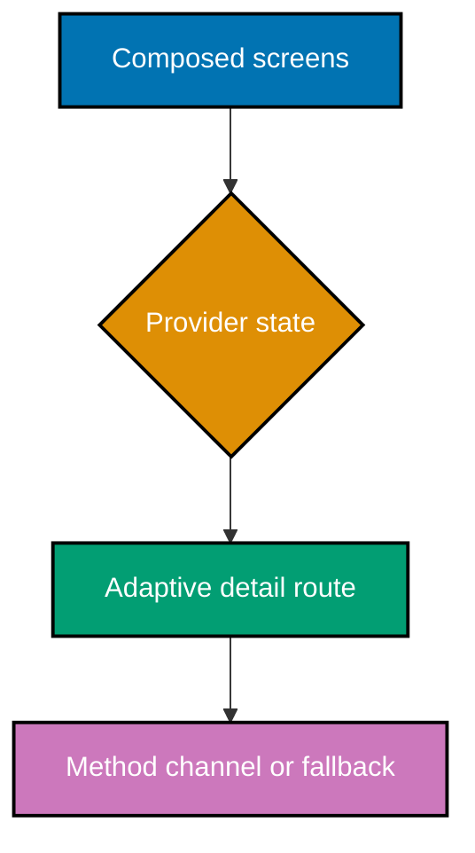

Focus Shelf is a deliberately small reader app for saved articles. It turns the course's pieces into one proof: shared state crosses two screens, the list reflows on a wide target, and a small platform call has a visible fallback rather than a hidden unsupported path.

## Goal and acceptance criteria

- A composed widget tree contains both local interaction state and app state supplied through `ChangeNotifierProvider` (co-03, co-04, co-06, co-16).
- `Navigator` opens an article detail screen while the provider-owned saved state remains shared (co-19).
- `LayoutBuilder` changes a narrow list into a wide master-detail view (co-28).
- A `MethodChannel` probes a platform capability and renders a documented fallback when no handler exists (co-25, co-30).
- `flutter test` proves a deterministic state transition and a widget interaction (co-29).
- The same package builds for two installed targets with `flutter build <target>` (co-27).

## Build it

1. Copy `code/pubspec.yaml` and `code/lib/main.dart` into a fresh `flutter create focus_shelf` project. Run `flutter pub get`; provider is introduced here because app state crosses independently navigated screens, which local `setState` cannot own cleanly.
2. Run `flutter test` to prove the Save interaction changes its visible label to `Saved`, the list shows the saved star after returning from detail, the missing-channel fallback is rendered, and a wide viewport keeps the selected detail in its master-detail pane. Then run `flutter run` on a narrow target and a wide desktop target; select an article and use Save from either layout.
3. The channel deliberately catches `MissingPluginException`. Add a platform handler only when a real native capability is required, preserving the fallback text for every unsupported target.
4. Build any two installed targets, for example `flutter build apk` and `flutter build macos`. Artifact names and host support differ by target, so treat a build as target-specific evidence rather than proof that every platform is configured.

## Complete source artifacts

`code/lib/main.dart` supplies the complete runnable composition root, model, provider state, adaptive list/detail UI, navigation, and contained method-channel fallback. `code/test/focus_shelf_test.dart` covers the model transition plus narrow Save/detail/list interaction, the missing-channel fallback, and the wide master-detail selection behaviour. The source uses an invented article list and never calls a live service, so the acceptance path remains deterministic.

## Acceptance evidence

- `flutter test` passes in the copied project.
- On a narrow runner, selecting an article opens its detail route; on a wide runner, selection changes the detail pane.
- Saving an item changes the detail button from `Save` to `Saved`; returning to the narrow list shows its saved star, proving the same provider state is shared across both routes.
- An absent native handler renders `Native hint unavailable on this target` rather than throwing.
- Two target-specific `flutter build` commands complete on targets installed by the host.

## Why this is the right-sized capstone

Focus Shelf omits accounts, live networking, sync, analytics, and full native integration because each would dilute the ownership proof. The useful production habit is smaller: name the owner of state, leave a platform edge at the edge, and make the fallback a visible user-facing decision.
