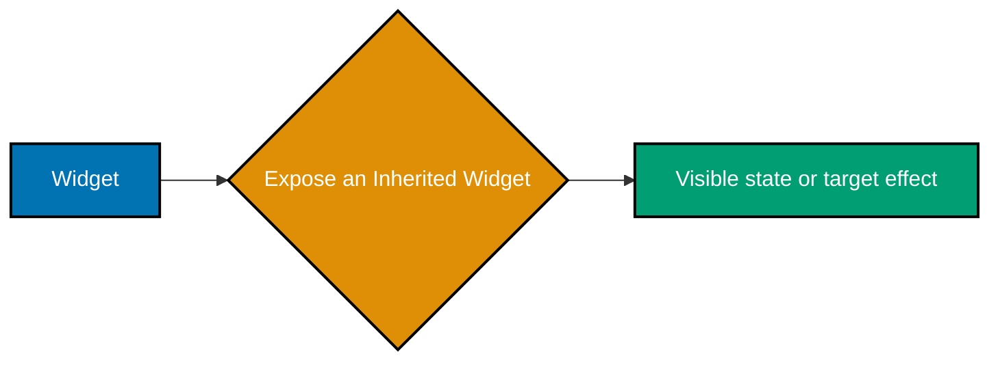
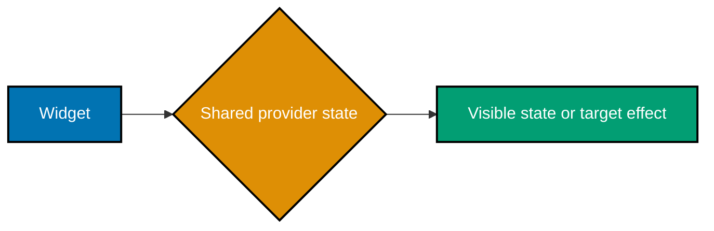
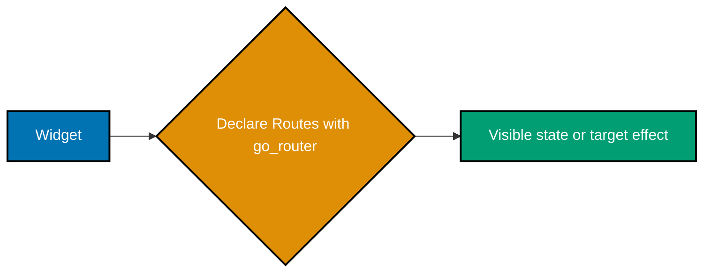
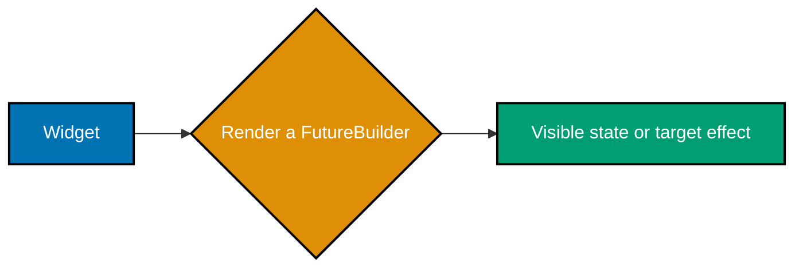

Examples 27–54 move state and navigation across widget boundaries, then introduce packages only where Flutter's built-in primitives stop at an explicit boundary. Package snippets name their dependency and the core idea they extend.

## External dependency boundaries

`provider` (Examples 31–33 and 54) packages the `InheritedWidget`/notification pattern so several
screens can observe one `ChangeNotifier`; use local `setState` first when state does not cross that
boundary. `go_router` (Examples 42–43) adds declarative route configuration and deep-link support
after the built-in `Navigator` examples establish push/pop mechanics. `http`, `shared_preferences`,
and `sqflite` (Examples 46–52) provide production I/O and storage capabilities that Flutter's UI
library does not supply; put each behind a small app-owned boundary so a screen does not depend on a
package API directly.

### Example 27: Observe the Constraints Model

_ex-27 · exercises co-11_

Use `LayoutBuilder` to inspect the `BoxConstraints` supplied by the parent before choosing a layout. Resize the available width and observe the reported maximum change.


```dart
LayoutBuilder(builder: (_, constraints) => Text('max width: ' + constraints.maxWidth.toString()));
// => Parents pass constraints down before a child selects a size.
```

**Key takeaway**: Flutter layout flows from parent constraints to child size selection, then back to parent placement.

**Why It Matters**: Understanding constraints exposes the cause of overflow and unexpected sizes instead of treating layout behavior as a platform-specific mystery.

### Example 28: Render Your Own Pixels

_ex-28 · exercises co-11_

Implement `CustomPainter.paint` to draw a teal circle on the provided canvas. Return `false` from `shouldRepaint` because this example has no changing paint inputs.

```dart
class DotPainter extends CustomPainter { @override void paint(Canvas canvas, Size size) => canvas.drawCircle(size.center(Offset.zero), 24, Paint()..color = Colors.teal); @override bool shouldRepaint(DotPainter old) => false; }
const CustomPaint(painter: DotPainter()); // => Flutter paints its own pixels on a Canvas.
```

**Key takeaway**: `CustomPaint` delegates drawing to a painter when standard widgets cannot express a visual precisely.

**Why It Matters**: A focused painter keeps custom rendering contained and lets Flutter skip repaint work when its inputs are unchanged.

### Example 29: Expose an Inherited Widget

_ex-29 · exercises co-15_

Create an `InheritedWidget` that carries the saved count and compares it with the old value in `updateShouldNotify`. Place it above every descendant that needs the count.



```dart
class ShelfScope extends InheritedWidget { const ShelfScope({required this.count, required super.child, super.key}); final int count; @override bool updateShouldNotify(ShelfScope old) => count != old.count; }
// => An InheritedWidget exposes shared data to descendants.
```

**Key takeaway**: An `InheritedWidget` distributes immutable snapshots of shared data down a widget subtree.

**Why It Matters**: This makes the scope and update rule for shared context explicit rather than passing the same value through every intermediate widget.

### Example 30: Look Up Inherited Data

_ex-30 · exercises co-15_

Call `dependOnInheritedWidgetOfExactType` to obtain the nearest `ShelfScope` and render its count. The dependency registration means a notification from that scope triggers a rebuild here.

```dart
final scope = context.dependOnInheritedWidgetOfExactType<ShelfScope>()!;
return Text(scope.count.toString() + ' saved');
// => This lookup rebuilds when ShelfScope notifies.
```

**Key takeaway**: A context dependency both reads inherited data and subscribes the widget to relevant updates.

**Why It Matters**: Consumers update automatically when shared data changes without forcing unrelated ancestors to manage refreshes.

### Example 31: Provide a ChangeNotifier

_ex-31 · exercises co-16_

Define a `ChangeNotifier` that mutates its saved count and calls `notifyListeners`, then place it in a `ChangeNotifierProvider`. Descendants can now observe the model through Provider's inherited boundary.


```dart
class ShelfModel extends ChangeNotifier { int saved = 0; void add() { saved++; notifyListeners(); } }
ChangeNotifierProvider(create: (_) => ShelfModel(), child: const ShelfScreen());
// => Provider exposes a notifier to the widget subtree.
```

**Key takeaway**: `ChangeNotifierProvider` owns a notifier for a subtree and disposes it when that scope is removed.

**Why It Matters**: A provider boundary gives app-wide or multi-screen state one clear lifetime and one observable update path.

### Example 32: Rebuild a Consumer

_ex-32 · exercises co-16_

Wrap only the text that displays the count in a `Consumer<ShelfModel>`. Trigger `add` and see that the consumer builder receives the notifier's latest state.

```dart
Consumer<ShelfModel>(builder: (_, shelf, __) => Text(shelf.saved.toString() + ' saved'));
// => Consumer rebuilds the widget that reads provider state.
```

**Key takeaway**: `Consumer` rebuilds its builder when the selected provider notifies listeners.

**Why It Matters**: Narrow consumers keep notifications from rebuilding an entire screen when only one small visual fragment depends on the state.

### Example 33: Share Provider State Across Screens

_ex-33 · exercises co-16_

Place the provider above the navigator so both the list and its pushed detail route can read the same model. Save an item on one screen and inspect the shared result on the other.



```dart
context.read<ShelfModel>().save(article);
Navigator.of(context).push(MaterialPageRoute<void>(builder: (_) => ArticleDetail(article: article)));
// => Both routes read the same provider-owned saved state.
```

**Key takeaway**: Provider state is shared by every descendant route below the provider's placement in the tree.

**Why It Matters**: Putting cross-screen state above navigation prevents duplicate models and conflicting copies of user actions.

### Example 34: Keep Ephemeral State Local

_ex-34 · exercises co-18_

Keep a temporary field such as an expanded panel flag in the stateful widget that renders it. Toggle it with `setState` instead of promoting it to a global model.

```dart
class DraftField extends StatefulWidget { const DraftField({super.key}); @override State<DraftField> createState() => _DraftFieldState(); }
class _DraftFieldState extends State<DraftField> { String draft=''; @override Widget build(BuildContext context) => TextField(onChanged: (text) => setState(() => draft=text)); }
// => One-screen input is ephemeral local state.
```

**Key takeaway**: State that has one screen-sized lifetime and no outside consumer should stay local to that screen.

**Why It Matters**: Local ownership reduces coupling and prevents short-lived visual details from becoming accidental application state.

### Example 35: Lift Shared App State

_ex-35 · exercises co-18_

Move state upward only when siblings or routes need the same source of truth. Pass data and callbacks down until a shared owner becomes necessary.

```dart
class SavedShelf extends ChangeNotifier { final Set<String> ids={}; void toggle(String id) { ids.contains(id) ? ids.remove(id) : ids.add(id); notifyListeners(); } }
// => Shared state is lifted above independently navigated screens.
```

**Key takeaway**: Lift state to the nearest common owner of every widget that reads or changes it.

**Why It Matters**: The nearest common owner avoids both prop drilling through unrelated layers and a needlessly global store.

### Example 36: Compare a Reactive Store

_ex-36 · exercises co-17_

Compare a small reactive store with a `ChangeNotifier` by tracing where mutations occur and who rebuilds. Choose the simplest mechanism that still makes update ownership clear.

```dart
// pubspec.yaml: flutter_riverpod: ^2.0.0
final savedIdsProvider = StateProvider<Set<String>>((ref) => {});
// => Riverpod is a community store alternative, not a Flutter primitive.
```

**Key takeaway**: A state-management package should earn its complexity by solving a real sharing or update problem.

**Why It Matters**: Comparing the update contract—not just APIs—keeps state architecture understandable as features grow.

### Example 37: Push a Detail Screen

_ex-37 · exercises co-19_

Call `Navigator.of(context).push` with a route that builds the selected article's detail screen. The new route sits above the list and preserves the list beneath it.


```dart
Navigator.of(context).push(MaterialPageRoute<void>(builder: (_) => ArticleDetail(article: article)));
// => Navigator.push puts a detail route on the stack.
```

**Key takeaway**: Pushing a route adds a new screen to the navigator stack without destroying the previous route.

**Why It Matters**: Stack-based navigation preserves user context and gives the system back gesture a predictable destination.

### Example 38: Pop Back to the List

_ex-38 · exercises co-19_

Call `Navigator.pop(context)` from the detail screen to remove the top route and reveal the list again. Optionally return a result for the list to handle.

```dart
Navigator.of(context).pop();
// => pop removes the current detail route and reveals the list.
```

**Key takeaway**: `Navigator.pop` reverses the most recent push and can deliver a value to the awaiting route.

**Why It Matters**: A matched push and pop lifecycle makes back navigation and post-detail updates straightforward to reason about.

### Example 39: Build a Material Page Route

_ex-39 · exercises co-19_

Use `MaterialPageRoute` when pushing a screen that should receive Material's standard transition behavior. Supply its builder with the destination widget.

```dart
final route = MaterialPageRoute<String>(builder: (_) => const ConfirmSaveScreen());
final result = await Navigator.of(context).push(route);
// => MaterialPageRoute describes a transition and can return typed data.
```

**Key takeaway**: `MaterialPageRoute` couples a destination builder with platform-appropriate Material route behavior.

**Why It Matters**: Naming the route type at the navigation call clarifies what transition and back-stack semantics a screen uses.

### Example 40: Declare a Named Route

_ex-40 · exercises co-20_

Register a screen builder in the app's `routes` map under a stable path-like name. The declaration centralizes the mapping from route name to destination.

```dart
MaterialApp(routes: {'/': (_) => const ArticleList(), '/settings': (_) => const SettingsScreen()});
// => A routes map centralizes names for a small app.
```

**Key takeaway**: Named routes give a simple navigator configuration a reusable identifier for each destination.

**Why It Matters**: Central route declarations make small applications easier to scan before their navigation needs justify a declarative router.

### Example 41: Push a Named Route

_ex-41 · exercises co-20_

Call `Navigator.pushNamed` with the registered destination name and optional arguments. The navigator resolves the name through the route map.

```dart
Navigator.of(context).pushNamed('/detail', arguments: article.id);
// => A name selects a route and arguments identify the article.
```

**Key takeaway**: `pushNamed` separates the navigation intent from the destination widget construction at the call site.

**Why It Matters**: A consistent route name avoids repeated constructor details and makes route-level refactors less invasive.

### Example 42: Declare Routes with go_router

_ex-42 · exercises co-21_

Declare `GoRoute` entries in a `GoRouter` when the app needs a route table that also supports URL paths and deep links. Keep the route path and its screen builder together.



```dart
// pubspec.yaml: go_router: ^14.0.0
final router = GoRouter(routes: [GoRoute(path: '/', builder: (_, __) => const ArticleList()), GoRoute(path: '/article/:id', builder: (_, state) => ArticleDetail(id: state.pathParameters['id']!))]);
// => go_router declares deep-linkable routes.
```

**Key takeaway**: `go_router` provides declarative route configuration on top of Flutter's navigation primitives.

**Why It Matters**: Declarative paths make web URLs, deep links, redirects, and nested navigation easier to evolve than scattered imperative pushes.

### Example 43: Read a go_router Path Parameter

_ex-43 · exercises co-21_

Read the article ID from `GoRouterState.pathParameters` in the destination builder. Validate or look up that identifier before rendering the detail screen.

```dart
GoRoute(path: '/article/:id', builder: (_, state) { final id = state.pathParameters['id']!; return ArticleDetail(id: id); });
// => pathParameters carries a segment from the URL.
```

**Key takeaway**: Path parameters carry the variable segment of a declarative route into its screen builder.

**Why It Matters**: Treating route values as explicit inputs makes deep-linked screens reproducible and avoids hidden global selection state.

### Example 44: Render a FutureBuilder

_ex-44 · exercises co-22_

Give `FutureBuilder` a future and branch on its snapshot while the operation is pending, failed, or completed. Render only the data state once the future resolves.



```dart
FutureBuilder<Article>(future: repository.featured(), builder: (_, snapshot) { if (!snapshot.hasData) return const CircularProgressIndicator(); return Text(snapshot.requireData.title); });
// => FutureBuilder renders the latest asynchronous snapshot.
```

**Key takeaway**: `FutureBuilder` turns the one-time lifecycle of a `Future` into explicit UI states.

**Why It Matters**: Explicit asynchronous states prevent a loading screen from pretending that absent data is an empty successful result.

### Example 45: Render a StreamBuilder

_ex-45 · exercises co-22_

Give `StreamBuilder` a stream whose new values should update the UI over time. Use the snapshot to distinguish waiting, error, and latest-data states.

```dart
StreamBuilder<int>(stream: savedCountStream, initialData: 0, builder: (_, snapshot) => Text(snapshot.requireData.toString() + ' saved'));
// => StreamBuilder redraws when a new event arrives.
```

**Key takeaway**: `StreamBuilder` rebuilds from successive stream events rather than a single completion.

**Why It Matters**: This keeps live updates observable and makes the screen's behavior under stream failure or no data deliberate.

### Example 46: Fetch with http.get

_ex-46 · exercises co-23_

Call `http.get` with a parsed URI and inspect the response before treating it as application data. Keep the HTTP call behind a repository method rather than embedding it in a widget.

```dart
import 'package:http/http.dart' as http;
Future<http.Response> fetchArticles() => http.get(Uri.https('example.com', '/articles'));
// => Keep a changing HTTP edge in a named, replaceable function.
```

**Key takeaway**: `http.get` performs an asynchronous request; response status and body still require application-level handling.

**Why It Matters**: A repository boundary makes network failures, retries, and test doubles manageable without coupling the UI to transport details.

### Example 47: Decode JSON

_ex-47 · exercises co-23_

Use `jsonDecode` to convert a response body into a Dart map or list, then map only the expected fields into an `Article`. Validate shape and types at this boundary.

```dart
import 'dart:convert';
final json = jsonDecode('{"id":"widgets","title":"Compose widgets"}') as Map<String, dynamic>;
final article = Article(id: json['id'] as String, title: json['title'] as String);
```

**Key takeaway**: JSON decoding creates untyped dynamic data that should be translated into app-owned model values promptly.

**Why It Matters**: Parsing at the boundary confines remote schema changes and gives the rest of the app stable, typed concepts.

### Example 48: Render HTTP Data in a Widget

_ex-48 · exercises co-23, co-22_

Pass the repository's fetch future into a `FutureBuilder` and render the decoded model only after success. Keep request creation outside the builder so rebuilds do not repeatedly start the call.


```dart
FutureBuilder<http.Response>(future: fetchArticles(), builder: (_, snapshot) { if (!snapshot.hasData) return const CircularProgressIndicator(); final items = jsonDecode(snapshot.requireData.body) as List<dynamic>; return Text(items.length.toString() + ' articles'); });
// => The widget renders data only after the request resolves.
```

**Key takeaway**: A widget consumes repository data through asynchronous UI states rather than performing transport work inline.

**Why It Matters**: Separating fetch, decode, and render decisions makes each failure mode testable and keeps rebuilds free of accidental requests.

### Example 49: Persist a Shared Preference

_ex-49 · exercises co-24_

Obtain `SharedPreferences` and store a small scalar preference such as a display setting. Read it during initialization and treat it as a local cache, not an authoritative data store.

```dart
import 'package:shared_preferences/shared_preferences.dart';
Future<void> rememberSort(String sort) async => (await SharedPreferences.getInstance()).setString('sort', sort);
// => SharedPreferences stores a small key-value preference.
```

**Key takeaway**: `shared_preferences` suits simple key-value settings that should survive app restarts.

**Why It Matters**: Keeping preferences limited to small user choices avoids turning a convenience store into an unqueryable application database.

### Example 50: Round Trip SQLite Data

_ex-50 · exercises co-24_

Open a SQLite database, insert an article record, and query it back through the same repository boundary. Model the row-to-article conversion alongside the database call.


```dart
import 'package:sqflite/sqflite.dart';
Future<void> saveArticle(Database db, Article article) => db.insert('articles', {'id': article.id, 'title': article.title}, conflictAlgorithm: ConflictAlgorithm.replace);
// => SQLite stores structured local rows.
```

**Key takeaway**: SQLite supports structured local data and queries when key-value preferences are no longer sufficient.

**Why It Matters**: A repository-owned persistence layer keeps SQL, migrations, and model mapping out of presentation widgets.

### Example 51: Restore Persisted Data

_ex-51 · exercises co-24_

Load previously stored records during the model or repository's initialization path, then expose the restored list to the UI. Render a loading state until restoration completes.

```dart
Future<String> restoreSort() async => (await SharedPreferences.getInstance()).getString('sort') ?? 'recent';
// => A fallback makes first launch deterministic.
```

**Key takeaway**: Restored state is asynchronous input and needs the same loading and failure treatment as network data.

**Why It Matters**: Explicit restoration avoids briefly showing an empty but incorrect screen before local data is available.

### Example 52: Build a List from Network Data

_ex-52 · exercises co-14, co-23_

Use the completed network snapshot as the data source for `ListView.builder`. Each row reads its article from the indexed, decoded collection rather than from raw response data.

```dart
FutureBuilder<List<Article>>(future: repository.fetchArticles(), builder: (_, snapshot) => ListView.builder(itemCount: snapshot.data?.length ?? 0, itemBuilder: (_, index) => ListTile(title: Text(snapshot.requireData[index].title))));
// => Network data becomes lazy list rows.
```

**Key takeaway**: A lazy list can render asynchronous model data once the request has supplied a successful collection.

**Why It Matters**: The indexing boundary keeps large remote collections efficient while preserving a clear distinction between no data and not-yet-loaded data.

### Example 53: Render Loading and Error State

_ex-53 · exercises co-22, co-08_

Branch the snapshot into a progress indicator, a retry message, or the successful article list. Exercise each branch with waiting, error, and data snapshots in a widget test.


```dart
Widget body(AsyncSnapshot<List<Article>> snapshot) { if (snapshot.connectionState == ConnectionState.waiting) return const CircularProgressIndicator(); if (snapshot.hasError) return Text('Retry'); return ListView(children: [for (final article in snapshot.requireData) Text(article.title)]); }
// => Loading, failure, and data each get deliberate UI.
```

**Key takeaway**: Loading, failure, and success are separate user-facing states, not incidental details of one data widget.

**Why It Matters**: Deliberate asynchronous feedback gives users a recovery path and prevents an error from being mistaken for an empty result.

### Example 54: Update a Provider List

_ex-54 · exercises co-16, co-14_

Add an article through the `ArticleShelf` notifier and call `notifyListeners` after mutating its list. A `Consumer` then rebuilds with the new item count.

```dart
class ArticleShelf extends ChangeNotifier { final List<Article> articles=[]; void add(Article article) { articles.add(article); notifyListeners(); } }
Consumer<ArticleShelf>(builder: (_, shelf, __) => Text(shelf.articles.length.toString() + ' articles'));
// => Notifier mutations update every consumer.
```

**Key takeaway**: Mutate provider-owned collections through model methods that publish one intentional notification.

**Why It Matters**: Encapsulated updates preserve collection invariants and give every observing screen a consistent next state.
