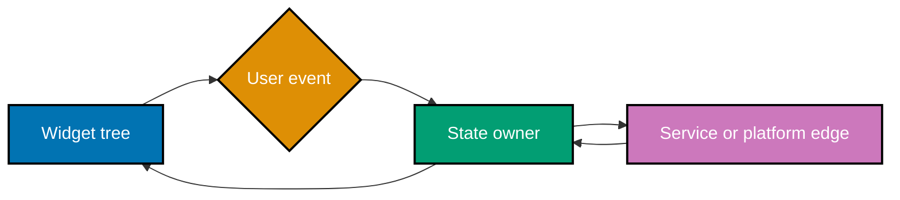

This code-first route applies the Dart vocabulary from the prerequisite to Flutter's widget tree, state boundaries, navigation, changing data, and platform seams. Every ordinary block is a small Flutter program or an intentionally scoped project command; external packages appear only after the built-in primitive they extend.

## Prerequisites

Complete [72 · Just Enough Dart](../../just-enough-dart/learning/overview.md) and [Frontend Essentials](../../frontend-essentials/learning/overview.md). Install a current stable Flutter SDK and one target runner. Use `flutter doctor` to find host-specific setup gaps before treating a course example as a product release.

## Learning route

- [Beginner examples](./beginner.md) establish Flutter tooling, widgets, local state, layout, and lists (Examples 1–26).
- [Intermediate examples](./intermediate.md) establish inherited and shared state, navigation, async UI, networking, and persistence (Examples 27–54).
- [Advanced examples](./advanced.md) apply platform channels, plugins, builds, adaptive layouts, testing, and the integrated screen slice (Examples 55–78).
- [Capstone](./capstone/overview.md) joins those decisions into a runnable adaptive app.

## Concept map

- **co-01 · flutter-cli** — `flutter create`, `run`, `build`, and `test` scaffold, execute, package, and verify an app; DevTools inspects a running build.
- **co-02 · everything-is-a-widget** — A Flutter interface is a tree of widgets: structure, layout, styling, and interaction all use widgets.
- **co-03 · stateless-widget** — A `StatelessWidget` describes UI from configuration through `build(BuildContext)`.
- **co-04 · stateful-widget** — A `StatefulWidget` has a persistent `State` object that holds mutable screen-local state across rebuilds.
- **co-05 · build-context** — `BuildContext` identifies a widget's location and provides inherited values such as theme.
- **co-06 · widget-composition** — Small widgets compose into screens, so each rendering responsibility stays local.
- **co-07 · state-lifecycle** — `initState` acquires one-time resources and `dispose` releases owned resources when the state leaves the tree.
- **co-08 · setstate** — `setState` marks local state dirty and schedules a rebuild of the affected subtree.
- **co-09 · layout-widgets** — `Row`, `Column`, `Container`, and `Stack` arrange and decorate children.
- **co-10 · flex-layout** — `Expanded`, `Flexible`, and axis alignment distribute available space deliberately.
- **co-11 · constraints-model** — Parents pass constraints down, children choose sizes, and parents position them; Flutter renders its own pixels.
- **co-12 · material-widgets** — `MaterialApp`, `Scaffold`, `AppBar`, `Text`, and `ElevatedButton` form a standard Material screen.
- **co-13 · cupertino-widgets** — `CupertinoApp` and Cupertino widgets offer an iOS-styled widget family.
- **co-14 · lists** — `ListView` and `ListView.builder` render scrolling collections, with builder rows created lazily.
- **co-15 · inherited-widget** — An `InheritedWidget` propagates shared data efficiently through a subtree.
- **co-16 · provider** — `ChangeNotifier`, `ChangeNotifierProvider`, and `Consumer` offer a practical shared-state boundary.
- **co-17 · reactive-store** — Community stores such as Riverpod and bloc can scale state coordination beyond provider; they are ecosystem options, not framework requirements.
- **co-18 · ephemeral-vs-app-state** — Keep screen-local interaction state in `setState`; put state shared across screens in an app-state solution.
- **co-19 · navigation-imperative** — `Navigator.push` and `pop` with `MaterialPageRoute` move between screens imperatively.
- **co-20 · named-routes** — A routes map and `Navigator.pushNamed` centralize route names, though newer apps commonly prefer a declarative router.
- **co-21 · go-router** — `go_router` declares routes and supports deep links; introduce it after the core Navigator model is clear.
- **co-22 · async-ui** — `FutureBuilder` and `StreamBuilder` render from the latest asynchronous snapshot.
- **co-23 · networking** — The `http` package fetches data and `jsonDecode` parses JSON; isolate the changing network edge.
- **co-24 · local-persistence** — `shared_preferences` stores small key-value data and `sqflite` provides local SQLite storage.
- **co-25 · platform-channels** — `MethodChannel` makes asynchronous, untyped calls to platform code and must contain platform-specific behaviour.
- **co-26 · plugins** — pub.dev plugins package native capabilities behind a Dart API so most apps avoid direct channel code.
- **co-27 · multi-target-build** — `flutter build` produces target-specific artifacts from one Dart codebase.
- **co-28 · adaptive-responsive-layout** — `LayoutBuilder` and `MediaQuery` reflow interfaces between phone and desktop form factors.
- **co-29 · testing** — Flutter supports unit, widget, and integration test tiers; `testWidgets` supplies a `WidgetTester`.
- **co-30 · cross-platform-tradeoffs** — Own-pixel rendering buys a consistent shared codebase while fidelity, binary size, and OS-edge behaviour remain trade-offs.

## Scope guard

Use this course to decide which state a widget owns, which state the app owns, how a screen reaches a changing boundary, and where target-specific behaviour stops. It does not reteach Dart syntax, promise native-pixel fidelity, or make a third-party state library mandatory. Native platform development remains the right choice when exact platform integration is the product itself.

## Architecture flow

The shapes and arrows carry the meaning as well as colour: the widget tree renders state, events cross upward to an owner, and changing external work stays behind a named boundary.

## Examples by Level

### Beginner (Examples 1–26)

- [Example 1: Flutter Create](/en/learn/courses/hybrid-app-development/learning/beginner#example-1-flutter-create)
- [Example 2: Flutter Run](/en/learn/courses/hybrid-app-development/learning/beginner#example-2-flutter-run)
- [Example 3: Run Flutter Test](/en/learn/courses/hybrid-app-development/learning/beginner#example-3-run-flutter-test)
- [Example 4: Build Only Widgets](/en/learn/courses/hybrid-app-development/learning/beginner#example-4-build-only-widgets)
- [Example 5: Render a Stateless Widget](/en/learn/courses/hybrid-app-development/learning/beginner#example-5-render-a-stateless-widget)
- [Example 6: Read Configuration in Build](/en/learn/courses/hybrid-app-development/learning/beginner#example-6-read-configuration-in-build)
- [Example 7: Compose Reusable Widgets](/en/learn/courses/hybrid-app-development/learning/beginner#example-7-compose-reusable-widgets)
- [Example 8: Keep Stateful Widget State](/en/learn/courses/hybrid-app-development/learning/beginner#example-8-keep-stateful-widget-state)
- [Example 9: Increment with setState](/en/learn/courses/hybrid-app-development/learning/beginner#example-9-increment-with-setstate)
- [Example 10: Acquire in initState](/en/learn/courses/hybrid-app-development/learning/beginner#example-10-acquire-in-initstate)
- [Example 11: Release in dispose](/en/learn/courses/hybrid-app-development/learning/beginner#example-11-release-in-dispose)
- [Example 12: Read Theme from Context](/en/learn/courses/hybrid-app-development/learning/beginner#example-12-read-theme-from-context)
- [Example 13: Lay Out a Column](/en/learn/courses/hybrid-app-development/learning/beginner#example-13-lay-out-a-column)
- [Example 14: Lay Out a Row](/en/learn/courses/hybrid-app-development/learning/beginner#example-14-lay-out-a-row)
- [Example 15: Decorate a Container](/en/learn/courses/hybrid-app-development/learning/beginner#example-15-decorate-a-container)
- [Example 16: Overlay with Stack](/en/learn/courses/hybrid-app-development/learning/beginner#example-16-overlay-with-stack)
- [Example 17: Share Space with Expanded](/en/learn/courses/hybrid-app-development/learning/beginner#example-17-share-space-with-expanded)
- [Example 18: Align Along the Main Axis](/en/learn/courses/hybrid-app-development/learning/beginner#example-18-align-along-the-main-axis)
- [Example 19: Align Along the Cross Axis](/en/learn/courses/hybrid-app-development/learning/beginner#example-19-align-along-the-cross-axis)
- [Example 20: Create a Material App and Scaffold](/en/learn/courses/hybrid-app-development/learning/beginner#example-20-create-a-material-app-and-scaffold)
- [Example 21: Render an App Bar](/en/learn/courses/hybrid-app-development/learning/beginner#example-21-render-an-app-bar)
- [Example 22: Handle an Elevated Button](/en/learn/courses/hybrid-app-development/learning/beginner#example-22-handle-an-elevated-button)
- [Example 23: Style a Text Widget](/en/learn/courses/hybrid-app-development/learning/beginner#example-23-style-a-text-widget)
- [Example 24: Survey Cupertino Widgets](/en/learn/courses/hybrid-app-development/learning/beginner#example-24-survey-cupertino-widgets)
- [Example 25: Render a Static ListView](/en/learn/courses/hybrid-app-development/learning/beginner#example-25-render-a-static-listview)
- [Example 26: Build a Lazy ListView](/en/learn/courses/hybrid-app-development/learning/beginner#example-26-build-a-lazy-listview)

### Intermediate (Examples 27–54)

- [Example 27: Observe the Constraints Model](/en/learn/courses/hybrid-app-development/learning/intermediate#example-27-observe-the-constraints-model)
- [Example 28: Render Your Own Pixels](/en/learn/courses/hybrid-app-development/learning/intermediate#example-28-render-your-own-pixels)
- [Example 29: Expose an Inherited Widget](/en/learn/courses/hybrid-app-development/learning/intermediate#example-29-expose-an-inherited-widget)
- [Example 30: Look Up Inherited Data](/en/learn/courses/hybrid-app-development/learning/intermediate#example-30-look-up-inherited-data)
- [Example 31: Provide a ChangeNotifier](/en/learn/courses/hybrid-app-development/learning/intermediate#example-31-provide-a-changenotifier)
- [Example 32: Rebuild a Consumer](/en/learn/courses/hybrid-app-development/learning/intermediate#example-32-rebuild-a-consumer)
- [Example 33: Share Provider State Across Screens](/en/learn/courses/hybrid-app-development/learning/intermediate#example-33-share-provider-state-across-screens)
- [Example 34: Keep Ephemeral State Local](/en/learn/courses/hybrid-app-development/learning/intermediate#example-34-keep-ephemeral-state-local)
- [Example 35: Lift Shared App State](/en/learn/courses/hybrid-app-development/learning/intermediate#example-35-lift-shared-app-state)
- [Example 36: Compare a Reactive Store](/en/learn/courses/hybrid-app-development/learning/intermediate#example-36-compare-a-reactive-store)
- [Example 37: Push a Detail Screen](/en/learn/courses/hybrid-app-development/learning/intermediate#example-37-push-a-detail-screen)
- [Example 38: Pop Back to the List](/en/learn/courses/hybrid-app-development/learning/intermediate#example-38-pop-back-to-the-list)
- [Example 39: Build a Material Page Route](/en/learn/courses/hybrid-app-development/learning/intermediate#example-39-build-a-material-page-route)
- [Example 40: Declare a Named Route](/en/learn/courses/hybrid-app-development/learning/intermediate#example-40-declare-a-named-route)
- [Example 41: Push a Named Route](/en/learn/courses/hybrid-app-development/learning/intermediate#example-41-push-a-named-route)
- [Example 42: Declare Routes with go_router](/en/learn/courses/hybrid-app-development/learning/intermediate#example-42-declare-routes-with-go_router)
- [Example 43: Read a go_router Path Parameter](/en/learn/courses/hybrid-app-development/learning/intermediate#example-43-read-a-go_router-path-parameter)
- [Example 44: Render a FutureBuilder](/en/learn/courses/hybrid-app-development/learning/intermediate#example-44-render-a-futurebuilder)
- [Example 45: Render a StreamBuilder](/en/learn/courses/hybrid-app-development/learning/intermediate#example-45-render-a-streambuilder)
- [Example 46: Fetch with http.get](/en/learn/courses/hybrid-app-development/learning/intermediate#example-46-fetch-with-http-get)
- [Example 47: Decode JSON](/en/learn/courses/hybrid-app-development/learning/intermediate#example-47-decode-json)
- [Example 48: Render HTTP Data in a Widget](/en/learn/courses/hybrid-app-development/learning/intermediate#example-48-render-http-data-in-a-widget)
- [Example 49: Persist a Shared Preference](/en/learn/courses/hybrid-app-development/learning/intermediate#example-49-persist-a-shared-preference)
- [Example 50: Round Trip SQLite Data](/en/learn/courses/hybrid-app-development/learning/intermediate#example-50-round-trip-sqlite-data)
- [Example 51: Restore Persisted Data](/en/learn/courses/hybrid-app-development/learning/intermediate#example-51-restore-persisted-data)
- [Example 52: Build a List from Network Data](/en/learn/courses/hybrid-app-development/learning/intermediate#example-52-build-a-list-from-network-data)
- [Example 53: Render Loading and Error State](/en/learn/courses/hybrid-app-development/learning/intermediate#example-53-render-loading-and-error-state)
- [Example 54: Update a Provider List](/en/learn/courses/hybrid-app-development/learning/intermediate#example-54-update-a-provider-list)

### Advanced (Examples 55–78)

- [Example 55: Invoke a Method Channel](/en/learn/courses/hybrid-app-development/learning/advanced#example-55-invoke-a-method-channel)
- [Example 56: Handle a Native Method Channel Call](/en/learn/courses/hybrid-app-development/learning/advanced#example-56-handle-a-native-method-channel-call)
- [Example 57: Use a Native Plugin](/en/learn/courses/hybrid-app-development/learning/advanced#example-57-use-a-native-plugin)
- [Example 58: Handle a Platform Fallback](/en/learn/courses/hybrid-app-development/learning/advanced#example-58-handle-a-platform-fallback)
- [Example 59: Build an Android Artifact](/en/learn/courses/hybrid-app-development/learning/advanced#example-59-build-an-android-artifact)
- [Example 60: Build a Desktop Artifact](/en/learn/courses/hybrid-app-development/learning/advanced#example-60-build-a-desktop-artifact)
- [Example 61: Build One Codebase for Two Targets](/en/learn/courses/hybrid-app-development/learning/advanced#example-61-build-one-codebase-for-two-targets)
- [Example 62: Branch with LayoutBuilder](/en/learn/courses/hybrid-app-development/learning/advanced#example-62-branch-with-layoutbuilder)
- [Example 63: Choose a MediaQuery Breakpoint](/en/learn/courses/hybrid-app-development/learning/advanced#example-63-choose-a-mediaquery-breakpoint)
- [Example 64: Reflow from Phone to Desktop](/en/learn/courses/hybrid-app-development/learning/advanced#example-64-reflow-from-phone-to-desktop)
- [Example 65: Build Responsive Master Detail](/en/learn/courses/hybrid-app-development/learning/advanced#example-65-build-responsive-master-detail)
- [Example 66: Pump a Widget Test](/en/learn/courses/hybrid-app-development/learning/advanced#example-66-pump-a-widget-test)
- [Example 67: Tap in a Widget Test](/en/learn/courses/hybrid-app-development/learning/advanced#example-67-tap-in-a-widget-test)
- [Example 68: Test Pure Model Logic](/en/learn/courses/hybrid-app-development/learning/advanced#example-68-test-pure-model-logic)
- [Example 69: Drive an Integration Test](/en/learn/courses/hybrid-app-development/learning/advanced#example-69-drive-an-integration-test)
- [Example 70: Run the Flutter Test Suite](/en/learn/courses/hybrid-app-development/learning/advanced#example-70-run-the-flutter-test-suite)
- [Example 71: Compare Native Fidelity](/en/learn/courses/hybrid-app-development/learning/advanced#example-71-compare-native-fidelity)
- [Example 72: Inspect Binary Size](/en/learn/courses/hybrid-app-development/learning/advanced#example-72-inspect-binary-size)
- [Example 73: Contain a Platform Edge](/en/learn/courses/hybrid-app-development/learning/advanced#example-73-contain-a-platform-edge)
- [Example 74: Combine Provider and Navigation](/en/learn/courses/hybrid-app-development/learning/advanced#example-74-combine-provider-and-navigation)
- [Example 75: Combine Adaptive Layout and State](/en/learn/courses/hybrid-app-development/learning/advanced#example-75-combine-adaptive-layout-and-state)
- [Example 76: Cache a Network List Offline](/en/learn/courses/hybrid-app-development/learning/advanced#example-76-cache-a-network-list-offline)
- [Example 77: Wire a Screen, Widget, and State Slice](/en/learn/courses/hybrid-app-development/learning/advanced#example-77-wire-a-screen-widget-and-state-slice)
- [Example 78: Preview the Multiplatform Capstone](/en/learn/courses/hybrid-app-development/learning/advanced#example-78-preview-the-multiplatform-capstone)
