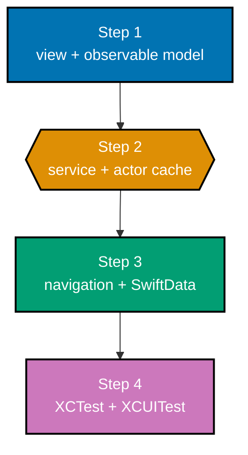

The capstone turns the course's pieces into Focus List, an invented iOS app for saved focus articles.
A list and detail screen render observable state; a view model receives an injected service; an
actor cache reduces duplicate work; SwiftData preserves saved articles; and tests prove both state
and flow.

## Goal and acceptance criteria

Build an app that satisfies all of the following:

- A SwiftUI screen renders local state and passes `@Binding` only to editable children (co-03,
  co-05, co-06).
- An `@Observable`, `@MainActor` view model owns explicit loading, content, and error states
  (co-07, co-18, co-19, co-24).
- An injected `ArticleService` decodes `Codable` data asynchronously and checks an actor cache before
  fetching (co-20, co-21, co-22, co-23, co-27).
- `NavigationStack` opens a selected article by stable ID, and SwiftData preserves a saved article across
  relaunch (co-16, co-26).
- XCTest covers a view-model transition, while XCUITest proves the list-to-detail flow (co-29,
  co-30).

## Build it

1. Create an iOS App target named `FocusList` with SwiftUI and a current iOS 17-or-later deployment
   target. Add a `FocusListModel` as an `@Observable`, `@MainActor` class and have the root view
   store it in `@State`.
2. Define `ArticleService`, a deterministic fixture service, and a production `URLSession`
   implementation. Decode JSON using `Codable`; before asking the service, check an `actor ArticleCache`. Model loading,
   content, and failure explicitly, and make retry call the same model method.
3. Add a `NavigationStack` list and a detail destination keyed by `Article.ID`. Persist saved
   articles with a SwiftData `@Model`; resolve the selected article from current state rather than placing
   a whole mutable model in the navigation path.
4. Add an XCTest for loading-to-content and an XCUITest that launches with
   `-useFixtureArticles YES -resetSavedArticles YES`. The reset argument clears SwiftData saved
   articles before each launch, so the test can tap fixture article `article-1`, assert `Save`, then
   verify the `Save` -> `Unsave` -> `Save` sequence deterministically. Run `xcodebuild test -scheme
FocusList -destination 'platform=iOS Simulator,name=iPhone 16'`.

## Complete source artifacts

The source-matched app is supplied in `learning/capstone/code/`: `FocusList.swift` contains the
`@main` composition root, `Codable` model, `URLSession` and fixture services, actor cache,
`@Observable` model, SwiftData `@Model` and container, and two SwiftUI screens;
`FocusListTests.swift` proves loading-to-content; `FocusListUITests.swift` proves the accessible,
fixture-backed list-to-detail Save -> Unsave flow with a reset SwiftData store. Add the first file to
the app target and the test files to their respective XCTest targets before running `xcodebuild test`.

## Acceptance evidence

- The app builds and launches on an installed simulator.
- Loading, content, retryable error, and empty content have distinct rendered states.
- The actor cache is the sole mutable in-memory cache owner.
- Navigation shows the selected article and SwiftData retains a saved article after relaunch.
- XCTest and XCUITest pass through `xcodebuild test`.

## Why this is the right-sized capstone

Focus List omits accounts, analytics, live infrastructure, and background sync. Those additions
would hide the proof. This narrow slice demonstrates the production habit that matters: put a
system event or changing source at a named edge, then let the view remain a deterministic rendering
of current state.
