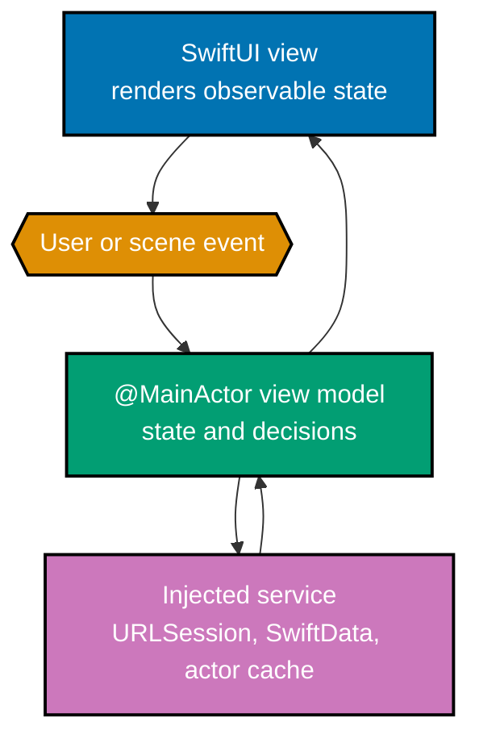

This is a code-first iOS course for a developer who already knows Swift. Create an iOS App project
in current Xcode, select an iOS 17-or-later deployment target for the Observation and SwiftData
examples, and run each app slice in a simulator. Build and test a project from its root with
`xcodebuild test -scheme FocusList -destination 'platform=iOS Simulator,name=iPhone 16'`; substitute
an installed simulator name when needed.

## Learning route

- [Beginner examples](./beginner.md) establish lifecycle, SwiftUI composition, local state,
  bindings, layout, controls, lists, forms, and previews (Examples 1–26).
- [Intermediate examples](./intermediate.md) establish Observation, MVVM, state modeling, data,
  navigation, presentation, dependency injection, and permission outcomes (Examples 27–54).
- [Advanced examples](./advanced.md) apply actor isolation, structured concurrency, SwiftData,
  unit/UI testing, and the end-to-end architecture (Examples 55–78).
- [Capstone](./capstone/overview.md) combines those boundaries into one deterministic small app.

## Concept map

- **co-01 · xcode-project** — Xcode builds an iOS target against an SDK; build SDK and deployment
  target answer different compatibility questions.
- **co-02 · app-scene-lifecycle** — `@main App` creates scenes and `scenePhase` reports system
  lifecycle changes.
- **co-03–06 · view, composition, state, binding** — views render values; owners hold mutable
  state; children receive bindings only when they edit the owner's value.
- **co-07–09 · Observation and environment** — `@Observable` tracks class properties; `@Bindable`
  derives a binding; the environment injects shared dependencies deliberately.
- **co-10–17 · UI and navigation** — stacks, modifier order, controls, lists, forms, previews,
  `NavigationStack`, sheets, and alerts turn state into an accessible interface.
- **co-18–22 · MVVM and data** — a view model models loading/content/error, decodes data, and starts
  view-owned async work without putting transport concerns in a view.
- **co-23–28 · platform boundaries** — actors serialize mutable state, `@MainActor` protects UI,
  structured tasks have lifetimes, SwiftData persists data, injected services stay testable, and
  permission denial remains a first-class result.
- **co-29–30 · tests** — unit tests verify logic; UI tests verify visible, accessible behaviour.

## Architecture flow

The diagram uses text, direction, shapes, and colour: state returns to the view, while events move
to the model and its explicit changing-data boundary.

## Scope guard

Keep Swift syntax in Just Enough Swift. Keep system permissions, lifecycle, navigation, persistence,
and UI isolation here. A view should not decide how HTTP works, an actor should not render UI, and a
test should target the narrowest layer that proves its claim.
