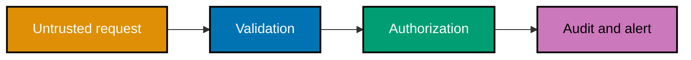

## Start with the asset, not the product

The first cluster turns vague "make it secure" requests into reviewable artifacts. The examples
progress from properties and boundaries to risk decisions, then to application controls. They use a
fictional expense service; no example probes, scans, or targets a real system.

### Worked Example 1: Map the CIA triad

**Context**: An expense receipt contains data with three independent security outcomes.

| Property        | Concrete loss                           | Control question              |
| --------------- | --------------------------------------- | ----------------------------- |
| Confidentiality | A colleague sees an unreleased receipt  | Who may read it?              |
| Integrity       | A total is altered before approval      | Who may change it?            |
| Availability    | Finance cannot retrieve it at month-end | How does it remain reachable? |

**Key takeaway**: CIA names the outcome a control protects, rather than the control itself.

**Why It Matters**: Encryption may improve confidentiality without making a record available, and a
backup may improve recovery without preventing an unauthorized edit. Naming the desired property
prevents a team from declaring a generic security feature complete. (co-01)

### Worked Example 2: Name a CIA trade-off

**Context**: A finance export is paused during an identity-provider outage instead of being exposed.

| Choice                             | Availability | Confidentiality |
| ---------------------------------- | ------------ | --------------- |
| Serve cached export to any caller  | higher       | unacceptable    |
| Fail closed until identity returns | lower        | protected       |

**Key takeaway**: A safe failure mode explicitly states which CIA property takes precedence.

**Why It Matters**: Security trade-offs are product decisions. The asset owner can decide whether a
brief outage is less harmful than disclosure; engineers should not silently make that decision with a
fallback branch. (co-01)

### Worked Example 3: Draw defense in depth

**Context**: Each layer can fail, so the receipt service does not rely on one login check.

**Key takeaway**: Layers limit blast radius when an earlier control leaks.

**Why It Matters**: Validation cannot decide ownership, authorization cannot detect every unusual
pattern, and logging cannot stop an unsafe write. Independent layers give an incident a smaller,
observable shape rather than assuming a perfect perimeter. (co-02)

### Worked Example 4: Minimize a grant

**Context**: A reporting job needs read access to approved receipts, not database administration.

| Grant                                        | Can read receipts | Can drop table | Suitable? |
| -------------------------------------------- | ----------------- | -------------- | --------- |
| `receipt_reporter: SELECT approved_receipts` | yes               | no             | yes       |
| `receipt_reporter: ADMIN`                    | yes               | yes            | no        |

**Key takeaway**: Least privilege is the minimum permission that completes the stated task.

**Why It Matters**: Compromise of a narrowly scoped identity is still serious, but it does not become
an automatic compromise of unrelated tenants or infrastructure. Review privileges by task and remove
them when the task ends. (co-03)

### Worked Example 5: Prompt with STRIDE

**Context**: A receipt upload boundary needs a structured way to ask what can go wrong.

| STRIDE prompt          | One receipt-service threat             |
| ---------------------- | -------------------------------------- |
| Spoofing               | Stolen session claims another employee |
| Tampering              | Approval amount changes in transit     |
| Repudiation            | Approver denies a decision             |
| Information disclosure | Receipt URL is guessed                 |
| Denial of service      | Upload queue is exhausted              |
| Elevation of privilege | Employee invokes approver action       |

**Key takeaway**: STRIDE is a prompt for threats, not proof that all threats are equally likely.

**Why It Matters**: The six categories stop a review from fixating only on familiar bugs. They also
make omissions visible: an architecture with no audit trail cannot answer the repudiation prompt.
(co-04)

### Worked Example 6: Threat-model a login boundary

**Context**: The login form crosses browser, application, and identity-provider trust boundaries.

| Entry point    | Threat              | Mitigation                            |
| -------------- | ------------------- | ------------------------------------- |
| Password form  | credential stuffing | rate limit and MFA policy             |
| Redirect URI   | code interception   | exact registered redirect URI + PKCE  |
| Session cookie | theft               | TLS, `Secure`, `HttpOnly`, `SameSite` |

**Key takeaway**: Every entry point needs at least one plausible threat and a proportional control.

**Why It Matters**: A threat model is useful when it drives a testable design change. Listing a
threat without an owner, mitigation, or residual-risk decision is only a vocabulary exercise.
(co-04, co-05)

### Worked Example 7: Mark trust boundaries

**Context**: The application must distinguish its own process from every value it receives.

`browser → HTTPS API → receipt service → object storage`

The browser/API, service/storage, and service/identity-provider arrows are trust-boundary crossings.

**Key takeaway**: A boundary is where a system must re-establish what it can trust.

**Why It Matters**: A signed upstream request, a queue message, and an object-store callback may be
legitimate paths but remain inputs outside the current process. Marking crossings makes validation,
authentication, and logging placement reviewable. (co-05)

### Worked Example 8: Enumerate an attack surface

**Context**: `POST /receipts` has more surface than its JSON body.

| Surface         | Input or output | Question                      |
| --------------- | --------------- | ----------------------------- |
| Path and method | input           | Is the route authorized?      |
| JSON metadata   | input           | Is each field allow-listed?   |
| Attachment      | input           | Are size and type bounded?    |
| Error response  | output          | Does it reveal internals?     |
| Audit event     | output          | Is it useful without secrets? |

**Key takeaway**: Inputs, outputs, configuration, and dependencies all enlarge a surface.

**Why It Matters**: Focusing only on visible form fields misses headers, redirects, logs, storage
keys, and administrative routes. An enumerated surface is the checklist that later testing can cover.
(co-05)

### Worked Example 9: Prioritize risk

**Context**: A team has identified three threats and cannot fix all of them today.

| Threat                 | Likelihood | Impact | Priority |
| ---------------------- | ---------: | -----: | -------: |
| Guessable receipt URL  |          3 |      5 |       15 |
| Minor validation error |          3 |      2 |        6 |
| Rare worker restart    |          1 |      2 |        2 |

**Key takeaway**: A transparent likelihood × impact ranking makes sequencing discussable.

**Why It Matters**: A score is not truth; it records assumptions about attackers and harm. Use it to
fund the highest-risk control first, then revisit it as exposure or asset value changes. (co-06)

### Worked Example 10: Use the OWASP Top 10 as a map

**Context**: A review maps categories to concrete locations rather than treating the list as a scan.

| 2025 category                      | Review location                                          |
| ---------------------------------- | -------------------------------------------------------- |
| A01 Broken Access Control          | receipt ownership check                                  |
| A02 Security Misconfiguration      | debug and headers                                        |
| A03 Software Supply Chain Failures | dependency lock and provenance                           |
| A04 Cryptographic Failures         | storage and TLS policy                                   |
| A05 Injection                      | query and template boundaries                            |
| A06–A10                            | design, auth, integrity, logging, exceptional conditions |

**Key takeaway**: OWASP categories organize review; they do not replace a threat model.

**Why It Matters**: The current list helps teams recognize recurring failure families from real
application risk data. A project still needs its own assets, entry points, and prioritization to
decide what to address first. (co-07)

### Worked Example 11: Spot an IDOR

**Context**: A route receives `receipt_id=82` and loads the record without checking its owner.

| Requester  | Record owner | Required result               |
| ---------- | ------------ | ----------------------------- |
| employee A | employee A   | allow if role permits         |
| employee B | employee A   | deny without revealing record |

**Key takeaway**: Object existence is not authorization to access that object.

**Why It Matters**: Identifiers are often predictable or discoverable in a user's own traffic. The
authorization predicate must bind the authenticated subject, requested action, and specific object on
every request, not only when the object is created. (co-08)

### Worked Example 12: Separate privilege escalation types

**Context**: Two authorization failures look similar but have different victims.

| Failure               | Example                                |
| --------------------- | -------------------------------------- |
| Horizontal escalation | employee A reads employee B's receipt  |
| Vertical escalation   | employee calls an approver-only export |

**Key takeaway**: Horizontal crosses peer ownership; vertical crosses a role boundary.

**Why It Matters**: A role check alone can miss object ownership, while an ownership check alone
can miss an administrative capability. Policies commonly need both conditions, recorded near the
resource action rather than scattered in a user interface. (co-08)

### Worked Example 13: Explain injection safely

**Context**: A query becomes unsafe when a value is concatenated into its command text.

`SELECT * FROM receipts WHERE owner = '<untrusted value>'`

**Key takeaway**: Injection occurs when data is reinterpreted as instructions by an interpreter.

**Why It Matters**: SQL, shells, templates, and expression languages have different syntax but the
same boundary failure. The durable defense is a structured API that carries program text separately
from values, not a growing list of forbidden characters. (co-09)

### Worked Example 14: Bind SQL parameters

**Context**: The local runnable program passes a value through SQLite's parameter binding.

Run: `python3 learning/code/ex-14-parameterized-query.py`

**Key takeaway**: A placeholder makes the database treat the supplied value as data.

**Why It Matters**: Parameter binding is a structural guarantee supplied by the driver. It is safer
and easier to review than manual quote escaping, and the same rule applies to every query path,
including search and administrative reports. (co-09)

### Worked Example 15: Reject command construction

**Context**: A receipt converter should pass fixed arguments to a library or process API, not build a
shell string from an uploaded filename.

| Unsafe shape                   | Safe shape                                        |
| ------------------------------ | ------------------------------------------------- |
| `shell("convert " + filename)` | library call or argument array with `shell=False` |

**Key takeaway**: A shell interprets data as syntax; avoid invoking one for application input.

**Why It Matters**: Character filtering is incomplete because shell grammars, encodings, and operating
systems vary. Choosing an API with no command-language parser removes the interpretation step rather
than attempting to recognize every dangerous spelling. (co-09)

### Worked Example 16: Harden a default

**Context**: A production service has debug errors enabled and a default administrator account.

| Gap                       | Hardened state                              |
| ------------------------- | ------------------------------------------- |
| Stack traces in responses | generic error plus protected correlation ID |
| Default credential        | setup requires a rotated secret             |

**Key takeaway**: Configuration is executable security policy, not deployment decoration.

**Why It Matters**: A well-written handler can still be exposed by permissive defaults, directory
listing, broad CORS, or a diagnostic endpoint. Make secure defaults explicit and verify them in the
deployment environment, not just in source. (co-11)

### Worked Example 17: Allow-list an identifier

**Context**: The runnable validator accepts only the project-ID grammar the API documents.

Run: `python3 learning/code/ex-17-allowlist.py`

**Key takeaway**: Define what valid input is instead of trying to enumerate every bad input.

**Why It Matters**: An allow-list gives a bounded, testable contract and lets later code make
stronger assumptions. Validation complements parameterization and authorization; it is not a license
to concatenate input into a command. (co-15)

### Worked Example 18: See a deny-list bypass

**Context**: A filter removes one dangerous character but allows an unexpected representation.

| Filter claim | Missing case                             |
| ------------ | ---------------------------------------- |
| "No spaces"  | tabs, newlines, encoded separators       |
| "No quotes"  | a different parser or parameter position |

**Key takeaway**: Deny-lists encode an incomplete attacker vocabulary.

**Why It Matters**: Some inputs are inherently open-ended, such as free text; then encode for the
specific output context and use structured APIs. For identifiers and choices, an allow-list avoids
the false confidence of a patch that knows only yesterday's payload. (co-15)

## Sources

- [NIST SP 800-12 Rev. 1](https://nvlpubs.nist.gov/nistpubs/SpecialPublications/NIST.SP.800-12r1.pdf)
  defines the CIA security objectives.
- [Microsoft's STRIDE threat guidance](https://learn.microsoft.com/en-us/azure/security/develop/threat-modeling-tool-threats)
  defines the six prompt categories.
- [OWASP Top 10:2025](https://owasp.org/Top10/2025/) is the current application-risk map cited here.
