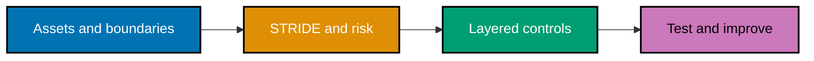

## Mental model

Security work has a useful loop: name the asset and boundary, enumerate plausible abuse, prioritize
the harm, choose layered controls, and test the result. A control is not evidence because it exists;
it is evidence when the intended input succeeds and the unsafe condition is rejected safely.



## Example progression

- **Security foundations and application boundaries** (Examples 1–18) establishes the CIA triad,
  threat models, OWASP vocabulary, access control, injection, and validation.
- **Cryptography and identity** (Examples 19–38) separates reversible protection from verification,
  then connects passwords, signatures, TLS, OAuth/OIDC, JWTs, and sessions.
- **Hardening and secure delivery** (Examples 39–52) layers browser defenses, secrets, supply-chain
  controls, secure-SDLC gates, vulnerability assessment, and privacy into an engineering practice.

## Run the safe mechanisms

From `learning/code/`, create a virtual environment, install the pinned packages, and run the named
file in each code-bearing example. All inputs are fabricated and all keys are generated in memory.

```text
python3 -m venv .venv
. .venv/bin/activate
python3 -m pip install -r requirements.txt
python3 ex-22-23-passwords.py
```

Next: [Security foundations and application boundaries](./foundations.md) →
