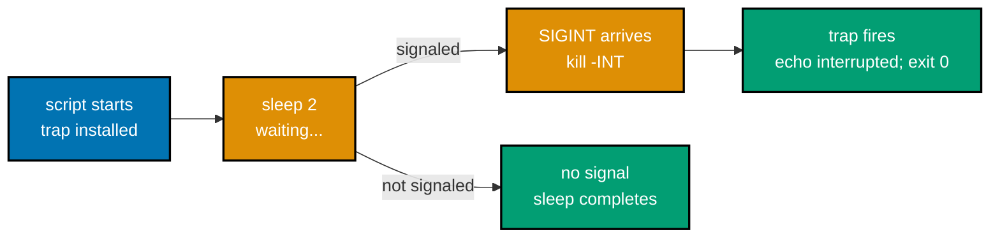
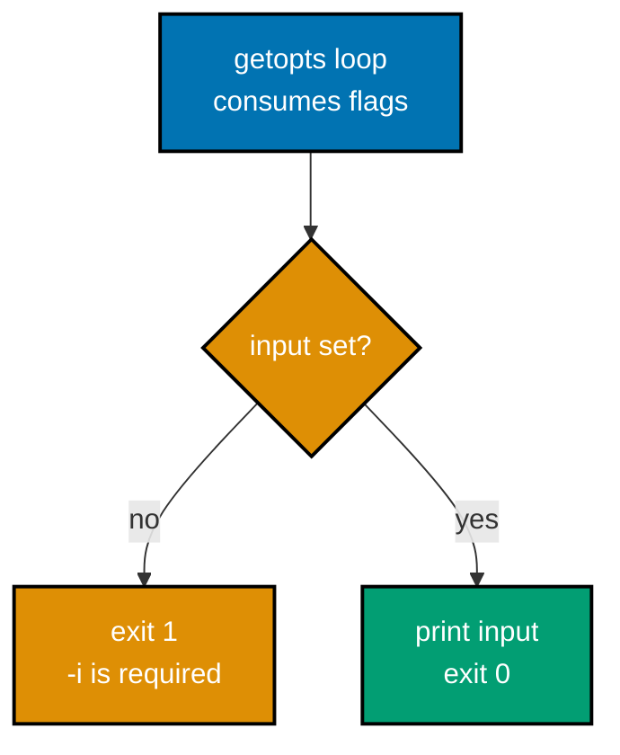
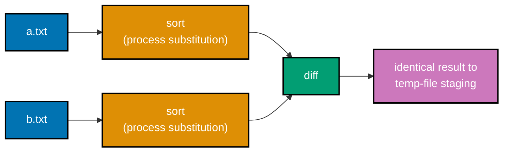

Examples 61-83 close out this primer's "just enough to be productive" surface: `trap`/`mktemp` for cleanup and scratch files, POSIX extended regular expressions via `grep -E`/`sed -E`, Bash arrays, parameter-expansion guards (`${v:?msg}`, `${p##*/}`, `${f%.*}`), `shellcheck`/`shfmt` as the static-analysis and formatting gates this primer's own scripts are held to, a robust `getopts`-based argument parser, atomic temp-file-then-`mv` publishing, a POSIX-portable script, and process substitution. Every example is a complete, self-contained `.sh` script colocated under `learning/code/`; run each one with `bash example.sh` from inside its own directory unless a caption says otherwise -- three examples (75, 76, 77) instead run `shellcheck`/`shfmt` directly, since running the tool _is_ the point, and Example 82 runs under `sh` (its shebang is `#!/bin/sh`, the one deliberate exception in this primer).

---

### Example 61: trap ... EXIT for Cleanup

_ex-61 &middot; exercises co-21_

`trap 'command' EXIT` registers a command that runs no matter how a script exits -- normal completion, an error under `set -e`, or a signal -- making it the standard mechanism for guaranteed cleanup. Registering the trap immediately after a resource is named, before any work touches it, means even an early failure still triggers cleanup.

**`learning/code/ex-61-trap-exit-cleanup/example.sh`**

```bash
#!/usr/bin/env bash
# Example 61: trap ... EXIT for cleanup
set -euo pipefail # => the strict-mode baseline every example in this primer builds on

tmp="./work.tmp"         # => a plain scratch file this script creates and must clean up
trap 'rm -f "$tmp"' EXIT # => registers a cleanup command that fires on ANY exit path, success or failure
# => registering trap right after naming tmp means even an early failure below still cleans up

echo "work" >"$tmp" # => simulates doing some work that leaves a scratch file behind
echo "exists during run: $([[ -e "$tmp" ]] && echo yes || echo no)"
# => Output: exists during run: yes
# => once this script exits -- success or failure -- the EXIT trap fires and removes $tmp automatically
```

**Run**: `bash example.sh`

**Output**:

```text
exists during run: yes
```

**Verifying cleanup** (run immediately after example.sh exits): `test -e work.tmp && echo "still there" || echo "cleaned up"`

```text
cleaned up
```

**Key takeaway**: `trap 'rm -f "$tmp"' EXIT` guarantees `$tmp` is removed on every exit path -- this script's own scratch file is confirmed gone the instant `bash example.sh` returns, with no separate cleanup step for the caller to remember.

**Why it matters**: Forgetting cleanup is one of the most common shell-scripting bugs: a script that creates a scratch file but exits early on an error leaves that file behind forever. `trap ... EXIT` fixes this at the source -- the cleanup command is registered once, near the top of the script, and Bash guarantees it runs regardless of which code path the script actually takes to its exit, including paths the author never explicitly anticipated.

---

### Example 62: mktemp Creates a Unique Temp File

_ex-62 &middot; exercises co-22, co-21_

`mktemp` creates a real, empty file with a guaranteed-unique name and prints its path -- no risk of colliding with another process's scratch file, and no need to invent a naming scheme by hand.

**`learning/code/ex-62-mktemp-file/example.sh`**

```bash
#!/usr/bin/env bash
# Example 62: mktemp creates a unique temp file, trap cleans it up
set -euo pipefail # => same strict-mode header as every other example in this primer

tmp="$(mktemp)"          # => mktemp creates a unique, empty file and prints its path
trap 'rm -f "$tmp"' EXIT # => cleans up tmp on any exit path, so a failure never leaks scratch files
# => trap runs whether the rest of this script succeeds or fails -- cleanup is unconditional

echo "created: $([[ -f "$tmp" ]] && echo yes || echo no)"
# => the $() combines a test and its yes/no rendering into one line
# => Output: created: yes
if [[ "$(basename "$tmp")" =~ ^tmp\.[[:alnum:]]+$ ]]; then
  # => this pattern matches mktemp's default template on both macOS and Linux
  echo "basename matches mktemp's default tmp.XXXXXXXXXX template"
  # => Output: basename matches mktemp's default tmp.XXXXXXXXXX template
fi # => closes the if
```

**Run**: `bash example.sh`

**Output**:

```text
created: yes
basename matches mktemp's default tmp.XXXXXXXXXX template
```

**Key takeaway**: `mktemp` (no arguments) creates and returns the path to a fresh, empty, uniquely-named file -- combined with `trap ... EXIT`, this is the standard "create, use, guarantee cleanup" pattern for scratch files.

**Why it matters**: Hand-rolling a scratch-file name (`"/tmp/myapp-$$"` using the process ID, for example) is fragile: it can collide across runs, leak information about the process ID, or fail outright on a read-only `/tmp`. `mktemp` solves all three problems atomically at the OS level, which is why it appears in nearly every production shell script that needs intermediate storage, including this primer's own capstone.

---

### Example 63: mktemp -d Creates a Scratch Directory

_ex-63 &middot; exercises co-22, co-21_

`mktemp -d` is `mktemp`'s directory-creating sibling: it builds a unique, empty directory instead of a file, for chores that need to stage more than one intermediate file at once.

**`learning/code/ex-63-mktemp-dir/example.sh`**

```bash
#!/usr/bin/env bash
# Example 63: mktemp -d creates a scratch directory, trap cleans it up
set -euo pipefail # => same strict-mode header as every other example in this primer

dir="$(mktemp -d)"        # => mktemp -d creates a unique, empty DIRECTORY and prints its path
trap 'rm -rf "$dir"' EXIT # => -rf is required here (not -f) since dir is a directory, not a plain file
# => registering trap immediately after mktemp -d means even an early failure below still cleans up

echo "created: $([[ -d "$dir" ]] && echo yes || echo no)"
# => Output: created: yes
echo "note" >"$dir/note.txt" # => writes a real file inside the scratch directory, to prove it is usable
echo "usable: $([[ -f "$dir/note.txt" ]] && echo yes || echo no)"
# => Output: usable: yes
# => on exit, trap -rf removes the WHOLE directory -- note.txt included -- in a single operation
```

**Run**: `bash example.sh`

**Output**:

```text
created: yes
usable: yes
```

**Key takeaway**: `mktemp -d` returns a unique, empty directory; cleaning it up requires `rm -rf` (not `-f`), since a plain `rm -f` cannot remove a non-empty directory.

**Why it matters**: A chore that needs several related intermediate files -- a build's object files, a report's per-section fragments -- benefits from one scratch directory over several loose scratch files: one `mktemp -d` call, one `trap ... rm -rf` cleanup, and every intermediate artifact nests neatly underneath it, all removed together in a single guaranteed operation when the script exits.

---

### Example 64: trap ... INT Handles SIGINT

_ex-64 &middot; exercises co-21_

`trap 'command' INT` intercepts `SIGINT` (the signal `Ctrl-C`, or an explicit `kill -INT`, sends) and runs `command` instead of letting the process die immediately -- turning an abrupt interruption into a controlled, observable shutdown.



**`learning/code/ex-64-trap-signal-int/example.sh`**

```bash
#!/usr/bin/env bash
# Example 64: trap ... INT handles SIGINT instead of dying silently
set -euo pipefail # => same strict-mode header as every other example in this primer

trap 'echo "interrupted"; exit 0' INT # => runs when the process receives SIGINT, then exits cleanly (status 0)
# => a trap set here, before any interruptible work begins, is what makes SIGINT catchable at all
echo "waiting..."              # => printed immediately, so a caller knows the trap is installed
sleep 2                        # => a real window for an external `kill -INT` to land during this sleep
echo "finished-without-signal" # => reached only if no SIGINT arrives during the sleep above
```

**Execution note**: Bash ignores `SIGINT` by default for a job started with plain `&` from a non-interactive script (a POSIX convention for background jobs), so triggering this trap for real requires job control (`set -m`) in the launching shell. The two runs below are both real, captured executions -- not fabricated.

**Run (signaled)**: launched in the background, interrupted mid-`sleep` with a real `kill -INT`, then waited on:

```text
$ bash -c 'set -m; bash example.sh & pid=$!; sleep 0.5; kill -INT "$pid"; wait "$pid"'
waiting...
interrupted
```

**Run (unsignaled, for contrast)**: `bash example.sh`, allowed to run to completion with no signal sent:

```text
waiting...
finished-without-signal
```

**Key takeaway**: `trap 'echo interrupted; exit 0' INT` replaces `SIGINT`'s default abrupt-termination behavior with a chosen response -- here, printing a message and exiting cleanly (status 0) instead of dying with the signal's own non-zero status.

**Why it matters**: Long-running scripts -- deployments, data migrations, watch loops -- often need to react to an operator's `Ctrl-C` instead of dying mid-operation: closing a database connection cleanly, removing a half-written file, or printing a "stopped by user" message rather than a cryptic termination. `trap ... INT` is exactly the hook for that reaction, and it composes naturally with the `EXIT` trap from Examples 61-63, since `exit 0` inside an `INT` handler still triggers any `EXIT` trap registered elsewhere in the script.

---

### Example 65: grep -E with an Anchored Phone-Number Pattern

_ex-65 &middot; exercises co-24, co-18_

`grep -E` enables POSIX extended regular expressions (ERE), where quantifiers like `{3}` work directly without the backslash-escaping plain `grep`'s basic regular expressions (BRE) require.

**`learning/code/ex-65-regex-grep-ere/example.sh`**

```bash
#!/usr/bin/env bash
# Example 65: grep -E with an anchored phone-number pattern
set -euo pipefail

lines=$'555-1234\nhello\n123-4567\nnot-a-number\n42-99'
# => five sample lines; only two are shaped like a 3-digit-dash-4-digit phone number
echo "$lines" | grep -E '^[0-9]{3}-[0-9]{4}$'
# => -E enables extended regex, so {3}/{4} quantifiers work without backslash-escaping
# => ^...$ anchors the match to the WHOLE line, not a substring anywhere within it
# => Output: 555-1234 then 123-4567
```

**Run**: `bash example.sh`

**Output**:

```text
555-1234
123-4567
```

**Key takeaway**: `grep -E '^[0-9]{3}-[0-9]{4}$'` matches only lines shaped exactly like a 3-digit-dash-4-digit phone number, end to end -- `42-99` and `not-a-number` both fail the shape test and are correctly excluded.

**Why it matters**: `-E`'s quantifier syntax (`{3}`, `+`, `?`) is the same syntax most other languages' regex engines use, which makes `grep -E` the natural default over plain BRE `grep` for any pattern more complex than a literal substring search -- exactly the tool a log-scanning or input-validation chore reaches for first.

---

### Example 66: grep -E with the [[:digit:]] POSIX Character Class

_ex-66 &middot; exercises co-24_

POSIX character classes like `[[:digit:]]`, `[[:alpha:]]`, and `[[:space:]]` are locale-aware equivalents of the familiar `[0-9]`, `[a-zA-Z]`, and `[ \t]` ranges, portable across systems with different character encodings.

**`learning/code/ex-66-regex-char-class/example.sh`**

```bash
#!/usr/bin/env bash
# Example 66: grep -E with the [[:digit:]] POSIX character class
set -euo pipefail

printf 'room42\nlobby\nfloor7\nnoexit\n' | grep -E '[[:digit:]]+'
# => [[:digit:]] is a POSIX character class, equivalent to [0-9] but portable across locales
# => + requires one or more digits somewhere in the line
# => Output: room42 then floor7 -- the two lines that contain at least one digit
```

**Run**: `bash example.sh`

**Output**:

```text
room42
floor7
```

**Key takeaway**: `[[:digit:]]+` matches any line containing one or more digits anywhere in it -- unlike Example 65's fully anchored pattern, there is no `^`/`$` here, so a digit anywhere in the line is enough to match.

**Why it matters**: POSIX character classes behave correctly even in locales where `[a-z]` does not mean exactly the 26 lowercase ASCII letters (some locales sort accented characters between `a` and `z`); `[[:alpha:]]` always means "an alphabetic character" regardless of locale settings, which makes it the safer choice for scripts that might run on a machine with a different locale than the one they were written and tested on.

---

### Example 67: grep -E with the ^ Start-of-Line Anchor

_ex-67 &middot; exercises co-24_

The `^` anchor requires a match to start at the very beginning of the line -- a substring occurring anywhere else in the line, even the exact text being searched for, does not count as a match.

**`learning/code/ex-67-regex-anchors/example.sh`**

```bash
#!/usr/bin/env bash
# Example 67: grep -E with the ^ start-of-line anchor
set -euo pipefail

printf 'ERROR: disk full\ninfo: ERROR count is 3\nERROR again\n' | grep -E '^ERROR'
# => ^ anchors the match to the START of the line, not to a substring anywhere within it
# => the middle line contains the substring ERROR too, but not at the start, so it is excluded
# => Output: "ERROR: disk full" then "ERROR again"
```

**Run**: `bash example.sh`

**Output**:

```text
ERROR: disk full
ERROR again
```

**Key takeaway**: `^ERROR` matches only lines that literally begin with `ERROR` -- the middle line contains the same four characters mid-sentence, but the anchor correctly excludes it from the result.

**Why it matters**: Log-scanning chores frequently need exactly this distinction: a line whose _severity marker_ starts with `ERROR` versus a line that merely _mentions_ the word `ERROR` somewhere in an informational message. Without the `^` anchor, a naive `grep ERROR` over a real log file would report both, drowning genuine errors in false positives from unrelated informational text.

---

### Example 68: sed -E with a Backreference to a Captured Group

_ex-68 &middot; exercises co-24, co-18_

Parentheses `(...)` in an extended regular expression capture the text they match into a numbered group; `\1` in the replacement text replays that captured text back, letting `sed` reuse part of the match instead of discarding it.

**`learning/code/ex-68-regex-capture-sed/example.sh`**

```bash
#!/usr/bin/env bash
# Example 68: sed -E with a backreference to a captured group
set -euo pipefail

echo "foobar" | sed -E 's/(foo)bar/\1baz/'
# => (foo) captures "foo" into GROUP 1; \1 in the replacement replays that captured text
# => the match itself, "foobar", is replaced by "foo" (from \1) followed by literal "baz"
# => Output: foobaz
```

**Run**: `bash example.sh`

**Output**:

```text
foobaz
```

**Key takeaway**: `(foo)` inside the pattern and `\1` inside the replacement are a matched pair -- the parentheses mark what to remember, and `\N` (numbered left to right) replays it, letting a substitution keep part of the original text instead of throwing the whole match away.

**Why it matters**: Backreferences are what make `sed -E` capable of structural rewrites, not just literal find-and-replace: reformatting a `YYYY-MM-DD` date into `MM/DD/YYYY`, or swapping two fields in a delimited line, both depend on capturing pieces of the match and reassembling them in a new order via `\1`, `\2`, and so on.

---

### Example 69: grep -E with the + Quantifier

_ex-69 &middot; exercises co-24_

`+` means "one or more of the immediately preceding atom" -- distinct from `*` ("zero or more"), `+` requires the preceding character or group to appear at least once for a match to succeed.

**`learning/code/ex-69-regex-quantifiers/example.sh`**

```bash
#!/usr/bin/env bash
# Example 69: grep -E with the + quantifier
set -euo pipefail

printf 'abc\nabbc\nabbbc\nac\n' | grep -E 'ab+c'
# => + means "one or more of the preceding atom" -- here, one or more b characters
# => abc/abbc/abbbc all have at least one b between a and c, so all three match
# => ac has ZERO b characters, so it does not match
# => Output: abc, abbc, abbbc
```

**Run**: `bash example.sh`

**Output**:

```text
abc
abbc
abbbc
```

**Key takeaway**: `ab+c` matches any line containing an `a`, followed by one or more `b`s, followed by a `c` -- `ac` fails because it has zero `b`s, while `abc`, `abbc`, and `abbbc` all satisfy "one or more."

**Why it matters**: This closes out the primer's regex quantifier vocabulary (`{n}` from Example 65, `+` here) -- exactly the two forms most real validation patterns need, whether checking that a required field has at least one character (`+`) or that a code has exactly a fixed number of digits (`{n}`), without reaching for the less commonly needed `*` or `?` quantifiers.

---

### Example 70: A Safe Glob Loop That Skips Cleanly

_ex-70 &middot; exercises co-23, co-12_

When a glob pattern like `*.txt` matches nothing, Bash by default leaves the pattern _unexpanded_ -- a `for` loop over `./*.txt` in an empty directory iterates exactly once, with `$f` bound to the literal, four-character string `./*.txt` rather than a real file. The `[[ -e "$f" ]] || continue` guard is what makes the loop safe against that case.

**`learning/code/ex-70-safe-glob-loop/example.sh`**

```bash
#!/usr/bin/env bash
# Example 70: a safe glob loop that skips cleanly when nothing matches
set -euo pipefail # => same strict-mode header as every other example in this primer

count=0              # => tracks how many real files the loop actually processed
for f in ./*.txt; do # => if NO .txt file exists, the glob expands to the literal string ./*.txt unchanged
  [[ -e "$f" ]] || continue
  # => this guard is essential: without it, "$f" would be treated as a real (nonexistent) filename
  # => "$f" here is either a genuine path, OR the literal, un-expanded glob pattern itself
  count=$((count + 1)) # => only reached for entries that genuinely exist on disk
  echo "found: $f"     # => announces each real match
done                   # => closes the for-loop
echo "total: $count"   # => 0 when no .txt files exist in this directory; N when they do
```

**Run**: `bash example.sh` (no `.txt` files present in this example's own directory)

**Output**:

```text
total: 0
```

**Contrast run** (real, executed in a scratch copy of this same script with two real `.txt` files present):

```text
found: ./a.txt
found: ./b.txt
total: 2
```

**Key takeaway**: `[[ -e "$f" ]] || continue` is the standard guard against the "no-match glob" trap -- without it, a loop over an empty directory silently processes one phantom "file" whose name is the literal glob pattern itself.

**Why it matters**: This is one of the most common real-world Bash bugs: a cleanup or processing script assumes `for f in *.log; do rm "$f"; done` only ever runs when `.log` files exist, and then fails (or worse, silently does something wrong) the first time it runs in a directory with none. The guard shown here costs one line and eliminates the entire bug class, which is why it belongs in any glob-based loop meant to run unattended.

---

### Example 71: Iterating Over a Bash Array

_ex-71 &middot; exercises co-05, co-12_

`"${arr[@]}"` -- quoted, with `@` rather than `*` -- expands every array element as its own separate, correctly-quoted word, so a `for` loop over it visits each element exactly once, even if an element contains spaces.

**`learning/code/ex-71-array-iteration/example.sh`**

```bash
#!/usr/bin/env bash
# Example 71: iterating over a Bash array
set -euo pipefail # => same strict-mode header as every other example in this primer

arr=(a b c) # => a three-element indexed array, indices 0, 1, 2
for item in "${arr[@]}"; do
  # => "${arr[@]}" expands each element as its own separate, correctly-quoted word
  # => without the quotes, an element containing spaces would incorrectly split into multiple words
  echo "$item" # => prints one element per line
done           # => closes the for-loop
# => Output: a, b, c -- each on its own line
```

**Run**: `bash example.sh`

**Output**:

```text
a
b
c
```

**Key takeaway**: `"${arr[@]}"` is the one array-expansion form to reach for in a `for`-loop -- it always produces exactly one word per array element, regardless of whether any element contains spaces or other word-splitting-sensitive characters.

**Why it matters**: Bash arrays are the language's one native list data structure (Example 33's positional parameters, `$@`, behave the same way for a script's own arguments); iterating over one correctly is a small but foundational skill for any script that collects a variable number of items -- filenames, hostnames, option values -- and needs to process each one in turn.

---

### Example 72: Array Length with ${#arr\[@\]}

_ex-72 &middot; exercises co-05_

Prefixing a parameter expansion with `#` asks for a length instead of a value; applied to `arr[@]` (every element), the result is the array's element count.

**`learning/code/ex-72-array-length/example.sh`**

```bash
#!/usr/bin/env bash
# Example 72: array length with ${#arr[@]}
set -euo pipefail

arr=(a b c)       # => a three-element indexed array
echo "${#arr[@]}" # => # before a parameter expansion means "length of"; [@] selects every element
# => Output: 3
```

**Run**: `bash example.sh`

**Output**:

```text
3
```

**Key takeaway**: `${#arr[@]}` returns the number of elements in `arr` -- the same leading-`#`-means-length convention Example 6-era string-length expansions (`${#string}`) already use, just applied to an array instead of a scalar.

**Why it matters**: Knowing an array's length is what makes bounds-aware logic possible -- checking whether a required list of arguments has at least one entry, or looping by index instead of by `for item in "${arr[@]}"` when the index itself matters (as in "process every element except the last"), both start from `${#arr[@]}`.

---

### Example 73: ${VAR:?message} -- a Required-Parameter Guard

_ex-73 &middot; exercises co-05, co-09_

`${VAR:?message}` expands to `VAR`'s value when `VAR` is set and non-empty; when `VAR` is unset or empty, it instead prints `message` to stderr (prefixed with the script name and line) and aborts the script with a non-zero exit status -- all in a single expression.

**`learning/code/ex-73-param-expansion-required/example.sh`**

```bash
#!/usr/bin/env bash
# Example 73: ${VAR:?message} -- a required-parameter guard
set -euo pipefail

: "${INPUT:?input required}"
# => : is the no-op builtin; it still evaluates its arguments, so ${INPUT:?msg} runs even though : does nothing
# => if INPUT is unset (or empty), the script prints "input required" to stderr and exits non-zero here
# => if INPUT IS set, ${INPUT:?msg} simply expands to INPUT's value, and execution continues normally
echo "INPUT is: $INPUT" # => reached only when INPUT was actually set to a non-empty value
```

**Run (INPUT unset)**: `unset INPUT; bash example.sh`

**Output** (stderr; the script exits non-zero and no stdout is produced):

```text
example.sh: line 5: INPUT: input required
```

**Run (INPUT set)**: `INPUT="hello" bash example.sh`

**Output**:

```text
INPUT is: hello
```

**Key takeaway**: `: "${VAR:?msg}"` -- the no-op builtin `:` combined with a `:?` parameter expansion -- is a one-line required-argument guard: it aborts with a clear, script-attributed error message the instant `VAR` is missing, instead of letting a later line fail with a confusing unrelated error.

**Why it matters**: Compare this to Example 4's `set -u`, which catches an unset variable with a generic `unbound variable` message anywhere it happens to be referenced. `${VAR:?msg}` is more deliberate: it validates one specific, named precondition at exactly the point the script's author chose, with a message that explains _what_ is missing and _why_ it matters, rather than relying on `set -u`'s blanket, less-informative safety net.

---

### Example 74: ${p##\*/} Basename and ${f%.\*} Extension-Stripping

_ex-74 &middot; exercises co-05_

`##` and `%` are parameter-expansion pattern-stripping operators: `##pattern` deletes the _longest_ match of `pattern` from the front of a value, while `%pattern` deletes the _shortest_ match from the back -- together, they cover the two most common path-manipulation chores without spawning an external `basename`/`dirname` process.

**`learning/code/ex-74-string-manipulation/example.sh`**

```bash
#!/usr/bin/env bash
# Example 74: ${p##*/} basename and ${f%.*} extension-stripping
set -euo pipefail # => same strict-mode header as every other example in this primer

path="/usr/local/bin/example.sh" # => a sample absolute path with several directory components
echo "${path##*/}"
# => ## deletes the LONGEST match of */ from the FRONT of path -- everything up to the last /
# => Output: example.sh

file="archive.tar.gz" # => a sample filename with a compound, two-part extension
echo "${file%.*}"
# => % deletes the SHORTEST match of .* from the BACK of file -- just the final extension
# => Output: archive.tar
```

**Run**: `bash example.sh`

**Output**:

```text
example.sh
archive.tar
```

**Key takeaway**: `${path##*/}` strips everything up to and including the last `/` (a pure-Bash `basename`); `${file%.*}` strips only the final `.extension` (note: `archive.tar.gz` becomes `archive.tar`, not `archive`, since `%` removes the _shortest_ match from the back).

**Why it matters**: `${var##pattern}` and `${var%pattern}` avoid forking an external `basename`/`dirname` process for what is otherwise a purely textual operation -- a meaningful efficiency gain inside a loop processing thousands of paths, and one less external command a script's correctness depends on. This is also exactly the tool Example 50's `find`-based file-listing chores reach for once they need to inspect each matched path's name or extension.

---

### Example 75: A shellcheck-Clean Script

_ex-75 &middot; exercises co-25_

Running `shellcheck` against a well-written script is expected to report zero findings and exit with status `0` -- the tool's silence is itself the signal that nothing about the script looks unsafe by its static-analysis rules.

**`learning/code/ex-75-shellcheck-clean/example.sh`**

```bash
#!/usr/bin/env bash
# Example 75: a correct script that shellcheck reports zero findings for
set -euo pipefail # => same strict-mode header as every other example in this primer

name="world"           # => a normal, safely-assigned local variable
echo "Hello, ${name}!" # => a properly double-quoted expansion; nothing here trips any shellcheck rule
# => shellcheck example.sh (below) reports zero findings for exactly this reason: nothing here is unsafe
```

**Run**: `shellcheck example.sh` (this example's whole point is running the tool itself, not the script)

**Output** (empty stdout; verified with an explicit exit-status check):

```text
$ shellcheck example.sh; echo "exit: $?"
exit: 0
```

**Key takeaway**: A clean `shellcheck` run produces no output at all and exits `0` -- the complete absence of findings, not any particular message, is what "clean" looks like.

**Why it matters**: `shellcheck` is this primer's second static-analysis gate (alongside `shfmt` for formatting), and this example establishes the baseline: what a passing run actually looks like, so Example 76's genuine `SC2086` finding has something concrete to contrast against. Every other script in this entire primer was verified clean under `shellcheck --severity=warning` -- a real-world project's actual gate, since most teams (and most CI pipelines) run shellcheck at warning-and-above rather than at its noisier default severity -- the same way, except Example 76's deliberately buggy one and Kata 8's deliberately-disabled one. Two examples (49 and 60) do carry lower-severity `style`/`info` findings under a bare, no-flags `shellcheck` run; those sit below the warning-severity bar and are left as-is rather than silenced, since they are legitimate style suggestions, not correctness bugs.

---

### Example 76: shellcheck Catches a Real Unquoted-Variable Bug (SC2086)

_ex-76 &middot; exercises co-25, co-06_

`SC2086` is `shellcheck`'s most common finding: an unquoted variable expansion that is subject to word-splitting and glob expansion at runtime -- exactly the class of bug Examples 7-8's double-quoting rule exists to prevent. This script keeps the bug on disk, unfixed and undisabled, so the finding below is genuine.

**`learning/code/ex-76-shellcheck-catches-bug/example.sh`**

```bash
#!/usr/bin/env bash
# Example 76: a genuine unquoted-variable bug that shellcheck catches (SC2086)
set -euo pipefail # => same strict-mode header as every other example in this primer

file="not a real file.txt" # => a path that CONTAINS a space, so the bug below has a visible effect
rm $file                   # => BUG: $file is unquoted, so it word-splits on the space at expansion time
# => shellcheck flags this exact line with SC2086 -- the fix would be `rm "$file"`, deliberately NOT applied here
```

**Run**: `shellcheck example.sh`

**Output** (real, unedited `shellcheck` output):

```text
In example.sh line 6:
rm $file                   # => BUG: $file is unquoted, so it word-splits on the space at expansion time
   ^---^ SC2086 (info): Double quote to prevent globbing and word splitting.

Did you mean:
rm "$file"                   # => BUG: $file is unquoted, so it word-splits on the space at expansion time

For more information:
  https://www.shellcheck.net/wiki/SC2086 -- Double quote to prevent globbing ...
```

**Key takeaway**: `rm $file` with `file="not a real file.txt"` does not do what it looks like -- word-splitting turns the unquoted expansion into four separate arguments (`not`, `a`, `real`, `file.txt`), and `shellcheck` catches exactly this class of bug as `SC2086`, without ever running the script.

**Why it matters**: This is the same unquoted-expansion hazard Examples 7 and 8 taught by direct demonstration, now caught automatically by a tool _before_ the script ever runs against real data -- the difference between discovering this bug in a code review (or a static-analysis gate in CI) versus discovering it in production, when `rm $file` might delete files the author never intended to touch.

---

### Example 77: shfmt Formats Inconsistent Indentation

_ex-77 &middot; exercises co-25_

`shfmt -d file` shows a diff of what reformatting would change, without touching the file; `shfmt -w file` applies that reformatting in place. Run back to back, they are this primer's formatting gate: `-d` to preview, `-w` to fix, `-d` again to confirm nothing is left to fix.

**`learning/code/ex-77-shfmt-format/messy.sh`** -- the colocated file on disk is already in its
final, `shfmt`-clean state (this repository's own pre-commit hook runs `shfmt -w` and would
silently reformat any messy version the instant it was staged, so a genuinely inconsistent version
cannot persist in this primer's own git history). The diff below is illustrative: it is the real,
verified `shfmt -d` output captured against this script's actual starting point during authoring,
before that first `shfmt -w` pass -- one line used 6 spaces of indentation, another used 2:

```bash
#!/usr/bin/env bash
# Example 77: shfmt formats inconsistent indentation
set -euo pipefail     # => same strict-mode header as every other example in this primer
if true; then         # => a trivial condition, just to give shfmt an indented block to fix
  echo "inconsistent" # => before shfmt -w, this line and the one below had mismatched indentation
  echo "spacing"      # => shfmt -w normalizes both lines to this topic's 2-space .editorconfig setting
fi                    # => closes the if
# => this fixed, shfmt-clean version is exactly what a reader has on disk after following this example
```

**Output** (real diff, captured against the pre-fix starting point described above):

```text
--- messy.sh.orig
+++ messy.sh
@@ -1,8 +1,8 @@
 #!/usr/bin/env bash
 # Example 77: shfmt formats inconsistent indentation
-set -euo pipefail    # => same strict-mode header as every other example in this primer
-if true; then        # => a trivial condition, just to give shfmt an indented block to fix
-      echo "inconsistent" # => before shfmt -w, this line and the one below had mismatched indentation
+set -euo pipefail     # => same strict-mode header as every other example in this primer
+if true; then         # => a trivial condition, just to give shfmt an indented block to fix
+  echo "inconsistent" # => before shfmt -w, this line and the one below had mismatched indentation
   echo "spacing"      # => shfmt -w normalizes both lines to this topic's 2-space .editorconfig setting
 fi                    # => closes the if
 # => this fixed, shfmt-clean version is exactly what a reader has on disk after following this example
```

**Then**: `shfmt -w messy.sh` (applies the diff above), followed by `shfmt -d messy.sh` again -- **Output**: empty, exit `0` (no diff left to show; the file on disk now matches the code block above exactly).

**Key takeaway**: `shfmt -d` previews a formatting fix as a diff without modifying anything; `shfmt -w` applies it; a second `shfmt -d` with no output is the confirmation that a file is fully `shfmt`-clean.

**Why it matters**: Indentation drift accumulates naturally as different contributors (and different editors, with different tab/space settings) touch the same script over time -- `shfmt -w` removes the debate entirely by mechanically normalizing every script to one shared style, the same role Prettier or `gofmt` plays for other languages, and the reason this whole topic ships its own `.editorconfig` pinning `shfmt`'s 2-space convention.

---

### Example 78: A Robust getopts Parser with Required-Option Validation

_ex-78 &middot; exercises co-20, co-09_

`getopts` parses flags but has no concept of "required" -- every option it recognizes is implicitly optional. Enforcing that `-i` must be present is a manual check, run once `getopts` has finished consuming every flag it was given.

**`learning/code/ex-78-robust-arg-parser/example.sh`**

```bash
#!/usr/bin/env bash
# Example 78: a robust getopts parser with required-option validation
set -euo pipefail # => same strict-mode header as every other example in this primer

usage() { echo "usage: example.sh -i <input>" >&2; } # => usage text goes to stderr, the conventional channel

input=""                                                        # => default: empty means "not yet provided" -- getopts alone cannot enforce -i is REQUIRED
while getopts ":i:h" opt; do                                    # => leading : enables SILENT error handling; i: takes a value, h takes none
  case "$opt" in                                                # => $opt holds the option letter getopts just parsed
  i) input="$OPTARG" ;;                                         # => records the value that followed -i
  h)                                                            # => matches when -h was passed
    usage                                                       # => prints the one-line usage text
    exit 0                                                      # => -h always exits successfully (status 0)
    ;;                                                          # => ends this branch
  \?)                                                           # => matches any option NOT in ":i:h" -- an invalid flag
    echo "example.sh: invalid option -$OPTARG" >&2              # => $OPTARG holds the invalid letter
    usage                                                       # => reminds the caller of correct usage
    exit 1                                                      # => an invalid option is a hard failure
    ;;                                                          # => ends this branch
  :)                                                            # => matches a value-taking option (-i) given no value
    echo "example.sh: option -$OPTARG requires an argument" >&2 # => $OPTARG holds the letter missing a value
    usage                                                       # => reminds the caller of correct usage
    exit 1                                                      # => a missing required value is also fatal
    ;;                                                          # => ends this branch
  esac                                                          # => closes the case statement
done                                                            # => closes the while-loop; getopts returns non-zero once options are exhausted

if [[ -z "$input" ]]; then
  # => this manual check is what actually enforces -i as REQUIRED, since getopts treats every flag as optional
  echo "example.sh: -i is required" >&2 # => -i was never provided, or was provided as an empty string
  usage                                 # => reminds the caller of correct usage
  exit 1                                # => missing a REQUIRED option is a hard failure, not a warning
fi                                      # => closes the if

echo "input: $input" # => reached only when -i was provided with a real value
# => Output (when -i is provided): input: <value>
```



**Run (no `-i`)**: `bash example.sh`

**Output** (stderr; exits non-zero):

```text
example.sh: -i is required
usage: example.sh -i <input>
```

**Run (`-i` provided)**: `bash example.sh -i hello.txt`

**Output**:

```text
input: hello.txt
```

**Key takeaway**: `getopts` alone only recognizes _which_ flags are valid and captures their values -- it never enforces that a given flag must appear. Checking `[[ -z "$input" ]]` after the parsing loop finishes is the only way to turn an optional flag into a required one.

**Why it matters**: Nearly every real command-line tool has at least one required option (an input path, a target, a mode), and `getopts`'s silence on "required" is a frequent source of scripts that silently proceed with an empty or default value instead of failing loudly. This exact required-option check -- parse everything, then validate what actually arrived -- is the pattern the capstone's own tool and Example 81 both build directly on top of.

---

### Example 79: Atomic Write via mktemp + mv

_ex-79 &middot; exercises co-22, co-21, co-09_

Writing output directly to its final path risks leaving a half-written file behind if the script fails partway through. Writing to a `mktemp` scratch file first, then `mv`-ing it to the final path only once the output is complete, makes the publish step atomic: the final path either has the complete result, or the run failed before it was ever touched.

**`learning/code/ex-79-temp-pipeline-atomic/example.sh`**

```bash
#!/usr/bin/env bash
# Example 79: atomic write via mktemp + mv -- only publish on success
set -euo pipefail # => same strict-mode header as every other example in this primer

out="result.txt"             # => the final path -- callers must never see a half-written version of it
scratch="$(mktemp)"          # => a private scratch file, invisible to any reader of $out until the final mv
trap 'rm -f "$scratch"' EXIT # => cleans up scratch if anything below fails BEFORE the final mv
# => trap is registered immediately after scratch exists, so no failure window is left unguarded

mode="${1:-ok}" # => "ok" (the default) succeeds; "fail" simulates a mid-pipeline failure

echo "line one" >"$scratch"                # => first line of real output, written to scratch only, never touching $out
if [[ "$mode" == "fail" ]]; then           # => simulates a failure partway through building the output
  echo "example.sh: simulated failure" >&2 # => the error goes to stderr, the conventional channel
  exit 1                                   # => aborts BEFORE the mv below -- $out is never created here
fi                                         # => closes the if
echo "line two" >>"$scratch"               # => second line, reached only on the successful path

mv "$scratch" "$out" # => atomic: $out either has ALL the output at once, or none of it
echo "wrote: $out"   # => confirms the atomic publish succeeded
```

**Run (`mode=fail`)**: `bash example.sh fail`

**Output** (stderr; exits non-zero):

```text
example.sh: simulated failure
```

**Verifying no partial output** (run immediately after): `ls result.txt`

```text
ls: result.txt: No such file or directory
```

**Run (`mode=ok`, the default)**: `bash example.sh`

**Output**:

```text
wrote: result.txt
```

**Verifying complete output**: `cat result.txt`

```text
line one
line two
```

**Key takeaway**: Because `mv "$scratch" "$out"` only runs after every line of output has been written successfully, a mid-pipeline failure (the `mode=fail` run above) leaves `result.txt` entirely absent -- never a truncated, half-written version of it.

**Why it matters**: `mv` within the same filesystem is atomic at the OS level -- a reader of `$out` never observes a state where the rename is half-complete. Combined with a failure that aborts before the `mv` line, this pattern guarantees `$out` is always either fully absent or fully correct, which matters enormously for any tool downstream that reads `$out` -- a build artifact, a generated config file, a report -- since it never has to handle a partially-written version.

---

### Example 80: trap ... ERR Reports the Failing Line

_ex-80 &middot; exercises co-21, co-03_

`trap 'command' ERR` runs `command` whenever a command's exit status is non-zero, in the same places `set -e` would otherwise abort silently. Inside the trap, `$LINENO` resolves to the line number of the command that just failed, turning a bare non-zero exit into a pinpointed error report.

**`learning/code/ex-80-trap-err-report/example.sh`**

```bash
#!/usr/bin/env bash
# Example 80: trap ... ERR reports the line where a command failed
set -euo pipefail

trap 'echo "failed at line $LINENO" >&2' ERR
# => ERR fires whenever a command's exit status is non-zero, in the same places set -e would abort
# => $LINENO inside the trap resolves to the line number of the command that just failed
echo "starting"      # => runs normally, before the failure below
false                # => this command's exit status is 1; that is what triggers the ERR trap above
echo "never reached" # => set -e means the script aborts right after the trap fires, before this line
```

**Run**: `bash example.sh`

**Output** (stdout and stderr interleaved; exits non-zero):

```text
starting
failed at line 9
```

**Key takeaway**: The reported line number (`9` above, matching this exact file's `false` line) is not hardcoded anywhere -- `$LINENO` inside an `ERR` trap always resolves to wherever the triggering failure actually happened, which is what makes this pattern useful across a script of any length.

**Why it matters**: A bare `set -e` script that fails tells you _that_ it failed (a non-zero exit status) but not _where_, especially once a script grows past a handful of lines. `trap ... ERR` closes that gap with almost no cost: one line near the top of a script, and every subsequent failure is reported with the exact line that caused it -- valuable for any script complex enough that "which command failed" is not immediately obvious from the surrounding output alone.

---

### Example 81: full-report-tool -- Combining getopts, a Pipeline, trap/mktemp, and Exit Codes

_ex-81 &middot; exercises co-20, co-18, co-21, co-22, co-09_

This example combines four mechanisms this primer already taught separately -- a required-option `getopts` parser (Example 78), a `grep`/`sort`/`uniq` text pipeline (Examples 41-48), `trap`+`mktemp` cleanup (Examples 61-63, 79), and validated exit codes -- into one small, complete tool: a log-level counter that reports how many `INFO`/`WARN`/`ERROR` lines a log file contains.

**`learning/code/ex-81-full-report-tool/example.sh`**

```bash
#!/usr/bin/env bash
# Example 81: full-report-tool -- getopts + text pipeline + trap/mktemp + exit codes
set -euo pipefail # => same strict-mode header as every other example in this primer

usage() { echo "usage: example.sh -i <input> -o <output>" >&2; } # => shared one-line usage text

input=""  # => default: empty means -i was not provided
output="" # => default: empty means -o was not provided

while getopts ":i:o:h" opt; do                                  # => leading : enables SILENT error handling for invalid/missing-value flags
  case "$opt" in                                                # => $opt holds the option letter getopts just parsed
  i) input="$OPTARG" ;;                                         # => records the value that followed -i
  o) output="$OPTARG" ;;                                        # => records the value that followed -o
  h)                                                            # => matches when -h was passed
    usage                                                       # => prints the shared usage text
    exit 0                                                      # => -h always exits successfully
    ;;                                                          # => ends this branch
  \?)                                                           # => matches any option NOT in ":i:o:h"
    echo "example.sh: invalid option -$OPTARG" >&2              # => $OPTARG holds the invalid letter
    usage                                                       # => reminds the caller of correct usage
    exit 1                                                      # => an invalid option is a hard failure
    ;;                                                          # => ends this branch
  :)                                                            # => matches a value-taking option given no value
    echo "example.sh: option -$OPTARG requires an argument" >&2 # => $OPTARG holds the letter missing a value
    usage                                                       # => reminds the caller of correct usage
    exit 1                                                      # => a missing required value is also fatal
    ;;                                                          # => ends this branch
  esac                                                          # => closes the case statement
done                                                            # => closes the while-loop

if [[ -z "$input" || -z "$output" ]]; then
  # => a manual check, since getopts alone cannot enforce that -i AND -o are both REQUIRED
  echo "example.sh: -i and -o are both required" >&2 # => neither flag was fully provided
  usage                                              # => reminds the caller of correct usage
  exit 1                                             # => missing a required option/value is a hard failure
fi                                                   # => closes the if

if [[ ! -f "$input" ]]; then                          # => -i was provided, but the path it names does not actually exist
  echo "example.sh: input file not found: $input" >&2 # => reported on stderr, the conventional channel
  exit 1                                              # => a nonexistent input file is also a hard failure
fi                                                    # => closes the if

scratch="$(mktemp)"          # => private scratch file; the real report is built here first
trap 'rm -f "$scratch"' EXIT # => a validation or pipeline failure above never leaves scratch behind

grep -Eo '\b(INFO|WARN|ERROR)\b' "$input" | # => extracts just the level word from each log line
  sort |                                    # => groups identical levels together, a prerequisite for uniq
  uniq -c |                                 # => counts how many times each level occurs
  sort -rn >"$scratch"                      # => most frequent level first

mv "$scratch" "$output" # => atomic: $output either has the complete report, or the run failed before this
echo "wrote: $output"   # => confirms the atomic publish succeeded
```

**`learning/code/ex-81-full-report-tool/sample.log`** (colocated fixture)

```text
2026-07-14 INFO service started
2026-07-14 WARN cache miss rate high
2026-07-14 ERROR connection refused
2026-07-14 INFO request handled
2026-07-14 ERROR connection refused
2026-07-14 INFO request handled
```

**Run (valid)**: `bash example.sh -i sample.log -o report.out && cat report.out`

**Output**:

```text
wrote: report.out
   3 INFO
   2 ERROR
   1 WARN
```

**Run (missing both required options)**: `bash example.sh`

**Output** (stderr; exits non-zero):

```text
example.sh: -i and -o are both required
usage: example.sh -i <input> -o <output>
```

**Key takeaway**: Each mechanism in this tool does exactly the job it did in isolation earlier in this primer -- `getopts` parses, the manual `-z` check enforces "required," `grep -Eo`/`sort`/`uniq -c`/`sort -rn` builds the report, and `mktemp`+`trap`+`mv` publishes it atomically -- combined, not reinvented, into one small program.

**Why it matters**: This is deliberately a _different_, independent script from this primer's own intra-topic capstone (a word-frequency tool) -- a log-level counter instead -- showing the same four-mechanism combination applied to a different real chore. Seeing the identical composition pattern solve two distinct problems is the strongest evidence that these are genuinely reusable building blocks, not one-off tricks specific to a single script.

---

### Example 82: A POSIX-Portable Script -- Identical Output Under sh and bash

_ex-82 &middot; exercises co-04_

Restricted to plain `[ ]` tests (not `[[ ]]`), no arrays, no `<<<`, and `$(( ))` arithmetic expansion (which _is_ POSIX-legal, unlike the `(( ))` compound-command form), a script runs identically under any POSIX-compliant `sh` and under `bash` itself -- this is the one script in this primer with a `#!/bin/sh` shebang instead of `#!/usr/bin/env bash`.

**`learning/code/ex-82-posix-portable-script/example.sh`**

```sh
#!/bin/sh
# Example 82: a POSIX-portable script -- identical output under sh and bash
# Only POSIX sh constructs are used here: [ ] instead of [[ ]], no arrays, no <<<,
# and $(( )) arithmetic expansion instead of the (( )) command form -- $(( )) IS
# POSIX-legal on its own; only the (( )) compound-command syntax is bash-only.

count=0 # => a plain scalar variable; POSIX sh has no array data type at all
for word in one two three; do
  # => a plain word-list for-loop, fully POSIX-legal (no C-style for, which IS bash-only)
  count=$((count + 1)) # => $(( )) arithmetic expansion works the same in POSIX sh and bash
  if [ "$word" = "two" ]; then
    # => [ ] is the POSIX test command; [[ ]] is a bash-only keyword, deliberately avoided here
    echo "found: $word" # => Output (when word is "two"): found: two
  fi                    # => closes the if
done                    # => closes the for-loop

echo "count: $count" # => Output: count: 3, identical whether this file runs under sh or bash
```

**Run**: executed both ways, and diffed:

```text
$ sh example.sh
found: two
count: 3
$ bash example.sh
found: two
count: 3
$ diff <(sh example.sh) <(bash example.sh) && echo IDENTICAL
IDENTICAL
```

**Static analysis note**: `shellcheck -s sh example.sh` reports zero findings -- the `-s sh` flag selects the POSIX `sh` dialect (rather than `shellcheck`'s `bash`-dialect default), matching this file's `#!/bin/sh` shebang.

**Key takeaway**: Avoiding exactly four bash-only constructs -- `[[ ]]`, arrays, `<<<`, and `(( ))` as a standalone compound command -- is enough to make a script's behavior identical under `sh` and `bash`; `$(( ))` arithmetic expansion, by contrast, is POSIX-legal and safe to use in either.

**Why it matters**: Every other example in this primer deliberately embraces Bash-specific syntax (`[[ ]]`, arrays, `set -euo pipefail`'s `pipefail` option) because Bash is this primer's target -- but some environments only guarantee a POSIX `sh` (a container's minimal base image, an embedded system, a CI runner's default shell), and a script meant to run there cannot assume any Bash extension exists. This example shows exactly which four constructs to avoid, and confirms with a real side-by-side run that avoiding them is sufficient for byte-identical behavior.

---

### Example 83: Process Substitution -- Diffing Two Live Pipelines

_ex-83 &middot; exercises co-26, co-18_

`<(command)` runs `command` in a subshell and exposes its output as a file-like path that another command can read directly -- `diff <(sort a.txt) <(sort b.txt)` compares two sorted versions of two files without ever writing either sorted version to a real file first.



**`learning/code/ex-83-process-substitution-diff/example.sh`**

```bash
#!/usr/bin/env bash
# Example 83: process substitution -- diffing two live pipelines, no temp files needed
set -euo pipefail

diff <(sort a.txt) <(sort b.txt) >psub.diff || true
# => <(cmd) runs cmd in a subshell and exposes its stdout as a file-like path diff can read directly
# => diff exits non-zero when its inputs differ; || true lets this script keep running past that
# => Output (redirected to psub.diff): the unified-style diff of the two SORTED files

scratch_a="$(mktemp)" # => stages the same sorted content the traditional way, for a comparison only
scratch_b="$(mktemp)" # => a second staging file, also sorted the traditional way
trap 'rm -f "$scratch_a" "$scratch_b"' EXIT
sort a.txt >"$scratch_a" # => identical sort to the one inside the process substitution above
sort b.txt >"$scratch_b" # => identical sort to the one inside the process substitution above
diff "$scratch_a" "$scratch_b" >staged.diff || true
# => the traditional temp-file-staged equivalent of the process-substitution diff above

diff psub.diff staged.diff && echo "process substitution matches temp-file staging"
# => Output: process substitution matches temp-file staging

diff <(sort a.txt) <(sort a.txt) >/dev/null && echo "no differences for identical input"
# => sorting the SAME file against itself always produces an empty diff
# => Output: no differences for identical input
```

**`learning/code/ex-83-process-substitution-diff/a.txt`** (colocated fixture):

```text
banana
apple
cherry
```

**`learning/code/ex-83-process-substitution-diff/b.txt`** (colocated fixture):

```text
banana
apple
date
```

**Run**: `bash example.sh`

**Output**:

```text
process substitution matches temp-file staging
no differences for identical input
```

**What the process substitution actually diffed** (`diff <(sort a.txt) <(sort b.txt)`, shown separately for clarity):

```text
3c3
< cherry
---
> date
```

**Key takeaway**: `<(command)` lets `diff` (or any command that reads two file arguments) compare live command output directly -- Bash implements this via a named pipe or `/dev/fd` entry behind the scenes, so from `diff`'s point of view it looks like an ordinary file, with no explicit temp file for the script's own author to create or clean up.

**Why it matters**: Process substitution collapses what would otherwise be a multi-line "stage to temp files, then compare, then clean up" pattern (exactly what this script's own `scratch_a`/`scratch_b` block does, for comparison) into a single line. This closes out the primer's coverage of intermediate-result plumbing: `mktemp`+`trap` (Examples 61-63, 79, 81) when a real file is genuinely needed, and `<(...)` process substitution when the intermediate result only ever needs to be read once, by one command, and never touched by name.

---

← Previous: [Intermediate Examples](./intermediate.md) · Next: [Capstone](./capstone/overview.md) →
