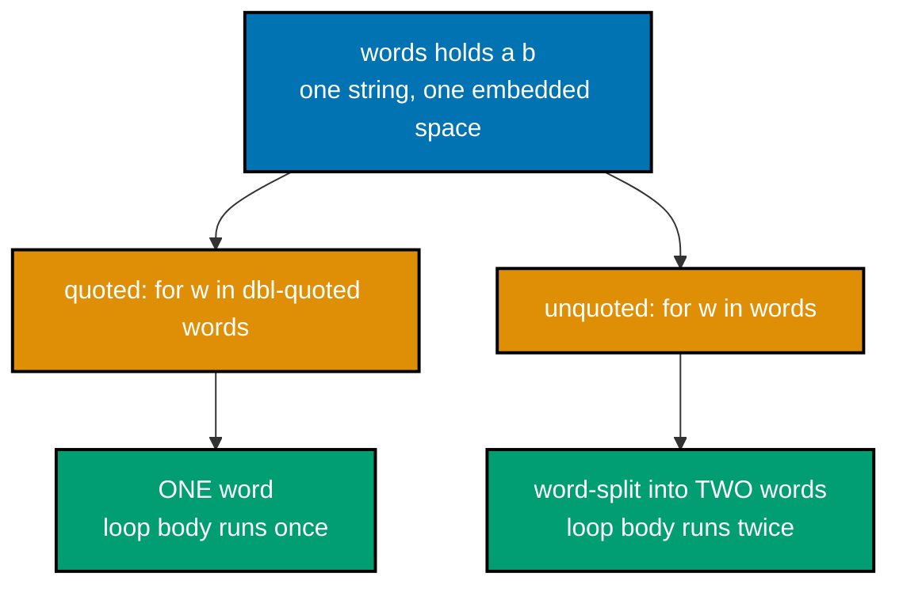
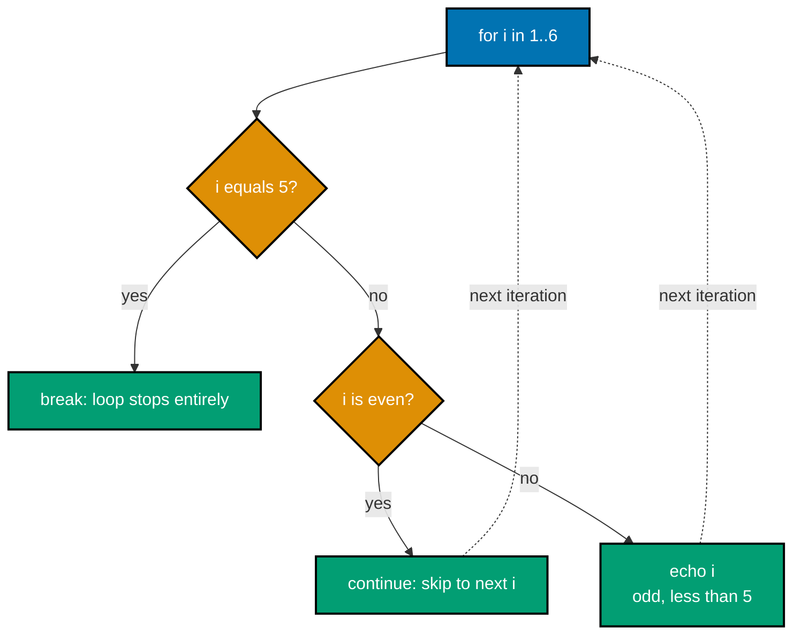

Examples 1-28 cover Bash's core script-writing surface: the shebang line and making a script executable, strict mode (`set -euo pipefail`), variables and expansion, quoting, command substitution, arithmetic expansion, exit codes, conditionals (`if`/`elif`/`else` with string, numeric, and file tests), loops (`for`/`while`/`until` with `break`/`continue`), I/O redirection, and the basic pipe. Every example is a complete, self-contained `.sh` script colocated under `learning/code/`; run each one with `bash example.sh` from inside its own directory unless a caption says otherwise.

---

### Example 1: Shebang Script

_ex-01 &middot; exercises co-01_

The very first Bash script most people write, and the one this whole primer's "universal run command" is built around. The shebang line (`#!/usr/bin/env bash`) tells the operating system which interpreter should run this file, and `echo` is Bash's most-used builtin for writing text to standard output.

**`learning/code/ex-01-shebang-script/example.sh`**

```bash
#!/usr/bin/env bash
# Example 1: Shebang Script
echo "Hello, world!" # => the echo builtin writes its argument, followed by a newline
# => Output: Hello, world!
```

**Run**: `bash example.sh`

**Output**:

```text
Hello, world!
```

**Key takeaway**: `bash <file>.sh` is the one command this entire primer builds on; the shebang line names the interpreter, and `echo` is the fastest way to see a value.

**Why it matters**: Every other example in this primer starts from this same command. There is no compile step and no build tool between you and running code -- Bash reads a file and executes it top to bottom. That immediacy is exactly why shell scripts are the default glue for builds, tests, and tooling in every later topic: any teammate with a terminal can run `bash script.sh` and trust that it works, with zero ceremony beyond having Bash installed.

---

### Example 2: Make Executable

_ex-02 &middot; exercises co-01_

The shebang line has a second job beyond documentation: once a file is marked executable, the operating system reads that line to pick an interpreter automatically, so you can run the script by name instead of typing `bash` in front of it every time.

**`learning/code/ex-02-make-executable/example.sh`**

```bash
#!/usr/bin/env bash
# Example 2: Make Executable
echo "Hello, world!" # => chmod +x example.sh then ./example.sh runs this directly, no `bash` needed
# => Output: Hello, world!
```

**Run**: `bash example.sh` (works as always); this example additionally verifies `chmod +x example.sh && ./example.sh`, which runs the identical script by name because the shebang tells the OS to launch it with `bash`.

**Output**:

```text
Hello, world!
```

**Key takeaway**: `chmod +x file.sh` sets the executable permission bit; combined with a shebang line, `./file.sh` then runs the script without spelling out `bash` at all.

**Why it matters**: Command-line tools you install (`git`, `npm`, `docker`) are executable files with a shebang line, run exactly this way. Making your own scripts executable is what turns a one-off script into a tool that behaves like any other command on your `$PATH` -- the first step toward the reusable `report.sh`-style helpers this primer's capstone builds toward.

---

### Example 3: Strict Mode Header

_ex-03 &middot; exercises co-03_

`set -euo pipefail` is the header line nearly every production Bash script should start with: it turns three classes of silent failure into loud, immediate ones. `-e` exits on any command's non-zero status, `-u` errors on any unset variable, and `pipefail` makes a pipeline fail if any of its stages fail, not just the last one.

**`learning/code/ex-03-strict-mode-header/example.sh`**

```bash
#!/usr/bin/env bash
# Example 3: Strict Mode Header
set -euo pipefail # => -e exits on error, -u errors on unset vars, pipefail catches pipe failures
echo "clean run"  # => reached only because nothing above failed
# => Output: clean run
```

**Run**: `bash example.sh`

**Output**:

```text
clean run
```

**Key takeaway**: `set -euo pipefail` is the standard strict-mode header; a script that runs clean under it reaches its final line and exits `0`, exactly as this one does.

**Why it matters**: Bash's default behavior is dangerously forgiving -- a failing command in the middle of a script is silently ignored by default, and the script keeps running with whatever partial state that failure left behind. Strict mode converts "keep going and hope for the best" into "stop the instant something is wrong," which is why every later, more complex example in this primer (and every real automation script) opens with this exact line.

---

### Example 4: Unset Var Fails

_ex-04 &middot; exercises co-03, co-05_

This example deliberately triggers the failure strict mode's `-u` flag exists to catch: referencing a variable that was never assigned. Under `set -u`, that reference aborts the script immediately with a clear error message instead of silently expanding to an empty string.

**`learning/code/ex-04-unset-var-fails/example.sh`**

```bash
#!/usr/bin/env bash
# Example 4: Unset Var Fails
set -u # => enables "nounset": referencing an undefined variable is now an error
# shellcheck disable=SC2154 # => intentional: this line demonstrates set -u catching a real unset variable
echo "${undefined_var}" # => undefined_var was never assigned, so this line aborts the script
# => stderr: example.sh: line 5: undefined_var: unbound variable
```

**Run**: `bash example.sh`

**Output** (stderr; the script exits non-zero and no stdout is produced):

```text
example.sh: line 5: undefined_var: unbound variable
```

**Key takeaway**: Under `set -u`, an unset variable reference is a hard error, not an empty string -- the script stops on the spot with `unbound variable` on stderr and a non-zero exit status.

**Why it matters**: Without `-u`, a typo'd variable name (`$fiel` instead of `$file`) silently expands to nothing, and a command that should operate on a real path might instead run against an empty string with surprising, sometimes destructive results. This example is the reason `-u` belongs in strict mode: it turns that entire class of typo bug into an immediate, loud failure at the exact line where it happens.

---

### Example 5: Assign And Echo

_ex-05 &middot; exercises co-05_

Bash variable assignment has one strict rule beginners trip over constantly: no spaces around the `=` sign. Once assigned, a variable is read back with a `$` prefix, and double-quoting that expansion is the safe default.

**`learning/code/ex-05-assign-and-echo/example.sh`**

```bash
#!/usr/bin/env bash
# Example 5: Assign And Echo
name="Ada"   # => assigns the string Ada to the variable name (no spaces around =)
echo "$name" # => "$name" expands inside double quotes
# => Output: Ada
```

**Run**: `bash example.sh`

**Output**:

```text
Ada
```

**Key takeaway**: `name="Ada"` (no spaces around `=`) assigns; `"$name"` (double-quoted) reads the value back safely.

**Why it matters**: `name = "Ada"` (with spaces) is not an assignment at all in Bash -- it is a command called `name` with two arguments, `=` and `Ada"`, which produces a confusing "command not found" error. This one syntax rule is the single most common first mistake for readers coming from nearly any other language, and getting it right here avoids a wall of confusing errors later.

---

### Example 6: Brace Var Expansion

_ex-06 &middot; exercises co-05_

`${name}` is the braced form of variable expansion, functionally identical to `$name` on its own, but necessary the moment other text follows directly after the variable name with no separator.

**`learning/code/ex-06-brace-var-expansion/example.sh`**

```bash
#!/usr/bin/env bash
# Example 6: Brace Var Expansion
name="Ada"        # => assigns Ada to name
echo "Hi ${name}" # => ${name} is the braced expansion form, identical to $name here
# => braces matter when text follows directly, e.g. "${name}s"
# => Output: Hi Ada
```

**Run**: `bash example.sh`

**Output**:

```text
Hi Ada
```

**Key takeaway**: `${name}` and `$name` expand identically on their own, but only `${name}` lets you safely glue extra text (like `${name}s`) directly onto the variable's value.

**Why it matters**: Without the braces, `$names` would look for a variable literally called `names`, not `name` followed by the letter `s` -- a subtle bug that only shows up once you try to build a compound string from a variable. This is why parameter-expansion forms (`${v:-default}`, `${p##*/}`, all covered later in this journey) always use the braced form: the syntax has to be unambiguous once anything more than a bare variable name is involved.

---

### Example 7: Single Vs Double Quote

_ex-07 &middot; exercises co-06_

Bash's two quoting styles behave completely differently: single quotes (`'...'`) are fully literal, so a `$name` inside them prints exactly as typed. Double quotes (`"..."`) allow expansion, so a `$name` inside them is replaced by the variable's value.

**`learning/code/ex-07-single-vs-double-quote/example.sh`**

```bash
#!/usr/bin/env bash
# Example 7: Single Vs Double Quote
name="Ada" # => assigns Ada to name
# shellcheck disable=SC2016 # => intentional: this line demonstrates that single quotes do NOT expand
echo '$name' # => single quotes are literal: no expansion happens
# => Output line 1: $name
echo "$name" # => double quotes allow expansion: $name becomes Ada
# => Output line 2: Ada
```

**Run**: `bash example.sh`

**Output**:

```text
$name
Ada
```

**Key takeaway**: Single quotes suppress ALL expansion (variables, command substitution, everything); double quotes allow variable and command-substitution expansion while still protecting whitespace.

**Why it matters**: This is the single most consequential quoting decision in Bash. Reach for single quotes when you want text taken literally -- a `grep` pattern, an `awk` script body, a literal `$` in output -- and double quotes everywhere you want a variable's current value substituted in. Mixing these up is one of the most common sources of real-world shell bugs, and `shellcheck` (Examples 75-77) exists largely to catch exactly this mistake.

---

### Example 8: Quoting Spaces

_ex-08 &middot; exercises co-06, co-23_

Quoting doesn't just control expansion -- it controls whether Bash splits a value into multiple words afterward. A quoted `"$words"` containing an embedded space stays one word; the same value left unquoted is split into separate words at each space.



**`learning/code/ex-08-quoting-spaces/example.sh`**

```bash
#!/usr/bin/env bash
# Example 8: Quoting Spaces
words="a b" # => words holds a single string containing an embedded space
# shellcheck disable=SC2066 # => intentional: this loop demonstrates quoting collapsing to ONE word
for w in "$words"; do # => quoted "$words" expands to ONE word: the loop runs once
  echo "quoted: $w"   # => Output line 1: quoted: a b
done                  # => closes the quoted loop
for w in $words; do   # => unquoted $words is word-split into TWO words: the loop runs twice
  echo "unquoted: $w" # => Output line 2: unquoted: a
  # => Output line 3: unquoted: b
done # => closes the unquoted loop
```

**Run**: `bash example.sh`

**Output**:

```text
quoted: a b
unquoted: a
unquoted: b
```

**Key takeaway**: Quoting a variable that holds a space keeps it as ONE word; leaving it unquoted lets Bash word-split it into MULTIPLE words on whitespace -- the same value, two very different loop behaviors.

**Why it matters**: Unquoted word-splitting (plus the closely related glob expansion, co-23) is the single most common source of real Bash bugs, and it is exactly what `shellcheck`'s SC2086 finding (Example 76, Advanced tier) exists to catch. The safe default is: quote every variable expansion unless you specifically want word-splitting -- and if you do want it, as this example's second loop deliberately demonstrates, make that choice explicit and obvious rather than accidental.

---

### Example 9: Command Substitution

_ex-09 &middot; exercises co-07_

`$(...)` runs the command inside it and replaces the whole expression with that command's captured standard output, letting you store a command's result in a variable.

**`learning/code/ex-09-command-substitution/example.sh`**

```bash
#!/usr/bin/env bash
# Example 9: Command Substitution
year="$(date +%Y)" # => $(...) runs `date +%Y` and captures its stdout into year
# => year now holds the current 4-digit year
echo "$year" # => Output: a 4-digit year
```

**Run**: `bash example.sh`

**Output**:

```text
2026
```

**Key takeaway**: `$(command)` captures a command's stdout as a string; the older backtick syntax (`` `command` ``) does the same thing but nests and reads worse, so `$(...)` is the modern default.

**Why it matters**: Command substitution is how Bash scripts read information from the rest of the system -- a file's line count (`$(wc -l < file)`), a tool's version string, or (as here) the current date. Every later example that needs to capture a command's output rather than just letting it print to the terminal reaches for this exact syntax.

---

### Example 10: Arithmetic

_ex-10 &middot; exercises co-08_

`$(( ))` is Bash's arithmetic expansion: it evaluates an integer expression and substitutes the result, with no need for an external `expr` or `bc` command.

**`learning/code/ex-10-arithmetic/example.sh`**

```bash
#!/usr/bin/env bash
# Example 10: Arithmetic
echo $((6 * 7)) # => $(( )) evaluates integer arithmetic; 6 * 7 is 42
# => Output: 42
```

**Run**: `bash example.sh`

**Output**:

```text
42
```

**Key takeaway**: `$(( expression ))` evaluates integer arithmetic (`+`, `-`, `*`, `/`, `%`, comparisons) directly in Bash, with variables inside it needing no leading `$`.

**Why it matters**: Before `$(( ))` was standard, shell scripts shelled out to `expr` for every calculation, which is slower and harder to read. Arithmetic expansion is the tool for loop counters (Example 11), array indices, and any numeric comparison, and it reappears constantly across every later tier of this primer.

---

### Example 11: Arithmetic Increment

_ex-11 &middot; exercises co-08, co-12_

Combining arithmetic expansion with a `while` loop is the standard way to count in Bash: `((i < 3))` is an arithmetic-context conditional, and `i=$((i + 1))` recomputes `i` on each pass.

**`learning/code/ex-11-arithmetic-increment/example.sh`**

```bash
#!/usr/bin/env bash
# Example 11: Arithmetic Increment
i=0                 # => i starts at 0
while ((i < 3)); do # => (( )) is an arithmetic-context conditional testing i < 3
  i=$((i + 1))      # => recomputes i as i + 1 using arithmetic expansion
done                # => loop exits once i reaches 3
echo "$i"           # => Output: 3
```

**Run**: `bash example.sh`

**Output**:

```text
3
```

**Key takeaway**: `((expr))` used as a loop or `if` condition evaluates `expr` arithmetically and is true when the result is non-zero -- pairing it with `i=$((i + 1))` is the idiomatic Bash counting pattern.

**Why it matters**: This pattern -- an arithmetic condition paired with an arithmetic increment -- is the backbone of every counted loop in Bash scripting, from retry-with-backoff logic to batch-processing a fixed number of items. Recognizing `((...))` as "arithmetic context" (as opposed to `[[...]]`'s string/file test context, Examples 15-18) prevents a common category of confusion between the two bracket styles.

---

### Example 12: Exit Code Success

_ex-12 &middot; exercises co-09_

Every command that runs sets `$?` to its exit status: `0` for success, non-zero for failure. The `true` builtin always succeeds, so `$?` immediately after it is always `0`.

**`learning/code/ex-12-exit-code-success/example.sh`**

```bash
#!/usr/bin/env bash
# Example 12: Exit Code Success
true      # => the `true` builtin always succeeds, setting $? to 0
echo "$?" # => $? holds the exit status of the immediately preceding command
# => Output: 0
```

**Run**: `bash example.sh`

**Output**:

```text
0
```

**Key takeaway**: `$?` holds the exit status of the most recently completed command -- `0` always means success, and it is only valid until the next command runs and overwrites it.

**Why it matters**: Exit codes are how every Unix command communicates success or failure back to whatever called it -- including Bash's own `if` statements (Example 59, Intermediate tier), which branch directly on a command's exit status rather than on a separate boolean value. Understanding `$?` as "the last command's report card" is the foundation for every conditional and error-handling pattern the rest of this primer builds on.

---

### Example 13: Exit Code Failure

_ex-13 &middot; exercises co-09_

The mirror image of Example 12: the `false` builtin always fails, setting `$?` to `1`, Bash's conventional generic-failure code.

**`learning/code/ex-13-exit-code-failure/example.sh`**

```bash
#!/usr/bin/env bash
# Example 13: Exit Code Failure
false     # => the `false` builtin always fails, setting $? to 1
echo "$?" # => $? reports the previous command's exit status
# => Output: 1
```

**Run**: `bash example.sh`

**Output**:

```text
1
```

**Key takeaway**: `false` always exits `1`; combined with Example 12's `true`, these two builtins are the simplest possible way to test or demonstrate exit-code behavior without depending on any external command.

**Why it matters**: Exit codes are not limited to `0` and `1` -- any value from `0` to `255` is valid, and well-behaved tools use different non-zero codes to distinguish failure reasons (a network error versus a bad argument, for instance). This example establishes the failure half of the `$?` contract that Example 14's `exit N` and Example 59's `if` guard both build directly on top of.

---

### Example 14: Explicit Exit

_ex-14 &middot; exercises co-09_

A script controls its own final exit status with the `exit` builtin. Without an explicit `exit N`, a script's status is whatever its last command's status happened to be; `exit 3` overrides that with a specific, deliberate value.

**`learning/code/ex-14-explicit-exit/example.sh`**

```bash
#!/usr/bin/env bash
# Example 14: Explicit Exit
echo "about to exit" # => runs before the explicit exit below
# => Output line 1: about to exit
exit 3 # => sets the script's own exit status to 3, overriding the default of 0
```

**Run**: `bash example.sh; echo $?`

**Output**:

```text
about to exit
3
```

**Key takeaway**: `exit N` immediately ends the script and sets its exit status to `N`; the caller reads that status through `$?`, exactly as it would for any other command.

**Why it matters**: A script's exit status is its entire public API for signaling success or failure to whatever invoked it -- a CI pipeline, a Makefile, or another script. Choosing exit codes deliberately (rather than letting the last command's status leak through by accident) is what makes a script safely composable into a larger pipeline, a habit this primer's capstone `report.sh` depends on directly.

---

### Example 15: If String Test

_ex-15 &middot; exercises co-10_

`[[ ]]` is Bash's extended conditional test, and `==` inside it compares two strings for equality. `if [[ "$a" == "$b" ]]; then ... fi` is the standard shape of a string-equality branch.

**`learning/code/ex-15-if-string-test/example.sh`**

```bash
#!/usr/bin/env bash
# Example 15: If String Test
a="ada"                     # => a holds the string ada
b="ada"                     # => b holds the same string, ada
if [[ "$a" == "$b" ]]; then # => [[ ]] is Bash's extended test; == compares strings for equality
  echo "equal"              # => taken because "$a" and "$b" hold identical strings
fi                          # => Output: equal
```

**Run**: `bash example.sh`

**Output**:

```text
equal
```

**Key takeaway**: `[[ "$a" == "$b" ]]` compares two strings for equality; the double brackets are a Bash extension (Example 18 shows the older, POSIX-portable `[ ]`/`test` alternative).

**Why it matters**: String comparison inside `if` is how scripts branch on user input, command output, or configuration values -- `case "$1" in start|stop|*)` (Example 29, Intermediate tier) is the multi-way generalization of exactly this pattern. Quoting both sides of `==` (`"$a"`, not bare `$a`) keeps the comparison safe even when a value happens to be empty or contain spaces.

---

### Example 16: If Numeric Test

_ex-16 &middot; exercises co-10_

Numeric comparisons inside `[[ ]]` use named operators (`-gt`, `-lt`, `-eq`, and so on) rather than `>`/`<`/`==`, which inside `[[ ]]` would instead compare strings lexicographically.

**`learning/code/ex-16-if-numeric-test/example.sh`**

```bash
#!/usr/bin/env bash
# Example 16: If Numeric Test
n=20                     # => n holds the number 20
if [[ $n -gt 10 ]]; then # => -gt is the numeric "greater than" test inside [[ ]]
  echo "big"             # => taken because 20 is greater than 10
fi                       # => Output: big
```

**Run**: `bash example.sh`

**Output**:

```text
big
```

**Key takeaway**: Numeric tests inside `[[ ]]` use `-gt`/`-lt`/`-ge`/`-le`/`-eq`/`-ne`, not `>`/`<`/`==` -- those symbols mean something different (string comparison and, for `>`/`<`, redirection) in this context.

**Why it matters**: Reaching for `[[ $n > 10 ]]` instead of `-gt` is a genuine, easy-to-make mistake, because it compiles and runs without complaint -- it just compares `$n` and `10` as strings, which gives wrong answers for anything beyond single digits. Knowing the named-operator vocabulary up front avoids silently wrong numeric comparisons in scripts that count, measure, or threshold anything.

---

### Example 17: If File Test

_ex-17 &middot; exercises co-10_

Bash's file-test operators check facts about the filesystem directly inside a conditional. `-f path` is true when `path` exists and is a regular file (not a directory, not missing).

**`learning/code/ex-17-if-file-test/example.sh`**

```bash
#!/usr/bin/env bash
# Example 17: If File Test
if [[ -f data.txt ]]; then # => -f tests that a path exists and is a regular file
  echo "exists"            # => taken because data.txt is colocated with this script
fi                         # => Output: exists
```

This example needs its own companion file, colocated in the same directory:

**`learning/code/ex-17-if-file-test/data.txt`**

```text
sample data
```

**Run**: `bash example.sh`

**Output**:

```text
exists
```

**Key takeaway**: `[[ -f path ]]` is true only for an existing regular file; the closely related `-d path` (Example 18) tests for a directory instead.

**Why it matters**: File-test operators are how scripts guard against missing input before trying to read it, or avoid overwriting an output file that already exists. This is the operator every later text-pipeline example (Intermediate tier onward) implicitly depends on when it processes "a file" -- checking `-f` first turns a confusing "No such file or directory" mid-pipeline failure into a clear, early error message.

---

### Example 18: Test Vs Bracket

_ex-18 &middot; exercises co-10, co-04_

`test` and `[ ]` are two spellings of exactly the same builtin -- `[ expr ]` is literally `test expr ]`, where the trailing `]` is just the command's last argument. Both are POSIX-portable, unlike Bash's own `[[ ]]` extension.

**`learning/code/ex-18-test-vs-bracket/example.sh`**

```bash
#!/usr/bin/env bash
# Example 18: Test Vs Bracket
if test -d .; then       # => `test` is the original directory-test spelling (here a shell builtin)
  echo "test: exists"    # => taken because "." (the current directory) always exists
fi                       # => Output line 1: test: exists
if [ -d . ]; then        # => [ ... ] is `test` written with bracket syntax -- the same builtin
  echo "bracket: exists" # => taken for the identical reason as above
fi                       # => Output line 2: bracket: exists
```

**Run**: `bash example.sh`

**Output**:

```text
test: exists
bracket: exists
```

**Key takeaway**: `test -d dir` and `[ -d dir ]` are the exact same command with two different names; `[[ -d dir ]]` (Examples 15-17) is a separate, Bash-only extension with looser quoting rules.

**Why it matters**: This is the practical heart of the Bash-vs-POSIX distinction (co-04): `test`/`[ ]` work in any POSIX `sh`, while `[[ ]]` only works in Bash (and a few other shells that adopted it as an extension). A script that needs to run under plain `sh` -- like Example 82's POSIX-portable script (Advanced tier) -- must use `[ ]`/`test`, not `[[ ]]`, and knowing both spellings mean the same thing removes any mystery about why a portable script looks slightly different from the `[[ ]]`-heavy scripts everywhere else in this primer.

---

### Example 19: For Loop List

_ex-19 &middot; exercises co-12_

The simplest form of Bash's `for` loop iterates directly over a literal list of words, binding each one to the loop variable in turn.

**`learning/code/ex-19-for-loop-list/example.sh`**

```bash
#!/usr/bin/env bash
# Example 19: For Loop List
for x in a b c; do # => iterates over the three literal words a, b, c in order
  echo "$x"        # => prints each word on its own line
done               # => Output: a, then b, then c, each on its own line
```

**Run**: `bash example.sh`

**Output**:

```text
a
b
c
```

**Key takeaway**: `for var in word1 word2 word3; do ... done` binds `var` to each word in order, running the body once per word.

**Why it matters**: This is the most common loop shape in everyday Bash scripting -- iterating a fixed, known list of items (file extensions to check, environment names to deploy to, flags to try). Example 34's `for arg in "$@"` (Intermediate tier) is the same construct applied to a script's own command-line arguments instead of a literal word list.

---

### Example 20: For Loop Range

_ex-20 &middot; exercises co-12_

Brace expansion (`{1..5}`) generates a sequence of words before the `for` loop even starts running, making it Bash's idiomatic way to count through a numeric range without a C-style `for` loop.

**`learning/code/ex-20-for-loop-range/example.sh`**

```bash
#!/usr/bin/env bash
# Example 20: For Loop Range
for i in {1..5}; do # => {1..5} is brace expansion: it expands to 1 2 3 4 5 before the loop runs
  echo -n "$i "     # => -n suppresses echo's trailing newline, keeping output on one line
done                # => Output: 1 2 3 4 5 (trailing space, no final newline yet)
echo                # => prints one final newline so the shell prompt starts cleanly
```

**Run**: `bash example.sh`

**Output** (this doc's Markdown formatter strips the trailing space that real stdout has after the final `5` -- see the script's own comment above for the byte-exact value):

```text
1 2 3 4 5
```

**Key takeaway**: `{start..stop}` brace expansion generates an inclusive numeric sequence as plain words, ready for a `for` loop to iterate; `echo -n` suppresses the trailing newline when you want output on a single line.

**Why it matters**: Brace expansion happens purely as text substitution before Bash even parses the `for` loop -- `for i in {1..5}` is exactly the same to Bash as `for i in 1 2 3 4 5`. That distinction matters the moment the range's bounds are variables rather than literals (`{1..$n}` does NOT expand as you'd expect), a gotcha worth knowing before reaching for this pattern with dynamic bounds.

---

### Example 21: While Loop

_ex-21 &middot; exercises co-12_

`while` re-checks its condition before every iteration, including the first -- if the condition starts false, the loop body never runs at all.

**`learning/code/ex-21-while-loop/example.sh`**

```bash
#!/usr/bin/env bash
# Example 21: While Loop
n=0                      # => n starts at 0
while [[ $n -lt 3 ]]; do # => condition re-checked before every pass, including the first
  n=$((n + 1))           # => n becomes 1, then 2, then 3
  echo "$n"              # => Output: 1, then 2, then 3, each on its own line
done                     # => loop exits once n reaches 3
```

**Run**: `bash example.sh`

**Output**:

```text
1
2
3
```

**Key takeaway**: `while cond; do ... done` re-checks `cond` before every pass, including the very first one -- a loop whose condition starts false never runs its body at all.

**Why it matters**: `while` is Bash's condition-first loop, and it is the natural shape for "keep going until something external changes" -- reading a file line by line until EOF (Example 37, Intermediate tier), polling a condition, or retrying an operation. Contrasted with `until` (Example 22), which is condition-negated but otherwise identical, `while` is the workhorse of every open-ended loop in this primer.

---

### Example 22: Until Loop

_ex-22 &middot; exercises co-12_

`until` is `while`'s mirror image: it runs its body while the condition is FALSE, stopping the moment the condition becomes true -- useful when a loop's natural exit condition reads better stated positively.

**`learning/code/ex-22-until-loop/example.sh`**

```bash
#!/usr/bin/env bash
# Example 22: Until Loop
n=0                      # => n starts at 0
until [[ $n -eq 3 ]]; do # => until runs its body while the condition is FALSE, stopping once true
  echo "$n"              # => Output: 0, then 1, then 2 -- printed BEFORE the increment below
  n=$((n + 1))           # => n becomes 1, then 2, then 3
done                     # => loop exits once n equals 3
```

**Run**: `bash example.sh`

**Output**:

```text
0
1
2
```

**Key takeaway**: `until cond; do ... done` is `while` with the condition's truth value flipped -- it loops while `cond` is false and stops the moment `cond` becomes true.

**Why it matters**: `until` and `while` are functionally interchangeable (`until cond` always equals `while ! cond`), so the choice between them is purely about which one reads more naturally for a given exit condition -- "until the file appears" reads better than "while the file does not appear." Recognizing both forms on sight matters more than memorizing when to prefer one, since real-world scripts use both.

---

### Example 23: Break Continue

_ex-23 &middot; exercises co-12_

`break` exits a loop immediately, skipping any remaining iterations entirely. `continue` skips only the rest of the current iteration's body, jumping straight to the next one -- the two most common ways to alter a loop's normal top-to-bottom flow.



**`learning/code/ex-23-break-continue/example.sh`**

```bash
#!/usr/bin/env bash
# Example 23: Break Continue
for i in 1 2 3 4 5 6; do  # => iterates the literal numbers 1 through 6
  if ((i == 5)); then     # => arithmetic test: true only when i equals 5
    break                 # => exits the loop immediately, skipping 5 and 6 entirely
  fi                      # => closes the break-triggering if
  if ((i % 2 == 0)); then # => arithmetic test: true for even i
    continue              # => skips the rest of this iteration's body, jumping to the next i
  fi                      # => closes the continue-triggering if
  echo "$i"               # => only reached for odd i values that are less than 5
  # => Output: 1, then 3 (2/4 skipped by continue, loop stops before 5)
done # => closes the for loop
```

**Run**: `bash example.sh`

**Output**:

```text
1
3
```

**Key takeaway**: `break` exits the loop entirely; `continue` skips only the current iteration and moves on to the next -- both operate on the nearest enclosing loop.

**Why it matters**: Filtering (`continue` past values you don't want) and early termination (`break` once you've found what you need or hit a limit) are two of the most common loop-control needs in real scripts, from skipping blank lines in a text-pipeline read loop to stopping a retry loop once an operation finally succeeds. Recognizing which one a piece of code needs -- "skip this one" versus "stop entirely" -- is a small but constant decision in everyday scripting.

---

### Example 24: Echo To Stdout

_ex-24 &middot; exercises co-14_

`echo` writes its argument to file descriptor 1 (stdout), followed by a newline. Every one of Bash's three standard streams -- stdin, stdout, stderr -- can be redirected independently, starting with this, the simplest possible case.

**`learning/code/ex-24-echo-to-stdout/example.sh`**

```bash
#!/usr/bin/env bash
# Example 24: Echo To Stdout
echo "exact line" # => echo writes its argument followed by a newline to stdout (fd 1)
# => Output: exact line
```

**Run**: `bash example.sh`

**Output**:

```text
exact line
```

**Key takeaway**: `echo` writes to stdout (file descriptor 1) by default; every redirection example that follows (Examples 25-27) is about sending that same fd 1 -- or fd 2, stderr -- somewhere other than the terminal.

**Why it matters**: Standard output is the default destination for a command's normal results, and it is what gets captured by command substitution (Example 9) and piped into the next command in a pipeline (Example 28). Every later text-pipeline tool (`grep`, `sed`, `awk`, Intermediate tier) reads from stdin and writes to stdout by the same convention this example establishes in miniature.

---

### Example 25: Redirect To File

_ex-25 &middot; exercises co-14_

`>` redirects a command's stdout into a file, creating the file if it doesn't exist and truncating (erasing) it first if it does.

**`learning/code/ex-25-redirect-to-file/example.sh`**

```bash
#!/usr/bin/env bash
# Example 25: Redirect To File
echo "hi" >out.txt # => > truncates (or creates) out.txt and writes echo's stdout into it
cat out.txt        # => reads out.txt back so the redirected content is visible
# => Output: hi
```

**Run**: `bash example.sh`

**Output**:

```text
hi
```

**Key takeaway**: `command > file` sends `command`'s stdout into `file`, replacing whatever was there before -- run the same script twice and `file` still holds exactly one line.

**Why it matters**: `>` is how scripts produce persistent output -- log files, generated reports, saved command results -- rather than text that vanishes the moment the terminal scrolls. The truncating behavior is worth internalizing early, because it is also the behavior that makes `>` dangerous to use carelessly on a file you meant to keep; Example 26's `>>` is the safer choice whenever you want to preserve what's already there.

---

### Example 26: Append To File

_ex-26 &middot; exercises co-14_

`>>` appends a command's stdout to the end of a file instead of truncating it first, letting a script build up a file's contents across multiple writes.

**`learning/code/ex-26-append-to-file/example.sh`**

```bash
#!/usr/bin/env bash
# Example 26: Append To File
echo "hi" >out.txt    # => > truncates/creates out.txt with the first line
echo "more" >>out.txt # => >> appends a second line without erasing the first
cat out.txt           # => Output line 1: hi
# => Output line 2: more
```

**Run**: `bash example.sh`

**Output**:

```text
hi
more
```

**Key takeaway**: `>>` appends to a file without erasing its existing contents, in contrast to `>` (Example 25), which truncates first -- the difference between building a file up and starting it over.

**Why it matters**: Log files are the classic use case for `>>` -- a long-running process appends one line per event, and truncating on every write would destroy the history you're trying to keep. This example deliberately starts with a fresh `>` before appending, so the script stays self-contained and produces the same two-line result every time it runs, rather than growing unbounded across repeated runs.

---

### Example 27: Redirect Stderr

_ex-27 &middot; exercises co-14_

`2>` redirects file descriptor 2 (stderr) specifically, leaving stdout (fd 1) untouched. This lets a script separate a command's normal output from its error messages, capturing each independently.

**`learning/code/ex-27-redirect-stderr/example.sh`**

```bash
#!/usr/bin/env bash
# Example 27: Redirect Stderr
ls /no-such-path-xyz 2>err.txt # => 2> captures only stderr (fd 2) into err.txt; stdout (fd 1) is untouched
# => ls finds nothing, so its own stdout stays empty -- no output here
cat err.txt # => Output: the captured error text (verifies err.txt is non-empty)
```

**Run**: `bash example.sh`

**Output**:

```text
ls: /no-such-path-xyz: No such file or directory
```

**Key takeaway**: `2>` redirects only stderr; `ls`'s own stdout stays completely empty here because the path does not exist, and the error text lands in `err.txt` instead of the terminal.

**Why it matters**: Separating stdout from stderr is what lets a script (or the person running it) tell a tool's real results apart from its diagnostic noise -- piping only stdout onward while letting stderr surface separately, or vice versa. `2>&1` (Example 54, Intermediate tier) is the companion operator for the opposite case: merging the two streams back together when you want both captured as one.

---

### Example 28: Simple Pipe

_ex-28 &middot; exercises co-15_

`|` connects one command's stdout directly to the next command's stdin, with no intermediate file -- the mechanism the overview's "coupling-vs-cohesion" idea is built on.

**`learning/code/ex-28-simple-pipe/example.sh`**

```bash
#!/usr/bin/env bash
# Example 28: Simple Pipe
printf 'b\na\n' | sort # => printf's stdout feeds directly into sort's stdin via the pipe
# => Output: a, then b (sort reorders the two lines alphabetically)
```

**Run**: `bash example.sh`

**Output**:

```text
a
b
```

**Key takeaway**: `command1 | command2` feeds `command1`'s stdout straight into `command2`'s stdin; `sort` here reorders the two lines it receives without either command knowing anything about the other.

**Why it matters**: The pipe is the single mechanism that turns Bash's many small, single-purpose tools into arbitrarily large pipelines -- `find | grep | awk | sort` (Example 53, Intermediate tier) is this exact two-command pipe extended to four stages. Neither `printf` nor `sort` needed to be written with the other in mind; the pipe is the whole contract between them, which is precisely the `coupling-vs-cohesion` idea this primer opened with.

---

← Previous: [Overview](./overview.md) · Next: [Intermediate Examples](./intermediate.md) →
