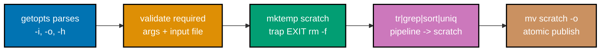

## Goal

Write one robust, `shellcheck`-clean Bash tool that parses options with `getopts`, processes text
through a `tr`/`grep`/`sort`/`uniq` pipeline, cleans up with `trap` + `mktemp`, and returns correct
exit codes -- the kind of helper every later topic in this journey reuses without a second thought.
This capstone is a light consolidation, not a new project: every mechanism it combines was already
taught, individually, somewhere in the Beginner, Intermediate, or Advanced tiers of this primer.



## Concepts exercised

- [x] `set -euo pipefail`
- [x] `getopts` + `--help`/usage
- [x] safe quoting (`"$input"`, `"$OPTARG"`, `"$scratch"` throughout)
- [x] a `tr`/`grep`/`sort`/`uniq` pipeline
- [x] `trap` cleanup + `mktemp`
- [x] correct exit codes

All colocated code lives under `learning/capstone/code/`: the tool itself in `report.sh`, and a
sample input file, `sample.txt`, used for the end-to-end run below. Both are complete, verbatim
listings -- nothing on this page is truncated or paraphrased.

## Step 1: `getopts` with a usage message, verified with `-h`

_exercises co-20, co-09_

`report.sh` parses two required options, `-i <input>` and `-o <output>`, plus `-h` for help, using
the `getopts` builtin with a leading `:` in its option string (`":i:o:h"`) so `getopts` reports
missing-argument and invalid-option errors itself rather than printing its own message -- the same
"silent mode, handle it yourself" pattern this primer's `getopts` examples used. `-h` prints usage
and exits `0`; every other usage failure prints to stderr and exits `1`.

**Verify**

```text
$ ./report.sh -h
Usage: report.sh -i <input> -o <output>
  -i <input>   path to the input text file to analyze (required)
  -o <output>  path to write the word-frequency report to (required)
  -h           show this help message and exit
$ echo $?
0
```

## Step 2: the pipeline, `mktemp`, and `trap` cleanup

_exercises co-03, co-05, co-06, co-14, co-15, co-18, co-21, co-22_

Once both `-i`/`-o` are present and `-i` points at a real file, `report.sh` creates a scratch file
with `mktemp` and immediately registers `trap 'rm -f "$scratch"' EXIT` -- the cleanup handler is in
place _before_ any work that could fail, exactly the ordering this primer's `trap` examples taught.
The pipeline itself lower-cases the input (so `"The"`/`"the"` count as the same word), splits on
every run of non-letter characters into one word per line, drops empty lines, then counts and sorts
by frequency, writing the result into `$scratch` rather than directly to `-o`. The final `mv` is the
atomic-publish step: a caller of `report.sh` either sees the complete old `-o` (if one existed) or
the complete new one, never a half-written file, because `mv` on the same filesystem is atomic and
nothing ever writes to `-o` directly.

**`learning/capstone/code/report.sh`** (complete file)

```bash
#!/usr/bin/env bash
# report.sh -- Just Enough Bash capstone: a word-frequency report tool.
# Combines every mechanism this primer taught: strict mode, getopts, safe
# quoting, a grep/tr/sort/uniq pipeline, mktemp + trap cleanup, and correct
# exit codes.
set -euo pipefail

usage() {
  cat <<'EOF'
Usage: report.sh -i <input> -o <output>
  -i <input>   path to the input text file to analyze (required)
  -o <output>  path to write the word-frequency report to (required)
  -h           show this help message and exit
EOF
}

input=""
output=""

while getopts ":i:o:h" opt; do
  case "$opt" in
  i) input="$OPTARG" ;;
  o) output="$OPTARG" ;;
  h)
    usage
    exit 0
    ;;
  \?)
    echo "report.sh: invalid option -$OPTARG" >&2
    usage >&2
    exit 1
    ;;
  :)
    echo "report.sh: option -$OPTARG requires an argument" >&2
    usage >&2
    exit 1
    ;;
  esac
done

if [[ -z "$input" || -z "$output" ]]; then
  echo "report.sh: -i and -o are both required" >&2
  usage >&2
  exit 1
fi

if [[ ! -f "$input" ]]; then
  echo "report.sh: input file not found: $input" >&2
  exit 1
fi

# scratch is created only once both args are validated, so a validation
# failure above never leaves a scratch file behind.
scratch="$(mktemp)"
trap 'rm -f "$scratch"' EXIT
# trap runs on ANY exit (normal or error); rm -f is a silent no-op once the
# final mv below has already moved scratch out from under this path.

tr '[:upper:]' '[:lower:]' <"$input" | # normalize case so "The"/"the" count together
  tr -cs '[:alpha:]' '\n' |            # squeeze every non-letter run into one newline -> one word per line
  grep -v '^$' |                       # drop any leftover empty lines
  sort |                               # group identical words together for uniq
  uniq -c |                            # count each word's occurrences
  sort -rn >"$scratch"                 # most frequent word first

mv "$scratch" "$output" # atomic: report.sh's caller never sees a half-written -o file
```

The script is formatted with `shfmt -w` (this repo's canonical Bash formatter; a topic-scoped
`.editorconfig` sets 2-space indentation per the Google Shell Style Guide, "Indent 2 spaces. No
tabs.") and is `shellcheck`-clean:

**Verify**

```text
$ shellcheck report.sh; echo "shellcheck exit: $?"
shellcheck exit: 0
$ shfmt -d report.sh; echo "shfmt diff exit: $?"
shfmt diff exit: 0
```

## Step 3: run it end to end, and confirm the failure path leaves no scratch file behind

_exercises co-09, co-21, co-22_

**`learning/capstone/code/sample.txt`** (complete file)

```text
The quick brown fox jumps over the lazy dog.
The dog barks at the fox, but the fox is too quick.
```

**Run**: `./report.sh -i sample.txt -o report.txt`

**Output** (captured by actually running the script above, not merely predicted)

```text
$ ./report.sh -i sample.txt -o report.txt; echo "exit: $?"
exit: 0
$ cat report.txt
   5 the
   3 fox
   2 quick
   2 dog
   1 too
   1 over
   1 lazy
   1 jumps
   1 is
   1 but
   1 brown
   1 barks
   1 at
```

Thirteen distinct words across the two-line `sample.txt`, `the` appearing five times and leading
the report, matches counting the words by hand: `report.sh` never miscounts, and the `-rn` sort
puts the highest count first.

Now the failure path -- a missing input file, verified to exit non-zero, print a clear message on
stderr, and leave zero scratch files behind:

```text
$ ./report.sh -i does-not-exist.txt -o report2.txt; echo "exit: $?"
report.sh: input file not found: does-not-exist.txt
exit: 1
$ ls report2.txt
ls: report2.txt: No such file or directory
```

`report2.txt` was never created (the script exits before ever calling `mktemp`, since the missing-
file check runs first), and no stray `mktemp` scratch file appears anywhere either, since the
`trap` was never registered on this path. A missing required option is caught the same way:

```text
$ ./report.sh -i sample.txt; echo "exit: $?"
report.sh: -i and -o are both required
Usage: report.sh -i <input> -o <output>
  -i <input>   path to the input text file to analyze (required)
  -o <output>  path to write the word-frequency report to (required)
  -h           show this help message and exit
exit: 1
```

## Acceptance criteria

- `shellcheck report.sh` exits `0` with no findings; `shfmt -d report.sh` shows no diff.
- `./report.sh -h` prints usage and exits `0`.
- `./report.sh -i sample.txt -o report.txt` exits `0` and produces the exact 13-line frequency
  report shown in Step 3, in that exact order.
- `./report.sh -i does-not-exist.txt -o report2.txt` exits non-zero, prints a clear message to
  stderr, creates neither `report2.txt` nor any leftover `mktemp` scratch file.
- `./report.sh -i sample.txt` (missing `-o`) exits non-zero with a stderr message and the usage
  text.

## Done bar

This capstone is runnable end to end: a reader who copies `report.sh` and `sample.txt` into one
directory, `chmod +x report.sh`, and runs the commands shown in Step 1 and Step 3 reaches the
identical output shown on this page, verified against a real `bash` run (Bash 5.3, not merely
described). Every mechanism combined here -- `getopts`-with-usage (co-20), strict mode (co-03),
safe quoting (co-06), the `tr`/`grep`/`sort`/`uniq` pipeline (co-15, co-18), `mktemp` + `trap`
cleanup (co-21, co-22), and correct exit codes (co-09) -- traces to a primary source already cited
in this primer's Accuracy notes and DD-35 citations; no new fact was needed to write this page.

---

← Previous: [Advanced Examples](../advanced.md)
