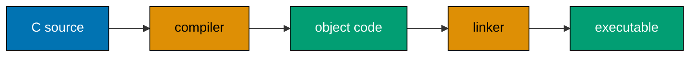
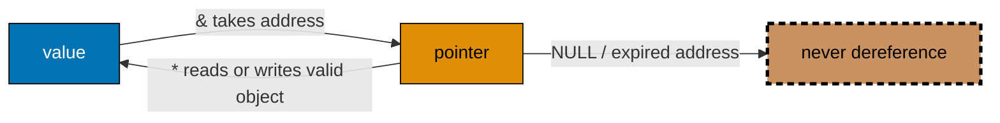
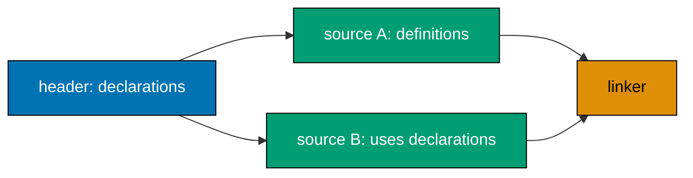

Just Enough C is a focused Primer for the operating-system and systems-programming courses that
follow. It teaches the smallest dependable C surface needed to read, build, and safely extend their
examples: the compile/link loop, scalar values and control flow, pointers, arrays, strings, structs,
standard I/O, the preprocessor, small multi-file programs, and the first allocation/free discipline.

## Productive scope

**Just enough to be productive here** means enough C for
[79 · Linux OS](../linux-os/overview), [80 · Windows OS](../windows-os/overview), and
[81 · System Programming](../system-programming/overview): compile warning-clean programs, follow
addresses through a pointer, use arrays and structs as laid-out data, and recognize ownership of a
small heap allocation. It deliberately excludes concurrency, signals, sockets, POSIX process APIs,
undefined-behaviour deep dives, complex macro metaprogramming, custom allocators, and comprehensive
C-library reference material. Those belong to the consuming systems courses or a fuller C treatment.

## Prerequisites

- [4 · Just Enough Python](../just-enough-python/learning/overview) supplies the high-level contrast
  and prior programming vocabulary.
- [5 · Just Enough Bash](../just-enough-bash/learning/overview) supplies terminal, compiler, and
  `make` build-loop comfort.
- Use a macOS/Linux terminal with `cc` (GCC or Clang) and `make`; an editor with C
  language-server support is useful.

## The big idea

C is deliberately thin: a pointer is an address, an array is contiguous elements, and a struct is
laid-out bytes. That visibility makes systems interfaces readable, but it also makes lifetime and
bounds the programmer’s responsibility. Compile every example with
`-Wall -Wextra -pedantic`; a warning is evidence to investigate, not output to ignore.

The build loop keeps separate responsibilities visible: the compiler checks each translation unit,
while the linker joins their declared interfaces into one executable.

This relationship is the prerequisite for reading buffers, records, file handles, and API arguments
in the systems courses without confusing an object with the address used to reach it.

Guarded headers and the declaration/definition split let a small C program grow without hiding
which translation unit owns a symbol.

Start with [Learning](./learning), then use [Drilling](./drilling) to turn the recurring pointer,
ownership, and build decisions into recall.
