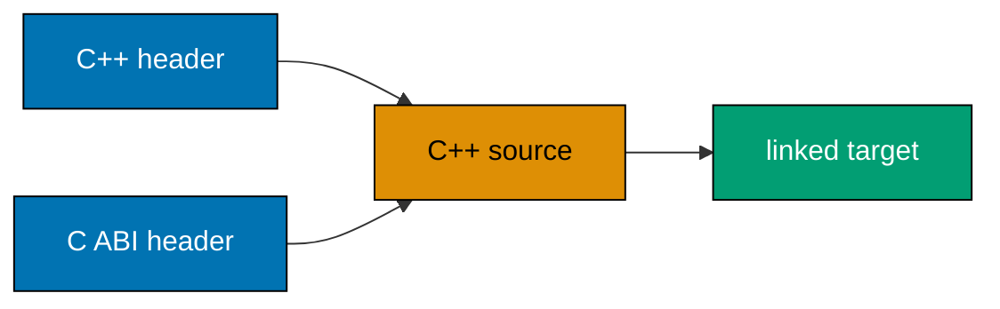

Examples 51–75 consolidate the bounded modern-C++ surface: CMake targets, reusable templates, ownership graphs, error modeling, and a small warning/test/sanitizer-ready CLI. They remain C++17 and standard-library only.



### Example 51: Build a library and executable with CMake

_ex-51 · exercises co-02, co-25_

**Brief explanation.** This independent C++17 slice demonstrates build a library and executable with cmake while keeping the modern-C++ surface focused on productive reading and small safe changes. This keeps the example small enough to compile, inspect, and adapt before combining it with later C++ mechanisms.

**Scope note.** It is the deepest required use here; defer framework APIs, concurrency architecture, and language edge cases until a consuming codebase requires them.

**Runnable annotated code.** Rendered verbatim from `learning/code/ex-51-cmake-multi-target/main.cpp`.

```cpp
// => cmake-multi-target: this line establishes the runnable C++ state or behavior.
#include "message.hpp"
// => cmake-multi-target: this line establishes the runnable C++ state or behavior.
#include <iostream>
// => cmake-multi-target: this line establishes the runnable C++ state or behavior.
int main() {
// => cmake-multi-target: this line establishes the runnable C++ state or behavior.
  std::cout << message() << "\n";
// => cmake-multi-target: this line establishes the runnable C++ state or behavior.
}
```

**Run.** `cmake -S . -B build && cmake --build build && ./build/cmake-multi-target` from this example directory.

**Key takeaway.** Prefer an explicit type and a scope-bound owner over an implicit lifetime or manually maintained cleanup rule.

**Why it matters.** Advanced-looking C++ is still maintainable when its ownership, extension point, and error path remain local and testable. This small artifact makes that claim executable: compile it with warnings, run it, then vary one input or type. When you encounter a larger system, look for the same boundaries before changing code—who owns this resource, and what preserves its invariant when control exits early?

### Example 52: Build a generic stack

_ex-52 · exercises co-11, co-18_

**Brief explanation.** This independent C++17 slice demonstrates build a generic stack while keeping the modern-C++ surface focused on productive reading and small safe changes. This keeps the example small enough to compile, inspect, and adapt before combining it with later C++ mechanisms.

**Scope note.** It is the deepest required use here; defer framework APIs, concurrency architecture, and language edge cases until a consuming codebase requires them.

**Runnable annotated code.** Rendered verbatim from `learning/code/ex-52-templated-container-full/main.cpp`.

```cpp
// => templated-container-full: this line establishes the runnable C++ state or behavior.
#include <iostream>
// => templated-container-full: this line establishes the runnable C++ state or behavior.
#include <optional>
// => templated-container-full: this line establishes the runnable C++ state or behavior.
#include <string>
// => templated-container-full: this line establishes the runnable C++ state or behavior.
#include <utility>
// => templated-container-full: this line establishes the runnable C++ state or behavior.
#include <vector>
// => templated-container-full: this line establishes the runnable C++ state or behavior.
template <typename T> class Stack {
// => templated-container-full: this line establishes the runnable C++ state or behavior.
 public:
// => templated-container-full: this line establishes the runnable C++ state or behavior.
  void push(T value) { values_.push_back(std::move(value)); }
// => templated-container-full: this line establishes the runnable C++ state or behavior.
  std::optional<T> pop() { if (values_.empty()) return std::nullopt; T value = std::move(values_.back()); values_.pop_back(); return value; }
// => templated-container-full: this line establishes the runnable C++ state or behavior.
 private:
// => templated-container-full: this line establishes the runnable C++ state or behavior.
  std::vector<T> values_;
// => templated-container-full: this line establishes the runnable C++ state or behavior.
};
// => templated-container-full: this line establishes the runnable C++ state or behavior.
int main() {
// => templated-container-full: this line establishes the runnable C++ state or behavior.
  Stack<std::string> stack; stack.push("top");
// => templated-container-full: this line establishes the runnable C++ state or behavior.
  std::cout << stack.pop().value_or("empty") << "\n";
// => templated-container-full: this line establishes the runnable C++ state or behavior.
}
```

**Run.** `c++ -std=c++17 -Wall -Wextra -Wpedantic -fsanitize=address,undefined -fno-omit-frame-pointer main.cpp -o example && ./example` from this example directory.

**Key takeaway.** Prefer an explicit type and a scope-bound owner over an implicit lifetime or manually maintained cleanup rule.

**Why it matters.** Advanced-looking C++ is still maintainable when its ownership, extension point, and error path remain local and testable. This small artifact makes that claim executable: compile it with warnings, run it, then vary one input or type. When you encounter a larger system, look for the same boundaries before changing code—who owns this resource, and what preserves its invariant when control exits early?

### Example 53: Enable range-for on a custom type

_ex-53 · exercises co-20, co-22_

**Brief explanation.** This independent C++17 slice demonstrates enable range-for on a custom type while keeping the modern-C++ surface focused on productive reading and small safe changes. This keeps the example small enough to compile, inspect, and adapt before combining it with later C++ mechanisms.

**Scope note.** It is the deepest required use here; defer framework APIs, concurrency architecture, and language edge cases until a consuming codebase requires them.

**Runnable annotated code.** Rendered verbatim from `learning/code/ex-53-iterator-support-for-custom-type/main.cpp`.

```cpp
// => iterator-support-for-custom-type: this line establishes the runnable C++ state or behavior.
#include <array>
// => iterator-support-for-custom-type: this line establishes the runnable C++ state or behavior.
#include <iostream>
// => iterator-support-for-custom-type: this line establishes the runnable C++ state or behavior.
class Pair {
// => iterator-support-for-custom-type: this line establishes the runnable C++ state or behavior.
 public:
// => iterator-support-for-custom-type: this line establishes the runnable C++ state or behavior.
  auto begin() const { return values_.begin(); }
// => iterator-support-for-custom-type: this line establishes the runnable C++ state or behavior.
  auto end() const { return values_.end(); }
// => iterator-support-for-custom-type: this line establishes the runnable C++ state or behavior.
 private:
// => iterator-support-for-custom-type: this line establishes the runnable C++ state or behavior.
  std::array<int, 2> values_{4, 5};
// => iterator-support-for-custom-type: this line establishes the runnable C++ state or behavior.
};
// => iterator-support-for-custom-type: this line establishes the runnable C++ state or behavior.
int main() {
// => iterator-support-for-custom-type: this line establishes the runnable C++ state or behavior.
  for (int value : Pair{}) std::cout << value;
// => iterator-support-for-custom-type: this line establishes the runnable C++ state or behavior.
  std::cout << "\n";
// => iterator-support-for-custom-type: this line establishes the runnable C++ state or behavior.
}
```

**Run.** `c++ -std=c++17 -Wall -Wextra -Wpedantic -fsanitize=address,undefined -fno-omit-frame-pointer main.cpp -o example && ./example` from this example directory.

**Key takeaway.** Prefer an explicit type and a scope-bound owner over an implicit lifetime or manually maintained cleanup rule.

**Why it matters.** Advanced-looking C++ is still maintainable when its ownership, extension point, and error path remain local and testable. This small artifact makes that claim executable: compile it with warnings, run it, then vary one input or type. When you encounter a larger system, look for the same boundaries before changing code—who owns this resource, and what preserves its invariant when control exits early?

### Example 54: Sort custom values with a comparator

_ex-54 · exercises co-13, co-21_

**Brief explanation.** This independent C++17 slice demonstrates sort custom values with a comparator while keeping the modern-C++ surface focused on productive reading and small safe changes. This keeps the example small enough to compile, inspect, and adapt before combining it with later C++ mechanisms.

**Scope note.** It is the deepest required use here; defer framework APIs, concurrency architecture, and language edge cases until a consuming codebase requires them.

**Runnable annotated code.** Rendered verbatim from `learning/code/ex-54-algorithm-on-custom-type/main.cpp`.

```cpp
// => algorithm-on-custom-type: this line establishes the runnable C++ state or behavior.
#include <algorithm>
// => algorithm-on-custom-type: this line establishes the runnable C++ state or behavior.
#include <iostream>
// => algorithm-on-custom-type: this line establishes the runnable C++ state or behavior.
#include <vector>
// => algorithm-on-custom-type: this line establishes the runnable C++ state or behavior.
struct Task { int priority; };
// => algorithm-on-custom-type: this line establishes the runnable C++ state or behavior.
int main() {
// => algorithm-on-custom-type: this line establishes the runnable C++ state or behavior.
  std::vector<Task> tasks{{2}, {1}};
// => algorithm-on-custom-type: this line establishes the runnable C++ state or behavior.
  std::sort(tasks.begin(), tasks.end(), [](const Task& left, const Task& right) { return left.priority < right.priority; });
// => algorithm-on-custom-type: this line establishes the runnable C++ state or behavior.
  std::cout << tasks.front().priority << "\n";
// => algorithm-on-custom-type: this line establishes the runnable C++ state or behavior.
}
```

**Run.** `c++ -std=c++17 -Wall -Wextra -Wpedantic -fsanitize=address,undefined -fno-omit-frame-pointer main.cpp -o example && ./example` from this example directory.

**Key takeaway.** Prefer an explicit type and a scope-bound owner over an implicit lifetime or manually maintained cleanup rule.

**Why it matters.** Advanced-looking C++ is still maintainable when its ownership, extension point, and error path remain local and testable. This small artifact makes that claim executable: compile it with warnings, run it, then vary one input or type. When you encounter a larger system, look for the same boundaries before changing code—who owns this resource, and what preserves its invariant when control exits early?

### Example 55: Return unique ownership from a factory

_ex-55 · exercises co-12, co-15_

**Brief explanation.** This independent C++17 slice demonstrates return unique ownership from a factory while keeping the modern-C++ surface focused on productive reading and small safe changes. This keeps the example small enough to compile, inspect, and adapt before combining it with later C++ mechanisms.

**Scope note.** It is the deepest required use here; defer framework APIs, concurrency architecture, and language edge cases until a consuming codebase requires them.

**Runnable annotated code.** Rendered verbatim from `learning/code/ex-55-unique-ptr-factory/main.cpp`.

```cpp
// => unique-ptr-factory: this line establishes the runnable C++ state or behavior.
#include <iostream>
// => unique-ptr-factory: this line establishes the runnable C++ state or behavior.
#include <memory>
// => unique-ptr-factory: this line establishes the runnable C++ state or behavior.
std::unique_ptr<int> make_score() {
// => unique-ptr-factory: this line establishes the runnable C++ state or behavior.
  return std::make_unique<int>(99);
// => unique-ptr-factory: this line establishes the runnable C++ state or behavior.
}
// => unique-ptr-factory: this line establishes the runnable C++ state or behavior.
int main() {
// => unique-ptr-factory: this line establishes the runnable C++ state or behavior.
  auto score = make_score();
// => unique-ptr-factory: this line establishes the runnable C++ state or behavior.
  std::cout << *score << "\n";
// => unique-ptr-factory: this line establishes the runnable C++ state or behavior.
}
```

**Run.** `c++ -std=c++17 -Wall -Wextra -Wpedantic -fsanitize=address,undefined -fno-omit-frame-pointer main.cpp -o example && ./example` from this example directory.

**Key takeaway.** Prefer an explicit type and a scope-bound owner over an implicit lifetime or manually maintained cleanup rule.

**Why it matters.** Advanced-looking C++ is still maintainable when its ownership, extension point, and error path remain local and testable. This small artifact makes that claim executable: compile it with warnings, run it, then vary one input or type. When you encounter a larger system, look for the same boundaries before changing code—who owns this resource, and what preserves its invariant when control exits early?

### Example 56: Store polymorphic objects safely

_ex-56 · exercises co-14, co-15_

**Brief explanation.** This independent C++17 slice demonstrates store polymorphic objects safely while keeping the modern-C++ surface focused on productive reading and small safe changes. This keeps the example small enough to compile, inspect, and adapt before combining it with later C++ mechanisms.

**Scope note.** It is the deepest required use here; defer framework APIs, concurrency architecture, and language edge cases until a consuming codebase requires them.

**Runnable annotated code.** Rendered verbatim from `learning/code/ex-56-polymorphic-container/main.cpp`.

```cpp
// => polymorphic-container: this line establishes the runnable C++ state or behavior.
#include <iostream>
// => polymorphic-container: this line establishes the runnable C++ state or behavior.
#include <memory>
// => polymorphic-container: this line establishes the runnable C++ state or behavior.
#include <vector>
// => polymorphic-container: this line establishes the runnable C++ state or behavior.
struct Job {
// => polymorphic-container: this line establishes the runnable C++ state or behavior.
  virtual ~Job() = default;
// => polymorphic-container: this line establishes the runnable C++ state or behavior.
  virtual int run() const = 0;
// => polymorphic-container: this line establishes the runnable C++ state or behavior.
};
// => polymorphic-container: this line establishes the runnable C++ state or behavior.
struct FixedJob : Job {
// => polymorphic-container: this line establishes the runnable C++ state or behavior.
  int run() const override { return 5; }
// => polymorphic-container: this line establishes the runnable C++ state or behavior.
};
// => polymorphic-container: this line establishes the runnable C++ state or behavior.
int main() {
// => polymorphic-container: this line establishes the runnable C++ state or behavior.
  std::vector<std::unique_ptr<Job>> jobs;
// => polymorphic-container: this line establishes the runnable C++ state or behavior.
  jobs.push_back(std::make_unique<FixedJob>());
// => polymorphic-container: this line establishes the runnable C++ state or behavior.
  std::cout << jobs.front()->run() << "\n";
// => polymorphic-container: this line establishes the runnable C++ state or behavior.
}
```

**Run.** `c++ -std=c++17 -Wall -Wextra -Wpedantic -fsanitize=address,undefined -fno-omit-frame-pointer main.cpp -o example && ./example` from this example directory.

**Key takeaway.** Prefer an explicit type and a scope-bound owner over an implicit lifetime or manually maintained cleanup rule.

**Why it matters.** Advanced-looking C++ is still maintainable when its ownership, extension point, and error path remain local and testable. This small artifact makes that claim executable: compile it with warnings, run it, then vary one input or type. When you encounter a larger system, look for the same boundaries before changing code—who owns this resource, and what preserves its invariant when control exits early?

### Example 57: Make a resource type move-only

_ex-57 · exercises co-11, co-12_

**Brief explanation.** This independent C++17 slice demonstrates make a resource type move-only while keeping the modern-C++ surface focused on productive reading and small safe changes. This keeps the example small enough to compile, inspect, and adapt before combining it with later C++ mechanisms.

**Scope note.** It is the deepest required use here; defer framework APIs, concurrency architecture, and language edge cases until a consuming codebase requires them.

**Runnable annotated code.** Rendered verbatim from `learning/code/ex-57-move-only-type/main.cpp`.

```cpp
// => move-only-type: this line establishes the runnable C++ state or behavior.
#include <iostream>
// => move-only-type: this line establishes the runnable C++ state or behavior.
#include <memory>
// => move-only-type: this line establishes the runnable C++ state or behavior.
#include <utility>
// => move-only-type: this line establishes the runnable C++ state or behavior.
class Token {
// => move-only-type: this line establishes the runnable C++ state or behavior.
 public:
// => move-only-type: this line establishes the runnable C++ state or behavior.
  Token() : value_(std::make_unique<int>(1)) {}
// => move-only-type: this line establishes the runnable C++ state or behavior.
  Token(Token&&) noexcept = default;
// => move-only-type: this line establishes the runnable C++ state or behavior.
  Token(const Token&) = delete;
// => move-only-type: this line establishes the runnable C++ state or behavior.
  int value() const { return *value_; }
// => move-only-type: this line establishes the runnable C++ state or behavior.
 private:
// => move-only-type: this line establishes the runnable C++ state or behavior.
  std::unique_ptr<int> value_;
// => move-only-type: this line establishes the runnable C++ state or behavior.
};
// => move-only-type: this line establishes the runnable C++ state or behavior.
int main() {
// => move-only-type: this line establishes the runnable C++ state or behavior.
  Token first; Token second = std::move(first);
// => move-only-type: this line establishes the runnable C++ state or behavior.
  std::cout << second.value() << "\n";
// => move-only-type: this line establishes the runnable C++ state or behavior.
}
```

**Run.** `c++ -std=c++17 -Wall -Wextra -Wpedantic -fsanitize=address,undefined -fno-omit-frame-pointer main.cpp -o example && ./example` from this example directory.

**Key takeaway.** Prefer an explicit type and a scope-bound owner over an implicit lifetime or manually maintained cleanup rule.

**Why it matters.** Advanced-looking C++ is still maintainable when its ownership, extension point, and error path remain local and testable. This small artifact makes that claim executable: compile it with warnings, run it, then vary one input or type. When you encounter a larger system, look for the same boundaries before changing code—who owns this resource, and what preserves its invariant when control exits early?

### Example 58: Lock with an RAII guard

_ex-58 · exercises co-10_

**Brief explanation.** This independent C++17 slice demonstrates lock with an raii guard while keeping the modern-C++ surface focused on productive reading and small safe changes. This keeps the example small enough to compile, inspect, and adapt before combining it with later C++ mechanisms.

**Scope note.** It is the deepest required use here; defer framework APIs, concurrency architecture, and language edge cases until a consuming codebase requires them.

**Runnable annotated code.** Rendered verbatim from `learning/code/ex-58-raii-lock-guard/main.cpp`.

```cpp
// => raii-lock-guard: this line establishes the runnable C++ state or behavior.
#include <iostream>
// => raii-lock-guard: this line establishes the runnable C++ state or behavior.
#include <mutex>
// => raii-lock-guard: this line establishes the runnable C++ state or behavior.
int main() {
// => raii-lock-guard: this line establishes the runnable C++ state or behavior.
  std::mutex mutex;
// => raii-lock-guard: this line establishes the runnable C++ state or behavior.
  { std::lock_guard<std::mutex> lock(mutex); std::cout << "locked\n"; }
// => raii-lock-guard: this line establishes the runnable C++ state or behavior.
  std::cout << "released\n";
// => raii-lock-guard: this line establishes the runnable C++ state or behavior.
}
```

**Run.** `c++ -std=c++17 -Wall -Wextra -Wpedantic -fsanitize=address,undefined -fno-omit-frame-pointer main.cpp -o example && ./example` from this example directory.

**Key takeaway.** Prefer an explicit type and a scope-bound owner over an implicit lifetime or manually maintained cleanup rule.

**Why it matters.** Advanced-looking C++ is still maintainable when its ownership, extension point, and error path remain local and testable. This small artifact makes that claim executable: compile it with warnings, run it, then vary one input or type. When you encounter a larger system, look for the same boundaries before changing code—who owns this resource, and what preserves its invariant when control exits early?

### Example 59: Catch a custom exception by base

_ex-59 · exercises co-14, co-24_

**Brief explanation.** This independent C++17 slice demonstrates catch a custom exception by base while keeping the modern-C++ surface focused on productive reading and small safe changes. This keeps the example small enough to compile, inspect, and adapt before combining it with later C++ mechanisms.

**Scope note.** It is the deepest required use here; defer framework APIs, concurrency architecture, and language edge cases until a consuming codebase requires them.

**Runnable annotated code.** Rendered verbatim from `learning/code/ex-59-exception-hierarchy/main.cpp`.

```cpp
// => exception-hierarchy: this line establishes the runnable C++ state or behavior.
#include <iostream>
// => exception-hierarchy: this line establishes the runnable C++ state or behavior.
#include <stdexcept>
// => exception-hierarchy: this line establishes the runnable C++ state or behavior.
struct InputError : std::runtime_error {
// => exception-hierarchy: this line establishes the runnable C++ state or behavior.
  using std::runtime_error::runtime_error;
// => exception-hierarchy: this line establishes the runnable C++ state or behavior.
};
// => exception-hierarchy: this line establishes the runnable C++ state or behavior.
int main() {
// => exception-hierarchy: this line establishes the runnable C++ state or behavior.
  try { throw InputError("missing"); }
// => exception-hierarchy: this line establishes the runnable C++ state or behavior.
  catch (const std::runtime_error& error) { std::cout << error.what() << "\n"; }
// => exception-hierarchy: this line establishes the runnable C++ state or behavior.
}
```

**Run.** `c++ -std=c++17 -Wall -Wextra -Wpedantic -fsanitize=address,undefined -fno-omit-frame-pointer main.cpp -o example && ./example` from this example directory.

**Key takeaway.** Prefer an explicit type and a scope-bound owner over an implicit lifetime or manually maintained cleanup rule.

**Why it matters.** Advanced-looking C++ is still maintainable when its ownership, extension point, and error path remain local and testable. This small artifact makes that claim executable: compile it with warnings, run it, then vary one input or type. When you encounter a larger system, look for the same boundaries before changing code—who owns this resource, and what preserves its invariant when control exits early?

### Example 60: Specialize a template deliberately

_ex-60 · exercises co-17, co-18_

**Brief explanation.** This independent C++17 slice demonstrates specialize a template deliberately while keeping the modern-C++ surface focused on productive reading and small safe changes. This keeps the example small enough to compile, inspect, and adapt before combining it with later C++ mechanisms.

**Scope note.** It is the deepest required use here; defer framework APIs, concurrency architecture, and language edge cases until a consuming codebase requires them.

**Runnable annotated code.** Rendered verbatim from `learning/code/ex-60-template-specialization/main.cpp`.

```cpp
// => template-specialization: this line establishes the runnable C++ state or behavior.
#include <iostream>
// => template-specialization: this line establishes the runnable C++ state or behavior.
template <typename T> struct Label {
// => template-specialization: this line establishes the runnable C++ state or behavior.
  static const char* value() { return "other"; }
// => template-specialization: this line establishes the runnable C++ state or behavior.
};
// => template-specialization: this line establishes the runnable C++ state or behavior.
template <> struct Label<int> {
// => template-specialization: this line establishes the runnable C++ state or behavior.
  static const char* value() { return "int"; }
// => template-specialization: this line establishes the runnable C++ state or behavior.
};
// => template-specialization: this line establishes the runnable C++ state or behavior.
int main() {
// => template-specialization: this line establishes the runnable C++ state or behavior.
  std::cout << Label<int>::value() << ":" << Label<char>::value() << "\n";
// => template-specialization: this line establishes the runnable C++ state or behavior.
}
```

**Run.** `c++ -std=c++17 -Wall -Wextra -Wpedantic -fsanitize=address,undefined -fno-omit-frame-pointer main.cpp -o example && ./example` from this example directory.

**Key takeaway.** Prefer an explicit type and a scope-bound owner over an implicit lifetime or manually maintained cleanup rule.

**Why it matters.** Advanced-looking C++ is still maintainable when its ownership, extension point, and error path remain local and testable. This small artifact makes that claim executable: compile it with warnings, run it, then vary one input or type. When you encounter a larger system, look for the same boundaries before changing code—who owns this resource, and what preserves its invariant when control exits early?

### Example 61: Compose transform and accumulate

_ex-61 · exercises co-21, co-23_

**Brief explanation.** This independent C++17 slice demonstrates compose transform and accumulate while keeping the modern-C++ surface focused on productive reading and small safe changes. This keeps the example small enough to compile, inspect, and adapt before combining it with later C++ mechanisms.

**Scope note.** It is the deepest required use here; defer framework APIs, concurrency architecture, and language edge cases until a consuming codebase requires them.

**Runnable annotated code.** Rendered verbatim from `learning/code/ex-61-lambda-in-algorithm-pipeline/main.cpp`.

```cpp
// => lambda-in-algorithm-pipeline: this line establishes the runnable C++ state or behavior.
#include <algorithm>
// => lambda-in-algorithm-pipeline: this line establishes the runnable C++ state or behavior.
#include <iostream>
// => lambda-in-algorithm-pipeline: this line establishes the runnable C++ state or behavior.
#include <numeric>
// => lambda-in-algorithm-pipeline: this line establishes the runnable C++ state or behavior.
#include <vector>
// => lambda-in-algorithm-pipeline: this line establishes the runnable C++ state or behavior.
int main() {
// => lambda-in-algorithm-pipeline: this line establishes the runnable C++ state or behavior.
  const std::vector<int> input{1, 2, 3};
// => lambda-in-algorithm-pipeline: this line establishes the runnable C++ state or behavior.
  std::vector<int> doubled(input.size());
// => lambda-in-algorithm-pipeline: this line establishes the runnable C++ state or behavior.
  std::transform(input.begin(), input.end(), doubled.begin(), [](int value) { return value * 2; });
// => lambda-in-algorithm-pipeline: this line establishes the runnable C++ state or behavior.
  std::cout << std::accumulate(doubled.begin(), doubled.end(), 0) << "\n";
// => lambda-in-algorithm-pipeline: this line establishes the runnable C++ state or behavior.
}
```

**Run.** `c++ -std=c++17 -Wall -Wextra -Wpedantic -fsanitize=address,undefined -fno-omit-frame-pointer main.cpp -o example && ./example` from this example directory.

**Key takeaway.** Prefer an explicit type and a scope-bound owner over an implicit lifetime or manually maintained cleanup rule.

**Why it matters.** Advanced-looking C++ is still maintainable when its ownership, extension point, and error path remain local and testable. This small artifact makes that claim executable: compile it with warnings, run it, then vary one input or type. When you encounter a larger system, look for the same boundaries before changing code—who owns this resource, and what preserves its invariant when control exits early?

### Example 62: Design a const-correct API

_ex-62 · exercises co-06, co-08_

**Brief explanation.** This independent C++17 slice demonstrates design a const-correct api while keeping the modern-C++ surface focused on productive reading and small safe changes. This keeps the example small enough to compile, inspect, and adapt before combining it with later C++ mechanisms.

**Scope note.** It is the deepest required use here; defer framework APIs, concurrency architecture, and language edge cases until a consuming codebase requires them.

**Runnable annotated code.** Rendered verbatim from `learning/code/ex-62-const-correct-api/main.cpp`.

```cpp
// => const-correct-api: this line establishes the runnable C++ state or behavior.
#include <iostream>
// => const-correct-api: this line establishes the runnable C++ state or behavior.
class Meter {
// => const-correct-api: this line establishes the runnable C++ state or behavior.
 public:
// => const-correct-api: this line establishes the runnable C++ state or behavior.
  void add(int amount) { value_ += amount; }
// => const-correct-api: this line establishes the runnable C++ state or behavior.
  int value() const { return value_; }
// => const-correct-api: this line establishes the runnable C++ state or behavior.
 private:
// => const-correct-api: this line establishes the runnable C++ state or behavior.
  int value_ = 0;
// => const-correct-api: this line establishes the runnable C++ state or behavior.
};
// => const-correct-api: this line establishes the runnable C++ state or behavior.
int main() {
// => const-correct-api: this line establishes the runnable C++ state or behavior.
  Meter meter; meter.add(3); const Meter& view = meter;
// => const-correct-api: this line establishes the runnable C++ state or behavior.
  std::cout << view.value() << "\n";
// => const-correct-api: this line establishes the runnable C++ state or behavior.
}
```

**Run.** `c++ -std=c++17 -Wall -Wextra -Wpedantic -fsanitize=address,undefined -fno-omit-frame-pointer main.cpp -o example && ./example` from this example directory.

**Key takeaway.** Prefer an explicit type and a scope-bound owner over an implicit lifetime or manually maintained cleanup rule.

**Why it matters.** Advanced-looking C++ is still maintainable when its ownership, extension point, and error path remain local and testable. This small artifact makes that claim executable: compile it with warnings, run it, then vary one input or type. When you encounter a larger system, look for the same boundaries before changing code—who owns this resource, and what preserves its invariant when control exits early?

### Example 63: Own a tree with unique_ptr

_ex-63 · exercises co-10, co-15_

**Brief explanation.** This independent C++17 slice demonstrates own a tree with unique_ptr while keeping the modern-C++ surface focused on productive reading and small safe changes. This keeps the example small enough to compile, inspect, and adapt before combining it with later C++ mechanisms.

**Scope note.** It is the deepest required use here; defer framework APIs, concurrency architecture, and language edge cases until a consuming codebase requires them.

**Runnable annotated code.** Rendered verbatim from `learning/code/ex-63-smart-pointer-tree/main.cpp`.

```cpp
// => smart-pointer-tree: this line establishes the runnable C++ state or behavior.
#include <iostream>
// => smart-pointer-tree: this line establishes the runnable C++ state or behavior.
#include <memory>
// => smart-pointer-tree: this line establishes the runnable C++ state or behavior.
#include <string>
// => smart-pointer-tree: this line establishes the runnable C++ state or behavior.
struct Node {
// => smart-pointer-tree: this line establishes the runnable C++ state or behavior.
  std::string name;
// => smart-pointer-tree: this line establishes the runnable C++ state or behavior.
  std::unique_ptr<Node> child;
// => smart-pointer-tree: this line establishes the runnable C++ state or behavior.
};
// => smart-pointer-tree: this line establishes the runnable C++ state or behavior.
int main() {
// => smart-pointer-tree: this line establishes the runnable C++ state or behavior.
  auto root = std::make_unique<Node>(Node{"root", nullptr});
// => smart-pointer-tree: this line establishes the runnable C++ state or behavior.
  root->child = std::make_unique<Node>(Node{"leaf", nullptr});
// => smart-pointer-tree: this line establishes the runnable C++ state or behavior.
  std::cout << root->child->name << "\n";
// => smart-pointer-tree: this line establishes the runnable C++ state or behavior.
}
```

**Run.** `c++ -std=c++17 -Wall -Wextra -Wpedantic -fsanitize=address,undefined -fno-omit-frame-pointer main.cpp -o example && ./example` from this example directory.

**Key takeaway.** Prefer an explicit type and a scope-bound owner over an implicit lifetime or manually maintained cleanup rule.

**Why it matters.** Advanced-looking C++ is still maintainable when its ownership, extension point, and error path remain local and testable. This small artifact makes that claim executable: compile it with warnings, run it, then vary one input or type. When you encounter a larger system, look for the same boundaries before changing code—who owns this resource, and what preserves its invariant when control exits early?

### Example 64: Return parse failure with optional

_ex-64 · exercises co-24, co-26_

**Brief explanation.** This independent C++17 slice demonstrates return parse failure with optional while keeping the modern-C++ surface focused on productive reading and small safe changes. This keeps the example small enough to compile, inspect, and adapt before combining it with later C++ mechanisms.

**Scope note.** It is the deepest required use here; defer framework APIs, concurrency architecture, and language edge cases until a consuming codebase requires them.

**Runnable annotated code.** Rendered verbatim from `learning/code/ex-64-optional-returning-parser/main.cpp`.

```cpp
// => optional-returning-parser: this line establishes the runnable C++ state or behavior.
#include <iostream>
// => optional-returning-parser: this line establishes the runnable C++ state or behavior.
#include <optional>
// => optional-returning-parser: this line establishes the runnable C++ state or behavior.
#include <string>
// => optional-returning-parser: this line establishes the runnable C++ state or behavior.
std::optional<int> parse_port(const std::string& text) {
// => optional-returning-parser: this line establishes the runnable C++ state or behavior.
  if (text == "80") return 80;
// => optional-returning-parser: this line establishes the runnable C++ state or behavior.
  return std::nullopt;
// => optional-returning-parser: this line establishes the runnable C++ state or behavior.
}
// => optional-returning-parser: this line establishes the runnable C++ state or behavior.
int main() {
// => optional-returning-parser: this line establishes the runnable C++ state or behavior.
  std::cout << parse_port("no").value_or(-1) << "\n";
// => optional-returning-parser: this line establishes the runnable C++ state or behavior.
}
```

**Run.** `c++ -std=c++17 -Wall -Wextra -Wpedantic -fsanitize=address,undefined -fno-omit-frame-pointer main.cpp -o example && ./example` from this example directory.

**Key takeaway.** Prefer an explicit type and a scope-bound owner over an implicit lifetime or manually maintained cleanup rule.

**Why it matters.** Advanced-looking C++ is still maintainable when its ownership, extension point, and error path remain local and testable. This small artifact makes that claim executable: compile it with warnings, run it, then vary one input or type. When you encounter a larger system, look for the same boundaries before changing code—who owns this resource, and what preserves its invariant when control exits early?

### Example 65: Model state with variant

_ex-65 · exercises co-26_

**Brief explanation.** This independent C++17 slice demonstrates model state with variant while keeping the modern-C++ surface focused on productive reading and small safe changes. This keeps the example small enough to compile, inspect, and adapt before combining it with later C++ mechanisms.

**Scope note.** It is the deepest required use here; defer framework APIs, concurrency architecture, and language edge cases until a consuming codebase requires them.

**Runnable annotated code.** Rendered verbatim from `learning/code/ex-65-variant-state-machine/main.cpp`.

```cpp
// => variant-state-machine: this line establishes the runnable C++ state or behavior.
#include <iostream>
// => variant-state-machine: this line establishes the runnable C++ state or behavior.
#include <type_traits>
// => variant-state-machine: this line establishes the runnable C++ state or behavior.
#include <variant>
// => variant-state-machine: this line establishes the runnable C++ state or behavior.
struct Idle {};
// => variant-state-machine: this line establishes the runnable C++ state or behavior.
struct Running { int progress; };
// => variant-state-machine: this line establishes the runnable C++ state or behavior.
int main() {
// => variant-state-machine: this line establishes the runnable C++ state or behavior.
  std::variant<Idle, Running> state = Running{50};
// => variant-state-machine: this line establishes the runnable C++ state or behavior.
  std::visit([](const auto& current) { if constexpr (std::is_same_v<std::decay_t<decltype(current)>, Running>) std::cout << current.progress << "\n"; }, state);
// => variant-state-machine: this line establishes the runnable C++ state or behavior.
}
```

**Run.** `c++ -std=c++17 -Wall -Wextra -Wpedantic -fsanitize=address,undefined -fno-omit-frame-pointer main.cpp -o example && ./example` from this example directory.

**Key takeaway.** Prefer an explicit type and a scope-bound owner over an implicit lifetime or manually maintained cleanup rule.

**Why it matters.** Advanced-looking C++ is still maintainable when its ownership, extension point, and error path remain local and testable. This small artifact makes that claim executable: compile it with warnings, run it, then vary one input or type. When you encounter a larger system, look for the same boundaries before changing code—who owns this resource, and what preserves its invariant when control exits early?

### Example 66: Consume a header-only template

_ex-66 · exercises co-18, co-25_

**Brief explanation.** This independent C++17 slice demonstrates consume a header-only template while keeping the modern-C++ surface focused on productive reading and small safe changes. This keeps the example small enough to compile, inspect, and adapt before combining it with later C++ mechanisms.

**Scope note.** It is the deepest required use here; defer framework APIs, concurrency architecture, and language edge cases until a consuming codebase requires them.

**Runnable annotated code.** Rendered verbatim from `learning/code/ex-66-header-only-template-lib/main.cpp`.

```cpp
// => header-only-template-lib: this line establishes the runnable C++ state or behavior.
#include "clamp.hpp"
// => header-only-template-lib: this line establishes the runnable C++ state or behavior.
#include <iostream>
// => header-only-template-lib: this line establishes the runnable C++ state or behavior.
int main() {
// => header-only-template-lib: this line establishes the runnable C++ state or behavior.
  std::cout << clamp(12, 0, 10) << "\n";
// => header-only-template-lib: this line establishes the runnable C++ state or behavior.
}
```

**Run.** `c++ -std=c++17 -Wall -Wextra -Wpedantic -fsanitize=address,undefined -fno-omit-frame-pointer main.cpp -o example && ./example` from this example directory.

**Key takeaway.** Prefer an explicit type and a scope-bound owner over an implicit lifetime or manually maintained cleanup rule.

**Why it matters.** Advanced-looking C++ is still maintainable when its ownership, extension point, and error path remain local and testable. This small artifact makes that claim executable: compile it with warnings, run it, then vary one input or type. When you encounter a larger system, look for the same boundaries before changing code—who owns this resource, and what preserves its invariant when control exits early?

### Example 67: Use warning and sanitizer flags

_ex-67 · exercises co-27_

**Brief explanation.** This independent C++17 slice demonstrates use warning and sanitizer flags while keeping the modern-C++ surface focused on productive reading and small safe changes. This keeps the example small enough to compile, inspect, and adapt before combining it with later C++ mechanisms.

**Scope note.** It is the deepest required use here; defer framework APIs, concurrency architecture, and language edge cases until a consuming codebase requires them.

**Runnable annotated code.** Rendered verbatim from `learning/code/ex-67-sanitizer-clean-suite/main.cpp`.

```cpp
// => sanitizer-clean-suite: this line establishes the runnable C++ state or behavior.
#include <iostream>
// => sanitizer-clean-suite: this line establishes the runnable C++ state or behavior.
#include <memory>
// => sanitizer-clean-suite: this line establishes the runnable C++ state or behavior.
int main() {
// => sanitizer-clean-suite: this line establishes the runnable C++ state or behavior.
  auto value = std::make_unique<int>(4);
// => sanitizer-clean-suite: this line establishes the runnable C++ state or behavior.
  std::cout << *value << "\n";
// => sanitizer-clean-suite: this line establishes the runnable C++ state or behavior.
}
```

**Run.** `c++ -std=c++17 -Wall -Wextra -Wpedantic -fsanitize=address,undefined -fno-omit-frame-pointer main.cpp -o example && ./example` from this example directory.

**Key takeaway.** Prefer an explicit type and a scope-bound owner over an implicit lifetime or manually maintained cleanup rule.

**Why it matters.** Advanced-looking C++ is still maintainable when its ownership, extension point, and error path remain local and testable. This small artifact makes that claim executable: compile it with warnings, run it, then vary one input or type. When you encounter a larger system, look for the same boundaries before changing code—who owns this resource, and what preserves its invariant when control exits early?

### Example 68: Add a CTest target

_ex-68 · exercises co-02_

**Brief explanation.** This independent C++17 slice demonstrates add a ctest target while keeping the modern-C++ surface focused on productive reading and small safe changes. This keeps the example small enough to compile, inspect, and adapt before combining it with later C++ mechanisms.

**Scope note.** It is the deepest required use here; defer framework APIs, concurrency architecture, and language edge cases until a consuming codebase requires them.

**Runnable annotated code.** Rendered verbatim from `learning/code/ex-68-cmake-with-tests/main.cpp`.

```cpp
// => cmake-with-tests: this line establishes the runnable C++ state or behavior.
#include "math.hpp"
// => cmake-with-tests: this line establishes the runnable C++ state or behavior.
#include <iostream>
// => cmake-with-tests: this line establishes the runnable C++ state or behavior.
int main() {
// => cmake-with-tests: this line establishes the runnable C++ state or behavior.
  if (add(2, 3) != 5) return 1;
// => cmake-with-tests: this line establishes the runnable C++ state or behavior.
  std::cout << "test passed\n";
// => cmake-with-tests: this line establishes the runnable C++ state or behavior.
}
```

**Run.** `cmake -S . -B build && cmake --build build && ctest --test-dir build --output-on-failure` from this example directory.

**Key takeaway.** Prefer an explicit type and a scope-bound owner over an implicit lifetime or manually maintained cleanup rule.

**Why it matters.** Advanced-looking C++ is still maintainable when its ownership, extension point, and error path remain local and testable. This small artifact makes that claim executable: compile it with warnings, run it, then vary one input or type. When you encounter a larger system, look for the same boundaries before changing code—who owns this resource, and what preserves its invariant when control exits early?

### Example 69: Call C through an extern C boundary

_ex-69 · exercises co-01, co-25_

**Brief explanation.** This independent C++17 slice demonstrates call c through an extern c boundary while keeping the modern-C++ surface focused on productive reading and small safe changes. This keeps the example small enough to compile, inspect, and adapt before combining it with later C++ mechanisms.

**Scope note.** It is the deepest required use here; defer framework APIs, concurrency architecture, and language edge cases until a consuming codebase requires them.

**Runnable annotated code.** Rendered verbatim from `learning/code/ex-69-c-interop/main.cpp`.

```cpp
// => c-interop: this line establishes the runnable C++ state or behavior.
#include <iostream>
// => c-interop: this line establishes the runnable C++ state or behavior.
extern "C" int c_add(int left, int right);
// => c-interop: this line establishes the runnable C++ state or behavior.
int main() {
// => c-interop: this line establishes the runnable C++ state or behavior.
  std::cout << c_add(2, 3) << "\n";
// => c-interop: this line establishes the runnable C++ state or behavior.
}
```

**Run.** `cc -c add.c -o add.o && c++ -std=c++17 -Wall -Wextra -Wpedantic main.cpp add.o -o example && ./example` from this example directory.

**Key takeaway.** Prefer an explicit type and a scope-bound owner over an implicit lifetime or manually maintained cleanup rule.

**Why it matters.** Advanced-looking C++ is still maintainable when its ownership, extension point, and error path remain local and testable. This small artifact makes that claim executable: compile it with warnings, run it, then vary one input or type. When you encounter a larger system, look for the same boundaries before changing code—who owns this resource, and what preserves its invariant when control exits early?

### Example 70: Return a pool resource by scope

_ex-70 · exercises co-10, co-15_

**Brief explanation.** This independent C++17 slice demonstrates return a pool resource by scope while keeping the modern-C++ surface focused on productive reading and small safe changes. This keeps the example small enough to compile, inspect, and adapt before combining it with later C++ mechanisms.

**Scope note.** It is the deepest required use here; defer framework APIs, concurrency architecture, and language edge cases until a consuming codebase requires them.

**Runnable annotated code.** Rendered verbatim from `learning/code/ex-70-raii-resource-pool/main.cpp`.

```cpp
// => raii-resource-pool: this line establishes the runnable C++ state or behavior.
#include <iostream>
// => raii-resource-pool: this line establishes the runnable C++ state or behavior.
class Pool {
// => raii-resource-pool: this line establishes the runnable C++ state or behavior.
 public:
// => raii-resource-pool: this line establishes the runnable C++ state or behavior.
  class Lease {
// => raii-resource-pool: this line establishes the runnable C++ state or behavior.
   public:
// => raii-resource-pool: this line establishes the runnable C++ state or behavior.
    explicit Lease(Pool& pool) : pool_(pool) { ++pool_.in_use_; }
// => raii-resource-pool: this line establishes the runnable C++ state or behavior.
    ~Lease() { --pool_.in_use_; }
// => raii-resource-pool: this line establishes the runnable C++ state or behavior.
   private:
// => raii-resource-pool: this line establishes the runnable C++ state or behavior.
    Pool& pool_;
// => raii-resource-pool: this line establishes the runnable C++ state or behavior.
  };
// => raii-resource-pool: this line establishes the runnable C++ state or behavior.
  int in_use() const { return in_use_; }
// => raii-resource-pool: this line establishes the runnable C++ state or behavior.
 private:
// => raii-resource-pool: this line establishes the runnable C++ state or behavior.
  int in_use_ = 0;
// => raii-resource-pool: this line establishes the runnable C++ state or behavior.
};
// => raii-resource-pool: this line establishes the runnable C++ state or behavior.
int main() {
// => raii-resource-pool: this line establishes the runnable C++ state or behavior.
  Pool pool; { Pool::Lease lease(pool); std::cout << pool.in_use() << "\n"; }
// => raii-resource-pool: this line establishes the runnable C++ state or behavior.
  std::cout << pool.in_use() << "\n";
// => raii-resource-pool: this line establishes the runnable C++ state or behavior.
}
```

**Run.** `c++ -std=c++17 -Wall -Wextra -Wpedantic -fsanitize=address,undefined -fno-omit-frame-pointer main.cpp -o example && ./example` from this example directory.

**Key takeaway.** Prefer an explicit type and a scope-bound owner over an implicit lifetime or manually maintained cleanup rule.

**Why it matters.** Advanced-looking C++ is still maintainable when its ownership, extension point, and error path remain local and testable. This small artifact makes that claim executable: compile it with warnings, run it, then vary one input or type. When you encounter a larger system, look for the same boundaries before changing code—who owns this resource, and what preserves its invariant when control exits early?

### Example 71: Combine modern C++ building blocks

_ex-71 · exercises co-15, co-18, co-19, co-23_

**Brief explanation.** This independent C++17 slice demonstrates combine modern c++ building blocks while keeping the modern-C++ surface focused on productive reading and small safe changes. This keeps the example small enough to compile, inspect, and adapt before combining it with later C++ mechanisms.

**Scope note.** It is the deepest required use here; defer framework APIs, concurrency architecture, and language edge cases until a consuming codebase requires them.

**Runnable annotated code.** Rendered verbatim from `learning/code/ex-71-integration-stl-raii-templates/main.cpp`.

```cpp
// => integration-stl-raii-templates: this line establishes the runnable C++ state or behavior.
#include <algorithm>
// => integration-stl-raii-templates: this line establishes the runnable C++ state or behavior.
#include <iostream>
// => integration-stl-raii-templates: this line establishes the runnable C++ state or behavior.
#include <memory>
// => integration-stl-raii-templates: this line establishes the runnable C++ state or behavior.
#include <vector>
// => integration-stl-raii-templates: this line establishes the runnable C++ state or behavior.
template <typename T>
// => integration-stl-raii-templates: this line establishes the runnable C++ state or behavior.
T first(const std::vector<T>& values) {
// => integration-stl-raii-templates: this line establishes the runnable C++ state or behavior.
  return values.front();
// => integration-stl-raii-templates: this line establishes the runnable C++ state or behavior.
}
// => integration-stl-raii-templates: this line establishes the runnable C++ state or behavior.
int main() {
// => integration-stl-raii-templates: this line establishes the runnable C++ state or behavior.
  auto owned = std::make_unique<std::vector<int>>(std::initializer_list<int>{1, 2, 3});
// => integration-stl-raii-templates: this line establishes the runnable C++ state or behavior.
  std::transform(owned->begin(), owned->end(), owned->begin(), [](int n) { return n * 2; });
// => integration-stl-raii-templates: this line establishes the runnable C++ state or behavior.
  std::cout << first(*owned) << "\n";
// => integration-stl-raii-templates: this line establishes the runnable C++ state or behavior.
}
```

**Run.** `c++ -std=c++17 -Wall -Wextra -Wpedantic -fsanitize=address,undefined -fno-omit-frame-pointer main.cpp -o example && ./example` from this example directory.

**Key takeaway.** Prefer an explicit type and a scope-bound owner over an implicit lifetime or manually maintained cleanup rule.

**Why it matters.** Advanced-looking C++ is still maintainable when its ownership, extension point, and error path remain local and testable. This small artifact makes that claim executable: compile it with warnings, run it, then vary one input or type. When you encounter a larger system, look for the same boundaries before changing code—who owns this resource, and what preserves its invariant when control exits early?

### Example 72: Consolidate a small modern C++ CLI

_ex-72 · exercises co-02, co-08, co-10, co-15, co-17, co-19, co-21, co-24, co-27_

**Brief explanation.** This independent C++17 slice demonstrates consolidate a small modern c++ cli while keeping the modern-C++ surface focused on productive reading and small safe changes. This keeps the example small enough to compile, inspect, and adapt before combining it with later C++ mechanisms.

**Scope note.** It is the deepest required use here; defer framework APIs, concurrency architecture, and language edge cases until a consuming codebase requires them.

**Runnable annotated code.** Rendered verbatim from `learning/code/ex-72-capstone-cpp-cli/main.cpp`.

```cpp
// => capstone-cpp-cli: this line establishes the runnable C++ state or behavior.
#include "task.hpp"
// => capstone-cpp-cli: this line establishes the runnable C++ state or behavior.
#include <exception>
// => capstone-cpp-cli: this line establishes the runnable C++ state or behavior.
#include <iostream>
// => capstone-cpp-cli: this line establishes the runnable C++ state or behavior.
int main() {
// => capstone-cpp-cli: this line establishes the runnable C++ state or behavior.
  try {
// => capstone-cpp-cli: this line establishes the runnable C++ state or behavior.
    std::cout << summarize({"write", "test"}) << "\n";
// => capstone-cpp-cli: this line establishes the runnable C++ state or behavior.
  } catch (const std::exception& error) {
// => capstone-cpp-cli: this line establishes the runnable C++ state or behavior.
    std::cerr << error.what() << "\n";
// => capstone-cpp-cli: this line establishes the runnable C++ state or behavior.
    return 1;
// => capstone-cpp-cli: this line establishes the runnable C++ state or behavior.
  }
// => capstone-cpp-cli: this line establishes the runnable C++ state or behavior.
}
```

**Run.** `cmake -S . -B build && cmake --build build && ctest --test-dir build --output-on-failure && ./build/task-cli` from this example directory.

**Key takeaway.** Prefer an explicit type and a scope-bound owner over an implicit lifetime or manually maintained cleanup rule.

**Why it matters.** Advanced-looking C++ is still maintainable when its ownership, extension point, and error path remain local and testable. This small artifact makes that claim executable: compile it with warnings, run it, then vary one input or type. When you encounter a larger system, look for the same boundaries before changing code—who owns this resource, and what preserves its invariant when control exits early?

### Example 73: Use a scoped enum for safe names

_ex-73 · exercises co-04, co-08_

**Brief explanation.** This independent C++17 slice demonstrates use a scoped enum for safe names while keeping the modern-C++ surface focused on productive reading and small safe changes. This keeps the example small enough to compile, inspect, and adapt before combining it with later C++ mechanisms.

**Scope note.** It is the deepest required use here; defer framework APIs, concurrency architecture, and language edge cases until a consuming codebase requires them.

**Runnable annotated code.** Rendered verbatim from `learning/code/ex-73-scoped-enum/main.cpp`.

```cpp
// => scoped-enum: this line establishes the runnable C++ state or behavior.
#include <iostream>
// => scoped-enum: this line establishes the runnable C++ state or behavior.
enum class Level { info, warning };
// => scoped-enum: this line establishes the runnable C++ state or behavior.
int main() {
// => scoped-enum: this line establishes the runnable C++ state or behavior.
  const Level level = Level::warning;
// => scoped-enum: this line establishes the runnable C++ state or behavior.
  std::cout << (level == Level::warning) << "\n";
// => scoped-enum: this line establishes the runnable C++ state or behavior.
}
```

**Run.** `c++ -std=c++17 -Wall -Wextra -Wpedantic -fsanitize=address,undefined -fno-omit-frame-pointer main.cpp -o example && ./example` from this example directory.

**Key takeaway.** Prefer an explicit type and a scope-bound owner over an implicit lifetime or manually maintained cleanup rule.

**Why it matters.** Advanced-looking C++ is still maintainable when its ownership, extension point, and error path remain local and testable. This small artifact makes that claim executable: compile it with warnings, run it, then vary one input or type. When you encounter a larger system, look for the same boundaries before changing code—who owns this resource, and what preserves its invariant when control exits early?

### Example 74: Read a pair with structured bindings

_ex-74 · exercises co-07, co-19_

**Brief explanation.** This independent C++17 slice demonstrates read a pair with structured bindings while keeping the modern-C++ surface focused on productive reading and small safe changes. This keeps the example small enough to compile, inspect, and adapt before combining it with later C++ mechanisms.

**Scope note.** It is the deepest required use here; defer framework APIs, concurrency architecture, and language edge cases until a consuming codebase requires them.

**Runnable annotated code.** Rendered verbatim from `learning/code/ex-74-structured-bindings/main.cpp`.

```cpp
// => structured-bindings: this line establishes the runnable C++ state or behavior.
#include <iostream>
// => structured-bindings: this line establishes the runnable C++ state or behavior.
#include <utility>
// => structured-bindings: this line establishes the runnable C++ state or behavior.
int main() {
// => structured-bindings: this line establishes the runnable C++ state or behavior.
  const std::pair<int, int> point{2, 3};
// => structured-bindings: this line establishes the runnable C++ state or behavior.
  const auto [x, y] = point;
// => structured-bindings: this line establishes the runnable C++ state or behavior.
  std::cout << x + y << "\n";
// => structured-bindings: this line establishes the runnable C++ state or behavior.
}
```

**Run.** `c++ -std=c++17 -Wall -Wextra -Wpedantic -fsanitize=address,undefined -fno-omit-frame-pointer main.cpp -o example && ./example` from this example directory.

**Key takeaway.** Prefer an explicit type and a scope-bound owner over an implicit lifetime or manually maintained cleanup rule.

**Why it matters.** Advanced-looking C++ is still maintainable when its ownership, extension point, and error path remain local and testable. This small artifact makes that claim executable: compile it with warnings, run it, then vary one input or type. When you encounter a larger system, look for the same boundaries before changing code—who owns this resource, and what preserves its invariant when control exits early?

### Example 75: Borrow text with string_view

_ex-75 · exercises co-05, co-06_

**Brief explanation.** This independent C++17 slice demonstrates borrow text with string_view while keeping the modern-C++ surface focused on productive reading and small safe changes. This keeps the example small enough to compile, inspect, and adapt before combining it with later C++ mechanisms.

**Scope note.** It is the deepest required use here; defer framework APIs, concurrency architecture, and language edge cases until a consuming codebase requires them.

**Runnable annotated code.** Rendered verbatim from `learning/code/ex-75-string-view/main.cpp`.

```cpp
// => string-view: this line establishes the runnable C++ state or behavior.
#include <iostream>
// => string-view: this line establishes the runnable C++ state or behavior.
#include <string_view>
// => string-view: this line establishes the runnable C++ state or behavior.
void print(std::string_view text) {
// => string-view: this line establishes the runnable C++ state or behavior.
  std::cout << text << "\n";
// => string-view: this line establishes the runnable C++ state or behavior.
}
// => string-view: this line establishes the runnable C++ state or behavior.
int main() {
// => string-view: this line establishes the runnable C++ state or behavior.
  print("view");
// => string-view: this line establishes the runnable C++ state or behavior.
}
```

**Run.** `c++ -std=c++17 -Wall -Wextra -Wpedantic -fsanitize=address,undefined -fno-omit-frame-pointer main.cpp -o example && ./example` from this example directory.

**Key takeaway.** Prefer an explicit type and a scope-bound owner over an implicit lifetime or manually maintained cleanup rule.

**Why it matters.** Advanced-looking C++ is still maintainable when its ownership, extension point, and error path remain local and testable. This small artifact makes that claim executable: compile it with warnings, run it, then vary one input or type. When you encounter a larger system, look for the same boundaries before changing code—who owns this resource, and what preserves its invariant when control exits early?
