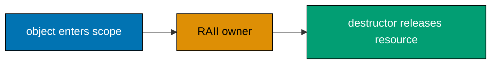

Examples 1–24 establish the C++ toolchain and the highest-value delta over C: names, references, classes, construction, RAII, and the everyday STL containers. Every artifact is standalone, source-matched, and uses the C++17 standard library only.



### Example 1: Compile with g++

_ex-01 · exercises co-01_

**Brief explanation.** This independent C++17 slice introduces compile with g++ before later examples compose it with ownership, generic code, or algorithms. This keeps the example small enough to compile, inspect, and adapt before combining it with later C++ mechanisms.

**Scope note.** It intentionally teaches one productive mechanism, rather than extending the C prerequisite with unrelated language surface.

**Runnable annotated code.** Rendered verbatim from `learning/code/ex-01-gpp-compile/main.cpp`.

```cpp
// => gpp-compile: this line establishes the runnable C++ state or behavior.
#include <iostream>
// => gpp-compile: this line establishes the runnable C++ state or behavior.
int main() {
// => gpp-compile: this line establishes the runnable C++ state or behavior.
  std::cout << "compiled\n";
// => gpp-compile: this line establishes the runnable C++ state or behavior.
}
```

**Run.** `c++ -std=c++17 -Wall -Wextra -Wpedantic main.cpp -o example && ./example` from this example directory.

**Key takeaway.** Keep the contract visible in the type, scope, or tool invocation so another reader can verify it quickly.

**Why it matters.** C++ code becomes safer to change when its source expresses a narrow, compiler-checkable intent. This example gives you a small behavior to compile and vary without depending on a previous file. Keep that feedback loop while reading larger code: identify the object, its owner, and the operation that makes the result observable before adding more abstraction.

### Example 2: Print with iostream

_ex-02 · exercises co-03_

**Brief explanation.** This independent C++17 slice introduces print with iostream before later examples compose it with ownership, generic code, or algorithms. This keeps the example small enough to compile, inspect, and adapt before combining it with later C++ mechanisms.

**Scope note.** It intentionally teaches one productive mechanism, rather than extending the C prerequisite with unrelated language surface.

**Runnable annotated code.** Rendered verbatim from `learning/code/ex-02-iostream-hello/main.cpp`.

```cpp
// => iostream-hello: this line establishes the runnable C++ state or behavior.
#include <iostream>
// => iostream-hello: this line establishes the runnable C++ state or behavior.
int main() {
// => iostream-hello: this line establishes the runnable C++ state or behavior.
  std::cout << "hello, C++\n";
// => iostream-hello: this line establishes the runnable C++ state or behavior.
}
```

**Run.** `c++ -std=c++17 -Wall -Wextra -Wpedantic main.cpp -o example && ./example` from this example directory.

**Key takeaway.** Keep the contract visible in the type, scope, or tool invocation so another reader can verify it quickly.

**Why it matters.** C++ code becomes safer to change when its source expresses a narrow, compiler-checkable intent. This example gives you a small behavior to compile and vary without depending on a previous file. Keep that feedback loop while reading larger code: identify the object, its owner, and the operation that makes the result observable before adding more abstraction.

### Example 3: Read with cin

_ex-03 · exercises co-03_

**Brief explanation.** This independent C++17 slice introduces read with cin before later examples compose it with ownership, generic code, or algorithms. This keeps the example small enough to compile, inspect, and adapt before combining it with later C++ mechanisms.

**Scope note.** It intentionally teaches one productive mechanism, rather than extending the C prerequisite with unrelated language surface.

**Runnable annotated code.** Rendered verbatim from `learning/code/ex-03-cin-input/main.cpp`.

```cpp
// => cin-input: this line establishes the runnable C++ state or behavior.
#include <iostream>
// => cin-input: this line establishes the runnable C++ state or behavior.
int main() {
// => cin-input: this line establishes the runnable C++ state or behavior.
  int value = 0;
// => cin-input: this line establishes the runnable C++ state or behavior.
  std::cin >> value;
// => cin-input: this line establishes the runnable C++ state or behavior.
  std::cout << value * 2 << "\n";
// => cin-input: this line establishes the runnable C++ state or behavior.
}
```

**Run.** `c++ -std=c++17 -Wall -Wextra -Wpedantic main.cpp -o example && ./example` from this example directory.

**Key takeaway.** Keep the contract visible in the type, scope, or tool invocation so another reader can verify it quickly.

**Why it matters.** C++ code becomes safer to change when its source expresses a narrow, compiler-checkable intent. This example gives you a small behavior to compile and vary without depending on a previous file. Keep that feedback loop while reading larger code: identify the object, its owner, and the operation that makes the result observable before adding more abstraction.

### Example 4: Build with CMake

_ex-04 · exercises co-02_

**Brief explanation.** This independent C++17 slice introduces build with cmake before later examples compose it with ownership, generic code, or algorithms. This keeps the example small enough to compile, inspect, and adapt before combining it with later C++ mechanisms.

**Scope note.** It intentionally teaches one productive mechanism, rather than extending the C prerequisite with unrelated language surface.

**Runnable annotated code.** Rendered verbatim from `learning/code/ex-04-cmake-build/main.cpp`.

```cpp
// => cmake-build: this line establishes the runnable C++ state or behavior.
#include <iostream>
// => cmake-build: this line establishes the runnable C++ state or behavior.
int main() {
// => cmake-build: this line establishes the runnable C++ state or behavior.
  std::cout << "cmake built this\n";
// => cmake-build: this line establishes the runnable C++ state or behavior.
}
```

**Run.** `cmake -S . -B build && cmake --build build && ./build/cmake-build` from this example directory.

**Key takeaway.** Keep the contract visible in the type, scope, or tool invocation so another reader can verify it quickly.

**Why it matters.** C++ code becomes safer to change when its source expresses a narrow, compiler-checkable intent. This example gives you a small behavior to compile and vary without depending on a previous file. Keep that feedback loop while reading larger code: identify the object, its owner, and the operation that makes the result observable before adding more abstraction.

### Example 5: Qualify a namespace

_ex-05 · exercises co-04_

**Brief explanation.** This independent C++17 slice introduces qualify a namespace before later examples compose it with ownership, generic code, or algorithms. This keeps the example small enough to compile, inspect, and adapt before combining it with later C++ mechanisms.

**Scope note.** It intentionally teaches one productive mechanism, rather than extending the C prerequisite with unrelated language surface.

**Runnable annotated code.** Rendered verbatim from `learning/code/ex-05-namespace-basic/main.cpp`.

```cpp
// => namespace-basic: this line establishes the runnable C++ state or behavior.
#include <iostream>
// => namespace-basic: this line establishes the runnable C++ state or behavior.
namespace status {
// => namespace-basic: this line establishes the runnable C++ state or behavior.
int code() { return 200; }
// => namespace-basic: this line establishes the runnable C++ state or behavior.
}
// => namespace-basic: this line establishes the runnable C++ state or behavior.
int main() {
// => namespace-basic: this line establishes the runnable C++ state or behavior.
  std::cout << status::code() << "\n";
// => namespace-basic: this line establishes the runnable C++ state or behavior.
}
```

**Run.** `c++ -std=c++17 -Wall -Wextra -Wpedantic main.cpp -o example && ./example` from this example directory.

**Key takeaway.** Keep the contract visible in the type, scope, or tool invocation so another reader can verify it quickly.

**Why it matters.** C++ code becomes safer to change when its source expresses a narrow, compiler-checkable intent. This example gives you a small behavior to compile and vary without depending on a previous file. Keep that feedback loop while reading larger code: identify the object, its owner, and the operation that makes the result observable before adding more abstraction.

### Example 6: Use a selective using declaration

_ex-06 · exercises co-04_

**Brief explanation.** This independent C++17 slice introduces use a selective using declaration before later examples compose it with ownership, generic code, or algorithms. This keeps the example small enough to compile, inspect, and adapt before combining it with later C++ mechanisms.

**Scope note.** It intentionally teaches one productive mechanism, rather than extending the C prerequisite with unrelated language surface.

**Runnable annotated code.** Rendered verbatim from `learning/code/ex-06-using-declaration/main.cpp`.

```cpp
// => using-declaration: this line establishes the runnable C++ state or behavior.
#include <iostream>
// => using-declaration: this line establishes the runnable C++ state or behavior.
namespace status {
// => using-declaration: this line establishes the runnable C++ state or behavior.
int code() { return 200; }
// => using-declaration: this line establishes the runnable C++ state or behavior.
}
// => using-declaration: this line establishes the runnable C++ state or behavior.
using status::code;
// => using-declaration: this line establishes the runnable C++ state or behavior.
int main() {
// => using-declaration: this line establishes the runnable C++ state or behavior.
  std::cout << code() << "\n";
// => using-declaration: this line establishes the runnable C++ state or behavior.
}
```

**Run.** `c++ -std=c++17 -Wall -Wextra -Wpedantic main.cpp -o example && ./example` from this example directory.

**Key takeaway.** Keep the contract visible in the type, scope, or tool invocation so another reader can verify it quickly.

**Why it matters.** C++ code becomes safer to change when its source expresses a narrow, compiler-checkable intent. This example gives you a small behavior to compile and vary without depending on a previous file. Keep that feedback loop while reading larger code: identify the object, its owner, and the operation that makes the result observable before adding more abstraction.

### Example 7: Deduce a local type with auto

_ex-07 · exercises co-07_

**Brief explanation.** This independent C++17 slice introduces deduce a local type with auto before later examples compose it with ownership, generic code, or algorithms. This keeps the example small enough to compile, inspect, and adapt before combining it with later C++ mechanisms.

**Scope note.** It intentionally teaches one productive mechanism, rather than extending the C prerequisite with unrelated language surface.

**Runnable annotated code.** Rendered verbatim from `learning/code/ex-07-auto-deduction/main.cpp`.

```cpp
// => auto-deduction: this line establishes the runnable C++ state or behavior.
#include <iostream>
// => auto-deduction: this line establishes the runnable C++ state or behavior.
#include <type_traits>
// => auto-deduction: this line establishes the runnable C++ state or behavior.
int main() {
// => auto-deduction: this line establishes the runnable C++ state or behavior.
  auto count = 3;
// => auto-deduction: this line establishes the runnable C++ state or behavior.
  static_assert(std::is_same_v<decltype(count), int>);
// => auto-deduction: this line establishes the runnable C++ state or behavior.
  std::cout << count << "\n";
// => auto-deduction: this line establishes the runnable C++ state or behavior.
}
```

**Run.** `c++ -std=c++17 -Wall -Wextra -Wpedantic main.cpp -o example && ./example` from this example directory.

**Key takeaway.** Keep the contract visible in the type, scope, or tool invocation so another reader can verify it quickly.

**Why it matters.** C++ code becomes safer to change when its source expresses a narrow, compiler-checkable intent. This example gives you a small behavior to compile and vary without depending on a previous file. Keep that feedback loop while reading larger code: identify the object, its owner, and the operation that makes the result observable before adding more abstraction.

### Example 8: Alias an object with a reference

_ex-08 · exercises co-05_

**Brief explanation.** This independent C++17 slice introduces alias an object with a reference before later examples compose it with ownership, generic code, or algorithms. This keeps the example small enough to compile, inspect, and adapt before combining it with later C++ mechanisms.

**Scope note.** It intentionally teaches one productive mechanism, rather than extending the C prerequisite with unrelated language surface.

**Runnable annotated code.** Rendered verbatim from `learning/code/ex-08-reference-basic/main.cpp`.

```cpp
// => reference-basic: this line establishes the runnable C++ state or behavior.
#include <iostream>
// => reference-basic: this line establishes the runnable C++ state or behavior.
int main() {
// => reference-basic: this line establishes the runnable C++ state or behavior.
  int original = 7;
// => reference-basic: this line establishes the runnable C++ state or behavior.
  int& alias = original;
// => reference-basic: this line establishes the runnable C++ state or behavior.
  alias = 9;
// => reference-basic: this line establishes the runnable C++ state or behavior.
  std::cout << original << "\n";
// => reference-basic: this line establishes the runnable C++ state or behavior.
}
```

**Run.** `c++ -std=c++17 -Wall -Wextra -Wpedantic main.cpp -o example && ./example` from this example directory.

**Key takeaway.** Keep the contract visible in the type, scope, or tool invocation so another reader can verify it quickly.

**Why it matters.** C++ code becomes safer to change when its source expresses a narrow, compiler-checkable intent. This example gives you a small behavior to compile and vary without depending on a previous file. Keep that feedback loop while reading larger code: identify the object, its owner, and the operation that makes the result observable before adding more abstraction.

### Example 9: Mutate through a reference parameter

_ex-09 · exercises co-05_

**Brief explanation.** This independent C++17 slice introduces mutate through a reference parameter before later examples compose it with ownership, generic code, or algorithms. This keeps the example small enough to compile, inspect, and adapt before combining it with later C++ mechanisms.

**Scope note.** It intentionally teaches one productive mechanism, rather than extending the C prerequisite with unrelated language surface.

**Runnable annotated code.** Rendered verbatim from `learning/code/ex-09-reference-parameter/main.cpp`.

```cpp
// => reference-parameter: this line establishes the runnable C++ state or behavior.
#include <iostream>
// => reference-parameter: this line establishes the runnable C++ state or behavior.
void increment(int& value) {
// => reference-parameter: this line establishes the runnable C++ state or behavior.
  ++value;
// => reference-parameter: this line establishes the runnable C++ state or behavior.
}
// => reference-parameter: this line establishes the runnable C++ state or behavior.
int main() {
// => reference-parameter: this line establishes the runnable C++ state or behavior.
  int count = 1;
// => reference-parameter: this line establishes the runnable C++ state or behavior.
  increment(count);
// => reference-parameter: this line establishes the runnable C++ state or behavior.
  std::cout << count << "\n";
// => reference-parameter: this line establishes the runnable C++ state or behavior.
}
```

**Run.** `c++ -std=c++17 -Wall -Wextra -Wpedantic main.cpp -o example && ./example` from this example directory.

**Key takeaway.** Keep the contract visible in the type, scope, or tool invocation so another reader can verify it quickly.

**Why it matters.** C++ code becomes safer to change when its source expresses a narrow, compiler-checkable intent. This example gives you a small behavior to compile and vary without depending on a previous file. Keep that feedback loop while reading larger code: identify the object, its owner, and the operation that makes the result observable before adding more abstraction.

### Example 10: Pass read-only data by const reference

_ex-10 · exercises co-05, co-06_

**Brief explanation.** This independent C++17 slice introduces pass read-only data by const reference before later examples compose it with ownership, generic code, or algorithms. This keeps the example small enough to compile, inspect, and adapt before combining it with later C++ mechanisms.

**Scope note.** It intentionally teaches one productive mechanism, rather than extending the C prerequisite with unrelated language surface.

**Runnable annotated code.** Rendered verbatim from `learning/code/ex-10-const-reference-param/main.cpp`.

```cpp
// => const-reference-param: this line establishes the runnable C++ state or behavior.
#include <iostream>
// => const-reference-param: this line establishes the runnable C++ state or behavior.
#include <string>
// => const-reference-param: this line establishes the runnable C++ state or behavior.
std::size_t length_of(const std::string& text) {
// => const-reference-param: this line establishes the runnable C++ state or behavior.
  return text.size();
// => const-reference-param: this line establishes the runnable C++ state or behavior.
}
// => const-reference-param: this line establishes the runnable C++ state or behavior.
int main() {
// => const-reference-param: this line establishes the runnable C++ state or behavior.
  const std::string name = "Ada";
// => const-reference-param: this line establishes the runnable C++ state or behavior.
  std::cout << length_of(name) << "\n";
// => const-reference-param: this line establishes the runnable C++ state or behavior.
}
```

**Run.** `c++ -std=c++17 -Wall -Wextra -Wpedantic main.cpp -o example && ./example` from this example directory.

**Key takeaway.** Keep the contract visible in the type, scope, or tool invocation so another reader can verify it quickly.

**Why it matters.** C++ code becomes safer to change when its source expresses a narrow, compiler-checkable intent. This example gives you a small behavior to compile and vary without depending on a previous file. Keep that feedback loop while reading larger code: identify the object, its owner, and the operation that makes the result observable before adding more abstraction.

### Example 11: Expose a const member method

_ex-11 · exercises co-06, co-08_

**Brief explanation.** This independent C++17 slice introduces expose a const member method before later examples compose it with ownership, generic code, or algorithms. This keeps the example small enough to compile, inspect, and adapt before combining it with later C++ mechanisms.

**Scope note.** It intentionally teaches one productive mechanism, rather than extending the C prerequisite with unrelated language surface.

**Runnable annotated code.** Rendered verbatim from `learning/code/ex-11-const-method/main.cpp`.

```cpp
// => const-method: this line establishes the runnable C++ state or behavior.
#include <iostream>
// => const-method: this line establishes the runnable C++ state or behavior.
class Counter {
// => const-method: this line establishes the runnable C++ state or behavior.
 public:
// => const-method: this line establishes the runnable C++ state or behavior.
  int value() const { return value_; }
// => const-method: this line establishes the runnable C++ state or behavior.
 private:
// => const-method: this line establishes the runnable C++ state or behavior.
  int value_ = 4;
// => const-method: this line establishes the runnable C++ state or behavior.
};
// => const-method: this line establishes the runnable C++ state or behavior.
int main() {
// => const-method: this line establishes the runnable C++ state or behavior.
  const Counter counter;
// => const-method: this line establishes the runnable C++ state or behavior.
  std::cout << counter.value() << "\n";
// => const-method: this line establishes the runnable C++ state or behavior.
}
```

**Run.** `c++ -std=c++17 -Wall -Wextra -Wpedantic main.cpp -o example && ./example` from this example directory.

**Key takeaway.** Keep the contract visible in the type, scope, or tool invocation so another reader can verify it quickly.

**Why it matters.** C++ code becomes safer to change when its source expresses a narrow, compiler-checkable intent. This example gives you a small behavior to compile and vary without depending on a previous file. Keep that feedback loop while reading larger code: identify the object, its owner, and the operation that makes the result observable before adding more abstraction.

### Example 12: Define a class

_ex-12 · exercises co-08_

**Brief explanation.** This independent C++17 slice introduces define a class before later examples compose it with ownership, generic code, or algorithms. This keeps the example small enough to compile, inspect, and adapt before combining it with later C++ mechanisms.

**Scope note.** It intentionally teaches one productive mechanism, rather than extending the C prerequisite with unrelated language surface.

**Runnable annotated code.** Rendered verbatim from `learning/code/ex-12-class-basic/main.cpp`.

```cpp
// => class-basic: this line establishes the runnable C++ state or behavior.
#include <iostream>
// => class-basic: this line establishes the runnable C++ state or behavior.
class Greeting {
// => class-basic: this line establishes the runnable C++ state or behavior.
 public:
// => class-basic: this line establishes the runnable C++ state or behavior.
  void print() const { std::cout << "hello\n"; }
// => class-basic: this line establishes the runnable C++ state or behavior.
};
// => class-basic: this line establishes the runnable C++ state or behavior.
int main() {
// => class-basic: this line establishes the runnable C++ state or behavior.
  Greeting greeting;
// => class-basic: this line establishes the runnable C++ state or behavior.
  greeting.print();
// => class-basic: this line establishes the runnable C++ state or behavior.
}
```

**Run.** `c++ -std=c++17 -Wall -Wextra -Wpedantic main.cpp -o example && ./example` from this example directory.

**Key takeaway.** Keep the contract visible in the type, scope, or tool invocation so another reader can verify it quickly.

**Why it matters.** C++ code becomes safer to change when its source expresses a narrow, compiler-checkable intent. This example gives you a small behavior to compile and vary without depending on a previous file. Keep that feedback loop while reading larger code: identify the object, its owner, and the operation that makes the result observable before adding more abstraction.

### Example 13: Hide a field behind an accessor

_ex-13 · exercises co-08_

**Brief explanation.** This independent C++17 slice introduces hide a field behind an accessor before later examples compose it with ownership, generic code, or algorithms. This keeps the example small enough to compile, inspect, and adapt before combining it with later C++ mechanisms.

**Scope note.** It intentionally teaches one productive mechanism, rather than extending the C prerequisite with unrelated language surface.

**Runnable annotated code.** Rendered verbatim from `learning/code/ex-13-private-encapsulation/main.cpp`.

```cpp
// => private-encapsulation: this line establishes the runnable C++ state or behavior.
#include <iostream>
// => private-encapsulation: this line establishes the runnable C++ state or behavior.
class Account {
// => private-encapsulation: this line establishes the runnable C++ state or behavior.
 public:
// => private-encapsulation: this line establishes the runnable C++ state or behavior.
  int balance() const { return balance_; }
// => private-encapsulation: this line establishes the runnable C++ state or behavior.
 private:
// => private-encapsulation: this line establishes the runnable C++ state or behavior.
  int balance_ = 50;
// => private-encapsulation: this line establishes the runnable C++ state or behavior.
};
// => private-encapsulation: this line establishes the runnable C++ state or behavior.
int main() {
// => private-encapsulation: this line establishes the runnable C++ state or behavior.
  Account account;
// => private-encapsulation: this line establishes the runnable C++ state or behavior.
  std::cout << account.balance() << "\n";
// => private-encapsulation: this line establishes the runnable C++ state or behavior.
}
```

**Run.** `c++ -std=c++17 -Wall -Wextra -Wpedantic main.cpp -o example && ./example` from this example directory.

**Key takeaway.** Keep the contract visible in the type, scope, or tool invocation so another reader can verify it quickly.

**Why it matters.** C++ code becomes safer to change when its source expresses a narrow, compiler-checkable intent. This example gives you a small behavior to compile and vary without depending on a previous file. Keep that feedback loop while reading larger code: identify the object, its owner, and the operation that makes the result observable before adding more abstraction.

### Example 14: Initialize members in a constructor

_ex-14 · exercises co-09_

**Brief explanation.** This independent C++17 slice introduces initialize members in a constructor before later examples compose it with ownership, generic code, or algorithms. This keeps the example small enough to compile, inspect, and adapt before combining it with later C++ mechanisms.

**Scope note.** It intentionally teaches one productive mechanism, rather than extending the C prerequisite with unrelated language surface.

**Runnable annotated code.** Rendered verbatim from `learning/code/ex-14-constructor/main.cpp`.

```cpp
// => constructor: this line establishes the runnable C++ state or behavior.
#include <iostream>
// => constructor: this line establishes the runnable C++ state or behavior.
#include <string>
// => constructor: this line establishes the runnable C++ state or behavior.
#include <utility>
// => constructor: this line establishes the runnable C++ state or behavior.
class User {
// => constructor: this line establishes the runnable C++ state or behavior.
 public:
// => constructor: this line establishes the runnable C++ state or behavior.
  explicit User(std::string name) : name_(std::move(name)) {}
// => constructor: this line establishes the runnable C++ state or behavior.
  const std::string& name() const { return name_; }
// => constructor: this line establishes the runnable C++ state or behavior.
 private:
// => constructor: this line establishes the runnable C++ state or behavior.
  std::string name_;
// => constructor: this line establishes the runnable C++ state or behavior.
};
// => constructor: this line establishes the runnable C++ state or behavior.
int main() {
// => constructor: this line establishes the runnable C++ state or behavior.
  User user("Ada");
// => constructor: this line establishes the runnable C++ state or behavior.
  std::cout << user.name() << "\n";
// => constructor: this line establishes the runnable C++ state or behavior.
}
```

**Run.** `c++ -std=c++17 -Wall -Wextra -Wpedantic main.cpp -o example && ./example` from this example directory.

**Key takeaway.** Keep the contract visible in the type, scope, or tool invocation so another reader can verify it quickly.

**Why it matters.** C++ code becomes safer to change when its source expresses a narrow, compiler-checkable intent. This example gives you a small behavior to compile and vary without depending on a previous file. Keep that feedback loop while reading larger code: identify the object, its owner, and the operation that makes the result observable before adding more abstraction.

### Example 15: Observe deterministic destruction

_ex-15 · exercises co-10_

**Brief explanation.** This independent C++17 slice introduces observe deterministic destruction before later examples compose it with ownership, generic code, or algorithms. This keeps the example small enough to compile, inspect, and adapt before combining it with later C++ mechanisms.

**Scope note.** It intentionally teaches one productive mechanism, rather than extending the C prerequisite with unrelated language surface.

**Runnable annotated code.** Rendered verbatim from `learning/code/ex-15-destructor-trace/main.cpp`.

```cpp
// => destructor-trace: this line establishes the runnable C++ state or behavior.
#include <iostream>
// => destructor-trace: this line establishes the runnable C++ state or behavior.
class Trace {
// => destructor-trace: this line establishes the runnable C++ state or behavior.
 public:
// => destructor-trace: this line establishes the runnable C++ state or behavior.
  ~Trace() { std::cout << "destroyed\n"; }
// => destructor-trace: this line establishes the runnable C++ state or behavior.
};
// => destructor-trace: this line establishes the runnable C++ state or behavior.
int main() {
// => destructor-trace: this line establishes the runnable C++ state or behavior.
  { Trace trace; std::cout << "inside\n"; }
// => destructor-trace: this line establishes the runnable C++ state or behavior.
  std::cout << "after\n";
// => destructor-trace: this line establishes the runnable C++ state or behavior.
}
```

**Run.** `c++ -std=c++17 -Wall -Wextra -Wpedantic main.cpp -o example && ./example` from this example directory.

**Key takeaway.** Keep the contract visible in the type, scope, or tool invocation so another reader can verify it quickly.

**Why it matters.** C++ code becomes safer to change when its source expresses a narrow, compiler-checkable intent. This example gives you a small behavior to compile and vary without depending on a previous file. Keep that feedback loop while reading larger code: identify the object, its owner, and the operation that makes the result observable before adding more abstraction.

### Example 16: Close a file with RAII

_ex-16 · exercises co-10_

**Brief explanation.** This independent C++17 slice introduces close a file with raii before later examples compose it with ownership, generic code, or algorithms. This keeps the example small enough to compile, inspect, and adapt before combining it with later C++ mechanisms.

**Scope note.** It intentionally teaches one productive mechanism, rather than extending the C prerequisite with unrelated language surface.

**Runnable annotated code.** Rendered verbatim from `learning/code/ex-16-raii-file-wrapper/main.cpp`.

```cpp
// => raii-file-wrapper: this line establishes the runnable C++ state or behavior.
#include <cstdio>
// => raii-file-wrapper: this line establishes the runnable C++ state or behavior.
#include <iostream>
// => raii-file-wrapper: this line establishes the runnable C++ state or behavior.
class File {
// => raii-file-wrapper: this line establishes the runnable C++ state or behavior.
 public:
// => raii-file-wrapper: this line establishes the runnable C++ state or behavior.
  File() : handle_(std::tmpfile()) {}
// => raii-file-wrapper: this line establishes the runnable C++ state or behavior.
  ~File() { if (handle_ != nullptr) std::fclose(handle_); }
// => raii-file-wrapper: this line establishes the runnable C++ state or behavior.
  bool open() const { return handle_ != nullptr; }
// => raii-file-wrapper: this line establishes the runnable C++ state or behavior.
 private:
// => raii-file-wrapper: this line establishes the runnable C++ state or behavior.
  std::FILE* handle_;
// => raii-file-wrapper: this line establishes the runnable C++ state or behavior.
};
// => raii-file-wrapper: this line establishes the runnable C++ state or behavior.
int main() {
// => raii-file-wrapper: this line establishes the runnable C++ state or behavior.
  File file;
// => raii-file-wrapper: this line establishes the runnable C++ state or behavior.
  std::cout << file.open() << "\n";
// => raii-file-wrapper: this line establishes the runnable C++ state or behavior.
}
```

**Run.** `c++ -std=c++17 -Wall -Wextra -Wpedantic main.cpp -o example && ./example` from this example directory.

**Key takeaway.** Keep the contract visible in the type, scope, or tool invocation so another reader can verify it quickly.

**Why it matters.** C++ code becomes safer to change when its source expresses a narrow, compiler-checkable intent. This example gives you a small behavior to compile and vary without depending on a previous file. Keep that feedback loop while reading larger code: identify the object, its owner, and the operation that makes the result observable before adding more abstraction.

### Example 17: Use std::string

_ex-17 · exercises co-19_

**Brief explanation.** This independent C++17 slice introduces use std::string before later examples compose it with ownership, generic code, or algorithms. This keeps the example small enough to compile, inspect, and adapt before combining it with later C++ mechanisms.

**Scope note.** It intentionally teaches one productive mechanism, rather than extending the C prerequisite with unrelated language surface.

**Runnable annotated code.** Rendered verbatim from `learning/code/ex-17-std-string/main.cpp`.

```cpp
// => std-string: this line establishes the runnable C++ state or behavior.
#include <iostream>
// => std-string: this line establishes the runnable C++ state or behavior.
#include <string>
// => std-string: this line establishes the runnable C++ state or behavior.
int main() {
// => std-string: this line establishes the runnable C++ state or behavior.
  std::string name = "Ada";
// => std-string: this line establishes the runnable C++ state or behavior.
  name += " Lovelace";
// => std-string: this line establishes the runnable C++ state or behavior.
  std::cout << name.size() << "\n";
// => std-string: this line establishes the runnable C++ state or behavior.
}
```

**Run.** `c++ -std=c++17 -Wall -Wextra -Wpedantic main.cpp -o example && ./example` from this example directory.

**Key takeaway.** Keep the contract visible in the type, scope, or tool invocation so another reader can verify it quickly.

**Why it matters.** C++ code becomes safer to change when its source expresses a narrow, compiler-checkable intent. This example gives you a small behavior to compile and vary without depending on a previous file. Keep that feedback loop while reading larger code: identify the object, its owner, and the operation that makes the result observable before adding more abstraction.

### Example 18: Use a vector

_ex-18 · exercises co-19_

**Brief explanation.** This independent C++17 slice introduces use a vector before later examples compose it with ownership, generic code, or algorithms. This keeps the example small enough to compile, inspect, and adapt before combining it with later C++ mechanisms.

**Scope note.** It intentionally teaches one productive mechanism, rather than extending the C prerequisite with unrelated language surface.

**Runnable annotated code.** Rendered verbatim from `learning/code/ex-18-std-vector-basic/main.cpp`.

```cpp
// => std-vector-basic: this line establishes the runnable C++ state or behavior.
#include <iostream>
// => std-vector-basic: this line establishes the runnable C++ state or behavior.
#include <vector>
// => std-vector-basic: this line establishes the runnable C++ state or behavior.
int main() {
// => std-vector-basic: this line establishes the runnable C++ state or behavior.
  std::vector<int> values{1, 2};
// => std-vector-basic: this line establishes the runnable C++ state or behavior.
  values.push_back(3);
// => std-vector-basic: this line establishes the runnable C++ state or behavior.
  std::cout << values.at(2) << "\n";
// => std-vector-basic: this line establishes the runnable C++ state or behavior.
}
```

**Run.** `c++ -std=c++17 -Wall -Wextra -Wpedantic main.cpp -o example && ./example` from this example directory.

**Key takeaway.** Keep the contract visible in the type, scope, or tool invocation so another reader can verify it quickly.

**Why it matters.** C++ code becomes safer to change when its source expresses a narrow, compiler-checkable intent. This example gives you a small behavior to compile and vary without depending on a previous file. Keep that feedback loop while reading larger code: identify the object, its owner, and the operation that makes the result observable before adding more abstraction.

### Example 19: Iterate with range-based for

_ex-19 · exercises co-22_

**Brief explanation.** This independent C++17 slice introduces iterate with range-based for before later examples compose it with ownership, generic code, or algorithms. This keeps the example small enough to compile, inspect, and adapt before combining it with later C++ mechanisms.

**Scope note.** It intentionally teaches one productive mechanism, rather than extending the C prerequisite with unrelated language surface.

**Runnable annotated code.** Rendered verbatim from `learning/code/ex-19-range-based-for/main.cpp`.

```cpp
// => range-based-for: this line establishes the runnable C++ state or behavior.
#include <iostream>
// => range-based-for: this line establishes the runnable C++ state or behavior.
#include <vector>
// => range-based-for: this line establishes the runnable C++ state or behavior.
int main() {
// => range-based-for: this line establishes the runnable C++ state or behavior.
  std::vector<int> values{1, 2, 3};
// => range-based-for: this line establishes the runnable C++ state or behavior.
  for (const auto& value : values) {
// => range-based-for: this line establishes the runnable C++ state or behavior.
    std::cout << value;
// => range-based-for: this line establishes the runnable C++ state or behavior.
  }
// => range-based-for: this line establishes the runnable C++ state or behavior.
  std::cout << "\n";
// => range-based-for: this line establishes the runnable C++ state or behavior.
}
```

**Run.** `c++ -std=c++17 -Wall -Wextra -Wpedantic main.cpp -o example && ./example` from this example directory.

**Key takeaway.** Keep the contract visible in the type, scope, or tool invocation so another reader can verify it quickly.

**Why it matters.** C++ code becomes safer to change when its source expresses a narrow, compiler-checkable intent. This example gives you a small behavior to compile and vary without depending on a previous file. Keep that feedback loop while reading larger code: identify the object, its owner, and the operation that makes the result observable before adding more abstraction.

### Example 20: Store strings in a vector

_ex-20 · exercises co-19, co-22_

**Brief explanation.** This independent C++17 slice introduces store strings in a vector before later examples compose it with ownership, generic code, or algorithms. This keeps the example small enough to compile, inspect, and adapt before combining it with later C++ mechanisms.

**Scope note.** It intentionally teaches one productive mechanism, rather than extending the C prerequisite with unrelated language surface.

**Runnable annotated code.** Rendered verbatim from `learning/code/ex-20-vector-of-strings/main.cpp`.

```cpp
// => vector-of-strings: this line establishes the runnable C++ state or behavior.
#include <iostream>
// => vector-of-strings: this line establishes the runnable C++ state or behavior.
#include <string>
// => vector-of-strings: this line establishes the runnable C++ state or behavior.
#include <vector>
// => vector-of-strings: this line establishes the runnable C++ state or behavior.
int main() {
// => vector-of-strings: this line establishes the runnable C++ state or behavior.
  std::vector<std::string> names{"Ada", "Lin"};
// => vector-of-strings: this line establishes the runnable C++ state or behavior.
  for (const auto& name : names) {
// => vector-of-strings: this line establishes the runnable C++ state or behavior.
    std::cout << name << " ";
// => vector-of-strings: this line establishes the runnable C++ state or behavior.
  }
// => vector-of-strings: this line establishes the runnable C++ state or behavior.
  std::cout << "\n";
// => vector-of-strings: this line establishes the runnable C++ state or behavior.
}
```

**Run.** `c++ -std=c++17 -Wall -Wextra -Wpedantic main.cpp -o example && ./example` from this example directory.

**Key takeaway.** Keep the contract visible in the type, scope, or tool invocation so another reader can verify it quickly.

**Why it matters.** C++ code becomes safer to change when its source expresses a narrow, compiler-checkable intent. This example gives you a small behavior to compile and vary without depending on a previous file. Keep that feedback loop while reading larger code: identify the object, its owner, and the operation that makes the result observable before adding more abstraction.

### Example 21: Use an ordered map

_ex-21 · exercises co-19_

**Brief explanation.** This independent C++17 slice introduces use an ordered map before later examples compose it with ownership, generic code, or algorithms. This keeps the example small enough to compile, inspect, and adapt before combining it with later C++ mechanisms.

**Scope note.** It intentionally teaches one productive mechanism, rather than extending the C prerequisite with unrelated language surface.

**Runnable annotated code.** Rendered verbatim from `learning/code/ex-21-std-map/main.cpp`.

```cpp
// => std-map: this line establishes the runnable C++ state or behavior.
#include <iostream>
// => std-map: this line establishes the runnable C++ state or behavior.
#include <map>
// => std-map: this line establishes the runnable C++ state or behavior.
#include <string>
// => std-map: this line establishes the runnable C++ state or behavior.
int main() {
// => std-map: this line establishes the runnable C++ state or behavior.
  std::map<std::string, int> scores{{"Ada", 10}, {"Lin", 9}};
// => std-map: this line establishes the runnable C++ state or behavior.
  std::cout << scores.begin()->first << ":" << scores.at("Ada") << "\n";
// => std-map: this line establishes the runnable C++ state or behavior.
}
```

**Run.** `c++ -std=c++17 -Wall -Wextra -Wpedantic main.cpp -o example && ./example` from this example directory.

**Key takeaway.** Keep the contract visible in the type, scope, or tool invocation so another reader can verify it quickly.

**Why it matters.** C++ code becomes safer to change when its source expresses a narrow, compiler-checkable intent. This example gives you a small behavior to compile and vary without depending on a previous file. Keep that feedback loop while reading larger code: identify the object, its owner, and the operation that makes the result observable before adding more abstraction.

### Example 22: Use a hash map

_ex-22 · exercises co-19_

**Brief explanation.** This independent C++17 slice introduces use a hash map before later examples compose it with ownership, generic code, or algorithms. This keeps the example small enough to compile, inspect, and adapt before combining it with later C++ mechanisms.

**Scope note.** It intentionally teaches one productive mechanism, rather than extending the C prerequisite with unrelated language surface.

**Runnable annotated code.** Rendered verbatim from `learning/code/ex-22-unordered-map/main.cpp`.

```cpp
// => unordered-map: this line establishes the runnable C++ state or behavior.
#include <iostream>
// => unordered-map: this line establishes the runnable C++ state or behavior.
#include <string>
// => unordered-map: this line establishes the runnable C++ state or behavior.
#include <unordered_map>
// => unordered-map: this line establishes the runnable C++ state or behavior.
int main() {
// => unordered-map: this line establishes the runnable C++ state or behavior.
  std::unordered_map<std::string, int> counts{{"ok", 2}};
// => unordered-map: this line establishes the runnable C++ state or behavior.
  std::cout << counts.count("ok") << "\n";
// => unordered-map: this line establishes the runnable C++ state or behavior.
}
```

**Run.** `c++ -std=c++17 -Wall -Wextra -Wpedantic main.cpp -o example && ./example` from this example directory.

**Key takeaway.** Keep the contract visible in the type, scope, or tool invocation so another reader can verify it quickly.

**Why it matters.** C++ code becomes safer to change when its source expresses a narrow, compiler-checkable intent. This example gives you a small behavior to compile and vary without depending on a previous file. Keep that feedback loop while reading larger code: identify the object, its owner, and the operation that makes the result observable before adding more abstraction.

### Example 23: Compile warning-clean

_ex-23 · exercises co-27_

**Brief explanation.** This independent C++17 slice introduces compile warning-clean before later examples compose it with ownership, generic code, or algorithms. This keeps the example small enough to compile, inspect, and adapt before combining it with later C++ mechanisms.

**Scope note.** It intentionally teaches one productive mechanism, rather than extending the C prerequisite with unrelated language surface.

**Runnable annotated code.** Rendered verbatim from `learning/code/ex-23-warnings-clean/main.cpp`.

```cpp
// => warnings-clean: this line establishes the runnable C++ state or behavior.
#include <iostream>
// => warnings-clean: this line establishes the runnable C++ state or behavior.
int main() {
// => warnings-clean: this line establishes the runnable C++ state or behavior.
  const int answer = 42;
// => warnings-clean: this line establishes the runnable C++ state or behavior.
  std::cout << answer << "\n";
// => warnings-clean: this line establishes the runnable C++ state or behavior.
}
```

**Run.** `c++ -std=c++17 -Wall -Wextra -Wpedantic main.cpp -o example && ./example` from this example directory.

**Key takeaway.** Keep the contract visible in the type, scope, or tool invocation so another reader can verify it quickly.

**Why it matters.** C++ code becomes safer to change when its source expresses a narrow, compiler-checkable intent. This example gives you a small behavior to compile and vary without depending on a previous file. Keep that feedback loop while reading larger code: identify the object, its owner, and the operation that makes the result observable before adding more abstraction.

### Example 24: Split a header and source

_ex-24 · exercises co-25_

**Brief explanation.** This independent C++17 slice introduces split a header and source before later examples compose it with ownership, generic code, or algorithms. This keeps the example small enough to compile, inspect, and adapt before combining it with later C++ mechanisms.

**Scope note.** It intentionally teaches one productive mechanism, rather than extending the C prerequisite with unrelated language surface.

**Runnable annotated code.** Rendered verbatim from `learning/code/ex-24-header-source-split/main.cpp`.

```cpp
// => header-source-split: this line establishes the runnable C++ state or behavior.
#include "greeting.hpp"
// => header-source-split: this line establishes the runnable C++ state or behavior.
#include <iostream>
// => header-source-split: this line establishes the runnable C++ state or behavior.
int main() {
// => header-source-split: this line establishes the runnable C++ state or behavior.
  std::cout << greeting() << "\n";
// => header-source-split: this line establishes the runnable C++ state or behavior.
}
```

**Run.** `c++ -std=c++17 -Wall -Wextra -Wpedantic main.cpp greeting.cpp -o example && ./example` from this example directory.

**Key takeaway.** Keep the contract visible in the type, scope, or tool invocation so another reader can verify it quickly.

**Why it matters.** C++ code becomes safer to change when its source expresses a narrow, compiler-checkable intent. This example gives you a small behavior to compile and vary without depending on a previous file. Keep that feedback loop while reading larger code: identify the object, its owner, and the operation that makes the result observable before adding more abstraction.
