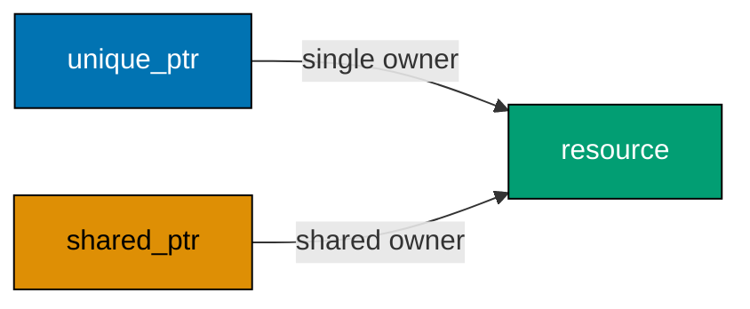

Examples 25–50 move from generic code and algorithms into modern C++ ownership, copy/move policy, polymorphism, and error representation. The productive default is explicit ownership and standard-library composition.



### Example 25: Write a function template

_ex-25 · exercises co-17_

**Brief explanation.** This standalone C++17 slice defines one function that the compiler instantiates for more than one compatible type. This keeps the example small enough to compile, inspect, and adapt before combining it with later C++ mechanisms.

**Scope note.** Use a template when the same operation is truly type-generic; do not introduce template machinery merely to avoid writing a clear overload.

**Runnable annotated code.** Rendered verbatim from `learning/code/ex-25-function-template/main.cpp`.

```cpp
// => function-template: this line establishes the runnable C++ state or behavior.
#include <iostream>
// => function-template: this line establishes the runnable C++ state or behavior.
template <typename T>
// => function-template: this line establishes the runnable C++ state or behavior.
T larger(T left, T right) {
// => function-template: this line establishes the runnable C++ state or behavior.
  return left > right ? left : right;
// => function-template: this line establishes the runnable C++ state or behavior.
}
// => function-template: this line establishes the runnable C++ state or behavior.
int main() {
// => function-template: this line establishes the runnable C++ state or behavior.
  std::cout << larger(2, 5) << " " << larger(1.5, 1.2) << "\n";
// => function-template: this line establishes the runnable C++ state or behavior.
}
```

**Run.** `c++ -std=c++17 -Wall -Wextra -Wpedantic -fsanitize=address,undefined -fno-omit-frame-pointer main.cpp -o example && ./example` from this example directory.

**Key takeaway.** A function template gives one checked definition to each required type instantiation.

**Why it matters.** Templates let modern C++ retain type safety and avoid duplicated algorithms, but they should preserve readability. Start with a small generic contract like this one, compile it for the actual types you need, and keep its definition visible to callers. In a larger codebase, a template is easiest to maintain when its constraints and value semantics remain simple.

### Example 26: Use two template parameters

_ex-26 · exercises co-17_

**Brief explanation.** This standalone C++17 example demonstrates use two template parameters with a deliberately small observable result. This keeps the example small enough to compile, inspect, and adapt before combining it with later C++ mechanisms.

**Scope note.** Learn this core facility before reaching for framework abstractions or more elaborate generic techniques.

**Runnable annotated code.** Rendered verbatim from `learning/code/ex-26-template-multiple-types/main.cpp`.

```cpp
// => template-multiple-types: this line establishes the runnable C++ state or behavior.
#include <iostream>
// => template-multiple-types: this line establishes the runnable C++ state or behavior.
template <typename Left, typename Right>
// => template-multiple-types: this line establishes the runnable C++ state or behavior.
auto add(Left left, Right right) {
// => template-multiple-types: this line establishes the runnable C++ state or behavior.
  return left + right;
// => template-multiple-types: this line establishes the runnable C++ state or behavior.
}
// => template-multiple-types: this line establishes the runnable C++ state or behavior.
int main() {
// => template-multiple-types: this line establishes the runnable C++ state or behavior.
  std::cout << add(2, 0.5) << "\n";
// => template-multiple-types: this line establishes the runnable C++ state or behavior.
}
```

**Run.** `c++ -std=c++17 -Wall -Wextra -Wpedantic -fsanitize=address,undefined -fno-omit-frame-pointer main.cpp -o example && ./example` from this example directory.

**Key takeaway.** Make ownership, lifetime, and failure contracts obvious in the type so code review does not have to infer them.

**Why it matters.** The C++ delta over C pays off when a resource or behavior has one clear, compiler-visible home. This runnable slice is intentionally too small to hide policy in infrastructure. Vary its input, then identify which object owns the result and which operation transfers, borrows, or observes it. That habit scales directly to a larger modern C++ codebase.

### Example 27: Write a class template

_ex-27 · exercises co-18_

**Brief explanation.** This standalone C++17 example demonstrates write a class template with a deliberately small observable result. This keeps the example small enough to compile, inspect, and adapt before combining it with later C++ mechanisms.

**Scope note.** Learn this core facility before reaching for framework abstractions or more elaborate generic techniques.

**Runnable annotated code.** Rendered verbatim from `learning/code/ex-27-class-template/main.cpp`.

```cpp
// => class-template: this line establishes the runnable C++ state or behavior.
#include <iostream>
// => class-template: this line establishes the runnable C++ state or behavior.
template <typename T>
// => class-template: this line establishes the runnable C++ state or behavior.
class Box {
// => class-template: this line establishes the runnable C++ state or behavior.
 public:
// => class-template: this line establishes the runnable C++ state or behavior.
  explicit Box(T value) : value_(value) {}
// => class-template: this line establishes the runnable C++ state or behavior.
  T value() const { return value_; }
// => class-template: this line establishes the runnable C++ state or behavior.
 private:
// => class-template: this line establishes the runnable C++ state or behavior.
  T value_;
// => class-template: this line establishes the runnable C++ state or behavior.
};
// => class-template: this line establishes the runnable C++ state or behavior.
int main() {
// => class-template: this line establishes the runnable C++ state or behavior.
  std::cout << Box<int>(7).value() << " " << Box<char>('x').value() << "\n";
// => class-template: this line establishes the runnable C++ state or behavior.
}
```

**Run.** `c++ -std=c++17 -Wall -Wextra -Wpedantic -fsanitize=address,undefined -fno-omit-frame-pointer main.cpp -o example && ./example` from this example directory.

**Key takeaway.** Make ownership, lifetime, and failure contracts obvious in the type so code review does not have to infer them.

**Why it matters.** The C++ delta over C pays off when a resource or behavior has one clear, compiler-visible home. This runnable slice is intentionally too small to hide policy in infrastructure. Vary its input, then identify which object owns the result and which operation transfers, borrows, or observes it. That habit scales directly to a larger modern C++ codebase.

### Example 28: Sort with an STL algorithm

_ex-28 · exercises co-21_

**Brief explanation.** This standalone C++17 example demonstrates sort with an stl algorithm with a deliberately small observable result. This keeps the example small enough to compile, inspect, and adapt before combining it with later C++ mechanisms.

**Scope note.** Learn this core facility before reaching for framework abstractions or more elaborate generic techniques.

**Runnable annotated code.** Rendered verbatim from `learning/code/ex-28-stl-sort/main.cpp`.

```cpp
// => stl-sort: this line establishes the runnable C++ state or behavior.
#include <algorithm>
// => stl-sort: this line establishes the runnable C++ state or behavior.
#include <iostream>
// => stl-sort: this line establishes the runnable C++ state or behavior.
#include <vector>
// => stl-sort: this line establishes the runnable C++ state or behavior.
int main() {
// => stl-sort: this line establishes the runnable C++ state or behavior.
  std::vector<int> values{3, 1, 2};
// => stl-sort: this line establishes the runnable C++ state or behavior.
  std::sort(values.begin(), values.end());
// => stl-sort: this line establishes the runnable C++ state or behavior.
  std::cout << values[0] << values[1] << values[2] << "\n";
// => stl-sort: this line establishes the runnable C++ state or behavior.
}
```

**Run.** `c++ -std=c++17 -Wall -Wextra -Wpedantic -fsanitize=address,undefined -fno-omit-frame-pointer main.cpp -o example && ./example` from this example directory.

**Key takeaway.** Make ownership, lifetime, and failure contracts obvious in the type so code review does not have to infer them.

**Why it matters.** The C++ delta over C pays off when a resource or behavior has one clear, compiler-visible home. This runnable slice is intentionally too small to hide policy in infrastructure. Vary its input, then identify which object owns the result and which operation transfers, borrows, or observes it. That habit scales directly to a larger modern C++ codebase.

### Example 29: Find in an iterator range

_ex-29 · exercises co-20, co-21_

**Brief explanation.** This standalone C++17 example demonstrates find in an iterator range with a deliberately small observable result. This keeps the example small enough to compile, inspect, and adapt before combining it with later C++ mechanisms.

**Scope note.** Learn this core facility before reaching for framework abstractions or more elaborate generic techniques.

**Runnable annotated code.** Rendered verbatim from `learning/code/ex-29-stl-find/main.cpp`.

```cpp
// => stl-find: this line establishes the runnable C++ state or behavior.
#include <algorithm>
// => stl-find: this line establishes the runnable C++ state or behavior.
#include <iostream>
// => stl-find: this line establishes the runnable C++ state or behavior.
#include <vector>
// => stl-find: this line establishes the runnable C++ state or behavior.
int main() {
// => stl-find: this line establishes the runnable C++ state or behavior.
  std::vector<int> values{3, 1, 2};
// => stl-find: this line establishes the runnable C++ state or behavior.
  const auto hit = std::find(values.begin(), values.end(), 1);
// => stl-find: this line establishes the runnable C++ state or behavior.
  std::cout << (hit != values.end()) << "\n";
// => stl-find: this line establishes the runnable C++ state or behavior.
}
```

**Run.** `c++ -std=c++17 -Wall -Wextra -Wpedantic -fsanitize=address,undefined -fno-omit-frame-pointer main.cpp -o example && ./example` from this example directory.

**Key takeaway.** Make ownership, lifetime, and failure contracts obvious in the type so code review does not have to infer them.

**Why it matters.** The C++ delta over C pays off when a resource or behavior has one clear, compiler-visible home. This runnable slice is intentionally too small to hide policy in infrastructure. Vary its input, then identify which object owns the result and which operation transfers, borrows, or observes it. That habit scales directly to a larger modern C++ codebase.

### Example 30: Transform a range

_ex-30 · exercises co-21_

**Brief explanation.** This standalone C++17 example demonstrates transform a range with a deliberately small observable result. This keeps the example small enough to compile, inspect, and adapt before combining it with later C++ mechanisms.

**Scope note.** Learn this core facility before reaching for framework abstractions or more elaborate generic techniques.

**Runnable annotated code.** Rendered verbatim from `learning/code/ex-30-stl-transform/main.cpp`.

```cpp
// => stl-transform: this line establishes the runnable C++ state or behavior.
#include <algorithm>
// => stl-transform: this line establishes the runnable C++ state or behavior.
#include <iostream>
// => stl-transform: this line establishes the runnable C++ state or behavior.
#include <vector>
// => stl-transform: this line establishes the runnable C++ state or behavior.
int main() {
// => stl-transform: this line establishes the runnable C++ state or behavior.
  std::vector<int> input{1, 2, 3};
// => stl-transform: this line establishes the runnable C++ state or behavior.
  std::vector<int> output(input.size());
// => stl-transform: this line establishes the runnable C++ state or behavior.
  std::transform(input.begin(), input.end(), output.begin(), [](int n) { return n * n; });
// => stl-transform: this line establishes the runnable C++ state or behavior.
  std::cout << output[2] << "\n";
// => stl-transform: this line establishes the runnable C++ state or behavior.
}
```

**Run.** `c++ -std=c++17 -Wall -Wextra -Wpedantic -fsanitize=address,undefined -fno-omit-frame-pointer main.cpp -o example && ./example` from this example directory.

**Key takeaway.** Make ownership, lifetime, and failure contracts obvious in the type so code review does not have to infer them.

**Why it matters.** The C++ delta over C pays off when a resource or behavior has one clear, compiler-visible home. This runnable slice is intentionally too small to hide policy in infrastructure. Vary its input, then identify which object owns the result and which operation transfers, borrows, or observes it. That habit scales directly to a larger modern C++ codebase.

### Example 31: Accumulate a range

_ex-31 · exercises co-21_

**Brief explanation.** This standalone C++17 example demonstrates accumulate a range with a deliberately small observable result. This keeps the example small enough to compile, inspect, and adapt before combining it with later C++ mechanisms.

**Scope note.** Learn this core facility before reaching for framework abstractions or more elaborate generic techniques.

**Runnable annotated code.** Rendered verbatim from `learning/code/ex-31-stl-accumulate/main.cpp`.

```cpp
// => stl-accumulate: this line establishes the runnable C++ state or behavior.
#include <iostream>
// => stl-accumulate: this line establishes the runnable C++ state or behavior.
#include <numeric>
// => stl-accumulate: this line establishes the runnable C++ state or behavior.
#include <vector>
// => stl-accumulate: this line establishes the runnable C++ state or behavior.
int main() {
// => stl-accumulate: this line establishes the runnable C++ state or behavior.
  const std::vector<int> values{1, 2, 3};
// => stl-accumulate: this line establishes the runnable C++ state or behavior.
  const int total = std::accumulate(values.begin(), values.end(), 0);
// => stl-accumulate: this line establishes the runnable C++ state or behavior.
  std::cout << total << "\n";
// => stl-accumulate: this line establishes the runnable C++ state or behavior.
}
```

**Run.** `c++ -std=c++17 -Wall -Wextra -Wpedantic -fsanitize=address,undefined -fno-omit-frame-pointer main.cpp -o example && ./example` from this example directory.

**Key takeaway.** Make ownership, lifetime, and failure contracts obvious in the type so code review does not have to infer them.

**Why it matters.** The C++ delta over C pays off when a resource or behavior has one clear, compiler-visible home. This runnable slice is intentionally too small to hide policy in infrastructure. Vary its input, then identify which object owns the result and which operation transfers, borrows, or observes it. That habit scales directly to a larger modern C++ codebase.

### Example 32: Traverse with explicit iterators

_ex-32 · exercises co-20_

**Brief explanation.** This standalone C++17 example demonstrates traverse with explicit iterators with a deliberately small observable result. This keeps the example small enough to compile, inspect, and adapt before combining it with later C++ mechanisms.

**Scope note.** Learn this core facility before reaching for framework abstractions or more elaborate generic techniques.

**Runnable annotated code.** Rendered verbatim from `learning/code/ex-32-iterator-explicit/main.cpp`.

```cpp
// => iterator-explicit: this line establishes the runnable C++ state or behavior.
#include <iostream>
// => iterator-explicit: this line establishes the runnable C++ state or behavior.
#include <vector>
// => iterator-explicit: this line establishes the runnable C++ state or behavior.
int main() {
// => iterator-explicit: this line establishes the runnable C++ state or behavior.
  const std::vector<int> values{4, 5};
// => iterator-explicit: this line establishes the runnable C++ state or behavior.
  for (auto it = values.begin(); it != values.end(); ++it) {
// => iterator-explicit: this line establishes the runnable C++ state or behavior.
    std::cout << *it;
// => iterator-explicit: this line establishes the runnable C++ state or behavior.
  }
// => iterator-explicit: this line establishes the runnable C++ state or behavior.
  std::cout << "\n";
// => iterator-explicit: this line establishes the runnable C++ state or behavior.
}
```

**Run.** `c++ -std=c++17 -Wall -Wextra -Wpedantic -fsanitize=address,undefined -fno-omit-frame-pointer main.cpp -o example && ./example` from this example directory.

**Key takeaway.** Make ownership, lifetime, and failure contracts obvious in the type so code review does not have to infer them.

**Why it matters.** The C++ delta over C pays off when a resource or behavior has one clear, compiler-visible home. This runnable slice is intentionally too small to hide policy in infrastructure. Vary its input, then identify which object owns the result and which operation transfers, borrows, or observes it. That habit scales directly to a larger modern C++ codebase.

### Example 33: Pass a lambda to sort

_ex-33 · exercises co-21, co-23_

**Brief explanation.** This standalone C++17 example demonstrates pass a lambda to sort with a deliberately small observable result. This keeps the example small enough to compile, inspect, and adapt before combining it with later C++ mechanisms.

**Scope note.** Learn this core facility before reaching for framework abstractions or more elaborate generic techniques.

**Runnable annotated code.** Rendered verbatim from `learning/code/ex-33-lambda-basic/main.cpp`.

```cpp
// => lambda-basic: this line establishes the runnable C++ state or behavior.
#include <algorithm>
// => lambda-basic: this line establishes the runnable C++ state or behavior.
#include <iostream>
// => lambda-basic: this line establishes the runnable C++ state or behavior.
#include <vector>
// => lambda-basic: this line establishes the runnable C++ state or behavior.
int main() {
// => lambda-basic: this line establishes the runnable C++ state or behavior.
  std::vector<int> values{1, 3, 2};
// => lambda-basic: this line establishes the runnable C++ state or behavior.
  std::sort(values.begin(), values.end(), [](int a, int b) { return a > b; });
// => lambda-basic: this line establishes the runnable C++ state or behavior.
  std::cout << values[0] << "\n";
// => lambda-basic: this line establishes the runnable C++ state or behavior.
}
```

**Run.** `c++ -std=c++17 -Wall -Wextra -Wpedantic -fsanitize=address,undefined -fno-omit-frame-pointer main.cpp -o example && ./example` from this example directory.

**Key takeaway.** Make ownership, lifetime, and failure contracts obvious in the type so code review does not have to infer them.

**Why it matters.** The C++ delta over C pays off when a resource or behavior has one clear, compiler-visible home. This runnable slice is intentionally too small to hide policy in infrastructure. Vary its input, then identify which object owns the result and which operation transfers, borrows, or observes it. That habit scales directly to a larger modern C++ codebase.

### Example 34: Capture locals in a lambda

_ex-34 · exercises co-23_

**Brief explanation.** This standalone C++17 example demonstrates capture locals in a lambda with a deliberately small observable result. This keeps the example small enough to compile, inspect, and adapt before combining it with later C++ mechanisms.

**Scope note.** Learn this core facility before reaching for framework abstractions or more elaborate generic techniques.

**Runnable annotated code.** Rendered verbatim from `learning/code/ex-34-lambda-capture/main.cpp`.

```cpp
// => lambda-capture: this line establishes the runnable C++ state or behavior.
#include <iostream>
// => lambda-capture: this line establishes the runnable C++ state or behavior.
int main() {
// => lambda-capture: this line establishes the runnable C++ state or behavior.
  int changed = 1;
// => lambda-capture: this line establishes the runnable C++ state or behavior.
int copied = 2;
// => lambda-capture: this line establishes the runnable C++ state or behavior.
  auto update = [copied, &changed] { ++changed; return copied + changed; };
// => lambda-capture: this line establishes the runnable C++ state or behavior.
  std::cout << update() << ":" << changed << "\n";
// => lambda-capture: this line establishes the runnable C++ state or behavior.
}
```

**Run.** `c++ -std=c++17 -Wall -Wextra -Wpedantic -fsanitize=address,undefined -fno-omit-frame-pointer main.cpp -o example && ./example` from this example directory.

**Key takeaway.** Make ownership, lifetime, and failure contracts obvious in the type so code review does not have to infer them.

**Why it matters.** The C++ delta over C pays off when a resource or behavior has one clear, compiler-visible home. This runnable slice is intentionally too small to hide policy in infrastructure. Vary its input, then identify which object owns the result and which operation transfers, borrows, or observes it. That habit scales directly to a larger modern C++ codebase.

### Example 35: Own heap data with unique_ptr

_ex-35 · exercises co-15_

**Brief explanation.** This standalone C++17 example demonstrates own heap data with unique_ptr with a deliberately small observable result. This keeps the example small enough to compile, inspect, and adapt before combining it with later C++ mechanisms.

**Scope note.** Learn this core facility before reaching for framework abstractions or more elaborate generic techniques.

**Runnable annotated code.** Rendered verbatim from `learning/code/ex-35-unique-ptr/main.cpp`.

```cpp
// => unique-ptr: this line establishes the runnable C++ state or behavior.
#include <iostream>
// => unique-ptr: this line establishes the runnable C++ state or behavior.
#include <memory>
// => unique-ptr: this line establishes the runnable C++ state or behavior.
int main() {
// => unique-ptr: this line establishes the runnable C++ state or behavior.
  auto value = std::make_unique<int>(7);
// => unique-ptr: this line establishes the runnable C++ state or behavior.
  std::cout << *value << "\n";
// => unique-ptr: this line establishes the runnable C++ state or behavior.
}
```

**Run.** `c++ -std=c++17 -Wall -Wextra -Wpedantic -fsanitize=address,undefined -fno-omit-frame-pointer main.cpp -o example && ./example` from this example directory.

**Key takeaway.** Make ownership, lifetime, and failure contracts obvious in the type so code review does not have to infer them.

**Why it matters.** The C++ delta over C pays off when a resource or behavior has one clear, compiler-visible home. This runnable slice is intentionally too small to hide policy in infrastructure. Vary its input, then identify which object owns the result and which operation transfers, borrows, or observes it. That habit scales directly to a larger modern C++ codebase.

### Example 36: Move unique ownership

_ex-36 · exercises co-12, co-15_

**Brief explanation.** This standalone C++17 example demonstrates move unique ownership with a deliberately small observable result. This keeps the example small enough to compile, inspect, and adapt before combining it with later C++ mechanisms.

**Scope note.** Learn this core facility before reaching for framework abstractions or more elaborate generic techniques.

**Runnable annotated code.** Rendered verbatim from `learning/code/ex-36-unique-ptr-move/main.cpp`.

```cpp
// => unique-ptr-move: this line establishes the runnable C++ state or behavior.
#include <iostream>
// => unique-ptr-move: this line establishes the runnable C++ state or behavior.
#include <memory>
// => unique-ptr-move: this line establishes the runnable C++ state or behavior.
#include <utility>
// => unique-ptr-move: this line establishes the runnable C++ state or behavior.
int main() {
// => unique-ptr-move: this line establishes the runnable C++ state or behavior.
  auto source = std::make_unique<int>(7);
// => unique-ptr-move: this line establishes the runnable C++ state or behavior.
  auto destination = std::move(source);
// => unique-ptr-move: this line establishes the runnable C++ state or behavior.
  std::cout << (source == nullptr) << ":" << *destination << "\n";
// => unique-ptr-move: this line establishes the runnable C++ state or behavior.
}
```

**Run.** `c++ -std=c++17 -Wall -Wextra -Wpedantic -fsanitize=address,undefined -fno-omit-frame-pointer main.cpp -o example && ./example` from this example directory.

**Key takeaway.** Make ownership, lifetime, and failure contracts obvious in the type so code review does not have to infer them.

**Why it matters.** The C++ delta over C pays off when a resource or behavior has one clear, compiler-visible home. This runnable slice is intentionally too small to hide policy in infrastructure. Vary its input, then identify which object owns the result and which operation transfers, borrows, or observes it. That habit scales directly to a larger modern C++ codebase.

### Example 37: Share ownership with shared_ptr

_ex-37 · exercises co-16_

**Brief explanation.** This standalone C++17 example demonstrates share ownership with shared_ptr with a deliberately small observable result. This keeps the example small enough to compile, inspect, and adapt before combining it with later C++ mechanisms.

**Scope note.** Learn this core facility before reaching for framework abstractions or more elaborate generic techniques.

**Runnable annotated code.** Rendered verbatim from `learning/code/ex-37-shared-ptr/main.cpp`.

```cpp
// => shared-ptr: this line establishes the runnable C++ state or behavior.
#include <iostream>
// => shared-ptr: this line establishes the runnable C++ state or behavior.
#include <memory>
// => shared-ptr: this line establishes the runnable C++ state or behavior.
int main() {
// => shared-ptr: this line establishes the runnable C++ state or behavior.
  auto first = std::make_shared<int>(7);
// => shared-ptr: this line establishes the runnable C++ state or behavior.
  auto second = first;
// => shared-ptr: this line establishes the runnable C++ state or behavior.
  std::cout << second.use_count() << ":" << *first << "\n";
// => shared-ptr: this line establishes the runnable C++ state or behavior.
}
```

**Run.** `c++ -std=c++17 -Wall -Wextra -Wpedantic -fsanitize=address,undefined -fno-omit-frame-pointer main.cpp -o example && ./example` from this example directory.

**Key takeaway.** Make ownership, lifetime, and failure contracts obvious in the type so code review does not have to infer them.

**Why it matters.** The C++ delta over C pays off when a resource or behavior has one clear, compiler-visible home. This runnable slice is intentionally too small to hide policy in infrastructure. Vary its input, then identify which object owns the result and which operation transfers, borrows, or observes it. That habit scales directly to a larger modern C++ codebase.

### Example 38: Break a shared_ptr cycle with weak_ptr

_ex-38 · exercises co-16_

**Brief explanation.** This standalone C++17 example demonstrates break a shared_ptr cycle with weak_ptr with a deliberately small observable result. This keeps the example small enough to compile, inspect, and adapt before combining it with later C++ mechanisms.

**Scope note.** Learn this core facility before reaching for framework abstractions or more elaborate generic techniques.

**Runnable annotated code.** Rendered verbatim from `learning/code/ex-38-shared-ptr-cycle-awareness/main.cpp`.

```cpp
// => shared-ptr-cycle-awareness: this line establishes the runnable C++ state or behavior.
#include <iostream>
// => shared-ptr-cycle-awareness: this line establishes the runnable C++ state or behavior.
#include <memory>
// => shared-ptr-cycle-awareness: this line establishes the runnable C++ state or behavior.
struct Parent;
// => shared-ptr-cycle-awareness: this line establishes the runnable C++ state or behavior.
struct Child { std::shared_ptr<Parent> parent; };
// => shared-ptr-cycle-awareness: this line establishes the runnable C++ state or behavior.
struct Parent { std::weak_ptr<Child> child; };
// => shared-ptr-cycle-awareness: this line establishes the runnable C++ state or behavior.
int main() {
// => shared-ptr-cycle-awareness: this line establishes the runnable C++ state or behavior.
  auto parent = std::make_shared<Parent>();
// => shared-ptr-cycle-awareness: this line establishes the runnable C++ state or behavior.
  auto child = std::make_shared<Child>();
// => shared-ptr-cycle-awareness: this line establishes the runnable C++ state or behavior.
  parent->child = child;
// => shared-ptr-cycle-awareness: this line establishes the runnable C++ state or behavior.
  child->parent = parent;
// => shared-ptr-cycle-awareness: this line establishes the runnable C++ state or behavior.
  std::cout << parent.use_count() << ":" << child.use_count() << "\n";
// => shared-ptr-cycle-awareness: this line establishes the runnable C++ state or behavior.
}
```

**Run.** `c++ -std=c++17 -Wall -Wextra -Wpedantic -fsanitize=address,undefined -fno-omit-frame-pointer main.cpp -o example && ./example` from this example directory.

**Key takeaway.** Make ownership, lifetime, and failure contracts obvious in the type so code review does not have to infer them.

**Why it matters.** The C++ delta over C pays off when a resource or behavior has one clear, compiler-visible home. This runnable slice is intentionally too small to hide policy in infrastructure. Vary its input, then identify which object owns the result and which operation transfers, borrows, or observes it. That habit scales directly to a larger modern C++ codebase.

### Example 39: Prefer RAII to manual delete

_ex-39 · exercises co-10, co-15_

**Brief explanation.** This standalone C++17 example demonstrates prefer raii to manual delete with a deliberately small observable result. This keeps the example small enough to compile, inspect, and adapt before combining it with later C++ mechanisms.

**Scope note.** Learn this core facility before reaching for framework abstractions or more elaborate generic techniques.

**Runnable annotated code.** Rendered verbatim from `learning/code/ex-39-raii-vs-manual-new/main.cpp`.

```cpp
// => raii-vs-manual-new: this line establishes the runnable C++ state or behavior.
#include <iostream>
// => raii-vs-manual-new: this line establishes the runnable C++ state or behavior.
#include <memory>
// => raii-vs-manual-new: this line establishes the runnable C++ state or behavior.
int main() {
// => raii-vs-manual-new: this line establishes the runnable C++ state or behavior.
  auto safer = std::make_unique<int>(9);
// => raii-vs-manual-new: this line establishes the runnable C++ state or behavior.
  std::cout << *safer << "\n";
// => raii-vs-manual-new: this line establishes the runnable C++ state or behavior.
}
```

**Run.** `c++ -std=c++17 -Wall -Wextra -Wpedantic -fsanitize=address,undefined -fno-omit-frame-pointer main.cpp -o example && ./example` from this example directory.

**Key takeaway.** Make ownership, lifetime, and failure contracts obvious in the type so code review does not have to infer them.

**Why it matters.** The C++ delta over C pays off when a resource or behavior has one clear, compiler-visible home. This runnable slice is intentionally too small to hide policy in infrastructure. Vary its input, then identify which object owns the result and which operation transfers, borrows, or observes it. That habit scales directly to a larger modern C++ codebase.

### Example 40: Copy a resource-owning class

_ex-40 · exercises co-11_

**Brief explanation.** This standalone C++17 example demonstrates copy a resource-owning class with a deliberately small observable result. This keeps the example small enough to compile, inspect, and adapt before combining it with later C++ mechanisms.

**Scope note.** Learn this core facility before reaching for framework abstractions or more elaborate generic techniques.

**Runnable annotated code.** Rendered verbatim from `learning/code/ex-40-rule-of-three/main.cpp`.

```cpp
// => rule-of-three: this line establishes the runnable C++ state or behavior.
#include <cstring>
// => rule-of-three: this line establishes the runnable C++ state or behavior.
#include <iostream>
// => rule-of-three: this line establishes the runnable C++ state or behavior.
#include <utility>
// => rule-of-three: this line establishes the runnable C++ state or behavior.
class Text {
// => rule-of-three: this line establishes the runnable C++ state or behavior.
 public:
// => rule-of-three: this line establishes the runnable C++ state or behavior.
  explicit Text(const char* source) : data_(new char[std::strlen(source) + 1]) { std::strcpy(data_, source); }
// => rule-of-three: this line establishes the runnable C++ state or behavior.
  ~Text() { delete[] data_; }
// => rule-of-three: this line establishes the runnable C++ state or behavior.
  Text(const Text& other) : Text(other.data_) {}
// => rule-of-three: this line establishes the runnable C++ state or behavior.
  Text& operator=(const Text& other) { if (this != &other) { Text copy(other); std::swap(data_, copy.data_); } return *this; }
// => rule-of-three: this line establishes the runnable C++ state or behavior.
  const char* get() const { return data_; }
// => rule-of-three: this line establishes the runnable C++ state or behavior.
 private:
// => rule-of-three: this line establishes the runnable C++ state or behavior.
  char* data_;
// => rule-of-three: this line establishes the runnable C++ state or behavior.
};
// => rule-of-three: this line establishes the runnable C++ state or behavior.
int main() {
// => rule-of-three: this line establishes the runnable C++ state or behavior.
  Text first("Ada"); Text second = first;
// => rule-of-three: this line establishes the runnable C++ state or behavior.
  std::cout << second.get() << "\n";
// => rule-of-three: this line establishes the runnable C++ state or behavior.
}
```

**Run.** `c++ -std=c++17 -Wall -Wextra -Wpedantic -fsanitize=address,undefined -fno-omit-frame-pointer main.cpp -o example && ./example` from this example directory.

**Key takeaway.** Make ownership, lifetime, and failure contracts obvious in the type so code review does not have to infer them.

**Why it matters.** The C++ delta over C pays off when a resource or behavior has one clear, compiler-visible home. This runnable slice is intentionally too small to hide policy in infrastructure. Vary its input, then identify which object owns the result and which operation transfers, borrows, or observes it. That habit scales directly to a larger modern C++ codebase.

### Example 41: Transfer a resource with move semantics

_ex-41 · exercises co-11, co-12_

**Brief explanation.** This standalone C++17 example demonstrates transfer a resource with move semantics with a deliberately small observable result. This keeps the example small enough to compile, inspect, and adapt before combining it with later C++ mechanisms.

**Scope note.** Learn this core facility before reaching for framework abstractions or more elaborate generic techniques.

**Runnable annotated code.** Rendered verbatim from `learning/code/ex-41-move-semantics/main.cpp`.

```cpp
// => move-semantics: this line establishes the runnable C++ state or behavior.
#include <iostream>
// => move-semantics: this line establishes the runnable C++ state or behavior.
#include <memory>
// => move-semantics: this line establishes the runnable C++ state or behavior.
#include <utility>
// => move-semantics: this line establishes the runnable C++ state or behavior.
class Handle {
// => move-semantics: this line establishes the runnable C++ state or behavior.
 public:
// => move-semantics: this line establishes the runnable C++ state or behavior.
  Handle() : value_(std::make_unique<int>(8)) {}
// => move-semantics: this line establishes the runnable C++ state or behavior.
  Handle(Handle&&) noexcept = default;
// => move-semantics: this line establishes the runnable C++ state or behavior.
  Handle& operator=(Handle&&) noexcept = default;
// => move-semantics: this line establishes the runnable C++ state or behavior.
  Handle(const Handle&) = delete;
// => move-semantics: this line establishes the runnable C++ state or behavior.
  int value() const { return *value_; }
// => move-semantics: this line establishes the runnable C++ state or behavior.
 private:
// => move-semantics: this line establishes the runnable C++ state or behavior.
  std::unique_ptr<int> value_;
// => move-semantics: this line establishes the runnable C++ state or behavior.
};
// => move-semantics: this line establishes the runnable C++ state or behavior.
int main() {
// => move-semantics: this line establishes the runnable C++ state or behavior.
  Handle first; Handle second = std::move(first);
// => move-semantics: this line establishes the runnable C++ state or behavior.
  std::cout << second.value() << "\n";
// => move-semantics: this line establishes the runnable C++ state or behavior.
}
```

**Run.** `c++ -std=c++17 -Wall -Wextra -Wpedantic -fsanitize=address,undefined -fno-omit-frame-pointer main.cpp -o example && ./example` from this example directory.

**Key takeaway.** Make ownership, lifetime, and failure contracts obvious in the type so code review does not have to infer them.

**Why it matters.** The C++ delta over C pays off when a resource or behavior has one clear, compiler-visible home. This runnable slice is intentionally too small to hide policy in infrastructure. Vary its input, then identify which object owns the result and which operation transfers, borrows, or observes it. That habit scales directly to a larger modern C++ codebase.

### Example 42: Overload a value operator lightly

_ex-42 · exercises co-13_

**Brief explanation.** This standalone C++17 example demonstrates overload a value operator lightly with a deliberately small observable result. This keeps the example small enough to compile, inspect, and adapt before combining it with later C++ mechanisms.

**Scope note.** Learn this core facility before reaching for framework abstractions or more elaborate generic techniques.

**Runnable annotated code.** Rendered verbatim from `learning/code/ex-42-operator-overload-plus/main.cpp`.

```cpp
// => operator-overload-plus: this line establishes the runnable C++ state or behavior.
#include <iostream>
// => operator-overload-plus: this line establishes the runnable C++ state or behavior.
struct Meters {
// => operator-overload-plus: this line establishes the runnable C++ state or behavior.
  int value;
// => operator-overload-plus: this line establishes the runnable C++ state or behavior.
};
// => operator-overload-plus: this line establishes the runnable C++ state or behavior.
Meters operator+(Meters left, Meters right) {
// => operator-overload-plus: this line establishes the runnable C++ state or behavior.
  return {left.value + right.value};
// => operator-overload-plus: this line establishes the runnable C++ state or behavior.
}
// => operator-overload-plus: this line establishes the runnable C++ state or behavior.
int main() {
// => operator-overload-plus: this line establishes the runnable C++ state or behavior.
  std::cout << (Meters{2} + Meters{3}).value << "\n";
// => operator-overload-plus: this line establishes the runnable C++ state or behavior.
}
```

**Run.** `c++ -std=c++17 -Wall -Wextra -Wpedantic -fsanitize=address,undefined -fno-omit-frame-pointer main.cpp -o example && ./example` from this example directory.

**Key takeaway.** Make ownership, lifetime, and failure contracts obvious in the type so code review does not have to infer them.

**Why it matters.** The C++ delta over C pays off when a resource or behavior has one clear, compiler-visible home. This runnable slice is intentionally too small to hide policy in infrastructure. Vary its input, then identify which object owns the result and which operation transfers, borrows, or observes it. That habit scales directly to a larger modern C++ codebase.

### Example 43: Overload stream output

_ex-43 · exercises co-03, co-13_

**Brief explanation.** This standalone C++17 example demonstrates overload stream output with a deliberately small observable result. This keeps the example small enough to compile, inspect, and adapt before combining it with later C++ mechanisms.

**Scope note.** Learn this core facility before reaching for framework abstractions or more elaborate generic techniques.

**Runnable annotated code.** Rendered verbatim from `learning/code/ex-43-operator-overload-stream/main.cpp`.

```cpp
// => operator-overload-stream: this line establishes the runnable C++ state or behavior.
#include <iostream>
// => operator-overload-stream: this line establishes the runnable C++ state or behavior.
struct Point { int x; int y; };
// => operator-overload-stream: this line establishes the runnable C++ state or behavior.
std::ostream& operator<<(std::ostream& out, const Point& point) {
// => operator-overload-stream: this line establishes the runnable C++ state or behavior.
  return out << "(" << point.x << "," << point.y << ")";
// => operator-overload-stream: this line establishes the runnable C++ state or behavior.
}
// => operator-overload-stream: this line establishes the runnable C++ state or behavior.
int main() {
// => operator-overload-stream: this line establishes the runnable C++ state or behavior.
  std::cout << Point{2, 3} << "\n";
// => operator-overload-stream: this line establishes the runnable C++ state or behavior.
}
```

**Run.** `c++ -std=c++17 -Wall -Wextra -Wpedantic -fsanitize=address,undefined -fno-omit-frame-pointer main.cpp -o example && ./example` from this example directory.

**Key takeaway.** Make ownership, lifetime, and failure contracts obvious in the type so code review does not have to infer them.

**Why it matters.** The C++ delta over C pays off when a resource or behavior has one clear, compiler-visible home. This runnable slice is intentionally too small to hide policy in infrastructure. Vary its input, then identify which object owns the result and which operation transfers, borrows, or observes it. That habit scales directly to a larger modern C++ codebase.

### Example 44: Dispatch through a virtual method

_ex-44 · exercises co-14_

**Brief explanation.** This standalone C++17 example demonstrates dispatch through a virtual method with a deliberately small observable result. This keeps the example small enough to compile, inspect, and adapt before combining it with later C++ mechanisms.

**Scope note.** Learn this core facility before reaching for framework abstractions or more elaborate generic techniques.

**Runnable annotated code.** Rendered verbatim from `learning/code/ex-44-inheritance-virtual/main.cpp`.

```cpp
// => inheritance-virtual: this line establishes the runnable C++ state or behavior.
#include <iostream>
// => inheritance-virtual: this line establishes the runnable C++ state or behavior.
struct Animal {
// => inheritance-virtual: this line establishes the runnable C++ state or behavior.
  virtual ~Animal() = default;
// => inheritance-virtual: this line establishes the runnable C++ state or behavior.
  virtual const char* speak() const { return "?"; }
// => inheritance-virtual: this line establishes the runnable C++ state or behavior.
};
// => inheritance-virtual: this line establishes the runnable C++ state or behavior.
struct Cat : Animal {
// => inheritance-virtual: this line establishes the runnable C++ state or behavior.
  const char* speak() const override { return "meow"; }
// => inheritance-virtual: this line establishes the runnable C++ state or behavior.
};
// => inheritance-virtual: this line establishes the runnable C++ state or behavior.
int main() {
// => inheritance-virtual: this line establishes the runnable C++ state or behavior.
  Cat cat; Animal& animal = cat;
// => inheritance-virtual: this line establishes the runnable C++ state or behavior.
  std::cout << animal.speak() << "\n";
// => inheritance-virtual: this line establishes the runnable C++ state or behavior.
}
```

**Run.** `c++ -std=c++17 -Wall -Wextra -Wpedantic -fsanitize=address,undefined -fno-omit-frame-pointer main.cpp -o example && ./example` from this example directory.

**Key takeaway.** Make ownership, lifetime, and failure contracts obvious in the type so code review does not have to infer them.

**Why it matters.** The C++ delta over C pays off when a resource or behavior has one clear, compiler-visible home. This runnable slice is intentionally too small to hide policy in infrastructure. Vary its input, then identify which object owns the result and which operation transfers, borrows, or observes it. That habit scales directly to a larger modern C++ codebase.

### Example 45: Implement a pure virtual interface

_ex-45 · exercises co-14_

**Brief explanation.** This standalone C++17 example demonstrates implement a pure virtual interface with a deliberately small observable result. This keeps the example small enough to compile, inspect, and adapt before combining it with later C++ mechanisms.

**Scope note.** Learn this core facility before reaching for framework abstractions or more elaborate generic techniques.

**Runnable annotated code.** Rendered verbatim from `learning/code/ex-45-abstract-base/main.cpp`.

```cpp
// => abstract-base: this line establishes the runnable C++ state or behavior.
#include <iostream>
// => abstract-base: this line establishes the runnable C++ state or behavior.
struct Writer {
// => abstract-base: this line establishes the runnable C++ state or behavior.
  virtual ~Writer() = default;
// => abstract-base: this line establishes the runnable C++ state or behavior.
  virtual void write() const = 0;
// => abstract-base: this line establishes the runnable C++ state or behavior.
};
// => abstract-base: this line establishes the runnable C++ state or behavior.
struct ConsoleWriter : Writer {
// => abstract-base: this line establishes the runnable C++ state or behavior.
  void write() const override { std::cout << "written\n"; }
// => abstract-base: this line establishes the runnable C++ state or behavior.
};
// => abstract-base: this line establishes the runnable C++ state or behavior.
int main() {
// => abstract-base: this line establishes the runnable C++ state or behavior.
  ConsoleWriter concrete; const Writer& writer = concrete;
// => abstract-base: this line establishes the runnable C++ state or behavior.
  writer.write();
// => abstract-base: this line establishes the runnable C++ state or behavior.
}
```

**Run.** `c++ -std=c++17 -Wall -Wextra -Wpedantic -fsanitize=address,undefined -fno-omit-frame-pointer main.cpp -o example && ./example` from this example directory.

**Key takeaway.** Make ownership, lifetime, and failure contracts obvious in the type so code review does not have to infer them.

**Why it matters.** The C++ delta over C pays off when a resource or behavior has one clear, compiler-visible home. This runnable slice is intentionally too small to hide policy in infrastructure. Vary its input, then identify which object owns the result and which operation transfers, borrows, or observes it. That habit scales directly to a larger modern C++ codebase.

### Example 46: Throw and catch an exception

_ex-46 · exercises co-24_

**Brief explanation.** This standalone C++17 example demonstrates throw and catch an exception with a deliberately small observable result. This keeps the example small enough to compile, inspect, and adapt before combining it with later C++ mechanisms.

**Scope note.** Learn this core facility before reaching for framework abstractions or more elaborate generic techniques.

**Runnable annotated code.** Rendered verbatim from `learning/code/ex-46-exception-throw-catch/main.cpp`.

```cpp
// => exception-throw-catch: this line establishes the runnable C++ state or behavior.
#include <iostream>
// => exception-throw-catch: this line establishes the runnable C++ state or behavior.
#include <stdexcept>
// => exception-throw-catch: this line establishes the runnable C++ state or behavior.
int main() {
// => exception-throw-catch: this line establishes the runnable C++ state or behavior.
  try {
// => exception-throw-catch: this line establishes the runnable C++ state or behavior.
    throw std::runtime_error("bad input");
// => exception-throw-catch: this line establishes the runnable C++ state or behavior.
  } catch (const std::runtime_error& error) {
// => exception-throw-catch: this line establishes the runnable C++ state or behavior.
    std::cout << error.what() << "\n";
// => exception-throw-catch: this line establishes the runnable C++ state or behavior.
  }
// => exception-throw-catch: this line establishes the runnable C++ state or behavior.
}
```

**Run.** `c++ -std=c++17 -Wall -Wextra -Wpedantic -fsanitize=address,undefined -fno-omit-frame-pointer main.cpp -o example && ./example` from this example directory.

**Key takeaway.** Make ownership, lifetime, and failure contracts obvious in the type so code review does not have to infer them.

**Why it matters.** The C++ delta over C pays off when a resource or behavior has one clear, compiler-visible home. This runnable slice is intentionally too small to hide policy in infrastructure. Vary its input, then identify which object owns the result and which operation transfers, borrows, or observes it. That habit scales directly to a larger modern C++ codebase.

### Example 47: Unwind through an RAII object

_ex-47 · exercises co-10, co-24_

**Brief explanation.** This standalone C++17 example demonstrates unwind through an raii object with a deliberately small observable result. This keeps the example small enough to compile, inspect, and adapt before combining it with later C++ mechanisms.

**Scope note.** Learn this core facility before reaching for framework abstractions or more elaborate generic techniques.

**Runnable annotated code.** Rendered verbatim from `learning/code/ex-47-raii-exception-safety/main.cpp`.

```cpp
// => raii-exception-safety: this line establishes the runnable C++ state or behavior.
#include <iostream>
// => raii-exception-safety: this line establishes the runnable C++ state or behavior.
#include <stdexcept>
// => raii-exception-safety: this line establishes the runnable C++ state or behavior.
struct Guard {
// => raii-exception-safety: this line establishes the runnable C++ state or behavior.
  ~Guard() { std::cout << "released\n"; }
// => raii-exception-safety: this line establishes the runnable C++ state or behavior.
};
// => raii-exception-safety: this line establishes the runnable C++ state or behavior.
int main() {
// => raii-exception-safety: this line establishes the runnable C++ state or behavior.
  try {
// => raii-exception-safety: this line establishes the runnable C++ state or behavior.
    Guard guard;
// => raii-exception-safety: this line establishes the runnable C++ state or behavior.
    throw std::runtime_error("stop");
// => raii-exception-safety: this line establishes the runnable C++ state or behavior.
  } catch (const std::runtime_error&) {
// => raii-exception-safety: this line establishes the runnable C++ state or behavior.
    std::cout << "caught\n";
// => raii-exception-safety: this line establishes the runnable C++ state or behavior.
  }
// => raii-exception-safety: this line establishes the runnable C++ state or behavior.
}
```

**Run.** `c++ -std=c++17 -Wall -Wextra -Wpedantic -fsanitize=address,undefined -fno-omit-frame-pointer main.cpp -o example && ./example` from this example directory.

**Key takeaway.** Make ownership, lifetime, and failure contracts obvious in the type so code review does not have to infer them.

**Why it matters.** The C++ delta over C pays off when a resource or behavior has one clear, compiler-visible home. This runnable slice is intentionally too small to hide policy in infrastructure. Vary its input, then identify which object owns the result and which operation transfers, borrows, or observes it. That habit scales directly to a larger modern C++ codebase.

### Example 48: Represent an optional value

_ex-48 · exercises co-26_

**Brief explanation.** This standalone C++17 example demonstrates represent an optional value with a deliberately small observable result. This keeps the example small enough to compile, inspect, and adapt before combining it with later C++ mechanisms.

**Scope note.** Learn this core facility before reaching for framework abstractions or more elaborate generic techniques.

**Runnable annotated code.** Rendered verbatim from `learning/code/ex-48-std-optional/main.cpp`.

```cpp
// => std-optional: this line establishes the runnable C++ state or behavior.
#include <iostream>
// => std-optional: this line establishes the runnable C++ state or behavior.
#include <optional>
// => std-optional: this line establishes the runnable C++ state or behavior.
std::optional<int> parse(bool valid) {
// => std-optional: this line establishes the runnable C++ state or behavior.
  return valid ? std::optional<int>{42} : std::nullopt;
// => std-optional: this line establishes the runnable C++ state or behavior.
}
// => std-optional: this line establishes the runnable C++ state or behavior.
int main() {
// => std-optional: this line establishes the runnable C++ state or behavior.
  std::cout << parse(false).value_or(-1) << "\n";
// => std-optional: this line establishes the runnable C++ state or behavior.
}
```

**Run.** `c++ -std=c++17 -Wall -Wextra -Wpedantic -fsanitize=address,undefined -fno-omit-frame-pointer main.cpp -o example && ./example` from this example directory.

**Key takeaway.** Make ownership, lifetime, and failure contracts obvious in the type so code review does not have to infer them.

**Why it matters.** The C++ delta over C pays off when a resource or behavior has one clear, compiler-visible home. This runnable slice is intentionally too small to hide policy in infrastructure. Vary its input, then identify which object owns the result and which operation transfers, borrows, or observes it. That habit scales directly to a larger modern C++ codebase.

### Example 49: Dispatch a variant safely

_ex-49 · exercises co-26_

**Brief explanation.** This standalone C++17 example demonstrates dispatch a variant safely with a deliberately small observable result. This keeps the example small enough to compile, inspect, and adapt before combining it with later C++ mechanisms.

**Scope note.** Learn this core facility before reaching for framework abstractions or more elaborate generic techniques.

**Runnable annotated code.** Rendered verbatim from `learning/code/ex-49-std-variant/main.cpp`.

```cpp
// => std-variant: this line establishes the runnable C++ state or behavior.
#include <iostream>
// => std-variant: this line establishes the runnable C++ state or behavior.
#include <string>
// => std-variant: this line establishes the runnable C++ state or behavior.
#include <variant>
// => std-variant: this line establishes the runnable C++ state or behavior.
int main() {
// => std-variant: this line establishes the runnable C++ state or behavior.
  std::variant<int, std::string> value = "ready";
// => std-variant: this line establishes the runnable C++ state or behavior.
  std::visit([](const auto& item) { std::cout << item << "\n"; }, value);
// => std-variant: this line establishes the runnable C++ state or behavior.
}
```

**Run.** `c++ -std=c++17 -Wall -Wextra -Wpedantic -fsanitize=address,undefined -fno-omit-frame-pointer main.cpp -o example && ./example` from this example directory.

**Key takeaway.** Make ownership, lifetime, and failure contracts obvious in the type so code review does not have to infer them.

**Why it matters.** The C++ delta over C pays off when a resource or behavior has one clear, compiler-visible home. This runnable slice is intentionally too small to hide policy in infrastructure. Vary its input, then identify which object owns the result and which operation transfers, borrows, or observes it. That habit scales directly to a larger modern C++ codebase.

### Example 50: Run a sanitizer-safe program

_ex-50 · exercises co-27_

**Brief explanation.** This standalone C++17 example demonstrates run a sanitizer-safe program with a deliberately small observable result. This keeps the example small enough to compile, inspect, and adapt before combining it with later C++ mechanisms.

**Scope note.** Learn this core facility before reaching for framework abstractions or more elaborate generic techniques.

**Runnable annotated code.** Rendered verbatim from `learning/code/ex-50-sanitizer-run/main.cpp`.

```cpp
// => sanitizer-run: this line establishes the runnable C++ state or behavior.
#include <iostream>
// => sanitizer-run: this line establishes the runnable C++ state or behavior.
#include <vector>
// => sanitizer-run: this line establishes the runnable C++ state or behavior.
int main() {
// => sanitizer-run: this line establishes the runnable C++ state or behavior.
  const std::vector<int> values{1, 2, 3};
// => sanitizer-run: this line establishes the runnable C++ state or behavior.
  std::cout << values.at(2) << "\n";
// => sanitizer-run: this line establishes the runnable C++ state or behavior.
}
```

**Run.** `c++ -std=c++17 -Wall -Wextra -Wpedantic -fsanitize=address,undefined -fno-omit-frame-pointer main.cpp -o example && ./example` from this example directory.

**Key takeaway.** Make ownership, lifetime, and failure contracts obvious in the type so code review does not have to infer them.

**Why it matters.** The C++ delta over C pays off when a resource or behavior has one clear, compiler-visible home. This runnable slice is intentionally too small to hide policy in infrastructure. Vary its input, then identify which object owns the result and which operation transfers, borrows, or observes it. That habit scales directly to a larger modern C++ codebase.
