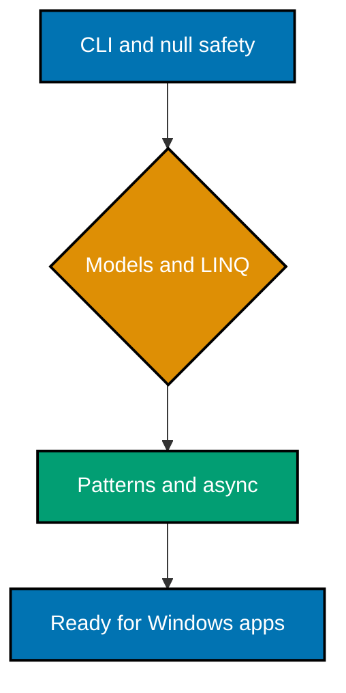

**Want to get productive with C# before building a Windows application?** This code-first primer
teaches the bounded C# surface that Windows App Development assumes: the .NET CLI, nullability,
models, LINQ, and an async preview.

Save a normal example as `Program.cs` in a console project created with `dotnet new console`, then
run `dotnet run`. Use a current .NET LTS SDK; the course intentionally does not pin a version.

## Prerequisites

This course requires [Object-Oriented Programming Essentials](../object-oriented-programming-essentials/learning/overview.md).
It also assumes general typed-language fluency and a terminal. The Windows SDK, XAML, WinUI/WPF,
lifecycle APIs, and desktop deployment belong to Windows App Development, not this primer.

## Learning path

## Scope boundary

This is just enough C# to read and make small, safe changes in the paired Windows course. It
deliberately stops before XAML, WinUI/WPF, dependency injection frameworks, reflection, unsafe
code, advanced threading, and platform packaging. It teaches productive foundations, not
comprehensive C# mastery.
