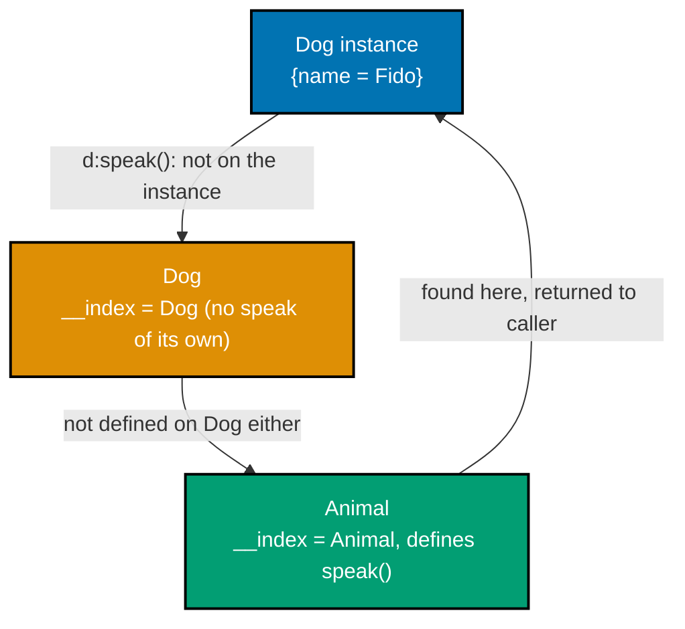
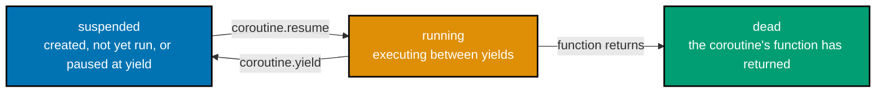
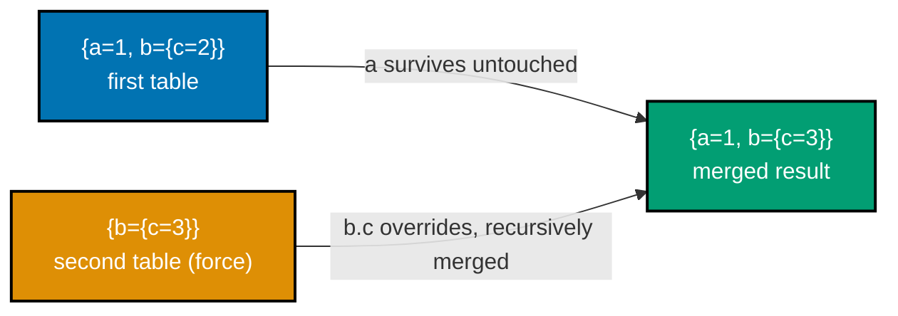

Examples 59-84 cover the rest of error handling (`error` with non-string values, `assert`, `xpcall` with a traceback handler, error levels), the remaining metamethods (`__eq`, `__call`), a full prototype-based OOP class/inheritance/override chain, coroutines end to end, the Lua-5.1-vs-later dialect gap Neovim actually lives in, and the seven `vim.*` API calls every later Neovim-extension topic leans on. Most examples still run with `lua example.lua`; Example 72 needs `luajit example.lua`, and Examples 78-84 need to run inside Neovim itself -- both exceptions are called out explicitly where they happen, and both are teaching co-18 (Neovim's embedded Lua dialect), not a documentation inconsistency.

---

### Example 59: error() Can Raise ANY Value, Not Just a String

_ex-59 &middot; exercises co-13_

`error()`'s argument can be any Lua value at all -- a table, a number, even another table wrapping structured error data -- not only a string message.

**`learning/code/ex-59-error-raise-table-object/example.lua`**

```lua
-- Example 59: error() can raise ANY value, not just a string
local ok, err = pcall(function()   -- => runs the inner function in protected mode
  error({ code = 42 })             -- => error()'s argument can be any Lua value -- here, a table
end)                                -- => closes the protected function
print(err.code)                    -- => err IS the table passed to error(), untouched
                                    -- => (no "file:line:" prefix is added for non-string error objects)
                                    -- => Output: 42
```

**Run**: `lua example.lua`

**Output**:

```text
42
```

**Key takeaway**: A structured error object (a table with fields like `code` and `message`) survives `pcall` completely untouched -- only _string_ error messages get an automatic `"file:line:"` prefix.

**Why it matters**: Real error-handling code often wants more than a human-readable string -- an error code to branch on, or structured context to log. This example shows Lua supports that directly: `error({code = 42, message = "..."})` followed by `pcall`'s `ok, err` pattern gives you a fully structured error object to inspect, exactly like raising a custom exception class in a language that has one.

---

### Example 60: assert() with a Custom Message

_ex-60 &middot; exercises co-13_

`assert(v, message)` raises an error using `message` when `v` is falsy, and simply returns `v` (and any further arguments) unchanged when `v` is truthy.

**`learning/code/ex-60-assert-custom-message/example.lua`**

```lua
-- Example 60: assert() with a custom message
local ok, err = pcall(function()
  assert(false, "custom failure")  -- => assert raises when its first argument is falsy, using message as the error
end)                                -- => closes the protected function
print(err)                         -- => like error() with a string message, assert's string message also gets
                                    -- => a "file:line:" position prefix
                                    -- => Output: example.lua:3: custom failure
```

**Run**: `lua example.lua`

**Output**:

```text
example.lua:3: custom failure
```

**Key takeaway**: `assert(false, "custom failure")` behaves like `error("custom failure")` -- including getting the same `"file:line:"` position prefix when the message is a string, verified by actually running the script rather than assumed from the manual's prose alone.

**Why it matters**: This is a real detail worth verifying rather than guessing: the _string_ form of `assert`'s message picks up the same automatic position prefix that a plain `error(str)` call gets, even though the Lua manual's own description of `assert` does not spell that out explicitly. Trusting only documentation prose over an actual interpreter run is exactly the kind of gap that produces a wrong "expected output" in a tutorial -- this primer verified every example by executing it.

---

### Example 61: xpcall() with a Traceback Handler

_ex-61 &middot; exercises co-13, co-17_

`xpcall(f, handler)` is `pcall` with an extra twist: `handler` runs _while the failing call's stack is still alive_, which is exactly when `debug.traceback` can capture a full call stack.

**`learning/code/ex-61-xpcall-with-traceback-handler/example.lua`**

```lua
-- Example 61: xpcall() with a traceback handler
local ok, tb = xpcall(function()
  error("oops")                    -- => raises an error inside the protected function
end, debug.traceback)              -- => the SECOND argument is a handler, called WHILE the stack is still live
print(ok)                          -- => ok is false, same as pcall would report -- Output: false
print(string.find(tb, "stack traceback") ~= nil)
                                    -- => debug.traceback() built a full call-stack string; it contains this phrase
                                    -- => Output: true
```

**Run**: `lua example.lua`

**Output**:

```text
false
true
```

**Key takeaway**: `xpcall(f, handler)` calls `handler` at the moment of failure, before the stack unwinds -- `pcall` alone cannot do this, since by the time `pcall` returns, the stack that caused the error is already gone.

**Why it matters**: `debug.traceback` is the standard way to capture a full call stack for logging or crash reporting, and it only works meaningfully as an `xpcall` handler (or from inside an active error path) -- calling it after the fact, once `pcall` has already returned, produces a far less useful trace. This is also the primer's one use of the `debug` library (part of co-17's eight standard-library tables), deliberately scoped to just this one function.

---

### Example 62: error() with Level 0 -- Suppressing the Position Prefix

_ex-62 &middot; exercises co-13_

`error`'s optional second argument is a _level_: level 1 (the default) prefixes the message with the calling line's position; level 0 adds no position information at all.

**`learning/code/ex-62-error-level-suppress-position/example.lua`**

```lua
-- Example 62: error() with level 0 -- suppressing the position prefix
local ok, err = pcall(function()
  error("raw", 0)                  -- => the second argument to error() is a LEVEL; 0 means "add no position info"
end)                                -- => closes the protected function
print(err)                         -- => with level 0, err is exactly "raw" -- no "file:line:" prefix at all
                                    -- => Output: raw
```

**Run**: `lua example.lua`

**Output**:

```text
raw
```

**Key takeaway**: `error(msg, 0)` suppresses the automatic position prefix entirely, leaving `msg` exactly as given -- the tool to reach for when you are re-raising an already-formatted error message.

**Why it matters**: This closes out the `error`/`pcall`/`assert`/`xpcall` family (Examples 58-62): a plain string message gets a position prefix by default, a non-string error object never does (Example 59), and level 0 opts a string message out of the prefix on purpose. Library code that wants to control exactly what its callers see in an error message reaches for level 0 to avoid leaking the library's own internal file and line number.

---

### Example 63: Metatable \_\_eq -- Overriding the Equality Operator

_ex-63 &middot; exercises co-10_

By default, two tables are `==` only if they are the _same_ table object. `__eq` lets you redefine equality by value instead of identity -- but only when both operands share the metamethod.

**`learning/code/ex-63-metatable-eq-operator/example.lua`**

```lua
-- Example 63: metatable __eq -- overriding the equality operator
local mt = {}                      -- => a shared metatable for both objects below
mt.__eq = function(a, b) return a.id == b.id end -- => __eq only fires when BOTH operands share this metatable
local a = setmetatable({ id = 1 }, mt) -- => a and b are two DISTINCT table objects
local b = setmetatable({ id = 1 }, mt) -- => same id, but a different table identity from a
print(a == b)                      -- => without __eq, a == b would be false (different table identities)
                                    -- => with __eq, equality is redefined by id instead -- Output: true
```

**Run**: `lua example.lua`

**Output**:

```text
true
```

**Key takeaway**: `__eq` fires only when both operands are tables carrying that same metamethod; it never runs for a table compared against a non-table value.

**Why it matters**: This is the second operator metamethod the primer covers (after `__add` in Example 56), and it is the reason two structurally-identical but distinct Lua "objects" -- two config records with the same fields, two version-number wrappers with the same value -- can compare equal by content instead of by memory address, matching how equality usually works for value types in other languages.

---

### Example 64: Metatable \_\_call -- Making a Table Callable

_ex-64 &middot; exercises co-10_

`__call` lets you invoke a table with function-call syntax, `t(...)`; Lua calls `__call(t, ...)` under the hood, with the table itself as the first argument.

**`learning/code/ex-64-metatable-call-operator/example.lua`**

```lua
-- Example 64: metatable __call -- making a table callable
local mt = {}                      -- => a metatable holding one metamethod
mt.__call = function(self, ...) return "called" end -- => self is the table itself, then the call's arguments
local t = setmetatable({}, mt)     -- => t is an ordinary table wearing mt as its metatable
print(t(1, 2))                     -- => t(1, 2) invokes __call(t, 1, 2) since t is not itself a function
                                    -- => Output: called
```

**Run**: `lua example.lua`

**Output**:

```text
called
```

**Key takeaway**: `__call` makes a table invocable as if it were a function, with the table itself passed as the implicit first argument -- the same `self`-first shape as colon-call syntax (Example 39).

**Why it matters**: `__call` is what lets a library expose a table that is _both_ a namespace of related functions _and_ directly callable as a shorthand for its most common operation -- a familiar pattern from libraries in other languages that overload `()`. This closes the metamethod-as-operator-overload trio (`__add`, `__eq`, `__call`) the primer covers explicitly.

---

### Example 65: OOP -- a Class Built from \_\_index

_ex-65 &middot; exercises co-11, co-12_

Lua has no built-in `class` keyword. A "class" is just a table used as a shared `__index` metatable for its instances, and a "method" is just a function stored on that table, called through colon syntax.

**`learning/code/ex-65-oop-class-with-index-metatable/example.lua`**

```lua
-- Example 65: OOP -- a class built from __index
local Animal = {}                  -- => the class table
Animal.__index = Animal            -- => Animal doubles as its own instances' metatable
function Animal.new(name)          -- => the constructor: builds a plain table, tags it with Animal
  return setmetatable({ name = name }, Animal) -- => setmetatable returns the same table it was given
end                                 -- => closes the constructor
function Animal:speak()            -- => colon syntax: sugar for `function Animal.speak(self)`
  return self.name .. " makes a sound"
end                                 -- => closes the method
print(Animal.new("Rex"):speak())   -- => builds an instance, then :speak() looks up speak via __index
                                    -- => Output: Rex makes a sound
```

**Run**: `lua example.lua`

**Output**:

```text
Rex makes a sound
```

**Key takeaway**: `Animal.__index = Animal` plus `setmetatable(instance, Animal)` is the entire recipe for a Lua "class" -- an instance's failed field lookups (like `:speak`) fall through to the class table.

**Why it matters**: This is the payoff for everything Examples 39-40 (colon syntax) and 53-54 (`__index`) built toward separately: a "class" is nothing more than those two ideas combined. There is no hidden runtime magic -- once you can trace `Animal.new("Rex"):speak()` back to a constructor call plus one metatable-redirected lookup, you have the complete mental model for every Lua OOP library you will ever read.

---

### Example 66: OOP -- an Inheritance Chain via setmetatable

_ex-66 &middot; exercises co-11, co-12_

Chaining a second `__index` link -- `Dog`'s metatable points at `Animal` -- extends the same lookup mechanism into inheritance: a `Dog` instance falls through to `Dog`, then to `Animal`, in order.



**`learning/code/ex-66-oop-inheritance-chain-setmetatable/example.lua`**

```lua
-- Example 66: OOP -- an inheritance chain via setmetatable
local Animal = {}                  -- => base class table
Animal.__index = Animal            -- => Animal is its own instances' metatable
function Animal.new(name) return setmetatable({ name = name }, Animal) end -- => base constructor
function Animal:speak() return self.name .. " makes a sound" end -- => base method

local Dog = setmetatable({}, { __index = Animal }) -- => Dog's failed lookups fall through to Animal
Dog.__index = Dog                  -- => Dog is also its own instances' metatable, exactly like Animal
function Dog.new(name) return setmetatable({ name = name }, Dog) end -- => Dog constructor

local d = Dog.new("Fido")          -- => builds a Dog instance
print(d:speak())                   -- => Dog has no speak of its own, so the lookup chains: Dog -> Animal
                                    -- => Output: Fido makes a sound
```

**Run**: `lua example.lua`

**Output**:

```text
Fido makes a sound
```

**Key takeaway**: Two separate `__index` links -- instance to `Dog`, `Dog` to `Animal` -- chain together into multi-level inheritance; Lua follows failed lookups as far as the metatable chain goes.

**Why it matters**: This is the mechanism every Lua "class library" (and there are many, in the Neovim plugin ecosystem and beyond) builds its inheritance model on top of. There is no depth limit on the chain -- `Dog` could itself be the base of a `Puppy` class, following the exact same `setmetatable({}, {__index = Dog})` pattern one level further.

---

### Example 67: OOP -- Overriding an Inherited Method

_ex-67 &middot; exercises co-11, co-12_

Defining `speak` directly on `Dog` shadows the inherited `Animal.speak` -- the lookup finds `Dog`'s own version first and never needs to chain further.

**`learning/code/ex-67-oop-method-override/example.lua`**

```lua
-- Example 67: OOP -- overriding an inherited method
local Animal = {}                  -- => base class table
Animal.__index = Animal            -- => Animal is its own instances' metatable
function Animal.new(name) return setmetatable({ name = name }, Animal) end -- => base constructor
function Animal:speak() return self.name .. " makes a sound" end -- => base method

local Dog = setmetatable({}, { __index = Animal }) -- => Dog falls back to Animal for anything undefined
Dog.__index = Dog                  -- => Dog is also its own instances' metatable
function Dog.new(name) return setmetatable({ name = name }, Dog) end -- => Dog constructor
function Dog:speak()               -- => defining speak directly on Dog shadows Animal's version
  return self.name .. " barks"
end                                 -- => closes the override

local a = Animal.new("Rex")        -- => a plain Animal instance
local d = Dog.new("Fido")          -- => a Dog instance
print(a:speak())                   -- => a is unaffected by Dog's override -- Output: Rex makes a sound
print(d:speak())                   -- => d finds speak on Dog before the lookup reaches Animal
                                    -- => Output: Fido barks
```

**Run**: `lua example.lua`

**Output**:

```text
Rex makes a sound
Fido barks
```

**Key takeaway**: A field defined directly on `Dog` always wins over one inherited through `__index` -- overriding is simply "define it closer to the instance than the chain would otherwise find it."

**Why it matters**: This completes the full OOP arc (Examples 65-67): a class, a constructor, a method, an inheritance chain, and now an override, all built from nothing more than plain tables and `setmetatable`. Nothing here is special Lua syntax reserved for "classes" -- it is ordinary table and metatable manipulation, which is exactly why understanding metatables (Examples 53-56, 63-64) pays off across the entire OOP story at once.

---

### Example 68: coroutine.create and coroutine.resume

_ex-68 &middot; exercises co-15_

`coroutine.create` wraps a function as a suspendable coroutine. `coroutine.resume` runs it until the next `coroutine.yield` (or until it returns), then hands control back to the caller.

**`learning/code/ex-68-coroutine-create-and-resume/example.lua`**

```lua
-- Example 68: coroutine.create and coroutine.resume
local co = coroutine.create(function() -- => wraps a function as a suspendable coroutine
  print("a")                       -- => runs during the FIRST resume
  coroutine.yield()                -- => pauses execution here, handing control back to the caller
  print("b")                       -- => runs during the SECOND resume, continuing right after yield
end)                                -- => closes the coroutine body
coroutine.resume(co)               -- => starts the coroutine; prints "a" then pauses -- Output line 1: a
coroutine.resume(co)                -- => resumes right where it paused; prints "b" then finishes
                                     -- => Output line 2: b
```

**Run**: `lua example.lua`

**Output**:

```text
a
b
```

**Key takeaway**: `coroutine.resume` continues execution from exactly the point of the last `coroutine.yield` -- unlike a regular function call, a coroutine remembers its entire local state across pauses.

**Why it matters**: Coroutines are Lua's mechanism for cooperative multitasking (co-15): unlike preemptive OS threads, a coroutine only ever switches at an explicit `yield`/`resume` point, which means there is never a data race to worry about between two coroutines -- one is always fully paused while the other runs. This makes coroutines a natural fit for anything that needs to pause mid-operation and resume later without callback-based control-flow gymnastics.

---

### Example 69: Coroutines -- Exchanging Values Through yield/resume

_ex-69 &middot; exercises co-15_

Values flow in both directions across a `yield`/`resume` boundary: `yield`'s argument becomes `resume`'s extra return value, and `resume`'s extra argument becomes `yield`'s return value.

**`learning/code/ex-69-coroutine-yield-value-exchange/example.lua`**

```lua
-- Example 69: coroutines -- exchanging values through yield/resume
local co = coroutine.create(function(x) -- => x is the first resume's extra argument
  local y = coroutine.yield(x * 2) -- => yield's argument becomes resume's extra return value
  return y + 100                  -- => resume's extra argument becomes yield's return value
end)                                -- => closes the coroutine body
local ok1, val1 = coroutine.resume(co, 5)  -- => x is 5; yields x*2 = 10 back to the caller
print(ok1, val1)                   -- => Output: true    10
local ok2, val2 = coroutine.resume(co, 7)  -- => 7 becomes y inside the coroutine; returns y+100 = 107
print(ok2, val2)                   -- => Output: true    107
```

**Run**: `lua example.lua`

**Output**:

```text
true 10
true 107
```

**Key takeaway**: Extra arguments to `coroutine.resume` after the coroutine handle become `coroutine.yield`'s return value inside the coroutine, and `yield`'s own argument becomes `resume`'s extra return value -- a genuine two-way channel.

**Why it matters**: This two-way value exchange is what elevates coroutines above a simple pause/continue mechanism into a full producer-consumer channel: the caller can hand new input to the coroutine on each resume, and the coroutine can hand partial results back on each yield, without any shared mutable state or external queue.

---

### Example 70: coroutine.wrap -- Using a Coroutine as a For-Loop Iterator

_ex-70 &middot; exercises co-15_

`coroutine.wrap` packages a coroutine as a plain function instead of a coroutine handle -- calling it resumes the coroutine directly, which makes it a natural fit for the generic-`for` iterator protocol from Example 46.

**`learning/code/ex-70-coroutine-wrap-as-iterator/example.lua`**

```lua
-- Example 70: coroutine.wrap -- using a coroutine as a for-loop iterator
local gen = coroutine.wrap(function() -- => wrap returns a plain FUNCTION, not a coroutine handle
  for i = 1, 3 do                  -- => walks 1, 2, 3
    coroutine.yield(i)              -- => each call to gen() resumes up to the next yield
  end                               -- => closes the for-loop
end)                                -- => closes the wrapped function
for v in gen do io.write(v, " ") end -- => a generic for-loop calls gen() repeatedly until it returns nothing
print()                              -- => trailing newline for clean output
                                      -- => Output: 1 2 3  (trailing space before the newline)
```

**Run**: `lua example.lua`

**Output**:

```text
1 2 3
```

**Key takeaway**: `coroutine.wrap(f)` returns a callable function that resumes the underlying coroutine on every call -- unlike `coroutine.resume`, it raises the error directly instead of returning an `ok` flag, and returns `yield`'s values directly instead of prefixing them with `true`.

**Why it matters**: This is Example 46's hand-written stateless-iterator triplet, reimplemented with a coroutine standing in for the manually threaded state -- `coroutine.wrap` lets the generator function keep its progress in ordinary local variables and a loop, instead of manually encoding "where was I" into an external control variable.

---

### Example 71: coroutine.status -- the Suspended/Running/Dead Lifecycle

_ex-71 &middot; exercises co-15_

A coroutine moves through a small set of states over its lifetime: `suspended` (created or paused), `running` (currently executing), and `dead` (its function has returned or errored).



**`learning/code/ex-71-coroutine-status-transitions/example.lua`**

```lua
-- Example 71: coroutine.status -- the suspended/running/dead lifecycle
local co                           -- => forward-declare co so the closure below captures the LOCAL, not a global
co = coroutine.create(function()
  print(coroutine.status(co))      -- => queried from INSIDE the coroutine while it is executing
end)                                -- => closes the coroutine body
print(coroutine.status(co))        -- => a freshly created coroutine starts "suspended" -- Output line 1: suspended
coroutine.resume(co)                -- => runs the body; the print inside reports "running" -- Output line 2: running
print(coroutine.status(co))        -- => the function has returned, so the coroutine is now "dead"
                                     -- => Output line 3: dead
```

**Run**: `lua example.lua`

**Output**:

```text
suspended
running
dead
```

**Key takeaway**: `local co` must be forward-declared _before_ `coroutine.create` when the coroutine body needs to reference `co` itself -- writing `local co = coroutine.create(function() ... co ... end)` in one step makes the inner reference resolve to a stray global instead of the local being declared.

**Why it matters**: This forward-declaration subtlety is a real bug this primer's own authoring process hit while first drafting this exact example -- the inner `coroutine.status(co)` silently read a `nil` global and errored, which the `coroutine.resume` call swallowed since its return value went unchecked. It is the same forward-declaration pattern Example 49 (factorial) and Example 75 (memoized fibonacci) both rely on for self-reference, and it is worth internalizing here where getting it wrong is easy to reproduce.

---

### Example 72: The Lua 5.1 Global unpack() -- Neovim's Embedded Dialect

_ex-72 &middot; exercises co-18_

Lua 5.1 (and LuaJIT, which targets 5.1 semantics) exposes `unpack()` as a plain global function. Standalone Lua removed that global starting with 5.2, moving the same functionality to `table.unpack`.

**`learning/code/ex-72-unpack-global-function-51/example.lua`**

```lua
-- Example 72: the Lua 5.1 global unpack() -- Neovim's embedded dialect
-- NOTE: run this one with `luajit example.lua`, not `lua example.lua` --
-- LuaJIT targets Lua 5.1 semantics, where unpack() is a GLOBAL function.
-- Standalone Lua 5.5 removed the global; only table.unpack() exists there (5.2+).
print(unpack({ 1, 2, 3 }))         -- => unpack() expands a table's array part back into separate values
                                    -- => Output (under luajit): 1    2    3
```

**Run**: `luajit example.lua` (**not** `lua example.lua` -- see below)

**Output**:

```text
1 2 3
```

**What happens under plain `lua`** (verified by actually running it): standalone Lua 5.5 has no global `unpack`, so `lua example.lua` fails with

```text
lua: example.lua:5: attempt to call a nil value (global 'unpack')
```

**Key takeaway**: Neovim embeds LuaJIT targeting Lua 5.1 semantics, where `unpack` is global; standalone Lua 5.2 onward moved it to `table.unpack`. Config code written and tested only against a standalone modern `lua` binary can use APIs that do not exist inside Neovim, and vice versa.

**Why it matters**: This is the concrete, runnable version of co-18 -- the concept this whole primer keeps threading through, that Neovim's Lua is not the same Lua as whatever `lua -v` reports on your terminal. Lua's current major release is 5.5.0, four major versions ahead of the Lua 5.1 semantics Neovim's runtime documentation states it permanently targets (5.2, 5.3, 5.4, 5.5); a config author who assumes "whatever `lua` on my machine accepts, Neovim accepts" will eventually hit exactly this gap. `goto`/`::label::`, notably, is _not_ one of the gaps -- LuaJIT enables it unconditionally as a Lua 5.2 extension even though it targets 5.1 semantics otherwise.

---

### Example 73: string.format %q -- a Lua-Reader-Safe Escaped Literal

_ex-73 &middot; exercises co-16_

The `%q` format specifier escapes a string's quotes, backslashes, and control characters so thoroughly that the result is a literal the Lua reader itself could load back and reproduce the exact original value.

**`learning/code/ex-73-string-format-q-escape-quote/example.lua`**

```lua
-- Example 73: string.format %q -- a Lua-reader-safe escaped literal
print(string.format("%q", 'He said "hi"'))
                                    -- => %q escapes quotes/backslashes so the Lua reader could reload it verbatim
                                    -- => Output: "He said \"hi\""
```

**Run**: `lua example.lua`

**Output**:

```text
"He said \"hi\""
```

**Key takeaway**: `%q` is the only `string.format` specifier that guarantees round-trippable output -- feed its result back into the Lua reader and you get the original string back exactly.

**Why it matters**: `%q` is the right tool whenever generated Lua source code needs to embed an arbitrary string value safely -- writing a cache file of literal Lua data, or serializing a config value back into `.lua` syntax -- without hand-rolling escape logic that might miss an edge case a real string could contain.

---

### Example 74: An Anchored Pattern with Three Captures -- Parsing a Date

_ex-74 &middot; exercises co-16_

Combining the `^`/`$` anchors with three separate `%d+` capture groups parses a fixed `YYYY-MM-DD` date format into its three numeric parts in a single `string.match` call.

**`learning/code/ex-74-pattern-capture-anchored-date/example.lua`**

```lua
-- Example 74: an anchored pattern with three captures -- parsing a date
print(string.match("2026-07-12", "^(%d+)-(%d+)-(%d+)$"))
                                    -- => ^ and $ anchor the match to the whole string; %d+ matches digit runs
                                    -- => Output: 2026    07    12
```

**Run**: `lua example.lua`

**Output**:

```text
2026 07 12
```

**Key takeaway**: `^` and `$` anchor a pattern to the whole string (not just a substring anywhere within it); three `(%d+)` captures separated by literal `-` extract a `YYYY-MM-DD` date's three components in one call.

**Why it matters**: This is Example 43's single-capture pattern extended to three captures plus anchoring, and it is the closing example of the primer's `string`-pattern coverage (co-16): `find`, `match`, `gmatch`, `gsub`, `%w`/`%d`/`%a`/`%s` character classes, and now anchors and multiple captures together -- enough pattern vocabulary to parse most fixed-format config values without reaching for a heavier regular-expression library.

---

### Example 75: A Memoized Closure -- Fibonacci with a Cache Upvalue

_ex-75 &middot; exercises co-07_

Wrapping a recursive function together with a shared `cache` table, both captured as upvalues by the same closure, turns an exponential-time recursive Fibonacci into an effectively instant one.

**`learning/code/ex-75-memoized-closure-fibonacci/example.lua`**

```lua
-- Example 75: a memoized closure -- fibonacci with a cache upvalue
local function makeFib()
  local cache = {}                 -- => cache is an upvalue shared by every recursive call below
  local fib                        -- => forward-declare fib so the closure can call itself by that name
  fib = function(n)                -- => the memoized recursive worker
    if n < 2 then return n end     -- => base cases: fib(0) is 0, fib(1) is 1
    if cache[n] then return cache[n] end -- => already computed -- skip the recursive work entirely
    local result = fib(n - 1) + fib(n - 2) -- => the two recursive calls this cache exists to avoid repeating
    cache[n] = result              -- => store this result in the shared cache before returning
    return result                  -- => hand the value back to the caller
  end                                -- => closes fib
  return fib                       -- => exposes only the memoized function
end                                 -- => closes makeFib
local fib = makeFib()              -- => fib is now a closure sharing one private cache
print(fib(30))                     -- => without memoization this branches exponentially; with it, it's instant
                                    -- => Output: 832040
```

**Run**: `lua example.lua`

**Output**:

```text
832040
```

**Key takeaway**: `cache` and `fib` are both upvalues of the same closure, so every recursive call shares the same private cache -- memoization is just "a closure with a private table" applied to a recursive function.

**Why it matters**: This combines three ideas the primer already taught separately -- closures (Example 47), recursion (Example 49), and forward-declared self-reference (Examples 49 and 71) -- into a genuinely useful technique. `fib(30)` without memoization would make over a million recursive calls; with the cache, it makes at most 30 new computations, reusing every previously-solved subproblem.

---

### Example 76: rawget/rawequal -- Bypassing Metamethods

_ex-76 &middot; exercises co-10_

`rawget`, `rawset`, `rawequal`, and `rawlen` perform their operation _without_ triggering any metamethod -- the raw, unmediated table operation underneath whatever `__index`/`__eq`/etc. would otherwise intercept.

**`learning/code/ex-76-rawget-rawequal-bypass-metamethods/example.lua`**

```lua
-- Example 76: rawget/rawequal -- bypassing metamethods
local mt = {                        -- => a metatable with two metamethods
  __index = function() return "default" end,
  __eq = function() return true end,
}                                    -- => closes the metatable literal
local a = setmetatable({}, mt)     -- => a is an empty table wearing mt
local b = setmetatable({}, mt)     -- => b is a SEPARATE empty table, also wearing mt
print(a.missing, rawget(a, "missing")) -- => a.missing triggers __index: "default"
                                    -- => rawget(a, "missing") skips __index entirely: nil (truly absent)
                                    -- => Output: default    nil
print(a == b, rawequal(a, b))      -- => a == b triggers __eq: true
                                    -- => rawequal(a, b) skips __eq entirely: false (different identities)
                                    -- => Output: true    false
```

**Run**: `lua example.lua`

**Output**:

```text
default nil
true false
```

**Key takeaway**: `rawget(t, k)` and `rawequal(a, b)` see the table exactly as it truly is, with no `__index`/`__eq` interception -- the same underlying operation `t[k]` and `a == b` would perform if no metatable were attached at all.

**Why it matters**: The `raw*` family is the escape hatch for whenever a metamethod's customized behavior gets in the way of inspecting a table's actual, literal contents -- debugging tooling, serialization code, and generic table-copying utilities all need to see past `__index`/`__eq` to the table's real state, which is exactly what these functions guarantee.

---

### Example 77: Packing Varargs Directly into a Table Constructor

_ex-77 &middot; exercises co-09_

`{...}` inside a function body packs every vararg argument into a fresh table in one expression -- the same packing Example 27 used internally, shown here as the whole point of the function.

**`learning/code/ex-77-varargs-table-constructor/example.lua`**

```lua
-- Example 77: packing varargs directly into a table constructor
local function collect(...)
  return { ... }                   -- => {...} packs every argument into a fresh array-part table
end                                 -- => closes the function
local t = collect(1, 2, 3)         -- => t is {1, 2, 3}
print(#t, t[1], t[3])              -- => #t is 3 (three contiguous entries); t[1] and t[3] are the ends
                                    -- => Output: 3    1    3
```

**Run**: `lua example.lua`

**Output**:

```text
3 1 3
```

**Key takeaway**: `{...}` is the shortest way to turn a function's variable arguments into a real, indexable table -- exactly what Example 27's `sum` function did as an intermediate step, made explicit here as `collect`'s entire job.

**Why it matters**: This closes the primer's standalone-Lua coverage on the exact idiom a "collect all arguments into a list" utility function needs. It is also the last example run with the plain `lua` interpreter -- Example 78 onward moves into the `vim.*` API, which only exists inside a running Neovim process.

---

### Example 78: vim.tbl_deep_extend -- Recursively Merging Config Tables

_ex-78 &middot; exercises co-18_

`vim.tbl_deep_extend(behavior, ...)` merges any number of tables together, recursing into nested tables instead of overwriting them wholesale. With `"force"`, later tables win on every key conflict.



**`learning/code/ex-78-neovim-vim-tbl-deep-extend-merge/example.lua`**

```lua
-- Example 78: vim.tbl_deep_extend -- recursively merging config tables
-- Run inside Neovim: :luafile example.lua  (vim.* only exists inside Neovim's Lua runtime)
print(vim.inspect(vim.tbl_deep_extend("force", { a = 1, b = { c = 2 } }, { b = { c = 3 } })))
                                    -- => "force" behavior merges recursively: b.c is overridden to 3, a=1 survives
                                    -- => Output: { a = 1, b = { c = 3 } }  (vim.inspect pretty-prints across lines)
```

**Run**: open Neovim inside `ex-78-neovim-vim-tbl-deep-extend-merge/` and run `:luafile example.lua` (or non-interactively: `nvim --headless -c "luafile example.lua" -c "qa!"`)

**Output**:

```text
{
  a = 1,
  b = {
    c = 3
  }
}
```

**Key takeaway**: `vim.tbl_deep_extend("force", t1, t2, ...)` merges nested tables _recursively_, not by wholesale-replacing a nested table field -- only leaf values actually conflict and get overwritten; list-shaped (array-part) tables are treated as opaque values, not merged element-by-element.

**Why it matters**: This is the exact function every Neovim plugin's `setup(opts)` call uses internally to merge user-supplied configuration over its own defaults -- Example 21's nested-table chain and Example 54's `__index`-based single-level defaults both foreshadow this, but `vim.tbl_deep_extend` is the real, arbitrary-depth tool Neovim ships for the job. Getting the `"force"`/`"keep"`/`"error"` behavior argument right is the difference between user options correctly overriding defaults and a plugin silently ignoring them.

---

### Example 79: vim.tbl_map -- Transforming Every Element of a Table

_ex-79 &middot; exercises co-18_

`vim.tbl_map(fn, t)` applies `fn` to every value in `t` and returns a new table of the results, leaving the original table untouched -- Neovim's built-in equivalent of a functional `map`.

**`learning/code/ex-79-neovim-vim-tbl-map-filter/example.lua`**

```lua
-- Example 79: vim.tbl_map -- transforming every element of a table
-- Run inside Neovim: :luafile example.lua
print(vim.inspect(vim.tbl_map(function(x) return x * 2 end, { 1, 2, 3 })))
                                    -- => tbl_map applies the function to each value, returning a NEW table
                                    -- => Output: { 2, 4, 6 }
```

**Run**: `:luafile example.lua` inside Neovim

**Output**:

```text
{ 2, 4, 6 }
```

**Key takeaway**: `vim.tbl_map` never mutates its input table -- it always returns a brand-new table of transformed values, matching Example 35's `table.sort` in spirit but not in effect (`sort` mutates in place, `tbl_map` does not).

**Why it matters**: `vim.tbl_map` is Neovim's answer to Example 50's function-as-callback pattern applied across a whole table at once -- it is the everyday tool for transforming a list of buffer numbers, window handles, or option values without hand-writing the same `for`-loop-plus-new-table boilerplate every time.

---

### Example 80: vim.keymap.set -- a Normal-Mode Mapping with a Lua Callback

_ex-80 &middot; exercises co-18_

`vim.keymap.set(mode, lhs, rhs, opts)` binds a key sequence to either a command string or, as here, a Lua function called directly when the mapping fires.

**`learning/code/ex-80-neovim-vim-keymap-set-callback/example.lua`**

```lua
-- Example 80: vim.keymap.set -- a Normal-mode mapping with a Lua callback
-- Run inside Neovim: :luafile example.lua, then press <leader>x to trigger it
vim.keymap.set('n', '<leader>x', function()
  print("mapped")                  -- => runs when <leader>x is pressed in Normal mode
end, { desc = "test" })            -- => desc documents the mapping for :Telescope keymaps / which-key style tools
                                    -- => Output (after pressing <leader>x): mapped
```

**Run**: `:luafile example.lua` inside Neovim, then press `<leader>x` in Normal mode (verified non-interactively with `vim.api.nvim_feedkeys` simulating the keypress)

**Output** (after triggering the mapping):

```text
mapped
```

**Key takeaway**: `vim.keymap.set('n', lhs, fn, opts)` takes a Lua function directly as `rhs` -- no `<cmd>lua ...<CR>` string is needed, and `opts.desc` documents the mapping for discovery tools.

**Why it matters**: This is the single most common Lua idiom in any real Neovim config file: binding a key to a small Lua callback instead of a Vimscript command string. Every one of the first 79 examples in this primer builds the language fluency this line assumes -- a first-class function (Example 24) passed as a table field (Example 20) to a library call (Example 50's callback pattern) -- and this is the payoff moment where that fluency becomes directly useful.

---

### Example 81: vim.opt / vim.o -- Setting and Reading a Scalar Option

_ex-81 &middot; exercises co-18_

`vim.opt` is the structured, Lua-friendly interface for setting any Neovim option; `vim.o` is the plain scalar-value view of the same underlying option storage.

**`learning/code/ex-81-neovim-vim-opt-scalar-option/example.lua`**

```lua
-- Example 81: vim.opt / vim.o -- setting and reading a scalar option
-- Run inside Neovim: :luafile example.lua
vim.opt.tabstop = 2                -- => vim.opt is the structured, Lua-friendly way to set any 'option
print(vim.o.tabstop)               -- => vim.o is the plain scalar-value view of the same options
                                    -- => Output: 2
```

**Run**: `:luafile example.lua` inside Neovim

**Output**:

```text
2
```

**Key takeaway**: `vim.opt.<name> = value` sets an option; `vim.o.<name>` reads it back as a plain scalar -- both views point at the same underlying option storage.

**Why it matters**: `vim.opt` and `vim.o` are the two option-access surfaces every Neovim config touches within its first few lines, replacing the Vimscript `:set` family. `vim.opt` additionally understands list- and set-shaped options (like `formatoptions` or `wildignore`) as Lua tables with `:append`/`:remove` methods -- out of scope for this primer's "just enough" boundary, but worth knowing exists once you outgrow scalar options like `tabstop`.

---

### Example 82: vim.api.nvim_buf_set_lines / get_lines -- Editing a Buffer from Lua

_ex-82 &middot; exercises co-18_

The `vim.api.*` functions are Neovim's lowest-level, most directly documented Lua API surface. `nvim_buf_set_lines`/`nvim_buf_get_lines` write and read a buffer's text as a plain list of line strings.

**`learning/code/ex-82-neovim-vim-api-buf-set-lines/example.lua`**

```lua
-- Example 82: vim.api.nvim_buf_set_lines / get_lines -- editing a buffer from Lua
-- Run inside Neovim: :luafile example.lua
vim.api.nvim_buf_set_lines(0, 0, -1, false, { "hello", "world" })
                                    -- => buffer 0 is "the current buffer"; 0, -1 means "the whole buffer"
                                    -- => start/end lines are 0-BASED and end-EXCLUSIVE, unlike Lua's own tables
print(table.concat(vim.api.nvim_buf_get_lines(0, 0, -1, false), "|"))
                                    -- => reads the whole buffer back as a list of lines, joined with "|"
                                    -- => Output: hello|world
```

**Run**: `:luafile example.lua` inside Neovim

**Output**:

```text
hello|world
```

**Key takeaway**: `nvim_buf_set_lines`/`get_lines` use 0-based, end-_exclusive_ line ranges, and `0` as a buffer handle always means "the current buffer" -- both details are a deliberate departure from Lua's own 1-based, inclusive table indexing (Examples 19, 38).

**Why it matters**: This indexing mismatch is a real, common source of off-by-one bugs when writing Neovim plugin code: every `vim.api.nvim_buf_*` and `nvim_win_*` line/column function uses this 0-based, end-exclusive convention (matching Neovim's internal C API), while the Lua code calling it uses 1-based tables everywhere else. Knowing this boundary exists -- and exactly where it sits -- is far more valuable than memorizing any single function's signature.

---

### Example 83: vim.inspect -- Human-Readable Table Dumps for Debugging

_ex-83 &middot; exercises co-18_

`vim.inspect(value)` formats any Lua value as a readable, re-parseable Lua literal -- the tool every earlier `vim.inspect(...)` call in this tier already leaned on to make table return values visible in `print` output.

**`learning/code/ex-83-neovim-vim-inspect-pretty-print/example.lua`**

```lua
-- Example 83: vim.inspect -- human-readable table dumps for debugging
-- Run inside Neovim: :luafile example.lua
print(vim.inspect({ 1, 2, { x = 3 } }))
                                    -- => vim.inspect formats any Lua value as readable, re-parseable Lua syntax
                                    -- => Output (nested table expands across lines): { 1, 2, { x = 3 } }
```

**Run**: `:luafile example.lua` inside Neovim

**Output**:

```text
{ 1, 2, {
    x = 3
  } }
```

**Key takeaway**: `vim.inspect` is what turns Examples 78-79 and 84's raw table return values into the readable multi-line output shown throughout this tier -- without it, `print`ing a table directly shows only an opaque address like `table: 0x...`, the same problem `__tostring` (Example 55) solves for custom types.

**Why it matters**: `vim.inspect` is the single most useful debugging tool in a Neovim Lua session -- `:lua print(vim.inspect(some_value))` is the fastest way to see exactly what a plugin's internal table, a `vim.opt` value, or an API return value actually contains, without writing a custom `__tostring` for every type you want to inspect.

---

### Example 84: vim.split -- Splitting a String on a Separator

_ex-84 &middot; exercises co-18_

`vim.split(s, sep)` splits `s` on every occurrence of `sep`, returning a table of the resulting fields. By default, `trimempty` is `false`, so empty fields (from adjacent separators) are preserved.

**`learning/code/ex-84-neovim-vim-split-string-utility/example.lua`**

```lua
-- Example 84: vim.split -- splitting a string on a separator
-- Run inside Neovim: :luafile example.lua
print(vim.inspect(vim.split("a,b,,c", ",")))
                                    -- => trimempty defaults to FALSE, so the empty field between "b" and "c" stays
                                    -- => Output: { "a", "b", "", "c" }
```

**Run**: `:luafile example.lua` inside Neovim

**Output**:

```text
{ "a", "b", "", "c" }
```

**Key takeaway**: `vim.split("a,b,,c", ",")` returns four elements, not three -- the empty string between the two consecutive commas is preserved by default, since `trimempty` defaults to `false`.

**Why it matters**: This default-preserves-empties behavior is a real, easy-to-miss detail: code that expects `vim.split` to silently collapse adjacent separators (the way some other languages' `split` functions do) will get an extra empty-string element it did not plan for, unless it explicitly passes `{trimempty = true}`. This closes the primer's `vim.*` coverage -- table merging, mapping, keymaps, options, buffer lines, inspection, and string splitting are exactly the seven calls [3 · Extending Neovim](../../extending-neovim/learning/overview.md) builds its first real config file on top of.

---

← Previous: [Intermediate Examples](./intermediate.md) · Next:
[3 · Extending Neovim](../../extending-neovim/learning/overview.md) →
