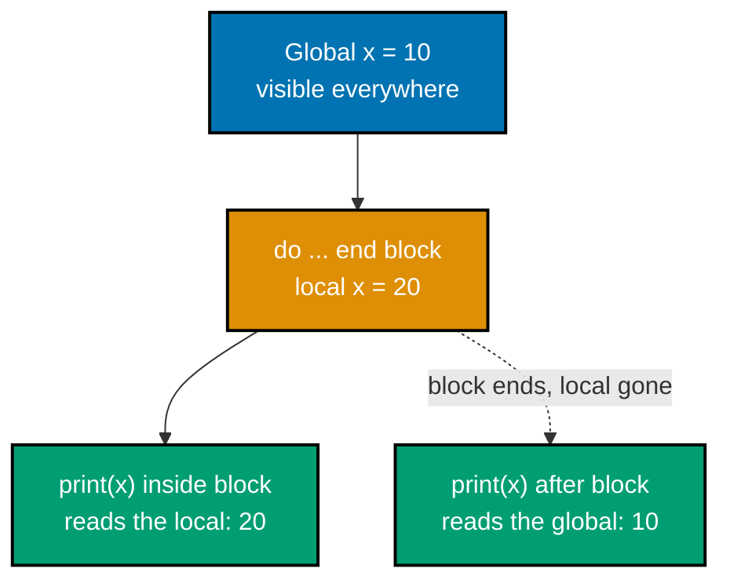

Examples 1-26 cover Lua's core syntax and expressions: the eight basic types, `nil`/`false` truthiness, local-vs-global scoping, arithmetic, string basics, comparisons, the `and`/`or` idioms, control flow (`if`/`for`/`while`/`repeat`), and the table literal's two faces (array and map). Every example is a complete, self-contained `.lua` script colocated under `learning/code/`; run each one with `lua example.lua` from inside its own directory unless a caption says otherwise.

---

### Example 1: Hello World Print

_ex-01 &middot; exercises co-17_

The very first Lua program most people write, and the one this whole primer's "universal run command" is built around. `print()` is Lua's most-used standard-library function -- it writes its arguments to standard output, each converted to a string, separated by tabs, followed by a newline.

**`learning/code/ex-01-hello-world-print/example.lua`**

```lua
-- Example 1: Hello World Print
print("Hello, world!")             -- => calls the global print() with one string argument
                                    -- => Output: Hello, world!
```

**Run**: `lua example.lua`

**Output**:

```text
Hello, world!
```

**Key takeaway**: `lua <file>.lua` is the one command this entire primer builds on; `print()` is the fastest way to see a value.

**Why it matters**: Every other example in this primer starts from this same command and the same function. There is no compile step, no project scaffold, and no build tool between you and running code -- Lua's standalone interpreter reads a file and executes it top to bottom. That immediacy is why Lua works so well as an embedded configuration language: Neovim, and the tools built on top of it, can hand a user a `.lua` file and trust that `lua` (or Neovim's own embedded interpreter) can run it with zero ceremony.

---

### Example 2: type() on Lua's Eight Basic Types

_ex-02 &middot; exercises co-01_

Lua has exactly eight basic types, and `type()` is the runtime function that reports which one any value is. Unlike statically typed languages, Lua checks types at runtime on the _value_, not at compile time on a variable declaration.

**`learning/code/ex-02-type-function-eight-types/example.lua`**

```lua
-- Example 2: type() on Lua's eight basic types
print(type(nil), type(true), type(1), type("s"), type({}), type(print))
                                    -- => six type() calls: nil/boolean/number/string/table/function
                                    -- => Output: nil    boolean    number    string    table    function
```

**Run**: `lua example.lua`

**Output**:

```text
nil boolean number string table function
```

**Key takeaway**: `type()` returns one of exactly eight strings: `nil`, `boolean`, `number`, `string`, `function`, `userdata`, `thread`, or `table` -- Lua has no others.

**Why it matters**: This example demonstrates six of the eight types directly (the two missing here, `userdata` and `thread`, appear later as coroutines and C-bound values). Knowing the full, closed set of types up front means nothing you meet later in this primer is a surprise -- every value you will ever touch in Lua is one of these eight, and every one of them prints its own name from `type()`.

---

### Example 3: nil vs false Truthiness

_ex-03 &middot; exercises co-02_

Lua's truthiness rule is unusually strict and unusually simple: only `nil` and `false` are falsy. Every other value -- including `0` and `""`, which are falsy in many other languages -- is truthy.

**`learning/code/ex-03-nil-vs-false-truthiness/example.lua`**

```lua
-- Example 3: nil vs false truthiness
if 0 then                          -- => 0 is truthy in Lua (unlike C, Python, or JavaScript)
  print("0 is truthy")             -- => Output line 1: 0 is truthy
end                                 -- => closes the first if
if "" then                         -- => "" (empty string) is truthy too
  print("empty string is truthy")  -- => Output line 2: empty string is truthy
end                                 -- => closes the second if; only nil/false ever skip a branch
```

**Run**: `lua example.lua`

**Output**:

```text
0 is truthy
empty string is truthy
```

**Key takeaway**: A Lua `if` never treats `0` or `""` as false -- only `nil` and `false` are falsy.

**Why it matters**: Readers arriving from C, Python, or JavaScript carry an assumption that "falsy" includes zero and empty collections; that assumption silently breaks Lua code. This two-value falsy rule is small enough to memorize once and never re-check, and it underpins the `or`-based default-value idiom (Example 11) and the `and`/`or` ternary idiom (Example 12) that Lua code leans on constantly in place of a native ternary operator.

---

### Example 4: local vs global Shadowing

_ex-04 &middot; exercises co-06_

Every Lua variable is global unless explicitly declared `local`. This example creates a global `x`, then shadows it with a block-scoped local `x` that only exists inside a `do...end` block.



**`learning/code/ex-04-local-vs-global-shadowing/example.lua`**

```lua
-- Example 4: local vs global shadowing
x = 10                              -- => no `local` keyword, so x is a GLOBAL variable
do                                   -- => opens a new block
  local x = 20                      -- => declares a NEW local x, shadowing the global inside this block
  print(x)                          -- => reads the local x -- Output line 1: 20
end                                  -- => the local x goes out of scope here
print(x)                            -- => reads the global x again, unaffected -- Output line 2: 10
```

**Run**: `lua example.lua`

**Output**:

```text
20
10
```

**Key takeaway**: `local` creates a lexically scoped binding limited to its enclosing block; without it, an assignment always touches the (implicit) global table.

**Why it matters**: Forgetting `local` is one of the most common real-world Lua bugs, because a plain `x = 10` silently creates or overwrites a global rather than raising an error. Neovim config authors hit this constantly: every variable in a config file should almost always be `local` unless it is deliberately meant to be shared, and this scoping rule is the first thing to check when a Lua config behaves unexpectedly across files.

---

### Example 5: Multiple Assignment Swap

_ex-05 &middot; exercises co-08_

Lua evaluates the entire right-hand side of a multiple assignment before performing any of the assignments, which makes a variable swap a one-liner with no temporary variable.

**`learning/code/ex-05-multiple-assignment-swap/example.lua`**

```lua
-- Example 5: multiple assignment swap
local a, b = 1, 2                  -- => a is 1, b is 2 (parallel assignment, not sequential)
a, b = b, a                        -- => the right side (2, 1) is fully evaluated before either assignment lands
                                    -- => a becomes 2, b becomes 1 -- no temp variable needed
print(a, b)                        -- => Output: 2    1
```

**Run**: `lua example.lua`

**Output**:

```text
2 1
```

**Key takeaway**: `a, b = b, a` swaps two variables in Lua with no temporary variable because the whole right side is evaluated first.

**Why it matters**: This is the first example of Lua's "parallel assignment" semantics, which reappear constantly: function calls returning multiple values (Example 26), `pcall`'s `ok, err` pattern (Example 58), and `string.find`'s start/end pair (Example 42) all rely on the same evaluate-then-assign rule this swap demonstrates in miniature.

---

### Example 6: Arithmetic Operators, Modulo, and Power

_ex-06 &middot; exercises co-17_

Lua's arithmetic operators mostly match other C-family languages, with one surprise: the exponentiation operator `^` always produces a float result, even when both operands are whole numbers.

**`learning/code/ex-06-arithmetic-operators-modulo-power/example.lua`**

```lua
-- Example 6: arithmetic operators, modulo, and power
print(7 % 3, 2 ^ 10, -5)           -- => 7 % 3 is 1; 2 ^ 10 is 1024.0 -- `^` ALWAYS returns a float
                                    -- => Output: 1    1024.0    -5
```

**Run**: `lua example.lua`

**Output**:

```text
1 1024.0 -5
```

**Key takeaway**: `%` is remainder, `^` is exponentiation and always returns a float, and unary `-` negates -- verify the float-producing operators before assuming an integer result.

**Why it matters**: The `1024.0` result (not `1024`) is a real, frequently-surprising detail: a reader who assumes `^` behaves like integer exponentiation in C or Python will be confused the first time a config value prints with a trailing `.0`. This primer documents the actual verified output rather than the simplified version, because the difference matters the moment you format or compare that value later.

---

### Example 7: math Library Floor and Huge

_ex-07 &middot; exercises co-17_

The `math` standard library table holds Lua's numeric helper functions. `math.floor` rounds toward negative infinity, and `math.huge` is Lua's representation of positive infinity, useful as a sentinel "larger than anything" value.

**`learning/code/ex-07-math-library-floor-random/example.lua`**

```lua
-- Example 7: math library floor and huge
print(math.floor(3.7), math.huge > 1e300)
                                    -- => math.floor(3.7) rounds down to 3; math.huge > 1e300 is true (infinity)
                                    -- => Output: 3    true
```

**Run**: `lua example.lua`

**Output**:

```text
3 true
```

**Key takeaway**: `math.floor` always rounds toward negative infinity, and `math.huge` compares greater than any finite number.

**Why it matters**: `math` is one of eight standard-library tables covered by co-17 (the "standard libraries overview" concept this primer keeps returning to); floor/ceiling rounding and sentinel-infinity values are common in config code that computes window sizes, indentation widths, or scroll offsets from arbitrary floating-point inputs.

---

### Example 8: String Concatenation with Coercion

_ex-08 &middot; exercises co-16_

The `..` operator concatenates two strings. When one operand is a number, Lua automatically coerces it to its string representation before concatenating.

**`learning/code/ex-08-string-concatenation-coercion/example.lua`**

```lua
-- Example 8: string concatenation with automatic number coercion
print("Value: " .. 42)             -- => `..` concatenates strings; 42 is auto-coerced to "42"
                                    -- => Output: Value: 42
```

**Run**: `lua example.lua`

**Output**:

```text
Value: 42
```

**Key takeaway**: `..` is Lua's concatenation operator (not `+`), and it silently coerces numbers to strings.

**Why it matters**: `..` shows up in nearly every later example that builds a message from parts -- error text (Example 58), custom `__tostring` output (Example 55), and OOP method results (Example 65) all lean on this exact coercion rule. Mixing up `..` and `+` is a very common first mistake for readers coming from a `+`-concatenates language.

---

### Example 9: String Length Operator

_ex-09 &middot; exercises co-16_

The unary `#` operator, applied to a string, returns its length in bytes.

**`learning/code/ex-09-string-length-operator/example.lua`**

```lua
-- Example 9: string length operator
print(#"hello")                    -- => the unary `#` operator returns a string's byte length
                                    -- => Output: 5
```

**Run**: `lua example.lua`

**Output**:

```text
5
```

**Key takeaway**: `#s` is a string's byte length; the same `#` operator also gives a table's sequence length (Example 19).

**Why it matters**: `#` is one small operator doing double duty across two of Lua's eight types, and readers need to recognize both uses on sight. The string form is unambiguous (byte count); the table form (Example 19) has a subtlety worth knowing before it surprises you with a sparse or mixed table.

---

### Example 10: Comparison Operators

_ex-10 &middot; exercises co-01_

Lua's comparison operators compare by value for numbers, lexicographically for strings, and use `~=` (not `!=`) as the inequality operator.

**`learning/code/ex-10-comparison-operators/example.lua`**

```lua
-- Example 10: comparison operators
print(1 == 1.0, "a" < "b", 1 ~= 2) -- => value-equality, lexicographic <, and `~=` ("not equal") all evaluate
                                    -- => Output: true    true    true
```

**Run**: `lua example.lua`

**Output**:

```text
true true true
```

**Key takeaway**: `==`/`~=` compare by value; `<`/`>`/`<=`/`>=` compare strings lexicographically and numbers numerically; `~=` is Lua's spelling of "not equal."

**Why it matters**: `~=` trips up readers coming from `!=`-family languages, and it appears throughout every conditional in this primer from here on. Since Lua has one number type, `1 == 1.0` being `true` also foreshadows Example 6's float-producing `^` operator -- Lua does not distinguish "integer-looking" and "float-looking" numbers for equality purposes.

---

### Example 11: Logical `or` as a Default-Value Idiom

_ex-11 &middot; exercises co-02_

Lua's `or` operator returns its first truthy operand. Combined with the falsy rule from Example 3, this makes `x or "default"` the idiomatic way to supply a fallback value when `x` might be `nil`.

**`learning/code/ex-11-logical-or-default-idiom/example.lua`**

```lua
-- Example 11: logical `or` as a default-value idiom
local x = nil                      -- => x is nil (Lua has no separate "undefined")
print(x or "default")              -- => `or` returns its first truthy operand
                                    -- => x is falsy (nil), so the expression evaluates to "default"
                                    -- => Output: default
```

**Run**: `lua example.lua`

**Output**:

```text
default
```

**Key takeaway**: `x or fallback` is Lua's idiomatic default-value pattern, relying on `or` short-circuiting to its second operand only when the first is falsy.

**Why it matters**: This is Lua's substitute for a native default-parameter syntax, and it appears directly in Example 25's `function greet(name)` pattern. Because only `nil`/`false` are falsy (Example 3), this idiom is safe for strings, tables, and non-zero numbers -- but it silently misfires if `false` is ever a valid, intentional value you wanted to keep.

---

### Example 12: `and`/`or` as a Ternary-Operator Idiom

_ex-12 &middot; exercises co-02_

Lua has no dedicated ternary operator (`cond ? a : b`). Combining `and` and `or` reproduces the same effect: `cond and a or b` evaluates to `a` when `cond` is truthy, `b` otherwise.

**`learning/code/ex-12-logical-and-or-ternary-idiom/example.lua`**

```lua
-- Example 12: `and`/`or` as a ternary-operator idiom
local ok = true                    -- => ok is true
print(ok and "yes" or "no")        -- => `and` short-circuits: if ok is truthy, evaluate the right side ("yes")
                                    -- => the whole `A and B or C` then evaluates to B when A is truthy
                                    -- => Output: yes
```

**Run**: `lua example.lua`

**Output**:

```text
yes
```

**Key takeaway**: `cond and a or b` is Lua's ternary idiom -- but it breaks if `a` itself can be falsy, since `and` would then fall through to `b`.

**Why it matters**: This idiom is everywhere in real-world Lua config code, so recognizing it on sight matters. The failure mode is worth internalizing early: if `a` is `false` or `nil`, `cond and a or b` always evaluates to `b`, regardless of `cond` -- a sharp edge that a true ternary operator would not have.

---

### Example 13: The `not` Operator and Truthiness

_ex-13 &middot; exercises co-02_

`not` inverts truthiness: it returns `true` for falsy operands (`nil`, `false`) and `false` for every truthy operand, including `0`.

**`learning/code/ex-13-not-operator-truthiness/example.lua`**

```lua
-- Example 13: the `not` operator and truthiness
print(not nil, not false, not 0)   -- => not nil/not false are true (both falsy); not 0 is false (0 is truthy)
                                    -- => Output: true    true    false
```

**Run**: `lua example.lua`

**Output**:

```text
true true false
```

**Key takeaway**: `not` only ever returns a boolean, and `not 0` is `false` -- confirming, one more time, that `0` is truthy in Lua.

**Why it matters**: This closes out the truthiness trio (Examples 3, 11, 13) with the operator that inverts it. All three examples reinforce the same two-value falsy rule from three different angles -- a branch condition, a default-value idiom, and an explicit negation -- so that by Example 14's full `if`/`elseif`/`else` chain, truthiness is settled and the focus can shift entirely to control flow.

---

### Example 14: if/elseif/else Branching

_ex-14 &middot; exercises co-02_

A grade classifier demonstrates Lua's full conditional chain: `if`, any number of `elseif` clauses checked in order, and an optional `else` catch-all, closed by a single `end`.

**`learning/code/ex-14-if-elseif-else-branching/example.lua`**

```lua
-- Example 14: if/elseif/else branching -- a grade classifier
local function grade(score)         -- => defines a local function taking one parameter
  if score >= 90 then                -- => first condition checked top to bottom
    return "A"                       -- => returned only when score >= 90
  elseif score >= 80 then            -- => only checked if the first condition was false
    return "B"                       -- => returned only when 80 <= score < 90
  elseif score >= 70 then            -- => only checked if both prior conditions were false
    return "C"                       -- => returned only when 70 <= score < 80
  else                                -- => catch-all when no condition matched
    return "F"                       -- => returned for any score below 70
  end                                 -- => closes the if/elseif/else chain
end                                   -- => closes the function
print(grade(85))                    -- => 85 >= 90 is false, 85 >= 80 is true -- returns "B"
                                     -- => Output: B
```

**Run**: `lua example.lua`

**Output**:

```text
B
```

**Key takeaway**: `elseif` (one word, not `else if`) chains conditions top to bottom, stopping at the first truthy one; a single `end` closes the whole chain.

**Why it matters**: Every branch in the chain is checked only if every prior one failed, so ordering conditions from most to least specific (as this grade classifier does) is both correct and efficient. This is the last purely-syntax example before the primer moves into loops (Examples 15-18) and then tables (Example 19 onward), which is where Lua's own personality -- as opposed to generic C-family syntax -- really begins.

---

### Example 15: Numeric For-Loop, Ascending

_ex-15 &middot; exercises co-17_

Lua's numeric `for` loop takes a start, a stop, and an optional step, all inclusive. With no step given, it defaults to `1`.

**`learning/code/ex-15-numeric-for-loop-ascending/example.lua`**

```lua
-- Example 15: numeric for-loop, ascending
for i = 1, 5 do                    -- => start=1, stop=5, implicit step=1
  io.write(i, " ")                 -- => io.write adds no newline or separator, unlike print
end                                 -- => loop runs for i = 1, 2, 3, 4, 5 inclusive of both ends
print()                            -- => flushes a trailing newline so shell output looks clean
                                    -- => Output: 1 2 3 4 5  (trailing space before the newline)
```

**Run**: `lua example.lua`

**Output**:

```text
1 2 3 4 5
```

**Key takeaway**: `for i = start, stop do ... end` counts inclusively from `start` to `stop`; `io.write` (unlike `print`) adds no separators or trailing newline.

**Why it matters**: `io.write` is the tool to reach for whenever you need exact control over what characters land on a line, which is why nearly every loop-based example in this primer (Examples 15, 16, 44, 70) uses it instead of `print`. Getting comfortable with the difference between `print`'s automatic tabs/newline and `io.write`'s "exactly what you asked for, nothing more" behavior avoids a lot of confused debugging later.

---

### Example 16: Numeric For-Loop, Descending with Step

_ex-16 &middot; exercises co-17_

Counting backward requires an explicit negative step; without one, a `for` loop whose start exceeds its stop simply never executes.

**`learning/code/ex-16-numeric-for-loop-descending-step/example.lua`**

```lua
-- Example 16: numeric for-loop, descending with an explicit step
for i = 10, 1, -2 do               -- => start=10, stop=1, step=-2 (step must be explicit to go backward)
  io.write(i, " ")                 -- => writes each value with a trailing space, no newline
end                                 -- => loop runs for i = 10, 8, 6, 4, 2 (stops before going below 1)
print()                            -- => trailing newline for clean output
                                    -- => Output: 10 8 6 4 2  (trailing space before the newline)
```

**Run**: `lua example.lua`

**Output**:

```text
10 8 6 4 2
```

**Key takeaway**: The third `for` argument is a step; a negative step counts down, and the loop stops as soon as the next value would pass `stop`.

**Why it matters**: The three-argument form of the numeric `for` is what makes it a general-purpose counting tool rather than only an ascending-by-one loop. Config code that walks a buffer's lines backward, or steps through a list by twos, reaches for exactly this form.

---

### Example 17: While-Loop Counter

_ex-17 &middot; exercises co-17_

`while` checks its condition before every iteration, including the first -- if the condition starts false, the body never runs at all.

**`learning/code/ex-17-while-loop-counter/example.lua`**

```lua
-- Example 17: while-loop counter
local n = 0                        -- => n starts at 0
while n < 3 do                     -- => condition checked BEFORE each iteration
  n = n + 1                        -- => body runs while the condition holds: n becomes 1, then 2, then 3
end                                 -- => loop exits once n < 3 is false (n is 3)
print(n)                           -- => Output: 3
```

**Run**: `lua example.lua`

**Output**:

```text
3
```

**Key takeaway**: `while cond do ... end` re-checks `cond` before every pass, including the very first one.

**Why it matters**: `while` is Lua's condition-first loop, contrasted directly by `repeat`/`until` in the very next example (Example 18), which is condition-last. Knowing which one to reach for -- "check first" versus "run at least once" -- avoids an off-by-one iteration bug in code that processes a queue or waits on a condition.

---

### Example 18: Repeat/Until Loop

_ex-18 &middot; exercises co-17_

`repeat...until` is Lua's condition-last loop: the body always runs at least once, and the loop continues until the `until` condition becomes true.

**`learning/code/ex-18-repeat-until-loop/example.lua`**

```lua
-- Example 18: repeat/until loop
local n = 0                        -- => n starts at 0
repeat                             -- => the body always runs at least once
  n = n + 1                        -- => n becomes 1, then 2, then 3
until n >= 3                       -- => condition checked AFTER each iteration, unlike while
print(n)                           -- => Output: 3
```

**Run**: `lua example.lua`

**Output**:

```text
3
```

**Key takeaway**: `repeat ... until cond` runs its body first and checks `cond` last, guaranteeing at least one execution -- the mirror image of `while`.

**Why it matters**: This is Lua's only "at least once" loop construct (there is no separate `do...while`). One subtlety worth knowing: unlike most languages' loop bodies, a `repeat` block's locals stay in scope through the `until` condition itself, since the condition is considered part of the same block -- occasionally useful, and worth remembering if a variable declared inside `repeat` seems to "leak" into its own exit check.

---

### Example 19: Table Array Literal and the Length Operator

_ex-19 &middot; exercises co-03, co-04_

Lua has exactly one structured data type: the table. A table literal with contiguous integer keys starting at `1` forms what Lua calls a "sequence," walkable with `#` and `ipairs`.

**`learning/code/ex-19-table-array-literal-and-length/example.lua`**

```lua
-- Example 19: table array literal and the length operator
local t = { 10, 20, 30 }           -- => a table literal with contiguous integer keys 1, 2, 3
print(t[1], t[3], #t)              -- => t[1]/t[3] are 1-indexed elements; #t is the "sequence length"
                                    -- => Output: 10    30    3
```

**Run**: `lua example.lua`

**Output**:

```text
10 30 3
```

**Key takeaway**: `{ 10, 20, 30 }` auto-assigns keys `1`, `2`, `3`; Lua arrays are **1-indexed**, and `#t` reports the sequence length.

**Why it matters**: This is the first table example in the primer, and tables are the single idea worth remembering above everything else in Lua (per the overview's "keep this if you forget everything" framing). The 1-indexing is a real, constant source of off-by-one errors for readers from 0-indexed languages -- `t[1]` is the _first_ element, not `t[0]`.

---

### Example 20: Table Map Literal and Field Access

_ex-20 &middot; exercises co-03_

The same table type also serves as a record or map, with string keys instead of integer keys. `t.name` is syntactic sugar for `t["name"]`.

**`learning/code/ex-20-table-map-literal-and-field-access/example.lua`**

```lua
-- Example 20: table map literal and field access
local t = { name = "Ada", age = 36 } -- => a table literal with string keys, like a record
print(t.name, t["age"])            -- => t.name is sugar for t["name"]: "Ada"
                                    -- => t["age"] is the explicit bracket form: 36
                                    -- => Output: Ada    36
```

**Run**: `lua example.lua`

**Output**:

```text
Ada 36
```

**Key takeaway**: `t.field` and `t["field"]` are exactly the same table lookup; dot syntax is sugar for the bracket form.

**Why it matters**: This is the same `table` type as Example 19, holding string keys instead of integer keys -- there is no separate "dictionary" or "struct" type in Lua. Recognizing that array-like and map-like tables are the _same_ underlying structure is the foundation for Example 52's mixed array-and-map table and every OOP example from Example 65 onward, where an "object" is simply a table with string-keyed fields.

---

### Example 21: Table Nested Field Access

_ex-21 &middot; exercises co-03_

Tables can hold other tables as values, letting you build arbitrarily deep nested structures by chaining field accesses.

**`learning/code/ex-21-table-nested-field-access/example.lua`**

```lua
-- Example 21: table nested field access
local t = { a = { b = { c = 42 } } } -- => tables can nest arbitrarily deep: a table holding a table holding a table
print(t.a.b.c)                     -- => walks the chain: t.a is a table, t.a.b is a table, t.a.b.c is 42
                                    -- => Output: 42
```

**Run**: `lua example.lua`

**Output**:

```text
42
```

**Key takeaway**: `t.a.b.c` is three chained field lookups; each intermediate step (`t.a`, `t.a.b`) is itself a full table value.

**Why it matters**: Deeply nested tables are exactly what a Neovim config's `vim.opt`/`vim.g` structures and plugin option tables look like in practice, and `vim.tbl_deep_extend` (Example 78) exists specifically to merge two nested structures like this one without clobbering unrelated branches. Recognizing the chain as "table, then table, then table, then value" makes those later merge semantics much easier to reason about.

---

### Example 22: ipairs() Iteration over the Array Part

_ex-22 &middot; exercises co-04_

`ipairs` walks a table's contiguous integer-keyed part in guaranteed ascending order, starting at `1` and stopping at the first missing index.

**`learning/code/ex-22-ipairs-iteration-array/example.lua`**

```lua
-- Example 22: ipairs() iteration over the array part
for i, v in ipairs({ "x", "y", "z" }) do
                                    -- => ipairs walks contiguous integer keys 1..n in guaranteed ascending order
  print(i, v)                      -- => i is the index, v is the value at that index
end
                                    -- => Output line 1: 1    x
                                    -- => Output line 2: 2    y
                                    -- => Output line 3: 3    z
```

**Run**: `lua example.lua`

**Output**:

```text
1 x
2 y
3 z
```

**Key takeaway**: `ipairs` guarantees ascending order over the array part only, and stops at the first `nil` gap -- use it whenever order matters.

**Why it matters**: `ipairs`'s ordering guarantee is exactly what `pairs` (Example 23) does _not_ provide, and that contrast is the whole point of teaching them back to back. Any code that must process a list in the order it was written -- rendering a status line's segments, walking command-line arguments -- needs `ipairs`, not `pairs`.

---

### Example 23: pairs() Iteration over All Keys

_ex-23 &middot; exercises co-04_

`pairs` walks every key in a table -- both the array part and the hash part -- but makes no promise about the order it visits them in.

**`learning/code/ex-23-pairs-iteration-map/example.lua`**

```lua
-- Example 23: pairs() iteration over all keys
for k, v in pairs({ a = 1, b = 2 }) do
                                    -- => pairs walks EVERY key (array part and hash part), order unspecified
  print(k, v)                      -- => k is the key, v is the value
end
                                    -- => Output: both "a    1" and "b    2" print, one per line
                                    -- => the ORDER between them varies run to run -- pairs() gives no ordering guarantee
```

**Run**: `lua example.lua`

**Output** (order varies run to run -- this is a real, verified property of `pairs`, not a display simplification):

```text
b 2
a 1
```

**Key takeaway**: `pairs` visits every key but promises nothing about order -- never write code whose correctness depends on the sequence `pairs` happens to produce.

**Why it matters**: This was verified by running the exact script above five times in a row during authoring: the order of `a` and `b` changed between runs. That is not a bug -- Lua's manual explicitly leaves `pairs` order unspecified, and modern Lua builds randomize hash-table layout as a security hardening measure. Any config code that needs deterministic order over map-like data must sort the keys explicitly (Example 34's `table.sort` is the tool for that) rather than relying on `pairs`.

---

### Example 24: Basic Function Definition and Call

_ex-24 &middot; exercises co-05_

`local function name(params) ... end` defines a named, locally scoped function -- the everyday way to write a reusable block of code in Lua.

**`learning/code/ex-24-function-basic-definition-call/example.lua`**

```lua
-- Example 24: basic function definition and call
local function add(a, b)           -- => `local function` names the function for recursion/reuse
  return a + b                     -- => returns the sum of its two parameters
end                                 -- => closes the function body
print(add(2, 3))                   -- => calls add with a=2, b=3
                                    -- => Output: 5
```

**Run**: `lua example.lua`

**Output**:

```text
5
```

**Key takeaway**: `local function name(...) ... end` is sugar for `local name; name = function(...) ... end` -- the two-step form matters the moment the function needs to call itself (Example 49).

**Why it matters**: Functions are ordinary values in Lua (co-05): they can be stored in variables, passed as arguments, and returned from other functions, exactly like numbers or strings. This example is the plainest possible case of that idea; Examples 46 through 51 build on it directly with callbacks, closures, and functions that return other functions.

---

### Example 25: The `or` Default-Parameter Idiom

_ex-25 &middot; exercises co-02, co-05_

Lua has no native default-parameter syntax. The idiomatic substitute reassigns a parameter to itself `or` a fallback, relying on the truthiness rule from Example 3.

**`learning/code/ex-25-function-default-parameter-idiom/example.lua`**

```lua
-- Example 25: the `or` default-parameter idiom
local function greet(name)         -- => Lua has no native default-parameter syntax
  name = name or "world"           -- => if name is nil (omitted), fall back to "world"
  return "Hello " .. name          -- => builds the greeting string
end                                 -- => closes the function body
print(greet())                     -- => called with zero arguments, so the parameter name is nil
                                    -- => Output: Hello world
```

**Run**: `lua example.lua`

**Output**:

```text
Hello world
```

**Key takeaway**: A missing Lua argument is simply `nil`, not an error, which makes `param = param or default` work as a default-value idiom on any parameter.

**Why it matters**: Calling a Lua function with fewer arguments than parameters never raises an error -- the missing parameters are just `nil`. That behavior, combined with Example 11's `or` default idiom, is why this pattern is everywhere in Lua's standard library and in plugin code: optional configuration tables, optional callback arguments, and optional string messages (`assert`'s second argument, Example 60) all lean on the same missing-argument-is-nil rule.

---

### Example 26: Functions Returning Multiple Values

_ex-26 &middot; exercises co-08_

A Lua function can `return` more than one value in a single statement. The caller decides how many of those values to actually keep, based on the assignment context.

**`learning/code/ex-26-function-multiple-return-values/example.lua`**

```lua
-- Example 26: functions returning multiple values
local function minmax(a, b)        -- => a function that returns TWO values, not a table or list
  if a < b then                    -- => compares the two parameters
    return a, b                    -- => returns a as the min, b as the max
  else                              -- => taken when a is not less than b
    return b, a                    -- => returns b as the min, a as the max
  end                                -- => closes the if/else
end                                   -- => closes the function
local lo, hi = minmax(5, 2)        -- => both return values are captured in one multiple-assignment
print(lo, hi)                      -- => Output: 2    5
```

**Run**: `lua example.lua`

**Output**:

```text
2 5
```

**Key takeaway**: `return a, b` returns two independent values, not a table -- the caller captures as many as it assigns variables for, via the same multiple-assignment mechanism as Example 5's swap.

**Why it matters**: Multiple return values are how Lua avoids allocating a throwaway table just to bundle two or three results, and the pattern is used constantly in the standard library: `string.find` returns start/end indices (Example 42), `string.gsub` returns the new string and a substitution count (Example 45), and `pcall` returns a success flag plus a result or error (Example 58). Example 28's `select('#', ...)` is the tool for when you need to know exactly how many values a variadic call actually produced.

---

← Previous: [Overview](./overview.md) · Next: [Intermediate Examples](./intermediate.md) →
