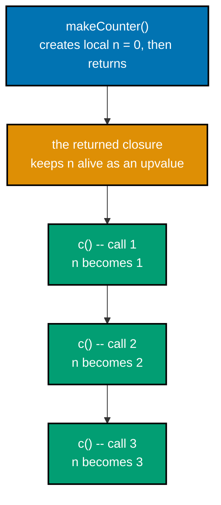
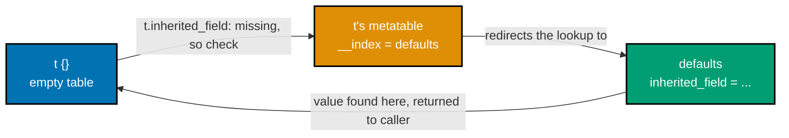
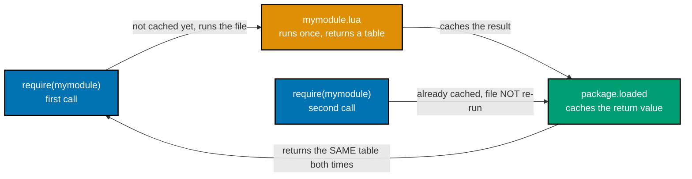

Examples 27-58 cover varargs, the `table` library (`insert`/`remove`/`concat`/`sort`), the `string` library's `format`/`sub`/`find`/`match`/`gmatch`/`gsub`, generic-`for` iterators, closures, recursion and higher-order functions, metatables for defaults, inheritance-style fallback, `__tostring`, and operator overloading, modules via `require`, and basic `pcall` error handling. Every example is a complete, self-contained `.lua` script colocated under `learning/code/`; run each one with `lua example.lua` from inside its own directory.

---

### Example 27: Varargs -- a Basic Sum Function

_ex-27 &middot; exercises co-09_

A trailing `...` parameter accepts any number of arguments. Packed into a table literal, `{...}`, the varargs become walkable like any other array.

**`learning/code/ex-27-varargs-basic-sum/example.lua`**

```lua
-- Example 27: varargs -- a basic sum function
local function sum(...)            -- => `...` declares a variable number of arguments
  local s = 0                      -- => accumulator starts at 0
  for _, v in ipairs({ ... }) do   -- => {...} packs the varargs into a table, then ipairs walks it
    s = s + v                      -- => accumulates each value into s
  end                               -- => closes the for-loop
  return s                         -- => returns the final total
end                                 -- => closes the function
print(sum(1, 2, 3))                -- => called with three arguments: 1, 2, 3
                                    -- => Output: 6
```

**Run**: `lua example.lua`

**Output**:

```text
6
```

**Key takeaway**: `...` in a parameter list captures any number of trailing arguments; `{...}` is the fastest way to turn them into a table you can iterate.

**Why it matters**: Varargs are how Lua functions accept a flexible number of arguments without an explicit array parameter -- `print` itself is a vararg function, which is why it accepts anywhere from zero to many values. Example 77 revisits this exact `{...}` packing pattern, and Example 28 shows the one case where packing into a table loses information that `select('#', ...)` preserves.

---

### Example 28: Varargs -- Counting with select('#', ...)

_ex-28 &middot; exercises co-09_

`select('#', ...)` returns the true argument count, including any `nil` arguments -- something `#{...}` cannot reliably do, since a table's length operator is undefined near `nil` holes.

**`learning/code/ex-28-varargs-select-count/example.lua`**

```lua
-- Example 28: varargs -- counting with select('#', ...)
local function count(...)
  return select('#', ...)          -- => select('#', ...) returns the ARGUMENT COUNT, including nils
end                                 -- => closes the function
print(count(1, nil, 3))            -- => three arguments passed, one of them nil
                                    -- => Output: 3
```

**Run**: `lua example.lua`

**Output**:

```text
3
```

**Key takeaway**: `select('#', ...)` is the reliable way to count varargs, including `nil`s -- `#{...}` is not, because table length is undefined near `nil` gaps.

**Why it matters**: This is a real, sharp-edged gotcha: packing `(1, nil, 3)` into `{...}` produces a table where `#t` could report `1` or `3` depending on implementation details, since the array part has a hole. `select('#', ...)` sidesteps the whole problem by counting arguments directly, before they are ever packed into a table -- reach for it whenever a `nil` argument is a legitimate possibility.

---

### Example 29: table.insert -- Append to the End

_ex-29 &middot; exercises co-17_

Called with two arguments, `table.insert(t, value)` appends `value` at position `#t + 1` -- the end of the sequence.

**`learning/code/ex-29-table-insert-append/example.lua`**

```lua
-- Example 29: table.insert -- append to the end
local t = { 1, 2 }                 -- => t is {1, 2}
table.insert(t, 3)                 -- => with 2 arguments, table.insert appends to the end (position #t + 1)
print(t[3])                        -- => Output: 3
```

**Run**: `lua example.lua`

**Output**:

```text
3
```

**Key takeaway**: `table.insert(t, value)` (two arguments) always appends; use the three-argument form (Example 30) to insert elsewhere.

**Why it matters**: `table.insert`/`table.remove` are the mutation primitives every array-like table operation is built from -- growing a list of buffer lines, appending to a plugin's queue of pending jobs, or building up a result set incrementally all start here.

---

### Example 30: table.insert -- Insert at a Specific Position

_ex-30 &middot; exercises co-17_

The three-argument form, `table.insert(t, pos, value)`, inserts `value` at index `pos`, shifting every existing element from `pos` onward one slot to the right.

**`learning/code/ex-30-table-insert-at-position/example.lua`**

```lua
-- Example 30: table.insert -- insert at a specific position
local t = { 1, 2, 3 }              -- => t is {1, 2, 3}
table.insert(t, 1, 0)              -- => with 3 arguments, table.insert(t, pos, value) inserts at pos
                                    -- => existing elements at pos 1+ shift right by one
print(t[1], t[2], t[3], t[4])      -- => Output: 0    1    2    3
```

**Run**: `lua example.lua`

**Output**:

```text
0 1 2 3
```

**Key takeaway**: The three-argument `table.insert(t, pos, value)` shifts everything at `pos` and beyond one slot right before writing the new value in.

**Why it matters**: This is an O(n) operation -- every element from `pos` onward has to move -- which matters if you are inserting into large sequences repeatedly. Knowing this shift happens explains why `table.insert(t, 1, x)` ("prepend") is more expensive than `table.insert(t, x)` ("append") for a long table.

---

### Example 31: table.remove -- Remove the Last Element

_ex-31 &middot; exercises co-17_

Called with one argument, `table.remove(t)` removes and returns the last element -- the array-shrinking mirror of Example 29's append.

**`learning/code/ex-31-table-remove-last/example.lua`**

```lua
-- Example 31: table.remove -- remove the last element
local t = { 1, 2, 3 }              -- => t is {1, 2, 3}
local v = table.remove(t)          -- => with 1 argument, table.remove removes and returns the LAST element
print(v, #t)                       -- => v is the removed value (3); #t shrinks from 3 to 2 -- Output: 3    2
```

**Run**: `lua example.lua`

**Output**:

```text
3 2
```

**Key takeaway**: `table.remove(t)` (one argument) pops the last element and returns it, shrinking `#t` by one -- Lua's stack-pop idiom.

**Why it matters**: `table.remove(t)` with no position argument is the idiomatic way to use a Lua table as a stack: `table.insert(t, x)` pushes, `table.remove(t)` pops. This pairing shows up in any code that needs a simple undo history, a pending-work stack, or a call-stack simulation.

---

### Example 32: table.remove -- Remove at a Specific Position

_ex-32 &middot; exercises co-17_

The two-argument form, `table.remove(t, pos)`, removes the element at `pos` and shifts every later element one slot to the left to close the gap.

**`learning/code/ex-32-table-remove-at-position/example.lua`**

```lua
-- Example 32: table.remove -- remove at a specific position
local t = { 1, 2, 3 }              -- => t is {1, 2, 3}
table.remove(t, 1)                 -- => removes the element at position 1; later elements shift left
print(t[1], t[2])                  -- => what was t[2]/t[3] are now t[1]/t[2] -- Output: 2    3
```

**Run**: `lua example.lua`

**Output**:

```text
2 3
```

**Key takeaway**: `table.remove(t, pos)` removes the element at `pos` and shifts everything after it left by one -- the removal mirror of Example 30's insert.

**Why it matters**: Together, Examples 29-32 cover the full mutation vocabulary for Lua sequences: append, insert-at, pop, and remove-at. All four keep the sequence contiguous (no `nil` holes), which is exactly the invariant `ipairs` (Example 22) and `#` (Example 19) depend on.

---

### Example 33: table.concat -- Join Array Elements into a String

_ex-33 &middot; exercises co-17_

`table.concat(t, sep)` joins every element of the array part into a single string, with `sep` inserted between elements.

**`learning/code/ex-33-table-concat-join/example.lua`**

```lua
-- Example 33: table.concat -- join array elements into a string
print(table.concat({ "a", "b", "c" }, ", ")) -- => joins with ", " as the separator
                                    -- => Output: a, b, c
```

**Run**: `lua example.lua`

**Output**:

```text
a, b, c
```

**Key takeaway**: `table.concat(t, sep)` is the reverse of building up a table one element at a time -- it flattens the array part back into one string.

**Why it matters**: `table.concat` is the standard way to join a list of buffer lines, path segments, or status-line pieces into one printable string, and it appears repeatedly later in this primer (Examples 34, 35, 82) as the way to make a table's contents visible in `print` output.

---

### Example 34: table.sort -- Default Ascending Order

_ex-34 &middot; exercises co-17_

`table.sort(t)` sorts the array part of `t` in place, using Lua's default `<` comparison.

**`learning/code/ex-34-table-sort-default-order/example.lua`**

```lua
-- Example 34: table.sort -- default ascending order
local t = { 3, 1, 2 }              -- => t is {3, 1, 2}, unsorted
table.sort(t)                      -- => sorts IN PLACE using the default `<` comparison
print(table.concat(t, ","))        -- => Output: 1,2,3
```

**Run**: `lua example.lua`

**Output**:

```text
1,2,3
```

**Key takeaway**: `table.sort(t)` mutates `t` in place using `<`; there is no "return a new sorted table" variant in the standard library.

**Why it matters**: This is the tool from Example 23's callout: any code that needs deterministic order over data gathered via `pairs` (which offers none) should collect the keys, then sort them with `table.sort` before iterating in that fixed order.

---

### Example 35: table.sort -- Custom Comparator Function

_ex-35 &middot; exercises co-05, co-17_

A second, optional function argument to `table.sort` overrides the default `<` comparison, letting you sort by any rule -- here, descending order.

**`learning/code/ex-35-table-sort-custom-comparator/example.lua`**

```lua
-- Example 35: table.sort -- custom comparator function
local t = { 3, 1, 2 }              -- => t is {3, 1, 2}, unsorted
table.sort(t, function(a, b) return a > b end)
                                    -- => passing a function as the second argument overrides the default order
                                    -- => `a > b` sorts descending instead of ascending
print(table.concat(t, ","))        -- => Output: 3,2,1
```

**Run**: `lua example.lua`

**Output**:

```text
3,2,1
```

**Key takeaway**: The comparator function `function(a, b) ... end` must return `true` exactly when `a` should sort before `b`; `a > b` reverses the usual ascending order into descending.

**Why it matters**: This is the first example that passes an anonymous function as an argument to a standard-library function -- the same first-class-function pattern (co-05) that Example 50's callback and Example 56's operator overload lean on. Custom comparators are essential the moment you sort tables of records rather than plain numbers or strings, where "less than" has no built-in meaning.

---

### Example 36: string.format -- Basic %s/%d Placeholders

_ex-36 &middot; exercises co-16_

`string.format` follows the same specifier syntax as C's `printf`: `%s` substitutes a string, `%d` substitutes an integer.

**`learning/code/ex-36-string-format-basic-placeholders/example.lua`**

```lua
-- Example 36: string.format -- basic %s/%d placeholders
print(string.format("%s is %d", "age", 36))
                                    -- => %s formats "age" as a string; %d formats 36 as an integer (C-printf-style)
                                    -- => Output: age is 36
```

**Run**: `lua example.lua`

**Output**:

```text
age is 36
```

**Key takeaway**: `string.format` follows C's `printf` specifier syntax; `%s` and `%d` are the two most common placeholders.

**Why it matters**: `string.format` is the go-to tool whenever `..` concatenation (Example 8) would get unwieldy -- building formatted log lines, error messages, or status-line text with several interpolated values reads far more clearly with one format string than with a chain of `..` operators.

---

### Example 37: string.format -- Float Width and Precision

_ex-37 &middot; exercises co-16_

`%5.2f` combines a field width (5) with a decimal precision (2 digits after the point), padding the result with leading spaces to reach the requested width.

**`learning/code/ex-37-string-format-float-width-precision/example.lua`**

```lua
-- Example 37: string.format -- float width and precision
print(string.format("%5.2f", 3.14159))
                                    -- => %5.2f: total field width 5, 2 decimal digits -- rounds to "3.14", padded
                                    -- => Output:  3.14  (one leading space, then 3.14)
```

**Run**: `lua example.lua`

**Output**:

```text
 3.14
```

**Key takeaway**: In `%W.Pf`, `W` is the minimum total field width and `P` is the digit count after the decimal point; the result is right-padded with spaces to reach `W`.

**Why it matters**: Width and precision specifiers are what make `string.format` suitable for aligned tabular output -- lining up a column of numbers in a status line or a `:messages` report needs exactly this kind of fixed-width formatting, not manual space-counting.

---

### Example 38: string.sub -- Extract a Substring by Range

_ex-38 &middot; exercises co-16_

`string.sub(s, i, j)` extracts the characters from index `i` to `j`, inclusive, using Lua's 1-based indexing.

**`learning/code/ex-38-string-sub-substring-range/example.lua`**

```lua
-- Example 38: string.sub -- extract a substring by range
print(string.sub("hello world", 1, 5))
                                    -- => string.sub(s, i, j) extracts characters i..j inclusive, 1-based indexing
                                    -- => Output: hello
```

**Run**: `lua example.lua`

**Output**:

```text
hello
```

**Key takeaway**: `string.sub(s, i, j)` is inclusive on both ends and 1-indexed, matching every other Lua indexing rule seen so far.

**Why it matters**: `string.sub` is the workhorse for pulling apart fixed-format strings -- file extensions, prefixes, or a known-length header -- without reaching for a pattern. Example 39 extends it with negative indices, the other half of its indexing vocabulary.

---

### Example 39: string.sub -- Negative Index, Colon Syntax

_ex-39 &middot; exercises co-12, co-16_

A negative index to `string.sub` counts backward from the end of the string. This example also introduces colon-call syntax on a string literal: `("hello"):sub(-3)`.

**`learning/code/ex-39-string-sub-negative-index-colon-syntax/example.lua`**

```lua
-- Example 39: string.sub -- negative index, called with colon syntax
print(("hello"):sub(-3))           -- => colon-call sugar for string.sub("hello", -3); -3 counts from the end
                                    -- => Output: llo
```

**Run**: `lua example.lua`

**Output**:

```text
llo
```

**Key takeaway**: `-1` is the last character, `-2` the second-to-last, and so on; `("hello"):sub(-3)` is exactly `string.sub("hello", -3)`.

**Why it matters**: This is the first colon-syntax example in the primer (co-12): `obj:method(args)` is sugar for `obj.method(obj, args)`, and it works on any value with a string metatable -- including string literals wrapped in parentheses. Examples 40, 41, and 65-67 all lean on this same colon-call sugar, first for strings and later for full OOP method calls.

---

### Example 40: string.upper/lower via Colon Syntax

_ex-40 &middot; exercises co-12, co-16_

`string.upper`/`string.lower` convert case; called through colon syntax, they read almost like a method call on the string value itself.

**`learning/code/ex-40-string-upper-lower-colon-syntax/example.lua`**

```lua
-- Example 40: string.upper/lower via colon syntax
print(("Neovim"):upper(), ("Neovim"):lower())
                                    -- => colon-call sugar for string.upper("Neovim")/string.lower("Neovim")
                                    -- => Output: NEOVIM    neovim
```

**Run**: `lua example.lua`

**Output**:

```text
NEOVIM neovim
```

**Key takeaway**: Every function in the `string` library is callable through colon syntax on a string value, since strings carry a metatable whose `__index` points at the `string` table.

**Why it matters**: This is a direct, concrete preview of the exact metatable mechanism (`__index`) that Examples 53-56 and 65-67 teach explicitly for user-defined tables: strings are proof that `__index`-powered method syntax is not special-cased Lua magic, it is the same general mechanism every table can opt into.

---

### Example 41: string.rep -- Repeat a String

_ex-41 &middot; exercises co-16_

`string.rep(s, n)` concatenates `n` copies of `s` together, with no separator by default.

**`learning/code/ex-41-string-rep-repeat/example.lua`**

```lua
-- Example 41: string.rep -- repeat a string
print(string.rep("ab", 3))         -- => concatenates "ab" with itself 3 times, no separator by default
                                    -- => Output: ababab
```

**Run**: `lua example.lua`

**Output**:

```text
ababab
```

**Key takeaway**: `string.rep(s, n)` is `s` concatenated with itself `n` times; a fourth, optional separator argument (not shown here) inserts a string between repetitions.

**Why it matters**: `string.rep` is the simplest way to build a horizontal rule, an indentation prefix, or padding of a known width -- small, common utility work that a manual loop with `..` would otherwise handle far more verbosely.

---

### Example 42: string.find -- Locate a Substring

_ex-42 &middot; exercises co-16_

`string.find` returns the start and end byte indices of the first match, as two separate return values -- the same multiple-return pattern from Example 26.

**`learning/code/ex-42-string-find-plain-search/example.lua`**

```lua
-- Example 42: string.find -- locate a substring
print(string.find("hello world", "world"))
                                    -- => string.find returns START and END byte indices of the first match
                                    -- => Output: 7    11
```

**Run**: `lua example.lua`

**Output**:

```text
7 11
```

**Key takeaway**: `string.find(s, pattern)` returns two values -- the start and end byte position of the first match -- or `nil` if there is no match.

**Why it matters**: `string.find`'s second argument is actually a Lua _pattern_ (co-16), not a plain substring, though a literal string like `"world"` happens to work identically either way. Example 43 shows the pattern syntax doing real work with captures, which is where `string.find`'s pattern-matching nature stops being invisible.

---

### Example 43: string.match -- Pattern Captures

_ex-43 &middot; exercises co-16_

`string.match` applies a Lua pattern and returns each parenthesized capture group as a separate value, instead of the whole match.

**`learning/code/ex-43-string-match-pattern-captures/example.lua`**

```lua
-- Example 43: string.match -- pattern captures
print(string.match("key=value", "(%w+)=(%w+)"))
                                    -- => %w+ matches alphanumerics; each (...) is a CAPTURE returned separately
                                    -- => Output: key    value
```

**Run**: `lua example.lua`

**Output**:

```text
key value
```

**Key takeaway**: `%w+` matches a run of alphanumeric characters; each `(...)` group in the pattern becomes its own return value from `string.match`.

**Why it matters**: Lua patterns are a lightweight, non-POSIX matching dialect (co-16) -- smaller and faster than full regular expressions, but with a different, Lua-specific character-class syntax (`%w`, `%a`, `%d`, `%s`, and their upper-case complements). Example 74's anchored, multi-capture date parser is the natural extension of the exact pattern this example introduces.

---

### Example 44: string.gmatch -- Iterate Over Every Match

_ex-44 &middot; exercises co-16_

`string.gmatch` returns an iterator function suitable for a generic `for` loop, yielding every non-overlapping match of a pattern in turn.

**`learning/code/ex-44-string-gmatch-word-iteration/example.lua`**

```lua
-- Example 44: string.gmatch -- iterate over every match
for word in string.gmatch("one two three", "%a+") do
                                    -- => gmatch returns an iterator over every non-overlapping match
                                    -- => %a+ matches one-or-more letters, so it yields each word in turn
  io.write(word, "|")              -- => writes each word followed by a literal pipe, no newline
end
print()                            -- => trailing newline for clean output
                                    -- => Output: one|two|three|
```

**Run**: `lua example.lua`

**Output**:

```text
one|two|three|
```

**Key takeaway**: `string.gmatch(s, pattern)` is the "find every match" counterpart to `string.match`'s "find the first match," designed to drive a `for` loop directly.

**Why it matters**: `gmatch` is the natural tool for tokenizing a string -- splitting a command line into words, a comma-separated value into fields, or a log line into columns -- without hand-writing an index-tracking loop. Example 46 shows the more general shape of a generic-`for` iterator that `gmatch` is itself an instance of.

---

### Example 45: string.gsub -- Substitution with a Replacement Count

_ex-45 &middot; exercises co-16_

`string.gsub` replaces every pattern match with a replacement string, returning two values: the new string, and how many substitutions were made.

**`learning/code/ex-45-string-gsub-substitution-count/example.lua`**

```lua
-- Example 45: string.gsub -- substitution with a replacement count
local s, n = string.gsub("hello world", "o", "0")
                                    -- => gsub returns TWO values: the new string, and the substitution count
                                    -- => every "o" is replaced with "0": "hell0 w0rld"
                                    -- => two substitutions were made, so n is 2
print(s, n)                        -- => Output: hell0 w0rld    2
```

**Run**: `lua example.lua`

**Output**:

```text
hell0 w0rld 2
```

**Key takeaway**: `string.gsub(s, pattern, repl)` returns both the substituted string and a count -- discard the count with `local s = (string.gsub(...))` (parentheses truncate to one value) when you only need the string.

**Why it matters**: The substitution count return value is genuinely useful on its own -- verifying that a search-and-replace touched the expected number of occurrences is a common sanity check. This closes the `string` library section of the primer: Examples 36-45 now cover `format`, `sub`, `upper`/`lower`, `rep`, `find`, `match`, `gmatch`, and `gsub`, the everyday span of co-16's pattern-and-format vocabulary.

---

### Example 46: Generic For-Loop with a Custom Stateless Iterator

_ex-46 &middot; exercises co-05_

A generic `for` loop calls three values -- an iterator function, a state, and a control variable -- repeatedly, until the iterator returns `nil`. This example writes that triplet by hand.

**`learning/code/ex-46-generic-for-stateless-iterator/example.lua`**

```lua
-- Example 46: generic for-loop with a custom stateless iterator
local function range(n)            -- => returns an (iterator-function, state, control-variable) triplet
  local function iter(_, i)        -- => the iterator itself: takes (state, control), returns the next value
    i = i + 1                      -- => advances the control variable by one
    if i <= n then return i end    -- => returns nil (implicitly) once past n, ending the loop
  end                               -- => closes iter
  return iter, nil, 0              -- => no shared state needed; control starts at 0
end                                 -- => closes range
for i in range(3) do                -- => `for` calls iter(state, control) repeatedly until it returns nil
  print(i)                          -- => no closure involved -- range()'s state lives in the returned triplet
end                                  -- => closes the for-loop
                                     -- => Output line 1: 1
                                     -- => Output line 2: 2
                                     -- => Output line 3: 3
```

**Run**: `lua example.lua`

**Output**:

```text
1
2
3
```

**Key takeaway**: `for var in f, s, ctrl do ... end` calls `f(s, ctrl)` on every pass, using its first return value as both the loop variable and the next `ctrl` -- `ipairs`, `pairs`, and `gmatch` are all just pre-built triplets of this exact shape.

**Why it matters**: Once this triplet mechanism clicks, `ipairs` (Example 22), `pairs` (Example 23), and `gmatch` (Example 44) all stop looking like separate special-cased loop forms and become recognizable as three specific iterator functions plugged into the same generic `for` protocol. Example 70 revisits this exact protocol with a coroutine standing in for the hand-written `iter` function.

---

### Example 47: Closures -- a Counter Factory

_ex-47 &middot; exercises co-07_

A function defined inside another function, referencing a `local` from the enclosing scope, keeps that variable alive as an "upvalue" even after the outer function has returned. This is a closure.



**`learning/code/ex-47-closures-counter-factory/example.lua`**

```lua
-- Example 47: closures -- a counter factory
local function makeCounter()       -- => a function that BUILDS and returns another function
  local n = 0                      -- => n is local to makeCounter's call, not global
  return function()                -- => this inner function is a CLOSURE: it captures n as an upvalue
    n = n + 1                      -- => mutates the captured n on every call
    return n                       -- => returns the new count
  end                               -- => closes the inner closure
end                                 -- => closes makeCounter
local c = makeCounter()            -- => c is the closure; n keeps living on as its private state
print(c(), c(), c())               -- => each call mutates the SAME captured n, surviving between calls
                                    -- => Output: 1    2    3
```

**Run**: `lua example.lua`

**Output**:

```text
1 2 3
```

**Key takeaway**: A closure keeps its captured `local` variables alive as long as the closure itself is reachable, even though the function that originally declared them has already returned.

**Why it matters**: This is the mechanism behind memoization (Example 75), private state without a full class (this example itself), and the `n`-adding closure of Example 51. Closures are how Lua achieves "objects with private fields" without ever introducing a dedicated `private` keyword -- the enclosing scope's `local`s simply become the private state.

---

### Example 48: Closures -- Independent Instances

_ex-48 &middot; exercises co-07_

Every call to `makeCounter()` creates a brand-new `local n`, so every closure it returns has its own private, independent state.

**`learning/code/ex-48-closures-independent-instances/example.lua`**

```lua
-- Example 48: closures -- independent instances
local function makeCounter()       -- => builds a fresh closure with its own private n each call
  local n = 0                      -- => n is local to THIS call of makeCounter
  return function()                -- => the returned closure captures this call's n
    n = n + 1                      -- => mutates the captured n
    return n                       -- => returns the new count
  end                               -- => closes the inner closure
end                                 -- => closes makeCounter
local c1 = makeCounter()           -- => c1 gets its OWN private n, separate from any other counter
local c2 = makeCounter()           -- => c2 gets a SECOND, independent n
print(c1(), c1(), c2())            -- => c1 is called twice (n: 1, then 2); c2 is called once (n: 1)
                                    -- => Output: 1    2    1
```

**Run**: `lua example.lua`

**Output**:

```text
1 2 1
```

**Key takeaway**: Each call to a closure-returning function allocates a fresh set of upvalues -- closures from different calls never share state, even though they came from the same source code.

**Why it matters**: This distinguishes a closure's private state from a shared global or module-level variable (co-14's `require` caching, Example 57, is the opposite case -- one shared table for every caller). Recognizing which pattern a piece of code needs -- "one shared instance" versus "a fresh instance every time" -- is a design decision this pair of examples makes concrete.

---

### Example 49: Function Recursion -- Factorial

_ex-49 &middot; exercises co-05_

`local function` (rather than `local f = function`) makes the function's own name visible inside its body, which is what lets it call itself.

**`learning/code/ex-49-function-recursion-factorial/example.lua`**

```lua
-- Example 49: function recursion -- factorial
local function fact(n)             -- => `local function` (not `local fact = function`) lets fact call ITSELF
  if n == 0 then                   -- => base case check
    return 1                       -- => base case: 0! is 1
  else                              -- => recursive case
    return n * fact(n - 1)         -- => n! is n times (n-1)!
  end                               -- => closes the if/else
end                                 -- => closes the function
print(fact(5))                     -- => 5 * 4 * 3 * 2 * 1 = 120
                                    -- => Output: 120
```

**Run**: `lua example.lua`

**Output**:

```text
120
```

**Key takeaway**: `local function fact(n) ... end` is sugar for declaring `local fact` first, then assigning it a function that can reference itself by name -- try `local fact = function(n) ... fact(n-1) ... end` instead and the inner `fact` refers to a not-yet-existing local (or a stray global).

**Why it matters**: This is the same "forward declaration" subtlety that this primer's own authoring process hit directly while building Example 71 (a coroutine referencing itself by a captured local) -- getting `local function` right the first time avoids a real, easy-to-make bug where a self-referencing closure silently captures a global instead of the intended local.

---

### Example 50: Passing a Function as a Callback Argument

_ex-50 &middot; exercises co-05_

Because functions are ordinary values, they can be passed as arguments to other functions -- including anonymous functions defined inline at the call site.

**`learning/code/ex-50-function-as-callback-argument/example.lua`**

```lua
-- Example 50: passing a function as a callback argument
local function apply(f, x)         -- => f is an ordinary parameter that happens to hold a function value
  return f(x)                      -- => calls whatever function was passed, with x as its argument
end
print(apply(function(x) return x * x end, 5))
                                    -- => an anonymous function is passed directly as the first argument
                                    -- => apply calls it with x=5, squaring: 25
                                    -- => Output: 25
```

**Run**: `lua example.lua`

**Output**:

```text
25
```

**Key takeaway**: An anonymous `function(x) ... end` literal can be passed directly where a function value is expected -- there is no need to name and declare it separately first.

**Why it matters**: Callback-style APIs are everywhere in Neovim's Lua surface: `vim.keymap.set`'s third argument (Example 80), `table.sort`'s comparator (Example 35), and `vim.tbl_map`'s transform function (Example 79) are all this exact pattern -- a function value handed to another function, to be called back later.

---

### Example 51: a Function Returning a Function -- Adder

_ex-51 &middot; exercises co-05, co-07_

Combining first-class functions with closures produces a function _factory_: `adder(5)` returns a new, specialized function that always adds 5.

**`learning/code/ex-51-function-returning-function-adder/example.lua`**

```lua
-- Example 51: a function returning a function -- adder
local function adder(n)            -- => adder takes n and returns a NEW function specialized to that n
  return function(x)               -- => this closure captures n as an upvalue
    return x + n                   -- => adds the captured n to whatever x is passed later
  end                               -- => closes the inner closure
end                                 -- => closes adder
local add5 = adder(5)              -- => add5 is a closure that always adds 5
print(add5(10))                    -- => 10 + 5
                                    -- => Output: 15
```

**Run**: `lua example.lua`

**Output**:

```text
15
```

**Key takeaway**: `adder(5)` returns a new function specialized to `n = 5` via closure capture -- this is how Lua builds configurable, reusable function templates without classes.

**Why it matters**: This pattern -- a function that returns a function tailored by its arguments -- is common in real Neovim config code for building keymap callbacks or autocommand handlers that share logic but differ by one or two captured parameters, avoiding near-duplicate function bodies.

---

### Example 52: a Table Mixing Array and Map Entries

_ex-52 &middot; exercises co-04_

A single table literal can carry both an array part (`{1, 2, 3}`) and a map part (`{name = "mix"}`) at once -- they coexist without conflict.

**`learning/code/ex-52-table-mixed-array-and-map/example.lua`**

```lua
-- Example 52: a table mixing array and map entries
local t = { 1, 2, 3, name = "mix" } -- => the array part {1, 2, 3} and hash part {name=...} coexist in ONE table
print(#t, t.name)                  -- => #t counts only the contiguous integer-keyed part: 3
                                    -- => t.name reads the string-keyed part: "mix"
                                    -- => Output: 3    mix
```

**Run**: `lua example.lua`

**Output**:

```text
3 mix
```

**Key takeaway**: `#t` only ever reports the contiguous-integer-keyed "array part" of a table; string keys like `name` live entirely separately in the "hash part" and never affect `#t`.

**Why it matters**: This is co-04's array-part-vs-hash-part concept made completely concrete: one table, two independent views, walked by two independent tools (`ipairs` for the array part, `pairs` for everything). Real config tables mix both constantly -- a list of plugin names alongside named configuration options in the very same table -- and this example is the minimal case that shows why that mixing is completely safe.

---

### Example 53: Metatable \_\_index as a Function -- Default Values

_ex-53 &middot; exercises co-10, co-11_

`setmetatable` attaches a metatable to a table. When `__index` is a function, it is called on every failed key lookup, letting you synthesize a default value instead of returning `nil`.

**`learning/code/ex-53-metatable-index-function-default/example.lua`**

```lua
-- Example 53: metatable __index as a function -- default values
local t = {}                       -- => t starts as an empty table
setmetatable(t, { __index = function() return "N/A" end })
                                    -- => __index as a FUNCTION is called on any failed lookup: (table, key)
print(t.missing)                   -- => t.missing isn't in t, so __index fires and returns "N/A"
                                    -- => Output: N/A
```

**Run**: `lua example.lua`

**Output**:

```text
N/A
```

**Key takeaway**: `setmetatable(t, { __index = fn })` calls `fn(t, key)` whenever `t[key]` would otherwise return `nil` -- the only trigger is a _missing_ key, never an existing one.

**Why it matters**: This is the primer's first metamethod, and metatables are the mechanism behind nearly everything in the rest of this tier and the next one: operator overloading (Example 56), custom string conversion (Example 55), and the whole of Lua's OOP story (Examples 65-67) all start from `setmetatable` and a single metamethod field.

---

### Example 54: Metatable \_\_index as a Table -- Inheritance-Style Fallback

_ex-54 &middot; exercises co-10, co-11_

When `__index` is a table instead of a function, a failed lookup redirects to that table -- the mechanism Lua uses to fake inheritance and shared defaults.



**`learning/code/ex-54-metatable-index-table-inheritance/example.lua`**

```lua
-- Example 54: metatable __index as a table -- inheritance-style fallback
local defaults = { inherited_field = "from-defaults" } -- => a plain table of fallback values
local t = {}                       -- => t starts empty; it has no inherited_field of its own
setmetatable(t, { __index = defaults }) -- => __index as a TABLE redirects failed lookups to that table
print(t.inherited_field)           -- => t.inherited_field isn't in t, so the lookup falls through to defaults
                                    -- => Output: from-defaults
```

**Run**: `lua example.lua`

**Output**:

```text
from-defaults
```

**Key takeaway**: `__index = someTable` chains a failed lookup on `t` to `someTable` instead -- the table version of Example 53's function version, and the exact building block Examples 65-67 use for classes and inheritance.

**Why it matters**: This is precisely the "config-value store with defaults" shape the intra-topic capstone builds on: a small table of user-provided overrides, backed by a `__index`-linked table of defaults, so any key the user never set still resolves correctly. It is also literally how Example 66's `Dog`-inherits-from-`Animal` chain works, one link further.

---

### Example 55: Metatable \_\_tostring -- Customizing print()

_ex-55 &middot; exercises co-10_

`__tostring` is called whenever a value needs to be converted to a string -- including implicitly, inside `print`.

**`learning/code/ex-55-metatable-tostring-custom-print/example.lua`**

```lua
-- Example 55: metatable __tostring -- customizing print()
local p = { x = 1, y = 2 }          -- => a plain table with x and y fields
setmetatable(p, {                   -- => attaches a metatable with one metamethod
  __tostring = function(p) return "Point(" .. p.x .. "," .. p.y .. ")" end,
})                                  -- => __tostring is called whenever the value is coerced to a string
print(p)                           -- => print() calls tostring() on each argument internally
                                    -- => Output: Point(1,2)
```

**Run**: `lua example.lua`

**Output**:

```text
Point(1,2)
```

**Key takeaway**: Without `__tostring`, `print(p)` would show an opaque address like `table: 0x...`; with it, `print` displays whatever readable string your metamethod builds.

**Why it matters**: `__tostring` is what makes custom Lua "objects" debuggable at a glance -- printing a `Vector`, a config record, or a plugin's internal state object during development is far more useful with a readable `__tostring` than with a raw table-address dump.

---

### Example 56: Metatable \_\_add -- Operator Overloading

_ex-56 &middot; exercises co-10_

`__add` (and its siblings `__sub`, `__mul`, and so on) is called whenever a table value meets an arithmetic operator, letting user-defined types respond to `+` like a built-in number.

**`learning/code/ex-56-metatable-add-operator-overload/example.lua`**

```lua
-- Example 56: metatable __add -- operator overloading
local Vector = {}                  -- => the class table doubles as the metatable
Vector.__index = Vector            -- => failed instance lookups fall back to Vector itself
function Vector.new(x, y) return setmetatable({ x = x, y = y }, Vector) end -- => constructor
Vector.__add = function(a, b)      -- => __add is called whenever two Vector values meet the `+` operator
  return Vector.new(a.x + b.x, a.y + b.y) -- => builds a new Vector from the componentwise sum
end                                 -- => closes __add
local v1 = Vector.new(1, 2)        -- => first operand
local v2 = Vector.new(3, 4)        -- => second operand
print((v1 + v2).x)                 -- => v1 + v2 invokes __add, producing Vector(4, 6); .x reads the field
                                    -- => Output: 4
```

**Run**: `lua example.lua`

**Output**:

```text
4
```

**Key takeaway**: `Vector.__add = function(a, b) ... end` makes `v1 + v2` call that function automatically -- Lua checks for a metamethod on either operand whenever an operator has no built-in meaning for the values involved.

**Why it matters**: Operator overloading turns a plain table into something that reads and behaves like a value type -- vectors, durations, or version numbers all become natural to add, compare, or combine with ordinary operator syntax instead of named methods like `.add(other)`. It is also a preview of `__eq` and `__call` (Examples 63-64), the two other operator-family metamethods this primer covers.

---

### Example 57: Modules -- require() Returns and Caches the Module's Table

_ex-57 &middot; exercises co-14_

`require(name)` runs `name.lua` once, caches whatever it returns, and hands back that same cached value on every later call -- the entire contract of a Lua module.



**`learning/code/ex-57-modules-require-return-table-and-caching/mymodule.lua`**

```lua
-- A minimal module: it RETURNS a table, which is the whole contract of a Lua module
return {
  greet = function() return "hi" end, -- => one function field, exposed to callers of require()
}
```

**`learning/code/ex-57-modules-require-return-table-and-caching/example.lua`**

```lua
-- Example 57: modules -- require() returns and caches the module's table
local m1 = require("mymodule")     -- => runs mymodule.lua and caches its RETURN VALUE in package.loaded
local m2 = require("mymodule")     -- => does NOT re-run the file; returns the SAME cached table
print(m1.greet(), m1 == m2)        -- => m1.greet() calls the function stored in the module's table: "hi"
                                    -- => m1 == m2 is true because both are the identical cached table
                                    -- => Output: hi    true
```

**Run**: `lua example.lua` (run from inside `ex-57-modules-require-return-table-and-caching/`, so `mymodule.lua` is on Lua's default search path)

**Output**:

```text
hi true
```

**Key takeaway**: A Lua module is nothing more than a file that `return`s a table (or a function, or any value); `require` finds that file via `package.path`, runs it exactly once, and caches the result in `package.loaded`.

**Why it matters**: This caching is why `require`ing the same module from ten different files never re-runs that module's top-level setup code ten times, and why every caller sees the exact same table -- mutating a field on `m1` is visible through `m2` too, since they are literally the same object. This is the module system the primer's intra-topic capstone builds directly on, wiring a `require`d `store` module together with the `__index`-based defaults from Example 54.

---

### Example 58: error() with a Message, Caught by pcall()

_ex-58 &middot; exercises co-13_

`pcall` calls a function in "protected mode," converting any error it raises into a clean `false, err` pair instead of crashing the whole program. `error()` is how that error gets raised in the first place.

**`learning/code/ex-58-error-raise-with-message-and-pcall/example.lua`**

```lua
-- Example 58: error() with a message, caught by pcall()
local ok, err = pcall(function()   -- => pcall calls its function argument in PROTECTED mode
  error("boom")                    -- => error() raises a Lua error carrying the value "boom"
end)                                -- => closes the protected function
print(ok, err)                     -- => ok is false since the protected call raised an error
                                    -- => err is "boom" prefixed with "file:line:" by default (level 1)
                                    -- => Output: false    example.lua:3: boom
```

**Run**: `lua example.lua`

**Output**:

```text
false example.lua:3: boom
```

**Key takeaway**: `pcall(f)` returns `true, results...` on success or `false, err` if `f` raised an error; `error(msg)` (message a string, default level 1) automatically prefixes `msg` with the raising file and line.

**Why it matters**: `pcall` is Lua's only structured way to recover from an error without the whole script (or the whole Neovim session, for config code) crashing -- it is the direct equivalent of a `try`/`catch` block. The exact `"file:line:"` prefix shown above was verified by actually running this script rather than assumed, since Lua's position-prefixing behavior depends on the error's exact source line -- get this detail wrong and the documented output would never match what a reader sees on their own machine.

---

← Previous: [Beginner Examples](./beginner.md) · Next: [Advanced Examples](./advanced.md) →
