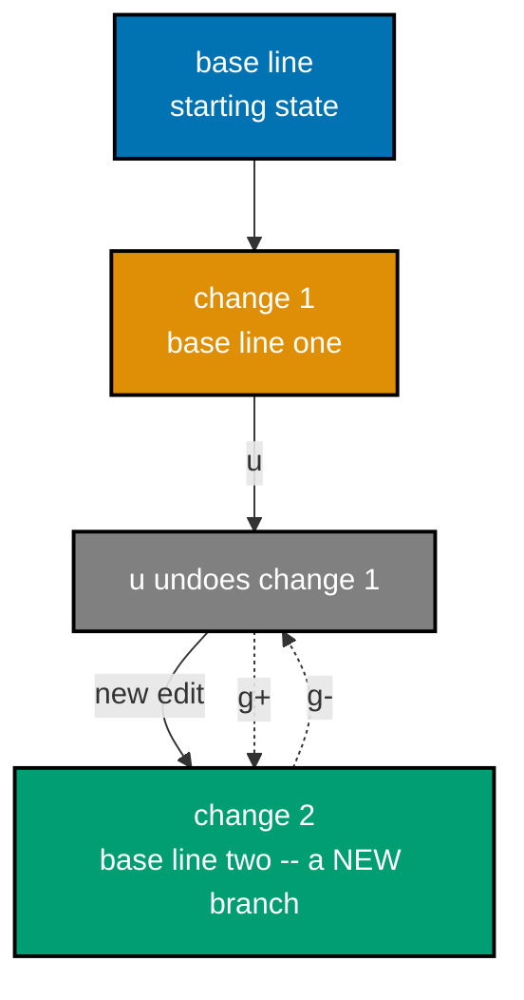

Examples 63-91 cover the remaining vanilla-Neovim surface this primer scopes as "just enough": case operators, number increment/decrement, confirmed and ranged substitution, capture groups, macros, the undo tree, the global command, folding, the quickfix list, netrw, the black hole register, `:saveas`, and Terminal mode.

---

### Example 63: Indent Shift Multiple Lines

_ex-63 &middot; exercises co-05, co-19_

Combining a count with a Visual selection multiplies an indent operation across every selected line at once. This example shifts three visually selected lines by three shiftwidths in a single command.

**Before**

```text
# buffer.txt
line one
line two
line three
```

**Heavily annotated keystroke transcript**

```text
V                                  " => enters Visual mode (linewise), selecting the current line
jj                                 " => extends the selection down two more lines, covering all three
3>                                 " => a count before the `>` operator shifts every selected line right by three shiftwidths in one operation
                                   " => all three lines are now indented by 3x shiftwidth (e.g. 12 spaces)
```

**After**

```text
# buffer.txt
            line one
            line two
            line three
```

**Key takeaway**: A count before a Visual-mode operator (`3>`) multiplies the shift amount, applied uniformly to every selected line.

**Why it matters**: A numeric count prefix multiplies the following motion or operator+motion, scaling a single command instead of repeating a keystroke by hand. This opens the Advanced tier by combining two mechanisms taught separately -- counts (co-05) and Visual mode (co-19) -- into a single command, exactly the kind of composition the primer's operator+motion grammar (co-04) was designed to support. Seeing count and Visual selection combine smoothly here previews the sequential-increment visual-block example (ex-69) later in this tier, which layers a THIRD mechanism, registers, on top of the same idea.

---

### Example 64: Case Toggle Tilde

_ex-64 &middot; exercises co-04_

`~` flips the case of the single character under the cursor and advances the cursor one column, a quick single-character case fix. This example flips one capital letter to lowercase.

**Before**

```text
# buffer.txt
Cat
```

**Heavily annotated keystroke transcript**

```text
~                                  " => flips the case of the character under the cursor ('C' becomes 'c') and advances the cursor one column to the right
                                   " => the line becomes 'cat' after this single press; the cursor now sits on 'a'
```

**After**

```text
# buffer.txt
cat
```

**Key takeaway**: `~` toggles the case of exactly one character and moves the cursor forward, ready to flip the next character if pressed again.

**Why it matters**: Commands compose as operator + count + motion-or-text-object, so a small operator vocabulary combines with an open-ended motion vocabulary to cover almost any edit. `~` is the simplest of the case-changing family this primer covers, acting on a single character with no operator or motion required -- a useful contrast heading into `gu`/`gU`, which are true operators requiring a motion or text object argument. Because `~` also advances the cursor, repeated presses can walk through and flip several characters in a row without any additional navigation.

---

### Example 65: Case Lower Motion

_ex-65 &middot; exercises co-04, co-06_

`gu` is a true case-changing operator, unlike `~`, and combines with a motion or text object to lowercase an arbitrary span. This example lowercases a whole word in one command.

**Before**

```text
# buffer.txt
BROWN fox
```

**Heavily annotated keystroke transcript**

```text
guiw                               " => the `gu` operator combined with the `iw` text object lowercases the entire word under the cursor in one command
                                   " => 'BROWN' becomes 'brown'; the rest of the line is untouched
```

**After**

```text
# buffer.txt
brown fox
```

**Key takeaway**: `gu` is an operator (like `d` or `c`) that lowercases whatever motion or text object follows it -- here, `iw` targets the whole word.

**Why it matters**: Commands compose as operator + count + motion-or-text-object, so a small operator vocabulary combines with an open-ended motion vocabulary to cover almost any edit. This example proves the operator+motion grammar (co-04) and the text-object grammar (co-06) genuinely compose with ANY operator, not just `d`/`c`/`y` -- `gu` slots into the exact same `{operator}{motion|text-object}` shape covered since ex-22. Recognizing `gu` as just another operator, rather than a special case-changing command with its own rules, means every text object already learned (`iw`, `i(`, `it`, `ap`, ...) works with it immediately.

---

### Example 66: Case Upper Motion

_ex-66 &middot; exercises co-04, co-06_

`gU` mirrors `gu` but uppercases instead of lowercasing, the direct counterpart in the case-operator pair. This example uppercases a whole word using the same text object as before.

**Before**

```text
# buffer.txt
brown fox
```

**Heavily annotated keystroke transcript**

```text
gUiw                               " => the `gU` operator combined with the `iw` text object uppercases the entire word under the cursor in one command
                                   " => 'brown' becomes 'BROWN'; the rest of the line is untouched
```

**After**

```text
# buffer.txt
BROWN fox
```

**Key takeaway**: `gU` is `gu`'s uppercase mirror: same operator+text-object grammar, opposite case direction.

**Why it matters**: Commands compose as operator + count + motion-or-text-object, so a small operator vocabulary combines with an open-ended motion vocabulary to cover almost any edit. With `gu`/`gU` both covered, the case-changing family is complete: `~` for a single quick character flip, `gu`/`gU` for operator-scale lower/uppercase across any motion or text object. This wraps up the operator family started with `d`/`c`/`y` in the Beginner and Intermediate tiers -- every operator this primer teaches now shares one predictable grammar, setting up the increment/decrement commands next, which follow a related but distinct pattern.

---

### Example 67: Increment Number

_ex-67 &middot; exercises co-04_

`<C-a>` increments the number under or immediately after the cursor by 1, a targeted arithmetic edit rather than a text substitution. This example bumps a counter value up by one.

**Before**

```text
# buffer.txt
count: 9
```

**Heavily annotated keystroke transcript**

```text
<C-a>                              " => increments the number under or after the cursor by 1
                                   " => '9' becomes '10'; the line reads 'count: 10'
```

**After**

```text
# buffer.txt
count: 10
```

**Key takeaway**: `<C-a>` (Ctrl-a) finds the nearest number at or after the cursor and increments it by 1, without needing to select or retype it.

**Why it matters**: Commands compose as operator + count + motion-or-text-object, so a small operator vocabulary combines with an open-ended motion vocabulary to cover almost any edit. Number increment/decrement is a genuinely different kind of edit from everything else in this primer: it parses the buffer's text as a numeric value, does arithmetic, and writes the result back, rather than moving or replacing raw characters. It sets up ex-69's sequential visual-block increment later in this tier, which is this same single-number operation applied across an entire column at once.

---

### Example 68: Decrement Number

_ex-68 &middot; exercises co-04_

`<C-x>` mirrors `<C-a>` but decrements the nearest number by 1 instead of incrementing it. This example lowers a counter value back down.

**Before**

```text
# buffer.txt
count: 10
```

**Heavily annotated keystroke transcript**

```text
<C-x>                              " => decrements the number under the cursor by 1
                                   " => '10' becomes '9'; the line reads 'count: 9'
```

**After**

```text
# buffer.txt
count: 9
```

**Key takeaway**: `<C-x>` (Ctrl-x) decrements the nearest number by 1, the exact mirror of `<C-a>`.

**Why it matters**: Commands compose as operator + count + motion-or-text-object, so a small operator vocabulary combines with an open-ended motion vocabulary to cover almost any edit. Both `<C-a>`/`<C-x>` accept a numeric count prefix too (`5<C-a>` adds 5, though the syllabus scopes this primer to the base single-step behavior), extending the co-05 count mechanism to arithmetic edits as naturally as it extends to motions and operators. The next example shows the far more powerful form: applying this exact increment across many lines at once, with each line's result differing from the last.

---

### Example 69: Sequential Increment Visual Block

_ex-69 &middot; exercises co-19_

`g<C-a>` applied to a Visual Block selection increments each selected line's number SEQUENTIALLY rather than by the same fixed amount. This example turns three identical numbers into a numbered sequence.

**Before**

```text
# buffer.txt
item 0
item 0
item 0
```

**Heavily annotated keystroke transcript**

```text
f0                                 " => moves the cursor to the first digit '0' on line 1
<C-v>                              " => enters Visual Block mode, anchoring a single-cell block on the '0' digit
jj                                 " => extends the block down two more rows, selecting the '0' digit on all three lines
g<C-a>                             " => increments sequentially rather than uniformly: each selected line's number increases by one more than the line above
                                   " => the three lines become 'item 1', 'item 2', 'item 3' -- not all '1'
```

**After**

```text
# buffer.txt
item 1
item 2
item 3
```

**Key takeaway**: `g<C-a>` on a Visual Block selection increments each line's number by an increasing amount (1, 2, 3, ...), producing a true sequence instead of a uniform bump.

**Why it matters**: Visual mode's three variants -- `v`, `V`, and `<C-v>` -- extend a highlighted region from an anchor point that a subsequent operator acts on. This is the single most surprising built-in Neovim trick in this primer for anyone converting a list of identical placeholder numbers into a numbered sequence: without it, the same task requires either a macro (co-14, covered next) or manual per-line editing. Comparing this to plain `<C-a>` on a block selection -- which would add 1 to every line uniformly -- clarifies exactly what the `g` prefix changes here.

---

### Example 70: Substitute with Confirm Flag

_ex-70 &middot; exercises co-10_

The `c` flag on `:substitute` pauses before each replacement and asks for confirmation, instead of substituting silently across every match. This example confirms two replacements one at a time.

**Before**

```text
# buffer.txt
old fish
old dog
```

**Heavily annotated keystroke transcript**

```text
:%s/old/new/gc<CR>                 " => the `c` flag makes `:substitute` prompt before each replacement instead of applying silently
                                   " => Neovim shows a y/n/a/q/l prompt before touching the first match
y                                  " => confirms the first replacement
                                   " => 'old fish' becomes 'new fish'
y                                  " => confirms the second replacement
                                   " => 'old dog' becomes 'new dog'
```

**After**

```text
# buffer.txt
new fish
new dog
```

**Key takeaway**: The `c` (confirm) flag turns `:substitute` from a silent bulk edit into an interactive, match-by-match review.

**Why it matters**: Search (/, ?, n, N, \*, #) locates text interactively, while the separate `:substitute` Ex command performs pattern-based find/replace with flags controlling scope and confirmation. This is the safety-conscious sibling of ex-32's silent `:%s///g`: whenever a pattern might match more broadly than intended, adding `c` lets you review -- and skip, via `n` -- individual matches before they change. Combined with the range flexibility explored in the next two examples, `:substitute`'s full anatomy (range + pattern + flags) now covers both 'apply everywhere confidently' and 'apply carefully, one match at a time.'

---

### Example 71: Substitute with Line Range

_ex-71 &middot; exercises co-11_

An explicit numeric range restricts `:substitute` to only the specified lines, leaving matches outside that range untouched. This example changes lines 10 through 20 of a 22-line file, and no others.

**Before**

```text
# buffer.txt
old 1
old 2
old 3
old 4
old 5
old 6
old 7
old 8
old 9
old 10
old 11
old 12
old 13
old 14
old 15
old 16
old 17
old 18
old 19
old 20
old 21
old 22
```

**Heavily annotated keystroke transcript**

```text
:10,20s/old/new/g<CR>              " => the explicit range `10,20` restricts the substitution to only those line numbers
                                   " => lines 10 through 20 change from 'old N' to 'new N'; lines 1-9 and 21-22 keep 'old'
```

**After**

```text
# buffer.txt
old 1
old 2
old 3
old 4
old 5
old 6
old 7
old 8
old 9
new 10
new 11
new 12
new 13
new 14
new 15
new 16
new 17
new 18
new 19
new 20
old 21
old 22
```

**Key takeaway**: A literal line-number range (`10,20`) scopes `:substitute` to exactly those lines, more precise than `%` (whole file) or `.` (current line alone).

**Why it matters**: Command-line-mode commands accept an optional leading range that scopes the command to specific lines before it runs. Line-number ranges are the most explicit of the range forms co-11 covers, useful whenever you know precisely which lines an edit should touch -- for instance, a specific section of a config file or log excerpt. The next example shows a different way to arrive at a precise range: selecting it visually instead of typing exact line numbers, which is often faster when you can see the boundary but do not know its line number offhand.

---

### Example 72: Substitute Visual Range

_ex-72 &middot; exercises co-11, co-19_

A Visual selection can supply an Ex command's range automatically: pressing `:` while lines are selected pre-fills `'<,'>`. This example substitutes only the two visually selected lines.

**Before**

```text
# buffer.txt
old A
old B
old C
old D
```

**Heavily annotated keystroke transcript**

```text
j                                  " => moves down to line 2 ('old B')
V                                  " => enters Visual mode (linewise), highlighting line 2
j                                  " => extends the selection down one more line, covering lines 2 and 3
:                                  " => opens Command-line mode; because a Visual selection is active, Neovim auto-fills the range as `:'<,'>`, scoping the next command to exactly the highlighted lines
s/old/new/g<CR>                    " => completes the command as `:'<,'>s/old/new/g` and runs it
                                   " => only lines 2 and 3 change to 'new B' and 'new C'; lines 1 and 4 keep 'old'
```

**After**

```text
# buffer.txt
old A
new B
new C
old D
```

**Key takeaway**: Pressing `:` with an active Visual selection auto-fills the `'<,'>` range, letting you scope an Ex command to exactly what you can see highlighted.

**Why it matters**: Command-line-mode commands accept an optional leading range that scopes the command to specific lines before it runs. This bridges co-11's range mechanism and co-19's Visual mode into one workflow: instead of counting or looking up line numbers as in ex-71, you simply select what you can see and let Neovim compute the range for you. `'<` and `'>` are themselves just two more marks (co-08) -- automatically set to the start and end of the last Visual selection -- so this example is really three earlier concepts (marks, ranges, Visual mode) meeting at once.

---

### Example 73: Substitute with Capture Group

_ex-73 &middot; exercises co-10_

Parenthesized capture groups in a substitute pattern can be reused in the replacement via `\1`, `\2`, and so on. This example rearranges a matched word while keeping part of it verbatim.

**Before**

```text
# buffer.txt
foobar
```

**Heavily annotated keystroke transcript**

```text
:%s/\(foo\)bar/\1baz/<CR>          " => `\(foo\)` captures 'foo' into group 1; `\1` reinserts that captured text into the replacement
                                   " => the match 'foobar' becomes 'foobaz' -- the captured 'foo' is reused, only 'bar' is swapped for 'baz'
```

**After**

```text
# buffer.txt
foobaz
```

**Key takeaway**: `\( ... \)` in the search pattern captures matched text into a numbered group; `\1` in the replacement reinserts that exact captured text.

**Why it matters**: Search (/, ?, n, N, \*, #) locates text interactively, while the separate `:substitute` Ex command performs pattern-based find/replace with flags controlling scope and confirmation. This example is representative of the capture-group mechanism Neovim's own `change.txt` documents (`:s/\([abc]\)\([efg]\)/\2\1/g`, turning "af fa bg" into "fa fa gb"), and it demonstrates the most powerful form of `:substitute` this primer covers: replacements that reuse part of what was matched rather than discarding it entirely. This pattern generalizes to renaming while preserving a prefix or suffix, reformatting structured text, and other transformations that a plain literal replacement cannot express.

---

### Example 74: Record and Play Macro

_ex-74 &middot; exercises co-14_

A macro records an arbitrary keystroke sequence into a register, and replaying it reapplies that exact sequence elsewhere. This example records a one-line edit, then replays it once on a second line.


**Before**

```text
# buffer.txt
- item one
- item two
```

**Heavily annotated keystroke transcript**

```text
qa                                 " => starts recording keystrokes into register `a`
A!<Esc>                            " => appends '!' to the end of the current line and returns to Normal mode -- the edit being recorded
q                                  " => stops recording
                                   " => register a now holds the exact keystroke sequence 'A!<Esc>'
j                                  " => moves down to line 2
@a                                 " => replays register a's recorded sequence once at the new cursor position
                                   " => line 2 also gets '!' appended, reproducing the recorded edit exactly
```

**After**

```text
# buffer.txt
- item one!
- item two!
```

**Key takeaway**: `q{register}` starts recording, `q` alone stops it, and `@{register}` replays the recorded sequence -- macros generalize the dot command (co-09) to arbitrary multi-step edits.

**Why it matters**: A recorded macro (`q{register}...q`) captures a keystroke sequence as replayable text; `@{register}` executes it, `@@` repeats the last-played macro, and a count replays it n times. Where dot-repeat (ex-46) replays only the single most recent change, a macro can capture navigation, operators, insertions, and even other commands together as one reusable unit. This is the primer's most powerful automation tool short of scripting, and the next two examples extend it further: replaying with a count, and replaying without naming a register.

---

### Example 75: Repeat Macro with Count

_ex-75 &middot; exercises co-14_

A count before `@{register}` replays a macro that many times in immediate succession, applying it down a whole list in one command. This example reformats six lines with a single macro invocation.

**Before**

```text
# buffer.txt
- a
- b
- c
- d
- e
- f
```

**Heavily annotated keystroke transcript**

```text
qa                                 " => starts recording into register `a`
A!<Esc>j                           " => appends '!' to the current line, returns to Normal mode, then moves down one line -- the full recorded sequence
q                                  " => stops recording
5@a                                " => a count before `@a` replays the macro 5 times in succession
                                   " => the next five lines each get '!' appended, one after another, in a single command
```

**After**

```text
# buffer.txt
- a!
- b!
- c!
- d!
- e!
- f!
```

**Key takeaway**: `{count}@{register}` replays a macro that many times back to back -- here, recording already applied the edit once, and `5@a` applies it five more times.

**Why it matters**: A recorded macro (`q{register}...q`) captures a keystroke sequence as replayable text; `@{register}` executes it, `@@` repeats the last-played macro, and a count replays it n times. Building the trailing motion (`j`, move to the next line) directly INTO the recorded macro is what makes count-repetition useful: each replay both performs the edit and repositions the cursor for the next one, so `5@a` can walk straight down a list unattended. This is precisely the mechanism the capstone spec (authored separately) relies on to reformat many list lines with one recorded macro and a count.

---

### Example 76: Repeat Last Macro

_ex-76 &middot; exercises co-14_

`@@` repeats whichever macro most recently executed, without needing to name its register again. This example plays a macro once by name, then repeats it via `@@`.

**Before**

```text
# buffer.txt
- a
- b
- c
```

**Heavily annotated keystroke transcript**

```text
qa                                 " => starts recording into register `a`
A!<Esc>j                           " => appends '!', returns to Normal mode, then moves down one line
q                                  " => stops recording
@a                                 " => plays register a once
                                   " => line 2 gets '!' appended
@@                                 " => repeats the most recently executed macro without naming a register
                                   " => line 3 gets '!' appended too, using the same recorded sequence
```

**After**

```text
# buffer.txt
- a!
- b!
- c!
```

**Key takeaway**: `@@` replays whatever macro last ran via `@{register}`, saving a keystroke over naming the register again on every subsequent replay.

**Why it matters**: A recorded macro (`q{register}...q`) captures a keystroke sequence as replayable text; `@{register}` executes it, `@@` repeats the last-played macro, and a count replays it n times. `@@` is a small convenience, but a frequently used one once you are already mid-workflow replaying the same macro several times with pauses in between (to check each result, for instance) -- it means only the FIRST replay needs the register name spelled out. This closes the macro group (co-14) started at ex-74, having now covered record, single replay, counted replay, and last-macro replay.

---

### Example 77: Undo Tree Time Travel

_ex-77 &middot; exercises co-13_

Making a new edit after an undo does not erase the undone change -- it branches the undo tree, and `g-`/`g+` (unlike `u`/`<C-r>`) can reach that abandoned branch again. This example proves the branch survives.



**Before**

```text
# buffer.txt
base line
```

**Heavily annotated keystroke transcript**

```text
A one<Esc>                         " => appends ' one'; this is change #1
                                   " => the line becomes 'base line one'
u                                  " => undoes change #1
                                   " => the line reverts to 'base line'
A two<Esc>                         " => makes a NEW edit from the undone state; this creates a second branch in the undo tree rather than erasing the first
                                   " => the line becomes 'base line two'
g-                                 " => steps backward through the undo tree by change number rather than by branch
                                   " => the buffer reaches the abandoned branch's state, 'base line one'
g+                                 " => steps forward through the undo tree
                                   " => the buffer reaches 'base line two' again -- the branch that plain `u`/`<C-r>` alone could not reliably reach once a new edit had been made
```

**After**

```text
# buffer.txt
base line two
```

**Key takeaway**: `g-`/`g+` traverse the undo tree by change NUMBER across every branch, unlike `u`/`<C-r>` which only walk the currently active branch.

**Why it matters**: `u` and `<C-r>` look like a linear undo/redo stack, but every change actually branches a full undo tree that `g-`/`g+` and `:undolist` expose and traverse. This is the payoff of co-13's real claim: undo is not a stack, it is a tree, and this example is the first to make that concrete by creating a genuine second branch (change #2, made after undoing change #1) and then proving `g-`/`g+` can still reach it. Anyone who has ever lost work by undoing, then editing, then wishing they could get back the undone version will recognize exactly the scenario this example solves.

---

### Example 78: Inspect Undo Tree

_ex-78 &middot; exercises co-13_

`:undolist` prints every recorded change in the undo tree, including abandoned branches `u`/`<C-r>` alone cannot reach. This example inspects the branching history built up by two edits and an undo.

**Before**

```text
# buffer.txt
base
```

**Heavily annotated keystroke transcript**

```text
A one<Esc>                         " => makes change 1: the line becomes 'base one'
u                                  " => undoes change 1: the line reverts to 'base'
A two<Esc>                         " => makes change 2 from the undone state, branching the undo tree: the line becomes 'base two'
:undolist<CR>                      " => lists every change in the undo tree
                                   " => the output shows change numbers, line-count deltas, and a timestamp ('seconds ago') for both change 1 and change 2, including the abandoned branch
```

**After**

```text
# buffer.txt
base two
```

**Key takeaway**: `:undolist` surfaces the undo tree's structure directly -- change numbers, size deltas, and timestamps -- confirming that an abandoned branch (like change 1 here) still exists even though it is not the active state.

**Why it matters**: `u` and `<C-r>` look like a linear undo/redo stack, but every change actually branches a full undo tree that `g-`/`g+` and `:undolist` expose and traverse. Where ex-77 demonstrated navigating the undo tree with `g-`/`g+`, `:undolist` shows you the MAP you are navigating -- useful once a file has gone through enough undo/redo/branch cycles that guessing how many `g-` presses are needed becomes unreliable. This closes the undo-tree group by pairing the earlier navigation commands with the inspection command that makes the tree's shape visible.

---

### Example 79: Global Delete Matching Lines

_ex-79 &middot; exercises co-12_

`:g/pattern/command` runs an Ex command once on every line matching a pattern across the whole buffer by default -- the 'search then act' primitive. This example deletes every line containing a marker word.


**Before**

```text
# buffer.txt
TODO fix login
done: docs
TODO refactor parser
keep this
```

**Heavily annotated keystroke transcript**

```text
:g/TODO/d<CR>                      " => `:g/pattern/command` runs `command` once on every line matching `pattern` across the whole buffer by default
                                   " => both lines containing 'TODO' are deleted in a single pass
```

**After**

```text
# buffer.txt
done: docs
keep this
```

**Key takeaway**: `:g/TODO/d` finds every line containing 'TODO' and deletes it -- one command instead of manually locating and deleting each match.

**Why it matters**: `:g/pattern/command` is the search-then-act primitive: it runs any Ex command once per matching line across a given range. The global command generalizes what `:%s///g` does for substitution to ANY Ex command: `d` here, but it could equally be `normal`, `m` (move), `t` (copy), or another `:substitute`. This is the primer's clearest illustration of Neovim's overall design philosophy -- a small number of orthogonal primitives (a range-matching mechanism, plus any Ex command) combine instead of requiring one dedicated command per specific task.

---

### Example 80: Global Inverse Keep Matching

_ex-80 &middot; exercises co-12_

`:g!` (or equivalently `:v`) inverts the global command's match: it runs the command on every line that does NOT match, rather than every line that does. This example keeps only marked lines, deleting everything else.

**Before**

```text
# buffer.txt
TODO fix login
KEEP this line
TODO refactor
KEEP that line
```

**Heavily annotated keystroke transcript**

```text
:g!/KEEP/d<CR>                     " => `:g!` (equivalently `:v`) inverts the match: it runs the command on every line that does NOT match the pattern
                                   " => both lines without 'KEEP' are deleted, leaving only the matching lines
```

**After**

```text
# buffer.txt
KEEP this line
KEEP that line
```

**Key takeaway**: `:g!/pattern/command` (same as `:v/pattern/command`) runs the command on every NON-matching line -- the inverse of plain `:g`.

**Why it matters**: `:g/pattern/command` is the search-then-act primitive: it runs any Ex command once per matching line across a given range. Having both `:g` (act on matches) and `:g!`/`:v` (act on non-matches) means you can always phrase a bulk edit in whichever direction is easier to describe -- 'delete every TODO line' versus 'keep only the KEEP lines' are two ways of expressing related but different intents, and Neovim gives you the primitive for each rather than forcing you to invert your own pattern.

---

### Example 81: Global Normal Command

_ex-81 &middot; exercises co-12_

`:g` can drive `normal` as its command, running an arbitrary Normal-mode keystroke sequence on every matching line. This example appends a semicolon to every line starting with a hyphen.

**Before**

```text
# buffer.txt
-first item
not this one
-second item
```

**Heavily annotated keystroke transcript**

```text
:g/^-/normal A;<CR>                " => `:g/^-/` matches every line starting with a hyphen; `normal A;` runs the Normal-mode command `A;` (append a semicolon) on each match
                                   " => '-first item' and '-second item' each gain a trailing ';'; the untouched line is skipped entirely
```

**After**

```text
# buffer.txt
-first item;
not this one
-second item;
```

**Key takeaway**: `:g/pattern/normal {keys}` replays any Normal-mode keystroke sequence -- including operators, motions, and Insert-mode bursts -- on every matching line.

**Why it matters**: `:g/pattern/command` is the search-then-act primitive: it runs any Ex command once per matching line across a given range. This is the single most powerful composition in the whole primer: it combines the global command (co-12), a regex anchor (`^-` for 'starts with a hyphen'), and an arbitrary Normal-mode command (here, `A;`, itself the append-at-end-of-line command from ex-10) into one line. Whatever Normal-mode edit you already know how to perform on ONE line, `:g/pattern/normal {that edit}` performs on every matching line in the file.

---

### Example 82: Create and Toggle Fold

_ex-82 &middot; exercises co-16_

A fold collapses a range of lines into a single summary line, and `za` toggles a fold open or closed under the cursor. This example folds three lines, then reopens them.

**Before**

```text
# buffer.txt
heading
line a
line b
line c
next heading
```

**Heavily annotated keystroke transcript**

```text
j                                  " => moves down to 'line a', the first line to fold
V                                  " => enters Visual mode (linewise) on 'line a'
jj                                 " => extends the selection down two more lines, covering 'line a' through 'line c'
zf                                 " => creates a manual fold from the selected lines
                                   " => the three lines collapse into a single foldable summary line showing a line count
za                                 " => toggles the fold under the cursor open
                                   " => the three original lines reappear, expanded
```

**After**

```text
# buffer.txt
heading
line a
line b
line c
next heading
```

**Key takeaway**: `zf` (over a Visual selection or motion) creates a manual fold; `za` toggles that fold open or closed under the cursor.

**Why it matters**: A foldmethod determines how ranges of lines collapse into single foldable summary lines, and `zo`/`zc`/`za`/`zR`/`zM` operate on fold state. Folding is purely a DISPLAY feature -- the underlying buffer text never changes, only how many lines are visible at once -- which is why the before/after file content here is identical even though the visible editing experience changes dramatically. This matters most in long files where entire sections (a function body, a long list) can be collapsed to focus on structure before diving into detail.

---

### Example 83: Close Open All Folds

_ex-83 &middot; exercises co-16_

`zM` closes every fold in the buffer at once, and `zR` reopens every fold -- the bulk counterparts to `za`'s single-fold toggle. This example collapses then expands two separate folded regions.

**Before**

```text
# buffer.txt
section one
detail 1a
detail 1b
section two
detail 2a
detail 2b
```

**Heavily annotated keystroke transcript**

```text
zM                                 " => closes every fold in the buffer down to the top level
                                   " => all foldable regions collapse into their single-line summaries at once
zR                                 " => opens every fold in the buffer
                                   " => all regions expand back to their full line-by-line content
```

**After**

```text
# buffer.txt
section one
detail 1a
detail 1b
section two
detail 2a
detail 2b
```

**Key takeaway**: `zM` closes all folds; `zR` opens all folds -- both act buffer-wide, unlike `za` which toggles only the fold under the cursor.

**Why it matters**: A foldmethod determines how ranges of lines collapse into single foldable summary lines, and `zo`/`zc`/`za`/`zR`/`zM` operate on fold state. Once several folds exist across a file (say, one per function or section), toggling each individually with `za` is slow -- `zM`/`zR` give you an 'overview mode' and a 'full detail mode' switch in one keystroke each. This closes co-16's folding group, and the next example moves to a different kind of buffer-wide operation: searching across MULTIPLE files at once via the quickfix list.

---

### Example 84: Populate Quickfix Vimgrep

_ex-84 &middot; exercises co-17_

`:vimgrep` searches a glob of files for a pattern and populates the quickfix list with every match, the foundation of multi-file search. This example finds a marker across three files, skipping the one without it.


**Before**

```text
# a.txt
TODO fix a

# b.txt
nothing here

# c.txt
TODO fix c
```

**Heavily annotated keystroke transcript**

```text
:vimgrep /TODO/ **/*.txt<CR>       " => searches every .txt file matching the glob for the pattern 'TODO' and populates the quickfix list with each match
                                   " => the quickfix list now holds two entries: one in a.txt, one in c.txt; b.txt contributes nothing
```

**After**

```text
# a.txt
TODO fix a

# b.txt
nothing here

# c.txt
TODO fix c
```

**Key takeaway**: `:vimgrep /pattern/ {glob}` searches every file the glob expands to and fills the quickfix list with one entry per match.

**Why it matters**: The quickfix list is a single global list of file/line locations, navigable with `:cnext`/`:cprevious`/`:copen`; the location list is the same mechanism scoped per-window. This is the primer's first genuinely multi-file operation: unlike every earlier search or substitute example, `:vimgrep` operates across an entire glob of files at once rather than the current buffer alone. The quickfix list it produces (co-17) becomes the primer's mechanism for navigating those results one match at a time, exactly what the next example demonstrates.

---

### Example 85: Navigate Quickfix List

_ex-85 &middot; exercises co-17_

`:copen` opens a dedicated window listing every quickfix entry, and `:cnext`/`:cprevious` jump the cursor to each match's exact file and line. This example walks forward through two matches, then back one.

**Before**

```text
# a.txt
TODO fix a

# b.txt
nothing here

# c.txt
TODO fix c
```

**Heavily annotated keystroke transcript**

```text
:copen<CR>                         " => opens the quickfix window, listing every match with its file and line number
:cnext<CR>                         " => jumps to the first match: a.txt at its matching line
:cnext<CR>                         " => jumps to the second match: c.txt at its matching line
:cprevious<CR>                     " => jumps back to the previous match
                                   " => the cursor returns to a.txt's matching line
```

**After**

```text
# a.txt
TODO fix a

# b.txt
nothing here

# c.txt
TODO fix c
```

**Key takeaway**: `:copen` shows the quickfix list as a window; `:cnext`/`:cprevious` step the cursor through its entries one match at a time, switching files automatically.

**Why it matters**: The quickfix list is a single global list of file/line locations, navigable with `:cnext`/`:cprevious`/`:copen`; the location list is the same mechanism scoped per-window. This closes co-17's quickfix group and, together with ex-84, is exactly the mechanism the capstone spec (authored separately) uses to rename a symbol across an entire multi-file project: `:vimgrep` finds every occurrence, then `:cnext` combined with a substitute or a macro edits each one in turn. The location list mentioned in co-12's description is the identical mechanism scoped to a single window instead of globally, for whenever per-window results are more useful than one shared list.

---

### Example 86: Netrw Open Explorer

_ex-86 &middot; exercises co-18_

`:Explore` opens Neovim's built-in file browser (netrw) showing the current file's directory, without leaving the editor or needing a plugin. This example switches from a file buffer into a directory listing.

**Before**

```text
# report.txt
quarterly report draft

# draft.txt
notes for later
```

**Heavily annotated keystroke transcript**

```text
:Explore<CR>                       " => opens netrw, Neovim's built-in file explorer, showing a directory listing of the current file's folder
                                   " => the buffer switches to a netrw listing showing report.txt and draft.txt
```

**After**

```text
# report.txt
quarterly report draft

# draft.txt
notes for later
```

**Key takeaway**: `:Explore` opens a netrw directory listing of the current file's folder as a regular buffer, navigable with the same motions as any other buffer.

**Why it matters**: Netrw is Neovim's built-in file browser, reachable via `:Explore`, supporting navigation, creation, deletion, and renaming without leaving the editor. Per the Accuracy notes, netrw ships and auto-loads by default in vanilla Neovim (`runtime/plugin/netrwPlugin.vim` runs `packadd netrw` at startup), so this file-browsing capability requires no plugin at all -- squarely within this primer's zero-plugin scope. Because netrw is just a specially formatted buffer, every motion and search command already covered in this primer works inside it exactly as it would in any text file.

---

### Example 87: Netrw Create File

_ex-87 &middot; exercises co-18_

Inside netrw, `%` prompts for a new filename and creates it on disk, opening it for editing immediately. This example adds a new file to the directory listing.

**Before**

```text
# report.txt
quarterly report draft

# draft.txt
notes for later
```

**Heavily annotated keystroke transcript**

```text
%                                  " => inside netrw, prompts for a new filename to create
new-notes.txt<CR>                  " => types the filename and confirms
                                   " => a new, empty file 'new-notes.txt' is created on disk and opened for editing
```

**After**

```text
# report.txt
quarterly report draft

# draft.txt
notes for later

# new-notes.txt

```

**Key takeaway**: `%` inside a netrw listing creates a new file by name and opens it, all without leaving Neovim or touching a shell.

**Why it matters**: Netrw is Neovim's built-in file browser, reachable via `:Explore`, supporting navigation, creation, deletion, and renaming without leaving the editor. This is the first of two netrw file-management commands this primer covers (creation here, deletion next), both of which replace what would otherwise require switching to a separate shell command. Because the new file opens immediately in an editable buffer, the create-then-edit workflow stays entirely inside the same modal-editing session this whole primer has built up.

---

### Example 88: Netrw Delete File

_ex-88 &middot; exercises co-18_

Inside netrw, `D` requests deletion of the file under the cursor, prompting for confirmation before removing it from disk. This example deletes one file from a directory listing.

**Before**

```text
# report.txt
quarterly report draft

# draft.txt
notes for later
```

**Heavily annotated keystroke transcript**

```text
D                                  " => inside netrw, requests deletion of the file under the cursor
                                   " => netrw prompts for confirmation before removing it
y                                  " => confirms the deletion
                                   " => draft.txt is removed from disk and disappears from the netrw listing
```

**After**

```text
# report.txt
quarterly report draft
```

**Key takeaway**: `D` inside netrw deletes the file under the cursor after a confirmation prompt -- a destructive action guarded the same way `:q!`'s bang warns of data loss elsewhere.

**Why it matters**: Netrw is Neovim's built-in file browser, reachable via `:Explore`, supporting navigation, creation, deletion, and renaming without leaving the editor. This closes co-18's netrw group, having now covered browsing (`:Explore`), creating (`%`), and deleting (`D`) files without leaving Neovim. Together with the earlier buffer/window/tab management (co-15) and the terminal (co-20, the primer's final example), netrw completes the primer's case that vanilla Neovim alone -- no plugins -- is sufficient for full file-level project navigation, not just text editing.

---

### Example 89: Black Hole Register Delete

_ex-89 &middot; exercises co-07_

The black hole register `"_` discards deleted text instead of storing it, protecting whatever the unnamed register already holds. This example proves an earlier delete survives a later black-hole delete.

**Before**

```text
# buffer.txt
keep this word
line to discard
```

**Heavily annotated keystroke transcript**

```text
dw                                 " => deletes 'keep ' into the unnamed register (default behavior)
                                   " => the unnamed register now holds 'keep '
j                                  " => moves down to the second line
"_dd                               " => deleting into the black hole register `_` discards the line without touching any other register
                                   " => the second line is gone, but the unnamed register still holds 'keep ' from the earlier delete
p                                  " => pastes from the unnamed register
                                   " => 'keep ' reappears -- proof the black-hole deletion never overwrote it
```

**After**

```text
# buffer.txt
tkeep his word
```

_Line 2 (`line to discard`) is genuinely gone -- the black hole register only suppresses register
storage, it never protects buffer content from being deleted. The cursor lands on column 0 of the
now-single line after that deletion, so `p` (paste after cursor) inserts 'keep ' between 't' and
'his word', producing 'tkeep his word' -- text order reflects the exact keystroke sequence, not a
cosmetic rewrite._

**Key takeaway**: `"_` (the black hole register) is a special register (per co-07) that swallows deleted text permanently instead of storing it, leaving every other register untouched.

**Why it matters**: Registers are named storage slots for yanked or deleted text: named (a-z/A-Z), numbered (0-9), and special registers such as the unnamed, black hole, and yank registers. Every ordinary delete in this primer has silently overwritten the unnamed register, and often shifted the numbered registers too (ex-49) -- usually harmless, but occasionally destructive when you need to delete something worthless without disturbing text you yankeded moments earlier for a pending paste. This closes co-07's register group by showing the one register explicitly designed to opt OUT of that default 'every delete is also a copy' behavior.

---

### Example 90: Saveas New Filename

_ex-90 &middot; exercises co-11, co-15_

`:saveas {file}` writes the buffer to a new filename and switches the buffer's associated file to it, unlike `:w {file}` which writes a copy but keeps editing the original. This example forks a draft into a new file.

**Before**

```text
# notes.txt
draft content
```

**Heavily annotated keystroke transcript**

```text
:saveas copy.txt<CR>               " => writes the buffer's content to a new file 'copy.txt' and switches the buffer's associated filename to it
                                   " => a new file 'copy.txt' now exists on disk with the same content; subsequent `:w` writes to copy.txt, not notes.txt
```

**After**

```text
# notes.txt
draft content

# copy.txt
draft content
```

**Key takeaway**: `:saveas {file}` writes to a new file AND retargets the buffer to it -- every later `:w` in the same session saves to the new name, not the original.

**Why it matters**: Command-line-mode commands accept an optional leading range that scopes the command to specific lines before it runs. This closes out the Advanced tier's file-management examples by combining the write command (co-11) with buffer identity (co-15): the buffer itself now 'is' copy.txt going forward, not merely a copy sitting alongside notes.txt. This is the correct way to fork a draft into a new file and keep editing the fork, as distinct from `:w newname.txt` (writes a copy but keeps editing the original filename) -- a distinction worth knowing precisely before the primer's final example.

---

### Example 91: Terminal Run and Escape

_ex-91 &middot; exercises co-20_

`:terminal` opens a real shell inside a Neovim buffer, and `<C-\><C-n>` escapes its own Terminal mode back to Normal mode so the output can be navigated like text. This example runs a shell command and then reads its output with plain motions.

**Before**

```text
# README.md
# Demo project

# main.py
print('hello')
```

**Heavily annotated keystroke transcript**

```text
:terminal ls<CR>                   " => opens a real shell inside a buffer running `ls`; this buffer has its own Terminal mode
                                   " => the command's output -- the directory listing -- appears directly in the buffer
<C-\><C-n>                         " => escapes from Terminal mode to Normal mode without killing the shell
                                   " => the buffer persists like any other; Normal-mode motions now work on its text
gg                                 " => jumps to the first line of the terminal output
G                                  " => jumps to the last line of the terminal output
                                   " => `gg`/`G` navigate the captured output exactly like any other buffer
```

**After**

```text
# README.md
# Demo project

# main.py
print('hello')
```

**Key takeaway**: `:terminal` opens a genuine shell as a first-class Neovim buffer with its own Terminal mode; `<C-\><C-n>` is the universal escape back to Normal mode to read, scroll, or yank its output.

**Why it matters**: `:terminal` opens a real shell inside a buffer with its own Terminal mode; `<C-\><C-n>` escapes to Normal mode so Normal-mode motions can scroll and yank its output. This closes the primer on its central terminal-first claim: every later topic drives build/run/test/git from the terminal, and Terminal mode is not a plugin bolted on afterward -- it ships as a core mode, exactly like Insert or Visual. Once `<C-\><C-n>` is second nature, every command this primer taught -- search, yank, motions, macros -- applies equally to a shell's captured output, closing the loop between editing and running code in one tool.

---

← Previous: [Intermediate Examples](./intermediate.md) · Next: [2 · Just Enough Lua](../../just-enough-lua/learning/overview.md) →
