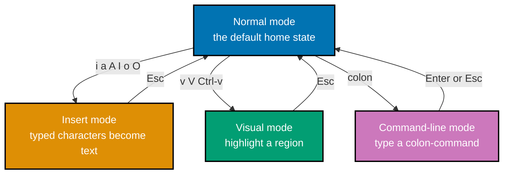
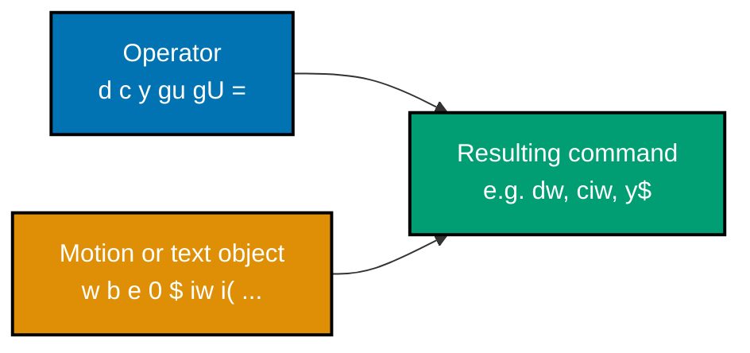

Examples 1-30 cover Neovim's essential day-to-day surface: opening and quitting files, the core Insert-mode entry points, single-cell and word motions, the first operator+motion commands, yank/paste, undo/redo, and basic search. Every example is self-contained -- a `before` file, an annotated keystroke transcript, and an `after` file, all colocated under `learning/code/`.

---

### Example 1: Launch Nvim on File

_ex-01 &middot; exercises co-01_

Opening a file from the shell is the very first Neovim keystroke a reader ever presses. This example shows that Neovim always starts in Normal mode, whatever the file contains.

**Before**

```text
# notes.txt
Buy milk
Buy eggs
Buy bread
```

**Heavily annotated keystroke transcript**

```text
$ nvim notes.txt                   " => Neovim opens notes.txt and starts in Normal mode (the default 'home' mode)
                                   " => the buffer displays all three lines exactly as they are on disk
```

**After**

```text
# notes.txt
Buy milk
Buy eggs
Buy bread
```

**Key takeaway**: Opening a file with `nvim <file>` always lands you in Normal mode first -- movement and commands, not typing.

**Why it matters**: Modal editing means every keystroke's meaning depends on the current mode, and Normal is the default home state you return to, not a special editing mode. Every later example in this primer assumes you already know this: Normal mode is not a special mode you enter, it is the mode you are always in unless you deliberately left it. Readers coming from insert-only editors often expect typing to work immediately; instead the very first keystroke teaches the core mental model this whole primer builds on.

---

### Example 2: Quit Unmodified Buffer

_ex-02 &middot; exercises co-11_

Quitting a buffer that has no pending edits is the simplest Ex command in Neovim. This example verifies `:q` exits immediately with no confirmation prompt.

**Before**

```text
# notes.txt
Buy milk
Buy eggs
Buy bread
```

**Heavily annotated keystroke transcript**

```text
:q<CR>                             " => the unmodified buffer closes immediately
                                   " => Neovim exits straight to the shell prompt with no save prompt
```

**After**

```text
# notes.txt
Buy milk
Buy eggs
Buy bread
```

**Key takeaway**: `:q` only refuses to exit when the buffer has unsaved changes; an unmodified buffer always quits cleanly.

**Why it matters**: Command-line-mode commands accept an optional leading range that scopes the command to specific lines before it runs. Ex commands are typed after a leading colon and confirmed with Enter, the mechanism behind nearly every non-modal action in Neovim (saving, searching and replacing, splitting windows). Learning the simplest member of that family first -- quitting -- establishes the colon-command muscle memory the rest of the primer keeps reusing.

---

### Example 3: Quit Discard Changes

_ex-03 &middot; exercises co-11_

Sometimes you want to throw away an edit entirely rather than save it. This example makes a change, then uses `:q!` to force-quit without writing it to disk.

**Before**

```text
# notes.txt
Buy milk
Buy eggs
Buy bread
```

**Heavily annotated keystroke transcript**

```text
A more milk<Esc>                   " => appends ' more milk' to line 1 and returns to Normal mode
                                   " => the in-memory buffer now differs from the on-disk file
:q!<CR>                            " => the ! flag forces the quit even though the buffer is modified
                                   " => Neovim exits without writing; the discarded edit never touches disk
```

**After**

```text
# notes.txt
Buy milk
Buy eggs
Buy bread
```

**Key takeaway**: `:q!` discards unsaved changes and forces the quit that plain `:q` would refuse.

**Why it matters**: Command-line-mode commands accept an optional leading range that scopes the command to specific lines before it runs. The trailing `!` is a recurring Neovim convention meaning 'I know this is destructive, do it anyway' -- the same bang reappears on `:e!` and `:g!` later in this primer. Recognizing that a single character controls whether a command protects you or obeys you unconditionally prevents both accidental data loss and unnecessary confusion when Neovim refuses a plain command.

---

### Example 4: Reload Discard with E Bang

_ex-04 &middot; exercises co-11_

`:e!` discards an in-memory edit without leaving Neovim at all, unlike `:q!` which exits entirely. This example reloads the buffer straight from disk.

**Before**

```text
# notes.txt
Buy milk
Buy eggs
Buy bread
```

**Heavily annotated keystroke transcript**

```text
A more milk<Esc>                   " => appends ' more milk' to line 1
                                   " => the in-memory buffer now differs from the on-disk file
:e!<CR>                            " => reloads the current file from disk, discarding the in-memory edit
                                   " => the buffer now matches the on-disk file again, and Neovim stays open
```

**After**

```text
# notes.txt
Buy milk
Buy eggs
Buy bread
```

**Key takeaway**: `:e!` reverts a buffer to its on-disk state while staying inside Neovim; `:q!` leaves Neovim entirely.

**Why it matters**: Command-line-mode commands accept an optional leading range that scopes the command to specific lines before it runs. Mixing these two up is a common early mistake: reaching for `:q!` when you only wanted to undo a bad experiment mid-session throws away your whole editing context, not just the last change. Knowing `:e!` exists means an unwanted edit is recoverable without losing your window layout, cursor position, or the rest of your work in progress.

---

### Example 5: Save File

_ex-05 &middot; exercises co-11_

Writing a buffer to disk is the single most common Ex command in daily use. This example edits a line, then saves it with `:w`.

**Before**

```text
# notes.txt
Buy milk
Buy eggs
Buy bread
```

**Heavily annotated keystroke transcript**

```text
A more milk<Esc>                   " => appends ' more milk' to line 1 and returns to Normal mode
:w<CR>                             " => writes the modified buffer to disk
                                   " => the file on disk now contains 'Buy milk more milk'
```

**After**

```text
# notes.txt
Buy milk more milk
Buy eggs
Buy bread
```

**Key takeaway**: `:w` writes the current buffer to its associated file without closing Neovim.

**Why it matters**: Command-line-mode commands accept an optional leading range that scopes the command to specific lines before it runs. Because `:w` never exits, it is safe to run constantly -- a habit worth building from day one, especially once the terminal-first build/run/test loop (co-20) depends on the file on disk actually reflecting your latest edits before a shell command reads it. Saving early and often removes an entire class of 'why isn't my change showing up' confusion.

---

### Example 6: Save and Quit

_ex-06 &middot; exercises co-11_

`:wq` combines a save and a quit into a single Ex command, the most common way to finish an editing session. This example writes then exits in one step.

**Before**

```text
# notes.txt
Buy milk
Buy eggs
Buy bread
```

**Heavily annotated keystroke transcript**

```text
A more milk<Esc>                   " => appends ' more milk' to line 1
:wq<CR>                            " => writes the buffer to disk, then exits Neovim
                                   " => the process returns to the shell prompt with the edit already saved
```

**After**

```text
# notes.txt
Buy milk more milk
Buy eggs
Buy bread
```

**Key takeaway**: `:wq` is `:w` followed by `:q` in a single command -- write, then leave.

**Why it matters**: Command-line-mode commands accept an optional leading range that scopes the command to specific lines before it runs. Chaining two Ex commands back to back like this previews a broader pattern: Neovim's command line supports sequencing multiple actions in one line (`:wq` is really shorthand, but `:w | q` or a `:g` command with an embedded `normal` invocation later in this primer follows the same 'do this, then that' shape). Recognizing the pattern early makes the later, more powerful compositions less surprising.

---

### Example 7: Save and Quit Shortcut

_ex-07 &middot; exercises co-11_

`ZZ` is a Normal-mode shortcut, not an Ex command, that behaves like `:x`: it saves only if the buffer changed, then quits. This example compares it to the unconditional `:wq`.

**Before**

```text
# notes.txt
Buy milk
Buy eggs
Buy bread
```

**Heavily annotated keystroke transcript**

```text
A more milk<Esc>                   " => appends ' more milk' to line 1, marking the buffer as modified
ZZ                                 " => equivalent to `:x`: writes only if the buffer is modified, then quits
                                   " => since the buffer was modified, the file is saved before Neovim exits
```

**After**

```text
# notes.txt
Buy milk more milk
Buy eggs
Buy bread
```

**Key takeaway**: `ZZ` (capital Z twice) saves conditionally and quits, unlike `:wq` which always writes even on an unmodified buffer.

**Why it matters**: Command-line-mode commands accept an optional leading range that scopes the command to specific lines before it runs. `:wq` on an unchanged file still touches the file's modification timestamp, which can trip build tools that watch for real changes; `ZZ`/`:x` avoid that by skipping the write when nothing changed. This is a small detail, but it is exactly the kind of terminal-first workflow polish (co-20) that keeps a build/run/test loop from re-triggering on a no-op save.

---

### Example 8: Enter Insert Before Cursor

_ex-08 &middot; exercises co-02_

`i` is the most common way into Insert mode: it opens typing immediately before the cursor's current column. This example inserts a word at the start of a line.



**Before**

```text
# buffer.txt
brown fox
```

**Heavily annotated keystroke transcript**

```text
i                                  " => enters Insert mode; the cursor stays on its current column
the <Esc>                          " => types 'the ' immediately before the original cursor column, then returns to Normal mode
                                   " => the line becomes 'the brown fox' -- text inserted BEFORE where the cursor was
```

**After**

```text
# buffer.txt
the brown fox
```

**Key takeaway**: `i` inserts text before the cursor; the cursor position itself never moves when you press it.

**Why it matters**: Neovim exposes distinct modes -- Normal, Insert, Visual, Command-line, and Replace, plus the internal Operator-pending mode -- each with its own entry key, exit key, and keystroke semantics. The Normal/Insert mode split is the single idea underpinning this whole primer (co-01, co-02): every other Normal-mode key is free to mean 'move' or 'operate' precisely because typing letters never accidentally edits text. `i` is the first bridge across that split, and it is worth internalizing that it inserts BEFORE, not at, the cursor, since `a` (next example) is the mirror image.

---

### Example 9: Enter Insert After Cursor

_ex-09 &middot; exercises co-02_

`a` mirrors `i` but opens typing one column to the right of the cursor. This example shows the one-column shift that distinguishes it from `i`.

**Before**

```text
# buffer.txt
brown fox
```

**Heavily annotated keystroke transcript**

```text
a                                  " => enters Insert mode; the insertion point sits one column to the right of the original cursor (after the 'b')
-<Esc>                             " => types '-' immediately after the original cursor column, then returns to Normal mode
                                   " => the line becomes 'b-rown fox' -- text inserted AFTER where the cursor was
```

**After**

```text
# buffer.txt
b-rown fox
```

**Key takeaway**: `a` inserts text after the cursor's current column; `i` inserts before it -- the two are complementary, not interchangeable.

**Why it matters**: Neovim exposes distinct modes -- Normal, Insert, Visual, Command-line, and Replace, plus the internal Operator-pending mode -- each with its own entry key, exit key, and keystroke semantics. This one-column difference explains a common beginner mistake: pressing `i` when you meant to append after the last character of a line does nothing useful, because the cursor never moves. Distinguishing `i` from `a` here sets up `I` and `A` (next two examples), which apply the same before/after distinction at the line's boundaries instead of the cursor's column.

---

### Example 10: Append End of Line

_ex-10 &middot; exercises co-02_

`A` combines a motion to end-of-line with entering Insert mode there, regardless of where the cursor started. This example appends text no matter the starting column.

**Before**

```text
# buffer.txt
brown fox
```

**Heavily annotated keystroke transcript**

```text
A                                  " => moves the cursor to end-of-line first, then enters Insert mode there
 jumps<Esc>                        " => types ' jumps' at end of line
                                   " => the line becomes 'brown fox jumps' regardless of where the cursor started
```

**After**

```text
# buffer.txt
brown fox jumps
```

**Key takeaway**: `A` always appends at the end of the line, saving the separate `$a` (move to end, then append) sequence.

**Why it matters**: Neovim exposes distinct modes -- Normal, Insert, Visual, Command-line, and Replace, plus the internal Operator-pending mode -- each with its own entry key, exit key, and keystroke semantics. `A` is a small but telling example of Neovim's design philosophy: common two-step sequences (navigate, then edit) are frequently collapsed into a single uppercase key. Once you notice `A` = `$a`, you start expecting the pattern elsewhere -- exactly what happens with `I` in the very next example.

---

### Example 11: Insert Start of Line

_ex-11 &middot; exercises co-02_

`I` inserts at the line's first non-blank character, not literal column 1 -- a subtle but important distinction from `0`. This example preserves leading indentation while inserting.

**Before**

```text
# buffer.txt
   brown fox
```

**Heavily annotated keystroke transcript**

```text
I                                  " => moves the cursor to the line's first non-blank character (skipping the leading spaces), then enters Insert mode there
the <Esc>                          " => types 'the ' right before 'brown', not before the leading spaces
                                   " => the line becomes '   the brown fox' -- indentation preserved
```

**After**

```text
# buffer.txt
   the brown fox
```

**Key takeaway**: `I` targets the first non-blank character, so it never disturbs a line's leading indentation.

**Why it matters**: Neovim exposes distinct modes -- Normal, Insert, Visual, Command-line, and Replace, plus the internal Operator-pending mode -- each with its own entry key, exit key, and keystroke semantics. This distinction matters constantly once you edit indented code or lists: `I` is the safe way to prepend text without accidentally typing inside the whitespace. Contrast this with `0` (a raw motion covered later in co-03), which always lands on literal column 1 even when that column is a space -- the two look similar but serve different purposes.

---

### Example 12: Open Line Below

_ex-12 &middot; exercises co-02_

`o` opens a brand-new, empty line below the cursor and drops straight into Insert mode on it. This example adds a second line to a one-line file.

**Before**

```text
# buffer.txt
brown fox
```

**Heavily annotated keystroke transcript**

```text
o                                  " => opens a new, empty line directly below the current line and enters Insert mode on it
jumps high<Esc>                    " => types the new line's text
                                   " => the buffer now has two lines: 'brown fox' then 'jumps high'
```

**After**

```text
# buffer.txt
brown fox
jumps high
```

**Key takeaway**: `o` creates a new line below the cursor and enters Insert mode there in one motion.

**Why it matters**: Neovim exposes distinct modes -- Normal, Insert, Visual, Command-line, and Replace, plus the internal Operator-pending mode -- each with its own entry key, exit key, and keystroke semantics. Unlike `A` or `o`+Enter-from-Insert-mode, `o` guarantees correct indentation handling and a clean new line without manually navigating to end-of-line and pressing Enter. It is the fastest way to add a new list item, function, or paragraph directly after the current one, and its mirror `O` (next example) covers the opposite direction.

---

### Example 13: Open Line Above

_ex-13 &middot; exercises co-02_

`O` mirrors `o` but opens the new line above the cursor instead of below it. This example inserts a heading line before existing content.

**Before**

```text
# buffer.txt
jumps high
```

**Heavily annotated keystroke transcript**

```text
O                                  " => opens a new, empty line directly above the current line and enters Insert mode on it
brown fox<Esc>                     " => types the new line's text
                                   " => the buffer now has two lines: 'brown fox' then 'jumps high'
```

**After**

```text
# buffer.txt
brown fox
jumps high
```

**Key takeaway**: `O` opens a new line above the cursor; `o` opens one below -- the capital letter again marks the 'other direction' variant.

**Why it matters**: Neovim exposes distinct modes -- Normal, Insert, Visual, Command-line, and Replace, plus the internal Operator-pending mode -- each with its own entry key, exit key, and keystroke semantics. By this point in the primer, a pattern in Neovim's key design has emerged: lowercase and uppercase pairs (`i`/`I`, `a`/`A`, `o`/`O`) consistently mean 'the ordinary version' versus 'the line-boundary or reversed-direction version.' Recognizing this pairing convention lets you guess at unfamiliar commands' uppercase counterparts correctly more often than not.

---

### Example 14: Escape to Normal

_ex-14 &middot; exercises co-01_

`<Esc>` is the universal way back to Normal mode from any other mode, and it nudges the cursor one column left as it returns. This example shows that shift explicitly.

**Before**

```text
# buffer.txt
cat
```

**Heavily annotated keystroke transcript**

```text
i                                  " => enters Insert mode at column 1
XY                                 " => types two characters; the cursor now sits after the 'Y', at column 3, still in Insert mode
<Esc>                              " => returns to Normal mode
                                   " => the cursor moves one column left, landing back on the 'Y' rather than past it
```

**After**

```text
# buffer.txt
XYcat
```

**Key takeaway**: `<Esc>` always returns to Normal mode and shifts the cursor one column left -- a frequent source of off-by-one confusion for newcomers.

**Why it matters**: Modal editing means every keystroke's meaning depends on the current mode, and Normal is the default home state you return to, not a special editing mode. Normal mode has no true 'cursor past the last character' concept the way Insert mode does, so Neovim quietly steps the cursor back on every escape to keep it on a real character. This is worth memorizing explicitly rather than discovering by accident, because the very next dot-repeat or motion you press assumes the cursor already sits on that shifted-back column.

---

### Example 15: Move with Hjkl

_ex-15 &middot; exercises co-03_

`h`/`j`/`k`/`l` are the four cardinal single-cell motions and the most basic building blocks of Neovim's motion vocabulary. This example moves the cursor one cell in each direction.

**Before**

```text
# buffer.txt
aaa
bbb
ccc
```

**Heavily annotated keystroke transcript**

```text
l                                  " => moves the cursor right one cell, from column 1 to column 2 on line 1
j                                  " => moves the cursor down one line, to line 2, same column
k                                  " => moves the cursor up one line, back to line 1
h                                  " => moves the cursor left one cell, back to column 1
```

**After**

```text
# buffer.txt
aaa
bbb
ccc
```

**Key takeaway**: `hjkl` move the cursor one cell left/down/up/right respectively and never modify the buffer.

**Why it matters**: Motions are cursor-movement commands classified inclusive, exclusive, or linewise, and they work standalone or as an operator's argument. These four keys sit under the right hand's home-row position (on a standard QWERTY layout), which is precisely why Neovim keeps the arrow keys as a secondary option rather than the primary one -- staying on the home row keeps hands from leaving typing position. Every motion taught later in this primer (words, lines, paragraphs, search) is a faster substitute for repeated `hjkl` presses, not a replacement for understanding them.

---

### Example 16: Move By Word

_ex-16 &middot; exercises co-03_

`w` and `b` jump by whole words instead of single characters, moving forward and backward respectively. This example walks across a line word by word.

**Before**

```text
# buffer.txt
quick brown fox jumps
```

**Heavily annotated keystroke transcript**

```text
w                                  " => moves to the first character of the next word: from 'quick' to 'brown'
w                                  " => advances again: from 'brown' to 'fox'
b                                  " => moves back to the first character of the previous word: from 'fox' back to 'brown'
```

**After**

```text
# buffer.txt
quick brown fox jumps
```

**Key takeaway**: `w` moves forward to the start of the next word; `b` moves backward to the start of the previous word.

**Why it matters**: Motions are cursor-movement commands classified inclusive, exclusive, or linewise, and they work standalone or as an operator's argument. Word motions are exclusive (per the Accuracy notes) -- when used as an operator's argument, `w` stops exactly at the next word's first character rather than including it, which is why `dw` (later in co-04) deletes trailing whitespace up to, but not swallowing, the following word. Understanding `w`/`b` alone, before combining them with operators, makes that later composition predictable instead of mysterious.

---

### Example 17: Move to Word End

_ex-17 &middot; exercises co-03_

`e` moves to the last character of a word, complementing `w`'s move to a word's first character. This example lands the cursor on successive word endings.

**Before**

```text
# buffer.txt
quick brown fox
```

**Heavily annotated keystroke transcript**

```text
e                                  " => moves to the last character of the current/next word: lands on the 'k' of 'quick'
e                                  " => advances again: lands on the 'n' of 'brown'
```

**After**

```text
# buffer.txt
quick brown fox
```

**Key takeaway**: `e` moves to a word's last character, and -- unlike `w` -- it is an inclusive motion, so an operator combined with `e` includes that final character.

**Why it matters**: Motions are cursor-movement commands classified inclusive, exclusive, or linewise, and they work standalone or as an operator's argument. The inclusive/exclusive distinction between `e` and `w` (per the Accuracy notes' classification) is easy to overlook until an operator makes it visible: `de` deletes through the final letter of the current word, while `dw` from the same position deletes only up to the next word's start. Knowing `e` in isolation first makes that later contrast in co-04 land clearly rather than as an unexplained surprise.

---

### Example 18: Move Line Boundaries

_ex-18 &middot; exercises co-03_

`0`, `^`, and `$` are the three line-boundary motions: literal column 1, first non-blank character, and end of line. This example visits all three in sequence.

**Before**

```text
# buffer.txt
   quick brown fox
```

**Heavily annotated keystroke transcript**

```text
0                                  " => moves to column 1 -- the very first character on the line, including leading whitespace
^                                  " => moves to the first non-blank character -- skips past the leading spaces onto 'q'
$                                  " => moves to the last character of the line -- lands on the final 'x' of 'fox'
```

**After**

```text
# buffer.txt
   quick brown fox
```

**Key takeaway**: `0` always means literal column 1; `^` means the first real character; `$` means the last character of the line.

**Why it matters**: Motions are cursor-movement commands classified inclusive, exclusive, or linewise, and they work standalone or as an operator's argument. This trio resolves the earlier `I` example's subtlety directly: `I` behaves like `^` followed by entering Insert mode, while a plain `0` would land inside leading whitespace instead. Keeping `0` and `^` mentally distinct prevents a common mistake where an operator like `d0` (delete to literal column 1) unexpectedly leaves indentation intact when `d^` was actually intended.

---

### Example 19: Move File Boundaries

_ex-19 &middot; exercises co-03_

`gg` and `G` jump to the very first and very last line of the file respectively, the fastest way to reach either end. This example jumps both directions.

**Before**

```text
# buffer.txt
line one
line two
line three
```

**Heavily annotated keystroke transcript**

```text
gg                                 " => jumps to line 1, the first line of the file
G                                  " => jumps to the last line of the file -- line 3
```

**After**

```text
# buffer.txt
line one
line two
line three
```

**Key takeaway**: `gg` jumps to line 1; `G` jumps to the file's last line -- both work from anywhere in the buffer.

**Why it matters**: Motions are cursor-movement commands classified inclusive, exclusive, or linewise, and they work standalone or as an operator's argument. Per the Accuracy notes, `G` registers as a jump in the jumplist (co-08) while `gg` does not -- a small asymmetry worth remembering once you start relying on `<C-o>`/`<C-i>` to retrace your steps later in this primer. `G` also accepts a count prefix (`42G` jumps to line 42), previewing the count-prefixed motions formally introduced in co-05.

---

### Example 20: Move By Paragraph

_ex-20 &middot; exercises co-03_

`}` and `{` jump to the next and previous paragraph boundary, where a paragraph is any run of lines separated by a blank line. This example crosses one such boundary.

**Before**

```text
# buffer.txt
First paragraph line one.
First paragraph line two.

Second paragraph line one.
Second paragraph line two.
```

**Heavily annotated keystroke transcript**

```text
}                                  " => jumps forward to the next blank-line paragraph boundary -- lands on the empty line 3
{                                  " => jumps backward to the previous blank-line boundary -- back to the top of the file
```

**After**

```text
# buffer.txt
First paragraph line one.
First paragraph line two.

Second paragraph line one.
Second paragraph line two.
```

**Key takeaway**: `}`/`{` navigate by blank-line-delimited paragraph, a much coarser unit than a word or a line.

**Why it matters**: Motions are cursor-movement commands classified inclusive, exclusive, or linewise, and they work standalone or as an operator's argument. Paragraph motions matter most once combined with an operator or a text object: `dap` (worked in ex-45) deletes a whole paragraph plus its trailing blank line in one command, and that composition only makes sense once you already know what a 'paragraph boundary' means as a standalone motion. This example is deliberately the last of the pure-motion group before the primer turns to operators.

---

### Example 21: Delete Char

_ex-21 &middot; exercises co-04_

`x` deletes the single character under the cursor, the simplest possible operator+implicit-motion combination. This example removes one stray character from a line.

**Before**

```text
# buffer.txt
xcat
```

**Heavily annotated keystroke transcript**

```text
x                                  " => deletes the character under the cursor ('x')
                                   " => the remaining text shifts left; the line becomes 'cat'
```

**After**

```text
# buffer.txt
cat
```

**Key takeaway**: `x` is shorthand for 'delete one character forward' -- it never asks for a motion because its motion is implicitly a single character.

**Why it matters**: Commands compose as operator + count + motion-or-text-object, so a small operator vocabulary combines with an open-ended motion vocabulary to cover almost any edit. `x` is often the very first Vim command anyone learns, but it is worth understanding it as a special case of the general operator+motion grammar (co-04) rather than a standalone trick: it behaves identically to `dl` (delete, then the single-cell-right motion `l`). Seeing that equivalence early makes the fuller operator+motion examples that follow feel like natural extensions rather than a new topic.

---

### Example 22: Delete Word

_ex-22 &middot; exercises co-04_

`dw` is the first true operator+motion composition in this primer: the `d` operator paired with the `w` motion. This example deletes a word plus its trailing space.



**Before**

```text
# buffer.txt
quick brown fox
```

**Heavily annotated keystroke transcript**

```text
dw                                 " => the `d` operator combined with the `w` motion deletes from the cursor to the start of the next word
                                   " => 'quick ' (word plus trailing space) is removed; the line becomes 'brown fox'
```

**After**

```text
# buffer.txt
brown fox
```

**Key takeaway**: `dw` = operator `d` + motion `w`: delete from the cursor up to (but not including) the next word's start.

**Why it matters**: Commands compose as operator + count + motion-or-text-object, so a small operator vocabulary combines with an open-ended motion vocabulary to cover almost any edit. This is the example the whole primer's 'keep-this-if-you-forget-everything' idea hinges on: `{operator}{motion}` is a composable grammar, not a list of commands to memorize individually. Once `dw` clicks, `cw`, `yw`, `gUw`, and every other operator paired with `w` become predictable rather than new vocabulary -- exactly the mechanism-not-memorization payoff modal editing is built around.

---

### Example 23: Delete Line

_ex-23 &middot; exercises co-04_

`dd` deletes the entire current line by pairing the `d` operator with itself as a linewise shortcut. This example removes one line from a three-line file.

**Before**

```text
# buffer.txt
line one
line two
line three
```

**Heavily annotated keystroke transcript**

```text
dd                                 " => deletes the entire current line (line one)
                                   " => line two shifts up to become the new line one
```

**After**

```text
# buffer.txt
line two
line three
```

**Key takeaway**: `dd` deletes a whole line -- doubling an operator key is Neovim's shorthand for 'apply this operator linewise to the current line.'

**Why it matters**: Commands compose as operator + count + motion-or-text-object, so a small operator vocabulary combines with an open-ended motion vocabulary to cover almost any edit. The doubled-key linewise shortcut is not unique to `d`: `yy` (yank the line, worked in ex-26), `gUU`/`guu` (uppercase/lowercase the line), and `>>`/`<<` (indent shift, worked in ex-62) all follow the identical pattern. Recognizing `dd` as an instance of that shortcut, rather than a special two-letter command, means you can predict what `cc` or `yy` do before ever looking them up.

---

### Example 24: Delete to Eol

_ex-24 &middot; exercises co-04_

`D` is a shortcut for `d$`: delete from the cursor to the end of the line. This example positions the cursor mid-line, then clears the remainder.

**Before**

```text
# buffer.txt
quick brown fox
```

**Heavily annotated keystroke transcript**

```text
w                                  " => moves the cursor to the start of 'brown'
D                                  " => deletes from the cursor to end of line -- equivalent to `d$`
                                   " => 'brown fox' is removed; the line becomes 'quick '
```

**After**

```text
# buffer.txt
quick
```

**Key takeaway**: `D` deletes from the cursor to end-of-line in one keystroke, exactly equivalent to `d$`.

**Why it matters**: Commands compose as operator + count + motion-or-text-object, so a small operator vocabulary combines with an open-ended motion vocabulary to cover almost any edit. `D` fits the same uppercase-shortcut pattern seen with `A` (append at end-of-line): a common operator+motion combination collapsed into a single capital letter. Recognizing `D` as `d$` rather than a unique command means you already understand its behavior perfectly, since `$` (a line-boundary motion from co-03) was already covered before any operator was introduced.

---

### Example 25: Change Word

_ex-25 &middot; exercises co-04_

`cw` combines the `c` (change) operator with the `w` motion: delete the word, then drop straight into Insert mode to replace it. This example swaps one word for another.

**Before**

```text
# buffer.txt
quick brown fox
```

**Heavily annotated keystroke transcript**

```text
cw                                 " => the `c` operator combined with the `w` motion deletes the word under the cursor and opens Insert mode at that position
                                   " => 'quick' is deleted and Insert mode begins there, ready for replacement text
slow<Esc>                          " => types the replacement text, then returns to Normal mode
                                   " => the line becomes 'slow brown fox'
```

**After**

```text
# buffer.txt
slow brown fox
```

**Key takeaway**: `c` behaves like `d` followed automatically by entering Insert mode -- 'change' is 'delete, then type the replacement.'

**Why it matters**: Commands compose as operator + count + motion-or-text-object, so a small operator vocabulary combines with an open-ended motion vocabulary to cover almost any edit. `cw` is the single most frequently reached-for change command in real editing, because renaming a variable, fixing a typo, or swapping one word for another is an extremely common task. It is also the example the dot-repeat command (co-09, worked in ex-46) uses to demonstrate replaying an edit verbatim, so understanding `cw` thoroughly here pays off again two examples later.

---

### Example 26: Yank and Paste Line

_ex-26 &middot; exercises co-07_

Yanking copies text into a register without deleting it, and pasting inserts that register's contents back into the buffer. This example duplicates a line via yank-then-paste.

**Before**

```text
# buffer.txt
buy milk
buy eggs
```

**Heavily annotated keystroke transcript**

```text
yy                                 " => yanks (copies) the current line into the unnamed register
                                   " => the buffer is unchanged; the line is now available to paste
p                                  " => pastes the yanked line directly below the current line
                                   " => the buffer gains a duplicate: 'buy milk' now appears twice
```

**After**

```text
# buffer.txt
buy milk
buy milk
buy eggs
```

**Key takeaway**: `yy` copies (yanks) the current line without modifying the buffer; `p` pastes after the cursor.

**Why it matters**: Registers are named storage slots for yanked or deleted text: named (a-z/A-Z), numbered (0-9), and special registers such as the unnamed, black hole, and yank registers. This example is the first real use of a register (co-07): the unnamed register acts as Neovim's default clipboard, silently filled by every yank and delete. It is worth noticing here, before named and numbered registers appear later, that `p` always draws from whichever register was written to most recently unless you explicitly name one -- the behavior every subsequent register example builds on.

---

### Example 27: Undo Last Change

_ex-27 &middot; exercises co-13_

`u` reverts the most recent change to the buffer, Neovim's basic undo command. This example deletes a line, then restores it.

**Before**

```text
# buffer.txt
buy milk
```

**Heavily annotated keystroke transcript**

```text
dd                                 " => deletes the only line
                                   " => the buffer becomes empty
u                                  " => undoes the last change
                                   " => 'buy milk' reappears exactly as it was before the delete
```

**After**

```text
# buffer.txt
buy milk
```

**Key takeaway**: `u` reverts the most recent change; pressing it repeatedly walks further back through prior changes.

**Why it matters**: `u` and `<C-r>` look like a linear undo/redo stack, but every change actually branches a full undo tree that `g-`/`g+` and `:undolist` expose and traverse. `u` looks like a simple linear undo, and for everyday use it behaves exactly that way -- but Neovim actually records every change as a node in a full undo tree (co-13), a distinction that only becomes visible once a new edit is made after an undo. This example intentionally stays simple; ex-77 later in this primer reveals the branching behavior `u` alone cannot fully expose.

---

### Example 28: Redo Change

_ex-28 &middot; exercises co-13_

`<C-r>` reapplies a change that `u` just undid, Neovim's basic redo command. This example undoes a delete, then redoes it.

**Before**

```text
# buffer.txt
buy milk
```

**Heavily annotated keystroke transcript**

```text
dd                                 " => deletes the line
                                   " => the buffer becomes empty
u                                  " => undoes the delete
                                   " => 'buy milk' is restored
<C-r>                              " => redoes the undone change
                                   " => the line is deleted again -- redo reapplies exactly what undo reverted
```

**After**

```text
# buffer.txt

```

**Key takeaway**: `<C-r>` (Ctrl-r) moves forward through undo history, the mirror image of `u`.

**Why it matters**: `u` and `<C-r>` look like a linear undo/redo stack, but every change actually branches a full undo tree that `g-`/`g+` and `:undolist` expose and traverse. `u` and `<C-r>` together form the everyday undo/redo pair every editor has, so this example is deliberately quick -- the more interesting behavior is what happens when a NEW edit is made after undoing, which is exactly what ex-77's undo-tree time-travel example explores later using `g-`/`g+` instead of these two keys.

---

### Example 29: Basic Search Forward

_ex-29 &middot; exercises co-10_

`/` starts an interactive forward search for a pattern, confirmed with Enter. This example jumps the cursor to the next match of a search term.

**Before**

```text
# buffer.txt
find the needle here
not this line
needle again
```

**Heavily annotated keystroke transcript**

```text
/needle<CR>                        " => searches forward for the next occurrence of 'needle'
                                   " => the cursor jumps to the first match, on line 1
```

**After**

```text
# buffer.txt
find the needle here
not this line
needle again
```

**Key takeaway**: `/pattern<CR>` searches forward from the cursor and jumps to the first match; it never edits the buffer.

**Why it matters**: Search (/, ?, n, N, \*, #) locates text interactively, while the separate `:substitute` Ex command performs pattern-based find/replace with flags controlling scope and confirmation. Search is a motion in its own right (co-03 classifies it alongside word and line motions), which means it can be combined with an operator exactly like `w` or `$` can -- `d/needle<CR>` deletes everything up to the next match, for instance. This example introduces the interactive search step alone before co-10's substitute command layers pattern-based replacement on top of the same regex engine.

---

### Example 30: Repeat Search

_ex-30 &middot; exercises co-10_

`n` and `N` repeat the most recent search forward and backward respectively, without retyping the pattern. This example advances through, then back over, two matches.

**Before**

```text
# buffer.txt
find the needle here
not this line
needle again
```

**Heavily annotated keystroke transcript**

```text
/needle<CR>                        " => searches forward for 'needle'; the cursor lands on line 1's match
n                                  " => repeats the search in the same direction
                                   " => the cursor advances to the next match, on line 3
N                                  " => repeats the search in the opposite direction
                                   " => the cursor moves back to the previous match, on line 1
```

**After**

```text
# buffer.txt
find the needle here
not this line
needle again
```

**Key takeaway**: `n` repeats the last search forward; `N` repeats it backward -- neither one requires retyping the pattern.

**Why it matters**: Search (/, ?, n, N, \*, #) locates text interactively, while the separate `:substitute` Ex command performs pattern-based find/replace with flags controlling scope and confirmation. This closes out the Beginner tier by tying search's forward/backward pair to the file-boundary and motion patterns seen throughout: like `gg`/`G` and `{`/`}`, `n`/`N` form a directional pair sharing one underlying state (here, the last-used search pattern). The next tier, Intermediate, builds directly on this by introducing `:substitute`, which reuses the exact same pattern-matching engine to edit instead of merely navigate.

---

← Previous: [Overview](./overview.md) · Next: [Intermediate Examples](./intermediate.md) →
