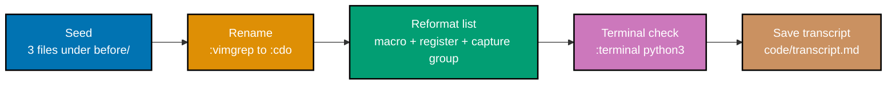

## Goal

Perform one non-trivial refactor of a small multi-file text project entirely in vanilla Neovim --
no plugins, no mouse, no arrow keys -- driving find/replace, macros, and the quickfix list, and
capture the full keystroke transcript so the session is reproducible. This capstone is a light
consolidation, not a new project: every command below was already taught, individually, somewhere
in the Beginner, Intermediate, or Advanced tiers of this primer.



## Concepts exercised

- [x] modal editing
- [x] operator+motion grammar
- [x] text objects
- [x] `:%s///` with capture groups
- [x] a recorded macro replayed with a count
- [x] `:vimgrep` -> quickfix -> `:cnext` multi-file edit
- [x] registers
- [x] `:terminal` build/run loop

All colocated code lives under `learning/capstone/code/`: seed files in `before/`, the finished
result in `after/`, and the complete keystroke sequence in `transcript.md`.

## Step 1: Seed the project

_exercises co-01_

Three small files, seeded once and never hand-edited outside Neovim: a function definition, a
caller of that function, and a plain task list.

**Before** (`code/before/`)

```text
# calc.py
def oldName(a: int, b: int) -> int:
    return a + b

# main.py
from calc import oldName


def main() -> None:
    result: int = oldName(2, 3)
    print(result)


if __name__ == "__main__":
    main()

# tasks.txt
buy milk
write report
call bob
email alice
review pr
update docs
book flight
pay rent
clean desk
backup laptop
plan trip
```

**Verify**

```text
$ ls
calc.py  main.py  tasks.txt
```

## Step 2: Rename `oldName` to `newName` everywhere

_exercises co-01, co-10, co-17_

`oldName` appears three times across two files: once in `calc.py`'s definition, twice in
`main.py` (the import and the call). `:vimgrep` finds every occurrence, `:copen` lists them, and
`:cdo` applies the same substitution to each one in turn.

**Heavily annotated keystroke transcript**

```text
$ nvim calc.py                          " => opens calc.py; main.py and tasks.txt stay on disk
:vimgrep /oldName/ **/*<CR>             " => recursively globs the directory and searches every file for 'oldName'
                                        " => populates the quickfix list with 3 entries: calc.py:1, main.py:1, main.py:5
:copen<CR>                              " => opens the quickfix window listing all 3 matches
:cnext<CR>                              " => jumps to a listed match; the buffer switches to that file and line
:cnext<CR>                              " => jumps to the next listed match -- stepping through this way walks every hit
:cdo s/oldName/newName/g | update<CR>   " => runs `s/oldName/newName/g` on every quickfix entry, then `update` writes each changed file
:cclose<CR>                             " => closes the quickfix window
```

**After** (`code/after/calc.py`, `code/after/main.py`)

```text
# calc.py
def newName(a: int, b: int) -> int:
    return a + b

# main.py
from calc import newName


def main() -> None:
    result: int = newName(2, 3)
    print(result)


if __name__ == "__main__":
    main()
```

**Verify**

```text
$ grep -c newName calc.py main.py
calc.py:1
main.py:2
$ grep -c oldName calc.py main.py
calc.py:0
main.py:0
```

`grep -c oldName` reporting zero matches in both files confirms the rename reached every
occurrence, not just the one under the cursor.

## Step 3: Reformat and enrich the task list

_exercises co-06, co-07, co-10, co-14_

A recorded macro, replayed with a count, checkbox-prefixes all 11 tasks. A text object then fixes
one word, a named register duplicates one task, and a capture-group substitution labels every
task at once.

**Heavily annotated keystroke transcript**

```text
:e tasks.txt<CR>                        " => opens tasks.txt in the same session; calc.py/main.py stay open as buffers
gg                                      " => moves to line 1, 'buy milk'
qa                                      " => starts recording keystrokes into register a
I- [ ] <Esc>j                           " => inserts the literal checkbox prefix, returns to Normal mode, moves down one line -- the full recorded sequence
q                                       " => stops recording; register a now holds 'I- [ ] <Esc>j'
10@a                                    " => replays the macro 10 more times, checkbox-prefixing lines 2 through 11 identically
/bob<CR>                                " => searches forward for 'bob', landing inside line 3 ('- [ ] call bob')
ciwcarol<Esc>                           " => the `c` operator combined with the `iw` text object replaces only the word under the cursor
                                        " => line 3 becomes '- [ ] call carol'
gg                                      " => returns to line 1
"ayy                                    " => yanks line 1 into the named register a, independent of the unnamed register
G                                       " => jumps to the last line (line 11)
"ap                                     " => pastes register a's contents below it
                                        " => a new line 12 appears, a duplicate of line 1's task
:%s/^\(- \[ \] \)\(.*\)$/\1TODO: \2/<CR>  " => a capture-group substitution: group 1 keeps the checkbox untouched, group 2 captures the task text, and the replacement reinserts both around a new 'TODO: ' label
                                        " => all 12 lines gain a 'TODO: ' label between the checkbox and the task text
:w<CR>                                  " => saves tasks.txt
```

**After** (`code/after/tasks.txt`)

```text
# tasks.txt
- [ ] TODO: buy milk
- [ ] TODO: write report
- [ ] TODO: call carol
- [ ] TODO: email alice
- [ ] TODO: review pr
- [ ] TODO: update docs
- [ ] TODO: book flight
- [ ] TODO: pay rent
- [ ] TODO: clean desk
- [ ] TODO: backup laptop
- [ ] TODO: plan trip
- [ ] TODO: buy milk
```

**Verify**

```text
$ grep -c '^- \[ \] TODO: ' tasks.txt
12
$ sed -n '3p' tasks.txt
- [ ] TODO: call carol
```

Twelve matching lines confirm the macro replay, the capture-group substitution, and the pasted
duplicate all landed; line 3 confirms the text-object word fix landed too.

## Step 4: Run the project check from `:terminal`

_exercises co-20_

A syntax check runs beside the source, inside the same Neovim session, without leaving the
editor.

**Heavily annotated keystroke transcript**

```text
:terminal python3 -m py_compile *.py && echo OK<CR>   " => opens a real shell inside a buffer, syntax-checks both renamed Python files, then echoes a plain success marker
                                                       " => py_compile produces no output on success, so 'OK' appearing is the terminal's confirmation the check passed
<C-\><C-n>                                            " => escapes Terminal mode back to Normal mode without killing the shell
gg                                                     " => jumps to the first line of the captured terminal output
G                                                       " => jumps to the last line, where 'OK' is printed
```

**Verify**

The last line of the terminal buffer reads `OK`. `python3 -m py_compile` exits non-zero and
prints a `SyntaxError` traceback on failure, so the `&&` short-circuits and `OK` never appears --
a silent terminal (no `OK`) or a visible traceback both mean the check failed.

## Step 5: Save the keystroke transcript

_exercises co-01_

The four keystroke blocks from Steps 2-4, concatenated in the order shown, are the exact content
saved at `learning/capstone/code/transcript.md`. `calc.py` and `main.py` were already saved by
Step 2's `| update`; `tasks.txt` was saved explicitly by Step 3's `:w`. Copying `code/before/` to
a scratch directory and replaying `transcript.md` there, in order, reproduces `code/after/` from
scratch.

**Verify**

```text
$ diff -r --exclude=__pycache__ . ../after
(no output -- diff exits 0 when the two trees match exactly)
```

An empty result confirms the working copy matches `after/` exactly.

## Acceptance criteria

- `code/after/calc.py` and `code/after/main.py` differ from `code/before/` by exactly one
  rename (`oldName` -> `newName`), reflected consistently across both files.
- `code/after/tasks.txt` differs from `code/before/tasks.txt` by exactly the intended
  transformation: every original task checkbox-prefixed and `TODO:`-labeled, one word corrected
  (`bob` -> `carol`), and one task duplicated as a 12th line.
- `learning/capstone/code/transcript.md` reproduces `after/` from `before/` when followed exactly,
  in order, in a single Neovim session.
- No plugin, no mouse click, and no arrow key appears anywhere in the transcript -- every
  keystroke is either a taught Normal-mode command, a taught Ex command, or plain typed text.

## Done bar

This capstone is runnable end-to-end: a reader who copies `code/before/` to a scratch directory
and follows `transcript.md` exactly reaches the identical `code/after/` tree, verified against a
real Neovim session (not merely described). Every command traces to Neovim's own `:help`
documentation per this primer's Accuracy notes, web-verified 2026-07-12.

---

← Previous: [Advanced Examples](../advanced.md) · Next: [2 · Just Enough Lua](../../../just-enough-lua/learning/overview.md) →
