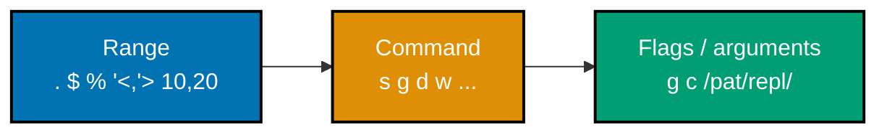
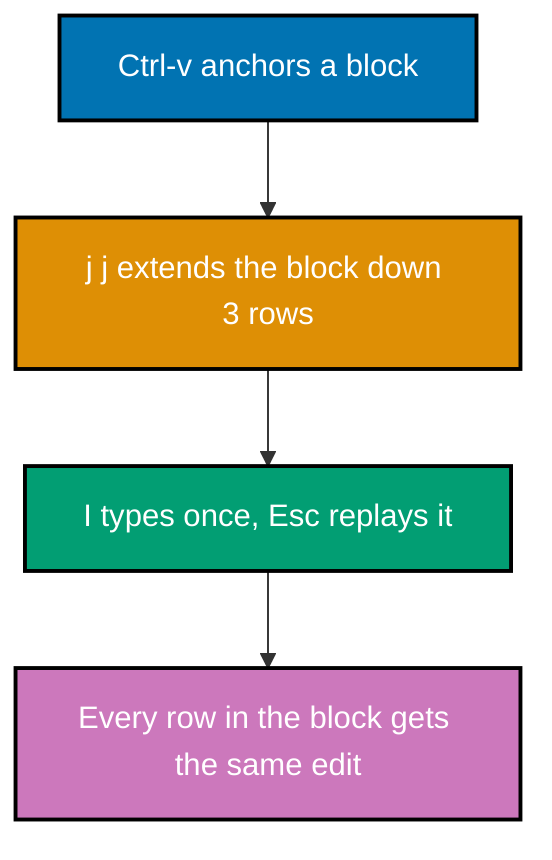
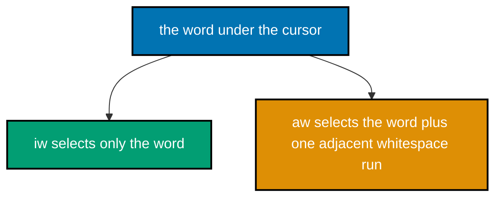
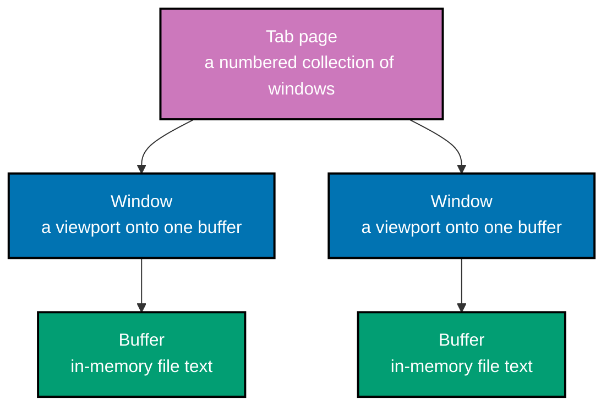

Examples 31-62 build on the beginner surface with `:substitute`, counts, Replace mode, all three Visual mode variants, the full text-object family, dot-repeat, named and numbered registers, marks and the jumplist, and the nested buffer/window/tab model.

---

### Example 31: Basic Substitute Line

_ex-31 &middot; exercises co-10_

`:substitute` performs pattern-based find/replace, and without a range or the `g` flag it only touches the current line's first match. This example shows that narrow default scope.

**Before**

```text
# buffer.txt
old old old
```

**Heavily annotated keystroke transcript**

```text
:s/old/new/<CR>                    " => `:substitute` without a range targets only the current line, and without the `g` flag replaces only the first match
                                   " => the line becomes 'new old old' -- only the first 'old' changed
```

**After**

```text
# buffer.txt
new old old
```

**Key takeaway**: `:s/pattern/replacement/` with no range and no flags replaces only the FIRST match on the CURRENT line.

**Why it matters**: Search (/, ?, n, N, \*, #) locates text interactively, while the separate `:substitute` Ex command performs pattern-based find/replace with flags controlling scope and confirmation. This narrow default is intentional and worth internalizing before reaching for the wider forms in the next two examples: `:substitute`'s scope is controlled entirely by an optional range and optional flags layered on top of this base command, rather than by a different command name. Every later substitution example (whole-file, ranged, confirmed, capture-group) is this same `:s///` core with one more piece added.

---

### Example 32: Substitute Whole File

_ex-32 &middot; exercises co-10, co-11_

Adding the `%` range and the `g` flag turns the same `:substitute` command into a whole-file, every-match replace. This example transforms every occurrence in a three-line file.



**Before**

```text
# buffer.txt
old fish
old dog
cat old
```

**Heavily annotated keystroke transcript**

```text
:%s/old/new/g<CR>                  " => the `%` range targets the whole buffer; the `g` flag replaces every match on each line, not just the first
                                   " => every 'old' becomes 'new' across all three lines
```

**After**

```text
# buffer.txt
new fish
new dog
cat new
```

**Key takeaway**: `%` (a range meaning 'every line') plus `g` (a flag meaning 'every match per line') together turn `:s` into a true whole-file replace.

**Why it matters**: Search (/, ?, n, N, \*, #) locates text interactively, while the separate `:substitute` Ex command performs pattern-based find/replace with flags controlling scope and confirmation. Neovim's Ex commands share a uniform anatomy -- an optional range, the command itself, then optional flags or arguments (co-11) -- and `:%s/old/new/g` is the clearest illustration of all three parts in one line. Recognizing `%` and `g` as independently swappable pieces, rather than a fixed idiom, is what makes ex-71's line-range and ex-70's confirm-flag variations later in this primer feel like small substitutions rather than new commands.

---

### Example 33: Count Prefixed Motion

_ex-33 &middot; exercises co-05_

A numeric count placed before a motion repeats that motion the given number of times. This example advances the cursor exactly three words in one command.

**Before**

```text
# buffer.txt
one two three four five
```

**Heavily annotated keystroke transcript**

```text
3w                                 " => a numeric count before a motion repeats it that many times: `3w` moves forward exactly 3 words
                                   " => the cursor advances from 'one' to 'four'
```

**After**

```text
# buffer.txt
one two three four five
```

**Key takeaway**: A count before a motion multiplies it: `3w` = `www`, but typed once instead of three times.

**Why it matters**: A numeric count prefix multiplies the following motion or operator+motion, scaling a single command instead of repeating a keystroke by hand. Counts are the first of two 'quantity' mechanisms this primer covers, the second being registers holding multiple past deletions (co-07). A count answers 'how many times' at the moment you type the command, which is fundamentally different from a register answering 'which past text' -- keeping the two mental models separate avoids confusing `3dd` (delete 3 lines) with `"3p` (paste from register 3), which look superficially similar but do unrelated things.

---

### Example 34: Count Prefixed Delete

_ex-34 &middot; exercises co-05_

A count also multiplies an operator+motion pair as a whole, not just a bare motion. This example deletes three lines in a single command.

**Before**

```text
# buffer.txt
line one
line two
line three
line four
```

**Heavily annotated keystroke transcript**

```text
3dd                                " => a count before an operator+motion multiplies the whole command: `3dd` deletes 3 lines starting at the cursor
                                   " => 'line one' through 'line three' are removed in a single command
```

**After**

```text
# buffer.txt
line four
```

**Key takeaway**: `3dd` deletes 3 lines in one command -- the count multiplies the entire operator+motion pair, not just the motion.

**Why it matters**: A numeric count prefix multiplies the following motion or operator+motion, scaling a single command instead of repeating a keystroke by hand. This confirms that counts compose with the FULL operator-motion-grammar from co-04, not merely with standalone motions like ex-33's `3w`. The general shape is `{count}{operator}{motion}` or equivalently `{operator}{count}{motion}` -- both `3dw` and `d3w` delete three words -- which is a small but genuinely useful flexibility once your fingers are already moving toward one order or the other.

---

### Example 35: Replace Single Char

_ex-35 &middot; exercises co-02_

`r` waits for exactly one more keystroke and uses it to replace the character under the cursor, staying in Normal mode throughout. This example swaps a single letter.

**Before**

```text
# buffer.txt
cbt
```

**Heavily annotated keystroke transcript**

```text
r                                  " => `r` waits for exactly one more keystroke to use as the replacement character
a                                  " => replaces only the character under the cursor with 'a'
                                   " => the line becomes 'abt'; the cursor stays put and Neovim remains in Normal mode
```

**After**

```text
# buffer.txt
abt
```

**Key takeaway**: `r{char}` replaces exactly one character and never leaves Normal mode, unlike `s` or `c` which open Insert mode.

**Why it matters**: Neovim exposes distinct modes -- Normal, Insert, Visual, Command-line, and Replace, plus the internal Operator-pending mode -- each with its own entry key, exit key, and keystroke semantics. `r` is a different kind of command from everything covered so far: a Normal-mode key that itself expects one more keystroke as its argument, similar in spirit to `f{char}` (find character) from the motion family. Recognizing that some Normal-mode commands 'pause' for exactly one more key -- rather than accepting a motion -- avoids the common confusion of expecting `rw` to somehow replace a whole word.

---

### Example 36: Replace Mode Typing

_ex-36 &middot; exercises co-02_

`R` enters Replace mode, a distinct mode where every typed character overwrites existing text instead of inserting new text. This example types over three characters in place.

**Before**

```text
# buffer.txt
xxxxx
```

**Heavily annotated keystroke transcript**

```text
R                                  " => enters Replace mode: subsequent typed characters overwrite rather than insert
abc<Esc>                           " => types three characters that overwrite the first three 'x's
                                   " => the line becomes 'abcxx' -- the last two original characters are untouched
```

**After**

```text
# buffer.txt
abcxx
```

**Key takeaway**: `R` is Insert mode's overwrite counterpart: typed text replaces, character for character, whatever was already there.

**Why it matters**: Neovim exposes distinct modes -- Normal, Insert, Visual, Command-line, and Replace, plus the internal Operator-pending mode -- each with its own entry key, exit key, and keystroke semantics. This is the primer's first encounter with a mode beyond the core four (Normal, Insert, Visual, Command-line), matching co-02's explicit inclusion of Replace as a distinct mode with its own semantics. `R` is far less commonly reached for than `i`/`a`/`c`, but recognizing it exists prevents mistaking accidental Replace-mode entry (a stray `R` keystroke) for a broken editor.

---

### Example 37: Visual Char Select Delete

_ex-37 &middot; exercises co-19_

Visual mode lets you see the exact span an operator will act on before committing to it. This example highlights a character range, then deletes precisely that span.

**Before**

```text
# buffer.txt
brown fox jumps
```

**Heavily annotated keystroke transcript**

```text
v                                  " => enters Visual mode (characterwise); the selection anchors at the current cursor cell
ww                                 " => extends the highlighted selection forward across two words, ending on the 'j' of 'jumps'
d                                  " => deletes exactly the highlighted span 'brown fox j'
                                   " => the line becomes 'umps' -- only the highlighted characters were removed
```

**After**

```text
# buffer.txt
umps
```

**Key takeaway**: In Visual mode, motions extend a highlighted selection instead of moving the cursor alone, and an operator afterward acts on exactly what is highlighted.

**Why it matters**: Visual mode's three variants -- `v`, `V`, and `<C-v>` -- extend a highlighted region from an anchor point that a subsequent operator acts on. Visual mode and the operator+motion grammar (co-04) are two different ways to specify the SAME thing -- 'what text should this operator touch' -- and this example proves it by reusing `w` (a plain motion from co-03) to extend a selection instead of pairing it directly with `d`. Readers who find operator+motion counting error-prone (as in `3dw`) can fall back to Visual mode to see the exact span before committing.

---

### Example 38: Visual Line Select Indent

_ex-38 &middot; exercises co-19_

`V` selects whole lines instead of individual characters, and an indent operator afterward shifts every selected line at once. This example indents three lines together.

**Before**

```text
# buffer.txt
line one
line two
line three
```

**Heavily annotated keystroke transcript**

```text
V                                  " => enters Visual mode (linewise); the whole current line highlights immediately
jj                                 " => extends the selection down two more lines, covering all three lines
>                                  " => shifts every selected line right by one shiftwidth
                                   " => all three lines are now indented by one shiftwidth (e.g. 4 spaces)
```

**After**

```text
# buffer.txt
    line one
    line two
    line three
```

**Key takeaway**: `V` (Visual Line mode) always selects whole lines; combined with `>`, it indents every selected line in a single command.

**Why it matters**: Visual mode's three variants -- `v`, `V`, and `<C-v>` -- extend a highlighted region from an anchor point that a subsequent operator acts on. `V` is the linewise sibling of characterwise `v`, matching co-19's three-variant classification (`v`/`V`/`<C-v>`), and it is the natural choice whenever the unit you care about is 'these lines' rather than 'these characters.' Multi-line indent adjustment is a routine task once you edit real code or nested lists, and doing it visually removes any risk of miscounting a `{count}>>` command.

---

### Example 39: Visual Block Insert

_ex-39 &middot; exercises co-19_

`<C-v>` (Visual Block mode) selects a rectangular column across multiple lines, and an insert afterward replays on every selected row at once. This example prefixes three lines identically.



**Before**

```text
# buffer.txt
one
two
three
```

**Heavily annotated keystroke transcript**

```text
<C-v>                              " => enters Visual Block mode; the selection anchors as a single-column block at the cursor
jj                                 " => extends the block selection down two more rows, covering column 1 on all three lines
I                                  " => opens Insert mode at the left edge of the block, but only on the first line for now
- <Esc>                            " => types the text, then `<Esc>` replays the insertion on every other line in the block
                                   " => each of the three lines now has '- ' inserted at column 1
```

**After**

```text
# buffer.txt
- one
- two
- three
```

**Key takeaway**: Visual Block `I` types once on the first line, but `<Esc>` propagates that same insertion to every line the block covers.

**Why it matters**: Visual mode's three variants -- `v`, `V`, and `<C-v>` -- extend a highlighted region from an anchor point that a subsequent operator acts on. This is the third and final Visual mode variant (co-19) and the one that most surprises newcomers coming from character-only editors: it turns 'prefix N lines with the same text' from an N-step manual process into a single four-keystroke command. It previews the sequential-increment variant of the same block selection worked later in ex-69, where `g<C-a>` replaces uniform repetition with an incrementing sequence instead.

---

### Example 40: Text Object Inner Word

_ex-40 &middot; exercises co-06_

Text objects target a semantic region regardless of exact cursor position within it. This example deletes a word using `iw` ('inner word'), leaving surrounding whitespace untouched.



**Before**

```text
# buffer.txt
  brown  fox
```

**Heavily annotated keystroke transcript**

```text
diw                                " => `d` combined with the `iw` text object deletes exactly the word under the cursor, leaving surrounding whitespace intact
                                   " => 'brown' is removed but the spaces on both sides remain: '    fox'
```

**After**

```text
# buffer.txt
    fox
```

**Key takeaway**: `diw` deletes only the word itself, not any adjacent whitespace -- the 'inner' half of the inner/around text-object pair.

**Why it matters**: Text objects select semantically meaningful regions -- a word, a bracketed group, a quoted string, a tag, a paragraph -- independent of exact cursor position. Text objects (co-06) solve a problem motions alone cannot: `diw` works correctly whether the cursor sits on the word's first, middle, or last character, whereas a motion-based `dw` gives different results depending on exact cursor position. This position-independence is precisely why text objects are the primer's next major grammar extension after plain operator+motion, and why the next example immediately contrasts `iw` against its sibling `aw`.

---

### Example 41: Text Object a Word

_ex-41 &middot; exercises co-06_

`aw` ('a word') is `iw`'s sibling: it selects the word PLUS one adjacent run of whitespace, not just the word alone. This example removes both the word and its trailing space.

**Before**

```text
# buffer.txt
  brown  fox
```

**Heavily annotated keystroke transcript**

```text
daw                                " => `d` combined with the `aw` ('a word') text object deletes the word plus one adjacent run of whitespace
                                   " => 'brown  ' (word plus the trailing spaces) is removed: '  fox'
```

**After**

```text
# buffer.txt
  fox
```

**Key takeaway**: `daw` removes the word AND one adjacent whitespace run, so repeated deletions do not leave a growing trail of extra spaces.

**Why it matters**: Text objects select semantically meaningful regions -- a word, a bracketed group, a quoted string, a tag, a paragraph -- independent of exact cursor position. The inner/around (`i`/`a`) distinction generalizes across every text object this primer covers: `i(` selects only inside parentheses while `a(` would include the parentheses themselves, and the same pattern holds for quotes and tags in the next three examples. Once `iw`/`aw` makes the distinction concrete with something as simple as a word, applying it to brackets, quotes, and tags is just recognizing the same rule in a new shape.

---

### Example 42: Text Object Inner Paren

_ex-42 &middot; exercises co-06_

`i(` selects everything between a matching pair of parentheses, wherever the cursor sits inside them. This example replaces a function call's argument list.

**Before**

```text
# buffer.txt
print(hello world)
```

**Heavily annotated keystroke transcript**

```text
ci(                                " => `c` combined with the `i(` text object deletes only the content between the matching parentheses and opens Insert mode there
                                   " => 'hello world' is deleted; the parentheses themselves remain, cursor now inside them
goodbye<Esc>                       " => types the replacement text inside the parentheses
                                   " => the line becomes 'print(goodbye)'
```

**After**

```text
# buffer.txt
print(goodbye)
```

**Key takeaway**: `ci(` (or `ci)`, both equivalent) changes only the content inside a parenthesized group, wherever the cursor is inside it -- no manual selection needed.

**Why it matters**: Text objects select semantically meaningful regions -- a word, a bracketed group, a quoted string, a tag, a paragraph -- independent of exact cursor position. Editing function-call arguments, conditional expressions, and any other parenthesized content is a constant task once you edit real code, and `ci(` handles the whole thing without hunting for exact boundary characters first. Because text objects are position-independent (co-06), this works whether the cursor sits on 'h', 'w', or the space between them -- a robustness plain motions cannot match.

---

### Example 43: Text Object Inner Quote

_ex-43 &middot; exercises co-06_

`i"` selects the text between a pair of double-quote marks, the quoted-string counterpart to `i(`. This example empties a quoted string while leaving the quotes intact.

**Before**

```text
# buffer.txt
say "hello" now
```

**Heavily annotated keystroke transcript**

```text
di"                                " => `d` combined with the `i"` text object deletes only the text between the quote marks
                                   " => the quotes remain empty: 'say "" now'
```

**After**

```text
# buffer.txt
say "" now
```

**Key takeaway**: `di"` deletes only what is inside a quoted string, leaving the quote marks themselves in place.

**Why it matters**: Text objects select semantically meaningful regions -- a word, a bracketed group, a quoted string, a tag, a paragraph -- independent of exact cursor position. String literals are one of the most common quoted-text targets in real editing, and `di"`/`ci"` (change is identical, but opens Insert mode afterward) apply the same inner-text-object logic already demonstrated on parentheses. Unlike brackets, quote text objects are not nesting-aware the way parens are, since a quote mark has no inherent "matching direction" -- Neovim instead finds the nearest quote pair around the cursor on the current line.

---

### Example 44: Text Object Inner Tag

_ex-44 &middot; exercises co-06_

`it` ('inner tag') selects the content between an opening and closing HTML/XML tag pair. This example replaces a tag's inner text while preserving the tags themselves.

**Before**

```text
# buffer.txt
<p>old text</p>
```

**Heavily annotated keystroke transcript**

```text
cit                                " => `c` combined with the `it` (inner tag) text object deletes only the content between the opening and closing tags and opens Insert mode there
                                   " => 'old text' is deleted; the `<p>` and `</p>` tags themselves remain
new text<Esc>                      " => types the replacement content
                                   " => the line becomes '<p>new text</p>'
```

**After**

```text
# buffer.txt
<p>new text</p>
```

**Key takeaway**: `cit` changes only a tag pair's inner content -- and per the Accuracy notes, tag text objects are built in, needing no plugin.

**Why it matters**: Text objects select semantically meaningful regions -- a word, a bracketed group, a quoted string, a tag, a paragraph -- independent of exact cursor position. Tag text objects extend the same inner/around grammar to markup, matching parentheses and quotes as the third bracket-like structure this primer covers. Because `it`/`at` ship in vanilla Neovim (confirmed against `motion.txt`), editing HTML, XML, or JSX-flavored text gets the identical text-object ergonomics as editing code, without needing any plugin this primer's scope explicitly excludes.

---

### Example 45: Text Object a Paragraph

_ex-45 &middot; exercises co-06_

`ap` ('a paragraph') selects an entire blank-line-delimited paragraph plus its trailing blank line, combining the co-03 paragraph motion with the text-object grammar. This example removes a whole paragraph at once.

**Before**

```text
# buffer.txt
First paragraph line one.
First paragraph line two.

Second paragraph line one.
```

**Heavily annotated keystroke transcript**

```text
dap                                " => `d` combined with the `ap` ('a paragraph') text object deletes the whole paragraph under the cursor plus its trailing blank line
                                   " => the first paragraph's two lines and the blank line after it are all removed in one command
```

**After**

```text
# buffer.txt
Second paragraph line one.
```

**Key takeaway**: `dap` removes an entire paragraph AND the blank line that separated it from the next one, avoiding a leftover empty line.

**Why it matters**: Text objects select semantically meaningful regions -- a word, a bracketed group, a quoted string, a tag, a paragraph -- independent of exact cursor position. This closes the text-object group by showing the same `i`/`a` grammar scales all the way up from a single word (ex-40/41) to a whole paragraph, unified by one consistent mental model rather than five unrelated commands to memorize. The next example shifts focus from 'what text does an edit target' to 'how do I repeat an edit I already made' -- the dot command.

---

### Example 46: Dot Repeat Edit

_ex-46 &middot; exercises co-09_

The dot command `.` repeats the most recent change verbatim at the new cursor position. This example makes one word-change, then replays it identically on a second line.

**Before**

```text
# buffer.txt
fix bug1
fix bug2
```

**Heavily annotated keystroke transcript**

```text
cwFOO<Esc>                         " => `cw` deletes the word under the cursor and opens Insert mode; typing 'FOO' then `<Esc>` completes the change
                                   " => line 1 becomes 'FOO bug1' -- the dot-repeatable change is now recorded
j0                                 " => moves down to line 2 and to column 1
.                                  " => repeats the last change verbatim at the new cursor position
                                   " => line 2 becomes 'FOO bug2' -- the same change reapplies without retyping it
```

**After**

```text
# buffer.txt
FOO bug1
FOO bug2
```

**Key takeaway**: `.` repeats the last change (an insertion or an operator+motion) exactly, at wherever the cursor currently sits.

**Why it matters**: The dot command repeats the last change verbatim at the new cursor position, turning a single edit into a repeatable, composable action across a file. The dot command is arguably the highest-leverage single key in this entire primer: it turns any change you can express as operator+motion or a short Insert-mode burst into a reusable action, applicable to every similar spot in a file by navigating and pressing `.` again. It is also the conceptual seed for macros (co-14, worked starting at ex-74), which generalize dot-repeat to arbitrary keystroke sequences instead of just the single last change.

---

### Example 47: Named Register Yank Paste

_ex-47 &middot; exercises co-07_

Named registers (`"a` through `"z`) let you stash text deliberately, independent of whatever the unnamed register currently holds. This example yanks into register `a` and pastes from it explicitly.

**Before**

```text
# buffer.txt
target line
other stuff
```

**Heavily annotated keystroke transcript**

```text
"ayy                               " => yanks the current line into the named register `a`, bypassing the unnamed register
                                   " => 'target line' is now stored specifically in register a
G                                  " => moves to the last line of the file
"ap                                " => pastes the contents of register `a` below the current line
                                   " => 'target line' appears at the end of the file, independent of whatever the unnamed register holds
```

**After**

```text
# buffer.txt
target line
other stuff
target line
```

**Key takeaway**: Prefixing a yank or paste with `"{letter}` targets a specific named register instead of the default unnamed one.

**Why it matters**: Registers are named storage slots for yanked or deleted text: named (a-z/A-Z), numbered (0-9), and special registers such as the unnamed, black hole, and yank registers. Named registers solve a problem the unnamed register alone cannot: keeping several separate pieces of text available at once without one yank overwriting another. This is the first example to explicitly address a register by name rather than relying on the implicit unnamed register used throughout the Beginner tier (ex-26), setting up the append-mode and numbered-register variations in the next two examples.

---

### Example 48: Named Register Append

_ex-48 &middot; exercises co-07_

Using an UPPERCASE register letter appends to that register instead of overwriting it, letting you accumulate multiple yanks into one slot. This example builds up register `a` across two yanks.

**Before**

```text
# buffer.txt
first line
second line
```

**Heavily annotated keystroke transcript**

```text
"ayy                               " => yanks line 1 into register `a`
                                   " => register a now holds 'first line'
j                                  " => moves down to line 2
"Ayy                               " => the uppercase register name `A` appends to register `a` instead of overwriting it
                                   " => register a now holds 'first line' followed by 'second line', not just the newest yank
```

**After**

```text
# buffer.txt
first line
second line
```

**Key takeaway**: Lowercase `"a` overwrites register `a`; uppercase `"A` appends to it -- the case of the letter alone controls the behavior.

**Why it matters**: Registers are named storage slots for yanked or deleted text: named (a-z/A-Z), numbered (0-9), and special registers such as the unnamed, black hole, and yank registers. This append behavior turns a single register into a lightweight accumulator: yanking several non-adjacent lines from different parts of a file into one register, then pasting them together elsewhere, becomes a two-keystroke habit (lowercase once, uppercase for every subsequent addition) rather than requiring a temporary scratch buffer. The next example shows the OTHER kind of register accumulation Neovim offers automatically -- numbered registers built from delete history.

---

### Example 49: Numbered Register Recall

_ex-49 &middot; exercises co-07_

Numbered registers `"1`-`"9` automatically shift with each delete, holding a short history you can reach back into. This example recalls the second-most-recent deletion, not the most recent.

**Before**

```text
# buffer.txt
line A
line B
line C
```

**Heavily annotated keystroke transcript**

```text
dd                                 " => deletes 'line A'; the numbered registers shift: register 1 now holds 'line A'
dd                                 " => deletes 'line B' (now the current line); registers shift again: register 1 holds 'line B', register 2 holds 'line A'
"2p                                " => pastes from register 2, not the default unnamed register
                                   " => 'line A' (the second-most-recent deletion) is inserted, not 'line B'
```

**After**

```text
# buffer.txt
line C
line A
```

**Key takeaway**: Registers `"1`-`"9` hold a shifting history of recent line/block deletions, with `"1` always the most recent and higher numbers progressively older.

**Why it matters**: Registers are named storage slots for yanked or deleted text: named (a-z/A-Z), numbered (0-9), and special registers such as the unnamed, black hole, and yank registers. Unlike named registers, which you fill deliberately, numbered registers fill themselves automatically on every linewise or blockwise delete -- effectively a built-in undo-adjacent 'delete history' independent of the undo tree covered next (co-13). Reaching for `"2p` after realizing you deleted the wrong thing and then deleted something else is a genuinely useful recovery technique this example makes concrete.

---

### Example 50: Set Mark and Jump

_ex-50 &middot; exercises co-08_

`m{letter}` bookmarks the current buffer position, and `'{letter}` jumps back to that mark's line later. This example sets a mark, wanders away, then returns.

**Before**

```text
# buffer.txt
line one
line two
line three
line four
```

**Heavily annotated keystroke transcript**

```text
ma                                 " => sets mark `a` at the current line (line one), bookmarking this position
G                                  " => moves to the last line of the file
'a                                 " => jumps back to the line holding mark `a`
                                   " => the cursor returns to line one, on its first non-blank column
```

**After**

```text
# buffer.txt
line one
line two
line three
line four
```

**Key takeaway**: `m{letter}` sets a named mark at the cursor; `'{letter}` (apostrophe) jumps back to that mark's line, landing on the first non-blank column.

**Why it matters**: Marks bookmark a buffer position for later recall, while the separate jumplist automatically records jump motions so Ctrl-o/Ctrl-i navigate history like browser back/forward. Marks give you deliberate, named bookmarks -- unlike the jumplist (next example), which records navigation automatically and anonymously. Setting a mark before a large edit or a long search-and-scroll session means you can return to a known-good position with two keystrokes, regardless of how much navigation happened in between.

---

### Example 51: Exact Mark Jump

_ex-51 &middot; exercises co-08_

`` `{letter} `` (backtick) jumps to a mark's exact column, unlike `'{letter}` which only guarantees the right line. This example demonstrates the column-precision difference.

**Before**

```text
# buffer.txt
    line one
line two
```

**Heavily annotated keystroke transcript**

```text
mb                                 " => sets mark `b` at the exact current cursor position, line and column
G$                                 " => moves to the last line, then to its last column -- far from the mark
`b                                 " => jumps back to mark `b`'s exact column, not just its line
                                   " => the cursor returns to column 5 precisely, unlike `'b` which would only guarantee the right line
```

**After**

```text
# buffer.txt
    line one
line two
```

**Key takeaway**: `` `{letter} `` restores the exact line AND column of a mark; `'{letter}` restores only the line, landing on the first non-blank column instead.

**Why it matters**: Marks bookmark a buffer position for later recall, while the separate jumplist automatically records jump motions so Ctrl-o/Ctrl-i navigate history like browser back/forward. This backtick-versus-apostrophe distinction mirrors the earlier `` ` `` example's own semantics: it is easy to assume both mark-jump forms are identical, but the exact-column form matters whenever you need to resume typing mid-word rather than merely revisit the right line. Knowing both exist means picking the right one deliberately instead of being surprised the cursor 'jumped to the wrong spot.'

---

### Example 52: Jumplist Navigation

_ex-52 &middot; exercises co-08_

Unlike marks, the jumplist records 'jump' motions automatically, and `<C-o>`/`<C-i>` retrace that history like browser back/forward. This example performs two jumps, then walks back and forward through them.

**Before**

```text
# buffer.txt
needle here
filler
filler
filler
filler
```

**Heavily annotated keystroke transcript**

```text
G                                  " => jumps to the last line -- a 'jump' motion, so it's recorded in the jumplist
/needle<CR>                        " => searches for 'needle' -- another jump motion, also recorded
<C-o>                              " => steps backward through the jumplist
                                   " => the cursor returns to the position before the search -- the last line
<C-o>                              " => steps backward again
                                   " => the cursor returns to the position before the very first jump
<C-i>                              " => steps forward through the jumplist again
                                   " => the cursor moves forward to the last line, retracing the path
```

**After**

```text
# buffer.txt
needle here
filler
filler
filler
filler
```

**Key takeaway**: `<C-o>` steps backward and `<C-i>` steps forward through the automatically recorded jumplist, independent of any mark you set yourself.

**Why it matters**: Marks bookmark a buffer position for later recall, while the separate jumplist automatically records jump motions so Ctrl-o/Ctrl-i navigate history like browser back/forward. The jumplist and marks solve the same navigation problem from opposite ends: marks require deliberate bookmarking, while the jumplist requires no setup at all, silently tracking every 'big' motion (per the Accuracy notes' documented jump-motions list, which notably excludes `gg`). Together they close out co-08, giving you both a manual and an automatic way back to where you came from.

---

### Example 53: Open Second File Buffer

_ex-53 &middot; exercises co-15_

`:e {file}` opens another file as a new buffer without closing the current one, the foundation of multi-file editing. This example switches the active window to a second file.

**Before**

```text
# notes.txt
first file content

# other.txt
second file content
```

**Heavily annotated keystroke transcript**

```text
:e other.txt<CR>                   " => opens 'other.txt' as a new buffer and switches the active window to show it
                                   " => the window now displays other.txt's contents; notes.txt remains open as a background buffer
```

**After**

```text
# notes.txt
first file content

# other.txt
second file content
```

**Key takeaway**: `:e {file}` loads a new buffer for that file and shows it in the current window; any previously open buffer stays loaded in the background.

**Why it matters**: A buffer is in-memory file text, a window is a viewport onto exactly one buffer, and a tab page is a numbered collection of windows -- three nested concepts with independent navigation. This example opens the co-15 group, whose three nested concepts (buffer, window, tab) this primer covers across the next six examples. A buffer here is simply 'file text Neovim knows about' -- notes.txt does not close when other.txt opens, it just stops being the window's current content, a distinction that matters the moment you need to switch back.

---

### Example 54: List and Switch Buffers

_ex-54 &middot; exercises co-15_

`:ls` lists every open buffer with its number and status, and `:b {number}` switches directly to one by that number. This example lists two buffers, then jumps to the second.

**Before**

```text
# a.txt
buffer one content

# b.txt
buffer two content
```

**Heavily annotated keystroke transcript**

```text
:ls<CR>                            " => lists every open buffer with its number, name, and status
                                   " => the listing shows buffer 1 'a.txt' and buffer 2 'b.txt'
:b 2<CR>                           " => switches the active window to buffer number 2
                                   " => the window now displays b.txt's contents
```

**After**

```text
# a.txt
buffer one content

# b.txt
buffer two content
```

**Key takeaway**: `:ls` shows every open buffer's number; `:b {number}` (or `:b {name}`) jumps straight to one of them.

**Why it matters**: A buffer is in-memory file text, a window is a viewport onto exactly one buffer, and a tab page is a numbered collection of windows -- three nested concepts with independent navigation. Once more than a couple of files are open, `:e` alone becomes inconvenient for revisiting an already-loaded buffer -- `:ls` plus `:b` gives you direct, numbered access without retyping a filename or navigating the filesystem again. This pairing is the buffer-management equivalent of the mark-and-jump pattern from co-08: bookmark (implicitly, by opening), then jump back by a short identifier.

---

### Example 55: Cycle Buffers

_ex-55 &middot; exercises co-15_

`:bnext` and `:bprevious` step through the open buffer list in order, without needing to know a buffer's exact number. This example cycles forward one buffer, then back.

**Before**

```text
# a.txt
buffer a

# b.txt
buffer b

# c.txt
buffer c
```

**Heavily annotated keystroke transcript**

```text
:bnext<CR>                         " => advances to the next buffer in the list
                                   " => the active buffer becomes #2 (b.txt)
:bprevious<CR>                     " => moves back to the previous buffer in the list
                                   " => the active buffer returns to #1 (a.txt)
```

**After**

```text
# a.txt
buffer a

# b.txt
buffer b

# c.txt
buffer c
```

**Key takeaway**: `:bnext`/`:bprevious` cycle relatively through the buffer list, complementing `:ls`+`:b {number}`'s absolute jump.

**Why it matters**: A buffer is in-memory file text, a window is a viewport onto exactly one buffer, and a tab page is a numbered collection of windows -- three nested concepts with independent navigation. Relative cycling is faster than looking up a number when you just want to 'move one over' -- reviewing three or four related files in sequence, for instance -- while the numbered `:b` from the previous example is faster when you know exactly which buffer you want. Having both styles available covers the two most common ways people think about switching between open files.

---

### Example 56: Horizontal Split Navigate

_ex-56 &middot; exercises co-15_

`:split` divides the current window into two horizontal viewports onto the same buffer, and `<C-w>` plus a direction moves focus between them. This example opens a split and toggles focus.



**Before**

```text
# buffer.txt
shared content
```

**Heavily annotated keystroke transcript**

```text
:split<CR>                         " => opens a second horizontal viewport onto the same buffer
                                   " => the window is now divided top and bottom, both showing buffer.txt
<C-w>j                             " => moves focus to the window below
<C-w>k                             " => moves focus to the window above
                                   " => focus toggles between the top and bottom windows
```

**After**

```text
# buffer.txt
shared content
```

**Key takeaway**: `:split` creates a horizontal window division; `<C-w>` followed by `hjkl` moves focus in that direction between windows.

**Why it matters**: A buffer is in-memory file text, a window is a viewport onto exactly one buffer, and a tab page is a numbered collection of windows -- three nested concepts with independent navigation. This is the first example to show a window as genuinely distinct from a buffer (co-15): both split windows view the SAME buffer, so an edit in one is immediately visible in the other. The `<C-w>` prefix followed by a direction reuses the familiar `hjkl` vocabulary from co-03, applying it to window focus instead of cursor movement -- Neovim reusing a small vocabulary across contexts.

---

### Example 57: Vertical Split Navigate

_ex-57 &middot; exercises co-15_

`:vsplit` mirrors `:split` but divides the window left and right instead of top and bottom. This example opens a vertical split and toggles focus between the two sides.

**Before**

```text
# buffer.txt
shared content
```

**Heavily annotated keystroke transcript**

```text
:vsplit<CR>                        " => opens a second vertical viewport onto the same buffer
                                   " => the window is now divided left and right
<C-w>l                             " => moves focus to the window on the right
<C-w>h                             " => moves focus to the window on the left
                                   " => focus toggles between the left and right windows
```

**After**

```text
# buffer.txt
shared content
```

**Key takeaway**: `:vsplit` creates a vertical window division, navigated with `<C-w>h`/`<C-w>l` instead of the horizontal split's `<C-w>j`/`<C-w>k`.

**Why it matters**: A buffer is in-memory file text, a window is a viewport onto exactly one buffer, and a tab page is a numbered collection of windows -- three nested concepts with independent navigation. `:split`/`:vsplit` together cover both axes of window division, and picking between them is purely about which layout suits the content -- wide code benefits from vertical splits (more horizontal room per file), while comparing many short lines benefits from horizontal ones. Both compose with everything from co-15: each split window can show a different buffer via `:e` or `:b`, independently of the other.

---

### Example 58: Open New Tab

_ex-58 &middot; exercises co-15_

`:tabnew` opens an entirely new, numbered tab page, and `gt`/`gT` cycle forward and backward through open tabs. This example opens a second tab, then cycles between both.

**Before**

```text
# buffer.txt
tab one content
```

**Heavily annotated keystroke transcript**

```text
:tabnew<CR>                        " => opens a new, numbered tab page with an empty buffer
                                   " => there are now two tab pages; the new one is active
gt                                 " => cycles forward to the next tab page
                                   " => focus wraps back to tab 1
gT                                 " => cycles backward to the previous tab page
                                   " => focus returns to tab 2
```

**After**

```text
# buffer.txt
tab one content
```

**Key takeaway**: `:tabnew` opens a new tab page (a numbered collection of windows); `gt`/`gT` cycle forward/backward through open tabs, wrapping at the ends.

**Why it matters**: A buffer is in-memory file text, a window is a viewport onto exactly one buffer, and a tab page is a numbered collection of windows -- three nested concepts with independent navigation. Per the Accuracy notes, tab pages are numbered left-to-right rather than named -- there is no built-in `:tabname` mechanism, unlike buffers which carry filenames. A tab page is best thought of as an entire independent window layout (its own splits, its own buffers visible) rather than a single-buffer container, completing the three-level buffer/window/tab nesting this co-15 group has built up across six examples.

---

### Example 59: Write All Buffers

_ex-59 &middot; exercises co-15_

`:wa` writes every modified buffer to disk in a single command, instead of switching to and saving each one individually. This example modifies two buffers, then saves both at once.

**Before**

```text
# a.txt
a original

# b.txt
b original
```

**Heavily annotated keystroke transcript**

```text
:e a.txt<CR>                       " => opens a.txt
A appended<Esc>                    " => appends text, marking a.txt as modified
:e b.txt<CR>                       " => switches to b.txt, keeping a.txt open in the background
A appended<Esc>                    " => appends text, marking b.txt as modified too
:wa<CR>                            " => writes every modified buffer to disk in a single command
                                   " => both a.txt and b.txt are saved, without switching to each one individually
```

**After**

```text
# a.txt
a original appended

# b.txt
b original appended
```

**Key takeaway**: `:wa` (write-all) saves every modified buffer in one command, closing out this primer's buffer/window/tab group.

**Why it matters**: A buffer is in-memory file text, a window is a viewport onto exactly one buffer, and a tab page is a numbered collection of windows -- three nested concepts with independent navigation. Once you routinely have several buffers open across splits and tabs, saving each one individually before running a build or test command becomes tedious and error-prone -- `:wa` removes that friction entirely. This pairs naturally with the terminal-first workflow (co-20) covered at the very end of the primer: save everything, then run the build, with no risk of testing against a stale file.

---

### Example 60: Join Lines

_ex-60 &middot; exercises co-04_

`J` joins the next line onto the current one, inserting a single space between them -- a line-level operator with an implicit motion. This example merges two lines into one.

**Before**

```text
# buffer.txt
brown fox
jumps high
```

**Heavily annotated keystroke transcript**

```text
J                                  " => joins the next line onto the current one, inserting a single space between them
                                   " => the two lines merge into one: 'brown fox jumps high'
```

**After**

```text
# buffer.txt
brown fox jumps high
```

**Key takeaway**: `J` merges the next line onto the current one with a single space inserted at the join point.

**Why it matters**: Commands compose as operator + count + motion-or-text-object, so a small operator vocabulary combines with an open-ended motion vocabulary to cover almost any edit. `J` returns this primer to the operator+motion family after the co-15 buffer/window/tab detour, showing that not every command in that family follows the `{operator}{motion}` two-key shape -- some, like `J`, `x`, and `D`, are single keys with a fixed, implicit target. Its close cousin `gJ` (next example) removes the one behavior `J` adds (the inserted space), making the contrast between the two immediate.

---

### Example 61: Join Lines No Space

_ex-61 &middot; exercises co-04_

`gJ` joins lines exactly like `J` but WITHOUT inserting a space at the join point. This example merges two lines directly, preserving no gap between them.

**Before**

```text
# buffer.txt
brown fox
jumps high
```

**Heavily annotated keystroke transcript**

```text
gJ                                 " => joins the next line onto the current one with no inserted space
                                   " => the two lines merge directly: 'brown foxjumps high'
```

**After**

```text
# buffer.txt
brown foxjumps high
```

**Key takeaway**: `gJ` is `J` without the automatically inserted space -- useful whenever the joined text should not gain extra whitespace.

**Why it matters**: Commands compose as operator + count + motion-or-text-object, so a small operator vocabulary combines with an open-ended motion vocabulary to cover almost any edit. The `g`-prefixed variant pattern seen here recurs throughout Neovim: `gJ` versus `J`, and later `gu`/`gU` versus a hypothetical case-toggle, generally mean 'the same operation, but a slightly different variant' rather than something unrelated. Recognizing the `g`-prefix convention as a family, not a one-off exception, makes `gu`/`gU` in the Advanced tier feel familiar rather than arbitrary.

---

### Example 62: Decrease Indent

_ex-62 &middot; exercises co-04_

`<<` shifts the current line left by one shiftwidth, the doubled-key linewise shortcut applied to the indent operator. This example removes one level of indentation.

**Before**

```text
# buffer.txt
    indented line
```

**Heavily annotated keystroke transcript**

```text
<<                                 " => shifts the current line left by one shiftwidth
                                   " => the leading indentation shrinks, e.g. from 4 spaces to 0
```

**After**

```text
# buffer.txt
indented line
```

**Key takeaway**: `<<` decreases the current line's indentation by one shiftwidth; `>>` (its mirror) increases it.

**Why it matters**: Commands compose as operator + count + motion-or-text-object, so a small operator vocabulary combines with an open-ended motion vocabulary to cover almost any edit. This closes the Intermediate tier by returning one more time to the doubled-key linewise shortcut pattern first seen with `dd` and `yy`: `<<`/`>>` apply the indent-shift operator to the whole current line without needing a motion argument. The Advanced tier that follows immediately extends this exact indent operator to a count-prefixed, Visually-selected multi-line form in its very first example.

---

← Previous: [Beginner Examples](./beginner.md) · Next: [Advanced Examples](./advanced.md) →
