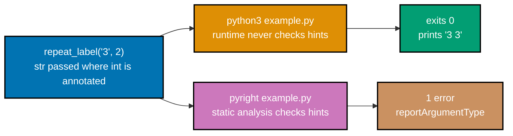

Examples 61-84 cover `argparse` CLIs, multi-module packages, custom exception classes and exception
chaining, dataclasses, ruff-clean typed signatures, generator functions, custom context managers,
JSON pipelines, `pytest` unit tests, and static type checking with `pyright` -- including the one case
where `pyright` catches a bug that `python3` itself does not. Run each example with `python3 <file>.py`
from inside its own directory unless a caption says otherwise.

---

### Example 61: argparse CLI with a Positional Argument

_ex-61 &middot; exercises co-20_

`argparse` is the standard library's CLI-argument parser -- `add_argument("name", ...)` with no
leading dashes declares a **required positional** argument.

**`learning/code/ex-61-argparse-cli/cli.py`**

```python
"""Example 61: argparse CLI with a Positional Argument."""

import argparse  # => imports the standard-library CLI-parsing module


def main() -> None:  # => defines the entry point, called only when run directly
    parser = argparse.ArgumentParser(description="Greet someone by name.")
    # => creates a parser; description shows up in the auto-generated --help text
    # A required positional argument -- no leading dashes.
    parser.add_argument("name", type=str, help="the name to greet")
    args = parser.parse_args()  # => parses sys.argv -- args.name holds the value
    print(f"Hello, {args.name}")  # => prints the greeting using the parsed name


if __name__ == "__main__":  # => True only when cli.py is run directly, not imported
    main()  # => calls main(), which builds the parser and prints the greeting
# => Run: python3 cli.py Ada -- Output: Hello, Ada
```

**Run**: `python3 cli.py Ada`

**Output**:

```text
Hello, Ada
```

**Key takeaway**: `parser.parse_args()` reads `sys.argv` automatically -- `args.name` holds whatever
string the caller passed as the first positional argument.

**Why it matters**: `argparse` is the standard-library default for building command-line tools --
every later CLI in this primer (Examples 62-63, 81) builds directly on this same
`ArgumentParser`/`add_argument`/`parse_args` shape.

---

### Example 62: argparse Optional `store_true` Flag

_ex-62 &middot; exercises co-20_

`action="store_true"` declares an optional boolean flag -- present on the command line means `True`,
absent means `False`, and no value needs to follow it.

**`learning/code/ex-62-argparse-optional-flag/cli.py`**

```python
"""Example 62: argparse Optional store_true Flag."""

# store_true flags don't take a value -- their mere presence sets the attribute True.
import argparse  # => imports the standard-library CLI-parsing module


def main() -> None:  # => defines the entry point, called only when run directly
    parser = argparse.ArgumentParser(description="Greet someone by name.")
    # => creates the parser; description appears in the auto-generated --help text
    parser.add_argument("name", type=str, help="the name to greet")
    # => a required positional argument, same as Example 61
    parser.add_argument(
        "--upper",  # => the flag's name -- accessed later as args.upper
        action="store_true",  # => present -> True, absent -> False; no value needed
        help="uppercase the greeting",  # => shown in --help output
    )  # => closes add_argument(...)
    args = parser.parse_args()  # => parses sys.argv, matching --upper if present
    message = f"Hello, {args.name}"  # => the base greeting, before any uppercasing
    print(message.upper() if args.upper else message)  # => branches on the flag


if __name__ == "__main__":  # => True only when cli.py is run directly, not imported
    main()  # => calls main(), which builds the parser and prints the greeting
# => Run: python3 cli.py Ada --upper -- Output: HELLO, ADA
```

**Run**: `python3 cli.py Ada --upper`

**Output**:

```text
HELLO, ADA
```

**Key takeaway**: `--upper` needs no value after it -- `store_true` flags are pure booleans, unlike
`add_argument("name", ...)`'s required positional in Example 61.

**Why it matters**: `store_true`/`store_false` cover the overwhelming majority of real CLI flags
(`--verbose`, `--dry-run`, `--force`) -- most command-line tools have far more boolean switches than
value-taking options.

---

### Example 63: argparse `-h`/`--help`

_ex-63 &middot; exercises co-20_

`argparse` auto-generates a `-h`/`--help` flag for every parser -- no code needed to add it, and it
prints a usage block built from the `description` and every `add_argument(..., help=...)` call.

**`learning/code/ex-63-argparse-help/cli.py`**

```python
"""Example 63: argparse -h/--help."""

import argparse  # => imports the standard-library CLI-parsing module


def main() -> None:  # => defines the entry point, called only when run directly
    # prog fixes the shown program name, regardless of the real filename.
    parser = argparse.ArgumentParser(
        prog="cli.py",  # => overrides sys.argv[0] in the usage/help text
        description="Greet someone by name.",  # => shown at the top of --help output
    )  # => closes ArgumentParser(...)
    parser.add_argument("name", type=str, help="the name to greet")
    # argparse auto-generates -h/--help -- no code needed for it.
    # parse_args() itself exits before returning if -h/--help was passed.
    args = parser.parse_args()
    print(f"Hello, {args.name}")  # => prints the greeting using the parsed name


if __name__ == "__main__":  # => True only when cli.py is run directly, not imported
    main()  # => calls main(), which builds the parser and prints the greeting
# => Run: python3 cli.py -h -- prints a usage block and exits 0
```

**Run**: `python3 cli.py -h`

**Output** (genuinely captured):

```text
usage: cli.py [-h] name

Greet someone by name.

positional arguments:
  name        the name to greet

options:
  -h, --help  show this help message and exit
```

**Exit code**: `0`.

**Key takeaway**: `-h`/`--help` exits `0` (unlike an error, which exits non-zero) -- printing help is
considered successful execution, not a failure.

**Why it matters**: Every `add_argument(..., help="...")` string you write becomes part of this
auto-generated usage block -- writing a clear `help=` string for every argument is effectively free
documentation your CLI's users see without you writing a separate `--help` handler.

---

### Example 64: Multi-Module Package

_ex-64 &middot; exercises co-20_

A directory with an `__init__.py` is a Python **package** -- `__main__.py` inside it is the file
`python3 -m <package>` runs automatically, and modules within the package import each other with a
plain `from app.util import ...`.

**`learning/code/ex-64-multi-module-package/app/__init__.py`**

```python
"""Example 64: app package -- makes `app` importable and runnable as `python3 -m app`."""
```

**`learning/code/ex-64-multi-module-package/app/util.py`**

```python
"""Example 64: app.util -- a small helper imported by app.__main__."""


def shout(text: str) -> str:  # => a plain typed function, no dependency on __main__
    return text.upper() + "!"  # => uppercases text and appends an exclamation mark
```

**`learning/code/ex-64-multi-module-package/app/__main__.py`**

```python
"""Example 64: app.__main__ -- entry point for `python3 -m app`."""

from app.util import shout  # => cross-module import within the SAME package


def main() -> None:  # => defines the entry point run by `python3 -m app`
    print(shout("hello from a package"))  # => Output: HELLO FROM A PACKAGE!


if __name__ == "__main__":  # => True when run via `python3 -m app`
    main()  # => calls main(), which prints the shouted greeting
# => `python3 -m app` finds __main__.py automatically -- no need to name the file explicitly
```

**Run**: `python3 -m app` (from the directory containing `app/`)

**Output**:

```text
HELLO FROM A PACKAGE!
```

**Key takeaway**: `python3 -m app` looks for `app/__main__.py` specifically -- this is what lets
`python3 -m app` work the same way `python3 -m venv` or `python3 -m pytest` do (every one of those is
itself a package with a `__main__.py`).

**Why it matters**: This exact three-file shape (`__init__.py`, a logic module, `__main__.py`) is
the minimal, complete pattern the capstone scales up: one `app/` package with `transform.py` and
`__main__.py`, run the identical way with `python3 -m app`.

---

### Example 65: Custom Exception Class

_ex-65 &middot; exercises co-21, co-24_

Subclassing the built-in `Exception` class creates a brand-new, specific exception type -- combining
Example 59's class syntax with Example 48's `try`/`except` handling.

**`learning/code/ex-65-custom-exception-class/example.py`**

```python
"""Example 65: Custom Exception Class."""


# Subclassing Exception makes a NEW, specific error type.
class InvalidInputError(Exception):  # => defines a custom exception type
    """Raised when user-supplied input fails validation."""  # => shown by help() / tracebacks


# Defines parse_positive, which validates and converts raw.
def parse_positive(raw: str) -> int:
    value = int(raw)  # => converts raw to int; raises ValueError itself if not numeric
    if value <= 0:  # => the custom validation this function adds beyond int()
        raise InvalidInputError(f"expected a positive integer, got {value}")
        # => raises the custom exception with a descriptive message
    return value  # => only reached when value is > 0


try:  # => wraps the call so we can catch the custom exception below
    parse_positive("-5")  # => raises InvalidInputError("expected...got -5")
except InvalidInputError as err:  # => catches ONLY this custom type
    # => Output: rejected: expected a positive integer, got -5
    print(f"rejected: {err}")  # => str(err) is the message from InvalidInputError(...)
```

**Run**: `python3 example.py`

**Output**:

```text
rejected: expected a positive integer, got -5
```

**Key takeaway**: `class InvalidInputError(Exception):` with just a docstring is a complete, usable
exception type -- `f"{err}"` automatically renders whatever message string was passed to
`InvalidInputError(...)`.

**Why it matters**: A custom exception class documents intent far better than reusing a generic
`ValueError` for every failure mode -- catching `except InvalidInputError:` specifically (rather than
`except ValueError:`) tells a reader exactly which failure this handler is designed for, and the
capstone's own input-validation path raises a custom exception for exactly this reason.

---

### Example 66: Re-raise With Context (`raise ... from err`)

_ex-66 &middot; exercises co-21_

`raise NewError(...) from original_err` chains one exception into another's traceback -- the reader
sees both the root cause and the higher-level error it triggered, in order.

**`learning/code/ex-66-reraise-with-context/example.py`**

```python
"""Example 66: Re-raise With Context (`raise ... from err`)."""


# Defines load_config, which converts raw or raises with the original error chained.
def load_config(raw: str) -> int:
    try:  # => wraps the conversion so a ValueError can be re-raised as a RuntimeError
        return int(raw)  # => raises ValueError here when raw isn't numeric
    except ValueError as err:  # => catches the ORIGINAL exception to chain it below
        raise RuntimeError("config value must be an integer") from err
        # => `from err` chains the ORIGINAL exception into the new one's traceback


# The uncaught exception below propagates all the way to the interpreter.
load_config("not-a-number")  # => uncaught -- traceback shows BOTH exceptions, in order
```

**Run**: `python3 example.py`

**Output** (genuinely captured -- both tracebacks appear, joined by Python's own chaining message):

```text
Traceback (most recent call last):
  File ".../ex-66-reraise-with-context/example.py", line 7, in load_config
    return int(raw)  # => raises ValueError here when raw isn't numeric
ValueError: invalid literal for int() with base 10: 'not-a-number'

The above exception was the direct cause of the following exception:

Traceback (most recent call last):
  File ".../ex-66-reraise-with-context/example.py", line 14, in <module>
    load_config("not-a-number")  # => uncaught -- traceback shows BOTH exceptions, in order
    ~~~~~~~~~~~^^^^^^^^^^^^^^^^
  File ".../ex-66-reraise-with-context/example.py", line 9, in load_config
    raise RuntimeError("config value must be an integer") from err
RuntimeError: config value must be an integer
```

**Exit code**: non-zero (`$?` is `1`).

**Key takeaway**: `raise ... from err` produces the "The above exception was the direct cause of the
following exception" separator -- without `from err`, Python would still show both tracebacks, but
labeled "During handling of the above exception, another exception occurred" instead, implying an
accidental rather than a deliberate chain.

**Why it matters**: Wrapping a low-level exception (`ValueError: invalid literal for int()...`) in a
higher-level, more meaningful one (`RuntimeError: config value must be an integer`) is a common,
useful pattern -- `from err` is what keeps the original diagnostic detail visible instead of losing
it.

---

### Example 67: dataclass

_ex-67 &middot; exercises co-24, co-06_

`@dataclass` auto-generates `__init__` and `__repr__` from a class's annotated fields -- Example 59's
`__init__` and Example 60's `__repr__`, both written for free.

**`learning/code/ex-67-dataclass/example.py`**

```python
"""Example 67: dataclass."""

# @dataclass auto-generates __init__ and __repr__ from the annotated fields below.
from dataclasses import dataclass  # => imports the decorator that generates boilerplate


@dataclass  # => applies the decorator to the class defined right below it
class Point:  # => defines a plain data-holder class
    x: int  # => declares a field named x, typed int
    y: int  # => declares a field named y, typed int


print(Point(1, 2))  # => Output: Point(x=1, y=2) -- no __repr__ written by hand
```

**Run**: `python3 example.py`

**Output**:

```text
Point(x=1, y=2)
```

**Key takeaway**: `x: int` and `y: int`, with no `__init__` written anywhere, are enough for
`Point(1, 2)` to work -- `@dataclass` reads the class body's annotations and generates the
constructor and `__repr__` from them.

**Why it matters**: This is the same `Point` class from Examples 59-60, four lines shorter --
`@dataclass` is the idiomatic Python shortcut whenever a class is mostly typed data with little or no
custom behavior, which describes a large share of real-world classes.

---

### Example 68: Typed Signatures, ruff-clean

_ex-68 &middot; exercises co-06, co-03_

`str | None` (PEP 604) is the modern union-type syntax, replacing the older `Optional[str]` spelling
-- this example's whole point is that `ruff check` reports zero findings against it.

**`learning/code/ex-68-typed-signatures-ruff-clean/example.py`**

```python
"""Example 68: Typed Signatures, ruff-clean."""

# Defers annotation evaluation (not needed on 3.14, kept here for portability).
from __future__ import annotations


# `str | None` (PEP 604) is the modern spelling of `Optional[str]`.
def join_names(names: list[str], sep: str | None = None) -> str:
    # sep defaults to ", " when the caller omits it or passes None explicitly.
    separator = sep if sep is not None else ", "
    return separator.join(names)  # => joins names using the resolved separator


# ruff-clean means `ruff check` reports zero findings against this file.
print(join_names(["Ada", "Grace"]))  # => Output: Ada, Grace
```

**Run**: `python3 example.py`, then `ruff check example.py`

**Output**:

```text
Ada, Grace
```

**`ruff check` output** (genuinely captured):

```text
All checks passed!
```

**Key takeaway**: `sep: str | None = None` combined with `sep if sep is not None else ", "` is the
idiomatic "optional string parameter with a real default" pattern -- `ruff check` confirms the
signature and its usage are clean by every rule in its default rule set.

**Why it matters**: A "clean" example in this primer means both `ruff check` (linting) and, later,
`pyright` (type checking, Examples 83-84) pass -- two distinct, complementary quality gates this
entire book holds every example to (DD-39).

---

### Example 69: Comprehension + JSON Transform

_ex-69 &middot; exercises co-14, co-23_

A list comprehension reshaping JSON-parsed data is one of the most common real Python scripts: read
JSON, transform each record, write JSON back out.

**`learning/code/ex-69-comprehension-json-transform/people.json`**

```json
[{ "name": "ada" }, { "name": "grace" }, { "name": "alan" }]
```

**`learning/code/ex-69-comprehension-json-transform/example.py`**

```python
"""Example 69: Comprehension + JSON Transform."""

import json  # => imports the standard-library json module

with open("people.json") as f:  # => opens the source data file for reading
    people: list[dict[str, str]] = json.load(f)  # => a list of {"name": ...} records

# Builds a NEW list -- the original `people` list is untouched.
uppercased: list[dict[str, str]] = [{"name": p["name"].upper()} for p in people]

# Writes the transformed list to a separate output file, not overwriting the source.
with open("people_out.json", "w") as f:
    json.dump(uppercased, f)  # => serializes uppercased directly to the open file

# Reopening proves the write actually landed on disk, not just in memory.
with open("people_out.json") as f:  # => reopens the file just written, to verify it
    print(json.load(f))
# => Output: [{'name': 'ADA'}, {'name': 'GRACE'}, {'name': 'ALAN'}]
```

**Run**: `python3 example.py`

**Output**:

```text
[{'name': 'ADA'}, {'name': 'GRACE'}, {'name': 'ALAN'}]
```

**Key takeaway**: `[{"name": p["name"].upper()} for p in people]` builds an entirely new list of new
dicts -- the original `people` list (and its dicts) is never mutated.

**Why it matters**: "Read JSON, comprehend/transform, write JSON" is the exact shape of the
capstone's own pipeline (Example 72 does the filtering variant of this same shape) -- this three-step
pattern covers a large share of real small-script data work.

---

### Example 70: Generator Function with `yield`

_ex-70 &middot; exercises co-14_

A `def` containing `yield` becomes a generator **function** -- calling it doesn't run the body
immediately; it returns an iterator that runs the body lazily, one `yield` at a time.

**`learning/code/ex-70-generator-function-yield/example.py`**

```python
"""Example 70: Generator Function with yield."""

# Imports Iterator for typing the generator's return.
from collections.abc import Iterator


def count_up_to(n: int) -> Iterator[int]:  # => a generator function -- contains yield
    for i in range(n):  # => iterates i over 0, 1, ..., n-1
        yield i  # => pauses here and hands back i -- resumes on the NEXT value requested


# list() forces the generator to run to completion, collecting every yielded value.
print(list(count_up_to(3)))  # => list() drains the generator fully -- Output: [0, 1, 2]
```

**Run**: `python3 example.py`

**Output**:

```text
[0, 1, 2]
```

**Key takeaway**: `count_up_to(3)` returns a generator object immediately, without running any loop
iterations -- `list(...)` is what actually drives it to completion, pulling one value at a time until
it's exhausted.

**Why it matters**: A generator function is the `def`-based counterpart to Example 33's generator
_expression_ -- both are lazy, but a generator function can hold arbitrarily complex logic (loops,
conditionals, multiple `yield` points) that a single-expression generator expression cannot.

---

### Example 71: Custom Context Manager (`__enter__`/`__exit__`)

_ex-71 &middot; exercises co-24, co-22_

Implementing `__enter__` and `__exit__` on a class makes it usable in a `with` block -- this is the
exact protocol `open()` itself implements, made visible by writing one from scratch.


**`learning/code/ex-71-context-manager-custom/example.py`**

```python
"""Example 71: Custom Context Manager (__enter__/__exit__)."""

# Imports the type used to annotate __exit__'s traceback argument.
from types import TracebackType


class Session:  # => defines a class implementing the context-manager protocol
    def __enter__(self) -> "Session":  # => runs when the `with` block is entered
        print("enter")  # => Output line 1: enter
        return self  # => becomes the `as` target, if one is written

    # Runs when the `with` block exits, whether normally or via an exception.
    # All three exception args are None below, since the body raises nothing.
    def __exit__(
        self,  # => the instance itself, bound automatically like any other method
        exc_type: type[BaseException] | None,  # => exception class, or None if no error
        exc_value: BaseException | None,  # => exception instance, or None if no error
        traceback: TracebackType | None,  # => traceback object, or None if no error
    ) -> None:  # => returning None (falsy) means: don't suppress the exception
        print("exit")  # => runs on the way out -- Output line 3: exit, even on error


with Session():  # => calls __enter__() on entry, __exit__() on exit -- guaranteed
    print("body")  # => Output line 2: body -- runs between enter and exit
```

**Run**: `python3 example.py`

**Output**:

```text
enter
body
exit
```

**Key takeaway**: `__enter__` runs when the `with` block starts, the block's body runs next, and
`__exit__` runs on the way out -- unconditionally, exactly like `finally` in Example 49, even if the
body raises.

**Why it matters**: Every `with open(...)` in Examples 52-54, 57-58 relies on `open()`'s own
`__enter__`/`__exit__` implementation to guarantee the file closes -- writing `Session` here makes
that previously-invisible mechanism concrete and inspectable.

---

### Example 72: JSON File Roundtrip Pipeline

_ex-72 &middot; exercises co-22, co-23, co-14_

Reading, filtering with a comprehension, and writing JSON back out -- the filtering sibling of
Example 69's transforming pipeline.


**`learning/code/ex-72-json-file-roundtrip-pipeline/in.json`**

```json
[
  { "name": "ada", "active": true },
  { "name": "grace", "active": false },
  { "name": "alan", "active": true }
]
```

**`learning/code/ex-72-json-file-roundtrip-pipeline/example.py`**

```python
"""Example 72: JSON File Roundtrip Pipeline."""

import json  # => imports the standard-library json module

with open("in.json") as f:  # => opens the source data file for reading
    records: list[dict[str, object]] = json.load(f)  # => 3 records, mixed active flags

# Drops every record whose "active" field is falsy.
kept: list[dict[str, object]] = [r for r in records if r["active"]]

with open("out.json", "w") as f:  # => opens the destination file for writing
    json.dump(kept, f)  # => serializes the filtered list directly to the open file

# Reopening proves the write landed on disk -- this is a genuine roundtrip, not an assumption.
with open("out.json") as f:  # => reopens the file just written, to verify the result
    print(json.load(f))  # => only the two active=true records survive
```

**Run**: `python3 example.py`

**Output**:

```text
[{'name': 'ada', 'active': True}, {'name': 'alan', 'active': True}]
```

**Key takeaway**: `[r for r in records if r["active"]]` is Example 30's comprehension-filter pattern
applied directly to JSON-shaped data -- "grace" (whose `"active"` is `false`) never makes it into
`kept`.

**Why it matters**: `dict[str, object]` (rather than a more specific type) is a deliberately honest
annotation here -- each record's values are a mix of `str` and `bool`, and `object` is the accurate
common type. Example 81's `TypedDict` shows the more precise alternative when a JSON record's exact
shape is known ahead of time.

---

### Example 73: Uncaught Exception -> Non-zero Exit Code

_ex-73 &middot; exercises co-21, co-01_

An uncaught exception doesn't just print a traceback -- it also sets the process's exit code to
non-zero, which is how shell scripts and CI pipelines detect that a Python program failed.

**`learning/code/ex-73-exception-exit-code/crash.py`**

```python
"""Example 73: Uncaught Exception -> Non-zero Exit Code."""

data: dict[str, int] = {"a": 1}
print(data["missing"])  # => raises KeyError, uncaught -- the process exits non-zero
# => Run: python3 crash.py; echo $? -- prints a traceback, then a non-zero exit code
```

**Run**: `python3 crash.py; echo $?`

**Output** (genuinely captured):

```text
Traceback (most recent call last):
  File ".../ex-73-exception-exit-code/crash.py", line 4, in <module>
    print(data["missing"])  # => raises KeyError, uncaught -- the process exits non-zero
          ~~~~^^^^^^^^^^^
KeyError: 'missing'
1
```

**Key takeaway**: the final `1` on its own line is `echo $?` printing the exit code of the just-run
`python3 crash.py` -- any uncaught exception produces exit code `1`.

**Why it matters**: This is exactly the mechanism a shell script, a CI job, or a `Makefile` target
relies on to know a Python program failed -- a non-zero exit code is the universal cross-language
signal, and Python raises it automatically on any uncaught exception, with zero extra code required.

---

### Example 74: pytest Unit Test

_ex-74 &middot; exercises co-17_

`pytest` discovers any function named `test_*` automatically -- no test-registration boilerplate, no
base class to inherit from, just a bare `assert`.

**`learning/code/ex-74-pytest-unit-test/calc.py`**

```python
"""Example 74: a pure typed function under pytest."""


def add(a: int, b: int) -> int:  # => no side effects -- trivial to test in isolation
    return a + b  # => returns the sum, nothing else
```

**`learning/code/ex-74-pytest-unit-test/test_calc.py`**

```python
"""Example 74: pytest unit test for calc.add."""

from calc import add  # => imports the function under test


# pytest discovers any function named test_* automatically.
def test_add() -> None:
    # A bare assert -- pytest reports failures with a full diff.
    assert add(2, 3) == 5  # => passes because add(2, 3) really does equal 5


# => Run: pytest -- Output: 1 passed
```

**Run**: `pytest -q` (from inside `ex-74-pytest-unit-test/`)

**Output** (genuinely captured):

```text
.                                                                        [100%]
1 passed in 0.00s
```

**Key takeaway**: `pytest` finds `test_add` purely by its `test_` name prefix -- no `@test` decorator
or registry needed, and a bare `assert` is a complete, valid test body.

**Why it matters**: `add()` here is a pure function -- same inputs always produce the same output, no
side effects -- which is exactly what makes it trivial to test in isolation. This repo's own
functional-core convention prefers exactly this shape for testability, and the capstone's
`transform.py` follows the identical pure-function-plus-`pytest`-test pattern.

---

### Example 75: pytest.raises

_ex-75 &middot; exercises co-21_

`pytest.raises(ExceptionType)` is a context manager that asserts a specific exception is raised
inside its `with` block -- the test **passes** precisely because the exception happens.

**`learning/code/ex-75-pytest-raises/validators.py`**

```python
"""Example 75: a function that raises, under pytest.raises."""


def require_positive(value: int) -> int:  # => defines the function under test
    if value <= 0:  # => the condition this test exercises with value=0
        raise ValueError("value must be positive")  # => the behavior under test
    return value  # => only reached when value is > 0
```

**`learning/code/ex-75-pytest-raises/test_validators.py`**

```python
"""Example 75: pytest.raises around require_positive."""

import pytest  # => imports the pytest testing framework

from validators import require_positive  # => imports the function under test


# pytest discovers this test via its test_ prefix.
def test_require_positive_rejects_zero() -> None:
    with pytest.raises(ValueError):  # => passes ONLY if the block raises ValueError
        require_positive(0)  # => the call expected to raise


# => Run: pytest -- Output: 1 passed
```

**Run**: `pytest -q` (from inside `ex-75-pytest-raises/`)

**Output** (genuinely captured):

```text
.                                                                        [100%]
1 passed in 0.00s
```

**Key takeaway**: `with pytest.raises(ValueError): require_positive(0)` passes if and only if that
exact call raises `ValueError` -- if it raised nothing, or raised a different exception type, the
test would fail instead.

**Why it matters**: Testing that a function correctly **rejects** bad input is just as important as
testing that it accepts good input -- `pytest.raises` is the standard tool for that, and it appears
again in the capstone's own test suite around its input-validation path.

---

### Example 76: Nested Dict Access with Chained `.get(...)`

_ex-76 &middot; exercises co-11_

Chaining `.get(key, default)` calls navigates nested dicts safely -- no `KeyError` risk at any level,
because each `.get()` falls back to its own default instead of raising.

**`learning/code/ex-76-nested-dict-access/example.py`**

```python
"""Example 76: Nested Dict Access with Chained .get(...)."""

config: dict[str, dict[str, str]] = {"server": {"host": "localhost"}}
# => config has one top-level key "server", itself a dict with "host"

# .get(key, default) never raises KeyError -- it falls back to default instead.
port = config.get("server", {}).get("port", "8080")
# => first .get() finds "server"; second .get() finds no "port" key, so falls back
print(port)  # => Output: 8080
```

**Run**: `python3 example.py`

**Output**:

```text
8080
```

**Key takeaway**: `config.get("server", {})` falls back to an **empty dict** (not `None`), so the
second `.get("port", "8080")` always has something safe to call `.get()` on, even if `"server"` were
missing entirely.

**Why it matters**: `config["server"]["port"]` would raise `KeyError` the moment either key is
missing -- the chained-`.get()` pattern is the idiomatic way to read optional, possibly-absent nested
configuration without wrapping every access in its own `try`/`except`.

---

### Example 77: Sort Dicts by Key

_ex-77 &middot; exercises co-19, co-11_

`.sort(key=lambda d: d["field"])` sorts a list of dicts by one of their fields -- combining Example
40's lambda-sort with dict indexing.

**`learning/code/ex-77-sort-dicts-by-key/example.py`**

```python
"""Example 77: Sort Dicts by Key."""

# sort()'s key= callable extracts the value to compare -- here, each dict's "age".
people: list[dict[str, int | str]] = [  # => a list of 3 dicts, each with name and age
    {"name": "Grace", "age": 36},  # => age 36 -- currently the middle entry
    {"name": "Ada", "age": 28},  # => age 28 -- currently the first entry
    {"name": "Alan", "age": 41},  # => age 41 -- currently the last entry
]  # => closes the people list literal
people.sort(key=lambda person: person["age"])  # => sorts IN PLACE by the "age" field
for person in people:  # => iterates the now-sorted list, youngest to oldest
    print(person["name"], person["age"])  # => Output: Ada 28, Grace 36, Alan 41
```

**Run**: `python3 example.py`

**Output**:

```text
Ada 28
Grace 36
Alan 41
```

**Key takeaway**: `.sort(key=...)` mutates `people` in place, reordering the same three dicts by
their `"age"` value -- the dicts themselves are unchanged, only their position in the list moves.

**Why it matters**: Sorting a list of dict-shaped records by one field is an extremely common
real-world need (sort users by signup date, sort products by price) -- this exact `key=lambda d:
d["field"]` shape is the idiomatic way to do it without writing a custom comparison function.

---

### Example 78: Counter Frequency

_ex-78 &middot; exercises co-20, co-11_

`collections.Counter` tallies element frequencies in one pass; `.most_common(n)` returns the top `n`
`(element, count)` pairs, most-frequent first.

**`learning/code/ex-78-counter-frequency/example.py`**

```python
"""Example 78: Counter Frequency."""

from collections import Counter  # => imports the specialized dict-subclass for tallying

# Counter counts every hashable element's occurrences in one linear pass.
words: list[str] = ["ada", "grace", "ada", "alan", "ada", "grace"]
# => words has 6 entries; "ada" repeats 3 times, "grace" repeats twice
counts = Counter(words)  # => tallies every element's frequency in one pass
top_word, top_count = counts.most_common(1)[0]  # => the single top (word, count) pair
print(top_word, top_count)  # => "ada" appears 3 times -- Output: ada 3
```

**Run**: `python3 example.py`

**Output**:

```text
ada 3
```

**Key takeaway**: `Counter(words)` is functionally a `dict[str, int]` of frequencies; `.most_common(1)`
returns a **list of one tuple**, so `[0]` unwraps it before the `top_word, top_count = ...` unpacking.

**Why it matters**: `Counter` replaces a manual "build a dict, check if the key exists, increment or
initialize" loop with a single constructor call -- the standard library's `collections` module (also
home to `defaultdict`, out of this primer's scope) is full of these small, high-leverage utility
types worth knowing exist before reaching for a hand-rolled loop.

---

### Example 79: Enumerate File Lines

_ex-79 &middot; exercises co-16, co-22_

Iterating an open file object directly yields it line by line; `enumerate(f, 1)` pairs each line
with a 1-based line number, using `start=1` instead of the default `0`.

**`learning/code/ex-79-enumerate-file-lines/notes.txt`**

```text
first note
second note
third note
```

**`learning/code/ex-79-enumerate-file-lines/example.py`**

```python
"""Example 79: Enumerate File Lines."""

with open("notes.txt") as f:  # => opens the file for reading (default mode "r")
    # start=1 -- files are usually numbered from line 1, not line 0.
    # enumerate() pairs each element with a running index, starting at 1 here.
    for line_number, line in enumerate(f, 1):
        print(f"{line_number}: {line}", end="")  # line already ends in \n
```

**Run**: `python3 example.py`

**Output**:

```text
1: first note
2: second note
3: third note
```

**Key takeaway**: `enumerate(f, 1)` is Example 28's `enumerate()` with its optional `start=1` --
file line numbers are conventionally 1-based, and this is the one-argument way to get that numbering
without a manual counter.

**Why it matters**: Iterating a file object directly (`for line in f:`) reads it lazily, one line at
a time, without ever loading the whole file into memory -- unlike `f.read()` (Example 52), which
loads everything at once. For large files, this distinction matters.

---

### Example 80: f-string Debug Specifier

_ex-80 &middot; exercises co-08_

A trailing `=` inside an f-string's `{}` (Python 3.8+) prints **both** the expression's source text
and its value -- a fast, no-typing-required debugging tool.

**`learning/code/ex-80-fstring-debug/example.py`**

```python
"""Example 80: f-string Debug Specifier."""

value: int = 42
print(f"{value=}")  # => the trailing = prints BOTH the expression text and its value
# => Output: value=42
```

**Run**: `python3 example.py`

**Output**:

```text
value=42
```

**Key takeaway**: `f"{value=}"` expands to `f"value={value!r}"` under the hood -- the literal source
text `value` plus `=` plus the value itself, all from one `=` character added inside the braces.

**Why it matters**: This works for **any** expression, not just a bare variable -- `f"{len(items)=}"`
or `f"{a + b=}"` both print the full expression text alongside its value, which is often faster than
writing a matching `print(f"a + b: {a + b}")` by hand for a quick debugging session.

---

### Example 81: Fully-Typed CLI, JSON Roundtrip

_ex-81 &middot; exercises co-06, co-20, co-23_

This example combines nearly everything so far: a `TypedDict` for a precise JSON record shape, an
`argparse` CLI with two positional arguments, and `pathlib.Path` for filesystem-safe read/write --
all fully typed.

**`learning/code/ex-81-typed-cli-json-roundtrip/sample.json`**

```json
{ "count": 2, "label": "widgets" }
```

**`learning/code/ex-81-typed-cli-json-roundtrip/cli.py`**

```python
"""Example 81: Fully-typed argparse CLI that reads, transforms, and writes JSON."""

# Defers annotation evaluation (portability, as in Example 68).
from __future__ import annotations

import argparse  # => imports the standard-library CLI-parsing module
import json  # => imports the standard-library json module
from pathlib import Path  # => imports Path for filesystem-safe path handling
from typing import TypedDict  # => imports TypedDict for a typed, dict-shaped record


# A typed dict SHAPE -- no runtime class, just static structure.
# pyright checks that every dict literal used as a Record has BOTH fields, correctly typed.
class Record(TypedDict):  # => declares the shape { count: int, label: str }
    count: int  # => declares a required int field named count
    label: str  # => declares a required str field named label


def double_count(record: Record) -> Record:  # => pure, no side effects
    return {  # => builds and returns a NEW Record, leaving the input untouched
        "count": record["count"] * 2,  # => doubles the count field
        "label": record["label"],  # => copies the label field unchanged
    }  # => closes the dict literal


def main() -> None:  # => defines the entry point, called only when run directly
    # description shows up at the top of the auto-generated --help text.
    parser = argparse.ArgumentParser(  # => creates the parser
        description="Double the count field in a JSON file.",  # => shown in --help
    )  # => closes ArgumentParser(...)
    parser.add_argument("input", type=str, help="path to the input JSON file")
    # => a required positional argument -- the source file path
    parser.add_argument(
        "output",  # => the second required positional argument
        type=str,  # => argparse converts the raw string; str is a no-op conversion
        help="path to write the transformed JSON file",
    )  # => closes add_argument(...)
    args = parser.parse_args()  # => args.input and args.output hold the two paths

    # Path gives filesystem-safe join/read/write methods.
    input_path: Path = Path(args.input)  # => wraps the input string in a Path object
    output_path: Path = Path(args.output)  # => wraps the output string in a Path object

    record: Record = json.loads(input_path.read_text())  # => read + parse in one call
    transformed: Record = double_count(record)  # => applies the pure transform
    output_path.write_text(json.dumps(transformed))  # => serialize + write, one call

    # Re-read to prove the roundtrip worked.
    print(json.loads(output_path.read_text()))  # => the doubled record, as a dict


if __name__ == "__main__":  # => True only when cli.py is run directly, not imported
    main()  # => calls main(), which reads, transforms, and writes the JSON file
```

**Run**: `python3 cli.py sample.json out.json`

**Output**:

```text
{'count': 4, 'label': 'widgets'}
```

**`ruff check` output**: `All checks passed!`

**Key takeaway**: `class Record(TypedDict):` declares a **static-only** shape -- there is no runtime
`Record` class to instantiate; a plain dict literal matching the declared keys and types satisfies
`pyright` wherever a `Record` is expected.

**Why it matters**: This is the most complete example in the primer, and deliberately so -- it is a
compressed preview of the capstone's own shape: `argparse` for input, `Path` for file access, a typed
record shape, a pure transform function, and a JSON write-back, all in one small, fully-typed file.

---

### Example 82: Module Docstring and `main()` Under the Guard

_ex-82 &middot; exercises co-20_

A module's top-level string literal (before any other code) is its docstring -- accessible at
`module.__doc__` -- and it survives being imported even when the `if __name__ == "__main__":` guard
prevents `main()` from running.

**`learning/code/ex-82-module-docstring-and-main/app.py`**

```python
"""Example 82: a module with a top docstring and a main() under the name guard."""


def main() -> None:  # => defines the entry point, only called under the guard below
    print("app module running")  # => Output (only on direct run): app module running


if __name__ == "__main__":  # => True only when app.py is run directly, not imported
    main()  # => calls main(), printing the line above
# => `python3 -c "import app; print(app.__doc__)"` prints this file's top docstring,
# => and never runs main() -- importing never triggers the name guard
```

**Run** (direct): `python3 app.py`

**Output** (direct run):

```text
app module running
```

**Run** (import, from inside the example's directory): `python3 -c "import app; print(app.__doc__)"`

**Output** (import):

```text
Example 82: a module with a top docstring and a main() under the name guard.
```

**Key takeaway**: importing `app` prints its docstring but never triggers `main()` -- the exact same
guard behavior from Example 46, applied here to a module that also documents itself.

**Why it matters**: `__doc__` is how `help(some_module)` in the REPL, and documentation-generation
tools, extract a module's description automatically -- a top docstring is cheap, standard,
machine-readable documentation for free.

---

### Example 83: pyright-Clean Pass

_ex-83 &middot; exercises co-25, co-06_

`pyright` reads a module's type hints and checks every call site against them, statically, without
running any code -- this example's every local variable and function signature is fully annotated,
and `pyright` reports zero findings.

**`learning/code/ex-83-pyright-clean-pass/example.py`**

```python
"""Example 83: a fully type-annotated module -- pyright-clean."""


# A fully typed pure function -- unit_price, quantity, and the return are all annotated.
def total_price(unit_price: float, quantity: int) -> float:
    return unit_price * quantity  # => float * int -- Python promotes to float


# Builds a one-line summary string from three typed arguments.
def describe(name: str, price: float, quantity: int) -> str:
    # Every local has an explicit annotation.
    total: float = total_price(price, quantity)  # => calls the function above
    return f"{quantity}x {name} = {total:.2f}"  # => formats total to 2 decimal places


print(describe("widget", 2.5, 4))  # => Output: 4x widget = 10.00
# => Run: pyright example.py -- Output: 0 errors, 0 warnings, 0 informations
```

**Run**: `python3 example.py`, then `pyright example.py`

**Output**:

```text
4x widget = 10.00
```

**`pyright` output** (genuinely captured):

```text
0 errors, 0 warnings, 0 informations
```

**Key takeaway**: `total: float = total_price(price, quantity)` is a locally-annotated variable, not
just a typed parameter -- `pyright` verifies this annotation matches what `total_price` actually
returns.

**Why it matters**: "pyright-clean" is the bar DD-39 holds every Python example in this book to --
this example is what that bar looks like in practice: every parameter, every return type, and every
local variable's declared type is honored throughout the file.

---

### Example 84: pyright Catches a Type Error

_ex-84 &middot; exercises co-25, co-06_

This is the primer's single most important example about typing: passing a `str` where an `int` is
annotated is a genuine bug `pyright` catches statically -- but `python3` itself never checks type
hints at runtime, so the script still runs to completion.



**`learning/code/ex-84-pyright-catches-type-error/example.py`**

```python
"""Example 84: a deliberate str-for-int type mismatch -- pyright catches it, python3 still runs it."""


def repeat_label(label: int, times: int) -> str:
    # str(label) works fine even if label is ALREADY a str.
    return " ".join([str(label)] * times)


print(repeat_label("3", 2))  # => a str passed where int is annotated -- Output: 3 3
# => Run: pyright example.py -- flags reportArgumentType, 1 error
# => Run: python3 example.py -- still exits 0, runtime never checks annotations
```

**Run**: `python3 example.py`

**Output**:

```text
3 3
```

**Exit code**: `0` -- the script runs to completion despite the type mismatch, because `str(label)`
happens to work correctly whether `label` is already a `str` or an `int`.

**Run**: `pyright example.py`

**Output** (genuinely captured):

```text
.../ex-84-pyright-catches-type-error/example.py:9:20 - error: Argument of type "Literal['3']" cannot be assigned to parameter "label" of type "int" in function "repeat_label"
    "Literal['3']" is not assignable to "int" (reportArgumentType)
1 error, 0 warnings, 0 informations
```

**Key takeaway**: `python3 example.py` exits `0` and prints correct-looking output; `pyright
example.py` reports exactly `1 error` on the exact line where `"3"` (a `str`) is passed to a parameter
annotated `int`. Both tools are "right" -- they check different things.

**Why it matters**: This is DD-33's `correctness-vs-pragmatism` big idea made concrete: Python's type
hints are optional and unenforced at runtime by design, which lets you ship first and add static
verification (`pyright`) as a separate, deliberate step, rather than forcing "provably correct" before
anything can run at all. A codebase that runs pyright-clean in CI catches this exact class of bug
before it ever reaches a user -- but only if that separate step actually runs.

---

← Previous: [Intermediate Examples](./intermediate.md) · Next: [Capstone](./capstone/overview.md) →
