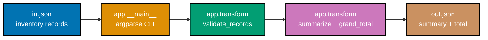

## Goal

Write one small (roughly 100-line), multi-module Python CLI that reads an inventory JSON file,
validates it, summarizes each item's total value, writes the summary back out as JSON, and ships a
`pytest` suite -- a light consolidation, not a new project: every mechanism it combines was already
taught, individually, somewhere in the Beginner, Intermediate, or Advanced tiers of this primer.



## Concepts exercised

- [x] `argparse` CLI
- [x] `venv` + `pip`
- [x] collections + comprehensions
- [x] `try`/`except` with a raised custom error
- [x] `json` read/write with `with`
- [x] `if __name__` guard
- [x] one `pytest` test (this capstone ships four)

All colocated code lives under `learning/capstone/code/`: the pure logic in `app/transform.py`, the
CLI entry point in `app/__main__.py`, the package marker `app/__init__.py`, and the test suite in
`tests/test_transform.py`. Every listing below is the complete, verbatim file -- nothing on this page
is truncated or paraphrased.

## Step 1: A fresh venv, installed with `pytest`

_exercises co-02_

Every capstone step below assumes a project-local virtual environment, exactly like Example 3's
`ex-03-create-venv-install`. Create one inside `learning/capstone/code/` and install `pytest` into it.

**Verify**

```text
$ python3 -m venv .venv
$ .venv/bin/pip install pytest
[... pip install output ...]
$ .venv/bin/pip show pytest
Name: pytest
Version: 9.1.1
...
```

A version string printed by `pip show pytest`, with exit code `0`, confirms the venv is real and
`pytest` is installed into it -- not the system Python.

## Step 2: `app/transform.py` -- pure functions, unit-tested in isolation

_exercises co-06, co-11, co-14, co-17, co-21, co-24_

`transform.py` has no file I/O and no `argparse` in it on purpose: every function is pure (same
input always produces the same output, no side effects), which is exactly what makes it trivially
testable without touching a filesystem or a CLI -- the same discipline Example 74's `calc.add`
followed. A `TypedDict` documents each record's exact shape (Example 81's pattern); a custom
`InvalidRecordError` (Example 65's pattern) signals bad data, rather than a bare `ValueError`.

**`learning/capstone/code/app/transform.py`** (complete file)

```python
"""Capstone: pure transform functions -- validate and summarize inventory records.

No file I/O and no argparse here on purpose: every function in this module is pure,
which is exactly what makes it trivially unit-testable in tests/test_transform.py
without touching a filesystem or a CLI.
"""

from __future__ import annotations

from typing import TypedDict


class InvalidRecordError(Exception):
    """Raised when an inventory record fails validation."""


class InventoryRecord(TypedDict):
    """One row of the input JSON: an item name, its count, and its unit price."""

    name: str
    quantity: int
    price: float


class SummaryRecord(TypedDict):
    """One row of the output JSON: the item name plus its computed total value."""

    name: str
    quantity: int
    total_value: float


def validate_records(records: list[InventoryRecord]) -> list[InventoryRecord]:
    """Reject any record with a negative quantity or price.

    Raising a custom, named exception (rather than a bare ValueError) lets the CLI
    layer catch exactly this failure mode and print a clean message instead of a
    raw traceback -- the same distinction Example 65 draws in the learning track.
    """
    for record in records:  # => a plain for loop -- fails fast on the FIRST bad record
        if record["quantity"] < 0:
            raise InvalidRecordError(f"{record['name']!r} has a negative quantity")
        if record["price"] < 0:
            raise InvalidRecordError(f"{record['name']!r} has a negative price")
    return records  # => unchanged -- this function validates, it never mutates


def summarize(records: list[InventoryRecord]) -> list[SummaryRecord]:
    """Compute each record's total value (quantity * price) via a comprehension."""
    return [
        {
            "name": record["name"],
            "quantity": record["quantity"],
            "total_value": round(record["quantity"] * record["price"], 2),
            # => round(..., 2) keeps prices display-friendly -- Example 6's float lesson, applied
        }
        for record in records  # => one comprehension replaces a build-up loop (Example 29's pattern)
    ]


def grand_total(summary: list[SummaryRecord]) -> float:
    """Sum every summary row's total_value -- a generator expression, not a loop."""
    return round(sum(row["total_value"] for row in summary), 2)
    # => sum(... for ...) is Example 33's generator-expression pattern, not a materialized list
```

**`learning/capstone/code/tests/test_transform.py`** (complete file)

```python
"""Capstone: pytest coverage for the pure functions in app.transform."""

import pytest

from app.transform import (
    InvalidRecordError,
    InventoryRecord,
    SummaryRecord,
    grand_total,
    summarize,
    validate_records,
)


def test_validate_records_accepts_clean_data() -> None:
    records: list[InventoryRecord] = [{"name": "widget", "quantity": 2, "price": 5.0}]
    assert validate_records(records) == records


def test_validate_records_rejects_negative_quantity() -> None:
    records: list[InventoryRecord] = [{"name": "widget", "quantity": -1, "price": 5.0}]
    with pytest.raises(InvalidRecordError):
        validate_records(records)


def test_summarize_computes_total_value() -> None:
    records: list[InventoryRecord] = [{"name": "widget", "quantity": 3, "price": 2.5}]
    assert summarize(records) == [{"name": "widget", "quantity": 3, "total_value": 7.5}]


def test_grand_total_sums_every_row() -> None:
    summary: list[SummaryRecord] = [
        {"name": "widget", "quantity": 3, "total_value": 7.5},
        {"name": "gadget", "quantity": 1, "total_value": 12.0},
    ]
    assert grand_total(summary) == 19.5
```

(`tests/__init__.py` is an empty file -- it exists only to make `tests` an importable package
alongside `app`.)

**Verify**

```text
$ .venv/bin/pytest -q
....                                                                     [100%]
4 passed in 0.01s
```

## Step 3: `app/__main__.py` -- wire `argparse` around the pure functions

_exercises co-20, co-22, co-23_

`app/__main__.py` is the only part of this capstone that touches the filesystem, `argparse`, or
`sys.exit` -- it reads `in.json` (Example 58's pattern), calls `validate_records` and `summarize`,
catches `InvalidRecordError` and reports a clean one-line message on `stderr` with a non-zero exit
code (never a raw traceback), then writes and prints the resulting JSON (Example 57's pattern).
`app/__init__.py` is a one-line docstring -- its only job is making `app` a package runnable with
`python3 -m app` (Example 64's shape).

**`learning/capstone/code/app/__init__.py`** (complete file)

```python
"""Capstone: app package -- a small inventory-summarizer CLI."""
```

**`learning/capstone/code/app/__main__.py`** (complete file)

```python
"""Capstone: app.__main__ -- the argparse CLI entry point (`python3 -m app`).

Reads an inventory JSON file, validates and summarizes it via app.transform, then
writes and prints the resulting summary JSON. A validation failure is caught here
and reported as a clean one-line message with a non-zero exit code, never a raw
traceback -- the CLI's whole job is translating transform.py's exceptions into
something a terminal user can act on.
"""

from __future__ import annotations

import argparse
import json
import sys
from pathlib import Path

# A cross-module import within the SAME package (Example 64's shape).
from app.transform import (
    InvalidRecordError,
    InventoryRecord,
    grand_total,
    summarize,
    validate_records,
)


def main() -> None:
    parser = argparse.ArgumentParser(
        description="Summarize an inventory JSON file's total value per item."
    )
    parser.add_argument("input", type=str, help="path to the input inventory JSON file")
    parser.add_argument("output", type=str, help="path to write the summary JSON file")
    # Example 61's argparse pattern, with two positionals instead of one.
    args = parser.parse_args()

    input_path = Path(args.input)
    output_path = Path(args.output)

    # `with` guarantees the file closes (Example 52's pattern).
    with input_path.open() as f:
        # Example 58's json.load pattern -- reads the whole file as one JSON value.
        records: list[InventoryRecord] = json.load(f)

    try:
        validate_records(records)
    except InvalidRecordError as err:
        # Example 65's custom-exception-class pattern: a clean message, not a raw traceback.
        print(f"invalid inventory data: {err}", file=sys.stderr)
        sys.exit(1)  # a distinct, deliberate non-zero exit code for bad input

    summary = summarize(records)
    payload = {"items": summary, "grand_total": grand_total(summary)}

    with output_path.open("w") as f:
        json.dump(payload, f)  # Example 57's json.dump-to-file pattern

    # Echoes the same payload to stdout for the caller to see.
    print(json.dumps(payload))


# Example 46's guard -- app.__main__ only runs main() when invoked directly
# (e.g. via `python3 -m app`), never when merely imported.
if __name__ == "__main__":
    main()
```

**Verify**

```text
$ .venv/bin/pytest -q
....                                                                     [100%]
4 passed in 0.01s
```

Re-running Step 2's full test suite against the now-complete package confirms adding `__main__.py`
and `__init__.py` didn't break `app.transform`'s importability or behavior.

## Step 4: Run it end to end

_exercises co-01, co-20_

`python3 -m app in.json out.json`, run from inside `learning/capstone/code/`, is the single command
that exercises every concept in this capstone's checklist in one pass, against the sample input
below.

**`learning/capstone/code/in.json`** (complete file)

```json
[
  { "name": "widget", "quantity": 3, "price": 2.5 },
  { "name": "gadget", "quantity": 1, "price": 12.0 }
]
```

**Run**: `python3 -m app in.json out.json`

**Output** (genuinely captured -- the CLI both writes `out.json` and echoes the same payload to
stdout):

```text
{"items": [{"name": "widget", "quantity": 3, "total_value": 7.5}, {"name": "gadget", "quantity": 1, "total_value": 12.0}], "grand_total": 19.5}
```

**Exit code**: `0`.

**The invalid-input path**: `learning/capstone/code/in_invalid.json` deliberately has a negative
quantity:

```json
[{ "name": "widget", "quantity": -1, "price": 2.5 }]
```

**Run**: `python3 -m app in_invalid.json out_bad.json`

**Output** (genuinely captured, on `stderr`):

```text
invalid inventory data: 'widget' has a negative quantity
```

**Exit code**: `1` -- and, critically, `out_bad.json` is never written, because `sys.exit(1)` runs
before the `output_path.open("w")` call is ever reached.

**Quality gates**: `ruff check .` (from inside `learning/capstone/code/`) reports `All checks
passed!`; `pyright --pythonpath .venv/bin/python .` reports `0 errors, 0 warnings, 0 informations`
(the explicit `--pythonpath` flag points `pyright` at this project's own venv interpreter, so it can
resolve the `pytest` import in `tests/test_transform.py` the same way `pytest` itself does).

## Acceptance criteria

- `python3 -m app in.json out.json` exits `0`, writes `out.json` matching Step 4's Output block, and
  echoes the identical JSON to stdout.
- `python3 -m app in_invalid.json out_bad.json` exits `1`, prints a clean one-line message to
  `stderr` (never a raw traceback), and never writes `out_bad.json` at all.
- `.venv/bin/pytest -q` reports `4 passed` against `tests/test_transform.py`, covering both the
  accept and reject paths of `validate_records`, plus `summarize` and `grand_total`.
- `ruff check .` and `pyright --pythonpath .venv/bin/python .` both report zero findings.
- Every listing on this page (`app/__init__.py`, `app/transform.py`, `app/__main__.py`,
  `tests/test_transform.py`) is the complete file, runnable exactly as shown -- nothing here is a
  fragment that depends on code the page does not also show.

## Done bar

This capstone is runnable end to end: a reader who copies the four files above into a
`learning/capstone/code/`-shaped tree, creates a venv, installs `pytest`, and runs `python3 -m app
in.json out.json` there reaches the identical output block shown in Step 4, verified against a real
CPython 3.14.3 interpreter run (not merely described). Every mechanism combined here --
`argparse`-CLIs (co-20), collections-and-comprehensions (co-14), `try`/`except` with a custom
exception (co-21), `json`-file-I/O (co-22/co-23), the `if __name__` guard (co-20), and `pytest`
(co-17) -- traces to a primary source already cited in this primer's Accuracy notes and DD-35
citations; no new fact was needed to write this page.

---

← Previous: [Advanced Examples](../advanced.md) · Next: [Drilling](../../drilling/overview.md) →
