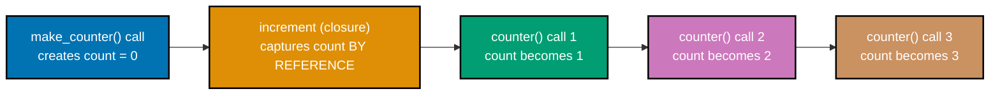

Examples 29-60 cover comprehensions and generator expressions, functions (typed signatures, defaults,
keyword args, `*args`/`**kwargs`, multiple returns), lambdas and closures, scope, modules and imports,
exceptions, file I/O, JSON, and a first pass at classes. Run each example with `python3 <file>.py`
from inside its own directory unless a caption says otherwise.

---

### Example 29: List Comprehension

_ex-29 &middot; exercises co-14_

A list comprehension builds a list directly from an iterable and an expression, in one line -- no
`append()` build-up loop needed.

**`learning/code/ex-29-list-comprehension/example.py`**

```python
"""Example 29: List Comprehension."""

# Builds a list directly -- no append() build-up loop needed.
squares: list[int] = [n * n for n in range(5)]
print(squares)  # => Output: [0, 1, 4, 9, 16]
```

**Run**: `python3 example.py`

**Output**:

```text
[0, 1, 4, 9, 16]
```

**Key takeaway**: `[expr for name in iterable]` is the comprehension shape -- read it as "expr, for
each name in iterable."

**Why it matters**: Comprehensions are the idiomatic Python replacement for the classic
`result = []; for ...: result.append(...)` pattern -- more compact, and (per DD-33's
`abstraction-and-its-cost` big idea) usually faster too, since the loop runs in C rather than
bytecode-by-bytecode.

---

### Example 30: Comprehension Filter

_ex-30 &middot; exercises co-14, co-15_

An optional trailing `if` filters elements **before** they're kept -- combining comprehension and
conditional in one expression.

**`learning/code/ex-30-comprehension-filter/example.py`**

```python
"""Example 30: Comprehension Filter."""

# The `if` filters BEFORE an n is kept.
evens: list[int] = [n for n in range(6) if n % 2 == 0]
print(evens)  # => Output: [0, 2, 4]
```

**Run**: `python3 example.py`

**Output**:

```text
[0, 2, 4]
```

**Key takeaway**: the filter `if` comes right after the `for` clause, and only elements that pass it
reach the expression on the left.

**Why it matters**: This is the single most common comprehension shape in real code -- "give me the
subset of X that matches condition Y" -- and it appears constantly in data-cleanup and filtering code,
including the capstone's own input validation.

---

### Example 31: Dict Comprehension

_ex-31 &middot; exercises co-14, co-11_

A `key: value` pair inside `{}` builds a dict comprehension, not a set -- the colon is what
distinguishes the two forms.

**`learning/code/ex-31-dict-comprehension/example.py`**

```python
"""Example 31: Dict Comprehension."""

# A `key: value` shape inside {} builds a dict, not a set.
squares: dict[int, int] = {n: n * n for n in range(3)}
print(squares)  # => Output: {0: 0, 1: 1, 2: 4}
```

**Run**: `python3 example.py`

**Output**:

```text
{0: 0, 1: 1, 2: 4}
```

**Key takeaway**: `{key_expr: value_expr for name in iterable}` -- the colon (not the braces) is what
makes this a dict comprehension.

**Why it matters**: Dict comprehensions are the idiomatic way to build a lookup table from an
iterable in one line -- transforming a list into an indexable structure without a manual
`{}`-then-loop-then-assign sequence.

---

### Example 32: Set Comprehension

_ex-32 &middot; exercises co-14, co-12_

`{}` with no colon builds a set comprehension -- duplicates collapse automatically, exactly like the
`set()` constructor in Example 20.

**`learning/code/ex-32-set-comprehension/example.py`**

```python
"""Example 32: Set Comprehension."""

# {} with no colon builds a set -- duplicates collapse automatically.
lengths: set[int] = {len(w) for w in ["a", "bb", "cc"]}
print(sorted(lengths))  # => "bb" and "cc" both have length 2 -- [1, 2]
```

**Run**: `python3 example.py`

**Output**:

```text
[1, 2]
```

**Key takeaway**: `"a"` has length 1; `"bb"` and `"cc"` both have length 2 -- the set collapses the
duplicate `2` down to one entry, leaving two unique lengths.

**Why it matters**: The four comprehension forms (list, dict, set, and Example 33's generator) all
share the identical `for`/`if` grammar -- learning one comprehension shape teaches you all four, only
the enclosing brackets (and the optional colon) change.

---

### Example 33: Generator Expression

_ex-33 &middot; exercises co-14_

A generator expression drops the brackets entirely -- values are produced lazily, one at a time,
instead of building a full list in memory first.

**`learning/code/ex-33-generator-expression/example.py`**

```python
"""Example 33: Generator Expression."""

# No brackets -- values are produced lazily, one at a time, for sum().
total: int = sum(n * n for n in range(4))
print(total)  # => 0+1+4+9 -- Output: 14
```

**Run**: `python3 example.py`

**Output**:

```text
14
```

**Key takeaway**: `sum(n * n for n in range(4))` never builds an intermediate list -- `sum()` consumes
the generator's values one at a time as it produces them.

**Why it matters**: For large inputs, the memory difference between a list comprehension and a
generator expression is the entire point (DD-33's `abstraction-and-its-cost` idea again): a
list comprehension over a million elements allocates a million-element list; a generator expression
over the same range allocates almost nothing.

---

### Example 34: Nested Comprehension

_ex-34 &middot; exercises co-14_

Multiple `for` clauses inside one comprehension read left to right, outer loop first -- this one
flattens a list of lists into a single flat list.

**`learning/code/ex-34-nested-comprehension/example.py`**

```python
"""Example 34: Nested Comprehension."""

matrix: list[list[int]] = [[1, 2], [3, 4]]  # => matrix is [[1, 2], [3, 4]]
# Two `for` clauses, outer then inner -- reads left to right.
flat: list[int] = [n for row in matrix for n in row]  # => flat is [1, 2, 3, 4]
print(flat)  # => Output: [1, 2, 3, 4]
```

**Run**: `python3 example.py`

**Output**:

```text
[1, 2, 3, 4]
```

**Key takeaway**: `for row in matrix for n in row` reads exactly like the equivalent nested `for`
loop written top to bottom -- `row` iterates the outer list, `n` iterates each inner list.

**Why it matters**: Nested comprehensions are readable up to about two `for` clauses; beyond that,
most style guides (including this repository's own conventions) recommend a plain nested loop instead
-- comprehensions optimize for the reader, and a three-level nested comprehension usually fails that
test.

---

### Example 35: Define Typed Function

_ex-35 &middot; exercises co-17, co-06_

`def` defines a reusable callable; `-> int` annotates the **return** type, checked statically by
`pyright` without changing what the function actually does at runtime.

**`learning/code/ex-35-define-typed-function/example.py`**

```python
"""Example 35: Define Typed Function."""


# `-> int` annotates the RETURN type, checked statically by pyright.
def add(a: int, b: int) -> int:  # => defines add, takes two ints, returns an int
    return a + b  # => returns the sum of a and b


print(add(2, 3))  # => Output: 5
```

**Run**: `python3 example.py`

**Output**:

```text
5
```

**Key takeaway**: every parameter and the return value are annotated -- `pyright` verifies this
signature is honored at every call site, though `python3` itself never checks it (Example 84 proves
that gap directly).

**Why it matters**: This is the canonical shape every function in this primer follows from here on:
typed parameters, a typed return, and a docstring-worthy name. It is also the DD-39 baseline every
other example's functions are held to.

---

### Example 36: Default Args

_ex-36 &middot; exercises co-17_

A parameter with `= value` in its signature becomes optional -- the caller may omit it, and the
default is used instead.

**`learning/code/ex-36-default-args/example.py`**

```python
"""Example 36: Default Args."""


# name is optional -- falls back to "world" when the caller omits it.
# Defines greet with a default parameter value.
def greet(name: str = "world") -> str:
    return f"Hello, {name}"  # => builds and returns the greeting string


print(greet())  # => no argument -- uses the default -- Output: Hello, world
print(greet("Ada"))  # => argument supplied -- Output: Hello, Ada
```

**Run**: `python3 example.py`

**Output**:

```text
Hello, world
Hello, Ada
```

**Key takeaway**: `name: str = "world"` both types the parameter and gives it a default -- the two
annotations compose without conflict.

**Why it matters**: Default arguments are how a huge share of real-world Python APIs stay usable with
zero configuration while still allowing full customization -- most standard-library and third-party
functions lean on this pattern extensively.

---

### Example 37: Keyword Args

_ex-37 &middot; exercises co-17_

Any parameter can be passed by name at the call site (`b=3, a=10`), in any order -- Python matches
keyword arguments by name, not position.

**`learning/code/ex-37-keyword-args/example.py`**

```python
"""Example 37: Keyword Args."""


# Defines subtract, which takes two ints and returns an int.
def subtract(a: int, b: int) -> int:
    return a - b  # => returns a minus b


# Keyword arguments can be passed in any order -- the names, not position, bind them.
by_position: int = subtract(10, 3)  # => positional order: a=10, b=3
by_keyword: int = subtract(b=3, a=10)  # => named, REVERSED order -- still a=10, b=3
print(by_position, by_keyword, by_position == by_keyword)  # => Output: 7 7 True
```

**Run**: `python3 example.py`

**Output**:

```text
7 7 True
```

**Key takeaway**: `subtract(b=3, a=10)` binds by name, not position -- writing the keywords in
reverse order produces the identical result as `subtract(10, 3)`.

**Why it matters**: Keyword arguments make call sites self-documenting for functions with several
parameters of the same type (where positional order is easy to get wrong) -- a real habit worth
adopting whenever a function takes more than two or three parameters.

---

### Example 38: \*args and \*\*kwargs

_ex-38 &middot; exercises co-18_

`*args` collects any extra positional arguments into a tuple; `**kwargs` collects any extra keyword
arguments into a dict -- together they let a function accept an arbitrary, flexible set of arguments.

**`learning/code/ex-38-args-kwargs/example.py`**

```python
"""Example 38: *args and **kwargs."""


def describe(*args: int, **kwargs: str) -> None:
    # args is a tuple, kwargs is a dict -- both are countable with len().
    print(len(args), len(kwargs))


describe(1, 2, 3, name="Ada", role="engineer")  # => 3 positional, 2 keyword
# => Output: 3 2
```

**Run**: `python3 example.py`

**Output**:

```text
3 2
```

**Key takeaway**: `*args: int` types every element **inside** the tuple as `int`, not the tuple
itself; `**kwargs: str` likewise types every dict value.

**Why it matters**: `*args`/`**kwargs` is how Python functions accept a genuinely variable number of
arguments -- the same mechanism `print()` itself uses to accept any number of values, and the pattern
behind most "wrapper" or "pass-through" functions.

---

### Example 39: Return Tuple

_ex-39 &middot; exercises co-17, co-10_

A bare comma-separated expression after `return` builds a tuple implicitly -- the standard way to
return more than one value from a single function.

**`learning/code/ex-39-return-tuple/example.py`**

```python
"""Example 39: Return Tuple."""


# Returns a 2-tuple of (quotient, remainder).
def divide(a: int, b: int) -> tuple[int, int]:
    return a // b, a % b  # => a bare comma builds a tuple -- two values, one return


# Tuple unpacking assigns each returned value to a name, in order.
quotient, remainder = divide(10, 3)  # => unpacks the returned tuple into two names
print(quotient, remainder)  # => 10 // 3 = 3, 10 % 3 = 1 -- Output: 3 1
```

**Run**: `python3 example.py`

**Output**:

```text
3 1
```

**Key takeaway**: `-> tuple[int, int]` documents the exact two-value shape being returned; the caller
unpacks it with Example 16's `x, y = ...` pattern.

**Why it matters**: This is precisely how the built-in `divmod(a, b)` function works, and it is the
idiomatic Python alternative to an out-parameter or a wrapper object when a function has exactly two
or three naturally-related results to return.

---

### Example 40: Lambda Sort

_ex-40 &middot; exercises co-19_

A `lambda` is a small, anonymous, single-expression function -- most often used inline as a `key=`
argument, here to sort by each tuple's first element.

**`learning/code/ex-40-lambda-sort/example.py`**

```python
"""Example 40: Lambda Sort."""

pairs: list[tuple[str, int]] = [("b", 2), ("a", 1)]  # => pairs is [("b", 2), ("a", 1)]
# A lambda is a small anonymous function -- here, key=lambda p: p[0] extracts a sort key.
pairs.sort(key=lambda p: p[0])  # => key extracts the first element to sort by
print(pairs)  # => sorted by letter, not original order -- Output: [('a', 1), ('b', 2)]
```

**Run**: `python3 example.py`

**Output**:

```text
[('a', 1), ('b', 2)]
```

**Key takeaway**: `.sort(key=...)` calls the `key` function once per element and sorts by its return
value -- `lambda p: p[0]` here means "sort by each tuple's first element."

**Why it matters**: A `lambda` is not a full function -- it can only hold a single expression, no
statements, no assignments. Anything more complex than a one-liner belongs in a named `def` function
instead; this scope limit is deliberate, not a workaround.

---

### Example 41: Closure Counter

_ex-41 &middot; exercises co-19_

A closure is a nested function that remembers variables from its enclosing scope even after that
scope has returned -- `nonlocal` is required to **mutate** (not just read) an enclosing variable.



**`learning/code/ex-41-closure-counter/example.py`**

```python
"""Example 41: Closure Counter."""

# Imports Callable for typing the returned function.
from collections.abc import Callable


# Returns a function that takes no args and returns an int.
def make_counter() -> Callable[[], int]:
    count = 0  # => count is an upvalue -- captured by the nested function below

    # Defines the closure that reads and writes the outer count.
    def increment() -> int:
        nonlocal count  # => without this, `count += 1` would create a NEW local count
        count += 1  # => mutates the captured count, not a fresh local variable
        return count  # => returns the updated count after incrementing

    return increment  # => returns the closure itself, not a call to it


# Each call to make_counter() creates a FRESH count -- closures don't share state.
counter = make_counter()  # => counter is now bound to one increment closure, count=0
print(counter())  # => Output: 1
print(counter())  # => Output: 2
print(counter())  # => Output: 3
```

**Run**: `python3 example.py`

**Output**:

```text
1
2
3
```

**Key takeaway**: `make_counter()` runs once and returns the `increment` function itself (not its
result) -- each subsequent call to `counter()` reuses and mutates the same captured `count`.

**Why it matters**: Without `nonlocal count`, `count += 1` inside `increment` would raise
`UnboundLocalError` -- assignment inside a nested function creates a new local variable by default,
and `nonlocal` is the explicit opt-in to mutate the enclosing one instead.

---

### Example 42: Scope, global and local

_ex-42 &middot; exercises co-19_

`global` is `nonlocal`'s module-level counterpart -- required to mutate a module-level variable from
inside a function, for the same underlying reason.

**`learning/code/ex-42-scope-global-local/example.py`**

```python
"""Example 42: Scope, global and local."""

# Without `global`, assigning to a name inside a function creates a LOCAL shadow.
total: int = 0  # => a module-level (global) variable


# Defines a function that mutates the global total.
def add_to_total(amount: int) -> None:
    global total  # => without this, `total += amount` would raise UnboundLocalError
    total += amount  # => mutates the GLOBAL total, not a local shadow of it


add_to_total(5)  # => total is now 5
add_to_total(7)  # => total is now 12
print(total)  # => 0+5+7 -- Output: 12
```

**Run**: `python3 example.py`

**Output**:

```text
12
```

**Key takeaway**: `global total` inside `add_to_total` is what lets `total += amount` mutate the
module-level `total` rather than raising `UnboundLocalError` or creating a shadow local.

**Why it matters**: Mutating module-level state from inside functions is a pattern to reach for
sparingly -- it makes a function's behavior depend on hidden external state, which is harder to test
and reason about than a pure function (this repo's own functional-core convention prefers the latter
wherever practical).

---

### Example 43: map + filter

_ex-43 &middot; exercises co-19, co-16_

`filter()` and `map()` are the functional-style counterparts to a comprehension's `if` and expression
clauses -- both are lazy, and both compose naturally with a `lambda`.

**`learning/code/ex-43-map-filter/example.py`**

```python
"""Example 43: map + filter."""

# map() applies a function to every element; filter() keeps only elements where
# the predicate returns True. Both are lazy -- list() forces full evaluation.
result: list[int] = list(
    map(  # => map() lazily applies the lambda below to each filtered element
        lambda n: n * 2,  # => doubles each surviving element
        filter(lambda n: n % 2 == 0, range(5)),  # => keeps only 0, 2, 4 first
    )  # => closes map(...)
)  # => closes list(...), forcing evaluation of the whole pipeline
print(result)  # => [0, 2, 4] doubled -- Output: [0, 4, 8]
```

**Run**: `python3 example.py`

**Output**:

```text
[0, 4, 8]
```

**Key takeaway**: `filter(pred, iterable)` keeps only elements where `pred` is truthy; `map(func,
iterable)` applies `func` to every remaining element -- both need `list(...)` to materialize their
lazy result.

**Why it matters**: The equivalent comprehension, `[n * 2 for n in range(5) if n % 2 == 0]`, is
considered more idiomatic Python for this exact case -- most style guides (including PEP 8's spirit)
prefer comprehensions over `map`/`filter` chains when a `lambda` is involved, precisely because the
comprehension reads left to right instead of inside-out.

---

### Example 44: Import Stdlib math

_ex-44 &middot; exercises co-20_

`import math` loads the standard library's math module -- no `pip install` needed, since it ships
with every CPython installation.

**`learning/code/ex-44-import-stdlib-math/example.py`**

```python
"""Example 44: Import Stdlib math."""

import math  # => the standard library's math module -- no pip install needed

print(math.sqrt(16))  # => math.sqrt ALWAYS returns a float -- Output: 4.0
```

**Run**: `python3 example.py`

**Output**:

```text
4.0
```

**Key takeaway**: `math.sqrt()` always returns a `float`, even for a perfect square like `16` -- the
result is `4.0`, not the `int` `4`.

**Why it matters**: The standard library is enormous and ships with every Python install --
`math`, `statistics` (Example 45), `json` (Examples 55-58), and `argparse` (Example 61) are exactly
the modules this primer leans on, all with zero extra install step.

---

### Example 45: from ... import

_ex-45 &middot; exercises co-20_

`from module import name` imports just one specific name, used unqualified afterward -- as opposed to
`import module`, which requires the `module.` prefix at every use.

**`learning/code/ex-45-from-import/example.py`**

```python
"""Example 45: from ... import."""

from statistics import mean  # => imports just the one name, used unqualified below

print(mean([1, 2, 3]))  # => (1+2+3)/3 = 2 -- Output: 2
```

**Run**: `python3 example.py`

**Output**:

```text
2
```

**Key takeaway**: `statistics.mean([1, 2, 3])` returns the plain `int` `2`, not `2.0` -- the standard
library's `mean()` returns an `int` when the arithmetic mean is itself a whole number.

**Why it matters**: `from module import name` trades explicitness (you can no longer tell at the call
site which module `mean` came from, without checking the imports) for brevity -- a real style
trade-off, not a strictly better choice than `import statistics; statistics.mean(...)`.

---

### Example 46: `__name__ == "__main__"` Guard

_ex-46 &middot; exercises co-20_

`__name__` is `"__main__"` only when a file is run directly -- never when it's imported by another
module -- which is what makes this guard the standard way to separate library code from script entry
points.

**`learning/code/ex-46-name-main-guard/mod.py`**

```python
"""Example 46: __name__ == "__main__" Guard."""


def main() -> None:  # => defines the entry-point function
    print("running as a script")  # => Output (only on direct run)


# __name__ is "__main__" only when run directly, never when imported.
if __name__ == "__main__":  # => True only when this file is executed directly
    main()  # => calls main(), which prints the line above
```

**Run**: `python3 mod.py` (direct run -- prints); versus `python3 -c "import mod"` (import -- silent)

**Output** (direct run):

```text
running as a script
```

**Output** (import, no direct run):

```text

```

(No output at all -- `main()` is never called on import, because `__name__` is `"mod"`, not
`"__main__"`, in that context.)

**Key takeaway**: the exact same file behaves as a runnable script when executed directly and as a
silent, importable library when imported -- the `if __name__ == "__main__":` guard is what makes both
possible from one file.

**Why it matters**: Example 47's sibling-module import relies on exactly this guard's absence of
side effects -- if `greeting.py` printed something at import time instead of only defining functions,
importing it would have unwanted output. Every reusable module in this primer follows this same
"define, don't execute" discipline at import time.

---

### Example 47: Custom Module Import

_ex-47 &middot; exercises co-20_

Importing a sibling file works exactly like importing a standard-library module -- Python resolves
`greeting` to `greeting.py` in the same directory, with no special syntax required.

**`learning/code/ex-47-custom-module-import/greeting.py`**

```python
"""Example 47: sibling module -- greeting.py, imported by example.py."""


def shout(name: str) -> str:  # => a typed, importable function -- no name guard needed
    return f"HELLO, {name.upper()}!"  # => uppercases name and wraps it in HELLO, ...!
```

**`learning/code/ex-47-custom-module-import/example.py`**

```python
"""Example 47: Custom Module Import."""

# Python resolves sibling-directory imports via the current working directory.
from greeting import shout  # => imports the sibling file greeting.py's shout() function

print(shout("Ada"))  # => Output: HELLO, ADA!
```

**Run**: `python3 example.py`

**Output**:

```text
HELLO, ADA!
```

**Key takeaway**: `from greeting import shout` works because `greeting.py` sits in the same
directory as `example.py` -- Python's default import path includes the running script's own
directory.

**Why it matters**: This is the simplest possible multi-file Python program -- one file defining
reusable functions, one file consuming them. Example 64's package (multiple files under one directory
with an `__init__.py`) builds directly on this same mechanism at a larger scale.

---

### Example 48: try/except

_ex-48 &middot; exercises co-21_

`try`/`except` catches a specific exception type and runs an alternate code path instead of crashing
the whole program.

**`learning/code/ex-48-try-except/example.py`**

```python
"""Example 48: try/except."""

# try/except lets the program continue after an exception instead of crashing.
try:  # => wraps the risky operation so we can catch its exception
    1 / 0  # => integer division by zero raises ZeroDivisionError
except ZeroDivisionError:  # => catches exactly that exception type, nothing else
    print("cannot divide")  # => Output: cannot divide
```

**Run**: `python3 example.py`

**Output**:

```text
cannot divide
```

**Key takeaway**: `except ZeroDivisionError:` catches only that exact exception type (and its
subclasses) -- an unrelated exception raised in the same `try` block would propagate uncaught.

**Why it matters**: Catching the narrowest exception type that applies (rather than a bare
`except:`) is the idiomatic Python style -- a bare `except:` would also silently swallow genuine bugs
like `KeyboardInterrupt` or a typo'd variable name's `NameError`.

---

### Example 49: try/except/else/finally

_ex-49 &middot; exercises co-21_

All four clauses can appear together: `try` (the risky code), `except` (error handling), `else` (runs
only if `try` raised nothing), and `finally` (always runs, no matter what).

**`learning/code/ex-49-try-except-else-finally/example.py`**

```python
"""Example 49: try/except/else/finally."""

# else runs only when try raises nothing; finally always runs, success or failure.
try:  # => runs the block below; no exception occurs in this example
    print("try")  # => runs first -- Output line 1: try
except ValueError:  # => would run only if try raised a ValueError
    print("except")  # => skipped -- no exception was raised
else:  # => runs only when try completes with NO exception
    print("else")  # => runs ONLY if try raised nothing -- Output line 2: else
finally:  # => runs unconditionally, whether try succeeded or an exception fired
    print("finally")  # => ALWAYS runs, exception or not -- Output line 3: finally
```

**Run**: `python3 example.py`

**Output**:

```text
try
else
finally
```

**Key takeaway**: `else` runs only on the success path (no exception), and `finally` runs
unconditionally -- on success, on a caught exception, and even on an uncaught one propagating past
this block.

**Why it matters**: `finally` is where cleanup code belongs -- closing a resource, releasing a lock --
because it is the one clause guaranteed to run regardless of how the `try` block exits. `with`
blocks (Examples 52-54) build this same guarantee into the context-manager protocol directly.

---

### Example 50: raise ValueError

_ex-50 &middot; exercises co-21_

`raise` signals an error explicitly. With no surrounding `try`/`except`, the exception propagates all
the way up and crashes the process with a non-zero exit code.

**`learning/code/ex-50-raise-valueerror/example.py`**

```python
"""Example 50: raise ValueError."""


# raise stops execution immediately and propagates the exception up the call stack.
def parse_age(raw: str) -> int:  # => defines parse_age, converts and validates a string
    # int(raw) itself raises ValueError first if raw isn't numeric at all.
    age = int(raw)  # => converts raw to int
    if age < 0:  # => an extra validation check beyond what int() already does
        raise ValueError("bad input")  # => no except catches this here
    return age  # => only reached when age is >= 0


parse_age("-1")  # => uncaught -- crashes with a traceback, non-zero exit
```

**Run**: `python3 example.py`

**Output** (genuinely captured -- an uncaught exception prints a full traceback to stderr):

```text
Traceback (most recent call last):
  File ".../ex-50-raise-valueerror/example.py", line 13, in <module>
    parse_age("-1")  # => uncaught -- crashes with a traceback, non-zero exit
    ~~~~~~~~~^^^^^^
  File ".../ex-50-raise-valueerror/example.py", line 9, in parse_age
    raise ValueError("bad input")  # => no except catches this here
    ^^^^^^^^^^^^^^^^^^^^^^^^^^^^^
ValueError: bad input
```

**Exit code**: non-zero (`$?` is `1`).

**Key takeaway**: an unhandled `raise` prints a full traceback (the call stack at the moment of the
error, innermost frame last) and exits non-zero -- there is no silent failure mode in Python.

**Why it matters**: A traceback's final line, `ValueError: bad input`, is usually the fastest way to
diagnose a crash -- exception type plus message. The frames above it show exactly how execution got
there, which is why "read the last line first, then walk up if you need more context" is a genuinely
useful debugging habit.

---

### Example 51: Catch Specific Exceptions

_ex-51 &middot; exercises co-21_

Multiple `except` clauses on the same `try` block let one function handle different failure modes
differently -- the first matching `except` (top to bottom) runs.

**`learning/code/ex-51-catch-specific-exceptions/example.py`**

```python
"""Example 51: Catch Specific Exceptions."""


# Each except clause catches only its own exception type -- order matters when
# exception types overlap via inheritance (not the case here).
def handle(trigger: str) -> str:  # => defines handle, dispatches on the trigger string
    data: dict[str, int] = {"a": 1}  # => data has only key "a" -- "missing" is absent
    try:  # => wraps both risky operations so either exception type can be caught below
        if trigger == "value":  # => branch that deliberately raises ValueError
            int("not a number")  # => raises ValueError
        else:  # => branch that deliberately raises KeyError
            data["missing"]  # => raises KeyError
    except ValueError:  # => catches ONLY ValueError, not KeyError
        return "caught ValueError"  # => runs only for the "value" trigger
    except KeyError:  # => catches ONLY KeyError, not ValueError
        return "caught KeyError"  # => runs only for the other trigger
    return "unreachable"  # => never runs -- one except always returns first


print(handle("value"))  # => Output: caught ValueError
print(handle("key"))  # => Output: caught KeyError
```

**Run**: `python3 example.py`

**Output**:

```text
caught ValueError
caught KeyError
```

**Key takeaway**: each `except` clause only matches its own exception type -- `handle("value")` never
touches the `KeyError` branch, and vice versa.

**Why it matters**: Stacking narrow `except` clauses (rather than one broad `except Exception:`)
means each failure mode gets its own explicit, intentional handling -- exactly the discipline that
keeps error-handling code from silently masking bugs it wasn't actually designed to catch.

---

### Example 52: Read Text File

_ex-52 &middot; exercises co-22_

`open()` inside a `with` block reads a file and guarantees it closes afterward, even if an exception
is raised partway through -- the context-manager protocol Example 71 later implements from scratch.

**`learning/code/ex-52-read-text-file/data.txt`**

```text
line1
line2
```

**`learning/code/ex-52-read-text-file/example.py`**

```python
"""Example 52: Read Text File."""

with open("data.txt") as f:  # => `with` guarantees the file closes, even on error
    print(f.read(), end="")  # => .read() returns the WHOLE file as one string
# => Output: line1<newline>line2<newline>
```

**Run**: `python3 example.py`

**Output**:

```text
line1
line2
```

**Key takeaway**: `f.read()` returns the entire file as one `str`, newlines included -- `print(...,
end="")` avoids adding an extra blank line, since the file's own trailing newline is already part of
that string.

**Why it matters**: The `with` block is doing real work here, not just tidiness: if `f.read()` raised
an exception partway through, the file handle would still close automatically -- the same guarantee
`finally` gives you in Example 49, built directly into the `open()` object itself.

---

### Example 53: Write Text File

_ex-53 &middot; exercises co-22_

`open(path, "w")` opens a file for writing, truncating any existing content first -- `.write()` does
**not** add a newline automatically, unlike `print()`.

**`learning/code/ex-53-write-text-file/example.py`**

```python
"""Example 53: Write Text File."""

with open("out.txt", "w") as f:  # => "w" truncates the file, then opens it for writing
    f.write("line1\n")  # => .write() does NOT add a newline automatically
    f.write("line2\n")

with open("out.txt") as f:  # => a fresh `with`, reading back what was just written
    print(repr(f.read()))  # => repr() shows the embedded \n characters explicitly
# => Output: 'line1\nline2\n'
```

**Run**: `python3 example.py`

**Output**:

```text
'line1\nline2\n'
```

**Key takeaway**: `f.write("line1\n")` writes exactly those five characters plus a newline --
`.write()` never inserts a newline on your behalf, so every line needs its own explicit `\n`.

**Why it matters**: `repr(f.read())` (rather than plain `print(f.read())`) is a genuinely useful
debugging trick -- it shows escape sequences like `\n` literally, instead of rendering them as actual
line breaks, which makes it obvious exactly what characters a string contains.

---

### Example 54: Append File

_ex-54 &middot; exercises co-22_

`open(path, "a")` opens a file for appending -- unlike `"w"`, it preserves whatever content was
already there and adds new content after it.

**`learning/code/ex-54-append-file/example.py`**

```python
"""Example 54: Append File."""

# Each `with` block closes its file automatically when the block exits.
with open("log.txt", "w") as f:  # => "w" starts the file fresh, discarding old content
    f.write("first\n")  # => writes the first line to log.txt

with open("log.txt", "a") as f:  # => "a" appends -- prior content is kept
    f.write("second\n")  # => appends a second line after "first\n"

with open("log.txt") as f:  # => default mode "r" opens the file for reading
    print(f.read(), end="")  # => Output: first<newline>second<newline>
```

**Run**: `python3 example.py`

**Output**:

```text
first
second
```

**Key takeaway**: `"w"` (write) truncates; `"a"` (append) preserves and adds after -- picking the
wrong mode is a classic way to accidentally lose file content.

**Why it matters**: Log files, in particular, almost always want `"a"` mode -- each new run of a
program should add to the log's history, not erase everything a previous run wrote.

---

### Example 55: json.dumps

_ex-55 &middot; exercises co-23_

`json.dumps()` serializes a Python object into a JSON-formatted string -- the in-memory counterpart to
Example 57's `json.dump()`, which writes directly to a file.

**`learning/code/ex-55-json-dumps/example.py`**

```python
"""Example 55: json.dumps."""

import json

# Serializes a dict to a JSON-formatted str.
print(json.dumps({"a": 1}))  # => Output: {"a": 1}
```

**Run**: `python3 example.py`

**Output**:

```text
{"a": 1}
```

**Key takeaway**: `json.dumps()` returns a `str` you can print, log, or send over a network --
`json.dump()` (Example 57, no trailing `s`) writes to a file object instead of returning a string.

**Why it matters**: JSON is the default interchange format for this primer's file-I/O examples
(57-58) and the capstone -- `json.dumps`/`json.loads` (in-memory) and `json.dump`/`json.load`
(file-based) are the entire API surface needed to work with it.

---

### Example 56: json.loads

_ex-56 &middot; exercises co-23_

`json.loads()` parses a JSON string into native Python objects -- a JSON object becomes a `dict`, a
JSON array becomes a `list`, and so on.

**`learning/code/ex-56-json-loads/example.py`**

```python
"""Example 56: json.loads."""

import json  # => imports the standard-library json module

# json.loads() parses a JSON string into Python objects (dict, list, str, int, ...).
data = json.loads('{"a": 1}')  # => parses a JSON str into a Python dict
print(data["a"])  # => Output: 1
```

**Run**: `python3 example.py`

**Output**:

```text
1
```

**Key takeaway**: `json.loads()` (parse a **string**) is `json.dumps()`'s exact inverse -- together
they round-trip any JSON-compatible data structure through Python.

**Why it matters**: This is the same operation Example 69's `people.json`-reading example and the
capstone's own input pipeline both rely on, just applied to a file's contents (via `json.load`, no
`s`) instead of a string literal.

---

### Example 57: json.dump to a File

_ex-57 &middot; exercises co-23, co-22_

`json.dump()` (no trailing `s`) writes directly to an open file object, combining Example 53's file
writing with Example 55's serialization in one call.

**`learning/code/ex-57-json-dump-file/example.py`**

```python
"""Example 57: json.dump to a File."""

import json  # => imports the standard-library json module

# json.dump()/json.load() write/read directly to/from a file object -- no
# intermediate string round-trip needed, unlike dumps()/loads().
original: dict[str, int] = {"a": 1, "b": 2}  # => original is {"a": 1, "b": 2}
# "w" opens out.json for writing, truncating it if it already exists.
with open("out.json", "w") as f:
    json.dump(original, f)  # => writes directly to a file object

with open("out.json") as f:  # => reopens out.json for reading (default mode "r")
    restored = json.load(f)  # => reads directly from a file object

print(restored == original)  # => roundtrip preserves the data -- Output: True
```

**Run**: `python3 example.py`

**Output**:

```text
True
```

**Key takeaway**: `json.dump(obj, f)` and `json.load(f)` take a file object, not a path string --
you're responsible for opening (and, via `with`, closing) the file yourself.

**Why it matters**: `restored == original` demonstrates dict equality compares contents, not
identity -- two separately-built dicts with the same keys and values are equal, exactly the property
the capstone's own tests (Example 74's `pytest` pattern) lean on to verify JSON roundtrips.

---

### Example 58: json.load from a File

_ex-58 &middot; exercises co-23, co-22_

`json.load()` is `json.loads()`'s file-based counterpart -- reads and parses JSON directly from an
open file object in one call.

**`learning/code/ex-58-json-load-file/example.py`**

```python
"""Example 58: json.load from a File."""

import json  # => imports the standard-library json module

# json.load() reads and parses JSON directly from an open file object.
with open("config.json", "w") as f:  # => opens config.json for writing
    json.dump({"theme": "dark"}, f)  # => writes a one-key config file

with open("config.json") as f:  # => reopens config.json for reading
    config = json.load(f)  # => reads it back into a plain dict

print(config["theme"])  # => Output: dark
```

**Run**: `python3 example.py`

**Output**:

```text
dark
```

**Key takeaway**: `json.load(f)` returns whatever the JSON's top-level shape was -- a `dict` for a
JSON object, a `list` for a JSON array -- ready to index or iterate immediately.

**Why it matters**: Config files, API responses cached to disk, and structured log output are all
common real-world uses of exactly this `json.dump`/`json.load` file round-trip -- the same shape the
capstone's `in.json` input file follows.

---

### Example 59: Class Basics

_ex-59 &middot; exercises co-24_

A `class` bundles typed attributes and methods together; `__init__` runs automatically when an
instance is created, and `self` refers to that specific instance inside every method.

**`learning/code/ex-59-class-basics/example.py`**

```python
"""Example 59: Class Basics."""


class Point:  # => defines a new class named Point
    # Runs automatically on Point(...) -- the constructor.
    def __init__(self, x: int, y: int) -> None:
        self.x = x  # => stores x as an instance attribute
        self.y = y  # => stores y as an instance attribute

    # self is the instance the method was called on; this mutates it in place.
    def move(self, dx: int, dy: int) -> None:
        self.x += dx  # => adds dx to the instance's current x
        self.y += dy  # => adds dy to the instance's current y


p = Point(1, 2)  # => calls __init__(p, 1, 2) under the hood
p.move(3, 4)  # => mutates p.x and p.y in place
print(p.x, p.y)  # => 1+3=4, 2+4=6 -- Output: 4 6
```

**Run**: `python3 example.py`

**Output**:

```text
4 6
```

**Key takeaway**: `p = Point(1, 2)` implicitly calls `__init__(p, 1, 2)` -- `self` is always the
first parameter of an instance method, supplied automatically by Python, never written at the call
site.

**Why it matters**: This is the minimal shape of a Python class -- state (`self.x`, `self.y`) plus
behavior (`.move()`) bundled together. Example 60 adds a `__repr__`, and Example 71's context manager
and Example 65's custom exception both build on this exact same `__init__`/`self` foundation.

---

### Example 60: Class `__repr__`

_ex-60 &middot; exercises co-24, co-06_

`__repr__` is a "dunder" (double-underscore) method that `print()` and the interactive REPL both call
automatically to get a human-readable string for an object -- without it, printing an instance shows
an unhelpful default like `<__main__.Point object at 0x...>`.

**`learning/code/ex-60-class-repr/example.py`**

```python
"""Example 60: Class __repr__."""


class Point:  # => defines a new class named Point
    # The constructor, called automatically by Point(x, y).
    def __init__(self, x: int, y: int) -> None:
        self.x = x  # => stores x as an instance attribute
        self.y = y  # => stores y as an instance attribute

    # print() and the REPL both call __repr__ automatically.
    def __repr__(self) -> str:  # => defines the string shown by print() and the REPL
        return f"Point(x={self.x}, y={self.y})"  # => builds a readable representation


print(Point(1, 2))  # => Output: Point(x=1, y=2)
```

**Run**: `python3 example.py`

**Output**:

```text
Point(x=1, y=2)
```

**Key takeaway**: defining `__repr__` -> `str` is enough to make `print(some_instance)` show
meaningful output -- Python calls it automatically, no explicit `.repr()` call needed anywhere.

**Why it matters**: A good `__repr__` (ideally one that looks like valid Python that could recreate
the object, exactly as this one does) turns debugging sessions and test failure output from opaque
memory addresses into readable, actionable information -- Example 67's dataclass gets this for free,
without writing `__repr__` by hand at all.

---

← Previous: [Beginner Examples](./beginner.md) · Next: [Advanced Examples](./advanced.md) →
