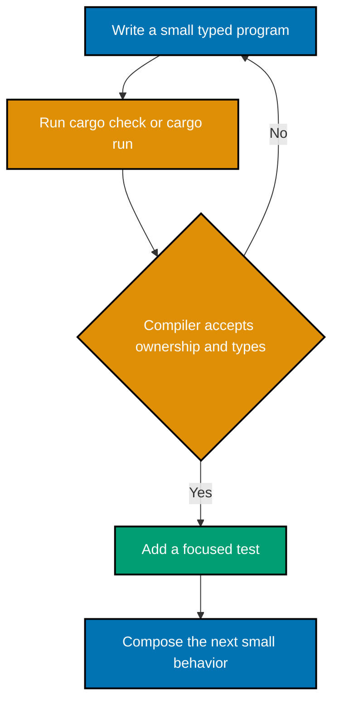

This Primer is **just enough Rust to be productive in modern systems programming**. It gives you
the Cargo loop, ownership and borrowing, ordinary data modeling, fallible control flow, traits,
generics, and collections—the small surface consumed by
[Modern System Programming](../modern-system-programming/overview.md).

It deliberately stops before concurrency design, FFI, `unsafe`, custom allocators, macros, and
platform APIs. Those belong to Modern System Programming, where the systems problem supplies the
reason to use them. You need only a terminal, a current stable Rust toolchain, and an editor with
rust-analyzer support. There are no prior course prerequisites.

## Productive Rust loop

Start at the [learning overview](./learning/overview.md), run each numbered example, then use the
[five-part drilling routine](./drilling/overview.md) to recall and repair the core ideas.
