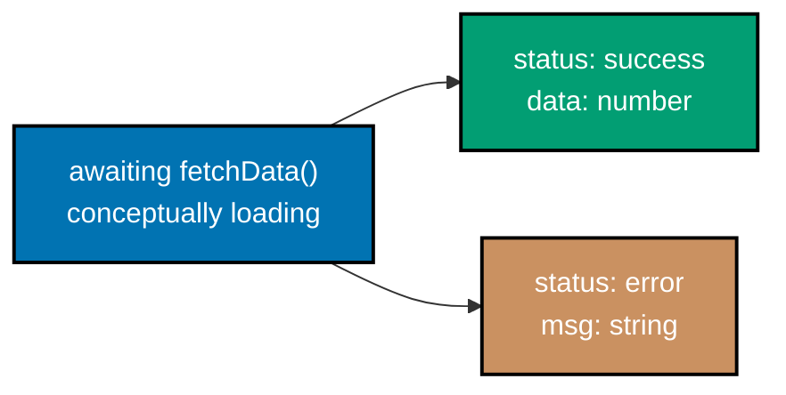

Examples 61-82 cover ESM modules across multiple files (named exports, default exports, type-only
imports, barrel re-exports), typed Promises and `async`/`await`, the built-in utility types, mapped
types, running `eslint` and `prettier` from the CLI, and a `tsc --noEmit` error-then-fix workflow --
closing with an end-to-end typed fetch and a full module that combines discriminated unions, generics,
and async flow together. Multi-file examples live together under one `learning/code/ex-NN-<slug>/`
directory; each example states its exact run command in its own **Run** line.

---

### Example 61: ESM Named Export Import

_ex-61 &middot; exercises co-22_

`export function` names an export explicitly, and `import { name }` pulls it in by that same name --
the most common ESM import/export pairing.

**`learning/code/ex-61-esm-named-export-import/util.ts`**

```typescript
// Example 61: util.ts -- a plain named export, no default.
export function square(n: number): number {
  return n * n; // => squares the input
}
```

**`learning/code/ex-61-esm-named-export-import/main.ts`**

```typescript
// Example 61: ESM Named Export Import -- imports square from the sibling util.ts.
import { square } from "./util"; // => a named import, matching util.ts's named export

console.log(square(6)); // => Output: 36
```

**Run**: `tsc -p tsconfig.json && tsx main.ts`

**Output**:

```text
36
```

**Key takeaway**: a named export's import binding must match the SAME name it was exported under
(`{ square }`, not any other name) -- this is what makes named exports self-documenting at the
import site.

**Why it matters**: Named exports are the default choice for any module exposing more than one thing
-- Example 82's `state.ts` exports both a type and a function this same way, and every multi-export
module in real TypeScript projects follows this exact pattern.

---

### Example 62: ESM Default Export

_ex-62 &middot; exercises co-22_

`export default` marks a module's single primary export -- the importing side chooses whatever local
name it wants, with no braces.

**`learning/code/ex-62-esm-default-export/util.ts`**

```typescript
// Example 62: util.ts -- a single default export.
export default function shout(text: string): string {
  return text.toUpperCase() + "!"; // => uppercases text and appends an exclamation mark
}
```

**`learning/code/ex-62-esm-default-export/main.ts`**

```typescript
// Example 62: ESM Default Export -- the import binding's name is chosen locally.
import shout from "./util"; // => no braces -- binds the default export under any local name

console.log(shout("hi")); // => Output: HI!
```

**Run**: `tsc -p tsconfig.json && tsx main.ts`

**Output**:

```text
HI!
```

**Key takeaway**: unlike a named import, a default import's local name is not tied to anything the
exporting module wrote -- `import shout from "./util"` and `import yell from "./util"` both bind the
same function.

**Why it matters**: A module with exactly one primary export (a single class, a single configuration
object) is the natural fit for `export default`; a module exposing several related exports (like
Example 61's `util.ts`, or Example 82's `state.ts`) reads more clearly with named exports instead.

---

### Example 63: Type-Only Import

_ex-63 &middot; exercises co-22, co-18_

`import type` is GUARANTEED to be erased entirely from the compiled JavaScript -- a way to signal "I
only need this at compile time" explicitly.

**`learning/code/ex-63-type-only-import/types.ts`**

```typescript
// Example 63: types.ts -- a type-only module; nothing here exists at runtime.
export interface User {
  id: number;
  name: string;
}
```

**`learning/code/ex-63-type-only-import/main.ts`**

```typescript
// Example 63: Type-Only Import -- erased completely at compile time, no runtime cost.
import type { User } from "./types"; // => `import type` is GUARANTEED to disappear from output JS

const user: User = { id: 1, name: "Ada" }; // => User is used only as a type annotation here
console.log(user); // => Output: { id: 1, name: 'Ada' }
```

**Run**: `tsc -p tsconfig.json && ls dist && tsx main.ts` (this example's `tsconfig.json` sets
`outDir: "dist"`, so it actually emits, unlike most examples in this primer -- `ls dist` is what
produces the first two `Output` lines below)

**Output**:

```text
main.js
types.js
{ id: 1, name: 'Ada' }
```

Note the emitted `dist/` directory: `main.js` contains the compiled `console.log`, but `types.js` is
present only because `types.ts` has no other content to strip down to -- inspecting it shows the
`User` interface itself produced zero runtime code, exactly as `import type` promises.

**Key takeaway**: `import type` is a stronger guarantee than a plain `import` of something that
happens to only be a type -- it tells the compiler (and any bundler) to never even consider emitting
this import, closing off an entire class of "why did this appear in my bundle" bugs.

**Why it matters**: In a large codebase, mixing types and values in one `import` statement can
accidentally pull a whole module into a bundle just for its types -- Example 82's `main.ts` shows the
inline `import { describe, type TaskState } from "./state"` syntax that marks just the type portion of
a mixed import.

---

### Example 64: Re-Export Barrel

_ex-64 &middot; exercises co-22_

A "barrel" file re-exports several sibling modules' exports from ONE path -- callers import from the
barrel instead of reaching into each individual file.

**`learning/code/ex-64-re-export-barrel/a.ts`**

```typescript
// Example 64: a.ts -- one sibling module.
export function addOne(n: number): number {
  return n + 1; // => adds exactly one
}
```

**`learning/code/ex-64-re-export-barrel/b.ts`**

```typescript
// Example 64: b.ts -- another sibling module.
export function double(n: number): number {
  return n * 2; // => doubles the input
}
```

**`learning/code/ex-64-re-export-barrel/index.ts`**

```typescript
// Example 64: index.ts -- a barrel that re-exports both siblings from ONE path.
export { addOne } from "./a"; // => re-exports a.ts's addOne, unchanged
export { double } from "./b"; // => re-exports b.ts's double, unchanged
```

**`learning/code/ex-64-re-export-barrel/main.ts`**

```typescript
// Example 64: Re-Export Barrel -- one import path resolves BOTH sibling functions.
import { addOne, double } from "./index"; // => a single import path, two different source modules

console.log(addOne(1), double(4)); // => Output: 2 8
```

**Run**: `tsc -p tsconfig.json && tsx main.ts`

**Output**:

```text
2 8
```

**Key takeaway**: `index.ts` neither defines `addOne` nor `double` itself -- it only re-exports them,
so `main.ts` never needs to know that they actually live in two separate files.

**Why it matters**: Barrels are the standard way a TypeScript package (or an internal module folder)
presents one clean public import path while its implementation stays split across focused, individual
files -- useful for library-style code, though best kept shallow to avoid accidental circular imports.

---

### Example 65: Typed Promise

_ex-65 &middot; exercises co-23_

`Promise<number>` documents exactly what the eventual resolved value will be -- `.then`'s callback
parameter is inferred from that type parameter automatically.

**`learning/code/ex-65-typed-promise/example.ts`**

```typescript
// Example 65: Typed Promise -- Promise<number> documents what the eventual value will be.
function fetchN(): Promise<number> {
  return Promise.resolve(42); // => resolves immediately with a number
}

fetchN().then((n) => {
  // => n's type is inferred as number, from Promise<number>'s type parameter
  console.log(n); // => Output: 42
});
```

**Run**: `tsx example.ts`

**Output**:

```text
42
```

**Key takeaway**: `Promise<T>` is a generic type (Example 45's `Box<T>` pattern, applied to
asynchronous values) -- `T` flows from the function's declared return type all the way through to
`.then`'s callback parameter.

**Why it matters**: Every asynchronous operation in TypeScript -- a fetch, a database query, a file
read -- returns a `Promise<T>`, and a precise `T` is what lets the rest of this primer's async
examples (`await`, `Promise.all`, discriminated async state) stay fully type-checked.

---

### Example 66: Async Await Typed

_ex-66 &middot; exercises co-23_

`await` unwraps a `Promise<T>` down to a plain `T` -- inside an `async function`, the awaited value's
type is exactly what the promise resolves to, with the `Promise` wrapper gone.

**`learning/code/ex-66-async-await-typed/example.ts`**

```typescript
// Example 66: Async Await Typed -- await unwraps Promise<number> to plain number.
function fetchN(): Promise<number> {
  return Promise.resolve(42); // => declared return type is Promise<number>, matching the signature
}

async function run(): Promise<void> {
  const n = await fetchN(); // => n's type is number, not Promise<number>
  console.log(n); // => Output: 42
}

run(); // => kicks off the async function -- output appears once the awaited promise resolves
```

**Run**: `tsx example.ts`

**Output**:

```text
42
```

**Key takeaway**: `await fetchN()` produces a `number`, never a `Promise<number>` -- the type system
tracks the unwrapping exactly the same way the runtime does.

**Why it matters**: `async`/`await` reads like synchronous code while staying fully asynchronous --
and because the type system tracks the unwrapping precisely, chaining several `await`s (as Example 69
and the capstone both do) stays just as type-safe as any synchronous code path.

---

### Example 67: Async Error Typed

_ex-67 &middot; exercises co-23, co-18_

A caught error's type is `unknown` under `strict` -- TypeScript cannot know in advance what a `throw`
statement anywhere in the awaited call actually threw, so it refuses to assume `Error`.

**`learning/code/ex-67-async-error-typed/example.ts`**

```typescript
// Example 67: Async Error Typed -- a caught error's type is unknown under strict.
function risky(): Promise<number> {
  return Promise.reject(new Error("boom")); // => a promise that always rejects
}

async function run(): Promise<void> {
  try {
    await risky();
  } catch (err) {
    // => err's type is unknown -- must be narrowed before it can be used
    if (err instanceof Error) {
      console.log(err.message); // => .message is safe only after narrowing to Error
    }
  }
}

run(); // => Output: boom
```

**Run**: `tsx example.ts`

**Output**:

```text
boom
```

**Key takeaway**: `catch (err)` gives `err` the type `unknown` under `strict` (not `any`, as older
TypeScript defaulted to) -- exactly the same discipline Example 46 established, applied here to
whatever a `throw` statement anywhere upstream might have thrown.

**Why it matters**: JavaScript allows `throw "a string"` or `throw 42`, not just `throw new Error()` --
`unknown` forces every catch block to actually verify (`instanceof Error`, here) before reading
`.message` or any other property, closing off a real class of "cannot read property of undefined"
crashes in error-handling code itself.

---

### Example 68: Promise All Tuple

_ex-68 &middot; exercises co-23, co-05_

`Promise.all` on a fixed-length array of differently typed promises resolves to a tuple that
preserves each position's own type -- not a widened union array.

**`learning/code/ex-68-promise-all-tuple/example.ts`**

```typescript
// Example 68: Promise All Tuple -- Promise.all preserves each promise's OWN resolved type.
async function run(): Promise<void> {
  const [n, s] = await Promise.all([
    Promise.resolve(42), // => resolves to number
    Promise.resolve("hi"), // => resolves to string
  ]); // => the destructured result keeps [number, string], not (number | string)[]
  console.log(n, s); // => Output: 42 hi
}

run();
```

**Run**: `tsx example.ts`

**Output**:

```text
42 hi
```

**Key takeaway**: `n`'s type is `number` and `s`'s type is `string` individually -- `Promise.all`'s
type signature is overloaded specifically to preserve a tuple's per-position types, the same way
Example 44's `pair<A, B>` preserves two independent type parameters.

**Why it matters**: Running several independent async operations concurrently and destructuring their
results by position (rather than awaiting them one at a time) is a common performance pattern -- and
it stays fully type-checked here, with no manual re-annotation needed after the `await`.

---

### Example 69: Async Discriminated State

_ex-69 &middot; exercises co-23, co-16_

An async function that returns a discriminated union models "loading, then success or error" as a
single, precisely typed return value -- exactly the shape a real API call's result takes.



**`learning/code/ex-69-async-discriminated-state/example.ts`**

```typescript
// Example 69: Async Discriminated State -- an async fetch producing loading->success/error states.
type FetchState =
  | { status: "loading" } // => no extra data while loading
  | { status: "success"; data: number } // => data present only once successful
  | { status: "error"; msg: string }; // => msg present only on failure

async function fetchData(shouldFail: boolean): Promise<FetchState> {
  // => simulates a network call -- resolves to either the success or error variant
  if (shouldFail) {
    return { status: "error", msg: "network down" }; // => shouldFail=true takes this branch
  }
  return { status: "success", data: 42 }; // => shouldFail=false takes this branch
}

function render(state: FetchState): string {
  if (state.status === "success") {
    return `data: ${state.data}`; // => narrowed to success here -- .data is safe
  }
  if (state.status === "error") {
    return `error: ${state.msg}`; // => narrowed to error here -- .msg is safe
  }
  return "loading"; // => the one remaining variant
}

async function run(): Promise<void> {
  console.log(render(await fetchData(false))); // => Output: data: 42
  console.log(render(await fetchData(true))); // => Output: error: network down
}

run(); // => prints both outcomes: a successful fetch, then a failing one
```

**Run**: `tsx example.ts`

**Output**:

```text
data: 42
error: network down
```

**Key takeaway**: `Promise<FetchState>` combines Example 39's state-machine union with Example 66's
`async`/`await` unwrapping -- the awaited result is a fully narrowable discriminated union, not a
generic "response" blob.

**Why it matters**: This is the direct template for real API integration code: a `loading` /
`success` / `error` union return type from an `async function`, narrowed by the caller with a
`switch` or chained `if`s (Example 37) -- the capstone's `JobState` extends this exact pattern with a
fourth variant.

---

### Example 70: Utility Partial

_ex-70 &middot; exercises co-24_

`Partial<T>` produces a new type with every property of `T` made optional -- useful for describing a
partial update ("patch") to an existing shape.

**`learning/code/ex-70-utility-partial/example.ts`**

```typescript
// Example 70: Utility Partial -- Partial<T> makes every field of T optional.
type User = { id: number; name: string };
type PartialUser = Partial<User>; // => { id?: number; name?: string }

const patch: PartialUser = { name: "Ada" }; // => id may be omitted -- Partial made it optional
console.log(patch); // => Output: { name: 'Ada' }
```

**Run**: `tsc --noEmit --skipLibCheck example.ts && tsx example.ts`

**Output**:

```text
{ name: 'Ada' }
```

**Key takeaway**: `Partial<User>` is itself built from a mapped type (Example 75) internally -- it
takes every key of `User` and marks it optional, without you writing that mapping by hand.

**Why it matters**: `Partial<T>` is the standard type for a PATCH-style update object -- a function
that merges partial changes into an existing record almost always types its input parameter this way,
rather than duplicating the target type with every field marked `?` by hand.

---

### Example 71: Utility Pick Omit

_ex-71 &middot; exercises co-24_

`Pick<T, K>` keeps only the named keys; `Omit<T, K>` keeps everything EXCEPT the named keys -- two
complementary ways to derive a narrower shape from an existing type.

**`learning/code/ex-71-utility-pick-omit/example.ts`**

```typescript
// Example 71: Utility Pick Omit -- Pick keeps a subset of keys; Omit removes a subset.
type User = { id: number; name: string; email: string };
type UserId = Pick<User, "id">; // => { id: number } -- ONLY id
type UserWithoutId = Omit<User, "id">; // => { name: string; email: string } -- everything BUT id

const idOnly: UserId = { id: 1 };
const rest: UserWithoutId = { name: "Ada", email: "ada@example.com" };
console.log(idOnly, rest); // => Output: { id: 1 } { name: 'Ada', email: 'ada@example.com' }
```

**Run**: `tsc --noEmit --skipLibCheck example.ts && tsx example.ts`

**Output**:

```text
{ id: 1 } { name: 'Ada', email: 'ada@example.com' }
```

**Key takeaway**: `Pick<User, "id">` and `Omit<User, "id">` are exact complements of each other over
`User`'s key set -- choosing between them is purely about which is shorter to write for the shape you
actually need.

**Why it matters**: Deriving a narrower type FROM an existing one (rather than hand-writing a
duplicate) keeps both types synchronized automatically -- adding a field to `User` updates
`UserWithoutId` for free, with zero risk of the two drifting out of sync over time.

---

### Example 72: Utility Record

_ex-72 &middot; exercises co-24, co-25_

`Record<K, V>` is the utility-type shorthand for an index signature -- `Record<string, number>` means
exactly the same thing as Example 60's `{ [key: string]: number }`.

**`learning/code/ex-72-utility-record/example.ts`**

```typescript
// Example 72: Utility Record -- Record<K, V> is a shorthand for an index signature.
type Scores = Record<string, number>; // => equivalent to { [key: string]: number }

const scores: Scores = { alice: 90, bob: 85 }; // => arbitrary string keys, all numeric values
console.log(scores.alice); // => Output: 90
```

**Run**: `tsc --noEmit --skipLibCheck example.ts && tsx example.ts`

**Output**:

```text
90
```

**Key takeaway**: `Record<string, number>` reads more directly as "a dictionary from string keys to
number values" than the equivalent index-signature syntax does, even though the two compile to
exactly the same type.

**Why it matters**: `Record` also works with a literal-union key type (`Record<"red" | "green" |
"blue", string>`), producing an exact, closed set of required keys -- a capability a plain index
signature does not have, since `[key: string]: V` always allows any string key.

---

### Example 73: Utility Readonly Required

_ex-73 &middot; exercises co-24_

`Required<T>` removes every `?` from `T`'s properties; `Readonly<T>` adds `readonly` to every one of
them -- two more mapped-type-derived utilities, each tightening one specific aspect of a type.

**`learning/code/ex-73-utility-readonly-required/example.ts`**

```typescript
// Example 73: Utility Readonly Required -- Readonly blocks writes; Required removes optionality.
type Draft = { title?: string; body?: string };
type Published = Required<Draft>; // => { title: string; body: string } -- no more `?`

const post: Published = { title: "Hi", body: "World" }; // => both fields are now mandatory
console.log(post); // => Output: { title: 'Hi', body: 'World' }

type Config = { mode: string };
const frozen: Readonly<Config> = { mode: "dark" }; // => every field becomes readonly
console.log(frozen.mode); // => Output: dark
```

**Run**: `tsc --noEmit --skipLibCheck example.ts && tsx example.ts`

**Output**:

```text
{ title: 'Hi', body: 'World' }
dark
```

**Writing to a `Readonly<T>` field fails to compile**:

```typescript
// Example 73 (invalid, Readonly): writing to a Readonly<T> field fails to compile.
type Config = { mode: string };
const frozen: Readonly<Config> = { mode: "dark" };

frozen.mode = "light"; // => TYPE ERROR: 'mode' is a read-only property
console.log(frozen.mode);
```

**Run**: `tsc --noEmit --strict --skipLibCheck invalid-readonly.ts`

**Output**:

```text
invalid-readonly.ts(5,8): error TS2540: Cannot assign to 'mode' because it is a read-only property.
```

**Omitting a field `Required<T>` now demands also fails to compile**:

```typescript
// Example 73 (invalid, Required): omitting a field Required<T> now demands.
type Draft = { title?: string; body?: string };
type Published = Required<Draft>;

const post: Published = { title: "Hi" }; // => TYPE ERROR: 'body' is required now
console.log(post);
```

**Run**: `tsc --noEmit --strict --skipLibCheck invalid-required.ts`

**Output**:

```text
invalid-required.ts(5,7): error TS2741: Property 'body' is missing in type '{ title: string; }' but required in type 'Required<Draft>'.
```

**Key takeaway**: `Required<T>` and `Readonly<T>` are opposites of `Partial<T>` (Example 70) and
Example 10's `readonly T[]`, respectively -- both are just as mechanically derived from `T` as
`Partial` is.

**Why it matters**: `Required<Draft>` is exactly the type a "publish" function's parameter should
have -- it enforces, at the type level, that every optional draft field must be filled in before
publishing is even attempted, catching a missing field at compile time rather than in production.

---

### Example 74: Utility ReturnType

_ex-74 &middot; exercises co-24_

`ReturnType<typeof fn>` extracts a function's return type as a standalone type -- useful when you want
to reuse a return shape without duplicating it by hand.

**`learning/code/ex-74-utility-returntype/example.ts`**

```typescript
// Example 74: Utility ReturnType -- ReturnType<typeof fn> extracts a function's return type.
function makeUser(name: string): { id: number; name: string } {
  return { id: 1, name };
}

type MakeUserResult = ReturnType<typeof makeUser>; // => { id: number; name: string }

const u: MakeUserResult = { id: 2, name: "Grace" }; // => matches makeUser's return shape exactly
console.log(u); // => Output: { id: 2, name: 'Grace' }
```

**Run**: `tsc --noEmit --skipLibCheck example.ts && tsx example.ts`

**Output**:

```text
{ id: 2, name: 'Grace' }
```

**Key takeaway**: `typeof makeUser` gets the FUNCTION's type; `ReturnType<...>` then extracts just its
return type -- the same two-step "get a value's type, then operate on it" pattern Example 58 used for
an object.

**Why it matters**: Whenever a function's return shape is the source of truth (rather than a
separately declared type), `ReturnType<typeof fn>` keeps every consumer of that shape automatically
synchronized with the function's actual implementation, with zero duplication.

---

### Example 75: Mapped Type

_ex-75 &middot; exercises co-25_

`{ [K in keyof T]: ... }` is the general mechanism the built-in utility types (`Partial`, `Readonly`,
and the rest) are all built from -- it transforms every property of `T` according to a rule you write
yourself.

**`learning/code/ex-75-mapped-type/example.ts`**

```typescript
// Example 75: Mapped Type -- { [K in keyof T]: ... } transforms EVERY property of T.
type User = { id: number; name: string };
type Flags<T> = { [K in keyof T]: boolean }; // => same keys as T, every value type becomes boolean

const changed: Flags<User> = { id: true, name: false }; // => id and name, both boolean now
console.log(changed); // => Output: { id: true, name: false }
```

**Run**: `tsc --noEmit --skipLibCheck example.ts && tsx example.ts`

**Output**:

```text
{ id: true, name: false }
```

**Key takeaway**: `Flags<User>` keeps `User`'s exact key set (`id`, `name`) but replaces every VALUE
type with `boolean` -- the general-purpose building block that `Partial<T>`, `Readonly<T>`, and
`Record<K, V>` are all specialized versions of.

**Why it matters**: Mapped types are the last mechanism this primer teaches for deriving one type from
another -- combined with `keyof` (Example 59), they explain WHY the built-in utility types (Examples
70-74) all behave the way they do, rather than treating them as unrelated magic.

---

### Example 76: Generic Constrained Getter

_ex-76 &middot; exercises co-17, co-25_

`get<T, K extends keyof T>(obj: T, key: K): T[K]` combines a generic constraint (Example 42) with an
indexed access type (`T[K]`) -- the return type is the EXACT type of whichever property was actually
requested.

**`learning/code/ex-76-generic-constrained-getter/example.ts`**

```typescript
// Example 76: Generic Constrained Getter -- T[K] returns the EXACT type of that one property.
function get<T, K extends keyof T>(obj: T, key: K): T[K] {
  // => K is constrained to obj's own keys -- the return type is precisely T[K]
  return obj[key];
}

const user = { id: 1, name: "Ada" };
const userName = get(user, "name"); // => userName's type is inferred as string, from T["name"]
console.log(userName); // => Output: Ada
```

**Run**: `tsc --noEmit --skipLibCheck example.ts && tsx example.ts`

**Output**:

```text
Ada
```

**Key takeaway**: `T[K]` ("indexed access") reads out the exact type of property `K` on `T` -- here,
`get(user, "name")`'s return type is inferred as precisely `string`, not `string | number` (which a
looser signature would have produced).

**Why it matters**: This is `keyof` (Example 59) and generic constraints (Example 42) combined into
their single most useful application: a fully type-safe, reusable property accessor -- the same shape
underlying typed state-management "selector" functions in real frontend codebases.

---

### Example 77: eslint Clean

_ex-77 &middot; exercises co-26_

`eslint` catches real code-quality issues -- like an unused variable -- that `tsc` does not flag on
its own, using a flat `eslint.config.mjs` (ESLint 9's default configuration format).

**`learning/code/ex-77-eslint-clean/eslint.config.mjs`**

```javascript
// Example 77: eslint.config.mjs -- a minimal flat config (ESLint 9's default format).
import js from "@eslint/js"; // => the core "recommended" rule set, including no-unused-vars
import tsParser from "@typescript-eslint/parser"; // => lets ESLint's parser understand .ts syntax

export default [
  js.configs.recommended,
  {
    files: ["*.ts"],
    languageOptions: {
      parser: tsParser,
      parserOptions: { ecmaVersion: "latest", sourceType: "module" },
      globals: { console: "readonly" }, // => this example only needs the console global
    },
  },
];
```

**`learning/code/ex-77-eslint-clean/bad.ts`**

```typescript
// Example 77: eslint Clean -- bad.ts has a genuine unused variable.
function greet(name: string): string {
  const unused = "never read"; // => eslint's no-unused-vars rule flags exactly this
  return `hi ${name}`; // => the function itself still works correctly
}

console.log(greet("Ada")); // => Output: hi Ada -- the SCRIPT runs fine; eslint still flags it
```

**Run**: `eslint bad.ts`

**Output**:

```text
/ex-77-eslint-clean/bad.ts
  3:9  error  'unused' is assigned a value but never used  no-unused-vars

✖ 1 problem (1 error, 0 warnings)
```

**`learning/code/ex-77-eslint-clean/good.ts`** (the fix -- the unused variable removed entirely)

```typescript
// Example 77 (fixed): the unused variable is removed entirely.
function greet(name: string): string {
  return `hi ${name}`; // => no dead binding left behind
}

console.log(greet("Ada")); // => Output: hi Ada
```

**Run**: `eslint good.ts && tsx good.ts`

**Output**:

```text
hi Ada
```

(`eslint good.ts` exits with no output and status `0` -- clean.)

**Key takeaway**: `bad.ts` runs fine with `tsx` -- an unused variable is not a TYPE error, so `tsc`
never flags it -- but it is exactly the kind of dead-code issue a linter is designed to catch that a
type checker is not.

**Why it matters**: `tsc` and `eslint` catch different, complementary classes of problems: `tsc`
verifies types are consistent; `eslint` verifies code-quality conventions (unused variables, unsafe
patterns, style rules). A real TypeScript project's pre-commit/CI pipeline runs both, not either
alone.

---

### Example 78: prettier Format

_ex-78 &middot; exercises co-26_

`prettier` reformats code to a single, consistent style automatically -- `--check` reports whether a
file is already formatted; `--write` reformats it in place.

**`learning/code/ex-78-prettier-format/messy.ts`** (before -- deliberately misformatted)

<!-- prettier-ignore -->
```typescript
// Example 78: prettier Format -- messy.ts, deliberately misformatted input.
function add(a:number,b: number):number {
      return a+b} // => missing spaces, no semicolon, brace shares a line with return

console.log(  add(1,2)  ) // => extra spaces inside the parens, no trailing semicolon
```

**Run**: `prettier --check messy.ts`

**Output**:

```text
Checking formatting...
[warn] messy.ts
[warn] Code style issues found in the above file. Run Prettier with --write to fix.
```

(exit status `1` -- formatting issues found)

**Run**: `prettier --write messy.ts`

**Output**:

```text
messy.ts 93ms
```

**`learning/code/ex-78-prettier-format/messy.ts`** (after -- reformatted in place by the command above)

```typescript
// Example 78: prettier Format -- messy.ts, deliberately misformatted input.
function add(a: number, b: number): number {
  return a + b; // => same logic as before -- prettier only changed style
}

console.log(add(1, 2)); // => same call as before -- only whitespace/semicolons changed
```

**Run**: `prettier --check messy.ts` (re-run, to confirm the fix)

**Output**:

```text
Checking formatting...
All matched files use Prettier code style!
```

(exit status `0` -- clean)

**Key takeaway**: `prettier --write` genuinely mutates the file on disk -- inconsistent spacing,
missing semicolons, and line-wrapping choices all disappear in favor of Prettier's one deterministic
style, with zero manual formatting decisions left for the author.

**Why it matters**: Prettier eliminates formatting bikeshedding from code review entirely -- pair it
with `eslint` (Example 77, which focuses on logic/quality issues, not formatting) and both tools
typically run automatically in a pre-commit hook, exactly as this repository's own tooling does.

---

### Example 79: tsc --noEmit Catches Error

_ex-79 &middot; exercises co-26, co-04_

A deliberate type error -- multiplying a `number` by a `string` -- fails `tsc --noEmit` with a real
compiler diagnostic; fixing the arithmetic makes the same command pass clean.

**`learning/code/ex-79-tsc-noemit-catches-error/broken.ts`** (the broken version)

```typescript
// Example 79 (broken): the SAME function, with a deliberate type error introduced.
function double(n: number): number {
  return n * "2"; // => TYPE ERROR: arithmetic on a number and a string
}

console.log(double(21)); // => never reached -- tsc rejects this file before it can run
```

**Run**: `tsc --noEmit --strict --target ES2022 --skipLibCheck broken.ts`

**Output**:

```text
broken.ts(3,14): error TS2363: The right-hand side of an arithmetic operation must be of type 'any', 'number', 'bigint' or an enum type.
```

**`learning/code/ex-79-tsc-noemit-catches-error/example.ts`** (the fix -- a plain, correctly typed
multiplication)

```typescript
// Example 79: tsc --noEmit Catches Error -- the fixed, clean version of this file.
function double(n: number): number {
  // => same signature as broken.ts -- only the multiplication below is fixed
  return n * 2; // => a plain, correctly typed multiplication
}

console.log(double(21)); // => Output: 42
```

**Run**: `tsc --noEmit --strict --target ES2022 --skipLibCheck example.ts && tsx example.ts`

**Output**:

```text
42
```

**Key takeaway**: `tsc --noEmit` type-checks a file WITHOUT producing any output JavaScript -- exactly
the command a CI pipeline or editor integration runs to catch a type error like this one before it
ever reaches a runtime.

**Why it matters**: This error-then-fix cycle -- write code, hit a real compiler error, read the exact
diagnostic, fix the root cause, re-run clean -- is the everyday development loop this entire primer has
been building toward: catching this exact class of bug (silent numeric-string coercion) at compile
time, not in a production log.

---

### Example 80: Typed Argv Parsing

_ex-80 &middot; exercises co-26_

`@types/node` types Node.js's own built-in globals, including `process.argv` -- a plain `string[]`,
just like any other array you have already worked with in this primer.

**`learning/code/ex-80-typed-argv-parsing/example.ts`**

```typescript
// Example 80: Typed Argv Parsing -- process.argv is a plain string[], typed by @types/node.
const args: string[] = process.argv.slice(2); // => drops "node" and the script path, keeps the rest
const who: string = args[0] ?? "stranger"; // => ?? falls back when no argument was passed

console.log(`hello, ${who}`); // => Output depends on the argument passed at the CLI
```

**`learning/code/ex-80-typed-argv-parsing/tsconfig.json`** (`"types": ["node"]` whitelists only
`@types/node`, keeping `process` typed while excluding every other ambient `@types` package)

```json
{
  "compilerOptions": {
    "target": "ES2022",
    "module": "ESNext",
    "moduleResolution": "Bundler",
    "strict": true,
    "skipLibCheck": true,
    "types": ["node"],
    "noEmit": true
  },
  "include": ["*.ts"]
}
```

**Run**: `tsc -p tsconfig.json && tsx example.ts` (no argument), then `tsx example.ts Ada`

**Output**:

```text
hello, stranger
hello, Ada
```

**Key takeaway**: `process.argv[0]` is always the Node.js binary's own path and `process.argv[1]` is
the script's path -- `.slice(2)` is the idiomatic way to get just the arguments the user actually
passed.

**Why it matters**: Every Node.js CLI tool starts with typed `process.argv` parsing -- pairing it with
the nullish-coalescing operator (`??`, giving a default when no argument is present) is the smallest
possible complete CLI argument pattern, and the capstone's job runner builds on this same
Node.js-globals-via-`@types/node` foundation.

---

### Example 81: End-To-End Typed Fetch

_ex-81 &middot; exercises co-15, co-23, co-18_

Simulating a network fetch's `unknown`-typed JSON response, then narrowing it with a user-defined type
guard before use, ties together nearly every mechanism this primer has taught: `unknown`, `async`/
`await`, and a hand-written type predicate.

**`learning/code/ex-81-end-to-end-typed-fetch/example.ts`**

```typescript
// Example 81: End-To-End Typed Fetch -- an async fetch, narrowed by a user-defined type guard.
type User = { id: number; name: string };

// => simulates a network response -- resolves to `unknown`, exactly like a real fetch().json()
async function fetchJson(raw: string): Promise<unknown> {
  return JSON.parse(raw); // => JSON.parse's return type is always unknown-worthy (any, narrowed here)
}

function isUser(value: unknown): value is User {
  // => the actual runtime shape check backing the `value is User` predicate
  return (
    typeof value === "object" &&
    value !== null &&
    typeof (value as User).id === "number" &&
    typeof (value as User).name === "string"
  );
}

async function loadUser(raw: string): Promise<string> {
  const parsed = await fetchJson(raw); // => parsed's type is unknown
  if (isUser(parsed)) {
    // => after this guard, parsed is narrowed to User
    return `user: ${parsed.name}`; // => .name is safe to read here
  }
  return "invalid payload"; // => rejected -- parsed did not match the User shape
}

async function run(): Promise<void> {
  console.log(await loadUser('{"id":1,"name":"Ada"}')); // => valid payload -- Output: user: Ada
  console.log(await loadUser('{"id":"oops"}')); // => invalid payload -- Output: invalid payload
}

run();
```

**Run**: `tsc --noEmit --strict --target ES2022 --skipLibCheck example.ts && tsx example.ts`

**Output**:

```text
user: Ada
invalid payload
```

**Key takeaway**: `fetchJson` returns `unknown`, never `User` directly -- `isUser` is the ONLY thing
that turns "data of an unverified shape" into "data safely typed as `User`", and it does so with a
genuine runtime check, not an `as User` assertion (Example 54's honest, unchecked alternative).

**Why it matters**: This is the complete, production-shaped pattern for consuming any external data
source (a real `fetch().json()`, a webhook payload, a CLI argument parsed as JSON): `unknown` at the
boundary, a user-defined type guard to narrow it, and a fallback path for when the shape does not
match -- every piece introduced separately across this primer, now working together on one real task.

---

### Example 82: Full Typed Module

_ex-82 &middot; exercises co-16, co-17, co-22, co-23_

A three-file ESM module -- a discriminated-union state type, a generic utility, and an async
orchestrator -- brings together nearly every mechanism this primer has taught, as a single runnable
program.

**`learning/code/ex-82-full-typed-module/state.ts`**

```typescript
// Example 82: state.ts -- a discriminated-union TaskState, tagged by "status".
export type TaskState =
  | { status: "pending" } // => no extra data while pending
  | { status: "done"; result: number } // => result present only once done
  | { status: "failed"; reason: string }; // => reason present only on failure

export function describe(state: TaskState): string {
  switch (state.status) {
    case "pending":
      return "pending"; // => the pending variant carries no extra data to interpolate
    case "done":
      return `done: ${state.result}`; // => narrowed to the done variant -- .result is safe
    case "failed":
      return `failed: ${state.reason}`; // => narrowed to the failed variant -- .reason is safe
  }
}
```

**`learning/code/ex-82-full-typed-module/util.ts`**

```typescript
// Example 82: util.ts -- a small generic utility, reused from main.ts.
export function firstOf<T>(items: T[]): T | undefined {
  // => T is inferred from whatever array is passed in -- no annotation needed at the call site
  return items[0]; // => the generic T flows through untouched
}
```

**`learning/code/ex-82-full-typed-module/main.ts`**

```typescript
// Example 82: Full Typed Module -- state.ts + util.ts + an async flow, wired via ESM imports.
import { describe, type TaskState } from "./state"; // => a value import PLUS an inline type-only one
import { firstOf } from "./util"; // => a plain value import -- firstOf is used at runtime, not just for its type

async function runTask(shouldFail: boolean): Promise<TaskState> {
  // => simulates async work -- resolves to one of TaskState's three variants
  if (shouldFail) {
    return { status: "failed", reason: "disk full" };
  }
  return { status: "done", result: 42 };
}

async function main(): Promise<void> {
  const state = await runTask(false); // => state's type is TaskState
  console.log(describe(state)); // => Output: done: 42

  const failedState = await runTask(true); // => same call, different branch -- shouldFail=true now
  console.log(describe(failedState)); // => Output: failed: disk full

  const first = firstOf([10, 20, 30]); // => T is inferred as number
  console.log(first); // => Output: 10
}

main(); // => kicks off the async flow -- both TaskState outcomes plus the generic utility all run in order
```

**Run**: `tsc -p tsconfig.json && tsx main.ts`

**Output**:

```text
done: 42
failed: disk full
10
```

**Key takeaway**: `import { describe, type TaskState } from "./state"` combines a value import and an
inline type-only import in one statement -- `describe` exists at runtime, `TaskState` is erased, and
the compiler tracks the difference for you automatically.

**Why it matters**: This example is deliberately shaped like a miniature version of the capstone: a
discriminated-union state, a generic utility, and an `async` orchestrator, wired together across
three real ESM modules. Every mechanism used here -- narrowing, generics, modules, async/await -- was
introduced individually across the Beginner and Intermediate tiers; the capstone extends this same
combination into a slightly larger, self-contained program.

---

← Previous: [Intermediate Examples](./intermediate.md) · Next: [Capstone](./capstone/overview.md) →
