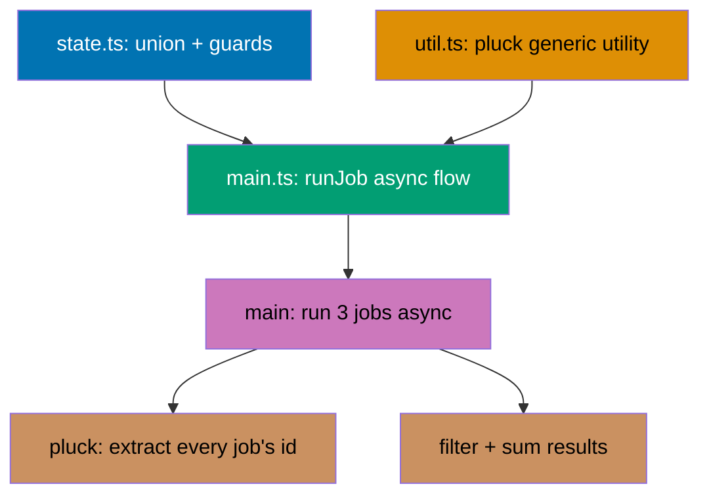

## Goal

Build a small job-runner module that combines the three mechanisms this primer spent 82 examples
building up to: a **discriminated-union state** (`JobState`, four tagged variants), a **generic
utility** (`pluck<T, K>`, constrained by `keyof T`), and an **async/await data flow** (a batch of
simulated jobs, run and summarized end to end). The whole thing type-checks clean, runs with `tsx`,
and passes `eslint`/`prettier` -- then, deliberately, we introduce and fix one real type error to
prove the type checker is actually doing its job, not just present.



## Concepts exercised

- [x] Discriminated union with a shared `status` tag (Example 36, co-16)
- [x] Exhaustiveness checking via a `never`-typed `default` case (Example 38, co-16/co-18)
- [x] User-defined type guard (`isSuccess`, Example 34, co-15)
- [x] Generic function with a `keyof`-constrained type parameter (Example 76, co-17/co-25)
- [x] `async`/`await` typed data flow (Examples 66/69, co-23)
- [x] ESM modules: value + inline type-only import in one statement (Example 82, co-22)
- [x] A deliberate type error, its real `tsc` diagnostic, and the fix (Example 79, co-26)
- [x] `eslint` and `prettier`, both clean, from the CLI (Examples 77-78, co-26)

## Ordered steps

### Step 1: `tsconfig.json` + `src/state.ts` + `src/util.ts`, verified via `tsc --noEmit`

**`learning/capstone/code/tsconfig.json`**

```json
{
  "compilerOptions": {
    "target": "ES2022",
    "module": "ESNext",
    "moduleResolution": "Bundler",
    "strict": true,
    "skipLibCheck": true,
    "types": [],
    "noEmit": true
  },
  "include": ["src/**/*.ts"],
  "exclude": ["src/main.broken.ts"]
}
```

`src/main.broken.ts` (Step 3's deliberately broken file) is excluded from this main config so that the
"everything is clean" check in this step does not trip over a file that exists specifically to fail.

**`learning/capstone/code/src/state.ts`**

```typescript
// Capstone: state.ts -- a discriminated-union JobState, tagged by its own "status" field.
export type JobState =
  | { status: "queued"; id: number } // => waiting to start -- no result yet
  | { status: "running"; id: number } // => in progress -- still no result
  | { status: "success"; id: number; result: number } // => finished -- result is safe to read
  | { status: "failed"; id: number; reason: string }; // => finished badly -- reason is safe to read

export function describeJob(job: JobState): string {
  // => switch narrows job's type inside each case, exactly like Example 37/38
  switch (job.status) {
    case "queued":
      return `job ${job.id}: queued`;
    case "running":
      return `job ${job.id}: running`;
    case "success":
      return `job ${job.id}: succeeded with ${job.result}`; // => .result is safe here
    case "failed":
      return `job ${job.id}: failed (${job.reason})`; // => .reason is safe here
    default: {
      // => exhaustiveness check, exactly like Example 38 -- catches an unhandled variant
      const _exhaustive: never = job;
      return _exhaustive;
    }
  }
}

// => a user-defined type guard, exactly like Example 34/81 -- narrows JobState to its success variant
export function isSuccess(job: JobState): job is { status: "success"; id: number; result: number } {
  return job.status === "success";
}
```

**`learning/capstone/code/src/util.ts`**

```typescript
// Capstone: util.ts -- a generic utility, reused by main.ts (exactly Example 76's shape).
export function pluck<T, K extends keyof T>(items: T[], key: K): T[K][] {
  // => K is constrained to items' own keys -- the return type is exactly T[K][]
  return items.map((item) => item[key]); // => extracts one field from every item
}
```

**Verify**:

```text
$ tsc -p tsconfig.json
$ echo $?
0
```

`tsc -p tsconfig.json` type-checks `state.ts` and `util.ts` (and, once written, `main.ts`) against
`tsconfig.json`, with `main.broken.ts` excluded -- a clean exit means every type in this step is sound.

### Step 2: `src/main.ts` async flow, verified via `tsx`

**`learning/capstone/code/src/main.ts`**

```typescript
// Capstone: main.ts -- runs a small batch of jobs end to end, printing every state transition.
import { describeJob, isSuccess, type JobState } from "./state"; // => value + type-only, combined
import { pluck } from "./util";

async function runJob(id: number, shouldFail: boolean): Promise<JobState> {
  // => simulates an async job -- prints its own loading transitions along the way
  console.log(describeJob({ status: "queued", id }));
  console.log(describeJob({ status: "running", id }));
  if (shouldFail) {
    return { status: "failed", id, reason: "simulated failure" };
  }
  return { status: "success", id, result: id * 10 };
}

async function main(): Promise<void> {
  const results: JobState[] = []; // => collects every job's FINAL state
  results.push(await runJob(1, false)); // => job 1 succeeds
  results.push(await runJob(2, true)); // => job 2 fails, deliberately
  results.push(await runJob(3, false)); // => job 3 succeeds

  for (const job of results) {
    console.log(describeJob(job)); // => one summary line per finished job
  }

  const ids = pluck(results, "id"); // => the generic utility, applied to JobState[]
  console.log("processed ids:", ids); // => Output: processed ids: [ 1, 2, 3 ]

  const succeeded = results.filter(isSuccess); // => narrowed to ONLY the success variant
  const totalResult = succeeded.reduce((sum, job) => sum + job.result, 0);
  // => .result is safe inside reduce -- succeeded's element type is the success variant
  console.log("total result:", totalResult); // => Output: total result: 40 (10 + 30)
}

main();
```

**Verify**:

```text
$ tsc -p tsconfig.json && tsx src/main.ts
job 1: queued
job 1: running
job 2: queued
job 2: running
job 3: queued
job 3: running
job 1: succeeded with 10
job 2: failed (simulated failure)
job 3: succeeded with 30
processed ids: [ 1, 2, 3 ]
total result: 40
```

Job 1 (`shouldFail: false`) and job 3 (`shouldFail: false`) both succeed with `result = id * 10`
(`10` and `30`); job 2 (`shouldFail: true`) fails deliberately. `pluck(results, "id")` extracts every
job's `id` regardless of which variant it ended in; `results.filter(isSuccess)` keeps only the two
succeeded jobs, and `40` is `10 + 30`.

### Step 3: deliberate type error, then the fix, verified clean

**`learning/capstone/code/src/main.broken.ts`** (reads `.result` on the raw, un-narrowed
`JobState[]` -- not every variant has a `.result` field)

```typescript
// Capstone (broken): reads .result on the raw, un-narrowed union -- not every variant has it.
import { describeJob, type JobState } from "./state";

async function runJob(id: number, shouldFail: boolean): Promise<JobState> {
  console.log(describeJob({ status: "queued", id }));
  console.log(describeJob({ status: "running", id }));
  if (shouldFail) {
    return { status: "failed", id, reason: "simulated failure" };
  }
  return { status: "success", id, result: id * 10 };
}

async function main(): Promise<void> {
  const results: JobState[] = [];
  results.push(await runJob(1, false));

  // => TYPE ERROR: 'result' does not exist on every JobState variant -- only "success" has it
  const total = results.reduce((sum, job) => sum + job.result, 0);
  console.log("total result:", total);
}

main();
```

**`learning/capstone/code/tsconfig.broken.json`** (a standalone config that includes only
`state.ts` and this broken file, isolating the deliberate error from the main config)

```json
{
  "compilerOptions": {
    "target": "ES2022",
    "module": "ESNext",
    "moduleResolution": "Bundler",
    "strict": true,
    "skipLibCheck": true,
    "types": []
  },
  "files": ["src/state.ts", "src/main.broken.ts"]
}
```

**Verify (the error, captured for real)**:

```text
$ tsc -p tsconfig.broken.json
src/main.broken.ts(18,56): error TS2339: Property 'result' does not exist on type 'JobState'.
  Property 'result' does not exist on type '{ status: "queued"; id: number; }'.
```

This is exactly the class of bug Example 39's discriminated-union `.data` mistake and the capstone's
own `isSuccess` guard exist to prevent: `job.result` compiles only once `job` has actually been
narrowed to the `"success"` variant (as `main.ts`'s `succeeded.reduce(...)` does, after
`.filter(isSuccess)`) -- reading it on the raw, un-narrowed `JobState[]` is caught here, at compile
time, before it could ever become a runtime `undefined + number = NaN` bug.

**The fix**: `main.ts` (Step 2) narrows with `results.filter(isSuccess)` BEFORE reducing over
`.result` -- `main.broken.ts` exists solely to demonstrate the error this narrowing step prevents; it
is intentionally excluded from `tsconfig.json` and is not part of the working program.

**Verify (the real program, re-confirmed clean)**:

```text
$ tsc -p tsconfig.json
$ echo $?
0
```

### Step 4: `eslint` and `prettier`, both clean

**`learning/capstone/code/eslint.config.mjs`**

```javascript
// Capstone: eslint.config.mjs -- the same minimal flat config taught in Example 77.
import js from "@eslint/js";
import tsParser from "@typescript-eslint/parser";

export default [
  js.configs.recommended,
  {
    files: ["src/**/*.ts"],
    languageOptions: {
      parser: tsParser,
      parserOptions: { ecmaVersion: "latest", sourceType: "module" },
      globals: { console: "readonly" },
    },
  },
];
```

**Verify**:

```text
$ eslint src/state.ts src/util.ts src/main.ts
$ echo $?
0

$ prettier --check src/state.ts src/util.ts src/main.ts
Checking formatting...
All matched files use Prettier code style!
```

## Acceptance criteria

- [x] `tsc -p tsconfig.json` exits `0` -- `state.ts`, `util.ts`, and `main.ts` all type-check clean
      (`main.broken.ts` is excluded from this config on purpose)
- [x] `tsx src/main.ts` runs the full async batch and prints all eleven lines shown in Step 2's
      **Verify** block, ending with `total result: 40`
- [x] `tsc -p tsconfig.broken.json` fails with the real `TS2339` diagnostic shown in Step 3, proving
      the discriminated union genuinely blocks an unnarrowed `.result` read
- [x] `eslint src/state.ts src/util.ts src/main.ts` exits `0`
- [x] `prettier --check src/state.ts src/util.ts src/main.ts` reports every file already formatted

## Done

This capstone is complete when every command in every **Verify** block above has been run for real and
produces the exact output shown -- which it has, in the sandbox that authored this primer. The
program combines a discriminated-union state machine, a `keyof`-constrained generic utility, and a
typed `async`/`await` data flow into one small, runnable module -- exactly the "just enough" slice of
TypeScript this primer set out to teach, ready for the frontend and testing topics that build on it
next.

---

← Previous: [Advanced Examples](../advanced.md) · Next: [Drilling](../../drilling/overview.md) →
