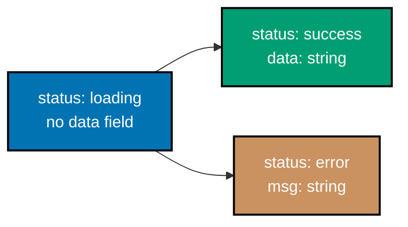

Examples 29-60 cover narrowing, user-defined type guards and assertion functions, discriminated
unions and exhaustiveness checking, generics, `unknown`/`any`/`never`, structural typing, intersection
types, type assertions, enums and their modern alternative, and `keyof` plus index signatures. Every
example is a complete, self-contained `.ts` file colocated under `learning/code/`; run each one with
`tsx <file>.ts` or type-check it with `tsc --noEmit <file>.ts` from inside its own directory.

---

### Example 29: Narrow With typeof

_ex-29 &middot; exercises co-14_

`typeof` splits a `number | string` union into its two branches -- inside each branch, the compiler
narrows the variable's type automatically, based purely on the runtime check you already wrote.

**`learning/code/ex-29-narrow-with-typeof/example.ts`**

```typescript
// Example 29: Narrow With typeof -- typeof splits a union into its constituent branches.
function describe(value: number | string): string {
  if (typeof value === "string") {
    // => inside this branch, value's type is narrowed to just string
    return value.toUpperCase(); // => .toUpperCase() only exists on string
  }
  // => outside the if, value's type is narrowed to just number (the only type left)
  return value.toFixed(2); // => .toFixed() only exists on number
}

console.log(describe("hi")); // => Output: HI
console.log(describe(3.14159)); // => Output: 3.14
```

**Run**: `tsx example.ts`

**Output**:

```text
HI
3.14
```

**Key takeaway**: `typeof value === "string"` both runs a real runtime check AND tells the compiler
which branch to narrow to -- one piece of code does both jobs.

**Why it matters**: Narrowing is what makes a union type (Example 18) SAFE to actually use --
without it, you could never call a method specific to just one branch. `typeof` is the narrowing
technique for JavaScript's own primitives; `instanceof` (Example 32) and `in` (Example 31) cover
class instances and object shapes.

---

### Example 30: Narrow Truthiness

_ex-30 &middot; exercises co-14_

A plain `if (x)` check narrows away `undefined` (and `null`) exactly like it does in ordinary
JavaScript -- the compiler tracks this same truthiness logic.

**`learning/code/ex-30-narrow-truthiness/example.ts`**

```typescript
// Example 30: Narrow Truthiness -- a plain `if (x)` check narrows away undefined.
function shout(text: string | undefined): string {
  if (text) {
    // => inside this branch, text's type is narrowed from `string | undefined` to `string`
    return text.toUpperCase() + "!"; // => .toUpperCase() is safe -- text cannot be undefined here
  }
  return "(nothing to shout)"; // => this branch runs when text was undefined or ""
}

console.log(shout("hello")); // => Output: HELLO!
console.log(shout(undefined)); // => Output: (nothing to shout)
```

**Run**: `tsx example.ts`

**Output**:

```text
HELLO!
(nothing to shout)
```

**Key takeaway**: `if (text)` narrows away both `undefined` AND the empty string `""` -- truthiness
narrowing follows JavaScript's own falsy-value rules exactly, not just "is it defined".

**Why it matters**: This is the single most common narrowing idiom in real TypeScript code --
guarding an optional property or parameter (Example 14, Example 22) with a plain `if` before using
it, rather than a more verbose `!== undefined` check.

---

### Example 31: Narrow In Operator

_ex-31 &middot; exercises co-14_

The `in` operator checks whether a property exists on an object at runtime -- and the compiler uses
that same check to narrow a union of object shapes.

**`learning/code/ex-31-narrow-in-operator/example.ts`**

```typescript
// Example 31: Narrow In Operator -- the `in` operator checks for a property's presence.
type Guest = { name: string };
type Staff = { name: string; role: string };

function label(person: Guest | Staff): string {
  if ("role" in person) {
    // => inside this branch, person is narrowed to Staff -- the only variant with 'role'
    return `${person.name} (${person.role})`; // => .role is safe to read here
  }
  return person.name; // => here, person is narrowed to Guest
}

console.log(label({ name: "Ada" })); // => Output: Ada
console.log(label({ name: "Grace", role: "admin" })); // => Output: Grace (admin)
```

**Run**: `tsx example.ts`

**Output**:

```text
Ada
Grace (admin)
```

**Key takeaway**: `"role" in person` narrows to whichever union member(s) actually declare a `role`
property -- it works even when the union members share no common discriminant field.

**Why it matters**: `in` is the narrowing technique of choice when a union's members are NOT tagged
with a shared literal field (unlike Example 36's discriminated unions) -- it checks structure
directly, which is exactly what structural typing (Example 49) is built on.

---

### Example 32: Narrow instanceof

_ex-32 &middot; exercises co-14_

`instanceof` checks a value's runtime constructor -- useful for narrowing a union that includes a
class instance, like the built-in `Date`.

**`learning/code/ex-32-narrow-instanceof/example.ts`**

```typescript
// Example 32: Narrow instanceof -- instanceof checks a value's runtime constructor.
function describeWhen(value: Date | string): string {
  if (value instanceof Date) {
    // => inside this branch, value is narrowed to Date
    return value.getFullYear().toString(); // => .getFullYear() only exists on Date
  }
  return value; // => here, value is narrowed to string
}

console.log(describeWhen(new Date("2026-01-01"))); // => Output: 2026
console.log(describeWhen("today")); // => Output: today
```

**Run**: `tsx example.ts`

**Output**:

```text
2026
today
```

**Key takeaway**: `instanceof` narrows based on the value's ACTUAL runtime prototype chain -- it is
the right tool whenever one branch of a union is a class instance rather than a plain object shape.

**Why it matters**: `Date`, custom error classes (Example 67's `Error` narrowing), and any other
class-based value all narrow this way -- `typeof` cannot distinguish between two different classes
(both report `"object"`), so `instanceof` fills that gap.

---

### Example 33: Narrow Equality

_ex-33 &middot; exercises co-14, co-09_

`===` against a specific literal narrows a literal union (Example 19) directly to that one matched
value -- the same mechanism a discriminated union's tag field relies on.

**`learning/code/ex-33-narrow-equality/example.ts`**

```typescript
// Example 33: Narrow Equality -- === against a literal narrows a literal union directly.
type Status = "idle" | "loading" | "done";

function report(status: Status): string {
  if (status === "loading") {
    // => this branch's status type narrows to exactly the literal "loading"
    return "please wait";
  }
  return `status: ${status}`; // => here, status is narrowed to "idle" | "done"
}

console.log(report("loading")); // => Output: please wait
console.log(report("done")); // => Output: status: done
```

**Run**: `tsx example.ts`

**Output**:

```text
please wait
status: done
```

**Key takeaway**: `status === "loading"` narrows the TRUE branch to exactly `"loading"`, and narrows
the FALSE branch to the union with `"loading"` removed -- both directions narrow, not just the
matched one.

**Why it matters**: This exact mechanism, applied to a shared "tag" property, is what powers
discriminated unions (Example 36) -- `switch (state.status)` (Example 37) is this same equality
narrowing, applied once per case instead of in a chain of `if`/`else`.

---

### Example 34: User-Defined Type Guard

_ex-34 &middot; exercises co-15_

A function annotated `x is T` (rather than a plain `boolean`) is a type guard -- calling it narrows
the argument's type at every call-site, based on whatever runtime check the function body actually
performs.

**`learning/code/ex-34-user-defined-type-guard/example.ts`**

```typescript
// Example 34: User-Defined Type Guard -- a predicate function narrows at the call-site.
type Cat = { kind: "cat"; meow(): string };
type Dog = { kind: "dog"; bark(): string };
type Animal = Cat | Dog;

function isCat(a: Animal): a is Cat {
  // => `a is Cat` tells the compiler: when this returns true, a is narrowed to Cat
  return a.kind === "cat"; // => the actual runtime check backing the type predicate
}

function speak(a: Animal): string {
  if (isCat(a)) {
    // => after calling isCat(a), a is narrowed to Cat inside this branch
    return a.meow(); // => .meow() only exists on Cat
  }
  return a.bark(); // => here, a is narrowed to Dog
}

const felix: Cat = { kind: "cat", meow: () => "meow!" };
console.log(speak(felix)); // => Output: meow!
```

**Run**: `tsx example.ts`

**Output**:

```text
meow!
```

**Key takeaway**: `a is Cat` is a PROMISE to the compiler that the function's `boolean` return value
correctly tells whether `a` is a `Cat` -- the compiler trusts this promise without re-verifying the
implementation.

**Why it matters**: User-defined guards let you package a narrowing check that is too complex for a
single `typeof`/`instanceof`/`in`/`===` (Examples 29-33) into a reusable, named function -- Example
81's end-to-end fetch example uses exactly this pattern to validate an untyped JSON payload.

---

### Example 35: Assertion Function

_ex-35 &middot; exercises co-15, co-18_

`asserts x is T` narrows AFTER the function call returns, rather than inside a conditional branch --
if the function returns normally at all, the narrowing applies to every line that follows.

**`learning/code/ex-35-assertion-function/example.ts`**

```typescript
// Example 35: Assertion Function -- `asserts x is T` narrows AFTER the call, not inside a branch.
function assertString(x: unknown): asserts x is string {
  // => if x is not a string, this throws; if it returns normally, x IS a string
  if (typeof x !== "string") {
    throw new Error("expected a string"); // => aborts execution -- narrowing never "escapes" a throw
  }
}

function shout(value: unknown): string {
  assertString(value); // => after this line, value's type is narrowed to string
  return value.toUpperCase(); // => .toUpperCase() is safe -- the assertion already ran
}

console.log(shout("hi")); // => Output: HI
```

**Run**: `tsx example.ts`

**Output**:

```text
HI
```

**Key takeaway**: an assertion function either throws or narrows -- there is no third outcome, which
is exactly why the compiler can trust the narrowing applies unconditionally after the call.

**Why it matters**: Assertion functions read like a guard clause ("fail fast, then proceed with
confidence") rather than an `if`/`else` branch -- a natural fit for input validation at the top of a
function, complementing the branch-based type guard from Example 34.

---

### Example 36: Discriminated Union Shape

_ex-36 &middot; exercises co-16_

A shared literal "tag" field -- here, `kind` -- lets each union member be distinguished from the
others by a single, simple check.

**`learning/code/ex-36-discriminated-union-shape/example.ts`**

```typescript
// Example 36: Discriminated Union Shape -- a shared literal "kind" field tags each variant.
type Shape =
  | { kind: "circle"; r: number } // => the "circle" variant carries a radius
  | { kind: "square"; s: number }; // => the "square" variant carries a side length

const c: Shape = { kind: "circle", r: 2 }; // => matches the first variant exactly
const s: Shape = { kind: "square", s: 3 }; // => matches the second variant exactly
console.log(c, s); // => Output: { kind: 'circle', r: 2 } { kind: 'square', s: 3 }
```

**Run**: `tsx example.ts`

**Output**:

```text
{ kind: 'circle', r: 2 } { kind: 'square', s: 3 }
```

**Key takeaway**: every variant of a discriminated union shares the SAME field name (`kind`), each
with its own distinct literal value -- that shared field is what a `switch` (Example 37) narrows on.

**Why it matters**: This is the single most valuable modeling pattern in this primer -- state
machines (Example 39), async fetch results (Example 69), and API responses all fit this shape, and
the compiler can enforce that every variant is handled (Example 38) with zero runtime cost.

---

### Example 37: Discriminated Switch

_ex-37 &middot; exercises co-16, co-14_

`switch (shape.kind)` narrows `shape`'s type inside EVERY case -- each branch only sees the fields
that variant actually has.

**`learning/code/ex-37-discriminated-switch/example.ts`**

```typescript
// Example 37: Discriminated Switch -- switch(shape.kind) narrows inside every case.
type Shape = { kind: "circle"; r: number } | { kind: "square"; s: number };

function area(shape: Shape): number {
  switch (shape.kind) {
    case "circle":
      // => here, shape is narrowed to the circle variant -- .r is safe
      return Math.PI * shape.r ** 2;
    case "square":
      // => here, shape is narrowed to the square variant -- .s is safe
      return shape.s * shape.s;
  }
}

console.log(area({ kind: "square", s: 4 })); // => Output: 16
console.log(area({ kind: "circle", r: 1 }).toFixed(2)); // => Output: 3.14
```

**Run**: `tsx example.ts`

**Output**:

```text
16
3.14
```

**Key takeaway**: `switch` on a discriminant field narrows exactly like a chain of `===` checks
(Example 33) would, but reads far more naturally once there are three or more variants.

**Why it matters**: A `switch` over a discriminated union's tag is idiomatic TypeScript for "handle
every case of this state" -- and pairs directly with a `default: never` clause (Example 38) to make
forgetting a case a compile error, not a silent runtime gap.

---

### Example 38: Exhaustiveness Never

_ex-38 &middot; exercises co-16, co-18_

A `default` case that assigns the (by then fully narrowed) value to a variable typed `never` only
compiles if every prior case has actually been handled -- an unhandled variant becomes a compile
error, not a silent runtime bug.

**`learning/code/ex-38-exhaustiveness-never/example.ts`**

```typescript
// Example 38: Exhaustiveness Never -- a `never`-typed default catches any unhandled variant.
type Shape = { kind: "circle"; r: number } | { kind: "square"; s: number }; // => two variants, tagged by "kind"

function area(shape: Shape): number {
  switch (shape.kind) {
    // => TypeScript checks exhaustiveness against every case below
    case "circle":
      return Math.PI * shape.r ** 2; // => narrowed to the circle variant here -- .r is safe
    case "square":
      return shape.s * shape.s; // => narrowed to the square variant here -- .s is safe
    default: {
      // => if every case above is handled, shape's type here narrows to never
      const _exhaustive: never = shape; // => only compiles if NO variant reaches here
      return _exhaustive; // => unreachable at runtime -- exists purely for the compiler
    }
  }
}

console.log(area({ kind: "circle", r: 2 }).toFixed(2)); // => Output: 12.57
```

**Run**: `tsx example.ts`

**Output**:

```text
12.57
```

**Adding a new variant without a matching case breaks the build immediately**:

```typescript
// Example 38 (invalid): adding a "triangle" variant without a matching case breaks exhaustiveness.
type Shape =
  | { kind: "circle"; r: number }
  | { kind: "square"; s: number }
  | { kind: "triangle"; base: number; height: number }; // => a NEW, unhandled variant

function area(shape: Shape): number {
  switch (shape.kind) {
    case "circle":
      return Math.PI * shape.r ** 2; // => still handled -- circle isn't the problem here
    case "square":
      return shape.s * shape.s; // => still handled -- square isn't the problem either
    default: {
      // => shape here is STILL { kind: "triangle"; ... }, not never -- the switch missed it
      const _exhaustive: never = shape; // => TYPE ERROR: 'triangle' variant is not assignable to never
      return _exhaustive; // => unreachable -- this line never compiles, so it never runs
    }
  }
}

console.log(area({ kind: "triangle", base: 2, height: 3 })); // => never reached -- tsc rejects this file before runtime
```

**Run**: `tsc --noEmit --strict --skipLibCheck invalid.ts`

**Output**:

```text
invalid.ts(15,13): error TS2322: Type '{ kind: "triangle"; base: number; height: number; }' is not assignable to type 'never'.
```

**Key takeaway**: `never` is TypeScript's "this can't happen" type -- assigning a value that CAN still
happen to it is exactly how the compiler catches a forgotten `switch` case, at the moment a new
variant is added, not at runtime.

**Why it matters**: This pattern turns "I added a new state and forgot to update one of the five
places that handle it" -- one of the most common real-world sources of production bugs -- into a
build failure instead of a support ticket.

---

### Example 39: State Machine Union

_ex-39 &middot; exercises co-16_

Three variants, each tagged by its own `status` field, model a small state machine directly as a
type -- exactly the shape an async operation's result naturally takes (Example 69 builds this out
further).



**`learning/code/ex-39-state-machine-union/example.ts`**

```typescript
// Example 39: State Machine Union -- three variants tagged by their own "status" field.
type State =
  | { status: "loading" } // => no extra data while loading
  | { status: "success"; data: string } // => data is only present once successful
  | { status: "error"; msg: string }; // => msg is only present on failure

function render(state: State): string {
  if (state.status === "success") {
    return `data: ${state.data}`; // => narrowed to the success variant -- .data is safe
  }
  return `status: ${state.status}`; // => loading or error -- neither has .data
}

console.log(render({ status: "loading" })); // => Output: status: loading
console.log(render({ status: "success", data: "42" })); // => Output: data: 42
```

**Run**: `tsx example.ts`

**Output**:

```text
status: loading
data: 42
```

**Reading a field the current variant does not have fails to compile**:

```typescript
// Example 39 (invalid): reading .data on the loading variant, which does not have it.
type State =
  | { status: "loading" } // => no extra data while loading
  | { status: "success"; data: string } // => data is only present once successful
  | { status: "error"; msg: string }; // => msg is only present on failure

function render(state: State): string {
  if (state.status === "loading") {
    return state.data; // => TYPE ERROR: Property 'data' does not exist on the loading variant
  }
  return "";
}

console.log(render({ status: "loading" }));
```

**Run**: `tsc --noEmit --strict --skipLibCheck invalid.ts`

**Output**:

```text
invalid.ts(9,18): error TS2339: Property 'data' does not exist on type '{ status: "loading"; }'.
```

**Key takeaway**: each variant of a discriminated union only exposes the fields IT declares -- the
compiler refuses to let you read a field that belongs to a sibling variant, even before narrowing.

**Why it matters**: This is precisely the shape a UI's "loading / success / error" rendering logic
needs -- Example 69 wires this same three-variant shape into a real (simulated) async fetch, and the
capstone builds an equivalent job-tracking state machine end to end.

---

### Example 40: Generic Identity

_ex-40 &middot; exercises co-17_

A type parameter `<T>` lets a single function work across every type, safely -- `T` is inferred from
whatever argument is actually passed at each call-site.

**`learning/code/ex-40-generic-identity/example.ts`**

```typescript
// Example 40: Generic Identity -- <T> lets one function work across every type, safely.
function identity<T>(value: T): T {
  // => T is inferred from whatever argument is actually passed at each call-site
  return value; // => the return type is exactly T -- no widening to `any` or `unknown`
}

const num = identity(42); // => T is inferred as number -- num's type is number
const str = identity("hi"); // => T is inferred as string -- str's type is string
console.log(num, str); // => Output: 42 hi
```

**Run**: `tsx example.ts`

**Output**:

```text
42 hi
```

**Key takeaway**: `identity<T>(value: T): T` is genuinely type-safe per call -- unlike `any`, `T`
still ties the parameter and return types together, so passing a `number` guarantees a `number` back.

**Why it matters**: Generics are how a function avoids the false choice between "duplicate this
function once per type" and "give up and use `any`". Every array-processing helper (Example 41),
container type (Example 45), and utility type (Example 70 onward) in this primer builds on this exact
mechanism.

---

### Example 41: Generic Array First

_ex-41 &middot; exercises co-17_

A generic helper works on an array of any `T`, and its return type flows through from the array's own
element type.

**`learning/code/ex-41-generic-array-first/example.ts`**

```typescript
// Example 41: Generic Array First -- a generic helper that works on an array of any T.
function first<T>(xs: T[]): T | undefined {
  // => returns the first element, or undefined when xs is empty -- T flows through
  return xs[0];
}

const n = first([10, 20, 30]); // => T is inferred as number -- n's type is number | undefined
console.log(n); // => Output: 10
console.log(first<string>([])); // => explicit T=string, empty array -- Output: undefined
```

**Run**: `tsx example.ts`

**Output**:

```text
10
undefined
```

**Key takeaway**: `T | undefined` (not just `T`) is the honest return type for "first element of a
possibly-empty array" -- generics do not exempt a function from modeling its real edge cases.

**Why it matters**: This exact `first<T>` shape generalizes cleanly to `last`, `nth`, and similar
array helpers, and `T | undefined` forces every caller to handle the empty-array case explicitly
(Example 30's truthiness narrowing is the natural next step).

---

### Example 42: Generic Constraint

_ex-42 &middot; exercises co-17_

`extends` on a type parameter restricts what `T` may be -- here, to anything with a numeric `length`
property, which both strings and arrays happen to have.

**`learning/code/ex-42-generic-constraint/example.ts`**

```typescript
// Example 42: Generic Constraint -- `extends` restricts T to shapes that have a length.
function longest<T extends { length: number }>(a: T, b: T): T {
  // => T must have a .length property -- strings and arrays both qualify
  return a.length >= b.length ? a : b; // => .length is safe to read on any T here
}

console.log(longest("hi", "hello")); // => Output: hello
console.log(longest([1, 2], [1, 2, 3])); // => Output: [ 1, 2, 3 ]
```

**Run**: `tsx example.ts`

**Output**:

```text
hello
[ 1, 2, 3 ]
```

**An argument without a `.length` property fails the constraint**:

```typescript
// Example 42 (invalid): a plain number has no .length property, so it fails the constraint.
function longest<T extends { length: number }>(a: T, b: T): T {
  return a.length >= b.length ? a : b;
}

console.log(longest(1, 2)); // => TYPE ERROR: number does not satisfy { length: number }
```

**Run**: `tsc --noEmit --strict --skipLibCheck invalid.ts`

**Output**:

```text
invalid.ts(6,21): error TS2345: Argument of type 'number' is not assignable to parameter of type '{ length: number; }'.
```

**Key takeaway**: `<T extends { length: number }>` narrows what `T` is ALLOWED to be, while still
letting `T` be inferred per call -- unlike a fixed parameter type, `longest` still works for both
`string` and `number[]`.

**Why it matters**: Constraints are what make a generic function actually USE its type parameter's
members safely, rather than treating `T` as an opaque black box (as Example 40's unconstrained
`identity` does) -- Example 76's `get<T, K extends keyof T>` constrains `K` to `T`'s own keys the same
way.

---

### Example 43: Generic Default Param

_ex-43 &middot; exercises co-17_

`<T = string>` supplies a default type parameter -- if the caller never writes an explicit type
argument and inference has nothing to go on, `T` falls back to the default.

**`learning/code/ex-43-generic-default-param/example.ts`**

```typescript
// Example 43: Generic Default Param -- <T = string> supplies a type when none is given.
function makeBox<T = string>(value: T): { value: T } {
  // => if the caller never writes <T>, T defaults to string
  return { value };
}

const boxed = makeBox("hi"); // => T is inferred as string anyway, from the argument
console.log(boxed); // => Output: { value: 'hi' }

const empty = makeBox<number>(0); // => explicit T=number overrides the default
console.log(empty); // => Output: { value: 0 }
```

**Run**: `tsx example.ts`

**Output**:

```text
{ value: 'hi' }
{ value: 0 }
```

**Key takeaway**: a default type parameter only kicks in when there is no argument to infer `T`
FROM at all -- when an argument is present, ordinary inference (or an explicit `<T>`) wins.

**Why it matters**: Defaults matter most for generic types with no obvious value to infer from (an
empty container, a configuration object with all-optional fields) -- without one, the caller would be
forced to write `<T>` explicitly every single time.

---

### Example 44: Generic Two Params

_ex-44 &middot; exercises co-17, co-05_

`<A, B>` preserves BOTH argument types independently in a tuple result -- unlike a plain array return
type, which would widen to a single unioned element type.

**`learning/code/ex-44-generic-two-params/example.ts`**

```typescript
// Example 44: Generic Two Params -- <A, B> preserves BOTH argument types in the tuple result.
function pair<A, B>(a: A, b: B): [A, B] {
  // => the return type is a tuple, not a generic array -- each position keeps its own type
  return [a, b];
}

const result = pair(1, "one"); // => result's type is [number, string], not (number | string)[]
console.log(result); // => Output: [ 1, 'one' ]
```

**Run**: `tsx example.ts`

**Output**:

```text
[ 1, 'one' ]
```

**Key takeaway**: `[A, B]` (Example 11's tuple type) keeps `A` and `B` as two distinct, separately
typed positions -- writing `(A | B)[]` instead would lose that per-position precision.

**Why it matters**: Multiple independent type parameters, each tied to a real argument, are the
generic pattern behind `Promise.all`'s tuple-preserving overload (Example 68) and any function that
combines two differently typed inputs into one precisely typed result.

---

### Example 45: Generic Interface

_ex-45 &middot; exercises co-17, co-07_

`interface Box<T>` declares a container type parameterized over what it holds -- `Box<number>` and
`Box<string>` are different, specific types, both generated from the same generic declaration.

**`learning/code/ex-45-generic-interface/example.ts`**

```typescript
// Example 45: Generic Interface -- Box<T> stores exactly one value of type T.
interface Box<T> {
  value: T; // => value's type is whatever T is instantiated with
}

const numberBox: Box<number> = { value: 42 }; // => T=number -- value must be a number
console.log(numberBox); // => Output: { value: 42 }
```

**Run**: `tsx example.ts`

**Output**:

```text
{ value: 42 }
```

**`Box<number>` rejects a value that is not a number**:

```typescript
// Example 45 (invalid): Box<number> requires value to be a number, not a string.
interface Box<T> {
  value: T;
}

const numberBox: Box<number> = { value: "oops" }; // => TYPE ERROR: string is not number
console.log(numberBox);
```

**Run**: `tsc --noEmit --strict --skipLibCheck invalid.ts`

**Output**:

```text
invalid.ts(6,34): error TS2322: Type 'string' is not assignable to type 'number'.
```

**Key takeaway**: `interface Box<T> { value: T }` is a TEMPLATE -- `Box<number>` substitutes `T` with
`number` everywhere it appears, producing a fully concrete type.

**Why it matters**: Generic interfaces (and `type` aliases) are how container and wrapper types stay
precisely typed -- `Promise<T>` (Example 65), `Array<T>` (the same as `T[]`, Example 9), and this
primer's own `Box<T>` all follow this identical pattern.

---

### Example 46: unknown Requires Narrowing

_ex-46 &middot; exercises co-18_

`unknown` is TypeScript's safe top type -- a value could be ANYTHING, and the compiler refuses to let
you use it in any type-specific way until you narrow it.

**`learning/code/ex-46-unknown-requires-narrowing/example.ts`**

```typescript
// Example 46: unknown Requires Narrowing -- unknown is the safe top type: nothing works until checked.
let payload: unknown = "hello"; // => payload could be ANY value at all -- its type is unknown

if (typeof payload === "string") {
  // => only after this check is payload narrowed to string
  console.log(payload.toUpperCase()); // => .toUpperCase() is now safe -- Output: HELLO
}
```

**Run**: `tsx example.ts`

**Output**:

```text
HELLO
```

**Using `unknown` before narrowing it fails to compile**:

```typescript
// Example 46 (invalid): calling a method on unknown before narrowing it.
let payload: unknown = "hello";

console.log(payload.toUpperCase()); // => TYPE ERROR: 'payload' is of type 'unknown'
```

**Run**: `tsc --noEmit --strict --skipLibCheck invalid.ts`

**Output**:

```text
invalid.ts(4,13): error TS18046: 'payload' is of type 'unknown'.
```

**Key takeaway**: `unknown` accepts any value being ASSIGNED to it, but refuses to let you DO anything
with it until a `typeof`/`instanceof`/user-defined guard (Examples 29-34) narrows it to something more
specific.

**Why it matters**: `unknown` is the type-safe replacement for `any` at every trust boundary --
`JSON.parse`'s real return type, a caught error's type under `strict` (Example 67), and any other
"data from outside this program" value should be `unknown`, never `any`.

---

### Example 47: any Escapes Checking

_ex-47 &middot; exercises co-18_

`any` opts a value out of type checking entirely -- it compiles no matter what you do with it, which
is exactly why it can hide a real bug until runtime.

**`learning/code/ex-47-any-escapes-checking/example.ts`**

```typescript
// Example 47: any Escapes Checking -- any opts a value out of type checking entirely.
let payload: any = "hello"; // => payload's type is any -- the compiler stops checking it

console.log(payload.toUpperCase()); // => compiles even though .toUpperCase() is unverified
console.log(payload.thisMethodDoesNotExist()); // => ALSO compiles -- any allows anything
// => Output (runtime): HELLO, then a real TypeError (any hides the bug until runtime)
```

**Run**: `tsx example.ts`

**Output** (the second line compiles clean, then genuinely crashes at runtime):

```text
HELLO
TypeError: payload.thisMethodDoesNotExist is not a function
```

**Key takeaway**: `any` is not "no type" -- it is "every type at once, and the compiler will never
complain", which means a call to a method that does not exist type-checks successfully and only fails
when the code actually runs.

**Why it matters**: This is the direct, deliberately uncomfortable contrast with `unknown` (Example
46): the exact same mistake (calling `.thisMethodDoesNotExist()`) is a COMPILE error on `unknown` and
a RUNTIME crash on `any`. Prefer `unknown` at every trust boundary; reach for `any` only as a
last-resort escape hatch, and as narrowly scoped as possible.

---

### Example 48: never From Throw

_ex-48 &middot; exercises co-18_

A function that always throws has the return type `never` -- it genuinely never returns a value, and
the compiler can use that fact to narrow code after it is called.

**`learning/code/ex-48-never-from-throw/example.ts`**

```typescript
// Example 48: never From Throw -- a function that always throws never actually returns.
function fail(message: string): never {
  // => never means "this function's return type is impossible to observe" -- it always throws
  throw new Error(message); // => execution never reaches a return statement
}

function getOrFail(value: string | undefined): string {
  if (value === undefined) {
    fail("value was required"); // => TS knows fail() never returns, so no return is needed here
  }
  return value; // => value is narrowed to string -- fail()'s never lets this branch narrow too
}

console.log(getOrFail("present")); // => Output: present
```

**Run**: `tsx example.ts`

**Output**:

```text
present
```

**Key takeaway**: `never` (empty bottom type) and `void` (Example 21) are different -- `void` means
"returns, but the value is not useful"; `never` means "never returns at all", and the compiler treats
code after a `never` call as unreachable.

**Why it matters**: This is the same `never` mechanic behind exhaustiveness checking (Example 38) --
here applied to control flow rather than a `switch`'s `default` case, letting a small helper like
`fail()` narrow a union for every caller without an explicit `return` after it.

---

### Example 49: Structural Compatibility

_ex-49 &middot; exercises co-19_

TypeScript checks compatibility by SHAPE, not by name -- an object with extra fields, held in a
variable, still satisfies a narrower type as long as it has at least the required members.

**`learning/code/ex-49-structural-compatibility/example.ts`**

```typescript
// Example 49: Structural Compatibility -- extra fields on a VARIABLE are still assignable.
type Point2D = { x: number; y: number };

const point3D = { x: 1, y: 2, z: 3 }; // => an object with an EXTRA field, held in a variable
const flat: Point2D = point3D; // => OK -- point3D has at least x and y, structurally

console.log(flat); // => Output: { x: 1, y: 2, z: 3 } -- the extra z is still there at runtime
```

**Run**: `tsx example.ts`

**Output**:

```text
{ x: 1, y: 2, z: 3 }
```

**Key takeaway**: `flat`'s type is `Point2D`, but the ACTUAL runtime object still has its `z`
property -- structural typing checks the type at the boundary, it does not strip extra fields.

**Why it matters**: This is what "structural" means in "structural typing": TypeScript never asks
"is this declared to BE a `Point2D`", only "does this have everything a `Point2D` needs". Example 51
takes this to its logical conclusion: an object can satisfy an `interface` with no declared
relationship to it at all.

---

### Example 50: Excess Property Check

_ex-50 &middot; exercises co-19, co-06_

Object LITERALS get a stricter check than variables do -- passing a literal directly (not via a
variable) with an extra field is flagged, even though the same object via a variable (Example 49)
would not be.

**`learning/code/ex-50-excess-property-check/example.ts`**

```typescript
// Example 50: Excess Property Check -- only object LITERALS get this stricter check.
type Point2D = { x: number; y: number };

const flat: Point2D = { x: 1, y: 2 }; // => an exact-shape literal -- no extra fields
console.log(flat); // => Output: { x: 1, y: 2 }
```

**Run**: `tsx example.ts`

**Output**:

```text
{ x: 1, y: 2 }
```

**A literal with an extra field, assigned directly, is flagged**:

```typescript
// Example 50 (invalid): a literal passed directly with an extra field triggers excess-property checking.
type Point2D = { x: number; y: number };

const flat: Point2D = { x: 1, y: 2, z: 3 }; // => TYPE ERROR: 'z' does not exist on Point2D
console.log(flat);
```

**Run**: `tsc --noEmit --strict --skipLibCheck invalid.ts`

**Output**:

```text
invalid.ts(4,37): error TS2353: Object literal may only specify known properties, and 'z' does not exist in type 'Point2D'.
```

**Key takeaway**: excess-property checking only applies to a FRESH object literal assigned directly --
Example 49 shows the exact same shape, via a variable, passing without complaint.

**Why it matters**: This targeted stricter check catches the single most common real mistake
structural typing alone would otherwise miss entirely: a typo'd or misspelled property name in an
object literal, which would otherwise just silently become an unused "extra" field.

---

### Example 51: Structural Interface Match

_ex-51 &middot; exercises co-19, co-07_

An object satisfies an `interface` purely by having the right shape -- no `implements` keyword, and
no declared relationship between the object and the interface at all.

**`learning/code/ex-51-structural-interface-match/example.ts`**

```typescript
// Example 51: Structural Interface Match -- no `implements` keyword needed at all.
interface Greeter {
  greet(): string; // => any object with a matching greet() method satisfies this
}

// => plain: has NO "implements Greeter" clause, yet it satisfies Greeter by shape alone
const plain = {
  greet(): string {
    return "hi";
  },
};

function useGreeter(g: Greeter): string {
  return g.greet();
}

console.log(useGreeter(plain)); // => Output: hi
```

**Run**: `tsx example.ts`

**Output**:

```text
hi
```

**Key takeaway**: `plain` was never declared as a `Greeter` anywhere -- it satisfies the interface
purely because it happens to have a matching `greet(): string` method.

**Why it matters**: This is the clearest possible demonstration of "structural, not nominal" typing --
languages like Java or C# require an explicit `implements` declaration; TypeScript checks the shape
alone, which is why third-party objects (parsed JSON, library return values) can satisfy your own
interfaces without any cooperation from wherever they came from.

---

### Example 52: Intersection Type

_ex-52 &middot; exercises co-10_

`A & B` combines two types' members into one -- a value must satisfy EVERY field from BOTH
constituents at once, the opposite of a union's "either" relationship (Example 18).

**`learning/code/ex-52-intersection-type/example.ts`**

```typescript
// Example 52: Intersection Type -- Staff must satisfy BOTH Person AND Employee at once.
type Person = { name: string };
type Employee = { employeeId: number };
type Staff = Person & Employee; // => a Staff value needs every field from both types

const worker: Staff = { name: "Ada", employeeId: 7 }; // => both required fields present
console.log(worker); // => Output: { name: 'Ada', employeeId: 7 }
```

**Run**: `tsx example.ts`

**Output**:

```text
{ name: 'Ada', employeeId: 7 }
```

**Key takeaway**: `Person & Employee` is not "one or the other" like a union -- it is "all of
`Person`'s fields AND all of `Employee`'s fields", merged into a single required shape.

**Why it matters**: Intersections are `type`'s answer to `interface extends` (Example 17) -- useful
whenever you need to combine two independently defined shapes without redeclaring either one, most
often for merging option/config objects (Example 53).

---

### Example 53: Intersection Config Merge

_ex-53 &middot; exercises co-10, co-06_

Merging two option object types with `&` is the most common real-world use of intersection types --
each constituent typically models one independent concern.

**`learning/code/ex-53-intersection-config-merge/example.ts`**

```typescript
// Example 53: Intersection Config Merge -- combine two option shapes into one required shape.
type WithRetry = { retries: number };
type WithTimeout = { timeoutMs: number };
type RequestOptions = WithRetry & WithTimeout; // => needs BOTH retries and timeoutMs

const options: RequestOptions = { retries: 3, timeoutMs: 5000 }; // => both member sets required
console.log(options); // => Output: { retries: 3, timeoutMs: 5000 }
```

**Run**: `tsx example.ts`

**Output**:

```text
{ retries: 3, timeoutMs: 5000 }
```

**Key takeaway**: `WithRetry & WithTimeout` reads naturally as "an object with retry behavior AND
timeout behavior" -- each half stays independently named and reusable in other combinations.

**Why it matters**: This compositional style -- small, single-concern types combined with `&` -- scales
far better than one large monolithic options type, especially once several functions each need only
some of the combined fields.

---

### Example 54: as Assertion

_ex-54 &middot; exercises co-20, co-18_

`as T` tells the compiler "trust me, this is a `T`" -- it compiles regardless of whether the value
actually has that shape at runtime, which is a real, unchecked risk the author accepts deliberately.

**`learning/code/ex-54-as-assertion/example.ts`**

```typescript
// Example 54: as Assertion -- `as T` tells the compiler "trust me", at real runtime risk.
type User = { id: number; name: string };

function parseUser(json: string): User {
  const parsed: unknown = JSON.parse(json); // => JSON.parse always returns unknown
  return parsed as User; // => `as User` compiles -- but nothing checks the shape at runtime
}

const user = parseUser('{"id":1,"name":"Ada"}');
console.log(user); // => Output: { id: 1, name: 'Ada' }
```

**Run**: `tsx example.ts`

**Output**:

```text
{ id: 1, name: 'Ada' }
```

**Key takeaway**: `as User` is an ASSERTION, not a runtime check or conversion -- if `json` did not
actually contain a `User`-shaped value, `parseUser` would still "successfully" return a value the
type system incorrectly trusts.

**Why it matters**: `as` should be a last resort -- a user-defined type guard (Example 34) or
assertion function (Example 35) actually verifies the shape at runtime, while `as` merely tells the
compiler to stop checking. Example 81's end-to-end fetch example deliberately uses a real guard
instead of `as`, for exactly this reason.

---

### Example 55: Non-Null Assertion

_ex-55 &middot; exercises co-20_

The `!` operator asserts that a nullable value is NOT `null`/`undefined` at this specific point --
narrower in scope than `as`, but carrying the same "trust me, unchecked" risk.

**`learning/code/ex-55-non-null-assertion/example.ts`**

```typescript
// Example 55: Non-Null Assertion -- x! tells the compiler "this is never null here".
function findUser(id: number): { name: string } | null {
  return id === 1 ? { name: "Ada" } : null; // => genuinely nullable return type
}

const user = findUser(1)!; // => the ! asserts the result is NOT null, at your own risk
console.log(user.name); // => .name is safe to read -- Output: Ada
```

**Run**: `tsx example.ts`

**Output**:

```text
Ada
```

**Key takeaway**: `findUser(1)!` strips `| null` from the type WITHOUT checking that the value is
actually non-null at runtime -- if `findUser` had returned `null` here, `.name` would crash.

**Why it matters**: `!` is appropriate only when you have information the compiler cannot see (for
example, "this ID is a constant known to exist") -- for anything based on external input, an explicit
narrowing check (Example 30) is the safe alternative.

---

### Example 56: const Assertion

_ex-56 &middot; exercises co-21, co-09_

`as const` locks an object literal into its narrowest possible literal types AND makes every property
`readonly`, in one step -- the object-literal equivalent of what `const` already does for a plain
primitive (Example 8).

**`learning/code/ex-56-const-assertion/example.ts`**

```typescript
// Example 56: const Assertion -- `as const` locks in literal types AND deep readonly-ness.
const cfg = { mode: "dark" } as const; // => cfg's type is { readonly mode: "dark" }, not { mode: string }

console.log(cfg.mode); // => Output: dark
// cfg.mode = "light";  // => would be a TYPE ERROR: mode is readonly under `as const`
```

**Run**: `tsx example.ts`

**Output**:

```text
dark
```

**Writing to an `as const` object's property fails to compile**:

```typescript
// Example 56 (invalid): as const makes every property readonly, so assignment fails.
const cfg = { mode: "dark" } as const;

cfg.mode = "light"; // => TYPE ERROR: Cannot assign to 'mode' because it is a read-only property
console.log(cfg.mode);
```

**Run**: `tsc --noEmit --strict --skipLibCheck invalid.ts`

**Output**:

```text
invalid.ts(4,5): error TS2540: Cannot assign to 'mode' because it is a read-only property.
```

**Key takeaway**: without `as const`, `{ mode: "dark" }` infers `{ mode: string }`; WITH it, every
property becomes both a narrow literal type and `readonly`, recursively through nested objects and
arrays.

**Why it matters**: `as const` is the modern building block behind Example 58's enum alternative
(`as const` object + `keyof typeof`) and is the natural pairing with `satisfies` (intentionally out
of scope for this primer, per its scope note) for precisely typed configuration objects.

---

### Example 57: Numeric Enum

_ex-57 &middot; exercises co-21_

`enum` members auto-number starting from `0`, and -- unlike most TypeScript type-level constructs -- a
numeric enum generates a REAL runtime object with a reverse mapping from value back to name.

**`learning/code/ex-57-numeric-enum/example.ts`**

```typescript
// Example 57: Numeric Enum -- enum members auto-number from 0, with a runtime reverse map.
enum Color {
  Red, // => Color.Red is 0 (the first member, unless given an explicit value)
  Green, // => Color.Green is 1
  Blue, // => Color.Blue is 2
}

console.log(Color.Red === 0); // => Output: true
console.log(Color[0]); // => reverse mapping: numeric value 0 back to its name -- Output: Red
```

**Run**: `tsx example.ts`

**Output**:

```text
true
Red
```

**Key takeaway**: `enum` is one of the few TypeScript constructs that is NOT erased at compile time --
it emits a real JavaScript object at runtime, complete with the numeric-to-name reverse mapping shown
above.

**Why it matters**: That runtime footprint (and a few other enum quirks, like the reverse mapping
existing only for numeric enums) is exactly why many modern TypeScript codebases prefer the `as
const` object pattern (Example 58) instead -- this primer teaches both, so you can recognize either
in the wild.

---

### Example 58: const Object Union

_ex-58 &middot; exercises co-21, co-25_

An `as const` object, combined with `keyof typeof`, derives a literal-union type directly from a
plain object -- the modern alternative to `enum` that many style guides now prefer.

**`learning/code/ex-58-const-object-union/example.ts`**

```typescript
// Example 58: const Object Union -- `as const` + keyof typeof: a modern enum alternative.
const Color = {
  Red: "red", // => a plain object, not an `enum` keyword
  Green: "green",
  Blue: "blue",
} as const; // => as const makes every value a literal, and the whole object readonly

type ColorName = keyof typeof Color; // => ColorName is "Red" | "Green" | "Blue"
type ColorValue = (typeof Color)[ColorName]; // => ColorValue is "red" | "green" | "blue"

const chosen: ColorValue = Color.Green; // => chosen's type is the derived literal union
console.log(chosen); // => Output: green
```

**Run**: `tsx example.ts`

**Output**:

```text
green
```

**Key takeaway**: `typeof Color` gets the OBJECT's type from its VALUE; `keyof` then extracts its key
names as a union -- two type-level operators, chained, entirely derived from one plain runtime object.

**Why it matters**: This pattern gives you everything `enum` offers (a closed set of named constants)
without a nonstandard runtime footprint -- the object IS a plain, ordinary JavaScript value, and
`ColorName`/`ColorValue` are purely compile-time derivations from it.

---

### Example 59: keyof Operator

_ex-59 &middot; exercises co-25_

`keyof T` is the union of `T`'s own property names -- a type-level operation that reads a type's keys
back out as a literal union.

**`learning/code/ex-59-keyof-operator/example.ts`**

```typescript
// Example 59: keyof Operator -- keyof T is the union of T's own property names.
type Point = { x: number; y: number };
type PointKey = keyof Point; // => PointKey is exactly "x" | "y"

const key: PointKey = "x"; // => only "x" or "y" satisfy PointKey
console.log(key); // => Output: x
```

**Run**: `tsx example.ts`

**Output**:

```text
x
```

**Key takeaway**: `keyof Point` is computed FROM `Point`'s own declaration -- adding or removing a
field on `Point` automatically updates `PointKey` everywhere it is used, with no manual synchronizing.

**Why it matters**: `keyof` is the type-level building block behind Example 58's enum alternative,
Example 60's index signatures, Example 72's `Record`, and Example 76's constrained generic getter --
it appears, directly or indirectly, in nearly every "derive a new type FROM an existing one" pattern
this primer teaches.

---

### Example 60: Index Signature

_ex-60 &middot; exercises co-25, co-06_

`{ [key: string]: number }` types an object with an OPEN-ENDED set of keys -- any string key is
allowed, as long as every value is a `number`.

**`learning/code/ex-60-index-signature/example.ts`**

```typescript
// Example 60: Index Signature -- [k: string]: number types an open-ended set of keys.
type Dict = { [key: string]: number }; // => ANY string key maps to a number value

const inventory: Dict = { apples: 3, bananas: 5 }; // => arbitrary keys, all numeric values
console.log(inventory["apples"]); // => Output: 3
console.log(inventory.bananas); // => Output: 5
```

**Run**: `tsx example.ts`

**Output**:

```text
3
5
```

**Every value must still match the signature's value type**:

```typescript
// Example 60 (invalid): a Dict value must be number -- a string value violates the signature.
type Dict = { [key: string]: number };

const inventory: Dict = { apples: 3, bananas: "five" }; // => TYPE ERROR: string is not number
console.log(inventory);
```

**Run**: `tsc --noEmit --strict --skipLibCheck invalid.ts`

**Output**:

```text
invalid.ts(4,38): error TS2322: Type 'string' is not assignable to type 'number'.
```

**Key takeaway**: unlike Example 13's fixed object type (a closed, exact set of named properties), an
index signature types an OPEN set of keys -- the property NAMES are not known in advance, only their
common value type.

**Why it matters**: Index signatures are how you type genuinely dynamic, key-value data (a word-count
map, a lookup table keyed by ID) where `Record<string, number>` (Example 72) is the utility-type
shorthand for exactly this same shape. The Advanced tier starts here with ESM modules -- how these
types actually get organized and shared across multiple files.

---

← Previous: [Beginner Examples](./beginner.md) · Next: [Advanced Examples](./advanced.md) →
