## Mental model

One owner releases a value when it drops. Shared access is many readers or one writer; crossing a
thread boundary additionally requires `Send` and `Sync`. Code the compiler cannot prove belongs in
the smallest possible `unsafe` block, documented and hidden behind a safe API.

## Example progression

- **Beginner (1–26):** ownership, borrowing, lifetimes, RAII, heap values, iterator basics, and `Result`.
- **Intermediate (27–52):** threads, ownership-transferring channels, `Arc<Mutex<_>>`, traits, and errors.
- **Advanced (53–78):** raw pointers, contracts, C ABI calls, async framing, and the full safety slice.

Run any example from `learning/code` with `cargo run --bin ex-NN-name`. Compile-error lessons are
represented by the accepted safe form and explain the rejected shape in a source comment, so all 78
examples remain runnable.

## Thirty concept diagrams

Each tiny diagram has adjacent text that states its meaning for screen-reader users.

1. **co-01 ownership-memory:** an owner releases its value at scope end.

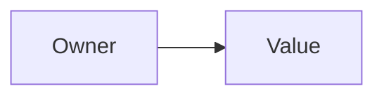

1. **co-02 move-semantics:** assignment transfers ownership.

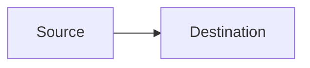

1. **co-03 borrow-shared:** many readers can view one value.

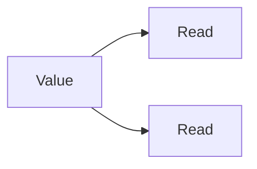

1. **co-04 borrow-mut:** one writer has exclusive access.

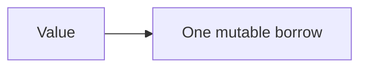

1. **co-05 borrow-rules:** readers and writer do not overlap.

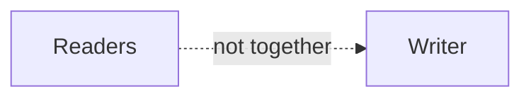

1. **co-06 lifetimes:** reference use ends before its value drops.

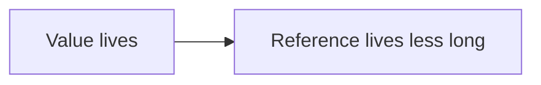

1. **co-07 drop:** scope ending invokes cleanup.

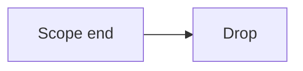

1. **co-08 box:** a stack handle owns heap data.

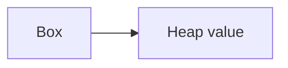

1. **co-09 rc-refcell:** local sharing has runtime mutable-borrow checks.

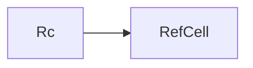

1. **co-10 threads:** parent joins child work.

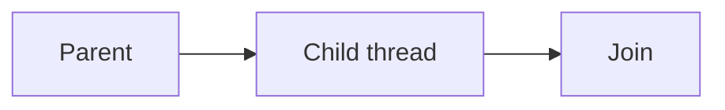

1. **co-11 channels:** send transfers a message to receive.

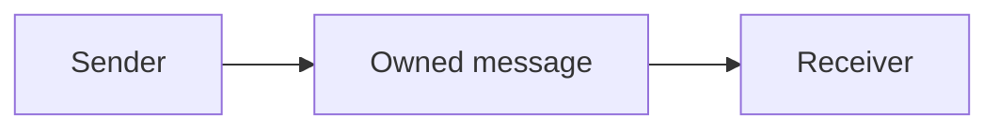

1. **co-12 arc:** atomic counting supports shared thread ownership.

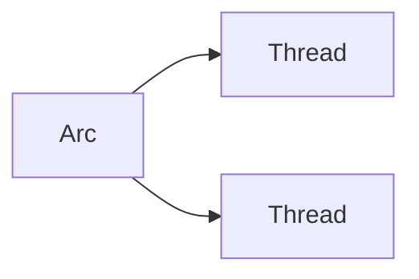

1. **co-13 mutex:** a lock serializes mutation.

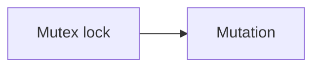

1. **co-14 send-sync:** marker traits gate thread transfer and sharing.

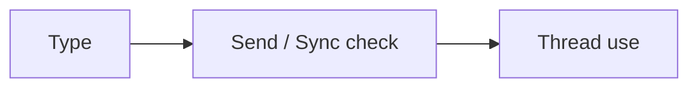

1. **co-15 data-race-compile-error:** invalid sharing stops at compile time.

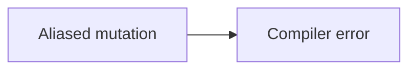

1. **co-16 zero-cost-iterators:** adapters compile to direct work.

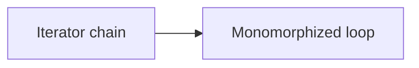

1. **co-17 traits-generics:** a concrete caller specializes generic code.

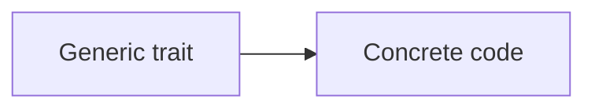

1. **co-18 trait-objects:** a vtable chooses an implementation at runtime.

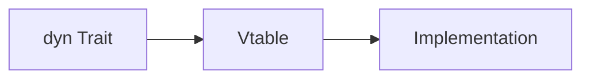

1. **co-19 result-error:** a call yields success or an error value.

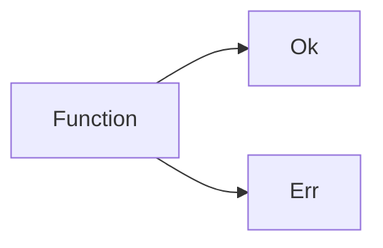

1. **co-20 question-mark:** `?` returns an error early.

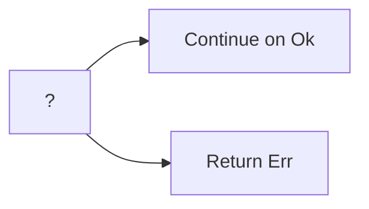

1. **co-21 custom-errors:** variants preserve failure meaning.

```mermaid
flowchart LR
E[Error enum] --> V1[Variant] & V2[Variant]
```

1. **co-22 anyhow:** context adds a human explanation to failure.

```mermaid
flowchart LR
E[Error] --> C[Context]
```

1. **co-23 unsafe-block:** manually proved code is visibly bounded.

```mermaid
flowchart LR
S[Safe code] --> U[Small unsafe block] --> S2[Safe result]
```

1. **co-24 raw-pointers:** dereference requires an unsafe proof.

```mermaid
flowchart LR
P[Raw pointer] --> U[unsafe dereference]
```

1. **co-25 unsafe-contract:** a wrapper enforces invariants for callers.

```mermaid
flowchart LR
C[Caller] --> W[Safe wrapper] --> U[Audited unsafe]
```

1. **co-26 ffi-extern:** an ABI declaration describes foreign linkage.

```mermaid
flowchart LR
R[Rust] --> A[extern C ABI]
```

1. **co-27 ffi-call-c:** the wrapper invokes a C function.

```mermaid
flowchart LR
W[Wrapper] --> C[C function]
```

1. **co-28 ffi-expose-rust:** an exported Rust symbol has a C ABI.

```mermaid
flowchart LR
R[Rust export] --> C[C caller]
```

1. **co-29 ffi-ownership:** allocation/free responsibility is explicit.

```mermaid
flowchart LR
A[Allocator] --> U[User] --> F[Free owner]
```

1. **co-30 async-runtime:** a runtime polls a future to completion.

```mermaid
flowchart LR
F[Future] --> R[Runtime] --> O[Output]
```
