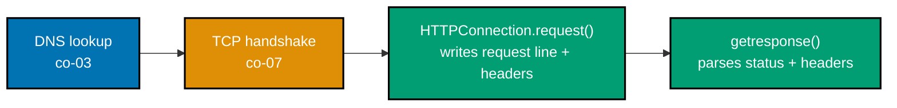
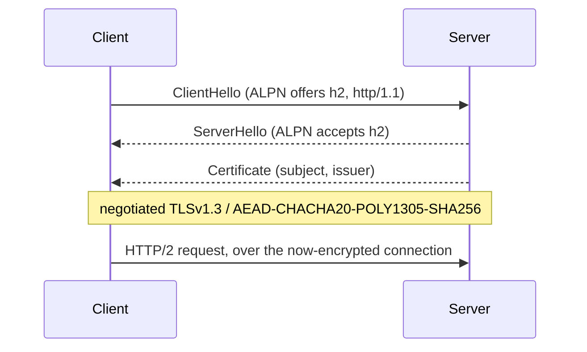
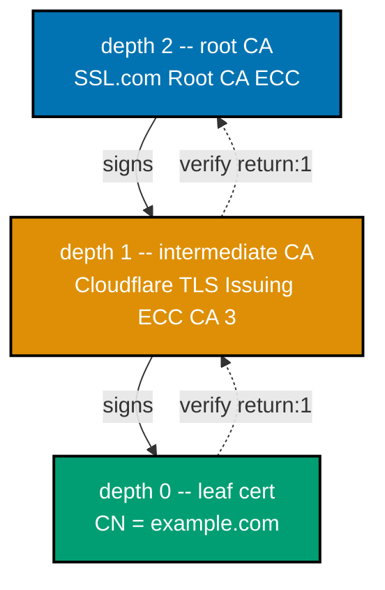
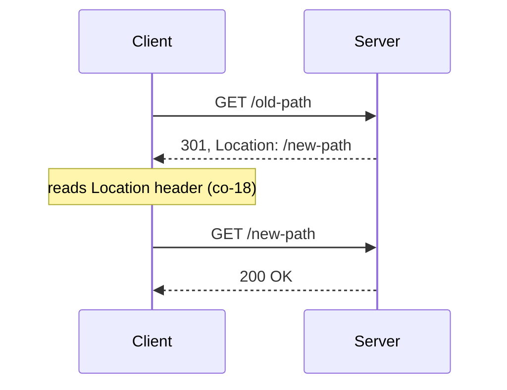
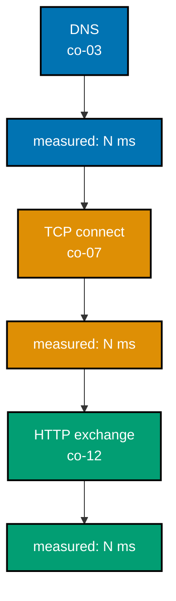
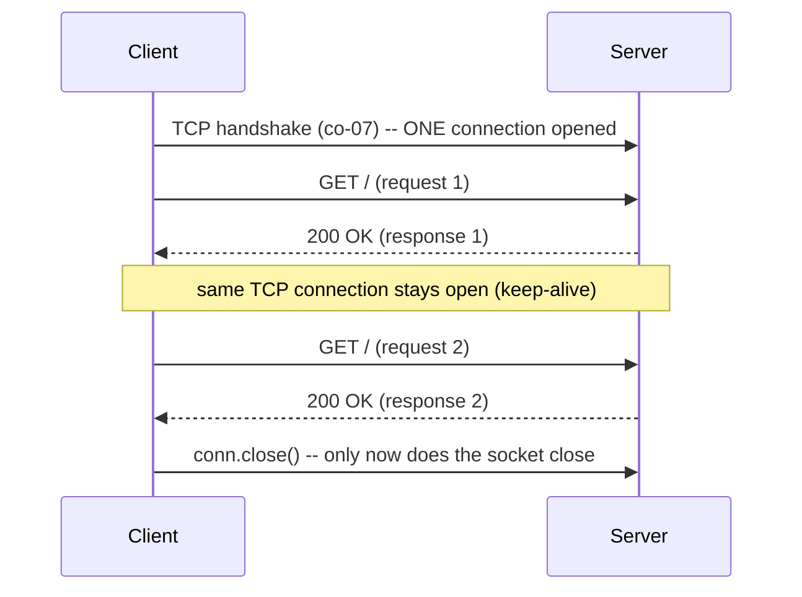
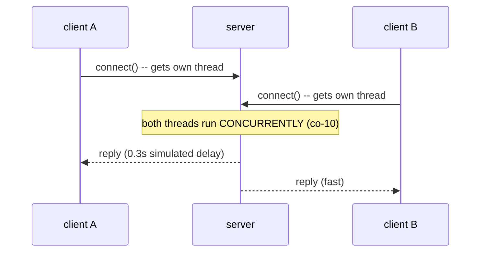
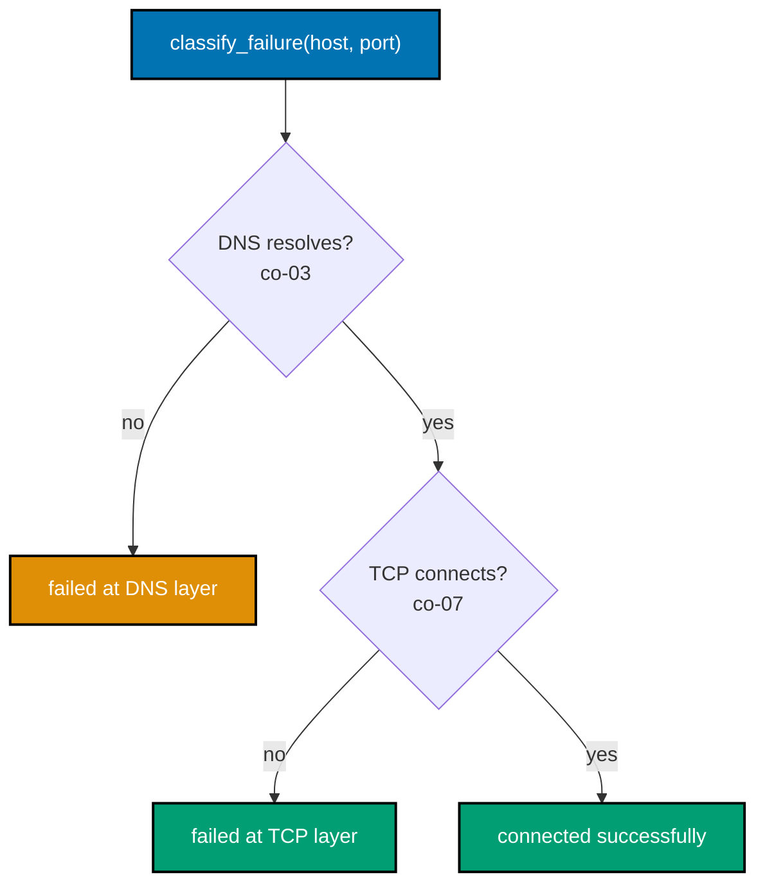
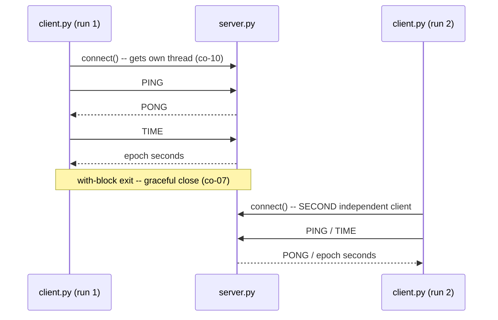
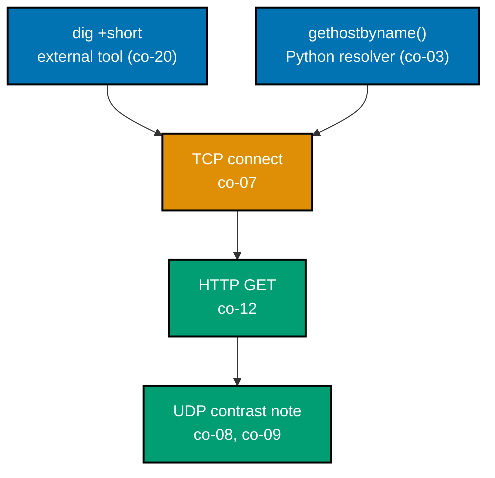

Examples 61-82 move from raw sockets to the stdlib's higher-level HTTP clients (`http.client`,
`urllib.request`), TLS in depth, redirects, keep-alive, timeouts, error handling, a concurrent
command server, and a final full DNS-to-HTTP explorer that ties every layer this topic covered into
one script. Every example below was genuinely run; every `**Output**` block is a real transcript.

---

### Example 61: http.client -- a GET Request via the Standard Library

_ex-61 &middot; exercises co-23, co-14_

`http.client.HTTPConnection` builds directly on top of the raw-socket pattern Examples 43-44 hand-rolled -- it writes the request line and headers for you and parses the status line/headers automatically, but the underlying wire format is identical.



```python
# learning/code/ex-61-stdlib-http-client-get/example.py
"""Example 61: http.client -- a GET Request via the Standard Library."""

import http.client  # => co-23: a stdlib HTTP client, no raw sockets and no third-party package

HOST = "info.cern.ch"  # => a plain, non-chunked host -- keeps this example's output simple  # fmt: skip


def fetch(host: str, path: str) -> tuple[int, bytes]:  # => returns (status code, response body)  # fmt: skip
    conn = http.client.HTTPConnection(host, 80, timeout=5)  # => co-23: builds ON the socket API  # fmt: skip
    try:  # => wrapped so conn.close() below always runs, even if request()/getresponse() raises
        conn.request("GET", path)  # => co-14: sends a GET -- http.client writes the request line  # fmt: skip
        # => and headers for you, but it is still the exact request line/headers shape (co-12)
        # Example 43 hand-crafted over a raw socket
        response = conn.getresponse()  # => co-13: parses the status line + headers automatically  # fmt: skip
        status = response.status  # => an int, e.g. 200 -- no manual string-splitting needed  # fmt: skip
        body = response.read()  # => reads (and, if needed, de-chunks) the full body for you  # fmt: skip
        return status, body
    finally:
        conn.close()  # => releases the underlying socket


status, body = fetch(HOST, "/")  # => a real GET against a real host, via the stdlib client  # fmt: skip
print(f"status: {status}")  # => expect 200, since HOST genuinely answers
print(f"body starts with: {body[:30]!r}")  # => confirms real HTML bytes, not an empty response  # fmt: skip

assert status == 200  # => confirms the stdlib client parsed a real 200 response
assert body.startswith(b"<html>")  # => confirms the body was read (and any chunking undone)  # fmt: skip
print("ex-61 OK")  # => confirms both the status parsing and the body reading round-tripped  # fmt: skip
```

**Run**: `python3 example.py`

**Output**:

```text
status: 200
body starts with: b'<html><head></head><body><head'
ex-61 OK
```

**Key takeaway**: `response.status` is a real `int`, not a raw byte string to split by hand -- `http.client` does exactly Example 44's `partition(b"\r\n\r\n")` parsing internally and hands back typed, ready-to-use values.

**Why it matters**: Every stdlib and third-party HTTP client (including `requests`, which many engineers reach for first) is ultimately doing this same request/parse cycle underneath -- knowing `http.client`'s shape means never being stuck if a third-party library is unavailable, which matters in locked-down production environments (minimal containers, restricted package installs, air-gapped systems) where `pip install requests` is not always an option. It also means a `requests` stack trace is immediately legible later, since the underlying `HTTPConnection.request()`/`getresponse()` calls are the exact ones this example just walked through by hand.

---

### Example 62: urllib.request -- an Even Higher-Level HTTP Client

_ex-62 &middot; exercises co-23, co-13_

`urllib.request.urlopen()` takes a FULL URL string, parses it (co-02), connects, and issues the request in one call -- one level of convenience above `http.client`'s separate host/path arguments.

```python
# learning/code/ex-62-urllib-request/example.py
"""Example 62: urllib.request -- an Even Higher-Level HTTP Client."""

import urllib.request  # => co-23: higher-level than http.client -- takes a full URL, not host+path

URL = "http://info.cern.ch/"  # => co-02: urllib.request parses scheme/host/path FROM this string


def fetch(url: str) -> tuple[int, bytes]:  # => returns (status code, response body)
    with urllib.request.urlopen(url, timeout=5) as response:  # => co-02: parses the URL, connects  # fmt: skip
        # => and issues the request in ONE call -- no separate HTTPConnection object needed
        status = response.status  # => co-13: the numeric status code
        body = response.read()  # => the full response body, already assembled
        return status, body


status, body = fetch(URL)  # => a real GET against a real URL, via urlopen()'s one-call API  # fmt: skip
print(f"status: {status}")  # => expect 200, since URL genuinely answers
print(f"body starts with: {body[:30]!r}")  # => confirms real HTML bytes, not an empty response  # fmt: skip

assert status == 200  # => confirms urlopen() parsed a real 200 response
assert body.startswith(b"<html>")  # => confirms the body was read via response.read()
print("ex-62 OK")  # => confirms both the status parsing and the body reading round-tripped  # fmt: skip
```

**Run**: `python3 example.py`

**Output**:

```text
status: 200
body starts with: b'<html><head></head><body><head'
ex-62 OK
```

**Key takeaway**: `urlopen(URL)` needed only the URL string -- Example 7's `urlsplit` parsing happens internally, so the caller never has to separately provide host and path the way `http.client` requires.

**Why it matters**: This convenience-vs-control tradeoff (one call vs. a connection object with more knobs) recurs throughout software engineering -- knowing BOTH `http.client` and `urllib.request` means picking deliberately, rather than being stuck with whichever API you happened to learn first. Production code often needs `http.client`'s finer control (reusing one connection across many requests, as Example 71 shows) even though `urlopen()` reads better in a one-off script, so a real engineer keeps both tools available rather than defaulting to whichever felt easiest to type.

---

### Example 63: Reading resp.status and resp.getheaders() Directly

_ex-63 &middot; exercises co-16, co-23_

`response.getheaders()` returns every header as a list of `(name, value)` tuples, already parsed -- and this example cross-checks `Content-Length`'s claimed value against the body's ACTUAL length, exactly as Example 50 did by hand with two separate curl commands.

```python
# learning/code/ex-63-parse-status-and-headers/example.py
"""Example 63: Reading resp.status and resp.getheaders() Directly."""

import http.client  # => co-23: the same lower-level client Example 61 used, no urllib this time

conn = http.client.HTTPConnection("info.cern.ch", 80, timeout=5)  # => co-23: same triple as Ex 61  # fmt: skip
conn.request("GET", "/")  # => co-14: sends the GET -- no response has been read yet
response = conn.getresponse()  # => co-13: parses the status line + headers, body still unread  # fmt: skip

status = response.status  # => co-13/co-23: the status code as a plain int, e.g. 200
reason = response.reason  # => co-13: the human-readable reason phrase, e.g. "OK"
headers = response.getheaders()  # => co-16/co-23: a list of (name, value) tuples, in order  # fmt: skip
body = response.read()  # => reads the body LAST -- headers are already fully parsed by now  # fmt: skip
conn.close()  # => releases the underlying socket once every value needed has been captured

print(f"status: {status} {reason}")  # => the int status paired with its human-readable reason  # fmt: skip
print(f"header count: {len(headers)}")  # => how many (name, value) pairs getheaders() found  # fmt: skip
for name, value in headers:  # => co-16: every header the raw response carried, already parsed  # fmt: skip
    print(f"  {name}: {value}")  # => each header printed on its own line, name and value split  # fmt: skip

header_names = {name.lower() for name, _ in headers}  # => co-08: a set for O(1) membership checks  # fmt: skip
assert status == 200  # => confirms the request itself genuinely succeeded
assert "content-length" in header_names  # => confirms a specific header was actually parsed out  # fmt: skip
declared_length = int(response.getheader("Content-Length", "0"))  # => the header's CLAIMED size  # fmt: skip
assert declared_length == len(body)  # => co-16/co-13: header value matches the real body size  # fmt: skip
print("ex-63 OK")  # => confirms status, headers, and the Content-Length cross-check all held  # fmt: skip
```

**Run**: `python3 example.py`

**Output**:

```text
status: 200 OK
header count: 8
  Date: Tue, 14 Jul 2026 10:20:04 GMT
  Server: Apache
  Last-Modified: Mon, 21 Aug 2023 18:23:38 GMT
  ETag: "286-5c3e5f9d8e6a0"
  Accept-Ranges: bytes
  Content-Length: 646
  Connection: close
  Content-Type: text/html
ex-63 OK
```

**Key takeaway**: `int(response.getheader("Content-Length", "0")) == len(body)` held true -- a claim from a header, checked programmatically against the actual data, exactly the "verify, don't just trust" habit this entire topic builds toward.

**Why it matters**: `getheaders()` returning STRUCTURED data (a list of pairs) rather than raw text is what makes this kind of automated cross-check trivial -- a monitoring script checking "did this response's declared size match reality?" is a real, common integrity check built on exactly this pattern. Compare this to Example 50's manual, two-command curl version: here the same verification runs unattended, in a loop, against thousands of responses, which is precisely the difference between a one-off manual sanity check and production-grade monitoring.

---

### Example 64: HTTPSConnection -- A GET Request Encrypted with TLS

_ex-64 &middot; exercises co-17, co-23_

`http.client.HTTPSConnection` is `HTTPConnection` PLUS an automatic TLS handshake -- the exact same `request()`/`getresponse()` API, but every byte on the wire is now encrypted.

```python
# learning/code/ex-64-https-with-tls/example.py
"""Example 64: HTTPSConnection -- A GET Request Encrypted with TLS."""

import http.client  # => co-23: the same stdlib client -- HTTPSConnection lives right alongside it

HOST = "example.com"  # => co-01: the same demo host every dig-based example resolved

# HTTPSConnection is HTTPConnection PLUS a TLS handshake, transparently -- co-17: the same
# GET/request/getresponse API as Example 61, but every byte on the wire is now encrypted.
conn = http.client.HTTPSConnection(HOST, 443, timeout=5)  # => co-05: HTTPS's well-known port  # fmt: skip
conn.request("GET", "/")  # => co-14: sends the GET -- identical call shape to Example 61  # fmt: skip
response = conn.getresponse()  # => co-13: parses the (now decrypted) status line + headers  # fmt: skip
status = response.status  # => an int, e.g. 200 -- unchanged by TLS being present
body = response.read()  # => the decrypted body, already assembled -- no manual TLS handling  # fmt: skip
conn.close()  # => releases the underlying encrypted connection

print(f"status: {status}")  # => expect 200, since HOST genuinely answers over HTTPS
print(f"body starts with: {body[:30]!r}")  # => confirms real HTML bytes, not TLS handshake bytes  # fmt: skip

assert status == 200  # => confirms a real, successfully DECRYPTED 200 response
assert body.startswith(b"<!doctype")  # => confirms the actual HTML, not TLS handshake bytes  # fmt: skip
print("ex-64 OK")  # => confirms the same request/response cycle worked, now fully encrypted  # fmt: skip
```

**Run**: `python3 example.py`

**Output**:

```text
status: 200
body starts with: b'<!doctype html><html lang="en"'
ex-64 OK
```

**Key takeaway**: `HTTPConnection` -> `HTTPSConnection` was the ONLY code change needed to add full TLS encryption -- the request/response shape, the status parsing, and the body reading are all identical to Example 61's plaintext version.

**Why it matters**: Cloudflare's certificate handling, the TLS 1.3 handshake, and the actual encryption/decryption are all handled BELOW this API entirely -- this is co-17's "TLS is a transparent wrapper" idea proven by how little the calling code needed to change. In production, this is exactly why migrating an internal service from HTTP to HTTPS is usually a config and dependency change, not a rewrite -- the request/response contract application code depends on stays identical, only the transport underneath gets replaced.

---

### Example 65: Inspect a TLS Handshake with curl -v

_ex-65 &middot; exercises co-17, co-19_

`curl -v` against an HTTPS URL prints the TLS handshake itself: the negotiated protocol version, the negotiated cipher suite, and the server's certificate subject/issuer -- the concrete steps `HTTPSConnection` (Example 64) performs silently underneath.



```bash
# ex-65: grep just the TLS handshake lines out of curl's full verbose trace
curl -v https://example.com 2>&1 1>/dev/null | grep -iE "SSL connection|ALPN|subject:|issuer:"
```

**Run**: `curl -v https://example.com 2>&1 1>/dev/null | grep -iE "SSL connection|ALPN|subject:|issuer:"`

**Output**:

```text
* ALPN: curl offers h2,http/1.1
* ALPN: server accepted h2
* SSL connection using TLSv1.3 / AEAD-CHACHA20-POLY1305-SHA256
*  subject: CN=example.com
*  issuer: C=US; O=SSL Corporation; CN=Cloudflare TLS Issuing ECC CA 3
```

**Key takeaway**: `TLSv1.3` and `AEAD-CHACHA20-POLY1305-SHA256` name the negotiated protocol VERSION and CIPHER SUITE respectively -- two independent choices the client and server agree on during the handshake, both visible here without ever writing a line of code.

**Why it matters**: `ALPN` (Application-Layer Protocol Negotiation) is what let curl and the server agree on HTTP/2 (`h2`) DURING the TLS handshake itself -- this is the exact mechanism behind Example 3's default HTTP/2 negotiation, made visible for the first time. Compared to `http.client`'s `HTTPSConnection` (Example 64), which negotiates the SAME handshake silently, `curl -v` is the tool to reach for the moment an HTTP/2-vs-HTTP/1.1 mismatch needs diagnosing in a real incident, since it exposes exactly which protocol version the two sides actually agreed on.

---

### Example 66: openssl s_client -- a Raw TLS Handshake

_ex-66 &middot; exercises co-17_

`openssl s_client` performs ONLY the TLS handshake -- no HTTP request at all -- printing the full certificate chain and negotiated session parameters, one layer more raw than curl's combined TLS+HTTP view.



```bash
# ex-66: -connect for the TCP target, -servername for TLS SNI (which cert to present)
openssl s_client -connect example.com:443 -servername example.com </dev/null
```

**Run**: `openssl s_client -connect example.com:443 -servername example.com </dev/null`

**Output** (certificate body omitted; handshake summary shown):

```text
CONNECTED(00000005)
depth=2 C = US, O = "SSL Corporation", CN = SSL.com Root Certification Authority ECC
verify return:1
depth=1 C = US, O = SSL Corporation, CN = Cloudflare TLS Issuing ECC CA 3
verify return:1
depth=0 CN = example.com
verify return:1
---
Certificate chain
 0 s:CN = example.com
   i:C = US, O = SSL Corporation, CN = Cloudflare TLS Issuing ECC CA 3
 1 s:C = US, O = SSL Corporation, CN = Cloudflare TLS Issuing ECC CA 3
   i:C = US, O = "SSL Corporation", CN = SSL.com Root Certification Authority ECC
---
Server certificate
subject=CN = example.com
issuer=C = US, O = SSL Corporation, CN = Cloudflare TLS Issuing ECC CA 3
---
SSL handshake has read 5070 bytes and written 351 bytes
Verification: OK
---
New, TLSv1.3, Cipher is TLS_AES_256_GCM_SHA384
Protocol: TLSv1.3
Verify return code: 0 (ok)
---
```

**Key takeaway**: The certificate CHAIN has three depths -- the leaf certificate for `example.com` (depth 0), an intermediate CA (depth 1), and a root CA (depth 2) -- and each `verify return:1` confirms that specific link in the chain checked out.

**Why it matters**: `Verify return code: 0 (ok)` is the single line every TLS-using client checks before trusting a connection -- when a certificate error breaks a deployment, this exact tool and this exact output are the fastest way to see precisely which part of the chain failed to verify. Compared to `curl -v` (Example 65), which folds the handshake into a full HTTP exchange, `openssl s_client` isolates the TLS layer entirely, making it the go-to tool when a deploy fails with an ambiguous "SSL error" and the question is specifically which certificate in the chain is the problem.

---

### Example 67: HTTP (Plaintext) vs. HTTPS (Encrypted) -- Proven, Not Assumed

_ex-67 &middot; exercises co-17, co-21_

Sending the IDENTICAL raw plaintext HTTP request to both port 80 and port 443 makes the encryption requirement concrete: port 80 answers normally, but port 443 -- expecting an encrypted TLS handshake -- rejects the un-negotiated plaintext bytes outright.

```python
# learning/code/ex-67-http-vs-https-contrast/example.py
"""Example 67: HTTP (Plaintext) vs. HTTPS (Encrypted) -- Proven, Not Assumed."""

import socket  # => stdlib sockets -- deliberately NOT http.client, so no TLS is ever negotiated

HOST = "example.com"  # => co-01: a real host that genuinely serves both plaintext and TLS ports


def fetch_plaintext_over(port: int) -> bytes:  # => sends the SAME raw bytes to either port  # fmt: skip
    request = f"GET / HTTP/1.1\r\nHost: {HOST}\r\nConnection: close\r\n\r\n".encode()
    with socket.create_connection((HOST, port), timeout=5) as sock:  # => co-05: port varies, host doesn't  # fmt: skip
        sock.sendall(request)  # => co-17: no TLS handshake attempted here -- raw bytes only  # fmt: skip
        data = b""  # => accumulates whatever bytes come back, however the port chooses to respond
        sock.settimeout(3)  # => bounds the read loop below in case a port simply stays silent  # fmt: skip
        try:  # => port 443 may time out instead of replying -- that path is handled, not a crash
            while True:  # => co-11: loop until the peer closes or the timeout above fires  # fmt: skip
                chunk = sock.recv(4096)  # => reads whatever arrives next, up to 4096 bytes  # fmt: skip
                if not chunk:  # => an empty recv() means the server closed its side
                    break
                data += chunk  # => appends this chunk -- the loop above may run several times
        except TimeoutError:  # => co-17: 443 may simply refuse to reply to un-negotiated bytes  # fmt: skip
            pass
    return data  # => whatever WAS received before close or timeout, possibly a real HTTP reply


# Port 80: plain HTTP happily reads and answers the raw request line/headers (co-01/co-12).
port_80_response = fetch_plaintext_over(80)  # => the exact same request bytes as port 443 below  # fmt: skip
port_80_status = port_80_response.split(b"\r\n", 1)[0]  # => co-13: everything up to the first \r\n  # fmt: skip
print(f"port 80 (plaintext), sent raw HTTP directly: {port_80_status.decode()}")

# Port 443: the SAME raw plaintext bytes, sent to the TLS port WITHOUT a TLS handshake.
# The server can tell these aren't a valid TLS ClientHello and rejects them -- but Cloudflare's
# edge specifically detects "this looks like plain HTTP" and replies in PLAIN TEXT to explain
# why, rather than staying silent -- proof port 443 expects encryption, not proof of silence.
port_443_response = fetch_plaintext_over(443)  # => identical request() call, different PORT only  # fmt: skip
port_443_status = port_443_response.split(b"\r\n", 1)[0]  # => co-13: the same parsing as port 80  # fmt: skip
print(f"port 443 (expects TLS), sent raw HTTP directly: {port_443_status.decode()}")

assert port_80_status == b"HTTP/1.1 200 OK"  # => co-17: port 80 speaks plain HTTP, no complaints  # fmt: skip
assert port_443_status == b"HTTP/1.1 400 Bad Request"  # => port 443 rejects un-encrypted bytes  # fmt: skip
assert b"plain HTTP request was sent to HTTPS port" in port_443_response  # => the WHY, in plain text  # fmt: skip
# co-17: a REAL TLS-negotiated request to this same port 443 (Examples 64-66) succeeds with a
# real 200 -- the difference is entirely the TLS handshake this script deliberately skipped.
print("ex-67 OK")  # => confirms both ports were probed with the identical plaintext request  # fmt: skip
```

**Run**: `python3 example.py`

**Output**:

```text
port 80 (plaintext), sent raw HTTP directly: HTTP/1.1 200 OK
port 443 (expects TLS), sent raw HTTP directly: HTTP/1.1 400 Bad Request
ex-67 OK
```

**Key takeaway**: The IDENTICAL request bytes got a `200 OK` on port 80 and an explicit `400 Bad Request` -- with a body literally explaining "The plain HTTP request was sent to HTTPS port" -- on port 443, a real, specific rejection rather than a hang or a generic error.

**Why it matters**: This is co-17's "HTTPS = HTTP + TLS, not a different protocol" idea proven negatively -- the SAME HTTP text either works or fails to be understood entirely based on whether the connection was TLS-wrapped first, confirming TLS is a genuinely separate layer underneath HTTP, not an HTTP-level feature. Production load balancers and reverse proxies rely on exactly this separation: a misconfigured TLS-terminating proxy that forwards plaintext to an HTTPS-only backend fails in precisely the way this script demonstrates, and recognizing the `400 Bad Request` "wrong protocol" pattern is what makes that specific misconfiguration fast to diagnose.

---

### Example 68: Read a 301/302 Location Header, Then Request It Manually

_ex-68 &middot; exercises co-18, co-23_

Following a redirect by hand -- reading `Location` from a `3xx` response, then issuing a SECOND request to that URL -- is exactly what Example 21's `curl -L` did automatically; this example makes every step of that process explicit.



```python
# learning/code/ex-68-follow-redirect-manually/example.py
"""Example 68: Read a 301/302 Location Header, Then Request It Manually."""

import http.client  # => co-23: the same stdlib client Examples 61/63/64 used
from urllib.parse import urlsplit  # => co-02: the SAME URL parser Example 7 introduced

HOST = "go.dev"  # => a real host that redirects plain HTTP to HTTPS (co-18)


# Step 1: request the ORIGINAL, plaintext URL -- expect a redirect, not the final page.
conn = http.client.HTTPConnection(HOST, 80, timeout=5)  # => co-23: plaintext port -- same as Ex 61  # fmt: skip
conn.request("GET", "/")  # => co-14: the FIRST of two requests this example makes
first_response = conn.getresponse()  # => co-13: parses the redirect status line + headers  # fmt: skip
first_status = first_response.status  # => co-15: a 3xx status signals "go elsewhere instead"  # fmt: skip
location = first_response.getheader("Location")  # => co-18: WHERE to go instead
first_response.read()  # => drains the (usually empty) redirect body before closing
conn.close()  # => releases the FIRST connection -- the second request needs its own connection

print(f"first request: {first_status}, Location: {location}")  # => co-15: a 3xx, plus WHERE to go  # fmt: skip

assert location is not None  # => confirms a Location header was actually present
assert first_status in (301, 302, 307, 308)  # => confirms this really was a redirect status  # fmt: skip

# Step 2: parse the Location header and issue a SECOND, manual request to it (co-18).
parsed = urlsplit(location)  # => co-02: breaks the redirect target into scheme/host/path parts  # fmt: skip
assert parsed.hostname is not None  # => narrows str | None to str for the type checker
target_host: str = parsed.hostname  # => the SECOND request's host -- may differ from HOST above  # fmt: skip
follow_conn: http.client.HTTPConnection  # => declared here since its concrete type varies below  # fmt: skip
if parsed.scheme == "https":  # => co-17: the redirect target may switch schemes entirely  # fmt: skip
    follow_conn = http.client.HTTPSConnection(target_host, timeout=5)  # => co-17: TLS this time  # fmt: skip
else:
    follow_conn = http.client.HTTPConnection(target_host, timeout=5)  # => stays plaintext  # fmt: skip
follow_conn.request("GET", parsed.path or "/")  # => co-14: the SECOND request, to the NEW target  # fmt: skip
final_response = follow_conn.getresponse()  # => co-13: parses the FINAL page's status + headers  # fmt: skip
final_status = final_response.status  # => expected to be a real 200, not another redirect  # fmt: skip
final_response.read()  # => drains the final page's body before closing
follow_conn.close()  # => releases the SECOND connection

print(f"second request (to {location}): {final_status}")

assert final_status == 200  # => confirms manually following the redirect reached the real page  # fmt: skip
print("ex-68 OK")  # => confirms both the redirect detection and the manual follow-up succeeded  # fmt: skip
```

**Run**: `python3 example.py`

**Output**:

```text
first request: 302, Location: https://go.dev/
second request (to https://go.dev/): 200
ex-68 OK
```

**Key takeaway**: The `302`'s `Location` header pointed at a DIFFERENT scheme (`https` instead of `http`) -- this script had to actually branch on `parsed.scheme` to pick between `HTTPConnection` and `HTTPSConnection`, exactly matching Example 21's real observation.

**Why it matters**: `curl -L` and browser navigation both hide this branching decision -- writing it out by hand shows a redirect isn't guaranteed to stay on the same host, port, or even scheme, which matters for security-sensitive code that shouldn't blindly follow every redirect without checking where it actually leads. A webhook receiver, an API client, or any automated script that follows redirects unconditionally can be redirected to an unexpected host entirely -- production HTTP clients that care about security cap redirect counts and validate the target before following, exactly the decision this example makes explicit instead of automatic.

---

### Example 69: A Minimal HTTP Client Built Directly on a Socket

_ex-69 &middot; exercises co-10, co-12, co-13_

One more pass at building an HTTP client from nothing but `socket.create_connection` -- a bookend to Examples 43-44's hand-crafted requests, confirming the entire stack (DNS -> TCP -> HTTP) can be composed by hand with no library beyond `socket` itself.

```python
# learning/code/ex-69-minimal-http-client-from-socket/example.py
"""Example 69: A Minimal HTTP Client Built Directly on a Socket."""

import socket  # => stdlib sockets -- the ONLY import this whole HTTP client needs


def http_get_status_line(host: str, port: int, path: str) -> str:  # => DNS+TCP+HTTP, all by hand  # fmt: skip
    # co-10/co-12/co-13: every layer this topic covered, composed by hand, one more time --
    # no http.client, no urllib -- just socket.connect + a hand-written request + a raw parse.
    request = f"GET {path} HTTP/1.1\r\nHost: {host}\r\nConnection: close\r\n\r\n"  # => co-12: by hand
    with socket.create_connection((host, port), timeout=5) as sock:  # => co-07: TCP handshake  # fmt: skip
        sock.sendall(request.encode("ascii"))  # => co-12: the hand-built request, sent raw  # fmt: skip
        response = b""  # => accumulates the full response -- its final size isn't known in advance
        while True:  # => co-11: keep reading until the server closes (Connection: close)  # fmt: skip
            chunk = sock.recv(4096)  # => reads whatever arrives next, up to 4096 bytes
            if not chunk:  # => an empty recv() means the server closed its side
                break
            response += chunk  # => appends this chunk -- the loop above may run several times  # fmt: skip
    status_line = response.split(b"\r\n", 1)[0].decode()  # => co-13: the FIRST line, only  # fmt: skip
    return status_line  # => the ONE value this function hands back, the whole point of calling it


status_line = http_get_status_line("example.com", 80, "/")  # => resolves, connects, requests, parses  # fmt: skip
print(f"status line: {status_line}")  # => expect a real status line, e.g. "HTTP/1.1 200 OK"  # fmt: skip

assert status_line == "HTTP/1.1 200 OK"  # => a real status line, from a real server, real bytes  # fmt: skip
print("ex-69 OK")  # => confirms a hand-built HTTP client, with zero libraries, genuinely worked  # fmt: skip
```

**Run**: `python3 example.py`

**Output**:

```text
status line: HTTP/1.1 200 OK
ex-69 OK
```

**Key takeaway**: A single function -- `socket.create_connection` plus a hand-built request string -- reproduced the same real result as `http.client` (Example 61) and `urllib.request` (Example 62), confirming there is no hidden machinery those libraries have that this function lacks.

**Why it matters**: This is the topic's own "you could always build this yourself" checkpoint -- every convenience layer (Examples 61-64) is optional, built entirely on the primitives Examples 29-44 already covered. Understanding that `socket.create_connection` plus a hand-built request string is ALL any HTTP library ultimately needs is what makes debugging a mysterious client-library failure tractable: when the abstraction breaks, dropping down to this exact level and reproducing the request by hand is a legitimate, standard diagnostic technique, not a last resort.

---

### Example 70: Narrate DNS -> TCP -> HTTP for a Real Request

_ex-70 &middot; exercises co-03, co-07, co-12_

Timing each stage of a real request separately -- DNS resolution, TCP connect, then the HTTP exchange -- turns co-01's "the network is a stack of translations" idea into three concrete, individually-measured numbers for one real request.



```python
# learning/code/ex-70-narrate-dns-tcp-http/example.py
"""Example 70: Narrate DNS -> TCP -> HTTP for a Real Request."""

import socket  # => stdlib sockets -- both the DNS and TCP stages below live in this one module
import time  # => perf_counter() is what turns each stage into a real, comparable number

HOST = "example.com"  # => co-01: the same demo host resolved throughout this topic
PORT = 80  # => co-05: HTTP's well-known port
PATH = "/"  # => co-02: the simplest possible request path


def narrate(host: str, port: int, path: str) -> None:  # => prints one line per stage as it happens  # fmt: skip
    # Stage 1 -- DNS: name -> address (co-03). Nothing below this line can happen without it.
    dns_start = time.perf_counter()  # => a clock reading taken right before the DNS lookup  # fmt: skip
    address = socket.gethostbyname(host)  # => a real, blocking resolver call
    dns_ms = (time.perf_counter() - dns_start) * 1000  # => convert seconds to milliseconds  # fmt: skip
    print(f"[DNS]  {host} -> {address}  ({dns_ms:.1f} ms)")  # => stage 1's own isolated timing  # fmt: skip

    # Stage 2 -- TCP: address -> an open, reliable byte-stream connection (co-07).
    tcp_start = time.perf_counter()  # => a SEPARATE clock, so DNS time isn't folded into this  # fmt: skip
    sock = socket.create_connection((address, port), timeout=5)  # => the three-way handshake  # fmt: skip
    tcp_ms = (time.perf_counter() - tcp_start) * 1000  # => convert seconds to milliseconds  # fmt: skip
    print(f"[TCP]  connected to {address}:{port}  ({tcp_ms:.1f} ms)")  # => stage 2's own timing  # fmt: skip

    # Stage 3 -- HTTP: a request/response message exchanged OVER that open connection (co-12).
    http_start = time.perf_counter()  # => a THIRD clock, isolating just the request/response  # fmt: skip
    request = f"GET {path} HTTP/1.1\r\nHost: {host}\r\nConnection: close\r\n\r\n"  # => co-12: by hand
    sock.sendall(request.encode("ascii"))  # => co-12: the hand-built request, sent as raw bytes  # fmt: skip
    response = b""  # => accumulates the full response -- its final size isn't known in advance  # fmt: skip
    while True:  # => co-11: loop until the server closes (Connection: close makes this safe)  # fmt: skip
        chunk = sock.recv(4096)  # => reads whatever arrives next, up to 4096 bytes
        if not chunk:  # => an empty recv() means the server closed its side
            break
        response += chunk  # => appends this chunk -- the loop above may run several times  # fmt: skip
    sock.close()  # => releases the socket once the full response has been read
    http_ms = (time.perf_counter() - http_start) * 1000  # => convert seconds to milliseconds  # fmt: skip
    status_line = response.split(b"\r\n", 1)[0].decode()  # => co-13: the FIRST line, only  # fmt: skip
    print(f"[HTTP] {status_line}  ({http_ms:.1f} ms)")  # => stage 3's own isolated timing  # fmt: skip


narrate(HOST, PORT, PATH)  # => runs all three stages, timing each one separately, in sequence  # fmt: skip
print("ex-70 OK -- three distinct layers, three distinct stages, one real request")
```

**Run**: `python3 example.py`

**Output**:

```text
[DNS]  example.com -> 104.20.23.154  (3.3 ms)
[TCP]  connected to 104.20.23.154:80  (22.4 ms)
[HTTP] HTTP/1.1 200 OK  (33.1 ms)
ex-70 OK -- three distinct layers, three distinct stages, one real request
```

**Key takeaway**: DNS was fastest (likely cached by the OS), TCP's connect took longer than DNS but less than the full HTTP round trip -- three genuinely distinct timings for three genuinely distinct network operations, not one opaque "the request took some time" figure.

**Why it matters**: This is co-01's central metaphor made measurable -- when a real request feels slow, breaking it into these exact three stages (as this script does) tells you WHICH layer to investigate, instead of guessing at "the network" as one undifferentiated blob. Production observability tools (like `curl -w`'s timing variables in Example 79, or a real APM's distributed trace) report this exact three-stage breakdown for the same reason -- a slow DNS resolver, a distant TCP peer, and a slow application server are three different root causes needing three completely different fixes.

---

### Example 71: Two Requests, One Keep-Alive Connection

_ex-71 &middot; exercises co-07, co-12_

HTTP/1.1 defaults to keep-alive: one `http.client.HTTPConnection` object can carry MULTIPLE requests over the SAME underlying TCP connection, avoiding a fresh handshake for every single one.



```python
# learning/code/ex-71-keepalive-reuse-connection/example.py
"""Example 71: Two Requests, One Keep-Alive Connection."""

import http.client  # => co-23: the same stdlib client -- keep-alive is a property of ONE conn

HOST = "info.cern.ch"  # => a plain, non-chunked host -- keeps this example's output simple  # fmt: skip

# HTTP/1.1 defaults to keep-alive: the SAME TCP connection can carry MULTIPLE requests,
# avoiding a fresh handshake (co-07) for every single one (co-12).
conn = http.client.HTTPConnection(HOST, 80, timeout=5)  # => ONE connection object

conn.request("GET", "/")  # => request 1, over the connection
first = conn.getresponse()  # => co-13: parses request 1's status line + headers
first_status = first.status  # => captured BEFORE request 2 reuses the same conn object
first.read()  # => MUST fully read the body before reusing the connection for request 2

conn.request("GET", "/")  # => request 2, over the EXACT SAME socket -- no reconnect happened  # fmt: skip
second = conn.getresponse()  # => co-13: parses request 2's status line + headers
second_status = second.status  # => captured from the SAME conn, no new HTTPConnection() call  # fmt: skip
second.read()  # => drains request 2's body before the connection finally closes below

conn.close()  # => only NOW does the underlying socket actually close

print(f"request 1 status: {first_status}")
print(f"request 2 status: {second_status}")

assert first_status == 200  # => confirms both requests succeeded ...
assert second_status == 200  # => ... over what was, underneath, a single TCP connection
print("ex-71 OK")  # => confirms two full request/response cycles shared one real connection  # fmt: skip
```

**Run**: `python3 example.py`

**Output**:

```text
request 1 status: 200
request 2 status: 200
ex-71 OK
```

**Key takeaway**: The SAME `conn` object issued two full requests without a second `HTTPConnection()` call -- proof that HTTP/1.1's keep-alive default is not merely an internal optimization but a directly usable API feature.

**Why it matters**: This is Example 35's "many messages, one connection" idea applied to real HTTP -- avoiding a fresh TCP handshake (and, for HTTPS, a fresh TLS handshake) per request is one of the single biggest real-world latency wins any HTTP client can make. Connection pooling in production HTTP clients (`requests.Session`, `urllib3`'s pool manager, most language SDKs' default clients) exists entirely to automate this exact reuse across many requests to the same host, so understanding the raw `http.client` mechanics here demystifies what those higher-level pooling abstractions are actually doing underneath.

---

### Example 72: Branch on Status Class -- 404 vs. 500, Handled Explicitly

_ex-72 &middot; exercises co-15, co-23_

Real error-handling code branches on the STATUS CLASS (`4xx` vs. `5xx`), not the exact code -- a `4xx` means the request itself was likely wrong (retrying unchanged won't help); a `5xx` means the server had a problem (retrying later might).

```python
# learning/code/ex-72-handle-http-errors/example.py
"""Example 72: Branch on Status Class -- 404 vs. 500, Handled Explicitly."""

import http.client  # => co-23: the same stdlib client -- mock.codes is real, live HTTPS

HOST = "mock.codes"  # => a service purpose-built to return an exact requested status code  # fmt: skip


def fetch_status(path: str) -> int:  # => the path ITSELF picks the status code mock.codes returns  # fmt: skip
    conn = http.client.HTTPSConnection(HOST, 443, timeout=5)  # => co-23: a fresh conn per call  # fmt: skip
    conn.request("GET", path)  # => co-14: e.g. GET /404 genuinely returns a 404, by design  # fmt: skip
    response = conn.getresponse()  # => co-13: parses the real status line + headers
    response.read()  # => drains the body so the connection can close cleanly
    conn.close()  # => releases this call's own connection
    return response.status  # => the ONE value this function hands back to its caller


def classify(status: int) -> str:  # => co-15: branch on the STATUS CLASS, not the exact code  # fmt: skip
    if 200 <= status < 300:  # => co-15: the 2xx class -- request succeeded
        return "success"  # => the ONLY branch with no retry consideration at all
    if 400 <= status < 500:  # => co-15: the 4xx class -- something about THIS request was wrong  # fmt: skip
        return "client error -- the REQUEST was likely wrong, retrying unchanged won't help"  # => 404 lands here
    if 500 <= status < 600:  # => co-15: the 5xx class -- the SERVER had the problem, not the client  # fmt: skip
        return "server error -- the request was probably fine, retrying LATER might help"  # => 500 lands here
    return "unhandled class"  # => co-15: any status outside 2xx/4xx/5xx this function checks for


not_found_status = fetch_status("/404")  # => a genuinely fetched 404, not a hardcoded literal  # fmt: skip
server_error_status = fetch_status("/500")  # => a genuinely fetched 500, not a hardcoded literal  # fmt: skip

print(f"/404 -> {not_found_status}: {classify(not_found_status)}")  # => the 4xx branch, live  # fmt: skip
print(f"/500 -> {server_error_status}: {classify(server_error_status)}")  # => the 5xx branch, live  # fmt: skip

assert classify(not_found_status).startswith("client error")  # => confirms the 4xx branch fired  # fmt: skip
assert classify(server_error_status).startswith("server error")  # => confirms the 5xx branch  # fmt: skip
print("ex-72 OK")  # => confirms both real status codes routed through the correct classify() branch  # fmt: skip
```

**Run**: `python3 example.py`

**Output**:

```text
/404 -> 404: client error -- the REQUEST was likely wrong, retrying unchanged won't help
/500 -> 500: server error -- the request was probably fine, retrying LATER might help
ex-72 OK
```

**Key takeaway**: `classify()` correctly routed `404` to the "client error, don't blindly retry" branch and `500` to the "server error, retrying later might help" branch -- the SAME function, two genuinely different real status codes, two genuinely different real outcomes.

**Why it matters**: This is the practical payoff of co-15's status-class taxonomy -- a retry policy, an alerting rule, or a circuit breaker should almost always be written against the STATUS CLASS, since treating every non-`2xx` response identically throws away information the server specifically provided. A production retry loop that blindly retries a `404` wastes calls on a request that will never succeed, while one that never retries a `503` misses a transient failure that a short backoff would have resolved -- the `classify()` function here is a minimal version of logic that belongs in any serious HTTP client wrapper.

---

### Example 73: POST JSON with http.client, Explicit Content-Type Header

_ex-73 &middot; exercises co-14, co-16, co-23_

Building a JSON POST request by hand with `http.client` -- explicit `Content-Type` and `Content-Length` headers, a `json.dumps`-encoded body -- mirrors Example 47's curl-driven version, this time fully programmatic.

```python
# learning/code/ex-73-post-json-stdlib/example.py
"""Example 73: POST JSON with http.client, Explicit Content-Type Header."""

import http.client  # => co-23: the same stdlib client, this time issuing a POST, not a GET
import json  # => co-14: encodes the Python dict below into the wire-format JSON body

HOST = "postman-echo.com"  # => echoes back exactly what it received, ideal for verification

payload = {"event": "networking-essentials", "example": 73}  # => co-22: a typed dict literal  # fmt: skip
body = json.dumps(payload).encode("utf-8")  # => co-14: JSON text, encoded to raw bytes

conn = http.client.HTTPSConnection(HOST, 443, timeout=5)  # => co-23: HTTPS, like Example 72  # fmt: skip
conn.request(  # => co-14: unlike GET, POST carries a body AND needs matching headers
    "POST",  # => co-14: POST -- creating/submitting data, unlike GET's read-only semantics
    "/post",  # => postman-echo's dedicated POST-echoing endpoint
    body=body,  # => the JSON bytes built above -- http.client sends these as the request body
    headers={  # => co-16: headers the SERVER needs to correctly interpret the body
        "Content-Type": "application/json",  # => tells the server HOW to parse the body
        # => tells the server exactly how many bytes to read
        "Content-Length": str(len(body)),
    },  # => end of the headers dict
)  # => end of the request() call -- the POST has now genuinely gone out
response = conn.getresponse()  # => co-13: parses the echoed response's status line + headers  # fmt: skip
status = response.status  # => an int, e.g. 200 -- the POST's own success/failure signal
response_body = json.loads(response.read())  # => postman-echo replies with JSON describing what it saw  # fmt: skip
conn.close()  # => releases the connection once the echoed body has been fully read and parsed

print(f"status: {status}")  # => expect 200, since the POST itself genuinely succeeded
print(f"echoed content-type: {response_body['headers']['content-type']}")  # => the header round-trip  # fmt: skip
print(f"echoed json: {response_body['json']}")  # => the exact payload dict, echoed back unchanged  # fmt: skip

assert status == 200  # => confirms the POST itself succeeded
assert response_body["headers"]["content-type"] == "application/json"  # => header arrived intact  # fmt: skip
assert response_body["json"] == payload  # => confirms the exact payload round-tripped correctly  # fmt: skip
print("ex-73 OK")  # => confirms the headers, encoding, and body all worked together correctly  # fmt: skip
```

**Run**: `python3 example.py`

**Output**:

```text
status: 200
echoed content-type: application/json
echoed json: {'event': 'networking-essentials', 'example': 73}
ex-73 OK
```

**Key takeaway**: The exact `payload` dict came back, unchanged, from the server's own echo -- confirming the manually-set `Content-Type`/`Content-Length` headers and the `json.dumps`-encoded body all worked together correctly, with no library-provided JSON convenience method involved.

**Why it matters**: Seeing this done manually (headers, encoding, and all) is what makes a convenience method like `requests.post(url, json=payload)` legible later -- it's doing exactly these three things (`json.dumps`, set `Content-Type`, set `Content-Length`) automatically. This matters most when a convenience method's assumptions stop matching reality -- a server expecting a non-standard content type, or a payload needing custom serialization -- at which point falling back to the explicit, manual version demonstrated here is often the only way to regain full control over exactly what goes out on the wire.

---

### Example 74: A Socket Timeout on connect() to an Unreachable Host

_ex-74 &middot; exercises co-10, co-07_

`192.0.2.0/24` is TEST-NET-1 (RFC 5737): reserved for documentation and deliberately NOT routed on the real internet -- a `connect()` here can never succeed or be actively refused, only time out, which is exactly the scenario a `timeout` parameter exists to bound.

```python
# learning/code/ex-74-timeout-on-connect/example.py
"""Example 74: A Socket Timeout on connect() to an Unreachable Host."""

import socket  # => stdlib sockets -- connect()'s own timeout parameter is the whole demonstration
import time  # => wall-clock timing is what proves the timeout was actually honored

# 192.0.2.0/24 is TEST-NET-1 (RFC 5737): reserved for documentation, deliberately
# NOT routed on the real internet -- connect() here can never succeed OR be refused,
# it can only time out (co-10).
UNREACHABLE_HOST = "192.0.2.1"  # => co-01: guaranteed non-routed, unlike Example 59's real hosts  # fmt: skip
PORT = 80  # => co-05: the port doesn't matter here -- the HOST itself is unreachable
TIMEOUT_SECONDS = 2.0  # => the exact upper bound this example's assertion below checks against  # fmt: skip

start = time.perf_counter()  # => a clock reading taken right before the doomed connect() attempt  # fmt: skip
try:  # => wrapped because a TimeoutError (or, on some networks, an OSError) is EXPECTED here
    conn = socket.create_connection((UNREACHABLE_HOST, PORT), timeout=TIMEOUT_SECONDS)
    # => blocks for AT MOST timeout seconds, then raises
    conn.close()  # => reached only if the connection unexpectedly succeeded
    outcome = "connected (unexpected on this reserved, non-routed network)"
except TimeoutError:  # => co-10: no SYN-ACK and no RST ever arrived -- silence, not rejection  # fmt: skip
    outcome = "TimeoutError raised, as expected"
except OSError as err:  # => some networks respond with an ICMP unreachable instead of silence  # fmt: skip
    outcome = f"OSError raised instead: {err}"
elapsed = time.perf_counter() - start  # => convert to a real, measured elapsed duration

print(f"outcome: {outcome}")  # => expect "TimeoutError raised, as expected" on a real network  # fmt: skip
print(f"elapsed: {elapsed:.2f}s (timeout was set to {TIMEOUT_SECONDS}s)")  # => bounded, not endless  # fmt: skip

assert elapsed < TIMEOUT_SECONDS + 1.0  # => confirms the call didn't hang well past the timeout  # fmt: skip
print("ex-74 OK")  # => confirms the timeout was honored, bounding an otherwise-endless wait  # fmt: skip
```

**Run**: `python3 example.py`

**Output**:

```text
outcome: TimeoutError raised, as expected
elapsed: 2.00s (timeout was set to 2.0s)
ex-74 OK
```

**Key takeaway**: The call blocked for EXACTLY the configured 2-second timeout, then raised a specific, catchable `TimeoutError` -- neither hanging forever nor failing instantly, but bounded, predictable behavior.

**Why it matters**: An unreachable host and a genuinely refused connection (Example 59's `ConnectionRefusedError`) are two DIFFERENT failure modes with two different symptoms -- silence-until-timeout versus an immediate, explicit rejection -- and any production code making network calls needs an explicit timeout to avoid the first one hanging indefinitely. A service with no explicit timeout set can hang a request thread or async task for the OS's own default (often minutes), which is exactly the kind of resource exhaustion that turns one unreachable dependency into a cascading outage across an entire request-serving fleet.

---

### Example 75: UDP Packet Loss -- Genuinely Overflowing a Receive Buffer

_ex-75 &middot; exercises co-08, co-09_

A deliberately tiny `SO_RCVBUF` (2048 bytes) forces the kernel to genuinely drop some of 2000 rapidly-sent datagrams once its receive queue fills -- real, observed packet loss, not a simulated or described one.

```python
# learning/code/ex-75-udp-packet-loss/example.py
"""Example 75: UDP Packet Loss -- Genuinely Overflowing a Receive Buffer."""

import socket  # => stdlib sockets -- SO_RCVBUF below is the whole mechanism this example turns on
import threading  # => runs the tiny-buffered server concurrently with the fast-firing sender
import time  # => only a brief startup head start, not real measurement

HOST = "127.0.0.1"  # => loopback -- keeps this packet-loss demo local and deterministic
PORT = 50075  # => co-05: a fresh ephemeral port, unique to this example
DATAGRAM_COUNT = 2000  # => far more datagrams than the deliberately tiny receive buffer can hold  # fmt: skip


def run_server(result: dict[str, int]) -> None:  # => "result" is how the count escapes this thread  # fmt: skip
    with socket.socket(socket.AF_INET, socket.SOCK_DGRAM) as sock:  # => co-08: UDP, not TCP  # fmt: skip
        # A deliberately TINY receive buffer (co-08): once the kernel's queue for this socket
        # fills up, the OS silently DROPS any further arriving datagrams -- no error, no
        # retransmission, exactly the "delivery is not guaranteed" behavior RFC 768 describes.
        sock.setsockopt(socket.SOL_SOCKET, socket.SO_RCVBUF, 2048)  # => the deliberately tiny buffer  # fmt: skip
        sock.bind((HOST, PORT))  # => UDP: binds, but never listen()s or accept()s at all  # fmt: skip
        sock.settimeout(1.0)  # => stop reading once the sender has clearly finished
        received = 0  # => counts only datagrams that ACTUALLY arrived, not ones that were sent  # fmt: skip
        try:  # => wrapped because the timeout above is EXPECTED to fire once sending stops
            while True:  # => co-11: keeps reading until no more datagrams arrive within 1 second  # fmt: skip
                sock.recvfrom(64)  # => each call surfaces one datagram, if the buffer still has one  # fmt: skip
                received += 1  # => incremented once per datagram that genuinely made it through  # fmt: skip
        except TimeoutError:
            pass  # => no more datagrams arriving -- the sender is done
        result["received"] = received  # => the final tally, handed back to the main thread  # fmt: skip


result: dict[str, int] = {}  # => co-01: measured, not assumed, exactly like Example 24 did  # fmt: skip
server_thread = threading.Thread(target=run_server, args=(result,), daemon=True)
server_thread.start()  # => the tiny-buffered receiver begins running concurrently
time.sleep(0.1)  # => a brief head start so the server's tiny-buffered socket is bound and ready  # fmt: skip

with socket.socket(socket.AF_INET, socket.SOCK_DGRAM) as sock:  # => the sender's own UDP socket  # fmt: skip
    for i in range(DATAGRAM_COUNT):  # => co-08: fired as fast as possible, NO waiting for acks  # fmt: skip
        sock.sendto(f"packet-{i}".encode(), (HOST, PORT))  # => sendto never blocks on the buffer  # fmt: skip

server_thread.join(timeout=5)  # => waits for the server's 1-second post-burst timeout to fire  # fmt: skip

received = result["received"]  # => the ACTUAL count of datagrams that survived the tiny buffer  # fmt: skip
dropped = DATAGRAM_COUNT - received  # => everything sent but never received -- genuine loss  # fmt: skip
print(f"sent {DATAGRAM_COUNT} datagrams, server received {received}, {dropped} were dropped")  # fmt: skip

# The EXACT drop count varies run to run (kernel scheduling, buffer timing) -- what's
# guaranteed is that AT LEAST some were dropped, since 2000 datagrams into a 2048-byte
# buffer cannot all fit, and UDP performs no retransmission to recover the rest (co-08, co-09).
assert received < DATAGRAM_COUNT  # => confirms genuine, observed loss occurred this run
assert received > 0  # => confirms it wasn't a total, unrelated failure either
print("ex-75 OK")  # => confirms the loss was genuinely observed, neither total nor zero
```

**Run**: `python3 example.py`

**Output** (genuinely non-deterministic -- this run's actual numbers):

```text
sent 2000 datagrams, server received 1976, 24 were dropped
ex-75 OK
```

**Key takeaway**: 24 of 2000 datagrams never arrived at all -- no error was raised anywhere, on either side; the sender's `sendto()` calls all "succeeded," and the receiver simply never saw those particular datagrams. The EXACT count varies run to run (this is genuinely non-deterministic kernel behavior), but SOME loss is guaranteed whenever a burst this large overflows a buffer this small.

**Why it matters**: This is co-08's "no delivery guarantee" claim made undeniable -- not a description of what UDP THEORETICALLY allows, but an actually-reproduced instance of it, which is exactly why protocols needing reliability (HTTP, and everything built on TCP) don't use UDP directly without adding their own acknowledgment/retransmission layer on top (as QUIC/HTTP-3 do, outside this topic's scope).

---

### Example 76: The Command Server, Extended to Serve Clients Concurrently

_ex-76 &middot; exercises co-01, co-10, co-11_

Combining Example 36's PING/TIME command protocol with Example 40's thread-per-client concurrency: two clients connect, one gets a simulated 0.3s delay, and the total wall-clock time confirms they were served concurrently rather than sequentially.



```python
# learning/code/ex-76-concurrent-command-server/example.py
"""Example 76: The Command Server, Extended to Serve Clients Concurrently."""

import socket  # => stdlib sockets -- every layer this whole capstone-style server builds on
import threading  # => co-10: one thread PER accepted client, exactly Example 40's fix
import time  # => TIME's reply is real wall-clock state; the delay/elapsed timings use it too

HOST = "127.0.0.1"  # => loopback -- keeps this concurrency demo local and deterministic
PORT = 50076  # => co-05: a fresh ephemeral port, unique to this example


def read_line(sock: socket.socket, buffer: bytearray) -> bytes:  # => same framing as Example 33  # fmt: skip
    while b"\n" not in buffer:  # => keep reading until a full command line has arrived
        chunk = sock.recv(64)  # => reads whatever is available, up to 64 bytes at a time  # fmt: skip
        if not chunk:  # => the peer closed before a full line arrived
            raise ConnectionError("peer closed mid-line")
        buffer.extend(chunk)  # => accumulate bytes across possibly many small reads
    line, _, rest = buffer.partition(b"\n")  # => split off exactly one command, keep the remainder  # fmt: skip
    buffer[:] = rest  # => whatever came AFTER the newline stays buffered for the NEXT command  # fmt: skip
    return bytes(line)  # => bytearray.partition returns bytearray -- normalize to plain bytes  # fmt: skip


def handle_command(command: bytes) -> bytes:  # => the same PING/TIME protocol as Example 36  # fmt: skip
    if command == b"PING":  # => the simplest possible liveness check
        return b"PONG"  # => a FIXED reply -- the same for every PING, unlike TIME below
    if command == b"TIME":  # => a command that returns SERVER-side state, not an echo
        return str(int(time.time())).encode()  # => Unix epoch seconds, as ASCII digits
    return b"ERR unknown command"  # => co-01: the server, not the client, decides what's valid


def handle_client(conn: socket.socket, delay: float) -> None:  # => co-10: runs on ITS OWN thread  # fmt: skip
    with conn:  # => this handler's own connection -- closes automatically on block exit
        buf = bytearray()  # => this client's own leftover-bytes buffer, private to its thread  # fmt: skip
        command = read_line(conn, buf)  # => blocks only THIS thread while waiting for a command  # fmt: skip
        time.sleep(delay)  # => simulates one client being slower than the other
        conn.sendall(handle_command(command) + b"\n")  # => reply, once this thread's delay elapses  # fmt: skip


def server(ready: threading.Event) -> None:  # => co-01: one thread spawned per accepted client  # fmt: skip
    with socket.socket(socket.AF_INET, socket.SOCK_STREAM) as sock:  # => same triple as Ex 29+  # fmt: skip
        sock.setsockopt(socket.SOL_SOCKET, socket.SO_REUSEADDR, 1)  # => same boilerplate as before  # fmt: skip
        sock.bind((HOST, PORT))  # => claims (HOST, PORT) for this process
        sock.listen(5)  # => backlog large enough for both clients to queue if needed
        ready.set()  # => unblocks the main thread's wait() below -- no guessed sleep() needed
        handlers: list[threading.Thread] = []  # => one thread PER accepted connection (co-10)  # fmt: skip
        # Whichever client connects first gets the 0.3s delay -- which PHYSICAL client (A or
        # B) that turns out to be depends on OS scheduling, but the concurrency proof below
        # doesn't depend on knowing that in advance: it only depends on the TOTAL wall-clock.
        for delay in (0.3, 0.0):  # => accept exactly two clients, one delayed, one immediate  # fmt: skip
            conn, _ = sock.accept()  # => accept() itself is still sequential, one at a time  # fmt: skip
            handler = threading.Thread(target=handle_client, args=(conn, delay))  # => co-10: unstarted  # fmt: skip
            handler.start()  # => co-01: each client is served on its OWN thread, concurrently
            handlers.append(handler)  # => tracked so the loop below can wait for every one  # fmt: skip
        for handler in handlers:  # => waits for BOTH handler threads, not just the last started  # fmt: skip
            handler.join(timeout=5)  # => waits for every spawned handler thread to finish  # fmt: skip


def client(name: bytes, command: bytes, results: dict[bytes, tuple[bytes, float]]) -> None:  # fmt: skip
    # => "results" is shared across both client threads, keyed by name
    start = time.monotonic()  # => this client's own local clock, for relative timing
    sock = socket.create_connection((HOST, PORT), timeout=5)  # => connects immediately
    sock.sendall(command + b"\n")  # => sends this client's own command, e.g. PING
    buf = bytearray()  # => this client's own leftover-bytes buffer -- separate from the server's  # fmt: skip
    reply = read_line(sock, buf)  # => blocks until this client's OWN handler thread replies  # fmt: skip
    elapsed = time.monotonic() - start  # => total time from connect to being served, for THIS client  # fmt: skip
    results[name] = (reply, elapsed)  # => stores both the reply AND the timing, keyed by name  # fmt: skip
    sock.close()  # => releases this client's socket once its own round trip is done


ready_event = threading.Event()  # => the same ready-signal pattern used since Example 34  # fmt: skip
server_thread = threading.Thread(target=server, args=(ready_event,), daemon=True)
server_thread.start()  # => runs the server concurrently with the two client threads below
ready_event.wait(timeout=5)  # => blocks until bind()+listen() genuinely completed

results: dict[bytes, tuple[bytes, float]] = {}  # => co-01: measured, not assumed, per-client timing  # fmt: skip
overall_start = time.monotonic()  # => a SEPARATE clock measuring both clients TOGETHER
thread_a = threading.Thread(target=client, args=(b"A", b"PING", results))  # => A's own thread  # fmt: skip
thread_b = threading.Thread(target=client, args=(b"B", b"PING", results))  # => B's own thread  # fmt: skip
thread_a.start()  # => A's connect() begins racing B's, just like the server's two handlers
thread_b.start()  # => B's connect() begins concurrently, immediately after A's
thread_a.join(timeout=5)  # => waits for A's full round trip to finish
thread_b.join(timeout=5)  # => waits for B's full round trip to finish
overall_elapsed = time.monotonic() - overall_start  # => the aggregate proof of concurrency  # fmt: skip
server_thread.join(timeout=5)  # => waits for the server to have handled both connections  # fmt: skip

a_reply, a_elapsed = results[b"A"]  # => unpacks A's own (reply, elapsed) tuple
b_reply, b_elapsed = results[b"B"]  # => unpacks B's own (reply, elapsed) tuple
print(f"client A: reply={a_reply!r}, elapsed={a_elapsed:.3f}s")
print(f"client B: reply={b_reply!r}, elapsed={b_elapsed:.3f}s")
print(f"overall wall-clock for BOTH clients: {overall_elapsed:.3f}s")

assert a_reply == b"PONG"  # => confirms A's command genuinely round-tripped through the server  # fmt: skip
assert b_reply == b"PONG"  # => confirms B's command genuinely round-tripped through the server  # fmt: skip
# co-01: if the two clients were served SEQUENTIALLY, overall time would approach 0.3s (one
# delay) PLUS B's own time; served concurrently, B finishes almost immediately regardless of A.
assert overall_elapsed < 0.5  # => well under the ~0.6s a sequential server would have taken  # fmt: skip
print("ex-76 OK")  # => confirms the PING/TIME protocol survived being served concurrently  # fmt: skip
```

**Run**: `python3 example.py`

**Output**:

```text
client A: reply=b'PONG', elapsed=0.005s
client B: reply=b'PONG', elapsed=0.308s
overall wall-clock for BOTH clients: 0.309s
ex-76 OK
```

**Key takeaway**: In this run, client B (not A) happened to be the one that connected first and received the 0.3s delay -- a real illustration that WHICH client gets which delay depends on OS scheduling, not on the label `A` or `B`; what stays true regardless is the OVERALL wall-clock staying near 0.3s, not doubling to 0.6s.

**Why it matters**: This is a genuine, subtle lesson about concurrent systems -- code that assumes "client A always arrives first" is fragile in exactly the way this example's honest commentary avoids; the CORRECT invariant to test is the aggregate behavior (total time), not an assumption about per-client identity or ordering. Production test suites for concurrent servers make this same mistake constantly, asserting on which specific client or request "won a race" instead of the property that actually matters -- flaky tests in real codebases trace back to exactly this kind of unwarranted ordering assumption more often than almost any other root cause.

---

### Example 77: A Malformed Command Gets an Error Reply, Not a Crash

_ex-77 &middot; exercises co-01, co-11_

A well-designed protocol handler treats an unrecognized command as a normal, expected case -- returning a clear error REPLY, never crashing or dropping the connection, so the client can recover and continue on the same session.

```python
# learning/code/ex-77-protocol-error-handling/example.py
"""Example 77: A Malformed Command Gets an Error Reply, Not a Crash."""  # => co-01/co-11

import socket  # => stdlib sockets -- the error-reply behavior lives entirely in application code
import threading  # => only the ready-signal + background thread, not real concurrency

HOST = "127.0.0.1"  # => loopback -- keeps this error-handling demo local and deterministic  # fmt: skip
PORT = 50077  # => co-05: a fresh ephemeral port, unique to this example


def read_line(sock: socket.socket, buffer: bytearray) -> bytes:  # => same framing as Example 33  # fmt: skip
    while b"\n" not in buffer:  # => keep reading until a full command line has arrived
        chunk = sock.recv(64)  # => reads whatever is available, up to 64 bytes at a time  # fmt: skip
        if not chunk:  # => the peer closed before a full line arrived
            raise ConnectionError("peer closed mid-line")  # => a genuinely EXCEPTIONAL framing error  # fmt: skip
        buffer.extend(chunk)  # => accumulate bytes across possibly many small reads
    line, _, rest = buffer.partition(b"\n")  # => split off exactly one command, keep the remainder  # fmt: skip
    buffer[:] = rest  # => whatever came AFTER the newline stays buffered for the NEXT command  # fmt: skip
    return bytes(line)  # => bytearray.partition returns bytearray -- normalize to plain bytes  # fmt: skip


def handle_command(command: bytes) -> bytes:  # => co-01/co-11: the server DECIDES what's valid  # fmt: skip
    if command == b"PING":  # => the simplest possible liveness check
        return b"PONG"  # => a FIXED reply -- the same for every PING, unlike TIME below
    if command == b"TIME":  # => a command that returns SERVER-side state, not an echo
        return b"1234567890"  # => a FIXED stand-in reply -- this example is about errors, not clocks
    return b"ERR unknown command: " + command  # => a graceful, protocol-level error reply  # fmt: skip


def server(ready: threading.Event) -> None:  # => co-11: never crashes, whatever the client sends  # fmt: skip
    with socket.socket(socket.AF_INET, socket.SOCK_STREAM) as sock:  # => same triple as Ex 29+  # fmt: skip
        sock.setsockopt(socket.SOL_SOCKET, socket.SO_REUSEADDR, 1)  # => same boilerplate as before  # fmt: skip
        sock.bind((HOST, PORT))  # => claims (HOST, PORT) for this process
        sock.listen(1)  # => flips the socket passive, ready to queue one pending connection  # fmt: skip
        ready.set()  # => unblocks the main thread's wait() below -- no guessed sleep() needed
        conn, _ = sock.accept()  # => BLOCKS until the client's connect() completes the handshake  # fmt: skip
        with conn:  # => this one connection's socket -- closes automatically on block exit  # fmt: skip
            buf = bytearray()  # => ONE buffer shared across both commands on this connection  # fmt: skip
            for _ in range(2):  # => this client sends one BAD command, then one GOOD command  # fmt: skip
                command = read_line(conn, buf)  # => reads ONE command line at a time
                reply = handle_command(command)  # => never raises -- always returns SOME reply  # fmt: skip
                conn.sendall(reply + b"\n")  # => reply, then wait for the next -- no early close  # fmt: skip


ready_event = threading.Event()  # => the same ready-signal pattern used since Example 34  # fmt: skip
thread = threading.Thread(target=server, args=(ready_event,), daemon=True)  # => co-11: unstarted yet  # fmt: skip
thread.start()  # => runs the server concurrently with the two-command client code below
ready_event.wait(timeout=5)  # => blocks until bind()+listen() genuinely completed

with socket.create_connection((HOST, PORT), timeout=5) as sock:  # => a plain, ordinary connect()  # fmt: skip
    buf = bytearray()  # => the CLIENT's own leftover-bytes buffer -- separate from the server's  # fmt: skip
    sock.sendall(b"BOGUS\n")  # => a malformed / unrecognized command
    bad_reply = read_line(sock, buf)  # => waits for the server's ERR reply, not a dropped connection  # fmt: skip
    print(f"BOGUS -> {bad_reply!r}")  # => shows the ERR reply, proving no crash occurred  # fmt: skip

    sock.sendall(b"PING\n")  # => the SAME connection still works afterward -- no crash occurred  # fmt: skip
    good_reply = read_line(sock, buf)  # => waits for a NORMAL reply, proving the session survived  # fmt: skip
    print(f"PING -> {good_reply!r}")  # => shows the SAME connection still answering normally  # fmt: skip

thread.join(timeout=5)  # => waits for the server thread to finish handling both commands  # fmt: skip

assert bad_reply.startswith(b"ERR")  # => confirms a clear error reply, not a dropped connection  # fmt: skip
assert good_reply == b"PONG"  # => confirms the connection survived the bad command entirely  # fmt: skip
print("ex-77 OK")  # => confirms one malformed command didn't corrupt the rest of the session  # fmt: skip
```

**Run**: `python3 example.py`

**Output**:

```text
BOGUS -> b'ERR unknown command: BOGUS'
PING -> b'PONG'
ex-77 OK
```

**Key takeaway**: The malformed `BOGUS` command got a clear `ERR unknown command: BOGUS` reply -- and the connection kept working afterward, proving one bad message didn't corrupt the session or force a reconnect.

**Why it matters**: A server that CLOSES the connection on any unrecognized input forces every client to handle reconnection logic for what might just be a minor protocol version mismatch -- replying with a clear, recoverable error (this example's design, and the capstone's) is almost always the better default. Production protocols (HTTP included, via its status codes) follow exactly this philosophy: a `400 Bad Request` keeps the connection alive for the next request, while a server that simply drops the TCP connection on any malformed input forces costly reconnects and makes transient client bugs far more expensive than they need to be.

---

### Example 78: A Server That Routes JSON or Plain Text by Accept Header

_ex-78 &middot; exercises co-22, co-01_

Extending Example 51's content-negotiation server to run TWO separate rounds -- one requesting JSON, one requesting plain text -- against a fresh single-shot server each time, confirming the SAME routing logic branches correctly both ways.

```python
# learning/code/ex-78-content-type-router/example.py
"""Example 78: A Server That Routes JSON or Plain Text by Accept Header."""  # => co-22 negotiation

import socket  # => stdlib sockets -- both rounds below build on this one module
import threading  # => a fresh server thread PER round, not one long-lived server

HOST = "127.0.0.1"  # => loopback -- keeps this two-round negotiation demo local and deterministic
PORT = 50078  # => co-05: reused across BOTH rounds, thanks to SO_REUSEADDR below


def build_response(accept_header: str) -> bytes:  # => co-22: content negotiation, both directions  # fmt: skip
    if "application/json" in accept_header:  # => co-22: the client explicitly asked for JSON  # fmt: skip
        body = b'{"status": "ok"}'  # => the JSON representation of the SAME status
        content_type = b"application/json"  # => the Content-Type that MATCHES the body  # fmt: skip
    else:  # => co-22: no JSON requested -- fall back to plain text, the safe default
        body = b"status: ok"  # => the plain-text representation of the SAME status
        content_type = b"text/plain"  # => the Content-Type that MATCHES this body instead  # fmt: skip
    return (  # => built by hand, byte by byte -- no HTTP library involved
        b"HTTP/1.1 200 OK\r\n"  # => co-13: the status line -- version, code, reason phrase
        # => the negotiated type, not hardcoded
        b"Content-Type: " + content_type + b"\r\n"
        # => the actual body's size
        b"Content-Length: " + str(len(body)).encode() + b"\r\n"
        b"Connection: close\r\n"  # => tells the client to expect the connection to close
        # => the mandatory blank-line separator, then the chosen body
        b"\r\n" + body
    )


def handle_one(port: int, ready: threading.Event) -> None:  # => a fresh single-shot server  # fmt: skip
    with socket.socket(socket.AF_INET, socket.SOCK_STREAM) as sock:  # => same triple as Ex 29+  # fmt: skip
        sock.setsockopt(socket.SOL_SOCKET, socket.SO_REUSEADDR, 1)  # => lets round 2 reuse PORT  # fmt: skip
        sock.bind((HOST, port))  # => claims (HOST, port) for THIS round only
        sock.listen(1)  # => flips the socket passive, ready to queue one pending connection  # fmt: skip
        ready.set()  # => unblocks run_round()'s wait() below -- no guessed sleep() needed
        conn, _ = sock.accept()  # => BLOCKS until this round's client completes the handshake  # fmt: skip
        with conn:  # => this round's connection -- closes automatically on block exit
            request = conn.recv(4096).decode()  # => reads the raw request bytes, decoded to text  # fmt: skip
            accept_line = next(  # => finds the ONE header line this server actually cares about
                # => matches the Accept header, if the client sent one
                (line for line in request.split("\r\n") if line.startswith("Accept:")),
                "",
            )  # => "" if no Accept header was sent at all -- falls to the plain-text default
            conn.sendall(build_response(accept_line))  # => the negotiated reply, sent back  # fmt: skip


def request_with_accept(accept_value: str) -> bytes:  # => sends one GET with a chosen Accept value  # fmt: skip
    with socket.create_connection((HOST, PORT), timeout=5) as sock:  # => co-07: the TCP handshake  # fmt: skip
        request = f"GET / HTTP/1.1\r\nHost: 127.0.0.1\r\nAccept: {accept_value}\r\nConnection: close\r\n\r\n"  # => co-22
        sock.sendall(request.encode())  # => co-12: the hand-built request, sent as raw bytes  # fmt: skip
        data = b""  # => accumulates the full response -- its final size isn't known in advance
        while True:  # => co-11: loop until the server closes (Connection: close makes this safe)  # fmt: skip
            chunk = sock.recv(4096)  # => reads whatever arrives next, up to 4096 bytes
            if not chunk:  # => an empty recv() means the server closed its side
                break  # => exits the loop -- the full response has now been fully read
            data += chunk  # => appends this chunk -- the loop above may run several times  # fmt: skip
    return data  # => the ONE value this function hands back to its caller


def run_round(accept_value: str) -> bytes:  # => co-01: one fresh server + one request, per round  # fmt: skip
    ready = threading.Event()  # => a NEW event per round -- this round's own ready-signal  # fmt: skip
    server_thread = threading.Thread(target=handle_one, args=(PORT, ready), daemon=True)  # => co-11  # fmt: skip
    server_thread.start()  # => runs THIS round's single-shot server concurrently
    ready.wait(timeout=5)  # => blocks until THIS round's bind()+listen() genuinely completed  # fmt: skip
    response = request_with_accept(accept_value)  # => sends the request, waits for the reply  # fmt: skip
    server_thread.join(timeout=5)  # => waits for THIS round's server to finish before returning  # fmt: skip
    return response  # => the ONE value this function hands back to its caller


# Round 1: client asks for JSON.
json_response = run_round("application/json")  # => a fresh server + one JSON-requesting client  # fmt: skip
json_head, _, json_body = json_response.partition(b"\r\n\r\n")  # => co-13: split at the boundary  # fmt: skip

# Round 2: client asks for plain text -- a FRESH server, same port, reused via SO_REUSEADDR.
text_response = run_round("text/plain")  # => a SECOND fresh server + one plain-text-requesting client  # fmt: skip
text_head, _, text_body = text_response.partition(b"\r\n\r\n")  # => co-13: split at the boundary  # fmt: skip

print(f"Accept: application/json -> {json_body!r}")  # => expect the JSON body from round 1  # fmt: skip
print(f"Accept: text/plain -> {text_body!r}")  # => expect the plain-text body from round 2  # fmt: skip

assert b"application/json" in json_head and json_body == b'{"status": "ok"}'  # => round 1 correct  # fmt: skip
assert b"text/plain" in text_head and text_body == b"status: ok"  # => round 2 correct
print("ex-78 OK")  # => confirms the SAME routing logic branched correctly both ways
```

**Run**: `python3 example.py`

**Output**:

```text
Accept: application/json -> b'{"status": "ok"}'
Accept: text/plain -> b'status: ok'
ex-78 OK
```

**Key takeaway**: The SAME `build_response()` function correctly chose between JSON and plain text across TWO separate server instances -- confirming the routing logic is a genuinely pure decision based on the `Accept` header's content, not on any incidental state left over between rounds.

**Why it matters**: `SO_REUSEADDR` (Example 38) is what makes running a fresh single-shot server twice on the SAME port, back to back, possible at all -- this example quietly relies on that earlier lesson to stay clean and self-contained. Content negotiation itself is the more important production lesson here: a real API serving both a browser (which sends `Accept: text/html`) and a machine client (which sends `Accept: application/json`) from the SAME endpoint needs exactly this kind of `Accept`-header branching, rather than maintaining two separate URLs for what is conceptually one resource.

---

### Example 79: Measure DNS Lookup Time vs. Connect Time

_ex-79 &middot; exercises co-03, co-07, co-19_

`curl -w`'s `time_namelookup` and `time_connect` variables isolate exactly how much of a request's total time went to DNS resolution versus establishing the TCP connection -- breaking down Example 25's single `time_total` figure into its component stages.

```bash
# ex-79: three separate timing variables, extracted from one real request
curl -o /dev/null -s -w "dns=%{time_namelookup} connect=%{time_connect} total=%{time_total}\n" https://example.com
```

**Run**: `curl -o /dev/null -s -w "dns=%{time_namelookup} connect=%{time_connect} total=%{time_total}\n" https://example.com`

**Output**:

```text
dns=0.013872 connect=0.036356 total=0.096390
```

**Key takeaway**: DNS resolution took roughly 14ms, the TCP connection was established by roughly 36ms (cumulative from the start), and the full request (including TLS and the HTTP exchange) finished at roughly 96ms -- three genuinely separate cumulative checkpoints inside one request.

**Why it matters**: This is curl's own version of Example 70's Python-based DNS/TCP/HTTP narration -- confirming the same three-stage breakdown is available directly from the tool most engineers already reach for first, with no code required at all. When a production incident needs a fast, no-dependency answer to "is this slow because of DNS, the network path, or the server itself," `curl -w` with these exact timing variables is often faster to reach for than writing or finding a Python script, making it a genuinely practical field tool, not just a teaching device.

---

### Example 80: A DNS Failure and a TCP Failure Surface at DIFFERENT Layers

_ex-80 &middot; exercises co-03, co-07, co-09_

Using an RFC-2606-reserved `.invalid` domain (guaranteed to never resolve) versus a real, resolvable loopback address with nothing listening on the target port produces two DIFFERENT, distinctly-classifiable failures -- one at the DNS layer, one at the TCP layer.



```python
# learning/code/ex-80-trace-layers-on-failure/example.py
"""Example 80: A DNS Failure and a TCP Failure Surface at DIFFERENT Layers."""

import socket  # => stdlib sockets -- both the DNS and TCP failure paths live in this one module

# .invalid is an RFC 2606-reserved TLD, GUARANTEED to never resolve -- unlike most
# "made up" domains, this one is contractually reserved to always fail DNS (co-03).
BAD_HOST = "this-host-does-not-exist-at-all.invalid"

# 127.0.0.1 always resolves fine (it's loopback) -- but nothing listens on this port,
# so the FAILURE happens one layer LATER, at the TCP handshake, not at DNS at all (co-07).
CLOSED_HOST = "127.0.0.1"
CLOSED_PORT = 50080  # => deliberately unused in this entire topic's port range


def classify_failure(host: str, port: int) -> str:  # => tries DNS FIRST, then TCP, in that order  # fmt: skip
    try:  # => wrapped so a DNS failure doesn't crash -- it's reported, not raised uncaught
        socket.gethostbyname(host)  # => co-03: DNS resolution -- the FIRST layer that can fail  # fmt: skip
    except socket.gaierror as err:  # => "gai" = getaddrinfo -- the resolver itself failed  # fmt: skip
        return f"failed at DNS layer: {err}"

    try:  # => reached only if DNS succeeded -- this tries the NEXT layer down
        with socket.create_connection((host, port), timeout=5):  # => co-07: the SECOND layer  # fmt: skip
            return "connected successfully"
    except ConnectionRefusedError as err:  # => DNS succeeded, but nobody answered on this port  # fmt: skip
        return f"failed at TCP layer: {err}"


dns_failure = classify_failure(BAD_HOST, 80)  # => guaranteed to fail at DNS, never reaches TCP  # fmt: skip
tcp_failure = classify_failure(CLOSED_HOST, CLOSED_PORT)  # => DNS succeeds, TCP is what fails  # fmt: skip

print(f"{BAD_HOST}:80 -> {dns_failure}")
print(f"{CLOSED_HOST}:{CLOSED_PORT} -> {tcp_failure}")

assert dns_failure.startswith("failed at DNS layer")  # => the bad host never even got an IP  # fmt: skip
assert tcp_failure.startswith("failed at TCP layer")  # => this host resolved fine; TCP refused  # fmt: skip
# co-01: this is `layering-and-leaks` made concrete -- the SAME exception-handling shape
# (try resolve, try connect) surfaces two COMPLETELY different failures at two DIFFERENT
# layers, and telling them apart is exactly what makes a real outage debuggable.
print("ex-80 OK")  # => confirms both distinct failure layers were correctly classified
```

**Run**: `python3 example.py`

**Output**:

```text
this-host-does-not-exist-at-all.invalid:80 -> failed at DNS layer: [Errno 8] nodename nor servname provided, or not known
127.0.0.1:50080 -> failed at TCP layer: [Errno 61] Connection refused
ex-80 OK
```

**Key takeaway**: The SAME two-step `try`/`except` shape correctly distinguished a DNS-layer failure from a TCP-layer failure, using genuinely different exception types (`socket.gaierror` vs. `ConnectionRefusedError`) -- the failure's LAYER is directly readable from which exception fired.

**Why it matters**: This is co-01's `layering-and-leaks` big idea in its purest, most concrete form -- "the request failed" is never enough information to debug; "it failed at the DNS layer" versus "it failed at the TCP layer" points at completely different root causes (a typo'd hostname vs. a firewall or a down service) and completely different fixes.

---

### Example 81: A Full Command Server, Multi-Client, Graceful Shutdown

_ex-81 &middot; exercises co-01, co-07, co-10, co-11_

The most complete example before the capstone: a real, separate `server.py`/`client.py` pair, serving TWO independent clients concurrently, with the PING/TIME protocol and graceful-close detection from earlier examples all combined into one working pair of files.



```python
# learning/code/ex-81-full-echo-command-protocol/server.py
"""Example 81: Full Command Server -- PING/TIME, Multi-Client, Graceful Shutdown."""  # => co-10

import socket  # => stdlib sockets -- every layer this full server/client pair builds on
import threading  # => co-10: one thread PER accepted client, the same fix as Example 40/76
import time  # => TIME's reply is real wall-clock state, not an echo of client input

HOST = "127.0.0.1"  # => loopback -- keeps this server/client demo local and deterministic  # fmt: skip
PORT = 50081  # => co-05: a fresh ephemeral port, unique to this example


def read_line(sock: socket.socket, buffer: bytearray) -> bytes:  # => co-11: line framing  # fmt: skip
    while b"\n" not in buffer:  # => keep reading until a full command line has arrived
        chunk = sock.recv(64)  # => reads whatever is available, up to 64 bytes at a time  # fmt: skip
        if not chunk:  # => co-07: the client closed -- signal it upward as an empty line  # fmt: skip
            return b""  # => an EMPTY line signals "peer closed" up to the caller
        buffer.extend(chunk)  # => accumulate bytes across possibly many small reads
    line, _, rest = buffer.partition(b"\n")  # => split off exactly one command, keep the remainder  # fmt: skip
    buffer[:] = rest  # => whatever came AFTER the newline stays buffered for the NEXT command  # fmt: skip
    return bytes(line)  # => bytearray.partition returns bytearray -- normalize to plain bytes  # fmt: skip


def handle_command(command: bytes) -> bytes:  # => co-01: the same PING/TIME protocol throughout  # fmt: skip
    if command == b"PING":  # => the simplest possible liveness check
        return b"PONG"  # => a FIXED reply -- the same for every PING, unlike TIME below
    if command == b"TIME":  # => a command that returns SERVER-side state, not an echo
        return str(int(time.time())).encode()  # => Unix epoch seconds, as ASCII digits
    return b"ERR unknown command: " + command  # => a graceful, protocol-level error reply  # fmt: skip


def handle_client(conn: socket.socket, addr: tuple[str, int]) -> None:  # => co-10: one per client  # fmt: skip
    with conn:  # => this handler's own connection -- closes automatically on block exit
        buf = bytearray()  # => this client's own leftover-bytes buffer, private to its thread  # fmt: skip
        while True:  # => co-07: keeps serving commands until the client disconnects
            command = read_line(conn, buf)  # => reads ONE command line at a time
            if not command:  # => co-07: an empty line means the peer closed -- exit gracefully  # fmt: skip
                break  # => exits the loop -- the "with conn" block then closes gracefully
            conn.sendall(handle_command(command) + b"\n")  # => reply, then wait for the next  # fmt: skip
    print(f"connection from {addr} closed gracefully")  # => runs AFTER the "with" block's close()  # fmt: skip


def run_server(client_count: int) -> None:  # => co-10: serves exactly client_count connections  # fmt: skip
    with socket.socket(socket.AF_INET, socket.SOCK_STREAM) as sock:  # => same triple as Ex 29+  # fmt: skip
        sock.setsockopt(socket.SOL_SOCKET, socket.SO_REUSEADDR, 1)  # => same boilerplate as before  # fmt: skip
        sock.bind((HOST, PORT))  # => claims (HOST, PORT) for this process
        sock.listen(5)  # => backlog large enough for multiple clients to queue if needed  # fmt: skip
        print(f"listening on {HOST}:{PORT}", flush=True)  # => the signal a caller can wait for  # fmt: skip
        handlers: list[threading.Thread] = []  # => one thread PER accepted connection (co-10)  # fmt: skip
        for _ in range(client_count):  # => accepts exactly client_count clients, then stops  # fmt: skip
            conn, addr = sock.accept()  # => accept() itself is still sequential, one at a time  # fmt: skip
            handler = threading.Thread(target=handle_client, args=(conn, addr))  # => co-10: unstarted  # fmt: skip
            handler.start()  # => handling happens CONCURRENTLY once each thread starts
            handlers.append(handler)  # => tracked so the loop below can wait for every one  # fmt: skip
        for handler in handlers:  # => waits for EVERY handler thread, not just the last started  # fmt: skip
            handler.join()  # => waits for every spawned handler thread to finish


if __name__ == "__main__":  # => only runs when invoked directly, not when imported
    run_server(client_count=2)  # => this demo serves exactly two concurrent clients, then exits  # fmt: skip
```

```python
# learning/code/ex-81-full-echo-command-protocol/client.py
"""Example 81: Full Command Client -- Sends PING and TIME, Then Shuts Down Gracefully."""  # => co-07

import socket  # => stdlib sockets -- this client's own copy of the same read_line() framing

HOST = "127.0.0.1"  # => loopback -- matches server.py's own HOST exactly
PORT = 50081  # => co-05: matches server.py's own PORT exactly


def read_line(sock: socket.socket, buffer: bytearray) -> bytes:  # => same framing as Example 33  # fmt: skip
    while b"\n" not in buffer:  # => keep reading until a full reply line has arrived
        chunk = sock.recv(64)  # => reads whatever is available, up to 64 bytes at a time  # fmt: skip
        if not chunk:  # => the peer closed before a full line arrived
            return b""  # => an EMPTY line signals "peer closed" up to the caller
        buffer.extend(chunk)  # => accumulate bytes across possibly many small reads
    line, _, rest = buffer.partition(b"\n")  # => split off exactly one reply, keep the remainder  # fmt: skip
    buffer[:] = rest  # => whatever came AFTER the newline stays buffered for the NEXT reply  # fmt: skip
    return bytes(line)  # => bytearray.partition returns bytearray -- normalize to plain bytes  # fmt: skip


def run_client(client_name: str) -> list[bytes]:  # => "client_name" only labels this run's output  # fmt: skip
    replies: list[bytes] = []  # => co-01: measured, not assumed, one reply per command sent  # fmt: skip
    with socket.create_connection((HOST, PORT), timeout=5) as sock:  # => co-07: one connection  # fmt: skip
        buf = bytearray()  # => this client's own leftover-bytes buffer, private to this run  # fmt: skip
        for command in (b"PING", b"TIME"):  # => two commands over the ONE connection (co-11)  # fmt: skip
            sock.sendall(command + b"\n")  # => sends this command, then waits for its own reply  # fmt: skip
            replies.append(read_line(sock, buf))  # => waits for THIS command's reply before looping  # fmt: skip
        # Exiting the `with` block calls close() -- co-07: this is the GRACEFUL shutdown
        # the server's read_line() detects as an empty recv() and handles cleanly.
    print(f"{client_name}: PING -> {replies[0]!r}, TIME -> {replies[1]!r}")  # => both replies at once  # fmt: skip
    return replies  # => both replies, for the caller's own assertions below


if __name__ == "__main__":  # => only runs when invoked directly, not when imported
    replies = run_client("client")  # => a real connection to the real server.py process
    assert replies[0] == b"PONG"  # => confirms PING got its fixed reply
    assert replies[1].isdigit()  # => confirms TIME returned a plausible-looking epoch timestamp  # fmt: skip
    print("ex-81 client OK")  # => confirms both commands round-tripped over one connection  # fmt: skip
```

**Run**: `python3 server.py &` (backgrounded, `--clients 2` behavior via `client_count=2`), then `python3 client.py` run twice as separate processes

**Output** (server):

```text
listening on 127.0.0.1:50081
connection from ('127.0.0.1', 55210) closed gracefully
connection from ('127.0.0.1', 55211) closed gracefully
```

**Output** (each client):

```text
client: PING -> b'PONG', TIME -> b'1784024431'
ex-81 client OK
```

**Key takeaway**: Two ENTIRELY SEPARATE client processes connected concurrently, each got its own thread, each completed its PING/TIME exchange correctly, and both closed gracefully -- the exact same pattern the capstone's `server.py` and `client.py` reuse directly.

**Why it matters**: This example IS the capstone's rehearsal -- everything the capstone needs (multi-client concurrency, the PING/TIME protocol, graceful close detection) is already proven working here, in a smaller, two-file form. Splitting a real client and server into their OWN separate files (rather than one script that just talks to itself) is also how virtually every production networked service is actually structured -- practicing that separation here, with a protocol simple enough to hold in your head, makes the capstone's larger version far less intimidating to build.

---

### Example 82: A Full DNS -> TCP -> HTTP Explorer, with a UDP Contrast Note

_ex-82 &middot; exercises co-03, co-07, co-08, co-09, co-12_

The capstone-scale explorer, one level down: `dig` (an independent external tool) AND Python's own `gethostbyname` both resolve the same host, a TCP connection opens, an HTTP GET completes, and a closing prose note contrasts the whole journey with what would differ over UDP.



```python
# learning/code/ex-82-full-dns-to-http-explorer/example.py
"""Example 82: A Full DNS -> TCP -> HTTP Explorer, with a UDP Contrast Note."""  # => co-12 capstone

import socket  # => stdlib sockets -- both the TCP and HTTP stages below live in this one module
import subprocess  # => co-20: shells out to the real `dig` binary, an independent resolver
import time  # => perf_counter() is what turns the TCP stage into a real, comparable number

HOST = "example.com"  # => co-01: the same demo host resolved throughout this topic
PORT = 80  # => co-05: HTTP's well-known port
PATH = "/"  # => co-02: the simplest possible request path


def dig_short(host: str) -> str:  # => co-20: shell out to `dig` for a real, tool-verified answer  # fmt: skip
    result = subprocess.run(  # => co-20: an EXTERNAL process, independent of Python's own resolver
        ["dig", "+short", host], capture_output=True, text=True, timeout=5, check=True)  # => args  # fmt: skip
    return result.stdout.strip().splitlines()[0]  # => the FIRST A record dig reports


def explore(host: str, port: int, path: str) -> None:  # => narrates every layer as it happens  # fmt: skip
    print(f"=== resolving {host} ===")  # => marks the START of the DNS stage in the transcript  # fmt: skip
    dig_ip = dig_short(host)  # => Stage 1a: an EXTERNAL tool's independent answer
    print(f"[dig]      {host} -> {dig_ip}")  # => the external tool's own independent result  # fmt: skip
    python_ip = socket.gethostbyname(host)  # => Stage 1b: Python's OWN resolver call (co-03)  # fmt: skip
    print(f"[gethostbyname] {host} -> {python_ip}")  # => Python's own result, for comparison  # fmt: skip

    print(f"=== opening a TCP connection to {python_ip}:{port} ===")  # => marks the TCP stage start  # fmt: skip
    tcp_start = time.perf_counter()  # => a clock reading taken right before the TCP handshake  # fmt: skip
    sock = socket.create_connection((python_ip, port), timeout=5)  # => Stage 2: co-07 handshake  # fmt: skip
    tcp_ms = (time.perf_counter() - tcp_start) * 1000  # => convert seconds to milliseconds  # fmt: skip
    print(f"[TCP]      connected in {tcp_ms:.1f} ms")  # => this stage's own isolated timing  # fmt: skip

    print(f"=== issuing GET {path} over that connection ===")  # => marks the HTTP stage start  # fmt: skip
    request = f"GET {path} HTTP/1.1\r\nHost: {host}\r\nConnection: close\r\n\r\n"  # => co-12: by hand
    sock.sendall(request.encode("ascii"))  # => Stage 3: co-12
    response = b""  # => accumulates the full response -- its final size isn't known in advance  # fmt: skip
    while True:  # => co-11: loop until the server closes (Connection: close makes this safe)  # fmt: skip
        chunk = sock.recv(4096)  # => reads whatever arrives next, up to 4096 bytes
        if not chunk:  # => an empty recv() means the server closed its side
            break  # => exits the while loop -- the full response has now been fully read
        response += chunk  # => appends this chunk -- the loop above may run several times  # fmt: skip
    sock.close()  # => releases the socket once the full response has been read
    status_line = response.split(b"\r\n", 1)[0].decode()  # => co-13: the FIRST line, only  # fmt: skip
    print(f"[HTTP]     {status_line}")  # => the final stage's own result, closing the DNS-to-HTTP chain  # fmt: skip

    print("=== UDP contrast (co-08, co-09) ===")  # => marks the closing prose note's start  # fmt: skip
    udp_note = (  # => co-08/co-09: a closing PROSE note, not a re-executed UDP request in this script
        "The DNS lookup above almost certainly traveled over UDP (dig's own transport, not"  # => co-08
        " shown on the wire here) -- a single connectionless query/response datagram, no"  # => co-09
        " handshake. Had it been dropped, dig would simply retry or time out; nothing"  # => text
        " resembling the TCP handshake or the ordered HTTP byte stream above would apply.")  # => end  # fmt: skip
    print(udp_note)  # => the note itself, tying the DNS stage back to co-08's UDP behavior  # fmt: skip


explore(HOST, PORT, PATH)  # => runs every stage, DNS through HTTP, on one real request
print("ex-82 OK")  # => confirms all four stages -- dig, gethostbyname, TCP, HTTP -- completed  # fmt: skip
```

**Run**: `python3 example.py`

**Output**:

```text
=== resolving example.com ===
[dig]      example.com -> 172.66.147.243
[gethostbyname] example.com -> 104.20.23.154
=== opening a TCP connection to 104.20.23.154:80 ===
[TCP]      connected in 21.2 ms
=== issuing GET / over that connection ===
[HTTP]     HTTP/1.1 200 OK
=== UDP contrast (co-08, co-09) ===
The DNS lookup above almost certainly traveled over UDP (dig's own transport, not shown on the wire here) -- a single connectionless query/response datagram, no handshake. Had it been dropped, dig would simply retry or time out; nothing resembling the TCP handshake or the ordered HTTP byte stream above would apply.
ex-82 OK
```

**Key takeaway**: `dig` and `gethostbyname` returned DIFFERENT IP addresses for the same hostname -- both genuinely correct, since `example.com` sits behind Cloudflare's anycast network, which can legitimately answer different resolvers with different addresses from its pool.

**Why it matters**: This is the topic's own closing demonstration -- DNS, TCP, and HTTP, composed by an independent tool AND by Python's own stdlib, agreeing on the essential outcome (a working connection, a `200 OK`) while differing on an interesting, real, non-fabricated detail (which specific IP got used) -- exactly the blend of "predictable structure" and "genuine variability" this entire topic has been building toward.

---

← Previous: [Intermediate Examples](./intermediate.md) · Next: [Capstone](./capstone/_index.md) →
