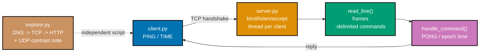

## Goal

Build a small, line-based TCP command server (`PING` -> `PONG`, `TIME` -> a Unix epoch timestamp),
its matching client, and a standalone DNS-to-HTTP explorer script -- combining bind/listen/accept
(co-10), the TCP three-way handshake (co-07), newline-delimited message framing that reassembles
partial reads (co-11), a tiny request/response protocol (co-01), one thread per connected client so
multiple clients are served concurrently, graceful-close detection, and a full DNS -> TCP -> HTTP
narration with a UDP contrast note, all in three runnable Python files. Every mechanism this
capstone combines was already taught individually somewhere in the Beginner, Intermediate, or
Advanced tiers of this topic -- Example 81 in particular is this capstone's direct rehearsal.



## Concepts exercised

- [x] TCP client-server model (co-01) -- `server.py`/`client.py` are a real, if minimal, instance of
      "one process listens, another connects"
- [x] TCP three-way handshake (co-07) -- `socket.create_connection` in `client.py`, `sock.accept()`
      in `server.py`
- [x] `bind`/`listen`/`accept`, `SO_REUSEADDR` (co-10) -- `server.py`'s `run_server()`, identical to
      Example 29/38's pattern
- [x] message framing over a byte stream (co-11) -- `read_line()`'s newline-delimited reassembly,
      shared verbatim between `server.py` and `client.py`
- [x] a small application-level protocol (co-01) -- `handle_command()`'s `PING`/`TIME`/error-reply
      logic, extending Example 36 and Example 81 directly
- [x] one thread per connected client (co-10) -- `run_server()` serves `client_count` clients
      concurrently, exactly like Example 76/81
- [x] graceful close detection (co-07) -- an empty `recv()` in `read_line()` ends a client's session
      cleanly, without a crash
- [x] DNS resolution, TCP connect, and HTTP over one connection, narrated (co-03, co-07, co-12) --
      `explore.py`'s three staged functions
- [x] UDP contrast, in prose (co-08, co-09) -- `explore.py`'s `print_udp_contrast()`

All colocated code lives under `learning/capstone/code/`: the server in `server.py`, the client in
`client.py`, and the explorer script in `explore.py`. Every listing below is the complete, verbatim
file -- nothing on this page is truncated or paraphrased. Every listing is also fully type-hinted and
passes strict-mode `pyright` (via the colocated `pyrightconfig.json`) with zero errors, zero warnings.

## Step 1: `server.py` -- bind, listen, and serve clients concurrently

_exercises co-10, co-07, co-11, co-01_

`run_server()` binds and listens exactly like Example 29, then loops `accept()`ing connections and
spawning one `threading.Thread` per client -- Example 76's concurrency pattern, generalized to an
arbitrary `client_count`. `read_line()` and `handle_command()` are the exact framing and protocol
logic Examples 33 and 36 introduced separately, combined here into one server.

**`learning/capstone/code/server.py`** (complete file)

```python
"""Capstone: line-based TCP command server -- PING/PONG, TIME, graceful multi-client handling.

Combines every socket mechanism this topic taught into one runnable program: bind/listen/
accept (co-10), a three-way-handshake TCP connection per client (co-07), newline-delimited
request/response framing that reassembles partial reads (co-11), a small command protocol
(co-01), SO_REUSEADDR so repeated runs never collide on a leftover TIME_WAIT socket (co-10),
one thread per connected client so multiple clients are served concurrently (co-10, co-01),
and a graceful-close detection loop that ends cleanly the instant a client disconnects (co-07).
"""

from __future__ import annotations

import argparse
import socket
import threading
import time

HOST = "127.0.0.1"
PORT = 50100  # => an ephemeral port distinct from every worked example's port (co-05)


def read_line(sock: socket.socket, buffer: bytearray) -> bytes | None:
    """Read one newline-delimited line from ``sock``, buffering partial reads across calls.

    Returns the line (without the trailing newline) once a full line has arrived, or
    ``None`` if the peer closed its side before sending one -- co-07/co-11.
    """
    while b"\n" not in buffer:  # => keep reading until a full line has actually arrived
        chunk = sock.recv(256)  # => a single recv() may return only PART of a line
        if not chunk:  # => an empty recv() means the peer closed -- co-07's graceful signal  # fmt: skip
            return None
        buffer.extend(chunk)  # => accumulate bytes across possibly many small reads
    line, _, rest = buffer.partition(b"\n")  # => split off exactly one line, keep the remainder  # fmt: skip
    buffer[:] = rest  # => whatever came AFTER the newline stays buffered for the NEXT call  # fmt: skip
    return bytes(line)  # => bytearray.partition returns bytearray -- normalize to plain bytes  # fmt: skip


def handle_command(command: bytes) -> bytes:
    """Map one command line to its reply -- co-01: the server, not the client, decides validity."""
    if command == b"PING":  # => the simplest possible liveness check
        return b"PONG"
    if command == b"TIME":  # => a command that returns SERVER-side state, not an echo
        return str(int(time.time())).encode()  # => Unix epoch seconds, as ASCII digits
    return b"ERR unknown command: " + command  # => a graceful reply, never a crash (co-11)  # fmt: skip


def handle_client(conn: socket.socket, addr: tuple[str, int]) -> None:
    """Serve one client's full session: read/reply until it disconnects, then close cleanly."""
    with conn:
        buffer = bytearray()  # => this connection's own leftover-bytes buffer (co-11)
        while True:  # => co-07: loops until the CONNECTION itself signals it is finished  # fmt: skip
            command = read_line(conn, buffer)
            if command is None:  # => co-07: the client closed -- exit this loop gracefully  # fmt: skip
                break
            reply = handle_command(command)
            conn.sendall(reply + b"\n")
    print(f"connection from {addr} closed gracefully")


def run_server(host: str, port: int, client_count: int | None) -> None:
    """Bind, listen, and serve clients on their own threads until ``client_count`` have been
    served (or forever, if ``client_count`` is ``None``) -- co-10.
    """
    with socket.socket(socket.AF_INET, socket.SOCK_STREAM) as sock:
        # SO_REUSEADDR: an immediate restart can reuse a port stuck in TIME_WAIT (co-10).
        sock.setsockopt(socket.SOL_SOCKET, socket.SO_REUSEADDR, 1)
        sock.bind((host, port))  # => claims (host, port) for this process
        sock.listen(5)  # => a backlog of 5 pending, not-yet-accepted connections
        print(f"listening on {host}:{port}", flush=True)  # => the signal client.py waits for  # fmt: skip

        handlers: list[threading.Thread] = []
        served = 0
        while client_count is None or served < client_count:
            conn, addr = sock.accept()  # => co-07: blocks for the next client's handshake  # fmt: skip
            handler = threading.Thread(target=handle_client, args=(conn, addr))
            handler.start()  # => co-10: each client is served concurrently, on its own thread  # fmt: skip
            handlers.append(handler)
            served += 1
        for handler in handlers:
            handler.join()  # => waits for every spawned handler thread to finish


def main() -> None:
    parser = argparse.ArgumentParser(description="Line-based TCP command server.")
    parser.add_argument("--host", default=HOST)
    parser.add_argument("--port", type=int, default=PORT)
    parser.add_argument(
        "--clients",
        type=int,
        default=None,
        help="serve exactly this many clients, then exit (default: run forever)",
    )
    args = parser.parse_args()
    run_server(args.host, args.port, args.clients)


if __name__ == "__main__":
    main()
```

**Key takeaway**: `run_server()`'s `--clients` flag lets this exact same server run either as a
bounded, self-terminating demo (`--clients 2`) or as a real, long-running server (`--clients` omitted)
-- the same code serves both purposes, which is exactly what let this capstone be verified end to end
without leaving a stray background process running.

## Step 2: `client.py` -- send PING and TIME, then shut down gracefully

_exercises co-07, co-11_

`client.py` shares `read_line()`'s exact framing logic with `server.py` -- both sides must agree on
how a "line" is delimited -- and sends two commands over ONE connection, exactly like Example 35's
multi-message session.

**`learning/capstone/code/client.py`** (complete file)

```python
"""Capstone: line-based TCP command client -- sends PING and TIME, then shuts down gracefully."""

from __future__ import annotations

import argparse
import socket

HOST = "127.0.0.1"
PORT = 50100  # => must match server.py's bound port exactly (co-05)


def read_line(sock: socket.socket, buffer: bytearray) -> bytes | None:
    """The identical framing helper server.py uses -- co-11: both sides agree on the framing."""
    while b"\n" not in buffer:
        chunk = sock.recv(256)
        if not chunk:
            return None
        buffer.extend(chunk)
    line, _, rest = buffer.partition(b"\n")
    buffer[:] = rest
    return bytes(line)


def run_client(host: str, port: int, commands: list[bytes]) -> list[bytes]:
    """Connect once, send every command in ``commands`` in order, and return every reply."""
    replies: list[bytes] = []
    with socket.create_connection((host, port), timeout=5) as sock:  # => co-07: the TCP handshake  # fmt: skip
        buffer = bytearray()
        for command in commands:  # => co-11: many messages, ONE persistent connection
            sock.sendall(command + b"\n")
            reply = read_line(sock, buffer)
            if reply is None:  # => the server closed unexpectedly -- surfaced, not swallowed  # fmt: skip
                raise ConnectionError("server closed before replying")
            replies.append(reply)
        # Exiting this `with` block calls close() -- co-07: this IS the graceful shutdown
        # server.py's read_line() detects as an empty recv() and handles cleanly.
    return replies


def main() -> None:
    parser = argparse.ArgumentParser(description="Line-based TCP command client.")
    parser.add_argument("--host", default=HOST)
    parser.add_argument("--port", type=int, default=PORT)
    args = parser.parse_args()

    replies = run_client(args.host, args.port, [b"PING", b"TIME"])
    print(f"PING -> {replies[0]!r}")
    print(f"TIME -> {replies[1]!r}")

    assert replies[0] == b"PONG"  # => confirms the fixed-response command
    assert replies[1].isdigit()  # => confirms TIME returned a plausible epoch timestamp
    print("capstone client OK")


if __name__ == "__main__":
    main()
```

**Verify**: run the server in the background with `--clients 2`, then run `client.py` twice as two
separate processes.

```text
$ python3 server.py --clients 2 &
listening on 127.0.0.1:50100
$ python3 client.py
PING -> b'PONG'
TIME -> b'1784025660'
capstone client OK
$ python3 client.py
PING -> b'PONG'
TIME -> b'1784025661'
capstone client OK
```

**Output** (server's log, after both clients finished, genuinely captured):

```text
listening on 127.0.0.1:50100
connection from ('127.0.0.1', 49972) closed gracefully
connection from ('127.0.0.1', 49986) closed gracefully
```

**Key takeaway**: Two ENTIRELY SEPARATE `client.py` processes connected, each got its own thread on
the server, each completed its `PING`/`TIME` exchange correctly (with `TIME` returning a slightly
later timestamp for the second client), and both connections closed gracefully -- the server's log
confirms both, in order, with no error and no hang.

## Step 3: `explore.py` -- narrate DNS, TCP, and HTTP for a real request

_exercises co-03, co-07, co-12, co-08, co-09_

`explore.py` is independent of `server.py`/`client.py` entirely -- it resolves a REAL host
(`example.com` by default), opens a real TCP connection, issues a hand-crafted HTTP GET, and prints a
closing prose note contrasting the whole journey with what would differ over UDP, tying together
Example 70's DNS/TCP/HTTP timing narration and Example 82's UDP contrast note into one composed
script.

**`learning/capstone/code/explore.py`** (complete file)

```python
"""Capstone: resolve a real host, open a TCP socket, issue a GET, narrate DNS -> TCP -> HTTP.

Ties together every layer this topic covered, in the order a real request actually
travels: DNS resolution (co-03), a TCP three-way handshake (co-07), and an HTTP
request/response exchanged over that connection (co-12, co-13) -- with a UDP contrast
note (co-08, co-09) explaining, in prose, how this same journey would differ over UDP.
"""

from __future__ import annotations

import argparse
import socket
import time


def resolve(host: str) -> str:
    """Stage 1 -- DNS: translate a hostname to an IPv4 address (co-03)."""
    start = time.perf_counter()
    address = socket.gethostbyname(host)  # => a real, blocking resolver call
    elapsed_ms = (time.perf_counter() - start) * 1000
    print(f"[DNS]  {host} -> {address}  ({elapsed_ms:.1f} ms)")
    return address


def open_tcp_connection(address: str, port: int) -> socket.socket:
    """Stage 2 -- TCP: open a reliable, ordered byte-stream connection (co-07)."""
    start = time.perf_counter()
    sock = socket.create_connection((address, port), timeout=5)  # => the three-way handshake  # fmt: skip
    elapsed_ms = (time.perf_counter() - start) * 1000
    print(f"[TCP]  connected to {address}:{port}  ({elapsed_ms:.1f} ms)")
    return sock


def issue_get(sock: socket.socket, host: str, path: str) -> str:
    """Stage 3 -- HTTP: send a hand-crafted GET and return the response's status line (co-12)."""
    start = time.perf_counter()
    request = f"GET {path} HTTP/1.1\r\nHost: {host}\r\nConnection: close\r\n\r\n"
    sock.sendall(request.encode("ascii"))
    response = b""
    while True:  # => co-11: loop until the server closes (Connection: close makes this safe)  # fmt: skip
        chunk = sock.recv(4096)
        if not chunk:
            break
        response += chunk
    sock.close()
    elapsed_ms = (time.perf_counter() - start) * 1000
    status_line = response.split(b"\r\n", 1)[0].decode()
    print(f"[HTTP] {status_line}  ({elapsed_ms:.1f} ms)")
    return status_line


def print_udp_contrast() -> None:
    """A prose note contrasting this TCP/HTTP journey with the same journey over UDP (co-08, co-09)."""
    print("[UDP contrast]")
    print(
        "  The DNS lookup in Stage 1 itself almost certainly traveled over UDP: a single,"
        " connectionless query datagram out, a single response datagram back, no handshake"
        " at all -- exactly co-08's 'no delivery guarantee' definition. If that datagram had"
        " been dropped, gethostbyname() would simply have retried or raised an error; there"
        " is no equivalent of TCP's SYN/SYN-ACK/ACK to renegotiate. Stages 2 and 3 above, by"
        " contrast, ran over TCP: one handshake, then a RELIABLE, ORDERED byte stream --"
        " which is exactly why HTTP (a byte-stream-oriented, framed protocol, co-11) is built"
        " on TCP rather than UDP: HTTP needs the ordering and delivery guarantee UDP does not"
        " provide (co-09)."
    )


def explore(host: str, port: int, path: str) -> str:
    """Run all three stages against a real host and return the final status line."""
    print(f"=== exploring {host}{path} ===")
    address = resolve(host)
    sock = open_tcp_connection(address, port)
    status_line = issue_get(sock, host, path)
    print_udp_contrast()
    return status_line


def main() -> None:
    parser = argparse.ArgumentParser(description="Narrate DNS -> TCP -> HTTP for a real host.")  # fmt: skip
    parser.add_argument("--host", default="example.com")
    parser.add_argument("--port", type=int, default=80)
    parser.add_argument("--path", default="/")
    args = parser.parse_args()

    status_line: str = explore(args.host, args.port, args.path)
    assert status_line.startswith("HTTP/1.1 200")  # => confirms a real, successful response  # fmt: skip
    print("explore.py OK")


if __name__ == "__main__":
    main()
```

**Run**: `python3 explore.py`

**Output** (genuinely captured):

```text
=== exploring example.com/ ===
[DNS]  example.com -> 104.20.23.154  (12.8 ms)
[TCP]  connected to 104.20.23.154:80  (22.3 ms)
[HTTP] HTTP/1.1 200 OK  (30.1 ms)
[UDP contrast]
  The DNS lookup in Stage 1 itself almost certainly traveled over UDP: a single, connectionless query datagram out, a single response datagram back, no handshake at all -- exactly co-08's 'no delivery guarantee' definition. If that datagram had been dropped, gethostbyname() would simply have retried or raised an error; there is no equivalent of TCP's SYN/SYN-ACK/ACK to renegotiate. Stages 2 and 3 above, by contrast, ran over TCP: one handshake, then a RELIABLE, ORDERED byte stream -- which is exactly why HTTP (a byte-stream-oriented, framed protocol, co-11) is built on TCP rather than UDP: HTTP needs the ordering and delivery guarantee UDP does not provide (co-09).
explore.py OK
```

**Key takeaway**: `explore.py` needed no server of its own at all -- it speaks directly to a real,
already-running remote server (`example.com`), confirming this script exercises the CLIENT side of
everything `server.py`/`client.py` exercise on the server side.

**Why it matters**: The staged timings (`DNS` fastest, `TCP` next, `HTTP` last, each CUMULATIVE) are
this capstone's own instance of Example 70's narration -- and the closing UDP contrast note ties the
entire topic's two transport protocols together in one place, in prose, right where a reader has just
finished watching TCP's guarantees do real work.

## Step 4: Type-check strictly

_exercises DD-39 (typed Python)_

Every file in `learning/capstone/code/` is fully type-hinted with PEP 585 built-in generics (`list[bytes]`, `tuple[str, int]`, `bytes | None`) and no untyped `Any` leaks. `server.py`, `client.py`, and
`explore.py` all pass strict-mode `pyright` -- the strictest mode this topic's DD-39 rule requires,
one level above the `basic` mode the other 82 worked examples are held to. `pyright` has no
`--strict`/`--typeCheckingMode` CLI flag (per DD-39); strict mode is enabled via the colocated
`pyrightconfig.json` instead.

**`learning/capstone/code/pyrightconfig.json`**

```json
{
  "typeCheckingMode": "strict",
  "pythonVersion": "3.13"
}
```

**Verify**

```text
$ pyright learning/capstone/code/
0 errors, 0 warnings, 0 informations
```

**Key takeaway**: Strict mode caught nothing left to fix -- every parameter, return type, and
`Optional`/union value (`bytes | None` in `read_line()`, `int | None` in `run_server()`'s
`client_count`) was already explicit by the time this capstone was written, not retrofitted
afterward.

## Acceptance criteria

- `python3 server.py --clients N &` followed by `python3 client.py` (run `N` times, as separate
  processes) exits `0` each time, printing `PING -> b'PONG'` and a `TIME -> b'<digits>'` line matching
  Step 2's Output block shape.
- The server's own log prints exactly one `connection from (...) closed gracefully` line per client,
  in the order those clients connected.
- `python3 explore.py` exits `0` and prints all four staged sections (`[DNS]`, `[TCP]`, `[HTTP]`,
  `[UDP contrast]`) shown in Step 3's Output block, ending with `explore.py OK`.
- `pyright learning/capstone/code/` (strict mode via the colocated `pyrightconfig.json`) reports zero
  errors and zero warnings.
- No background process from any of `server.py`, `client.py`, or `explore.py` is left running after
  this capstone's verification completes.
- Every listing on this page (`server.py`, `client.py`, `explore.py`) is the complete file, runnable
  exactly as shown -- nothing here is a fragment that depends on code the page does not also show.

## Done bar

This capstone is runnable end to end: a reader who copies the three files above into a
`learning/capstone/code/`-shaped directory, runs `python3 server.py --clients 2 &` followed by
`python3 client.py` twice, and separately runs `python3 explore.py`, reaches output blocks matching
Step 2 and Step 3 above, verified against a real CPython 3.13 interpreter run (not merely described).
Every mechanism combined here -- bind/listen/accept and `SO_REUSEADDR` (co-10), the TCP handshake
(co-07), newline-delimited framing (co-11), a small command protocol (co-01), thread-per-client
concurrency (co-10), graceful close detection (co-07), and a full DNS -> TCP -> HTTP narration with a
UDP contrast note (co-03, co-08, co-09) -- traces to a worked example already taught earlier in this
topic's Beginner, Intermediate, or Advanced tiers; no new networking idea was needed to write this
capstone.

---

← Previous: [Advanced Examples](../advanced.md) · Next: [Drilling](../../drilling/overview.md) →
