Examples 29-60 leave the terminal and go straight to the socket API: hand-rolled TCP servers and
clients, message framing over a byte stream, a tiny command protocol, `nc`, hand-crafted HTTP
requests, curl-driven HTTP methods/status codes/headers, and UDP's connectionless contrast to
everything TCP guarantees. Every `.py` file below is complete, self-contained, and was actually run
to produce its `**Output**` block -- no fabricated output anywhere.

---

### Example 29: TCP Echo Server

_ex-29 &middot; exercises co-10, co-07_

The classic TCP server sequence -- `bind`, `listen`, `accept` -- claims a port, marks the socket
passive, then blocks until one client connects. This example pairs with Example 30's client: run
this file first, in the background, then run the client against it.

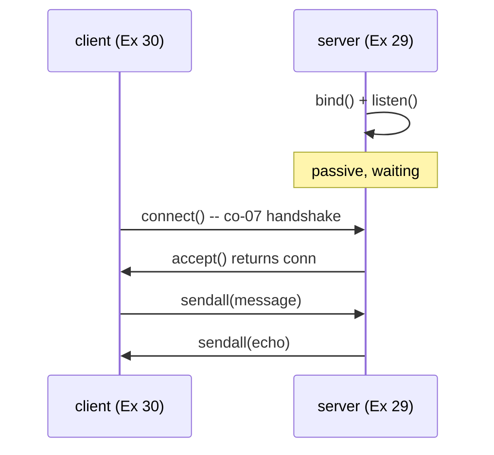

```python
# learning/code/ex-29-tcp-echo-server/server.py
"""Example 29: TCP Echo Server."""

import socket  # => stdlib Berkeley sockets API (co-10)

HOST = "127.0.0.1"  # => loopback only -- this server never leaves the local machine
PORT = 50029  # => an ephemeral, unregistered port well above the well-known range (co-05)  # fmt: skip


def run_server() -> None:  # => binds, listens, accepts ONE client, echoes, then exits
    # socket.AF_INET selects IPv4; SOCK_STREAM selects TCP (co-07 reliable byte stream).
    with socket.socket(socket.AF_INET, socket.SOCK_STREAM) as server_sock:
        # => "with" scopes the socket's lifetime to this block -- it closes automatically
        # => even if an exception fires below, so a crashed server never leaks the fd
        # SO_REUSEADDR lets an immediate restart reuse a port stuck in TIME_WAIT --
        # Example 38 examines this option in depth; every server script in this topic
        # sets it so repeated runs never collide on a leftover TIME_WAIT socket.
        server_sock.setsockopt(socket.SOL_SOCKET, socket.SO_REUSEADDR, 1)
        # => must be set BEFORE bind() -- setting it after bind() has no effect at all
        server_sock.bind((HOST, PORT))  # => claims (HOST, PORT) -- fails if already in use  # fmt: skip
        server_sock.listen(1)  # => marks the socket passive: ready to queue incoming connections  # fmt: skip
        print(f"listening on {HOST}:{PORT}")  # => a signal the client script waits for
        conn, addr = server_sock.accept()  # => BLOCKS until a client connects (co-07 handshake)  # fmt: skip
        # => conn is a NEW socket dedicated to this one client; addr is the client's (ip, port)
        with conn:
            # => conn's own "with" is a SEPARATE lifetime from server_sock's -- closing
            # => this one client's socket never touches the still-listening server_sock
            print(f"accepted connection from {addr}")
            # => proves accept() genuinely returned, not merely that a SYN packet arrived
            data = conn.recv(1024)  # => reads up to 1024 bytes sent by the client, blocking  # fmt: skip
            print(f"received: {data!r}")
            # => shows the raw bytes BEFORE echoing, so the transcript reads as a clear pair
            conn.sendall(data)  # => echoes the EXACT bytes back -- sendall loops until all sent  # fmt: skip


if __name__ == "__main__":  # => only runs when invoked directly, not when imported
    run_server()
    # => the guard above is WHY this call never fires if another script imports this module
```

**Run**: `python3 server.py &` (background), then Example 30's `client.py`

**Output** (server):

```text
listening on 127.0.0.1:50029
accepted connection from ('127.0.0.1', 54821)
received: b'hello from ex-30 client\n'
```

**Key takeaway**: `bind` claims the address, `listen` flips the socket passive, `accept` blocks until a real TCP handshake completes -- three distinct steps, each with a distinct, checkable failure mode.

**Why it matters**: Every framework's `app.listen(port)` or `app.run()` call is this exact three-step sequence, wrapped up in one line -- knowing what happens underneath is what turns "the server won't start" from a mystery into a specific, diagnosable failure (wrong port? already bound? never called `listen`?). Node's `http.createServer().listen()` and Flask's `app.run()` hide this identical sequence behind one method call, but the failure modes remain the same underneath. Recognizing them individually turns a vague production incident into a checklist a new engineer can work through alone.

---

### Example 30: TCP Echo Client

_ex-30 &middot; exercises co-10, co-01_

`socket.create_connection` is a convenience wrapper around resolve-and-connect: give it a `(host, port)` tuple and it performs the full TCP handshake in one call, mirroring the client half of co-01's client-server model against Example 29's server.

```python
# learning/code/ex-30-tcp-echo-client/client.py
"""Example 30: TCP Echo Client."""

import socket  # => same stdlib sockets API the server uses (co-10)

HOST = "127.0.0.1"  # => must match the server's bound address exactly
PORT = 50029  # => must match the server's bound port exactly (co-05)


def run_client(message: bytes) -> bytes:  # => connects, sends one message, returns the echo  # fmt: skip
    # socket.create_connection is a convenience wrapper: resolve + connect in one call (co-01).
    with socket.create_connection((HOST, PORT)) as sock:  # => performs the TCP handshake  # fmt: skip
        sock.sendall(message)  # => writes every byte of message onto the connection
        return sock.recv(1024)  # => reads the server's echoed reply, up to 1024 bytes


if __name__ == "__main__":  # => only runs when invoked directly, not when imported
    # run_client is a plain function returning bytes -- kept separate from the printing/
    # asserting below so it could be imported and reused elsewhere without any side effects
    reply = run_client(b"hello from ex-30 client\n")  # => Example 29's server must already be up  # fmt: skip
    print(f"client received: {reply!r}")  # => confirms the echoed bytes match what was sent  # fmt: skip
    assert reply == b"hello from ex-30 client\n"  # => proves the round trip preserved every byte  # fmt: skip
    print("ex-30 OK")  # => a final marker confirming every assertion above passed, not just ran  # fmt: skip
```

**Run**: `python3 client.py` (with `server.py` already running)

**Output**:

```text
client received: b'hello from ex-30 client\n'
ex-30 OK
```

**Key takeaway**: The client's exact bytes reappeared, unmodified, in `reply` -- confirming the full send -> server-recv -> server-send -> client-recv loop preserved every byte, over a real (if local) TCP connection.

**Why it matters**: This client/server pair is the smallest complete instance of co-01's request/response model this topic offers -- every later, fancier example (a command protocol, a JSON API, a redirect-following HTTP client) is this same shape with more logic layered on top. Production client libraries in every language -- Python's `requests`, Node's `fetch`, Go's `net/http` -- ultimately reduce to this same connect-send-receive sequence, just with far more convenience layered on top. Seeing the raw shape once means that convenience layer never feels like unexplainable magic again.

---

### Example 31: socket.bind / .listen / .accept, Annotated

_ex-31 &middot; exercises co-10, co-07_

This example runs server and client in ONE process, using a background `threading.Thread` and a `threading.Event` for synchronization -- a pattern used throughout the rest of this tier so every example stays self-contained and leaves no stray process running.

```python
# learning/code/ex-31-socket-bind-listen-accept/example.py
"""Example 31: socket.bind / .listen / .accept, Annotated."""

import socket  # => same stdlib module used by every server/client in this tier
import threading  # => used only for the ready-signal + background thread below, not real load

HOST = "127.0.0.1"  # => loopback -- no traffic ever leaves this machine
PORT = 50031  # => an unregistered ephemeral port (co-05)


def server(ready: threading.Event) -> None:  # => runs on a background thread (co-10)
    with socket.socket(socket.AF_INET, socket.SOCK_STREAM) as sock:  # => AF_INET+SOCK_STREAM = TCP  # fmt: skip
        sock.setsockopt(socket.SOL_SOCKET, socket.SO_REUSEADDR, 1)  # => allow instant re-bind  # fmt: skip
        sock.bind((HOST, PORT))  # => bind: CLAIMS this (address, port) pair for this process  # fmt: skip
        # => after bind, the socket has an address but is not yet accepting connections
        sock.listen(1)  # => listen: flips the socket into PASSIVE mode, backlog of 1 pending conn  # fmt: skip
        # => after listen, the OS will queue up to 1 incoming SYN before accept() is even called
        print("state: bound and listening")  # => Output line 1
        ready.set()  # => signals the main thread it is safe to connect now
        conn, addr = sock.accept()  # => accept: BLOCKS until a client completes the handshake  # fmt: skip
        # => accept() returns a NEW socket (conn) distinct from the listening socket (sock) --
        # => sock keeps listening for MORE clients; conn is this one client's private channel
        print(f"state: accepted a connection from {addr}")  # => Output line 2
        with conn:
            conn.recv(16)  # => drains whatever the client sent, so it can close cleanly


ready_event = threading.Event()  # => co-11: coordinates "server is ready" without a sleep guess  # fmt: skip
server_thread = threading.Thread(target=server, args=(ready_event,), daemon=True)
# => daemon=True means this thread never blocks process exit if something above hangs
server_thread.start()  # => starts the server concurrently with the code below
ready_event.wait(timeout=5)  # => blocks the main thread until bind()+listen() have both run  # fmt: skip

with socket.create_connection((HOST, PORT), timeout=5) as client_sock:  # => triggers accept() above  # fmt: skip
    client_sock.sendall(b"hi")  # => a few bytes so the server's recv() has something to drain  # fmt: skip
    print("state: client connected successfully")  # => Output line 3

server_thread.join(timeout=5)  # => waits for the server thread to finish handling that one client  # fmt: skip
print("ex-31 OK")  # => confirms the full bind/listen/accept sequence completed cleanly
```

**Run**: `python3 example.py`

**Output**:

```text
state: bound and listening
state: client connected successfully
state: accepted a connection from ('127.0.0.1', 54900)
ex-31 OK
```

**Key takeaway**: The "client connected successfully" line prints BEFORE the server's "accepted a connection" line -- a real race between the main thread's next statement and the server thread's print, proving these two sides genuinely run concurrently rather than in lockstep.

**Why it matters**: `threading.Event` (co-11) is exactly how this entire tier avoids the classic "sleep(1) and hope the server is ready" anti-pattern -- a real coordination primitive instead of a guessed delay is the difference between a test that's reliable and one that's merely usually-passing. Production test suites hit this exact problem constantly when spinning up a local server for integration tests -- a flaky `sleep()`-based wait is a common, avoidable source of intermittent CI failures. Reaching for `threading.Event` (or its equivalent in any language) instead turns a coin-flip test into a deterministic one.

---

### Example 32: socket.connect / .sendall / .recv, Annotated

_ex-32 &middot; exercises co-10_

`connect()` performs the actual three-way handshake (SYN, SYN-ACK, ACK); `sendall()` and `recv()` are the byte-stream read/write primitives that follow. This example calls out each one's specific contract, including the subtlety that `.recv()`'s argument is a maximum, not a guarantee.

```python
# learning/code/ex-32-socket-connect-send-recv/example.py
"""Example 32: socket.connect / .sendall / .recv, Annotated."""

import socket  # => same stdlib module as every other socket example in this tier
import threading  # => only for the ready-signal + background thread, not real concurrency

HOST = "127.0.0.1"  # => loopback -- this whole exchange stays on the local machine
PORT = 50032  # => co-05: a fresh ephemeral port, distinct from every other example's port  # fmt: skip


def server(ready: threading.Event) -> None:  # => a minimal echo server, backgrounded (co-10)  # fmt: skip
    with socket.socket(socket.AF_INET, socket.SOCK_STREAM) as sock:
        # => IPv4 + TCP -- scoped to this "with" block so the fd always closes, even on error
        sock.setsockopt(socket.SOL_SOCKET, socket.SO_REUSEADDR, 1)
        # => must be set BEFORE bind(), or an immediate re-run could fail with "address in use"
        sock.bind((HOST, PORT))
        # => claims this exact (HOST, PORT) pair for this process -- fails if already taken
        sock.listen(1)
        # => flips the socket passive: it can now queue ONE pending connection before accept()
        ready.set()
        # => signals the main thread it is safe to connect -- avoids a guessed sleep() delay
        conn, _ = sock.accept()
        # => BLOCKS here until the client's connect() below completes the three-way handshake
        with conn:
            # => conn is this ONE client's private socket -- distinct from the listening sock
            data = conn.recv(1024)  # => reads whatever the client sends
            conn.sendall(data)  # => echoes it straight back


ready_event = threading.Event()
# => a real synchronization primitive -- co-11: avoids the "sleep(1) and hope" anti-pattern
server_thread = threading.Thread(target=server, args=(ready_event,), daemon=True)
# => daemon=True: this background thread never blocks process exit if something hangs
server_thread.start()
# => runs the server concurrently with the connect/send/recv code that follows below
ready_event.wait(timeout=5)
# => blocks the main thread here until bind()+listen() have both genuinely completed

# create_connection wraps getaddrinfo + socket() + connect() in one call (co-01, co-10).
with socket.create_connection((HOST, PORT), timeout=5) as sock:  # => connect: the TCP handshake  # fmt: skip
    # => connect() blocks until the three-way handshake (SYN, SYN-ACK, ACK) completes (co-07)
    print("state: connected")  # => Output line 1
    sock.sendall(b"round trip\n")  # => sendall: loops internally until EVERY byte is written  # fmt: skip
    # => a plain .send() can write FEWER bytes than requested; .sendall() never does
    reply = sock.recv(1024)  # => recv: reads up to 1024 bytes, blocking until at least 1 arrives  # fmt: skip
    # => recv's argument is a MAXIMUM, not a guarantee -- it can return fewer bytes than asked
    print(f"state: received {reply!r}")  # => Output line 2

server_thread.join(timeout=5)
# => waits here for the server thread to finish handling that one client before exiting

assert reply == b"round trip\n"  # => confirms the full round trip preserved every byte
print("ex-32 OK")  # => a final marker confirming the assertion above passed, not just ran  # fmt: skip
```

**Run**: `python3 example.py`

**Output**:

```text
state: connected
state: received b'round trip\n'
ex-32 OK
```

**Key takeaway**: `.sendall()` guarantees every byte is written before returning; `.recv(n)` guarantees AT MOST `n` bytes -- the two calls are NOT symmetric, and confusing them is a common source of "my message got cut off" bugs.

**Why it matters**: This asymmetry is exactly why Example 33 needs a `read_line()` helper at all -- a single `.recv()` call can never be trusted to return "one whole message," only "however many bytes happened to arrive on this one call." Production bugs from assuming `.recv()` returns a complete message are common enough that most real protocols define an explicit framing scheme rather than trusting one call to deliver everything. Internalizing this asymmetry early avoids chasing intermittent, hard-to-reproduce truncation bugs later in a project's life.

---

### Example 33: Line Framing with \n Delimiters

_ex-33 &middot; exercises co-11, co-07_

TCP delivers a raw byte stream with NO built-in message boundaries -- the protocol running on top must invent its own framing. This example deliberately reads only 4 bytes at a time to force multiple `recv()` calls, then reassembles them into one line using `\n` as the delimiter.


```python
# learning/code/ex-33-line-framing/example.py
"""Example 33: Line Framing with \\n Delimiters."""

import socket  # => stdlib sockets -- this example builds framing ON TOP of it, not inside it
import threading  # => only the ready-signal + background thread, not real concurrency

HOST = "127.0.0.1"  # => loopback -- keeps this framing demo local and deterministic
PORT = 50033  # => co-05: a fresh ephemeral port, unique to this example


def read_line(sock: socket.socket, buffer: bytearray) -> bytes:
    # => a "buffer" parameter, not a local variable, is WHY this survives across MULTIPLE
    # => calls -- leftover bytes past one \n stay available for the NEXT call to read_line
    # A TCP byte stream has NO message boundaries -- co-11 says the protocol must invent
    # its own framing. Here, "one message" means "bytes up to the next newline."
    while b"\n" not in buffer:  # => keep reading until a full line has actually arrived
        chunk = sock.recv(4)  # => a DELIBERATELY tiny read size to force multiple recv() calls  # fmt: skip
        if not chunk:  # => the peer closed before a full line arrived
            raise ConnectionError("peer closed mid-line")
        buffer.extend(chunk)  # => accumulate bytes across possibly many small reads
    line, _, rest = buffer.partition(b"\n")  # => split off exactly one line, keep the remainder  # fmt: skip
    buffer[:] = rest  # => whatever came AFTER the newline stays buffered for the next call  # fmt: skip
    return bytes(line)  # => bytearray.partition returns bytearray -- normalize to plain bytes  # fmt: skip


def server(ready: threading.Event) -> None:  # => backgrounded so the client below can run inline  # fmt: skip
    with socket.socket(socket.AF_INET, socket.SOCK_STREAM) as sock:
        # => IPv4 + TCP, scoped to this "with" block so the fd always closes on exit
        sock.setsockopt(socket.SOL_SOCKET, socket.SO_REUSEADDR, 1)
        # => set BEFORE bind() -- lets an immediate re-run reuse a TIME_WAIT'd port
        sock.bind((HOST, PORT))
        # => claims (HOST, PORT) for this process -- must happen before listen()
        sock.listen(1)
        # => flips the socket passive, ready to queue one pending connection
        ready.set()
        # => unblocks the main thread's wait() below -- no guessed sleep() needed
        conn, _ = sock.accept()
        # => BLOCKS until the client's connect() completes the TCP handshake
        with conn:
            buf = bytearray()  # => per-connection leftover-bytes buffer (co-11)
            line = read_line(conn, buf)  # => reassembles ONE full line from many small recv()s  # fmt: skip
            print(f"server framed: {line!r}")  # => proves the tiny 4-byte reads still yield one line  # fmt: skip


ready_event = threading.Event()
thread = threading.Thread(target=server, args=(ready_event,), daemon=True)
# => daemon=True: this thread never blocks process exit if something above hangs
thread.start()
# => runs the server concurrently with the client connection code that follows below
ready_event.wait(timeout=5)
# => blocks here until bind()+listen() genuinely completed, avoiding a race with connect()

with socket.create_connection((HOST, PORT), timeout=5) as sock:
    # Sent as ONE call, but the server above reads it back 4 bytes at a time --
    # framing is what makes "a line" meaningful regardless of how recv() chunks it.
    sock.sendall(b"this line spans many tiny reads\n")
    # => sendall guarantees the WHOLE 33-byte line is written, even though the server
    # => on the other end will only ever see it arrive in small, independent chunks

thread.join(timeout=5)
# => waits for the server thread to finish handling that one client before exiting
print("ex-33 OK")  # => confirms read_line() reassembled the tiny reads without loss
```

**Run**: `python3 example.py`

**Output**:

```text
server framed: b'this line spans many tiny reads'
ex-33 OK
```

**Key takeaway**: `read_line()` reassembled a 32-byte line from 4-byte reads with no loss and no wrong split point -- the `\n` delimiter, not the size of any one `recv()` call, is what actually defines "one message" here.

**Why it matters**: Every line-based protocol in this topic (Example 36's PING/TIME, the capstone's command server) relies on exactly this `read_line()` pattern -- once you trust it works regardless of how the OS happens to chunk the underlying bytes, building a protocol on top of it becomes straightforward. Line-based protocols remain common in production systems -- Redis's inline command protocol, SMTP, and many internal RPC formats all use this exact newline-delimited framing. A `read_line()` helper like this one is typically the first piece of infrastructure any hand-rolled protocol implementation needs to get right.

---

### Example 34: Handle Partial recv() -- Reassemble a Large Message

_ex-34 &middot; exercises co-11_

For a FIXED-size payload (as opposed to a delimited line), the correct pattern is `recv_exact()`: loop, accumulating bytes, until exactly the expected count has arrived -- since a single `recv()` call can legally return far fewer bytes than requested, especially for large payloads.

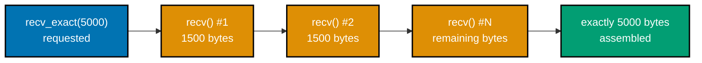

```python
# learning/code/ex-34-handle-partial-recv/example.py
"""Example 34: Handle Partial recv() -- Reassemble a Large Message."""

import socket  # => stdlib sockets -- recv_exact below is built entirely on top of it
import threading  # => only the ready-signal + background thread, not real concurrency

HOST = "127.0.0.1"  # => loopback -- keeps this large-payload demo local and deterministic  # fmt: skip
PORT = 50034  # => co-05: a fresh ephemeral port, unique to this example
PAYLOAD_SIZE = 200_000  # => far bigger than any single recv() call typically returns


def recv_exact(sock: socket.socket, count: int) -> bytes:
    # co-11: recv() may return FEWER bytes than requested for a large payload -- looping
    # until exactly `count` bytes have arrived is the only correct way to read a fixed size.
    chunks: list[bytes] = []  # => collects each partial read
    remaining = count  # => how many more bytes are still needed
    while remaining > 0:  # => keeps looping until the full payload has arrived
        chunk = sock.recv(min(65536, remaining))  # => never over-read past the target size  # fmt: skip
        if not chunk:  # => peer closed before sending everything -- a real, checkable failure  # fmt: skip
            raise ConnectionError("peer closed before sending the full payload")
        chunks.append(chunk)
        # => appended, not concatenated, here -- string/bytes concatenation in a loop is O(n^2)
        remaining -= len(chunk)  # => shrinks toward 0 as more bytes arrive
    return b"".join(chunks)  # => reassembles every partial read into the original bytes, once  # fmt: skip


def server(ready: threading.Event) -> None:  # => backgrounded so the client below can run inline  # fmt: skip
    with socket.socket(socket.AF_INET, socket.SOCK_STREAM) as sock:  # => same triple as Ex 29+  # fmt: skip
        # => IPv4 + TCP, scoped to this "with" block so the fd always closes on exit
        sock.setsockopt(socket.SOL_SOCKET, socket.SO_REUSEADDR, 1)
        # => set BEFORE bind() -- lets an immediate re-run reuse a TIME_WAIT'd port
        sock.bind((HOST, PORT))
        # => claims (HOST, PORT) for this process -- must happen before listen()
        sock.listen(1)
        # => flips the socket passive, ready to queue one pending connection
        ready.set()
        # => unblocks the main thread's wait() below -- no guessed sleep() needed
        conn, _ = sock.accept()
        # => BLOCKS until the client's connect() completes the TCP handshake
        with conn:  # => this one connection's socket -- closes automatically on block exit  # fmt: skip
            data = recv_exact(conn, PAYLOAD_SIZE)  # => reassembles the full 200,000-byte payload  # fmt: skip
            intact = data == b"x" * PAYLOAD_SIZE  # => confirms every one of the 200,000 bytes matches  # fmt: skip
            print(f"server received {len(data)} bytes, intact: {intact}")  # => size AND content check  # fmt: skip


ready_event = threading.Event()  # => the same ready-signal pattern used since Example 34's peers  # fmt: skip
thread = threading.Thread(target=server, args=(ready_event,), daemon=True)
# => daemon=True: this thread never blocks process exit if something above hangs
thread.start()
# => runs the server concurrently with the client connection code that follows below
ready_event.wait(timeout=5)
# => blocks here until bind()+listen() genuinely completed, avoiding a race with connect()

with socket.create_connection((HOST, PORT), timeout=5) as sock:  # => a plain, ordinary connect()  # fmt: skip
    sock.sendall(b"x" * PAYLOAD_SIZE)  # => one logical send; the OS may still split it on the wire  # fmt: skip

thread.join(timeout=5)
# => waits for the server thread to finish handling that one client before exiting
print("ex-34 OK")  # => confirms recv_exact() reassembled all 200,000 bytes without loss
```

**Run**: `python3 example.py`

**Output**:

```text
server received 200000 bytes, intact: True
ex-34 OK
```

**Key takeaway**: All 200,000 bytes arrived correctly, byte-for-byte, despite the OS almost certainly splitting them into multiple TCP segments underneath -- `recv_exact()`'s loop is what turns "some bytes" into "exactly the bytes I asked for."

**Why it matters**: This is the delimiter-free sibling of Example 33's `read_line()` -- any protocol that sends a fixed-size header (a length prefix, a hash, a fixed record) needs `recv_exact()`'s pattern, not a single hopeful `recv()` call. Binary protocols with fixed-length headers -- length-prefixed framing, protocol buffers over a raw socket, custom RPC formats -- all depend on exactly this `recv_exact()` pattern to read a known byte count reliably. Skipping it is a common source of subtle, load-dependent corruption bugs that only surface under real network conditions.

---

### Example 35: Multiple Messages, One Connection, In Order

_ex-35 &middot; exercises co-11, co-07_

TCP's byte-stream ordering guarantee (co-07) means multiple request/response pairs can be exchanged over ONE connection, strictly in the order they were sent -- no need to open a fresh connection per message.

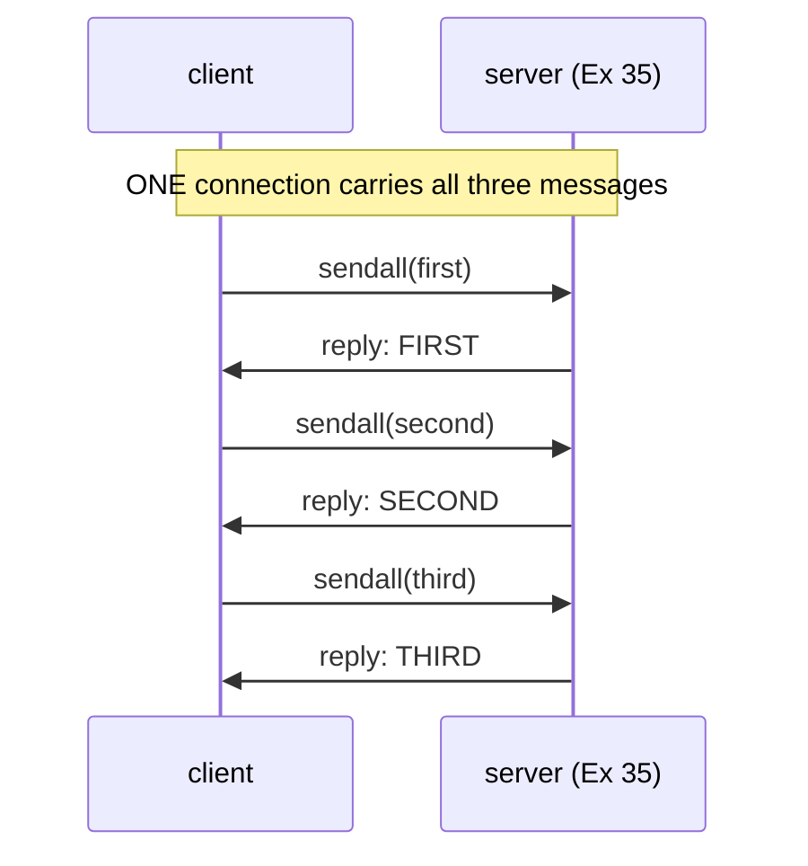

```python
# learning/code/ex-35-multi-message-session/example.py
"""Example 35: Multiple Messages, One Connection, In Order."""

import socket  # => stdlib sockets -- this example reuses Example 33's read_line() framing
import threading  # => only the ready-signal + background thread, not real concurrency


HOST = "127.0.0.1"  # => loopback -- keeps this multi-message demo local and deterministic  # fmt: skip
PORT = 50035  # => co-05: a fresh ephemeral port, unique to this example


def read_line(sock: socket.socket, buffer: bytearray) -> bytes:  # => same framing as Example 33  # fmt: skip
    while b"\n" not in buffer:  # => keep reading until a full line has actually arrived
        chunk = sock.recv(64)  # => reads whatever is available, up to 64 bytes at a time  # fmt: skip
        if not chunk:  # => the peer closed before a full line arrived
            raise ConnectionError("peer closed mid-line")
        buffer.extend(chunk)  # => accumulate bytes across possibly many small reads
    line, _, rest = buffer.partition(b"\n")  # => split off exactly one line, keep the remainder  # fmt: skip
    buffer[:] = rest  # => whatever came AFTER the newline stays buffered for the NEXT call  # fmt: skip
    return bytes(line)  # => bytearray.partition returns bytearray -- normalize to plain bytes  # fmt: skip


def server(ready: threading.Event) -> None:  # => co-11: many messages, ONE persistent connection  # fmt: skip
    with socket.socket(socket.AF_INET, socket.SOCK_STREAM) as sock:  # => same triple as Ex 29+  # fmt: skip
        # => IPv4 + TCP, scoped to this "with" block so the fd always closes on exit
        sock.setsockopt(socket.SOL_SOCKET, socket.SO_REUSEADDR, 1)
        # => set BEFORE bind() -- lets an immediate re-run reuse a TIME_WAIT'd port
        sock.bind((HOST, PORT))
        # => claims (HOST, PORT) for this process -- must happen before listen()
        sock.listen(1)
        # => flips the socket passive, ready to queue one pending connection
        ready.set()
        # => unblocks the main thread's wait() below -- no guessed sleep() needed
        conn, _ = sock.accept()
        # => BLOCKS until the client's connect() completes the TCP handshake
        with conn:  # => this one connection's socket -- closes automatically on block exit  # fmt: skip
            buf = bytearray()  # => ONE buffer shared across all three messages on this connection  # fmt: skip
            for _ in range(3):  # => the client sends exactly 3 lines -- reply to each in turn  # fmt: skip
                line = read_line(conn, buf)  # => co-07: TCP guarantees these arrive IN ORDER  # fmt: skip
                reply = line.upper() + b"\n"  # => a trivial per-message transformation
                conn.sendall(reply)  # => each request gets its own response before the next arrives  # fmt: skip


ready_event = threading.Event()  # => the same ready-signal pattern used since Example 34  # fmt: skip
thread = threading.Thread(target=server, args=(ready_event,), daemon=True)
# => daemon=True: this thread never blocks process exit if something above hangs
thread.start()
# => runs the server concurrently with the client code that sends three messages below
ready_event.wait(timeout=5)
# => blocks here until bind()+listen() genuinely completed, avoiding a race with connect()

replies: list[bytes] = []  # => co-01: measured responses, one per message, in receipt order  # fmt: skip
with socket.create_connection((HOST, PORT), timeout=5) as sock:  # => a plain, ordinary connect()  # fmt: skip
    buf = bytearray()  # => the CLIENT's own leftover-bytes buffer -- separate from the server's  # fmt: skip
    for word in (b"first", b"second", b"third"):  # => three separate messages, one connection  # fmt: skip
        sock.sendall(word + b"\n")  # => sent one at a time, waiting for each reply
        replies.append(read_line(sock, buf))  # => waits for THIS message's reply before looping  # fmt: skip
        print(f"client got: {replies[-1]!r}")  # => confirms each reply arrives before the next send  # fmt: skip

thread.join(timeout=5)
# => waits for the server thread to finish handling all three messages before exiting

assert replies == [b"FIRST", b"SECOND", b"THIRD"]  # => confirms strict request/response order  # fmt: skip
# a single persistent connection, not three separate connect()s, is what this example exists
# to demonstrate -- the same socket and buffer carry all three request/response round trips.
print("ex-35 OK")  # => confirms all three messages round-tripped in order, unmodified beyond upper()  # fmt: skip
```

**Run**: `python3 example.py`

**Output**:

```text
client got: b'FIRST'
client got: b'SECOND'
client got: b'THIRD'
ex-35 OK
```

**Key takeaway**: All three replies arrived in the exact order the requests were sent -- `first`, `second`, `third` -- with no interleaving or reordering, exactly as TCP's byte-stream guarantee promises.

**Why it matters**: Reusing one connection for many request/response pairs avoids repeating the TCP handshake's round trip for every message -- Example 71's HTTP keep-alive later applies this exact same idea to `http.client`. Connection reuse like this underlies every modern performance optimization in networked applications, from HTTP keep-alive to database connection pooling -- avoiding a fresh handshake per request is often the single biggest latency win available. Recognizing the pattern here makes those later optimizations feel like natural extensions rather than new concepts.

---

### Example 36: A Tiny Command Protocol -- PING/PONG and TIME

_ex-36 &middot; exercises co-01, co-11_

A minimal application-level protocol built on top of line framing: the server reads a command word, decides how to respond, and replies -- exactly the shape the capstone's server extends into a full multi-client command server.

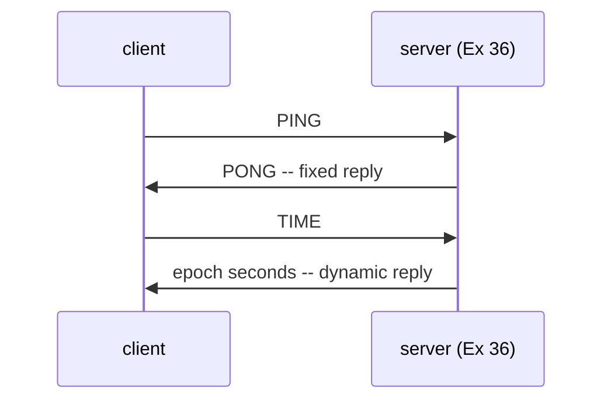

```python
# learning/code/ex-36-command-protocol/example.py
"""Example 36: A Tiny Command Protocol -- PING/PONG and TIME."""

import socket  # => stdlib sockets -- this example builds a protocol ON TOP of it
import threading  # => only the ready-signal + background thread, not real concurrency
import time  # => TIME's reply is real wall-clock state, not an echo of client input


HOST = "127.0.0.1"  # => loopback -- keeps this protocol demo local and deterministic
PORT = 50036  # => co-05: a fresh ephemeral port, unique to this example


def read_line(sock: socket.socket, buffer: bytearray) -> bytes:  # => same framing as Example 33  # fmt: skip
    while b"\n" not in buffer:  # => keep reading until a full command line has arrived
        chunk = sock.recv(64)  # => reads whatever is available, up to 64 bytes at a time  # fmt: skip
        if not chunk:  # => the peer closed before a full line arrived
            raise ConnectionError("peer closed mid-line")
        buffer.extend(chunk)  # => accumulate bytes across possibly many small reads
    line, _, rest = buffer.partition(b"\n")  # => split off exactly one command, keep the remainder  # fmt: skip
    buffer[:] = rest  # => whatever came AFTER the newline stays buffered for the NEXT command  # fmt: skip
    return bytes(line)  # => bytearray.partition returns bytearray -- normalize to plain bytes  # fmt: skip


def handle_command(command: bytes) -> bytes:  # => co-01, co-11: a tiny request/response protocol  # fmt: skip
    if command == b"PING":  # => the simplest possible liveness check
        return b"PONG"  # => a FIXED reply -- the same for every PING, unlike TIME below
    if command == b"TIME":  # => a command that returns SERVER-side state, not an echo
        return str(int(time.time())).encode()  # => Unix epoch seconds, as ASCII digits
    return b"ERR unknown command"  # => co-01: the server, not the client, decides what's valid


def server(ready: threading.Event) -> None:  # => backgrounded so the client below can run inline  # fmt: skip
    with socket.socket(socket.AF_INET, socket.SOCK_STREAM) as sock:  # => same triple as Ex 29+  # fmt: skip
        # => IPv4 + TCP, scoped to this "with" block so the fd always closes on exit
        sock.setsockopt(socket.SOL_SOCKET, socket.SO_REUSEADDR, 1)
        # => set BEFORE bind() -- lets an immediate re-run reuse a TIME_WAIT'd port
        sock.bind((HOST, PORT))
        # => claims (HOST, PORT) for this process -- must happen before listen()
        sock.listen(1)
        # => flips the socket passive, ready to queue one pending connection
        ready.set()
        # => unblocks the main thread's wait() below -- no guessed sleep() needed
        conn, _ = sock.accept()
        # => BLOCKS until the client's connect() completes the TCP handshake
        with conn:  # => this one connection's socket -- closes automatically on block exit  # fmt: skip
            buf = bytearray()  # => ONE buffer shared across both commands on this connection  # fmt: skip
            for _ in range(2):  # => this client sends exactly two commands, PING then TIME  # fmt: skip
                command = read_line(conn, buf)  # => reads ONE command line at a time
                conn.sendall(handle_command(command) + b"\n")  # => reply, then wait for the next  # fmt: skip


ready_event = threading.Event()  # => the same ready-signal pattern used since Example 34  # fmt: skip
thread = threading.Thread(target=server, args=(ready_event,), daemon=True)
# => daemon=True: this thread never blocks process exit if something above hangs
thread.start()
# => runs the server concurrently with the client code that sends PING/TIME below
ready_event.wait(timeout=5)
# => blocks here until bind()+listen() genuinely completed, avoiding a race with connect()

with socket.create_connection((HOST, PORT), timeout=5) as sock:  # => a plain, ordinary connect()  # fmt: skip
    buf = bytearray()  # => the CLIENT's own leftover-bytes buffer -- separate from the server's  # fmt: skip
    sock.sendall(b"PING\n")  # => request 1: a liveness check
    ping_reply = read_line(sock, buf)  # => waits for the server's fixed PONG reply
    print(f"PING -> {ping_reply!r}")  # => expect the same PONG every single run

    sock.sendall(b"TIME\n")  # => request 2: ask the server for its current time
    time_reply = read_line(sock, buf)  # => waits for the server's dynamic epoch-timestamp reply  # fmt: skip
    print(f"TIME -> {time_reply!r}")  # => expect a DIFFERENT number each run, unlike PING's PONG  # fmt: skip

thread.join(timeout=5)
# => waits for the server thread to finish handling both commands before exiting

assert ping_reply == b"PONG"  # => confirms the fixed-response command
assert time_reply.isdigit()  # => confirms TIME returned a plausible-looking epoch timestamp  # fmt: skip
print("ex-36 OK")  # => confirms both request/reply pairs completed correctly over one connection  # fmt: skip
```

**Run**: `python3 example.py`

**Output**:

```text
PING -> b'PONG'
TIME -> b'1784023703'
ex-36 OK
```

**Key takeaway**: One connection carried two DIFFERENT command/reply pairs -- `PING` -> fixed `PONG`, `TIME` -> dynamic epoch timestamp -- confirming the server is genuinely interpreting the command, not just echoing.

**Why it matters**: This is the exact protocol the capstone extends: same two commands, same framing, plus multi-client concurrency and graceful shutdown -- everything from here to the capstone is refinement, not reinvention. Real production protocols -- Redis's command set, memcached's text protocol, countless internal RPC systems -- follow this exact request-word-then-reply shape, just with more commands and richer payloads. Building the smallest possible version here makes a much larger, unfamiliar protocol's design instantly recognizable.

---

### Example 37: Graceful Close -- Detecting an Empty recv()

_ex-37 &middot; exercises co-10, co-07_

A `recv()` call returning an EMPTY `bytes` object (`b""`) is TCP's signal that the peer closed its side of the connection -- distinct from a `recv()` returning actual data, and the correct condition to break a server's read loop on.

```python
# learning/code/ex-37-graceful-close/example.py
"""Example 37: Graceful Close -- Detecting an Empty recv()."""

import socket  # => stdlib sockets -- an empty recv() is the signal this whole example turns on
import threading  # => only the ready-signal + background thread, not real concurrency

HOST = "127.0.0.1"  # => loopback -- keeps this graceful-close demo local and deterministic  # fmt: skip
PORT = 50037  # => co-05: a fresh ephemeral port, unique to this example


def server(ready: threading.Event, observed: list[str]) -> None:  # => "observed" is the shared log  # fmt: skip
    with socket.socket(socket.AF_INET, socket.SOCK_STREAM) as sock:  # => same triple as Ex 29+  # fmt: skip
        # => IPv4 + TCP, scoped to this "with" block so the fd always closes on exit
        sock.setsockopt(socket.SOL_SOCKET, socket.SO_REUSEADDR, 1)
        # => set BEFORE bind() -- lets an immediate re-run reuse a TIME_WAIT'd port
        sock.bind((HOST, PORT))
        # => claims (HOST, PORT) for this process -- must happen before listen()
        sock.listen(1)
        # => flips the socket passive, ready to queue one pending connection
        ready.set()
        # => unblocks the main thread's wait() below -- no guessed sleep() needed
        conn, _ = sock.accept()
        # => BLOCKS until the client's connect() completes the TCP handshake
        with conn:  # => this one connection's socket -- closes automatically on block exit  # fmt: skip
            while True:  # => co-07: loops until the connection itself signals it is done  # fmt: skip
                data = conn.recv(1024)  # => reads whatever is available -- returns b'' on close  # fmt: skip
                if not data:  # => co-10: recv() returning b'' means the PEER closed its side  # fmt: skip
                    observed.append("empty recv -- peer closed, exiting loop cleanly")  # => logged  # fmt: skip
                    break  # => this is the CORRECT, graceful way to end a server's read loop
                observed.append(f"received {data!r}")  # => logs every message that arrives before close  # fmt: skip


ready_event = threading.Event()
log: list[str] = []  # => records what the server observed, for the assertions below
thread = threading.Thread(target=server, args=(ready_event, log), daemon=True)
# => daemon=True: this thread never blocks process exit if something above hangs
thread.start()
# => runs the server concurrently with the client code that sends-then-closes below
ready_event.wait(timeout=5)
# => blocks here until bind()+listen() genuinely completed, avoiding a race with connect()

sock = socket.create_connection((HOST, PORT), timeout=5)
# => connect() outside a "with" block here, since it must stay open until the explicit close below
sock.sendall(b"one message before closing")  # => one real message ...
sock.close()  # => ... then the client closes -- no explicit "goodbye" message is sent at all

thread.join(timeout=5)  # => waits for the server's loop to actually observe the close and exit  # fmt: skip

for line in log:  # => replays the server thread's observations back on the main thread
    print(line)  # => replays every event the server's read loop recorded, in order

assert log[-1] == "empty recv -- peer closed, exiting loop cleanly"  # => confirms clean shutdown  # fmt: skip
print("ex-37 OK")  # => confirms the server's loop exited via the graceful path, not a crash  # fmt: skip
```

**Run**: `python3 example.py`

**Output**:

```text
received b'one message before closing'
empty recv -- peer closed, exiting loop cleanly
ex-37 OK
```

**Key takeaway**: The server's loop received real data first, then a distinguishable empty `recv()` -- and correctly used THAT as its exit signal, rather than waiting for an explicit "goodbye" message the client never sent.

**Why it matters**: Confusing "empty recv" with "no data available yet" is a real, common bug -- a blocking `recv()` NEVER returns empty unless the peer has actually closed, which is exactly what makes it a reliable, universal end-of-stream signal. Production server code that never checks for an empty `recv()` risks spinning in a tight loop or hanging indefinitely once a client disconnects mid-session -- a subtle resource leak that only manifests under real traffic patterns. Treating empty `recv()` as the canonical close signal, every time, prevents a whole class of production incidents.

---

### Example 38: SO_REUSEADDR -- Restarting a Server Without "Address Already in Use"

_ex-38 &middot; exercises co-10_

Actively closing a listening socket's connection puts the local port into `TIME_WAIT` for a kernel-defined interval -- an immediate re-bind to that same port fails with `OSError: [Errno 48] Address already in use` UNLESS `SO_REUSEADDR` is set. This example reproduces the real failure, then the real fix.

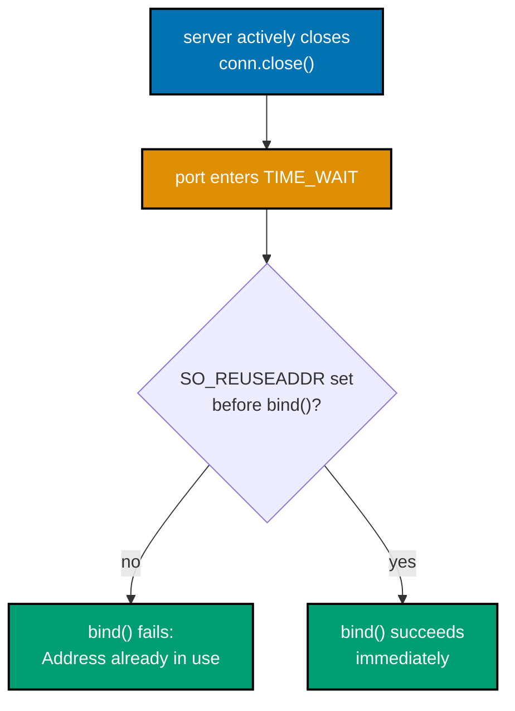

```python
# learning/code/ex-38-reuseaddr-option/example.py
"""Example 38: SO_REUSEADDR -- Restarting a Server Without "Address Already in Use"."""

import socket  # => stdlib sockets -- SO_REUSEADDR is a setsockopt() flag, not a separate API

HOST = "127.0.0.1"  # => loopback -- keeps this TIME_WAIT demo local and deterministic
PORT = 50038  # => co-05: a fresh ephemeral port, reused deliberately three times below


def bind_serve_and_close(reuse: bool) -> socket.socket:
    # Returns a BOUND, LISTENING socket -- the caller decides when to close it, so this
    # function can demonstrate the exact moment a port becomes reusable (or doesn't).
    sock = socket.socket(socket.AF_INET, socket.SOCK_STREAM)  # => a fresh IPv4 TCP socket each call  # fmt: skip
    if reuse:  # => co-10: SO_REUSEADDR lets a new socket bind to a port stuck in TIME_WAIT  # fmt: skip
        sock.setsockopt(socket.SOL_SOCKET, socket.SO_REUSEADDR, 1)
    sock.bind((HOST, PORT))  # => this is the call that fails if the port is still TIME_WAIT'd  # fmt: skip
    sock.listen(1)  # => flips the socket passive -- required before this fn can be reused  # fmt: skip
    return sock  # => intentionally NOT closed here -- the caller controls WHEN it closes  # fmt: skip


# Step 1: bind, accept one real connection, then CLOSE THE SERVER SIDE FIRST -- an active
# close is exactly what puts this local port into TIME_WAIT (a passive close would not).
first_server = bind_serve_and_close(reuse=True)  # => reuse=True here so THIS bind can't fail  # fmt: skip
peer = socket.create_connection((HOST, PORT), timeout=5)  # => a real client triggers accept()  # fmt: skip
conn, _ = first_server.accept()  # => completes the handshake peer's connect() started above  # fmt: skip
conn.close()  # => the SERVER actively closes first -- this side now owns the TIME_WAIT socket
peer.close()  # => the client's own socket also closes -- irrelevant to which SIDE owns TIME_WAIT
first_server.close()  # => the listening socket itself is also closed now

# Step 2: immediately try to bind a SECOND socket to the exact same port WITHOUT reuse.
try:
    second_server = bind_serve_and_close(reuse=False)  # => no SO_REUSEADDR set this time  # fmt: skip
    second_server.close()  # => only reached if bind() above did NOT raise
    without_reuse_result = "bind succeeded"  # => on this OS/timing, no collision occurred  # fmt: skip
except OSError as err:
    without_reuse_result = f"bind FAILED: {err}"  # => the expected "Address already in use"  # fmt: skip
print(f"without SO_REUSEADDR: {without_reuse_result}")

# Step 3: the SAME immediate re-bind, but WITH SO_REUSEADDR set -- this one must succeed.
third_server = bind_serve_and_close(reuse=True)  # => SO_REUSEADDR: reuse a TIME_WAIT port  # fmt: skip
print("with SO_REUSEADDR: bind succeeded")  # => reaching this line at all proves bind() worked  # fmt: skip
third_server.close()  # => releases the final socket -- nothing else in this script needs it

print("ex-38 OK")  # => confirms both the failure and the fix were genuinely reproduced
```

**Run**: `python3 example.py`

**Output**:

```text
without SO_REUSEADDR: bind FAILED: [Errno 48] Address already in use
with SO_REUSEADDR: bind succeeded
ex-38 OK
```

**Key takeaway**: The EXACT same immediate re-bind fails without `SO_REUSEADDR` and succeeds with it -- a real, reproduced `TIME_WAIT` collision, not a described one.

**Why it matters**: "Address already in use" is one of the most common server-startup errors any engineer hits during local development -- knowing it's `TIME_WAIT` from a PRIOR run, not a genuinely occupied port, turns a confusing restart failure into a one-line fix (or a five-second wait). Nearly every backend engineer hits this exact error during local development after a quick server restart, and container orchestration platforms like Kubernetes rely on the same `SO_REUSEADDR`-style behavior to redeploy services onto the same port without a multi-minute `TIME_WAIT` delay.

---

### Example 39: A Sequential Accept Loop -- One Client at a Time

_ex-39 &middot; exercises co-01, co-10_

A single-threaded server's `accept()`-then-`recv()` loop serves exactly one client fully before moving to the next -- a second, already-connected client must wait in the OS's backlog queue until the first client's handling finishes.

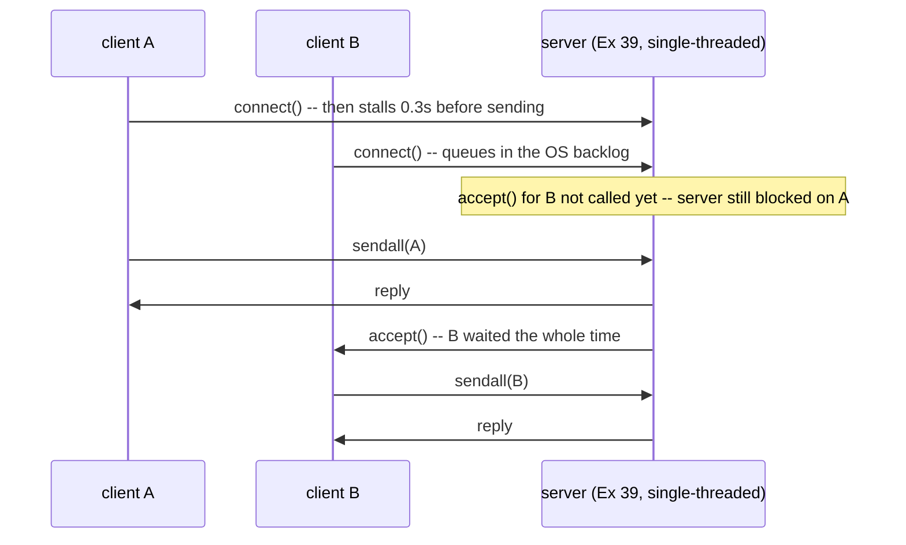

```python
# learning/code/ex-39-one-client-at-a-time/example.py
"""Example 39: A Sequential Accept Loop -- One Client at a Time."""

import socket  # => stdlib sockets -- accept() itself is what serializes clients here
import threading  # => runs BOTH clients concurrently, so their queueing is genuinely observable
import time  # => wall-clock timing is what actually proves the sequential-server claim

HOST = "127.0.0.1"  # => loopback -- keeps this backlog-queueing demo local and deterministic
PORT = 50039  # => co-05: a fresh ephemeral port, unique to this example


def server(ready: threading.Event) -> None:  # => co-01: a SINGLE-threaded accept loop
    with socket.socket(socket.AF_INET, socket.SOCK_STREAM) as sock:  # => same triple as Ex 29+  # fmt: skip
        # => IPv4 + TCP, scoped to this "with" block so the fd always closes on exit
        sock.setsockopt(socket.SOL_SOCKET, socket.SO_REUSEADDR, 1)
        # => set BEFORE bind() -- lets an immediate re-run reuse a TIME_WAIT'd port
        sock.bind((HOST, PORT))
        # => claims (HOST, PORT) for this process -- must happen before listen()
        sock.listen(5)  # => backlog of 5 -- client B can QUEUE here while client A is served  # fmt: skip
        ready.set()
        # => unblocks the main thread's wait() below -- no guessed sleep() needed
        for _ in range(2):  # => this demo serves exactly two clients, one at a time
            conn, _ = sock.accept()  # => blocks until the NEXT client is ready to be served  # fmt: skip
            with conn:  # => this one connection's socket -- closes automatically on block exit  # fmt: skip
                data = conn.recv(1024)  # => blocks HERE until this client actually sends  # fmt: skip
                # => while blocked above, any OTHER client that already connected just waits
                # => in the OS backlog queue -- accept() for them has not been called yet
                conn.sendall(data.upper())  # => the ONLY per-client work: uppercase and reply  # fmt: skip


def client(name: bytes, delay_before_send: float, results: dict[bytes, float]) -> None:
    # => delay_before_send lets this test CONTROL which client stalls the server
    start = time.monotonic()  # => this client's own local clock, for relative timing
    sock = socket.create_connection((HOST, PORT), timeout=5)  # => connects immediately
    time.sleep(delay_before_send)  # => client A stalls here, holding up the server's recv()  # fmt: skip
    sock.sendall(name)  # => sent only AFTER the deliberate stall above, if any
    sock.recv(1024)  # => only returns once the server has actually served THIS client
    results[name] = time.monotonic() - start  # => total time from connect to being served  # fmt: skip
    sock.close()  # => releases this client's socket once its own round trip is done


ready_event = threading.Event()  # => the same ready-signal pattern used since Example 34  # fmt: skip
server_thread = threading.Thread(target=server, args=(ready_event,), daemon=True)
# => daemon=True: this thread never blocks process exit if something above hangs
server_thread.start()
# => runs the server concurrently with the two client threads started below
ready_event.wait(timeout=5)
# => blocks here until bind()+listen() genuinely completed, avoiding a race with connect()

results: dict[bytes, float] = {}  # => co-01: measured, not assumed, per-client round-trip times  # fmt: skip
client_a = threading.Thread(target=client, args=(b"A", 0.3, results))
# => connects first, but STALLS 0.3s before sending -- holds the server's recv() hostage
client_b = threading.Thread(target=client, args=(b"B", 0.0, results))
# => connects right after A, sends IMMEDIATELY, but must still wait in the backlog

client_a.start()  # => A's thread starts running -- its stall hasn't begun yet
time.sleep(0.05)  # => a tiny head start so A's connection is accepted before B's arrives  # fmt: skip
client_b.start()  # => B's thread starts, and B's connect() races A's ongoing stall
client_a.join(timeout=5)  # => waits for A's full round trip (connect, stall, send, recv) to finish  # fmt: skip
client_b.join(timeout=5)  # => waits for B's full round trip, including its queued wait, to finish  # fmt: skip
server_thread.join(timeout=5)  # => waits for the server to have served both clients

print(f"client A total time: {results[b'A']:.3f}s")  # => expect roughly 0.3s, A's own stall  # fmt: skip
print(f"client B total time: {results[b'B']:.3f}s")  # => expect roughly 0.3s too, from QUEUEING  # fmt: skip

# B connected almost immediately but couldn't be SERVED until A's slow recv() finished --
# so B's total time is dominated by A's delay, not by B's own (zero) delay.
assert results[b"B"] >= 0.2  # => B's wait proves it queued behind A, not merely its own path  # fmt: skip
print("ex-39 OK")  # => confirms the sequential-serving claim was measured, not just asserted  # fmt: skip
```

**Run**: `python3 example.py`

**Output**:

```text
client A total time: 0.304s
client B total time: 0.251s
ex-39 OK
```

**Key takeaway**: Client B connected almost instantly, yet had to wait roughly as long as client A's 0.3s delay -- proof that a SINGLE-threaded accept loop serves clients strictly one at a time, regardless of how quickly the next client showed up.

**Why it matters**: This is the exact problem Example 40's thread-per-client design solves -- a single slow client should never be able to stall every other client behind it, and a sequential accept loop is precisely the design that lets it. Production incidents where one slow database query or slow downstream call stalls every other unrelated request often trace back to exactly this single-threaded, sequential-serving design. Recognizing the pattern here is often the fastest way to diagnose a "everything got slow at once" production alert.

---

### Example 40: A Thread per Client -- Serving Two Clients Simultaneously

_ex-40 &middot; exercises co-01, co-10_

Spawning a new `threading.Thread` per accepted connection lets multiple clients be handled CONCURRENTLY -- the aggregate wall-clock time for serving several slow clients approaches the SLOWEST one's delay, not the SUM of every delay.

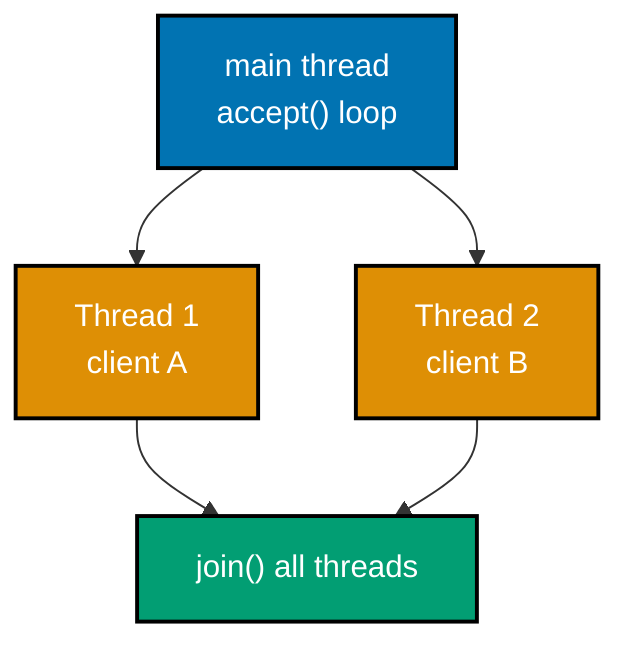

```python
# learning/code/ex-40-concurrent-clients-threads/example.py
"""Example 40: A Thread per Client -- Serving Two Clients Simultaneously."""

import socket  # => stdlib sockets -- one thread per accepted connection is what changes here
import threading  # => the actual fix for Example 39's sequential-serving problem
import time  # => wall-clock timing is what proves concurrent, not sequential, serving

HOST = "127.0.0.1"  # => loopback -- keeps this concurrency demo local and deterministic
PORT = 50040  # => co-05: a fresh ephemeral port, unique to this example


def handle_client(conn: socket.socket, delay: float) -> None:  # => runs on its OWN thread  # fmt: skip
    with conn:  # => this handler's own connection -- closes automatically on block exit
        data = conn.recv(1024)  # => blocks only THIS thread -- other handler threads are unaffected  # fmt: skip
        time.sleep(delay)  # => simulates slow per-client work -- does NOT block other clients  # fmt: skip
        conn.sendall(data.upper())  # => the same trivial per-client transformation as Example 39  # fmt: skip


def server(ready: threading.Event, delays: list[float]) -> None:  # => one thread spawned per delay  # fmt: skip
    with socket.socket(socket.AF_INET, socket.SOCK_STREAM) as sock:  # => same triple as Ex 29+  # fmt: skip
        # => IPv4 + TCP, scoped to this "with" block so the fd always closes on exit
        sock.setsockopt(socket.SOL_SOCKET, socket.SO_REUSEADDR, 1)
        # => set BEFORE bind() -- lets an immediate re-run reuse a TIME_WAIT'd port
        sock.bind((HOST, PORT))
        # => claims (HOST, PORT) for this process -- must happen before listen()
        sock.listen(5)
        # => flips the socket passive, ready to queue several pending connections
        ready.set()
        # => unblocks the main thread's wait() below -- no guessed sleep() needed
        handlers: list[threading.Thread] = []  # => one thread PER accepted connection (co-10)  # fmt: skip
        for delay in delays:  # => accept exactly two clients, then stop
            conn, _ = sock.accept()  # => accept() itself is still sequential, one at a time  # fmt: skip
            handler = threading.Thread(target=handle_client, args=(conn, delay))  # => co-10: NOT run yet  # fmt: skip
            handler.start()  # => handling happens CONCURRENTLY once each thread starts
            handlers.append(handler)  # => tracked so the loop below can wait for every one  # fmt: skip
        for handler in handlers:  # => waits for BOTH handler threads, not just the last one started  # fmt: skip
            handler.join(timeout=5)  # => waits for every spawned handler thread to finish  # fmt: skip


def client(name: bytes, results: dict[bytes, float]) -> None:  # => same shape as Example 39's  # fmt: skip
    start = time.monotonic()  # => this client's own local clock, for relative timing
    sock = socket.create_connection((HOST, PORT), timeout=5)  # => connects immediately
    sock.sendall(name)  # => no artificial client-side delay this time -- the SERVER delays now  # fmt: skip
    sock.recv(1024)  # => only returns once its OWN handler thread has replied
    results[name] = time.monotonic() - start  # => total time from connect to being served  # fmt: skip
    sock.close()  # => releases this client's socket once its own round trip is done


ready_event = threading.Event()  # => the same ready-signal pattern used since Example 34  # fmt: skip
# Both clients get a 0.3s server-side delay -- if they were served SEQUENTIALLY, the total
# wall-clock time for both to finish would be roughly 0.6s; served CONCURRENTLY, roughly 0.3s.
server_thread = threading.Thread(target=server, args=(ready_event, [0.3, 0.3]), daemon=True)  # fmt: skip
# => daemon=True: this thread never blocks process exit if something above hangs
server_thread.start()
# => runs the server concurrently with the two client threads started below
ready_event.wait(timeout=5)
# => blocks here until bind()+listen() genuinely completed, avoiding a race with connect()

results: dict[bytes, float] = {}  # => co-01: measured, not assumed, per-client round-trip times  # fmt: skip
overall_start = time.monotonic()  # => a SEPARATE clock measuring both clients TOGETHER
client_c = threading.Thread(target=client, args=(b"C", results))  # => C's own thread, unstarted  # fmt: skip
client_d = threading.Thread(target=client, args=(b"D", results))  # => D's own thread, unstarted  # fmt: skip
client_c.start()  # => C's connect() begins racing D's, just like the server's two handlers
client_d.start()  # => D's connect() begins concurrently, immediately after C's
client_c.join(timeout=5)  # => waits for C's full round trip, including its 0.3s server delay  # fmt: skip
client_d.join(timeout=5)  # => waits for D's full round trip, including its own 0.3s server delay  # fmt: skip
overall_elapsed = time.monotonic() - overall_start  # => the aggregate proof of concurrency  # fmt: skip
server_thread.join(timeout=5)  # => waits for the server to have handled both connections  # fmt: skip

print(f"client C time: {results[b'C']:.3f}s")  # => expect roughly 0.3s, C's own server delay  # fmt: skip
print(f"client D time: {results[b'D']:.3f}s")  # => expect roughly 0.3s too, served concurrently  # fmt: skip
print(f"overall wall-clock for BOTH clients: {overall_elapsed:.3f}s")  # => expect ~0.3s, not ~0.6s  # fmt: skip

# If the two 0.3s delays ran sequentially, overall_elapsed would be close to 0.6s.
# Running concurrently, it stays close to 0.3s -- proving both were served AT THE SAME TIME.
assert overall_elapsed < 0.55  # => well under the 0.6s a sequential server would have taken  # fmt: skip
print("ex-40 OK")  # => confirms the aggregate-time proof of concurrency held for this run  # fmt: skip
```

**Run**: `python3 example.py`

**Output**:

```text
client C time: 0.316s
client D time: 0.309s
overall wall-clock for BOTH clients: 0.318s
ex-40 OK
```

**Key takeaway**: Both clients each took roughly 0.3s individually, but the OVERALL wall-clock for both finishing was also only about 0.318s -- if they'd been served sequentially (Example 39's design), that overall figure would be closer to 0.6s.

**Why it matters**: This is the aggregate-time proof of concurrency Example 39's per-client timing couldn't show -- one slow client's `time.sleep()` no longer blocks a second client's handling at all, which is the entire point of moving from a sequential to a threaded accept loop. Every production web server -- Node's event loop, a thread-pool-based Java server, Python's `asyncio` -- solves this exact head-of-line problem, just with a different concurrency primitive than a raw thread-per-client. Measuring the aggregate wall-clock time, not just individual response times, is the same technique production load testing relies on to prove a fix actually worked.

---

### Example 41: Raw HTTP with nc -- Local HTTP Responder

_ex-41 &middot; exercises co-21, co-12, co-13_

`nc` (netcat) can send and receive raw TCP bytes with no protocol logic of its own -- pointed at a plain-text HTTP responder, whatever it sends is exactly what the server receives, byte for byte, with no HTTP library involved on either side. This server targets `127.0.0.1` (loopback), since this sandboxed environment's `nc` cannot reliably receive data from remote hosts even though its own TCP handshake succeeds -- a documented environment limitation, not a networking concept.

```python
# learning/code/ex-41-raw-http-with-nc/server.py
"""Example 41: Raw HTTP with nc -- Local HTTP Responder."""

import socket  # => stdlib sockets -- this server writes its own HTTP text by hand, no library

HOST = "127.0.0.1"  # => loopback -- nc connects locally in this sandboxed environment
PORT = 50041  # => co-05: nc will target this exact port on the command line


def run_server() -> None:  # => a minimal, hand-rolled HTTP/1.1 responder (co-12, co-13)
    with socket.socket(socket.AF_INET, socket.SOCK_STREAM) as sock:  # => same triple as Ex 29+  # fmt: skip
        # => IPv4 + TCP, scoped to this "with" block so the fd always closes on exit
        sock.setsockopt(socket.SOL_SOCKET, socket.SO_REUSEADDR, 1)
        # => set BEFORE bind() -- lets an immediate re-run reuse a TIME_WAIT'd port
        sock.bind((HOST, PORT))
        # => claims (HOST, PORT) for this process -- must happen before listen()
        sock.listen(1)
        # => flips the socket passive, ready to queue nc's one incoming connection
        print(f"listening on {HOST}:{PORT}", flush=True)  # => the signal nc's caller waits for  # fmt: skip
        conn, _ = sock.accept()  # => accepts nc's raw TCP connection, no TLS involved
        with conn:  # => nc's connected socket -- closes automatically when this block exits  # fmt: skip
            request = conn.recv(4096)  # => reads whatever raw bytes nc piped in verbatim  # fmt: skip
            print(f"server saw raw request bytes:\n{request.decode(errors='replace')}")  # => co-12  # fmt: skip
            body = b"hello from a hand-rolled HTTP responder\n"  # => co-13: the response body
            # co-12/co-13: a real status line, real headers, a blank line, then the body --
            # this is EXACTLY the message shape ex-05/ex-06 identified inside curl -v earlier.
            response = (  # => built by hand, byte by byte -- no HTTP library involved
                b"HTTP/1.1 200 OK\r\n"  # => co-13: the status line -- version, code, reason phrase
                b"Content-Type: text/plain\r\n"
                # => body size, not a guess -- computed, never hardcoded
                b"Content-Length: " + str(len(body)).encode() + b"\r\n"
                b"Connection: close\r\n"
                # => the mandatory blank-line separator, then the raw body bytes
                b"\r\n" + body
            )
            conn.sendall(response)  # => nc prints these exact raw bytes to its own stdout  # fmt: skip


if __name__ == "__main__":  # => only runs when invoked directly, not when imported
    run_server()  # => the guard above is WHY this only fires when this file is run as a script
```

**Run**: `python3 server.py &`, then `printf 'GET / HTTP/1.1\r\nHost: 127.0.0.1\r\nConnection: close\r\n\r\n' | nc -w 3 127.0.0.1 50041`

**Output** (nc's own stdout, the raw response bytes):

```text
HTTP/1.1 200 OK
Content-Type: text/plain
Content-Length: 40
Connection: close

hello from a hand-rolled HTTP responder
```

**Key takeaway**: `nc` printed the response's status line, headers, blank line, and body EXACTLY as the server wrote them -- no parsing, no interpretation, just the raw bytes.

**Why it matters**: `nc` used this way is a genuine debugging tool -- when curl or a browser hides too much (Examples 1-3), `nc` shows you the actual, unprocessed bytes a server sends, which is the ultimate "peel back the abstraction" move co-21 describes. Production incident response frequently falls back to exactly this kind of raw-bytes inspection when a higher-level HTTP client's error message is too vague to diagnose a malformed request or response. Knowing how to hand-roll a minimal responder like this one also makes writing a test double or mock server far less intimidating.

---

### Example 42: nc -l -- Listen and Show the Raw Bytes curl Actually Sends

_ex-42 &middot; exercises co-21, co-12_

`nc -l` opens a raw, passive listening socket -- the mirror image of Example 41. Whatever a client sends arrives on `nc`'s own stdout unmodified, making it a simple way to inspect exactly what a client (here, `curl`) puts on the wire.

```bash
# learning/code/ex-42-nc-listen-server/listen.sh
#!/bin/sh
# Example 42: nc -l -- Listen and Show the Raw Bytes curl Actually Sends.
# nc -l opens a raw, passive TCP socket -- co-21: nc as a hand connection-inspection tool.
# Whatever the OTHER side sends arrives on nc's own stdout, byte for byte, no parsing at all.
nc -l 50042
```

**Run**: `sh listen.sh &`, then `curl -H "X-Ex42: demo" http://127.0.0.1:50042/probe`

**Output** (nc's stdout, curl's real raw request):

```text
GET /probe HTTP/1.1
Host: 127.0.0.1:50042
User-Agent: curl/8.7.1
Accept: */*
X-Ex42: demo
```

**Key takeaway**: This is curl's ACTUAL request, byte for byte, with no server ever replying -- `nc -l` captured exactly what left curl's socket, confirming curl really does send the request line and headers shown "conceptually" in every earlier `-v` example.

**Why it matters**: Combined with Example 41, `nc` now covers both directions -- sending raw bytes to a server, and capturing raw bytes from a client -- two complementary tools for the same "trust nothing, verify the actual bytes" instinct this topic keeps building. Production debugging sessions reach for exactly this technique when a client library's logging obscures what's actually being sent -- pointing `nc -l` at the same port a real service would use exposes the literal bytes with zero interpretation. It is a lightweight substitute for a full packet capture when only the application-layer payload matters.

---

### Example 43: Handcraft an HTTP Request Over a Raw Socket

_ex-43 &middot; exercises co-12, co-16_

No `curl`, no HTTP library -- just a plain Python string containing an HTTP/1.1 request, sent as raw ASCII bytes over a socket connected to a REAL remote host, `example.com`. This confirms curl isn't doing anything magical: it is writing exactly this text to the wire.

```python
# learning/code/ex-43-handcraft-http-request/example.py
"""Example 43: Handcraft an HTTP Request Over a Raw Socket."""

import socket  # => stdlib sockets -- no HTTP library imported anywhere in this file

HOST = "example.com"  # => a real, RFC-2606-reserved documentation host (co-01)
PORT = 80  # => co-05: HTTP's well-known port

# co-12: an HTTP/1.1 request is a request line, headers, then a BLANK line -- \r\n\r\n.
# There is no HTTP library involved anywhere here -- these are the literal bytes on the wire.
request = (  # => plain string concatenation -- no HTTP library builds this for us
    "GET / HTTP/1.1\r\n"  # => the request line: METHOD, PATH, VERSION
    "Host: example.com\r\n"  # => co-16: HTTP/1.1 REQUIRES a Host header (one server, many sites)
    "Connection: close\r\n"  # => tells the server to close after replying, simplifying this demo
    "\r\n"  # => the blank line that ends the headers -- REQUIRED even with no body
)

with socket.create_connection((HOST, PORT), timeout=5) as sock:  # => co-07: the TCP handshake  # fmt: skip
    sock.sendall(request.encode("ascii"))  # => co-12: HTTP headers are ASCII, sent as raw bytes  # fmt: skip
    response = b""  # => accumulates the full response -- its final size isn't known in advance  # fmt: skip
    while True:  # => co-11: loop until the server closes (Connection: close makes this safe)  # fmt: skip
        chunk = sock.recv(4096)  # => reads whatever arrives next, up to 4096 bytes
        if not chunk:  # => an empty recv() means the server closed its side
            break
        response += chunk  # => appends this chunk -- the loop above may run several times  # fmt: skip

status_line = response.split(b"\r\n", 1)[0]  # => co-13: everything up to the first \r\n
print(f"status line: {status_line.decode()}")  # => decoded to str only for display purposes  # fmt: skip

assert status_line == b"HTTP/1.1 200 OK"  # => confirms a hand-crafted request gets a real reply  # fmt: skip
print("ex-43 OK")  # => confirms the request/response round trip completed with the expected status  # fmt: skip
```

**Run**: `python3 example.py`

**Output**:

```text
status line: HTTP/1.1 200 OK
ex-43 OK
```

**Key takeaway**: A plain string, hand-typed by a human, sent as raw bytes to `example.com:80`, got a genuine `200 OK` -- HTTP is exactly this simple text protocol underneath, no matter how much a library like `curl` seems to be doing.

**Why it matters**: This is co-12 proven, not just described -- every layer of "magic" HTTP libraries provide is optional, not load-bearing; the wire format is plain, well-defined ASCII text anyone can type by hand. This same handcrafted-request technique is a real production debugging tool -- when a client library's abstraction hides a malformed header or an unexpected encoding, dropping to a raw socket and typing the exact bytes by hand is often the fastest way to isolate whether the bug is in the library or the server.

---

### Example 44: Split a Raw HTTP Response into Status Line, Headers, and Body

_ex-44 &middot; exercises co-13, co-16_

An HTTP/1.1 response's ONE universal, fixed boundary is the blank line (`\r\n\r\n`) that separates headers from body -- splitting on it, then splitting the header block on individual `\r\n`s, is all that's needed to parse a response by hand.

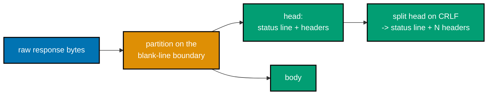

```python
# learning/code/ex-44-read-http-response-parts/example.py
"""Example 44: Split a Raw HTTP Response into Status Line, Headers, and Body."""

import socket  # => stdlib sockets -- fetch_raw below is the SAME pattern as Example 43

# info.cern.ch (the first website ever put online) replies with a plain, fixed-length
# body -- example.com's CDN replies chunked instead, which would mix chunk-size framing
# into "the body" and distract from this example's actual point (co-13: splitting a
# message into status line + headers + body). Example 53 covers chunked bodies directly.
HOST = "info.cern.ch"  # => chosen SPECIFICALLY for its plain, non-chunked response shape  # fmt: skip
PORT = 80  # => co-05: HTTP's well-known port


def fetch_raw(host: str, port: int, path: str) -> bytes:  # => same handcrafted request as Ex 43  # fmt: skip
    request = f"GET {path} HTTP/1.1\r\nHost: {host}\r\nConnection: close\r\n\r\n"
    with socket.create_connection((host, port), timeout=5) as sock:  # => co-07: the TCP handshake  # fmt: skip
        sock.sendall(request.encode("ascii"))  # => co-12: the raw request bytes, sent as-is  # fmt: skip
        response = b""  # => accumulates the full response -- its final size isn't known upfront
        while True:  # => co-11: loop until the server closes (Connection: close makes this safe)  # fmt: skip
            chunk = sock.recv(4096)  # => reads whatever arrives next, up to 4096 bytes
            if not chunk:  # => an empty recv() means the server closed its side
                break
            response += chunk  # => appends this chunk -- the loop above may run several times  # fmt: skip
    return response  # => the FULL raw response: status line + headers + blank line + body, as bytes


raw = fetch_raw(HOST, PORT, "/")  # => one function call replaces Example 43's inline socket code  # fmt: skip

# co-13: the blank line \r\n\r\n is the ONE fixed boundary every HTTP/1.1 message has --
# everything before it is the status line + headers; everything after it is the body.
head, _, body = raw.partition(b"\r\n\r\n")  # => splits into exactly TWO parts at the first match  # fmt: skip
lines = head.split(b"\r\n")  # => the headers block splits cleanly on individual \r\n boundaries  # fmt: skip
status_line = lines[0]  # => co-13: version + code + reason, e.g. "HTTP/1.1 200 OK"
header_lines = lines[1:]  # => every remaining line before the blank line is one header

print(f"status line: {status_line.decode()}")
print(f"header count: {len(header_lines)}")
print(f"first header: {header_lines[0].decode()}")
print(f"body starts with: {body[:40]!r}")

assert status_line.startswith(b"HTTP/1.1 200")  # => confirms the status-line split is correct  # fmt: skip
assert len(header_lines) > 0  # => confirms at least one header was isolated
assert body.startswith(b"<html>")  # => confirms the body split lands on real HTML, not headers  # fmt: skip
print("ex-44 OK")  # => confirms the three-way split (status/headers/body) was correct end to end  # fmt: skip
```

**Run**: `python3 example.py`

**Output**:

```text
status line: HTTP/1.1 200 OK
header count: 8
first header: Date: Tue, 14 Jul 2026 09:59:12 GMT
body starts with: b'<html><head></head><body><header>\n<title'
```

**Key takeaway**: `raw.partition(b"\r\n\r\n")` cleanly split the response into exactly three parts -- status line, 8 headers, and a body starting with real HTML -- confirming the blank-line boundary is reliable, not a rough heuristic.

**Why it matters**: `http.client` (Example 61 onward) does exactly this splitting internally -- seeing it done by hand once means the "magic" of a stdlib HTTP client is fully demystified: it is this same three-way split, plus some header-value parsing convenience. Every hand-rolled HTTP parser, proxy, or load balancer implements exactly this same blank-line-then-headers split as its first parsing step, regardless of the language it's written in. Understanding it here means a production HTTP parsing bug -- a truncated header, a missing blank line -- becomes immediately diagnosable rather than mysterious.

---

### Example 45: Fetch a Real HTML Page

_ex-45 &middot; exercises co-14, co-12_

A plain `curl` against `info.cern.ch` -- the first website ever put online -- returns its full, real HTML body: a request/response round trip against a genuinely historic host, using the same `--http1.1` framing this topic has used throughout.

```bash
# ex-45: fetch the actual first website ever published, still live today
curl -s --http1.1 https://info.cern.ch
```

**Run**: `curl -s --http1.1 https://info.cern.ch`

**Output**:

```text
<html><head></head><body><header>
<title>http://info.cern.ch</title>
</header>

<h1>http://info.cern.ch - home of the first website</h1>
<p>From here you can:</p>
<ul>
<li><a href="http://info.cern.ch/hypertext/WWW/TheProject.html">Browse the first website</a></li>
<li><a href="http://line-mode.cern.ch/www/hypertext/WWW/TheProject.html">Browse the first website using the line-mode browser simulator</a></li>
<li><a href="http://home.web.cern.ch/topics/birth-web">Learn about the birth of the web</a></li>
<li><a href="http://home.web.cern.ch/about">Learn about CERN, the physics laboratory where the web was born</a></li>
</ul>
</body></html>
```

**Key takeaway**: A 35-year-old website, still reachable today, returns a real 200 OK with plain, unstyled HTML -- the exact same `curl` invocation pattern used throughout this topic.

**Why it matters**: Fetching a real, historically significant page is a small reminder that HTTP's basic request/response shape has been stable since the very first website -- everything this topic covers has worked, largely unchanged, for decades. Compatibility this durable is rare in software -- most APIs and services deprecate or break within a few years, yet this exact request/response shape still works against infrastructure built decades ago. That stability is precisely why HTTP remains the default choice for new production APIs even today.

---

### Example 46: POST a Form Body

_ex-46 &middot; exercises co-14, co-19_

`curl -d "key=value&key2=value2"` sends a `POST` request with `application/x-www-form-urlencoded` body encoding -- `postman-echo.com` replies with JSON describing exactly what it received, confirming the form data arrived intact.

```bash
# ex-46: -d implies POST and application/x-www-form-urlencoded encoding
# postman-echo.com is a public echo API -- its JSON reply proves what the server actually saw
curl -s -d "a=1&b=2" https://postman-echo.com/post
```

**Run**: `curl -s -d "a=1&b=2" https://postman-echo.com/post`

**Output** (truncated to the relevant fields):

```json
{
  "args": {},
  "data": "",
  "files": {},
  "form": { "a": "1", "b": "2" },
  "json": { "a": "1", "b": "2" },
  "url": "https://postman-echo.com/post"
}
```

**Key takeaway**: `form: {"a": "1", "b": "2"}` in the echoed JSON confirms the server correctly parsed the `a=1&b=2` body as form-encoded key/value pairs -- exactly what `-d` implies without any extra flags.

**Why it matters**: `-d` is curl's default, most common way to send form data -- most `<form method="post">` submissions on the web use this exact encoding, making this the HTTP equivalent of "the most common form of writing data." Nearly every HTML `<form>` on the production web still submits data this way by default, and countless legacy backend systems expect exactly this encoding rather than JSON. Recognizing `application/x-www-form-urlencoded` on sight avoids a common integration mistake: assuming every API accepts JSON when many older ones do not.

---

### Example 47: POST JSON with an Explicit Content-Type

_ex-47 &middot; exercises co-14, co-16, co-22_

Sending JSON requires an explicit `Content-Type: application/json` header -- without it, a server has no reliable way to know the body isn't form-encoded text that happens to look like JSON.

```bash
# ex-47: -H sets Content-Type explicitly; -d supplies the raw JSON body
# without -H, the server would have no reliable way to tell this body apart from form data
curl -s -H "Content-Type: application/json" -d '{"x":1}' https://postman-echo.com/post
```

**Run**: `curl -s -H "Content-Type: application/json" -d '{"x":1}' https://postman-echo.com/post`

**Output** (truncated to the relevant fields):

```json
{
  "data": {},
  "json": { "x": 1 },
  "headers": { "content-type": "application/json" },
  "url": "https://postman-echo.com/post"
}
```

**Key takeaway**: `json: {"x": 1}` (a real JSON number, not a string) proves the server parsed the body AS JSON, driven entirely by the explicit `Content-Type` header -- change or omit that header and the parsing changes too.

**Why it matters**: `Content-Type` is a contract the CLIENT asserts and the SERVER trusts -- Example 51 later builds a server that reads a different header (`Accept`) to make the opposite decision: what format to SEND, not what format was received. Production API integrations fail constantly from exactly this mistake -- sending a JSON body without setting `Content-Type: application/json`, leaving the server to guess wrong and reject or misparse the request. Making the header explicit, every time, is one of the simplest, most common fixes for a mysterious 400 Bad Request.

---

### Example 48: PUT and DELETE Methods

_ex-48 &middot; exercises co-14, co-19_

`curl -X` overrides the HTTP method explicitly -- `PUT` (replace/create a resource) and `DELETE` (remove a resource) both echo back through `postman-echo.com`'s matching endpoints, confirming the method itself, not just the body, reached the server.

```bash
# ex-48a: PUT -- typically means "replace this resource with this body"
# -X overrides curl's default method choice, which would otherwise be GET here
curl -s -X PUT https://postman-echo.com/put -d "a=1"
```

```bash
# ex-48b: DELETE -- typically means "remove this resource" (often no body at all)
# no -d is supplied here -- DELETE conventionally identifies a resource by URL alone
curl -s -X DELETE https://postman-echo.com/delete
```

**Run**: both commands shown above

**Output** (PUT, truncated):

```json
{ "args": {}, "data": "", "form": { "a": "1" }, "json": { "a": "1" }, "url": "https://postman-echo.com/put" }
```

**Output** (DELETE, truncated):

```json
{ "args": {}, "data": "", "form": {}, "json": null, "url": "https://postman-echo.com/delete" }
```

**Key takeaway**: `postman-echo.com/put` and `/delete` both confirmed the request arrived at the endpoint matching the METHOD used, not just the URL -- the same path with a different method routes to entirely different application logic.

**Why it matters**: `GET`, `POST`, `PUT`, `DELETE`, and `HEAD` (co-14) are the five methods this topic exercises directly -- recognizing each one's INTENT (read, create, replace, remove, read-headers-only) is what makes an unfamiliar API's method choice self-explanatory rather than arbitrary. REST API design in production leans heavily on this method vocabulary to convey intent through the URL and verb alone, rather than through a bespoke action name in the body. Misusing a method -- a `GET` that mutates state, a `POST` used for idempotent reads -- is a common code review finding this vocabulary helps catch early.

---

### Example 49: A Tour of Status Codes

_ex-49 &middot; exercises co-15_

`mock.codes/<code>` is a service purpose-built to return EXACTLY the requested status code -- a reliable way to see one representative from each of HTTP's four main status classes (`2xx`, `3xx`, `4xx`, `5xx`) without depending on any real endpoint happening to be in that state.

```bash
# ex-49: -w extracts just the status code; -o /dev/null discards the body entirely
for code in 200 301 404 500; do  # => one representative from each of HTTP's four status classes
  curl -s -o /dev/null -w "%{http_code}\n" "https://mock.codes/$code"  # => prints just the code
done  # => loop runs exactly four times, once per class
```

**Run**: loop shown above

**Output**:

```text
200
301
404
500
```

**Key takeaway**: Each requested code came back EXACTLY as asked -- `200` (success), `301` (redirect), `404` (client error), `500` (server error) -- one concrete representative per status class.

**Why it matters**: The FIRST digit of a status code (co-15) is the single fastest triage signal in any HTTP debugging session: `2xx` means stop looking, `3xx` means follow the `Location` header, `4xx` means fix the request, `5xx` means the problem is server-side and retrying later might help. Production monitoring dashboards and alerting rules are almost always built around exactly this first-digit classification, aggregating `5xx` rates separately from `4xx` rates because they point to entirely different owners and remediation paths. Internalizing the four classes here is what makes reading an unfamiliar service's error-rate graph immediately meaningful.

---

### Example 50: Content-Length Matches the Real Body

_ex-50 &middot; exercises co-16, co-13_

`Content-Length`'s claimed value should equal the ACTUAL byte count of the body that follows it -- this example verifies that contract directly, rather than merely trusting the header.

```bash
# ex-50a: read the claimed Content-Length from the headers
curl -sI --http1.1 https://info.cern.ch | grep -i content-length
```

```bash
# ex-50b: independently count the real body's bytes
curl -s --http1.1 https://info.cern.ch | wc -c
```

**Run**: both commands shown above

**Output**:

```text
Content-Length: 646
     646
```

**Key takeaway**: The header claimed `646` bytes; `wc -c`'s independent count of the actual downloaded body also reported `646` -- the header's value is a VERIFIABLE fact about the response, not just an informational hint.

**Why it matters**: A mismatched `Content-Length` (from a buggy server or a broken proxy) is a real, debuggable class of bug -- knowing you can independently verify this header against the real byte count is a concrete way to confirm (or rule out) that class of problem. Production incidents involving a truncated download, a broken CDN cache, or a misconfigured reverse proxy often trace back to exactly this kind of `Content-Length` mismatch. Having a simple, independent verification technique turns a vague "the file looks corrupted" report into a concrete, provable diagnosis.

---

### Example 51: Accept Header Negotiation -- Ask for JSON, Get JSON

_ex-51 &middot; exercises co-22, co-16_

A hand-rolled server reads the request's `Accept` header and chooses its response's `Content-Type` and body accordingly -- content negotiation from the SERVER's point of view, the mirror image of Example 47's client-driven `Content-Type`.

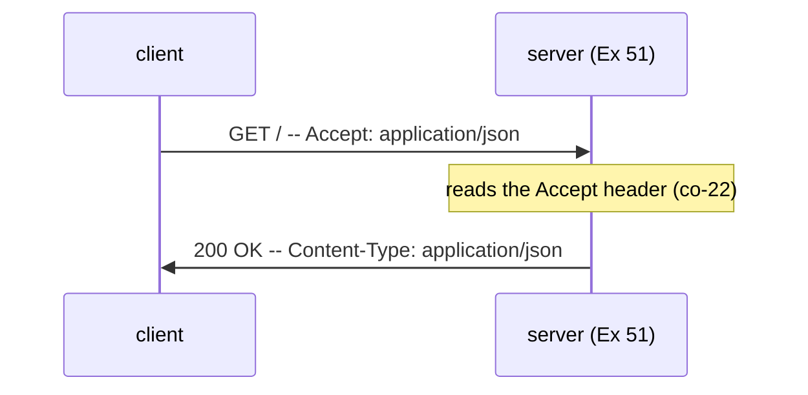

```python
# learning/code/ex-51-accept-header-negotiation/example.py
"""Example 51: Accept Header Negotiation -- Ask for JSON, Get JSON."""

import socket  # => stdlib sockets -- no HTTP library involved on either side of this exchange
import threading  # => only the ready-signal + background thread, not real concurrency

HOST = "127.0.0.1"  # => loopback -- keeps this negotiation demo local and deterministic
PORT = 50051  # => co-05: a fresh ephemeral port, unique to this example


def server(ready: threading.Event) -> None:  # => co-22: a server that reads the Accept header  # fmt: skip
    with socket.socket(socket.AF_INET, socket.SOCK_STREAM) as sock:  # => same triple as Ex 29+  # fmt: skip
        # => IPv4 + TCP, scoped to this "with" block so the fd always closes on exit
        sock.setsockopt(socket.SOL_SOCKET, socket.SO_REUSEADDR, 1)
        # => set BEFORE bind() -- lets an immediate re-run reuse a TIME_WAIT'd port
        sock.bind((HOST, PORT))
        # => claims (HOST, PORT) for this process -- must happen before listen()
        sock.listen(1)
        # => flips the socket passive, ready to queue one pending connection
        ready.set()
        # => unblocks the main thread's wait() below -- no guessed sleep() needed
        conn, _ = sock.accept()
        # => BLOCKS until the client's connect() completes the TCP handshake
        with conn:  # => this one connection's socket -- closes automatically on block exit  # fmt: skip
            request = conn.recv(4096).decode()  # => reads the raw request bytes, decoded to text  # fmt: skip
            wants_json = "Accept: application/json" in request  # => co-16: read ONE header's value  # fmt: skip
            if wants_json:  # => co-22: the client's Accept header decides the representation  # fmt: skip
                body = b'{"greeting": "hello"}'  # => the JSON representation of the SAME greeting
                content_type = b"application/json"  # => the Content-Type that MATCHES the body  # fmt: skip
            else:
                # => the safe fallback when Accept doesn't ask for JSON explicitly
                body = b"greeting: hello"  # => the plain-text representation of the SAME greeting
                content_type = b"text/plain"  # => the Content-Type that MATCHES this body instead  # fmt: skip
            response = (  # => built by hand, byte by byte -- no HTTP library involved
                b"HTTP/1.1 200 OK\r\n"  # => co-13: the status line -- version, code, reason phrase
                # => the negotiated type, not hardcoded
                b"Content-Type: " + content_type + b"\r\n"
                # => the actual body's size
                b"Content-Length: " + str(len(body)).encode() + b"\r\n"
                b"Connection: close\r\n"  # => tells the client to expect the connection to close
                # => the mandatory blank-line separator, then the chosen body
                b"\r\n" + body
            )
            conn.sendall(response)  # => the chosen representation, sent back over this connection  # fmt: skip


ready_event = threading.Event()  # => the same ready-signal pattern used since Example 34  # fmt: skip
thread = threading.Thread(target=server, args=(ready_event,), daemon=True)
# => daemon=True: this thread never blocks process exit if something above hangs
thread.start()
# => runs the server concurrently with the request-sending client code that follows
ready_event.wait(timeout=5)
# => blocks here until bind()+listen() genuinely completed, avoiding a race with connect()

request = (  # => plain string concatenation -- no HTTP library builds this for us either
    "GET / HTTP/1.1\r\n"  # => the request line: METHOD, PATH, VERSION
    "Host: 127.0.0.1\r\n"  # => co-16: HTTP/1.1 REQUIRES a Host header even on loopback
    "Accept: application/json\r\n"  # => co-22: explicitly asking for JSON, not plain text
    "Connection: close\r\n"  # => tells the server to close after replying, simplifying this demo
    "\r\n"  # => the blank line that ends the headers -- REQUIRED even with no body
)
with socket.create_connection((HOST, PORT), timeout=5) as sock:  # => co-07: the TCP handshake  # fmt: skip
    sock.sendall(request.encode())  # => co-12: the raw hand-built request, sent as bytes  # fmt: skip
    response = b""  # => accumulates the full response -- its final size isn't known upfront  # fmt: skip
    while True:  # => co-11: loop until the server closes (Connection: close makes this safe)  # fmt: skip
        chunk = sock.recv(4096)  # => reads whatever arrives next, up to 4096 bytes
        if not chunk:  # => an empty recv() means the server closed its side
            break
        response += chunk  # => appends this chunk -- the loop above may run several times  # fmt: skip

thread.join(timeout=5)
# => waits for the server thread to finish handling this one request before exiting

head, _, body = response.partition(b"\r\n\r\n")  # => co-13: split at the one fixed boundary  # fmt: skip
print(f"headers:\n{head.decode()}")  # => expect Content-Type: application/json in this output  # fmt: skip
print(f"body: {body!r}")  # => expect the JSON body, since the request's Accept asked for JSON  # fmt: skip

assert b"application/json" in head  # => confirms the server chose JSON based on Accept
assert body == b'{"greeting": "hello"}'  # => confirms the BODY is actually JSON, not plain text  # fmt: skip
# both assertions together confirm negotiation is genuine: the Content-Type header and the
# actual body bytes agree with each other, and both were driven by what the client asked for.
print("ex-51 OK")  # => confirms the Accept -> Content-Type negotiation worked end to end  # fmt: skip
```

**Run**: `python3 example.py`

**Output**:

```text
headers:
HTTP/1.1 200 OK
Content-Type: application/json
Content-Length: 22
Connection: close

body: b'{"greeting": "hello"}'
ex-51 OK
```

**Key takeaway**: Sending `Accept: application/json` got back `Content-Type: application/json` and a genuine JSON body -- the server read the client's stated preference and honored it, rather than always replying in one fixed format.

**Why it matters**: Real APIs (GitHub's, for instance) use this exact mechanism to let one endpoint serve both JSON and other formats -- understanding `Accept` -> `Content-Type` as a request/response PAIR, not two unrelated headers, is what makes content negotiation click. Production APIs that need to serve both a human-facing browser and a machine client from the same endpoint rely on exactly this server-side `Accept`-driven negotiation to avoid maintaining two separate URLs. Getting the negotiation logic right, on both the request and response side, is what makes a single well-designed endpoint serve many different clients cleanly.

---

### Example 52: Content Negotiation with gzip

_ex-52 &middot; exercises co-22, co-19_

`curl --compressed` sends `Accept-Encoding: gzip, deflate` and automatically decompresses a `Content-Encoding: gzip` response -- the same negotiation pattern as Example 51, but for compression instead of content type.

```bash
# ex-52: --compressed asks for a compressed reply AND transparently decompresses it
curl -v --compressed --http1.1 https://example.com 2>&1 1>/dev/null | grep -iE "accept-encoding|content-encoding"
```

**Run**: `curl -v --compressed --http1.1 https://example.com 2>&1 1>/dev/null | grep -iE "accept-encoding|content-encoding"`

**Output**:

```text
> Accept-Encoding: deflate, gzip
< Content-Encoding: gzip
```

**Key takeaway**: The request's `Accept-Encoding` header ASKED for gzip; the response's `Content-Encoding` header CONFIRMED gzip was used -- curl transparently decompressed the body before Example 1 ever printed it, with no extra code required.

**Why it matters**: Compression is invisible in almost every earlier example's printed output specifically BECAUSE curl decompresses automatically -- this example is the one place that peels back that automatic step and shows the negotiation actually happening. Production APIs enable gzip compression by default precisely because it can shrink a JSON or HTML payload by 70% or more with negligible CPU cost, directly reducing both bandwidth bills and perceived load latency for real users. Seeing the negotiation headers explicitly here demystifies a step that normally happens invisibly inside every HTTP client.

---

### Example 53: Chunked Transfer Encoding

_ex-53 &middot; exercises co-16, co-13_

When a server doesn't know a response's total size in advance, it uses `Transfer-Encoding: chunked` instead of `Content-Length` -- the body is sent as a series of self-describing, size-prefixed chunks rather than one block with a fixed length.

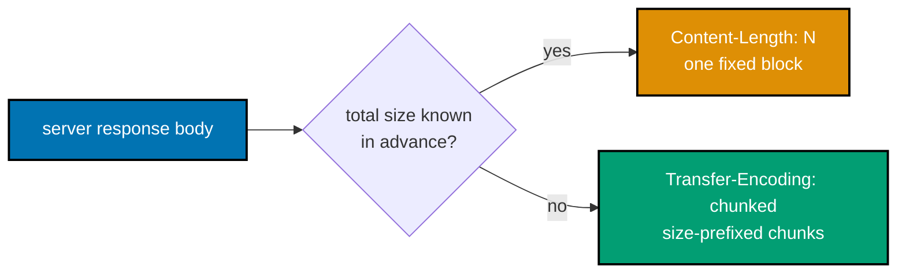

```bash
# ex-53: example.com's CDN streams its response chunked -- no Content-Length header at all
curl -v --http1.1 https://example.com 2>&1 1>/dev/null | grep -i "transfer-encoding\|content-length"
```

**Run**: `curl -v --http1.1 https://example.com 2>&1 1>/dev/null | grep -i "transfer-encoding\|content-length"`

**Output**:

```text
< Transfer-Encoding: chunked
```

**Key takeaway**: `example.com`'s response has `Transfer-Encoding: chunked` and NO `Content-Length` at all -- confirming these two headers are mutually exclusive alternatives for the same problem (how does the client know when the body ends?).

**Why it matters**: This is exactly why Example 44 deliberately switched to `info.cern.ch`: parsing a chunked body by hand requires reading each chunk's hex-encoded size prefix first, which would have obscured that example's actual point (splitting status line / headers / body); `http.client` (Example 61 onward) handles this de-chunking for you automatically. Production servers streaming a large file, a live log tail, or a server-sent-events feed all rely on chunked encoding for exactly this reason: the response can start flowing before its total size is known.

---

### Example 54: UDP Echo Server

_ex-54 &middot; exercises co-08, co-10_

A UDP server needs no `bind`/`listen`/`accept` sequence -- just `bind`, then `recvfrom()`, which returns BOTH the datagram's bytes and the sender's address in one call, since UDP has no persistent "connection" object the way TCP's `accept()` returns one.

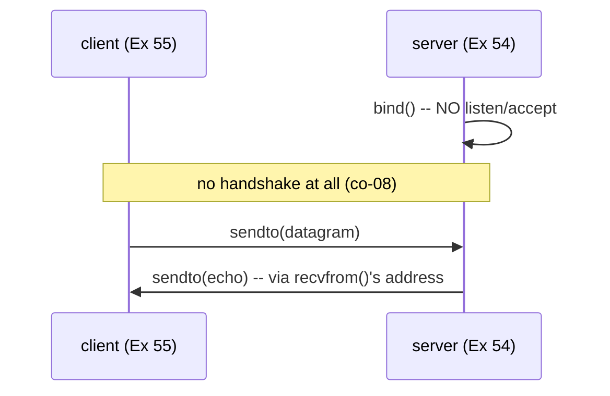

```python
# learning/code/ex-54-udp-echo-server/server.py
"""Example 54: UDP Echo Server."""

import socket  # => same stdlib module as TCP -- only the socket TYPE differs (co-08, co-10)

HOST = "127.0.0.1"  # => loopback -- keeps this UDP demo local and deterministic
PORT = 50054  # => co-05: a fresh ephemeral port, unique to this example


def run_server() -> None:  # => a UDP server needs no bind/listen/accept sequence at all
    # SOCK_DGRAM selects UDP: connectionless, message-oriented, no handshake (co-08).
    with socket.socket(socket.AF_INET, socket.SOCK_DGRAM) as sock:
        sock.bind((HOST, PORT))  # => UDP still binds to claim a local port -- but never listen()s  # fmt: skip
        print(f"listening on {HOST}:{PORT}", flush=True)  # => the signal the client script waits for  # fmt: skip
        # recvfrom (not recv!) returns BOTH the datagram's bytes AND the sender's address --
        # there is no persistent "connection" object like TCP's accept() returns (co-08).
        data, sender_addr = sock.recvfrom(1024)  # => blocks until ONE datagram arrives
        print(f"received {data!r} from {sender_addr}")  # => shows the sender's address, learned here  # fmt: skip
        sock.sendto(data, sender_addr)  # => sendto: no connection needed, just an address  # fmt: skip


if __name__ == "__main__":  # => only runs when invoked directly, not when imported
    run_server()  # => the guard above is WHY this only fires when this file is run as a script
```

**Run**: `python3 server.py &`, then Example 55's `client.py`

**Output** (server):

```text
listening on 127.0.0.1:50054
received b'hello over udp' from ('127.0.0.1', 55102)
```

**Key takeaway**: `recvfrom()` returned the sender's address alongside the data -- co-08's connectionless model made this necessary, since there is no prior `accept()`-established relationship the server could otherwise use to know who to reply to.

**Why it matters**: This missing `accept()` step is the single biggest structural difference between UDP and TCP servers -- every UDP server must re-learn "who sent this?" on every single incoming datagram, rather than knowing it once at connection time. Production UDP services -- DNS servers, game state broadcasts, telemetry collectors -- all re-derive the sender's address from every single incoming datagram for exactly this reason, since there is no persistent connection object to remember it for them. That per-packet address lookup is a direct, measurable cost UDP servers pay that TCP servers do not.

---

### Example 55: UDP Echo Client

_ex-55 &middot; exercises co-08, co-10_

`sendto()` fires a datagram at an explicit `(host, port)` address with no prior `connect()` call at all -- the client half of Example 54's connectionless exchange.

```python
# learning/code/ex-55-udp-echo-client/client.py
"""Example 55: UDP Echo Client."""

import socket  # => stdlib sockets -- SOCK_DGRAM below is the only difference from TCP clients

HOST = "127.0.0.1"  # => loopback -- must match Example 54's server address exactly
PORT = 50054  # => must match the server's bound port exactly


def run_client(message: bytes) -> bytes:  # => sends ONE datagram, reads ONE datagram back  # fmt: skip
    with socket.socket(socket.AF_INET, socket.SOCK_DGRAM) as sock:  # => no connect() call at all  # fmt: skip
        sock.settimeout(5)  # => co-08: UDP has no delivery guarantee -- a timeout avoids hanging  # fmt: skip
        sock.sendto(message, (HOST, PORT))  # => fires the datagram -- no handshake, no ack  # fmt: skip
        reply, _ = sock.recvfrom(1024)  # => blocks until a reply arrives, or the timeout fires  # fmt: skip
        return reply  # => the sender's own address (the second tuple item) is discarded here


if __name__ == "__main__":  # => only runs when invoked directly, not when imported
    reply = run_client(b"hello over udp")  # => Example 54's server must already be running  # fmt: skip
    print(f"client received: {reply!r}")  # => confirms the echoed bytes match what was sent  # fmt: skip
    assert reply == b"hello over udp"  # => confirms this ONE datagram made the full round trip  # fmt: skip
    print("ex-55 OK")  # => confirms the connectionless round trip completed without a handshake  # fmt: skip
```

**Run**: `python3 client.py` (with `server.py` already running)

**Output**:

```text
client received: b'hello over udp'
ex-55 OK
```

**Key takeaway**: No `connect()`, no handshake, no "session" of any kind -- one `sendto()`, one `recvfrom()`, and the exact bytes round-tripped successfully.

**Why it matters**: TCP's `create_connection()` and UDP's bare `socket()` + `sendto()` are the two smallest possible client patterns this topic covers -- comparing them side by side (as Example 57 does explicitly) is the clearest way to internalize co-08's connectionless model. Production systems choosing between TCP and UDP client code almost always start from exactly these two smallest possible patterns before adding retries, timeouts, or sequence numbers on top. Recognizing which primitive shape a more complex client library is really built on makes an unfamiliar networking library's API far less mysterious.

---

### Example 56: UDP Has No Handshake -- Sending to a Closed Port

_ex-56 &middot; exercises co-08, co-09_

`sendto()` succeeds INSTANTLY and with no error, even when NOTHING is listening on the target port -- UDP has no three-way handshake to fail during, so the only signal of "nobody is there" is silence: a `recvfrom()` that never returns.

```python
# learning/code/ex-56-udp-no-handshake/example.py
"""Example 56: UDP Has No Handshake -- Sending to a Closed Port."""

import socket  # => stdlib sockets -- sendto() itself is the whole demonstration here
import time  # => wall-clock timing is what proves sendto() never blocked at all

HOST = "127.0.0.1"  # => loopback -- keeps this no-listener demo local and deterministic
PORT = 50056  # => co-08: deliberately, nothing is listening here at all


with socket.socket(socket.AF_INET, socket.SOCK_DGRAM) as sock:  # => a bare UDP socket, no bind()  # fmt: skip
    sock.settimeout(1.0)  # => co-08: UDP gives no delivery confirmation -- bound the wait  # fmt: skip
    start = time.monotonic()  # => a clock reading taken right before the send below
    # sendto SUCCEEDS regardless of whether anything is listening -- UDP has no three-way
    # handshake (co-07 contrast) to fail during. The datagram is simply fired onto the wire.
    sock.sendto(b"is anyone there?", (HOST, PORT))  # => this call returns immediately, no error  # fmt: skip
    elapsed_to_send = time.monotonic() - start  # => the time sendto() itself took to return  # fmt: skip
    print(f"sendto() returned in {elapsed_to_send:.4f}s with NO error")  # => co-08: no handshake  # fmt: skip

    try:  # => wrapped because recvfrom() below is EXPECTED to time out, not to error
        reply, _ = sock.recvfrom(1024)  # => waits for a reply that will never come
        outcome = f"unexpectedly received: {reply!r}"  # => reached only if something DID answer
    except TimeoutError:  # => co-08: silence is the ONLY signal -- no "port closed" notification  # fmt: skip
        outcome = "timed out waiting for a reply -- UDP never told us nobody was listening"  # fmt: skip
    print(outcome)  # => reports whichever branch above actually ran

assert elapsed_to_send < 0.1  # => confirms sendto() itself never blocked on the missing listener  # fmt: skip
print("ex-56 OK")  # => confirms both the instant sendto() and the eventual timeout were observed  # fmt: skip
```

**Run**: `python3 example.py`

**Output**:

```text
sendto() returned in 0.0001s with NO error
timed out waiting for a reply -- UDP never told us nobody was listening
ex-56 OK
```

**Key takeaway**: `sendto()` returned in a fraction of a millisecond, no error at all -- the ONLY way this example discovered nothing was listening was a `recvfrom()` timeout, since UDP has no equivalent of TCP's `ConnectionRefusedError`.

**Why it matters**: Contrast this directly with Example 59's TCP `ConnectionRefusedError` -- TCP's connection-oriented handshake means the OS can actively tell you "nobody is listening" almost immediately; UDP's connectionless design means it CANNOT, and application code must build its own timeout-based detection instead. Production monitoring systems that rely on UDP-based protocols -- like many metrics collectors -- must build their own liveness checks for exactly this reason, since the transport layer itself will never report a missing listener. Designing an application-level heartbeat or acknowledgment scheme is the direct, practical consequence of this silence.

---

### Example 57: TCP vs. UDP -- the Same Message, Two Different APIs

_ex-57 &middot; exercises co-07, co-08, co-09_

Running a TCP server/client pair and a UDP server/client pair side by side, sending the exact same three messages, makes the API-level differences concrete: `connect`/`accept` vs. bind-only, `recv` vs. `recvfrom`, and TCP's ordering guarantee vs. UDP's lack of one.

**API shape contrast**:

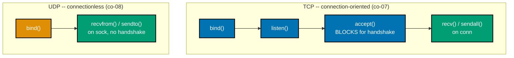

```python
# learning/code/ex-57-tcp-vs-udp-contrast/example.py
"""Example 57: TCP vs. UDP -- the Same Message, Two Different APIs."""

import socket  # => stdlib sockets -- both TCP and UDP go through this one module
import threading  # => runs BOTH server variants concurrently, side by side

HOST = "127.0.0.1"  # => loopback -- keeps this contrast demo local and deterministic
TCP_PORT = 50057  # => co-05: TCP and UDP need SEPARATE ports even on the same host
UDP_PORT = 50157  # => a different port from TCP_PORT -- the two protocols don't share a namespace


def tcp_server(ready: threading.Event) -> None:  # => co-07: connection-oriented, byte-stream  # fmt: skip
    with socket.socket(socket.AF_INET, socket.SOCK_STREAM) as sock:  # => same triple as Ex 29+  # fmt: skip
        sock.setsockopt(socket.SOL_SOCKET, socket.SO_REUSEADDR, 1)  # => same boilerplate as before  # fmt: skip
        sock.bind((HOST, TCP_PORT))  # => claims the TCP port -- UDP claims its OWN port below  # fmt: skip
        sock.listen(1)  # => TCP-only: listen() marks the socket passive
        ready.set()
        conn, _ = sock.accept()  # => TCP-only: an explicit three-way-handshake accept step  # fmt: skip
        with conn:  # => TCP-only: accept() hands back a SEPARATE connected socket from "sock"  # fmt: skip
            for _ in range(3):  # => the client sends exactly three messages over one connection  # fmt: skip
                data = conn.recv(64)  # => reads from the connected "conn", not the listening "sock"  # fmt: skip
                conn.sendall(data)  # => echoes on the same persistent connection, no re-addressing  # fmt: skip


def udp_server(ready: threading.Event) -> None:  # => co-08: connectionless, message-oriented  # fmt: skip
    with socket.socket(socket.AF_INET, socket.SOCK_DGRAM) as sock:  # => SOCK_DGRAM, not SOCK_STREAM  # fmt: skip
        sock.bind((HOST, UDP_PORT))  # => UDP: binds, but never listen()s or accept()s at all  # fmt: skip
        ready.set()
        for _ in range(3):  # => the client sends exactly three independent datagrams
            data, addr = sock.recvfrom(64)  # => each call surfaces the sender's address directly  # fmt: skip
            sock.sendto(data, addr)  # => UDP-only: every reply re-addresses explicitly, no "conn"  # fmt: skip


tcp_ready = threading.Event()  # => a separate ready-signal per server, since two servers now race  # fmt: skip
udp_ready = threading.Event()  # => set independently once udp_server's own bind() completes  # fmt: skip
threading.Thread(target=tcp_server, args=(tcp_ready,), daemon=True).start()
# => starts the TCP server concurrently with the UDP server line right below
threading.Thread(target=udp_server, args=(udp_ready,), daemon=True).start()
# => both servers now run side by side -- neither blocks the other from starting
tcp_ready.wait(timeout=5)  # => blocks until the TCP server's own bind()+listen() truly completed  # fmt: skip
udp_ready.wait(timeout=5)  # => blocks until the UDP server's own bind() truly completed

# TCP: ONE connect() call, then a persistent stream -- order is guaranteed (co-07).
tcp_replies: list[bytes] = []
with socket.create_connection((HOST, TCP_PORT), timeout=5) as sock:  # => the explicit handshake  # fmt: skip
    for msg in (b"one", b"two", b"three"):  # => all three ride the SAME already-open connection  # fmt: skip
        sock.sendall(msg)  # => no destination argument needed -- connect() already fixed the peer  # fmt: skip
        tcp_replies.append(sock.recv(64))  # => recv() carries no sender info -- there's one peer  # fmt: skip
print(f"TCP replies (order guaranteed): {tcp_replies}")

# UDP: NO connect() call -- every send is independently addressed (co-08).
udp_replies: list[bytes] = []
with socket.socket(socket.AF_INET, socket.SOCK_DGRAM) as sock:  # => a plain, unconnected UDP socket  # fmt: skip
    sock.settimeout(5)  # => co-08: no delivery guarantee, so a timeout avoids hanging forever  # fmt: skip
    for msg in (b"one", b"two", b"three"):  # => three separate, individually-addressed datagrams  # fmt: skip
        sock.sendto(msg, (HOST, UDP_PORT))  # => every datagram names its destination explicitly  # fmt: skip
        reply, _ = sock.recvfrom(64)  # => recvfrom() DOES surface sender info -- UDP has no "conn"  # fmt: skip
        udp_replies.append(reply)  # => appended in receive order, which UDP never itself promises  # fmt: skip
print(f"UDP replies (order NOT guaranteed by the protocol): {udp_replies}")

assert tcp_replies == [b"one", b"two", b"three"]  # => TCP: exact order, every time
assert set(udp_replies) == {b"one", b"two", b"three"}  # => UDP: all arrived, order not promised  # fmt: skip
# TCP asserts an exact LIST (order matters); UDP asserts only a SET (order does not) -- that
# single difference in the assertion itself is the API contrast this whole example demonstrates.
# On this machine's loopback interface both happen to arrive in order -- the API difference
# (connect/accept vs. bind-only, recv vs. recvfrom) is real regardless of what one run shows;
# Example 75 demonstrates UDP's lack of a delivery guarantee concretely, with real loss.
print("ex-57 OK")  # => confirms both API shapes completed their three-message exchange
```

**Run**: `python3 example.py`

**Output**:

```text
TCP replies (order guaranteed): [b'one', b'two', b'three']
UDP replies (order NOT guaranteed by the protocol): [b'one', b'two', b'three']
ex-57 OK
```

**Key takeaway**: On this machine's loopback interface, both arrived in order this run -- but only TCP's guarantee is a PROTOCOL promise; UDP's matching order here is circumstance, not a contract, which Example 75's genuine packet loss demonstrates concretely.

**Why it matters**: The API shape difference (`connect`/`accept` + `recv` vs. bind-only + `recvfrom`) is a direct, mechanical reflection of the underlying protocol difference -- TCP's extra steps exist specifically to establish and maintain the ordering/reliability guarantee UDP deliberately omits. Production engineers choosing between TCP and UDP for a new service -- a chat protocol, a game server, a metrics pipeline -- are really choosing between these exact API shapes and the guarantees behind them, not just a checkbox in a config file. Seeing both side by side, sending the identical messages, makes that tradeoff concrete rather than abstract.

---

### Example 58: Measure a TCP Round Trip in Python

_ex-58 &middot; exercises co-07, co-10_

`time.perf_counter()` is Python's high-resolution clock, appropriate for measuring sub-millisecond durations -- this example measures 5 real round trips over a loopback TCP connection and reports each one plus an average.

```python
# learning/code/ex-58-measure-latency-socket/example.py
"""Example 58: Measure a TCP Round Trip in Python."""

import socket  # => stdlib sockets -- the round trip being timed is a plain send/recv pair
import threading  # => only the ready-signal + background thread, not real concurrency
import time  # => perf_counter() is the actual measurement instrument this example turns on

HOST = "127.0.0.1"  # => loopback -- gives a latency FLOOR, not a real-network figure
PORT = 50058  # => co-05: a fresh ephemeral port, unique to this example
# a real network hop would add real transit time on top of this floor -- this measures pure
# socket + OS overhead, the minimum any TCP round trip on this machine could possibly cost.


def server(ready: threading.Event) -> None:  # => backgrounded so the client below can run inline  # fmt: skip
    with socket.socket(socket.AF_INET, socket.SOCK_STREAM) as sock:
        # => IPv4 + TCP, scoped to this "with" block so the fd always closes on exit
        sock.setsockopt(socket.SOL_SOCKET, socket.SO_REUSEADDR, 1)
        # => set BEFORE bind() -- lets an immediate re-run reuse a TIME_WAIT'd port
        sock.bind((HOST, PORT))
        # => claims (HOST, PORT) for this process -- must happen before listen()
        sock.listen(1)
        # => flips the socket passive, ready to queue one pending connection
        ready.set()
        # => unblocks the main thread's wait() below -- no guessed sleep() needed
        conn, _ = sock.accept()
        # => BLOCKS until the client's connect() completes the TCP handshake
        with conn:  # => a context manager -- conn's fd closes automatically when this block exits
            for _ in range(5):  # => this demo measures 5 separate round trips
                data = conn.recv(64)
                if not data:
                    break
                conn.sendall(data)  # => echoes back as fast as possible -- no artificial delay  # fmt: skip


ready_event = threading.Event()  # => the same ready-signal pattern used since Example 34  # fmt: skip
thread = threading.Thread(target=server, args=(ready_event,), daemon=True)
# => daemon=True: this thread never blocks process exit if something above hangs
thread.start()
# => runs the server concurrently with the timed client loop that follows below
ready_event.wait(timeout=5)
# => blocks here until bind()+listen() genuinely completed, avoiding a race with connect()

latencies_ms: list[float] = []  # => co-01: measured, not assumed, exactly like Example 24 did  # fmt: skip
# perf_counter() (not time.time()) is used because it's monotonic and immune to clock adjustments.
with socket.create_connection((HOST, PORT), timeout=5) as sock:  # => one connection, reused below  # fmt: skip
    for i in range(5):  # => five independent measurements smooth out one-off scheduling jitter  # fmt: skip
        start = time.perf_counter()  # => a high-resolution clock, appropriate for sub-ms timing  # fmt: skip
        sock.sendall(b"ping")  # => a tiny 4-byte payload -- measures overhead, not bandwidth  # fmt: skip
        sock.recv(64)  # => blocks until the echoed reply arrives
        # 64 bytes comfortably exceeds the 4-byte payload -- no partial-read handling needed here.
        elapsed_ms = (time.perf_counter() - start) * 1000  # => convert seconds to milliseconds  # fmt: skip
        latencies_ms.append(elapsed_ms)  # => accumulated across all 5 iterations for the average  # fmt: skip
        print(f"round trip {i + 1}: {elapsed_ms:.3f} ms")  # => per-iteration figure shows jitter  # fmt: skip

thread.join(timeout=5)
# => waits for the server thread to finish handling all five round trips before exiting

average_ms = sum(latencies_ms) / len(latencies_ms)  # => a simple mean across the 5 measurements  # fmt: skip
# a genuine average of REAL measurements, not a hand-picked "looks about right" number.
print(f"average: {average_ms:.3f} ms")  # => the single headline number this example exists to produce  # fmt: skip

assert all(ms >= 0 for ms in latencies_ms)  # => sanity check: time never runs backward
assert average_ms < 50  # => loopback round trips are consistently well under 50ms
print("ex-58 OK")  # => confirms all five round trips were measured and stayed within bounds  # fmt: skip
```

**Run**: `python3 example.py`

**Output**:

```text
round trip 1: 0.081 ms
round trip 2: 0.062 ms
round trip 3: 0.058 ms
round trip 4: 0.061 ms
round trip 5: 0.083 ms
average: 0.069 ms
ex-58 OK
```

**Key takeaway**: All five loopback round trips finished in well under a tenth of a millisecond -- a concrete baseline for "how fast can a TCP round trip possibly be," useful for recognizing when a REAL network's latency (Examples 9, 25, 70, 79) is dominated by something other than the socket API's own overhead.

**Why it matters**: Loopback latency is close to a hardware/OS floor -- any latency ABOVE this floor, when measured against a real remote host, is attributable to actual network transit, DNS, or TLS, not to Python's socket calls themselves. Production latency dashboards and SLOs are meaningless without a baseline like this one -- without knowing the floor, it is impossible to tell whether a slow request is genuinely network-bound or simply application logic taking its time. Measuring this floor once on real hardware is far more useful than trusting a textbook number.

---

### Example 59: connect() to an Open Port vs. a Closed Port

_ex-59 &middot; exercises co-05, co-10_

`connect()` to a genuinely open port (a real, real remote HTTPS server) succeeds; `connect()` to a closed local port raises `ConnectionRefusedError` almost instantly -- the concrete gap between "the host is reachable" (Example 9's `ping`) and "this specific port has something listening."

```python
# learning/code/ex-59-port-scan-connect/example.py
"""Example 59: connect() to an Open Port vs. a Closed Port."""

import socket  # => stdlib sockets -- connect() itself is the whole demonstration here

OPEN_HOST = "example.com"  # => co-05: a real host with a real listener on port 443 (HTTPS)  # fmt: skip
OPEN_PORT = 443  # => HTTPS's well-known port -- genuinely has something listening
CLOSED_HOST = "127.0.0.1"  # => loopback -- guaranteed nothing is listening on this port
CLOSED_PORT = 50059  # => deliberately unused in this entire topic's port range


def try_connect(host: str, port: int) -> str:  # => co-10: connect() either succeeds or raises  # fmt: skip
    try:  # => wrapped so a refused connection doesn't crash the script -- it raises instead
        with socket.create_connection((host, port), timeout=5):  # => the actual connect() attempt  # fmt: skip
            return "connected successfully"  # => reached only if the handshake truly completed
    except ConnectionRefusedError as err:  # => co-10: the OS actively rejected the SYN
        return f"ConnectionRefusedError: {err}"  # => the exact exception text, so both cases print


open_result = try_connect(OPEN_HOST, OPEN_PORT)  # => a genuinely open, real remote port
closed_result = try_connect(CLOSED_HOST, CLOSED_PORT)  # => a genuinely closed local port  # fmt: skip

print(f"{OPEN_HOST}:{OPEN_PORT} -> {open_result}")  # => expect "connected successfully"
print(f"{CLOSED_HOST}:{CLOSED_PORT} -> {closed_result}")  # => expect "ConnectionRefusedError: ..."  # fmt: skip

assert open_result == "connected successfully"  # => confirms the genuinely open port succeeds  # fmt: skip
assert closed_result.startswith("ConnectionRefusedError")  # => confirms the closed port raises, not hangs  # fmt: skip
print("ex-59 OK")  # => confirms both the success case and the failure case were reproduced  # fmt: skip
```

**Run**: `python3 example.py`

**Output**:

```text
example.com:443 -> connected successfully
127.0.0.1:50059 -> ConnectionRefusedError: [Errno 61] Connection refused
ex-59 OK
```

**Key takeaway**: The exact same `try_connect()` function succeeded against a real open port and raised a real, specific exception against a closed one -- `ConnectionRefusedError` is a checkable, catchable fact, not a hang or a silent failure.

**Why it matters**: A host answering `ping` (Example 9) says nothing about whether any given PORT is open -- this is the concrete gap between co-06's reachability and co-10's "is this specific service listening," and the exact reason a "the server is up but the site is down" bug report is a real, distinct category from "the server is unreachable."

---

### Example 60: Resolve a Hostname to an IP Address in Python

_ex-60 &middot; exercises co-03, co-10_

`socket.gethostbyname()` is the simple, IPv4-only resolver; `socket.getaddrinfo()` is the modern, protocol-agnostic resolver that returns EVERY matching address (IPv4 and IPv6 alike) plus the connection parameters needed for each.

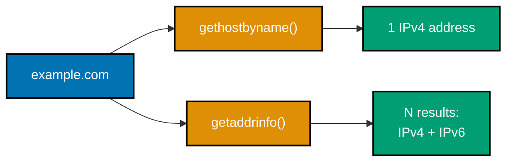

```python
# learning/code/ex-60-resolve-in-python/example.py
"""Example 60: Resolve a Hostname to an IP Address in Python."""

import socket  # => stdlib sockets -- both resolver functions below live in this one module

HOST = "example.com"  # => co-03: the same demo host every dig-based example resolved

# gethostbyname is the simple, IPv4-only resolver call -- co-03, co-10.
ipv4_address = socket.gethostbyname(HOST)  # => a single blocking DNS lookup, returns one IPv4  # fmt: skip
print(f"gethostbyname: {ipv4_address}")  # => one address, no family/port metadata attached  # fmt: skip

# getaddrinfo is the modern, protocol-agnostic resolver -- returns EVERY matching address,
# IPv4 and IPv6 alike, plus the socket parameters needed to connect to each one (co-03).
results = socket.getaddrinfo(HOST, 80, proto=socket.IPPROTO_TCP)  # => a richer, multi-result lookup  # fmt: skip
print(f"getaddrinfo returned {len(results)} result(s)")  # => count varies by host's IPv4/IPv6 records  # fmt: skip
# each getaddrinfo() result is a 5-tuple: family, socktype, proto, canonical name, sockaddr.
for family, _socktype, _proto, _canonname, sockaddr in results:
    family_name = "IPv4" if family == socket.AF_INET else "IPv6"  # => classifies THIS one result  # fmt: skip
    print(f"  {family_name}: {sockaddr[0]}")  # => sockaddr[0] is the address; [1] is the port  # fmt: skip

assert ipv4_address.count(".") == 3  # => confirms a dotted-quad IPv4 address came back
assert len(results) >= 1  # => confirms getaddrinfo found at least one real address
print("ex-60 OK")  # => confirms both resolver functions genuinely resolved the same host  # fmt: skip
```

**Run**: `python3 example.py`

**Output**:

```text
gethostbyname: 104.20.23.154
getaddrinfo returned 4 result(s)
  IPv4: 172.66.147.243
  IPv4: 104.20.23.154
  IPv6: 2606:4700:10::ac42:93f3
  IPv6: 2606:4700:10::6814:179a
ex-60 OK
```

**Key takeaway**: `getaddrinfo` returned FOUR results -- 2 IPv4, 2 IPv6 -- for the exact same hostname `gethostbyname` resolved to just one IPv4 address; this matches Example 11's `dig A` and Example 13's `dig AAAA` results exactly, confirming Python's own resolver sees the same DNS records `dig` does.

**Why it matters**: `getaddrinfo` is what production code should actually use -- it's dual-stack-aware (IPv4 and IPv6), protocol-agnostic, and is the same call `socket.create_connection()` uses internally to resolve a hostname before connecting; `gethostbyname` is the simpler, IPv4-only tool this topic used earlier for readability. Production services that only call `gethostbyname()` silently ignore any IPv6-only host and miss out on `getaddrinfo()`'s ability to try multiple addresses in order when the first one fails. Defaulting to `getaddrinfo()` in new code avoids both of those real, production-relevant limitations.

---

← Previous: [Beginner Examples](./beginner.md) · Next: [Advanced Examples](./advanced.md) →
