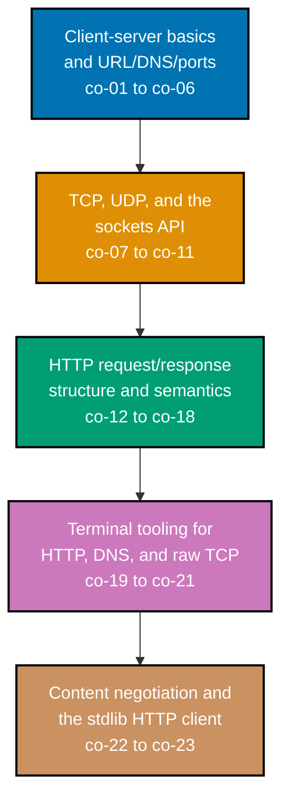

## Prerequisites

- **Prior topics**: [4 · Just Enough Python](../../just-enough-python/learning/overview.md) --
  every socket example in this topic is Python, and this topic assumes you can already read and
  write functions, `list`/`dict` literals, and loops the way that primer taught them.
- **Tools & environment**: a macOS/Linux terminal; **Python 3.x** installed (`python3 --version`);
  the **`curl`**, **`dig`**, and **`ping`** CLIs installed and on `PATH`; network access to reach a
  real URL. No third-party Python packages are needed for any of the 82 learning examples -- every
  one of them uses only the standard library (`socket`, `http.client`, `urllib.request`,
  `threading`, `subprocess`).
- **Assumed knowledge**: reading/writing basic Python; comfort running terminal commands. No prior
  networking background is required -- this topic is where that background starts.

## Why this exists -- the big idea

The problem before the solution: your software talks to other machines constantly, and when it
breaks you must know what happens between "hit a URL" and "get a response" -- otherwise every
network bug is magic. The one idea worth keeping if you forget everything else: **the network is a
stack of translations** -- name -> address -> connection -> bytes -> message (DNS -> TCP -> TLS ->
HTTP) -- and you debug by asking which layer failed.

**Cross-cutting big ideas, taught here and then reused for the rest of this topic**:
`layering-and-leaks` -- each layer hides the one below until it leaks (a DNS failure surfaces as an
HTTP timeout, a TCP failure surfaces as a connection error, and knowing which layer actually failed
is the entire debugging skill this topic builds; Example 80 makes this concrete by forcing a DNS
failure and a TCP failure side by side and showing they raise genuinely different exceptions).
`abstraction-and-its-cost` -- the tidy `curl` call you run every day (Example 1) hides four separate
protocols (DNS, TCP, TLS, HTTP) that you must be able to peel back by hand the moment something
breaks; Examples 43-44 and 69-70 do exactly that peeling-back, composing the same request from raw
sockets with no library help at all.

## Install and run your first example

Confirm the four tools this topic uses are all installed:

```text
$ python3 --version
Python 3.13.12
$ curl --version | head -1
curl 8.7.1 (x86_64-apple-darwin24.0) libcurl/8.7.1 ...
$ dig -v
DiG 9.10.6
```

**A note on versions**: this topic's examples were authored and verified against these exact tool
versions, in this sandbox, on 2026-07-14. Any reasonably current version of Python 3, curl, `dig`,
and `ping` behaves identically for everything this topic teaches -- the socket API, curl's flag
set, and `dig`'s output format have all been stable for years (see each tier page's Accuracy notes
inherited from the syllabus's DD-35 primary-source citations).

Every Beginner-tier example is a real terminal command, run directly:

```text
curl https://example.com
```

Every Intermediate- and Advanced-tier example is a complete, self-contained `.py` file colocated
under `learning/code/`. The command you will run for most of them is exactly this:

```text
python3 example.py
```

Each `.py` example prints its own result and then finishes with a bare `assert` confirming the
result is correct -- a silent, zero-output exit (return code `0`) means every assertion passed.
`python3 example.py; echo $?` is a quick way to confirm both the printed output and the exit code in
one line. A handful of examples (29/30, 54/55, 81, and the capstone) are deliberately split into
separate `server.py`/`client.py` files, run as two processes -- server backgrounded first, client
run afterward.

## How this topic's examples are organized

- **Beginner** (Examples 1-28) -- everything from the terminal: `curl` (plain, verbose, headers-only,
  redirects, methods, status codes, custom headers, timing), `ping`, and DNS lookups with `dig`,
  `nslookup`, and `host` against every common record type.
- **Intermediate** (Examples 29-60) -- hand-rolled TCP servers and clients with Python's `socket`
  module, message framing over a raw byte stream, a tiny command protocol, `nc`, hand-crafted HTTP
  requests, curl-driven HTTP methods and content negotiation, and UDP's connectionless contrast to
  everything TCP guarantees.
- **Advanced** (Examples 61-82) -- the stdlib `http.client`/`urllib.request` HTTP clients, TLS in
  depth (curl's handshake trace and `openssl s_client`), manually following redirects, keep-alive,
  timeouts, genuine UDP packet loss, a concurrent multi-client command server, and a final full
  DNS-to-HTTP explorer script.

Every example cites the concept (`co-NN`) it exercises, and every accuracy claim about the socket
API, curl's flag set, and the relevant RFCs traces to `docs.python.org`, the curl/OpenSSL/OpenBSD
man pages, and the IETF RFCs named in the syllabus's DD-35 citations, web-verified 2026-07-12 and
re-confirmed 2026-07-14.



## Concepts

Every worked example in this topic's follow-up pages cites the `co-NN` concept it exercises -- this
section is the 1:1 reference those citations point back to. Read it in order: the client-server
model comes first because every later concept is described as a role one side or the other plays in
it.

### co-01 · Client-Server Model

One side (the client) initiates a request and the other (the server) listens and responds; every
exchange in this topic has these two roles, whether it's `curl` talking to a real website or a
hand-rolled Python socket talking to a background thread.

**Why it matters**: every other HTTP and TCP/UDP concept in this topic's Concepts section describes
something ONE of these two roles does -- a request line is something the client sends, a status line
is something the server sends -- so without this vocabulary, "who does what" has no fixed answer.

**Verify it**: Example 1's bare `curl https://example.com` is the smallest complete instance of this
model; Example 81's full command server/client pair and the capstone extend it to multiple
concurrent clients.

### co-02 · URL Anatomy

A URL decomposes into scheme, host, optional port, path, and query string, each of which routes the
request differently -- change any one component and you're addressing a genuinely different
resource, or a different machine entirely.

**Why it matters**: every curl command and every Python HTTP client call in this topic starts by
implicitly parsing a URL into these five parts before it can even open a connection.

**Verify it**: Example 7 verifies the five-way split directly with `urllib.parse.urlsplit`; Example
8 confirms the port component's default value is real by watching curl actually connect to port 80
vs. 443.

### co-03 · DNS Resolution

A hostname is translated to an IP address by resolvers before any connection can open (`name ->
address`) -- this is the very first stage in co-01's "the network is a stack of translations" idea.

**Why it matters**: nothing downstream (TCP, TLS, HTTP) can happen until this translation succeeds --
Example 80 shows a DNS failure surfacing as a completely different exception type than a TCP
failure, precisely because it happens at an earlier, separate stage.

**Verify it**: Example 10 shows `ping` performing this resolution as a visible side effect; Example
60 calls Python's own resolver directly (`gethostbyname`, `getaddrinfo`); Example 82's `dig` and
`gethostbyname` calls confirm two independent tools agree on the essential result.

### co-04 · DNS Record Types

DNS holds typed records -- `A`/`AAAA` (addresses), `CNAME` (alias), `MX` (mail), `NS`
(nameservers), `TXT` -- each answering a genuinely different question about the same domain.

**Why it matters**: "the domain has a DNS record" is an incomplete statement -- WHICH record type
was queried determines what question was actually being asked, and a domain can have several
different record types with entirely different answers.

**Verify it**: Examples 11, 13, 14, 15, 16, and 17 each query exactly one record type against
`example.com` (or, for CNAME, `www.github.com`) and print its real ANSWER section.

### co-05 · IP and Ports

Hosts are addressed by IPv4/IPv6 addresses and services by port numbers, with well-known ports
(80/443/22/53) fixing common services -- an address alone tells you WHICH machine; a port tells you
WHICH service on that machine.

**Why it matters**: a host being reachable (co-06) says nothing about whether any specific PORT has
a service listening -- Example 59's contrast between an open port and a closed one is exactly this
gap made concrete.

**Verify it**: Example 27 maps all four well-known ports to their service names via
`socket.getservbyport`; Example 8 confirms HTTP's and HTTPS's default ports are real, observed
values, not just documentation.

### co-06 · ICMP Ping

`ping` sends ICMP echo requests to test reachability and measure round-trip latency, independent of
any application protocol -- it operates entirely below HTTP, TCP, and even DNS's application-level
concerns.

**Why it matters**: a successful `ping` confirms network-layer reachability ONLY -- it says nothing
about any specific application or port, which is exactly the distinction Example 59 draws when a
real, pingable host still refuses a connection on a specific closed port.

**Verify it**: Example 9 runs three real ICMP exchanges and reports their round-trip times; Example
10 shows the resolved IP address `ping` reveals as a side effect.

### co-07 · TCP Connection

TCP establishes a connection via a three-way handshake (SYN, SYN-ACK, ACK) and then delivers a
reliable, ordered byte stream -- every byte sent arrives, in order, or the connection reports an
error.

**Why it matters**: this reliability guarantee is exactly why HTTP is built on TCP rather than UDP --
Example 82's closing UDP-contrast note explains this connection directly.

**Verify it**: Example 29's `bind`/`listen`/`accept` sequence and Example 32's annotated
`connect`/`sendall`/`recv` calls are the smallest complete instances; Example 57 runs a TCP exchange
and a UDP exchange side by side for direct comparison.

### co-08 · UDP Datagram

UDP sends connectionless, unreliable, message-oriented datagrams with no handshake, ordering, or
delivery guarantee -- `sendto()` succeeds instantly whether or not anything is listening on the
other end.

**Why it matters**: this is the concrete cost UDP charges in exchange for lower overhead than TCP --
no handshake round trip, but also no confirmation of delivery, ever, from the protocol itself.

**Verify it**: Example 56 sends to a closed port and shows `sendto()` raising no error at all;
Example 75 genuinely overflows a tiny receive buffer and observes real, non-fabricated packet loss.

### co-09 · TCP vs. UDP

TCP trades latency for reliability and ordering; UDP trades those guarantees for low-overhead
speed -- neither is universally "better"; you pick per use case based on which tradeoff your
application actually needs.

**Why it matters**: choosing the wrong one for a given use case (TCP for something latency-critical
that could tolerate loss, or UDP for something that genuinely needs every byte) is a real,
consequential design mistake, not a stylistic preference.

**Verify it**: Example 75's genuine, observed UDP packet loss is the concrete cost side of this
tradeoff; Example 57's side-by-side TCP/UDP API contrast is the mechanism side.

### co-10 · Sockets API

The Berkeley sockets API (`socket`/`bind`/`listen`/`accept`/`connect`/`send`/`recv`) is the
programmatic interface to TCP and UDP -- every HTTP client and server this topic builds is
ultimately calling these same primitives underneath.

**Why it matters**: every convenience layer this topic covers (`http.client`, `urllib.request`) is
optional, built entirely on top of this API -- Example 69 proves this directly by building a working
HTTP client from nothing but `socket.create_connection`.

**Verify it**: Example 31 annotates `bind`/`listen`/`accept` individually; Example 38 reproduces a
real `SO_REUSEADDR`/`TIME_WAIT` collision and its fix.

### co-11 · Request/Response Framing

A byte stream has no built-in message boundaries, so a protocol frames messages (for example,
newline-delimited) and reassembles partial reads -- a single `recv()` call can never be trusted to
return exactly "one whole message."

**Why it matters**: every hand-rolled protocol in this topic (the PING/TIME command protocol, the
capstone's server) depends entirely on a correct framing helper -- get this wrong and messages
silently corrupt or split incorrectly under real network conditions.

**Verify it**: Example 33's `read_line()` deliberately reads 4 bytes at a time to prove the framing
survives arbitrary chunking; Example 34's `recv_exact()` handles the delimiter-free, fixed-size
case.

### co-12 · HTTP Request Structure

An HTTP request is a request line (method + path + version), headers, a blank line, and an optional
body -- a fixed, well-defined shape regardless of which method or headers are actually used.

**Why it matters**: this structure is exactly what every HTTP client -- `curl`, `http.client`, or a
hand-typed string over a raw socket -- ultimately writes onto the wire; there is no other valid
shape.

**Verify it**: Example 5 identifies the request line inside real `curl -v` output; Example 43
hand-types this exact structure as a plain string and sends it over a raw socket to a real host.

### co-13 · HTTP Response Structure

An HTTP response is a status line (version + code + reason), headers, a blank line, and an optional
body -- the response's mirror image of co-12's request structure.

**Why it matters**: the blank line separating headers from body is the ONE fixed, universal boundary
every HTTP/1.1 response has, which is exactly what makes it possible to parse a response by hand
with a single `partition()` call.

**Verify it**: Example 4 locates the status line inside real `curl -v` output; Example 44 splits a
raw response into status line, headers, and body using nothing but that one boundary.

### co-14 · HTTP Methods

`GET`, `POST`, `PUT`, `DELETE`, and `HEAD` carry distinct semantics for reading, creating, replacing,
deleting, and header-only requests -- the method is a genuine part of the request's meaning, not
just a label.

**Why it matters**: the same URL path can route to entirely different application logic depending
purely on which method was used -- Example 48's `PUT`/`DELETE` pair against the same host shows this
directly.

**Verify it**: Example 26 confirms `HEAD` returns headers with no body; Example 61 issues a `GET`
via the stdlib `http.client` instead of `curl`.

### co-15 · HTTP Status Codes

Status codes group into `2xx` success, `3xx` redirect, `4xx` client error, and `5xx` server error
classes -- the FIRST digit is the fastest triage signal in any HTTP debugging session.

**Why it matters**: a `4xx` means the request itself is likely wrong (don't just retry unchanged); a
`5xx` means the problem is probably server-side (retrying later might help) -- conflating the two
classes throws away information the server specifically provided.

**Verify it**: Example 49 tours all four classes against `mock.codes`; Example 72 branches on status
class explicitly, in code, distinguishing a `404` from a `500`.

### co-16 · HTTP Headers

Headers such as `Host`, `Content-Type`, `Content-Length`, `User-Agent`, and `Accept-Encoding` carry
request/response metadata -- information ABOUT the message, sent alongside (but distinct from) the
message's own body.

**Why it matters**: `Content-Length`'s claimed value is a CHECKABLE fact about the body that follows
it, not just an informational hint -- Example 50 verifies this directly, and Example 63 does the
same check programmatically.

**Verify it**: Example 6 inspects `Content-Type` and `Content-Length` in real `curl -v` output;
Example 23 confirms `User-Agent` is fully client-controlled and trivially overridden.

### co-17 · HTTP vs. HTTPS (TLS)

HTTPS wraps HTTP in a TLS session (a 1-RTT TLS 1.3 handshake) that encrypts and authenticates the
connection over port 443 -- the exact same HTTP request/response shape, running inside an encrypted
tunnel.

**Why it matters**: HTTPS is not a different protocol from HTTP -- it's HTTP plus a transparent TLS
wrapper, which is exactly why `HTTPConnection` -> `HTTPSConnection` (Example 64) is the ONLY code
change needed to add full encryption.

**Verify it**: Example 65 inspects a real TLS handshake's negotiated version and cipher via `curl
-v`; Example 66 uses `openssl s_client` to print the full certificate chain; Example 67 proves the
encryption requirement negatively by sending unencrypted bytes to port 443 and observing a real
rejection.

### co-18 · Redirects

A `3xx` response with a `Location` header directs the client to re-request a new URL -- the server's
explicit way of saying "the resource you want is somewhere else."

**Why it matters**: a redirect target can change scheme, host, or port entirely -- Example 68's
manual redirect-following has to branch on the target URL's scheme specifically because it observed
a real `http` -> `https` scheme change mid-chain.

**Verify it**: Example 21's `curl -IL` follows a redirect automatically and prints both hops' full
headers; Example 68 does the same following by hand, reading `Location` and issuing a second
request itself.

### co-19 · curl Tooling

`curl` drives HTTP from the terminal: `-v` (verbose), `-I` (head), `-L` (follow), `-d` (body), `-H`
(header), `-w` (timing) are the specific flags this topic exercises directly.

**Why it matters**: `curl -v` is the single most useful command for turning "hit a URL" from an
opaque black box into a fully visible protocol trace -- almost every Beginner-tier example either
uses it directly or reads a captured trace from it.

**Verify it**: Example 2 captures a full `-v` trace; Example 25 and Example 79 both use `-w` to
extract precise timing figures instead of a status code.

### co-20 · DNS Tooling

`dig`, `nslookup`, and `host` query DNS directly, revealing records, resolvers, and (in principle)
the full resolution path from root to authoritative server.

**Why it matters**: having three independent tools that answer the same underlying DNS questions
means never being stuck on a system where only one happens to be installed.

**Verify it**: Examples 11-17 use `dig` against every common record type; Example 18 cross-checks
with `nslookup`; Example 19 cross-checks again with `host`; Example 20's `dig +trace` attempts the
full iterative walk (and honestly documents this sandbox's limitation reaching it).

### co-21 · Connection Inspection

`nc` (netcat) opens or listens on raw TCP sockets so you can send and read protocol bytes by hand,
with zero protocol logic of its own getting in the way.

**Why it matters**: when a higher-level tool hides too much, `nc` shows you the exact, unprocessed
bytes a client sent or a server replied with -- the ultimate "peel back the abstraction" move this
topic keeps returning to.

**Verify it**: Example 41 sends raw bytes to a hand-rolled Python responder over `nc`; Example 42
captures curl's own real request bytes by listening with `nc -l`.

### co-22 · Content Negotiation

`Accept`/`Content-Type` headers and `Accept-Encoding: gzip` let client and server agree on
representation and compression -- the client states a preference, and the server (ideally) honors
it, confirming what it chose via its own response headers.

**Why it matters**: this is how one single API endpoint can serve both JSON and HTML (or compressed
and uncompressed bodies) depending purely on what the client asked for, with no separate URL needed
per format.

**Verify it**: Example 51's hand-rolled server reads `Accept` and replies with JSON or plain text
accordingly; Example 78 extends this to two full, independent rounds against a fresh server each
time.

### co-23 · stdlib HTTP Client

Python's `http.client` and `urllib.request` issue HTTP(S) requests and expose status, headers, and
body programmatically -- two different levels of convenience over the same underlying socket API.

**Why it matters**: `http.client` gives more explicit control (separate host/path, an explicit
connection object you can reuse for keep-alive); `urllib.request` is more convenient (one URL
string, one call) -- knowing both means choosing deliberately rather than being stuck with whichever
one you happened to learn first.

**Verify it**: Example 61 issues a `GET` with `http.client`; Example 62 issues the same request with
`urllib.request`; Example 71 reuses one `http.client` connection across two separate requests.

## Examples by Level

### Beginner (Examples 1–28)

- [Example 1: curl a URL](/en/c/learn/fundamentally-strong/software-engineer/networking-essentials/learning/beginner#example-1-curl-a-url)
- [Example 2: curl Verbose -- See the Protocol Underneath](/en/c/learn/fundamentally-strong/software-engineer/networking-essentials/learning/beginner#example-2-curl-verbose----see-the-protocol-underneath)
- [Example 3: curl Headers Only, No Body](/en/c/learn/fundamentally-strong/software-engineer/networking-essentials/learning/beginner#example-3-curl-headers-only-no-body)
- [Example 4: Read the Status Line](/en/c/learn/fundamentally-strong/software-engineer/networking-essentials/learning/beginner#example-4-read-the-status-line)
- [Example 5: Identify the Request Line](/en/c/learn/fundamentally-strong/software-engineer/networking-essentials/learning/beginner#example-5-identify-the-request-line)
- [Example 6: Inspect Response Headers](/en/c/learn/fundamentally-strong/software-engineer/networking-essentials/learning/beginner#example-6-inspect-response-headers)
- [Example 7: URL Anatomy Breakdown](/en/c/learn/fundamentally-strong/software-engineer/networking-essentials/learning/beginner#example-7-url-anatomy-breakdown)
- [Example 8: Default Ports -- HTTP 80, HTTPS 443](/en/c/learn/fundamentally-strong/software-engineer/networking-essentials/learning/beginner#example-8-default-ports----http-80-https-443)
- [Example 9: ping a Host](/en/c/learn/fundamentally-strong/software-engineer/networking-essentials/learning/beginner#example-9-ping-a-host)
- [Example 10: ping Shows the Resolved IP](/en/c/learn/fundamentally-strong/software-engineer/networking-essentials/learning/beginner#example-10-ping-shows-the-resolved-ip)
- [Example 11: dig an A Record](/en/c/learn/fundamentally-strong/software-engineer/networking-essentials/learning/beginner#example-11-dig-an-a-record)
- [Example 12: dig +short -- Just the Answer](/en/c/learn/fundamentally-strong/software-engineer/networking-essentials/learning/beginner#example-12-dig-short----just-the-answer)
- [Example 13: dig an AAAA Record](/en/c/learn/fundamentally-strong/software-engineer/networking-essentials/learning/beginner#example-13-dig-an-aaaa-record)
- [Example 14: dig an MX Record](/en/c/learn/fundamentally-strong/software-engineer/networking-essentials/learning/beginner#example-14-dig-an-mx-record)
- [Example 15: dig an NS Record](/en/c/learn/fundamentally-strong/software-engineer/networking-essentials/learning/beginner#example-15-dig-an-ns-record)
- [Example 16: dig a CNAME Record](/en/c/learn/fundamentally-strong/software-engineer/networking-essentials/learning/beginner#example-16-dig-a-cname-record)
- [Example 17: dig a TXT Record](/en/c/learn/fundamentally-strong/software-engineer/networking-essentials/learning/beginner#example-17-dig-a-txt-record)
- [Example 18: nslookup Basics](/en/c/learn/fundamentally-strong/software-engineer/networking-essentials/learning/beginner#example-18-nslookup-basics)
- [Example 19: The host Command](/en/c/learn/fundamentally-strong/software-engineer/networking-essentials/learning/beginner#example-19-the-host-command)
- [Example 20: dig +trace -- Root to Authoritative](/en/c/learn/fundamentally-strong/software-engineer/networking-essentials/learning/beginner#example-20-dig-trace----root-to-authoritative)
- [Example 21: curl Follows a Redirect](/en/c/learn/fundamentally-strong/software-engineer/networking-essentials/learning/beginner#example-21-curl-follows-a-redirect)
- [Example 22: curl Status Code 404](/en/c/learn/fundamentally-strong/software-engineer/networking-essentials/learning/beginner#example-22-curl-status-code-404)
- [Example 23: curl Custom User-Agent](/en/c/learn/fundamentally-strong/software-engineer/networking-essentials/learning/beginner#example-23-curl-custom-user-agent)
- [Example 24: curl Custom Header](/en/c/learn/fundamentally-strong/software-engineer/networking-essentials/learning/beginner#example-24-curl-custom-header)
- [Example 25: curl Timing](/en/c/learn/fundamentally-strong/software-engineer/networking-essentials/learning/beginner#example-25-curl-timing)
- [Example 26: curl HEAD Method](/en/c/learn/fundamentally-strong/software-engineer/networking-essentials/learning/beginner#example-26-curl-head-method)
- [Example 27: Well-Known Ports](/en/c/learn/fundamentally-strong/software-engineer/networking-essentials/learning/beginner#example-27-well-known-ports)
- [Example 28: Resolve, Then curl by IP](/en/c/learn/fundamentally-strong/software-engineer/networking-essentials/learning/beginner#example-28-resolve-then-curl-by-ip)

### Intermediate (Examples 29–60)

- [Example 29: TCP Echo Server](/en/c/learn/fundamentally-strong/software-engineer/networking-essentials/learning/intermediate#example-29-tcp-echo-server)
- [Example 30: TCP Echo Client](/en/c/learn/fundamentally-strong/software-engineer/networking-essentials/learning/intermediate#example-30-tcp-echo-client)
- [Example 31: socket.bind / .listen / .accept, Annotated](/en/c/learn/fundamentally-strong/software-engineer/networking-essentials/learning/intermediate#example-31-socketbind--listen--accept-annotated)
- [Example 32: socket.connect / .sendall / .recv, Annotated](/en/c/learn/fundamentally-strong/software-engineer/networking-essentials/learning/intermediate#example-32-socketconnect--sendall--recv-annotated)
- [Example 33: Line Framing with \n Delimiters](/en/c/learn/fundamentally-strong/software-engineer/networking-essentials/learning/intermediate#example-33-line-framing-with-n-delimiters)
- [Example 34: Handle Partial recv() -- Reassemble a Large Message](/en/c/learn/fundamentally-strong/software-engineer/networking-essentials/learning/intermediate#example-34-handle-partial-recv----reassemble-a-large-message)
- [Example 35: Multiple Messages, One Connection, In Order](/en/c/learn/fundamentally-strong/software-engineer/networking-essentials/learning/intermediate#example-35-multiple-messages-one-connection-in-order)
- [Example 36: A Tiny Command Protocol -- PING/PONG and TIME](/en/c/learn/fundamentally-strong/software-engineer/networking-essentials/learning/intermediate#example-36-a-tiny-command-protocol----pingpong-and-time)
- [Example 37: Graceful Close -- Detecting an Empty recv()](/en/c/learn/fundamentally-strong/software-engineer/networking-essentials/learning/intermediate#example-37-graceful-close----detecting-an-empty-recv)
- [Example 38: SO_REUSEADDR -- Restarting a Server Without "Address Already in Use"](/en/c/learn/fundamentally-strong/software-engineer/networking-essentials/learning/intermediate#example-38-so_reuseaddr----restarting-a-server-without-address-already-in-use)
- [Example 39: A Sequential Accept Loop -- One Client at a Time](/en/c/learn/fundamentally-strong/software-engineer/networking-essentials/learning/intermediate#example-39-a-sequential-accept-loop----one-client-at-a-time)
- [Example 40: A Thread per Client -- Serving Two Clients Simultaneously](/en/c/learn/fundamentally-strong/software-engineer/networking-essentials/learning/intermediate#example-40-a-thread-per-client----serving-two-clients-simultaneously)
- [Example 41: Raw HTTP with nc -- Local HTTP Responder](/en/c/learn/fundamentally-strong/software-engineer/networking-essentials/learning/intermediate#example-41-raw-http-with-nc----local-http-responder)
- [Example 42: nc -l -- Listen and Show the Raw Bytes curl Actually Sends](/en/c/learn/fundamentally-strong/software-engineer/networking-essentials/learning/intermediate#example-42-nc--l----listen-and-show-the-raw-bytes-curl-actually-sends)
- [Example 43: Handcraft an HTTP Request Over a Raw Socket](/en/c/learn/fundamentally-strong/software-engineer/networking-essentials/learning/intermediate#example-43-handcraft-an-http-request-over-a-raw-socket)
- [Example 44: Split a Raw HTTP Response into Status Line, Headers, and Body](/en/c/learn/fundamentally-strong/software-engineer/networking-essentials/learning/intermediate#example-44-split-a-raw-http-response-into-status-line-headers-and-body)
- [Example 45: Fetch a Real HTML Page](/en/c/learn/fundamentally-strong/software-engineer/networking-essentials/learning/intermediate#example-45-fetch-a-real-html-page)
- [Example 46: POST a Form Body](/en/c/learn/fundamentally-strong/software-engineer/networking-essentials/learning/intermediate#example-46-post-a-form-body)
- [Example 47: POST JSON with an Explicit Content-Type](/en/c/learn/fundamentally-strong/software-engineer/networking-essentials/learning/intermediate#example-47-post-json-with-an-explicit-content-type)
- [Example 48: PUT and DELETE Methods](/en/c/learn/fundamentally-strong/software-engineer/networking-essentials/learning/intermediate#example-48-put-and-delete-methods)
- [Example 49: A Tour of Status Codes](/en/c/learn/fundamentally-strong/software-engineer/networking-essentials/learning/intermediate#example-49-a-tour-of-status-codes)
- [Example 50: Content-Length Matches the Real Body](/en/c/learn/fundamentally-strong/software-engineer/networking-essentials/learning/intermediate#example-50-content-length-matches-the-real-body)
- [Example 51: Accept Header Negotiation -- Ask for JSON, Get JSON](/en/c/learn/fundamentally-strong/software-engineer/networking-essentials/learning/intermediate#example-51-accept-header-negotiation----ask-for-json-get-json)
- [Example 52: Content Negotiation with gzip](/en/c/learn/fundamentally-strong/software-engineer/networking-essentials/learning/intermediate#example-52-content-negotiation-with-gzip)
- [Example 53: Chunked Transfer Encoding](/en/c/learn/fundamentally-strong/software-engineer/networking-essentials/learning/intermediate#example-53-chunked-transfer-encoding)
- [Example 54: UDP Echo Server](/en/c/learn/fundamentally-strong/software-engineer/networking-essentials/learning/intermediate#example-54-udp-echo-server)
- [Example 55: UDP Echo Client](/en/c/learn/fundamentally-strong/software-engineer/networking-essentials/learning/intermediate#example-55-udp-echo-client)
- [Example 56: UDP Has No Handshake -- Sending to a Closed Port](/en/c/learn/fundamentally-strong/software-engineer/networking-essentials/learning/intermediate#example-56-udp-has-no-handshake----sending-to-a-closed-port)
- [Example 57: TCP vs. UDP -- the Same Message, Two Different APIs](/en/c/learn/fundamentally-strong/software-engineer/networking-essentials/learning/intermediate#example-57-tcp-vs-udp----the-same-message-two-different-apis)
- [Example 58: Measure a TCP Round Trip in Python](/en/c/learn/fundamentally-strong/software-engineer/networking-essentials/learning/intermediate#example-58-measure-a-tcp-round-trip-in-python)
- [Example 59: connect() to an Open Port vs. a Closed Port](/en/c/learn/fundamentally-strong/software-engineer/networking-essentials/learning/intermediate#example-59-connect-to-an-open-port-vs-a-closed-port)
- [Example 60: Resolve a Hostname to an IP Address in Python](/en/c/learn/fundamentally-strong/software-engineer/networking-essentials/learning/intermediate#example-60-resolve-a-hostname-to-an-ip-address-in-python)

### Advanced (Examples 61–82)

- [Example 61: http.client -- a GET Request via the Standard Library](/en/c/learn/fundamentally-strong/software-engineer/networking-essentials/learning/advanced#example-61-httpclient----a-get-request-via-the-standard-library)
- [Example 62: urllib.request -- an Even Higher-Level HTTP Client](/en/c/learn/fundamentally-strong/software-engineer/networking-essentials/learning/advanced#example-62-urllibrequest----an-even-higher-level-http-client)
- [Example 63: Reading resp.status and resp.getheaders() Directly](/en/c/learn/fundamentally-strong/software-engineer/networking-essentials/learning/advanced#example-63-reading-respstatus-and-respgetheaders-directly)
- [Example 64: HTTPSConnection -- A GET Request Encrypted with TLS](/en/c/learn/fundamentally-strong/software-engineer/networking-essentials/learning/advanced#example-64-httpsconnection----a-get-request-encrypted-with-tls)
- [Example 65: Inspect a TLS Handshake with curl -v](/en/c/learn/fundamentally-strong/software-engineer/networking-essentials/learning/advanced#example-65-inspect-a-tls-handshake-with-curl--v)
- [Example 66: openssl s_client -- a Raw TLS Handshake](/en/c/learn/fundamentally-strong/software-engineer/networking-essentials/learning/advanced#example-66-openssl-s_client----a-raw-tls-handshake)
- [Example 67: HTTP (Plaintext) vs. HTTPS (Encrypted) -- Proven, Not Assumed](/en/c/learn/fundamentally-strong/software-engineer/networking-essentials/learning/advanced#example-67-http-plaintext-vs-https-encrypted----proven-not-assumed)
- [Example 68: Read a 301/302 Location Header, Then Request It Manually](/en/c/learn/fundamentally-strong/software-engineer/networking-essentials/learning/advanced#example-68-read-a-301302-location-header-then-request-it-manually)
- [Example 69: A Minimal HTTP Client Built Directly on a Socket](/en/c/learn/fundamentally-strong/software-engineer/networking-essentials/learning/advanced#example-69-a-minimal-http-client-built-directly-on-a-socket)
- [Example 70: Narrate DNS -> TCP -> HTTP for a Real Request](/en/c/learn/fundamentally-strong/software-engineer/networking-essentials/learning/advanced#example-70-narrate-dns---tcp---http-for-a-real-request)
- [Example 71: Two Requests, One Keep-Alive Connection](/en/c/learn/fundamentally-strong/software-engineer/networking-essentials/learning/advanced#example-71-two-requests-one-keep-alive-connection)
- [Example 72: Branch on Status Class -- 404 vs. 500, Handled Explicitly](/en/c/learn/fundamentally-strong/software-engineer/networking-essentials/learning/advanced#example-72-branch-on-status-class----404-vs-500-handled-explicitly)
- [Example 73: POST JSON with http.client, Explicit Content-Type Header](/en/c/learn/fundamentally-strong/software-engineer/networking-essentials/learning/advanced#example-73-post-json-with-httpclient-explicit-content-type-header)
- [Example 74: A Socket Timeout on connect() to an Unreachable Host](/en/c/learn/fundamentally-strong/software-engineer/networking-essentials/learning/advanced#example-74-a-socket-timeout-on-connect-to-an-unreachable-host)
- [Example 75: UDP Packet Loss -- Genuinely Overflowing a Receive Buffer](/en/c/learn/fundamentally-strong/software-engineer/networking-essentials/learning/advanced#example-75-udp-packet-loss----genuinely-overflowing-a-receive-buffer)
- [Example 76: The Command Server, Extended to Serve Clients Concurrently](/en/c/learn/fundamentally-strong/software-engineer/networking-essentials/learning/advanced#example-76-the-command-server-extended-to-serve-clients-concurrently)
- [Example 77: A Malformed Command Gets an Error Reply, Not a Crash](/en/c/learn/fundamentally-strong/software-engineer/networking-essentials/learning/advanced#example-77-a-malformed-command-gets-an-error-reply-not-a-crash)
- [Example 78: A Server That Routes JSON or Plain Text by Accept Header](/en/c/learn/fundamentally-strong/software-engineer/networking-essentials/learning/advanced#example-78-a-server-that-routes-json-or-plain-text-by-accept-header)
- [Example 79: Measure DNS Lookup Time vs. Connect Time](/en/c/learn/fundamentally-strong/software-engineer/networking-essentials/learning/advanced#example-79-measure-dns-lookup-time-vs-connect-time)
- [Example 80: A DNS Failure and a TCP Failure Surface at DIFFERENT Layers](/en/c/learn/fundamentally-strong/software-engineer/networking-essentials/learning/advanced#example-80-a-dns-failure-and-a-tcp-failure-surface-at-different-layers)
- [Example 81: A Full Command Server, Multi-Client, Graceful Shutdown](/en/c/learn/fundamentally-strong/software-engineer/networking-essentials/learning/advanced#example-81-a-full-command-server-multi-client-graceful-shutdown)
- [Example 82: A Full DNS -> TCP -> HTTP Explorer, with a UDP Contrast Note](/en/c/learn/fundamentally-strong/software-engineer/networking-essentials/learning/advanced#example-82-a-full-dns---tcp---http-explorer-with-a-udp-contrast-note)
