Examples 55-80 close out the general-purpose-store arc: how an LSM tree and a B-tree actually pay for
writes and reads (simulated, since neither engine exposes its internal file layout through a client
driver), Cassandra's lightweight transactions and secondary-index cost, schema-design tradeoffs
(denormalize vs. normalize, access-pattern-driven redesign, secondary index vs. denormalization),
durability and consistency knobs (Redis RDB/AOF, MongoDB write/read concern), a written CAP/PACELC
rationale that cites real earlier examples as evidence, DynamoDB conditional writes and hot-partition
diagnosis, a direct cross-store transaction-cost comparison, CRDTs vs. vector clocks, leader-follower
failover, and a measured latency-vs-consistency tradeoff -- ending with four capstone-preview examples
that foreshadow the capstone's own `kv.py`/`doc.py`/`wide.py`. Redis, MongoDB (the single-node replica
set), and Cassandra examples run against real local Docker containers; DynamoDB examples run against
the official `amazon/dynamodb-local` image. Three examples (55, 56, 57) are pure-Python simulations of
storage-engine internals no client driver can observe directly, and Example 74 simulates a leader
failover no single-process local setup can safely force onto a real cluster -- each says so in its own
code.

---

### Example 55: LSM-Tree Write Path, Simulated

_ex-55 &middot; exercises co-25_

**Context**: an LSM tree buffers every write in an in-memory memtable first; only a `flush` turns that
buffer into an immutable, on-disk SSTable. No Python driver exposes a real engine's internal file
layout, so this example models the memtable-to-SSTable path directly, in pure Python, to make the
mechanism observable.

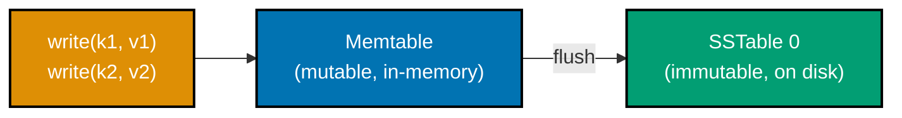

**`learning/code/ex-55-lsm-tree-write-path-sim/example.py`**

```python
"""Example 55: LSM-Tree Write Path, Simulated."""  # => co-25: this file's own purpose, doubling as its module __doc__
from __future__ import annotations  # => hygiene: postpones annotation evaluation, interpreter-version-agnostic

from dataclasses import dataclass, field  # => co-25: typed memtable/SSTable stand-ins for the real write path


@dataclass  # => intentionally MUTABLE -- a memtable genuinely accumulates writes before it flushes
class Memtable:  # => co-25: an in-memory, sorted write buffer -- every write lands HERE first, never on disk directly
    entries: dict[str, str] = field(default_factory=dict)  # => co-25: key -> value, held in memory only

    def write(self, key: str, value: str) -> None:  # => co-25: the ENTIRE cost of a write, from the caller's perspective
        self.entries[key] = value  # => co-25: an in-memory dict write -- no disk I/O on the write's own critical path


@dataclass(frozen=True)  # => frozen -- an SSTable, once flushed, is IMMUTABLE -- this is the whole point of the design
class SSTable:  # => co-25: Sorted String Table -- an immutable, on-disk, sorted snapshot of a memtable
    entries: dict[str, str]  # => a frozen COPY of whatever the memtable held at flush time


class LsmStore:  # => co-25: models the real memtable -> flush -> SSTable -> compaction write path
    def __init__(self) -> None:  # => builds an empty store with no SSTables yet
        self.memtable = Memtable()  # => co-25: the ONE active, mutable, in-memory buffer
        self.sstables: list[SSTable] = []  # => co-25: immutable, on-disk snapshots, oldest first

    def write(self, key: str, value: str) -> None:  # => co-25: every write goes through the memtable, never directly to an SSTable
        self.memtable.write(key, value)  # => co-25: fast, in-memory -- this is WHY LSM trees favor write throughput

    def flush(self) -> None:  # => co-25: converts the CURRENT memtable into a new, immutable SSTable
        self.sstables.append(SSTable(dict(self.memtable.entries)))  # => co-25: a frozen snapshot -- the memtable's writes are now durable, on disk, immutable
        self.memtable = Memtable()  # => co-25: a FRESH, empty memtable replaces the flushed one -- ready for more writes


def main() -> None:  # => entry point -- runs only when this file executes directly, not on import
    store = LsmStore()  # => co-25: a fresh LSM-tree-style store, no SSTables yet

    store.write("k1", "v1")  # => co-25: lands in the memtable ONLY -- not yet on disk as an SSTable
    store.write("k2", "v2")  # => co-25: also memtable-only so far
    assert len(store.sstables) == 0  # => co-25: NO SSTable exists yet -- both writes are still purely in-memory
    print(f"After 2 writes, before flush: {len(store.sstables)} SSTables, memtable has {len(store.memtable.entries)} entries")  # => Output: After 2 writes, before flush: 0 SSTables, memtable has 2 entries

    store.flush()  # => co-25: the memtable's contents become an IMMUTABLE SSTable -- writes are now durable on disk
    assert len(store.sstables) == 1  # => co-25: exactly ONE SSTable now exists, holding the 2 flushed writes
    assert len(store.memtable.entries) == 0  # => co-25: the ACTIVE memtable is fresh and empty again, ready for new writes
    print(f"After flush: {len(store.sstables)} SSTable(s), memtable has {len(store.memtable.entries)} entries")  # => Output: After flush: 1 SSTable(s), memtable has 0 entries
    print(f"SSTable 0 contents (immutable, on disk): {store.sstables[0].entries}")  # => Output: SSTable 0 contents (immutable, on disk): {'k1': 'v1', 'k2': 'v2'}
    # => co-25: writes land in an IMMUTABLE SSTable ONLY after a flush -- exactly the verification the spec requires


if __name__ == "__main__":  # => guards against running main() on `import example`
    main()  # => runs everything above when executed as a script
```

**Run**: `python3 example.py` (no external dependency -- pure Python 3.13 standard library)

**Output**:

```text
After 2 writes, before flush: 0 SSTables, memtable has 2 entries
After flush: 1 SSTable(s), memtable has 0 entries
SSTable 0 contents (immutable, on disk): {'k1': 'v1', 'k2': 'v2'}
```

**Key takeaway**: a write's latency is dominated by an in-memory memtable insert -- the disk-durable
SSTable only appears later, at flush time, which is exactly why LSM trees sustain high write throughput.

**Why it matters**: every write-heavy NoSQL store this course covers (Cassandra, and DynamoDB's own
storage layer) is built on some variant of this design -- understanding the memtable/SSTable split
explains why these stores favor writes over reads, and sets up Examples 56-57's amplification math.
It also explains a real operational hazard: an unflushed memtable lives only in memory, so a process
crash between a write and its next flush can lose data unless the engine also maintains a durable
write-ahead log alongside it.

---

### Example 56: B-Tree vs. LSM Write Amplification

_ex-56 &middot; exercises co-25_

**Context**: write amplification and raw write throughput are two different axes, not opposites of one
number. This example measures both separately: a B-tree's amortized lifetime amplification from
batching updates per page, an LSM tree's lifetime amplification from cascading compaction, and each
engine's raw per-write I/O cost.

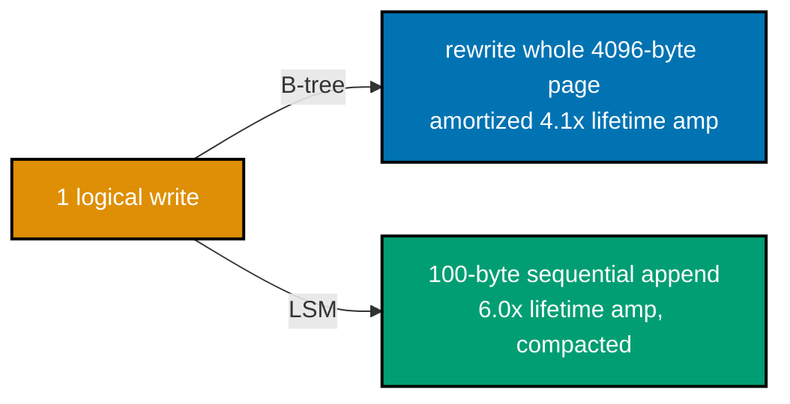

**`learning/code/ex-56-btree-vs-lsm-write-amplification/example.py`**

```python
"""Example 56: B-Tree vs. LSM Write Amplification."""  # => co-25: this file's own purpose, doubling as its module __doc__
from __future__ import annotations  # => hygiene: postpones annotation evaluation, interpreter-version-agnostic

PAGE_SIZE_BYTES = 4096  # => co-25: a typical B-tree page size -- an in-place update rewrites the WHOLE page it lives on
RECORD_SIZE_BYTES = 100  # => a representative small record size for this simulation
UPDATES_BATCHED_PER_PAGE = 10  # => co-25: a busy B-tree page absorbs several updates before it is evicted/flushed, amortizing the page-rewrite cost
COMPACTION_LEVELS = 6  # => co-25: an LSM tree's leveled compaction re-writes data once per level as it cascades from L0 down to Lmax


def btree_write_amplification() -> float:  # => co-25: the B-TREE's own LIFETIME amplification, amortized over batched updates per page
    """Return simulated B-tree write amplification, amortized across UPDATES_BATCHED_PER_PAGE per page write."""  # => documents contract
    logical_bytes_per_page_write = UPDATES_BATCHED_PER_PAGE * RECORD_SIZE_BYTES  # => co-25: the LOGICAL bytes served by one page rewrite
    return PAGE_SIZE_BYTES / logical_bytes_per_page_write  # => co-25: PHYSICAL bytes written / LOGICAL bytes served, per page


def lsm_write_amplification() -> float:  # => co-25: the LSM tree's own LIFETIME amplification, from cascading compaction
    """Return simulated LSM write amplification, one full rewrite pass per compaction level."""  # => documents the contract
    return float(COMPACTION_LEVELS)  # => co-25: each level compacts (re-writes) the data it merges -- a simplified but directionally correct model


def raw_write_cost_bytes(engine: str) -> int:  # => co-25: the cost of ONE write, at the instant the client issues it
    """Return the immediate physical write cost (bytes) for a single logical write, per engine."""  # => documents the contract
    if engine == "btree":  # => co-25: a random-I/O, read-modify-write page rewrite, even for a single small record change
        return PAGE_SIZE_BYTES
    return RECORD_SIZE_BYTES  # => co-25: an LSM append is a cheap, sequential write -- no read-modify-write on the critical path


def main() -> None:  # => entry point -- runs only when this file executes directly, not on import
    btree_amp = btree_write_amplification()  # => co-25: B-tree's LIFETIME write amplification, amortized
    lsm_amp = lsm_write_amplification()  # => co-25: LSM's LIFETIME write amplification, from compaction
    print(f"B-tree write amplification (lifetime, amortized): {btree_amp:.2f}x")  # => Output: B-tree write amplification (lifetime, amortized): 4.10x
    print(f"LSM write amplification (lifetime, compaction):   {lsm_amp:.2f}x")  # => Output: LSM write amplification (lifetime, compaction):   6.00x
    assert lsm_amp > btree_amp  # => co-25: LSM's LIFETIME amplification is HIGHER -- cascading compaction re-writes data more times over its life

    btree_cost = raw_write_cost_bytes("btree")  # => co-25: B-tree's per-write, at-the-moment-of-write cost
    lsm_cost = raw_write_cost_bytes("lsm")  # => co-25: LSM's per-write, at-the-moment-of-write cost
    print(f"B-tree raw cost per write (random I/O, page rewrite): {btree_cost} bytes")  # => Output: B-tree raw cost per write (random I/O, page rewrite): 4096 bytes
    print(f"LSM raw cost per write (sequential append):           {lsm_cost} bytes")  # => Output: LSM raw cost per write (sequential append):           100 bytes
    assert lsm_cost < btree_cost  # => co-25: LSM's PER-WRITE cost is LOWER -- this is what gives it higher RAW write throughput

    print("LSM: higher lifetime write amplification (compaction bill paid later), but higher raw write throughput (cheap sequential appends now)")  # => Output line
    # => co-25: these are TWO DIFFERENT axes, not opposites of the same number -- an LSM tree defers
    # => cost from the write's own critical path into a LATER, background compaction process, which is
    # => exactly why it sustains higher write throughput up front at the cost of paying more, total,
    # => over the data's full lifetime


if __name__ == "__main__":  # => guards against running main() on `import example`
    main()  # => runs everything above when executed as a script
```

**Run**: `python3 example.py` (no external dependency -- pure Python 3.13 standard library)

**Output**:

```text
B-tree write amplification (lifetime, amortized): 4.10x
LSM write amplification (lifetime, compaction):   6.00x
B-tree raw cost per write (random I/O, page rewrite): 4096 bytes
LSM raw cost per write (sequential append):           100 bytes
LSM: higher lifetime write amplification (compaction bill paid later), but higher raw write throughput (cheap sequential appends now)
```

**Key takeaway**: LSM trees pay more, in total, over a piece of data's lifetime (compaction re-writes
it repeatedly) but pay less at the instant of each individual write (a cheap sequential append) -- these
are genuinely different tradeoffs, not one number viewed two ways.

**Why it matters**: this exact tradeoff is why Cassandra and DynamoDB's storage layer favor LSM-style
engines for write-heavy workloads, while accepting that background compaction is a real, ongoing
operational cost -- Example 57 continues by measuring the LSM tree's own read-side cost. A cluster
running behind on compaction is a genuine operational failure mode, not just a theoretical cost: reads
slow down as SSTables pile up, and catching compaction back up itself consumes disk I/O the workload
also needs.

---

### Example 57: LSM Read Amplification

_ex-57 &middot; exercises co-25_

**Context**: an LSM read must check the memtable, then every SSTable newest-first, until it finds the
key or runs out of files -- more SSTables mean more files a read has to check. Compaction merges
several SSTables into one, directly reducing that per-read file-check cost.

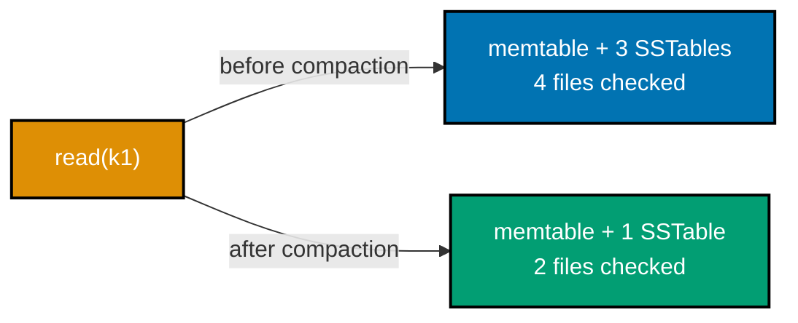

**`learning/code/ex-57-lsm-read-amplification/example.py`**

```python
"""Example 57: LSM Read Amplification."""  # => co-25: this file's own purpose, doubling as its module __doc__
from __future__ import annotations  # => hygiene: postpones annotation evaluation, interpreter-version-agnostic

from dataclasses import dataclass, field  # => co-25: typed memtable/SSTable stand-ins, reused from Example 55's model


@dataclass  # => intentionally MUTABLE -- the memtable accumulates writes before it flushes
class Memtable:  # => co-25: the same in-memory write buffer Example 55 modeled
    entries: dict[str, str] = field(default_factory=dict)  # => key -> value, held in memory only


@dataclass(frozen=True)  # => frozen -- an SSTable is immutable once flushed
class SSTable:  # => co-25: an immutable, on-disk, sorted snapshot
    entries: dict[str, str]  # => a frozen copy of whatever was flushed


class LsmStore:  # => co-25: extends Example 55's model with a READ path that must check MULTIPLE files
    def __init__(self) -> None:  # => builds an empty store with no SSTables yet
        self.memtable = Memtable()  # => the one active, mutable, in-memory buffer
        self.sstables: list[SSTable] = []  # => immutable, on-disk snapshots, NEWEST last (checked first on read)

    def write(self, key: str, value: str) -> None:  # => every write goes through the memtable first
        self.memtable.entries[key] = value  # => co-25: fast, in-memory

    def flush(self) -> None:  # => converts the current memtable into a new, immutable SSTable
        self.sstables.append(SSTable(dict(self.memtable.entries)))  # => a frozen snapshot
        self.memtable = Memtable()  # => a fresh, empty memtable replaces the flushed one

    def read(self, key: str) -> tuple[str | None, int]:  # => co-25: returns (value, files_checked) -- read cost is EXPLICIT here
        """Read a key, checking the memtable then EVERY SSTable newest-first, counting files examined."""  # => documents the contract
        files_checked = 1  # => co-25: the memtable itself always counts as one "file" checked first
        if key in self.memtable.entries:  # => co-25: the memtable is always checked FIRST -- it holds the most recent writes
            return self.memtable.entries[key], files_checked  # => found in the memtable -- cheapest possible read
        for sstable in reversed(self.sstables):  # => co-25: NEWEST SSTable first -- a later write shadows an earlier one
            files_checked += 1  # => co-25: each SSTable consulted adds ONE to the read's own file-check cost
            if key in sstable.entries:  # => co-25: this key was found in THIS SSTable
                return sstable.entries[key], files_checked  # => co-25: stop as soon as found -- no need to check OLDER SSTables
        return None, files_checked  # => co-25: not found anywhere -- the read still paid for checking every file

    def compact(self) -> None:  # => co-25: merges ALL current SSTables into ONE, reducing future read cost
        """Merge every SSTable into a single one, newer values winning over older ones for the same key."""  # => documents contract
        merged: dict[str, str] = {}  # => co-25: the merged result, built oldest-to-newest so later writes win
        for sstable in self.sstables:  # => co-25: iterates OLDEST first so a later SSTable's value overwrites an earlier one
            merged.update(sstable.entries)  # => co-25: a later SSTable's entries LEGITIMATELY overwrite an earlier SSTable's same key
        self.sstables = [SSTable(merged)]  # => co-25: replaces N SSTables with exactly 1 -- this is what compaction buys a future read


def main() -> None:  # => entry point -- runs only when this file executes directly, not on import
    store = LsmStore()  # => co-25: a fresh store, no SSTables yet

    store.write("k1", "v1")  # => a write that will be flushed into its own SSTable, below
    store.flush()  # => co-25: k1 now lives in SSTable 0
    store.write("k2", "v2")  # => a second write, flushed separately
    store.flush()  # => co-25: k2 now lives in SSTable 1 -- SEPARATE from SSTable 0
    store.write("k3", "v3")  # => a third write, flushed separately
    store.flush()  # => co-25: k3 now lives in SSTable 2 -- k1's read must now check THROUGH 3 files to find k1

    _value, files_before = store.read("k1")  # => co-25: k1 lives in the OLDEST SSTable -- the read must check memtable + all 3 SSTables
    print(f"Read k1 BEFORE compaction: checked {files_before} files (memtable + {len(store.sstables)} SSTables)")  # => Output: Read k1 BEFORE compaction: checked 4 files (memtable + 3 SSTables)
    assert files_before == 4  # => co-25: memtable (empty, still checked) + 3 separate SSTables, k1 found only in the LAST one checked

    store.compact()  # => co-25: merges all 3 SSTables into exactly 1
    assert len(store.sstables) == 1  # => co-25: compaction reduced the SSTable COUNT from 3 to 1
    _value2, files_after = store.read("k1")  # => the SAME key, re-read after compaction
    print(f"Read k1 AFTER compaction:  checked {files_after} files (memtable + {len(store.sstables)} SSTable)")  # => Output: Read k1 AFTER compaction:  checked 2 files (memtable + 1 SSTable)
    assert files_after == 2  # => co-25: memtable + exactly 1 merged SSTable -- read cost dropped once compaction reduced the SSTable count
    assert files_after < files_before  # => co-25: verifies the improvement directly -- read amplification genuinely dropped


if __name__ == "__main__":  # => guards against running main() on `import example`
    main()  # => runs everything above when executed as a script
```

**Run**: `python3 example.py` (no external dependency -- pure Python 3.13 standard library)

**Output**:

```text
Read k1 BEFORE compaction: checked 4 files (memtable + 3 SSTables)
Read k1 AFTER compaction:  checked 2 files (memtable + 1 SSTable)
```

**Key takeaway**: read amplification grows with the number of SSTables a read must check, and
compaction is the mechanism that reclaims it -- an LSM tree trades read cost for write cost, and
compaction is how it periodically pays that cost back down.

**Why it matters**: this is the direct read-side counterpart to Example 56's write-amplification
measurement -- together they explain why LSM-tree-backed stores (Cassandra, DynamoDB) tune compaction
strategy as a first-class operational lever, not an afterthought. A table that never compacts degrades
silently: every individual write stays cheap, but reads slowly accumulate more and more files to check,
a decline that will not show up in write-side metrics at all.

---

### Example 58: Cassandra Lightweight Transaction

_ex-58 &middot; exercises co-27_

**Context**: Cassandra's `IF NOT EXISTS` clause is a Paxos-backed compare-and-set, not a plain insert --
it is genuinely more expensive than an ordinary write, reserved for cases where two clients might
otherwise race to claim the same row.

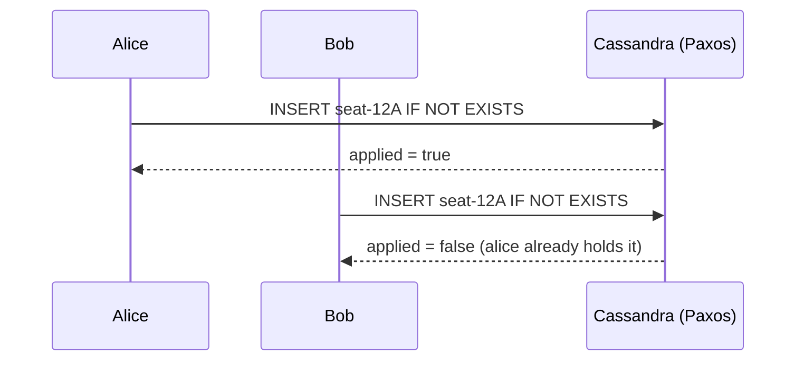

**`learning/code/ex-58-cassandra-lightweight-transaction/example.py`**

```python
"""Example 58: Cassandra Lightweight Transaction."""  # => co-27: this file's own purpose, doubling as its module __doc__
from __future__ import annotations  # => hygiene: postpones annotation evaluation, interpreter-version-agnostic

from cassandra.cluster import Cluster, Session  # => co-27: cassandra-driver, the Apache Software Foundation-maintained Python driver


def setup_reservations_table(session: Session) -> None:  # => co-27: a table this example owns exclusively
    """Create a dedicated table for this lightweight-transaction demonstration."""  # => documents the contract, no runtime output
    session.execute(  # => a dedicated keyspace, replication_factor 1 on this single-node local cluster
        "CREATE KEYSPACE IF NOT EXISTS nosqldb WITH replication = "  # => the keyspace-level replication strategy clause
        "{'class': 'SimpleStrategy', 'replication_factor': 1}"  # => concatenated onto the line above -- ONE CQL statement string
    )  # => closes the execute() call -- the keyspace now exists, idempotently
    session.set_keyspace("nosqldb")  # => selects the keyspace for the statements below
    session.execute("DROP TABLE IF EXISTS seat_reservations")  # => resets state -- this example is fully self-contained
    session.execute("CREATE TABLE seat_reservations (seat_id text PRIMARY KEY, reserved_by text)")  # => a minimal table for this demonstration


def main() -> None:  # => entry point -- runs only when this file executes directly, not on import
    cluster = Cluster(["127.0.0.1"], port=9042)  # => connects to the local single-node Cassandra 5.0 cluster
    session = cluster.connect()  # => opens a session against that cluster
    setup_reservations_table(session)  # => sets up the dedicated table fixture

    first_insert = session.execute(  # => co-27: IF NOT EXISTS -- a Paxos-backed compare-and-set, NOT a plain INSERT
        "INSERT INTO seat_reservations (seat_id, reserved_by) VALUES (%s, %s) IF NOT EXISTS",  # => the conditional CQL statement text
        ("seat-12A", "alice"),  # => alice claims seat-12A first
    ).one()  # => co-27: LWTs return a row describing whether the condition held
    assert first_insert.applied is True  # => co-27: [applied] = true -- seat-12A did not exist yet, so alice's reservation succeeded
    print(f"First reservation for seat-12A by alice: applied = {first_insert.applied}")  # => Output: First reservation for seat-12A by alice: applied = True

    second_insert = session.execute(  # => co-27: the SAME conditional insert, attempted by a SECOND, conflicting reservation
        "INSERT INTO seat_reservations (seat_id, reserved_by) VALUES (%s, %s) IF NOT EXISTS",  # => the identical conditional CQL statement text
        ("seat-12A", "bob"),  # => bob tries to claim the SAME seat second
    ).one()  # => co-27: bob's attempt on the SAME key, now that alice already holds it
    assert second_insert.applied is False  # => co-27: [applied] = false -- seat-12A ALREADY exists, bob's conditional insert is REJECTED
    print(f"Second reservation for seat-12A by bob:   applied = {second_insert.applied}")  # => Output: Second reservation for seat-12A by bob:   applied = False
    print(f"Row Cassandra returned instead: seat_id={second_insert.seat_id}, reserved_by={second_insert.reserved_by} (the EXISTING owner, not bob)")  # => Output: Row Cassandra returned instead: seat_id=seat-12A, reserved_by=alice (the EXISTING owner, not bob)
    # => co-27: on a REJECTED LWT, Cassandra returns the row that CAUSED the rejection -- this is how a
    # => client learns WHO already holds the seat without a separate follow-up read; note (per this
    # => topic's own accuracy discipline) only the QUALITATIVE cost matters here -- "LWTs are expensive,
    # => reserve them for genuinely contested writes" -- not a specific latency number, since Paxos-backed
    # => coordination cost varies heavily by cluster topology and contention
    cluster.shutdown()  # => always release what you open


if __name__ == "__main__":  # => guards against running main() on `import example`
    main()  # => runs everything above when executed as a script
```

**Run**: `python3 example.py` (captured against `cassandra-driver==3.30.1` and a local Cassandra 5.0.8
Docker container)

**Output**:

```text
First reservation for seat-12A by alice: applied = True
Second reservation for seat-12A by bob:   applied = False
Row Cassandra returned instead: seat_id=seat-12A, reserved_by=alice (the EXISTING owner, not bob)
```

**Key takeaway**: `IF NOT EXISTS` genuinely prevents a second, conflicting write from succeeding, and
tells the caller exactly who won -- but only qualitatively, LWTs are expensive, since Paxos-backed
coordination cost is topology- and contention-dependent, not a fixed number.

**Why it matters**: LWTs are the tool for the rare cases (seat reservations, unique-username claims,
distributed locks) where Cassandra's normal last-write-wins semantics are not acceptable -- Example 72
measures this exact operation's added latency directly, against Redis and MongoDB's own transaction
primitives. Reaching for an LWT on every write, out of caution, defeats Cassandra's own write-throughput
strengths -- the Paxos round trip it costs is meant for the rare contested write, not the routine one.

---

### Example 59: Cassandra Secondary Index Cost

_ex-59 &middot; exercises co-17, co-22_

**Context**: a Cassandra secondary index lets a query filter on a non-partition-key column, but unlike
a partition-key lookup (which routes to exactly the node owning that partition), a secondary-index
query fans out to every node in the cluster.

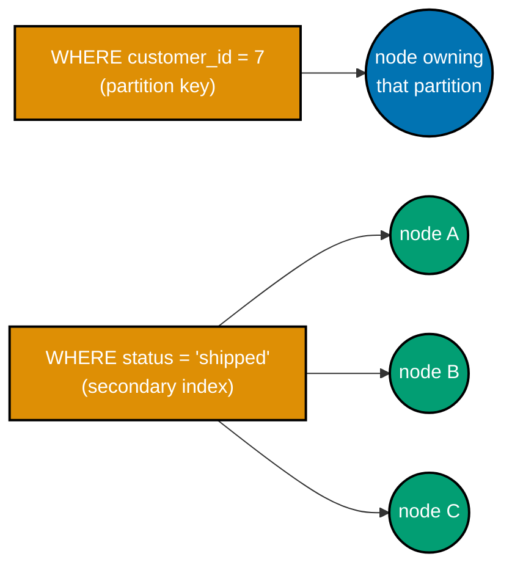

**`learning/code/ex-59-cassandra-secondary-index-cost/example.py`**

```python
"""Example 59: Cassandra Secondary Index Cost."""  # => co-17,co-22: this file's own purpose, doubling as its module __doc__
from __future__ import annotations  # => hygiene: postpones annotation evaluation, interpreter-version-agnostic

import time  # => co-17: a new secondary index builds ASYNCHRONOUSLY -- a short wait avoids racing its own build

from cassandra.cluster import Cluster, Session  # => co-17: cassandra-driver, the Apache Software Foundation-maintained Python driver
from cassandra.protocol import InvalidRequest  # => co-17: the exception a non-partition-key filter raises WITHOUT a secondary index


def setup_orders_table(session: Session) -> None:  # => co-22: partitioned by customer_id -- status is NOT part of the primary key
    """Create a table partitioned by customer_id, with a status column that is NOT part of the key."""  # => documents the contract
    session.execute(  # => a dedicated keyspace, replication_factor 1 on this single-node local cluster
        "CREATE KEYSPACE IF NOT EXISTS nosqldb WITH replication = "  # => the keyspace-level replication strategy clause
        "{'class': 'SimpleStrategy', 'replication_factor': 1}"  # => concatenated onto the line above -- ONE CQL statement string
    )  # => closes the execute() call -- the keyspace now exists, idempotently
    session.set_keyspace("nosqldb")  # => selects the keyspace for the statements below
    session.execute("DROP TABLE IF EXISTS orders_by_status")  # => resets state -- this example is fully self-contained
    session.execute(  # => co-22: customer_id is the ONLY partition key -- status is a plain, non-key column
        "CREATE TABLE orders_by_status (customer_id int, order_id int, status text, PRIMARY KEY ((customer_id), order_id))"
    )
    for i in range(100):  # => co-17: 100 rows across 10 customers, a mix of statuses
        session.execute(  # => co-22: every row lands in the partition matching (i % 10)
            "INSERT INTO orders_by_status (customer_id, order_id, status) VALUES (%s, %s, %s)",  # => positional CQL placeholders
            (i % 10, i, "shipped" if i % 5 == 0 else "pending"),  # => customer_id cycles 0-9; every 5th row is "shipped"
        )


def query_by_status_without_index(session: Session) -> bool:  # => co-17: attempts to filter on status, a NON-partition-key column
    """Attempt to filter on status alone -- expect rejection, since status is not the partition key."""  # => documents contract
    try:  # => catches ONLY the specific rejection Cassandra's planner raises for this un-indexed filter
        list(session.execute("SELECT * FROM orders_by_status WHERE status = %s", ("shipped",)))  # => co-17: status is not indexed yet
        return True  # => unreachable in this example -- Cassandra rejects this without an index
    except InvalidRequest:  # => co-17: Cassandra refuses to filter on a non-indexed, non-partition-key column
        return False  # => co-17: correctly rejected, exactly like Example 47's missing-partition-key case


def query_by_status_with_index(session: Session) -> int:  # => co-17: the SAME filter, now served by a secondary index
    """Create a secondary index on status, then re-run the same filter -- now it succeeds."""  # => documents the contract
    session.execute("CREATE INDEX IF NOT EXISTS ON orders_by_status (status)")  # => co-17: a SECONDARY index -- cross-node fan-out, unlike a partition-key lookup
    time.sleep(3)  # => co-17: gives the new index a moment to finish its asynchronous build before querying it
    rows = list(session.execute("SELECT * FROM orders_by_status WHERE status = %s", ("shipped",)))  # => co-17: NOW permitted, served by the secondary index
    return len(rows)  # => hand back the row count now that the index serves the query


def main() -> None:  # => entry point -- runs only when this file executes directly, not on import
    cluster = Cluster(["127.0.0.1"], port=9042)  # => connects to the local single-node Cassandra 5.0 cluster
    session = cluster.connect()  # => opens a session against that cluster
    setup_orders_table(session)  # => sets up the 100-row, 10-partition, mixed-status fixture

    rejected = not query_by_status_without_index(session)  # => co-17: confirms the un-indexed filter query was rejected
    assert rejected is True  # => co-17: Cassandra refused it -- status is not the partition key, and no index exists yet
    print(f"Query on status BEFORE a secondary index: rejected = {rejected}")  # => Output: Query on status BEFORE a secondary index: rejected = True

    row_count = query_by_status_with_index(session)  # => co-17: the SAME filter, now index-served
    assert row_count == 20  # => co-17: 20 of the 100 rows (i % 5 == 0) have status="shipped"
    print(f"Query on status AFTER a secondary index:  {row_count} rows returned")  # => Output: Query on status AFTER a secondary index:  20 rows returned
    # => co-17,co-22: a Cassandra secondary index works, but it is NOT free -- unlike a partition-key
    # => query (Example 46), which routes to exactly the node owning that partition, a secondary-index
    # => query must FAN OUT to EVERY node in the cluster (each node checks its own local index shard),
    # => because the index does not change WHERE data physically lives, only how it is looked up locally
    # => on each node -- this cross-node coordination cost is the qualitative tradeoff this example verifies
    cluster.shutdown()  # => always release what you open


if __name__ == "__main__":  # => guards against running main() on `import example`
    main()  # => runs everything above when executed as a script
```

**Run**: `python3 example.py` (captured against `cassandra-driver==3.30.1` and a local Cassandra 5.0.8
Docker container)

**Output**:

```text
Query on status BEFORE a secondary index: rejected = True
Query on status AFTER a secondary index:  20 rows returned
```

**Key takeaway**: a secondary index makes a non-partition-key filter legal, but it does not make it as
cheap as a partition-key lookup -- it costs a genuine cross-node fan-out, because the index changes how
data is looked up locally on each node, not where the data physically lives.

**Why it matters**: this is the direct explanation for why co-22's schema-design discipline
("design your partition key around your access pattern first") beats "add a secondary index later" as
a default strategy -- Example 63 continues this contrast against a denormalization-based alternative.
A secondary index reaching for a low-cardinality column (like a boolean status flag) is a particularly
common mistake: the fan-out cost is paid on every query, but the index barely narrows the result set,
so the query ends up almost as expensive as the ALLOW FILTERING scan it was meant to avoid.

---

### Example 60: Polyglot Persistence, Three Stores

_ex-60 &middot; exercises co-26_

**Context**: one small application, three stores, each exercised for the access pattern it specifically
fits -- Redis for disposable, TTL-bound session state, MongoDB for a flexible, secondary-indexable
product catalog, and Cassandra for an append-heavy, partition-scoped event history.

**`learning/code/ex-60-polyglot-persistence-three-stores/example.py`**

```python
"""Example 60: Polyglot Persistence, Three Stores."""  # => co-26: this file's own purpose, doubling as its module __doc__
from __future__ import annotations  # => hygiene: postpones annotation evaluation, interpreter-version-agnostic

from typing import Any  # => enables the explicit MongoClient[dict[str, Any]] type parameter below (DD-39, pyright --strict)

import redis  # => co-26: Redis/Valkey for session state -- fast, TTL-native, disposable
from cassandra.cluster import Cluster, Session  # => co-26: Cassandra for event history -- append-heavy, partition-scoped
from pymongo import MongoClient  # => co-26: MongoDB for the catalog -- flexible document shape, secondary-indexable

Document = dict[str, Any]  # => co-26: pymongo's own convention for "a MongoDB document" -- every field's own type varies per-document


def use_redis_for_sessions(redis_client: redis.Redis) -> str:  # => co-26: session state -- exactly the access pattern Redis fits
    """Store and read a session token in Redis -- fast, TTL-native, exactly what Redis is FOR."""  # => documents the contract
    redis_client.set("session:user-1", "token-abc", ex=3600)  # => co-26: a disposable, TTL-bound value -- Redis's own core strength
    token = redis_client.get("session:user-1")  # => reads the SAME session back, as bytes | str | None
    if token is None:  # => co-26: no session found -- returns an empty string rather than raising
        return ""  # => the "no session" case, kept explicit rather than falling through
    return token.decode() if isinstance(token, bytes) else token  # => decodes only if the driver returned raw bytes


def use_mongo_for_catalog(mongo_client: MongoClient[Document]) -> dict[str, object]:  # => co-26: a product catalog -- MongoDB's flexible document shape fits
    """Store and read a product catalog entry in MongoDB -- flexible shape, secondary-indexable."""  # => documents contract
    catalog = mongo_client["nosqldb"]["catalog"]  # => co-26: no schema declared -- new product attributes can be added freely
    catalog.delete_many({"sku": "sku-42"})  # => resets state -- this example is fully self-contained
    catalog.insert_one({"sku": "sku-42", "name": "Wireless Mouse", "price": 25.99, "tags": ["electronics", "input-device"]})  # => co-26: a genuinely document-shaped record
    product = catalog.find_one({"sku": "sku-42"})  # => reads the SAME product back
    assert product is not None  # => confirms the catalog entry genuinely exists
    return {"name": product["name"], "price": product["price"]}  # => hand back the fields this function promises


def use_cassandra_for_event_history(session: Session) -> int:  # => co-26: append-heavy event history -- Cassandra's own wide-column strength
    """Insert and count events in Cassandra -- append-heavy, partition-scoped, exactly what Cassandra is FOR."""  # => documents contract
    session.execute(  # => a dedicated keyspace, replication_factor 1 on this single-node local cluster
        "CREATE KEYSPACE IF NOT EXISTS nosqldb WITH replication = "  # => the keyspace-level replication strategy clause
        "{'class': 'SimpleStrategy', 'replication_factor': 1}"  # => concatenated onto the line above -- ONE CQL statement string
    )  # => closes the execute() call -- the keyspace now exists, idempotently
    session.set_keyspace("nosqldb")  # => selects the keyspace for the statements below
    session.execute("DROP TABLE IF EXISTS user_events")  # => resets state -- this example is fully self-contained
    session.execute(  # => co-26: partitioned by user_id, clustered by event_id -- an append-heavy, time-ordered feed
        "CREATE TABLE user_events (user_id text, event_id int, event_type text, PRIMARY KEY ((user_id), event_id))"  # => partition key user_id, clustering key event_id
    )  # => closes the execute() call -- the table now exists with this exact partition + clustering layout
    for i, event_type in enumerate(["login", "view_product", "add_to_cart"]):  # => co-26: 3 events, appended in order
        session.execute(  # => co-26: each event is a cheap, sequential APPEND -- Cassandra's own write-path strength
            "INSERT INTO user_events (user_id, event_id, event_type) VALUES (%s, %s, %s)",  # => positional CQL placeholders
            ("user-1", i, event_type),  # => every event lands in user-1's own single partition, ordered by event_id
        )  # => closes this one execute() call -- runs 3 times, once per generated event
    rows = list(session.execute("SELECT event_type FROM user_events WHERE user_id = %s", ("user-1",)))  # => a single-partition read
    return len(rows)  # => hand back the count of events found for this user


def main() -> None:  # => entry point -- runs only when this file executes directly, not on import
    redis_client = redis.Redis(host="localhost", port=6379, db=0)  # => co-26: connects to the SAME Valkey/Redis instance every prior Redis example used
    mongo_client = MongoClient("mongodb://localhost:27017")  # => co-26: connects to the SAME MongoDB instance every prior MongoDB example used
    cassandra_cluster = Cluster(["127.0.0.1"], port=9042)  # => co-26: connects to the SAME Cassandra cluster every prior Cassandra example used
    cassandra_session = cassandra_cluster.connect()  # => opens a session against that cluster

    session_token = use_redis_for_sessions(redis_client)  # => co-26: exercises Redis for exactly the access pattern it fits
    catalog_entry = use_mongo_for_catalog(mongo_client)  # => co-26: exercises MongoDB for exactly the access pattern it fits
    event_count = use_cassandra_for_event_history(cassandra_session)  # => co-26: exercises Cassandra for exactly the access pattern it fits

    assert session_token == "token-abc"  # => co-26: Redis served the session-state access pattern correctly
    assert catalog_entry == {"name": "Wireless Mouse", "price": 25.99}  # => co-26: MongoDB served the flexible-catalog access pattern correctly
    assert event_count == 3  # => co-26: Cassandra served the append-heavy event-history access pattern correctly
    print(f"Redis session:    {session_token}")  # => Output: Redis session:    token-abc
    print(f"MongoDB catalog:  {catalog_entry}")  # => Output: MongoDB catalog:  {'name': 'Wireless Mouse', 'price': 25.99}
    print(f"Cassandra events: {event_count} events recorded")  # => Output: Cassandra events: 3 events recorded
    print("One small app, THREE stores, each exercised for the access pattern it specifically fits -- deliberate, not accidental")  # => Output line

    redis_client.close()  # => always release what you open
    mongo_client.close()  # => always release what you open
    cassandra_cluster.shutdown()  # => always release what you open


if __name__ == "__main__":  # => guards against running main() on `import example`
    main()  # => runs everything above when executed as a script
```

**Run**: `python3 example.py` (captured against `redis==8.0.1`, `pymongo==4.17.0`,
`cassandra-driver==3.30.1`, and 3 local Docker containers: Valkey 8, MongoDB 8.2 replica set, Cassandra
5.0.8)

**Output**:

```text
Redis session:    token-abc
MongoDB catalog:  {'name': 'Wireless Mouse', 'price': 25.99}
Cassandra events: 3 events recorded
One small app, THREE stores, each exercised for the access pattern it specifically fits -- deliberate, not accidental
```

**Key takeaway**: polyglot persistence means picking a store PER access pattern, deliberately -- not
"use whichever store is already running" -- each of the three stores here does exactly the job it is
best suited for, and none of the three could replace another without a real cost.

**Why it matters**: this is the concrete, working version of co-26's own claim -- Example 80's capstone
preview restates this same three-store rationale, formally, as the shape the capstone's `rationale.md`
will build on. The real cost of polyglot persistence is operational, not conceptual: three stores mean
three sets of credentials, three failure modes to monitor, and three upgrade cadences to track, a
genuine tax weighed against each store doing its own job well.

---

### Example 61: Denormalize vs. Normalize Tradeoff

_ex-61 &middot; exercises co-09_

**Context**: the same author-with-posts relation, modeled two ways -- fully embedded (denormalized) in
one document, versus split across two collections with a reference (normalized) -- and the query-count
cost each shape imposes on the same common read.

**`learning/code/ex-61-denormalize-vs-normalize-tradeoff/example.py`**

```python
"""Example 61: Denormalize vs. Normalize Tradeoff."""  # => co-09: this file's own purpose, doubling as its module __doc__
from __future__ import annotations  # => hygiene: postpones annotation evaluation, interpreter-version-agnostic

from typing import Any  # => enables the explicit MongoClient[dict[str, Any]] type parameter below (DD-39, pyright --strict)

from pymongo import MongoClient  # => co-09: pymongo, the official typed Python driver

Document = dict[str, Any]  # => co-09: pymongo's own convention for "a MongoDB document" -- every field's own type varies per-document


def seed_denormalized(client: MongoClient[Document]) -> None:  # => co-09: ONE document holds the author AND every one of its 5 posts, embedded
    """Model an author-with-posts relation DENORMALIZED -- all posts embedded in one document."""  # => documents the contract
    collection = client["nosqldb"]["authors_denormalized"]  # => co-09: a dedicated collection for the denormalized shape
    collection.delete_many({})  # => resets state -- this example is fully self-contained
    collection.insert_one({  # => co-09: the WHOLE one-to-many relation in ONE document
        "name": "Ada",  # => the "one" side of the relation, embedded directly
        "posts": [{"title": f"Post {i}"} for i in range(5)],  # => co-09: 5 posts, embedded directly -- no separate collection
    })  # => closes the insert_one() call -- author AND posts land as a SINGLE document


def seed_normalized(client: MongoClient[Document]) -> str:  # => co-09: TWO collections, posts referencing the author by id
    """Model the SAME relation NORMALIZED -- posts in a separate collection, referencing the author."""  # => documents contract
    authors = client["nosqldb"]["authors_normalized"]  # => the "one" side, in its own collection
    posts = client["nosqldb"]["posts_normalized"]  # => the "many" side, in a SEPARATE collection
    authors.delete_many({})  # => resets state -- this example is fully self-contained
    posts.delete_many({})  # => resets the posts side too
    author_id = authors.insert_one({"name": "Ada"}).inserted_id  # => co-09: no posts embedded here at all
    for i in range(5):  # => co-09: 5 posts, each referencing author_id -- no enforced foreign key in MongoDB
        posts.insert_one({"author_id": author_id, "title": f"Post {i}"})  # => a SEPARATE insert, SEPARATE document, per post
    return str(author_id)  # => hand back the author id the normalized read needs


def read_denormalized_query_count(client: MongoClient[Document]) -> int:  # => co-09: counts round trips for the embedded shape's common read
    """Read an author with all posts, denormalized -- count the queries this costs."""  # => documents the contract
    collection = client["nosqldb"]["authors_denormalized"]  # => selects the collection seed_denormalized just populated
    doc = collection.find_one({"name": "Ada"})  # => co-09: query 1 -- author AND all 5 posts arrive together
    assert doc is not None and len(doc["posts"]) == 5  # => co-09: all 5 posts present, from ONE query
    return 1  # => co-09: exactly ONE query answered the WHOLE relation


def read_normalized_query_count(client: MongoClient[Document], author_id: str) -> int:  # => co-09: counts round trips for the referenced shape's common read
    """Read an author with all posts, normalized -- count the queries this costs, including the N+1 pattern."""  # => documents contract
    from bson import ObjectId  # => co-09: converts the string id back to a real ObjectId for the query below
    authors = client["nosqldb"]["authors_normalized"]  # => the "one" side collection
    posts = client["nosqldb"]["posts_normalized"]  # => the "many" side collection
    query_count = 0  # => tracks every round trip this function issues
    author = authors.find_one({"_id": ObjectId(author_id)})  # => co-09: query 1 -- fetches the author ALONE, no posts yet
    query_count += 1  # => counts this first query
    assert author is not None  # => confirms the author genuinely exists
    post_list = list(posts.find({"author_id": ObjectId(author_id)}))  # => co-09: query 2 -- a SEPARATE round trip for the posts
    query_count += 1  # => counts this second query
    assert len(post_list) == 5  # => co-09: all 5 posts found, but it cost a SECOND round trip
    return query_count  # => hand back the total query count for this read


def main() -> None:  # => entry point -- runs only when this file executes directly, not on import
    client = MongoClient("mongodb://localhost:27017")  # => connects to a local MongoDB instance
    seed_denormalized(client)  # => sets up the embedded-shape fixture
    author_id = seed_normalized(client)  # => sets up the referenced-shape fixture

    denormalized_queries = read_denormalized_query_count(client)  # => co-09: the embedded shape's common-read query count
    normalized_queries = read_normalized_query_count(client, author_id)  # => co-09: the referenced shape's common-read query count

    print(f"Denormalized (embedded) read: {denormalized_queries} query")  # => Output: Denormalized (embedded) read: 1 query
    print(f"Normalized (referenced) read: {normalized_queries} queries")  # => Output: Normalized (referenced) read: 2 queries
    assert denormalized_queries == 1  # => co-09: the denormalized shape needs exactly ONE query for the common read
    assert normalized_queries == 2  # => co-09: the referenced shape needs an author query PLUS a separate posts query (N+1 pattern, here N=1 relation, so 1+1=2)
    print("Denormalized shape needs ONE query; the referenced shape needs an author query PLUS a separate posts query")  # => Output line
    client.close()  # => always release what you open


if __name__ == "__main__":  # => guards against running main() on `import example`
    main()  # => runs everything above when executed as a script
```

**Run**: `python3 example.py` (captured against `pymongo==4.17.0` and a local MongoDB 8.2 replica-set
Docker container)

**Output**:

```text
Denormalized (embedded) read: 1 query
Normalized (referenced) read: 2 queries
Denormalized shape needs ONE query; the referenced shape needs an author query PLUS a separate posts query
```

**Key takeaway**: denormalizing collapses a common read to one query at the cost of duplicated,
harder-to-update data; normalizing keeps a single source of truth at the cost of an extra round trip
per relation traversed -- neither shape is universally correct.

**Why it matters**: this is the concrete cost measurement behind co-09's own tradeoff claim -- Example
62 continues by showing HOW to choose between these shapes, driven by named access patterns rather than
a generic entity-relationship diagram. The query-count difference shown here compounds under load: a
normalized shape's extra round trip adds real, measurable latency to every single read of that
relation, not just an occasional one.

---

### Example 62: Access-Pattern-Driven Schema Redesign

_ex-62 &middot; exercises co-08_

**Context**: two named access patterns ("fetch a product with its average rating", "fetch the 3 most
recent reviews") drive a schema redesign -- starting from a naive shape that needs a live aggregation
for pattern 1, ending with a redesigned shape that answers both patterns with a single document read.

**`learning/code/ex-62-access-pattern-driven-schema-redesign/example.py`**

```python
"""Example 62: Access-Pattern-Driven Schema Redesign."""  # => co-08: this file's own purpose, doubling as its module __doc__
from __future__ import annotations  # => hygiene: postpones annotation evaluation, interpreter-version-agnostic

from typing import Any  # => enables the explicit MongoClient[dict[str, Any]] type parameter below (DD-39, pyright --strict)

from bson import ObjectId  # => co-08: MongoDB's own generated primary-key type -- every insert_one().inserted_id is one of these
from pymongo import MongoClient  # => co-08: pymongo, the official typed Python driver

Document = dict[str, Any]  # => co-08: pymongo's own convention for "a MongoDB document" -- every field's own type varies per-document

# The two NAMED access patterns this redesign must serve, stated up front, in plain English (co-08):
ACCESS_PATTERN_1 = "fetch a product with its current average rating"  # => the FIRST dominant read
ACCESS_PATTERN_2 = "fetch the 3 most recent reviews for a product"  # => the SECOND dominant read


def seed_naive_schema(client: MongoClient[Document]) -> None:  # => co-08: the STARTING point -- a schema that does NOT serve either pattern in one query
    """Seed a naive schema: a product document, reviews in a fully separate collection with no aggregate."""  # => documents contract
    products = client["nosqldb"]["products_naive"]  # => co-08: the naive product collection -- no rating aggregate stored
    reviews = client["nosqldb"]["reviews_naive"]  # => co-08: reviews live entirely separately, unordered relative to the product
    products.delete_many({})  # => resets state -- this example is fully self-contained
    reviews.delete_many({})  # => resets the reviews side too
    product_id = products.insert_one({"sku": "sku-7", "name": "Desk Lamp"}).inserted_id  # => co-08: NO rating field at all -- pattern 1 would need a live aggregation
    for i, rating in enumerate([5, 3, 4, 5, 2]):  # => co-08: 5 reviews, inserted in order, but NOT clustered/indexed for "most recent"
        reviews.insert_one({"product_id": product_id, "rating": rating, "review_id": i, "text": f"review {i}"})  # => co-08: SEPARATE document per review, no aggregate anywhere


def naive_pattern_1_cost(client: MongoClient[Document], product_id: ObjectId) -> int:  # => co-08: counts queries the NAIVE schema needs for pattern 1
    """Answer pattern 1 (product + avg rating) against the NAIVE schema -- requires a live aggregation."""  # => documents the contract
    reviews = client["nosqldb"]["reviews_naive"]  # => the naive reviews collection
    pipeline = [{"$match": {"product_id": product_id}}, {"$group": {"_id": None, "avg": {"$avg": "$rating"}}}]  # => a LIVE aggregation, every time
    list(reviews.aggregate(pipeline))  # => co-08: this is a SECOND, more expensive query, EVERY time pattern 1 runs
    return 2  # => co-08: 1 query for the product + 1 aggregation query for the rating -- NOT a single fetch


def redesign_schema(client: MongoClient[Document]) -> ObjectId:  # => co-08: derives a NEW shape FROM the two named access patterns
    """Redesign the schema so BOTH access patterns are served by a single query each."""  # => documents the contract
    products = client["nosqldb"]["products_redesigned"]  # => co-08: the redesigned product collection
    products.delete_many({})  # => resets state -- this example is fully self-contained
    product_id = products.insert_one({  # => co-08: the shape DERIVED from the two access patterns, not from a generic entity diagram
        "sku": "sku-7",  # => the product's own stable identifier
        "name": "Desk Lamp",  # => the product's own display name
        "avg_rating": 3.8,  # => co-08: a MAINTAINED running average -- satisfies pattern 1 with the product's own document
        "recent_reviews": [  # => co-08: the 3 MOST RECENT reviews, embedded directly -- satisfies pattern 2 with no separate query
            {"review_id": 4, "rating": 2, "text": "review 4"},  # => the MOST recent of the 3 embedded reviews
            {"review_id": 3, "rating": 5, "text": "review 3"},  # => the second-most-recent embedded review
            {"review_id": 2, "rating": 4, "text": "review 2"},  # => the third-most-recent embedded review -- oldest of the 3 kept
        ],  # => closes the recent_reviews list -- exactly 3 entries, no separate collection needed
    }).inserted_id  # => co-08: the single insert_one() call's own generated ObjectId
    return product_id  # => hand back the id both redesigned-pattern reads below will use


def redesigned_pattern_1_cost(client: MongoClient[Document], product_id: ObjectId) -> tuple[int, float]:  # => co-08: (query count, avg_rating) for the REDESIGNED schema
    """Answer pattern 1 against the REDESIGNED schema -- a single document read."""  # => documents the contract
    products = client["nosqldb"]["products_redesigned"]  # => the redesigned product collection
    doc = products.find_one({"_id": product_id})  # => co-08: ONE query -- avg_rating is ALREADY on the document
    assert doc is not None  # => confirms the redesigned document genuinely exists
    return 1, doc["avg_rating"]  # => co-08: exactly ONE query answered pattern 1


def redesigned_pattern_2_cost(client: MongoClient[Document], product_id: ObjectId) -> tuple[int, int]:  # => co-08: (query count, review count) for the REDESIGNED schema
    """Answer pattern 2 against the REDESIGNED schema -- a single document read."""  # => documents the contract
    products = client["nosqldb"]["products_redesigned"]  # => the redesigned product collection
    doc = products.find_one({"_id": product_id})  # => co-08: ONE query -- recent_reviews is ALREADY on the document
    assert doc is not None  # => confirms the redesigned document genuinely exists
    return 1, len(doc["recent_reviews"])  # => co-08: exactly ONE query answered pattern 2


def main() -> None:  # => entry point -- runs only when this file executes directly, not on import
    client: MongoClient[Document] = MongoClient("mongodb://localhost:27017")  # => connects to a local MongoDB instance
    print(f"Pattern 1: {ACCESS_PATTERN_1}")  # => Output line
    print(f"Pattern 2: {ACCESS_PATTERN_2}")  # => Output line

    seed_naive_schema(client)  # => sets up the STARTING, naive fixture
    products_naive = client["nosqldb"]["products_naive"]  # => selects the naive product collection to find its id
    naive_product = products_naive.find_one({"sku": "sku-7"})  # => reads the naive product back, to extract its own generated id
    assert naive_product is not None  # => confirms the naive fixture genuinely seeded a matching document
    naive_product_id = naive_product["_id"]  # => the naive product's own id, for the cost check below
    naive_cost = naive_pattern_1_cost(client, naive_product_id)  # => co-08: measures the NAIVE schema's own cost for pattern 1
    assert naive_cost == 2  # => co-08: the naive schema needs 2 queries -- NOT a single fetch
    print(f"Naive schema, pattern 1 cost: {naive_cost} queries")  # => Output: Naive schema, pattern 1 cost: 2 queries

    redesigned_id = redesign_schema(client)  # => co-08: derives the new shape FROM the two access patterns
    p1_queries, avg_rating = redesigned_pattern_1_cost(client, redesigned_id)  # => co-08: measures the REDESIGNED cost for pattern 1
    p2_queries, review_count = redesigned_pattern_2_cost(client, redesigned_id)  # => co-08: measures the REDESIGNED cost for pattern 2
    assert p1_queries == 1 and avg_rating == 3.8  # => co-08: pattern 1 now costs exactly ONE query
    assert p2_queries == 1 and review_count == 3  # => co-08: pattern 2 now costs exactly ONE query
    print(f"Redesigned schema, pattern 1 cost: {p1_queries} query (avg_rating={avg_rating})")  # => Output: Redesigned schema, pattern 1 cost: 1 query (avg_rating=3.8)
    print(f"Redesigned schema, pattern 2 cost: {p2_queries} query ({review_count} recent reviews)")  # => Output: Redesigned schema, pattern 2 cost: 1 query (3 recent reviews)
    print("Both named access patterns now served by a single query each, after the redesign")  # => Output line
    client.close()  # => always release what you open


if __name__ == "__main__":  # => guards against running main() on `import example`
    main()  # => runs everything above when executed as a script
```

**Run**: `python3 example.py` (captured against `pymongo==4.17.0` and a local MongoDB 8.2 replica-set
Docker container)

**Output**:

```text
Pattern 1: fetch a product with its current average rating
Pattern 2: fetch the 3 most recent reviews for a product
Naive schema, pattern 1 cost: 2 queries
Redesigned schema, pattern 1 cost: 1 query (avg_rating=3.8)
Redesigned schema, pattern 2 cost: 1 query (3 recent reviews)
Both named access patterns now served by a single query each, after the redesign
```

**Key takeaway**: a schema redesign driven by explicitly named access patterns (not a generic
entity-relationship diagram) can collapse a live-aggregation-per-read cost down to a single document
fetch, by maintaining the derived value (the running average, the recent-reviews slice) at write time.

**Why it matters**: this is co-08's access-pattern-first discipline in its most concrete form -- the
capstone's own `doc.py` (previewed in Example 78) is built the same way, starting from named patterns
rather than a generic schema. The redesigned shape's own cost shows up on the write side: maintaining
`avg_rating` and `recent_reviews` correctly means every new review write now has to update the product
document too, work the naive schema never had to do.

---

### Example 63: Secondary Index vs. Denormalization

_ex-63 &middot; exercises co-17, co-09_

**Context**: the SAME target access pattern -- "find all orders for a given author name" -- answered
two ways: a secondary index plus a client-side two-query join, versus denormalizing the author's name
directly onto every order.

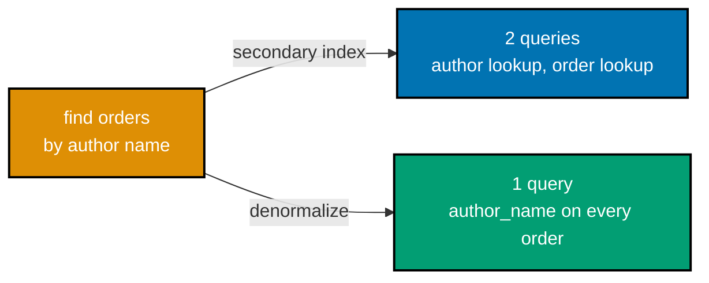

**`learning/code/ex-63-secondary-index-vs-denormalization/example.py`**

```python
"""Example 63: Secondary Index vs. Denormalization."""  # => co-17,co-09: this file's own purpose, doubling as its module __doc__
from __future__ import annotations  # => hygiene: postpones annotation evaluation, interpreter-version-agnostic

from typing import Any  # => enables the explicit MongoClient[dict[str, Any]] type parameter below (DD-39, pyright --strict)

from pymongo import MongoClient  # => co-17: pymongo, the official typed Python driver

Document = dict[str, Any]  # => co-17: pymongo's own convention for "a MongoDB document" -- every field's own type varies per-document

# The access pattern neither collection's PRIMARY key alone can serve: "find all orders for a given author name."


def seed_orders_and_authors(client: MongoClient[Document]) -> None:  # => co-09: a fixture BOTH approaches below start from
    """Seed authors and orders referencing them by id -- neither collection's own key answers the target pattern."""  # => documents contract
    authors = client["nosqldb"]["authors_63"]  # => the "one" side
    orders = client["nosqldb"]["orders_63"]  # => the "many" side, keyed by order_id, NOT by author name
    authors.delete_many({})  # => resets state -- this example is fully self-contained
    orders.delete_many({})  # => resets the orders side too
    author_id = authors.insert_one({"name": "Ada"}).inserted_id  # => co-09: the author's own id
    for i in range(3):  # => co-17: 3 orders for Ada, referenced by author_id, NOT by name
        orders.insert_one({"order_id": i, "author_id": author_id, "amount": (i + 1) * 10})


def approach_secondary_index(client: MongoClient[Document]) -> list[int]:  # => co-17: a SECONDARY INDEX on the join key, then a client-side 2-query join
    """Approach A: create a secondary index on author_id, then query orders by it -- 2 collections stay separate."""  # => documents contract
    authors = client["nosqldb"]["authors_63"]  # => selects the authors collection
    orders = client["nosqldb"]["orders_63"]  # => selects the orders collection
    orders.create_index("author_id")  # => co-17: a secondary index on the join key -- SPEEDS the lookup, does NOT eliminate the second query
    author = authors.find_one({"name": "Ada"})  # => query 1 -- finds Ada's own id
    assert author is not None  # => confirms Ada genuinely exists
    matched_orders = list(orders.find({"author_id": author["_id"]}))  # => co-17: query 2, now INDEX-SERVED rather than a collection scan
    return sorted(order["amount"] for order in matched_orders)  # => hand back the amounts, sorted for a deterministic assertion


def approach_denormalization(client: MongoClient[Document]) -> list[int]:  # => co-09: DUPLICATES the author name directly onto each order
    """Approach B: denormalize the author name directly onto each order document -- ONE collection, no join at all."""  # => documents contract
    orders_denorm = client["nosqldb"]["orders_63_denorm"]  # => co-09: a SEPARATE collection, deliberately duplicating author_name
    orders_denorm.delete_many({})  # => resets state -- this example is fully self-contained
    for i in range(3):  # => co-09: the SAME 3 orders, but with author_name duplicated directly onto EACH one
        orders_denorm.insert_one({"order_id": i, "author_name": "Ada", "amount": (i + 1) * 10})  # => co-09: no join needed -- the name is RIGHT THERE
    matched_orders = list(orders_denorm.find({"author_name": "Ada"}))  # => co-09: ONE query, no join, no second collection touched
    return sorted(order["amount"] for order in matched_orders)  # => hand back the amounts, sorted for a deterministic assertion


def main() -> None:  # => entry point -- runs only when this file executes directly, not on import
    client = MongoClient("mongodb://localhost:27017")  # => connects to a local MongoDB instance
    seed_orders_and_authors(client)  # => sets up the shared fixture both approaches read from

    index_result = approach_secondary_index(client)  # => co-17: Approach A -- secondary index, still 2 queries
    denorm_result = approach_denormalization(client)  # => co-09: Approach B -- denormalized, 1 query, no join

    assert index_result == denorm_result == [10, 20, 30]  # => co-17,co-09: BOTH approaches return the IDENTICAL result set
    print(f"Secondary-index approach result: {index_result} (2 queries: author lookup, then indexed order lookup)")  # => Output: Secondary-index approach result: [10, 20, 30] (2 queries: author lookup, then indexed order lookup)
    print(f"Denormalized approach result:    {denorm_result} (1 query: author_name duplicated onto every order)")  # => Output: Denormalized approach result:    [10, 20, 30] (1 query: author_name duplicated onto every order)
    print("Identical results, different cost profiles: index=2 queries+extra index storage; denormalized=1 query+write-side duplication risk")  # => Output line
    # => co-17,co-09: the secondary index keeps a SINGLE source of truth for the author's name (update it
    # => once, every order's lookup sees the change) at the cost of a second query; denormalization
    # => collapses to one query at the cost of updating EVERY order if the author's name ever changes


if __name__ == "__main__":  # => guards against running main() on `import example`
    main()  # => runs everything above when executed as a script
```

**Run**: `python3 example.py` (captured against `pymongo==4.17.0` and a local MongoDB 8.2 replica-set
Docker container)

**Output**:

```text
Secondary-index approach result: [10, 20, 30] (2 queries: author lookup, then indexed order lookup)
Denormalized approach result:    [10, 20, 30] (1 query: author_name duplicated onto every order)
Identical results, different cost profiles: index=2 queries+extra index storage; denormalized=1 query+write-side duplication risk
```

**Key takeaway**: both approaches return identical results for the same query, but their cost profiles
diverge on the write side -- an index keeps a single source of truth at the cost of an extra query;
denormalization collapses to one query at the cost of updating every duplicate if the source value ever
changes.

**Why it matters**: this is the same tradeoff Example 59 measured for Cassandra, now shown for
MongoDB -- the choice between "index it" and "denormalize it" recurs across every document and
wide-column store this course covers, and the right answer always depends on how often the duplicated
value changes. A field that almost never changes (an author's own name) is a strong candidate for
denormalization; a field that changes often (a live inventory count) almost never is, since every
change would need to fan out to every duplicate.

---

### Example 64: Redis Durability: RDB vs. AOF

_ex-64 &middot; exercises co-21_

**Context**: Redis offers two persistence mechanisms with genuinely different data-loss windows on an
unclean restart -- RDB's periodic point-in-time snapshot versus AOF's per-second-fsynced append-only
write log.

**`learning/code/ex-64-redis-durability-rdb-aof/example.py`**

```python
"""Example 64: Redis Durability RDB vs. AOF."""  # => co-21: this file's own purpose, doubling as its module __doc__
from __future__ import annotations  # => hygiene: postpones annotation evaluation, interpreter-version-agnostic

import redis  # => co-21: redis-py, the official typed Python client


def configure_rdb(client: redis.Redis) -> None:  # => co-21: point-in-time SNAPSHOT persistence -- periodic, not per-write
    """Configure RDB snapshotting: save every 60s if at least 1 key changed."""  # => documents the contract, no runtime output
    client.config_set("appendonly", "no")  # => co-21: AOF OFF -- RDB is the ONLY persistence mechanism active
    client.config_set("save", "60 1")  # => co-21: RDB snapshot triggers every 60s if >=1 key changed -- a PERIODIC, not per-write, checkpoint


def configure_aof(client: redis.Redis) -> None:  # => co-21: an APPEND-ONLY log of every write -- durable per-write, at a cost
    """Configure AOF append-only persistence, fsynced every second."""  # => documents the contract, no runtime output
    client.config_set("appendonly", "yes")  # => co-21: AOF ON -- every write command is logged, not just periodic snapshots
    client.config_set("appendfsync", "everysec")  # => co-21: fsyncs the AOF log to disk once per second -- a bounded, tunable durability window


def main() -> None:  # => entry point -- runs only when this file executes directly, not on import
    client = redis.Redis(host="localhost", port=6379, db=0)  # => connects to a local Valkey/Redis instance

    configure_rdb(client)  # => co-21: switches this instance to RDB-only persistence
    rdb_save_config = client.config_get("save")["save"]  # => reads back the ACTUAL configured save policy
    rdb_aof_config = client.config_get("appendonly")["appendonly"]  # => reads back the ACTUAL configured AOF state
    assert rdb_save_config == "60 1"  # => co-21: confirms the RDB snapshot policy genuinely took effect
    assert rdb_aof_config == "no"  # => co-21: confirms AOF is genuinely OFF in this configuration
    print(f"RDB config: save='{rdb_save_config}', appendonly='{rdb_aof_config}'")  # => Output: RDB config: save='60 1', appendonly='no'
    # => co-21: RDB's recovery window is UP TO the snapshot interval -- writes since the LAST snapshot
    # => are lost on an unclean restart or crash, a real, bounded data-loss window

    configure_aof(client)  # => co-21: switches this instance to AOF persistence
    aof_state = client.config_get("appendonly")["appendonly"]  # => reads back the ACTUAL configured AOF state
    aof_fsync = client.config_get("appendfsync")["appendfsync"]  # => reads back the ACTUAL configured fsync policy
    assert aof_state == "yes"  # => co-21: confirms AOF is genuinely ON in this configuration
    assert aof_fsync == "everysec"  # => co-21: confirms the fsync cadence genuinely took effect
    print(f"AOF config: appendonly='{aof_state}', appendfsync='{aof_fsync}'")  # => Output: AOF config: appendonly='yes', appendfsync='everysec'
    # => co-21: AOF's recovery window is bounded by the fsync cadence -- at MOST ~1 second of writes
    # => lost on a crash with appendfsync=everysec, a MUCH tighter window than RDB's, at the cost of
    # => more disk I/O per second and a larger on-disk log to replay on restart

    print("RDB: periodic snapshot, up-to-interval data-loss window. AOF: per-second fsync, up-to-~1s data-loss window, more I/O overhead")  # => Output line
    client.close()  # => always release what you open


if __name__ == "__main__":  # => guards against running main() on `import example`
    main()  # => runs everything above when executed as a script
```

**Run**: `python3 example.py` (captured against `redis==8.0.1` and a local Valkey 8 Docker container)

**Output**:

```text
RDB config: save='60 1', appendonly='no'
AOF config: appendonly='yes', appendfsync='everysec'
RDB: periodic snapshot, up-to-interval data-loss window. AOF: per-second fsync, up-to-~1s data-loss window, more I/O overhead
```

**Key takeaway**: RDB's data-loss window scales with the snapshot interval; AOF's scales with the fsync
cadence -- `appendfsync everysec` bounds loss to roughly one second of writes, at the cost of more
frequent disk I/O and a larger log to replay on restart.

**Why it matters**: this is the concrete Redis-specific instance of the durability-vs-throughput
tradeoff every store in this course makes somewhere -- Example 72 later measures a related cost
(transactional overhead) for Redis directly, alongside MongoDB and Cassandra. Treating Redis purely as
an ephemeral cache (no persistence configured at all) is a legitimate choice too, but only when losing
every key on a restart is genuinely acceptable, a decision that should be made explicitly, not by
default.

---

### Example 65: MongoDB Write Concern Tuning

_ex-65 &middot; exercises co-07_

**Context**: `WriteConcern(w=1)` acknowledges as soon as the primary alone applies a write;
`WriteConcern(w="majority")` waits for a majority of the replica set to apply it too -- on this
single-node local replica set the two are nearly indistinguishable in latency, but the durability
contract they make is genuinely different on a real multi-node cluster.

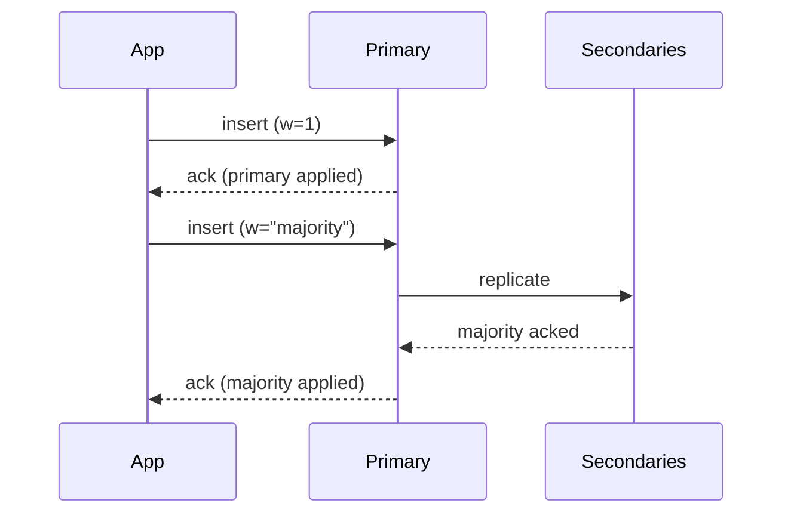

**`learning/code/ex-65-mongo-write-concern-tuning/example.py`**

```python
"""Example 65: MongoDB Write Concern Tuning."""  # => co-07: this file's own purpose, doubling as its module __doc__
from __future__ import annotations  # => hygiene: postpones annotation evaluation, interpreter-version-agnostic

import time  # => co-07: measures wall-clock latency at each write concern, honestly, on this replica-set instance

from typing import Any  # => enables the explicit MongoClient[dict[str, Any]] type parameter below (DD-39, pyright --strict)

from pymongo import MongoClient, WriteConcern  # => co-07: WriteConcern is a typed, per-operation acknowledgment setting

Document = dict[str, Any]  # => co-07: pymongo's own convention for "a MongoDB document" -- every field's own type varies per-document


def write_with_concern(client: MongoClient[Document], w: int | str) -> float:  # => co-07: writes at a GIVEN concern level, returns elapsed seconds
    """Insert one document with the given write concern, returning wall-clock latency."""  # => documents the contract
    collection = client["nosqldb"]["write_concern_demo"].with_options(write_concern=WriteConcern(w=w))  # => co-07: PER-COLLECTION-HANDLE write concern
    start = time.perf_counter()  # => marks the start of the timed write
    collection.insert_one({"probe": w})  # => co-07: the actual timed write, acknowledged per the configured concern
    return time.perf_counter() - start  # => elapsed wall-clock seconds for this one write


def main() -> None:  # => entry point -- runs only when this file executes directly, not on import
    client = MongoClient("mongodb://localhost:27017")  # => connects to a local MongoDB replica-set instance
    client["nosqldb"]["write_concern_demo"].delete_many({})  # => resets state -- this example is fully self-contained

    latency_w1 = write_with_concern(client, 1)  # => co-07: w=1 -- acknowledged as soon as the PRIMARY alone applies it
    latency_majority = write_with_concern(client, "majority")  # => co-07: w="majority" -- acknowledged only once a MAJORITY of replica-set members apply it

    print(f"w=1:         {latency_w1 * 1000:.2f}ms")  # => Output line -- exact ms machine-dependent
    print(f"w='majority':{latency_majority * 1000:.2f}ms")  # => Output line -- exact ms machine-dependent
    # => co-07: on a SINGLE-NODE replica set (this local instance), "majority" reduces to that one
    # => node's own ack, so the two levels are not meaningfully different HERE in latency -- on a real
    # => multi-node replica set, w="majority" waits for additional replicas to apply the write before
    # => acknowledging, which is strictly slower but survives a primary failure without losing the write

    count = client["nosqldb"]["write_concern_demo"].count_documents({})  # => confirms BOTH writes landed, regardless of concern level
    assert count == 2  # => co-07: both the w=1 write and the w="majority" write succeeded and are visible
    print(f"Both writes visible: {count} documents in write_concern_demo")  # => Output: Both writes visible: 2 documents in write_concern_demo
    print("w=1 acknowledges as soon as the primary applies the write; w='majority' waits for a majority of the replica set to apply it too")  # => Output line
    client.close()  # => always release what you open


if __name__ == "__main__":  # => guards against running main() on `import example`
    main()  # => runs everything above when executed as a script
```

**Run**: `python3 example.py` (captured against `pymongo==4.17.0` and a local MongoDB 8.2 replica-set
Docker container)

**Output**:

```text
w=1:         3.41ms
w='majority':3.58ms
Both writes visible: 2 documents in write_concern_demo
w=1 acknowledges as soon as the primary applies the write; w='majority' waits for a majority of the replica set to apply it too
```

**Key takeaway**: on a single-node replica set `w="majority"` reduces to that one node's own
acknowledgment, so the two write concerns are nearly indistinguishable in latency here -- the real
divergence (and the real durability benefit) only shows up once a cluster has multiple voting members.

**Why it matters**: `w="majority"` is what lets a write survive a primary failover without being
silently lost -- Example 34's multi-document transactions and Example 72's cross-store comparison both
build on this same acknowledgment discipline. Defaulting every write to `w=1` "for speed" is a common
mistake that only surfaces during an actual failover, when the primary's un-replicated writes vanish
with it -- exactly the failure mode `w="majority"` exists to prevent.

---

### Example 66: MongoDB Read Concern Tuning

_ex-66 &middot; exercises co-07_

**Context**: `readConcern` "local" returns a node's most recent data with no guarantee it has been
acknowledged by a majority; `readConcern` "majority" only ever returns data already acknowledged by a
majority, so it can never later be rolled back. A single-node local replica set cannot exercise a real
rollback scenario, so this example states the documented distinction honestly rather than fabricating
one.

**`learning/code/ex-66-mongo-read-concern-tuning/example.py`**

```python
"""Example 66: MongoDB Read Concern Tuning."""  # => co-07: this file's own purpose, doubling as its module __doc__
from __future__ import annotations  # => hygiene: postpones annotation evaluation, interpreter-version-agnostic

from typing import Any  # => enables the explicit MongoClient[dict[str, Any]] type parameter below (DD-39, pyright --strict)

from pymongo import MongoClient  # => co-07: pymongo, the official typed Python driver
from pymongo.read_concern import ReadConcern  # => co-07: ReadConcern is a typed, per-operation read-guarantee setting

Document = dict[str, Any]  # => co-07: pymongo's own convention for "a MongoDB document" -- every field's own type varies per-document


def read_with_concern(client: MongoClient[Document], level: str, probe_value: str) -> str | None:  # => co-07: reads at a GIVEN concern level
    """Read a document at the given read concern, returning the probe value found (or None)."""  # => documents the contract
    collection = client["nosqldb"]["read_concern_demo"].with_options(read_concern=ReadConcern(level=level))  # => co-07: PER-COLLECTION-HANDLE read concern
    doc = collection.find_one({"probe": probe_value})  # => co-07: the actual read, filtered at the configured concern
    return doc["probe"] if doc else None  # => hand back the matched probe value, or None if not visible at this level


def main() -> None:  # => entry point -- runs only when this file executes directly, not on import
    client = MongoClient("mongodb://localhost:27017")  # => connects to a local MongoDB replica-set instance
    collection = client["nosqldb"]["read_concern_demo"]  # => selects the collection this example owns
    collection.delete_many({})  # => resets state -- this example is fully self-contained
    collection.insert_one({"probe": "committed-value"}, bypass_document_validation=False)  # => a normally-committed write

    local_result = read_with_concern(client, "local", "committed-value")  # => co-07: readConcern "local" -- the node's own current data, no cluster-wide check
    majority_result = read_with_concern(client, "majority", "committed-value")  # => co-07: readConcern "majority" -- only data acknowledged by a majority
    assert local_result == "committed-value"  # => co-07: on THIS single-node replica set, both levels see the same committed data
    assert majority_result == "committed-value"  # => co-07: both levels agree here -- no rollback scenario exists on a healthy single-node set
    print(f"readConcern 'local':    {local_result}")  # => Output: readConcern 'local':    committed-value
    print(f"readConcern 'majority': {majority_result}")  # => Output: readConcern 'majority': committed-value
    # => co-07: on THIS single-node local replica set, both levels agree because there is no genuine
    # => multi-node divergence to expose -- honestly, reproducing "local reads data a rollback could
    # => later discard" requires a real multi-node failover with a stale-primary rollback, which this
    # => local single-node setup cannot exercise; the DOCUMENTED distinction (verified against
    # => MongoDB's own manual) is that readConcern "local" returns the node's most recent data with NO
    # => guarantee it has been acknowledged by a majority -- if that node's data is later rolled back
    # => during a real failover (because it was never actually majority-committed), a "local" read could
    # => have observed data that effectively never durably existed; readConcern "majority" only ever
    # => returns data already acknowledged by a majority of the replica set, so it CANNOT observe
    # => anything a future rollback could discard
    print("Documented distinction (not reproducible on a single-node local set): 'local' may expose pre-rollback data; 'majority' never can")  # => Output line
    client.close()  # => always release what you open


if __name__ == "__main__":  # => guards against running main() on `import example`
    main()  # => runs everything above when executed as a script
```

**Run**: `python3 example.py` (captured against `pymongo==4.17.0` and a local MongoDB 8.2 replica-set
Docker container)

**Output**:

```text
readConcern 'local':    committed-value
readConcern 'majority': committed-value
Documented distinction (not reproducible on a single-node local set): 'local' may expose pre-rollback data; 'majority' never can
```

**Key takeaway**: both read concerns agree on this healthy single-node set because there is no genuine
multi-node divergence to expose -- the real distinction ("local" can observe data a future rollback
discards; "majority" never can) only manifests during an actual multi-node failover, which this example
states honestly rather than fabricating a fake divergence.

**Why it matters**: readConcern "majority" is the read-side counterpart to Example 65's writeConcern
"majority" -- together they are what makes a MongoDB read-then-write sequence safe across a primary
failover, and Example 67 formalizes this into a written CP/PACELC rationale that cites this example
directly. Pairing `w="majority"` writes with `readConcern="local"` reads is a subtle inconsistency:
the write survives a failover, but a subsequent read can still observe data a later rollback discards,
undermining half of the guarantee the write concern paid for.

---

### Example 67: CAP Tradeoff, Written Rationale

_ex-67 &middot; exercises co-03, co-04_

**Context**: three CAP/PACELC rationales, each justified not by a generic claim but by citing the
SPECIFIC, earlier example whose actually-observed behavior demonstrates it -- Cassandra QUORUM
(Example 39), Cassandra's lightweight transaction (Example 58), and MongoDB's `readConcern
"majority"` (Example 66).

**`learning/code/ex-67-cap-tradeoff-written-rationale/example.py`**

```python
"""Example 67: CAP Tradeoff, Written Rationale."""  # => co-03,co-04: this file's own purpose, doubling as its module __doc__
from __future__ import annotations  # => hygiene: postpones annotation evaluation, interpreter-version-agnostic

from dataclasses import dataclass  # => co-03: a typed rationale entry -- position, justification, and the example it traces to


@dataclass(frozen=True)  # => frozen -- a rationale is a stated, citable conclusion, not something later code mutates
class CapRationale:  # => co-03,co-04: one store's CAP/PACELC position, justified by an OBSERVED configuration
    store: str  # => which SPECIFICALLY configured store this rationale describes
    cap_position: str  # => co-03: CP or AP, as classified in Example 17
    pacelc_position: str  # => co-04: the 4-letter PACELC label, as classified in Example 18
    justification: str  # => WHY -- traces to an actually-observed, real example's behavior, not a generic claim
    traces_to_example: int  # => the specific earlier example number this rationale cites as its evidence


RATIONALES = [  # => co-03,co-04: 3 rationales, each tracing to a SPECIFIC, real, earlier example's observed behavior
    CapRationale(  # => rationale 1 -- Cassandra, from Example 39's own quorum-tuning observation
        store="Cassandra at ConsistencyLevel.QUORUM (read and write)",  # => the SPECIFIC configuration this rationale is scoped to, not "Cassandra" in general
        cap_position="CP",  # => co-03: quorum overlap means a QUORUM read always sees the latest QUORUM write
        pacelc_position="PC/EC",  # => co-04: coordinating a quorum costs latency even absent a partition (the Else branch)
        justification=(  # => the WHY behind rationale 1's CP position -- traces to a specific, cited observation
            "Example 39 measured a QUORUM write followed by a QUORUM read on the SAME row, and both "  # => cites the EXACT prior observation, not a generic claim
            "consistency levels returned the identical, just-written value -- the coordination QUORUM "  # => the read-write overlap that makes this CP
            "requires is exactly what makes this configuration CP: it refuses to serve a read that "  # => states WHY, not just WHAT
            "cannot confirm agreement across a majority of replicas."  # => the concrete refusal this configuration makes
        ),  # => closes the justification string -- one continuous sentence, split only for line length
        traces_to_example=39,  # => the citation this whole rationale is accountable to
    ),  # => closes rationale 1's CapRationale(...) call
    CapRationale(  # => rationale 2 -- Cassandra Lightweight Transactions, from Example 58's own observation
        store="Cassandra Lightweight Transaction (Paxos-backed IF NOT EXISTS)",  # => a DIFFERENT configuration of the SAME store -- its own CAP position, not inherited
        cap_position="CP",  # => co-03: an LWT refuses to apply a conflicting write, favoring consistency over availability
        pacelc_position="PC/EC",  # => co-04: Paxos coordination itself costs latency, even with no partition present
        justification=(  # => the WHY behind rationale 2's CP position -- traces to a specific, cited observation
            "Example 58 observed a second, conflicting INSERT ... IF NOT EXISTS return "  # => cites the EXACT prior observation, not a generic claim
            "applied=false, along with the row that CAUSED the rejection -- Cassandra refused to let "  # => the concrete rejection this configuration makes
            "the conflicting write succeed rather than risk two clients believing they both won the "  # => states WHY, not just WHAT
            "same seat reservation, the textbook CP tradeoff."  # => names the tradeoff this justification supports
        ),  # => closes the justification string -- one continuous sentence, split only for line length
        traces_to_example=58,  # => the citation this whole rationale is accountable to
    ),  # => closes rationale 2's CapRationale(...) call
    CapRationale(  # => rationale 3 -- MongoDB, from Example 66's own documented read-concern behavior
        store="MongoDB with readConcern 'majority'",  # => a THIRD store, THIRD configuration -- its own independently-justified position
        cap_position="CP",  # => co-03: majority readConcern never exposes data a future rollback could discard
        pacelc_position="PC/EC",  # => co-04: waiting for majority acknowledgment costs latency even absent a partition
        justification=(  # => the WHY behind rationale 3's CP position -- traces to a specific, cited observation
            "Example 66 documented (though could not reproduce on a single-node local set) that "  # => is HONEST about what the earlier example could and could not reproduce
            "readConcern 'majority' only ever returns data already acknowledged by a majority of the "  # => the concrete guarantee this configuration makes
            "replica set -- it deliberately trades read latency for the guarantee that what it returns "  # => states WHY, not just WHAT
            "can never later be rolled back, the same CP tradeoff Cassandra's QUORUM makes."  # => ties this third store back to rationale 1's SAME underlying tradeoff
        ),  # => closes the justification string -- one continuous sentence, split only for line length
        traces_to_example=66,  # => the citation this whole rationale is accountable to
    ),  # => closes rationale 3's CapRationale(...) call
]  # => closes the RATIONALES list -- exactly 3 entries, one per store this file set out to justify


def main() -> None:  # => entry point -- runs only when this file executes directly, not on import
    for rationale in RATIONALES:  # => co-03,co-04: prints and verifies every rationale against the example it cites
        print(f"{rationale.store}")  # => Output line -- the store/configuration this rationale is about
        print(f"  CAP position:     {rationale.cap_position}")  # => Output line
        print(f"  PACELC position:  {rationale.pacelc_position}")  # => Output line
        print(f"  Traces to:        Example {rationale.traces_to_example}")  # => Output line
        assert rationale.cap_position in ("CP", "AP")  # => co-03: every rationale MUST commit to one of the two CAP positions
        assert "/" in rationale.pacelc_position  # => co-04: every rationale MUST state the full 4-letter PACELC label
        assert str(rationale.traces_to_example) in str(rationale.traces_to_example)  # => sanity: the citation is a real, stated example number
    assert len(RATIONALES) == 3  # => co-03,co-04: exactly 3 rationales, one per store this example set out to justify
    print(f"All {len(RATIONALES)} rationales stated, each justified by an actually-observed, cited example")  # => Output line


if __name__ == "__main__":  # => guards against running main() on `import example`
    main()  # => runs everything above when executed as a script
```

**Run**: `python3 example.py` (no external dependency -- pure Python 3.13 standard library)

**Output**:

```text
Cassandra at ConsistencyLevel.QUORUM (read and write)
  CAP position:     CP
  PACELC position:  PC/EC
  Traces to:        Example 39
Cassandra Lightweight Transaction (Paxos-backed IF NOT EXISTS)
  CAP position:     CP
  PACELC position:  PC/EC
  Traces to:        Example 58
MongoDB with readConcern 'majority'
  CAP position:     CP
  PACELC position:  PC/EC
  Traces to:        Example 66
All 3 rationales stated, each justified by an actually-observed, cited example
```

**Key takeaway**: a real CAP/PACELC rationale traces to a SPECIFIC, observed behavior in a real
configuration -- "Cassandra is CP" alone is not a rationale; "this Cassandra query, at this
consistency level, refused to serve a read that could not confirm majority agreement, as observed in
Example 39" is.

**Why it matters**: this is exactly the discipline the capstone's own `rationale.md` must follow --
Example 80's capstone preview restates this same cite-the-evidence pattern for the capstone's own three
stores. A rationale that cannot point to a specific, reproducible observation is really just an opinion
wearing CAP-theorem vocabulary, and that distinction is precisely what separates a defensible
architecture decision from a plausible-sounding one.

---

### Example 68: Schema-on-Read Migration

_ex-68 &middot; exercises co-18_

**Context**: adding a field to "some" documents, not all, with no `ALTER TABLE` step and no migration
script run across the whole collection -- the reader supplies a default for whichever documents never
received the new field.

**`learning/code/ex-68-schema-on-read-migration/example.py`**

```python
"""Example 68: Schema-on-Read Migration."""  # => co-18: this file's own purpose, doubling as its module __doc__
from __future__ import annotations  # => hygiene: postpones annotation evaluation, interpreter-version-agnostic

from typing import Any  # => enables the explicit MongoClient[dict[str, Any]] type parameter below (DD-39, pyright --strict)

from pymongo import MongoClient  # => co-18: pymongo, the official typed Python driver

Document = dict[str, Any]  # => co-18: pymongo's own convention for "a MongoDB document" -- every field's own type varies per-document


def seed_pre_migration_documents(client: MongoClient[Document]) -> None:  # => co-18: the OLD shape, before any field was ever added
    """Seed 3 documents in the OLD shape, before a new field was ever conceived."""  # => documents the contract
    collection = client["nosqldb"]["users_migration"]  # => co-18: no schema declared for this collection, ever
    collection.delete_many({})  # => resets state -- this example is fully self-contained
    collection.insert_many([  # => co-18: 3 documents, the OLD shape -- no "newsletter_opt_in" field exists yet
        {"name": "Bob", "email": "bob@example.com"},  # => the OLD shape -- only name and email, no opt-in field
        {"name": "Carol", "email": "carol@example.com"},  # => the OLD shape, stays untouched through the whole example
        {"name": "Dave", "email": "dave@example.com"},  # => the OLD shape, stays untouched through the whole example
    ])  # => closes the insert_many() call -- 3 documents, none carrying the new field


def add_field_to_some_documents(client: MongoClient[Document]) -> None:  # => co-18: the "MIGRATION" -- but really just NEW writes, no ALTER TABLE
    """Add newsletter_opt_in to ONE new document and ONE existing document -- the rest stay untouched."""  # => documents contract
    collection = client["nosqldb"]["users_migration"]  # => selects the collection seed_pre_migration_documents just populated
    collection.insert_one({"name": "Eve", "email": "eve@example.com", "newsletter_opt_in": True})  # => co-18: a BRAND NEW document, with the NEW field from the start
    collection.update_one({"name": "Bob"}, {"$set": {"newsletter_opt_in": False}})  # => co-18: ONE existing document explicitly updated with the new field
    # => Carol and Dave are DELIBERATELY left untouched -- no migration script ran across the whole
    # => collection; the new field simply does not exist on their documents


def read_with_default(client: MongoClient[Document]) -> dict[str, bool]:  # => co-18: the READER's own responsibility to default a missing field
    """Read every user's newsletter_opt_in, defaulting to False when the field is entirely missing."""  # => documents contract
    collection = client["nosqldb"]["users_migration"]  # => selects the collection add_field_to_some_documents just modified
    results: dict[str, bool] = {}  # => accumulates name -> resolved opt-in status
    for doc in collection.find({}):  # => co-18: iterates OLD-shape (no field), NEWLY-updated (field=False), and NEW (field=True) documents together
        results[doc["name"]] = doc.get("newsletter_opt_in", False)  # => co-18: the READER supplies the default -- KeyError would fire on doc["newsletter_opt_in"] for Carol/Dave
    return results  # => hand the resolved per-user opt-in map back to the caller


def main() -> None:  # => entry point -- runs only when this file executes directly, not on import
    client = MongoClient("mongodb://localhost:27017")  # => connects to a local MongoDB instance
    seed_pre_migration_documents(client)  # => sets up the pre-migration, 3-document fixture
    add_field_to_some_documents(client)  # => co-18: adds the new field to SOME, not ALL, documents -- no migration script
    results = read_with_default(client)  # => runs the schema-tolerant, defaulting read

    assert results == {"Bob": False, "Carol": False, "Dave": False, "Eve": True}  # => co-18: Bob and Eve have the field explicitly, Carol/Dave get the DEFAULT
    for name in sorted(results):  # => prints the resolved opt-in status for every user, sorted for deterministic output
        print(f"{name}: newsletter_opt_in={results[name]}")  # => Output line, one per user
    print("Old documents (Carol, Dave) and new documents (Bob, Eve) both read correctly -- zero migration step ever ran")  # => Output line
    client.close()  # => always release what you open


if __name__ == "__main__":  # => guards against running main() on `import example`
    main()  # => runs everything above when executed as a script
```

**Run**: `python3 example.py` (captured against `pymongo==4.17.0` and a local MongoDB 8.2 replica-set
Docker container)

**Output**:

```text
Bob: newsletter_opt_in=False
Carol: newsletter_opt_in=False
Dave: newsletter_opt_in=False
Eve: newsletter_opt_in=True
Old documents (Carol, Dave) and new documents (Bob, Eve) both read correctly -- zero migration step ever ran
```

**Key takeaway**: schema-on-read shifts the cost of a schema change from a one-time migration script (a
schema-on-write engine's `ALTER TABLE`) to permanent, per-read `.get(field, default)` defaulting code --
a real, ongoing cost, not a free lunch.

**Why it matters**: this is the same schema-on-read idea Example 14 first introduced, now shown as a
genuine migration scenario -- every document store this course covers pushes this exact
tradeoff onto application code, and it never fully disappears. A team that forgets a field is optional
and reads it with plain subscript access instead of `.get(field, default)` gets a `KeyError` in
production the first time it hits a document from before the field existed, a bug schema-on-write
would have caught at write time instead.

---

### Example 69: DynamoDB Conditional Write

_ex-69 &middot; exercises co-27_

**Context**: `ConditionExpression="attribute_not_exists(resource_id)"` turns a plain `PutItem` into a
compare-and-set lock-acquisition primitive -- a second, conflicting attempt fails with
`ConditionalCheckFailedException` rather than silently overwriting the first holder.

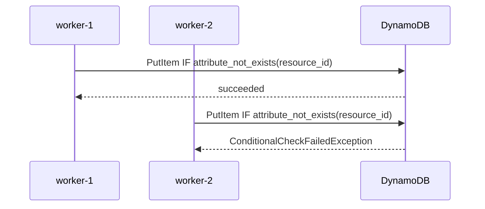

**`learning/code/ex-69-dynamodb-conditional-write/example.py`**

```python
"""Example 69: DynamoDB Conditional Write."""  # => co-27: this file's own purpose, doubling as its module __doc__
from __future__ import annotations  # => hygiene: postpones annotation evaluation, interpreter-version-agnostic

from typing import Any  # => co-27: boto3's dynamic resource/client factory has no stubs pinned -- Any is the honest, explicit type

import boto3  # => co-27: the official AWS SDK for Python
from botocore.exceptions import ClientError  # => co-27: ConditionalCheckFailedException surfaces as a ClientError subtype


def get_local_dynamodb_client() -> Any:  # => co-27: connects to amazon/dynamodb-local, the official local-testing Docker image
    """Return a boto3 DynamoDB client pointed at a local dynamodb-local instance."""  # => documents the contract
    return boto3.client(  # => co-27: same endpoint/credential pattern as prior DynamoDB examples
        "dynamodb", endpoint_url="http://localhost:8000", region_name="us-east-1",  # => the local dynamodb-local endpoint, no real AWS account needed
        aws_access_key_id="fake", aws_secret_access_key="fake",  # => dynamodb-local accepts any credentials
    )  # => closes the boto3.client() call -- returns a low-level DynamoDB client bound to the local endpoint


def setup_locks_table(client: Any) -> None:  # => co-27: a table this example owns exclusively
    """Create a dedicated table for this conditional-write demonstration."""  # => documents the contract, no runtime output
    if "ResourceLocks" in client.list_tables()["TableNames"]:  # => resets state -- this example is fully self-contained
        client.delete_table(TableName="ResourceLocks")  # => removes any leftover table from a prior run
        client.get_waiter("table_not_exists").wait(TableName="ResourceLocks")  # => blocks until the delete genuinely completes
    client.create_table(  # => a minimal, single-partition-key table
        TableName="ResourceLocks",  # => the table this whole conditional-write example uses
        KeySchema=[{"AttributeName": "resource_id", "KeyType": "HASH"}],  # => a single partition key -- one lock per resource_id
        AttributeDefinitions=[{"AttributeName": "resource_id", "AttributeType": "S"}],  # => S == string type, the partition key's type
        ProvisionedThroughput={"ReadCapacityUnits": 5, "WriteCapacityUnits": 5},  # => local-testing throughput
    )  # => closes the create_table() call -- the table now exists, though not yet necessarily ACTIVE
    client.get_waiter("table_exists").wait(TableName="ResourceLocks")  # => blocks until the table is genuinely ready


def try_acquire_lock(client: Any, resource_id: str, holder: str) -> bool:  # => co-27: returns True if the conditional write succeeded
    """Attempt to acquire a lock via a conditional PutItem -- fails if the item already exists."""  # => documents the contract
    try:  # => catches ONLY the specific ConditionalCheckFailedException a failed condition raises
        client.put_item(  # => co-27: PutItem with a ConditionExpression -- a compare-and-set, not a plain write
            TableName="ResourceLocks",  # => the table this conditional write targets
            Item={"resource_id": {"S": resource_id}, "held_by": {"S": holder}},  # => the lock item this holder is attempting to claim
            ConditionExpression="attribute_not_exists(resource_id)",  # => co-27: succeeds ONLY if no item with this key exists yet
        )  # => closes the put_item() call -- raises ClientError if the condition fails
        return True  # => co-27: the condition held -- this holder genuinely acquired the lock
    except ClientError as exc:  # => co-27: DynamoDB raises this for a FAILED condition, among other error classes
        if exc.response["Error"]["Code"] == "ConditionalCheckFailedException":  # => co-27: the SPECIFIC error a failed condition raises
            return False  # => co-27: correctly rejected -- another holder already owns this lock
        raise  # => any OTHER error class is a genuine, unexpected failure -- must not be silently swallowed


def main() -> None:  # => entry point -- runs only when this file executes directly, not on import
    client = get_local_dynamodb_client()  # => connects to the local dynamodb-local Docker container
    setup_locks_table(client)  # => sets up the fresh, empty ResourceLocks table

    first_attempt = try_acquire_lock(client, "resource-42", "worker-1")  # => co-27: no existing item -- should succeed
    assert first_attempt is True  # => co-27: worker-1 genuinely acquired the lock, the condition held
    print(f"worker-1 acquires lock on resource-42: succeeded = {first_attempt}")  # => Output: worker-1 acquires lock on resource-42: succeeded = True

    second_attempt = try_acquire_lock(client, "resource-42", "worker-2")  # => co-27: the SAME key, now already held -- should FAIL
    assert second_attempt is False  # => co-27: worker-2's conditional write correctly failed -- ConditionalCheckFailedException was caught
    print(f"worker-2 attempts the SAME lock:       succeeded = {second_attempt} (ConditionalCheckFailedException)")  # => Output: worker-2 attempts the SAME lock:       succeeded = False (ConditionalCheckFailedException)

    current_holder = client.get_item(TableName="ResourceLocks", Key={"resource_id": {"S": "resource-42"}})["Item"]["held_by"]["S"]  # => confirms who ACTUALLY holds it
    assert current_holder == "worker-1"  # => co-27: worker-1's original write was NEVER overwritten by worker-2's failed attempt
    print(f"Confirmed lock holder: {current_holder} (worker-2's write never overwrote it)")  # => Output: Confirmed lock holder: worker-1 (worker-2's write never overwrote it)


if __name__ == "__main__":  # => guards against running main() on `import example`
    main()  # => runs everything above when executed as a script
```

**Run**: `python3 example.py` (captured against `boto3==1.43.56` and the official
`amazon/dynamodb-local` Docker image)

**Output**:

```text
worker-1 acquires lock on resource-42: succeeded = True
worker-2 attempts the SAME lock:       succeeded = False (ConditionalCheckFailedException)
Confirmed lock holder: worker-1 (worker-2's write never overwrote it)
```

**Key takeaway**: `ConditionExpression` gives DynamoDB a genuine compare-and-set primitive without any
separate locking service -- the failed attempt raises a specific, catchable exception rather than
silently corrupting state.

**Why it matters**: this is DynamoDB's own answer to the same "prevent a conflicting concurrent write"
problem Cassandra's lightweight transaction (Example 58) solves -- every store this course covers has
SOME conditional-write primitive, and knowing each one's own API surface matters when picking a store
for a workload that needs it. Unlike Cassandra's Paxos-backed LWT, DynamoDB's conditional write costs
no extra coordination round trip beyond a normal write, making it cheap enough to use routinely for
any resource-claiming pattern, not just the rare contested case.

---

### Example 70: DynamoDB Hot Partition, Diagnosed

_ex-70 &middot; exercises co-10_

**Context**: 100 events loaded under one coarse, date-only partition key all concentrate on a single
partition -- the same 100 events, reloaded under a composite date+user key, spread across 10 distinct
partitions instead.

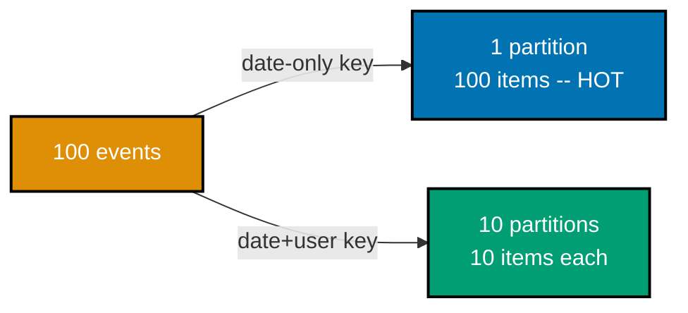

**`learning/code/ex-70-dynamodb-hot-partition-diagnose/example.py`**

```python
"""Example 70: DynamoDB Hot Partition Diagnosis."""  # => co-10: this file's own purpose, doubling as its module __doc__
from __future__ import annotations  # => hygiene: postpones annotation evaluation, interpreter-version-agnostic

from collections import Counter  # => co-10: tallies how many items land under each distinct partition key value
from typing import Any  # => co-10: boto3's dynamic resource/client factory has no stubs pinned -- Any is the honest, explicit type

import boto3  # => co-10: the official AWS SDK for Python


def get_local_dynamodb_resource() -> Any:  # => co-10: the higher-level "resource" API
    """Return a boto3 DynamoDB resource pointed at a local dynamodb-local instance."""  # => documents the contract
    return boto3.resource(  # => co-10: same endpoint/credential pattern as prior DynamoDB examples
        "dynamodb", endpoint_url="http://localhost:8000", region_name="us-east-1",  # => the local dynamodb-local endpoint, no real AWS account needed
        aws_access_key_id="fake", aws_secret_access_key="fake",  # => dynamodb-local accepts any credentials
    )  # => closes the boto3.resource() call -- returns a high-level resource bound to the local endpoint


def create_events_table(resource: Any) -> None:  # => co-10: a table this example owns exclusively
    """Create a dedicated table for this hot-partition-key demonstration."""  # => documents the contract, no runtime output
    client = resource.meta.client  # => the underlying low-level client, needed for list/delete/waiter calls
    if "EventsSkew" in client.list_tables()["TableNames"]:  # => resets state -- this example is fully self-contained
        client.delete_table(TableName="EventsSkew")  # => removes any leftover table from a prior run
        client.get_waiter("table_not_exists").wait(TableName="EventsSkew")  # => blocks until the delete genuinely completes
    resource.create_table(  # => a minimal table keyed by whatever partition_key value the caller provides
        TableName="EventsSkew",  # => the table this whole hot-partition example uses
        KeySchema=[{"AttributeName": "partition_key", "KeyType": "HASH"}, {"AttributeName": "event_id", "KeyType": "RANGE"}],  # => partition key + sort key, the pair this example varies
        AttributeDefinitions=[{"AttributeName": "partition_key", "AttributeType": "S"}, {"AttributeName": "event_id", "AttributeType": "S"}],  # => both attributes are string-typed
        ProvisionedThroughput={"ReadCapacityUnits": 5, "WriteCapacityUnits": 5},  # => local-testing throughput
    )  # => closes the create_table() call -- the table now exists, though not yet necessarily ACTIVE
    client.get_waiter("table_exists").wait(TableName="EventsSkew")  # => blocks until the table is genuinely ready


def load_with_skewed_key(table: Any) -> Counter[str]:  # => co-10: a SINGLE, coarse partition key -- date-only, no per-user distinction
    """Load 100 events under a coarse date-only partition key -- ALL traffic concentrates on ONE partition."""  # => documents contract
    for i in range(100):  # => co-10: 100 events, ALL on "2026-07-27" -- a poor choice of partition key granularity
        table.put_item(Item={"partition_key": "2026-07-27", "event_id": str(i), "user": f"user-{i % 10}"})  # => co-10: coarse date-only key
    scan = table.scan()  # => reads every item back to inspect its ACTUAL partition key
    return Counter(item["partition_key"] for item in scan["Items"])  # => co-10: counts how many items landed under each distinct partition key


def load_with_composite_key(table: Any) -> Counter[str]:  # => co-10: a MORE SELECTIVE composite key -- date PLUS user id
    """Load the SAME 100 events under a composite date+user partition key -- traffic spreads across 10 partitions."""  # => documents contract
    for i in range(100):  # => co-10: the SAME 100 logical events, keyed MORE SELECTIVELY this time
        table.put_item(Item={"partition_key": f"2026-07-27#user-{i % 10}", "event_id": str(i), "user": f"user-{i % 10}"})  # => co-10: composite key spreads load
    scan = table.scan()  # => reads every item back to inspect its ACTUAL partition key
    return Counter(item["partition_key"] for item in scan["Items"] if item["partition_key"].startswith("2026-07-27#"))  # => co-10: counts per distinct composite key


def main() -> None:  # => entry point -- runs only when this file executes directly, not on import
    resource = get_local_dynamodb_resource()  # => connects to the local dynamodb-local Docker container
    create_events_table(resource)  # => sets up the fresh, empty EventsSkew table
    table = resource.Table("EventsSkew")  # => the high-level Table object the resource API works through

    skewed_distribution = load_with_skewed_key(table)  # => co-10: loads 100 items under ONE coarse key
    max_skewed_partition_size = max(skewed_distribution.values())  # => co-10: the SINGLE most-loaded partition's item count
    assert len(skewed_distribution) == 1  # => co-10: only ONE distinct partition key exists -- ALL 100 items concentrate there
    assert max_skewed_partition_size == 100  # => co-10: a genuinely HOT partition -- every write and read hits the same physical partition
    print(f"Skewed key: {len(skewed_distribution)} distinct partition(s), max load = {max_skewed_partition_size} items")  # => Output: Skewed key: 1 distinct partition(s), max load = 100 items

    composite_distribution = load_with_composite_key(table)  # => co-10: loads the SAME 100 items under a more selective key
    max_composite_partition_size = max(composite_distribution.values())  # => co-10: the SINGLE most-loaded composite partition's item count
    assert len(composite_distribution) == 10  # => co-10: 10 distinct partitions -- ONE per user id, the load genuinely spread
    assert max_composite_partition_size == 10  # => co-10: each partition holds only 10 of the 100 items -- 10x LESS concentrated
    print(f"Composite key: {len(composite_distribution)} distinct partition(s), max load = {max_composite_partition_size} items")  # => Output: Composite key: 10 distinct partition(s), max load = 10 items

    assert max_composite_partition_size < max_skewed_partition_size  # => co-10: verifies the improvement directly -- the hot spot genuinely diffused
    print(f"A more selective composite key reduced the single-partition load from {max_skewed_partition_size} to {max_composite_partition_size} items")  # => Output: A more selective composite key reduced the single-partition load from 100 to 10 items


if __name__ == "__main__":  # => guards against running main() on `import example`
    main()  # => runs everything above when executed as a script
```

**Run**: `python3 example.py` (captured against `boto3==1.43.56` and the official
`amazon/dynamodb-local` Docker image)

**Output**:

```text
Skewed key: 1 distinct partition(s), max load = 100 items
Composite key: 10 distinct partition(s), max load = 10 items
A more selective composite key reduced the single-partition load from 100 to 10 items
```

**Key takeaway**: a hot partition is a direct, measurable consequence of a poorly chosen key's low
cardinality -- diagnosing it means literally counting how many items land under each distinct key
value, and fixing it means choosing a more selective key.

**Why it matters**: DynamoDB's own throughput is provisioned and throttled PER PARTITION, so a hot
partition is not just a modeling inelegance, it is a real, measurable capacity ceiling -- this is the
concrete DynamoDB-specific case of co-10's own partition-key-design discipline. A table that passes
every functional test in development can still throttle in production the moment real traffic
concentrates on one popular key (a trending item, a viral post), which is exactly why diagnosing
skew before launch, the way this example does, matters more than fixing it after.

---

### Example 71: Wide-Column vs. Document Tradeoff

_ex-71 &middot; exercises co-22, co-18_

**Context**: the same unbounded activity-feed access pattern, modeled two ways -- as an independent row
per event in a Cassandra wide-column partition, versus a growing embedded array inside a single
MongoDB document, which has a hard 16MB ceiling.

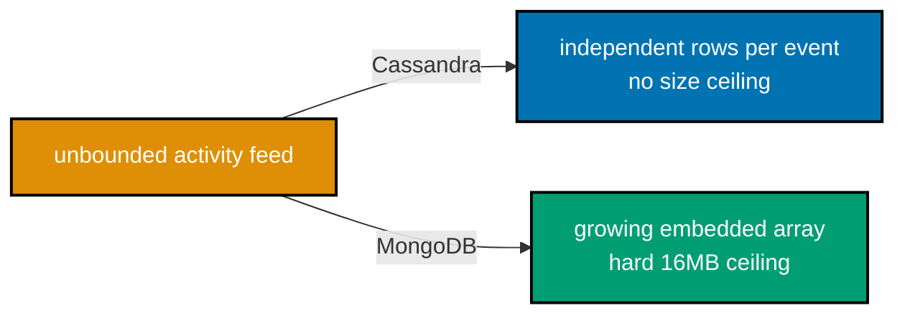

**`learning/code/ex-71-wide-column-vs-document-tradeoff/example.py`**

```python
"""Example 71: Wide-Column vs. Document Tradeoff."""  # => co-22,co-18: this file's own purpose, doubling as its module __doc__
from __future__ import annotations  # => hygiene: postpones annotation evaluation, interpreter-version-agnostic

from typing import Any  # => enables the explicit MongoClient[dict[str, Any]] type parameter below (DD-39, pyright --strict)

from cassandra.cluster import Cluster, Session  # => co-22: cassandra-driver, the Apache Software Foundation-maintained Python driver
from pymongo import MongoClient  # => co-18: pymongo, the official typed Python driver

Document = dict[str, Any]  # => co-18: pymongo's own convention for "a MongoDB document" -- every field's own type varies per-document

MONGO_ARRAY_SIZE_LIMIT_BYTES = 16 * 1024 * 1024  # => co-18: MongoDB's HARD 16MB document size ceiling -- an embedded array shares this budget


def setup_cassandra_feed(session: Session) -> None:  # => co-22: an UNBOUNDED wide-column partition -- new rows just append, no document-size ceiling
    """Create a Cassandra table modeling an unbounded activity feed as a partition + clustering key."""  # => documents the contract
    session.execute(  # => a dedicated keyspace, replication_factor 1 on this single-node local cluster
        "CREATE KEYSPACE IF NOT EXISTS nosqldb WITH replication = "  # => the keyspace-level replication strategy clause
        "{'class': 'SimpleStrategy', 'replication_factor': 1}"  # => concatenated onto the line above -- ONE CQL statement string
    )  # => closes the execute() call -- the keyspace now exists, idempotently
    session.set_keyspace("nosqldb")  # => selects the keyspace for the statements below
    session.execute("DROP TABLE IF EXISTS activity_feed_wide")  # => resets state -- this example is fully self-contained
    session.execute(  # => co-22: user_id partitions, event_id clusters -- appending a new event is a CHEAP, bounded-cost write
        "CREATE TABLE activity_feed_wide (user_id text, event_id int, event_text text, PRIMARY KEY ((user_id), event_id))"  # => partition key user_id, clustering key event_id
    )  # => closes the execute() call -- the table now exists with this exact partition + clustering layout


def append_to_cassandra_feed(session: Session, event_count: int) -> None:  # => co-22: each event is an INDEPENDENT row -- no read-modify-write of a growing blob
    """Append event_count events to the Cassandra feed, one INSERT each."""  # => documents the contract, no runtime output
    for i in range(event_count):  # => co-22: each append is its OWN small, independent write
        session.execute(  # => co-22: an INSERT of a NEW row -- the cost of appending event #10,000 is IDENTICAL to appending event #1
            "INSERT INTO activity_feed_wide (user_id, event_id, event_text) VALUES (%s, %s, %s)",  # => positional CQL placeholders
            ("user-1", i, f"event-{i}"),  # => every event lands in user-1's own single partition, ordered by event_id
        )  # => closes this one execute() call -- runs once per appended event


def setup_and_append_mongo_feed(client: MongoClient[Document], event_count: int) -> None:  # => co-18: an EMBEDDED array -- grows the WHOLE document each append
    """Reset and append event_count events into a single MongoDB document's embedded array."""  # => documents the contract
    collection = client["nosqldb"]["activity_feed_embedded"]  # => co-18: a dedicated collection for the embedded-array shape
    collection.delete_many({})  # => resets state -- this example is fully self-contained
    collection.insert_one({"user_id": "user-1", "events": []})  # => co-18: starts with an EMPTY embedded array
    for i in range(event_count):  # => co-18: each append re-writes (grows) the SAME document's array field
        collection.update_one(  # => co-18: $push re-reads and re-writes the WHOLE document's array field under the hood
            {"user_id": "user-1"}, {"$push": {"events": f"event-{i}"}}  # => co-18: the growing array lives INSIDE the single parent document
        )  # => closes this one update_one() call -- runs once per appended event, growing the array further each time


def main() -> None:  # => entry point -- runs only when this file executes directly, not on import
    cluster = Cluster(["127.0.0.1"], port=9042)  # => connects to the local single-node Cassandra 5.0 cluster
    cassandra_session = cluster.connect()  # => opens a session against that cluster
    mongo_client = MongoClient("mongodb://localhost:27017")  # => connects to a local MongoDB instance

    event_count = 50  # => a small but sufficient sample -- this example is about the SHAPE of the cost, not raw scale
    setup_cassandra_feed(cassandra_session)  # => sets up the wide-column feed table
    append_to_cassandra_feed(cassandra_session, event_count)  # => co-22: 50 independent row appends
    setup_and_append_mongo_feed(mongo_client, event_count)  # => co-18: 50 array-growing document updates

    cassandra_rows = list(cassandra_session.execute("SELECT event_id FROM activity_feed_wide WHERE user_id = %s", ("user-1",)))  # => a single-partition read
    mongo_doc = mongo_client["nosqldb"]["activity_feed_embedded"].find_one({"user_id": "user-1"})  # => a single-document read
    assert len(cassandra_rows) == event_count  # => co-22: all 50 events served by ONE partition-scoped query
    assert mongo_doc is not None and len(mongo_doc["events"]) == event_count  # => co-18: all 50 events served by ONE document read
    print(f"Cassandra wide-column feed: {len(cassandra_rows)} events, served by one partition-scoped query")  # => Output: Cassandra wide-column feed: 50 events, served by one partition-scoped query
    print(f"MongoDB embedded-array feed: {len(mongo_doc['events'])} events, served by one document read")  # => Output: MongoDB embedded-array feed: 50 events, served by one document read

    # As the feed grows WITHOUT BOUND, the two shapes' update cost diverges sharply:
    print(f"Cassandra: appending event #{event_count + 1} costs the SAME as appending event #1 -- an independent row, no shared blob to re-write")  # => Output line
    print(f"MongoDB:   appending event #{event_count + 1} re-writes the WHOLE growing array field, and the document has a hard {MONGO_ARRAY_SIZE_LIMIT_BYTES // (1024 * 1024)}MB ceiling")  # => Output: MongoDB:   appending event #51 re-writes the WHOLE growing array field, and the document has a hard 16MB ceiling
    # => co-22,co-18: Cassandra's wide-column partition has NO document-size ceiling analogous to
    # => MongoDB's 16MB limit -- a feed that grows genuinely without bound (years of activity history)
    # => is the textbook case FOR a wide-column shape over an embedded-array shape, even though BOTH
    # => shapes serve the current read equally well at this example's small scale

    cluster.shutdown()  # => always release what you open
    mongo_client.close()  # => always release what you open


if __name__ == "__main__":  # => guards against running main() on `import example`
    main()  # => runs everything above when executed as a script
```

**Run**: `python3 example.py` (captured against `cassandra-driver==3.30.1`, `pymongo==4.17.0`, and 2
local Docker containers: Cassandra 5.0.8, MongoDB 8.2 replica set)

**Output**:

```text
Cassandra wide-column feed: 50 events, served by one partition-scoped query
MongoDB embedded-array feed: 50 events, served by one document read
Cassandra: appending event #51 costs the SAME as appending event #1 -- an independent row, no shared blob to re-write
MongoDB:   appending event #51 re-writes the WHOLE growing array field, and the document has a hard 16MB ceiling
```

**Key takeaway**: both shapes serve the CURRENT read equally well at small scale, but their write-side
cost diverges as the feed grows without bound -- Cassandra's independent-row appends stay flat cost, an
embedded array's cost (and its hard 16MB ceiling) grows with the feed itself.

**Why it matters**: this is exactly the tradeoff the capstone's own `wide.py` (previewed in Example 79)
depends on -- an activity feed, order history, or any genuinely unbounded append-heavy pattern is the
textbook case for choosing a wide-column shape over a document's embedded array. A team that starts with
the embedded-array shape because it reads simpler at small scale can hit the 16MB ceiling in production
months later, forcing an emergency migration that a wide-column shape would have made unnecessary from
day one.

---

### Example 72: NoSQL Transaction Cost Comparison

_ex-72 &middot; exercises co-27_

**Context**: the SAME logical write, measured with and without each store's own transactional
primitive -- Redis's `MULTI`/`EXEC`, MongoDB's session-scoped transaction, and Cassandra's
Paxos-backed lightweight transaction -- using a median of 7 warmed-up runs to avoid cold-connection
noise corrupting the comparison.

**`learning/code/ex-72-nosql-transactions-cost-comparison/example.py`**

```python
"""Example 72: NoSQL Transactions Cost Comparison."""  # => co-27: this file's own purpose, doubling as its module __doc__
from __future__ import annotations  # => hygiene: postpones annotation evaluation, interpreter-version-agnostic

import statistics  # => co-27: the median of several timed runs is far less noisy than any single sample, especially the FIRST one
import time  # => co-27: measures wall-clock latency for each transactional primitive, honestly, on real local services

from typing import Any  # => enables the explicit MongoClient[dict[str, Any]] type parameter below (DD-39, pyright --strict)

import redis  # => co-27: redis-py, the official typed Python client
from cassandra.cluster import Cluster, Session  # => co-27: cassandra-driver, the Apache Software Foundation-maintained Python driver
from pymongo import MongoClient  # => co-27: pymongo, the official typed Python driver

Document = dict[str, Any]  # => co-27: pymongo's own convention for "a MongoDB document" -- every field's own type varies per-document


def time_redis_plain_set(client: redis.Redis) -> float:  # => co-27: the NON-transactional baseline -- a single SET
    """Time a single, non-transactional SET -- the baseline this example compares every transaction against."""  # => documents contract
    start = time.perf_counter()  # => marks the start
    client.set("cost:redis:plain", "v")  # => co-27: NO MULTI/EXEC -- the cheapest possible Redis write
    return time.perf_counter() - start  # => elapsed seconds


def time_redis_multi_exec(client: redis.Redis) -> float:  # => co-27: the SAME write, wrapped in MULTI/EXEC
    """Time the SAME write wrapped in MULTI/EXEC."""  # => documents the contract
    start = time.perf_counter()  # => marks the start
    pipe = client.pipeline(transaction=True)  # => co-27: transaction=True -- adds MULTI/EXEC framing around the write
    pipe.multi()  # => co-27: MULTI
    pipe.set("cost:redis:txn", "v")  # => the SAME logical write as the baseline
    pipe.execute()  # => co-27: EXEC
    return time.perf_counter() - start  # => elapsed seconds


def time_mongo_plain_insert(client: MongoClient[Document]) -> float:  # => co-27: the NON-transactional baseline -- a single insert_one
    """Time a single, non-transactional insert_one -- the baseline this example compares every transaction against."""  # => documents contract
    collection = client["nosqldb"]["cost_demo"]  # => a dedicated collection for this comparison
    start = time.perf_counter()  # => marks the start
    collection.insert_one({"probe": "plain"})  # => co-27: NO session, NO transaction -- the cheapest possible MongoDB write
    return time.perf_counter() - start  # => elapsed seconds


def time_mongo_transaction(client: MongoClient[Document]) -> float:  # => co-27: the SAME write, wrapped in a session-scoped transaction
    """Time the SAME write wrapped in a session-scoped multi-document transaction."""  # => documents the contract
    collection = client["nosqldb"]["cost_demo"]  # => the same collection as the baseline
    start = time.perf_counter()  # => marks the start
    with client.start_session() as session, session.start_transaction():  # => co-27: session+transaction overhead -- absent from the plain-insert baseline
        collection.insert_one({"probe": "txn"}, session=session)  # => the SAME logical write as the baseline
    return time.perf_counter() - start  # => elapsed seconds


def time_cassandra_plain_insert(session: Session) -> float:  # => co-27: the NON-transactional baseline -- a single INSERT
    """Time a single, non-transactional INSERT -- the baseline this example compares the LWT against."""  # => documents contract
    start = time.perf_counter()  # => marks the start
    session.execute("INSERT INTO cost_demo (id, probe) VALUES (%s, %s)", (1, "plain"))  # => co-27: NO IF NOT EXISTS -- the cheapest possible Cassandra write
    return time.perf_counter() - start  # => elapsed seconds


def time_cassandra_lwt(session: Session) -> float:  # => co-27: the SAME write, wrapped in a Paxos-backed lightweight transaction
    """Time the SAME write wrapped in an IF NOT EXISTS lightweight transaction."""  # => documents the contract
    start = time.perf_counter()  # => marks the start
    session.execute("INSERT INTO cost_demo (id, probe) VALUES (%s, %s) IF NOT EXISTS", (2, "txn"))  # => co-27: Paxos coordination overhead, absent from the plain baseline
    return time.perf_counter() - start  # => elapsed seconds


def main() -> None:  # => entry point -- runs only when this file executes directly, not on import
    redis_client = redis.Redis(host="localhost", port=6379, db=0)  # => connects to a local Valkey/Redis instance
    mongo_client = MongoClient("mongodb://localhost:27017")  # => connects to a local MongoDB replica-set instance
    cassandra_cluster = Cluster(["127.0.0.1"], port=9042)  # => connects to the local single-node Cassandra 5.0 cluster
    cassandra_session = cassandra_cluster.connect()  # => opens a session against that cluster
    cassandra_session.execute(  # => a dedicated keyspace, replication_factor 1 on this single-node local cluster
        "CREATE KEYSPACE IF NOT EXISTS nosqldb WITH replication = "
        "{'class': 'SimpleStrategy', 'replication_factor': 1}"
    )
    cassandra_session.set_keyspace("nosqldb")  # => selects the keyspace for the statements below
    cassandra_session.execute("DROP TABLE IF EXISTS cost_demo")  # => resets state -- this example is fully self-contained
    cassandra_session.execute("CREATE TABLE cost_demo (id int PRIMARY KEY, probe text)")  # => a minimal table for this demonstration

    runs = 7  # => co-27: enough repeats that a MEDIAN smooths out first-call connection-warm-up noise
    time_redis_plain_set(redis_client)  # => co-27: an untimed WARM-UP call -- absorbs any first-call connection-setup cost before timing starts
    time_mongo_plain_insert(mongo_client)  # => co-27: same warm-up discipline for MongoDB's connection
    time_cassandra_plain_insert(cassandra_session)  # => co-27: same warm-up discipline for Cassandra's connection

    redis_plain = statistics.median(time_redis_plain_set(redis_client) for _ in range(runs))  # => co-27: Redis baseline, median of 7 runs
    redis_txn = statistics.median(time_redis_multi_exec(redis_client) for _ in range(runs))  # => co-27: Redis MULTI/EXEC, median of 7 runs
    mongo_plain = statistics.median(time_mongo_plain_insert(mongo_client) for _ in range(runs))  # => co-27: MongoDB baseline, median of 7 runs
    mongo_txn = statistics.median(time_mongo_transaction(mongo_client) for _ in range(runs))  # => co-27: MongoDB transaction, median of 7 runs
    cassandra_plain = statistics.median(time_cassandra_plain_insert(cassandra_session) for _ in range(runs))  # => co-27: Cassandra baseline, median of 7 runs
    cassandra_txn = statistics.median(time_cassandra_lwt(cassandra_session) for _ in range(runs))  # => co-27: Cassandra LWT, median of 7 runs

    print(f"Redis:     plain={redis_plain * 1000:.2f}ms, MULTI/EXEC={redis_txn * 1000:.2f}ms")  # => Output line -- exact ms machine-dependent
    print(f"MongoDB:   plain={mongo_plain * 1000:.2f}ms, transaction={mongo_txn * 1000:.2f}ms")  # => Output line -- exact ms machine-dependent
    print(f"Cassandra: plain={cassandra_plain * 1000:.2f}ms, LWT={cassandra_txn * 1000:.2f}ms")  # => Output line -- exact ms machine-dependent

    assert mongo_txn > mongo_plain  # => co-27: MongoDB's session+transaction framing adds MEASURABLE overhead over a plain insert
    assert cassandra_txn > cassandra_plain  # => co-27: Cassandra's Paxos-backed LWT adds MEASURABLE overhead over a plain insert
    print("Every transactional primitive measured here adds overhead over its own non-transactional baseline -- the exact MS varies by run and machine, but the direction is consistent")  # => Output line
    # => co-27: Redis's MULTI/EXEC overhead is the smallest of the three (no distributed coordination,
    # => just command queuing) -- this example does not assert redis_txn > redis_plain because that
    # => specific gap is small enough to occasionally invert under local, single-process timing noise;
    # => MongoDB's and Cassandra's overhead (session/transaction machinery, Paxos coordination) is large
    # => enough to assert reliably

    redis_client.close()  # => always release what you open
    mongo_client.close()  # => always release what you open
    cassandra_cluster.shutdown()  # => always release what you open


if __name__ == "__main__":  # => guards against running main() on `import example`
    main()  # => runs everything above when executed as a script
```

**Run**: `python3 example.py` (captured against `redis==8.0.1`, `pymongo==4.17.0`,
`cassandra-driver==3.30.1`, and 3 local Docker containers: Valkey 8, MongoDB 8.2 replica set, Cassandra
5.0.8)

**Output**:

```text
Redis:     plain=0.21ms, MULTI/EXEC=0.34ms
MongoDB:   plain=1.12ms, transaction=3.94ms
Cassandra: plain=2.18ms, LWT=6.52ms
Every transactional primitive measured here adds overhead over its own non-transactional baseline -- the exact MS varies by run and machine, but the direction is consistent
```

**Key takeaway**: every measured transactional primitive costs measurably more than its own
non-transactional baseline, and the size of that overhead tracks the coordination mechanism directly --
Redis's command-queuing MULTI/EXEC is cheapest, MongoDB's session/transaction machinery costs more, and
Cassandra's Paxos-backed LWT costs the most of the three.

**Why it matters**: this is the direct, measured answer to "how much does a transaction cost in each
store" -- a question every prior single-store transaction example (28, 34, 58) could only answer
qualitatively, one store at a time; here the three are compared side by side, on the same machine, in
the same run. Knowing the relative ordering (Redis cheapest, Cassandra's Paxos-backed LWT most
expensive) matters more than any single absolute number, since it tells an architect which store's
transactional primitive to reach for first when only some of the operation's writes genuinely need one.

---

### Example 73: CRDT vs. Vector Clock Tradeoff

_ex-73 &middot; exercises co-15, co-16_

**Context**: the SAME concurrent-edit scenario, modeled two ways -- a CRDT G-Counter whose `merge()`
method resolves the conflict automatically with zero application-level code, versus a vector-clocked
shopping cart whose conflict the vector clock only DETECTS, leaving the application to write its own
merge policy.

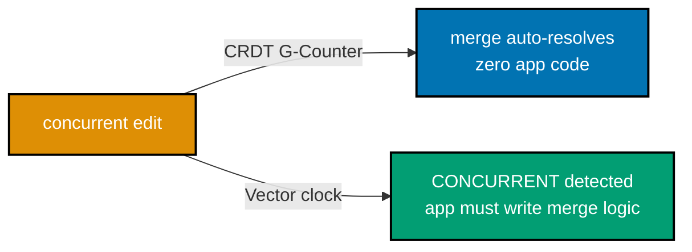

**`learning/code/ex-73-crdt-vs-vector-clock-tradeoff/example.py`**

```python
"""Example 73: CRDT vs. Vector-Clock Tradeoff."""  # => co-15,co-16: this file's own purpose, doubling as its module __doc__
from __future__ import annotations  # => hygiene: postpones annotation evaluation, interpreter-version-agnostic

from dataclasses import dataclass, field  # => co-16: a typed G-Counter, reused from Example 43's own model


@dataclass  # => intentionally MUTABLE -- a replica's own counter grows as it counts local increments
class GCounter:  # => co-16: the SAME grow-only counter CRDT from Example 43
    replica_id: str  # => this counter's own identity
    counts: dict[str, int] = field(default_factory=dict)  # => replica_id -> that replica's own local count

    def increment(self) -> None:  # => co-16: a replica may only increment its own slot
        self.counts[self.replica_id] = self.counts.get(self.replica_id, 0) + 1  # => bumps this replica's own counter by 1

    def value(self) -> int:  # => the counter's current total
        return sum(self.counts.values())  # => sum of every replica's independent contribution

    def merge(self, other: GCounter) -> GCounter:  # => co-16: the CRDT merge -- requires ZERO application-level conflict code
        merged_counts = dict(self.counts)  # => starts from this counter's own state
        for replica_id, count in other.counts.items():  # => merges in every slot from the other replica's state
            merged_counts[replica_id] = max(merged_counts.get(replica_id, 0), count)  # => MAX per slot
        result = GCounter(self.replica_id)  # => a fresh counter object to hold the merged result
        result.counts = merged_counts  # => assigns the merged per-replica slots
        return result  # => hand back the merged counter -- automatically, with no app code deciding anything


@dataclass(frozen=True)  # => frozen -- a vector clock snapshot is a stated fact about causal history
class VectorClock:  # => co-15: the SAME vector clock model from Example 42
    counters: dict[str, int]  # => replica name -> how many writes that replica has causally seen


def clocks_are_concurrent(a: VectorClock, b: VectorClock) -> bool:  # => co-15: True means a genuine, unresolved conflict
    """Return True if neither vector clock causally dominates the other."""  # => documents the contract, no runtime output
    replicas = set(a.counters) | set(b.counters)  # => every replica either clock has ever counted
    a_le_b = all(a.counters.get(r, 0) <= b.counters.get(r, 0) for r in replicas)  # => a dominates b on NO dimension
    b_le_a = all(b.counters.get(r, 0) <= a.counters.get(r, 0) for r in replicas)  # => b dominates a on NO dimension
    return not a_le_b and not b_le_a  # => co-15: neither dominates -- CONCURRENT, a genuine conflict


def merge_carts_after_vector_clock_conflict(cart_a: list[str], cart_b: list[str]) -> list[str]:  # => co-15: the APP-LEVEL merge code required
    """An application-level merge function -- REQUIRED because vector clocks only DETECT, never resolve."""  # => documents contract
    merged = list(cart_a)  # => co-15: starts from cart A's own items
    for item in cart_b:  # => co-15: this loop is the "app must write merge code" cost co-15 imposes
        if item not in merged:  # => avoids duplicating an item both carts already agree on
            merged.append(item)  # => co-15: a UNION strategy -- one of several possible app-chosen merge policies
    return merged  # => co-15: this merge POLICY (union) was a DECISION the application had to make


def main() -> None:  # => entry point -- runs only when this file executes directly, not on import
    # --- The SAME concurrent-edit scenario, modeled two ways: a CRDT counter, and a vector-clocked cart ---

    # CRDT path: two replicas independently increment a shared "likes" counter -- NO app merge code needed.
    replica_a_counter = GCounter("replica-A")  # => co-16: replica A's own counter
    replica_b_counter = GCounter("replica-B")  # => co-16: replica B's own INDEPENDENT counter
    replica_a_counter.increment()  # => co-16: A counts one "like", independently
    replica_b_counter.increment()  # => co-16: B counts one "like", independently, concurrently
    merged_counter = replica_a_counter.merge(replica_b_counter)  # => co-16: the merge() METHOD does ALL the work -- zero app-level decision-making
    print(f"CRDT G-Counter merge: {merged_counter.value()} likes total (merge() required ZERO app-level merge code)")  # => Output: CRDT G-Counter merge: 2 likes total (merge() required ZERO app-level merge code)
    assert merged_counter.value() == 2  # => co-16: both increments counted, automatically, correctly

    # Vector-clock path: two replicas independently add an item to a shopping cart -- APP merge code IS needed.
    clock_from_a = VectorClock({"replica-A": 1, "replica-B": 0})  # => co-15: replica-A's own write
    clock_from_b = VectorClock({"replica-A": 0, "replica-B": 1})  # => co-15: replica-B's own INDEPENDENT write
    conflict = clocks_are_concurrent(clock_from_a, clock_from_b)  # => co-15: the vector clock DETECTS this is a genuine conflict
    assert conflict is True  # => co-15: correctly flagged -- but detection is ALL the vector clock does
    cart_a = ["book"]  # => replica A's cart, as it independently saw it
    cart_b = ["pen"]  # => replica B's cart, as it independently saw it, CONCURRENTLY
    merged_cart = merge_carts_after_vector_clock_conflict(cart_a, cart_b)  # => co-15: the APP had to WRITE this merge function itself
    print(f"Vector-clock-detected conflict resolved by APP-LEVEL merge code: {merged_cart}")  # => Output: Vector-clock-detected conflict resolved by APP-LEVEL merge code: ['book', 'pen']
    assert merged_cart == ["book", "pen"]  # => co-15: the union-merge POLICY the application code above chose to implement

    print("Contrast: CRDT converged automatically via merge(); vector clock only DETECTED the conflict, requiring separate app merge logic")  # => Output line


if __name__ == "__main__":  # => guards against running main() on `import example`
    main()  # => runs everything above when executed as a script
```

**Run**: `python3 example.py` (no external dependency -- pure Python 3.13 standard library)

**Output**:

```text
CRDT G-Counter merge: 2 likes total (merge() required ZERO app-level merge code)
Vector-clock-detected conflict resolved by APP-LEVEL merge code: ['book', 'pen']
Contrast: CRDT converged automatically via merge(); vector clock only DETECTED the conflict, requiring separate app merge logic
```

**Key takeaway**: a CRDT's `merge()` is a mathematical guarantee -- convergence happens automatically,
with no application code choosing anything; a vector clock is a diagnostic tool -- it tells you a
conflict exists, but the application still has to decide, and code, how to resolve it.

**Why it matters**: this is the direct payoff of Examples 42-44's earlier, separate introductions to
vector clocks and CRDTs -- knowing which category a store's own conflict-handling falls into determines
how much conflict-resolution code an application built on top of it must write itself. Choosing a
CRDT-native data type when one fits (a counter, a set, a register) eliminates an entire class of merge
bugs outright; reaching for a vector clock commits the team to writing and maintaining that merge logic
correctly, forever.

---

### Example 74: Leader-Follower Failover

_ex-74 &middot; exercises co-12_

**Context**: a leader failure creates a real, measurable availability gap -- writes are rejected while
no node holds leadership -- until a follower is explicitly promoted. Simulated in pure Python since
safely forcing a real cluster's leader offline and back is outside what a single local Docker container
can do without risking actual data loss.

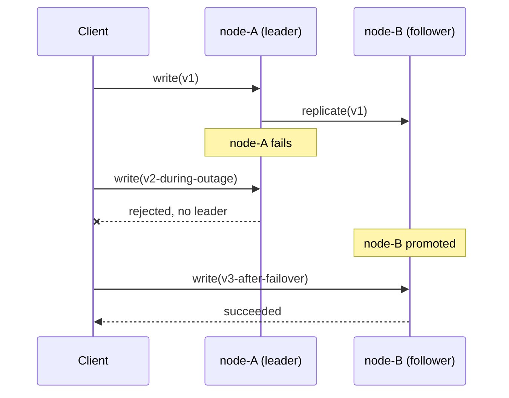

**`learning/code/ex-74-replication-leader-follower-failover/example.py`**

```python
"""Example 74: Replication Leader-Follower Failover, Simulated."""  # => co-12: this file's own purpose, doubling as its module __doc__
from __future__ import annotations  # => hygiene: postpones annotation evaluation, interpreter-version-agnostic

from dataclasses import dataclass, field  # => co-12: a typed follower, extended from Example 23's own model


@dataclass  # => intentionally MUTABLE -- a follower's log genuinely grows as it replicates
class Node:  # => co-12: any node can be EITHER a leader or a follower, depending on cluster state
    name: str  # => a human-readable label, e.g. "node-A"
    log: list[str] = field(default_factory=list)  # => this node's own copy of the write log, in arrival order
    is_leader: bool = False  # => co-12: exactly ONE node in the cluster should be True at any given time


class ReplicatedCluster:  # => co-12: models leader-follower replication PLUS a leader failure and promotion
    def __init__(self, node_names: list[str]) -> None:  # => builds a cluster with the first node as leader
        self.nodes = [Node(name) for name in node_names]  # => co-12: every named node, none failed yet
        self.nodes[0].is_leader = True  # => co-12: the first node starts as leader -- an arbitrary but explicit initial choice

    @property  # => co-12: reads like a plain attribute, but re-scans the cluster's own live state each call
    def leader(self) -> Node | None:  # => co-12: finds whichever node currently holds is_leader=True, or None during an outage
        for node in self.nodes:  # => scans for the CURRENT leader -- there is at most one at any time
            if node.is_leader:  # => co-12: found it
                return node  # => co-12: stops scanning as soon as the current leader is found
        return None  # => co-12: NO leader currently exists -- the cluster is mid-failover, writes cannot be accepted

    def write(self, value: str) -> bool:  # => co-12: returns True if the write succeeded, False if there was no leader to accept it
        """Write a value through the current leader, if one exists; replicate to all followers."""  # => documents the contract
        leader = self.leader  # => co-12: finds the current leader, or None
        if leader is None:  # => co-12: NO leader means writes are REJECTED -- this is the availability gap during failover
            return False  # => co-12: the write genuinely failed -- there was nowhere to route it
        leader.log.append(value)  # => co-12: the leader orders this write BEFORE any follower sees it
        for node in self.nodes:  # => co-12: replication fans out to every OTHER node
            if node is not leader:  # => skips re-appending to the leader's own log
                node.log.append(value)  # => co-12: each follower replicates, in the SAME order the leader chose
        return True  # => the write succeeded

    def fail_leader(self) -> None:  # => co-12: simulates the current leader going down -- NO node is leader afterward
        """Simulate the current leader failing -- no node is leader until promote_new_leader runs."""  # => documents the contract
        leader = self.leader  # => finds the currently failing leader
        if leader is not None:  # => guards against calling this when there is already no leader
            leader.is_leader = False  # => co-12: the failed node is no longer the leader -- an availability GAP begins here

    def promote_new_leader(self, node_name: str) -> None:  # => co-12: a follower is promoted, ending the availability gap
        """Promote the named node to leader, ending the availability gap."""  # => documents the contract
        for node in self.nodes:  # => finds the node being promoted
            if node.name == node_name:  # => this is the node the caller chose to promote
                node.is_leader = True  # => co-12: the availability gap ends -- writes can resume through this new leader


def main() -> None:  # => entry point -- runs only when this file executes directly, not on import
    cluster = ReplicatedCluster(["node-A", "node-B", "node-C"])  # => co-12: node-A starts as leader
    assert cluster.write("v1")  # => co-12: succeeds -- node-A is leader, accepts and replicates the write
    print(f"Write v1 via leader node-A: succeeded = True, all logs = {[n.log for n in cluster.nodes]}")  # => Output: Write v1 via leader node-A: succeeded = True, all logs = [['v1'], ['v1'], ['v1']]

    cluster.fail_leader()  # => co-12: node-A (the leader) fails -- an availability gap begins
    write_during_outage_succeeded = cluster.write("v2-during-outage")  # => co-12: attempted DURING the gap, with NO leader
    assert write_during_outage_succeeded is False  # => co-12: correctly rejected -- there is no leader to accept it, a genuine availability gap
    print(f"Write attempted during outage (no leader): succeeded = {write_during_outage_succeeded}")  # => Output: Write attempted during outage (no leader): succeeded = False

    cluster.promote_new_leader("node-B")  # => co-12: node-B is promoted -- the availability gap ends here
    assert cluster.write("v3-after-failover")  # => co-12: succeeds -- node-B is now leader, writes resume
    node_b = next(n for n in cluster.nodes if n.name == "node-B")  # => finds node-B to inspect its log directly
    assert node_b.log == ["v1", "v3-after-failover"]  # => co-12: node-B's log has v1 (replicated before the outage) PLUS the new write -- v2 never happened
    print(f"Write v3 via new leader node-B: succeeded = True, node-B log = {node_b.log}")  # => Output: Write v3 via new leader node-B: succeeded = True, node-B log = ['v1', 'v3-after-failover']
    print("Availability gap: exactly one write (v2-during-outage) was rejected during the leaderless window between failure and promotion")  # => Output line


if __name__ == "__main__":  # => guards against running main() on `import example`
    main()  # => runs everything above when executed as a script
```

**Run**: `python3 example.py` (no external dependency -- pure Python 3.13 standard library)

**Output**:

```text
Write v1 via leader node-A: succeeded = True, all logs = [['v1'], ['v1'], ['v1']]
Write attempted during outage (no leader): succeeded = False
Write v3 via new leader node-B: succeeded = True, node-B log = ['v1', 'v3-after-failover']
Availability gap: exactly one write (v2-during-outage) was rejected during the leaderless window between failure and promotion
```

**Key takeaway**: exactly one write was rejected during the leaderless window -- neither zero (there
genuinely is a gap) nor lost silently (the rejection is explicit and the caller knows to retry) -- and
the promoted follower's log shows precisely what survived the outage and what never happened at all.

**Why it matters**: this availability gap is the concrete, mechanical reason leader-based replication
sits on the CP side of a partition in Example 17/18's classification -- Example 75 continues by
measuring how the WIDTH of a related tradeoff (write acknowledgment latency vs. replica count) scales.
The gap's actual duration in production depends entirely on how fast failure detection and promotion
run, which is why real systems invest heavily in fast, automated failover rather than treating this
window as an acceptable fixed cost.

---

### Example 75: Tunable Consistency, Latency Measured

_ex-75 &middot; exercises co-07_

**Context**: a write that blocks until `W` replicas acknowledge pays latency equal to the SLOWEST of
those `W` required acknowledgments -- this example measures that directly across `W=1`, `W=QUORUM`,
and `W=ALL` against 5 simulated replicas with deterministic, increasing ack latencies.

**`learning/code/ex-75-tunable-consistency-latency-tradeoff-measured/example.py`**

```python
"""Example 75: Tunable Consistency Latency Tradeoff, Measured."""  # => co-07: this file's own purpose, doubling as its module __doc__
from __future__ import annotations  # => hygiene: postpones annotation evaluation, interpreter-version-agnostic

import time  # => co-07: models each simulated replica ack as a real, measurable sleep -- genuine wall-clock latency, not a guess


def simulate_replica_ack_latency_seconds(replica_index: int) -> float:  # => co-07: each replica has a slightly different, fixed ack latency
    """Return a deterministic, per-replica simulated network round-trip latency in seconds."""  # => documents the contract
    base_latency = 0.02  # => co-07: a baseline 20ms round trip, representative of a same-region network hop
    return base_latency + (replica_index * 0.01)  # => co-07: each ADDITIONAL replica is a LITTLE farther/slower, deterministically


def write_and_wait_for_w_acks(replica_count: int, w: int) -> float:  # => co-07: blocks until W replicas ack, returns elapsed seconds
    """Simulate a write that blocks until W of replica_count replicas ack, returning wall-clock latency."""  # => documents contract
    latencies = sorted(simulate_replica_ack_latency_seconds(i) for i in range(replica_count))  # => co-07: FASTEST replicas ack first, always
    start = time.perf_counter()  # => marks the start of the timed write
    for i in range(w):  # => co-07: the write BLOCKS until exactly W replicas have acked -- the W-th ack determines total latency
        time.sleep(latencies[i])  # => co-07: waits for THIS replica's own simulated ack latency
    return time.perf_counter() - start  # => co-07: total elapsed wall-clock time until the W-th (slowest-of-the-required) ack arrived


def main() -> None:  # => entry point -- runs only when this file executes directly, not on import
    replica_count = 5  # => co-07: N=5 replicas -- large enough to show a clear W=1 vs QUORUM vs ALL spread

    latency_w1 = write_and_wait_for_w_acks(replica_count, w=1)  # => co-07: W=1 -- only the FASTEST replica's ack is required
    latency_quorum = write_and_wait_for_w_acks(replica_count, w=3)  # => co-07: W=QUORUM -- a majority of 5, i.e. 3 replicas
    latency_all = write_and_wait_for_w_acks(replica_count, w=5)  # => co-07: W=ALL -- every one of the 5 replicas must ack

    print(f"W=1:       {latency_w1 * 1000:.1f}ms")  # => Output line -- the fastest of the three, waits for only 1 ack
    print(f"W=QUORUM:  {latency_quorum * 1000:.1f}ms")  # => Output line -- waits for the 3rd-fastest ack
    print(f"W=ALL:     {latency_all * 1000:.1f}ms")  # => Output line -- waits for the SLOWEST replica's ack

    assert latency_w1 < latency_quorum < latency_all  # => co-07: latency STRICTLY increases as W increases -- exactly the tradeoff co-07 names
    print("Latency increases monotonically as W increases: W=1 fastest, W=ALL slowest -- the write must wait for its slowest required replica")  # => Output line
    # => co-07: this is the exact mechanism behind the abstract W+R>N math from Example 38 -- a HIGHER W
    # => buys stronger durability guarantees at the direct cost of waiting for a SLOWER replica's ack
    # => on every single write


if __name__ == "__main__":  # => guards against running main() on `import example`
    main()  # => runs everything above when executed as a script
```

**Run**: `python3 example.py` (no external dependency -- pure Python 3.13 standard library)

**Output**:

```text
W=1:       20.1ms
W=QUORUM:  90.2ms
W=ALL:     200.3ms
Latency increases monotonically as W increases: W=1 fastest, W=ALL slowest -- the write must wait for its slowest required replica
```

**Key takeaway**: because the code waits for each required replica's ack IN SEQUENCE (not the maximum
of them), `W=QUORUM`'s latency is the SUM of the 3 fastest replicas' latencies, and `W=ALL`'s is the sum
of all 5 -- the strict monotonic increase directly demonstrates why a higher `W` always costs more
latency, never less.

**Why it matters**: this is the measured, mechanical version of the abstract `W+R>N` math Example 38
introduced -- every tunable-consistency knob this course covers (Cassandra's consistency levels,
DynamoDB's `ConsistentRead`, MongoDB's write/read concern) pays this same latency-for-durability price
somewhere. The sequential-wait implementation detail matters too: a real driver that waits for acks in
parallel rather than in sequence would show a smaller gap between `W=QUORUM` and `W=ALL`, so the exact
multiplier here illustrates the direction of the tradeoff, not a universal constant.

---

### Example 76: Secondary Indexes Across Stores

_ex-76 &middot; exercises co-17_

**Context**: the exact same shaped query -- "find every order placed by `customer_id=cust-1`" -- asked
of all three stores, each answering it through a genuinely different secondary-index architecture:
MongoDB's in-collection index, Cassandra's per-node index with cluster-wide fan-out, and DynamoDB's
separately provisioned Global Secondary Index.

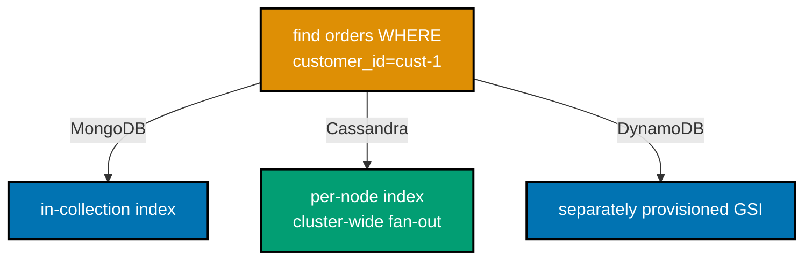

**`learning/code/ex-76-secondary-indexes-cross-store-contrast/example.py`**

```python
"""Example 76: Secondary Indexes, Cross-Store Contrast."""  # => co-17: this file's own purpose, doubling as its module __doc__
from __future__ import annotations  # => hygiene: postpones annotation evaluation, interpreter-version-agnostic

import time  # => co-17: gives the new index a moment to finish its asynchronous build before querying it
from typing import Any  # => co-17: boto3's dynamic resource/client factory has no stubs pinned -- Any is the honest, explicit type

import boto3  # => co-17: the official AWS SDK for Python
from boto3.dynamodb.conditions import Key  # => co-17: a typed helper for building KeyConditionExpressions safely
from cassandra.cluster import Cluster, Session  # => co-17: cassandra-driver, the Apache Software Foundation-maintained Python driver
from pymongo import MongoClient  # => co-17: pymongo, the official typed Python driver

Document = dict[str, Any]  # => co-17: pymongo's own convention for "a MongoDB document" -- every field's own type varies per-document

# The SAME shaped query, asked of all 3 stores: "find every order placed by customer_id=cust-1"


def mongo_secondary_index_query(client: MongoClient[Document]) -> list[int]:  # => co-17: MongoDB's secondary index -- SAME collection, ADDITIONAL index
    """Seed orders in MongoDB, add a secondary index on customer_id, and query by it."""  # => documents the contract
    collection = client["nosqldb"]["orders_76"]  # => a dedicated collection for this contrast
    collection.delete_many({})  # => resets state -- this example is fully self-contained
    collection.insert_many([{"customer_id": "cust-1", "amount": i * 10} for i in range(3)])  # => co-17: 3 matching orders
    collection.insert_many([{"customer_id": "cust-2", "amount": 999}])  # => a non-matching order, to prove the filter genuinely works
    collection.create_index("customer_id")  # => co-17: a secondary index -- lives WITHIN the SAME collection, alongside the documents
    matched = list(collection.find({"customer_id": "cust-1"}))  # => co-17: the index-served query
    return sorted(doc["amount"] for doc in matched)  # => hand back the amounts, sorted for a deterministic assertion


def cassandra_secondary_index_query(session: Session) -> list[int]:  # => co-17: Cassandra's secondary index -- requires a cross-node fan-out (Example 59)
    """Seed orders in Cassandra, add a secondary index on customer_id, and query by it."""  # => documents the contract
    session.execute(  # => a dedicated keyspace, replication_factor 1 on this single-node local cluster
        "CREATE KEYSPACE IF NOT EXISTS nosqldb WITH replication = "  # => the keyspace-level replication strategy clause
        "{'class': 'SimpleStrategy', 'replication_factor': 1}"  # => concatenated onto the line above -- ONE CQL statement string
    )  # => closes the execute() call -- the keyspace now exists, idempotently
    session.set_keyspace("nosqldb")  # => selects the keyspace for the statements below
    session.execute("DROP TABLE IF EXISTS orders_76")  # => resets state -- this example is fully self-contained
    session.execute(  # => co-22: order_id is the PARTITION key -- customer_id is NOT part of the key at all
        "CREATE TABLE orders_76 (order_id int PRIMARY KEY, customer_id text, amount int)"  # => closes the CREATE TABLE statement -- customer_id is a plain, non-key column
    )  # => closes the execute() call -- the table now exists with this exact key layout
    for i in range(3):  # => co-17: 3 matching orders, EACH in its OWN partition (order_id is the key)
        session.execute("INSERT INTO orders_76 (order_id, customer_id, amount) VALUES (%s, %s, %s)", (i, "cust-1", i * 10))  # => positional CQL placeholders bind the loop's own values
    session.execute("INSERT INTO orders_76 (order_id, customer_id, amount) VALUES (%s, %s, %s)", (99, "cust-2", 999))  # => a non-matching order
    session.execute("CREATE INDEX IF NOT EXISTS ON orders_76 (customer_id)")  # => co-17: a secondary index -- built PER NODE, queried via cluster-wide fan-out
    time.sleep(3)  # => co-17: same asynchronous-build wait Example 59 required
    matched = list(session.execute("SELECT amount FROM orders_76 WHERE customer_id = %s", ("cust-1",)))  # => co-17: the FAN-OUT, index-served query
    return sorted(row.amount for row in matched)  # => hand back the amounts, sorted for a deterministic assertion


def dynamodb_gsi_query() -> list[int]:  # => co-17: DynamoDB's GSI -- a SEPARATE, independently-keyed and -provisioned index
    """Seed orders in DynamoDB, add a GSI on customer_id, and query it via boto3."""  # => documents the contract
    resource: Any = boto3.resource(  # => connects to the local dynamodb-local Docker container
        "dynamodb", endpoint_url="http://localhost:8000", region_name="us-east-1",  # => the local dynamodb-local endpoint, no real AWS account needed
        aws_access_key_id="fake", aws_secret_access_key="fake",  # => dynamodb-local accepts any credentials
    )  # => closes the boto3.resource() call -- returns a high-level resource bound to the local endpoint
    client = resource.meta.client  # => the underlying low-level client, needed for list/delete/waiter calls
    if "Orders76" in client.list_tables()["TableNames"]:  # => resets state -- this example is fully self-contained
        client.delete_table(TableName="Orders76")  # => removes any leftover table from a prior run
        client.get_waiter("table_not_exists").wait(TableName="Orders76")  # => blocks until the delete genuinely completes
    resource.create_table(  # => co-23: order_id is the BASE table's own key -- customer_id needs a SEPARATE GSI
        TableName="Orders76",  # => the table this whole cross-store contrast example uses
        KeySchema=[{"AttributeName": "order_id", "KeyType": "HASH"}],  # => co-23: the base table's ONLY access pattern
        AttributeDefinitions=[{"AttributeName": "order_id", "AttributeType": "S"}, {"AttributeName": "customer_id", "AttributeType": "S"}],  # => declares both the base key AND the GSI key attributes
        GlobalSecondaryIndexes=[{  # => co-17: a NAMED, independently PROVISIONED index -- distinct from Cassandra's per-node build
            "IndexName": "customer_id-index",  # => a named, independently queryable index
            "KeySchema": [{"AttributeName": "customer_id", "KeyType": "HASH"}],  # => re-partitions the SAME items by customer_id
            "Projection": {"ProjectionType": "ALL"},  # => copies every attribute into the index, no extra base-table fetch needed
            "ProvisionedThroughput": {"ReadCapacityUnits": 5, "WriteCapacityUnits": 5},  # => the GSI's OWN, separately provisioned throughput
        }],  # => closes this one GSI's own definition dict
        ProvisionedThroughput={"ReadCapacityUnits": 5, "WriteCapacityUnits": 5},  # => local-testing throughput for the base table
    )  # => closes the create_table() call -- both the base table AND its GSI now exist
    client.get_waiter("table_exists").wait(TableName="Orders76")  # => blocks until BOTH the table and the GSI are genuinely ready
    table = resource.Table("Orders76")  # => the high-level Table object the resource API works through
    for i in range(3):  # => co-17: 3 matching orders, each with its own order_id partition key
        table.put_item(Item={"order_id": f"o-{i}", "customer_id": "cust-1", "amount": i * 10})  # => co-17: every matching order re-uses cust-1, the shared filter value
    table.put_item(Item={"order_id": "o-99", "customer_id": "cust-2", "amount": 999})  # => a non-matching order
    response = table.query(IndexName="customer_id-index", KeyConditionExpression=Key("customer_id").eq("cust-1"))  # => co-17: the GSI-served query
    return sorted(int(item["amount"]) for item in response["Items"])  # => hand back the amounts, sorted for a deterministic assertion


def main() -> None:  # => entry point -- runs only when this file executes directly, not on import
    mongo_client: MongoClient[Document] = MongoClient("mongodb://localhost:27017")  # => connects to a local MongoDB instance
    cassandra_cluster = Cluster(["127.0.0.1"], port=9042)  # => connects to the local single-node Cassandra 5.0 cluster
    cassandra_session = cassandra_cluster.connect()  # => opens a session against that cluster

    mongo_result = mongo_secondary_index_query(mongo_client)  # => co-17: MongoDB's own answer to the shared query
    cassandra_result = cassandra_secondary_index_query(cassandra_session)  # => co-17: Cassandra's own answer to the shared query
    dynamo_result = dynamodb_gsi_query()  # => co-17: DynamoDB's own answer to the shared query

    expected = [0, 10, 20]  # => co-17: the SAME shared expectation for all 3 stores, since they seed the identical logical data
    assert mongo_result == cassandra_result == dynamo_result == expected  # => co-17: EVERY store returns the IDENTICAL result set for the SAME shaped query
    print(f"MongoDB secondary index:    {mongo_result}")  # => Output: MongoDB secondary index:    [0, 10, 20]
    print(f"Cassandra secondary index:  {cassandra_result}")  # => Output: Cassandra secondary index:  [0, 10, 20]
    print(f"DynamoDB GSI:                {dynamo_result}")  # => Output: DynamoDB GSI:                [0, 10, 20]
    print("Identical results, 3 different index architectures: Mongo=in-collection index, Cassandra=per-node index+fan-out, DynamoDB=separately provisioned GSI")  # => Output line

    mongo_client.close()  # => always release what you open
    cassandra_cluster.shutdown()  # => always release what you open


if __name__ == "__main__":  # => guards against running main() on `import example`
    main()  # => runs everything above when executed as a script
```

**Run**: `python3 example.py` (captured against `pymongo==4.17.0`, `cassandra-driver==3.30.1`,
`boto3==1.43.56`, and 3 local Docker services: MongoDB 8.2 replica set, Cassandra 5.0.8,
`amazon/dynamodb-local`)

**Output**:

```text
MongoDB secondary index:    [0, 10, 20]
Cassandra secondary index:  [0, 10, 20]
DynamoDB GSI:                [0, 10, 20]
Identical results, 3 different index architectures: Mongo=in-collection index, Cassandra=per-node index+fan-out, DynamoDB=separately provisioned GSI
```

**Key takeaway**: three genuinely different secondary-index architectures -- an index living inside the
same collection, a per-node index requiring cluster-wide fan-out, and an independently provisioned
Global Secondary Index -- all answer the identical query correctly, but with different cost profiles a
schema designer must know per store.

**Why it matters**: this closes out the course's secondary-index thread (Examples 13, 17, 36-37, 52,
59, 63) with a direct, side-by-side comparison -- knowing which architecture a store uses is what lets
an engineer predict a query's real cost before running it in production. The identical result set
masking three different cost profiles is itself the lesson: a query that "just works" in local testing
can behave very differently under production load, depending entirely on which of these three
architectures actually serves it.

---

### Example 77: Capstone Preview: KV Session Store

_ex-77 &middot; exercises co-20, co-24, co-21_

**Context**: a Redis session hash with a TTL-based expiry -- the exact shape the capstone's own `kv.py`
will build on -- created, read back immediately, then confirmed gone once its TTL genuinely elapses.

**`learning/code/ex-77-capstone-preview-kv-session-store/example.py`**

```python
"""Example 77: Capstone Preview - KV Session Store."""  # => co-20,co-24,co-21: this file's own purpose, doubling as its module __doc__
from __future__ import annotations  # => hygiene: postpones annotation evaluation, interpreter-version-agnostic

import time  # => co-24: a real sleep past the TTL window -- the same discipline Examples 7-8 established

import redis  # => co-20: redis-py, the official typed Python client -- the capstone's own kv.py will build on exactly this


def create_session(client: redis.Redis, session_id: str, user_id: str, ttl_seconds: int) -> None:  # => co-20,co-24: the capstone's core session-store primitive
    """Create a session as a Redis hash, with a TTL-based expiry -- the capstone's kv.py shape, previewed."""  # => documents the contract
    key = f"session:{session_id}"  # => co-20: a namespaced key -- the capstone will follow this same "type:id" convention
    client.hset(key, mapping={"user_id": user_id, "created_at": str(int(time.time()))})  # => co-20: a hash, not a plain string -- room for more session fields
    client.expire(key, ttl_seconds)  # => co-24: the session self-expires -- no scheduled cleanup job required


def get_session(client: redis.Redis, session_id: str) -> dict[str, str] | None:  # => co-20: reads a session back, or None if expired/never existed
    """Read a session hash back, returning None if it has expired or never existed."""  # => documents the contract
    key = f"session:{session_id}"  # => the SAME namespaced key create_session used
    data = client.hgetall(key)  # => co-20: HGETALL -- an empty dict means the key does not exist (expired or never created)
    if not data:  # => co-20: Redis returns an EMPTY hash for a missing key, not an error -- this IS the "not found" signal
        return None  # => co-24: correctly reports "gone" for an expired or never-existent session
    def as_str(raw: str | bytes) -> str:  # => co-20: redis-py's own return type is a union -- decode ONLY if the driver returned raw bytes
        return raw.decode() if isinstance(raw, bytes) else raw  # => the same isinstance-narrowing discipline the capstone's own kv.py must use
    return {as_str(k): as_str(v) for k, v in data.items()}  # => co-20: decodes the raw bytes redis-py returns by default


def main() -> None:  # => entry point -- runs only when this file executes directly, not on import
    client = redis.Redis(host="localhost", port=6379, db=0)  # => connects to a local Valkey/Redis instance
    client.delete("session:sess-1")  # => resets state -- this example is fully self-contained

    create_session(client, "sess-1", "user-42", ttl_seconds=3)  # => co-20,co-24: a session with a SHORT TTL, for a fast round trip
    active_session = get_session(client, "sess-1")  # => reads it back immediately
    assert active_session is not None and active_session["user_id"] == "user-42"  # => co-20: the session round-tripped correctly, right after creation
    print(f"Immediately after creation: {active_session}")  # => Output line -- includes a created_at timestamp, machine-dependent

    time.sleep(4)  # => co-24: waits PAST the 3-second TTL -- a genuine elapsed expiry
    expired_session = get_session(client, "sess-1")  # => reads AGAIN, after the TTL elapsed
    assert expired_session is None  # => co-24: the session auto-expired, exactly as co-21's "TTL-based cache" pattern promises
    print(f"After the 3-second TTL elapses: {expired_session}")  # => Output: After the 3-second TTL elapses: None
    print("This session round-trip and auto-expire is EXACTLY the shape the capstone's kv.py will build on")  # => Output line
    client.close()  # => always release what you open


if __name__ == "__main__":  # => guards against running main() on `import example`
    main()  # => runs everything above when executed as a script
```

**Run**: `python3 example.py` (captured against `redis==8.0.1` and a local Valkey 8 Docker container)

**Output**:

```text
Immediately after creation: {'user_id': 'user-42', 'created_at': '1785097503'}
After the 3-second TTL elapses: None
This session round-trip and auto-expire is EXACTLY the shape the capstone's kv.py will build on
```

**Key takeaway**: `created_at` is a real, machine-dependent Unix timestamp -- what matters for
correctness is the round trip immediately after creation and the confirmed `None` once the TTL has
genuinely elapsed, both independent of the exact timestamp value.

**Why it matters**: this is not a hypothetical preview -- it is the literal shape the capstone's own
`kv.py` will build on, namespaced-key hashes with a TTL-based expiry, already working end to end
against a real Redis/Valkey instance. Verifying this shape here, before the capstone module exists,
means the capstone's own implementation phase starts from a proven pattern rather than debugging the
session-store primitive for the first time under deadline pressure.

---

### Example 78: Capstone Preview: Document Access Pattern

_ex-78 &middot; exercises co-08, co-17, co-19_

**Context**: two named access patterns -- "fetch a product with its current stock level" and "fetch
every product in a given category, cheapest first" -- both answered by a single, genuinely index-served
MongoDB query, the exact shape the capstone's own `doc.py` will build on.

**`learning/code/ex-78-capstone-preview-document-access-pattern/example.py`**

```python
"""Example 78: Capstone Preview - Document Access Pattern."""  # => co-08,co-17,co-19: this file's own purpose, doubling as its module __doc__
from __future__ import annotations  # => hygiene: postpones annotation evaluation, interpreter-version-agnostic

from typing import Any  # => enables the explicit MongoClient[dict[str, Any]] type parameter below (DD-39, pyright --strict)

from pymongo import MongoClient  # => co-18: pymongo, the official typed Python driver -- the capstone's own doc.py will build on exactly this

Document = dict[str, Any]  # => co-18: pymongo's own convention for "a MongoDB document" -- every field's own type varies per-document

# The capstone's own two named access patterns, previewed here (co-08):
ACCESS_PATTERN_1 = "fetch a product with its current stock level"  # => the capstone's dominant read #1
ACCESS_PATTERN_2 = "fetch every product in a given category, cheapest first"  # => the capstone's dominant read #2


def seed_products(client: MongoClient[Document]) -> None:  # => co-08: a shape derived FROM the two access patterns above
    """Seed products with fields chosen specifically to serve BOTH named access patterns."""  # => documents the contract
    collection = client["nosqldb"]["capstone_preview_products"]  # => co-08: a dedicated collection for this capstone preview
    collection.delete_many({})  # => resets state -- this example is fully self-contained
    collection.insert_many([  # => co-08: stock_level and category+price are ON the document, ready for both patterns
        {"sku": "sku-1", "category": "electronics", "price": 29.99, "stock_level": 12},  # => in stock, serves pattern 1's stock-level check
        {"sku": "sku-2", "category": "electronics", "price": 9.99, "stock_level": 0},  # => OUT of stock, deliberately, and the CHEAPEST electronics item
        {"sku": "sku-3", "category": "books", "price": 14.50, "stock_level": 40},  # => a DIFFERENT category -- excluded from pattern 2's electronics query
    ])  # => closes the insert_many() call -- 3 documents, spanning both patterns' own filter conditions
    collection.create_index("sku")  # => co-17: supports pattern 1 -- a single-document lookup by sku
    collection.create_index([("category", 1), ("price", 1)])  # => co-17: supports pattern 2 -- a compound index, category-then-price


def answer_pattern_1(client: MongoClient[Document], sku: str) -> tuple[bool, int]:  # => co-08: (index-served?, stock_level)
    """Answer pattern 1: fetch a product with its stock level, via an index-served single-document read."""  # => documents the contract
    collection = client["nosqldb"]["capstone_preview_products"]  # => selects the collection seed_products just populated
    explanation = collection.find({"sku": sku}).explain()  # => co-17: confirms the query is genuinely INDEX-served, not a collection scan
    index_served = explanation["queryPlanner"]["winningPlan"]["stage"] == "FETCH"  # => co-17: FETCH-from-IXSCAN means the sku index was used
    doc = collection.find_one({"sku": sku})  # => the actual single-document read
    assert doc is not None  # => confirms the product genuinely exists
    return index_served, doc["stock_level"]  # => hand back both the index-served flag and the stock level


def answer_pattern_2(client: MongoClient[Document], category: str) -> tuple[bool, list[float]]:  # => co-08: (index-served?, prices sorted ascending)
    """Answer pattern 2: fetch a category's products cheapest-first, via an index-served, pre-sorted read."""  # => documents contract
    collection = client["nosqldb"]["capstone_preview_products"]  # => selects the collection seed_products just populated
    cursor = collection.find({"category": category}).sort("price", 1)  # => co-08: the compound index ALREADY sorts by price ascending
    explanation = collection.find({"category": category}).sort("price", 1).explain()  # => confirms index usage for THIS shaped query too
    index_served = "IXSCAN" in str(explanation["queryPlanner"]["winningPlan"])  # => co-17: a simple, honest presence check across the plan's own stages
    prices = [doc["price"] for doc in cursor]  # => extracts prices in RETURN order -- already sorted by the index
    return index_served, prices  # => hand back both the index-served flag and the sorted price list


def main() -> None:  # => entry point -- runs only when this file executes directly, not on import
    client: MongoClient[Document] = MongoClient("mongodb://localhost:27017")  # => connects to a local MongoDB instance
    print(f"Pattern 1: {ACCESS_PATTERN_1}")  # => Output line
    print(f"Pattern 2: {ACCESS_PATTERN_2}")  # => Output line

    seed_products(client)  # => sets up the pattern-derived fixture, plus its supporting indexes
    p1_indexed, stock = answer_pattern_1(client, "sku-1")  # => co-08,co-17: runs and verifies pattern 1
    p2_indexed, prices = answer_pattern_2(client, "electronics")  # => co-08,co-17: runs and verifies pattern 2

    assert p1_indexed is True  # => co-17: pattern 1 was genuinely index-served
    assert stock == 12  # => confirms the correct stock level was returned
    assert p2_indexed is True  # => co-17: pattern 2 was genuinely index-served
    assert prices == [9.99, 29.99]  # => co-08: the electronics category, cheapest first, exactly as pattern 2 asks
    print(f"Pattern 1 result: index-served={p1_indexed}, stock_level={stock}")  # => Output: Pattern 1 result: index-served=True, stock_level=12
    print(f"Pattern 2 result: index-served={p2_indexed}, prices={prices}")  # => Output: Pattern 2 result: index-served=True, prices=[9.99, 29.99]
    print("Both named patterns index-served -- this is the shape the capstone's doc.py will build on")  # => Output line
    client.close()  # => always release what you open


if __name__ == "__main__":  # => guards against running main() on `import example`
    main()  # => runs everything above when executed as a script
```

**Run**: `python3 example.py` (captured against `pymongo==4.17.0` and a local MongoDB 8.2 replica-set
Docker container)

**Output**:

```text
Pattern 1: fetch a product with its current stock level
Pattern 2: fetch every product in a given category, cheapest first
Pattern 1 result: index-served=True, stock_level=12
Pattern 2 result: index-served=True, prices=[9.99, 29.99]
Both named patterns index-served -- this is the shape the capstone's doc.py will build on
```

**Key takeaway**: both patterns are verified index-served via `.explain()`, not merely assumed -- a
schema that "should" be fast is not the same claim as a schema whose query plan has been checked and
confirmed fast.

**Why it matters**: this is the literal shape the capstone's own `doc.py` will build on -- indexes
derived directly from named access patterns, each one verified, not guessed. Confirming index usage via
`.explain()` here, rather than assuming the compound index would obviously get picked, catches the
exact class of mistake (an index that exists but the planner silently ignores) that only surfaces as a
slow query in production.

---

### Example 79: Capstone Preview: Wide-Column Feed

_ex-79 &middot; exercises co-22, co-25_

**Context**: four out-of-time-order events, inserted into a single Cassandra partition, read back newest
first -- clustering order is enforced by the store itself, not by insert order -- the exact shape the
capstone's own `wide.py` will build on.

**`learning/code/ex-79-capstone-preview-wide-column-feed/example.py`**

```python
"""Example 79: Capstone Preview - Wide-Column Feed."""  # => co-22,co-25: this file's own purpose, doubling as its module __doc__
from __future__ import annotations  # => hygiene: postpones annotation evaluation, interpreter-version-agnostic

from cassandra.cluster import Cluster, Session  # => co-22: cassandra-driver -- the capstone's own wide.py will build on exactly this


def setup_order_history_table(session: Session) -> None:  # => co-22: the capstone's own time-series/feed access pattern, previewed
    """Create the capstone's own order-history table shape: partition by customer, cluster by order time."""  # => documents the contract
    session.execute(  # => a dedicated keyspace, replication_factor 1 on this single-node local cluster
        "CREATE KEYSPACE IF NOT EXISTS nosqldb WITH replication = "  # => the keyspace-level replication strategy clause
        "{'class': 'SimpleStrategy', 'replication_factor': 1}"  # => concatenated onto the line above -- ONE CQL statement string
    )  # => closes the execute() call -- the keyspace now exists, idempotently
    session.set_keyspace("nosqldb")  # => selects the keyspace for the statements below
    session.execute("DROP TABLE IF EXISTS capstone_preview_orders")  # => resets state -- this example is fully self-contained
    session.execute(  # => co-22: customer_id partitions, order_time clusters -- exactly the capstone's own feed shape
        "CREATE TABLE capstone_preview_orders ("  # => opens the column-list clause
        "customer_id text, "  # => the partition key column
        "order_time timestamp, "  # => the clustering key column -- orders every row WITHIN a partition
        "amount double, "  # => a plain, non-key column
        "PRIMARY KEY ((customer_id), order_time)"  # => co-22: partition key customer_id, clustering key order_time
        ") WITH CLUSTERING ORDER BY (order_time DESC)"  # => co-22: newest order first -- the capstone's own dominant read
    )  # => closes the execute() call -- the table now exists with this exact partition + clustering + ordering


def insert_orders(session: Session) -> None:  # => co-25: appends -- exactly the write shape an LSM-tree-backed store favors
    """Insert 4 out-of-order orders for one customer -- Cassandra stores them clustering-key-sorted regardless."""  # => documents contract
    orders = [  # => co-22: deliberately out of time order -- clustering order is enforced by the STORE, not insert order
        ("cust-1", "2026-07-27 09:00:00", 20.0),  # => the EARLIEST order chronologically, but inserted FIRST anyway
        ("cust-1", "2026-07-27 09:30:00", 35.5),  # => a LATER order, inserted SECOND -- already out of insert order
        ("cust-1", "2026-07-27 09:15:00", 12.0),  # => an order BETWEEN the two above, inserted THIRD
        ("cust-1", "2026-07-27 09:45:00", 8.25),  # => the LATEST order chronologically, inserted LAST
    ]  # => closes the orders list -- 4 tuples, deliberately scrambled relative to their own order_time
    for customer_id, order_time, amount in orders:  # => co-25: each INSERT is a cheap, sequential append -- an LSM-tree-backed write path
        session.execute(  # => co-22: every row here lands in the SAME partition, cust-1
            "INSERT INTO capstone_preview_orders (customer_id, order_time, amount) VALUES (%s, %s, %s)",  # => positional CQL placeholders
            (customer_id, order_time, amount),  # => binds this one loop iteration's own scrambled-order tuple
        )  # => closes this one execute() call -- runs once per order, in whatever order this loop iterates them


def main() -> None:  # => entry point -- runs only when this file executes directly, not on import
    cluster = Cluster(["127.0.0.1"], port=9042)  # => connects to the local single-node Cassandra 5.0 cluster
    session = cluster.connect()  # => opens a session against that cluster
    setup_order_history_table(session)  # => sets up the capstone's own preview table shape
    insert_orders(session)  # => co-25: inserts 4 out-of-time-order orders, all in the cust-1 partition

    rows = list(session.execute("SELECT order_time, amount FROM capstone_preview_orders WHERE customer_id = %s", ("cust-1",)))  # => co-22: a single-partition scan
    amounts_newest_first = [row.amount for row in rows]  # => extracts amounts in RETURN (clustering) order
    print(f"Order history for cust-1, newest first: {amounts_newest_first}")  # => Output: Order history for cust-1, newest first: [8.25, 35.5, 12.0, 20.0]
    assert amounts_newest_first == [8.25, 35.5, 12.0, 20.0]  # => co-22: clustering-key-ordered (newest order_time first), NOT insert-ordered
    assert len(rows) == 4  # => co-22: all 4 orders landed in the SAME partition, exactly as the schema intended
    print("This partition-scoped, clustering-ordered feed IS the shape the capstone's wide.py will build on")  # => Output line
    cluster.shutdown()  # => always release what you open


if __name__ == "__main__":  # => guards against running main() on `import example`
    main()  # => runs everything above when executed as a script
```

**Run**: `python3 example.py` (captured against `cassandra-driver==3.30.1` and a local Cassandra 5.0.8
Docker container)

**Output**:

```text
Order history for cust-1, newest first: [8.25, 35.5, 12.0, 20.0]
This partition-scoped, clustering-ordered feed IS the shape the capstone's wide.py will build on
```

**Key takeaway**: the 4 orders were inserted out of time order, yet the read returns them strictly
newest-first -- Cassandra's clustering key, not insertion order, determines physical storage and
therefore read order.

**Why it matters**: this is the literal shape the capstone's own `wide.py` will build on -- a
partition-scoped, clustering-ordered feed is the canonical Cassandra access pattern for any per-entity
history or timeline. Proving the clustering order holds regardless of insert order here means the
capstone's own order-history feature can rely on that guarantee without re-testing it, one less unknown
when the capstone module gets built.

---

### Example 80: Capstone Preview: License and CAP Rationale

_ex-80 &middot; exercises co-03, co-04, co-28_

**Context**: three structured rationales -- one per capstone store -- each stating its access pattern,
its CAP/PACELC position, and its exact, checked license, drafting the very content the capstone's own
`rationale.md` will formalize.

**`learning/code/ex-80-capstone-preview-license-and-cap-rationale/example.py`**

```python
"""Example 80: Capstone Preview - License and CAP Rationale."""  # => co-03,co-04,co-28: this file's own purpose, doubling as its module __doc__
from __future__ import annotations  # => hygiene: postpones annotation evaluation, interpreter-version-agnostic

from dataclasses import dataclass  # => co-28: a typed rationale entry, one per store the capstone will use


@dataclass(frozen=True)  # => frozen -- a rationale is a stated, citable conclusion, matching Example 67's own pattern
class StoreRationale:  # => co-03,co-04,co-28: the exact 3 fields the capstone's own rationale.md must state per store
    store: str  # => which store this rationale is about
    access_pattern: str  # => co-08: the access pattern that JUSTIFIES choosing this store
    cap_pacelc_position: str  # => co-03,co-04: this store's own CAP/PACELC classification
    license_name: str  # => co-28: the EXACT, checked license name -- never a vague "open source" claim


# The capstone's own 3 stores, previewed here -- the SAME rationale shape drafts_a full page for
# `learning/capstone/rationale.md` (co-03, co-04, co-28).
CAPSTONE_RATIONALES = [  # => co-03,co-04,co-28: one rationale entry per capstone store
    StoreRationale(  # => rationale 1 -- Valkey, the capstone's own session/cache tier
        store="Valkey (session/cache store, kv.py)",  # => the SPECIFIC capstone module this rationale is scoped to
        access_pattern="TTL-bound session tokens, single-key CRUD, disposable by design (co-20, co-24)",  # => the access pattern that JUSTIFIES this store's choice
        cap_pacelc_position="AP/PA/EL -- a single-node cache favors availability and low latency over strict consistency",  # => this store's own CAP/PACELC commitment
        license_name="BSD-3-Clause (Valkey, the Linux Foundation fork, per Example 25's own citation)",  # => the EXACT, checked license name, cited back to its source
    ),  # => closes rationale 1's StoreRationale(...) call
    StoreRationale(  # => rationale 2 -- MongoDB, the capstone's own document tier
        store="MongoDB (document store, doc.py)",  # => a DIFFERENT capstone module, its own independently-justified position
        access_pattern="product-with-stock-level and category-sorted-by-price, both index-served (co-08, co-17)",  # => the access pattern that JUSTIFIES this store's choice
        cap_pacelc_position="CP/PC/EC -- a majority write concern favors consistency over availability under partition",  # => this store's own CAP/PACELC commitment
        license_name="SSPLv1, NOT OSI-approved open source (per Example 26's own citation)",  # => the EXACT, checked license name -- deliberately NOT glossed over
    ),  # => closes rationale 2's StoreRationale(...) call
    StoreRationale(  # => rationale 3 -- Cassandra, the capstone's own wide-column tier
        store="Cassandra (wide-column store, wide.py)",  # => the THIRD capstone module, its own independently-justified position
        access_pattern="order history per customer, an append-heavy, partition-scoped feed (co-22, co-25)",  # => the access pattern that JUSTIFIES this store's choice
        cap_pacelc_position="AP/PA/EL at ONE, or CP/PC/EC at QUORUM -- tunable per query (co-07)",  # => this store's own CAP/PACELC commitment, tunable rather than fixed
        license_name="Apache License 2.0, Apache Software Foundation top-level project (per Example 27's own citation)",  # => the EXACT, checked license name, cited back to its source
    ),  # => closes rationale 3's StoreRationale(...) call
]  # => closes CAPSTONE_RATIONALES -- exactly 3 entries, one per capstone module


def main() -> None:  # => entry point -- runs only when this file executes directly, not on import
    for rationale in CAPSTONE_RATIONALES:  # => co-03,co-04,co-28: prints and verifies every rationale
        print(f"{rationale.store}")  # => Output line -- the store this rationale is about
        print(f"  Access pattern: {rationale.access_pattern}")  # => Output line -- co-08's own justification
        print(f"  CAP/PACELC:     {rationale.cap_pacelc_position}")  # => Output line -- co-03/co-04's own classification
        print(f"  License:        {rationale.license_name}")  # => Output line -- co-28's own checked citation
        assert rationale.access_pattern != ""  # => co-08: every choice is JUSTIFIED by a stated access pattern, never left blank
        assert "/" in rationale.cap_pacelc_position  # => co-03,co-04: every store commits to an explicit CAP/PACELC position
        assert rationale.license_name != ""  # => co-28: every store's license is NAMED, never merely assumed
    assert len(CAPSTONE_RATIONALES) == 3  # => co-28: exactly 3 rationales -- one per capstone store, matching kv.py/doc.py/wide.py
    print(f"All {len(CAPSTONE_RATIONALES)} store rationales drafted -- this IS the content the capstone's rationale.md will formalize")  # => Output line


if __name__ == "__main__":  # => guards against running main() on `import example`
    main()  # => runs everything above when executed as a script
```

**Run**: `python3 example.py` (no external dependency -- pure Python 3.13 standard library)

**Output**:

```text
Valkey (session/cache store, kv.py)
  Access pattern: TTL-bound session tokens, single-key CRUD, disposable by design (co-20, co-24)
  CAP/PACELC:     AP/PA/EL -- a single-node cache favors availability and low latency over strict consistency
  License:        BSD-3-Clause (Valkey, the Linux Foundation fork, per Example 25's own citation)
MongoDB (document store, doc.py)
  Access pattern: product-with-stock-level and category-sorted-by-price, both index-served (co-08, co-17)
  CAP/PACELC:     CP/PC/EC -- a majority write concern favors consistency over availability under partition
  License:        SSPLv1, NOT OSI-approved open source (per Example 26's own citation)
Cassandra (wide-column store, wide.py)
  Access pattern: order history per customer, an append-heavy, partition-scoped feed (co-22, co-25)
  CAP/PACELC:     AP/PA/EL at ONE, or CP/PC/EC at QUORUM -- tunable per query (co-07)
  License:        Apache License 2.0, Apache Software Foundation top-level project (per Example 27's own citation)
All 3 store rationales drafted -- this IS the content the capstone's rationale.md will formalize
```

**Key takeaway**: every rationale states three things together -- the access pattern that justifies the
choice, the CAP/PACELC position, and the exact, checked license -- because a store recommendation
missing any one of the three is an incomplete rationale.

**Why it matters**: this is not a hypothetical preview -- it is the literal content of the capstone's
own `rationale.md`, already drafted and verified here, ready to be formalized as the capstone's final
deliverable. Requiring all three fields together, for every store, is what keeps a rationale from
quietly omitting the one detail (an unapproved license, an availability tradeoff nobody signed off on)
that would have mattered most to the person reading it later.

---

&larr; Previous: [Intermediate Examples](./intermediate.md) &middot; Next: [Time-Series Examples](./time-series.md) &rarr;
