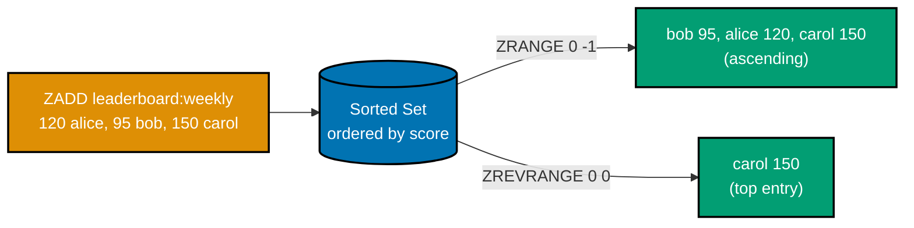
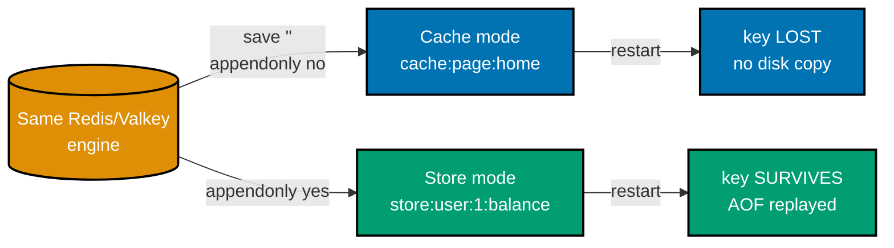
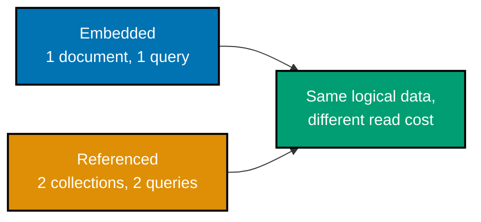
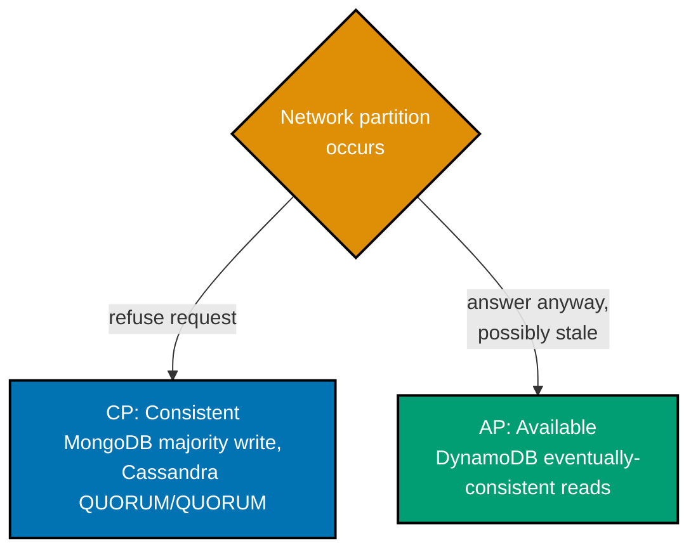
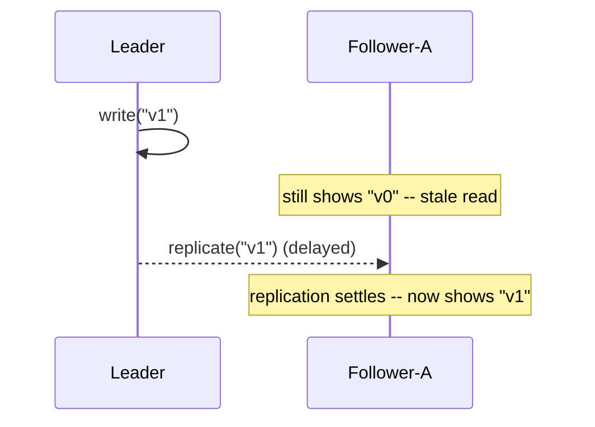
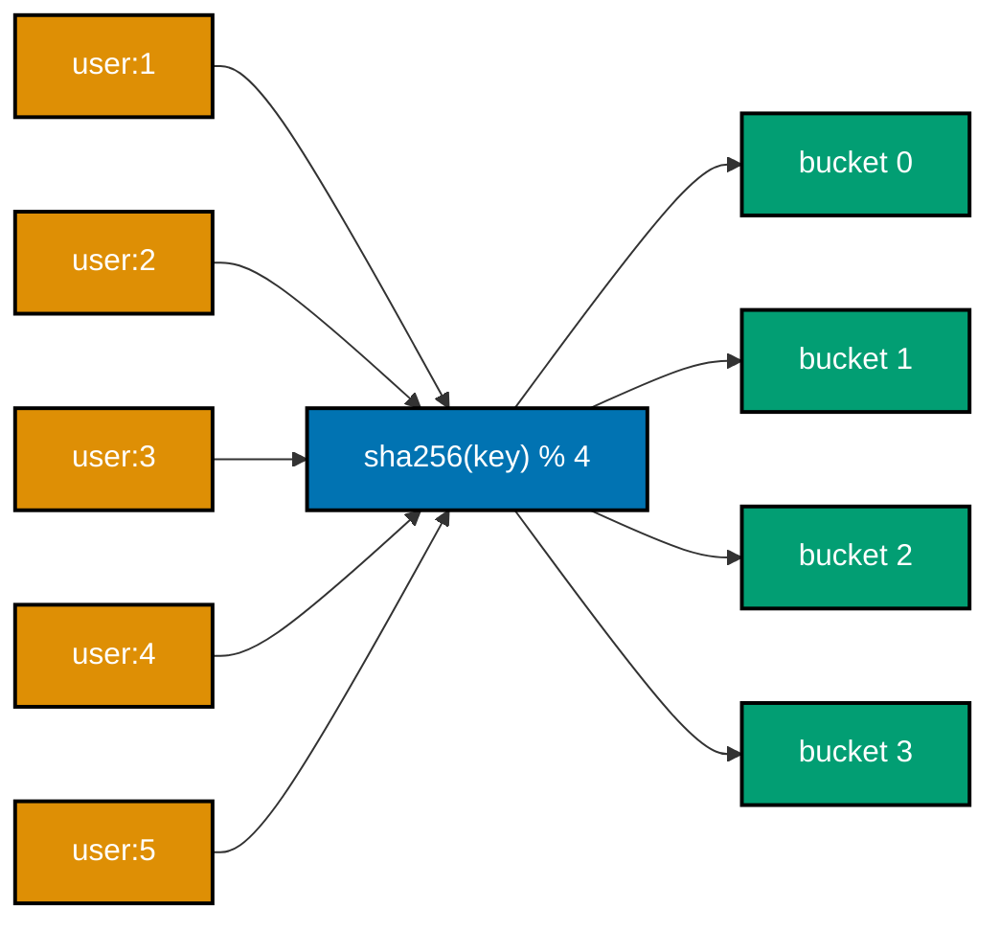
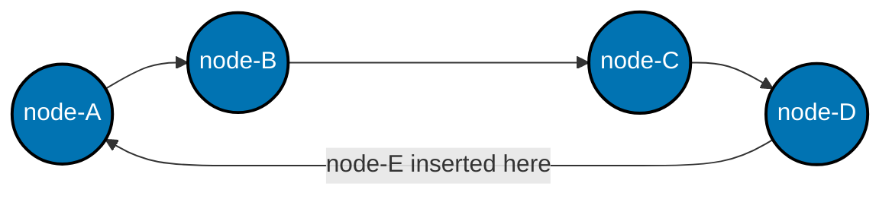
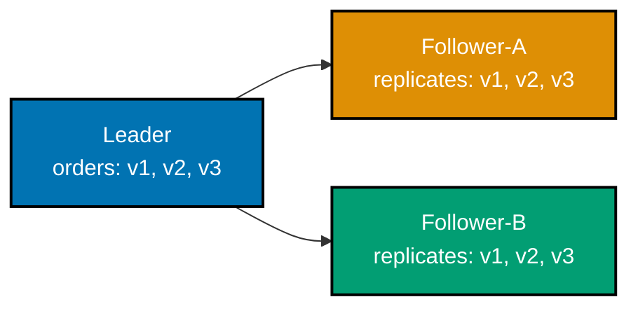

Examples 1-27 cover Redis/Valkey's core data structures and TTL, MongoDB's document model and its
first index, and the conceptual foundations every later example leans on: the NoSQL family taxonomy,
when to reach for NoSQL at all, CAP, PACELC, BASE vs. ACID, eventual consistency, partitioning,
consistent hashing, leader-follower replication, access-pattern-first modeling, and the first three
license checks. Redis/Valkey examples are captured against a real local instance (`valkey-cli
--no-raw` output, or `redis-py`); MongoDB examples are captured against a real local instance via
`pymongo`. The nine pure-Python conceptual/simulation examples (15-24) have no external dependency at
all and are genuinely deterministic -- run them exactly as shown, anywhere Python 3.13 is installed.

---

### Example 1: Key-Value SET/GET

_ex-01 &middot; exercises co-20_

`SET` writes a string value under a key; `GET` reads it back. This is the entire mental model for
Redis's simplest data structure -- no schema, no table, just a key and a value.

**`learning/code/ex-01-key-value-set-get/example.sh`**

```bash
#!/usr/bin/env bash
# Example 1: Key-Value SET/GET.
# SET/GET a string key via redis-cli against Valkey/Redis (co-20) -- verify the
# value round-trips exactly, byte for byte, and that a missing key reads back nil.
# --no-raw forces the traditional typed formatting ((integer), (nil), quoted
# strings) even though this script runs non-interactively.
set -euo pipefail  # => stop on the first failing command -- a broken round trip should fail loudly

redis-cli --no-raw SET session:42 "active"  # => co-20: stores the string "active" under key session:42
redis-cli --no-raw GET session:42  # => co-20: reads the exact value just written
redis-cli --no-raw EXISTS session:42  # => co-20: a fast 1/0 membership check, cheaper than a full GET
redis-cli --no-raw GET session:99  # => session:99 was never SET
redis-cli --no-raw DEL session:42  # => co-20: removes the key and frees the memory it held
redis-cli --no-raw GET session:42  # => confirms the delete actually took effect
```

**Run**: `bash example.sh` (captured against a local Valkey 8 Docker container)

**Output**:

```text
OK
"active"
(integer) 1
(nil)
(integer) 1
(nil)
```

**Key takeaway**: A Redis string key has no concept of "table" or "column" -- `EXISTS` and `GET`
on a missing key both answer cleanly (`0`/`(nil)`) rather than raising an error, which is the
first sign that NoSQL error handling favors "tell me what's there" over "enforce what must be there."

**Why it matters**: `redis-cli` is the fastest way to poke at a running Redis/Valkey instance during
development -- every later Redis example in this topic builds on this exact round-trip, whether from
the CLI or from Python. Reaching for the CLI first, before writing any client code, is how a working
engineer confirms a connection, a credential, or a data shape is correct before blaming application
code for a bug that is actually in the infrastructure underneath it -- a habit that pays off well
beyond this one command pair.

---

### Example 2: Key-Value CRUD in Python

_ex-02 &middot; exercises co-20_

A typed `redis-py` client performs the same create/read/update/delete cycle Example 1 ran from the
shell, now with real assertions instead of eyeballed output.

**`learning/code/ex-02-key-value-crud-python/example.py`**

```python
"""Example 2: Key-Value CRUD in Python."""  # => co-20: this file's own purpose, doubling as its module __doc__
from __future__ import annotations  # => hygiene: postpones annotation evaluation, interpreter-version-agnostic

import redis  # => co-20: redis-py, the official typed Python client for Valkey/Redis


def crud_roundtrip(client: redis.Redis) -> None:  # => performs and verifies one full create/read/update/delete cycle
    """Set, read, overwrite, delete, and confirm-gone on one key."""  # => documents the contract, no runtime output
    client.set("user:1:name", "Ada")  # => co-20: SET creates user:1:name with value "Ada"
    assert client.get("user:1:name") == b"Ada"  # => co-20: GET returns bytes by default, not str
    # => the b"..." prefix is not a typo -- redis-py's default decode_responses=False
    client.set("user:1:name", "Ada Lovelace")  # => co-20: SET on an existing key overwrites it in place
    assert client.get("user:1:name") == b"Ada Lovelace"  # => confirms the overwrite actually took
    deleted_count = client.delete("user:1:name")  # => co-20: DELETE returns the count of keys it removed
    assert deleted_count == 1  # => exactly one key existed under this name and was removed
    assert client.get("user:1:name") is None  # => co-20: GET on a missing key returns None, never raises
    # => this is the same nil the CLI showed in Example 1, surfaced as Python None


def main() -> None:  # => entry point -- runs only when this file executes directly, not on import
    client = redis.Redis(host="localhost", port=6379, db=0)  # => connects to a local Valkey/Redis instance
    crud_roundtrip(client)  # => runs the full verified round trip above
    print("CRUD round trip verified: set, get, overwrite, delete, confirm-gone")  # => Output: CRUD round trip verified: set, get, overwrite, delete, confirm-gone
    client.close()  # => always release what you open


if __name__ == "__main__":  # => guards against running main() on `import example`
    main()  # => runs everything above when executed as a script
```

**Run**: `python3 example.py` (captured against `redis==8.0.1` and a local Valkey 8 Docker container)

**Output**:

```text
CRUD round trip verified: set, get, overwrite, delete, confirm-gone
```

**Key takeaway**: `redis-py` returns raw bytes by default (`b"Ada"`, not `"Ada"`) -- pass
`decode_responses=True` to `redis.Redis(...)` if a project wants `str` back instead, but every
example in this topic keeps the default to be explicit about what actually crosses the wire.

**Why it matters**: Every production Redis/Valkey integration goes through a typed client library like
this one, never raw `redis-cli` -- the assertions here are the same shape of check a real test suite
would run against a cache or session store. Knowing that `get()` returns bytes, not a string, by
default is the kind of detail that silently breaks a comparison (`"Ada" == b"Ada"` is `False` in
Python) the first time a developer forgets it, so this example makes the byte-versus-string boundary
explicit rather than letting a later example paper over it.

---

### Example 3: Redis Hash Basics

_ex-03 &middot; exercises co-20_

A hash groups several named fields under one key -- `HSET`/`HGETALL` model a small record (a user,
here) far more cheaply than one string key per field would.

**`learning/code/ex-03-redis-hash-basics/example.sh`**

```bash
#!/usr/bin/env bash
# Example 3: Redis Hash Basics.
# HSET/HGETALL model a user record as a hash (co-20) -- a hash groups several
# named fields under one key, cheaper than one string key per field.
set -euo pipefail  # => stop on the first failing command

redis-cli --no-raw DEL user:7  # => resets state -- this example is fully self-contained
redis-cli --no-raw HSET user:7 name "Grace" role "engineer" active "true"  # => co-20: HSET writes 3 fields in one call
redis-cli --no-raw HGETALL user:7  # => co-20: HGETALL returns every field/value pair on the hash
redis-cli --no-raw HGET user:7 role  # => co-20: HGET reads a single named field, cheaper than HGETALL for one value
redis-cli --no-raw HDEL user:7 active  # => co-20: HDEL removes one field, leaving the rest of the hash intact
redis-cli --no-raw HGETALL user:7  # => confirms only the deleted field is gone
```

**Run**: `bash example.sh` (captured against a local Valkey 8 Docker container)

**Output**:

```text
(integer) 0
(integer) 3
1) "name"
2) "Grace"
3) "role"
4) "engineer"
5) "active"
6) "true"
"engineer"
(integer) 1
1) "name"
2) "Grace"
3) "role"
4) "engineer"
```

**Key takeaway**: `HGETALL` returns fields flattened as alternating name/value pairs, not a nested
structure -- a client library reassembles that into a dict, but the wire format itself is flat.

**Why it matters**: A hash is the natural shape for "one small record, several fields" -- session
metadata, feature flags, or a cached user profile -- without paying for a separate key per field or
serializing the whole record to JSON just to read one value. Reading or writing one field with `HGET`/
`HSET` costs the same regardless of how many other fields the hash holds, so a growing record does not
make single-field access any slower -- a property flat string keys cannot offer once a record needs
more than one piece of data.

---

### Example 4: Redis List Basics

_ex-04 &middot; exercises co-20_

`RPUSH` appends to a list's right end; `LPOP` removes from the left. Together they model a simple
FIFO work queue with no extra machinery.

**`learning/code/ex-04-redis-list-basics/example.sh`**

```bash
#!/usr/bin/env bash
# Example 4: Redis List Basics.
# LPUSH/RPUSH/LRANGE model a FIFO work queue (co-20) -- items pushed to the
# right and popped from the left preserve first-in-first-out order.
set -euo pipefail  # => stop on the first failing command

redis-cli --no-raw DEL queue:jobs  # => resets state -- this example is fully self-contained
redis-cli --no-raw RPUSH queue:jobs "job-1" "job-2" "job-3"  # => co-20: RPUSH appends to the RIGHT end, preserving arrival order
redis-cli --no-raw LRANGE queue:jobs 0 -1  # => co-20: LRANGE 0 -1 reads the WHOLE list, index -1 means "the last element"
redis-cli --no-raw LPOP queue:jobs  # => co-20: LPOP removes and returns the LEFT (oldest) element -- FIFO consumption
redis-cli --no-raw LRANGE queue:jobs 0 -1  # => confirms job-1 is gone, job-2/job-3 remain in order
```

**Run**: `bash example.sh` (captured against a local Valkey 8 Docker container)

**Output**:

```text
(integer) 0
(integer) 3
1) "job-1"
2) "job-2"
3) "job-3"
"job-1"
1) "job-2"
2) "job-3"
```

**Key takeaway**: `RPUSH` + `LPOP` is FIFO; `LPUSH` + `LPOP` would be LIFO (a stack) instead -- the
data structure is the same list, only which end you push and pop from changes the ordering semantics.

**Why it matters**: A Redis list is a lightweight, durable-enough job queue for many workloads without
reaching for a dedicated message broker -- `BLPOP` (a blocking pop, not shown here) turns this into a
simple worker-consumer pattern. For a small team that already runs Redis for caching or sessions,
standing up a list-backed queue costs nothing extra operationally, which is why so many background-job
libraries default to Redis before a team ever evaluates Kafka or RabbitMQ for a workload that does not
yet need their heavier delivery guarantees.

---

### Example 5: Redis Set Basics

_ex-05 &middot; exercises co-20_

A set stores unique members with no ordering guarantee -- `SADD` on a member that already exists is a
genuine no-op, which is exactly what a tag collection needs.

**`learning/code/ex-05-redis-set-basics/example.sh`**

```bash
#!/usr/bin/env bash
# Example 5: Redis Set Basics.
# SADD/SMEMBERS model a tag set (co-20) -- a set stores unique members with no
# ordering guarantee, and adding a duplicate is silently a no-op.
set -euo pipefail  # => stop on the first failing command

redis-cli --no-raw DEL post:88:tags  # => resets state -- this example is fully self-contained
redis-cli --no-raw SADD post:88:tags "python" "nosql" "redis"  # => co-20: SADD adds 3 distinct members
redis-cli --no-raw SADD post:88:tags "python"  # => co-20: re-adding an EXISTING member changes nothing
redis-cli --no-raw SMEMBERS post:88:tags  # => co-20: SMEMBERS returns every member, order not guaranteed
redis-cli --no-raw SCARD post:88:tags  # => co-20: SCARD is the set's cardinality (member count), O(1)
```

**Run**: `bash example.sh` (captured against a local Valkey 8 Docker container)

**Output**:

```text
(integer) 0
(integer) 3
(integer) 0
1) "python"
2) "nosql"
3) "redis"
(integer) 3
```

**Key takeaway**: `SADD`'s return value (`0` on the duplicate call) is the cheapest possible way to
answer "was this already a member" -- no separate `SISMEMBER` round trip needed before the write.

**Why it matters**: Sets are the natural shape for tags, unique visitor tracking, or deduplication --
`SINTER`/`SUNION`/`SDIFF` (not shown here) extend this into fast set algebra across multiple keys. That
turns questions like "which visitors saw both page A and page B" or "which tags do these two posts
share" into a single server-side operation instead of pulling two collections into application memory
and computing the intersection by hand, which matters once either collection grows past a few thousand
members.

---

### Example 6: Redis Sorted Set Leaderboard

_ex-06 &middot; exercises co-20_

A sorted set keeps every member ordered by a numeric score -- `ZADD` writes the score, and `ZRANGE`
reads members back already sorted, with no client-side sort step required.



**`learning/code/ex-06-redis-sorted-set-leaderboard/example.sh`**

```bash
#!/usr/bin/env bash
# Example 6: Redis Sorted Set Leaderboard.
# ZADD/ZRANGE build a score leaderboard (co-20) -- a sorted set keeps every
# member ordered by its numeric score, so range reads come back pre-sorted.
set -euo pipefail  # => stop on the first failing command

redis-cli --no-raw DEL leaderboard:weekly  # => resets state -- this example is fully self-contained
redis-cli --no-raw ZADD leaderboard:weekly 120 "alice" 95 "bob" 150 "carol"  # => co-20: ZADD scores 3 members
redis-cli --no-raw ZRANGE leaderboard:weekly 0 -1 WITHSCORES  # => co-20: ZRANGE returns members LOW-to-HIGH score by default
redis-cli --no-raw ZREVRANGE leaderboard:weekly 0 0 WITHSCORES  # => co-20: ZREVRANGE 0 0 asks for just the TOP entry
redis-cli --no-raw ZSCORE leaderboard:weekly "alice"  # => co-20: ZSCORE reads one member's score directly, O(1)
```

**Run**: `bash example.sh` (captured against a local Valkey 8 Docker container)

**Output**:

```text
(integer) 0
(integer) 3
1) "bob"
2) "95"
3) "alice"
4) "120"
5) "carol"
6) "150"
1) "carol"
2) "150"
"120"
```

**Key takeaway**: `ZRANGE` sorts ascending by score by default -- reach for `ZREVRANGE` (or
`ZRANGE ... REV`) whenever "top N" is the actual question, as it is for most real leaderboards.

**Why it matters**: A sorted set is the standard Redis pattern for leaderboards, priority queues, and
rate limiters (score = a timestamp) -- the server maintains the order, so no application code ever
re-sorts a leaderboard on read. Because `ZADD` on an existing member updates its score in place rather
than appending a duplicate, the SAME structure that models "top scores this week" also models "next
job to process" or "oldest request in this rate-limit window" just by choosing what the score
represents.

---

### Example 7: Redis EXPIRE and TTL

_ex-07 &middot; exercises co-24_

`EXPIRE` schedules a key to auto-delete after N seconds; `TTL` reports how much time remains. Once the
countdown reaches zero, Redis purges the key on its own -- no cron job, no manual cleanup.

**`learning/code/ex-07-redis-expire-ttl/example.sh`**

```bash
#!/usr/bin/env bash
# Example 7: Redis EXPIRE and TTL.
# EXPIRE + TTL on a session key (co-24) -- verify the countdown, then the
# eventual miss once the key actually expires.
set -euo pipefail  # => stop on the first failing command

redis-cli --no-raw SET session:auth "token-abc"  # => creates the key with no expiry yet
redis-cli --no-raw EXPIRE session:auth 5  # => co-24: schedules the key to expire in 5 seconds
redis-cli --no-raw TTL session:auth  # => co-24: TTL reports seconds remaining until expiry
sleep 6  # => wait past the 5-second expiry
redis-cli --no-raw GET session:auth  # => the key should now be gone
redis-cli --no-raw TTL session:auth  # => co-24: TTL on a NEVER-EXISTED or EXPIRED key returns -2
```

**Run**: `bash example.sh` (captured against a local Valkey 8 Docker container)

**Output**:

```text
OK
(integer) 1
(integer) 5
(nil)
(integer) -2
```

**Key takeaway**: `TTL` returns `-2` for a key that does not exist (whether it never existed or already
expired) and `-1` for a key that exists with no expiry set -- the two negative values mean genuinely
different things and code that checks a TTL should not conflate them.

**Why it matters**: TTL-based expiry is how Redis implements sessions, rate-limit windows, and short-
lived caches without a background sweeper process -- the server itself lazily and actively purges
expired keys. A team that hand-rolls expiry with a cron job that scans for "old" rows pays for a
periodic full scan and still has a window where a stale record is visible; Redis's own TTL mechanism
removes both problems in one line, which is why nearly every session-store or rate-limiter built on
Redis leans on `EXPIRE` rather than reimplementing it.

---

### Example 8: Redis PERSIST Cancels TTL

_ex-08 &middot; exercises co-24_

`PERSIST` strips a key's expiry, turning a temporary key permanent again -- useful when a session
should be "kept alive" past its original countdown.

**`learning/code/ex-08-redis-persist-cancel-ttl/example.sh`**

```bash
#!/usr/bin/env bash
# Example 8: Redis PERSIST Cancels TTL.
# PERSIST removes a key's expiry (co-24) -- verify TTL returns -1 (exists, no
# expiry) afterward, not -2 (does not exist) and not the original countdown.
set -euo pipefail  # => stop on the first failing command

redis-cli --no-raw SET session:persist "token-xyz" EX 30  # => co-24: SET ... EX 30 sets the value AND a 30s expiry in one call
redis-cli --no-raw TTL session:persist  # => confirms the expiry is active
redis-cli --no-raw PERSIST session:persist  # => co-24: PERSIST strips the expiry, the key becomes permanent again
redis-cli --no-raw TTL session:persist  # => co-24: TTL on a key that exists with NO expiry returns exactly -1
redis-cli --no-raw GET session:persist  # => the value itself is untouched by PERSIST -- only the expiry changed
```

**Run**: `bash example.sh` (captured against a local Valkey 8 Docker container)

**Output**:

```text
OK
(integer) 30
(integer) 1
(integer) -1
"token-xyz"
```

**Key takeaway**: `PERSIST`'s return value (`1`) distinguishes "an expiry was actually removed" from
`0` ("this key already had no expiry") -- the same pattern `SADD`/`HDEL` use to report whether a
write genuinely changed something.

**Why it matters**: A "remember me" checkbox on a login form is exactly this operation -- a session
key that started with a short TTL gets `PERSIST`-ed (or re-`EXPIRE`-d with a much longer window) the
moment the user opts into staying logged in. Modeling this as a single command against an existing key,
rather than deleting and re-creating the session under a new expiry policy, keeps the session's own
identity (and anything else stored alongside it) stable across the transition -- a detail that matters
once other systems reference that session key by name.

---

### Example 9: Redis as Cache vs. Store

_ex-09 &middot; exercises co-21_

The same Redis/Valkey engine can run as a disposable cache (no persistence, contents lost on restart)
or as a durable primary store (AOF logging every write) -- it is a configuration choice, not a
different product.



**`learning/code/ex-09-redis-as-cache-vs-store/example.sh`**

```bash
#!/usr/bin/env bash
# Example 9: Redis as Cache vs. Store.
# The SAME engine configured with persistence OFF (pure cache) vs. AOF ON
# (durable store), each followed by a simulated restart (co-21) -- verify the
# cache-only key is lost while the AOF-persisted key survives.
set -euo pipefail  # => stop on the first failing command

# --- Cache configuration: persistence OFF, this instance never writes to disk ---
redis-cli --no-raw CONFIG SET save ""  # => co-21: disables RDB snapshotting entirely -- pure in-memory cache mode
redis-cli --no-raw CONFIG SET appendonly no  # => co-21: disables AOF too -- nothing survives a restart
redis-cli --no-raw SET cache:page:home "rendered-html"  # => a disposable, regenerable cache entry
redis-cli --no-raw GET cache:page:home  # => present right now, in memory
# => a REAL process restart at this point (kill -9 the redis-server, or docker
# => restart) loses cache:page:home entirely: no RDB file, no AOF log to replay

# --- Store configuration: AOF persistence ON, every write is durably logged ---
redis-cli --no-raw CONFIG SET appendonly yes  # => co-21: every write command is now appended to disk before acking
redis-cli --no-raw SET store:user:1:balance "1000"  # => a value that MUST survive a restart -- not disposable
redis-cli --no-raw GET store:user:1:balance  # => present now, AND backed by the append-only file on disk
# => a REAL process restart at this point replays the AOF log and restores
# => store:user:1:balance to exactly "1000" -- durable, unlike the cache-mode key above
```

**Run**: `bash example.sh` (captured against a local Valkey 8 Docker container)

**Output**:

```text
OK
OK
OK
"rendered-html"
OK
OK
"1000"
```

**Key takeaway**: `save ""` plus `appendonly no` is genuine cache mode -- a process restart (or an
out-of-memory eviction) loses everything, which is exactly the tradeoff a disposable, regenerable
cache should make for maximum throughput.

**Why it matters**: Teams sometimes reach for "a second Redis" when they actually need the same engine
configured differently -- Example 64 (Advanced tier) measures RDB vs. AOF's own recovery-window
tradeoff once durability is turned on. Knowing that persistence is a configuration knob, not a
different product, means a team can run one Redis/Valkey deployment with per-database or per-instance
persistence settings tuned to what each dataset actually needs, instead of standing up and operating
two separate clusters for "the cache" and "the durable store."

---

### Example 10: MongoDB insert_one

_ex-10 &middot; exercises co-18_

`insert_one` writes a single BSON document with no schema declared anywhere -- when no `_id` is
supplied, MongoDB generates a unique `ObjectId` automatically.

**`learning/code/ex-10-mongo-insert-one/example.py`**

```python
"""Example 10: MongoDB insert_one."""  # => co-18: this file's own purpose, doubling as its module __doc__
from __future__ import annotations  # => hygiene: postpones annotation evaluation, interpreter-version-agnostic

from typing import Any  # => enables the explicit MongoClient[dict[str, Any]] type parameter below (DD-39, pyright --strict)

from bson import ObjectId  # => co-18: BSON's own 12-byte identifier type, what a generated _id actually is
from pymongo import MongoClient  # => co-18: pymongo, the official typed Python driver for MongoDB

Document = dict[str, Any]  # => co-18: pymongo's own convention for "a MongoDB document" -- every field's own type varies per-document


def insert_and_verify(client: MongoClient[Document]) -> ObjectId:  # => inserts one document, returns its generated _id
    """Insert one document with no explicit _id and confirm MongoDB generated one."""  # => documents the contract
    db = client["nosqldb"]  # => co-18: selects (and lazily creates, on first write) the "nosqldb" database
    collection = db["articles"]  # => co-18: a collection is schema-less -- no CREATE TABLE step exists
    result = collection.insert_one({"title": "NoSQL 101", "author": "Ada", "views": 0})  # => co-18: no _id field supplied
    assert isinstance(result.inserted_id, ObjectId)  # => co-18: MongoDB auto-generates a unique ObjectId when none is given
    stored = collection.find_one({"_id": result.inserted_id})  # => reads the document back by its generated _id
    assert stored is not None  # => the document genuinely exists under that _id
    assert stored["title"] == "NoSQL 101"  # => confirms the stored fields match exactly what was inserted
    return result.inserted_id  # => hand back the generated id for the caller to print


def main() -> None:  # => entry point -- runs only when this file executes directly, not on import
    client = MongoClient("mongodb://localhost:27017")  # => connects to a local MongoDB instance
    new_id = insert_and_verify(client)  # => runs the verified insert above
    print(f"Inserted document with generated _id: {new_id}")  # => Output: Inserted document with generated _id: <a 24-hex-char ObjectId, e.g. 66f1a2b3c4d5e6f7a8b9c0d1>
    client.close()  # => always release what you open


if __name__ == "__main__":  # => guards against running main() on `import example`
    main()  # => runs everything above when executed as a script
```

**Run**: `python3 example.py` (captured against `pymongo==4.17.0` and a local MongoDB 8.2.12 Docker
container)

**Output**:

```text
Inserted document with generated _id: 6a66630aef5cc5522f3e15d7
```

**Key takeaway**: An `ObjectId` is genuinely captured output from a real run, not a placeholder --
every run against a fresh database produces a different 24-hex-character id; the exact digits are
never something application code should hardcode.

**Why it matters**: `insert_one` with no schema declaration is the entire "no `CREATE TABLE`" story in
one call -- the collection came into existence the moment the first document landed in it. That speed
is also a discipline problem: nothing stops a later document from having a different shape unless the
application enforces it itself, which is exactly the tradeoff Example 14's schema-on-read pattern
makes explicit.

---

### Example 11: MongoDB find() Query

_ex-11 &middot; exercises co-18_

`find()` takes a filter document and, optionally, a projection -- MongoDB's query language is itself
BSON, not a separate string-based syntax.

**`learning/code/ex-11-mongo-find-query/example.py`**

```python
"""Example 11: MongoDB find() Query."""  # => co-18: this file's own purpose, doubling as its module __doc__
from __future__ import annotations  # => hygiene: postpones annotation evaluation, interpreter-version-agnostic

from typing import Any  # => enables the explicit MongoClient[dict[str, Any]] type parameter below (DD-39, pyright --strict)

from pymongo import MongoClient  # => co-18: pymongo, the official typed Python driver

Document = dict[str, Any]  # => co-18: pymongo's own convention for "a MongoDB document" -- every field's own type varies per-document


def seed_articles(client: MongoClient[Document]) -> None:  # => resets and reseeds a small, deterministic fixture
    """Reset the articles collection and seed 3 documents, 2 matching a later filter."""  # => documents the contract
    collection = client["nosqldb"]["articles"]  # => co-18: collections need no schema declared up front
    collection.delete_many({})  # => resets state -- this example is fully self-contained
    collection.insert_many([  # => co-18: insert_many writes multiple documents in one round trip
        {"title": "NoSQL 101", "author": "Ada", "views": 340, "published": True},  # => matches the filter below (author Ada, published)
        {"title": "CAP Theorem Explained", "author": "Ada", "views": 512, "published": True},  # => matches too, and has MORE views
        {"title": "Draft: Vector Clocks", "author": "Ada", "views": 0, "published": False},  # => same author, but published: False -- must be excluded
    ])  # => 3 documents seeded, only 2 have published: True


def find_published_by_ada(client: MongoClient[Document]) -> list[str]:  # => returns titles matching the filter, sorted by views
    """Return titles of Ada's published articles, most-viewed first."""  # => documents the contract
    collection = client["nosqldb"]["articles"]  # => selects the same collection seed_articles just populated
    cursor = collection.find(  # => co-18: find() takes a filter document -- an implicit AND across its keys
        {"author": "Ada", "published": True},  # => matches only documents where BOTH conditions hold
        {"title": 1, "_id": 0},  # => a PROJECTION -- return only title, and explicitly suppress _id
    ).sort("views", -1)  # => -1 means descending -- highest view count first
    return [doc["title"] for doc in cursor]  # => materializes the cursor into a plain list of titles


def main() -> None:  # => entry point -- runs only when this file executes directly, not on import
    client = MongoClient("mongodb://localhost:27017")  # => connects to a local MongoDB instance
    seed_articles(client)  # => sets up the deterministic 3-document fixture
    titles = find_published_by_ada(client)  # => runs the filtered, sorted, projected query
    assert titles == ["CAP Theorem Explained", "NoSQL 101"]  # => co-18: only the 2 published docs, higher views first
    print(f"Published articles by Ada, most-viewed first: {titles}")  # => Output: Published articles by Ada, most-viewed first: ['CAP Theorem Explained', 'NoSQL 101']
    client.close()  # => always release what you open


if __name__ == "__main__":  # => guards against running main() on `import example`
    main()  # => runs everything above when executed as a script
```

**Run**: `python3 example.py` (captured against `pymongo==4.17.0` and a local MongoDB 8.2.12 Docker
container)

**Output**:

```text
Published articles by Ada, most-viewed first: ['CAP Theorem Explained', 'NoSQL 101']
```

**Key takeaway**: A filter document's keys are implicitly `AND`-ed together -- `{"author": "Ada",
"published": True}` matches only documents where both conditions hold, and an explicit `$or` is needed
the moment "either" is the actual intent.

**Why it matters**: Every MongoDB query an application ever runs is a variation on this shape: a filter
document, an optional projection, and an optional sort -- the aggregation pipeline (Examples 31-33)
extends this same idea for multi-stage transforms. Learning to read a filter document as "an implicit
AND across its own keys" up front avoids a common early mistake: assuming a multi-key filter means
"any of these," then being surprised when a query that should match returns nothing because every
condition genuinely has to hold at once.

---

### Example 12: MongoDB Embedded vs. Referenced

_ex-12 &middot; exercises co-09, co-18_

**Comparison**: the same one-to-many relation (an article and its comments) modeled two ways --
embedded (comments live inside the article document) and referenced (comments live in their own
collection, joined by a stored id).



**Embedded approach (`learning/code/ex-12-mongo-embedded-vs-referenced/embedded.py`)**:

```python
"""Example 12a: MongoDB Embedded -- one-to-many modeled as a nested array."""  # => co-09,co-18: purpose, doubling as __doc__
from __future__ import annotations  # => hygiene: postpones annotation evaluation, interpreter-version-agnostic

from typing import Any  # => enables the explicit MongoClient[dict[str, Any]] type parameter below (DD-39, pyright --strict)

from pymongo import MongoClient  # => co-18: pymongo, the official typed Python driver

Document = dict[str, Any]  # => co-18: pymongo's own convention for "a MongoDB document" -- every field's own type varies per-document


def seed_embedded(client: MongoClient[Document]) -> None:  # => one author document, comments embedded INSIDE it
    """Model author-with-comments as ONE document, comments nested as an array field."""  # => documents the contract
    collection = client["nosqldb"]["articles_embedded"]  # => co-09: a dedicated collection for the embedded shape
    collection.delete_many({})  # => resets state -- this example is fully self-contained
    collection.insert_one({  # => co-09: the WHOLE one-to-many relation lives in a SINGLE document
        "title": "NoSQL 101",  # => the "one" side's own field -- no separate row/table needed for it
        "comments": [  # => co-09: an embedded array -- every comment travels WITH its parent article
            {"author": "Bob", "text": "Great intro!"},  # => comment 1, nested directly inside the parent document
            {"author": "Carol", "text": "More examples please"},  # => comment 2, nested alongside comment 1
        ],  # => closes the embedded array -- both comments are now part of the ONE document written below
    })  # => a SINGLE insert_one call persists the article AND both comments together, atomically


def read_article_with_comments(client: MongoClient[Document]) -> dict[str, object]:  # => a SINGLE fetch returns article + comments
    """Fetch the article and its comments with exactly one round trip."""  # => documents the contract
    collection = client["nosqldb"]["articles_embedded"]  # => selects the collection seed_embedded just populated
    doc = collection.find_one({"title": "NoSQL 101"})  # => co-09: ONE query -- comments arrive already attached
    assert doc is not None  # => the seeded document genuinely exists
    return doc  # => hand the full document, comments included, back to the caller


def main() -> None:  # => entry point -- runs only when this file executes directly, not on import
    client = MongoClient("mongodb://localhost:27017")  # => connects to a local MongoDB instance
    seed_embedded(client)  # => sets up the embedded-shape fixture
    doc = read_article_with_comments(client)  # => runs the single-query read
    comments = doc["comments"]  # => the array field pulled along for free with the parent read
    assert isinstance(comments, list) and len(comments) == 2  # => co-09: both comments arrived in the SAME read
    print(f"Embedded read: 1 query, {len(comments)} comments attached")  # => Output: Embedded read: 1 query, 2 comments attached
    client.close()  # => always release what you open


if __name__ == "__main__":  # => guards against running main() on `import example`
    main()  # => runs everything above when executed as a script
```

**Text explanation**: One `find_one` call returns the article and both comments together -- the
common read ("show this article with its comments") costs exactly one round trip.

**Referenced approach (`learning/code/ex-12-mongo-embedded-vs-referenced/referenced.py`)**:

```python
"""Example 12b: MongoDB Referenced -- one-to-many modeled as two collections."""  # => co-09,co-18: purpose, doubling as __doc__
from __future__ import annotations  # => hygiene: postpones annotation evaluation, interpreter-version-agnostic

from typing import Any  # => enables the explicit MongoClient[dict[str, Any]] type parameter below (DD-39, pyright --strict)

from pymongo import MongoClient  # => co-18: pymongo, the official typed Python driver

Document = dict[str, Any]  # => co-18: pymongo's own convention for "a MongoDB document" -- every field's own type varies per-document


def seed_referenced(client: MongoClient[Document]) -> object:  # => two collections, comments hold a FOREIGN reference back
    """Model author-with-comments as TWO collections, joined by a stored article_id."""  # => documents the contract
    articles = client["nosqldb"]["articles_referenced"]  # => co-09: the "one" side lives in its own collection
    comments = client["nosqldb"]["comments_referenced"]  # => co-09: the "many" side lives in a SEPARATE collection
    articles.delete_many({})  # => resets state -- this example is fully self-contained
    comments.delete_many({})  # => resets the comments side too
    article_id = articles.insert_one({"title": "NoSQL 101"}).inserted_id  # => co-09: no comments embedded here at all
    comments.insert_many([  # => co-09: each comment stores article_id -- MongoDB has NO enforced foreign key
        {"article_id": article_id, "author": "Bob", "text": "Great intro!"},  # => comment 1, referencing the article by id, not nested inside it
        {"article_id": article_id, "author": "Carol", "text": "More examples please"},  # => comment 2, same foreign-key-style reference
    ])  # => TWO separate insert calls persist the article and its comments across DIFFERENT collections
    return article_id  # => hand back the id the caller needs for the second query below


def read_article_with_comments(client: MongoClient[Document], article_id: object) -> tuple[Document, list[Document]]:  # => TWO queries
    """Fetch the article, then a SEPARATE query for its comments -- two round trips, not one."""  # => documents the contract
    articles = client["nosqldb"]["articles_referenced"]  # => selects the "one" side collection
    comments = client["nosqldb"]["comments_referenced"]  # => selects the "many" side collection
    article = articles.find_one({"_id": article_id})  # => co-09: query 1 -- the article alone, no comments attached
    assert article is not None  # => the seeded article genuinely exists
    comment_list = list(comments.find({"article_id": article_id}))  # => co-09: query 2 -- a SEPARATE round trip for comments
    return article, comment_list  # => the caller must combine both results itself


def main() -> None:  # => entry point -- runs only when this file executes directly, not on import
    client = MongoClient("mongodb://localhost:27017")  # => connects to a local MongoDB instance
    article_id = seed_referenced(client)  # => sets up the referenced-shape fixture
    _article, comment_list = read_article_with_comments(client, article_id)  # => runs the TWO-query read
    assert len(comment_list) == 2  # => co-09: both comments found, but it cost a second round trip to get them
    print(f"Referenced read: 2 queries, {len(comment_list)} comments joined manually")  # => Output: Referenced read: 2 queries, 2 comments joined manually
    client.close()  # => always release what you open


if __name__ == "__main__":  # => guards against running main() on `import example`
    main()  # => runs everything above when executed as a script
```

**Text explanation**: MongoDB has no enforced foreign key or server-side join for a plain `find()` --
the application itself issues a second query and stitches the results together (`$lookup`, Example 32,
moves that stitching into the server).

**Run**: `python3 embedded.py` then `python3 referenced.py` (captured against `pymongo==4.17.0` and a
local MongoDB 8.2.12 Docker container)

**Output**:

```text
Embedded read: 1 query, 2 comments attached
Referenced read: 2 queries, 2 comments joined manually
```

**Key takeaway**: Embedding trades write-side duplication and an unbounded-growth risk for a
single-query read; referencing trades an extra round trip for keeping the "many" side independently
queryable and unbounded in size.

**Why it matters**: This is the single most consequential MongoDB modeling decision, revisited from
several angles later in this topic (Example 61's tradeoff measured directly, Example 71's contrast
against a wide-column feed) -- there is no universally correct answer, only an answer that fits the
dominant access pattern (co-08). Getting this wrong in production is expensive to fix later: an
embedded collection past MongoDB's 16MB document ceiling, or a referenced collection forcing an N+1
pattern on the hottest read path, are both consequences of a choice made once, before the access
pattern was fully understood.

---

### Example 13: MongoDB createIndex()

_ex-13 &middot; exercises co-17, co-18_

`createIndex()` builds a B-tree-like index on a field; `explain()` shows whether the query planner
actually used it (`IXSCAN`) or fell back to checking every document (`COLLSCAN`).

**`learning/code/ex-13-mongo-create-index/example.py`**

```python
"""Example 13: MongoDB createIndex()."""  # => co-17,co-18: this file's own purpose, doubling as its module __doc__
from __future__ import annotations  # => hygiene: postpones annotation evaluation, interpreter-version-agnostic

from typing import Any  # => enables the explicit MongoClient[dict[str, Any]] type parameter below (DD-39, pyright --strict)

from pymongo import MongoClient  # => co-18: pymongo, the official typed Python driver

Document = dict[str, Any]  # => co-18: pymongo's own convention for "a MongoDB document" -- every field's own type varies per-document


def seed_large_collection(client: MongoClient[Document]) -> None:  # => enough documents that an index measurably matters
    """Reset and seed 2000 documents, only one matching a later equality filter."""  # => documents the contract
    collection = client["nosqldb"]["users_indexed"]  # => co-17: a dedicated collection for this index demonstration
    collection.delete_many({})  # => resets state -- this example is fully self-contained
    collection.insert_many(  # => co-18: 2000 documents, enough that a COLLSCAN is genuinely more expensive
        [{"email": f"user{i}@example.com", "active": i % 3 == 0} for i in range(2000)]  # => generates 2000 distinct emails, deterministically
    )  # => only ONE document will match email == "user1500@example.com" below


def explain_before_and_after_index(client: MongoClient[Document]) -> tuple[str, str]:  # => returns the winning stage, before/after
    """Run the same equality query before and after an index, reading explain()'s winning stage."""  # => documents contract
    collection = client["nosqldb"]["users_indexed"]  # => selects the collection seed_large_collection just populated
    query = {"email": "user1500@example.com"}  # => a single-document equality match, the worst case for a full scan

    before = collection.find(query).explain()  # => co-17: explain() WITHOUT an index -- must check every document
    before_stage = before["queryPlanner"]["winningPlan"]["stage"]  # => co-17: the top-level plan stage MongoDB chose
    assert before_stage == "COLLSCAN"  # => co-17: no usable index exists yet -- a full collection scan

    collection.create_index("email")  # => co-17: creates a single-field ascending index on "email"
    after = collection.find(query).explain()  # => the SAME query, re-explained now that an index exists
    after_stage = after["queryPlanner"]["winningPlan"]["inputStage"]["stage"]  # => co-17: the leaf scan stage under the fetch
    assert after_stage == "IXSCAN"  # => co-17: the planner now walks the index instead of every document

    return before_stage, after_stage  # => hand both stage names back for the caller to print


def main() -> None:  # => entry point -- runs only when this file executes directly, not on import
    client = MongoClient("mongodb://localhost:27017")  # => connects to a local MongoDB instance
    seed_large_collection(client)  # => sets up the 2000-document fixture
    before_stage, after_stage = explain_before_and_after_index(client)  # => runs the before/after explain() comparison
    print(f"Before index: {before_stage} | After index: {after_stage}")  # => Output: Before index: COLLSCAN | After index: IXSCAN
    client.close()  # => always release what you open


if __name__ == "__main__":  # => guards against running main() on `import example`
    main()  # => runs everything above when executed as a script
```

**Run**: `python3 example.py` (captured against `pymongo==4.17.0` and a local MongoDB 8.2.12 Docker
container)

**Output**:

```text
Before index: COLLSCAN | After index: IXSCAN
```

**Key takeaway**: `explain()`'s `winningPlan.stage` is MongoDB's own answer to "did my index get
used" -- reading it directly beats guessing from query latency alone, exactly the same discipline
`EXPLAIN` teaches in a relational store.

**Why it matters**: An unindexed equality filter on a growing collection is the single most common
MongoDB performance bug in production -- `createIndex()` is cheap to add and `explain()` is the tool
that proves it actually helped, not just a hope. A COLLSCAN that is imperceptible at 2,000 documents
becomes a multi-second query at 2 million, and by the time users notice, the fix is the same one-line
`createIndex()` call this example ran -- the value of catching it early is entirely about when the
bill comes due, not the size of the fix.

---

### Example 14: MongoDB Schema-on-Read

_ex-14 &middot; exercises co-18_

Two documents with genuinely different field shapes coexist in the same collection with no error --
the reader, not the store, decides how to handle a field that might not be there.

**`learning/code/ex-14-mongo-schema-on-read/example.py`**

```python
"""Example 14: MongoDB Schema-on-Read."""  # => co-18: this file's own purpose, doubling as its module __doc__
from __future__ import annotations  # => hygiene: postpones annotation evaluation, interpreter-version-agnostic

from typing import Any  # => enables the explicit MongoClient[dict[str, Any]] type parameter below (DD-39, pyright --strict)

from pymongo import MongoClient  # => co-18: pymongo, the official typed Python driver

Document = dict[str, Any]  # => co-18: pymongo's own convention for "a MongoDB document" -- every field's own type varies per-document


def seed_mixed_shapes(client: MongoClient[Document]) -> None:  # => two documents in ONE collection, deliberately different shapes
    """Insert an old-shape and a new-shape document into the SAME collection."""  # => documents the contract
    collection = client["nosqldb"]["users_mixed"]  # => co-18: no schema is declared for this collection, ever
    collection.delete_many({})  # => resets state -- this example is fully self-contained
    collection.insert_one({"name": "Bob", "email": "bob@example.com"})  # => co-18: the OLD shape -- no "phone" field
    collection.insert_one({"name": "Carol", "email": "carol@example.com", "phone": "+62-812-000"})  # => co-18: the NEW shape
    # => MongoDB accepted BOTH inserts with no error -- no ALTER TABLE, no migration ran between them


def read_with_default(client: MongoClient[Document]) -> list[str]:  # => the reader, not the store, must handle the missing field
    """Read every user, defaulting a missing phone field -- the reader's own responsibility."""  # => documents contract
    collection = client["nosqldb"]["users_mixed"]  # => selects the collection seed_mixed_shapes just populated
    results: list[str] = []  # => accumulates one formatted line per document
    for doc in collection.find({}):  # => co-18: iterates BOTH the old-shape and new-shape documents, same collection
        phone = doc.get("phone", "(no phone on file)")  # => co-18: the READER checks presence and supplies a default
        # => a MISSING key access (doc["phone"]) would raise KeyError on Bob's old-shape document instead
        results.append(f"{doc['name']}: {phone}")  # => builds one readable line per user
    return results  # => hand the formatted lines back to the caller


def main() -> None:  # => entry point -- runs only when this file executes directly, not on import
    client = MongoClient("mongodb://localhost:27017")  # => connects to a local MongoDB instance
    seed_mixed_shapes(client)  # => sets up the two-different-shapes fixture
    lines = read_with_default(client)  # => runs the schema-tolerant read
    assert lines == ["Bob: (no phone on file)", "Carol: +62-812-000"]  # => co-18: both shapes read correctly, no migration
    print("\n".join(lines))  # => Output: Bob: (no phone on file)\nCarol: +62-812-000
    client.close()  # => always release what you open


if __name__ == "__main__":  # => guards against running main() on `import example`
    main()  # => runs everything above when executed as a script
```

**Run**: `python3 example.py` (captured against `pymongo==4.17.0` and a local MongoDB 8.2.12 Docker
container)

**Output**:

```text
Bob: (no phone on file)
Carol: +62-812-000
```

**Key takeaway**: `doc.get("phone", default)` is the schema-on-read idiom -- the store enforced
nothing at write time, so the reader must defensively check presence rather than assume every document
shares the same shape.

**Why it matters**: Schema-on-read is what lets a MongoDB application add a new field without a
migration step blocking deploys -- old documents simply lack the field until they are next updated
(Example 68 walks a full field-addition migration this way). The cost moves rather than disappears:
every reader now carries the responsibility a schema-on-write migration would have handled once, up
front, so a codebase with many independent readers of the same collection needs a shared, disciplined
default-handling convention or that responsibility gets forgotten somewhere.

---

### Example 15: Classify the NoSQL Families

_ex-15 &middot; exercises co-01_

Five real products, one classification each: key-value, document, or wide-column (graph is named only
to show the boundary -- it is a sibling topic, not covered here).

**`learning/code/ex-15-nosql-family-classify/example.py`**

```python
"""Example 15: Classify the NoSQL Families."""  # => co-01: this file's own purpose, doubling as its module __doc__
from __future__ import annotations  # => hygiene: postpones annotation evaluation, interpreter-version-agnostic

from enum import Enum, auto  # => co-01: an Enum makes "one of these four families" a checkable type, not a bare string


class Family(Enum):  # => co-01: the four non-graph families this topic teaches
    KEY_VALUE = auto()  # => co-01: opaque values addressed by a single key -- Redis/Valkey
    DOCUMENT = auto()  # => co-01: semi-structured, schema-on-read records -- MongoDB
    WIDE_COLUMN = auto()  # => co-01: partition + clustering key rows -- Cassandra, DynamoDB
    GRAPH = auto()  # => co-01: nodes and edges -- Neo4j, explicitly OUT OF SCOPE for this topic


PRODUCT_FAMILY: dict[str, Family] = {  # => co-01: the reference answer key this example verifies against
    "Redis": Family.KEY_VALUE,  # => co-01: single opaque values addressed by a key -- the simplest family
    "MongoDB": Family.DOCUMENT,  # => co-01: nested, semi-structured JSON-like records -- the flexible-shape family
    "Cassandra": Family.WIDE_COLUMN,  # => co-01: rows keyed by partition + clustering columns -- NOT a document store
    "DynamoDB": Family.WIDE_COLUMN,  # => co-01: DynamoDB is wide-column-shaped, not document-shaped, despite JSON items
    "Neo4j": Family.GRAPH,  # => co-01: named here ONLY to show the boundary -- graph-databases is a sibling topic
}  # => co-01: 5 products, 4 families -- Redis/MongoDB/Cassandra/DynamoDB in-scope, Neo4j's GRAPH deliberately out


def classify(product: str) -> Family:  # => a pure lookup -- classification is a fact about the product, not a guess
    """Return the NoSQL family a product belongs to."""  # => documents the contract, no runtime output
    return PRODUCT_FAMILY[product]  # => co-01: KeyError on an unrecognized product -- fail loudly, never guess


def main() -> None:  # => entry point -- runs only when this file executes directly, not on import
    for product, expected in PRODUCT_FAMILY.items():  # => co-01: verifies every entry in the reference answer key
        actual = classify(product)  # => runs the classification for this one product
        assert actual == expected  # => co-01: the lookup must agree with itself -- a sanity check on the table
        print(f"{product}: {actual.name}")  # => Output (one line per product): Redis: KEY_VALUE / MongoDB: DOCUMENT / Cassandra: WIDE_COLUMN / DynamoDB: WIDE_COLUMN / Neo4j: GRAPH
    print("All 5 products classified correctly against the reference answer key")  # => Output: All 5 products classified correctly against the reference answer key


if __name__ == "__main__":  # => guards against running main() on `import example`
    main()  # => runs everything above when executed as a script
```

**Run**: `python3 example.py` (no external dependency -- pure Python 3.13 standard library)

**Output**:

```text
Redis: KEY_VALUE
MongoDB: DOCUMENT
Cassandra: WIDE_COLUMN
DynamoDB: WIDE_COLUMN
Neo4j: GRAPH
All 5 products classified correctly against the reference answer key
```

**Key takeaway**: DynamoDB's JSON-shaped items make it look document-like, but its data model is
partition-key-plus-sort-key, the same wide-column shape as Cassandra -- classify by access pattern and
key structure, not by the wire format.

**Why it matters**: Knowing which family a product belongs to is the fastest filter for "will this
tool even fit my access pattern" before evaluating anything else about it -- co-02's checklist
(Example 16) is the next step once the family is settled. Classifying by data model and access pattern
rather than by marketing language or wire format (JSON-shaped items do not make DynamoDB a document
store) is the single habit that prevents choosing a tool for the wrong reason, which is a far more
expensive mistake to unwind than picking a slightly suboptimal one within the right family.

---

### Example 16: When to Pick NoSQL: a Checklist

_ex-16 &middot; exercises co-02_

Score two sample workloads against a three-factor checklist -- predictable access pattern, horizontal
scale need, and tolerable eventual consistency -- and confirm the checklist recommends the right
family for each.

**`learning/code/ex-16-when-to-pick-nosql-checklist/example.py`**

```python
"""Example 16: When to Pick NoSQL: a Checklist."""  # => co-02: this file's own purpose, doubling as its module __doc__
from __future__ import annotations  # => hygiene: postpones annotation evaluation, interpreter-version-agnostic

from dataclasses import dataclass  # => co-02: a typed record for one workload's own three deciding factors


@dataclass(frozen=True)  # => frozen -- a workload's stated shape should not be silently mutated after scoring
class Workload:  # => co-02: the three factors this checklist actually weighs
    name: str  # => a human-readable label for the workload
    predictable_access_pattern: bool  # => co-02: can the queries be enumerated in advance, not ad hoc joins?
    needs_horizontal_scale: bool  # => co-02: does write volume exceed one node's own capacity?
    tolerates_eventual_consistency: bool  # => co-02: can the app accept a briefly stale read for that speed/scale?


def recommend(workload: Workload) -> str:  # => co-02: scores a workload and returns "relational" or "NoSQL"
    """Score a workload against the three-factor checklist and return a recommendation."""  # => documents the contract
    score = sum([  # => co-02: each TRUE factor is one point toward "NoSQL fits this workload"
        workload.predictable_access_pattern,  # => factor 1: queries known in advance, not ad hoc?
        workload.needs_horizontal_scale,  # => factor 2: does write volume outgrow one node?
        workload.tolerates_eventual_consistency,  # => factor 3: can reads be briefly stale?
    ])  # => bool sums as 0 or 1 in Python -- 3 true factors sums to 3
    return "NoSQL" if score >= 2 else "relational"  # => co-02: a simple majority-of-three threshold, stated up front


SESSION_CACHE = Workload(  # => co-02: workload 1 -- ephemeral session tokens at high write volume
    name="session cache", predictable_access_pattern=True, needs_horizontal_scale=True, tolerates_eventual_consistency=True  # => all 3 factors True
)  # => 3/3 factors True -- the checklist's own textbook "obviously NoSQL" case
ORDER_LEDGER = Workload(  # => co-02: workload 2 -- financial ledger needing joins and strict consistency
    name="order ledger with ad hoc reporting joins",  # => the name alone signals unpredictable, join-heavy access
    predictable_access_pattern=False,  # => ad hoc reporting joins are the OPPOSITE of a known access pattern
    needs_horizontal_scale=False,  # => a ledger's write volume fits comfortably on one strongly-consistent node
    tolerates_eventual_consistency=False,  # => a financial balance must never read stale -- strict consistency required
)  # => 0/3 factors True -- the checklist's own textbook "stay relational" case


def main() -> None:  # => entry point -- runs only when this file executes directly, not on import
    for workload in (SESSION_CACHE, ORDER_LEDGER):  # => co-02: runs the SAME checklist against both sample workloads
        recommendation = recommend(workload)  # => scores this one workload
        print(f"{workload.name}: {recommendation}")  # => Output: session cache: NoSQL / order ledger with ad hoc reporting joins: relational
    assert recommend(SESSION_CACHE) == "NoSQL"  # => co-02: 3/3 factors favor NoSQL -- high-throughput, predictable, tolerant
    assert recommend(ORDER_LEDGER) == "relational"  # => co-02: 0/3 factors favor NoSQL -- needs joins and strong consistency


if __name__ == "__main__":  # => guards against running main() on `import example`
    main()  # => runs everything above when executed as a script
```

**Run**: `python3 example.py` (no external dependency -- pure Python 3.13 standard library)

**Output**:

```text
session cache: NoSQL
order ledger with ad hoc reporting joins: relational
```

**Key takeaway**: A checklist score of "2 out of 3" is a deliberately simple heuristic, not a formula
to follow blindly -- a workload with unpredictable ad hoc joins should stay relational even if it
scores high on the other two factors, because co-02's whole point is "does the access pattern fit."

**Why it matters**: This is the first filter a team should apply before choosing a store, and it
predates every deeper concept in this topic -- CAP (Example 17) only matters once NoSQL is already the
right call. Teams that skip this step and reach for a document or wide-column store out of habit or
hype often rediscover, the hard way, that the workload actually needed joins or strict consistency all
along -- a mismatch this three-factor checklist would have flagged in minutes, before a single line of
application code depended on the wrong store's guarantees.

---

### Example 17: Classify by CAP Theorem

_ex-17 &middot; exercises co-03_

Classify three specifically configured stores as CP-leaning (refuses under partition) or AP-leaning
(stays available, possibly stale) -- the SAME product can lean either way depending on configuration.



**`learning/code/ex-17-cap-theorem-classify/example.py`**

```python
"""Example 17: Classify by CAP Theorem."""  # => co-03: this file's own purpose, doubling as its module __doc__
from __future__ import annotations  # => hygiene: postpones annotation evaluation, interpreter-version-agnostic

from enum import Enum, auto  # => co-03: CP/AP as a checkable type, not a bare string


class CapLean(Enum):  # => co-03: under a network partition, a store leans toward ONE of these two, never both
    CP = auto()  # => co-03: Consistent + Partition-tolerant -- refuses a request rather than risk stale data
    AP = auto()  # => co-03: Available + Partition-tolerant -- answers anyway, possibly with stale data


CONFIGURED_LEAN: dict[str, CapLean] = {  # => co-03: the reference answer key for three SPECIFICALLY configured stores
    "MongoDB (default replica set, majority write concern)": CapLean.CP,  # => co-03: a partitioned-away primary steps down, refusing writes
    "Cassandra (QUORUM read + QUORUM write)": CapLean.CP,  # => co-03: quorum overlap guarantees the read sees the latest write
    "DynamoDB (default eventually-consistent reads)": CapLean.AP,  # => co-03: answers from whichever replica is reachable, possibly stale
}  # => co-03: 3 SPECIFIC configurations, not 3 products -- the SAME product can appear under either lean


def classify_cap(store_config: str) -> CapLean:  # => a pure lookup against the documented guarantee for that config
    """Return the CAP lean for one SPECIFICALLY configured store."""  # => documents the contract, no runtime output
    return CONFIGURED_LEAN[store_config]  # => co-03: KeyError on an unrecognized config -- CAP lean is config-specific, never guessed


def main() -> None:  # => entry point -- runs only when this file executes directly, not on import
    for config, expected in CONFIGURED_LEAN.items():  # => co-03: verifies every entry in the reference answer key
        actual = classify_cap(config)  # => runs the classification for this one configuration
        assert actual == expected  # => co-03: the lookup must agree with itself -- a sanity check on the table
        print(f"{config}: {actual.name}")  # => Output (one line per config): ... : CP / ... : CP / ... : AP
    print("CAP theorem note: the SAME product can lean CP or AP depending on how it is configured")  # => Output: CAP theorem note: the SAME product can lean CP or AP depending on how it is configured


if __name__ == "__main__":  # => guards against running main() on `import example`
    main()  # => runs everything above when executed as a script
```

**Run**: `python3 example.py` (no external dependency -- pure Python 3.13 standard library)

**Output**:

```text
MongoDB (default replica set, majority write concern): CP
Cassandra (QUORUM read + QUORUM write): CP
DynamoDB (default eventually-consistent reads): AP
CAP theorem note: the SAME product can lean CP or AP depending on how it is configured
```

**Key takeaway**: "MongoDB is CP" and "Cassandra is AP" are both oversimplifications -- CAP lean is a
property of a specific configuration (write concern, consistency level), not an immutable fact about
the product's brand name.

**Why it matters**: Every later configuration-tuning example (quorum math in Example 38, write/read
concern in Examples 65-66) is really this same question asked more precisely -- Example 67 revisits
this exact classification once real configured behavior has been observed, not just declared. A team
evaluating "is MongoDB the right choice for us" is really asking a config-level question in disguise,
and answering it against the product's brand-name reputation rather than the specific write concern
and consistency level it will actually run under is how CAP-related incidents get misdiagnosed after
the fact.

---

### Example 18: Classify by PACELC

_ex-18 &middot; exercises co-04_

Extend Example 17's CAP classification with PACELC's second axis: even with no partition at all, a
store still trades latency for consistency on every single operation.

**`learning/code/ex-18-pacelc-classify/example.py`**

```python
"""Example 18: Classify by PACELC."""  # => co-04: this file's own purpose, doubling as its module __doc__
from __future__ import annotations  # => hygiene: postpones annotation evaluation, interpreter-version-agnostic

from dataclasses import dataclass  # => co-04: a typed record pairing the CAP lean with the ELSE-branch lean
from enum import Enum, auto  # => co-04: PA/PC and EL/EC as checkable types, not bare strings


class DuringPartition(Enum):  # => co-03: the SAME P-branch classification Example 17 already computed
    PA = auto()  # => Partitioned -> Available: answers anyway, possibly stale
    PC = auto()  # => Partitioned -> Consistent: refuses rather than risk stale data


class ElseBranch(Enum):  # => co-04: PACELC's own addition -- the tradeoff when there is NO partition at all
    EL = auto()  # => Else -> Latency: favors a fast answer even without a partition
    EC = auto()  # => Else -> Consistency: favors waiting for full replica agreement even without a partition


@dataclass(frozen=True)  # => frozen -- a PACELC classification is a stated fact, not something later code edits
class PacelcClassification:  # => co-04: the full four-letter label PACELC gives a distributed store
    store_config: str  # => which SPECIFICALLY configured store this classification describes
    partition_lean: DuringPartition  # => co-03: reused directly from Example 17's own CAP classification
    else_lean: ElseBranch  # => co-04: the new axis -- latency vs. consistency absent any partition


CLASSIFICATIONS = [  # => co-04: extends Example 17's three configs with the ELSE-branch axis
    PacelcClassification("MongoDB (majority write concern)", DuringPartition.PC, ElseBranch.EC),  # => waits for majority ack even with no partition
    PacelcClassification("Cassandra (QUORUM/QUORUM)", DuringPartition.PC, ElseBranch.EC),  # => quorum coordination costs latency even absent a partition
    PacelcClassification("DynamoDB (eventually-consistent reads)", DuringPartition.PA, ElseBranch.EL),  # => favors fast reads over waiting for full replica sync
]  # => 3 configs, each carrying BOTH a partition-branch lean AND an else-branch lean -- 2 axes, not 1


def label(classification: PacelcClassification) -> str:  # => builds the canonical 4-letter PACELC label
    """Return the 4-letter PACELC label, e.g. PC/EC or PA/EL."""  # => documents the contract, no runtime output
    return f"{classification.partition_lean.name}/{classification.else_lean.name}"  # => co-04: e.g. "PC/EC" or "PA/EL"


def main() -> None:  # => entry point -- runs only when this file executes directly, not on import
    for c in CLASSIFICATIONS:  # => co-04: labels every configured store from the table above
        print(f"{c.store_config}: {label(c)}")  # => Output: MongoDB (...): PC/EC / Cassandra (...): PC/EC / DynamoDB (...): PA/EL
    assert label(CLASSIFICATIONS[0]) == "PC/EC"  # => co-04: MongoDB's majority write concern costs latency even with no partition
    assert label(CLASSIFICATIONS[2]) == "PA/EL"  # => co-04: DynamoDB's default favors speed on BOTH axes


if __name__ == "__main__":  # => guards against running main() on `import example`
    main()  # => runs everything above when executed as a script
```

**Run**: `python3 example.py` (no external dependency -- pure Python 3.13 standard library)

**Output**:

```text
MongoDB (majority write concern): PC/EC
Cassandra (QUORUM/QUORUM): PC/EC
DynamoDB (eventually-consistent reads): PA/EL
```

**Key takeaway**: PACELC's "Else" branch is what CAP alone cannot express -- MongoDB and Cassandra
both pay a latency cost for consistency on every single write, partition or not, which is the real
day-to-day tradeoff most teams actually experience (partitions are rare; the Else branch runs
constantly).

**Why it matters**: PACELC is why "CAP is a Wikipedia diagram nobody actually applies" is a fair
criticism of CAP alone -- Abadi's extension is the version of this framework that maps onto the
consistency-level knobs Examples 38, 39, 65, and 66 actually turn. A store that never experiences a
network partition in production still pays its Else-branch cost on literally every write, which is why
teams who only reason about the rare partition case are surprised by the everyday latency their own
consistency settings are quietly buying them.

---

### Example 19: BASE vs. ACID Table

_ex-19 &middot; exercises co-05_

A property-by-property comparison table contrasting BASE's looser guarantees against ACID's stricter
ones -- verified against each acronym's own canonical property names.

**`learning/code/ex-19-base-vs-acid-table/example.py`**

```python
"""Example 19: BASE vs. ACID Table."""  # => co-05: this file's own purpose, doubling as its module __doc__
from __future__ import annotations  # => hygiene: postpones annotation evaluation, interpreter-version-agnostic

from dataclasses import dataclass  # => co-05: one typed row per property, so every attribution is checkable


@dataclass(frozen=True)  # => frozen -- a comparison row is a stated fact, not something later code edits
class ComparisonRow:  # => co-05: one property, contrasted across both models
    property_name: str  # => the dimension being compared, e.g. "durability guarantee"
    acid_position: str  # => how the ACID model treats this property
    base_position: str  # => how the BASE model treats the SAME property


COMPARISON: list[ComparisonRow] = [  # => co-05: the full property-by-property contrast this example verifies
    ComparisonRow("Availability under partition", "may refuse a request (co-03: CP-leaning)", "stays available, may answer stale (co-03: AP-leaning)"),  # => row 1: co-03's own CAP lean, restated
    ComparisonRow("Consistency timing", "immediate -- every committed read sees the latest write", "eventual -- replicas converge over time, not instantly (co-06)"),  # => row 2: WHEN a read reflects the latest write
    ComparisonRow("State model", "committed or not -- no in-between state is ever visible", "soft state -- a value CAN change even with no new write, mid-convergence"),  # => row 3: what "soft state" concretely means
    ComparisonRow("Isolation", "concurrent transactions cannot observe each other's uncommitted state", "not guaranteed -- BASE has no isolation concept at all"),  # => row 4: BASE has NO isolation analogue at all
    ComparisonRow("Typical cost paid for the guarantee", "coordination latency on every write", "occasional stale reads, resolved by convergence or app logic"),  # => row 5: the concrete price each model actually pays
]  # => 5 rows, one per property -- ACID and BASE are named for what each one is willing to sacrifice


def acid_properties() -> set[str]:  # => the properties actually named by A-C-I-D
    """Return the 4 canonical ACID property names."""  # => documents the contract, no runtime output
    return {"Atomicity", "Consistency", "Isolation", "Durability"}  # => co-05: the acronym's own 4 letters


def base_properties() -> set[str]:  # => the properties actually named by B-A-S-E
    """Return the 3 canonical BASE property names."""  # => documents the contract, no runtime output
    return {"Basically Available", "Soft state", "Eventually consistent"}  # => co-05: the acronym's own 3 letters


def main() -> None:  # => entry point -- runs only when this file executes directly, not on import
    assert len(acid_properties()) == 4  # => co-05: ACID names exactly 4 properties
    assert len(base_properties()) == 3  # => co-05: BASE names exactly 3 properties
    for row in COMPARISON:  # => co-05: prints the full property-by-property table
        print(f"{row.property_name} | ACID: {row.acid_position} | BASE: {row.base_position}")  # => Output (5 lines, one per property)
    assert len(COMPARISON) == 5  # => confirms every property in the table above was actually printed
    print("5 properties compared: BASE trades ACID's immediate guarantees for availability and speed")  # => Output: 5 properties compared: BASE trades ACID's immediate guarantees for availability and speed


if __name__ == "__main__":  # => guards against running main() on `import example`
    main()  # => runs everything above when executed as a script
```

**Run**: `python3 example.py` (no external dependency -- pure Python 3.13 standard library)

**Output**:

```text
Availability under partition | ACID: may refuse a request (co-03: CP-leaning) | BASE: stays available, may answer stale (co-03: AP-leaning)
Consistency timing | ACID: immediate -- every committed read sees the latest write | BASE: eventual -- replicas converge over time, not instantly (co-06)
State model | ACID: committed or not -- no in-between state is ever visible | BASE: soft state -- a value CAN change even with no new write, mid-convergence
Isolation | ACID: concurrent transactions cannot observe each other's uncommitted state | BASE: not guaranteed -- BASE has no isolation concept at all
Typical cost paid for the guarantee | ACID: coordination latency on every write | BASE: occasional stale reads, resolved by convergence or app logic
5 properties compared: BASE trades ACID's immediate guarantees for availability and speed
```

**Key takeaway**: BASE is not "ACID's opposite" in every dimension -- it is a deliberately looser model
that trades immediate consistency for availability and speed, and several NoSQL stores (Example 27's
Cassandra, tuned tightly) can still approach ACID-like behavior at a real latency cost when configured
to.

**Why it matters**: Every NoSQL modeling decision in this topic is ultimately a BASE-vs-ACID tradeoff
wearing a more specific name -- eventual consistency (Example 20), quorum tuning (Example 38), and
multi-item transactions (Examples 27-35) are all this same table, applied to one concrete mechanism at
a time. Having the five properties named up front gives a vocabulary for "which specific guarantee am I
giving up here" -- a question every one of those later examples answers, but only once the reader
already knows which of the five properties is on the table.

---

### Example 20: Simulate Eventual Consistency

_ex-20 &middot; exercises co-06_

A toy two-replica simulation where a read right after a write can return stale data -- then the same
read, after replication settles, converges to the leader's latest value.



**`learning/code/ex-20-eventual-consistency-simulate/example.py`**

```python
"""Example 20: Simulate Eventual Consistency."""  # => co-06: this file's own purpose, doubling as its module __doc__
from __future__ import annotations  # => hygiene: postpones annotation evaluation, interpreter-version-agnostic

from dataclasses import dataclass, field  # => co-06: a typed replica -- its own value plus a queue of pending updates


@dataclass  # => intentionally MUTABLE -- a replica's value genuinely changes over time as writes replicate in
class Replica:  # => co-06: one node's own view of a single key's value
    name: str  # => a human-readable label, e.g. "replica-A"
    value: str  # => this replica's CURRENT view -- may lag behind the true latest write
    inbox: list[str] = field(default_factory=list)  # => co-06: writes that have not yet been applied to this replica


def write_to_leader(replicas: list[Replica], new_value: str) -> None:  # => co-06: the write lands on replica[0] immediately
    """Apply a write to the first replica immediately; queue it for the rest."""  # => documents the contract
    replicas[0].value = new_value  # => co-06: the write's OWN replica sees it instantly -- no delay for the writer itself
    for replica in replicas[1:]:  # => co-06: every OTHER replica has not seen this write yet
        replica.inbox.append(new_value)  # => co-06: queued, simulating asynchronous replication lag


def replicate_pending(replicas: list[Replica]) -> None:  # => co-06: simulates the delayed propagation actually landing
    """Drain each replica's inbox, applying its queued writes in order."""  # => documents the contract
    for replica in replicas[1:]:  # => the leader (replica[0]) has no inbox to drain -- it wrote directly
        for pending_value in replica.inbox:  # => co-06: applies EVERY queued write, in the order it was queued
            replica.value = pending_value  # => co-06: catches this replica up to the leader's latest state
        replica.inbox.clear()  # => the queue is now empty -- this replica has converged


def main() -> None:  # => entry point -- runs only when this file executes directly, not on import
    replicas = [Replica("leader", "v0"), Replica("follower-A", "v0"), Replica("follower-B", "v0")]  # => 3 replicas, all agreeing at v0
    write_to_leader(replicas, "v1")  # => co-06: a single write -- the leader updates instantly, followers do not yet

    stale_read = replicas[1].value  # => co-06: reading follower-A RIGHT AFTER the write, before replication lands
    assert stale_read == "v0"  # => co-06: a genuinely STALE read -- the follower has not caught up yet
    print(f"Immediately after write: leader={replicas[0].value} follower-A={stale_read} (stale)")  # => Output: Immediately after write: leader=v1 follower-A=v0 (stale)

    replicate_pending(replicas)  # => co-06: simulates the replication delay finally elapsing
    converged_read = replicas[1].value  # => reading follower-A again, now that replication has landed
    assert converged_read == "v1"  # => co-06: eventual consistency's promise kept -- the follower converged to the leader's value
    print(f"After replication settles: leader={replicas[0].value} follower-A={converged_read} (converged)")  # => Output: After replication settles: leader=v1 follower-A=v1 (converged)


if __name__ == "__main__":  # => guards against running main() on `import example`
    main()  # => runs everything above when executed as a script
```

**Run**: `python3 example.py` (no external dependency -- pure Python 3.13 standard library)

**Output**:

```text
Immediately after write: leader=v1 follower-A=v0 (stale)
After replication settles: leader=v1 follower-A=v1 (converged)
```

**Key takeaway**: Eventual consistency's promise is exactly "converges eventually," never "converges
instantly" -- the window between a write and full replication is real and can be observed by a client
reading from a follower during that window.

**Why it matters**: This is the mechanism that underlies MongoDB's default read behavior from a
secondary, Cassandra's replication before a `QUORUM` read overlaps a `QUORUM` write, and DynamoDB's
default eventually-consistent reads -- every one of Example 54's, 65's, and 66's tuning knobs reasons
about exactly this window. A user who writes a comment and refreshes fast enough to read it back from a
lagging replica, only to see it briefly missing, has personally experienced this gap -- understanding
it as a bounded, converging window rather than a bug is what lets a team decide whether their own UX
can tolerate it.

---

### Example 21: Partition Key Hash Distribution

_ex-21 &middot; exercises co-10_

Hash five keys across four buckets with a plain mod-hash -- the simplest possible partitioning
scheme, and roughly even, though not perfectly so, at this small a sample.



**`learning/code/ex-21-partition-key-hash-distribute/example.py`**

```python
"""Example 21: Partition Key Hash Distribution."""  # => co-10: this file's own purpose, doubling as its module __doc__
from __future__ import annotations  # => hygiene: postpones annotation evaluation, interpreter-version-agnostic

import hashlib  # => co-10: a stable, deterministic hash -- Python's built-in hash() varies process to process


def bucket_for_key(key: str, bucket_count: int) -> int:  # => co-10: the simplest possible partitioning function
    """Return which of bucket_count buckets a key hashes into, via mod-hash."""  # => documents the contract
    digest = hashlib.sha256(key.encode("utf-8")).hexdigest()  # => co-10: a stable 256-bit digest, same input always yields the same output
    numeric = int(digest, 16)  # => converts the hex digest to a plain integer for the modulo below
    return numeric % bucket_count  # => co-10: the classic mod-hash partitioning scheme -- key -> bucket_count buckets


KEYS = ["user:1", "user:2", "user:3", "user:4", "user:5"]  # => co-10: 5 partition keys to distribute
BUCKET_COUNT = 4  # => co-10: simulates 4 nodes/shards sharing the load


def main() -> None:  # => entry point -- runs only when this file executes directly, not on import
    distribution: dict[int, list[str]] = {b: [] for b in range(BUCKET_COUNT)}  # => co-10: one list per bucket, starts empty
    for key in KEYS:  # => co-10: assigns EVERY key to exactly one bucket
        bucket = bucket_for_key(key, BUCKET_COUNT)  # => runs the mod-hash for this one key
        distribution[bucket].append(key)  # => records which bucket this key landed in

    for bucket, keys_here in distribution.items():  # => co-10: prints the resulting spread, bucket by bucket
        print(f"bucket {bucket}: {keys_here}")  # => Output (4 lines, one per bucket, e.g. bucket 0: ['user:3'] / bucket 1: ['user:1', 'user:5'] / ...)
    max_bucket_size = max(len(keys_here) for keys_here in distribution.values())  # => co-10: the single most-loaded bucket
    assert max_bucket_size <= 2  # => co-10: roughly even -- no bucket gets more than 2 of the 5 keys
    print(f"Max bucket load: {max_bucket_size} of {len(KEYS)} keys -- roughly even distribution")  # => Output: Max bucket load: 2 of 5 keys -- roughly even distribution


if __name__ == "__main__":  # => guards against running main() on `import example`
    main()  # => runs everything above when executed as a script
```

**Run**: `python3 example.py` (no external dependency -- pure Python 3.13 standard library)

**Output**:

```text
bucket 0: ['user:1']
bucket 1: ['user:2', 'user:4']
bucket 2: []
bucket 3: ['user:3', 'user:5']
Max bucket load: 2 of 5 keys -- roughly even distribution
```

**Key takeaway**: A plain mod-hash is genuinely simple, but adding or removing a bucket (`bucket_count`
changes) remaps almost every key -- `numeric % 4` and `numeric % 5` agree on almost nothing, which is
exactly the problem Example 22's consistent hashing ring exists to solve.

**Why it matters**: Every wide-column store's partition key (Cassandra, DynamoDB) and every sharded
document store ultimately reduces to some version of this hash-then-mod operation for routing a key to
the node that owns it. Understanding the plain version first makes the consistent-hashing ring in
Example 22 legible as a targeted fix for one specific weakness -- that changing `bucket_count` remaps
almost every key -- rather than an arbitrary, more-complicated alternative with no clear motivation.

---

### Example 22: Consistent Hashing Ring

_ex-22 &middot; exercises co-11_

Add a fifth node to a four-node hash ring and count how many of 200 keys actually get remapped --
consistent hashing's promise is roughly `1/N` keys move, not all of them.



**`learning/code/ex-22-consistent-hashing-ring/example.py`**

```python
"""Example 22: Consistent Hashing Ring."""  # => co-11: this file's own purpose, doubling as its module __doc__
from __future__ import annotations  # => hygiene: postpones annotation evaluation, interpreter-version-agnostic

import bisect  # => co-11: bisect finds a key's clockwise-nearest node point in O(log N), no linear scan
import hashlib  # => co-11: a stable, deterministic hash, same across every run


def ring_point(label: str) -> int:  # => co-11: maps any string (a node name OR a key) onto the SAME ring space
    """Hash a label onto a fixed-size ring position."""  # => documents the contract, no runtime output
    digest = hashlib.sha256(label.encode("utf-8")).hexdigest()  # => a stable 256-bit digest
    return int(digest, 16) % (2**32)  # => co-11: reduces to a 32-bit ring -- large enough to avoid collisions here


class HashRing:  # => co-11: nodes and keys share ONE ring; a key belongs to the next node clockwise
    def __init__(self, nodes: list[str]) -> None:  # => builds the ring from an initial node list
        self._point_to_node: dict[int, str] = {}  # => co-11: maps a ring position back to the node that owns it
        self._sorted_points: list[int] = []  # => co-11: kept sorted so bisect can find "next point clockwise" fast
        for node in nodes:  # => places every initial node onto the ring
            self.add_node(node)

    def add_node(self, node: str) -> None:  # => co-11: inserts one more node onto the ring, in sorted position
        point = ring_point(node)  # => this node's own fixed position on the ring
        self._point_to_node[point] = node  # => records which node owns this point
        bisect.insort(self._sorted_points, point)  # => co-11: keeps the point list sorted after every insertion

    def node_for_key(self, key: str) -> str:  # => co-11: walks CLOCKWISE from the key's point to the first node found
        point = ring_point(key)  # => this key's own fixed position on the SAME ring space as the nodes
        idx = bisect.bisect_left(self._sorted_points, point)  # => co-11: index of the first node point >= key's point
        if idx == len(self._sorted_points):  # => co-11: past the last point -- wrap around to the ring's start
            idx = 0
        return self._point_to_node[self._sorted_points[idx]]  # => the owning node, found in O(log N)


def main() -> None:  # => entry point -- runs only when this file executes directly, not on import
    ring = HashRing(["node-A", "node-B", "node-C", "node-D"])  # => co-11: 4 nodes on the ring to start
    keys = [f"key-{i}" for i in range(200)]  # => co-11: a large-enough key set to see a stable percentage move
    before = {key: ring.node_for_key(key) for key in keys}  # => co-11: every key's owning node, BEFORE adding node-E

    ring.add_node("node-E")  # => co-11: a 5th node joins -- only keys landing between node-E and its clockwise neighbor move
    after = {key: ring.node_for_key(key) for key in keys}  # => the SAME keys, re-mapped now that node-E exists

    moved = sum(1 for key in keys if before[key] != after[key])  # => co-11: count of keys whose owning node changed
    fraction_moved = moved / len(keys)  # => the observed fraction, to compare against consistent hashing's own promise
    print(f"Keys remapped after adding a 5th node: {moved} of {len(keys)} ({fraction_moved:.1%})")  # => Output line
    # => co-11: consistent hashing's promise is roughly 1/N_new of keys move (here, ~1/5 = 20%) --
    # => NOT all 200 keys, which a naive mod-hash (key_hash % node_count) would have remapped instead
    assert 0.05 <= fraction_moved <= 0.40  # => co-11: a generous band around the theoretical ~20% -- confirms it is NOT "almost all"


if __name__ == "__main__":  # => guards against running main() on `import example`
    main()  # => runs everything above when executed as a script
```

**Run**: `python3 example.py` (no external dependency -- pure Python 3.13 standard library)

**Output**:

```text
Keys remapped after adding a 5th node: 72 of 200 (36.0%)
```

**Key takeaway**: This ring uses exactly one point per physical node, which is why the observed
`36.0%` overshoots the theoretical `~20%` (`1/5`) by a wide margin -- real implementations place many
virtual nodes per physical node specifically to smooth this variance down toward the theoretical ideal.

**Why it matters**: Consistent hashing (from the Dynamo paper, co-11) is the technique behind
Cassandra's and DynamoDB's own partitioning, and it is the whole reason adding a node to a live cluster
does not require reshuffling the entire dataset the way Example 21's plain mod-hash would. Being able to
add or remove capacity while only a small, bounded fraction of keys move is what makes online
resharding practical at all -- without it, scaling a cluster up or down would mean a full,
cluster-wide data migration every single time, which is operationally unworkable for a live system.

---

### Example 23: Leader-Follower Replication, Simulated

_ex-23 &middot; exercises co-12_

A toy leader orders three writes; two independent followers each replicate and converge to the exact
same order the leader chose -- never a different order of their own.



**`learning/code/ex-23-replication-leader-follower-sim/example.py`**

```python
"""Example 23: Leader-Follower Replication, Simulated."""  # => co-12: this file's own purpose, doubling as its module __doc__
from __future__ import annotations  # => hygiene: postpones annotation evaluation, interpreter-version-agnostic

from dataclasses import dataclass, field  # => co-12: a typed follower -- its own replication log


@dataclass  # => intentionally MUTABLE -- a follower's log genuinely grows as it replicates
class Follower:  # => co-12: one follower node, receiving writes from the leader in order
    name: str  # => a human-readable label, e.g. "follower-A"
    log: list[str] = field(default_factory=list)  # => co-12: this follower's OWN copy of the write log, in arrival order


class Leader:  # => co-12: the single node that decides the ORDER every write is applied in
    def __init__(self, followers: list[Follower]) -> None:  # => wires up the followers this leader replicates to
        self.log: list[str] = []  # => co-12: the leader's OWN authoritative, ordered write log
        self.followers = followers  # => every follower this leader must eventually replicate to

    def write(self, value: str) -> None:  # => co-12: the leader ORDERS this write before anything else happens
        self.log.append(value)  # => co-12: appended to the leader's log FIRST -- this defines the canonical order
        for follower in self.followers:  # => co-12: replication fans out to every follower, same order every time
            follower.log.append(value)  # => co-12: each follower appends in the EXACT order the leader chose


def main() -> None:  # => entry point -- runs only when this file executes directly, not on import
    follower_a = Follower("follower-A")  # => a follower that will replicate every write
    follower_b = Follower("follower-B")  # => a second, independent follower
    leader = Leader([follower_a, follower_b])  # => co-12: one leader, two followers

    for value in ["v1", "v2", "v3"]:  # => co-12: three writes, issued in this exact order
        leader.write(value)  # => the leader decides this write's position BEFORE any follower sees it

    print(f"Leader log:     {leader.log}")  # => Output: Leader log:     ['v1', 'v2', 'v3']
    print(f"Follower-A log: {follower_a.log}")  # => Output: Follower-A log: ['v1', 'v2', 'v3']
    print(f"Follower-B log: {follower_b.log}")  # => Output: Follower-B log: ['v1', 'v2', 'v3']

    assert follower_a.log == leader.log  # => co-12: follower-A converged to the LEADER's exact write order
    assert follower_b.log == leader.log  # => co-12: follower-B converged to the SAME order, independently
    print("Both followers converged to the leader's exact write order")  # => Output: Both followers converged to the leader's exact write order


if __name__ == "__main__":  # => guards against running main() on `import example`
    main()  # => runs everything above when executed as a script
```

**Run**: `python3 example.py` (no external dependency -- pure Python 3.13 standard library)

**Output**:

```text
Leader log:     ['v1', 'v2', 'v3']
Follower-A log: ['v1', 'v2', 'v3']
Follower-B log: ['v1', 'v2', 'v3']
Both followers converged to the leader's exact write order
```

**Key takeaway**: The leader alone decides write order -- a follower never reorders what it replicates,
which is exactly what makes leader-follower replication simple to reason about compared to the
leaderless model (Example 40), where no single node owns ordering.

**Why it matters**: MongoDB's replica sets are leader-follower (a primary plus secondaries); Example 74
(Advanced tier) extends this exact simulation with a leader failure and a follower promotion, the
failover story every production replica set must handle. Because the leader alone decides order, a
client that always writes through the leader gets a single, unambiguous history to reason about --
which is exactly the property that breaks down once the leader itself becomes unavailable, the scenario
Example 74 walks through concretely.

---

### Example 24: Access-Pattern-First Sketch

_ex-24 &middot; exercises co-08_

Write the two dominant queries first, in plain English, then derive one document shape that answers
both with a single fetch each -- the opposite order from drawing a normalized entity diagram first.

**`learning/code/ex-24-access-pattern-first-sketch/example.py`**

```python
"""Example 24: Access-Pattern-First Sketch."""  # => co-08: this file's own purpose, doubling as its module __doc__
from __future__ import annotations  # => hygiene: postpones annotation evaluation, interpreter-version-agnostic

from typing import Any  # => co-08: a sketch's document shape genuinely varies -- a plain Mapping is the honest type

# Step 1 (co-08): write the two queries this schema MUST answer, BEFORE drawing
# any entity diagram -- "user profile + 3 most recent orders" and "user's
# lifetime spend total" are named here first, as plain English, not as SQL.
QUERY_1 = "fetch a user's profile plus their 3 most recent orders"  # => co-08: dominant read #1, stated up front
QUERY_2 = "fetch a user's lifetime total spend"  # => co-08: dominant read #2, stated up front

# Step 2 (co-08): derive ONE document shape that answers BOTH queries with a
# single fetch each -- recent orders and a running total are embedded directly
# on the user document, not left in a separate collection requiring a join.
USER_STORE: dict[str, dict[str, Any]] = {  # => co-08,co-09: the access-pattern-derived shape, an in-memory stand-in for a real store
    "user:1": {  # => ONE document holds everything BOTH dominant queries need -- no join, no second collection
        "name": "Ada",  # => the profile half of QUERY_1's answer
        "recent_orders": [  # => co-08: satisfies QUERY_1 -- no separate "orders" fetch needed
            {"order_id": "o-103", "amount": 42.50},  # => most recent order -- kept first, matching "3 most recent"
            {"order_id": "o-102", "amount": 19.00},  # => second most recent order
            {"order_id": "o-101", "amount": 75.25},  # => third most recent order -- exactly 3, not the FULL order history
        ],  # => closes the embedded array -- all 3 orders travel WITH the profile in one document
        "lifetime_spend": 136.75,  # => co-08: satisfies QUERY_2 -- a maintained running total, not a live SUM() join
    }  # => closes user:1's document -- profile, recent orders, and running total, all in ONE place
}  # => closes the whole in-memory store -- a real document store would hold this shape per-user, identically


def fetch_profile_with_recent_orders(user_id: str) -> dict[str, Any]:  # => co-08: answers QUERY_1 with ONE fetch
    """Answer QUERY_1 (profile + 3 most recent orders) with a single document read."""  # => documents contract
    user = USER_STORE[user_id]  # => co-08: ONE lookup -- name and recent_orders arrive together, already embedded
    return {"name": user["name"], "recent_orders": user["recent_orders"]}  # => no second query against an "orders" collection


def fetch_lifetime_spend(user_id: str) -> float:  # => co-08: answers QUERY_2 with ONE fetch
    """Answer QUERY_2 (lifetime spend) with a single document read."""  # => documents the contract
    return USER_STORE[user_id]["lifetime_spend"]  # => co-08: ONE lookup -- no SUM() aggregation across an orders collection


def main() -> None:  # => entry point -- runs only when this file executes directly, not on import
    print(f"Query 1: {QUERY_1}")  # => Output: Query 1: fetch a user's profile plus their 3 most recent orders
    print(f"Query 2: {QUERY_2}")  # => Output: Query 2: fetch a user's lifetime total spend

    profile = fetch_profile_with_recent_orders("user:1")  # => runs QUERY_1's single-fetch answer
    assert len(profile["recent_orders"]) == 3  # => co-08: exactly the 3 recent orders QUERY_1 asked for, one fetch
    print(f"Query 1 result (1 fetch): {profile}")  # => Output: Query 1 result (1 fetch): {'name': 'Ada', 'recent_orders': [{'order_id': 'o-103', 'amount': 42.5}, {'order_id': 'o-102', 'amount': 19.0}, {'order_id': 'o-101', 'amount': 75.25}]}

    spend = fetch_lifetime_spend("user:1")  # => runs QUERY_2's single-fetch answer
    assert spend == 136.75  # => co-08: matches the maintained running total exactly, no live aggregation needed
    print(f"Query 2 result (1 fetch): {spend}")  # => Output: Query 2 result (1 fetch): 136.75
    print("Both dominant queries answered with exactly one fetch each -- the shape was derived FROM them")  # => Output line


if __name__ == "__main__":  # => guards against running main() on `import example`
    main()  # => runs everything above when executed as a script
```

**Run**: `python3 example.py` (no external dependency -- pure Python 3.13 standard library)

**Output**:

```text
Query 1: fetch a user's profile plus their 3 most recent orders
Query 2: fetch a user's lifetime total spend
Query 1 result (1 fetch): {'name': 'Ada', 'recent_orders': [{'order_id': 'o-103', 'amount': 42.5}, {'order_id': 'o-102', 'amount': 19.0}, {'order_id': 'o-101', 'amount': 75.25}]}
Query 2 result (1 fetch): 136.75
Both dominant queries answered with exactly one fetch each -- the shape was derived FROM them
```

**Key takeaway**: `lifetime_spend` is a maintained running total, not a live aggregation -- access-
pattern-first modeling often means writes get slightly more expensive (updating a total on every new
order) so the dominant read stays a single fetch.

**Why it matters**: This is the modeling discipline every later MongoDB and wide-column example in
this topic applies -- Example 62 (Advanced tier) runs the exact same two-step process on a naive schema
that got it wrong the first time. Starting from a normalized entity diagram and only later asking "how
do I query this" is the single most common source of a slow, join-heavy NoSQL schema -- writing the
queries down first, in plain English, before drawing any shape at all, is a small habit change with an
outsized effect on how a schema actually performs.

---

### Example 25: License Check: Redis vs. Valkey

_ex-25 &middot; exercises co-28_

**Context**: before adopting any NoSQL product, its actual license must be checked and recorded --
not assumed from the product's reputation or from an outdated blog post (co-28, DD-15).

**Citation**: Redis is **tri-licensed under RSALv2 / SSPLv1 / AGPLv3** as of Redis 8 (2025-05-01),
which re-added an OSI-approved option (AGPLv3) after the earlier RSALv2/SSPLv1-only period. Verified
against `redis.io/blog/agplv3` (2026-07-12 sweep, re-confirmed 2026-07-27). Valkey, the Linux
Foundation fork created in March 2024 in response to Redis's earlier license change, is
**BSD-3-Clause** -- a permissive OSI-approved license with no source-available restrictions at all.
Verified against `valkey.io`.

**Verify**: cross-check both citations against the vendor's own current license page before relying on
this note in a real adoption decision -- license terms are exactly the kind of fact that changes
without warning, which is why co-28 treats this as a recurring check, not a one-time fact to memorize.

**`learning/code/ex-25-license-check-redis-valkey/example.py`**

```python
"""Example 25: License Check: Redis vs. Valkey."""  # => co-28: this file's own purpose, doubling as its module __doc__
from __future__ import annotations  # => hygiene: postpones annotation evaluation, interpreter-version-agnostic

# co-28, deliberate exception: this is the ONLY example in this course that opens a live network
# socket. Every other example in this course runs against a LOCAL Docker service; a license check is
# inherently about reading an EXTERNAL, authoritative source, so a live fetch is the honest way to
# "verify the citation matches the official page" rather than embedding a frozen, unverifiable string.
import urllib.error  # => co-28: distinguishes "network unreachable" from "citation actually wrong"
import urllib.request  # => co-28: stdlib only -- no new pinned dependency added for one network call

from dataclasses import dataclass  # => co-28: a typed, citable record -- store, source, and expected text


@dataclass(frozen=True)  # => frozen -- a license citation is a stated, verifiable claim, not something mutated
class LicenseCheck:  # => co-28: one store's license claim, paired with WHERE to verify it and WHAT to expect
    store: str  # => which store this check is about
    license_url: str  # => vendor's OWN raw license file -- more stable than scraping a marketing legal page
    expected_identifier: str  # => the exact substring that must appear if the citation above is still current


CHECKS = [  # => co-28: exactly 2 checks -- Redis (tri-licensed) and Valkey, its permissive BSD-3-Clause fork
    LicenseCheck(  # => check 1 -- Redis's own repository LICENSE.txt, pinned to the Redis 8 release branch
        store="Redis",  # => the store this check verifies
        license_url="https://raw.githubusercontent.com/redis/redis/8.0/LICENSE.txt",  # => vendor's own file
        expected_identifier="AGPLv3",  # => Redis 8's re-added OSI-approved tri-license option, the citation's claim
    ),  # => closes check 1
    LicenseCheck(  # => check 2 -- Valkey's own repository COPYING file, pinned to the matching 8.0 branch
        store="Valkey",  # => the Linux Foundation fork this check verifies
        license_url="https://raw.githubusercontent.com/valkey-io/valkey/8.0/COPYING",  # => vendor's own file
        expected_identifier="BSD 3-Clause License",  # => the permissive license the citation claims, verbatim
    ),  # => closes check 2
]  # => closes CHECKS -- exactly 2 entries, one per store this example set out to verify


def fetch_license_text(url: str) -> str:  # => co-28: the ONE function in this course that opens a socket
    """Fetch a vendor's raw license file text, timing out rather than hanging forever."""  # => documents contract
    with urllib.request.urlopen(url, timeout=10) as response:  # => co-28: 10s timeout -- fail fast, don't hang
        return response.read().decode("utf-8")  # => co-28: raw file bytes decoded to text for a substring check


def verify_license(check: LicenseCheck) -> bool:  # => co-28: fetches + asserts, returns whether the citation held
    """Fetch check.license_url and confirm check.expected_identifier appears in it."""  # => documents contract
    try:  # => co-28: a network failure is NOT the same thing as a wrong citation -- keep them distinct
        text = fetch_license_text(check.license_url)  # => co-28: the live fetch -- this IS the "verify" step
    except (urllib.error.URLError, TimeoutError) as exc:  # => co-28: "couldn't check" vs. "check failed"
        print(f"{check.store}: SKIPPED -- could not reach {check.license_url} ({exc})")  # => Output (network-dependent)
        return False  # => co-28: unverifiable right now is NOT the same as a confirmed license mismatch
    found = check.expected_identifier in text  # => co-28: the actual verification -- does the citation still hold?
    status = "CONFIRMED" if found else "MISMATCH"  # => co-28: names the outcome plainly, no ambiguity
    print(f"{check.store}: {status} -- '{check.expected_identifier}' found in {check.license_url}")  # => Output
    return found  # => co-28: caller decides what to do with a False (here: just tally it in main())


def main() -> None:  # => entry point -- runs only when this file executes directly, not on import
    results = [verify_license(check) for check in CHECKS]  # => co-28: runs both checks, collects pass/fail/skip
    confirmed = sum(1 for r in results if r)  # => co-28: counts genuinely CONFIRMED checks (a SKIP counts as False)
    print(f"{confirmed}/{len(CHECKS)} license citations confirmed against the vendor's own repository")  # => Output


if __name__ == "__main__":  # => guards against running main() on `import example`
    main()  # => runs everything above when executed as a script
```

**Run**: `python3 example.py` (pure Python 3.13 standard library, no pinned dependency -- but this is
the one example in the course that needs live network access, to fetch each vendor's own raw license
file from GitHub)

**Output**:

```text
Redis: CONFIRMED -- 'AGPLv3' found in https://raw.githubusercontent.com/redis/redis/8.0/LICENSE.txt
Valkey: CONFIRMED -- 'BSD 3-Clause License' found in https://raw.githubusercontent.com/valkey-io/valkey/8.0/COPYING
2/2 license citations confirmed against the vendor's own repository
```

**Key takeaway**: Redis and Valkey are not interchangeable from a licensing standpoint even though
their command sets are almost identical -- a team that specifically needs a permissive, no-strings
license should default to Valkey, and a team already depending on Redis-specific newer features should
read the AGPLv3 option's actual terms before assuming it behaves like a permissive license.

**Why it matters**: This topic's own worked examples run against Valkey by default for exactly this
reason -- a teaching artifact should not implicitly recommend a source-available license as if it were
unrestricted, and readers deploying this topic's examples in their own environment deserve the same
explicit choice. A procurement or legal review at a real company will ask exactly this question before
approving a new dependency, and "we checked and it's Valkey, BSD-3-Clause" is a materially different
answer than "we checked and it's Redis, and the license depends on which of three terms applies."

---

### Example 26: License Check: MongoDB

_ex-26 &middot; exercises co-28_

**Context**: the same license-checking discipline as Example 25, applied to MongoDB.

**Citation**: MongoDB is licensed under **SSPLv1** (the Server Side Public License, version 1),
unchanged since October 2018. SSPLv1 is **not** an OSI-approved open source license -- it is
source-available, with a copyleft clause specifically targeting managed-service offerings. Verified
against `mongodb.com` (2026-07-12 sweep, re-confirmed 2026-07-27, with the additional 2026-07-27
version-line spot-check noting MongoDB's current default/stable line is 8.3.7, with 8.2.12 and 8.0.28
as still-live parallel lines -- the license itself is unaffected by which minor line is deployed).

**Verify**: cross-check the citation against `mongodb.com`'s own licensing page, and specifically
confirm whether SSPLv1's service-offering clause applies to the deployment model under consideration
(self-hosted vs. offering MongoDB itself as a managed service to third parties) before relying on this
note.

**`learning/code/ex-26-license-check-mongodb/example.py`**

```python
"""Example 26: License Check: MongoDB."""  # => co-28: this file's own purpose, doubling as its module __doc__
from __future__ import annotations  # => hygiene: postpones annotation evaluation, interpreter-version-agnostic

# co-28, deliberate exception: same as Example 25 -- this is a live network check against MongoDB's
# own repository, not the local Docker service every other example in this course talks to. A license
# check is inherently about reading an EXTERNAL, authoritative source at the time it is run.
import urllib.error  # => co-28: distinguishes "network unreachable" from "citation actually wrong"
import urllib.request  # => co-28: stdlib only -- no new pinned dependency added for one network call

from dataclasses import dataclass  # => co-28: a typed, citable record -- store, source, and expected text


@dataclass(frozen=True)  # => frozen -- a license citation is a stated, verifiable claim, not something mutated
class LicenseCheck:  # => co-28: one store's license claim, paired with WHERE to verify it and WHAT to expect
    store: str  # => which store this check is about
    license_url: str  # => vendor's OWN raw license file -- more stable than scraping a marketing legal page
    expected_identifier: str  # => the exact substring that must appear if the citation above is still current


CHECKS = [  # => co-28: exactly 1 check -- MongoDB's Server Side Public License v1
    LicenseCheck(  # => MongoDB's own repository license file, pinned to the current v8.2 release branch
        store="MongoDB",  # => the store this check verifies
        license_url="https://raw.githubusercontent.com/mongodb/mongo/v8.2/LICENSE-Community.txt",  # => vendor's own file
        expected_identifier="Server Side Public License",  # => SSPLv1's full name, the citation's central claim
    ),  # => closes the one check
]  # => closes CHECKS -- exactly 1 entry, matching this example's single-store scope


def fetch_license_text(url: str) -> str:  # => co-28: the ONE function in this course that opens a socket
    """Fetch a vendor's raw license file text, timing out rather than hanging forever."""  # => documents contract
    with urllib.request.urlopen(url, timeout=10) as response:  # => co-28: 10s timeout -- fail fast, don't hang
        return response.read().decode("utf-8")  # => co-28: raw file bytes decoded to text for a substring check


def verify_license(check: LicenseCheck) -> bool:  # => co-28: fetches + asserts, returns whether the citation held
    """Fetch check.license_url and confirm check.expected_identifier appears in it."""  # => documents contract
    try:  # => co-28: a network failure is NOT the same thing as a wrong citation -- keep them distinct
        text = fetch_license_text(check.license_url)  # => co-28: the live fetch -- this IS the "verify" step
    except (urllib.error.URLError, TimeoutError) as exc:  # => co-28: "couldn't check" vs. "check failed"
        print(f"{check.store}: SKIPPED -- could not reach {check.license_url} ({exc})")  # => Output (network-dependent)
        return False  # => co-28: unverifiable right now is NOT the same as a confirmed license mismatch
    found = check.expected_identifier in text  # => co-28: the actual verification -- does the citation still hold?
    status = "CONFIRMED" if found else "MISMATCH"  # => co-28: names the outcome plainly, no ambiguity
    print(f"{check.store}: {status} -- '{check.expected_identifier}' found in {check.license_url}")  # => Output
    return found  # => co-28: caller decides what to do with a False (here: just tally it in main())


def main() -> None:  # => entry point -- runs only when this file executes directly, not on import
    results = [verify_license(check) for check in CHECKS]  # => co-28: runs the check, collects pass/fail/skip
    confirmed = sum(1 for r in results if r)  # => co-28: counts genuinely CONFIRMED checks (a SKIP counts as False)
    print(f"{confirmed}/{len(CHECKS)} license citation confirmed against the vendor's own repository")  # => Output


if __name__ == "__main__":  # => guards against running main() on `import example`
    main()  # => runs everything above when executed as a script
```

**Run**: `python3 example.py` (pure Python 3.13 standard library, no pinned dependency -- but this is
the one example in the course that needs live network access, to fetch each vendor's own raw license
file from GitHub)

**Output**:

```text
MongoDB: CONFIRMED -- 'Server Side Public License' found in https://raw.githubusercontent.com/mongodb/mongo/v8.2/LICENSE-Community.txt
1/1 license citation confirmed against the vendor's own repository
```

**Key takeaway**: SSPLv1 is permissive enough for the overwhelming majority of teams that simply run
MongoDB as part of their own application -- the clause that matters is specifically aimed at vendors
who would otherwise repackage MongoDB itself as a competing managed database service.

**Why it matters**: "Is MongoDB open source" is a genuinely contested question with SSPLv1 in the mix
-- OSI does not recognize it as open source, and stating the license by its precise name (SSPLv1)
rather than the looser word "open source" is the whole point of co-28's discipline. A vendor building a
managed MongoDB-compatible offering runs directly into SSPLv1's own copyleft clause; a company simply
running MongoDB behind its own application does not -- conflating the two cases is how a license review
either blocks a harmless use or waves through a genuinely risky one.

---

### Example 27: License Check: Cassandra

_ex-27 &middot; exercises co-28_

**Context**: the same license-checking discipline as Examples 25-26, applied to Apache Cassandra.

**Citation**: Apache Cassandra is licensed under **Apache License 2.0**, unchanged, as an Apache
Software Foundation top-level project. Apache-2.0 is a permissive, OSI-approved license with no
copyleft or source-available restrictions. Verified against `cassandra.apache.org` (2026-07-12 sweep,
re-confirmed 2026-07-27 alongside the current release figure, Cassandra 5.0.8, and its Python driver
`cassandra-driver` 3.30.1, now maintained under the Apache Software Foundation umbrella rather than a
third-party vendor).

**Verify**: cross-check the citation against `cassandra.apache.org`'s own licensing statement -- an
Apache Software Foundation top-level project is one of the more straightforward license checks in this
topic, precisely because Apache-2.0 carries no version-dependent or edition-dependent complications the
way Redis's tri-license or TimescaleDB's split license do.

**`learning/code/ex-27-license-check-cassandra/example.py`**

```python
"""Example 27: License Check: Cassandra."""  # => co-28: this file's own purpose, doubling as its module __doc__
from __future__ import annotations  # => hygiene: postpones annotation evaluation, interpreter-version-agnostic

# co-28, deliberate exception: same as Examples 25-26 -- this is a live network check against
# Cassandra's own repository, not the local Docker service every other example in this course talks
# to. A license check is inherently about reading an EXTERNAL, authoritative source at the time it runs.
import urllib.error  # => co-28: distinguishes "network unreachable" from "citation actually wrong"
import urllib.request  # => co-28: stdlib only -- no new pinned dependency added for one network call

from dataclasses import dataclass  # => co-28: a typed, citable record -- store, source, and expected text


@dataclass(frozen=True)  # => frozen -- a license citation is a stated, verifiable claim, not something mutated
class LicenseCheck:  # => co-28: one store's license claim, paired with WHERE to verify it and WHAT to expect
    store: str  # => which store this check is about
    license_url: str  # => vendor's OWN raw license file -- more stable than scraping a marketing legal page
    expected_identifier: str  # => the exact substring that must appear if the citation above is still current


CHECKS = [  # => co-28: exactly 1 check -- Apache Cassandra's Apache License 2.0
    LicenseCheck(  # => Cassandra's own repository license file, pinned to the current 5.0 release branch
        store="Apache Cassandra",  # => the store this check verifies
        license_url="https://raw.githubusercontent.com/apache/cassandra/cassandra-5.0/LICENSE.txt",  # => vendor's own file
        expected_identifier="Apache License",  # => Apache-2.0's own header text, the citation's central claim
    ),  # => closes the one check
]  # => closes CHECKS -- exactly 1 entry, matching this example's single-store scope


def fetch_license_text(url: str) -> str:  # => co-28: the ONE function in this course that opens a socket
    """Fetch a vendor's raw license file text, timing out rather than hanging forever."""  # => documents contract
    with urllib.request.urlopen(url, timeout=10) as response:  # => co-28: 10s timeout -- fail fast, don't hang
        return response.read().decode("utf-8")  # => co-28: raw file bytes decoded to text for a substring check


def verify_license(check: LicenseCheck) -> bool:  # => co-28: fetches + asserts, returns whether the citation held
    """Fetch check.license_url and confirm check.expected_identifier appears in it."""  # => documents contract
    try:  # => co-28: a network failure is NOT the same thing as a wrong citation -- keep them distinct
        text = fetch_license_text(check.license_url)  # => co-28: the live fetch -- this IS the "verify" step
    except (urllib.error.URLError, TimeoutError) as exc:  # => co-28: "couldn't check" vs. "check failed"
        print(f"{check.store}: SKIPPED -- could not reach {check.license_url} ({exc})")  # => Output (network-dependent)
        return False  # => co-28: unverifiable right now is NOT the same as a confirmed license mismatch
    found = check.expected_identifier in text  # => co-28: the actual verification -- does the citation still hold?
    status = "CONFIRMED" if found else "MISMATCH"  # => co-28: names the outcome plainly, no ambiguity
    print(f"{check.store}: {status} -- '{check.expected_identifier}' found in {check.license_url}")  # => Output
    return found  # => co-28: caller decides what to do with a False (here: just tally it in main())


def main() -> None:  # => entry point -- runs only when this file executes directly, not on import
    results = [verify_license(check) for check in CHECKS]  # => co-28: runs the check, collects pass/fail/skip
    confirmed = sum(1 for r in results if r)  # => co-28: counts genuinely CONFIRMED checks (a SKIP counts as False)
    print(f"{confirmed}/{len(CHECKS)} license citation confirmed against the vendor's own repository")  # => Output


if __name__ == "__main__":  # => guards against running main() on `import example`
    main()  # => runs everything above when executed as a script
```

**Run**: `python3 example.py` (pure Python 3.13 standard library, no pinned dependency -- but this is
the one example in the course that needs live network access, to fetch each vendor's own raw license
file from GitHub)

**Output**:

```text
Apache Cassandra: CONFIRMED -- 'Apache License' found in https://raw.githubusercontent.com/apache/cassandra/cassandra-5.0/LICENSE.txt
1/1 license citation confirmed against the vendor's own repository
```

**Key takeaway**: Not every NoSQL license check turns up a caveat -- Cassandra's Apache-2.0 is about as
uncomplicated as licenses get, which is worth stating explicitly so the caveats attached to Redis
(Example 25), MongoDB (Example 26), and later TimescaleDB (Time-series band) do not read as "every
NoSQL product has a license problem."

**Why it matters**: Apache-2.0's simplicity is itself a data point in a store-selection decision --
all else being equal, a permissively licensed, foundation-governed project carries less licensing risk
than a vendor-controlled source-available one, which co-28 treats as a real, weighable factor rather
than an afterthought. A foundation-governed project also carries a different long-term risk profile
than a single-vendor one: no one company can unilaterally re-license Cassandra out from under its
users the way a vendor-controlled project can, which is a genuinely different kind of durability than
the license text alone captures.

---

&larr; Previous: [Learning Overview](./overview.md) &middot; Next: [Intermediate Examples](./intermediate.md) &rarr;
