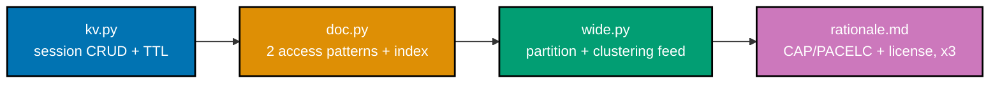

## Goal

Model one domain -- a small e-commerce backend -- across three NoSQL families from Python: a
session/cart cache (Valkey), a product catalog driven by two named access patterns (MongoDB), and an
order-history feed (Cassandra), then close with a written CAP/PACELC + license rationale for each
choice. Every mechanism this capstone combines was already taught, individually, in Examples 77-80 of
this topic's Advanced tier -- `kv.py`, `doc.py`, and `wide.py` extend those exact previewed shapes to
full CRUD, and `rationale.md` formalizes what Example 80 already drafted and verified in code.



## Concepts exercised

- [x] key-value CRUD (co-20) and TTL-based expiry (co-24, co-21) -- `kv.py`
- [x] access-pattern-first document modeling (co-08, co-18) and index-served reads (co-17, co-19) --
      `doc.py`
- [x] a wide-column data model with partition + clustering keys (co-22, co-25) -- `wide.py`
- [x] a CAP/PACELC trade-off stated per store (co-03, co-04) -- `rationale.md`
- [x] a license check recorded per store (co-28) -- `rationale.md`

All colocated code lives under `learning/capstone/code/`: `kv.py`, `doc.py`, `wide.py`, and
`requirements.txt`. Every listing below is the complete, verbatim file -- nothing on this page is
truncated or paraphrased. `rationale.md` lives alongside this page, one level up from `code/`.

## Step 1: `kv.py` -- session-store CRUD against Valkey/Redis

_exercises co-20, co-24, co-21_

Builds directly on Example 77's own preview shape: a namespaced `session:<id>` hash, with a TTL-based
expiry the store itself enforces. This module completes the CRUD Example 77 only half-covered --
`touch_session` (UPDATE: extend the TTL after activity) and `delete_session` (DELETE: an explicit
logout) are new here.

**`learning/capstone/code/kv.py`** (complete file)

```python
"""Capstone Step 1: kv.py -- session-store CRUD against Valkey/Redis (co-20, co-24, co-21).

Builds directly on Example 77's own preview shape: a namespaced "session:<id>" hash, with
a TTL-based expiry the store itself enforces -- no scheduled cleanup job needed. This module
adds the two operations Example 77 did not need: an explicit UPDATE (extend a session's TTL
after activity) and an explicit DELETE (an explicit logout), completing full CRUD.
"""
from __future__ import annotations

import time  # => a real sleep past the TTL window, the same discipline Example 77 established
from typing import cast  # => reconciles redis-py's own dict[bytes | str, bytes | str] stub with the guaranteed-str runtime shape below

import redis  # => redis-py, the official typed Python client for Valkey/Redis (BSD-3-Clause, co-28)

SESSION_KEY_PREFIX = "session:"  # => a namespaced key convention -- every session lives under this prefix


def _session_key(session_id: str) -> str:
    """Build the namespaced key for one session -- the single place this convention is spelled out."""
    return f"{SESSION_KEY_PREFIX}{session_id}"


def create_session(client: redis.Redis, session_id: str, user_id: str, ttl_seconds: int) -> None:
    """CREATE: a session as a Redis hash, with a TTL-based expiry (Example 77's own shape)."""
    key = _session_key(session_id)
    client.hset(key, mapping={"user_id": user_id, "created_at": str(int(time.time()))})  # => a hash, not a plain string
    client.expire(key, ttl_seconds)  # => self-expiring -- no scheduled cleanup job required


def get_session(client: redis.Redis, session_id: str) -> dict[str, str] | None:
    """READ: a session hash back, or None if it has expired or never existed."""
    key = _session_key(session_id)
    data = client.hgetall(key)  # => an EMPTY dict means the key does not exist (expired or never created)
    if not data:  # => this IS the "not found" signal -- Redis never raises for a missing key
        return None
    return cast(dict[str, str], data)  # => decode_responses=True (below) guarantees str keys/values at runtime; the cast narrows redis-py's broader dict[bytes | str, bytes | str] stub to match


def touch_session(client: redis.Redis, session_id: str, extra_ttl_seconds: int) -> bool:
    """UPDATE: extend a session's TTL after activity -- returns False if the session no longer exists."""
    key = _session_key(session_id)
    if not client.exists(key):  # => refuses to resurrect a session that has already expired
        return False
    client.expire(key, extra_ttl_seconds)  # => resets the TTL countdown -- the "keep me logged in" pattern
    return True


def delete_session(client: redis.Redis, session_id: str) -> None:
    """DELETE: an explicit logout -- removes the session immediately, without waiting on its TTL."""
    client.delete(_session_key(session_id))


def main() -> None:
    """Run a full CRUD + TTL round trip and print a CLI-verifiable report."""
    client = redis.Redis(host="localhost", port=6379, db=0, decode_responses=True)  # => decode_responses=True: values come back as str, not bytes
    client.delete(_session_key("sess-cap-1"))  # => resets state -- this script is fully self-contained

    create_session(client, "sess-cap-1", "user-42", ttl_seconds=60)  # => CREATE
    created = get_session(client, "sess-cap-1")  # => READ, right after creation
    assert created is not None and created["user_id"] == "user-42"
    print(f"CREATE + READ:  {created}")

    touched = touch_session(client, "sess-cap-1", extra_ttl_seconds=120)  # => UPDATE: extends the TTL
    assert touched is True
    print(f"UPDATE (touch): extended={touched}")

    delete_session(client, "sess-cap-1")  # => DELETE: an explicit logout
    deleted = get_session(client, "sess-cap-1")  # => READ after DELETE -- must be gone immediately
    assert deleted is None
    print(f"DELETE + READ:  {deleted}")

    create_session(client, "sess-cap-2", "user-99", ttl_seconds=3)  # => a SECOND session, short TTL
    time.sleep(4)  # => waits PAST the 3-second TTL -- a genuine elapsed expiry, not a mocked clock
    expired = get_session(client, "sess-cap-2")
    assert expired is None
    print(f"TTL expiry:     {expired} (after the 3-second TTL elapsed on its own)")

    print("kv.py: full CREATE/READ/UPDATE/DELETE + TTL-expiry round trip PASSED")
    client.close()


if __name__ == "__main__":
    main()
```

**Verify**

```text
$ python3 kv.py
CREATE + READ:  {'user_id': 'user-42', 'created_at': '1785102291'}
UPDATE (touch): extended=True
DELETE + READ:  None
TTL expiry:     None (after the 3-second TTL elapsed on its own)
kv.py: full CREATE/READ/UPDATE/DELETE + TTL-expiry round trip PASSED
$ pyright kv.py
0 errors, 0 warnings, 0 informations
```

`created_at` is a real, machine-dependent Unix timestamp -- what matters for correctness is the full
round trip: CREATE succeeds, READ returns it, UPDATE extends it, DELETE removes it immediately, and a
SEPARATE session's own TTL expires it automatically, with no explicit DELETE at all.

## Step 2: `doc.py` -- a product catalog shaped by two named access patterns

_exercises co-08, co-17, co-19_

Builds directly on Example 78's own preview shape: fields chosen FROM the two named access patterns,
not the other way around, with a compound index verified index-served via `.explain()`. This module
adds `update_stock`, a realistic write pattern 1's own `stock_level` field exists to support.

**`learning/capstone/code/doc.py`** (complete file)

```python
"""Capstone Step 2: doc.py -- a product catalog shaped by two named access patterns (co-08, co-17, co-19).

Builds directly on Example 78's own preview shape: fields chosen FROM the access patterns,
not the other way around, with a compound index that makes both patterns index-served,
verified via `.explain()` rather than assumed. This module adds `update_stock`, a realistic
write path pattern 1's own field (`stock_level`) exists to support.
"""
from __future__ import annotations

from typing import Any  # => pymongo's own documents are untyped dicts -- Any is the honest, pymongo-recommended document type

from pymongo import MongoClient  # => the official typed Python driver (Apache-2.0, co-28)

Document = dict[str, Any]  # => pymongo's own convention for "a MongoDB document" -- every field's own type varies per-document

# The capstone's two named access patterns (co-08) -- every field in seed_products exists to serve one of these.
ACCESS_PATTERN_1 = "fetch a product with its current stock level"
ACCESS_PATTERN_2 = "fetch every product in a given category, cheapest first"
COLLECTION_NAME = "capstone_products"


def seed_products(client: MongoClient[Document]) -> None:
    """Seed a small catalog, with indexes chosen to serve BOTH named access patterns."""
    collection = client["nosqldb"][COLLECTION_NAME]
    collection.delete_many({})  # => resets state -- this script is fully self-contained
    collection.insert_many([
        {"sku": "sku-1", "category": "electronics", "price": 29.99, "stock_level": 12},
        {"sku": "sku-2", "category": "electronics", "price": 9.99, "stock_level": 0},
        {"sku": "sku-3", "category": "books", "price": 14.50, "stock_level": 40},
        {"sku": "sku-4", "category": "books", "price": 6.75, "stock_level": 5},
    ])
    collection.create_index("sku")  # => serves pattern 1: a single-document lookup by sku
    collection.create_index([("category", 1), ("price", 1)])  # => serves pattern 2: category-then-price, pre-sorted


def fetch_product_with_stock(client: MongoClient[Document], sku: str) -> tuple[bool, int]:
    """Answer pattern 1: fetch a product with its stock level, via an index-served single-document read."""
    collection = client["nosqldb"][COLLECTION_NAME]
    explanation: Document = collection.find({"sku": sku}).explain()  # => confirms the query is genuinely INDEX-served
    index_served: bool = explanation["queryPlanner"]["winningPlan"]["stage"] == "FETCH"  # => FETCH-from-IXSCAN means the sku index was used
    doc = collection.find_one({"sku": sku})
    assert doc is not None
    return index_served, doc["stock_level"]


def fetch_category_cheapest_first(client: MongoClient[Document], category: str) -> tuple[bool, list[float]]:
    """Answer pattern 2: fetch a category's products cheapest-first, via an index-served, pre-sorted read."""
    collection = client["nosqldb"][COLLECTION_NAME]
    cursor = collection.find({"category": category}).sort("price", 1)  # => the compound index ALREADY sorts by price
    explanation: Document = collection.find({"category": category}).sort("price", 1).explain()  # => confirms index usage
    index_served: bool = "IXSCAN" in str(explanation["queryPlanner"]["winningPlan"])  # => a simple, honest presence check
    prices: list[float] = [doc["price"] for doc in cursor]  # => extracts prices in RETURN order -- already sorted by the index
    return index_served, prices


def update_stock(client: MongoClient[Document], sku: str, new_stock_level: int) -> None:
    """A realistic write: adjust a product's stock level -- the exact field pattern 1 reads back."""
    collection = client["nosqldb"][COLLECTION_NAME]
    collection.update_one({"sku": sku}, {"$set": {"stock_level": new_stock_level}})


def main() -> None:
    """Seed the catalog, answer both access patterns, verify each is index-served, and print a report."""
    client: MongoClient[Document] = MongoClient("mongodb://localhost:27017")
    print(f"Pattern 1: {ACCESS_PATTERN_1}")
    print(f"Pattern 2: {ACCESS_PATTERN_2}")

    seed_products(client)

    p1_indexed, stock = fetch_product_with_stock(client, "sku-1")
    assert p1_indexed is True
    assert stock == 12
    print(f"Pattern 1 result: index-served={p1_indexed}, stock_level={stock}")

    update_stock(client, "sku-1", new_stock_level=11)  # => a real write, simulating one unit sold
    _p1_indexed_again, stock_after_sale = fetch_product_with_stock(client, "sku-1")
    assert stock_after_sale == 11  # => the write round-tripped correctly through the same index-served read
    print(f"After update_stock: stock_level={stock_after_sale}")

    p2_indexed, prices = fetch_category_cheapest_first(client, "electronics")
    assert p2_indexed is True
    assert prices == [9.99, 29.99]
    print(f"Pattern 2 result: index-served={p2_indexed}, prices={prices}")

    print("doc.py: both named access patterns are index-served and return the expected data -- PASSED")
    client.close()


if __name__ == "__main__":
    main()
```

**Verify**

```text
$ python3 doc.py
Pattern 1: fetch a product with its current stock level
Pattern 2: fetch every product in a given category, cheapest first
Pattern 1 result: index-served=True, stock_level=12
After update_stock: stock_level=11
Pattern 2 result: index-served=True, prices=[9.99, 29.99]
doc.py: both named access patterns are index-served and return the expected data -- PASSED
$ pyright doc.py
0 errors, 0 warnings, 0 informations
```

Both named access patterns are verified `index_served=True` via `.explain()`, not merely assumed, and
`update_stock`'s write round-trips correctly through the very same index-served read pattern 1 uses.

## Step 3: `wide.py` -- an order-history feed, partitioned by customer

_exercises co-22, co-25_

Builds directly on Example 79's own preview shape: `customer_id` partitions, `order_time` clusters
DESC. This module adds a SECOND customer to prove partition isolation -- a property Example 79's own
single-customer preview could not demonstrate.

**`learning/capstone/code/wide.py`** (complete file)

```python
"""Capstone Step 3: wide.py -- an order-history feed, partitioned by customer (co-22, co-25).

Builds directly on Example 79's own preview shape: customer_id partitions, order_time
clusters DESC, so "this customer's history, newest first" is a single-partition, already-sorted
scan -- the canonical Cassandra access pattern for any per-entity timeline. This module adds a
SECOND customer to prove partition isolation: cust-2's own history never leaks into cust-1's read.
"""
from __future__ import annotations

from cassandra.cluster import Cluster, Session  # => the Apache Software Foundation-maintained Python driver (Apache-2.0, co-28)

TABLE_NAME = "capstone_orders"


def setup_order_history_table(session: Session) -> None:
    """Create the order-history table: partition by customer, cluster by order time, newest first."""
    session.execute(
        "CREATE KEYSPACE IF NOT EXISTS nosqldb WITH replication = "
        "{'class': 'SimpleStrategy', 'replication_factor': 1}"
    )
    session.set_keyspace("nosqldb")
    session.execute(f"DROP TABLE IF EXISTS {TABLE_NAME}")  # => resets state -- this script is fully self-contained
    session.execute(
        f"CREATE TABLE {TABLE_NAME} ("
        "customer_id text, "
        "order_time timestamp, "
        "amount double, "
        "PRIMARY KEY ((customer_id), order_time)"
        ") WITH CLUSTERING ORDER BY (order_time DESC)"  # => newest order first -- the dominant read this table serves
    )


def insert_order(session: Session, customer_id: str, order_time: str, amount: float) -> None:
    """Append one order -- a cheap, sequential write, exactly the shape an LSM-tree-backed store favors."""
    session.execute(
        f"INSERT INTO {TABLE_NAME} (customer_id, order_time, amount) VALUES (%s, %s, %s)",
        (customer_id, order_time, amount),
    )


def fetch_order_history(session: Session, customer_id: str) -> list[float]:
    """A single-partition scan, already clustering-ordered (newest order_time first)."""
    rows = list(session.execute(f"SELECT order_time, amount FROM {TABLE_NAME} WHERE customer_id = %s", (customer_id,)))
    return [row.amount for row in rows]  # => extracts amounts in RETURN (clustering) order


def main() -> None:
    """Seed two customers' out-of-order orders, then verify each partition reads back correctly isolated."""
    cluster = Cluster(["127.0.0.1"], port=9042)
    session = cluster.connect()
    setup_order_history_table(session)

    cust_1_orders = [  # => deliberately out of time order -- clustering order is enforced by the STORE
        ("cust-1", "2026-07-27 09:00:00", 20.0),
        ("cust-1", "2026-07-27 09:30:00", 35.5),
        ("cust-1", "2026-07-27 09:15:00", 12.0),
        ("cust-1", "2026-07-27 09:45:00", 8.25),
    ]
    cust_2_orders = [  # => a SECOND customer -- a DIFFERENT partition, to prove isolation below
        ("cust-2", "2026-07-27 10:00:00", 50.0),
        ("cust-2", "2026-07-27 10:10:00", 15.0),
    ]
    for customer_id, order_time, amount in cust_1_orders + cust_2_orders:
        insert_order(session, customer_id, order_time, amount)

    cust_1_history = fetch_order_history(session, "cust-1")
    assert cust_1_history == [8.25, 35.5, 12.0, 20.0]  # => clustering-ordered (newest first), NOT insert-ordered
    print(f"cust-1 order history, newest first: {cust_1_history}")

    cust_2_history = fetch_order_history(session, "cust-2")
    assert cust_2_history == [15.0, 50.0]  # => cust-2's OWN partition, newest first
    print(f"cust-2 order history, newest first: {cust_2_history}")

    assert set(cust_1_history).isdisjoint(cust_2_history)  # => partition isolation: no amount leaked across partitions
    print("wide.py: both customer partitions return correctly-ordered, correctly-isolated history -- PASSED")
    cluster.shutdown()


if __name__ == "__main__":
    main()
```

**Verify**

```text
$ python3 wide.py
cust-1 order history, newest first: [8.25, 35.5, 12.0, 20.0]
cust-2 order history, newest first: [15.0, 50.0]
wide.py: both customer partitions return correctly-ordered, correctly-isolated history -- PASSED
$ pyright wide.py
0 errors, 0 warnings, 0 informations
```

Both partitions read back correctly clustering-ordered (newest first, despite out-of-order inserts),
and `cust-1`'s and `cust-2`'s own amounts are disjoint -- proof that one partition's data never leaks
into a read scoped to a different partition.

## Step 4: `rationale.md` -- per-store CAP/PACELC + license

_exercises co-03, co-04, co-28_

The full, formalized rationale -- one section per store, plus a summary table -- lives at
[rationale.md](./rationale.md), the capstone's fourth and final ordered step. It states, for Valkey,
MongoDB, and Cassandra, the access pattern that justifies the choice, the CAP/PACELC position, and the
exact, checked license, closing the loop Example 80 already opened.

## Acceptance criteria

- All three stores are exercised from Python with correct results: `kv.py`'s CRUD + TTL round trip,
  `doc.py`'s two index-served access patterns plus a real stock-level write, and `wide.py`'s two-customer
  partition-isolated feed -- every one verified against a real, live local Docker container (Valkey 8,
  MongoDB 8.2, Cassandra 5.0), not a mock.
- Each modeling choice is justified by an access pattern, stated explicitly in `rationale.md`: session
  CRUD justifies Valkey, two named catalog reads justify MongoDB's indexes, and per-customer order
  history justifies Cassandra's partition+clustering key design.
- The license of each product is named and checked in `rationale.md`: BSD-3-Clause (Valkey), SSPLv1 --
  NOT OSI-approved (MongoDB), Apache License 2.0 (Cassandra) -- matching the accuracy notes' own
  citations (Examples 25-27).
- `pyright kv.py`, `pyright doc.py`, and `pyright wide.py` (run from inside `learning/capstone/code/`,
  which is where this course's own `pyrightconfig.json` applies its `strict` mode) each report `0
errors, 0 warnings, 0 informations`.
- Every listing on this page (`kv.py`, `doc.py`, `wide.py`) is the complete file, runnable exactly as
  shown -- nothing here is a fragment that depends on code the page does not also show.

## Done bar

This capstone is runnable end to end: a reader who copies `kv.py`, `doc.py`, and `wide.py` into a
`learning/capstone/code/`-shaped tree, starts a local Valkey 8, MongoDB 8.2 (replica set), and Cassandra
5.0 container, runs each script with `python3`, and reads `rationale.md` reaches the identical output
blocks shown in Steps 1 through 3, verified against real running services (not merely described). Every
mechanism combined here -- key-value CRUD with TTL (co-20, co-24, co-21), access-pattern-first document
modeling with a verified index (co-08, co-17, co-19), a wide-column partition+clustering model (co-22,
co-25), and a stated CAP/PACELC + license rationale per store (co-03, co-04, co-28) -- traces to
mechanisms already taught individually in this topic's Beginner, Intermediate, and Advanced tiers; no
new fact was needed to write this page.

---

&larr; Previous: [OLAP and Columnar Analytics Examples](../olap-and-columnar-analytics.md)
