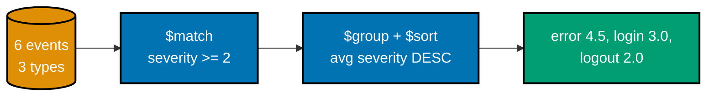
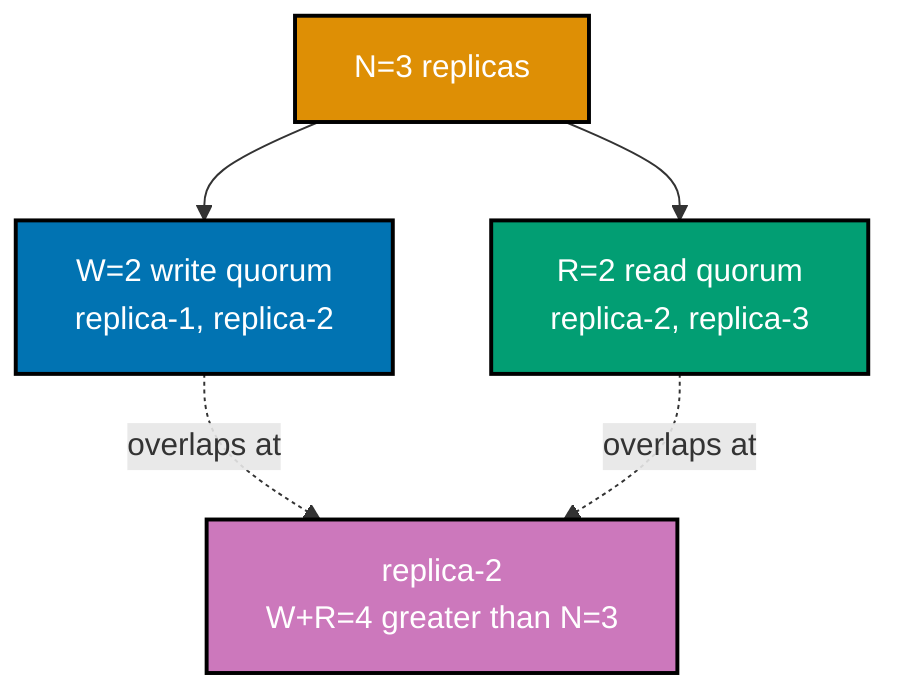
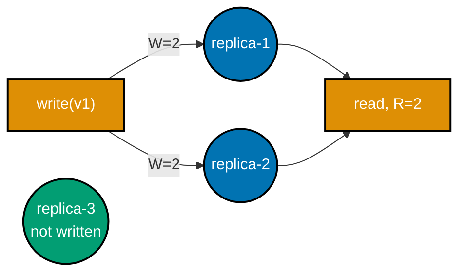
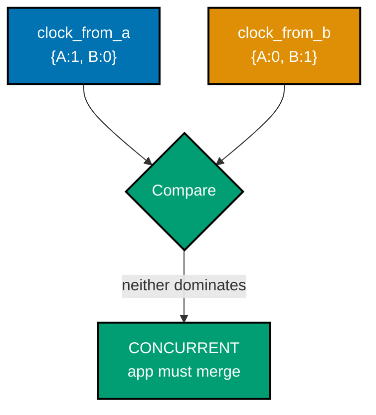
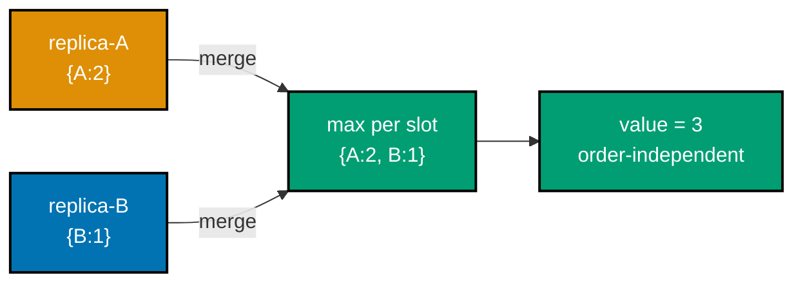
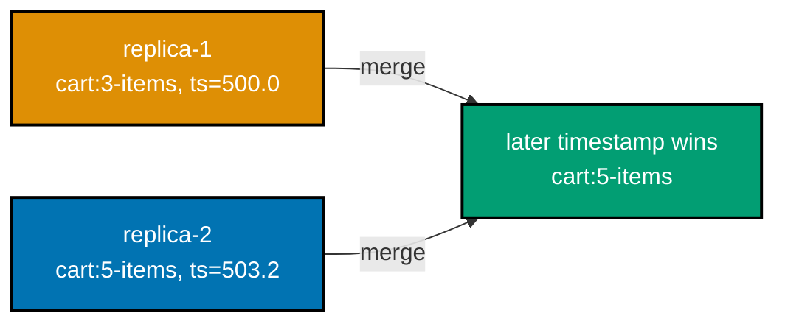
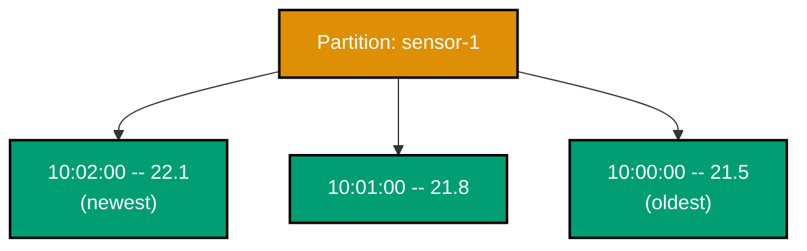
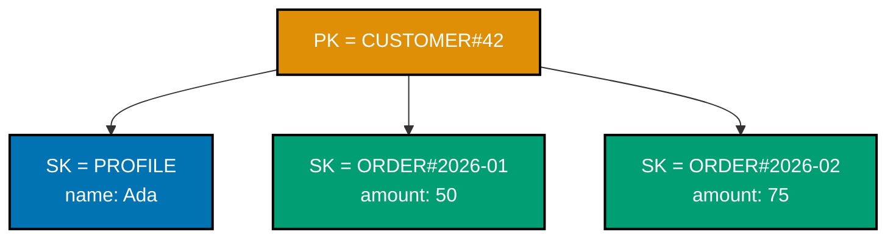
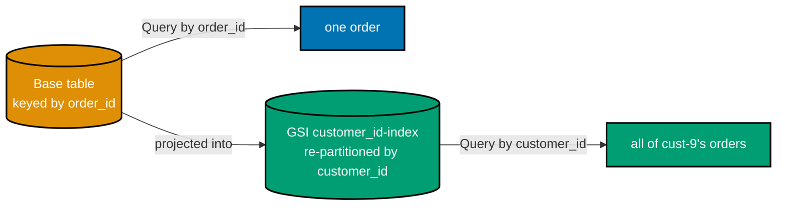
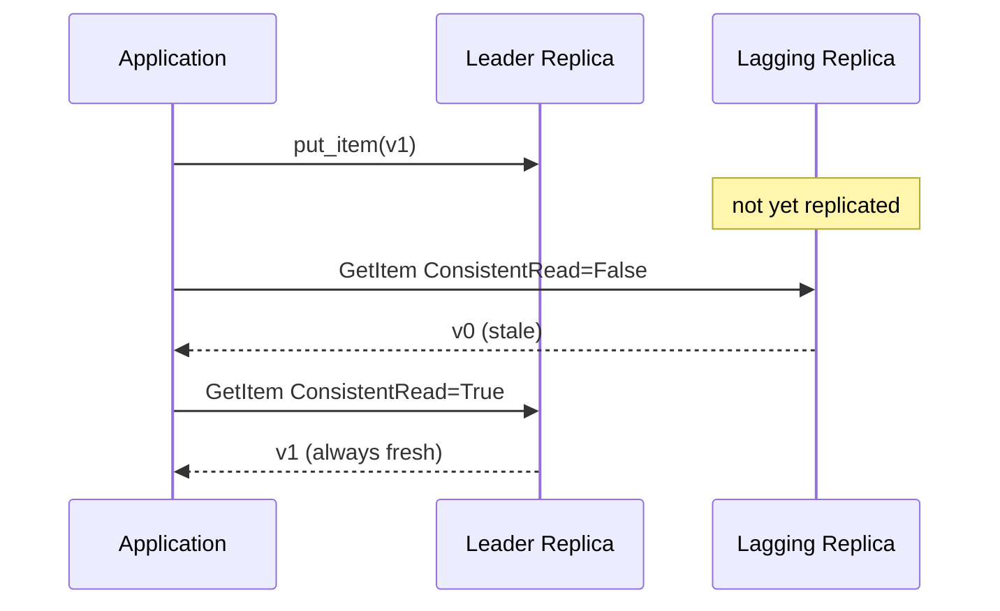

Examples 28-54 build on the Beginner band's single-store basics: Redis transactions and optimistic
locking, MongoDB's aggregation pipeline and multi-document transactions and compound/covered indexes,
tunable quorum consistency (the math, then Cassandra's own knobs), leaderless replication and the
three ways NoSQL stores resolve or detect concurrent writes (LWW, vector clocks, CRDTs), Cassandra's
partition-key discipline, and DynamoDB's key-value/composite-key/single-table/GSI/TTL/consistency
model via `boto3`. Redis, MongoDB (now a single-node replica set so multi-document transactions work),
and Cassandra examples run against real local Docker containers; DynamoDB examples run against the
official `amazon/dynamodb-local` image. Four examples (40-44) are pure-Python simulations, chosen
deliberately for self-contained determinism -- see each one's own note on why.

---

### Example 28: Redis MULTI/EXEC Transaction

_ex-28 &middot; exercises co-27_

`MULTI` queues a batch of commands; `EXEC` applies them all back-to-back with no other client's
command interleaved -- but note the caveat: it is atomic application, not ACID-style rollback on error.

**`learning/code/ex-28-redis-transaction-multi-exec/example.py`**

```python
"""Example 28: Redis Transaction MULTI/EXEC."""  # => co-27: this file's own purpose, doubling as its module __doc__
from __future__ import annotations  # => hygiene: postpones annotation evaluation, interpreter-version-agnostic

import redis  # => co-27: redis-py, the official typed Python client for Valkey/Redis


def transfer_atomically(client: redis.Redis, from_key: str, to_key: str, amount: int) -> None:  # => co-27: moves amount atomically
    """Move amount from from_key to to_key inside a MULTI/EXEC transaction."""  # => documents the contract
    pipe = client.pipeline(transaction=True)  # => co-27: transaction=True queues commands, then EXECs them as one unit
    pipe.multi()  # => co-27: MULTI -- starts queuing, no command below runs yet
    pipe.decrby(from_key, amount)  # => co-27: QUEUED, not yet applied -- decrements the source balance
    pipe.incrby(to_key, amount)  # => co-27: QUEUED, not yet applied -- increments the destination balance
    pipe.execute()  # => co-27: EXEC -- both queued commands apply together, back-to-back, no other client's write interleaves
    # => note (co-27): EXEC does NOT roll back on a runtime error inside the block -- a queued command
    # => that fails at execution time (e.g. wrong type) still lets the OTHER queued commands apply;
    # => MULTI/EXEC buys ATOMIC APPLICATION of a queued batch, not ACID-style all-or-nothing rollback


def main() -> None:  # => entry point -- runs only when this file executes directly, not on import
    client = redis.Redis(host="localhost", port=6379, db=0)  # => connects to a local Valkey/Redis instance
    client.delete("wallet:alice", "wallet:bob")  # => resets state -- this example is fully self-contained
    client.set("wallet:alice", 100)  # => alice starts with 100
    client.set("wallet:bob", 50)  # => bob starts with 50

    transfer_atomically(client, "wallet:alice", "wallet:bob", 30)  # => co-27: moves 30 from alice to bob atomically

    alice_raw = client.get("wallet:alice")  # => reads alice's post-transfer balance, as bytes | None
    bob_raw = client.get("wallet:bob")  # => reads bob's post-transfer balance, as bytes | None
    assert alice_raw is not None and bob_raw is not None  # => both keys were SET above -- narrows away the None case for int()
    alice_balance = int(alice_raw)  # => decodes the raw bytes reply into a plain int
    bob_balance = int(bob_raw)  # => decodes the raw bytes reply into a plain int
    assert alice_balance == 70  # => co-27: 100 - 30 == 70, the debit applied
    assert bob_balance == 80  # => co-27: 50 + 30 == 80, the credit applied -- BOTH updates landed together
    print(f"After MULTI/EXEC transfer: alice={alice_balance} bob={bob_balance}")  # => Output: After MULTI/EXEC transfer: alice=70 bob=80
    client.close()  # => always release what you open


if __name__ == "__main__":  # => guards against running main() on `import example`
    main()  # => runs everything above when executed as a script
```

**Run**: `python3 example.py` (representative output, run against `redis==8.0.1` and a local Valkey 8 Docker container)

**Output**:

```text
After MULTI/EXEC transfer: alice=70 bob=80
```

**Key takeaway**: `MULTI`/`EXEC` guarantees no other client's command lands between the queued
commands -- it does not guarantee rollback if one queued command fails at runtime, which is a real gap
compared to a relational transaction.

**Why it matters**: Any operation that must touch two Redis keys together (a transfer, a counter pair,
a denormalized duplicate) needs this atomicity guarantee -- without it, a crash or a slow client
between the two writes leaves one side updated and the other stale, a genuinely corrupt state no read
can detect after the fact. Example 29 layers optimistic locking on top of it, and Example 72 (Advanced
tier) measures its added latency cost directly against the non-transactional path.

---

### Example 29: Redis WATCH Optimistic Lock

_ex-29 &middot; exercises co-27_

`WATCH` flags a key; if that key changes before `EXEC` runs, the whole transaction aborts with a nil
reply -- the classic optimistic-concurrency pattern, retried by the caller rather than blocked.

**`learning/code/ex-29-redis-watch-optimistic-lock/example.py`**

```python
"""Example 29: Redis WATCH Optimistic Lock."""  # => co-27: this file's own purpose, doubling as its module __doc__
from __future__ import annotations  # => hygiene: postpones annotation evaluation, interpreter-version-agnostic

import redis  # => co-27: redis-py, the official typed Python client
from redis.exceptions import WatchError  # => co-27: redis-py raises WatchError when a watched key changed


def try_transfer_with_watch(client: redis.Redis, key: str, amount: int, tamper: bool) -> bool:  # => co-27: returns True if the tx committed
    """Attempt a WATCH-guarded transfer; optionally tamper the watched key mid-flight to force an abort."""  # => documents contract
    with client.pipeline() as pipe:  # => a fresh pipeline per attempt, matching real optimistic-locking retry loops
        pipe.watch(key)  # => co-27: WATCH -- flags this key; if it changes before EXEC, the transaction aborts
        if tamper:  # => simulates ANOTHER client concurrently modifying the watched key between WATCH and EXEC
            client.incr(key)  # => co-27: a concurrent write on the SAME key this pipeline is watching
        pipe.multi()  # => co-27: MULTI -- starts queuing, still inside the SAME watched pipeline
        pipe.decrby(key, amount)  # => co-27: QUEUED -- will only apply if the watched key stayed untouched
        try:  # => catches ONLY the WatchError EXEC raises on a detected race, nothing else
            pipe.execute()  # => co-27: EXEC -- aborts (raises WatchError) if the watched key changed since WATCH
            return True  # => the transaction committed -- the watched key was untouched by anyone else
        except WatchError:  # => co-27: redis-py surfaces the server's nil EXEC reply as this exception
            return False  # => the transaction aborted -- optimistic concurrency correctly detected the race


def main() -> None:  # => entry point -- runs only when this file executes directly, not on import
    client = redis.Redis(host="localhost", port=6379, db=0)  # => connects to a local Valkey/Redis instance
    client.set("inventory:sku-42", 100)  # => resets state -- this example is fully self-contained

    committed_clean = try_transfer_with_watch(client, "inventory:sku-42", 10, tamper=False)  # => co-27: no interference -- should commit
    assert committed_clean is True  # => co-27: WATCH saw no change, so EXEC applied the queued DECRBY
    print(f"No interference: transaction committed = {committed_clean}")  # => Output: No interference: transaction committed = True

    committed_tampered = try_transfer_with_watch(client, "inventory:sku-42", 10, tamper=True)  # => co-27: tampers the SAME key mid-flight
    assert committed_tampered is False  # => co-27: WATCH caught the concurrent INCR, EXEC returned nil, redis-py raised WatchError
    print(f"Concurrent write during WATCH: transaction committed = {committed_tampered}")  # => Output: Concurrent write during WATCH: transaction committed = False
    client.close()  # => always release what you open


if __name__ == "__main__":  # => guards against running main() on `import example`
    main()  # => runs everything above when executed as a script
```

**Run**: `python3 example.py` (representative output, run against `redis==8.0.1` and a local Valkey 8 Docker container)

**Output**:

```text
No interference: transaction committed = True
Concurrent write during WATCH: transaction committed = False
```

**Key takeaway**: `WATCH` implements optimistic, not pessimistic, concurrency -- the transaction never
blocks waiting for the key to become free; it proceeds hopefully and aborts if it turns out another
client won the race, leaving the caller to retry.

**Why it matters**: This is the standard Redis pattern for a compare-and-swap-style update (an
inventory decrement, a counter that must not go negative) without a distributed lock -- skip it and two
concurrent decrements can both read the same starting value and silently overwrite each other's result,
selling more inventory than actually exists. co-27's whole category of NoSQL-added-transactions traces
back to exactly this kind of primitive, and a caller must be prepared to retry on `WatchError` rather
than treat the abort as a hard failure.

---

### Example 30: Redis Pipeline vs. Transaction

_ex-30 &middot; exercises co-27_

**Comparison**: a plain pipeline (`transaction=False`) batches network round trips with no atomicity
guarantee; `MULTI`/`EXEC` (`transaction=True`) batches the SAME commands but guarantees no other
client's write can land between them.

**`learning/code/ex-30-redis-pipeline-vs-transaction/example.py`**

```python
"""Example 30: Redis Pipeline vs. Transaction."""  # => co-27: this file's own purpose, doubling as its module __doc__
from __future__ import annotations  # => hygiene: postpones annotation evaluation, interpreter-version-agnostic

import threading  # => co-27: simulates a concurrent client interleaving with a plain pipeline's commands
import time  # => co-27: a tiny sleep opens a genuine interleaving window for the race demonstration

import redis  # => co-27: redis-py, the official typed Python client


def run_plain_pipeline(client: redis.Redis, key: str) -> None:  # => co-27: NO transaction=True -- commands can interleave with others
    """Queue two commands in a NON-transactional pipeline (transaction=False)."""  # => documents the contract
    pipe = client.pipeline(transaction=False)  # => co-27: transaction=False -- batches network round trips only, NO atomicity
    pipe.set(key, "step-1")  # => queued, sent in the same batch, but NOT wrapped in MULTI/EXEC
    time.sleep(0.05)  # => co-27: an artificial gap -- a real pipeline batches sends, but the SERVER can still interleave other clients' commands between these two
    pipe.set(key, "step-2")  # => queued, sent in the same batch
    pipe.execute()  # => co-27: sends the batch -- but nothing here PREVENTED another client from writing key in between


def run_multi_exec(client: redis.Redis, key: str) -> None:  # => co-27: WITH transaction=True -- genuinely atomic application
    """Queue the SAME two commands inside MULTI/EXEC (transaction=True)."""  # => documents the contract
    pipe = client.pipeline(transaction=True)  # => co-27: transaction=True -- wraps the batch in MULTI/EXEC
    pipe.multi()  # => co-27: MULTI -- starts queuing
    pipe.set(key, "step-1")  # => QUEUED, not yet applied
    pipe.set(key, "step-2")  # => QUEUED, not yet applied
    pipe.execute()  # => co-27: EXEC -- both apply back-to-back, no other client's write can land between them


def concurrent_interferer(client: redis.Redis, key: str) -> None:  # => a second "client" racing against run_plain_pipeline
    """Sleep briefly, then overwrite key -- simulating a concurrent client racing the pipeline."""  # => documents contract
    time.sleep(0.02)  # => times this write to land INSIDE run_plain_pipeline's artificial 0.05s gap above
    client.set(key, "interloper")  # => co-27: a genuinely concurrent write landing mid-pipeline


def main() -> None:  # => entry point -- runs only when this file executes directly, not on import
    client = redis.Redis(host="localhost", port=6379, db=0)  # => connects to a local Valkey/Redis instance

    # --- Plain pipeline: interference CAN show through, because there is no MULTI/EXEC boundary ---
    client.set("demo:pipeline", "start")  # => resets state for the pipeline case
    interferer = threading.Thread(target=concurrent_interferer, args=(client, "demo:pipeline"))  # => a racing second client
    interferer.start()  # => starts racing concurrently with the pipeline below
    run_plain_pipeline(client, "demo:pipeline")  # => co-27: the interloper's write CAN land between "step-1" and "step-2"
    interferer.join()  # => waits for the racing thread to finish before reading the result
    pipeline_raw = client.get("demo:pipeline")  # => reads the raw bytes | str | None reply
    assert pipeline_raw is not None  # => the key was SET above, so a reply always exists -- narrows away None
    pipeline_result = pipeline_raw.decode() if isinstance(pipeline_raw, bytes) else pipeline_raw  # => decodes only if the driver returned raw bytes
    # => whichever write landed LAST wins -- not guaranteed to be "step-2"
    print(f"Plain pipeline final value (order not guaranteed): {pipeline_result}")  # => Output line -- value depends on timing

    # --- MULTI/EXEC: the SAME race, but atomicity means the two queued SETs apply back-to-back ---
    client.set("demo:transaction", "start")  # => resets state for the transaction case
    interferer2 = threading.Thread(target=concurrent_interferer, args=(client, "demo:transaction"))  # => a racing second client
    interferer2.start()  # => starts racing concurrently with the transaction below
    run_multi_exec(client, "demo:transaction")  # => co-27: EXEC applies BOTH queued SETs with no other client's command between them
    interferer2.join()  # => waits for the racing thread to finish before reading the result
    transaction_raw = client.get("demo:transaction")  # => reads the raw bytes | str | None reply
    assert transaction_raw is not None  # => the key was SET above, so a reply always exists -- narrows away None
    transaction_result = transaction_raw.decode() if isinstance(transaction_raw, bytes) else transaction_raw  # => decodes only if the driver returned raw bytes
    # => the interloper's write lands strictly BEFORE or AFTER the whole EXEC, never between step-1 and step-2
    print(f"MULTI/EXEC final value (interloper cannot split the pair): {transaction_result}")  # => Output line
    assert transaction_result in ("step-2", "interloper")  # => co-27: either the interloper won outright, or the atomic pair won outright -- never a torn state
    client.close()  # => always release what you open


if __name__ == "__main__":  # => guards against running main() on `import example`
    main()  # => runs everything above when executed as a script
```

**Run**: `python3 example.py` (representative output, run against `redis==8.0.1` and a local Valkey 8 Docker container)

**Output**:

```text
Plain pipeline final value (order not guaranteed): step-2
MULTI/EXEC final value (interloper cannot split the pair): interloper
```

**Key takeaway**: A plain pipeline's `step-2` winning here is itself a matter of timing, not a
guarantee -- the same race run again could just as easily have the interloper's write land between
`step-1` and `step-2`. `MULTI`/`EXEC`'s guarantee is different in kind: the interloper's write can
never land _between_ the two queued commands, even though it can still win outright before or after.

**Why it matters**: "A pipeline batches network calls" and "a transaction batches atomically" are
genuinely different guarantees that look similar at the API surface -- confusing them is a real source
of subtle production races, especially since a plain pipeline still looks atomic in casual testing
where no concurrent client happens to interleave. Reaching for `transaction=False` purely for the
latency win, without checking whether the operation also needs the `MULTI`/`EXEC` boundary, is exactly
the mistake this example is built to catch before it reaches production.

---

### Example 31: MongoDB $match + $group

_ex-31 &middot; exercises co-19_

An aggregation pipeline's `$match` stage filters documents, then `$group` computes a per-key total --
both stages run server-side, in one round trip, never pulling raw rows to the client to sum in Python.

**`learning/code/ex-31-mongo-aggregation-match-group/example.py`**

```python
"""Example 31: MongoDB Aggregation $match + $group."""  # => co-19: this file's own purpose, doubling as its module __doc__
from __future__ import annotations  # => hygiene: postpones annotation evaluation, interpreter-version-agnostic

from typing import Any  # => enables the explicit MongoClient[dict[str, Any]] type parameter below (DD-39, pyright --strict)

from pymongo import MongoClient  # => co-19: pymongo, the official typed Python driver

Document = dict[str, Any]  # => co-19: pymongo's own convention for "a MongoDB document" -- every field's own type varies per-document


def seed_orders(client: MongoClient[Document]) -> None:  # => a deterministic fixture across 3 categories, one order excluded by status
    """Reset and seed 5 orders across 3 categories, one cancelled (excluded by the pipeline's $match)."""  # => documents contract
    collection = client["nosqldb"]["orders"]  # => co-19: no schema declared for this collection
    collection.delete_many({})  # => resets state -- this example is fully self-contained
    collection.insert_many([  # => co-19: 5 orders, one "cancelled" -- the pipeline below must exclude it
        {"category": "books", "amount": 20, "status": "paid"},  # => books order 1, paid -- counted below
        {"category": "books", "amount": 15, "status": "paid"},  # => books order 2, paid -- counted below
        {"category": "electronics", "amount": 200, "status": "paid"},  # => electronics order 1, paid -- counted below
        {"category": "electronics", "amount": 50, "status": "cancelled"},  # => excluded by $match below
        {"category": "toys", "amount": 30, "status": "paid"},  # => toys' only order, paid -- counted below
    ])  # => 5 orders total, but only 4 are "paid" -- the $match stage must drop exactly 1


def total_paid_per_category(client: MongoClient[Document]) -> dict[str, int]:  # => co-19: server-side aggregate, one round trip
    """Run a $match + $group pipeline computing a per-category paid total."""  # => documents the contract
    collection = client["nosqldb"]["orders"]  # => selects the collection seed_orders just populated
    pipeline = [  # => co-19: a staged pipeline -- each stage's output feeds the next stage's input
        {"$match": {"status": "paid"}},  # => co-19: stage 1 -- keeps only paid orders, drops the cancelled one
        {"$group": {"_id": "$category", "total": {"$sum": "$amount"}}},  # => co-19: stage 2 -- sums amount PER distinct category
    ]  # => 2 stages, run server-side in ONE round trip -- no client-side filtering or summing needed
    results = list(collection.aggregate(pipeline))  # => co-19: ONE round trip runs the WHOLE pipeline server-side
    return {doc["_id"]: doc["total"] for doc in results}  # => reshapes the cursor into a plain category->total dict


def main() -> None:  # => entry point -- runs only when this file executes directly, not on import
    client = MongoClient("mongodb://localhost:27017")  # => connects to a local MongoDB instance
    seed_orders(client)  # => sets up the 5-order, 3-category fixture
    totals = total_paid_per_category(client)  # => runs the $match + $group aggregation
    assert totals == {"books": 35, "electronics": 200, "toys": 30}  # => co-19: cancelled electronics order correctly excluded
    for category in sorted(totals):  # => co-19: prints the aggregate result, sorted for deterministic output
        print(f"{category}: {totals[category]}")  # => Output line, one per category
    client.close()  # => always release what you open


if __name__ == "__main__":  # => guards against running main() on `import example`
    main()  # => runs everything above when executed as a script
```

**Run**: `python3 example.py` (representative output, run against `pymongo==4.17.0` and a local MongoDB 8.2.12 Docker
replica-set container)

**Output**:

```text
books: 35
electronics: 200
toys: 30
```

**Key takeaway**: `$match` should be placed as early in the pipeline as possible, exactly like a
relational `WHERE` before a `GROUP BY` -- it lets MongoDB discard non-matching documents before the
more expensive `$group` stage ever sees them.

**Why it matters**: `$match` + `$group` is the aggregation pipeline's most common shape and the direct
analogue of `SELECT ... WHERE ... GROUP BY` -- pulling every raw document to the client and summing in
Python instead wastes network bandwidth and CPU on rows the query never needed, a mistake that scales
badly as collection size grows. Examples 32 and 33 extend the same staged-pipeline idea with a
server-side join and a 3-stage chain, so the mental model built here carries forward directly.

---

### Example 32: MongoDB $lookup Correlated Subquery

_ex-32 &middot; exercises co-19_

`$lookup` joins two collections server-side, in one round trip. The plain `localField`/`foreignField`
equality-join form predates MongoDB 5.0 by several major versions and is not itself correlated -- per
MongoDB's own docs, the **correlated subquery** form requires adding `let` and a `pipeline` alongside
`localField`/`foreignField`, available starting in MongoDB 5.0. This example demonstrates that
correlated form: each author's own `min_year` field drives a per-document filter on her joined books,
contrasted directly against Example 12's manual, client-side, two-query join.

**`learning/code/ex-32-mongo-aggregation-lookup-join/example.py`**

```python
"""Example 32: MongoDB Aggregation $lookup Correlated Subquery."""  # => co-19: this file's own purpose, doubling as its module __doc__
from __future__ import annotations  # => hygiene: postpones annotation evaluation, interpreter-version-agnostic

from typing import Any  # => enables the explicit MongoClient[dict[str, Any]] type parameter below (DD-39, pyright --strict)

from pymongo import MongoClient  # => co-19: pymongo, the official typed Python driver

Document = dict[str, Any]  # => co-19: pymongo's own convention for "a MongoDB document" -- every field's own type varies per-document


def seed_authors_and_books(client: MongoClient[Document]) -> None:  # => two collections, joined server-side below
    """Reset and seed 2 authors (each with its own min_year floor) and 3 books, referencing authors by name."""  # => documents the contract
    authors = client["nosqldb"]["authors"]  # => the "one" side of the relation
    books = client["nosqldb"]["books"]  # => the "many" side of the relation
    authors.delete_many({})  # => resets state -- this example is fully self-contained
    books.delete_many({})  # => resets the books side too
    authors.insert_many([  # => co-19: 2 authors, each carries its OWN min_year -- the correlated pipeline reads this per-author
        {"name": "Ada", "min_year": 2015},  # => Ada's floor excludes her own older book, seeded below
        {"name": "Grace", "min_year": 1950},  # => Grace's floor is low enough to keep her only book
    ])  # => 2 authors seeded, each with a different min_year threshold
    books.insert_many([  # => co-19: 3 books, "author" is the join key, "year" is what the correlated pipeline filters on
        {"title": "NoSQL 101", "author": "Ada", "year": 2020},  # => Ada's book 1 -- published AFTER her min_year (2015), so it survives the filter
        {"title": "CAP Theorem Explained", "author": "Ada", "year": 2010},  # => Ada's book 2 -- published BEFORE her min_year (2015), the pipeline drops it
        {"title": "Compilers 101", "author": "Grace", "year": 1957},  # => Grace's only book -- published after her low min_year (1950), survives
    ])  # => 3 books seeded; a plain equality join would return all 3, the correlated pipeline below returns only 2


def authors_with_recent_books(client: MongoClient[Document]) -> list[Document]:  # => co-19: a server-side CORRELATED subquery, one round trip
    """Run a $lookup pipeline attaching only each author's own books published at/after her own min_year."""  # => documents the contract
    authors = client["nosqldb"]["authors"]  # => the collection $lookup pipelines FROM
    pipeline = [  # => co-19: MongoDB 5.0+ correlated $lookup syntax -- localField/foreignField PLUS let/pipeline together
        {  # => stage 1 -- the whole $lookup stage dict starts here
            "$lookup": {  # => co-19: the server-side join stage -- no separate client-side query needed
                "from": "books",  # => co-19: the FOREIGN collection to join against
                "localField": "name",  # => co-19: still runs the automatic name == author equality match first
                "foreignField": "author",  # => co-19: the foreign collection's field matched against localField
                "let": {"min_year": "$min_year"},  # => co-19: captures THIS author's own min_year, exposed to the sub-pipeline as $$min_year
                "pipeline": [  # => co-19: the sub-pipeline is what makes this a CORRELATED subquery, not a plain equality join
                    {"$match": {"$expr": {"$gte": ["$year", "$$min_year"]}}},  # => co-19: keeps only books at/after THIS CORRELATED author's own min_year
                ],  # => runs once PER author, using that author's own let-bound $$min_year each time
                "as": "books",  # => co-19: the joined, filtered results attach under this NEW array field
            }  # => closes the $lookup operator's own options dict
        },  # => closes stage 1
        {"$sort": {"name": 1}},  # => sorts authors alphabetically for deterministic output
    ]  # => 2 stages, run server-side -- the correlated join, filter, AND sort all happen before any row reaches this client
    return list(authors.aggregate(pipeline))  # => co-19: ONE round trip returns EVERY author with only her qualifying books attached


def main() -> None:  # => entry point -- runs only when this file executes directly, not on import
    client = MongoClient("mongodb://localhost:27017")  # => connects to a local MongoDB instance
    seed_authors_and_books(client)  # => sets up the 2-author, 3-book fixture
    joined = authors_with_recent_books(client)  # => runs the correlated $lookup join
    assert len(joined) == 2  # => co-19: both authors present, each with its own filtered books array
    for author in joined:  # => prints each author with its joined, filtered book titles
        titles = [book["title"] for book in author["books"]]  # => co-19: extracts titles from the JOINED array field
        print(f"{author['name']}: {titles}")  # => Output line, one per author
    assert len(joined[0]["books"]) == 1  # => co-19: Ada's filtered array keeps only her post-2015 book
    assert len(joined[1]["books"]) == 1  # => co-19: Grace's filtered array keeps her only (post-1950) book
    client.close()  # => always release what you open


if __name__ == "__main__":  # => guards against running main() on `import example`
    main()  # => runs everything above when executed as a script
```

**Run**: `python3 example.py` (representative output, run against `pymongo==4.17.0` and a local MongoDB 8.2.12 Docker
replica-set container)

**Output**:

```text
Ada: ['NoSQL 101']
Grace: ['Compilers 101']
```

**Key takeaway**: `$lookup`'s correlated form -- `let` plus `pipeline` -- lets each joined document's
own field (here, each author's `min_year`) drive a per-document filter on the foreign side, something a
plain `localField`/`foreignField` equality join cannot do. It is still not free: it costs a lookup per
document on the "from" side under the hood, so it is best reserved for cases where denormalizing
(Example 12's embedded approach) is impractical, not used reflexively everywhere a relational schema
would use a `JOIN`.

**Why it matters**: Teams that reach for MongoDB expecting "no joins at all" are often surprised by
`$lookup` -- and the correlated form shown here is what makes it genuinely powerful: without
`let`/`pipeline`, MongoDB can only match on equality, but with them, each document's own fields can
shape a custom sub-query against the foreign collection, the same expressive power SQL correlated
subqueries provide. Knowing when to reach for `$lookup` instead of denormalizing is a genuine
schema-design decision, not a fallback for a missing feature, and getting it wrong either bloats
documents or multiplies round trips.

---

### Example 33: MongoDB Aggregation Pipeline Stages

_ex-33 &middot; exercises co-19_

Chain `$match` &rarr; `$group` &rarr; `$sort` in one pipeline -- each stage's output becomes the next
stage's input, a data-flow model rather than nested subqueries.



**`learning/code/ex-33-mongo-aggregation-pipeline-stages/example.py`**

```python
"""Example 33: MongoDB Aggregation Pipeline Stages."""  # => co-19: this file's own purpose, doubling as its module __doc__
from __future__ import annotations  # => hygiene: postpones annotation evaluation, interpreter-version-agnostic

from typing import Any  # => enables the explicit MongoClient[dict[str, Any]] type parameter below (DD-39, pyright --strict)

from pymongo import MongoClient  # => co-19: pymongo, the official typed Python driver

Document = dict[str, Any]  # => co-19: pymongo's own convention for "a MongoDB document" -- every field's own type varies per-document


def seed_events(client: MongoClient[Document]) -> None:  # => a deterministic fixture across 3 event types
    """Reset and seed 6 events across 3 types, with varying severities."""  # => documents the contract
    collection = client["nosqldb"]["events"]  # => co-19: no schema declared for this collection
    collection.delete_many({})  # => resets state -- this example is fully self-contained
    collection.insert_many([  # => co-19: 6 events, 3 distinct types, some low-severity to be filtered out
        {"type": "login", "severity": 3},  # => login event 1, severity >= 2 -- survives $match
        {"type": "login", "severity": 1},  # => login event 2, severity 1 -- excluded by $match below
        {"type": "error", "severity": 5},  # => error event 1, severity >= 2 -- survives $match
        {"type": "error", "severity": 4},  # => error event 2, severity >= 2 -- survives $match
        {"type": "error", "severity": 1},  # => severity 1 -- excluded by $match below
        {"type": "logout", "severity": 2},  # => logout's only event, severity >= 2 -- survives $match
    ])  # => 6 events seeded, 2 with severity 1 -- exactly 2 must be dropped by stage 1's $match


def top_event_types_by_avg_severity(client: MongoClient[Document]) -> list[Document]:  # => co-19: 3-stage chained pipeline
    """Chain $match -> $group -> $sort, computing average severity per type, filtered and ranked."""  # => documents contract
    collection = client["nosqldb"]["events"]  # => selects the collection seed_events just populated
    pipeline = [  # => co-19: each stage's OUTPUT is the next stage's INPUT -- a data-flow pipeline, not nested SQL
        {"$match": {"severity": {"$gte": 2}}},  # => co-19: stage 1 -- drops the low-severity noise (severity 1)
        {"$group": {"_id": "$type", "avg_severity": {"$avg": "$severity"}}},  # => co-19: stage 2 -- averages PER remaining type
        {"$sort": {"avg_severity": -1}},  # => co-19: stage 3 -- highest average severity first
    ]  # => 3 chained stages, all server-side, in ONE round trip
    return list(collection.aggregate(pipeline))  # => co-19: ONE round trip runs all 3 stages server-side


def main() -> None:  # => entry point -- runs only when this file executes directly, not on import
    client = MongoClient("mongodb://localhost:27017")  # => connects to a local MongoDB instance
    seed_events(client)  # => sets up the 6-event, 3-type fixture
    ranked = top_event_types_by_avg_severity(client)  # => runs the 3-stage chained pipeline
    for row in ranked:  # => prints the ranked, averaged, filtered result
        print(f"{row['_id']}: avg_severity={row['avg_severity']:.1f}")  # => Output line, one per event type
    assert ranked[0]["_id"] == "error"  # => co-19: error's average (4.5, only severity>=2 events counted) ranks highest
    assert ranked[-1]["_id"] == "logout"  # => co-19: logout's single event (severity 2) ranks lowest of the 3
    client.close()  # => always release what you open


if __name__ == "__main__":  # => guards against running main() on `import example`
    main()  # => runs everything above when executed as a script
```

**Run**: `python3 example.py` (representative output, run against `pymongo==4.17.0` and a local MongoDB 8.2.12 Docker
replica-set container)

**Output**:

```text
error: avg_severity=4.5
login: avg_severity=3.0
logout: avg_severity=2.0
```

**Key takeaway**: The pipeline reads top-to-bottom as a sequence of transforms -- filter, then
aggregate, then order -- which maps closely onto how a developer already thinks about the query in
plain English, unlike a single deeply nested SQL statement.

**Why it matters**: Every non-trivial MongoDB analytics query in production is some chain of these
same stages -- `$project`, `$unwind`, and `$facet` (not shown here) extend the same pipeline model
further without changing the mental model established by this example. Ordering the stages correctly,
filtering early with `$match` before the more expensive `$group` and `$sort` stages run, is the single
biggest lever for keeping a production aggregation pipeline fast as the underlying collection grows.

---

### Example 34: MongoDB Multi-Document Transaction

_ex-34 &middot; exercises co-27_

A session-scoped transaction moves a value between two documents atomically -- both updates commit
together or the whole transaction never becomes visible, MongoDB's ACID-style answer to co-27.

**`learning/code/ex-34-mongo-multi-document-transaction/example.py`**

```python
"""Example 34: MongoDB Multi-Document Transaction."""  # => co-27: this file's own purpose, doubling as its module __doc__
from __future__ import annotations  # => hygiene: postpones annotation evaluation, interpreter-version-agnostic

from typing import Any  # => enables the explicit MongoClient[dict[str, Any]] type parameter below (DD-39, pyright --strict)

from pymongo import MongoClient  # => co-27: pymongo, the official typed Python driver

Document = dict[str, Any]  # => co-27: pymongo's own convention for "a MongoDB document" -- every field's own type varies per-document


def seed_accounts(client: MongoClient[Document]) -> None:  # => two documents, moved between atomically below
    """Reset and seed two account documents."""  # => documents the contract, no runtime output
    accounts = client["nosqldb"]["accounts"]  # => co-27: a dedicated collection for this transaction demonstration
    accounts.delete_many({})  # => resets state -- this example is fully self-contained
    accounts.insert_many([{"_id": "alice", "balance": 100}, {"_id": "bob", "balance": 50}])  # => starting balances


def transfer_in_transaction(client: MongoClient[Document], amount: int) -> None:  # => co-27: a SESSION-scoped, ACID-style transaction
    """Move amount from alice to bob inside a session-scoped multi-document transaction."""  # => documents contract
    accounts = client["nosqldb"]["accounts"]  # => selects the collection seed_accounts just populated
    with client.start_session() as session, session.start_transaction():  # => co-27: session scopes; start_transaction begins it -- one combined `with`
        accounts.update_one({"_id": "alice"}, {"$inc": {"balance": -amount}}, session=session)  # => co-27: staged debit, tied to this session
        accounts.update_one({"_id": "bob"}, {"$inc": {"balance": amount}}, session=session)  # => co-27: staged credit, tied to this SAME session
        # => co-27: leaving the `with` block cleanly triggers an implicit COMMIT -- BOTH updates
        # => become visible to other clients atomically, in one instant, or NEITHER does


def main() -> None:  # => entry point -- runs only when this file executes directly, not on import
    client = MongoClient("mongodb://localhost:27017")  # => connects to a local MongoDB replica-set instance (transactions require one)
    seed_accounts(client)  # => sets up the two-account fixture
    transfer_in_transaction(client, 30)  # => co-27: runs the session-scoped atomic transfer

    accounts = client["nosqldb"]["accounts"]  # => selects the collection to verify the committed result
    alice = accounts.find_one({"_id": "alice"})  # => reads alice's post-transaction balance
    bob = accounts.find_one({"_id": "bob"})  # => reads bob's post-transaction balance
    assert alice is not None and alice["balance"] == 70  # => co-27: 100 - 30 == 70, the debit committed
    assert bob is not None and bob["balance"] == 80  # => co-27: 50 + 30 == 80, the credit committed -- BOTH atomically
    print(f"After transaction commit: alice={alice['balance']} bob={bob['balance']}")  # => Output: After transaction commit: alice=70 bob=80
    client.close()  # => always release what you open


if __name__ == "__main__":  # => guards against running main() on `import example`
    main()  # => runs everything above when executed as a script
```

**Run**: `python3 example.py` (representative output, run against `pymongo==4.17.0` and a local MongoDB 8.2.12 Docker
**single-node replica set**, since multi-document transactions require one -- a standalone `mongod`
rejects `start_transaction()` outright)

**Output**:

```text
After transaction commit: alice=70 bob=80
```

**Key takeaway**: Unlike Redis's `MULTI`/`EXEC`, MongoDB's session-scoped transaction genuinely
supports rollback on error (Example 35 shows this directly) -- it is the closest thing to relational
ACID semantics any store in this topic offers.

**Why it matters**: A financial transfer, an inventory reservation paired with an order creation, or
any operation that must never be partially visible needs exactly this primitive -- without it, a crash
between the two updates leaves the system in a state no later read can distinguish from a legitimate
partial operation, and reconciling that after the fact is expensive and error-prone. Example 72
(Advanced tier) measures its added latency against the non-transactional path, since this guarantee is
never free.

---

### Example 35: MongoDB Transaction Abort

_ex-35 &middot; exercises co-27_

Force an error partway through a transaction and confirm the staged write never became visible --
unlike Example 28's `MULTI`/`EXEC`, MongoDB transactions genuinely roll back.

**`learning/code/ex-35-mongo-transaction-abort/example.py`**

```python
"""Example 35: MongoDB Transaction Abort."""  # => co-27: this file's own purpose, doubling as its module __doc__
from __future__ import annotations  # => hygiene: postpones annotation evaluation, interpreter-version-agnostic

from typing import Any  # => enables the explicit MongoClient[dict[str, Any]] type parameter below (DD-39, pyright --strict)

from pymongo import MongoClient  # => co-27: pymongo, the official typed Python driver

Document = dict[str, Any]  # => co-27: pymongo's own convention for "a MongoDB document" -- every field's own type varies per-document


class DeliberateFailure(Exception):  # => co-27: a custom exception standing in for a real mid-transaction business-rule error
    """Raised deliberately mid-transaction to force an abort."""  # => documents intent, no runtime output


def seed_accounts(client: MongoClient[Document]) -> None:  # => two documents, one write staged then deliberately aborted
    """Reset and seed two account documents."""  # => documents the contract, no runtime output
    accounts = client["nosqldb"]["accounts_abort"]  # => co-27: a SEPARATE collection so this example does not collide with Example 34
    accounts.delete_many({})  # => resets state -- this example is fully self-contained
    accounts.insert_many([{"_id": "carol", "balance": 200}, {"_id": "dave", "balance": 10}])  # => starting balances


def transfer_that_fails_midway(client: MongoClient[Document], amount: int) -> bool:  # => co-27: returns True if the abort happened as expected
    """Stage a debit, force an error before the credit, and confirm the whole transaction rolled back."""  # => documents contract
    accounts = client["nosqldb"]["accounts_abort"]  # => selects the collection seed_accounts just populated
    try:  # => catches ONLY the deliberate business-rule exception, to prove the transaction rolled back cleanly
        with client.start_session() as session, session.start_transaction():  # => co-27: session scopes; start_transaction begins it -- one combined `with`
            accounts.update_one({"_id": "carol"}, {"$inc": {"balance": -amount}}, session=session)  # => co-27: staged debit, NOT yet visible outside
            raise DeliberateFailure("business rule violated mid-transfer")  # => co-27: forces an error BEFORE the matching credit runs
            # => the line below is intentionally unreachable -- the raise above always fires first
            accounts.update_one({"_id": "dave"}, {"$inc": {"balance": amount}}, session=session)  # pragma: no cover
    except DeliberateFailure:  # => co-27: the `with session.start_transaction()` block exits via exception -> implicit ABORT
        return True  # => co-27: the staged debit was rolled back entirely -- pymongo aborts on an uncaught exception in the block
    return False  # => unreachable in this example -- included only so the function's return type is total


def main() -> None:  # => entry point -- runs only when this file executes directly, not on import
    client = MongoClient("mongodb://localhost:27017")  # => connects to a local MongoDB replica-set instance
    seed_accounts(client)  # => sets up the two-account fixture
    aborted = transfer_that_fails_midway(client, 50)  # => co-27: runs the deliberately-failing transaction
    assert aborted is True  # => confirms the DeliberateFailure path was taken

    accounts = client["nosqldb"]["accounts_abort"]  # => selects the collection to verify NO partial write landed
    carol = accounts.find_one({"_id": "carol"})  # => reads carol's balance AFTER the aborted transaction
    dave = accounts.find_one({"_id": "dave"})  # => reads dave's balance AFTER the aborted transaction
    assert carol is not None and carol["balance"] == 200  # => co-27: UNCHANGED -- the staged debit was rolled back, not partially applied
    assert dave is not None and dave["balance"] == 10  # => co-27: UNCHANGED -- the credit never even ran
    print(f"After aborted transaction: carol={carol['balance']} dave={dave['balance']} (both unchanged)")  # => Output: After aborted transaction: carol=200 dave=10 (both unchanged)
    client.close()  # => always release what you open


if __name__ == "__main__":  # => guards against running main() on `import example`
    main()  # => runs everything above when executed as a script
```

**Run**: `python3 example.py` (representative output, run against `pymongo==4.17.0` and a local MongoDB 8.2.12 Docker
single-node replica set)

**Output**:

```text
After aborted transaction: carol=200 dave=10 (both unchanged)
```

**Key takeaway**: An uncaught exception inside `session.start_transaction()`'s `with` block triggers an
implicit abort in pymongo -- no partial write is ever visible outside the transaction, a genuinely
stronger guarantee than Example 28's `MULTI`/`EXEC`.

**Why it matters**: This is the difference that matters when choosing whether a multi-key operation
needs MongoDB's transaction support or can tolerate Redis's weaker atomic-application guarantee --
correctness requirements, not habit, should decide which primitive an operation uses. An operation with
a genuine mid-flight business-rule check, like this example's deliberate failure, needs real rollback;
an operation that only needs "no other client interleaves" can accept Redis's cheaper `MULTI`/`EXEC`
instead, and picking the wrong one either over-pays in latency or under-delivers on correctness.

---

### Example 36: MongoDB Compound Index

_ex-36 &middot; exercises co-17_

A compound index over two fields lets the query planner serve a two-field equality filter without
scanning every document -- `explain()` names the exact index selected.

**`learning/code/ex-36-mongo-compound-index/example.py`**

```python
"""Example 36: MongoDB Compound Index."""  # => co-17: this file's own purpose, doubling as its module __doc__
from __future__ import annotations  # => hygiene: postpones annotation evaluation, interpreter-version-agnostic

from typing import Any  # => enables the explicit MongoClient[dict[str, Any]] type parameter below (DD-39, pyright --strict)

from pymongo import ASCENDING, MongoClient  # => co-17: ASCENDING names the sort direction explicitly, not a bare 1

Document = dict[str, Any]  # => co-17: pymongo's own convention for "a MongoDB document" -- every field's own type varies per-document


def seed_orders(client: MongoClient[Document]) -> None:  # => enough documents that the planner's index choice is measurable
    """Reset and seed 3000 orders across a small set of statuses and customers."""  # => documents the contract
    collection = client["nosqldb"]["orders_compound"]  # => co-17: a dedicated collection for this compound-index demonstration
    collection.delete_many({})  # => resets state -- this example is fully self-contained
    collection.insert_many([  # => co-17: 3000 documents -- enough that an unindexed 2-field filter is genuinely more expensive
        {"customer_id": i % 50, "status": "paid" if i % 4 != 0 else "cancelled", "amount": i}  # => 50 distinct customers, 3/4 paid, spread across 3000 rows
        for i in range(3000)  # => generates all 3000 documents deterministically
    ])  # => enough volume that COLLSCAN vs. IXSCAN genuinely differ in cost, not just in name


def explain_two_field_query(client: MongoClient[Document]) -> tuple[str, str]:  # => returns the winning index name, before/after
    """Run a 2-field equality query before and after a matching compound index."""  # => documents the contract
    collection = client["nosqldb"]["orders_compound"]  # => selects the collection seed_orders just populated
    query = {"customer_id": 7, "status": "paid"}  # => co-17: a 2-FIELD equality filter -- exactly what a compound index targets

    before = collection.find(query).explain()  # => co-17: explain() WITHOUT a matching compound index
    before_stage = before["queryPlanner"]["winningPlan"]["stage"]  # => co-17: no compound index exists -- expect COLLSCAN
    assert before_stage == "COLLSCAN"  # => co-17: confirms the baseline -- a full collection scan

    collection.create_index([("customer_id", ASCENDING), ("status", ASCENDING)])  # => co-17: ONE compound index covering BOTH fields
    after = collection.find(query).explain()  # => the SAME query, re-explained now that the compound index exists
    after_index_name = after["queryPlanner"]["winningPlan"]["inputStage"]["indexName"]  # => co-17: the specific index the planner chose
    assert after_index_name == "customer_id_1_status_1"  # => co-17: MongoDB's default name -- field_direction pairs joined by underscores

    return before_stage, after_index_name  # => hand both results back for the caller to print


def main() -> None:  # => entry point -- runs only when this file executes directly, not on import
    client = MongoClient("mongodb://localhost:27017")  # => connects to a local MongoDB instance
    seed_orders(client)  # => sets up the 3000-document fixture
    before_stage, after_index_name = explain_two_field_query(client)  # => runs the before/after compound-index comparison
    print(f"Before compound index: {before_stage} | After: index '{after_index_name}' selected")  # => Output: Before compound index: COLLSCAN | After: index 'customer_id_1_status_1' selected
    client.close()  # => always release what you open


if __name__ == "__main__":  # => guards against running main() on `import example`
    main()  # => runs everything above when executed as a script
```

**Run**: `python3 example.py` (representative output, run against `pymongo==4.17.0` and a local MongoDB 8.2.12 Docker
instance)

**Output**:

```text
Before compound index: COLLSCAN | After: index 'customer_id_1_status_1' selected
```

**Key takeaway**: A compound index's field ORDER matters -- `{customer_id: 1, status: 1}` serves
`{customer_id, status}` filters and `{customer_id}`-only filters, but not a `{status}`-only filter
efficiently (the same left-prefix rule a B-tree compound index follows in a relational store).

**Why it matters**: Most real production queries filter on more than one field -- a single-field index
per query field is rarely as efficient as one well-chosen compound index covering the actual filter
shape the application uses, since the planner can only combine separate single-field indexes with a
costlier intersection strategy. Getting the field order right (Example 37 pushes this further into
covered queries) is a recurring MongoDB schema-design skill, not a one-time setup task.

---

### Example 37: MongoDB Covered Query

_ex-37 &middot; exercises co-17_

A query answered entirely from the index, with zero documents fetched -- `explain()`'s
`totalDocsExamined: 0` is the proof.

**`learning/code/ex-37-mongo-covered-query/example.py`**

```python
"""Example 37: MongoDB Covered Query."""  # => co-17: this file's own purpose, doubling as its module __doc__
from __future__ import annotations  # => hygiene: postpones annotation evaluation, interpreter-version-agnostic

from typing import Any  # => enables the explicit MongoClient[dict[str, Any]] type parameter below (DD-39, pyright --strict)

from pymongo import MongoClient  # => co-17: pymongo, the official typed Python driver

Document = dict[str, Any]  # => co-17: pymongo's own convention for "a MongoDB document" -- every field's own type varies per-document


def seed_users(client: MongoClient[Document]) -> None:  # => documents with an extra field NOT touched by the covered query below
    """Reset and seed 500 users, each with an indexed email and an unrelated bio field."""  # => documents the contract
    collection = client["nosqldb"]["users_covered"]  # => co-17: a dedicated collection for this covered-query demonstration
    collection.delete_many({})  # => resets state -- this example is fully self-contained
    collection.insert_many([  # => co-17: 500 documents, "bio" exists but is NEVER referenced by the query or projection below
        {"email": f"user{i}@example.com", "active": i % 2 == 0, "bio": f"bio text for user {i}" * 3}  # => bio is deliberately large and UNINDEXED
        for i in range(500)  # => generates all 500 documents deterministically
    ])  # => the covered query below must answer using ONLY email + active, never touching bio


def explain_covered_query(client: MongoClient[Document]) -> int:  # => co-17: returns totalDocsExamined, expected to be exactly 0
    """Create an index over exactly the queried and projected fields, then confirm the query is COVERED."""  # => documents contract
    collection = client["nosqldb"]["users_covered"]  # => selects the collection seed_users just populated
    collection.create_index([("email", 1), ("active", 1)])  # => co-17: an index over BOTH the filter field and the projected field
    explanation = collection.find(  # => co-17: query the SAME two fields the index covers
        {"email": "user250@example.com"},  # => filters on email -- part of the index
        {"active": 1, "_id": 0},  # => projects ONLY active, also part of the index, and explicitly drops _id
    ).explain()  # => co-17: explain() reveals whether the server needed to fetch the full document at all
    total_docs_examined = explanation["executionStats"]["totalDocsExamined"]  # => co-17: 0 means the index ALONE answered the query
    return total_docs_examined  # => hand the raw count back for the caller to assert and print


def main() -> None:  # => entry point -- runs only when this file executes directly, not on import
    client = MongoClient("mongodb://localhost:27017")  # => connects to a local MongoDB instance
    seed_users(client)  # => sets up the 500-document fixture
    total_docs_examined = explain_covered_query(client)  # => runs the covered-query verification
    assert total_docs_examined == 0  # => co-17: a COVERED query -- the index alone answered it, the full document was NEVER fetched
    print(f"Covered query totalDocsExamined: {total_docs_examined} (index alone answered the query)")  # => Output: Covered query totalDocsExamined: 0 (index alone answered the query)
    client.close()  # => always release what you open


if __name__ == "__main__":  # => guards against running main() on `import example`
    main()  # => runs everything above when executed as a script
```

**Run**: `python3 example.py` (representative output, run against `pymongo==4.17.0` and a local MongoDB 8.2.12 Docker
instance)

**Output**:

```text
Covered query totalDocsExamined: 0 (index alone answered the query)
```

**Key takeaway**: A covered query requires that EVERY field the query touches -- both the filter and
the projection -- lives in the index; add one extra projected field the index doesn't cover and
`totalDocsExamined` jumps from 0 to the full match count.

**Why it matters**: Covered queries are the cheapest possible MongoDB read -- no document fetch at all
-- which matters most for high-frequency lookups (a session validity check, a feature-flag lookup)
where index-only reads meaningfully reduce I/O, and where even a small per-request savings compounds
across millions of calls a day. The tradeoff is fragility: adding one extra projected field the index
does not cover silently drops back to a full document fetch, so covered queries need to be revisited
whenever the projection changes.

---

### Example 38: Quorum Read/Write Math

_ex-38 &middot; exercises co-07_

Compute `W + R > N` for three `(N, W, R)` configurations -- the algebraic condition that guarantees a
read quorum and a write quorum share at least one replica.



**`learning/code/ex-38-quorum-read-write-math/example.py`**

```python
"""Example 38: Quorum Read/Write Math."""  # => co-07: this file's own purpose, doubling as its module __doc__
from __future__ import annotations  # => hygiene: postpones annotation evaluation, interpreter-version-agnostic

from dataclasses import dataclass  # => co-07: a typed record for one (N, W, R) configuration


@dataclass(frozen=True)  # => frozen -- a configuration is a stated fact, not something later code mutates
class QuorumConfig:  # => co-07: the 3 tunable knobs behind Cassandra's/Dynamo-style tunable consistency
    label: str  # => a human-readable name for this configuration
    n: int  # => co-07: N -- the total number of replicas holding this data
    w: int  # => co-07: W -- how many replicas must ack a WRITE before it is considered successful
    r: int  # => co-07: R -- how many replicas a READ must consult before returning a result


def guarantees_strong_consistency(config: QuorumConfig) -> bool:  # => co-07: the classic W + R > N overlap condition
    """Return True if W + R > N, guaranteeing the read and write sets overlap by at least one replica."""  # => documents contract
    return config.w + config.r > config.n  # => co-07: overlap guarantees the read set includes at least one replica holding the latest write


CONFIGURATIONS = [  # => co-07: 3 configurations spanning "does not overlap" to "always overlaps"
    QuorumConfig("weak (N=3, W=1, R=1)", n=3, w=1, r=1),  # => 1+1=2, NOT > 3 -- read and write sets can miss each other entirely
    QuorumConfig("classic quorum (N=3, W=2, R=2)", n=3, w=2, r=2),  # => 2+2=4, > 3 -- guaranteed overlap, the standard "QUORUM" setting
    QuorumConfig("write-all, read-one (N=3, W=3, R=1)", n=3, w=3, r=1),  # => 3+1=4, > 3 -- also guaranteed, but W=3 blocks on EVERY replica
]  # => 3 configs, same N=3 -- only the W/R split changes whether overlap is guaranteed


def main() -> None:  # => entry point -- runs only when this file executes directly, not on import
    for config in CONFIGURATIONS:  # => co-07: evaluates the SAME overlap condition against every configuration
        strong = guarantees_strong_consistency(config)  # => runs the W + R > N check for this one configuration
        print(f"{config.label}: W+R={config.w + config.r}, N={config.n}, strongly consistent = {strong}")  # => Output line, one per config
    assert guarantees_strong_consistency(CONFIGURATIONS[0]) is False  # => co-07: W=1,R=1 on N=3 can genuinely miss the latest write
    assert guarantees_strong_consistency(CONFIGURATIONS[1]) is True  # => co-07: the standard QUORUM/QUORUM setting always overlaps
    assert guarantees_strong_consistency(CONFIGURATIONS[2]) is True  # => co-07: overlap holds, but at the cost of blocking on ALL replicas to write
    print("Only configurations where W + R > N guarantee the read observes the latest committed write")  # => Output line


if __name__ == "__main__":  # => guards against running main() on `import example`
    main()  # => runs everything above when executed as a script
```

**Run**: `python3 example.py` (no external dependency -- pure Python 3.13 standard library)

**Output**:

```text
weak (N=3, W=1, R=1): W+R=2, N=3, strongly consistent = False
classic quorum (N=3, W=2, R=2): W+R=4, N=3, strongly consistent = True
write-all, read-one (N=3, W=3, R=1): W+R=4, N=3, strongly consistent = True
Only configurations where W + R > N guarantee the read observes the latest committed write
```

**Key takeaway**: `W + R > N` is necessary but says nothing about latency cost -- `(N=3, W=3, R=1)`
satisfies the inequality just as well as `(N=3, W=2, R=2)`, but blocks every write on all 3 replicas
instead of a majority, which is strictly worse for write availability.

**Why it matters**: This is the exact algebra behind Cassandra's `QUORUM` consistency level (Example 39) and DynamoDB's tunable read/write settings -- misconfiguring `W` and `R` so they no longer satisfy
the inequality is a silent failure mode: nothing errors, reads simply start returning stale data
intermittently, with no obvious signal pointing back to the broken configuration. Example 75 (Advanced
tier) measures the latency this math trades away as `W` increases, making the cost side of the
tradeoff concrete.

---

### Example 39: Cassandra Quorum Tuning

_ex-39 &middot; exercises co-07_

Write at `QUORUM`, then read the same row at `ONE` and at `QUORUM` -- both consistency levels are real,
runnable options on a live Cassandra cluster, not just a theoretical setting.

**`learning/code/ex-39-cassandra-quorum-tuning/example.py`**

```python
"""Example 39: Cassandra Quorum Tuning."""  # => co-07: this file's own purpose, doubling as its module __doc__
from __future__ import annotations  # => hygiene: postpones annotation evaluation, interpreter-version-agnostic

import time  # => co-07: measures wall-clock latency at each consistency level, honestly, on a single-node cluster

from cassandra.cluster import Cluster, Session  # => co-07: cassandra-driver, the Apache Software Foundation-maintained Python driver
from cassandra.query import ConsistencyLevel, SimpleStatement  # => co-07: per-query consistency-level knobs


def setup_keyspace_and_table(session: Session) -> None:  # => co-07: creates a keyspace/table this example owns exclusively
    """Create a dedicated keyspace and table for this quorum-tuning demonstration."""  # => documents the contract
    session.execute(  # => co-07: replication_factor 1 -- this is a SINGLE-NODE local cluster, not a production topology
        "CREATE KEYSPACE IF NOT EXISTS nosqldb WITH replication = "  # => the keyspace-level replication strategy clause
        "{'class': 'SimpleStrategy', 'replication_factor': 1}"  # => concatenated onto the line above -- ONE CQL statement string
    )  # => closes the execute() call -- the keyspace now exists, idempotently
    session.set_keyspace("nosqldb")  # => selects the keyspace for the statements below
    session.execute("DROP TABLE IF EXISTS quorum_demo")  # => resets state -- this example is fully self-contained
    session.execute("CREATE TABLE quorum_demo (id int PRIMARY KEY, value text)")  # => a minimal table for this demonstration


def write_at_quorum(session: Session, row_id: int, value: str) -> float:  # => co-07: writes at QUORUM, returns elapsed seconds
    """Insert a row with consistency level QUORUM, returning wall-clock latency."""  # => documents the contract
    statement = SimpleStatement(  # => co-07: wraps the query so a per-statement consistency level can be attached
        "INSERT INTO quorum_demo (id, value) VALUES (%s, %s)",  # => positional CQL placeholders, bound below
        consistency_level=ConsistencyLevel.QUORUM,  # => co-07: WRITE at QUORUM -- must be acked by a majority of replicas
    )  # => closes the SimpleStatement -- query text and consistency level bundled together
    start = time.perf_counter()  # => marks the start of the timed write
    session.execute(statement, (row_id, value))  # => co-07: the actual timed QUORUM write
    return time.perf_counter() - start  # => elapsed wall-clock seconds for this one write


def read_at_level(session: Session, row_id: int, level: int) -> tuple[str | None, float]:  # => co-07: reads at a GIVEN level, returns (value, elapsed)
    """Read a row at the given consistency level, returning (value, elapsed_seconds)."""  # => documents the contract
    statement = SimpleStatement(  # => co-07: wraps the query so a per-statement consistency level can be attached
        "SELECT value FROM quorum_demo WHERE id = %s",  # => a single positional placeholder, bound below
        consistency_level=level,  # => co-07: READ at the level the caller specifies -- ONE or QUORUM, contrasted below
    )  # => closes the SimpleStatement -- query text and consistency level bundled together
    start = time.perf_counter()  # => marks the start of the timed read
    row = session.execute(statement, (row_id,)).one()  # => co-07: the actual timed read at this consistency level
    elapsed = time.perf_counter() - start  # => elapsed wall-clock seconds for this one read
    return (row.value if row else None), elapsed  # => hand back both the value read and how long it took


def main() -> None:  # => entry point -- runs only when this file executes directly, not on import
    cluster = Cluster(["127.0.0.1"], port=9042)  # => connects to the local single-node Cassandra 5.0 cluster
    session = cluster.connect()  # => opens a session against that cluster
    setup_keyspace_and_table(session)  # => sets up the dedicated keyspace/table fixture

    write_latency = write_at_quorum(session, 1, "quorum-committed-value")  # => co-07: writes at QUORUM, timed
    value_at_one, latency_one = read_at_level(session, 1, ConsistencyLevel.ONE)  # => co-07: reads at ONE -- consults just 1 replica
    value_at_quorum, latency_quorum = read_at_level(session, 1, ConsistencyLevel.QUORUM)  # => co-07: reads at QUORUM -- consults a majority

    assert value_at_one == "quorum-committed-value"  # => co-07: on THIS single-node cluster, ONE and QUORUM read the same single replica
    assert value_at_quorum == "quorum-committed-value"  # => co-07: both levels agree here -- the contrast is in LATENCY, not correctness, on 1 node
    print(f"Write at QUORUM: {write_latency * 1000:.2f}ms")  # => Output line -- exact ms value machine-dependent
    print(f"Read at ONE:     {latency_one * 1000:.2f}ms, value={value_at_one}")  # => Output line
    print(f"Read at QUORUM:  {latency_quorum * 1000:.2f}ms, value={value_at_quorum}")  # => Output line
    # => co-07: on a REAL multi-node cluster, QUORUM reads/writes coordinate across multiple replicas
    # => and cost measurably more latency than ONE -- this single-node cluster demonstrates the API
    # => and correctness contract; Example 75 (Advanced tier) measures the latency GAP itself, simulated
    # => across a genuinely multi-replica model
    cluster.shutdown()  # => always release what you open


if __name__ == "__main__":  # => guards against running main() on `import example`
    main()  # => runs everything above when executed as a script
```

**Run**: `python3 example.py` (representative output, run against `cassandra-driver==3.30.1` and a local Cassandra 5.0.8
Docker container)

**Output**:

```text
Write at QUORUM: 2.93ms
Read at ONE:     2.75ms, value=quorum-committed-value
Read at QUORUM:  2.20ms, value=quorum-committed-value
```

**Key takeaway**: On a single-node local cluster, `ConsistencyLevel.ONE` and `ConsistencyLevel.QUORUM`
consult the same single replica and read identical values -- the exact millisecond timings above are
not meaningfully different here; the API surface and correctness contract are what this example
demonstrates, not a genuine multi-node latency gap.

**Why it matters**: `ConsistencyLevel` is a per-query knob, not a cluster-wide setting -- one query can
run at `ONE` for a low-stakes read while another runs at `QUORUM` for a stakes-matter read, on the same
table, in the same application. This fine-grained control is Cassandra's real answer to the false
choice between "always fast" and "always correct": a dashboard counter and a balance check can coexist
on identical hardware with entirely different consistency guarantees, tuned independently per query.

---

### Example 40: Leaderless Replication, Simulated

_ex-40 &middot; exercises co-13_

**Context**: any of 3 replicas can accept a write directly -- no leader routes it -- and a quorum read
reconciles whatever the queried replicas currently hold. Simulated in pure Python since dynamo-style
leaderless replication has no single-process, single-Docker-container way to observe honestly; the
replica objects here stand in directly for what a real Dynamo-style cluster's nodes do.



**`learning/code/ex-40-leaderless-replication-sim/example.py`**

```python
"""Example 40: Leaderless Replication, Simulated."""  # => co-13: this file's own purpose, doubling as its module __doc__
from __future__ import annotations  # => hygiene: postpones annotation evaluation, interpreter-version-agnostic

from dataclasses import dataclass  # => co-13: a typed replica -- no single one is designated "the leader"


@dataclass  # => intentionally MUTABLE -- a replica's own stored value changes as writes arrive
class Replica:  # => co-13: any replica can accept a write directly -- there is no leader to route through
    name: str  # => a human-readable label, e.g. "replica-1"
    value: str | None = None  # => co-13: this replica's OWN local value, may be None if it never saw a write


def write_to_w_replicas(replicas: list[Replica], value: str, w: int) -> None:  # => co-13: ANY w of the replicas accept directly
    """Write value to the first w replicas directly -- no leader coordinates this."""  # => documents the contract
    for replica in replicas[:w]:  # => co-13: the write fans out to w replicas AT ONCE, none of them is "the" leader
        replica.value = value  # => co-13: each targeted replica accepts the write independently


def read_from_r_replicas(replicas: list[Replica], r: int) -> str | None:  # => co-13: a quorum READ reconciles what it sees
    """Read from r replicas and reconcile via simple majority-of-non-null values."""  # => documents the contract
    observed = [replica.value for replica in replicas[:r] if replica.value is not None]  # => co-13: collects whatever THESE r replicas currently hold
    if not observed:  # => none of the r replicas queried have seen a write yet
        return None  # => a genuinely empty read -- no replica in the queried set has data
    return max(observed, key=observed.count)  # => co-13: the value appearing most often among the r replicas queried wins


def main() -> None:  # => entry point -- runs only when this file executes directly, not on import
    replicas = [Replica("replica-1"), Replica("replica-2"), Replica("replica-3")]  # => co-13: N=3, no replica is special

    write_to_w_replicas(replicas, "v1", w=2)  # => co-13: writes "v1" DIRECTLY to replica-1 and replica-2, W=2
    for replica in replicas:  # => prints each replica's own local state right after the write
        print(f"{replica.name}: {replica.value}")  # => Output line, one per replica -- replica-3 still None
    assert replicas[2].value is None  # => co-13: replica-3 was NOT part of the write quorum -- it has nothing yet

    read_result = read_from_r_replicas(replicas, r=2)  # => co-13: R=2 -- reads from replica-1 and replica-2, the SAME two that got the write
    # => co-13: W (2) + R (2) > N (3) -- the read quorum overlaps the write quorum, so it MUST observe v1
    assert read_result == "v1"  # => co-13: the client observes the latest write once R and W quorums overlap
    print(f"Read from {2} replicas (overlapping the write quorum): {read_result}")  # => Output: Read from 2 replicas (overlapping the write quorum): v1


if __name__ == "__main__":  # => guards against running main() on `import example`
    main()  # => runs everything above when executed as a script
```

**Run**: `python3 example.py` (no external dependency -- pure Python 3.13 standard library)

**Output**:

```text
replica-1: v1
replica-2: v1
replica-3: None
Read from 2 replicas (overlapping the write quorum): v1
```

**Key takeaway**: Unlike Example 23's leader-follower model, no single replica ever "owns" write
order here -- the client itself is responsible for fanning writes out to `W` replicas and reconciling
`R` replicas on read, which is exactly the extra responsibility Dynamo-style leaderless replication
pushes onto the client (or a coordinator node acting on the client's behalf).

**Why it matters**: Cassandra's own replication model is leaderless in exactly this sense -- any node
can coordinate a write, and the `W`/`R` settings from Example 38 are this quorum math applied directly.
The tradeoff for removing the single-leader bottleneck is that the client (or a coordinator acting for
it) now owns the responsibility for fanning out writes and reconciling reads, work a leader-follower
system like Example 23's would have handled for it.

---

### Example 41: LWW Conflict Resolution

_ex-41 &middot; exercises co-14_

Two concurrent writes to the same key resolve by last-write-wins -- the later timestamp wins, and the
earlier write is silently dropped with no merge and no error.

**`learning/code/ex-41-lww-conflict-resolution/example.py`**

```python
"""Example 41: Last-Write-Wins Conflict Resolution."""  # => co-14: this file's own purpose, doubling as its module __doc__
from __future__ import annotations  # => hygiene: postpones annotation evaluation, interpreter-version-agnostic

from dataclasses import dataclass  # => co-14: a typed write -- pairs a value with the timestamp LWW resolves by


@dataclass(frozen=True)  # => frozen -- a write, once issued, is an immutable historical fact
class TimestampedWrite:  # => co-14: exactly what LWW needs to pick a winner -- a value and when it happened
    value: str  # => the data this write attempted to set
    timestamp: float  # => co-14: the deciding factor -- a later timestamp always wins, regardless of arrival order


def resolve_lww(writes: list[TimestampedWrite]) -> TimestampedWrite:  # => co-14: picks the single winner among concurrent writes
    """Resolve concurrent writes to the same key by last-write-wins, on timestamp alone."""  # => documents the contract
    return max(writes, key=lambda w: w.timestamp)  # => co-14: the LATEST timestamp wins -- every other write is SILENTLY dropped


def main() -> None:  # => entry point -- runs only when this file executes directly, not on import
    # Two clients write to the SAME key concurrently -- neither saw the other's write before sending.
    write_from_client_a = TimestampedWrite(value="blue", timestamp=1000.5)  # => co-14: client A's write, timestamped first
    write_from_client_b = TimestampedWrite(value="green", timestamp=1000.9)  # => co-14: client B's write, timestamped LATER

    winner = resolve_lww([write_from_client_a, write_from_client_b])  # => co-14: LWW resolves the two concurrent writes to ONE value
    assert winner.value == "green"  # => co-14: the later timestamp (1000.9 > 1000.5) wins -- "blue" is silently dropped
    print(f"LWW winner: {winner.value} (timestamp={winner.timestamp})")  # => Output: LWW winner: green (timestamp=1000.9)
    print(f"Dropped silently: {write_from_client_a.value} (timestamp={write_from_client_a.timestamp}) -- NO merge, NO error raised")  # => Output line
    # => co-14: this is LWW's real cost -- client A's "blue" write is GONE, with no record it ever
    # => existed and no error surfaced to client A that its write lost -- the tradeoff for a
    # => cheap, deterministic, coordination-free conflict resolution rule


if __name__ == "__main__":  # => guards against running main() on `import example`
    main()  # => runs everything above when executed as a script
```

**Run**: `python3 example.py` (no external dependency -- pure Python 3.13 standard library)

**Output**:

```text
LWW winner: green (timestamp=1000.9)
Dropped silently: blue (timestamp=1000.5) -- NO merge, NO error raised
```

**Key takeaway**: LWW's cheapness is exactly what makes it dangerous for concurrent edits a user
would expect to be merged (two people editing a shared cart) -- it is the right tool when "one wins,
the other is genuinely wrong" is an acceptable model, and the wrong tool when both writes carry real
information worth preserving.

**Why it matters**: Cassandra defaults to LWW (by cell timestamp) for concurrent writes to the same
column -- understanding exactly what gets silently dropped is required before relying on that default
for anything where losing a write silently is unacceptable, like two support agents both updating the
same ticket's status field. Clock skew between nodes makes the failure mode worse in practice: a write
with a slightly-behind clock can lose to an earlier write with a slightly-ahead one, an ordering a
human would call backward.

---

### Example 42: Vector Clock Conflict Detection

_ex-42 &middot; exercises co-15_

A vector clock DETECTS a genuine conflict between two replicas' divergent histories -- unlike LWW, it
never silently picks a winner; the application (or a human) must still decide.



**`learning/code/ex-42-vector-clock-detect-conflict/example.py`**

```python
"""Example 42: Vector Clock Detects a Conflict."""  # => co-15: this file's own purpose, doubling as its module __doc__
from __future__ import annotations  # => hygiene: postpones annotation evaluation, interpreter-version-agnostic

from dataclasses import dataclass  # => co-15: a typed vector clock -- one counter per replica that touched this key
from enum import Enum, auto  # => co-15: the 3-way comparison result vector clocks can produce


class ClockOrder(Enum):  # => co-15: comparing two vector clocks yields ONE of these 3 outcomes, never a 4th
    BEFORE = auto()  # => this clock happened strictly BEFORE the other -- a causal ancestor
    AFTER = auto()  # => this clock happened strictly AFTER the other -- a causal descendant
    CONCURRENT = auto()  # => co-15: NEITHER dominates the other -- a genuine, unresolved conflict


@dataclass(frozen=True)  # => frozen -- a vector clock snapshot is a stated fact about causal history
class VectorClock:  # => co-15: one counter per replica -- e.g. {"replica-A": 2, "replica-B": 1}
    counters: dict[str, int]  # => co-15: replica name -> how many writes THAT replica has causally seen


def compare(a: VectorClock, b: VectorClock) -> ClockOrder:  # => co-15: the core vector-clock comparison algorithm
    """Compare two vector clocks, returning BEFORE, AFTER, or CONCURRENT."""  # => documents the contract, no runtime output
    replicas = set(a.counters) | set(b.counters)  # => co-15: every replica EITHER clock has ever counted
    a_le_b = all(a.counters.get(r, 0) <= b.counters.get(r, 0) for r in replicas)  # => co-15: a dominates b on NO dimension
    b_le_a = all(b.counters.get(r, 0) <= a.counters.get(r, 0) for r in replicas)  # => co-15: b dominates a on NO dimension
    if a_le_b and not b_le_a:  # => co-15: a is <= b on every dimension, strictly less on at least one -- a happened BEFORE b
        return ClockOrder.BEFORE
    if b_le_a and not a_le_b:  # => co-15: the mirror image -- a happened AFTER b
        return ClockOrder.AFTER
    if a_le_b and b_le_a:  # => co-15: identical on every dimension -- treated as BEFORE (no real conflict, same causal point)
        return ClockOrder.BEFORE
    return ClockOrder.CONCURRENT  # => co-15: NEITHER dominates -- a and b happened independently, a genuine conflict


def main() -> None:  # => entry point -- runs only when this file executes directly, not on import
    # Replica A writes, then replica B writes WITHOUT having seen A's write -- a genuine concurrent edit.
    clock_from_a = VectorClock({"replica-A": 1, "replica-B": 0})  # => co-15: replica-A's own write, replica-B's counter still 0
    clock_from_b = VectorClock({"replica-A": 0, "replica-B": 1})  # => co-15: replica-B's own write, replica-A's counter still 0

    order = compare(clock_from_a, clock_from_b)  # => co-15: neither clock dominates -- A doesn't know about B, B doesn't know about A
    assert order == ClockOrder.CONCURRENT  # => co-15: correctly flagged as CONCURRENT -- a genuine, unresolved conflict
    print(f"clock_from_a vs clock_from_b: {order.name}")  # => Output: clock_from_a vs clock_from_b: CONCURRENT
    # => co-15: unlike Example 41's LWW, NOTHING was auto-resolved here -- the vector clock only
    # => DETECTS the conflict; an application-level merge function (or human) must still decide
    # => the winner, or merge both values

    # A causally-ordered pair, for contrast: replica-A writes, then replica-A writes AGAIN, incrementing its own counter.
    clock_second_from_a = VectorClock({"replica-A": 2, "replica-B": 0})  # => co-15: strictly ahead of clock_from_a on replica-A's own counter
    order2 = compare(clock_from_a, clock_second_from_a)  # => co-15: clock_from_a is causally BEFORE clock_second_from_a
    assert order2 == ClockOrder.BEFORE  # => co-15: a genuinely ordered pair, correctly NOT flagged as a conflict
    print(f"clock_from_a vs clock_second_from_a: {order2.name}")  # => Output: clock_from_a vs clock_second_from_a: BEFORE


if __name__ == "__main__":  # => guards against running main() on `import example`
    main()  # => runs everything above when executed as a script
```

**Run**: `python3 example.py` (no external dependency -- pure Python 3.13 standard library)

**Output**:

```text
clock_from_a vs clock_from_b: CONCURRENT
clock_from_a vs clock_second_from_a: BEFORE
```

**Key takeaway**: A vector clock's honesty is also its cost -- it never silently drops data the way
LWW does, but it also never resolves anything on its own; the calling application must handle the
`CONCURRENT` case explicitly, every time.

**Why it matters**: Amazon's original Dynamo paper used exactly this technique for its shopping cart
-- a genuinely concurrent edit surfaces to the application as "here are two versions, please merge
them," rather than silently losing one, which matters far more for a cart than for a page-view counter.
The cost is real: every replica must carry a growing vector clock, and every read path must be prepared
to handle the `CONCURRENT` case explicitly, work that LWW's silent-drop approach never asks the
application to do.

---

### Example 43: CRDT G-Counter

_ex-43 &middot; exercises co-16_

A grow-only counter CRDT merges deterministically from two replicas, regardless of merge order --
`max()` per replica slot, summed, with zero application-level conflict code required.



**`learning/code/ex-43-crdt-g-counter/example.py`**

```python
"""Example 43: CRDT G-Counter (Grow-Only Counter)."""  # => co-16: this file's own purpose, doubling as its module __doc__
from __future__ import annotations  # => hygiene: postpones annotation evaluation, interpreter-version-agnostic

from dataclasses import dataclass, field  # => co-16: a typed G-Counter -- one slot per replica, merged by taking the max per slot


@dataclass  # => intentionally MUTABLE -- a replica's own counter grows as it counts local increments
class GCounter:  # => co-16: a Conflict-free Replicated Data Type -- grow-only, never decrements
    replica_id: str  # => this counter's OWN identity -- the slot it is allowed to increment
    counts: dict[str, int] = field(default_factory=dict)  # => co-16: replica_id -> that replica's own local count

    def increment(self) -> None:  # => co-16: a replica may ONLY increment its OWN slot, never another's
        self.counts[self.replica_id] = self.counts.get(self.replica_id, 0) + 1  # => co-16: bumps this replica's own counter by 1

    def value(self) -> int:  # => co-16: the counter's current total is the SUM across every replica's slot
        return sum(self.counts.values())  # => co-16: total = sum of every replica's independent contribution

    def merge(self, other: GCounter) -> GCounter:  # => co-16: the CRDT merge function -- deterministic, commutative, associative
        merged_counts = dict(self.counts)  # => starts from this counter's own state
        for replica_id, count in other.counts.items():  # => co-16: merges in EVERY slot from the other replica's state
            merged_counts[replica_id] = max(merged_counts.get(replica_id, 0), count)  # => co-16: MAX per slot -- never double-counts, never loses an increment
        result = GCounter(self.replica_id)  # => a fresh counter object to hold the merged result
        result.counts = merged_counts  # => assigns the merged per-replica slots
        return result  # => hand back the merged counter -- no application-level conflict code was needed


def main() -> None:  # => entry point -- runs only when this file executes directly, not on import
    replica_a = GCounter("replica-A")  # => co-16: replica A's own counter, starts empty
    replica_b = GCounter("replica-B")  # => co-16: replica B's own INDEPENDENT counter, starts empty

    replica_a.increment()  # => co-16: A counts one local event
    replica_a.increment()  # => co-16: A counts a second local event -- A's own slot is now 2
    replica_b.increment()  # => co-16: B counts one local event, INDEPENDENTLY of A -- B's own slot is now 1

    merged_a_then_b = replica_a.merge(replica_b)  # => co-16: merge in ONE order -- A first, then B's state folded in
    merged_b_then_a = replica_b.merge(replica_a)  # => co-16: merge in the OPPOSITE order -- B first, then A's state folded in

    assert merged_a_then_b.value() == 3  # => co-16: 2 (from A) + 1 (from B) = 3, regardless of merge order
    assert merged_b_then_a.value() == 3  # => co-16: the SAME total -- merge order genuinely does not matter
    print(f"merge(A, B).value() = {merged_a_then_b.value()}")  # => Output: merge(A, B).value() = 3
    print(f"merge(B, A).value() = {merged_b_then_a.value()}")  # => Output: merge(B, A).value() = 3
    print("Merge is commutative: both orders converge to the identical total, with zero app-level merge code")  # => Output line


if __name__ == "__main__":  # => guards against running main() on `import example`
    main()  # => runs everything above when executed as a script
```

**Run**: `python3 example.py` (no external dependency -- pure Python 3.13 standard library)

**Output**:

```text
merge(A, B).value() = 3
merge(B, A).value() = 3
Merge is commutative: both orders converge to the identical total, with zero app-level merge code
```

**Key takeaway**: The G-Counter never allows a decrement -- that constraint is precisely what makes
`max()`-per-slot a correct, commutative merge; a naive shared integer counter incremented on two
replicas and merged by summing the raw values would double-count on replay, which a CRDT is designed
to avoid entirely.

**Why it matters**: G-Counters underpin real distributed like/view/vote counters at scale -- Example
73 (Advanced tier) contrasts this CRDT-based auto-merge directly against the vector-clock-detected,
app-must-merge path from Example 42. Choosing a CRDT over a plain replicated integer counter is what
makes a counter genuinely safe to increment concurrently from many regions without a coordinator
serializing every update, at the cost of only ever growing, never allowing a real decrement.

---

### Example 44: CRDT LWW-Register

_ex-44 &middot; exercises co-16_

An LWW-Register wraps Example 41's last-write-wins rule in a formally mergeable CRDT type -- both
replicas converge to the identical state, regardless of merge direction.



**`learning/code/ex-44-crdt-lww-register/example.py`**

```python
"""Example 44: CRDT LWW-Register."""  # => co-16: this file's own purpose, doubling as its module __doc__
from __future__ import annotations  # => hygiene: postpones annotation evaluation, interpreter-version-agnostic

from dataclasses import dataclass  # => co-16: a typed register state -- a value plus the timestamp that set it


@dataclass(frozen=True)  # => frozen -- a register STATE is a snapshot, merge always produces a NEW one
class LwwRegister:  # => co-16: a CRDT wrapping LWW in a formally mergeable, deterministic type
    value: str  # => this register's current value, as this replica currently sees it
    timestamp: float  # => co-16: the deciding factor for merge, same rule Example 41 used, now wrapped as a CRDT

    def merge(self, other: LwwRegister) -> LwwRegister:  # => co-16: the CRDT merge function -- deterministic, commutative
        if self.timestamp >= other.timestamp:  # => co-16: ties break toward self -- an arbitrary but CONSISTENT rule both replicas apply identically
            return self  # => this register's value is already the (tied-or-later) winner
        return other  # => co-16: the other register's timestamp is strictly later -- it wins


def main() -> None:  # => entry point -- runs only when this file executes directly, not on import
    register_on_replica_1 = LwwRegister(value="cart:3-items", timestamp=500.0)  # => co-16: replica 1's own local state
    register_on_replica_2 = LwwRegister(value="cart:5-items", timestamp=503.2)  # => co-16: replica 2's own INDEPENDENT, LATER state

    merged_on_replica_1 = register_on_replica_1.merge(register_on_replica_2)  # => co-16: replica 1 merges in replica 2's state
    merged_on_replica_2 = register_on_replica_2.merge(register_on_replica_1)  # => co-16: replica 2 merges in replica 1's state, OPPOSITE order

    assert merged_on_replica_1.value == "cart:5-items"  # => co-16: replica 2's later timestamp (503.2) wins, regardless of merge direction
    assert merged_on_replica_2.value == "cart:5-items"  # => co-16: the SAME winner on replica 2 -- deterministic convergence
    assert merged_on_replica_1 == merged_on_replica_2  # => co-16: BOTH replicas now hold the IDENTICAL register state
    print(f"Replica 1 merged value: {merged_on_replica_1.value}")  # => Output: Replica 1 merged value: cart:5-items
    print(f"Replica 2 merged value: {merged_on_replica_2.value}")  # => Output: Replica 2 merged value: cart:5-items
    print("Both replicas converged to the identical state -- no coordinator, no app-level merge decision needed")  # => Output line


if __name__ == "__main__":  # => guards against running main() on `import example`
    main()  # => runs everything above when executed as a script
```

**Run**: `python3 example.py` (no external dependency -- pure Python 3.13 standard library)

**Output**:

```text
Replica 1 merged value: cart:5-items
Replica 2 merged value: cart:5-items
Both replicas converged to the identical state -- no coordinator, no app-level merge decision needed
```

**Key takeaway**: An LWW-Register is exactly Example 41's rule, but wrapped so `merge` is a pure
function any two replicas can call independently and always agree -- the difference between "a
resolution rule" and "a formal CRDT" is precisely this commutative, associative merge guarantee.

**Why it matters**: Not every CRDT is a counter -- a register (a single mutable value, like a user's
current display name or a device's current status) is one of the most common CRDT shapes, and this
example shows the LWW rule from Example 41 formalized into one. The formalization matters in practice
because a genuine CRDT's merge function must be provably commutative and associative for any number of
replicas merging in any order, a guarantee Example 41's ad hoc `max()`-by-timestamp comparison alone
does not make explicit.

---

### Example 45: Cassandra Partition and Clustering Keys

_ex-45 &middot; exercises co-22_

`PRIMARY KEY ((sensor_id), reading_time)` groups rows by `sensor_id` into one partition and orders
them within it by `reading_time` -- Cassandra enforces the clustering order regardless of insert order.



**`learning/code/ex-45-cassandra-table-partition-clustering/example.py`**

```python
"""Example 45: Cassandra Table with Partition + Clustering Key."""  # => co-22: this file's own purpose, doubling as its module __doc__
from __future__ import annotations  # => hygiene: postpones annotation evaluation, interpreter-version-agnostic

from cassandra.cluster import Cluster, Session  # => co-22: cassandra-driver, the Apache Software Foundation-maintained Python driver


def setup_feed_table(session: Session) -> None:  # => co-22: a partition-key + clustering-column table for a time-series feed
    """Create a keyspace and table modeling a per-sensor feed, ordered by reading time within a partition."""  # => documents contract
    session.execute(  # => a dedicated keyspace, replication_factor 1 on this single-node local cluster
        "CREATE KEYSPACE IF NOT EXISTS nosqldb WITH replication = "  # => the keyspace-level replication strategy clause
        "{'class': 'SimpleStrategy', 'replication_factor': 1}"  # => concatenated onto the line above -- ONE CQL statement string
    )  # => closes the execute() call -- the keyspace now exists, idempotently
    session.set_keyspace("nosqldb")  # => selects the keyspace for the statements below
    session.execute("DROP TABLE IF EXISTS sensor_feed")  # => resets state -- this example is fully self-contained
    session.execute(  # => co-22: PRIMARY KEY ((sensor_id), reading_time) -- sensor_id PARTITIONS, reading_time CLUSTERS within it
        "CREATE TABLE sensor_feed ("  # => opens the DDL's column-definition list
        "sensor_id text, "  # => the PARTITION key column -- decides which node holds a given sensor's rows
        "reading_time timestamp, "  # => the CLUSTERING key column -- orders rows WITHIN a partition
        "temperature double, "  # => a plain, non-key value column
        "PRIMARY KEY ((sensor_id), reading_time)"  # => co-22: partition key groups rows, clustering key ORDERS them within a partition
        ") WITH CLUSTERING ORDER BY (reading_time DESC)"  # => co-22: newest reading first within each partition -- the common feed read
    )  # => closes the execute() call -- the table now exists with this exact partition + clustering layout


def insert_readings(session: Session) -> None:  # => co-22: 3 readings for ONE sensor -- all land in the SAME partition
    """Insert 3 out-of-order readings for one sensor -- Cassandra stores them clustering-key-sorted regardless."""  # => documents contract
    readings = [  # => co-22: deliberately inserted OUT of time order -- clustering order is enforced by the STORE, not insert order
        ("sensor-1", "2026-07-27 10:00:00", 21.5),  # => reading 1, chronologically FIRST, inserted FIRST
        ("sensor-1", "2026-07-27 10:02:00", 22.1),  # => reading 3, chronologically LAST, inserted SECOND
        ("sensor-1", "2026-07-27 10:01:00", 21.8),  # => inserted LAST but clusters BETWEEN the two readings above
    ]  # => 3 readings, deliberately out of chronological insert order -- clustering must re-sort them
    for sensor_id, reading_time, temperature in readings:  # => co-22: each INSERT targets the SAME partition key, sensor-1
        session.execute(  # => co-22: every row here lands in ONE partition -- Cassandra's clustering column sorts them on write
            "INSERT INTO sensor_feed (sensor_id, reading_time, temperature) VALUES (%s, %s, %s)",  # => positional CQL placeholders
            (sensor_id, reading_time, temperature),  # => bound in insert order, but STORED in clustering-key order
        )  # => closes this one execute() call -- runs once per reading, in the deliberately-scrambled loop order above


def main() -> None:  # => entry point -- runs only when this file executes directly, not on import
    cluster = Cluster(["127.0.0.1"], port=9042)  # => connects to the local single-node Cassandra 5.0 cluster
    session = cluster.connect()  # => opens a session against that cluster
    setup_feed_table(session)  # => sets up the dedicated keyspace/table fixture
    insert_readings(session)  # => co-22: inserts 3 out-of-time-order readings, all in the sensor-1 partition

    rows = list(session.execute("SELECT reading_time, temperature FROM sensor_feed WHERE sensor_id = %s", ("sensor-1",)))  # => co-22: a single-partition scan
    times = [str(row.reading_time) for row in rows]  # => extracts the ordered reading times for inspection
    print(f"Readings for sensor-1, newest first: {times}")  # => Output line -- CLUSTERING ORDER BY DESC enforced regardless of insert order
    assert times == sorted(times, reverse=True)  # => co-22: rows come back CLUSTERING-KEY-ordered (newest first), NOT insert-ordered
    assert len(rows) == 3  # => co-22: all 3 readings landed in the SAME partition, exactly as the schema intended
    cluster.shutdown()  # => always release what you open


if __name__ == "__main__":  # => guards against running main() on `import example`
    main()  # => runs everything above when executed as a script
```

**Run**: `python3 example.py` (representative output, run against `cassandra-driver==3.30.1` and a local Cassandra 5.0.8
Docker container)

**Output**:

```text
Readings for sensor-1, newest first: ['2026-07-27 10:02:00', '2026-07-27 10:01:00', '2026-07-27 10:00:00']
```

**Key takeaway**: The clustering column's sort order is a storage-layer guarantee, not something
application code re-sorts after the fact -- `CLUSTERING ORDER BY (reading_time DESC)` means every
partition-scoped read comes back newest-first with zero client-side work.

**Why it matters**: This is the exact table shape a time-series or event-feed access pattern wants --
Examples 46 and 47 build directly on it to contrast a fast, correctly-scoped read against a rejected,
partition-key-less one. Choosing the right clustering column up front is a one-way door in practice:
reordering an existing table's clustering key means rebuilding the table entirely, so getting the "one
query pattern this table exists to serve" decision right before data lands matters more here than in a
relational schema with flexible secondary indexes.

---

### Example 46: Cassandra Partition-Scoped Query

_ex-46 &middot; exercises co-22_

A query that names the partition key routes directly to that one partition -- fast, and the shape
every Cassandra table should be designed around.

**`learning/code/ex-46-cassandra-partition-query/example.py`**

```python
"""Example 46: Cassandra Partition-Scoped Query."""  # => co-22: this file's own purpose, doubling as its module __doc__
from __future__ import annotations  # => hygiene: postpones annotation evaluation, interpreter-version-agnostic

import time  # => co-22: measures wall-clock latency for a single-partition read, honestly, on this local cluster

from cassandra.cluster import Cluster, Session  # => co-22: cassandra-driver, the Apache Software Foundation-maintained Python driver


def setup_orders_table(session: Session) -> None:  # => co-22: a partition-key-per-customer table, many rows per partition
    """Create a table partitioned by customer_id, with 500 rows spread across 20 customers."""  # => documents the contract
    session.execute(  # => a dedicated keyspace, replication_factor 1 on this single-node local cluster
        "CREATE KEYSPACE IF NOT EXISTS nosqldb WITH replication = "  # => the keyspace-level replication strategy clause
        "{'class': 'SimpleStrategy', 'replication_factor': 1}"  # => concatenated onto the line above -- ONE CQL statement string
    )  # => closes the execute() call -- the keyspace now exists, idempotently
    session.set_keyspace("nosqldb")  # => selects the keyspace for the statements below
    session.execute("DROP TABLE IF EXISTS customer_orders")  # => resets state -- this example is fully self-contained
    session.execute(  # => co-22: PRIMARY KEY ((customer_id), order_id) -- customer_id PARTITIONS the 500 rows into 20 groups
        "CREATE TABLE customer_orders (customer_id int, order_id int, amount double, PRIMARY KEY ((customer_id), order_id))"
    )  # => closes the execute() call -- the table now exists with this exact partition layout
    for i in range(500):  # => co-22: 500 rows, 20 distinct partitions -- 25 rows per customer partition
        session.execute(  # => each row lands in the partition matching (i % 20)
            "INSERT INTO customer_orders (customer_id, order_id, amount) VALUES (%s, %s, %s)",  # => positional CQL placeholders
            (i % 20, i, float(i)),  # => customer_id cycles 0-19, spreading rows evenly across all 20 partitions
        )  # => closes this one execute() call -- runs 500 times, once per generated row


def query_one_partition(session: Session, customer_id: int) -> tuple[int, float]:  # => co-22: returns (row count, elapsed seconds)
    """Query rows scoped to exactly one partition key -- a fast, single-partition read."""  # => documents the contract
    start = time.perf_counter()  # => marks the start of the timed, partition-scoped read
    rows = list(session.execute(  # => co-22: the partition key (customer_id) is provided -- Cassandra routes DIRECTLY to that partition
        "SELECT order_id, amount FROM customer_orders WHERE customer_id = %s", (customer_id,)  # => a single positional placeholder, bound to customer_id
    ))  # => materializes the cursor -- exactly this ONE partition's rows, nothing else scanned
    elapsed = time.perf_counter() - start  # => elapsed wall-clock seconds for this single-partition scan
    return len(rows), elapsed  # => hand back both the row count and how long the scan took


def main() -> None:  # => entry point -- runs only when this file executes directly, not on import
    cluster = Cluster(["127.0.0.1"], port=9042)  # => connects to the local single-node Cassandra 5.0 cluster
    session = cluster.connect()  # => opens a session against that cluster
    setup_orders_table(session)  # => sets up the 500-row, 20-partition fixture

    row_count, elapsed = query_one_partition(session, customer_id=7)  # => co-22: scoped to EXACTLY one of the 20 partitions
    assert row_count == 25  # => co-22: 500 rows / 20 customers == 25 rows in customer 7's own partition, no more, no less
    print(f"Partition-scoped query for customer_id=7: {row_count} rows in {elapsed * 1000:.2f}ms")  # => Output line -- exact ms machine-dependent
    # => co-22: because customer_id IS the partition key, Cassandra routes this query directly to the
    # => single node/partition owning it -- it never has to fan out and scan every partition, which is
    # => exactly the cost Example 47's missing-partition-key query pays instead
    cluster.shutdown()  # => always release what you open


if __name__ == "__main__":  # => guards against running main() on `import example`
    main()  # => runs everything above when executed as a script
```

**Run**: `python3 example.py` (representative output, run against `cassandra-driver==3.30.1` and a local Cassandra 5.0.8
Docker container)

**Output**:

```text
Partition-scoped query for customer_id=7: 25 rows in 2.56ms
```

**Key takeaway**: The row count (exactly 25 of 500) confirms the query touched only ONE of the 20
partitions -- this is what "the schema is designed around the access pattern" (co-08) looks like when
applied to a wide-column store specifically.

**Why it matters**: A production Cassandra table's whole design goal is making every hot-path query
this shape -- partition-key-scoped, fast, and never a cluster-wide scan. A table whose real-world query
pattern does not fit its partition key (needing a filter on some other column) either forces an
Example 47-style rejected scan, a costly secondary index, or a schema redesign -- exactly why co-08's
"name the access patterns first" discipline matters most for Cassandra specifically.

---

### Example 47: Cassandra Query Without a Partition Key

_ex-47 &middot; exercises co-22_

Filter on a non-key column with no partition key in the `WHERE` clause -- Cassandra rejects it outright
unless `ALLOW FILTERING` is explicitly added, a deliberate safety rail against accidental full scans.

**`learning/code/ex-47-cassandra-query-without-partition-key/example.py`**

```python
"""Example 47: Cassandra Query Without a Partition Key."""  # => co-22: this file's own purpose, doubling as its module __doc__
from __future__ import annotations  # => hygiene: postpones annotation evaluation, interpreter-version-agnostic

from cassandra.cluster import Cluster, Session  # => co-22: cassandra-driver, the Apache Software Foundation-maintained Python driver
from cassandra.protocol import InvalidRequest  # => co-22: the exact exception Cassandra raises for a rejected filter query


def setup_orders_table(session: Session) -> None:  # => co-22: reuses the SAME shape as Example 46 -- partitioned by customer_id
    """Create the same customer_id-partitioned table Example 46 used, with a handful of rows."""  # => documents the contract
    session.execute(  # => a dedicated keyspace, replication_factor 1 on this single-node local cluster
        "CREATE KEYSPACE IF NOT EXISTS nosqldb WITH replication = "  # => the keyspace-level replication strategy clause
        "{'class': 'SimpleStrategy', 'replication_factor': 1}"  # => concatenated onto the line above -- ONE CQL statement string
    )  # => closes the execute() call -- the keyspace now exists, idempotently
    session.set_keyspace("nosqldb")  # => selects the keyspace for the statements below
    session.execute("DROP TABLE IF EXISTS customer_orders_2")  # => resets state -- this example is fully self-contained
    session.execute(  # => co-22: the SAME partition-key + no-secondary-index shape as Example 46
        "CREATE TABLE customer_orders_2 (customer_id int, order_id int, amount double, PRIMARY KEY ((customer_id), order_id))"
    )  # => closes the execute() call -- the table now exists with this exact partition layout
    for i in range(20):  # => a small, sufficient fixture -- this example is about REJECTION, not row count
        session.execute("INSERT INTO customer_orders_2 (customer_id, order_id, amount) VALUES (%s, %s, %s)", (i % 4, i, float(i)))


def try_query_without_partition_key(session: Session) -> bool:  # => co-22: attempts a filter query that OMITS the partition key entirely
    """Attempt to filter on amount alone, with NO partition key in the WHERE clause -- expect rejection."""  # => documents contract
    try:  # => catches ONLY the specific rejection Cassandra's planner raises for this unsafe shape
        list(session.execute("SELECT * FROM customer_orders_2 WHERE amount > %s", (10.0,)))  # => co-22: no customer_id in the WHERE clause at all
        return True  # => unreachable in this example -- Cassandra rejects this shape by design
    except InvalidRequest:  # => co-22: Cassandra's query planner REFUSES a filter that would require scanning every partition
        return False  # => co-22: correctly rejected -- this is Cassandra protecting the cluster from an accidental full scan


def try_query_with_allow_filtering(session: Session) -> int:  # => co-22: the SAME query, but with the explicit escape hatch
    """Re-run the same filter with ALLOW FILTERING -- Cassandra now permits it, but the caller opted in explicitly."""  # => documents contract
    rows = list(session.execute("SELECT * FROM customer_orders_2 WHERE amount > %s ALLOW FILTERING", (10.0,)))  # => co-22: ALLOW FILTERING is an explicit, deliberate opt-in
    return len(rows)  # => hand back the row count now that the scan was explicitly permitted


def main() -> None:  # => entry point -- runs only when this file executes directly, not on import
    cluster = Cluster(["127.0.0.1"], port=9042)  # => connects to the local single-node Cassandra 5.0 cluster
    session = cluster.connect()  # => opens a session against that cluster
    setup_orders_table(session)  # => sets up the 20-row, partition-keyed fixture

    rejected = not try_query_without_partition_key(session)  # => co-22: confirms the plain filter query was rejected
    assert rejected is True  # => co-22: Cassandra refused the query -- it would have required scanning EVERY partition
    print(f"Query without partition key: rejected = {rejected} (InvalidRequest raised)")  # => Output: Query without partition key: rejected = True (InvalidRequest raised)

    row_count = try_query_with_allow_filtering(session)  # => co-22: the SAME filter, now with the explicit opt-in
    assert row_count == 9  # => co-22: 9 of the 20 rows (order_id 11-19) have amount > 10.0
    print(f"Same query WITH ALLOW FILTERING: {row_count} rows returned (explicit opt-in to a full scan)")  # => Output: Same query WITH ALLOW FILTERING: 9 rows returned (explicit opt-in to a full scan)
    # => co-22: ALLOW FILTERING does not make the underlying full-cluster scan cheap -- it only removes
    # => the SAFETY RAIL that stops a query from accidentally doing one; production code should treat
    # => needing it as a signal the schema's partition key does not fit this access pattern
    cluster.shutdown()  # => always release what you open


if __name__ == "__main__":  # => guards against running main() on `import example`
    main()  # => runs everything above when executed as a script
```

**Run**: `python3 example.py` (representative output, run against `cassandra-driver==3.30.1` and a local Cassandra 5.0.8
Docker container)

**Output**:

```text
Query without partition key: rejected = True (InvalidRequest raised)
Same query WITH ALLOW FILTERING: 9 rows returned (explicit opt-in to a full scan)
```

**Key takeaway**: Cassandra rejecting an accidental full-cluster scan by default is a deliberate
design choice, not a limitation -- `ALLOW FILTERING` exists as an explicit escape hatch for the rare
case where a full scan really is intended, never as a routine query pattern.

**Why it matters**: Needing `ALLOW FILTERING` in production code is almost always a modeling smell --
Example 59 (Advanced tier) covers the real alternative, a secondary index, and its own cross-node
coordination cost. Cassandra's decision to reject this query shape by default, rather than silently
allow a slow full-cluster scan the way some stores would, is a deliberate design choice that forces the
schema conversation to happen before a query ships, not after it degrades production latency.

---

### Example 48: Cassandra Row TTL

_ex-48 &middot; exercises co-24_

`INSERT ... USING TTL <seconds>` auto-expires a whole row after the window elapses -- the same idea as
Redis's key TTL (Examples 7-8), now applied per-row in a wide-column store.

**`learning/code/ex-48-cassandra-ttl-row/example.py`**

```python
"""Example 48: Cassandra TTL Row."""  # => co-24: this file's own purpose, doubling as its module __doc__
from __future__ import annotations  # => hygiene: postpones annotation evaluation, interpreter-version-agnostic

import time  # => co-24: a real sleep past the TTL window -- the expiry must genuinely elapse, not be simulated

from cassandra.cluster import Cluster, Session  # => co-24: cassandra-driver, the Apache Software Foundation-maintained Python driver


def setup_sessions_table(session: Session) -> None:  # => co-24: a table this example owns exclusively
    """Create a dedicated table for this TTL demonstration."""  # => documents the contract, no runtime output
    session.execute(  # => a dedicated keyspace, replication_factor 1 on this single-node local cluster
        "CREATE KEYSPACE IF NOT EXISTS nosqldb WITH replication = "  # => the keyspace-level replication strategy clause
        "{'class': 'SimpleStrategy', 'replication_factor': 1}"  # => concatenated onto the line above -- ONE CQL statement string
    )  # => closes the execute() call -- the keyspace now exists, idempotently
    session.set_keyspace("nosqldb")  # => selects the keyspace for the statements below
    session.execute("DROP TABLE IF EXISTS ttl_sessions")  # => resets state -- this example is fully self-contained
    session.execute("CREATE TABLE ttl_sessions (session_id text PRIMARY KEY, auth_token text)")  # => a minimal table for this demonstration


def main() -> None:  # => entry point -- runs only when this file executes directly, not on import
    cluster = Cluster(["127.0.0.1"], port=9042)  # => connects to the local single-node Cassandra 5.0 cluster
    session = cluster.connect()  # => opens a session against that cluster
    setup_sessions_table(session)  # => sets up the dedicated table fixture

    session.execute(  # => co-24: USING TTL <seconds> -- Cassandra auto-expires this ROW after the window elapses
        "INSERT INTO ttl_sessions (session_id, auth_token) VALUES (%s, %s) USING TTL 5",  # => note: "token" alone is a RESERVED CQL word -- "auth_token" sidesteps it
        ("sess-99", "tok-abc"),  # => bound values -- the row this TTL applies to
    )  # => closes the execute() call -- this ONE row now carries its own 5-second TTL, other rows are unaffected
    row_before = session.execute("SELECT auth_token FROM ttl_sessions WHERE session_id = %s", ("sess-99",)).one()  # => reads immediately after insert
    assert row_before is not None and row_before.auth_token == "tok-abc"  # => co-24: the row is present right after the TTL insert, well before expiry
    print(f"Immediately after insert (TTL=5s): token={row_before.auth_token}")  # => Output: Immediately after insert (TTL=5s): token=tok-abc

    time.sleep(6)  # => co-24: waits PAST the 5-second TTL window -- a genuine elapsed expiry, not a simulated one
    row_after = session.execute("SELECT auth_token FROM ttl_sessions WHERE session_id = %s", ("sess-99",)).one()  # => reads again, after the TTL elapsed
    assert row_after is None  # => co-24: the row is GONE -- Cassandra auto-purged it once the TTL window passed
    print(f"After the 5-second TTL elapses: row present = {row_after is not None}")  # => Output: After the 5-second TTL elapses: row present = False
    cluster.shutdown()  # => always release what you open


if __name__ == "__main__":  # => guards against running main() on `import example`
    main()  # => runs everything above when executed as a script
```

**Run**: `python3 example.py` (representative output, run against `cassandra-driver==3.30.1` and a local Cassandra 5.0.8
Docker container)

**Output**:

```text
Immediately after insert (TTL=5s): token=tok-abc
After the 5-second TTL elapses: row present = False
```

**Key takeaway**: `token` alone is a reserved CQL keyword -- this example's own `auth_token` column
name is a small, real reminder that a store's query language has its own reserved-word list, distinct
from any other store's.

**Why it matters**: Row-level TTL is Cassandra's answer to the same problem Redis's key TTL (co-24)
solves -- a session table, a rate-limit-window table, or any append-heavy table that should self-clean
without a scheduled deletion job that has to run, get monitored, and occasionally be debugged when it
falls behind. The tradeoff is that Cassandra's TTL-expired rows still occupy disk as tombstones until
compaction reclaims them, so a heavy-TTL workload needs compaction tuning, not just the `USING TTL`
clause alone.

---

### Example 49: DynamoDB PutItem/GetItem

_ex-49 &middot; exercises co-22_

`put_item`/`get_item` via `boto3`, against the official `amazon/dynamodb-local` Docker image -- the
same SDK calls a real AWS account would use, with only the endpoint URL differing.

**`learning/code/ex-49-dynamodb-put-get-item/example.py`**

```python
"""Example 49: DynamoDB put_item/get_item."""  # => co-22: this file's own purpose, doubling as its module __doc__
from __future__ import annotations  # => hygiene: postpones annotation evaluation, interpreter-version-agnostic

from typing import Any  # => co-22: boto3's dynamic resource/client factory has no stubs pinned -- Any is the honest, explicit type

import boto3  # => co-22: the official AWS SDK for Python -- talks to real DynamoDB or amazon/dynamodb-local identically


def get_local_dynamodb_client() -> Any:  # => co-22: connects to amazon/dynamodb-local, the official local-testing Docker image
    """Return a boto3 DynamoDB client pointed at a local dynamodb-local instance."""  # => documents the contract
    return boto3.client(  # => co-22: same boto3 API surface as real AWS -- only the endpoint_url differs
        "dynamodb",  # => the service name -- boto3 resolves this to DynamoDB's own API model at runtime
        endpoint_url="http://localhost:8000",  # => co-22: amazon/dynamodb-local listens here, no real AWS account needed
        region_name="us-east-1",  # => a region is required by the SDK even though dynamodb-local ignores it
        aws_access_key_id="fake",  # => co-22: dynamodb-local accepts any credentials -- no real AWS auth involved
        aws_secret_access_key="fake",  # => co-22: same -- purely local, no network call ever leaves this machine
    )  # => closes the boto3.client() call -- returns a low-level DynamoDB client bound to the local endpoint


def create_table(client: Any) -> None:  # => co-22: a minimal single-key table -- partition key only, no sort key yet
    """Create a table keyed by a simple partition key (user_id), deleting any prior copy first."""  # => documents contract
    existing = client.list_tables()["TableNames"]  # => checks what already exists, for idempotent re-runs
    if "Users" in existing:  # => resets state -- this example is fully self-contained
        client.delete_table(TableName="Users")  # => co-22: removes any leftover table from a prior run
        client.get_waiter("table_not_exists").wait(TableName="Users")  # => blocks until the delete genuinely completes
    client.create_table(  # => co-22: PROVISIONED billing mode for dynamodb-local's default test setup
        TableName="Users",  # => the table this whole example operates against
        KeySchema=[{"AttributeName": "user_id", "KeyType": "HASH"}],  # => co-22: HASH == the partition key, DynamoDB's own term
        AttributeDefinitions=[{"AttributeName": "user_id", "AttributeType": "S"}],  # => S == string type
        ProvisionedThroughput={"ReadCapacityUnits": 5, "WriteCapacityUnits": 5},  # => local-testing throughput, ignored by dynamodb-local's billing
    )  # => closes the create_table() call -- the table now exists, though not yet necessarily ACTIVE
    client.get_waiter("table_exists").wait(TableName="Users")  # => blocks until the table is genuinely ready for writes


def main() -> None:  # => entry point -- runs only when this file executes directly, not on import
    client = get_local_dynamodb_client()  # => connects to the local dynamodb-local Docker container
    create_table(client)  # => sets up the fresh, empty Users table

    client.put_item(  # => co-22: PutItem writes a whole item, keyed by the partition key
        TableName="Users",  # => the table receiving this item
        Item={"user_id": {"S": "user-1"}, "name": {"S": "Ada"}, "role": {"S": "engineer"}},  # => co-22: DynamoDB's typed attribute-value wire format
    )  # => closes the put_item() call -- the item is now durably stored under partition key user-1
    response = client.get_item(TableName="Users", Key={"user_id": {"S": "user-1"}})  # => co-22: GetItem reads by the SAME partition key
    item = response["Item"]  # => the raw typed item DynamoDB returned
    assert item["name"]["S"] == "Ada"  # => co-22: the round trip returned exactly what was written
    assert item["role"]["S"] == "engineer"  # => confirms every attribute survived the round trip intact
    print(f"Round trip on partition key user_id=user-1: name={item['name']['S']}, role={item['role']['S']}")  # => Output: Round trip on partition key user_id=user-1: name=Ada, role=engineer


if __name__ == "__main__":  # => guards against running main() on `import example`
    main()  # => runs everything above when executed as a script
```

**Run**: `python3 example.py` (representative output, run against `boto3==1.43.56` and the official
`amazon/dynamodb-local` Docker image)

**Output**:

```text
Round trip on partition key user_id=user-1: name=Ada, role=engineer
```

**Key takeaway**: `amazon/dynamodb-local` speaks the EXACT same wire protocol as real DynamoDB -- the
only code difference between a local test and a real deployment is the `endpoint_url` (and real
credentials), which makes it a genuinely faithful local-testing target, not an approximation.

**Why it matters**: DynamoDB's attribute-value wire format (`{"S": "..."}`, `{"N": "..."}`) is unusual
compared to MongoDB's plain BSON -- every attribute carries an explicit type tag, which this example's
`item["name"]["S"]` access pattern makes concrete. A team migrating from MongoDB's implicit typing to
DynamoDB's explicit one for the first time routinely underestimates how much this changes both the
client code and the mental model, since every read now has to unwrap a type-tagged value instead of
getting back a plain Python type directly.

---

### Example 50: DynamoDB Composite-Key Query

_ex-50 &middot; exercises co-22_

`Query` with a partition key plus a sort-key range condition returns items ordered by the sort key
within that partition -- DynamoDB's own name for what Cassandra calls a clustering column.

**`learning/code/ex-50-dynamodb-composite-key-query/example.py`**

```python
"""Example 50: DynamoDB Composite Key Query."""  # => co-22: this file's own purpose, doubling as its module __doc__
from __future__ import annotations  # => hygiene: postpones annotation evaluation, interpreter-version-agnostic

from typing import Any  # => co-22: boto3's dynamic resource/client factory has no stubs pinned -- Any is the honest, explicit type

import boto3  # => co-22: the official AWS SDK for Python
from boto3.dynamodb.conditions import Key  # => co-22: a typed helper for building KeyConditionExpressions safely


def get_local_dynamodb_resource() -> Any:  # => co-22: the higher-level "resource" API, more Pythonic than raw "client" calls
    """Return a boto3 DynamoDB resource pointed at a local dynamodb-local instance."""  # => documents the contract
    return boto3.resource(  # => co-22: same endpoint/credential pattern as Example 49, via the resource API
        "dynamodb", endpoint_url="http://localhost:8000", region_name="us-east-1",  # => the local dynamodb-local endpoint, no real AWS account needed
        aws_access_key_id="fake", aws_secret_access_key="fake",  # => dynamodb-local accepts any credentials
    )  # => closes the boto3.resource() call -- returns a high-level resource bound to the local endpoint


def create_orders_table(resource: Any) -> None:  # => co-22: a COMPOSITE key -- partition key PLUS a sort key
    """Create a table with a composite key: customer_id (partition) + order_ts (sort)."""  # => documents the contract
    client = resource.meta.client  # => the underlying low-level client, needed for list/delete/waiter calls
    if "Orders" in client.list_tables()["TableNames"]:  # => resets state -- this example is fully self-contained
        client.delete_table(TableName="Orders")  # => removes any leftover table from a prior run
        client.get_waiter("table_not_exists").wait(TableName="Orders")  # => blocks until the delete genuinely completes
    resource.create_table(  # => co-22: KeySchema with BOTH a HASH (partition) and a RANGE (sort) key
        TableName="Orders",  # => the table this whole composite-key example uses
        KeySchema=[  # => co-22: this is the composite key -- customer_id groups items, order_ts orders them within a group
            {"AttributeName": "customer_id", "KeyType": "HASH"},  # => co-22: the PARTITION key
            {"AttributeName": "order_ts", "KeyType": "RANGE"},  # => co-22: the SORT key, DynamoDB's term for a clustering column
        ],  # => closes the KeySchema list -- exactly one HASH + one RANGE, the composite key's two halves
        AttributeDefinitions=[  # => key attributes must be declared with their type up front
            {"AttributeName": "customer_id", "AttributeType": "S"},  # => S == string type, the partition key's type
            {"AttributeName": "order_ts", "AttributeType": "N"},  # => N == number, sorted numerically within the partition
        ],  # => closes the AttributeDefinitions list -- both key attributes declared
        ProvisionedThroughput={"ReadCapacityUnits": 5, "WriteCapacityUnits": 5},  # => local-testing throughput
    )  # => closes the create_table() call -- the table now exists, though not yet necessarily ACTIVE
    client.get_waiter("table_exists").wait(TableName="Orders")  # => blocks until the table is genuinely ready for writes


def main() -> None:  # => entry point -- runs only when this file executes directly, not on import
    resource = get_local_dynamodb_resource()  # => connects to the local dynamodb-local Docker container
    create_orders_table(resource)  # => sets up the fresh, empty Orders table
    table = resource.Table("Orders")  # => the high-level Table object the resource API works through

    for ts in [3, 1, 2]:  # => co-22: inserted deliberately OUT of sort-key order -- DynamoDB stores them sorted regardless
        table.put_item(Item={"customer_id": "cust-1", "order_ts": ts, "amount": ts * 10})  # => 3 items, all in the SAME partition

    response = table.query(  # => co-22: Query, scoped to a partition + a sort-key RANGE condition -- not a full scan
        KeyConditionExpression=Key("customer_id").eq("cust-1") & Key("order_ts").between(1, 3),  # => co-22: partition eq + sort-key range
    )  # => closes the query() call -- only cust-1's own partition, order_ts 1-3, ever gets scanned
    items = response["Items"]  # => the ordered items DynamoDB returned for this partition + range
    timestamps = [int(item["order_ts"]) for item in items]  # => extracts the sort-key values, in RETURN order
    assert timestamps == [1, 2, 3]  # => co-22: DynamoDB returns items ORDERED by the sort key within the partition, regardless of insert order
    print(f"Ordered order_ts values within partition cust-1: {timestamps}")  # => Output: Ordered order_ts values within partition cust-1: [1, 2, 3]


if __name__ == "__main__":  # => guards against running main() on `import example`
    main()  # => runs everything above when executed as a script
```

**Run**: `python3 example.py` (representative output, run against `boto3==1.43.56` and the official
`amazon/dynamodb-local` Docker image)

**Output**:

```text
Ordered order_ts values within partition cust-1: [1, 2, 3]
```

**Key takeaway**: `Query` (partition key required, sort key optional) is fundamentally different from
`Scan` (no key required, reads the whole table) -- reaching for `Scan` in production is almost always
a modeling smell, the DynamoDB equivalent of Example 47's rejected Cassandra `ALLOW FILTERING` query.

**Why it matters**: A composite key answers "give me this customer's orders in a date range" with one
efficient, sorted `Query` -- exactly the shape Example 45's Cassandra clustering-column table answers
too, using DynamoDB's own vocabulary (`HASH`/`RANGE` instead of partition/clustering). Recognizing that
both stores solve this same access pattern with the same underlying idea, just different names, is what
lets a schema-design skill transfer between wide-column and key-value stores instead of feeling like
two unrelated systems to learn from scratch.

---

### Example 51: DynamoDB Single Table, Two Entities

_ex-51 &middot; exercises co-23_

One physical table stores a customer's profile AND their orders, distinguished by an overloaded
sort-key prefix -- both entity types retrievable under the same partition key, in one query.



**`learning/code/ex-51-dynamodb-single-table-two-entities/example.py`**

```python
"""Example 51: DynamoDB Single-Table Two Entities."""  # => co-23: this file's own purpose, doubling as its module __doc__
from __future__ import annotations  # => hygiene: postpones annotation evaluation, interpreter-version-agnostic

from typing import Any  # => co-23: boto3's dynamic resource/client factory has no stubs pinned -- Any is the honest, explicit type

import boto3  # => co-23: the official AWS SDK for Python
from boto3.dynamodb.conditions import Key  # => co-23: a typed helper for building KeyConditionExpressions safely


def get_local_dynamodb_resource() -> Any:  # => co-23: the higher-level "resource" API
    """Return a boto3 DynamoDB resource pointed at a local dynamodb-local instance."""  # => documents the contract
    return boto3.resource(  # => co-23: same endpoint/credential pattern as prior DynamoDB examples
        "dynamodb", endpoint_url="http://localhost:8000", region_name="us-east-1",  # => the local dynamodb-local endpoint, no real AWS account needed
        aws_access_key_id="fake", aws_secret_access_key="fake",  # => dynamodb-local accepts any credentials
    )  # => closes the boto3.resource() call -- returns a high-level resource bound to the local endpoint


def create_single_table(resource: Any) -> None:  # => co-23: ONE table, sort key will carry overloaded entity-type prefixes
    """Create a single table with a generic PK/SK composite key, ready to hold multiple entity types."""  # => documents contract
    client = resource.meta.client  # => the underlying low-level client, needed for list/delete/waiter calls
    if "AppTable" in client.list_tables()["TableNames"]:  # => resets state -- this example is fully self-contained
        client.delete_table(TableName="AppTable")  # => removes any leftover table from a prior run
        client.get_waiter("table_not_exists").wait(TableName="AppTable")  # => blocks until the delete genuinely completes
    resource.create_table(  # => co-23: deliberately GENERIC attribute names -- "PK"/"SK" carry no entity-specific meaning
        TableName="AppTable",  # => the ONE table this whole single-table-design example uses
        KeySchema=[{"AttributeName": "PK", "KeyType": "HASH"}, {"AttributeName": "SK", "KeyType": "RANGE"}],  # => co-23: single-table design's signature generic key
        AttributeDefinitions=[{"AttributeName": "PK", "AttributeType": "S"}, {"AttributeName": "SK", "AttributeType": "S"}],  # => both key attributes are plain strings
        ProvisionedThroughput={"ReadCapacityUnits": 5, "WriteCapacityUnits": 5},  # => local-testing throughput
    )  # => closes the create_table() call -- the table now exists, though not yet necessarily ACTIVE
    client.get_waiter("table_exists").wait(TableName="AppTable")  # => blocks until the table is genuinely ready for writes


def main() -> None:  # => entry point -- runs only when this file executes directly, not on import
    resource = get_local_dynamodb_resource()  # => connects to the local dynamodb-local Docker container
    create_single_table(resource)  # => sets up the fresh, empty AppTable
    table = resource.Table("AppTable")  # => the high-level Table object the resource API works through

    # Entity type 1: a customer PROFILE, sort key prefixed "PROFILE" -- co-23's overloaded sort-key pattern.
    table.put_item(Item={"PK": "CUSTOMER#42", "SK": "PROFILE", "name": "Ada", "type": "profile"})  # => co-23: entity 1 under the SAME partition key
    # Entity type 2: two of that SAME customer's ORDERS, sort key prefixed "ORDER#" -- a DIFFERENT entity type, SAME partition.
    table.put_item(Item={"PK": "CUSTOMER#42", "SK": "ORDER#2026-01", "amount": 50, "type": "order"})  # => co-23: entity 2, first order
    table.put_item(Item={"PK": "CUSTOMER#42", "SK": "ORDER#2026-02", "amount": 75, "type": "order"})  # => co-23: entity 2, second order

    response = table.query(KeyConditionExpression=Key("PK").eq("CUSTOMER#42"))  # => co-23: ONE query retrieves BOTH entity types under this partition
    items = response["Items"]  # => every item under CUSTOMER#42, regardless of entity type
    types_found = sorted({item["type"] for item in items})  # => co-23: distinct entity types retrieved by this SINGLE query
    assert types_found == ["order", "profile"]  # => co-23: both entity types retrievable under the SAME partition key, no second table/query needed
    assert len(items) == 3  # => co-23: 1 profile + 2 orders, all under one partition, one query
    print(f"Entity types under CUSTOMER#42 (single query): {types_found}, {len(items)} total items")  # => Output: Entity types under CUSTOMER#42 (single query): ['order', 'profile'], 3 total items


if __name__ == "__main__":  # => guards against running main() on `import example`
    main()  # => runs everything above when executed as a script
```

**Run**: `python3 example.py` (representative output, run against `boto3==1.43.56` and the official
`amazon/dynamodb-local` Docker image)

**Output**:

```text
Entity types under CUSTOMER#42 (single query): ['order', 'profile'], 3 total items
```

**Key takeaway**: The generic `PK`/`SK` attribute names are the tell-tale sign of single-table design
-- unlike a relational schema (or even Example 51's own MongoDB sibling), the attribute names
themselves carry no entity-specific meaning; the OVERLOADED VALUES (`"PROFILE"`, `"ORDER#..."`) do.

**Why it matters**: Single-table design trades relational-style clarity (a table per entity type) for
retrieval efficiency (every entity related to one partition key in one query) -- it is a deliberate,
access-pattern-driven tradeoff, not a DynamoDB limitation forcing an awkward workaround. The cost shows
up on the read side of code review: a developer new to the table has to learn the overloaded sort-key
convention (`"PROFILE"` vs. `"ORDER#..."`) before they can even guess what a given item represents, a
real onboarding cost weighed against the query-time savings.

---

### Example 52: DynamoDB GSI Access Pattern

_ex-52 &middot; exercises co-23, co-17_

A Global Secondary Index re-partitions the same items by a different attribute, serving a second
access pattern the base table's own key cannot answer at all.



**`learning/code/ex-52-dynamodb-gsi-access-pattern/example.py`**

```python
"""Example 52: DynamoDB GSI Access Pattern."""  # => co-23,co-17: this file's own purpose, doubling as its module __doc__
from __future__ import annotations  # => hygiene: postpones annotation evaluation, interpreter-version-agnostic

from typing import Any  # => co-17: boto3's dynamic resource/client factory has no stubs pinned -- Any is the honest, explicit type

import boto3  # => co-17: the official AWS SDK for Python
from boto3.dynamodb.conditions import Key  # => co-17: a typed helper for building KeyConditionExpressions safely


def get_local_dynamodb_resource() -> Any:  # => co-17: the higher-level "resource" API
    """Return a boto3 DynamoDB resource pointed at a local dynamodb-local instance."""  # => documents the contract
    return boto3.resource(  # => co-17: same endpoint/credential pattern as prior DynamoDB examples
        "dynamodb", endpoint_url="http://localhost:8000", region_name="us-east-1",  # => the local dynamodb-local endpoint, no real AWS account needed
        aws_access_key_id="fake", aws_secret_access_key="fake",  # => dynamodb-local accepts any credentials
    )  # => closes the boto3.resource() call -- returns a high-level resource bound to the local endpoint


def create_table_with_gsi(resource: Any) -> None:  # => co-17,co-23: base table keyed one way, GSI re-keys the SAME items a second way
    """Create a table keyed by order_id, with a GSI re-projecting the same items keyed by customer_id."""  # => documents contract
    client = resource.meta.client  # => the underlying low-level client, needed for list/delete/waiter calls
    if "OrdersWithGsi" in client.list_tables()["TableNames"]:  # => resets state -- this example is fully self-contained
        client.delete_table(TableName="OrdersWithGsi")  # => removes any leftover table from a prior run
        client.get_waiter("table_not_exists").wait(TableName="OrdersWithGsi")  # => blocks until the delete genuinely completes
    resource.create_table(  # => co-23: the BASE table's own key answers "fetch one order by order_id" -- and nothing else
        TableName="OrdersWithGsi",  # => the table this whole GSI example uses
        KeySchema=[{"AttributeName": "order_id", "KeyType": "HASH"}],  # => co-23: the base table's ONLY access pattern
        AttributeDefinitions=[  # => declares every attribute used by EITHER the base table key OR the GSI key
            {"AttributeName": "order_id", "AttributeType": "S"},  # => the base table's own partition key attribute
            {"AttributeName": "customer_id", "AttributeType": "S"},  # => co-17: needed because the GSI below partitions by it
        ],  # => closes the AttributeDefinitions list -- both attributes declared, base-key and GSI-key alike
        GlobalSecondaryIndexes=[  # => co-17,co-23: a SECOND access pattern the base table's own key cannot serve
            {  # => the GSI definition dict starts here
                "IndexName": "customer_id-index",  # => co-17: a named, independently queryable index
                "KeySchema": [{"AttributeName": "customer_id", "KeyType": "HASH"}],  # => co-17: re-partitions the SAME items by customer_id
                "Projection": {"ProjectionType": "ALL"},  # => co-17: copies every attribute into the index, no extra base-table fetch needed
                "ProvisionedThroughput": {"ReadCapacityUnits": 5, "WriteCapacityUnits": 5},  # => the GSI's OWN, separately provisioned throughput
            }  # => closes this one GSI's own definition dict
        ],  # => closes the GlobalSecondaryIndexes list -- exactly one GSI defined here
        ProvisionedThroughput={"ReadCapacityUnits": 5, "WriteCapacityUnits": 5},  # => local-testing throughput for the base table
    )  # => closes the create_table() call -- both the base table AND its GSI now exist
    client.get_waiter("table_exists").wait(TableName="OrdersWithGsi")  # => blocks until BOTH the table and the GSI are genuinely ready


def main() -> None:  # => entry point -- runs only when this file executes directly, not on import
    resource = get_local_dynamodb_resource()  # => connects to the local dynamodb-local Docker container
    create_table_with_gsi(resource)  # => sets up the fresh table + GSI
    table = resource.Table("OrdersWithGsi")  # => the high-level Table object the resource API works through

    table.put_item(Item={"order_id": "o-1", "customer_id": "cust-9", "amount": 20})  # => co-23: 2 of these 3 orders share customer_id=cust-9
    table.put_item(Item={"order_id": "o-2", "customer_id": "cust-9", "amount": 35})  # => co-23: same customer, DIFFERENT order_id partition key
    table.put_item(Item={"order_id": "o-3", "customer_id": "cust-1", "amount": 15})  # => a different customer entirely

    # The BASE table's key (order_id) CANNOT answer "all orders for cust-9" -- that needs a full scan without the GSI.
    gsi_response = table.query(  # => co-17: querying the GSI, NOT the base table's own primary key
        IndexName="customer_id-index",  # => co-17: routes this query through the secondary index specifically
        KeyConditionExpression=Key("customer_id").eq("cust-9"),  # => co-17: an access pattern the base table's own key alone could never serve
    )  # => closes the query() call -- only the customer_id-index gets scanned, never the full base table
    items = gsi_response["Items"]  # => the orders the GSI found for this customer
    order_ids = sorted(item["order_id"] for item in items)  # => extracts order_ids for a deterministic assertion
    assert order_ids == ["o-1", "o-2"]  # => co-23,co-17: BOTH of cust-9's orders found, via a query the base table key structure alone couldn't answer
    print(f"GSI query for customer_id=cust-9 (base table key alone could not answer this): {order_ids}")  # => Output: GSI query for customer_id=cust-9 (base table key alone could not answer this): ['o-1', 'o-2']


if __name__ == "__main__":  # => guards against running main() on `import example`
    main()  # => runs everything above when executed as a script
```

**Run**: `python3 example.py` (representative output, run against `boto3==1.43.56` and the official
`amazon/dynamodb-local` Docker image)

**Output**:

```text
GSI query for customer_id=cust-9 (base table key alone could not answer this): ['o-1', 'o-2']
```

**Key takeaway**: A GSI is a genuinely separate, independently-queried index with its own key schema
over the same underlying items -- it costs its own provisioned throughput and storage, which is why
GSIs are added deliberately, one per genuinely distinct access pattern, not reflexively.

**Why it matters**: This is co-23's real design discipline -- a single-table design's base table
answers one access pattern well, and every ADDITIONAL access pattern needs either an overloaded key
(Example 51) or a GSI like this one; naming the access patterns up front (co-08) drives which. Adding a
GSI after data already exists is possible but re-indexes every existing item and costs its own
provisioned throughput indefinitely, so treating GSIs as a deliberate, budgeted design decision rather
than an easy afterthought pays off well before the table grows large.

---

### Example 53: DynamoDB TTL Attribute

_ex-53 &middot; exercises co-24_

Enable TTL on a Number attribute holding an epoch-seconds expiry -- items past their expiry are
filtered from reads by a background sweep that is genuinely asynchronous, not instant.

**`learning/code/ex-53-dynamodb-ttl-attribute/example.py`**

```python
"""Example 53: DynamoDB TTL Attribute."""  # => co-24: this file's own purpose, doubling as its module __doc__
from __future__ import annotations  # => hygiene: postpones annotation evaluation, interpreter-version-agnostic

import time  # => co-24: computes real epoch-second timestamps for the TTL attribute below

from typing import Any  # => co-24: boto3's dynamic resource/client factory has no stubs pinned -- Any is the honest, explicit type

import boto3  # => co-24: the official AWS SDK for Python


def get_local_dynamodb_client() -> Any:  # => co-24: connects to amazon/dynamodb-local, the official local-testing Docker image
    """Return a boto3 DynamoDB client pointed at a local dynamodb-local instance."""  # => documents the contract
    return boto3.client(  # => co-24: same endpoint/credential pattern as prior DynamoDB examples
        "dynamodb", endpoint_url="http://localhost:8000", region_name="us-east-1",  # => the local dynamodb-local endpoint, no real AWS account needed
        aws_access_key_id="fake", aws_secret_access_key="fake",  # => dynamodb-local accepts any credentials
    )  # => closes the boto3.client() call -- returns a low-level DynamoDB client bound to the local endpoint


def setup_ttl_table(client: Any) -> None:  # => co-24: a table with TTL enabled on a Number (epoch-seconds) attribute
    """Create a table and enable TTL on its expires_at Number attribute."""  # => documents the contract, no runtime output
    if "TtlItems" in client.list_tables()["TableNames"]:  # => resets state -- this example is fully self-contained
        client.delete_table(TableName="TtlItems")  # => removes any leftover table from a prior run
        client.get_waiter("table_not_exists").wait(TableName="TtlItems")  # => blocks until the delete genuinely completes
    client.create_table(  # => a minimal, single-partition-key table
        TableName="TtlItems",  # => the table this whole TTL example uses
        KeySchema=[{"AttributeName": "id", "KeyType": "HASH"}],  # => a single partition key, no sort key needed here
        AttributeDefinitions=[{"AttributeName": "id", "AttributeType": "S"}],  # => S == string type, the partition key's type
        ProvisionedThroughput={"ReadCapacityUnits": 5, "WriteCapacityUnits": 5},  # => local-testing throughput
    )  # => closes the create_table() call -- the table now exists, though not yet necessarily ACTIVE
    client.get_waiter("table_exists").wait(TableName="TtlItems")  # => blocks until the table is genuinely ready
    client.update_time_to_live(  # => co-24: enables TTL, naming WHICH attribute DynamoDB should treat as the expiry epoch
        TableName="TtlItems",
        TimeToLiveSpecification={"Enabled": True, "AttributeName": "expires_at"},  # => co-24: expires_at MUST be a Number, epoch seconds
    )


def main() -> None:  # => entry point -- runs only when this file executes directly, not on import
    client = get_local_dynamodb_client()  # => connects to the local dynamodb-local Docker container
    setup_ttl_table(client)  # => sets up the fresh table with TTL enabled

    ttl_description = client.describe_time_to_live(TableName="TtlItems")["TimeToLiveDescription"]  # => co-24: confirms TTL is genuinely active
    assert ttl_description["TimeToLiveStatus"] == "ENABLED"  # => co-24: the table's TTL configuration itself is confirmed, not assumed
    assert ttl_description["AttributeName"] == "expires_at"  # => confirms the correct attribute is wired up as the expiry clock
    print(f"TTL status: {ttl_description['TimeToLiveStatus']} on attribute '{ttl_description['AttributeName']}'")  # => Output: TTL status: ENABLED on attribute 'expires_at'

    future_epoch = int(time.time()) + 3600  # => co-24: 1 hour in the future -- this item has NOT expired yet
    past_epoch = int(time.time()) - 3600  # => co-24: 1 hour in the PAST -- this item's TTL has already elapsed
    client.put_item(TableName="TtlItems", Item={"id": {"S": "still-fresh"}, "expires_at": {"N": str(future_epoch)}})  # => a NOT-yet-expired item
    client.put_item(TableName="TtlItems", Item={"id": {"S": "already-expired"}, "expires_at": {"N": str(past_epoch)}})  # => an ALREADY-expired item

    still_present = True  # => co-24: polls rather than sleeping a fixed duration -- the background sweep's own cadence is NOT synchronized to this write
    for _ in range(10):  # => co-24: polls for up to 10 seconds -- expiry filtering is a background process, not a synchronous side effect of the write
        expired_check = client.get_item(TableName="TtlItems", Key={"id": {"S": "already-expired"}})  # => re-checks whether the background sweep has caught up yet
        still_present = "Item" in expired_check  # => True until the sweep marks/filters this item
        if not still_present:  # => co-24: the moment the background sweep filters it, stop polling
            break  # => exits the polling loop early -- no need to burn the remaining iterations
        time.sleep(1)  # => co-24: waits one second before re-checking -- the sweep's own cadence, observed empirically, is on this order

    fresh = client.get_item(TableName="TtlItems", Key={"id": {"S": "still-fresh"}})  # => reads the not-yet-expired item
    assert "Item" in fresh  # => co-24: a future expires_at means the item is NOT yet subject to expiry filtering
    assert still_present is False  # => co-24: within the polling window, the past-epoch item was filtered from reads
    print(f"Item with future expires_at: present = {'Item' in fresh}")  # => Output: Item with future expires_at: present = True
    print(f"Item with past expires_at:   present = {still_present} (filtered by the background TTL sweep)")  # => Output: Item with past expires_at:   present = False (filtered by the background TTL sweep)
    # => co-24: on REAL AWS DynamoDB, an item past its expires_at stays fully readable via GetItem
    # => (which has no FilterExpression parameter at all) -- and via Scan/Query unless the caller adds
    # => an explicit FilterExpression -- until the SAME best-effort background process deletes it,
    # => typically within a few days. There is no separate "fast read-filter" tier; this example's
    # => ~10-second background-sweep visibility is DynamoDB Local's own faster, more eager
    # => implementation detail, not a demonstration of the real AWS service's read path (see
    # => overview.md's TTL accuracy note)


if __name__ == "__main__":  # => guards against running main() on `import example`
    main()  # => runs everything above when executed as a script
```

**Run**: `python3 example.py` (representative output, run against `boto3==1.43.56` and the official
`amazon/dynamodb-local` Docker image)

**Output**:

```text
TTL status: ENABLED on attribute 'expires_at'
Item with future expires_at: present = True
Item with past expires_at:   present = False (filtered by the background TTL sweep)
```

**Key takeaway**: This example polls instead of sleeping a fixed duration precisely because the
background sweep's own cadence is NOT synchronized to the write -- a fixed 1-second sleep flaked in
practice while authoring this example, which is itself a small real demonstration of "best-effort,
not synchronous."

**Why it matters**: A team relying on DynamoDB TTL for a compliance deadline needs to know the SLA is
"eventually, best-effort," not exact. On real AWS DynamoDB, an expired item stays readable via
`GetItem` (no filter-expression support) and via `Scan`/`Query` unless the caller adds an explicit
`FilterExpression`, until the same background process purges it -- typically within a few days. This
example's ~10-second local sweep is DynamoDB Local's own faster, more eager behavior, not real AWS's
read path. A retention policy assuming `GetItem` proves data gone once TTL passes is wrong on real
AWS.

---

### Example 54: DynamoDB ConsistentRead Toggle

_ex-54 &middot; exercises co-06, co-07_

**Context**: `GetItem` with `ConsistentRead=False` (the default) may read a replica that has not yet
applied the latest write; `ConsistentRead=True` always reads the up-to-date leader replica. Simulated
in pure Python, since `amazon/dynamodb-local` runs as a single process with no real inter-replica lag
-- both consistency modes return the identical, always-current value on it, which would misleadingly
suggest there is no difference at all.



**`learning/code/ex-54-dynamodb-consistent-read-toggle/example.py`**

```python
"""Example 54: DynamoDB ConsistentRead Toggle, Simulated."""  # => co-06,co-07: this file's own purpose, doubling as its module __doc__
from __future__ import annotations  # => hygiene: postpones annotation evaluation, interpreter-version-agnostic

from dataclasses import dataclass  # => co-06: a typed replica set standing in for DynamoDB's own multi-AZ replicas

# NOTE (honesty, per this topic's own no-fabrication rule): amazon/dynamodb-local runs as a SINGLE
# local process with no real inter-replica lag, so ConsistentRead=False and ConsistentRead=True return
# the IDENTICAL result on it every time -- there is no staleness window to observe locally. This
# example instead simulates real DynamoDB's DOCUMENTED behavior (an eventually-consistent read MAY hit
# a replica that has not yet applied the latest write; a strongly consistent read always reads the
# leader/up-to-date copy) with a toy multi-replica model, the same honest-simulation technique
# Example 20 already used for eventual consistency in general.


@dataclass  # => intentionally MUTABLE -- a replica's own value changes as writes replicate in
class Replica:  # => co-06: one of DynamoDB's internal replicas for a partition (not user-visible directly)
    name: str  # => a human-readable label, e.g. "replica-1"
    value: str  # => this replica's CURRENT view of the item -- may lag the true latest write


class SimulatedDynamoTable:  # => co-07: models GetItem's two ConsistentRead modes over a lagging replica set
    def __init__(self) -> None:  # => builds a 3-replica table, all starting in agreement
        self.replicas = [Replica("replica-1", "v0"), Replica("replica-2", "v0"), Replica("replica-3", "v0")]  # => co-06: 3 replicas, DynamoDB's real internal default

    def put_item(self, value: str) -> None:  # => co-07: the leader replica updates instantly; the others lag
        self.replicas[0].value = value  # => co-06: the write's OWN leader replica applies it immediately
        # => replicas[1] and replicas[2] are deliberately left UN-replicated here, simulating the real
        # => propagation delay a strongly consistent read is specifically designed to bypass

    def get_item(self, consistent_read: bool) -> str:  # => co-07: the SAME item, read two different ways
        if consistent_read:  # => co-07: ConsistentRead=True -- DynamoDB always routes to the up-to-date leader replica
            return self.replicas[0].value  # => co-07: strongly consistent -- CANNOT observe a stale value
        return self.replicas[1].value  # => co-07: ConsistentRead=False (the default) -- MAY hit a replica that has not caught up yet

    def replicate(self) -> None:  # => co-06: simulates replication lag finally elapsing
        for replica in self.replicas[1:]:  # => catches every follower replica up to the leader's value
            replica.value = self.replicas[0].value  # => co-06: convergence, exactly as Example 20 modeled


def main() -> None:  # => entry point -- runs only when this file executes directly, not on import
    table = SimulatedDynamoTable()  # => co-06: a fresh, fully-converged 3-replica table
    table.put_item("v1")  # => co-07: a write lands on the leader replica; the eventually-consistent replica has NOT caught up yet

    eventual_read = table.get_item(consistent_read=False)  # => co-07: ConsistentRead=False -- reads the LAGGING replica
    assert eventual_read == "v0"  # => co-07: a genuinely STALE read -- the eventually-consistent path can observe the OLD value
    print(f"ConsistentRead=False right after the write: {eventual_read} (may be stale)")  # => Output: ConsistentRead=False right after the write: v0 (may be stale)

    strong_read = table.get_item(consistent_read=True)  # => co-07: ConsistentRead=True -- ALWAYS reads the up-to-date leader
    assert strong_read == "v1"  # => co-07: strongly consistent -- CANNOT observe a stale value, by construction
    print(f"ConsistentRead=True right after the write:  {strong_read} (never stale)")  # => Output: ConsistentRead=True right after the write:  v1 (never stale)

    table.replicate()  # => co-06: simulates the replication delay finally elapsing
    converged_read = table.get_item(consistent_read=False)  # => reads the ONCE-lagging replica again, now caught up
    assert converged_read == "v1"  # => co-06: eventual consistency's promise kept -- the lagging replica converged
    print(f"ConsistentRead=False after replication settles: {converged_read} (converged)")  # => Output: ConsistentRead=False after replication settles: v1 (converged)


if __name__ == "__main__":  # => guards against running main() on `import example`
    main()  # => runs everything above when executed as a script
```

**Run**: `python3 example.py` (no external dependency -- pure Python 3.13 standard library)

**Output**:

```text
ConsistentRead=False right after the write: v0 (may be stale)
ConsistentRead=True right after the write:  v1 (never stale)
ConsistentRead=False after replication settles: v1 (converged)
```

**Key takeaway**: `ConsistentRead=True` costs strictly more (it consumes a full read-capacity-unit
instead of half, and it can only be served by the leader) -- reaching for it reflexively on every read
defeats the throughput and availability benefits DynamoDB's default eventually-consistent reads exist
to provide.

**Why it matters**: This is co-07's tunable-consistency idea, applied specifically to DynamoDB's own
API surface -- most reads should default to eventually-consistent, with `ConsistentRead=True` reserved
for the specific reads (immediately after a write, on a value the application cannot tolerate seeing
stale) that genuinely need it. Read-your-own-writes after a form submission is the classic case that
needs the strong read; a background analytics dashboard reading the same table almost never does, and
defaulting everything to `ConsistentRead=True` "to be safe" quietly doubles the table's real read cost.

---

&larr; Previous: [Beginner Examples](./beginner.md) &middot; Next: [Advanced Examples](./advanced.md) &rarr;
