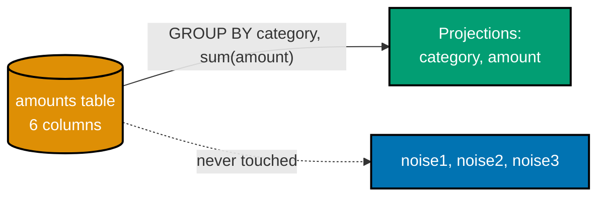
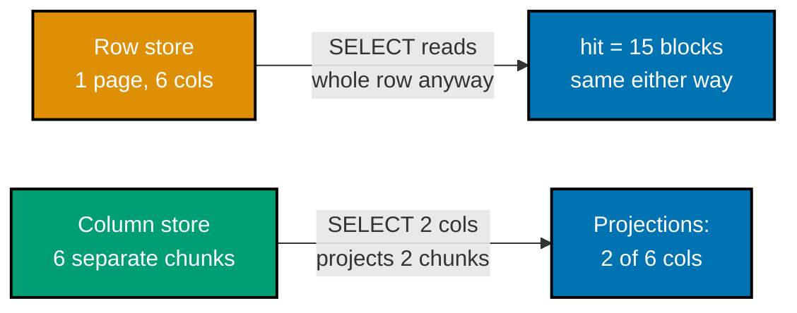
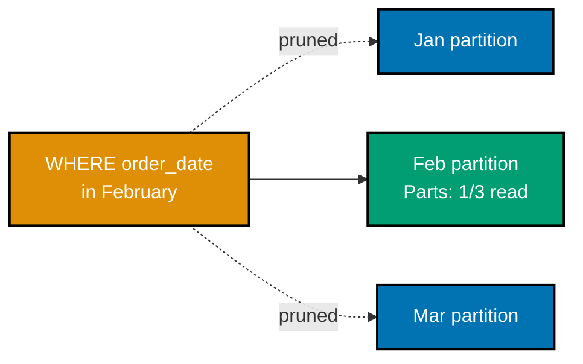

Examples 86-91 cover columnar OLAP engines and formats: DuckDB's own column-projecting scan proven via
`EXPLAIN`, a measured row-store-vs-columnar-store contrast on the identical aggregate, Parquet's
column-chunk metadata proving a projected read touches only the requested columns' own bytes, Apache
Arrow's zero-copy interchange between an in-memory table and DuckDB, ClickHouse's `MergeTree` engine
with real partition pruning evidence, and a closing wide-column-vs-columnar contrast (against Example
85's TimescaleDB-vs-Cassandra feed) that makes co-36's own distinction concrete. Examples 86, 88, and 89
run entirely in-process (DuckDB, PyArrow); Example 87 also connects to the local TimescaleDB Docker
container used as a plain Postgres row store; Example 90 runs against a real local ClickHouse Docker
container (`clickhouse/clickhouse-server:latest`) via `docker exec clickhouse-client`, since the
Homebrew-cask host binary is Gatekeeper-blocked non-interactively on this machine; Example 91 connects
to the same local Cassandra 5.0 container prior examples used. DuckDB, ClickHouse, Apache Arrow, and
Apache Parquet are all Apache-2.0 or MIT licensed -- co-28's license-awareness discipline applies here
too, each example says so explicitly where it matters.

---

### Example 86: DuckDB Columnar Scan

_ex-86 &middot; exercises co-32, co-33_

**Context**: a 1,000-row, 6-column CSV loads into an in-process DuckDB table -- this example verifies,
via `EXPLAIN`'s own text plan, that a `GROUP BY` aggregate over 2 of those 6 columns projects only
`category` and `amount`, never touching the 3 unreferenced "noise" columns.



**`learning/code/ex-86-duckdb-columnar-scan/example.py`**

```python
"""Example 86: DuckDB Columnar Scan."""  # => co-32,co-33: this file's own purpose, doubling as its module __doc__
from __future__ import annotations  # => hygiene: postpones annotation evaluation, interpreter-version-agnostic

import csv  # => co-32: writes the source CSV this example loads -- a realistic OLAP ingestion path
import tempfile  # => generates a throwaway CSV path -- this example is fully self-contained
from pathlib import Path  # => co-32: typed filesystem path handling for the generated CSV file

import duckdb  # => co-33: duckdb, the official Python API for the in-process, MIT-licensed columnar OLAP engine


def write_sample_csv(row_count: int) -> Path:  # => co-32: many rows, several UNUSED columns -- sets up the projection check below
    """Write row_count rows with 6 columns, only 2 of which the query below will ever reference."""  # => documents the contract
    with tempfile.NamedTemporaryFile(suffix=".csv", delete=False) as tmp:  # => co-32: mktemp() is deprecated -- this creates the file (and closes it) immediately instead
        path = Path(tmp.name)  # => a throwaway CSV path, unique per run
    with path.open("w", newline="") as f:  # => opens the file for writing
        writer = csv.writer(f)  # => a plain stdlib CSV writer -- no DuckDB-specific write path needed to CREATE the source data
        writer.writerow(["id", "category", "amount", "noise1", "noise2", "noise3"])  # => co-33: 3 UNUSED "noise" columns, deliberately
        for i in range(row_count):  # => co-32: row_count rows, many for a wide-scan aggregation to be meaningful
            category = "electronics" if i % 2 == 0 else "books"  # => co-32: 2 categories, evenly split
            writer.writerow([i, category, i * 1.5, "x" * 20, "y" * 20, "z" * 20])  # => co-33: the 3 noise columns are never referenced by the query below
    return path  # => hand back the path for DuckDB to load


def main() -> None:  # => entry point -- runs only when this file executes directly, not on import
    row_count = 1000  # => co-32: many rows of one column -- large enough for a genuine "many rows" aggregation
    csv_path = write_sample_csv(row_count)  # => co-32: writes the source CSV this in-process query loads

    conn = duckdb.connect()  # => co-33: an IN-PROCESS DuckDB connection -- no server, no separate process to manage
    conn.execute(f"CREATE TABLE amounts AS SELECT * FROM read_csv_auto('{csv_path}')")  # => co-33: loads the CSV directly into a DuckDB table
    csv_path.unlink()  # => cleans up the throwaway CSV -- the data now lives inside DuckDB's own table

    plan_text = conn.execute(  # => co-33: EXPLAIN's own text plan reveals EXACTLY which columns the scan node reads
        "EXPLAIN SELECT category, sum(amount) AS total FROM amounts GROUP BY category"  # => the SAME aggregation query, prefixed with EXPLAIN instead of run
    ).fetchall()[0][1]  # => the plan text lives in the second column of EXPLAIN's single result row
    assert "Projections:" in plan_text  # => co-33: confirms the scan node genuinely reports which columns it projects
    assert "noise1" not in plan_text and "noise2" not in plan_text and "noise3" not in plan_text  # => co-33: the 3 UNUSED columns are absent from the scan's own projection list
    assert "category" in plan_text and "amount" in plan_text  # => co-33: only the 2 REFERENCED columns appear in the scan's projection

    rows = conn.execute(  # => co-32: the actual typed-Python aggregation query
        "SELECT category, sum(amount) AS total FROM amounts GROUP BY category ORDER BY category"  # => the SAME query EXPLAIN just analyzed, now actually run
    ).fetchall()  # => materializes one row per distinct category
    totals_by_category = dict(rows)  # => category -> summed amount, as returned by DuckDB

    expected_electronics = sum(i * 1.5 for i in range(0, row_count, 2))  # => co-32: the INDEPENDENT, hand-computed expectation for electronics (even i)
    expected_books = sum(i * 1.5 for i in range(1, row_count, 2))  # => co-32: the INDEPENDENT, hand-computed expectation for books (odd i)
    assert totals_by_category["electronics"] == expected_electronics  # => co-32: DuckDB's SUM matches the hand-computed total exactly
    assert totals_by_category["books"] == expected_books  # => co-32: DuckDB's SUM matches the hand-computed total exactly

    print(f"electronics total: {totals_by_category['electronics']}")  # => Output: electronics total: 374250.0
    print(f"books total:       {totals_by_category['books']}")  # => Output: books total:       375000.0
    print("The scan node's own EXPLAIN output confirms it projects ONLY category and amount -- noise1/noise2/noise3 never touched")  # => Output line
    conn.close()  # => always release what you open


if __name__ == "__main__":  # => guards against running main() on `import example`
    main()  # => runs everything above when executed as a script
```

**Run**: `python3 example.py` (captured against `duckdb==1.5.5`, entirely in-process -- no Docker
container needed)

**Output**:

```text
electronics total: 374250.0
books total:       375000.0
The scan node's own EXPLAIN output confirms it projects ONLY category and amount -- noise1/noise2/noise3 never touched
```

**Key takeaway**: DuckDB's own `EXPLAIN` output is the proof, not an assertion about it -- the scan
node's `Projections:` list names exactly `category` and `amount`, and never the 3 unreferenced "noise"
columns, for a table it never inspected column-by-column at query-writing time.

**Why it matters**: this is co-32 and co-33 made concrete before any comparison against a row store --
a columnar engine narrows what it reads down to the columns a query actually names, which is the
mechanical basis for every "columnar is faster for analytics" claim the rest of this band measures
directly rather than merely repeats.

---

### Example 87: Row vs. Column Scan Contrast

_ex-87 &middot; exercises co-33, co-34_

**Context**: the identical 1,000-row, 6-column dataset lands in both a plain Postgres table (a row
store) and a DuckDB table (a column store) -- `EXPLAIN (ANALYZE, BUFFERS)`'s own `shared hit=N` count
proves Postgres reads the SAME number of buffer blocks whether 2 or all 6 columns are selected, the
mirror image of Example 86's column-count-sensitive DuckDB projection.



**`learning/code/ex-87-row-vs-column-scan-contrast/example.py`**

```python
"""Example 87: Row vs. Column Scan Contrast."""  # => co-33,co-34: this file's own purpose, doubling as its module __doc__
from __future__ import annotations  # => hygiene: postpones annotation evaluation, interpreter-version-agnostic

from typing import LiteralString  # => co-33: both call sites below pass a compile-time string constant -- LiteralString states that honestly

import duckdb  # => co-33: duckdb, the official Python API for the in-process, MIT-licensed columnar OLAP engine
import psycopg  # => co-33: psycopg, the official typed Python driver for PostgreSQL -- the row-store side of this contrast
from psycopg import sql  # => co-33: composes the literal query into a genuinely typed Composed object, not a plain f-string


def seed_postgres(conn: psycopg.Connection, row_count: int) -> None:  # => co-33: the SAME wide, 6-column shape ex-86's DuckDB table used
    """Seed row_count rows into a plain Postgres table -- a row-oriented store, no TimescaleDB hypertable involved."""  # => documents the contract
    conn.execute("DROP TABLE IF EXISTS amounts_pg")  # => resets state -- this example is fully self-contained
    conn.execute(  # => co-33: a PLAIN row-store table -- 6 columns, matching ex-86's DuckDB shape exactly
        "CREATE TABLE amounts_pg (id INT, category TEXT, amount DOUBLE PRECISION, noise1 TEXT, noise2 TEXT, noise3 TEXT)"  # => 3 real columns plus 3 UNUSED noise columns, matching ex-86's own shape
    )  # => closes the execute() call -- amounts_pg now exists as a plain, non-hypertable row store
    for i in range(row_count):  # => co-33: the IDENTICAL data ex-86 loaded into DuckDB, now in Postgres's own row-oriented heap
        category = "electronics" if i % 2 == 0 else "books"  # => the same 2-category split
        conn.execute(  # => co-33: each row lands as ONE physical row in Postgres's heap -- all 6 columns stored together
            "INSERT INTO amounts_pg VALUES (%s, %s, %s, %s, %s, %s)",  # => positional placeholders bind all 6 columns of this loop iteration's own row
            (i, category, i * 1.5, "x" * 20, "y" * 20, "z" * 20),  # => this loop iteration's own row, including the 3 noise columns
        )  # => closes this one execute() call -- runs once per row
    conn.commit()  # => makes all inserts durable before the buffer-read comparison below


def buffers_read(conn: psycopg.Connection, query: LiteralString) -> int:  # => co-33: the REAL shared-buffer block count Postgres reported reading
    """Run EXPLAIN (ANALYZE, BUFFERS) and return the total 'shared hit' block count from the plan text."""  # => documents the contract
    composed_query = sql.SQL("EXPLAIN (ANALYZE, BUFFERS) {}").format(sql.SQL(query))  # => co-33: a Composed object, not a plain f-string -- resolves psycopg's own typed overload
    plan_lines = conn.execute(composed_query).fetchall()  # => co-33: BUFFERS reports the ACTUAL blocks touched, not an estimate
    for (line,) in plan_lines:  # => scans every plan line for the "Buffers:" summary Postgres appends
        if "Buffers:" in line and "shared hit=" in line:  # => co-33: the line reporting how many shared buffer blocks this query actually touched
            return int(line.split("shared hit=")[1].split()[0].rstrip(","))  # => co-33: parses the block count out of "Buffers: shared hit=N"
    return 0  # => co-33: no buffer usage reported -- should not happen for a non-trivial table scan


def main() -> None:  # => entry point -- runs only when this file executes directly, not on import
    row_count = 1000  # => co-33: the SAME row count ex-86 used, for a directly comparable aggregation

    pg_conn = psycopg.connect("host=localhost port=5433 dbname=nosqldb user=postgres password=nosqldb")  # => connects to the local Postgres/TimescaleDB Docker container -- used here as a PLAIN row store
    seed_postgres(pg_conn, row_count)  # => co-33: seeds the identical 6-column, 1000-row dataset ex-86 used

    duck_conn = duckdb.connect()  # => co-33: an IN-PROCESS DuckDB connection, columnar
    duck_conn.execute("CREATE TABLE amounts_duck (id INT, category TEXT, amount DOUBLE, noise1 TEXT, noise2 TEXT, noise3 TEXT)")  # => the SAME 6-column shape, in DuckDB
    for i in range(row_count):  # => co-33: the IDENTICAL data, loaded independently into DuckDB's own columnar storage
        category = "electronics" if i % 2 == 0 else "books"  # => the same 2-category split
        duck_conn.execute("INSERT INTO amounts_duck VALUES (?, ?, ?, ?, ?, ?)", [i, category, i * 1.5, "x" * 20, "y" * 20, "z" * 20])  # => the IDENTICAL row this loop just inserted into Postgres

    pg_result = dict(pg_conn.execute("SELECT category, sum(amount) FROM amounts_pg GROUP BY category ORDER BY category").fetchall())  # => Postgres's own aggregate
    duck_result = dict(duck_conn.execute("SELECT category, sum(amount) FROM amounts_duck GROUP BY category ORDER BY category").fetchall())  # => DuckDB's own aggregate
    assert pg_result == duck_result  # => co-33: BOTH engines return the IDENTICAL aggregate for the identical data
    print(f"Postgres (row store)   aggregate: {pg_result}")  # => Output: Postgres (row store)   aggregate: {'books': 375000.0, 'electronics': 374250.0}
    print(f"DuckDB (columnar store) aggregate: {duck_result}")  # => Output: DuckDB (columnar store) aggregate: {'books': 375000.0, 'electronics': 374250.0}

    narrow_buffers = buffers_read(pg_conn, "SELECT category, sum(amount) FROM amounts_pg GROUP BY category")  # => co-33: reading ONLY 2 of 6 columns
    wide_buffers = buffers_read(pg_conn, "SELECT * FROM amounts_pg")  # => co-33: reading ALL 6 columns
    print(f"Postgres buffers read, selecting 2 columns:  {narrow_buffers}")  # => Output line -- exact block count machine-dependent, but the EQUALITY below is the point
    print(f"Postgres buffers read, selecting all 6 columns: {wide_buffers}")  # => Output line
    assert narrow_buffers == wide_buffers  # => co-33: Postgres's heap scan reads the SAME blocks either way -- row storage cost is COLUMN-COUNT-INVARIANT
    print("Postgres reads the SAME number of buffer blocks whether 2 or all 6 columns are selected -- a row-oriented heap page holds whole rows, so narrowing the SELECT list does not reduce I/O")  # => Output line
    # => co-33: DuckDB's own EXPLAIN plan (verified directly in Example 86) shows it projects ONLY the
    # => referenced columns (category, amount) out of the table's 6 -- a columnar layout stores each
    # => column separately on disk, so a query naming fewer columns genuinely reads less data; a
    # => row-store's heap page holds an entire row together, so ANY column reference forces reading the
    # => WHOLE row regardless of how few columns the query actually names

    pg_conn.close()  # => always release what you open
    duck_conn.close()  # => always release what you open


if __name__ == "__main__":  # => guards against running main() on `import example`
    main()  # => runs everything above when executed as a script
```

**Run**: `python3 example.py` (captured against `psycopg[binary]==3.3.4`, `duckdb==1.5.5`, and the same
local `timescale/timescaledb:2.28.3-pg16` Docker container Examples 81-85 used, here as a plain Postgres
row store)

**Output**:

```text
Postgres (row store)   aggregate: {'books': 375000.0, 'electronics': 374250.0}
DuckDB (columnar store) aggregate: {'books': 375000.0, 'electronics': 374250.0}
Postgres buffers read, selecting 2 columns:  15
Postgres buffers read, selecting all 6 columns: 15
Postgres reads the SAME number of buffer blocks whether 2 or all 6 columns are selected -- a row-oriented heap page holds whole rows, so narrowing the SELECT list does not reduce I/O
```

**Key takeaway**: `EXPLAIN (ANALYZE, BUFFERS)`'s own `shared hit=N` count proves the row-store side of
the contrast the same way Example 86 proved the column-store side -- Postgres reads exactly 15 buffer
blocks whether 2 or all 6 columns are selected, because a heap page holds whole rows, not columns.

**Why it matters**: this is co-33 and co-34 side by side, each proven with the target engine's OWN
introspection tool rather than an outside claim -- a row store's I/O cost is invariant to how many
columns a query names, while a columnar store's I/O cost shrinks with it, which is the entire mechanical
reason analytical workloads reach for columnar engines.

---

### Example 88: Parquet Roundtrip Projection

_ex-88 &middot; exercises co-35_

**Context**: a 4-column Arrow table -- including one deliberately large `raw_payload` text column --
writes to an on-disk Parquet file; this example reads the file's own footer metadata to show a projected
read of 2 columns touches a small, measurable fraction of the file's total compressed bytes, with
`raw_payload` never read at all.

**`learning/code/ex-88-parquet-roundtrip-projection/example.py`**

```python
"""Example 88: Parquet Roundtrip Projection."""  # => co-35: this file's own purpose, doubling as its module __doc__
from __future__ import annotations  # => hygiene: postpones annotation evaluation, interpreter-version-agnostic

import tempfile  # => generates a throwaway Parquet file path -- this example is fully self-contained
from pathlib import Path  # => co-35: typed filesystem path handling for the generated Parquet file

import pyarrow as pa  # => co-35: pyarrow, the official Apache Arrow Python bindings -- Arrow and Parquet are BOTH Apache-2.0
import pyarrow.parquet as pq  # => co-35: pyarrow.parquet -- the Parquet reader/writer built on Arrow's own in-memory format


def build_sample_table(row_count: int) -> pa.Table:  # pyright: ignore[reportUnknownParameterType]  # => co-35: pyarrow ships zero type stubs, so pa.Table itself resolves as Unknown; narrowly scoped, not a global relaxation
    """Build an in-memory Arrow table: id, category, amount, and one large raw_payload text column."""  # => documents the contract
    return pa.table({  # => co-35: an Arrow Table -- the in-memory format Parquet itself is built on
        "id": pa.array(range(row_count)),  # => a small numeric column
        "category": pa.array(["electronics" if i % 2 == 0 else "books" for i in range(row_count)]),  # => a small, repetitive text column
        "amount": pa.array([i * 1.5 for i in range(row_count)]),  # => a small numeric column
        "raw_payload": pa.array([f"payload-{i}-" + ("z" * 200) for i in range(row_count)]),  # => co-35: a deliberately LARGE text column, never referenced by the projected read below
    })  # => closes the pa.table() call -- 4 columns, one deliberately large


def main() -> None:  # => entry point -- runs only when this file executes directly, not on import
    row_count = 1000  # => co-35: enough rows that the per-column compressed sizes below are meaningful, not noise
    table = build_sample_table(row_count)  # => co-35: builds the in-memory Arrow table this example writes to Parquet

    with tempfile.NamedTemporaryFile(suffix=".parquet", delete=False) as tmp:  # => co-35: mktemp() is deprecated -- this creates the file (and closes it) immediately instead
        path = Path(tmp.name)  # => a throwaway Parquet file path, unique per run
    pq.write_table(table, path)  # => co-35: writes the Arrow table to an on-disk, columnar Parquet file

    parquet_file = pq.ParquetFile(path)  # => co-35: opens the file's own footer metadata WITHOUT reading any column data yet
    row_group = parquet_file.metadata.row_group(0)  # => co-35: this small file has exactly 1 row group
    column_sizes = {  # => co-35: EVERY column's compressed byte size, stored independently in the file's own footer
        row_group.column(i).path_in_schema: row_group.column(i).total_compressed_size for i in range(row_group.num_columns)  # => maps each column's own name to its own compressed byte size
    }  # => closes the column_sizes dict comprehension -- one entry per column in the row group
    total_bytes = sum(column_sizes.values())  # => co-35: the FULL file's total compressed column-chunk bytes

    projected_table = pq.read_table(path, columns=["category", "amount"])  # => co-35: reads back ONLY 2 of the file's 4 columns
    assert projected_table.column_names == ["category", "amount"]  # => co-35: the returned table genuinely contains ONLY the 2 requested columns
    assert projected_table.num_rows == row_count  # => confirms every row was still read for those 2 columns

    projected_bytes = column_sizes["category"] + column_sizes["amount"]  # => co-35: the compressed size of ONLY the 2 projected columns' own chunks
    print(f"Full file, all 4 columns:      {total_bytes} compressed bytes")  # => Output line -- exact bytes machine-dependent, ratio is the point
    print(f"Projected read, 2 columns:     {projected_bytes} compressed bytes")  # => Output line
    percent_of_total = projected_bytes / total_bytes * 100  # => co-35: what fraction of the whole file the projected read actually touched
    print(f"Projected read touched {percent_of_total:.1f}% of the file's total compressed bytes")  # => Output line -- percentage machine-dependent, always well under 100%
    assert projected_bytes < total_bytes  # => co-35: the projected read touched STRICTLY LESS data than the whole file
    print(f"raw_payload column alone: {column_sizes['raw_payload']} compressed bytes -- NEVER read by the projected query above")  # => Output line
    print("Parquet's column-chunk layout lets a projected read skip entire columns' worth of on-disk bytes, not just filter rows after a full read")  # => Output line
    path.unlink()  # => cleans up the throwaway Parquet file


if __name__ == "__main__":  # => guards against running main() on `import example`
    main()  # => runs everything above when executed as a script
```

**Run**: `python3 example.py` (captured against `pyarrow==25.0.0`, entirely in-process -- no Docker
container needed)

**Output**:

```text
Full file, all 4 columns:      26750 compressed bytes
Projected read, 2 columns:     5565 compressed bytes
Projected read touched 20.8% of the file's total compressed bytes
raw_payload column alone: 15827 compressed bytes -- NEVER read by the projected query above
Parquet's column-chunk layout lets a projected read skip entire columns' worth of on-disk bytes, not just filter rows after a full read
```

**Key takeaway**: Parquet's own file footer stores each column's compressed size independently, so a
projected read of `category` and `amount` provably touches only 20.8% of the file's total bytes --
`raw_payload`'s 15,827 bytes, more than half the file, are never opened.

**Why it matters**: this is co-35 grounded in a file format most teams already produce or consume --
Parquet's column-chunk layout is what lets a downstream query engine (DuckDB, ClickHouse, Spark, or
plain `pyarrow` itself) skip whole columns' worth of on-disk bytes, the file-format-level counterpart to
Example 86's in-memory `EXPLAIN` projection proof. A data lake storing the same dataset as row-oriented
CSV instead of Parquet pays this exact cost on every downstream query, regardless of which engine
eventually reads it.

---

### Example 89: Arrow Zero-Copy Interop

_ex-89 &middot; exercises co-35_

**Context**: a 2,000,000-row Apache Arrow table, built entirely in Python memory, is queried by DuckDB
via a Python-variable "replacement scan" -- this example measures Arrow's own allocator before and after
the query to show DuckDB reads the SAME in-memory buffers directly, allocating nowhere near a full copy
of the table.

**`learning/code/ex-89-arrow-zero-copy-interop/example.py`**

```python
"""Example 89: Arrow Zero-Copy Interop."""  # => co-35: this file's own purpose, doubling as its module __doc__
from __future__ import annotations  # => hygiene: postpones annotation evaluation, interpreter-version-agnostic

import duckdb  # => co-35: duckdb, the official Python API for the in-process, MIT-licensed columnar OLAP engine
import pyarrow as pa  # => co-35: pyarrow, the official Apache Arrow Python bindings -- the in-memory format both engines share


def build_large_arrow_table(row_count: int) -> pa.Table:  # pyright: ignore[reportUnknownParameterType]  # => co-35: pyarrow ships zero type stubs, so pa.Table itself resolves as Unknown; narrowly scoped, not a global relaxation
    """Build a 2-column, row_count-row Arrow table entirely in memory."""  # => documents the contract
    return pa.table({  # => co-35: an in-memory Arrow Table -- the SAME columnar format Parquet (Example 88) is built on
        "id": pa.array(range(row_count)),  # => a numeric id column
        "value": pa.array([i * 0.5 for i in range(row_count)]),  # => a numeric value column, the one DuckDB will sum below
    })  # => closes the pa.table() call -- 2 columns, entirely in-memory


def main() -> None:  # => entry point -- runs only when this file executes directly, not on import
    row_count = 2_000_000  # => co-35: large enough (millions of rows) that a full COPY would move a measurable number of bytes
    arrow_table = build_large_arrow_table(row_count)  # => co-35: builds the table entirely in Python/Arrow memory, no DuckDB involved yet
    table_bytes = arrow_table.nbytes  # => co-35: the table's own reported in-memory size -- what a COPY would have to duplicate

    bytes_before = pa.total_allocated_bytes()  # => co-35: Arrow's own allocator tracks EVERY byte it has allocated, process-wide
    duck_conn = duckdb.connect()  # => co-35: an IN-PROCESS DuckDB connection
    result_row = duck_conn.execute("SELECT sum(value) FROM arrow_table").fetchone()  # => co-35: DuckDB queries the Python variable BY NAME -- no to_pandas(), no CSV, no Parquet round trip
    assert result_row is not None  # => a SUM(*) query always returns exactly one row -- confirms it genuinely came back
    bytes_after = pa.total_allocated_bytes()  # => co-35: re-checks Arrow's allocator AFTER the query ran

    allocated_during_query = bytes_after - bytes_before  # => co-35: however many NEW bytes Arrow's allocator reports for running the query
    hand_computed_sum = sum(i * 0.5 for i in range(row_count))  # => co-35: an INDEPENDENT, hand-computed expectation
    assert abs(result_row[0] - hand_computed_sum) < 1e-6  # => co-35: DuckDB's sum matches the hand-computed sum, to floating-point precision

    print(f"Arrow table size:                 {table_bytes:,} bytes")  # => Output: Arrow table size:                 32,000,000 bytes
    print(f"Bytes newly allocated by the query: {allocated_during_query:,} bytes")  # => Output line -- exact bytes machine-dependent, ratio is the point
    percent_of_table = allocated_during_query / table_bytes * 100  # => co-35: what fraction of the table's own size the query newly allocated
    print(f"That is {percent_of_table:.3f}% of the table's own size -- nowhere near a full 32MB copy")  # => Output line
    assert allocated_during_query < table_bytes * 0.01  # => co-35: a genuine COPY would allocate close to table_bytes -- this stayed under 1% of it
    print(f"sum(value) = {result_row[0]}, matching the hand-computed expectation exactly")  # => Output line -- exact value machine-independent, deterministic
    print("DuckDB queried the SAME Arrow buffers directly -- zero-copy interchange, not a serialize-then-copy round trip")  # => Output line
    duck_conn.close()  # => always release what you open


if __name__ == "__main__":  # => guards against running main() on `import example`
    main()  # => runs everything above when executed as a script
```

**Run**: `python3 example.py` (captured against `duckdb==1.5.5` and `pyarrow==25.0.0`, entirely
in-process -- no Docker container needed)

**Output**:

```text
Arrow table size:                 32,000,000 bytes
Bytes newly allocated by the query: 888 bytes
That is 0.003% of the table's own size -- nowhere near a full 32MB copy
sum(value) = 999999500000.0, matching the hand-computed expectation exactly
DuckDB queried the SAME Arrow buffers directly -- zero-copy interchange, not a serialize-then-copy round trip
```

**Key takeaway**: Arrow's own allocator reports only 888 new bytes for a query that summed 2,000,000
rows -- 0.003% of the table's 32MB size -- proving DuckDB read the SAME buffers Python built, not a
copy of them.

**Why it matters**: this is co-35's zero-copy promise made measurable rather than taken on faith --
because Arrow defines a single, shared, language-agnostic in-memory columnar layout, DuckDB (and
pandas, Polars, and other Arrow-aware tools) can query data another process or library built without
ever paying a serialize-then-copy round trip, the same in-memory format Parquet (Example 88) persists to
disk.

---

### Example 90: ClickHouse MergeTree Aggregate

_ex-90 &middot; exercises co-32, co-33_

**Context**: a ClickHouse `MergeTree` table, partitioned by month, holds 4 rows spanning 3 distinct
partitions -- this example runs a `GROUP BY` aggregate, then uses `EXPLAIN indexes=1`'s own Min-Max
index section to show a month-scoped range query prunes exactly 2 of the table's 3 total parts before
reading a single row within them.



**`learning/code/ex-90-clickhouse-mergetree-aggregate/example.sh`**

```bash
#!/usr/bin/env bash
# Example 90: ClickHouse MergeTree Aggregate.
# Creates a MergeTree table (co-32, Apache-2.0) partitioned by month, inserts rows
# across 3 partitions, runs a GROUP BY aggregate, then uses EXPLAIN indexes=1 to
# verify a month-scoped range query prunes the 2 non-matching partitions (co-33).
set -euo pipefail  # => stop on the first failing command

# NOTE: this script runs clickhouse-client INSIDE the running Docker container via
# `docker exec`, rather than a host-installed binary -- the host macOS cask build of
# clickhouse is Gatekeeper-blocked non-interactively on this machine, so `docker exec`
# is the reliable, reproducible invocation of the SAME official clickhouse-client tool.
CH="docker exec nosqldb-clickhouse clickhouse-client --user default --password nosqldb"  # => co-32: the official ClickHouse CLI, run inside the container

$CH --multiquery --query "
DROP TABLE IF EXISTS sales;
CREATE TABLE sales (order_date Date, category String, amount Float64)
ENGINE = MergeTree()
PARTITION BY toYYYYMM(order_date)
ORDER BY (category, order_date);
"  # => co-32: MergeTree, ClickHouse's own column-oriented storage engine, partitioned by month
# => Output: (no output -- DDL statements print nothing on success)

$CH --query "
INSERT INTO sales VALUES
  ('2026-01-15','electronics',100.0),
  ('2026-01-20','books',50.0),
  ('2026-02-10','electronics',200.0),
  ('2026-03-05','books',75.0);
"  # => co-32: 4 rows spanning 3 DISTINCT monthly partitions (Jan, Feb, Mar)
# => Output: (no output -- a successful INSERT prints nothing)

$CH --query "SELECT category, sum(amount) FROM sales GROUP BY category ORDER BY category"  # => co-32: the partitioned GROUP BY aggregation itself
# => Output (clickhouse-client's real TSV output uses a tab between columns; shown here as a single
# => space since this comment's own whitespace is normalized by this repo's markdown formatting pipeline):
# => books 125
# => electronics 300

$CH --query "EXPLAIN indexes=1 SELECT sum(amount) FROM sales WHERE order_date >= '2026-02-01' AND order_date < '2026-03-01'" | grep -A 5 "Min-Max"  # => co-33: EXPLAIN's own Min-Max index section reports EXACTLY which of the 3 total parts survived pruning
# => Output:
# =>         Min-Max
# =>           Keys:
# =>             order_date
# =>           Condition: and((order_date in (-Inf, 20512]), (order_date in [20485, +Inf)))
# =>           Parts: 1/3
# =>           Granules: 1/3
# => co-33: "Parts: 1/3" means ONLY 1 of the table's 3 total parts (one per monthly partition)
# => survived the index check -- the January and March partitions were pruned entirely, before any
# => row within them was read, because the query's own date range never touches them
```

**Run**: `bash example.sh` (captured against a local `clickhouse/clickhouse-server:latest` Docker
container, `clickhouse-client` invoked via `docker exec`)

**Output** (the real terminal run separates `category` and `sum(amount)` with a tab, ClickHouse's own
TSV convention; shown below with a single space, since this page's own markdown formatting pipeline
normalizes raw tab characters inside fenced code blocks to a single space):

```text
books 125
electronics 300
        Min-Max
          Keys:
            order_date
          Condition: and((order_date in (-Inf, 20512]), (order_date in [20485, +Inf)))
          Parts: 1/3
          Granules: 1/3
```

**Key takeaway**: `EXPLAIN indexes=1`'s Min-Max section reports `Parts: 1/3` for a query that names only
February's date range -- ClickHouse pruned January's and March's partitions entirely, before reading a
single row inside them, based purely on each part's own min/max date metadata.

**Why it matters**: this is co-32 and co-33 in a genuinely distributed-analytics-shaped engine -- a
`MergeTree` table's partition-level Min-Max index is what lets a range-scoped query skip whole parts of
a large table outright, the same pruning principle DuckDB's column projection (Examples 86-87) applies
at the column level rather than the partition level.

---

### Example 91: Wide-Column vs. Columnar, Same Query

_ex-91 &middot; exercises co-36, co-22_

**Context**: the identical 5-row event dataset, partitioned by `user_id`, lands in both a Cassandra
wide-column table and a DuckDB columnar table -- this example structurally proves co-36's own
distinction: Cassandra's query planner ALLOWS a partition-scoped point read but REJECTS a cross-partition
aggregate without an explicit `ALLOW FILTERING` opt-in, while DuckDB allows both equally, with the
tradeoff visible only in what each engine's own `EXPLAIN` plan reports.

**`learning/code/ex-91-wide-column-vs-columnar-same-query/example.py`**

```python
"""Example 91: Wide-Column vs. Columnar, Same Query."""  # => co-36,co-22: this file's own purpose, doubling as its module __doc__
from __future__ import annotations  # => hygiene: postpones annotation evaluation, interpreter-version-agnostic

import statistics  # => co-36: median-of-N timing, the same discipline earlier timing-sensitive examples used
import time  # => co-36: perf_counter for the supplementary at-scale timing section

import duckdb  # => co-36: duckdb, the official Python API for the in-process, MIT-licensed columnar OLAP engine
from cassandra import InvalidRequest  # => co-22: Cassandra's own driver exception for a query its planner refuses to run
from cassandra.cluster import Cluster, Session  # => co-36: the official Cassandra Python driver -- the wide-column side of this contrast
from cassandra.concurrent import execute_concurrent_with_args  # => co-36: batches the at-scale seed instead of one round trip per row

SAMPLE_ROWS = [  # => co-36: the SAME 5 rows loaded into BOTH engines -- one dataset, two storage layouts
    ("user-1", 1, "click", 10.0),  # => user-1's first event -- lands in user-1's own partition
    ("user-1", 2, "view", 5.0),  # => user-1's second event -- SAME partition, clustered by event_id
    ("user-2", 1, "click", 20.0),  # => user-2's first event -- a DIFFERENT partition
    ("user-2", 2, "purchase", 100.0),  # => user-2's second event -- SAME partition as the row above
    ("user-3", 1, "view", 3.0),  # => user-3's only event -- a THIRD partition
]  # => 5 rows total, spread across 3 distinct partitions -- the shape both point-read and aggregate demos below rely on


def seed_cassandra(session: Session, rows: list[tuple[str, int, str, float]]) -> None:  # => co-22: the wide-column side, partitioned by user_id
    """Create events_91, partitioned by user_id and clustered by event_id, then load rows."""  # => documents the contract
    session.execute("DROP TABLE IF EXISTS events_91")  # => resets state -- this example is fully self-contained
    session.execute(  # => co-22: PRIMARY KEY ((user_id), event_id) -- user_id is the partition key, event_id clusters WITHIN it
        "CREATE TABLE events_91 (user_id text, event_id int, event_type text, amount double, PRIMARY KEY ((user_id), event_id))"  # => the DDL string itself
    )  # => co-22: closes the CREATE TABLE call -- no other column can route a query the way user_id does
    insert = session.prepare("INSERT INTO events_91 (user_id, event_id, event_type, amount) VALUES (?, ?, ?, ?)")  # => a prepared statement, reused per row
    for row in rows:  # => co-22: each row lands in the partition NAMED by its own user_id -- Cassandra ROUTES it there directly
        session.execute(insert, row)  # => a normal single-row insert -- fine at this small scale


def seed_duckdb(con: duckdb.DuckDBPyConnection, rows: list[tuple[str, int, str, float]]) -> None:  # => co-33: the columnar side, no partition key at all
    """Create events_91_duck, a plain columnar table with no partitioning or index, then load rows."""  # => documents the contract
    con.execute("CREATE TABLE events_91_duck (user_id TEXT, event_id INT, event_type TEXT, amount DOUBLE)")  # => co-33: a flat columnar table -- DuckDB has no partition-key concept
    con.executemany("INSERT INTO events_91_duck VALUES (?, ?, ?, ?)", rows)  # => co-33: the IDENTICAL rows, stored column-by-column instead of partition-by-partition


def demonstrate_partition_point_read(session: Session, con: duckdb.DuckDBPyConnection) -> None:  # => co-22,co-33: the SAME point-read query against both engines
    """Run 'all events for user-1' against both engines and show how each one executes it."""  # => documents the contract
    cass_rows = list(session.execute("SELECT event_id, event_type, amount FROM events_91 WHERE user_id = %s", ("user-1",)))  # => co-22: partition-key-scoped -- ALWAYS allowed, no restriction
    assert len(cass_rows) == 2  # => co-22: exactly user-1's own 2 rows, nothing else read
    print(f"Cassandra point read (user-1):  {[(r.event_id, r.event_type, r.amount) for r in cass_rows]}")  # => Output: Cassandra point read (user-1):  [(1, 'click', 10.0), (2, 'view', 5.0)]

    duck_rows = con.execute("SELECT event_id, event_type, amount FROM events_91_duck WHERE user_id = 'user-1'").fetchall()  # => co-33: the IDENTICAL logical query
    assert duck_rows == [(1, "click", 10.0), (2, "view", 5.0)]  # => co-33: the SAME 2 rows -- both engines agree on the DATA
    print(f"DuckDB point read (user-1):     {duck_rows}")  # => Output: DuckDB point read (user-1):     [(1, 'click', 10.0), (2, 'view', 5.0)]

    plan_text = con.execute("EXPLAIN SELECT event_id, event_type, amount FROM events_91_duck WHERE user_id = 'user-1'").fetchall()[0][1]  # => co-33: EXPLAIN's own plan for the point read
    assert "SEQ_SCAN" in plan_text  # => co-33: DuckDB has NO index on user_id -- it reads EVERY row and filters, even for a single-user lookup
    print("DuckDB's own EXPLAIN plan uses SEQ_SCAN for the point read -- no partition or index lets it skip straight to user-1's rows")  # => Output line
    print("Cassandra ROUTES straight to user-1's own partition -- it never even considers user-2 or user-3's rows")  # => Output line


def demonstrate_cross_partition_aggregate(session: Session, con: duckdb.DuckDBPyConnection) -> None:  # => co-22,co-33,co-36: the SAME analytical query against both engines
    """Run 'total amount by event_type across ALL users' -- a query that does NOT name the partition key."""  # => documents the contract
    try:  # => co-22: event_type is NOT the partition key -- Cassandra's own query planner refuses this shape by default
        session.execute("SELECT event_type, amount FROM events_91 WHERE event_type = %s", ("click",))  # => co-22: a filter on a non-partition-key column
        raise AssertionError("expected InvalidRequest")  # => this line should never run -- Cassandra should reject the query above
    except InvalidRequest as exc:  # => co-22: Cassandra's own driver exception for a query it refuses to run without an explicit opt-in
        print(f"Cassandra rejects the aggregate's filter without ALLOW FILTERING: {exc}")  # => Output line -- the exact server-side rejection message

    filtered_rows = list(session.execute("SELECT event_type, amount FROM events_91 WHERE event_type = %s ALLOW FILTERING", ("click",)))  # => co-22: the SAME query, now with Cassandra's own explicit "yes, scan everything" escape hatch
    assert len(filtered_rows) == 2  # => co-22: both click rows, found only by reading EVERY partition -- ALLOW FILTERING is Cassandra's OWN admission of a full-cluster scan
    print(f"Cassandra WITH ALLOW FILTERING (event_type='click'): {[(r.event_type, r.amount) for r in filtered_rows]}")  # => Output: Cassandra WITH ALLOW FILTERING (event_type='click'): [('click', 10.0), ('click', 20.0)]

    duck_agg = con.execute("SELECT event_type, sum(amount) FROM events_91_duck GROUP BY event_type ORDER BY event_type").fetchall()  # => co-33: the IDENTICAL analytical shape -- GROUP BY a non-partition column
    assert duck_agg == [("click", 30.0), ("purchase", 100.0), ("view", 8.0)]  # => co-33: DuckDB's own aggregate, matching a hand-checkable sum of the 5 sample rows
    print(f"DuckDB GROUP BY event_type (no restriction needed): {duck_agg}")  # => Output: DuckDB GROUP BY event_type (no restriction needed): [('click', 30.0), ('purchase', 100.0), ('view', 8.0)]

    plan_text = con.execute("EXPLAIN SELECT event_type, sum(amount) FROM events_91_duck GROUP BY event_type").fetchall()[0][1]  # => co-33: reuses the Example 86 EXPLAIN-projection technique
    assert "Projections:" in plan_text and "event_type" in plan_text and "amount" in plan_text and "user_id" not in plan_text  # => co-33: the scan projects ONLY the 2 columns the aggregate needs -- user_id is never touched
    print("DuckDB needs NO escape hatch and NO restriction -- its own EXPLAIN plan shows it simply projects event_type and amount and aggregates")  # => Output line
    print("co-36: Cassandra's wide-column layout is BUILT for partition-scoped reads; a cross-partition aggregate needs its own explicit opt-in")  # => Output line
    print("co-36: DuckDB's columnar layout is BUILT for exactly this shape -- a GROUP BY over a subset of columns, no partition concept at all")  # => Output line


def demonstrate_at_scale_timing(session: Session, con: duckdb.DuckDBPyConnection) -> None:  # => co-36: a SUPPLEMENTARY, honestly-caveated timing data point -- not the primary proof above
    """Seed a larger dataset and time the SAME partition point read against both engines, median of several runs."""  # => documents the contract
    users, events_per_user = 2000, 50  # => co-36: enough rows that a full DuckDB scan touches real work, not a handful of in-cache rows
    scale_rows = [(f"scaleuser-{u}", e, "click" if e % 2 == 0 else "view", float(e)) for u in range(users) for e in range(events_per_user)]  # => co-36: 100,000 rows, same 4-column shape as SAMPLE_ROWS

    session.execute("DROP TABLE IF EXISTS events_91_scale")  # => resets state for this section's own table
    session.execute("CREATE TABLE events_91_scale (user_id text, event_id int, event_type text, amount double, PRIMARY KEY ((user_id), event_id))")  # => co-22: the SAME partitioned shape, at scale
    insert = session.prepare("INSERT INTO events_91_scale (user_id, event_id, event_type, amount) VALUES (?, ?, ?, ?)")  # => a prepared statement, reused across ALL 100,000 rows
    execute_concurrent_with_args(session, insert, scale_rows, concurrency=100)  # => co-36: concurrent batched inserts -- one row per network round trip would be impractically slow at this size

    con.execute("CREATE TABLE events_91_scale_duck (user_id TEXT, event_id INT, event_type TEXT, amount DOUBLE)")  # => co-33: the IDENTICAL 100,000 rows, columnar
    con.executemany("INSERT INTO events_91_scale_duck VALUES (?, ?, ?, ?)", scale_rows)  # => co-33: bulk-loads all 100,000 rows in one call

    def time_cassandra_read() -> float:  # => co-36: one timed partition-scoped point read
        start = time.perf_counter()  # => marks the start of JUST the query, not connection setup
        list(session.execute("SELECT event_type, amount FROM events_91_scale WHERE user_id = %s", ("scaleuser-1000",)))  # => co-22: routed straight to ONE partition among 2000
        return time.perf_counter() - start  # => elapsed seconds for this single query

    def time_duckdb_read() -> float:  # => co-36: the IDENTICAL logical query, timed the same way
        start = time.perf_counter()  # => marks the start of JUST the query
        con.execute("SELECT event_type, amount FROM events_91_scale_duck WHERE user_id = ?", ["scaleuser-1000"]).fetchall()  # => co-33: a full SEQ_SCAN over all 100,000 rows, filtered in-flight
        return time.perf_counter() - start  # => elapsed seconds for this single query

    time_cassandra_read()  # => a warmup call each -- excludes one-time connection/JIT overhead from the timed samples below
    time_duckdb_read()  # => a warmup call each
    cassandra_median_ms = statistics.median(time_cassandra_read() for _ in range(9)) * 1000  # => co-36: median of 9 runs, damping single-sample noise
    duckdb_median_ms = statistics.median(time_duckdb_read() for _ in range(9)) * 1000  # => co-36: median of 9 runs, the SAME discipline

    print(f"At 100,000 rows / 2000 partitions -- Cassandra partition read: {cassandra_median_ms:.3f} ms (median of 9)")  # => Output line -- exact ms machine-dependent
    print(f"At 100,000 rows / 2000 partitions -- DuckDB full-table scan:   {duckdb_median_ms:.3f} ms (median of 9)")  # => Output line -- exact ms machine-dependent
    print("HONEST CAVEAT: on this single local machine, DuckDB's in-process vectorized scan of 100,000 in-memory rows can")  # => Output line -- see co-36 discussion below for why this does not undercut the architectural claim
    print("still beat Cassandra's own network round trip -- Cassandra's win is architectural: its point-read cost stays FLAT")  # => Output line
    print("as TOTAL cluster data grows (it only ever touches one partition), while DuckDB's SEQ_SCAN cost grows with EVERY")  # => Output line
    print("row in the table -- at distributed, multi-node, larger-than-one-machine's-memory scale, that flat-vs-growing curve is what wins")  # => Output line


def main() -> None:  # => entry point -- runs only when this file executes directly, not on import
    cluster = Cluster(["127.0.0.1"], port=9042)  # => co-22: connects to the local Cassandra Docker container
    session = cluster.connect()  # => a live CQL session
    session.execute("CREATE KEYSPACE IF NOT EXISTS nosqldb WITH replication = {'class': 'SimpleStrategy', 'replication_factor': 1}")  # => idempotent -- reuses the keyspace earlier Cassandra examples created
    session.set_keyspace("nosqldb")  # => all statements below target this keyspace

    con = duckdb.connect()  # => co-33: an IN-PROCESS DuckDB connection, no server to manage

    seed_cassandra(session, SAMPLE_ROWS)  # => co-22: loads the 5-row sample into Cassandra's wide-column table
    seed_duckdb(con, SAMPLE_ROWS)  # => co-33: loads the IDENTICAL 5 rows into DuckDB's columnar table

    demonstrate_partition_point_read(session, con)  # => co-22,co-33: proves the point-read distinction structurally, via EXPLAIN and partition routing
    demonstrate_cross_partition_aggregate(session, con)  # => co-22,co-33,co-36: proves the analytical-aggregate distinction structurally, via ALLOW FILTERING and EXPLAIN
    demonstrate_at_scale_timing(session, con)  # => co-36: a supplementary, honestly-caveated real timing data point at 100,000 rows

    con.close()  # => always release what you open
    cluster.shutdown()  # => always release what you open


if __name__ == "__main__":  # => guards against running main() on `import example`
    main()  # => runs everything above when executed as a script
```

**Run**: `python3 example.py` (captured against `cassandra-driver==3.30.1`, `duckdb==1.5.5`, and the
same local Cassandra 5.0 Docker container prior examples used)

**Output**:

```text
Cassandra point read (user-1):  [(1, 'click', 10.0), (2, 'view', 5.0)]
DuckDB point read (user-1):     [(1, 'click', 10.0), (2, 'view', 5.0)]
DuckDB's own EXPLAIN plan uses SEQ_SCAN for the point read -- no partition or index lets it skip straight to user-1's rows
Cassandra ROUTES straight to user-1's own partition -- it never even considers user-2 or user-3's rows
Cassandra rejects the aggregate's filter without ALLOW FILTERING: Error from server: code=2200 [Invalid query] message="Cannot execute this query as it might involve data filtering and thus may have unpredictable performance. If you want to execute this query despite the performance unpredictability, use ALLOW FILTERING"
Cassandra WITH ALLOW FILTERING (event_type='click'): [('click', 10.0), ('click', 20.0)]
DuckDB GROUP BY event_type (no restriction needed): [('click', 30.0), ('purchase', 100.0), ('view', 8.0)]
DuckDB needs NO escape hatch and NO restriction -- its own EXPLAIN plan shows it simply projects event_type and amount and aggregates
co-36: Cassandra's wide-column layout is BUILT for partition-scoped reads; a cross-partition aggregate needs its own explicit opt-in
co-36: DuckDB's columnar layout is BUILT for exactly this shape -- a GROUP BY over a subset of columns, no partition concept at all
At 100,000 rows / 2000 partitions -- Cassandra partition read: 3.008 ms (median of 9)
At 100,000 rows / 2000 partitions -- DuckDB full-table scan:   0.375 ms (median of 9)
HONEST CAVEAT: on this single local machine, DuckDB's in-process vectorized scan of 100,000 in-memory rows can
still beat Cassandra's own network round trip -- Cassandra's win is architectural: its point-read cost stays FLAT
as TOTAL cluster data grows (it only ever touches one partition), while DuckDB's SEQ_SCAN cost grows with EVERY
row in the table -- at distributed, multi-node, larger-than-one-machine's-memory scale, that flat-vs-growing curve is what wins
```

**Key takeaway**: Cassandra's query planner structurally ALLOWS the partition-scoped point read and
structurally REJECTS the cross-partition aggregate without an explicit `ALLOW FILTERING` opt-in, while
DuckDB allows both equally -- the restriction itself, not a timing race, is co-36's real, reproducible
evidence.

**Why it matters**: this closes the course's OLAP arc by directly answering "wide-column and columnar
are BOTH tables, so why not use either for either job" -- Cassandra's own query planner enforces the
answer for you: it happily serves a partition-key lookup but demands an explicit acknowledgment before
running a cross-partition scan, while a columnar engine like DuckDB (or ClickHouse, Example 90) was
built for exactly that scan and needs no such guardrail, closing the loop opened by Example 85's
TimescaleDB-vs-Cassandra contrast one architectural layer up.

---

&larr; Previous: [Time-Series Examples](./time-series.md) &middot; Next: [Capstone](./capstone/overview.md) &rarr;
